## Data

The original data is gathered from [Zillow](https://www.zillow.com/research/data/). The dataframe contains the ZHVI for single family homes from every zipcode in the US from 1/31/1996 to 2/28/2021 on a monthly interval. The Zillow Home Value Index (ZHVI) is a smoothed, seasonally adjusted measure of the typical home value and market changes across a given region and housing type. It reflects the typical value for homes in the 35th to 65th percentile range. 

    'C:\\Users\\rsingh\\Downloads'

<table border="1" class="dataframe">
  <thead>
    <tr style="text-align: right;">
      <th></th>
      <th>RegionID</th>
      <th>SizeRank</th>
      <th>RegionName</th>
      <th>RegionType</th>
      <th>StateName</th>
      <th>State</th>
      <th>City</th>
      <th>Metro</th>
      <th>CountyName</th>
      <th>2000-01-31</th>
      <th>...</th>
      <th>2023-03-31</th>
      <th>2023-04-30</th>
      <th>2023-05-31</th>
      <th>2023-06-30</th>
      <th>2023-07-31</th>
      <th>2023-08-31</th>
      <th>2023-09-30</th>
      <th>2023-10-31</th>
      <th>2023-11-30</th>
      <th>2023-12-31</th>
    </tr>
  </thead>
  <tbody>
    <tr>
      <th>0</th>
      <td>91982</td>
      <td>1</td>
      <td>77494</td>
      <td>zip</td>
      <td>TX</td>
      <td>TX</td>
      <td>Katy</td>
      <td>Houston-The Woodlands-Sugar Land, TX</td>
      <td>Fort Bend County</td>
      <td>208752.177188</td>
      <td>...</td>
      <td>468400.012962</td>
      <td>469600.790271</td>
      <td>471587.869725</td>
      <td>474687.471351</td>
      <td>477460.027392</td>
      <td>479919.299106</td>
      <td>481726.908022</td>
      <td>482958.479293</td>
      <td>483644.390919</td>
      <td>484254.484150</td>
    </tr>
    <tr>
      <th>1</th>
      <td>61148</td>
      <td>2</td>
      <td>8701</td>
      <td>zip</td>
      <td>NJ</td>
      <td>NJ</td>
      <td>Lakewood</td>
      <td>New York-Newark-Jersey City, NY-NJ-PA</td>
      <td>Ocean County</td>
      <td>133799.965954</td>
      <td>...</td>
      <td>517054.419786</td>
      <td>521100.063176</td>
      <td>526320.736228</td>
      <td>532105.809020</td>
      <td>538056.023382</td>
      <td>543798.549494</td>
      <td>549960.546654</td>
      <td>557112.585902</td>
      <td>563739.635747</td>
      <td>568385.787815</td>
    </tr>
    <tr>
      <th>2</th>
      <td>91940</td>
      <td>3</td>
      <td>77449</td>
      <td>zip</td>
      <td>TX</td>
      <td>TX</td>
      <td>Katy</td>
      <td>Houston-The Woodlands-Sugar Land, TX</td>
      <td>Harris County</td>
      <td>102327.332899</td>
      <td>...</td>
      <td>274575.011824</td>
      <td>273391.851083</td>
      <td>272916.706411</td>
      <td>273291.932508</td>
      <td>274045.370378</td>
      <td>274933.235990</td>
      <td>275461.772882</td>
      <td>275451.663963</td>
      <td>275219.130604</td>
      <td>274931.001539</td>
    </tr>
    <tr>
      <th>3</th>
      <td>62080</td>
      <td>4</td>
      <td>11368</td>
      <td>zip</td>
      <td>NY</td>
      <td>NY</td>
      <td>New York</td>
      <td>New York-Newark-Jersey City, NY-NJ-PA</td>
      <td>Queens County</td>
      <td>147672.475058</td>
      <td>...</td>
      <td>480340.864596</td>
      <td>473730.902787</td>
      <td>466644.010241</td>
      <td>461261.507623</td>
      <td>459443.414913</td>
      <td>459437.482269</td>
      <td>458881.548977</td>
      <td>456860.171677</td>
      <td>453514.767036</td>
      <td>449239.710048</td>
    </tr>
    <tr>
      <th>4</th>
      <td>91733</td>
      <td>5</td>
      <td>77084</td>
      <td>zip</td>
      <td>TX</td>
      <td>TX</td>
      <td>Houston</td>
      <td>Houston-The Woodlands-Sugar Land, TX</td>
      <td>Harris County</td>
      <td>100957.722364</td>
      <td>...</td>
      <td>267553.019024</td>
      <td>266769.398609</td>
      <td>266628.259422</td>
      <td>267219.988459</td>
      <td>268054.762069</td>
      <td>268918.974834</td>
      <td>269342.669492</td>
      <td>269333.119699</td>
      <td>268917.017812</td>
      <td>268499.368493</td>
    </tr>
  </tbody>
</table>

5 rows × 297 columns

    Index(['RegionID', 'SizeRank', 'RegionName', 'RegionType', 'StateName',
           'State', 'City', 'Metro', 'CountyName', '2000-01-31',
           ...
           '2023-03-31', '2023-04-30', '2023-05-31', '2023-06-30', '2023-07-31',
           '2023-08-31', '2023-09-30', '2023-10-31', '2023-11-30', '2023-12-31'],
          dtype='object', length=297)

<table border="1" class="dataframe">
  <thead>
    <tr style="text-align: right;">
      <th></th>
      <th>SizeRank</th>
      <th>RegionName</th>
      <th>RegionType</th>
      <th>StateName</th>
      <th>State</th>
      <th>City</th>
      <th>Metro</th>
      <th>CountyName</th>
      <th>2000-01-31</th>
    </tr>
  </thead>
  <tbody>
    <tr>
      <th>0</th>
      <td>1</td>
      <td>77494</td>
      <td>zip</td>
      <td>TX</td>
      <td>TX</td>
      <td>Katy</td>
      <td>Houston-The Woodlands-Sugar Land, TX</td>
      <td>Fort Bend County</td>
      <td>208752.177188</td>
    </tr>
    <tr>
      <th>1</th>
      <td>2</td>
      <td>8701</td>
      <td>zip</td>
      <td>NJ</td>
      <td>NJ</td>
      <td>Lakewood</td>
      <td>New York-Newark-Jersey City, NY-NJ-PA</td>
      <td>Ocean County</td>
      <td>133799.965954</td>
    </tr>
    <tr>
      <th>2</th>
      <td>3</td>
      <td>77449</td>
      <td>zip</td>
      <td>TX</td>
      <td>TX</td>
      <td>Katy</td>
      <td>Houston-The Woodlands-Sugar Land, TX</td>
      <td>Harris County</td>
      <td>102327.332899</td>
    </tr>
    <tr>
      <th>3</th>
      <td>4</td>
      <td>11368</td>
      <td>zip</td>
      <td>NY</td>
      <td>NY</td>
      <td>New York</td>
      <td>New York-Newark-Jersey City, NY-NJ-PA</td>
      <td>Queens County</td>
      <td>147672.475058</td>
    </tr>
    <tr>
      <th>4</th>
      <td>5</td>
      <td>77084</td>
      <td>zip</td>
      <td>TX</td>
      <td>TX</td>
      <td>Houston</td>
      <td>Houston-The Woodlands-Sugar Land, TX</td>
      <td>Harris County</td>
      <td>100957.722364</td>
    </tr>
    <tr>
      <th>...</th>
      <td>...</td>
      <td>...</td>
      <td>...</td>
      <td>...</td>
      <td>...</td>
      <td>...</td>
      <td>...</td>
      <td>...</td>
      <td>...</td>
    </tr>
    <tr>
      <th>26349</th>
      <td>39992</td>
      <td>22731</td>
      <td>zip</td>
      <td>VA</td>
      <td>VA</td>
      <td>Aroda</td>
      <td>Washington-Arlington-Alexandria, DC-VA-MD-WV</td>
      <td>Madison County</td>
      <td>NaN</td>
    </tr>
    <tr>
      <th>26350</th>
      <td>39992</td>
      <td>46799</td>
      <td>zip</td>
      <td>IN</td>
      <td>IN</td>
      <td>Zanesville</td>
      <td>Bluffton, IN</td>
      <td>Wells County</td>
      <td>NaN</td>
    </tr>
    <tr>
      <th>26351</th>
      <td>39992</td>
      <td>52163</td>
      <td>zip</td>
      <td>IA</td>
      <td>IA</td>
      <td>Protivin</td>
      <td>NaN</td>
      <td>Howard County</td>
      <td>NaN</td>
    </tr>
    <tr>
      <th>26352</th>
      <td>39992</td>
      <td>26576</td>
      <td>zip</td>
      <td>WV</td>
      <td>WV</td>
      <td>Farmington</td>
      <td>Fairmont, WV</td>
      <td>Marion County</td>
      <td>NaN</td>
    </tr>
    <tr>
      <th>26353</th>
      <td>39992</td>
      <td>50160</td>
      <td>zip</td>
      <td>IA</td>
      <td>IA</td>
      <td>Martensdale</td>
      <td>Des Moines-West Des Moines, IA</td>
      <td>Warren County</td>
      <td>NaN</td>
    </tr>
  </tbody>
</table>

26354 rows × 9 columns

<table border="1" class="dataframe">
  <thead>
    <tr style="text-align: right;">
      <th></th>
      <th>RegionID</th>
      <th>SizeRank</th>
      <th>RegionName</th>
      <th>RegionType</th>
      <th>StateName</th>
      <th>State</th>
      <th>City</th>
      <th>Metro</th>
      <th>CountyName</th>
      <th>1/31/96</th>
      <th>...</th>
      <th>5/31/20</th>
      <th>6/30/20</th>
      <th>7/31/20</th>
      <th>8/31/20</th>
      <th>9/30/20</th>
      <th>10/31/20</th>
      <th>11/30/20</th>
      <th>12/31/20</th>
      <th>1/31/21</th>
      <th>2/28/21</th>
    </tr>
  </thead>
  <tbody>
    <tr>
      <th>0</th>
      <td>61639</td>
      <td>0</td>
      <td>10025</td>
      <td>Zip</td>
      <td>NY</td>
      <td>NY</td>
      <td>New York</td>
      <td>New York-Newark-Jersey City</td>
      <td>New York County</td>
      <td>NaN</td>
      <td>...</td>
      <td>1251067</td>
      <td>1243911</td>
      <td>1242393</td>
      <td>1243116</td>
      <td>1249957</td>
      <td>1253918</td>
      <td>1256918</td>
      <td>1260189</td>
      <td>1255048</td>
      <td>1247237</td>
    </tr>
    <tr>
      <th>1</th>
      <td>84654</td>
      <td>1</td>
      <td>60657</td>
      <td>Zip</td>
      <td>IL</td>
      <td>IL</td>
      <td>Chicago</td>
      <td>Chicago-Naperville-Elgin</td>
      <td>Cook County</td>
      <td>360618.0</td>
      <td>...</td>
      <td>964280</td>
      <td>964191</td>
      <td>965875</td>
      <td>968256</td>
      <td>973015</td>
      <td>978022</td>
      <td>981918</td>
      <td>985428</td>
      <td>987405</td>
      <td>991571</td>
    </tr>
    <tr>
      <th>2</th>
      <td>61637</td>
      <td>2</td>
      <td>10023</td>
      <td>Zip</td>
      <td>NY</td>
      <td>NY</td>
      <td>New York</td>
      <td>New York-Newark-Jersey City</td>
      <td>New York County</td>
      <td>NaN</td>
      <td>...</td>
      <td>1533387</td>
      <td>1534731</td>
      <td>1533831</td>
      <td>1534093</td>
      <td>1534862</td>
      <td>1541697</td>
      <td>1549960</td>
      <td>1557635</td>
      <td>1558745</td>
      <td>1558968</td>
    </tr>
    <tr>
      <th>3</th>
      <td>91982</td>
      <td>3</td>
      <td>77494</td>
      <td>Zip</td>
      <td>TX</td>
      <td>TX</td>
      <td>Katy</td>
      <td>Houston-The Woodlands-Sugar Land</td>
      <td>Harris County</td>
      <td>200194.0</td>
      <td>...</td>
      <td>337319</td>
      <td>338148</td>
      <td>338871</td>
      <td>340299</td>
      <td>341862</td>
      <td>344329</td>
      <td>347347</td>
      <td>351632</td>
      <td>355788</td>
      <td>360651</td>
    </tr>
    <tr>
      <th>4</th>
      <td>84616</td>
      <td>4</td>
      <td>60614</td>
      <td>Zip</td>
      <td>IL</td>
      <td>IL</td>
      <td>Chicago</td>
      <td>Chicago-Naperville-Elgin</td>
      <td>Cook County</td>
      <td>547552.0</td>
      <td>...</td>
      <td>1204098</td>
      <td>1205314</td>
      <td>1208072</td>
      <td>1211021</td>
      <td>1216680</td>
      <td>1222663</td>
      <td>1228051</td>
      <td>1233108</td>
      <td>1236396</td>
      <td>1243489</td>
    </tr>
  </tbody>
</table>

5 rows × 311 columns

The below function filters for row with for the relevant zipcode, takes the row and reformats it so that is suitable for time series analysis. I am adding an exogenous variable, the financial crisi flag, to account for the price trend changing during the Great Recession. 

The zipcodes that were requested are as follows:  
23060 contains of the towns of Glen Allen and Innsbrook, suburbs of Richmond  
23226 contains the West End of the city  
23221 contains Carrytown, the Museum District, and Windsor Farms, thriving cultural areas of the city and adjacent suburbs.  
23220 contains the Fan District a central urban neighborhood where VCU is located, and surrounding areas.  
23227 contains the neighborhood of Bellevue, a picturesque area just outside the city and the town of Chamberlayne.  

<table border="1" class="dataframe">
  <thead>
    <tr style="text-align: right;">
      <th></th>
      <th>Zillow Home Value Index (ZHVI)</th>
      <th>financial_crisis_flag</th>
    </tr>
  </thead>
  <tbody>
    <tr>
      <th>2023-08-31</th>
      <td>401697.250270</td>
      <td>0</td>
    </tr>
    <tr>
      <th>2023-09-30</th>
      <td>404834.836102</td>
      <td>0</td>
    </tr>
    <tr>
      <th>2023-10-31</th>
      <td>407219.806150</td>
      <td>0</td>
    </tr>
    <tr>
      <th>2023-11-30</th>
      <td>408973.633817</td>
      <td>0</td>
    </tr>
    <tr>
      <th>2023-12-31</th>
      <td>410534.627066</td>
      <td>0</td>
    </tr>
  </tbody>
</table>

    DatetimeIndex(['2007-08-31', '2007-09-30', '2007-10-31', '2007-11-30',
                   '2007-12-31', '2008-01-31', '2008-02-29', '2008-03-31',
                   '2008-04-30', '2008-05-31', '2008-06-30', '2008-07-31',
                   '2008-08-31', '2008-09-30', '2008-10-31', '2008-11-30',
                   '2008-12-31', '2009-01-31', '2009-02-28', '2009-03-31',
                   '2009-04-30', '2009-05-31', '2009-06-30', '2009-07-31',
                   '2009-08-31', '2009-09-30', '2009-10-31', '2009-11-30',
                   '2009-12-31', '2010-01-31', '2010-02-28', '2010-03-31',
                   '2010-04-30', '2010-05-31', '2010-06-30', '2010-07-31',
                   '2010-08-31', '2010-09-30', '2010-10-31', '2010-11-30',
                   '2010-12-31', '2011-01-31', '2011-02-28', '2011-03-31',
                   '2011-04-30', '2011-05-31', '2011-06-30', '2011-07-31',
                   '2011-08-31', '2011-09-30', '2011-10-31', '2011-11-30',
                   '2011-12-31', '2012-01-31', '2020-03-31', '2020-04-30',
                   '2020-05-31', '2020-06-30', '2020-07-31', '2020-08-31',
                   '2020-09-30', '2020-10-31', '2020-11-30', '2020-12-31',
                   '2021-01-31', '2021-02-28', '2021-03-31', '2021-04-30',
                   '2021-05-31', '2021-06-30'],
                  dtype='datetime64[ns]', freq=None)

## Facebook Prophet Modeling

Facebook 'Prophet is a procedure for forecasting time series data based on an additive model where non-linear trends are fit with yearly, weekly, and daily seasonality, plus holiday effects. It works best with time series that have strong seasonal effects and several seasons of historical data. Prophet is robust to missing data and shifts in the trend, and typically handles outliers well.'

I will use Facebook Prophet to model and forecast the data. I will see if there are different results using this implementation compared to the SARIMA models. 

Ultimately, I will combine the result from the SARIMA models and the Prophet models to make an ultimate recommendation. 

### Facebook Prophet Library
Prophet is an open-source tool from Facebook used for forecasting time series data which helps businesses understand and possibly predict the market. It is based on a decomposable additive model where non-linear trends fit with seasonality, it also takes into account the effects of holidays. Before we head right into coding, let’s learn certain terms that are required to understand this. 

Trend: The trend shows the tendency of the data to increase or decrease over a long period of time and it filters out the seasonal variations. 
Seasonality: Seasonality is the variations that occur over a short period of time and is not prominent enough to be called a “trend”. 
Understanding the Prophet Model 
The general idea of the model is similar to a generalized additive model. The “Prophet Equation” fits, as mentioned above, trends, seasonality, and holidays. This is given by,

y(t) = g(t) + s(t) + h(t) + e(t)

where,

g(t) refers to trend (changes over a long period of time)
s(t) refers to seasonality (periodic or short term changes)
h(t) refers to effects of holidays to the forecast
e(t) refers to the unconditional changes that is specific to a business or a person or a circumstance. It is also called the error term.
y(t) is the forecast.

### Why do we need a tool like Prophet to help us with forecasting?
We need it because, although the basic decomposable additive model looks simple, the calculation of the terms within is hugely mathematical. If you do not know what you are doing, it may lead to making wrong forecasts, which might have severe repercussions in the real world. So to automate this process, we are going to use Prophet. However, to understand the math behind this process and how Prophet actually works, let’s see how it forecasts the data. 

Prophet provides us with two models(however, newer models can be written or extended according to specific requirements). 

1. Logistic Growth Model 
2. Piece-Wise Linear Model

By default, Prophet uses a piece-wise linear model, but it can be changed by specifying the model. Choosing a model is delicate as it is dependent on a variety of factors such as company size, growth rate, business model, etc., If the data to be forecasted, has saturating and non-linear data(grows non-linearly and after reaching the saturation point, shows little to no growth or shrink and only exhibits some seasonal changes), then logistic growth model is the best option. Nevertheless, if the data shows linear properties and had growth or shrink trends in the past then, the piece-wise linear model is a better choice. 

    21:37:53 - cmdstanpy - INFO - Chain [1] start processing
    21:37:53 - cmdstanpy - INFO - Chain [1] done processing
    

    21:37:57 - cmdstanpy - INFO - Chain [1] start processing
    21:37:57 - cmdstanpy - INFO - Chain [1] done processing
    

    21:37:58 - cmdstanpy - INFO - Chain [1] start processing
    21:37:59 - cmdstanpy - INFO - Chain [1] done processing
    

    21:38:00 - cmdstanpy - INFO - Chain [1] start processing
    21:38:00 - cmdstanpy - INFO - Chain [1] done processing
    

    21:38:01 - cmdstanpy - INFO - Chain [1] start processing
    21:38:01 - cmdstanpy - INFO - Chain [1] done processing
    

I can see from the below charts and results that the forecasts from the Facebook Prophet models are more conservative than from the SARIMA models.

    
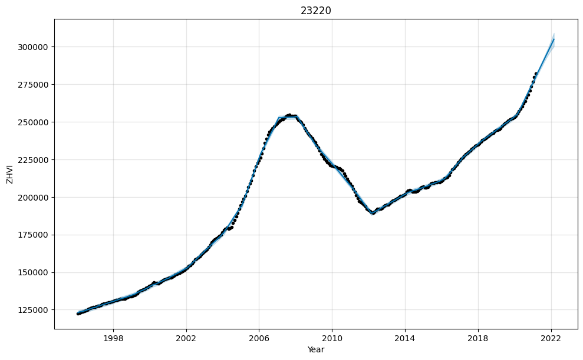
    

    
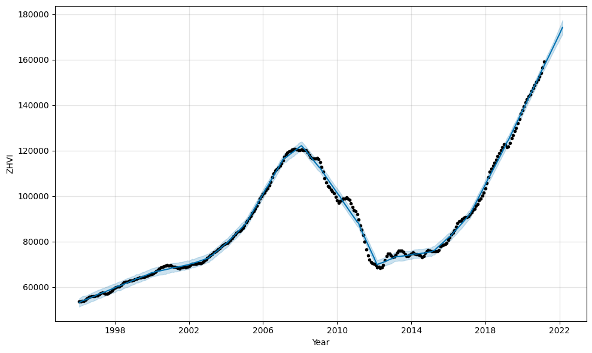
    

    
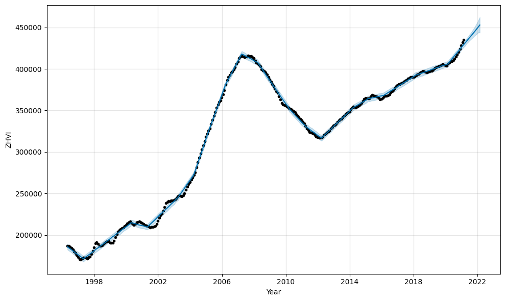
    

    
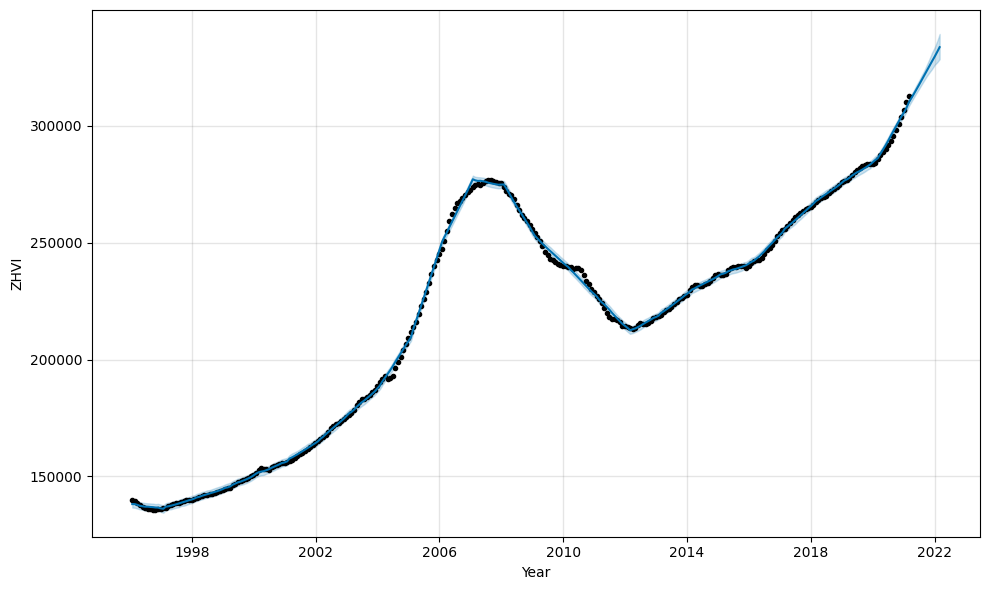
    

    
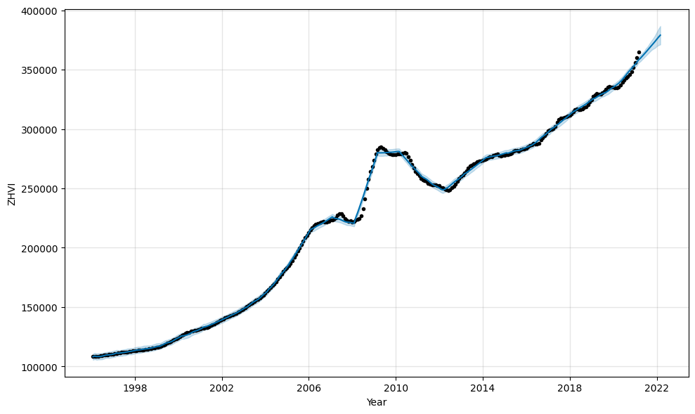
    

<table border="1" class="dataframe">
  <thead>
    <tr style="text-align: right;">
      <th></th>
      <th>ds</th>
      <th>trend</th>
      <th>yhat_lower</th>
      <th>yhat_upper</th>
      <th>trend_lower</th>
      <th>trend_upper</th>
      <th>additive_terms</th>
      <th>additive_terms_lower</th>
      <th>additive_terms_upper</th>
      <th>yearly</th>
      <th>yearly_lower</th>
      <th>yearly_upper</th>
      <th>multiplicative_terms</th>
      <th>multiplicative_terms_lower</th>
      <th>multiplicative_terms_upper</th>
      <th>yhat</th>
    </tr>
  </thead>
  <tbody>
    <tr>
      <th>0</th>
      <td>1996-04-30</td>
      <td>185783.779449</td>
      <td>182603.795702</td>
      <td>189370.853028</td>
      <td>185783.779449</td>
      <td>185783.779449</td>
      <td>136.723695</td>
      <td>136.723695</td>
      <td>136.723695</td>
      <td>136.723695</td>
      <td>136.723695</td>
      <td>136.723695</td>
      <td>0.0</td>
      <td>0.0</td>
      <td>0.0</td>
      <td>185920.503144</td>
    </tr>
    <tr>
      <th>1</th>
      <td>1996-05-31</td>
      <td>184561.501201</td>
      <td>181290.241678</td>
      <td>187957.946411</td>
      <td>184561.501201</td>
      <td>184561.501201</td>
      <td>104.198090</td>
      <td>104.198090</td>
      <td>104.198090</td>
      <td>104.198090</td>
      <td>104.198090</td>
      <td>104.198090</td>
      <td>0.0</td>
      <td>0.0</td>
      <td>0.0</td>
      <td>184665.699290</td>
    </tr>
    <tr>
      <th>2</th>
      <td>1996-06-30</td>
      <td>183378.651283</td>
      <td>180249.273715</td>
      <td>186873.587999</td>
      <td>183378.651283</td>
      <td>183378.651283</td>
      <td>181.754586</td>
      <td>181.754586</td>
      <td>181.754586</td>
      <td>181.754586</td>
      <td>181.754586</td>
      <td>181.754586</td>
      <td>0.0</td>
      <td>0.0</td>
      <td>0.0</td>
      <td>183560.405869</td>
    </tr>
    <tr>
      <th>3</th>
      <td>1996-07-31</td>
      <td>182156.373034</td>
      <td>179159.393042</td>
      <td>185761.935146</td>
      <td>182156.373034</td>
      <td>182156.373034</td>
      <td>199.453023</td>
      <td>199.453023</td>
      <td>199.453023</td>
      <td>199.453023</td>
      <td>199.453023</td>
      <td>199.453023</td>
      <td>0.0</td>
      <td>0.0</td>
      <td>0.0</td>
      <td>182355.826057</td>
    </tr>
    <tr>
      <th>4</th>
      <td>1996-08-31</td>
      <td>180934.094786</td>
      <td>177666.630629</td>
      <td>184454.052989</td>
      <td>180934.094786</td>
      <td>180934.094786</td>
      <td>131.759780</td>
      <td>131.759780</td>
      <td>131.759780</td>
      <td>131.759780</td>
      <td>131.759780</td>
      <td>131.759780</td>
      <td>0.0</td>
      <td>0.0</td>
      <td>0.0</td>
      <td>181065.854566</td>
    </tr>
    <tr>
      <th>...</th>
      <td>...</td>
      <td>...</td>
      <td>...</td>
      <td>...</td>
      <td>...</td>
      <td>...</td>
      <td>...</td>
      <td>...</td>
      <td>...</td>
      <td>...</td>
      <td>...</td>
      <td>...</td>
      <td>...</td>
      <td>...</td>
      <td>...</td>
      <td>...</td>
    </tr>
    <tr>
      <th>306</th>
      <td>2021-10-31</td>
      <td>444775.027880</td>
      <td>439770.148557</td>
      <td>449936.995081</td>
      <td>441217.539347</td>
      <td>448936.141222</td>
      <td>-5.034808</td>
      <td>-5.034808</td>
      <td>-5.034808</td>
      <td>-5.034808</td>
      <td>-5.034808</td>
      <td>-5.034808</td>
      <td>0.0</td>
      <td>0.0</td>
      <td>0.0</td>
      <td>444769.993072</td>
    </tr>
    <tr>
      <th>307</th>
      <td>2021-11-30</td>
      <td>446683.286116</td>
      <td>441149.903700</td>
      <td>452767.103652</td>
      <td>442160.380148</td>
      <td>451816.082200</td>
      <td>61.978316</td>
      <td>61.978316</td>
      <td>61.978316</td>
      <td>61.978316</td>
      <td>61.978316</td>
      <td>61.978316</td>
      <td>0.0</td>
      <td>0.0</td>
      <td>0.0</td>
      <td>446745.264432</td>
    </tr>
    <tr>
      <th>308</th>
      <td>2021-12-31</td>
      <td>448655.152959</td>
      <td>442453.758672</td>
      <td>455747.989496</td>
      <td>442863.330496</td>
      <td>454871.648411</td>
      <td>118.273481</td>
      <td>118.273481</td>
      <td>118.273481</td>
      <td>118.273481</td>
      <td>118.273481</td>
      <td>118.273481</td>
      <td>0.0</td>
      <td>0.0</td>
      <td>0.0</td>
      <td>448773.426441</td>
    </tr>
    <tr>
      <th>309</th>
      <td>2022-01-31</td>
      <td>450627.019803</td>
      <td>443968.668351</td>
      <td>458944.344111</td>
      <td>443965.773650</td>
      <td>458219.932912</td>
      <td>181.768109</td>
      <td>181.768109</td>
      <td>181.768109</td>
      <td>181.768109</td>
      <td>181.768109</td>
      <td>181.768109</td>
      <td>0.0</td>
      <td>0.0</td>
      <td>0.0</td>
      <td>450808.787911</td>
    </tr>
    <tr>
      <th>310</th>
      <td>2022-02-28</td>
      <td>452408.060822</td>
      <td>443502.888023</td>
      <td>462042.545768</td>
      <td>444610.579614</td>
      <td>461214.451109</td>
      <td>354.078349</td>
      <td>354.078349</td>
      <td>354.078349</td>
      <td>354.078349</td>
      <td>354.078349</td>
      <td>354.078349</td>
      <td>0.0</td>
      <td>0.0</td>
      <td>0.0</td>
      <td>452762.139172</td>
    </tr>
  </tbody>
</table>

311 rows × 16 columns

    452762.13917159644

    {'z23060': 4.125618739486284,
     'z23220': 5.92803090155111,
     'z23221': 6.708416571756773,
     'z23226': 4.781031120422989,
     'z23227': 2.766075725685958}

The Facebook Prophet models forecast 23220 with the highest return of 5.77% but 23060 is very close behind with 5.67. 23227 which did best in the SARIMA modeling is 3rd with 4.95.

<table border="1" class="dataframe">
  <thead>
    <tr style="text-align: right;">
      <th></th>
      <th>Zipcode</th>
      <th>Forecast_1_Year_%_Appreciation</th>
    </tr>
  </thead>
  <tbody>
    <tr>
      <th>2</th>
      <td>z23221</td>
      <td>6.708417</td>
    </tr>
    <tr>
      <th>1</th>
      <td>z23220</td>
      <td>5.928031</td>
    </tr>
    <tr>
      <th>3</th>
      <td>z23226</td>
      <td>4.781031</td>
    </tr>
    <tr>
      <th>0</th>
      <td>z23060</td>
      <td>4.125619</td>
    </tr>
    <tr>
      <th>4</th>
      <td>z23227</td>
      <td>2.766076</td>
    </tr>
  </tbody>
</table>

    
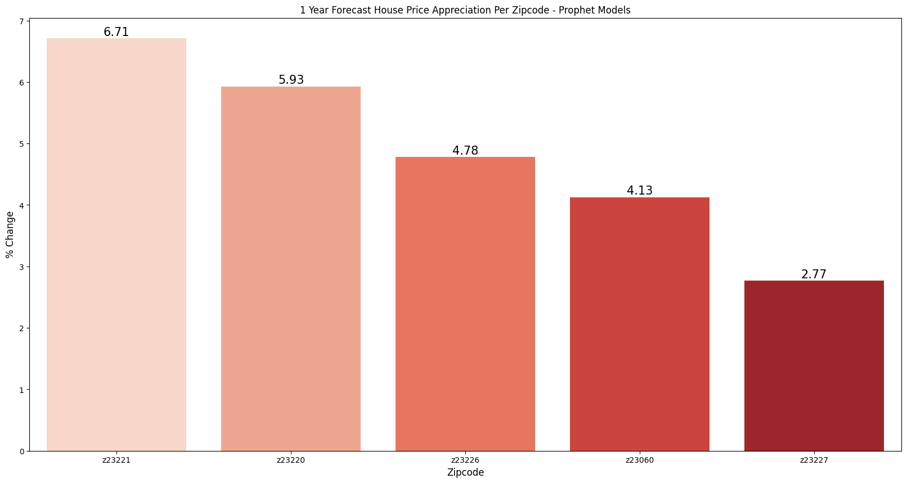
    

    
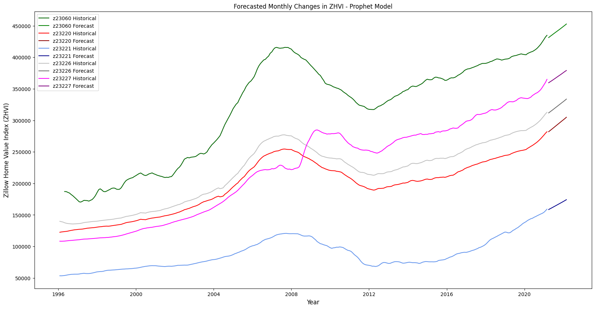
    

In general the Prophet model predicted much lower price appreciation than the SARIMA model. It seems the SARIMA model took the most recent trend and expanded on it while the Prophet model smoothed the trend more over the entire time dataset. The large difference further justify taking the average of the two. The below chart shows the difference in the SARIMA model vs the Prophet model for 23060 and 23227

<table border="1" class="dataframe">
  <thead>
    <tr style="text-align: right;">
      <th></th>
      <th>Zipcode</th>
      <th>Forecast_1_Year_%_Appreciation</th>
    </tr>
  </thead>
  <tbody>
    <tr>
      <th>1</th>
      <td>23112</td>
      <td>6.042253</td>
    </tr>
    <tr>
      <th>3</th>
      <td>23832</td>
      <td>4.083290</td>
    </tr>
    <tr>
      <th>4</th>
      <td>23238</td>
      <td>3.510792</td>
    </tr>
    <tr>
      <th>2</th>
      <td>23224</td>
      <td>3.305213</td>
    </tr>
    <tr>
      <th>0</th>
      <td>23120</td>
      <td>2.214792</td>
    </tr>
  </tbody>
</table>

<table border="1" class="dataframe">
  <thead>
    <tr style="text-align: right;">
      <th></th>
      <th>ZCTA5CE10</th>
      <th>GEOID10</th>
      <th>CLASSFP10</th>
      <th>MTFCC10</th>
      <th>FUNCSTAT10</th>
      <th>ALAND10</th>
      <th>AWATER10</th>
      <th>INTPTLAT10</th>
      <th>INTPTLON10</th>
      <th>geometry</th>
    </tr>
  </thead>
  <tbody>
    <tr>
      <th>0</th>
      <td>43451</td>
      <td>43451</td>
      <td>B5</td>
      <td>G6350</td>
      <td>S</td>
      <td>63484186</td>
      <td>157689</td>
      <td>+41.3183010</td>
      <td>-083.6174935</td>
      <td>POLYGON ((-83.70873 41.32733, -83.70815 41.327...</td>
    </tr>
    <tr>
      <th>1</th>
      <td>43452</td>
      <td>43452</td>
      <td>B5</td>
      <td>G6350</td>
      <td>S</td>
      <td>121522304</td>
      <td>13721730</td>
      <td>+41.5157923</td>
      <td>-082.9809454</td>
      <td>POLYGON ((-83.08698 41.53780, -83.08256 41.537...</td>
    </tr>
    <tr>
      <th>2</th>
      <td>43456</td>
      <td>43456</td>
      <td>B5</td>
      <td>G6350</td>
      <td>S</td>
      <td>9320975</td>
      <td>1003775</td>
      <td>+41.6318300</td>
      <td>-082.8393923</td>
      <td>MULTIPOLYGON (((-82.83558 41.71082, -82.83515 ...</td>
    </tr>
    <tr>
      <th>3</th>
      <td>43457</td>
      <td>43457</td>
      <td>B5</td>
      <td>G6350</td>
      <td>S</td>
      <td>48004681</td>
      <td>0</td>
      <td>+41.2673301</td>
      <td>-083.4274872</td>
      <td>POLYGON ((-83.49650 41.25371, -83.48382 41.253...</td>
    </tr>
    <tr>
      <th>4</th>
      <td>43458</td>
      <td>43458</td>
      <td>B5</td>
      <td>G6350</td>
      <td>S</td>
      <td>2573816</td>
      <td>39915</td>
      <td>+41.5304461</td>
      <td>-083.2133648</td>
      <td>POLYGON ((-83.22229 41.53102, -83.22228 41.532...</td>
    </tr>
  </tbody>
</table>

    0     23089
    1     23093
    2     23102
    3     23103
    4     23106
          ...  
    80    23038
    81    23039
    82    23047
    83    23059
    84    23060
    Name: GEOID10, Length: 85, dtype: int32

    Index(['ZCTA5CE10', 'Zipcode', 'CLASSFP10', 'MTFCC10', 'FUNCSTAT10', 'ALAND10',
           'AWATER10', 'INTPTLAT10', 'INTPTLON10', 'geometry'],
          dtype='object')

## Below code only to be used When modelling using full dataset to predict next one year till 2025. 

    00:21:59 - cmdstanpy - INFO - Chain [1] start processing
    00:21:59 - cmdstanpy - INFO - Chain [1] done processing
    00:21:59 - cmdstanpy - INFO - Chain [1] start processing
    00:21:59 - cmdstanpy - INFO - Chain [1] done processing
    00:22:00 - cmdstanpy - INFO - Chain [1] start processing
    00:22:00 - cmdstanpy - INFO - Chain [1] done processing
    00:22:00 - cmdstanpy - INFO - Chain [1] start processing
    00:22:00 - cmdstanpy - INFO - Chain [1] done processing
    00:22:00 - cmdstanpy - INFO - Chain [1] start processing
    00:22:00 - cmdstanpy - INFO - Chain [1] done processing
    00:22:01 - cmdstanpy - INFO - Chain [1] start processing
    00:22:01 - cmdstanpy - INFO - Chain [1] done processing
    00:22:01 - cmdstanpy - INFO - Chain [1] start processing
    00:22:01 - cmdstanpy - INFO - Chain [1] done processing
    00:22:01 - cmdstanpy - INFO - Chain [1] start processing
    00:22:02 - cmdstanpy - INFO - Chain [1] done processing
    00:22:02 - cmdstanpy - INFO - Chain [1] start processing
    00:22:02 - cmdstanpy - INFO - Chain [1] done processing
    00:22:02 - cmdstanpy - INFO - Chain [1] start processing
    00:22:02 - cmdstanpy - INFO - Chain [1] done processing
    00:22:02 - cmdstanpy - INFO - Chain [1] start processing
    00:22:03 - cmdstanpy - INFO - Chain [1] done processing
    00:22:03 - cmdstanpy - INFO - Chain [1] start processing
    00:22:03 - cmdstanpy - INFO - Chain [1] done processing
    00:22:03 - cmdstanpy - INFO - Chain [1] start processing
    00:22:03 - cmdstanpy - INFO - Chain [1] done processing
    00:22:03 - cmdstanpy - INFO - Chain [1] start processing
    00:22:04 - cmdstanpy - INFO - Chain [1] done processing
    00:22:04 - cmdstanpy - INFO - Chain [1] start processing
    00:22:04 - cmdstanpy - INFO - Chain [1] done processing
    00:22:04 - cmdstanpy - INFO - Chain [1] start processing
    00:22:04 - cmdstanpy - INFO - Chain [1] done processing
    00:22:05 - cmdstanpy - INFO - Chain [1] start processing
    00:22:05 - cmdstanpy - INFO - Chain [1] done processing
    00:22:05 - cmdstanpy - INFO - Chain [1] start processing
    00:22:05 - cmdstanpy - INFO - Chain [1] done processing
    00:22:05 - cmdstanpy - INFO - Chain [1] start processing
    00:22:05 - cmdstanpy - INFO - Chain [1] done processing
    00:22:06 - cmdstanpy - INFO - Chain [1] start processing
    00:22:06 - cmdstanpy - INFO - Chain [1] done processing
    00:22:06 - cmdstanpy - INFO - Chain [1] start processing
    00:22:06 - cmdstanpy - INFO - Chain [1] done processing
    

    Skipping zip code 23160 due to insufficient data.
    Skipping zip code 23173 due to insufficient data.
    

    00:22:06 - cmdstanpy - INFO - Chain [1] start processing
    00:22:06 - cmdstanpy - INFO - Chain [1] done processing
    00:22:07 - cmdstanpy - INFO - Chain [1] start processing
    00:22:07 - cmdstanpy - INFO - Chain [1] done processing
    00:22:07 - cmdstanpy - INFO - Chain [1] start processing
    00:22:07 - cmdstanpy - INFO - Chain [1] done processing
    00:22:07 - cmdstanpy - INFO - Chain [1] start processing
    00:22:07 - cmdstanpy - INFO - Chain [1] done processing
    00:22:08 - cmdstanpy - INFO - Chain [1] start processing
    00:22:08 - cmdstanpy - INFO - Chain [1] done processing
    00:22:08 - cmdstanpy - INFO - Chain [1] start processing
    00:22:08 - cmdstanpy - INFO - Chain [1] done processing
    00:22:08 - cmdstanpy - INFO - Chain [1] start processing
    00:22:08 - cmdstanpy - INFO - Chain [1] done processing
    00:22:08 - cmdstanpy - INFO - Chain [1] start processing
    00:22:09 - cmdstanpy - INFO - Chain [1] done processing
    00:22:09 - cmdstanpy - INFO - Chain [1] start processing
    00:22:09 - cmdstanpy - INFO - Chain [1] done processing
    00:22:09 - cmdstanpy - INFO - Chain [1] start processing
    00:22:09 - cmdstanpy - INFO - Chain [1] done processing
    00:22:09 - cmdstanpy - INFO - Chain [1] start processing
    00:22:10 - cmdstanpy - INFO - Chain [1] done processing
    00:22:10 - cmdstanpy - INFO - Chain [1] start processing
    00:22:10 - cmdstanpy - INFO - Chain [1] done processing
    00:22:10 - cmdstanpy - INFO - Chain [1] start processing
    00:22:10 - cmdstanpy - INFO - Chain [1] done processing
    00:22:10 - cmdstanpy - INFO - Chain [1] start processing
    00:22:10 - cmdstanpy - INFO - Chain [1] done processing
    00:22:11 - cmdstanpy - INFO - Chain [1] start processing
    00:22:11 - cmdstanpy - INFO - Chain [1] done processing
    00:22:11 - cmdstanpy - INFO - Chain [1] start processing
    00:22:11 - cmdstanpy - INFO - Chain [1] done processing
    00:22:11 - cmdstanpy - INFO - Chain [1] start processing
    00:22:11 - cmdstanpy - INFO - Chain [1] done processing
    00:22:12 - cmdstanpy - INFO - Chain [1] start processing
    00:22:12 - cmdstanpy - INFO - Chain [1] done processing
    00:22:12 - cmdstanpy - INFO - Chain [1] start processing
    00:22:12 - cmdstanpy - INFO - Chain [1] done processing
    

    Skipping zip code 23250 due to insufficient data.
    

    00:22:12 - cmdstanpy - INFO - Chain [1] start processing
    00:22:12 - cmdstanpy - INFO - Chain [1] done processing
    00:22:13 - cmdstanpy - INFO - Chain [1] start processing
    00:22:13 - cmdstanpy - INFO - Chain [1] done processing
    00:22:13 - cmdstanpy - INFO - Chain [1] start processing
    00:22:13 - cmdstanpy - INFO - Chain [1] done processing
    00:22:13 - cmdstanpy - INFO - Chain [1] start processing
    00:22:13 - cmdstanpy - INFO - Chain [1] done processing
    00:22:14 - cmdstanpy - INFO - Chain [1] start processing
    00:22:14 - cmdstanpy - INFO - Chain [1] done processing
    00:22:14 - cmdstanpy - INFO - Chain [1] start processing
    00:22:14 - cmdstanpy - INFO - Chain [1] done processing
    00:22:14 - cmdstanpy - INFO - Chain [1] start processing
    00:22:14 - cmdstanpy - INFO - Chain [1] done processing
    00:22:15 - cmdstanpy - INFO - Chain [1] start processing
    00:22:15 - cmdstanpy - INFO - Chain [1] done processing
    00:22:15 - cmdstanpy - INFO - Chain [1] start processing
    00:22:15 - cmdstanpy - INFO - Chain [1] done processing
    00:22:15 - cmdstanpy - INFO - Chain [1] start processing
    00:22:15 - cmdstanpy - INFO - Chain [1] done processing
    00:22:16 - cmdstanpy - INFO - Chain [1] start processing
    00:22:16 - cmdstanpy - INFO - Chain [1] done processing
    00:22:16 - cmdstanpy - INFO - Chain [1] start processing
    00:22:16 - cmdstanpy - INFO - Chain [1] done processing
    00:22:16 - cmdstanpy - INFO - Chain [1] start processing
    00:22:16 - cmdstanpy - INFO - Chain [1] done processing
    00:22:17 - cmdstanpy - INFO - Chain [1] start processing
    00:22:17 - cmdstanpy - INFO - Chain [1] done processing
    00:22:17 - cmdstanpy - INFO - Chain [1] start processing
    

    Skipping zip code 23801 due to insufficient data.
    

    00:22:17 - cmdstanpy - INFO - Chain [1] done processing
    00:22:17 - cmdstanpy - INFO - Chain [1] start processing
    00:22:17 - cmdstanpy - INFO - Chain [1] done processing
    00:22:18 - cmdstanpy - INFO - Chain [1] start processing
    

    Skipping zip code 23806 due to insufficient data.
    

    00:22:18 - cmdstanpy - INFO - Chain [1] done processing
    00:22:18 - cmdstanpy - INFO - Chain [1] start processing
    00:22:18 - cmdstanpy - INFO - Chain [1] done processing
    00:22:18 - cmdstanpy - INFO - Chain [1] start processing
    00:22:18 - cmdstanpy - INFO - Chain [1] done processing
    00:22:19 - cmdstanpy - INFO - Chain [1] start processing
    00:22:19 - cmdstanpy - INFO - Chain [1] done processing
    00:22:19 - cmdstanpy - INFO - Chain [1] start processing
    00:22:19 - cmdstanpy - INFO - Chain [1] done processing
    00:22:19 - cmdstanpy - INFO - Chain [1] start processing
    00:22:19 - cmdstanpy - INFO - Chain [1] done processing
    00:22:20 - cmdstanpy - INFO - Chain [1] start processing
    00:22:20 - cmdstanpy - INFO - Chain [1] done processing
    00:22:20 - cmdstanpy - INFO - Chain [1] start processing
    00:22:20 - cmdstanpy - INFO - Chain [1] done processing
    00:22:20 - cmdstanpy - INFO - Chain [1] start processing
    00:22:20 - cmdstanpy - INFO - Chain [1] done processing
    00:22:21 - cmdstanpy - INFO - Chain [1] start processing
    00:22:21 - cmdstanpy - INFO - Chain [1] done processing
    00:22:21 - cmdstanpy - INFO - Chain [1] start processing
    00:22:21 - cmdstanpy - INFO - Chain [1] done processing
    00:22:21 - cmdstanpy - INFO - Chain [1] start processing
    

    Error fitting model for zip code 23894: Dataframe has less than 2 non-NaN rows.
    Skipping zip code 23894 due to model fitting errors.
    

    00:22:21 - cmdstanpy - INFO - Chain [1] done processing
    00:22:22 - cmdstanpy - INFO - Chain [1] start processing
    00:22:22 - cmdstanpy - INFO - Chain [1] done processing
    00:22:22 - cmdstanpy - INFO - Chain [1] start processing
    00:22:22 - cmdstanpy - INFO - Chain [1] done processing
    00:22:22 - cmdstanpy - INFO - Chain [1] start processing
    00:22:23 - cmdstanpy - INFO - Chain [1] done processing
    00:22:23 - cmdstanpy - INFO - Chain [1] start processing
    00:22:23 - cmdstanpy - INFO - Chain [1] done processing
    00:22:23 - cmdstanpy - INFO - Chain [1] start processing
    00:22:23 - cmdstanpy - INFO - Chain [1] done processing
    00:22:23 - cmdstanpy - INFO - Chain [1] start processing
    00:22:23 - cmdstanpy - INFO - Chain [1] done processing
    00:22:24 - cmdstanpy - INFO - Chain [1] start processing
    00:22:24 - cmdstanpy - INFO - Chain [1] done processing
    00:22:24 - cmdstanpy - INFO - Chain [1] start processing
    00:22:24 - cmdstanpy - INFO - Chain [1] done processing
    00:22:24 - cmdstanpy - INFO - Chain [1] start processing
    00:22:24 - cmdstanpy - INFO - Chain [1] done processing
    00:22:25 - cmdstanpy - INFO - Chain [1] start processing
    00:22:25 - cmdstanpy - INFO - Chain [1] done processing
    00:22:25 - cmdstanpy - INFO - Chain [1] start processing
    00:22:25 - cmdstanpy - INFO - Chain [1] done processing
    

# Final Script for Facebook Prophet Model down below -

    04:42:30 - cmdstanpy - INFO - Chain [1] start processing
    04:42:30 - cmdstanpy - INFO - Chain [1] done processing
    04:42:30 - cmdstanpy - INFO - Chain [1] start processing
    04:42:31 - cmdstanpy - INFO - Chain [1] done processing
    04:42:31 - cmdstanpy - INFO - Chain [1] start processing
    04:42:31 - cmdstanpy - INFO - Chain [1] done processing
    04:42:31 - cmdstanpy - INFO - Chain [1] start processing
    04:42:31 - cmdstanpy - INFO - Chain [1] done processing
    04:42:31 - cmdstanpy - INFO - Chain [1] start processing
    04:42:31 - cmdstanpy - INFO - Chain [1] done processing
    04:42:32 - cmdstanpy - INFO - Chain [1] start processing
    04:42:32 - cmdstanpy - INFO - Chain [1] done processing
    04:42:32 - cmdstanpy - INFO - Chain [1] start processing
    04:42:32 - cmdstanpy - INFO - Chain [1] done processing
    04:42:32 - cmdstanpy - INFO - Chain [1] start processing
    04:42:32 - cmdstanpy - INFO - Chain [1] done processing
    04:42:33 - cmdstanpy - INFO - Chain [1] start processing
    04:42:33 - cmdstanpy - INFO - Chain [1] done processing
    04:42:33 - cmdstanpy - INFO - Chain [1] start processing
    04:42:33 - cmdstanpy - INFO - Chain [1] done processing
    04:42:33 - cmdstanpy - INFO - Chain [1] start processing
    04:42:33 - cmdstanpy - INFO - Chain [1] done processing
    04:42:33 - cmdstanpy - INFO - Chain [1] start processing
    04:42:33 - cmdstanpy - INFO - Chain [1] done processing
    04:42:34 - cmdstanpy - INFO - Chain [1] start processing
    04:42:34 - cmdstanpy - INFO - Chain [1] done processing
    04:42:34 - cmdstanpy - INFO - Chain [1] start processing
    04:42:34 - cmdstanpy - INFO - Chain [1] done processing
    04:42:34 - cmdstanpy - INFO - Chain [1] start processing
    04:42:35 - cmdstanpy - INFO - Chain [1] done processing
    04:42:35 - cmdstanpy - INFO - Chain [1] start processing
    04:42:35 - cmdstanpy - INFO - Chain [1] done processing
    04:42:35 - cmdstanpy - INFO - Chain [1] start processing
    04:42:35 - cmdstanpy - INFO - Chain [1] done processing
    04:42:35 - cmdstanpy - INFO - Chain [1] start processing
    04:42:35 - cmdstanpy - INFO - Chain [1] done processing
    04:42:36 - cmdstanpy - INFO - Chain [1] start processing
    04:42:36 - cmdstanpy - INFO - Chain [1] done processing
    04:42:36 - cmdstanpy - INFO - Chain [1] start processing
    04:42:36 - cmdstanpy - INFO - Chain [1] done processing
    04:42:36 - cmdstanpy - INFO - Chain [1] start processing
    04:42:36 - cmdstanpy - INFO - Chain [1] done processing
    

    Skipping zip code 23160 due to insufficient data.
    Skipping zip code 23173 due to insufficient data.
    

    04:42:36 - cmdstanpy - INFO - Chain [1] start processing
    04:42:37 - cmdstanpy - INFO - Chain [1] done processing
    04:42:37 - cmdstanpy - INFO - Chain [1] start processing
    04:42:37 - cmdstanpy - INFO - Chain [1] done processing
    04:42:37 - cmdstanpy - INFO - Chain [1] start processing
    04:42:37 - cmdstanpy - INFO - Chain [1] done processing
    04:42:37 - cmdstanpy - INFO - Chain [1] start processing
    04:42:37 - cmdstanpy - INFO - Chain [1] done processing
    04:42:38 - cmdstanpy - INFO - Chain [1] start processing
    04:42:38 - cmdstanpy - INFO - Chain [1] done processing
    04:42:38 - cmdstanpy - INFO - Chain [1] start processing
    04:42:38 - cmdstanpy - INFO - Chain [1] done processing
    04:42:38 - cmdstanpy - INFO - Chain [1] start processing
    04:42:38 - cmdstanpy - INFO - Chain [1] done processing
    04:42:38 - cmdstanpy - INFO - Chain [1] start processing
    04:42:39 - cmdstanpy - INFO - Chain [1] done processing
    04:42:39 - cmdstanpy - INFO - Chain [1] start processing
    04:42:39 - cmdstanpy - INFO - Chain [1] done processing
    04:42:39 - cmdstanpy - INFO - Chain [1] start processing
    04:42:39 - cmdstanpy - INFO - Chain [1] done processing
    04:42:39 - cmdstanpy - INFO - Chain [1] start processing
    04:42:40 - cmdstanpy - INFO - Chain [1] done processing
    04:42:40 - cmdstanpy - INFO - Chain [1] start processing
    04:42:40 - cmdstanpy - INFO - Chain [1] done processing
    04:42:40 - cmdstanpy - INFO - Chain [1] start processing
    04:42:40 - cmdstanpy - INFO - Chain [1] done processing
    04:42:40 - cmdstanpy - INFO - Chain [1] start processing
    04:42:40 - cmdstanpy - INFO - Chain [1] done processing
    04:42:41 - cmdstanpy - INFO - Chain [1] start processing
    04:42:41 - cmdstanpy - INFO - Chain [1] done processing
    04:42:41 - cmdstanpy - INFO - Chain [1] start processing
    04:42:41 - cmdstanpy - INFO - Chain [1] done processing
    04:42:41 - cmdstanpy - INFO - Chain [1] start processing
    04:42:41 - cmdstanpy - INFO - Chain [1] done processing
    04:42:42 - cmdstanpy - INFO - Chain [1] start processing
    04:42:42 - cmdstanpy - INFO - Chain [1] done processing
    04:42:42 - cmdstanpy - INFO - Chain [1] start processing
    

    Skipping zip code 23250 due to insufficient data.
    

    04:42:42 - cmdstanpy - INFO - Chain [1] done processing
    04:42:42 - cmdstanpy - INFO - Chain [1] start processing
    04:42:42 - cmdstanpy - INFO - Chain [1] done processing
    04:42:42 - cmdstanpy - INFO - Chain [1] start processing
    04:42:42 - cmdstanpy - INFO - Chain [1] done processing
    04:42:43 - cmdstanpy - INFO - Chain [1] start processing
    04:42:43 - cmdstanpy - INFO - Chain [1] done processing
    04:42:43 - cmdstanpy - INFO - Chain [1] start processing
    04:42:43 - cmdstanpy - INFO - Chain [1] done processing
    04:42:43 - cmdstanpy - INFO - Chain [1] start processing
    04:42:43 - cmdstanpy - INFO - Chain [1] done processing
    04:42:44 - cmdstanpy - INFO - Chain [1] start processing
    04:42:44 - cmdstanpy - INFO - Chain [1] done processing
    04:42:44 - cmdstanpy - INFO - Chain [1] start processing
    04:42:44 - cmdstanpy - INFO - Chain [1] done processing
    04:42:44 - cmdstanpy - INFO - Chain [1] start processing
    04:42:44 - cmdstanpy - INFO - Chain [1] done processing
    04:42:45 - cmdstanpy - INFO - Chain [1] start processing
    04:42:45 - cmdstanpy - INFO - Chain [1] done processing
    04:42:45 - cmdstanpy - INFO - Chain [1] start processing
    04:42:45 - cmdstanpy - INFO - Chain [1] done processing
    04:42:45 - cmdstanpy - INFO - Chain [1] start processing
    04:42:45 - cmdstanpy - INFO - Chain [1] done processing
    04:42:45 - cmdstanpy - INFO - Chain [1] start processing
    04:42:46 - cmdstanpy - INFO - Chain [1] done processing
    04:42:46 - cmdstanpy - INFO - Chain [1] start processing
    04:42:46 - cmdstanpy - INFO - Chain [1] done processing
    04:42:46 - cmdstanpy - INFO - Chain [1] start processing
    04:42:46 - cmdstanpy - INFO - Chain [1] done processing
    04:42:46 - cmdstanpy - INFO - Chain [1] start processing
    

    Skipping zip code 23801 due to insufficient data.
    

    04:42:46 - cmdstanpy - INFO - Chain [1] done processing
    04:42:47 - cmdstanpy - INFO - Chain [1] start processing
    04:42:47 - cmdstanpy - INFO - Chain [1] done processing
    04:42:47 - cmdstanpy - INFO - Chain [1] start processing
    04:42:47 - cmdstanpy - INFO - Chain [1] done processing
    

    Skipping zip code 23806 due to insufficient data.
    

    04:42:47 - cmdstanpy - INFO - Chain [1] start processing
    04:42:47 - cmdstanpy - INFO - Chain [1] done processing
    04:42:47 - cmdstanpy - INFO - Chain [1] start processing
    04:42:47 - cmdstanpy - INFO - Chain [1] done processing
    04:42:48 - cmdstanpy - INFO - Chain [1] start processing
    04:42:48 - cmdstanpy - INFO - Chain [1] done processing
    04:42:48 - cmdstanpy - INFO - Chain [1] start processing
    04:42:48 - cmdstanpy - INFO - Chain [1] done processing
    04:42:48 - cmdstanpy - INFO - Chain [1] start processing
    04:42:48 - cmdstanpy - INFO - Chain [1] done processing
    04:42:49 - cmdstanpy - INFO - Chain [1] start processing
    04:42:49 - cmdstanpy - INFO - Chain [1] done processing
    04:42:49 - cmdstanpy - INFO - Chain [1] start processing
    04:42:49 - cmdstanpy - INFO - Chain [1] done processing
    04:42:49 - cmdstanpy - INFO - Chain [1] start processing
    04:42:49 - cmdstanpy - INFO - Chain [1] done processing
    04:42:50 - cmdstanpy - INFO - Chain [1] start processing
    04:42:50 - cmdstanpy - INFO - Chain [1] done processing
    04:42:50 - cmdstanpy - INFO - Chain [1] start processing
    04:42:50 - cmdstanpy - INFO - Chain [1] done processing
    04:42:50 - cmdstanpy - INFO - Chain [1] start processing
    

    Error fitting model for zip code 23894: Dataframe has less than 2 non-NaN rows.
    Skipping zip code 23894 due to model fitting errors.
    

    04:42:50 - cmdstanpy - INFO - Chain [1] done processing
    04:42:51 - cmdstanpy - INFO - Chain [1] start processing
    04:42:51 - cmdstanpy - INFO - Chain [1] done processing
    04:42:51 - cmdstanpy - INFO - Chain [1] start processing
    04:42:51 - cmdstanpy - INFO - Chain [1] done processing
    04:42:51 - cmdstanpy - INFO - Chain [1] start processing
    04:42:51 - cmdstanpy - INFO - Chain [1] done processing
    04:42:51 - cmdstanpy - INFO - Chain [1] start processing
    04:42:51 - cmdstanpy - INFO - Chain [1] done processing
    04:42:52 - cmdstanpy - INFO - Chain [1] start processing
    04:42:52 - cmdstanpy - INFO - Chain [1] done processing
    04:42:52 - cmdstanpy - INFO - Chain [1] start processing
    04:42:52 - cmdstanpy - INFO - Chain [1] done processing
    04:42:52 - cmdstanpy - INFO - Chain [1] start processing
    04:42:52 - cmdstanpy - INFO - Chain [1] done processing
    04:42:52 - cmdstanpy - INFO - Chain [1] start processing
    04:42:52 - cmdstanpy - INFO - Chain [1] done processing
    04:42:53 - cmdstanpy - INFO - Chain [1] start processing
    04:42:53 - cmdstanpy - INFO - Chain [1] done processing
    04:42:53 - cmdstanpy - INFO - Chain [1] start processing
    04:42:53 - cmdstanpy - INFO - Chain [1] done processing
    04:42:54 - cmdstanpy - INFO - Chain [1] start processing
    04:42:54 - cmdstanpy - INFO - Chain [1] done processing
    

<table border="1" class="dataframe">
  <thead>
    <tr style="text-align: right;">
      <th></th>
      <th>Zipcode</th>
      <th>Test_RMSE</th>
    </tr>
  </thead>
  <tbody>
    <tr>
      <th>72</th>
      <td>23027</td>
      <td>3433.836886</td>
    </tr>
    <tr>
      <th>12</th>
      <td>23124</td>
      <td>3848.611566</td>
    </tr>
    <tr>
      <th>6</th>
      <td>23112</td>
      <td>4309.923853</td>
    </tr>
    <tr>
      <th>1</th>
      <td>23093</td>
      <td>4540.602838</td>
    </tr>
    <tr>
      <th>46</th>
      <td>23836</td>
      <td>7410.315498</td>
    </tr>
    <tr>
      <th>...</th>
      <td>...</td>
      <td>...</td>
    </tr>
    <tr>
      <th>55</th>
      <td>23805</td>
      <td>42816.272621</td>
    </tr>
    <tr>
      <th>7</th>
      <td>23113</td>
      <td>42830.153317</td>
    </tr>
    <tr>
      <th>54</th>
      <td>23803</td>
      <td>46037.057487</td>
    </tr>
    <tr>
      <th>3</th>
      <td>23103</td>
      <td>61434.293197</td>
    </tr>
    <tr>
      <th>13</th>
      <td>23129</td>
      <td>133162.426773</td>
    </tr>
  </tbody>
</table>

79 rows × 2 columns

<table border="1" class="dataframe">
  <thead>
    <tr style="text-align: right;">
      <th></th>
      <th>Zipcode</th>
      <th>Forecast_1_Year_%_Appreciation</th>
    </tr>
  </thead>
  <tbody>
    <tr>
      <th>54</th>
      <td>23803</td>
      <td>37.351818</td>
    </tr>
    <tr>
      <th>51</th>
      <td>23860</td>
      <td>33.971365</td>
    </tr>
    <tr>
      <th>25</th>
      <td>23224</td>
      <td>33.012472</td>
    </tr>
    <tr>
      <th>55</th>
      <td>23805</td>
      <td>29.543412</td>
    </tr>
    <tr>
      <th>66</th>
      <td>23222</td>
      <td>26.866006</td>
    </tr>
    <tr>
      <th>...</th>
      <td>...</td>
      <td>...</td>
    </tr>
    <tr>
      <th>65</th>
      <td>23221</td>
      <td>-13.035976</td>
    </tr>
    <tr>
      <th>7</th>
      <td>23113</td>
      <td>-14.494654</td>
    </tr>
    <tr>
      <th>19</th>
      <td>23153</td>
      <td>-16.064256</td>
    </tr>
    <tr>
      <th>3</th>
      <td>23103</td>
      <td>-17.969845</td>
    </tr>
    <tr>
      <th>13</th>
      <td>23129</td>
      <td>-40.067603</td>
    </tr>
  </tbody>
</table>

79 rows × 2 columns

<table border="1" class="dataframe">
  <thead>
    <tr style="text-align: right;">
      <th></th>
      <th>Zipcode</th>
      <th>Test_RMSE</th>
    </tr>
  </thead>
  <tbody>
    <tr>
      <th>72</th>
      <td>23027</td>
      <td>3433.836886</td>
    </tr>
    <tr>
      <th>12</th>
      <td>23124</td>
      <td>3848.611566</td>
    </tr>
    <tr>
      <th>6</th>
      <td>23112</td>
      <td>4309.923853</td>
    </tr>
    <tr>
      <th>1</th>
      <td>23093</td>
      <td>4540.602838</td>
    </tr>
    <tr>
      <th>46</th>
      <td>23836</td>
      <td>7410.315498</td>
    </tr>
    <tr>
      <th>...</th>
      <td>...</td>
      <td>...</td>
    </tr>
    <tr>
      <th>55</th>
      <td>23805</td>
      <td>42816.272621</td>
    </tr>
    <tr>
      <th>7</th>
      <td>23113</td>
      <td>42830.153317</td>
    </tr>
    <tr>
      <th>54</th>
      <td>23803</td>
      <td>46037.057487</td>
    </tr>
    <tr>
      <th>3</th>
      <td>23103</td>
      <td>61434.293197</td>
    </tr>
    <tr>
      <th>13</th>
      <td>23129</td>
      <td>133162.426773</td>
    </tr>
  </tbody>
</table>

79 rows × 2 columns

<table border="1" class="dataframe">
  <thead>
    <tr style="text-align: right;">
      <th></th>
      <th>Zipcode</th>
      <th>Forecast_1_Year_%_Appreciation</th>
    </tr>
  </thead>
  <tbody>
    <tr>
      <th>54</th>
      <td>23803</td>
      <td>37.351818</td>
    </tr>
    <tr>
      <th>51</th>
      <td>23860</td>
      <td>33.971365</td>
    </tr>
    <tr>
      <th>25</th>
      <td>23224</td>
      <td>33.012472</td>
    </tr>
    <tr>
      <th>55</th>
      <td>23805</td>
      <td>29.543412</td>
    </tr>
    <tr>
      <th>66</th>
      <td>23222</td>
      <td>26.866006</td>
    </tr>
    <tr>
      <th>...</th>
      <td>...</td>
      <td>...</td>
    </tr>
    <tr>
      <th>65</th>
      <td>23221</td>
      <td>-13.035976</td>
    </tr>
    <tr>
      <th>7</th>
      <td>23113</td>
      <td>-14.494654</td>
    </tr>
    <tr>
      <th>19</th>
      <td>23153</td>
      <td>-16.064256</td>
    </tr>
    <tr>
      <th>3</th>
      <td>23103</td>
      <td>-17.969845</td>
    </tr>
    <tr>
      <th>13</th>
      <td>23129</td>
      <td>-40.067603</td>
    </tr>
  </tbody>
</table>

79 rows × 2 columns

           Zillow Home Value Index (ZHVI)  financial_crisis_flag
    count                      288.000000             288.000000
    mean                    252146.304259               0.243056
    std                      60113.809942               0.429675
    min                     151144.556713               0.000000
    25%                     217586.898973               0.000000
    50%                     245289.583650               0.000000
    75%                     272453.584408               0.000000
    max                     410534.627066               1.000000
    

                Zipcode  Forecast_1_Year_%_Appreciation
    count     79.000000                       79.000000
    mean   23293.974684                        5.756523
    std      314.831822                       12.368136
    min    22546.000000                      -40.067603
    25%    23102.500000                        0.708942
    50%    23188.000000                        4.707711
    75%    23237.500000                       11.068075
    max    23885.000000                       37.351818
    

                Zipcode      Test_RMSE
    count     79.000000      79.000000
    mean   23293.974684   21574.168083
    std      314.831822   16924.321161
    min    22546.000000    3433.836886
    25%    23102.500000   12261.911678
    50%    23188.000000   17351.694692
    75%    23237.500000   27632.790863
    max    23885.000000  133162.426773
    

    <class 'pandas.core.frame.DataFrame'>
    Int64Index: 79 entries, 72 to 13
    Data columns (total 2 columns):
     #   Column     Non-Null Count  Dtype  
    ---  ------     --------------  -----  
     0   Zipcode    79 non-null     int64  
     1   Test_RMSE  79 non-null     float64
    dtypes: float64(1), int64(1)
    memory usage: 1.9 KB
    None
    

    Index(['ZCTA5CE10', 'Zipcode', 'CLASSFP10', 'MTFCC10', 'FUNCSTAT10', 'ALAND10',
           'AWATER10', 'INTPTLAT10', 'INTPTLON10', 'geometry'],
          dtype='object')

    Index(['Zipcode', 'Forecast_1_Year_%_Appreciation'], dtype='object')

    (33144, 10)

    dtype('int32')

    dtype('int64')

    
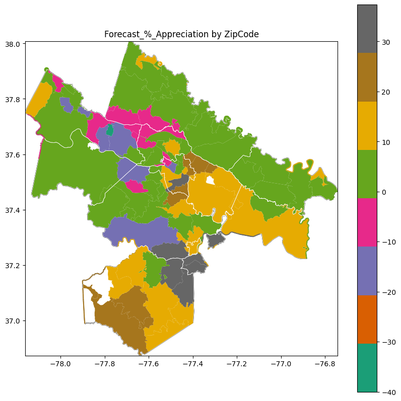
    

    
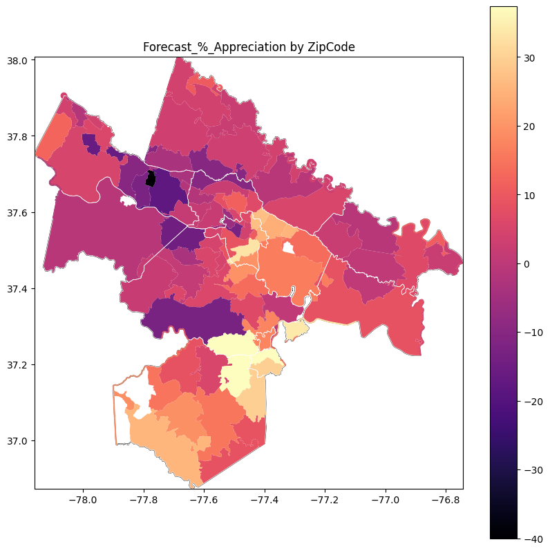
    

    
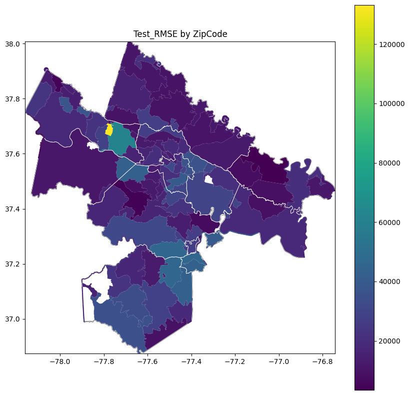
    

    
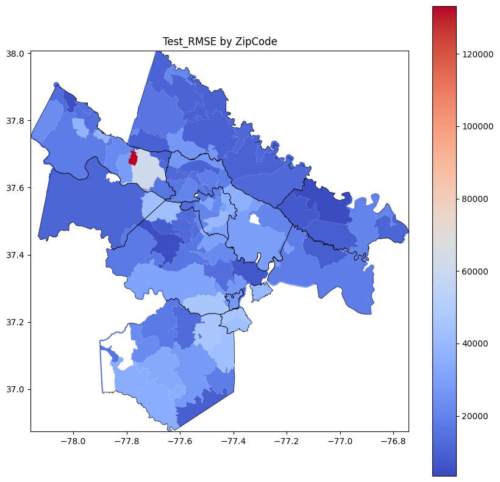
    

    No artists with labels found to put in legend.  Note that artists whose label start with an underscore are ignored when legend() is called with no argument.
    

    
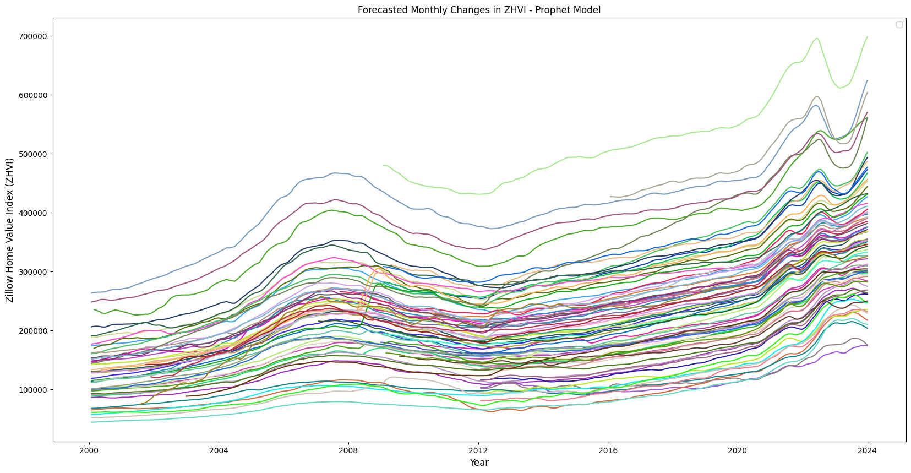
    

    0     23089
    1     23093
    2     23102
    3     23103
    4     23106
          ...  
    80    23038
    81    23039
    82    23047
    83    23059
    84    23060
    Name: GEOID10, Length: 85, dtype: int32

    2024-01-01
    

    '2024-01-01'

    '2023-01-01'

    No artists with labels found to put in legend.  Note that artists whose label start with an underscore are ignored when legend() is called with no argument.
    

    
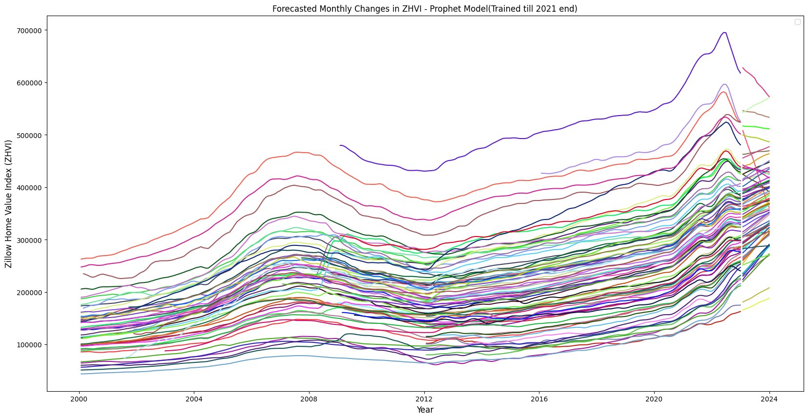
    

    No artists with labels found to put in legend.  Note that artists whose label start with an underscore are ignored when legend() is called with no argument.
    

    
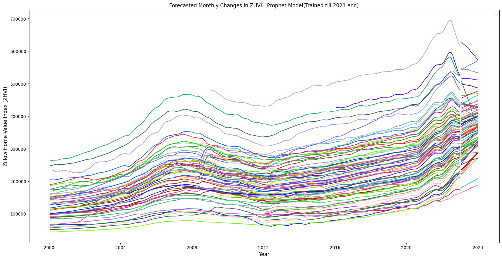
    

    
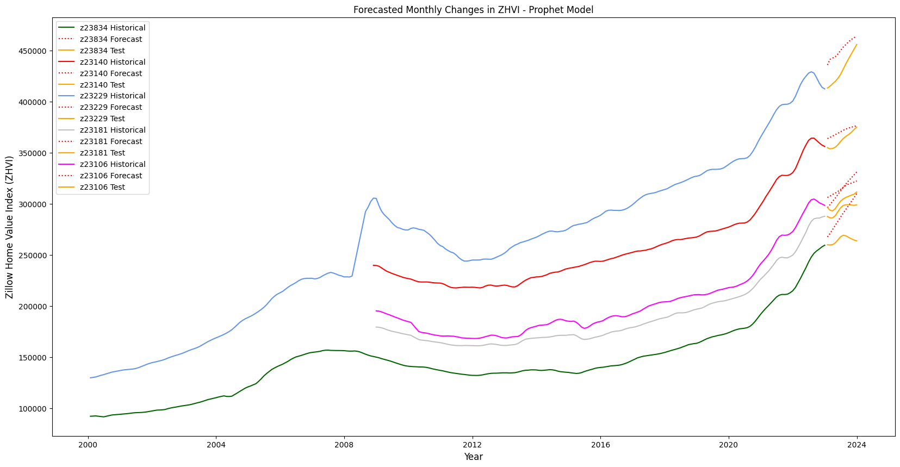
    

    {23089:            ds          trend     yhat_lower     yhat_upper    trend_lower  \
     0  2023-01-31  369620.662748  367107.878087  371943.133886  369620.662748   
     1  2023-02-28  372138.921634  370053.114913  375027.014587  372138.921634   
     2  2023-03-31  374926.993973  372570.942048  377995.884882  374898.333297   
     3  2023-04-30  377625.128494  375140.516699  380812.598468  377306.942056   
     4  2023-05-31  380413.200833  377953.232759  383815.469289  379850.964367   
     5  2023-06-30  383111.335354  380449.563645  386360.346843  382187.798757   
     6  2023-07-31  385899.407693  383160.845417  389589.007134  384494.243480   
     7  2023-08-31  388687.480031  385866.814799  392591.493120  386849.053704   
     8  2023-09-30  391385.614552  387947.316275  395868.535560  388903.078100   
     9  2023-10-31  394173.686891  389962.557755  398458.080464  390932.178218   
     10 2023-11-30  396871.821412  392081.209324  401354.733160  392878.439696   
     11 2023-12-31  399659.893751  394259.015813  404515.482362  395018.577836   
     
           trend_upper  additive_terms  additive_terms_lower  additive_terms_upper  \
     0   369620.662748     -219.777687           -219.777687           -219.777687   
     1   372138.921634      393.880438            393.880438            393.880438   
     2   375012.946453      391.715118            391.715118            391.715118   
     3   377984.382531      369.195507            369.195507            369.195507   
     4   381066.163713      258.234016            258.234016            258.234016   
     5   384227.227156      346.951791            346.951791            346.951791   
     6   387507.562298      428.782232            428.782232            428.782232   
     7   390796.581193      479.429625            479.429625            479.429625   
     8   394111.168910      336.234941            336.234941            336.234941   
     9   397609.647201      -93.057266            -93.057266            -93.057266   
     10  400994.190398     -592.783231           -592.783231           -592.783231   
     11  404476.289618     -901.846087           -901.846087           -901.846087   
     
             yearly  yearly_lower  yearly_upper  multiplicative_terms  \
     0  -219.777687   -219.777687   -219.777687                   0.0   
     1   393.880438    393.880438    393.880438                   0.0   
     2   391.715118    391.715118    391.715118                   0.0   
     3   369.195507    369.195507    369.195507                   0.0   
     4   258.234016    258.234016    258.234016                   0.0   
     5   346.951791    346.951791    346.951791                   0.0   
     6   428.782232    428.782232    428.782232                   0.0   
     7   479.429625    479.429625    479.429625                   0.0   
     8   336.234941    336.234941    336.234941                   0.0   
     9   -93.057266    -93.057266    -93.057266                   0.0   
     10 -592.783231   -592.783231   -592.783231                   0.0   
     11 -901.846087   -901.846087   -901.846087                   0.0   
     
         multiplicative_terms_lower  multiplicative_terms_upper           yhat  
     0                          0.0                         0.0  369400.885061  
     1                          0.0                         0.0  372532.802073  
     2                          0.0                         0.0  375318.709091  
     3                          0.0                         0.0  377994.324001  
     4                          0.0                         0.0  380671.434848  
     5                          0.0                         0.0  383458.287145  
     6                          0.0                         0.0  386328.189925  
     7                          0.0                         0.0  389166.909657  
     8                          0.0                         0.0  391721.849494  
     9                          0.0                         0.0  394080.629625  
     10                         0.0                         0.0  396279.038182  
     11                         0.0                         0.0  398758.047664  ,
     23093:            ds          trend     yhat_lower     yhat_upper    trend_lower  \
     0  2023-01-31  306435.724928  304805.538491  307147.733254  306435.724928   
     1  2023-02-28  307194.516586  305215.142586  307628.236108  307071.199203   
     2  2023-03-31  308034.607350  305920.153979  308514.906830  307568.436894   
     3  2023-04-30  308847.598412  306631.833898  309597.940447  307888.272394   
     4  2023-05-31  309687.689176  307336.289852  311070.297510  308150.133027   
     5  2023-06-30  310500.680238  308302.919820  312792.102305  308363.598060   
     6  2023-07-31  311340.771002  309001.096799  314539.000896  308512.230651   
     7  2023-08-31  312180.861766  309105.269228  316374.251928  308476.449289   
     8  2023-09-30  312993.852828  308700.468769  317292.368263  308413.086838   
     9  2023-10-31  313833.943592  308428.020904  318598.890164  308439.546903   
     10 2023-11-30  314646.934654  307959.469835  319988.602474  308277.918849   
     11 2023-12-31  315487.025418  307610.955978  321494.922880  308335.769608   
     
           trend_upper  additive_terms  additive_terms_lower  additive_terms_upper  \
     0   306435.724928     -463.958117           -463.958117           -463.958117   
     1   307298.973429     -728.765181           -728.765181           -728.765181   
     2   308395.225035     -790.604367           -790.604367           -790.604367   
     3   309627.726996     -678.386700           -678.386700           -678.386700   
     4   311014.852472     -417.845926           -417.845926           -417.845926   
     5   312399.508277      194.298576            194.298576            194.298576   
     6   313922.585262      620.764032            620.764032            620.764032   
     7   315353.069989      657.090934            657.090934            657.090934   
     8   316974.910844      339.384102            339.384102            339.384102   
     9   318529.480587       13.677137             13.677137             13.677137   
     10  320284.702466     -307.058607           -307.058607           -307.058607   
     11  322040.730101     -503.821791           -503.821791           -503.821791   
     
             yearly  yearly_lower  yearly_upper  multiplicative_terms  \
     0  -463.958117   -463.958117   -463.958117                   0.0   
     1  -728.765181   -728.765181   -728.765181                   0.0   
     2  -790.604367   -790.604367   -790.604367                   0.0   
     3  -678.386700   -678.386700   -678.386700                   0.0   
     4  -417.845926   -417.845926   -417.845926                   0.0   
     5   194.298576    194.298576    194.298576                   0.0   
     6   620.764032    620.764032    620.764032                   0.0   
     7   657.090934    657.090934    657.090934                   0.0   
     8   339.384102    339.384102    339.384102                   0.0   
     9    13.677137     13.677137     13.677137                   0.0   
     10 -307.058607   -307.058607   -307.058607                   0.0   
     11 -503.821791   -503.821791   -503.821791                   0.0   
     
         multiplicative_terms_lower  multiplicative_terms_upper           yhat  
     0                          0.0                         0.0  305971.766811  
     1                          0.0                         0.0  306465.751405  
     2                          0.0                         0.0  307244.002983  
     3                          0.0                         0.0  308169.211712  
     4                          0.0                         0.0  309269.843250  
     5                          0.0                         0.0  310694.978814  
     6                          0.0                         0.0  311961.535034  
     7                          0.0                         0.0  312837.952700  
     8                          0.0                         0.0  313333.236930  
     9                          0.0                         0.0  313847.620728  
     10                         0.0                         0.0  314339.876047  
     11                         0.0                         0.0  314983.203627  ,
     23102:            ds          trend     yhat_lower     yhat_upper    trend_lower  \
     0  2023-01-31  436743.772524  433523.124416  437713.919080  436743.772524   
     1  2023-02-28  435880.053524  432317.711527  436862.702999  435734.495899   
     2  2023-03-31  434923.793202  431459.222483  436105.190039  434379.815424   
     3  2023-04-30  433998.379988  430947.533186  436232.264432  432756.723401   
     4  2023-05-31  433042.119666  429896.073839  435702.697476  430923.514978   
     5  2023-06-30  432116.706452  429157.925308  436535.879412  429007.238202   
     6  2023-07-31  431160.446130  428052.857204  436910.324620  426986.986057   
     7  2023-08-31  430204.185809  426061.672511  437119.100289  424861.446134   
     8  2023-09-30  429278.772594  423407.267278  436569.482876  422796.323059   
     9  2023-10-31  428322.512273  420465.291251  435997.777006  420695.508435   
     10 2023-11-30  427397.099058  417366.778491  435950.776853  418701.632720   
     11 2023-12-31  426440.838737  414617.500210  435503.265158  416158.491172   
     
           trend_upper  additive_terms  additive_terms_lower  additive_terms_upper  \
     0   436743.772524    -1113.263733          -1113.263733          -1113.263733   
     1   436007.492827    -1255.378853          -1255.378853          -1255.378853   
     2   435547.268199    -1000.996115          -1000.996115          -1000.996115   
     3   435285.288130     -552.961381           -552.961381           -552.961381   
     4   435217.650582     -132.197140           -132.197140           -132.197140   
     5   435371.696046      816.040442            816.040442            816.040442   
     6   435314.692907     1266.238778           1266.238778           1266.238778   
     7   435536.626477     1214.408903           1214.408903           1214.408903   
     8   435770.886245      514.911769            514.911769            514.911769   
     9   436097.618157      -11.599972            -11.599972            -11.599972   
     10  436403.553616     -745.957158           -745.957158           -745.957158   
     11  436824.529257    -1213.314144          -1213.314144          -1213.314144   
     
              yearly  yearly_lower  yearly_upper  multiplicative_terms  \
     0  -1113.263733  -1113.263733  -1113.263733                   0.0   
     1  -1255.378853  -1255.378853  -1255.378853                   0.0   
     2  -1000.996115  -1000.996115  -1000.996115                   0.0   
     3   -552.961381   -552.961381   -552.961381                   0.0   
     4   -132.197140   -132.197140   -132.197140                   0.0   
     5    816.040442    816.040442    816.040442                   0.0   
     6   1266.238778   1266.238778   1266.238778                   0.0   
     7   1214.408903   1214.408903   1214.408903                   0.0   
     8    514.911769    514.911769    514.911769                   0.0   
     9    -11.599972    -11.599972    -11.599972                   0.0   
     10  -745.957158   -745.957158   -745.957158                   0.0   
     11 -1213.314144  -1213.314144  -1213.314144                   0.0   
     
         multiplicative_terms_lower  multiplicative_terms_upper           yhat  
     0                          0.0                         0.0  435630.508791  
     1                          0.0                         0.0  434624.674671  
     2                          0.0                         0.0  433922.797087  
     3                          0.0                         0.0  433445.418607  
     4                          0.0                         0.0  432909.922527  
     5                          0.0                         0.0  432932.746894  
     6                          0.0                         0.0  432426.684909  
     7                          0.0                         0.0  431418.594711  
     8                          0.0                         0.0  429793.684363  
     9                          0.0                         0.0  428310.912301  
     10                         0.0                         0.0  426651.141900  
     11                         0.0                         0.0  425227.524592  ,
     23103:            ds          trend     yhat_lower     yhat_upper    trend_lower  \
     0  2023-01-31  629271.846768  622155.939622  634123.934629  629271.846768   
     1  2023-02-28  624743.219138  617051.479740  629197.127577  624575.711733   
     2  2023-03-31  619729.381405  613445.579573  625497.774937  619011.487713   
     3  2023-04-30  614877.280373  609618.045423  622418.281974  613270.389778   
     4  2023-05-31  609863.442641  606051.695994  619627.740364  607494.698225   
     5  2023-06-30  605011.341609  600774.135005  615584.216695  601660.549869   
     6  2023-07-31  599997.503876  591351.375401  607520.118748  595263.066468   
     7  2023-08-31  594983.666144  585567.622418  603894.618100  588513.327141   
     8  2023-09-30  590131.565112  580881.283867  599909.710088  581908.442275   
     9  2023-10-31  585117.727379  572727.528012  596043.304790  575124.119703   
     10 2023-11-30  580265.626347  565653.127123  591872.969675  568709.370733   
     11 2023-12-31  575251.788615  559089.550702  587383.694768  562001.128284   
     
           trend_upper  additive_terms  additive_terms_lower  additive_terms_upper  \
     0   629271.846768    -1338.981975          -1338.981975          -1338.981975   
     1   624924.592799    -1705.784209          -1705.784209          -1705.784209   
     2   620449.785996     -240.517326           -240.517326           -240.517326   
     3   616331.889729     1313.620000           1313.620000           1313.620000   
     4   612287.179283     2550.085213           2550.085213           2550.085213   
     5   608598.715920     3145.892171           3145.892171           3145.892171   
     6   604796.262365     -726.369756           -726.369756           -726.369756   
     7   601326.738669     -403.510371           -403.510371           -403.510371   
     8   598271.118718      -45.205814            -45.205814            -45.205814   
     9   594904.248907     -512.680677           -512.680677           -512.680677   
     10  591592.276649    -1765.535034          -1765.535034          -1765.535034   
     11  588583.838357    -2451.583207          -2451.583207          -2451.583207   
     
              yearly  yearly_lower  yearly_upper  multiplicative_terms  \
     0  -1338.981975  -1338.981975  -1338.981975                   0.0   
     1  -1705.784209  -1705.784209  -1705.784209                   0.0   
     2   -240.517326   -240.517326   -240.517326                   0.0   
     3   1313.620000   1313.620000   1313.620000                   0.0   
     4   2550.085213   2550.085213   2550.085213                   0.0   
     5   3145.892171   3145.892171   3145.892171                   0.0   
     6   -726.369756   -726.369756   -726.369756                   0.0   
     7   -403.510371   -403.510371   -403.510371                   0.0   
     8    -45.205814    -45.205814    -45.205814                   0.0   
     9   -512.680677   -512.680677   -512.680677                   0.0   
     10 -1765.535034  -1765.535034  -1765.535034                   0.0   
     11 -2451.583207  -2451.583207  -2451.583207                   0.0   
     
         multiplicative_terms_lower  multiplicative_terms_upper           yhat  
     0                          0.0                         0.0  627932.864792  
     1                          0.0                         0.0  623037.434929  
     2                          0.0                         0.0  619488.864079  
     3                          0.0                         0.0  616190.900373  
     4                          0.0                         0.0  612413.527854  
     5                          0.0                         0.0  608157.233780  
     6                          0.0                         0.0  599271.134120  
     7                          0.0                         0.0  594580.155773  
     8                          0.0                         0.0  590086.359298  
     9                          0.0                         0.0  584605.046702  
     10                         0.0                         0.0  578500.091314  
     11                         0.0                         0.0  572800.205408  ,
     23106:            ds          trend     yhat_lower     yhat_upper    trend_lower  \
     0  2023-01-31  306530.822684  303861.535194  308444.066800  306530.822684   
     1  2023-02-28  307939.598888  305184.903454  309879.526573  307853.201903   
     2  2023-03-31  309499.315400  306687.564914  311483.876317  309205.650137   
     3  2023-04-30  311008.718475  308066.681031  313048.436375  310447.460227   
     4  2023-05-31  312568.434987  309506.014157  314990.322288  311743.782286   
     5  2023-06-30  314077.838063  311464.606313  317077.062590  312846.291301   
     6  2023-07-31  315637.554575  313338.881499  319632.805684  313964.130822   
     7  2023-08-31  317197.271086  314930.890735  321664.314278  315089.188635   
     8  2023-09-30  318706.674162  315921.753137  323439.227549  315934.271727   
     9  2023-10-31  320266.390674  316299.244753  324860.209519  316799.681915   
     10 2023-11-30  321775.793749  316664.169410  326382.980955  317854.663263   
     11 2023-12-31  323335.510261  317526.872054  328026.603358  318708.087665   
     
           trend_upper  additive_terms  additive_terms_lower  additive_terms_upper  \
     0   306530.822684     -318.429854           -318.429854           -318.429854   
     1   308067.549317     -485.756238           -485.756238           -485.756238   
     2   309827.609699     -349.184425           -349.184425           -349.184425   
     3   311670.135658     -520.810375           -520.810375           -520.810375   
     4   313646.411813     -431.788540           -431.788540           -431.788540   
     5   315585.822156       91.754675             91.754675             91.754675   
     6   317702.445356      615.774311            615.774311            615.774311   
     7   319795.771987      918.739072            918.739072            918.739072   
     8   321960.527257      696.036997            696.036997            696.036997   
     9   324069.164148       25.851490             25.851490             25.851490   
     10  326239.515621     -556.669106           -556.669106           -556.669106   
     11  328634.095517     -941.503747           -941.503747           -941.503747   
     
             yearly  yearly_lower  yearly_upper  multiplicative_terms  \
     0  -318.429854   -318.429854   -318.429854                   0.0   
     1  -485.756238   -485.756238   -485.756238                   0.0   
     2  -349.184425   -349.184425   -349.184425                   0.0   
     3  -520.810375   -520.810375   -520.810375                   0.0   
     4  -431.788540   -431.788540   -431.788540                   0.0   
     5    91.754675     91.754675     91.754675                   0.0   
     6   615.774311    615.774311    615.774311                   0.0   
     7   918.739072    918.739072    918.739072                   0.0   
     8   696.036997    696.036997    696.036997                   0.0   
     9    25.851490     25.851490     25.851490                   0.0   
     10 -556.669106   -556.669106   -556.669106                   0.0   
     11 -941.503747   -941.503747   -941.503747                   0.0   
     
         multiplicative_terms_lower  multiplicative_terms_upper           yhat  
     0                          0.0                         0.0  306212.392830  
     1                          0.0                         0.0  307453.842650  
     2                          0.0                         0.0  309150.130975  
     3                          0.0                         0.0  310487.908100  
     4                          0.0                         0.0  312136.646447  
     5                          0.0                         0.0  314169.592738  
     6                          0.0                         0.0  316253.328886  
     7                          0.0                         0.0  318116.010158  
     8                          0.0                         0.0  319402.711159  
     9                          0.0                         0.0  320292.242163  
     10                         0.0                         0.0  321219.124643  
     11                         0.0                         0.0  322394.006514  ,
     23111:            ds          trend     yhat_lower     yhat_upper    trend_lower  \
     0  2023-01-31  339666.889796  337989.706418  341048.904067  339666.889796   
     1  2023-02-28  342286.337389  340652.869906  344013.710134  342286.337389   
     2  2023-03-31  345186.440080  343740.979966  347288.870257  344946.178947   
     3  2023-04-30  347992.991072  346492.788782  350071.966287  347443.066872   
     4  2023-05-31  350893.093763  349260.935542  353324.545247  350024.630296   
     5  2023-06-30  353699.644755  351929.734251  356215.359784  352262.371923   
     6  2023-07-31  356599.747447  354503.207917  359515.789719  354628.358320   
     7  2023-08-31  359499.850138  356566.934153  362833.491573  357009.916885   
     8  2023-09-30  362306.401130  358808.076770  365746.770874  359220.867446   
     9  2023-10-31  365206.503821  360889.265401  368672.285080  361584.716312   
     10 2023-11-30  368013.054813  362640.762759  371866.941859  363729.698575   
     11 2023-12-31  370913.157504  364790.538140  375732.384090  365777.006537   
     
           trend_upper  additive_terms  additive_terms_lower  additive_terms_upper  \
     0   339666.889796     -151.089732           -151.089732           -151.089732   
     1   342286.337389      -17.494065            -17.494065            -17.494065   
     2   345349.119767      277.135409            277.135409            277.135409   
     3   348499.228399      313.616685            313.616685            313.616685   
     4   351885.573231      340.692268            340.692268            340.692268   
     5   355079.725337      291.271332            291.271332            291.271332   
     6   358565.932223      294.311630            294.311630            294.311630   
     7   362048.782562      186.808529            186.808529            186.808529   
     8   365537.612408     -122.592261           -122.592261           -122.592261   
     9   369073.638483     -425.358246           -425.358246           -425.358246   
     10  372346.908014     -648.635808           -648.635808           -648.635808   
     11  376148.253608     -697.347673           -697.347673           -697.347673   
     
             yearly  yearly_lower  yearly_upper  multiplicative_terms  \
     0  -151.089732   -151.089732   -151.089732                   0.0   
     1   -17.494065    -17.494065    -17.494065                   0.0   
     2   277.135409    277.135409    277.135409                   0.0   
     3   313.616685    313.616685    313.616685                   0.0   
     4   340.692268    340.692268    340.692268                   0.0   
     5   291.271332    291.271332    291.271332                   0.0   
     6   294.311630    294.311630    294.311630                   0.0   
     7   186.808529    186.808529    186.808529                   0.0   
     8  -122.592261   -122.592261   -122.592261                   0.0   
     9  -425.358246   -425.358246   -425.358246                   0.0   
     10 -648.635808   -648.635808   -648.635808                   0.0   
     11 -697.347673   -697.347673   -697.347673                   0.0   
     
         multiplicative_terms_lower  multiplicative_terms_upper           yhat  
     0                          0.0                         0.0  339515.800064  
     1                          0.0                         0.0  342268.843324  
     2                          0.0                         0.0  345463.575489  
     3                          0.0                         0.0  348306.607757  
     4                          0.0                         0.0  351233.786031  
     5                          0.0                         0.0  353990.916087  
     6                          0.0                         0.0  356894.059077  
     7                          0.0                         0.0  359686.658667  
     8                          0.0                         0.0  362183.808869  
     9                          0.0                         0.0  364781.145575  
     10                         0.0                         0.0  367364.419005  
     11                         0.0                         0.0  370215.809831  ,
     23112:            ds          trend     yhat_lower     yhat_upper    trend_lower  \
     0  2023-01-31  377904.307096  375704.558931  379817.906148  377904.307096   
     1  2023-02-28  379911.244986  376857.909456  381164.552190  379868.292119   
     2  2023-03-31  382133.211937  379175.167514  383598.937860  381783.130936   
     3  2023-04-30  384283.502534  381515.843124  386177.081673  383454.798133   
     4  2023-05-31  386505.469485  383827.014733  388890.423363  385305.175518   
     5  2023-06-30  388655.760082  386002.317428  391443.485495  386791.284299   
     6  2023-07-31  390877.727033  387471.972152  393847.560752  388309.364505   
     7  2023-08-31  393099.693983  389167.214319  396267.735936  389810.575813   
     8  2023-09-30  395249.984581  390535.076354  398446.216449  391123.143325   
     9  2023-10-31  397471.951531  391307.971122  401358.663999  392608.105252   
     10 2023-11-30  399622.242129  392540.662877  403966.951445  393762.458223   
     11 2023-12-31  401844.209079  394682.700228  408004.792206  395106.878029   
     
           trend_upper  additive_terms  additive_terms_lower  additive_terms_upper  \
     0   377904.307096     -185.575625           -185.575625           -185.575625   
     1   379911.244986     -858.327061           -858.327061           -858.327061   
     2   382142.371117     -594.493203           -594.493203           -594.493203   
     3   384628.162751     -199.179835           -199.179835           -199.179835   
     4   387203.136790       31.580652             31.580652             31.580652   
     5   389864.005426      263.717729            263.717729            263.717729   
     6   392704.785080      204.286660            204.286660            204.286660   
     7   395443.265975     -145.955319           -145.955319           -145.955319   
     8   398454.117434     -484.255375           -484.255375           -484.255375   
     9   401530.766080     -774.049302           -774.049302           -774.049302   
     10  404557.184667     -776.316643           -776.316643           -776.316643   
     11  407969.795223     -443.393239           -443.393239           -443.393239   
     
             yearly  yearly_lower  yearly_upper  multiplicative_terms  \
     0  -185.575625   -185.575625   -185.575625                   0.0   
     1  -858.327061   -858.327061   -858.327061                   0.0   
     2  -594.493203   -594.493203   -594.493203                   0.0   
     3  -199.179835   -199.179835   -199.179835                   0.0   
     4    31.580652     31.580652     31.580652                   0.0   
     5   263.717729    263.717729    263.717729                   0.0   
     6   204.286660    204.286660    204.286660                   0.0   
     7  -145.955319   -145.955319   -145.955319                   0.0   
     8  -484.255375   -484.255375   -484.255375                   0.0   
     9  -774.049302   -774.049302   -774.049302                   0.0   
     10 -776.316643   -776.316643   -776.316643                   0.0   
     11 -443.393239   -443.393239   -443.393239                   0.0   
     
         multiplicative_terms_lower  multiplicative_terms_upper           yhat  
     0                          0.0                         0.0  377718.731470  
     1                          0.0                         0.0  379052.917926  
     2                          0.0                         0.0  381538.718734  
     3                          0.0                         0.0  384084.322700  
     4                          0.0                         0.0  386537.050137  
     5                          0.0                         0.0  388919.477812  
     6                          0.0                         0.0  391082.013693  
     7                          0.0                         0.0  392953.738664  
     8                          0.0                         0.0  394765.729206  
     9                          0.0                         0.0  396697.902229  
     10                         0.0                         0.0  398845.925485  
     11                         0.0                         0.0  401400.815840  ,
     23113:            ds          trend     yhat_lower     yhat_upper    trend_lower  \
     0  2023-01-31  546138.215015  540531.998246  551812.557720  546138.215015   
     1  2023-02-28  545216.137637  539091.278876  550634.349742  545216.137637   
     2  2023-03-31  544195.266254  538223.960838  550350.806329  543940.207397   
     3  2023-04-30  543207.326205  537678.774949  550381.728910  542444.870169   
     4  2023-05-31  542186.454822  536813.476572  549715.156517  540550.505747   
     5  2023-06-30  541198.514774  536336.641596  549698.945874  538732.043023   
     6  2023-07-31  540177.643391  532354.716126  547029.925698  536241.225265   
     7  2023-08-31  539156.772008  530702.869932  546720.603172  534483.230433   
     8  2023-09-30  538168.831959  528758.446535  546958.546114  532281.461374   
     9  2023-10-31  537147.960576  526402.793568  545548.354395  529395.452353   
     10 2023-11-30  536160.020528  523828.660166  546207.760115  526903.439845   
     11 2023-12-31  535139.149145  521990.823304  546324.391143  524214.317673   
     
           trend_upper  additive_terms  additive_terms_lower  additive_terms_upper  \
     0   546138.215015      -31.772633            -31.772633            -31.772633   
     1   545216.137637     -421.880161           -421.880161           -421.880161   
     2   544418.767881       46.903877             46.903877             46.903877   
     3   544080.147621      585.947394            585.947394            585.947394   
     4   543764.353471     1218.554737           1218.554737           1218.554737   
     5   543746.747610     1659.596741           1659.596741           1659.596741   
     6   544154.689124     -277.080784           -277.080784           -277.080784   
     7   544521.662988     -349.564196           -349.564196           -349.564196   
     8   545148.278559     -358.746747           -358.746747           -358.746747   
     9   545606.841056    -1080.807938          -1080.807938          -1080.807938   
     10  546338.288822    -1497.609059          -1497.609059          -1497.609059   
     11  547198.468519    -1693.156663          -1693.156663          -1693.156663   
     
              yearly  yearly_lower  yearly_upper  multiplicative_terms  \
     0    -31.772633    -31.772633    -31.772633                   0.0   
     1   -421.880161   -421.880161   -421.880161                   0.0   
     2     46.903877     46.903877     46.903877                   0.0   
     3    585.947394    585.947394    585.947394                   0.0   
     4   1218.554737   1218.554737   1218.554737                   0.0   
     5   1659.596741   1659.596741   1659.596741                   0.0   
     6   -277.080784   -277.080784   -277.080784                   0.0   
     7   -349.564196   -349.564196   -349.564196                   0.0   
     8   -358.746747   -358.746747   -358.746747                   0.0   
     9  -1080.807938  -1080.807938  -1080.807938                   0.0   
     10 -1497.609059  -1497.609059  -1497.609059                   0.0   
     11 -1693.156663  -1693.156663  -1693.156663                   0.0   
     
         multiplicative_terms_lower  multiplicative_terms_upper           yhat  
     0                          0.0                         0.0  546106.442382  
     1                          0.0                         0.0  544794.257476  
     2                          0.0                         0.0  544242.170130  
     3                          0.0                         0.0  543793.273599  
     4                          0.0                         0.0  543405.009559  
     5                          0.0                         0.0  542858.111515  
     6                          0.0                         0.0  539900.562607  
     7                          0.0                         0.0  538807.207812  
     8                          0.0                         0.0  537810.085212  
     9                          0.0                         0.0  536067.152638  
     10                         0.0                         0.0  534662.411469  
     11                         0.0                         0.0  533445.992481  ,
     23114:            ds          trend     yhat_lower     yhat_upper    trend_lower  \
     0  2023-01-31  396958.053246  394226.088965  399263.279694  396958.053246   
     1  2023-02-28  398168.692623  394820.881502  399943.756651  398168.692623   
     2  2023-03-31  399509.043362  396007.100295  401632.217794  399327.330437   
     3  2023-04-30  400806.156981  397990.459859  403632.867463  400292.743229   
     4  2023-05-31  402146.507720  399185.692477  405395.166728  401199.938907   
     5  2023-06-30  403443.621338  400322.516038  407162.996732  401929.732199   
     6  2023-07-31  404783.972077  401062.699422  408591.659106  402485.931115   
     7  2023-08-31  406124.322816  401990.824081  410420.362763  402877.671394   
     8  2023-09-30  407421.436434  402220.912842  412032.266409  403396.511712   
     9  2023-10-31  408761.787173  402521.764851  413711.134513  403569.302999   
     10 2023-11-30  410058.900791  402411.303447  415327.990671  403696.566094   
     11 2023-12-31  411399.251530  403846.901452  418474.635497  403875.199863   
     
           trend_upper  additive_terms  additive_terms_lower  additive_terms_upper  \
     0   396958.053246     -234.490951           -234.490951           -234.490951   
     1   398168.692623     -858.510263           -858.510263           -858.510263   
     2   399758.631088     -627.874400           -627.874400           -627.874400   
     3   401376.361285     -161.334712           -161.334712           -161.334712   
     4   403086.473961      237.355896            237.355896            237.355896   
     5   404952.619020      318.004750            318.004750            318.004750   
     6   407002.594285       56.067118             56.067118             56.067118   
     7   409411.993447     -144.119422           -144.119422           -144.119422   
     8   411871.064092     -495.670127           -495.670127           -495.670127   
     9   414077.459499     -776.668436           -776.668436           -776.668436   
     10  416300.723319     -846.830140           -846.830140           -846.830140   
     11  418516.120795     -581.653255           -581.653255           -581.653255   
     
             yearly  yearly_lower  yearly_upper  multiplicative_terms  \
     0  -234.490951   -234.490951   -234.490951                   0.0   
     1  -858.510263   -858.510263   -858.510263                   0.0   
     2  -627.874400   -627.874400   -627.874400                   0.0   
     3  -161.334712   -161.334712   -161.334712                   0.0   
     4   237.355896    237.355896    237.355896                   0.0   
     5   318.004750    318.004750    318.004750                   0.0   
     6    56.067118     56.067118     56.067118                   0.0   
     7  -144.119422   -144.119422   -144.119422                   0.0   
     8  -495.670127   -495.670127   -495.670127                   0.0   
     9  -776.668436   -776.668436   -776.668436                   0.0   
     10 -846.830140   -846.830140   -846.830140                   0.0   
     11 -581.653255   -581.653255   -581.653255                   0.0   
     
         multiplicative_terms_lower  multiplicative_terms_upper           yhat  
     0                          0.0                         0.0  396723.562295  
     1                          0.0                         0.0  397310.182360  
     2                          0.0                         0.0  398881.168962  
     3                          0.0                         0.0  400644.822269  
     4                          0.0                         0.0  402383.863615  
     5                          0.0                         0.0  403761.626088  
     6                          0.0                         0.0  404840.039195  
     7                          0.0                         0.0  405980.203394  
     8                          0.0                         0.0  406925.766307  
     9                          0.0                         0.0  407985.118737  
     10                         0.0                         0.0  409212.070651  
     11                         0.0                         0.0  410817.598275  ,
     23116:            ds          trend     yhat_lower     yhat_upper    trend_lower  \
     0  2023-01-31  425220.224505  422183.977075  427882.749370  425220.224505   
     1  2023-02-28  427164.024148  424501.253766  429753.329755  427164.024148   
     2  2023-03-31  429316.088039  426714.898658  432475.566843  429249.947898   
     3  2023-04-30  431398.730514  428774.457291  434674.225663  431152.628834   
     4  2023-05-31  433550.794404  430647.148588  437187.780850  433082.982265   
     5  2023-06-30  435633.436879  432662.016407  439466.249943  434705.416867   
     6  2023-07-31  437785.500770  434849.177169  441921.864947  436258.903187   
     7  2023-08-31  439937.564660  436637.532426  444185.795601  437815.235768   
     8  2023-09-30  442020.207135  438013.900226  446782.816992  439312.572291   
     9  2023-10-31  444172.271025  439103.970363  448979.666778  440801.580179   
     10 2023-11-30  446254.913500  441087.756775  451700.405061  442056.953032   
     11 2023-12-31  448406.977391  442244.825651  454248.860565  443373.494647   
     
           trend_upper  additive_terms  additive_terms_lower  additive_terms_upper  \
     0   425220.224505     -159.214319           -159.214319           -159.214319   
     1   427164.024148       46.937710             46.937710             46.937710   
     2   429531.414498      233.182315            233.182315            233.182315   
     3   431900.538875      250.824724            250.824724            250.824724   
     4   434419.488224      239.478927            239.478927            239.478927   
     5   437082.432845      281.248736            281.248736            281.248736   
     6   439690.856657      405.298855            405.298855            405.298855   
     7   442606.151242      283.704280            283.704280            283.704280   
     8   445645.025341       16.055822             16.055822             16.055822   
     9   448752.480555     -286.010882           -286.010882           -286.010882   
     10  451785.034743     -480.881070           -480.881070           -480.881070   
     11  454606.792799     -587.771744           -587.771744           -587.771744   
     
             yearly  yearly_lower  yearly_upper  multiplicative_terms  \
     0  -159.214319   -159.214319   -159.214319                   0.0   
     1    46.937710     46.937710     46.937710                   0.0   
     2   233.182315    233.182315    233.182315                   0.0   
     3   250.824724    250.824724    250.824724                   0.0   
     4   239.478927    239.478927    239.478927                   0.0   
     5   281.248736    281.248736    281.248736                   0.0   
     6   405.298855    405.298855    405.298855                   0.0   
     7   283.704280    283.704280    283.704280                   0.0   
     8    16.055822     16.055822     16.055822                   0.0   
     9  -286.010882   -286.010882   -286.010882                   0.0   
     10 -480.881070   -480.881070   -480.881070                   0.0   
     11 -587.771744   -587.771744   -587.771744                   0.0   
     
         multiplicative_terms_lower  multiplicative_terms_upper           yhat  
     0                          0.0                         0.0  425061.010187  
     1                          0.0                         0.0  427210.961858  
     2                          0.0                         0.0  429549.270354  
     3                          0.0                         0.0  431649.555237  
     4                          0.0                         0.0  433790.273331  
     5                          0.0                         0.0  435914.685615  
     6                          0.0                         0.0  438190.799625  
     7                          0.0                         0.0  440221.268940  
     8                          0.0                         0.0  442036.262957  
     9                          0.0                         0.0  443886.260143  
     10                         0.0                         0.0  445774.032430  
     11                         0.0                         0.0  447819.205647  ,
     23117:            ds          trend     yhat_lower     yhat_upper    trend_lower  \
     0  2023-01-31  388781.743715  385889.216591  390684.607422  388781.743715   
     1  2023-02-28  390861.999890  387465.430508  392494.983845  390861.999890   
     2  2023-03-31  393165.140656  390092.447414  395450.822926  393057.044882   
     3  2023-04-30  395393.986559  392643.565812  398340.902392  395022.224295   
     4  2023-05-31  397697.127324  394993.805839  400918.905089  396978.853798   
     5  2023-06-30  399925.973227  397392.292119  403580.992729  398825.106262   
     6  2023-07-31  402229.113992  399222.075349  405849.522211  400567.552412   
     7  2023-08-31  404532.254758  400830.972986  407961.324298  402148.659142   
     8  2023-09-30  406761.100661  401855.445035  410592.493850  403629.933953   
     9  2023-10-31  409064.241426  403018.484437  412420.080419  405067.266880   
     10 2023-11-30  411293.087329  404834.179991  415462.499637  406479.991023   
     11 2023-12-31  413596.228094  406541.013737  419211.692483  407906.601076   
     
           trend_upper  additive_terms  additive_terms_lower  additive_terms_upper  \
     0   388781.743715     -495.987160           -495.987160           -495.987160   
     1   390862.055994     -962.702517           -962.702517           -962.702517   
     2   393356.297205     -438.639892           -438.639892           -438.639892   
     3   395890.455236       12.269354             12.269354             12.269354   
     4   398610.894421      450.895381            450.895381            450.895381   
     5   401440.140365      526.244382            526.244382            526.244382   
     6   404374.265594      271.094372            271.094372            271.094372   
     7   407532.434199     -104.629375           -104.629375           -104.629375   
     8   410403.971759     -573.235173           -573.235173           -573.235173   
     9   413518.487415    -1334.519185          -1334.519185          -1334.519185   
     10  416678.034536    -1404.540621          -1404.540621          -1404.540621   
     11  419814.788965    -1068.115922          -1068.115922          -1068.115922   
     
              yearly  yearly_lower  yearly_upper  multiplicative_terms  \
     0   -495.987160   -495.987160   -495.987160                   0.0   
     1   -962.702517   -962.702517   -962.702517                   0.0   
     2   -438.639892   -438.639892   -438.639892                   0.0   
     3     12.269354     12.269354     12.269354                   0.0   
     4    450.895381    450.895381    450.895381                   0.0   
     5    526.244382    526.244382    526.244382                   0.0   
     6    271.094372    271.094372    271.094372                   0.0   
     7   -104.629375   -104.629375   -104.629375                   0.0   
     8   -573.235173   -573.235173   -573.235173                   0.0   
     9  -1334.519185  -1334.519185  -1334.519185                   0.0   
     10 -1404.540621  -1404.540621  -1404.540621                   0.0   
     11 -1068.115922  -1068.115922  -1068.115922                   0.0   
     
         multiplicative_terms_lower  multiplicative_terms_upper           yhat  
     0                          0.0                         0.0  388285.756555  
     1                          0.0                         0.0  389899.297374  
     2                          0.0                         0.0  392726.500764  
     3                          0.0                         0.0  395406.255913  
     4                          0.0                         0.0  398148.022706  
     5                          0.0                         0.0  400452.217609  
     6                          0.0                         0.0  402500.208365  
     7                          0.0                         0.0  404427.625384  
     8                          0.0                         0.0  406187.865488  
     9                          0.0                         0.0  407729.722241  
     10                         0.0                         0.0  409888.546708  
     11                         0.0                         0.0  412528.112173  ,
     23120:            ds          trend     yhat_lower     yhat_upper    trend_lower  \
     0  2023-01-31  543058.910857  538186.323644  547115.475779  543058.910857   
     1  2023-02-28  545464.826760  540161.528626  548829.775958  545464.826760   
     2  2023-03-31  548128.519366  543065.304378  552027.873940  548032.914975   
     3  2023-04-30  550706.286405  546354.499043  555657.297207  550203.687362   
     4  2023-05-31  553369.979012  549264.900783  559228.557674  552261.556610   
     5  2023-06-30  555947.746051  551409.765970  561900.413628  554225.689589   
     6  2023-07-31  558611.438658  553707.330853  564993.110522  555920.032516   
     7  2023-08-31  561275.131265  555622.535506  567996.217860  557590.873489   
     8  2023-09-30  563852.898303  556533.620646  570022.296799  559033.283497   
     9  2023-10-31  566516.590910  558522.483802  574525.372179  560663.693762   
     10 2023-11-30  569094.357949  560064.719655  577529.961287  561806.566780   
     11 2023-12-31  571758.050556  560712.230809  582051.440490  562568.230912   
     
           trend_upper  additive_terms  additive_terms_lower  additive_terms_upper  \
     0   543058.910857     -399.092946           -399.092946           -399.092946   
     1   545464.826760     -874.351659           -874.351659           -874.351659   
     2   548426.793563     -487.840886           -487.840886           -487.840886   
     3   551704.210365      162.168957            162.168957            162.168957   
     4   555032.561687      674.672177            674.672177            674.672177   
     5   558471.566366      660.670852            660.670852            660.670852   
     6   562150.374295      287.107717            287.107717            287.107717   
     7   565974.658155     -304.822651           -304.822651           -304.822651   
     8   569504.310537     -666.361163           -666.361163           -666.361163   
     9   574085.229535     -770.983419           -770.983419           -770.983419   
     10  578245.427420     -858.676766           -858.676766           -858.676766   
     11  582226.531830     -989.795193           -989.795193           -989.795193   
     
             yearly  yearly_lower  yearly_upper  multiplicative_terms  \
     0  -399.092946   -399.092946   -399.092946                   0.0   
     1  -874.351659   -874.351659   -874.351659                   0.0   
     2  -487.840886   -487.840886   -487.840886                   0.0   
     3   162.168957    162.168957    162.168957                   0.0   
     4   674.672177    674.672177    674.672177                   0.0   
     5   660.670852    660.670852    660.670852                   0.0   
     6   287.107717    287.107717    287.107717                   0.0   
     7  -304.822651   -304.822651   -304.822651                   0.0   
     8  -666.361163   -666.361163   -666.361163                   0.0   
     9  -770.983419   -770.983419   -770.983419                   0.0   
     10 -858.676766   -858.676766   -858.676766                   0.0   
     11 -989.795193   -989.795193   -989.795193                   0.0   
     
         multiplicative_terms_lower  multiplicative_terms_upper           yhat  
     0                          0.0                         0.0  542659.817910  
     1                          0.0                         0.0  544590.475100  
     2                          0.0                         0.0  547640.678480  
     3                          0.0                         0.0  550868.455363  
     4                          0.0                         0.0  554044.651189  
     5                          0.0                         0.0  556608.416903  
     6                          0.0                         0.0  558898.546375  
     7                          0.0                         0.0  560970.308613  
     8                          0.0                         0.0  563186.537141  
     9                          0.0                         0.0  565745.607491  
     10                         0.0                         0.0  568235.681183  
     11                         0.0                         0.0  570768.255363  ,
     23124:            ds          trend     yhat_lower     yhat_upper    trend_lower  \
     0  2023-01-31  383251.580210  381422.228589  384343.700361  383251.580210   
     1  2023-02-28  383694.594160  381699.154461  384794.959100  383605.951362   
     2  2023-03-31  384185.073890  382045.850355  385413.516011  383750.412682   
     3  2023-04-30  384659.731694  382293.227013  386276.952354  383766.826510   
     4  2023-05-31  385150.211424  382637.264741  387323.061502  383694.406300   
     5  2023-06-30  385624.869228  383195.304230  388821.755730  383443.606904   
     6  2023-07-31  386115.348959  383564.973801  390713.248481  383058.126302   
     7  2023-08-31  386605.828689  383880.818269  392079.247798  382718.902689   
     8  2023-09-30  387080.486493  383128.700194  393125.949400  382313.437666   
     9  2023-10-31  387570.966223  382144.833208  394615.984382  381712.519187   
     10 2023-11-30  388045.624027  381501.037134  395881.384014  381354.688639   
     11 2023-12-31  388536.103757  380000.632852  396392.862628  380997.200369   
     
           trend_upper  additive_terms  additive_terms_lower  additive_terms_upper  \
     0   383251.580210     -393.629677           -393.629677           -393.629677   
     1   383917.904570     -491.801620           -491.801620           -491.801620   
     2   384792.116705     -487.712289           -487.712289           -487.712289   
     3   385785.498997     -475.244943           -475.244943           -475.244943   
     4   386892.426468     -344.535211           -344.535211           -344.535211   
     5   388358.436165      167.162892            167.162892            167.162892   
     6   389685.881644      597.336993            597.336993            597.336993   
     7   391028.218142      830.502572            830.502572            830.502572   
     8   392652.969052      688.031706            688.031706            688.031706   
     9   394106.520660      396.268519            396.268519            396.268519   
     10  395661.142401       13.613346             13.613346             13.613346   
     11  397341.996235     -488.796835           -488.796835           -488.796835   
     
             yearly  yearly_lower  yearly_upper  multiplicative_terms  \
     0  -393.629677   -393.629677   -393.629677                   0.0   
     1  -491.801620   -491.801620   -491.801620                   0.0   
     2  -487.712289   -487.712289   -487.712289                   0.0   
     3  -475.244943   -475.244943   -475.244943                   0.0   
     4  -344.535211   -344.535211   -344.535211                   0.0   
     5   167.162892    167.162892    167.162892                   0.0   
     6   597.336993    597.336993    597.336993                   0.0   
     7   830.502572    830.502572    830.502572                   0.0   
     8   688.031706    688.031706    688.031706                   0.0   
     9   396.268519    396.268519    396.268519                   0.0   
     10   13.613346     13.613346     13.613346                   0.0   
     11 -488.796835   -488.796835   -488.796835                   0.0   
     
         multiplicative_terms_lower  multiplicative_terms_upper           yhat  
     0                          0.0                         0.0  382857.950533  
     1                          0.0                         0.0  383202.792540  
     2                          0.0                         0.0  383697.361601  
     3                          0.0                         0.0  384184.486751  
     4                          0.0                         0.0  384805.676213  
     5                          0.0                         0.0  385792.032120  
     6                          0.0                         0.0  386712.685952  
     7                          0.0                         0.0  387436.331261  
     8                          0.0                         0.0  387768.518198  
     9                          0.0                         0.0  387967.234742  
     10                         0.0                         0.0  388059.237373  
     11                         0.0                         0.0  388047.306922  ,
     23129:            ds          trend     yhat_lower     yhat_upper    trend_lower  \
     0  2023-01-31  509042.261738  506329.952846  509742.408968  508778.194200   
     1  2023-02-28  496663.686665  492984.899010  497505.779545  495131.586900   
     2  2023-03-31  482958.835692  477989.277298  485866.611274  479145.781857   
     3  2023-04-30  469696.076685  462853.157122  476502.487011  463547.513657   
     4  2023-05-31  455991.225712  448969.984613  468358.910900  447010.537222   
     5  2023-06-30  442728.466705  432386.145210  458804.094395  430549.743327   
     6  2023-07-31  429023.615732  412599.747480  445648.262426  412732.262581   
     7  2023-08-31  415318.764758  395272.391990  435874.726727  396015.270755   
     8  2023-09-30  402056.005752  377892.151285  428310.601584  378586.290053   
     9  2023-10-31  388351.154778  358688.126948  418423.904849  360266.468689   
     10 2023-11-30  375088.395772  341428.521691  410697.061541  342809.898548   
     11 2023-12-31  361383.544798  324200.310089  403092.367272  323772.507763   
     
           trend_upper  additive_terms  additive_terms_lower  additive_terms_upper  \
     0   509446.710593     -959.222177           -959.222177           -959.222177   
     1   498355.343955    -1594.631244          -1594.631244          -1594.631244   
     2   486948.651392    -1129.295449          -1129.295449          -1129.295449   
     3   476676.566985     -389.877661           -389.877661           -389.877661   
     4   466069.414089     2120.873148           2120.873148           2120.873148   
     5   455780.024491     2253.382192           2253.382192           2253.382192   
     6   445870.823327     -257.106395           -257.106395           -257.106395   
     7   436583.137351     -285.108286           -285.108286           -285.108286   
     8   428093.420440     -259.336969           -259.336969           -259.336969   
     9   419660.797767    -1207.532211          -1207.532211          -1207.532211   
     10  411984.008372    -1138.577859          -1138.577859          -1138.577859   
     11  402673.866818      288.331012            288.331012            288.331012   
     
              yearly  yearly_lower  yearly_upper  multiplicative_terms  \
     0   -959.222177   -959.222177   -959.222177                   0.0   
     1  -1594.631244  -1594.631244  -1594.631244                   0.0   
     2  -1129.295449  -1129.295449  -1129.295449                   0.0   
     3   -389.877661   -389.877661   -389.877661                   0.0   
     4   2120.873148   2120.873148   2120.873148                   0.0   
     5   2253.382192   2253.382192   2253.382192                   0.0   
     6   -257.106395   -257.106395   -257.106395                   0.0   
     7   -285.108286   -285.108286   -285.108286                   0.0   
     8   -259.336969   -259.336969   -259.336969                   0.0   
     9  -1207.532211  -1207.532211  -1207.532211                   0.0   
     10 -1138.577859  -1138.577859  -1138.577859                   0.0   
     11   288.331012    288.331012    288.331012                   0.0   
     
         multiplicative_terms_lower  multiplicative_terms_upper           yhat  
     0                          0.0                         0.0  508083.039561  
     1                          0.0                         0.0  495069.055422  
     2                          0.0                         0.0  481829.540243  
     3                          0.0                         0.0  469306.199024  
     4                          0.0                         0.0  458112.098860  
     5                          0.0                         0.0  444981.848897  
     6                          0.0                         0.0  428766.509337  
     7                          0.0                         0.0  415033.656472  
     8                          0.0                         0.0  401796.668783  
     9                          0.0                         0.0  387143.622567  
     10                         0.0                         0.0  373949.817913  
     11                         0.0                         0.0  361671.875811  ,
     23139:            ds          trend     yhat_lower     yhat_upper    trend_lower  \
     0  2023-01-31  395087.545480  390802.408295  397567.369822  395087.545480   
     1  2023-02-28  395691.132290  390628.516956  397361.069292  395613.355921   
     2  2023-03-31  396359.389116  392270.670908  398966.510122  396063.950841   
     3  2023-04-30  397006.089270  393373.802366  400565.802937  396429.126789   
     4  2023-05-31  397674.346096  394863.271770  402139.621495  396679.196646   
     5  2023-06-30  398321.046250  395856.267563  403456.917894  396981.264806   
     6  2023-07-31  398989.303076  396254.207387  404210.092508  397126.876451   
     7  2023-08-31  399657.559902  396510.836651  404664.877664  397303.728780   
     8  2023-09-30  400304.260056  395234.606452  404262.588188  397408.414093   
     9  2023-10-31  400972.516882  394940.848011  404762.222547  397439.930787   
     10 2023-11-30  401619.217036  395211.963374  405497.553465  397543.946010   
     11 2023-12-31  402287.473861  394286.583740  406523.933980  397581.400699   
     
           trend_upper  additive_terms  additive_terms_lower  additive_terms_upper  \
     0   395087.545480    -1085.185302          -1085.185302          -1085.185302   
     1   395760.589600    -1611.596722          -1611.596722          -1611.596722   
     2   396615.674425     -861.348693           -861.348693           -861.348693   
     3   397624.301718       41.452973             41.452973             41.452973   
     4   398638.497358      730.289602            730.289602            730.289602   
     5   399668.208538     1249.484520           1249.484520           1249.484520   
     6   400786.961868     1272.735751           1272.735751           1272.735751   
     7   402097.571401      803.877469            803.877469            803.877469   
     8   403362.920418     -446.004678           -446.004678           -446.004678   
     9   404690.291294     -966.920487           -966.920487           -966.920487   
     10  406075.609460    -1337.435983          -1337.435983          -1337.435983   
     11  407373.897224    -1732.626889          -1732.626889          -1732.626889   
     
              yearly  yearly_lower  yearly_upper  multiplicative_terms  \
     0  -1085.185302  -1085.185302  -1085.185302                   0.0   
     1  -1611.596722  -1611.596722  -1611.596722                   0.0   
     2   -861.348693   -861.348693   -861.348693                   0.0   
     3     41.452973     41.452973     41.452973                   0.0   
     4    730.289602    730.289602    730.289602                   0.0   
     5   1249.484520   1249.484520   1249.484520                   0.0   
     6   1272.735751   1272.735751   1272.735751                   0.0   
     7    803.877469    803.877469    803.877469                   0.0   
     8   -446.004678   -446.004678   -446.004678                   0.0   
     9   -966.920487   -966.920487   -966.920487                   0.0   
     10 -1337.435983  -1337.435983  -1337.435983                   0.0   
     11 -1732.626889  -1732.626889  -1732.626889                   0.0   
     
         multiplicative_terms_lower  multiplicative_terms_upper           yhat  
     0                          0.0                         0.0  394002.360177  
     1                          0.0                         0.0  394079.535569  
     2                          0.0                         0.0  395498.040423  
     3                          0.0                         0.0  397047.542243  
     4                          0.0                         0.0  398404.635698  
     5                          0.0                         0.0  399570.530770  
     6                          0.0                         0.0  400262.038826  
     7                          0.0                         0.0  400461.437371  
     8                          0.0                         0.0  399858.255378  
     9                          0.0                         0.0  400005.596394  
     10                         0.0                         0.0  400281.781053  
     11                         0.0                         0.0  400554.846973  ,
     23140:            ds          trend     yhat_lower     yhat_upper    trend_lower  \
     0  2023-01-31  364121.613412  361623.817092  366142.377165  364121.613412   
     1  2023-02-28  365238.482091  362790.718731  367411.196339  365155.815861   
     2  2023-03-31  366475.015271  363951.854809  368684.889578  366169.022425   
     3  2023-04-30  367671.660284  365321.710743  370142.306827  367080.800541   
     4  2023-05-31  368908.193464  366465.031764  371712.207384  367977.900121   
     5  2023-06-30  370104.838477  367753.326882  373396.831681  368870.145159   
     6  2023-07-31  371341.371657  369061.953669  374870.344397  369702.806324   
     7  2023-08-31  372577.904837  370075.101505  376676.558456  370508.718075   
     8  2023-09-30  373774.549850  370627.860906  378085.629775  371288.337658   
     9  2023-10-31  375011.083030  371234.983733  379286.667889  372103.315161   
     10 2023-11-30  376207.728043  371463.662514  380457.321226  372710.498420   
     11 2023-12-31  377444.261223  371553.707894  381757.617122  373223.419688   
     
           trend_upper  additive_terms  additive_terms_lower  additive_terms_upper  \
     0   364121.613412     -300.033930           -300.033930           -300.033930   
     1   365299.961945     -279.341876           -279.341876           -279.341876   
     2   366725.162231     -144.329494           -144.329494           -144.329494   
     3   368249.325265      -34.696387            -34.696387            -34.696387   
     4   369890.551817      119.113391            119.113391            119.113391   
     5   371584.083475      424.671921            424.671921            424.671921   
     6   373407.700854      632.739299            632.739299            632.739299   
     7   375089.743541      619.693980            619.693980            619.693980   
     8   376895.749719      329.344016            329.344016            329.344016   
     9   378654.086572      -50.866119            -50.866119            -50.866119   
     10  380410.736148     -523.177404           -523.177404           -523.177404   
     11  382208.767970    -1014.894073          -1014.894073          -1014.894073   
     
              yearly  yearly_lower  yearly_upper  multiplicative_terms  \
     0   -300.033930   -300.033930   -300.033930                   0.0   
     1   -279.341876   -279.341876   -279.341876                   0.0   
     2   -144.329494   -144.329494   -144.329494                   0.0   
     3    -34.696387    -34.696387    -34.696387                   0.0   
     4    119.113391    119.113391    119.113391                   0.0   
     5    424.671921    424.671921    424.671921                   0.0   
     6    632.739299    632.739299    632.739299                   0.0   
     7    619.693980    619.693980    619.693980                   0.0   
     8    329.344016    329.344016    329.344016                   0.0   
     9    -50.866119    -50.866119    -50.866119                   0.0   
     10  -523.177404   -523.177404   -523.177404                   0.0   
     11 -1014.894073  -1014.894073  -1014.894073                   0.0   
     
         multiplicative_terms_lower  multiplicative_terms_upper           yhat  
     0                          0.0                         0.0  363821.579482  
     1                          0.0                         0.0  364959.140215  
     2                          0.0                         0.0  366330.685777  
     3                          0.0                         0.0  367636.963897  
     4                          0.0                         0.0  369027.306855  
     5                          0.0                         0.0  370529.510397  
     6                          0.0                         0.0  371974.110955  
     7                          0.0                         0.0  373197.598817  
     8                          0.0                         0.0  374103.893866  
     9                          0.0                         0.0  374960.216910  
     10                         0.0                         0.0  375684.550638  
     11                         0.0                         0.0  376429.367150  ,
     23141:            ds          trend     yhat_lower     yhat_upper    trend_lower  \
     0  2023-01-31  358491.338414  356357.528325  359766.044779  358491.338414   
     1  2023-02-28  359899.739949  357231.617010  360734.809797  359802.102032   
     2  2023-03-31  361459.041650  358946.755180  362688.594048  361105.934727   
     3  2023-04-30  362968.043295  360476.000801  364620.520673  362310.126541   
     4  2023-05-31  364527.344995  362192.816151  366740.381111  363500.798657   
     5  2023-06-30  366036.346641  363867.174505  368908.391662  364552.289093   
     6  2023-07-31  367595.648341  365453.127278  371261.791078  365618.981924   
     7  2023-08-31  369154.950041  366455.692251  373425.087476  366608.024301   
     8  2023-09-30  370663.951686  367118.613527  375126.341106  367451.915996   
     9  2023-10-31  372223.253387  367866.852869  377178.026547  368353.362262   
     10 2023-11-30  373732.255032  368464.238603  378838.177419  369118.094494   
     11 2023-12-31  375291.556732  368794.911775  380698.611892  369882.286900   
     
           trend_upper  additive_terms  additive_terms_lower  additive_terms_upper  \
     0   358491.338414     -509.424476           -509.424476           -509.424476   
     1   359987.264459    -1035.692815          -1035.692815          -1035.692815   
     2   361835.379390     -717.225322           -717.225322           -717.225322   
     3   363742.521862     -412.656911           -412.656911           -412.656911   
     4   365755.889722     -123.440051           -123.440051           -123.440051   
     5   367782.178559      353.690051            353.690051            353.690051   
     6   369981.543436      636.710911            636.710911            636.710911   
     7   372335.169180      618.642048            618.642048            618.642048   
     8   374301.772411      340.959701            340.959701            340.959701   
     9   376587.209190        7.193891              7.193891              7.193891   
     10  378653.411663     -326.329086           -326.329086           -326.329086   
     11  381076.360138     -715.334077           -715.334077           -715.334077   
     
              yearly  yearly_lower  yearly_upper  multiplicative_terms  \
     0   -509.424476   -509.424476   -509.424476                   0.0   
     1  -1035.692815  -1035.692815  -1035.692815                   0.0   
     2   -717.225322   -717.225322   -717.225322                   0.0   
     3   -412.656911   -412.656911   -412.656911                   0.0   
     4   -123.440051   -123.440051   -123.440051                   0.0   
     5    353.690051    353.690051    353.690051                   0.0   
     6    636.710911    636.710911    636.710911                   0.0   
     7    618.642048    618.642048    618.642048                   0.0   
     8    340.959701    340.959701    340.959701                   0.0   
     9      7.193891      7.193891      7.193891                   0.0   
     10  -326.329086   -326.329086   -326.329086                   0.0   
     11  -715.334077   -715.334077   -715.334077                   0.0   
     
         multiplicative_terms_lower  multiplicative_terms_upper           yhat  
     0                          0.0                         0.0  357981.913938  
     1                          0.0                         0.0  358864.047134  
     2                          0.0                         0.0  360741.816327  
     3                          0.0                         0.0  362555.386384  
     4                          0.0                         0.0  364403.904944  
     5                          0.0                         0.0  366390.036692  
     6                          0.0                         0.0  368232.359252  
     7                          0.0                         0.0  369773.592089  
     8                          0.0                         0.0  371004.911388  
     9                          0.0                         0.0  372230.447278  
     10                         0.0                         0.0  373405.925946  
     11                         0.0                         0.0  374576.222656  ,
     23146:            ds          trend     yhat_lower     yhat_upper    trend_lower  \
     0  2023-01-31  413731.955298  409654.727457  417423.105183  413731.955298   
     1  2023-02-28  414894.550715  411328.227993  419406.830696  414894.550715   
     2  2023-03-31  416181.709926  412585.718787  420555.630025  416067.633467   
     3  2023-04-30  417427.347873  413622.303473  421489.478258  417049.421873   
     4  2023-05-31  418714.507084  414600.048838  423063.415698  417940.978304   
     5  2023-06-30  419960.145030  416281.138057  425201.640251  418702.561780   
     6  2023-07-31  421247.304241  417537.962797  426318.598698  419454.219583   
     7  2023-08-31  422534.463453  418237.653269  428426.387252  420245.011556   
     8  2023-09-30  423780.101399  418661.648062  429630.026944  420678.647701   
     9  2023-10-31  425067.260610  419786.081134  431237.215069  421464.958292   
     10 2023-11-30  426312.898557  420242.748583  432239.350276  422024.069397   
     11 2023-12-31  427600.057768  420336.346424  434262.904420  422060.765650   
     
           trend_upper  additive_terms  additive_terms_lower  additive_terms_upper  \
     0   413731.955298     -127.607185           -127.607185           -127.607185   
     1   414894.550715      650.276706            650.276706            650.276706   
     2   416296.501434      328.843025            328.843025            328.843025   
     3   417815.157125      202.831406            202.831406            202.831406   
     4   419526.361746      344.761369            344.761369            344.761369   
     5   421213.184557      559.388266            559.388266            559.388266   
     6   423046.331332      616.114677            616.114677            616.114677   
     7   424836.691773      750.281862            750.281862            750.281862   
     8   426993.064322      521.843142            521.843142            521.843142   
     9   428932.191344      371.099095            371.099095            371.099095   
     10  430852.722639       -5.598302             -5.598302             -5.598302   
     11  432852.084345     -486.746891           -486.746891           -486.746891   
     
             yearly  yearly_lower  yearly_upper  multiplicative_terms  \
     0  -127.607185   -127.607185   -127.607185                   0.0   
     1   650.276706    650.276706    650.276706                   0.0   
     2   328.843025    328.843025    328.843025                   0.0   
     3   202.831406    202.831406    202.831406                   0.0   
     4   344.761369    344.761369    344.761369                   0.0   
     5   559.388266    559.388266    559.388266                   0.0   
     6   616.114677    616.114677    616.114677                   0.0   
     7   750.281862    750.281862    750.281862                   0.0   
     8   521.843142    521.843142    521.843142                   0.0   
     9   371.099095    371.099095    371.099095                   0.0   
     10   -5.598302     -5.598302     -5.598302                   0.0   
     11 -486.746891   -486.746891   -486.746891                   0.0   
     
         multiplicative_terms_lower  multiplicative_terms_upper           yhat  
     0                          0.0                         0.0  413604.348113  
     1                          0.0                         0.0  415544.827421  
     2                          0.0                         0.0  416510.552951  
     3                          0.0                         0.0  417630.179278  
     4                          0.0                         0.0  419059.268453  
     5                          0.0                         0.0  420519.533297  
     6                          0.0                         0.0  421863.418918  
     7                          0.0                         0.0  423284.745315  
     8                          0.0                         0.0  424301.944541  
     9                          0.0                         0.0  425438.359705  
     10                         0.0                         0.0  426307.300255  
     11                         0.0                         0.0  427113.310877  ,
     23150:            ds          trend     yhat_lower     yhat_upper    trend_lower  \
     0  2023-01-31  283196.919433  281502.549878  284545.701071  283196.919433   
     1  2023-02-28  286440.471072  284398.655711  287487.854633  286440.471072   
     2  2023-03-31  290031.546100  288121.436571  291165.708995  289935.534685   
     3  2023-04-30  293506.779999  291699.567333  294887.923586  293227.837010   
     4  2023-05-31  297097.855027  295264.890302  298754.667469  296588.072056   
     5  2023-06-30  300573.088926  298890.421109  302673.016981  299782.854561   
     6  2023-07-31  304164.163954  302523.691178  306310.811523  303007.903551   
     7  2023-08-31  307755.238983  305787.683834  309975.398634  306216.255167   
     8  2023-09-30  311230.472881  308781.123238  313472.912780  309255.851068   
     9  2023-10-31  314821.547909  311779.913311  317246.460251  312247.945724   
     10 2023-11-30  318296.781808  314708.753467  321011.911063  315222.093279   
     11 2023-12-31  321887.856836  317962.154053  325082.700914  318363.171973   
     
           trend_upper  additive_terms  additive_terms_lower  additive_terms_upper  \
     0   283196.919433     -139.909694           -139.909694           -139.909694   
     1   286455.258899     -407.555853           -407.555853           -407.555853   
     2   290168.424512     -318.913358           -318.913358           -318.913358   
     3   293794.746432     -173.664920           -173.664920           -173.664920   
     4   297591.543810      -24.313349            -24.313349            -24.313349   
     5   301273.008353      172.447709            172.447709            172.447709   
     6   305123.787153      264.444326            264.444326            264.444326   
     7   309037.537453      149.058188            149.058188            149.058188   
     8   312920.263413      -37.521112            -37.521112            -37.521112   
     9   317011.366999     -214.870096           -214.870096           -214.870096   
     10  320948.330220     -255.678421           -255.678421           -255.678421   
     11  325025.079806     -276.018201           -276.018201           -276.018201   
     
             yearly  yearly_lower  yearly_upper  multiplicative_terms  \
     0  -139.909694   -139.909694   -139.909694                   0.0   
     1  -407.555853   -407.555853   -407.555853                   0.0   
     2  -318.913358   -318.913358   -318.913358                   0.0   
     3  -173.664920   -173.664920   -173.664920                   0.0   
     4   -24.313349    -24.313349    -24.313349                   0.0   
     5   172.447709    172.447709    172.447709                   0.0   
     6   264.444326    264.444326    264.444326                   0.0   
     7   149.058188    149.058188    149.058188                   0.0   
     8   -37.521112    -37.521112    -37.521112                   0.0   
     9  -214.870096   -214.870096   -214.870096                   0.0   
     10 -255.678421   -255.678421   -255.678421                   0.0   
     11 -276.018201   -276.018201   -276.018201                   0.0   
     
         multiplicative_terms_lower  multiplicative_terms_upper           yhat  
     0                          0.0                         0.0  283057.009739  
     1                          0.0                         0.0  286032.915219  
     2                          0.0                         0.0  289712.632743  
     3                          0.0                         0.0  293333.115079  
     4                          0.0                         0.0  297073.541678  
     5                          0.0                         0.0  300745.536635  
     6                          0.0                         0.0  304428.608280  
     7                          0.0                         0.0  307904.297170  
     8                          0.0                         0.0  311192.951769  
     9                          0.0                         0.0  314606.677813  
     10                         0.0                         0.0  318041.103387  
     11                         0.0                         0.0  321611.838635  ,
     23153:            ds          trend     yhat_lower     yhat_upper    trend_lower  \
     0  2023-01-31  425846.647690  423036.009284  426552.757154  425846.647690   
     1  2023-02-28  423059.600058  419942.872882  423782.549739  422785.649175   
     2  2023-03-31  419973.940181  416989.477178  421434.005583  419135.050906   
     3  2023-04-30  416987.817718  413686.742844  419133.116592  415542.852646   
     4  2023-05-31  413902.157841  410408.796026  416703.344521  411336.937991   
     5  2023-06-30  410916.035378  407467.649731  415482.002015  407112.085152   
     6  2023-07-31  407830.375501  403523.691170  414030.755615  402782.225063   
     7  2023-08-31  404744.715623  399672.038173  412648.355169  398356.813577   
     8  2023-09-30  401758.593161  394828.740855  410283.129865  393962.418903   
     9  2023-10-31  398672.933283  389418.556542  407759.677870  389341.595372   
     10 2023-11-30  395686.810821  384198.862481  406395.947661  384907.991172   
     11 2023-12-31  392601.150943  379223.702771  404490.994115  380343.679505   
     
           trend_upper  additive_terms  additive_terms_lower  additive_terms_upper  \
     0   425846.647690    -1061.729793          -1061.729793          -1061.729793   
     1   423297.584634    -1175.626429          -1175.626429          -1175.626429   
     2   420828.837386     -897.454075           -897.454075           -897.454075   
     3   418682.587745     -626.236244           -626.236244           -626.236244   
     4   416563.618065     -377.776625           -377.776625           -377.776625   
     5   414484.225412      623.010866            623.010866            623.010866   
     6   412656.392604     1207.751594           1207.751594           1207.751594   
     7   410913.084979     1308.395314           1308.395314           1308.395314   
     8   409435.168686      629.625076            629.625076            629.625076   
     9   407832.250897      103.471867            103.471867            103.471867   
     10  406876.978416     -594.745076           -594.745076           -594.745076   
     11  405546.335421    -1035.551671          -1035.551671          -1035.551671   
     
              yearly  yearly_lower  yearly_upper  multiplicative_terms  \
     0  -1061.729793  -1061.729793  -1061.729793                   0.0   
     1  -1175.626429  -1175.626429  -1175.626429                   0.0   
     2   -897.454075   -897.454075   -897.454075                   0.0   
     3   -626.236244   -626.236244   -626.236244                   0.0   
     4   -377.776625   -377.776625   -377.776625                   0.0   
     5    623.010866    623.010866    623.010866                   0.0   
     6   1207.751594   1207.751594   1207.751594                   0.0   
     7   1308.395314   1308.395314   1308.395314                   0.0   
     8    629.625076    629.625076    629.625076                   0.0   
     9    103.471867    103.471867    103.471867                   0.0   
     10  -594.745076   -594.745076   -594.745076                   0.0   
     11 -1035.551671  -1035.551671  -1035.551671                   0.0   
     
         multiplicative_terms_lower  multiplicative_terms_upper           yhat  
     0                          0.0                         0.0  424784.917897  
     1                          0.0                         0.0  421883.973630  
     2                          0.0                         0.0  419076.486106  
     3                          0.0                         0.0  416361.581475  
     4                          0.0                         0.0  413524.381216  
     5                          0.0                         0.0  411539.046244  
     6                          0.0                         0.0  409038.127095  
     7                          0.0                         0.0  406053.110937  
     8                          0.0                         0.0  402388.218236  
     9                          0.0                         0.0  398776.405150  
     10                         0.0                         0.0  395092.065745  
     11                         0.0                         0.0  391565.599271  ,
     23181:            ds          trend     yhat_lower     yhat_upper    trend_lower  \
     0  2023-01-31  296586.858912  294679.883459  298021.594171  296586.858912   
     1  2023-02-28  299553.686917  297352.746726  300830.871514  299491.039748   
     2  2023-03-31  302838.389353  300796.457582  304355.888776  302613.906145   
     3  2023-04-30  306017.133645  303930.379605  307544.586656  305554.147234   
     4  2023-05-31  309301.836080  307124.210655  311133.848510  308521.586592   
     5  2023-06-30  312480.580372  310779.393300  314865.438878  311384.394697   
     6  2023-07-31  315765.282807  314009.544217  318948.007236  314301.603715   
     7  2023-08-31  319049.985242  317227.497580  322631.748941  317153.308478   
     8  2023-09-30  322228.729534  319845.173691  325943.089235  319901.472419   
     9  2023-10-31  325513.431969  322185.823972  329223.622792  322601.340941   
     10 2023-11-30  328692.176261  324490.203693  332660.522401  325379.867628   
     11 2023-12-31  331976.878696  327054.391959  336284.267356  328138.675381   
     
           trend_upper  additive_terms  additive_terms_lower  additive_terms_upper  \
     0   296586.858912     -324.646744           -324.646744           -324.646744   
     1   299669.735782     -437.191590           -437.191590           -437.191590   
     2   303196.617495     -295.368878           -295.368878           -295.368878   
     3   306640.014146     -305.540279           -305.540279           -305.540279   
     4   310299.630649     -168.477055           -168.477055           -168.477055   
     5   313934.443638      181.086801            181.086801            181.086801   
     6   317747.433736      526.967847            526.967847            526.967847   
     7   321563.538847      625.176086            625.176086            625.176086   
     8   325303.248943      408.933756            408.933756            408.933756   
     9   329048.182295      -44.630823            -44.630823            -44.630823   
     10  332796.987657     -431.639975           -431.639975           -431.639975   
     11  336702.429009     -775.684233           -775.684233           -775.684233   
     
             yearly  yearly_lower  yearly_upper  multiplicative_terms  \
     0  -324.646744   -324.646744   -324.646744                   0.0   
     1  -437.191590   -437.191590   -437.191590                   0.0   
     2  -295.368878   -295.368878   -295.368878                   0.0   
     3  -305.540279   -305.540279   -305.540279                   0.0   
     4  -168.477055   -168.477055   -168.477055                   0.0   
     5   181.086801    181.086801    181.086801                   0.0   
     6   526.967847    526.967847    526.967847                   0.0   
     7   625.176086    625.176086    625.176086                   0.0   
     8   408.933756    408.933756    408.933756                   0.0   
     9   -44.630823    -44.630823    -44.630823                   0.0   
     10 -431.639975   -431.639975   -431.639975                   0.0   
     11 -775.684233   -775.684233   -775.684233                   0.0   
     
         multiplicative_terms_lower  multiplicative_terms_upper           yhat  
     0                          0.0                         0.0  296262.212168  
     1                          0.0                         0.0  299116.495328  
     2                          0.0                         0.0  302543.020475  
     3                          0.0                         0.0  305711.593365  
     4                          0.0                         0.0  309133.359025  
     5                          0.0                         0.0  312661.667173  
     6                          0.0                         0.0  316292.250653  
     7                          0.0                         0.0  319675.161328  
     8                          0.0                         0.0  322637.663290  
     9                          0.0                         0.0  325468.801146  
     10                         0.0                         0.0  328260.536286  
     11                         0.0                         0.0  331201.194463  ,
     23185:            ds          trend     yhat_lower     yhat_upper    trend_lower  \
     0  2023-01-31  402055.651273  399939.713127  403731.767371  402055.651273   
     1  2023-02-28  404863.000588  402388.492291  406235.513640  404849.752438   
     2  2023-03-31  407971.137329  405424.088587  409578.300235  407645.678037   
     3  2023-04-30  410979.011595  408523.770729  413007.314894  410238.099543   
     4  2023-05-31  414087.148336  411633.971056  416410.441593  412858.670539   
     5  2023-06-30  417095.022602  414461.761473  419943.395980  415287.048646   
     6  2023-07-31  420203.159343  417177.751742  423429.418337  417767.231059   
     7  2023-08-31  423311.296085  419995.601790  426756.546862  420200.953407   
     8  2023-09-30  426319.170351  422071.100558  429852.759571  422274.834994   
     9  2023-10-31  429427.307092  423815.171650  433655.529943  424623.397968   
     10 2023-11-30  432435.181358  426068.606463  437549.026209  426807.844446   
     11 2023-12-31  435543.318099  428251.351224  441667.018040  428896.467471   
     
           trend_upper  additive_terms  additive_terms_lower  additive_terms_upper  \
     0   402055.651273     -199.873256           -199.873256           -199.873256   
     1   404863.000588     -521.065791           -521.065791           -521.065791   
     2   408076.341729     -355.151342           -355.151342           -355.151342   
     3   411361.061544     -175.347618           -175.347618           -175.347618   
     4   414845.315576      -66.227120            -66.227120            -66.227120   
     5   418217.355781      176.087386            176.087386            176.087386   
     6   422072.207955      319.405901            319.405901            319.405901   
     7   425880.384121      177.906543            177.906543            177.906543   
     8   429935.454437       15.884014             15.884014             15.884014   
     9   433634.633409     -203.368467           -203.368467           -203.368467   
     10  437644.659040     -479.337309           -479.337309           -479.337309   
     11  441862.548520     -464.840565           -464.840565           -464.840565   
     
             yearly  yearly_lower  yearly_upper  multiplicative_terms  \
     0  -199.873256   -199.873256   -199.873256                   0.0   
     1  -521.065791   -521.065791   -521.065791                   0.0   
     2  -355.151342   -355.151342   -355.151342                   0.0   
     3  -175.347618   -175.347618   -175.347618                   0.0   
     4   -66.227120    -66.227120    -66.227120                   0.0   
     5   176.087386    176.087386    176.087386                   0.0   
     6   319.405901    319.405901    319.405901                   0.0   
     7   177.906543    177.906543    177.906543                   0.0   
     8    15.884014     15.884014     15.884014                   0.0   
     9  -203.368467   -203.368467   -203.368467                   0.0   
     10 -479.337309   -479.337309   -479.337309                   0.0   
     11 -464.840565   -464.840565   -464.840565                   0.0   
     
         multiplicative_terms_lower  multiplicative_terms_upper           yhat  
     0                          0.0                         0.0  401855.778017  
     1                          0.0                         0.0  404341.934797  
     2                          0.0                         0.0  407615.985987  
     3                          0.0                         0.0  410803.663977  
     4                          0.0                         0.0  414020.921216  
     5                          0.0                         0.0  417271.109988  
     6                          0.0                         0.0  420522.565244  
     7                          0.0                         0.0  423489.202628  
     8                          0.0                         0.0  426335.054364  
     9                          0.0                         0.0  429223.938625  
     10                         0.0                         0.0  431955.844049  
     11                         0.0                         0.0  435078.477534  ,
     23882:            ds          trend     yhat_lower     yhat_upper    trend_lower  \
     0  2023-01-31  165700.331653  164324.089659  167177.757143  165700.206874   
     1  2023-02-28  167609.241411  165967.177862  168861.292964  167488.742664   
     2  2023-03-31  169722.677215  167844.862742  171010.231501  169405.998095   
     3  2023-04-30  171767.937670  169776.265446  173058.836656  171163.077167   
     4  2023-05-31  173881.373474  171560.375260  175137.828155  172981.370370   
     5  2023-06-30  175926.633929  173687.086446  177686.301154  174614.728678   
     6  2023-07-31  178040.069733  176045.039796  180465.905046  176245.161930   
     7  2023-08-31  180153.505537  177864.068471  183311.525246  177867.148503   
     8  2023-09-30  182198.765992  179416.195049  185225.260165  179512.745534   
     9  2023-10-31  184312.201796  180654.134433  187741.796044  181079.158738   
     10 2023-11-30  186357.462251  181892.342356  189888.003612  182601.898310   
     11 2023-12-31  188470.898055  183515.211389  192756.215807  184037.625464   
     
           trend_upper  additive_terms  additive_terms_lower  additive_terms_upper  \
     0   165700.331653       83.629270             83.629270             83.629270   
     1   167724.314567     -167.937514           -167.937514           -167.937514   
     2   170036.394791     -239.758262           -239.758262           -239.758262   
     3   172390.135232     -402.601240           -402.601240           -402.601240   
     4   174829.054980     -546.859363           -546.859363           -546.859363   
     5   177250.166512     -190.601927           -190.601927           -190.601927   
     6   179765.613399      196.699283            196.699283            196.699283   
     7   182319.161452      550.625679            550.625679            550.625679   
     8   184853.629746      203.147266            203.147266            203.147266   
     9   187572.796984     -210.110301           -210.110301           -210.110301   
     10  190187.214339     -261.884476           -261.884476           -261.884476   
     11  192830.485526     -313.857130           -313.857130           -313.857130   
     
             yearly  yearly_lower  yearly_upper  multiplicative_terms  \
     0    83.629270     83.629270     83.629270                   0.0   
     1  -167.937514   -167.937514   -167.937514                   0.0   
     2  -239.758262   -239.758262   -239.758262                   0.0   
     3  -402.601240   -402.601240   -402.601240                   0.0   
     4  -546.859363   -546.859363   -546.859363                   0.0   
     5  -190.601927   -190.601927   -190.601927                   0.0   
     6   196.699283    196.699283    196.699283                   0.0   
     7   550.625679    550.625679    550.625679                   0.0   
     8   203.147266    203.147266    203.147266                   0.0   
     9  -210.110301   -210.110301   -210.110301                   0.0   
     10 -261.884476   -261.884476   -261.884476                   0.0   
     11 -313.857130   -313.857130   -313.857130                   0.0   
     
         multiplicative_terms_lower  multiplicative_terms_upper           yhat  
     0                          0.0                         0.0  165783.960922  
     1                          0.0                         0.0  167441.303897  
     2                          0.0                         0.0  169482.918953  
     3                          0.0                         0.0  171365.336431  
     4                          0.0                         0.0  173334.514111  
     5                          0.0                         0.0  175736.032002  
     6                          0.0                         0.0  178236.769016  
     7                          0.0                         0.0  180704.131216  
     8                          0.0                         0.0  182401.913259  
     9                          0.0                         0.0  184102.091495  
     10                         0.0                         0.0  186095.577776  
     11                         0.0                         0.0  188157.040925  ,
     23885:            ds          trend     yhat_lower     yhat_upper    trend_lower  \
     0  2023-01-31  304864.927454  303183.054271  305732.047103  304850.744710   
     1  2023-02-28  306908.435601  305521.870956  308055.143735  306572.007146   
     2  2023-03-31  309170.891049  307453.845274  310392.420563  308274.426482   
     3  2023-04-30  311360.364064  309169.813488  312936.752014  309794.640535   
     4  2023-05-31  313622.819512  311079.367836  315942.325987  311281.893282   
     5  2023-06-30  315812.292527  312718.583748  318795.081826  312743.310004   
     6  2023-07-31  318074.747975  314003.838565  322095.162260  313989.042234   
     7  2023-08-31  320337.203423  315517.041988  325541.046551  315165.220304   
     8  2023-09-30  322526.676438  316525.135266  328917.150343  316031.485982   
     9  2023-10-31  324789.131886  317225.540142  331882.340002  317060.571122   
     10 2023-11-30  326978.604901  317457.716175  334651.255455  318113.241096   
     11 2023-12-31  329241.060349  317964.445115  337735.541255  319270.466026   
     
           trend_upper  additive_terms  additive_terms_lower  additive_terms_upper  \
     0   304864.927454     -337.490669           -337.490669           -337.490669   
     1   307147.821719      -10.399157            -10.399157            -10.399157   
     2   309814.529811     -136.384885           -136.384885           -136.384885   
     3   312607.857712     -122.104565           -122.104565           -122.104565   
     4   315542.628529        1.972280              1.972280              1.972280   
     5   318542.404271      206.942234            206.942234            206.942234   
     6   321646.623560      249.090113            249.090113            249.090113   
     7   324991.068986      618.175929            618.175929            618.175929   
     8   328344.118976      506.341857            506.341857            506.341857   
     9   331487.271056      -41.047694            -41.047694            -41.047694   
     10  334695.789566     -539.296975           -539.296975           -539.296975   
     11  338328.836567    -1027.510398          -1027.510398          -1027.510398   
     
              yearly  yearly_lower  yearly_upper  multiplicative_terms  \
     0   -337.490669   -337.490669   -337.490669                   0.0   
     1    -10.399157    -10.399157    -10.399157                   0.0   
     2   -136.384885   -136.384885   -136.384885                   0.0   
     3   -122.104565   -122.104565   -122.104565                   0.0   
     4      1.972280      1.972280      1.972280                   0.0   
     5    206.942234    206.942234    206.942234                   0.0   
     6    249.090113    249.090113    249.090113                   0.0   
     7    618.175929    618.175929    618.175929                   0.0   
     8    506.341857    506.341857    506.341857                   0.0   
     9    -41.047694    -41.047694    -41.047694                   0.0   
     10  -539.296975   -539.296975   -539.296975                   0.0   
     11 -1027.510398  -1027.510398  -1027.510398                   0.0   
     
         multiplicative_terms_lower  multiplicative_terms_upper           yhat  
     0                          0.0                         0.0  304527.436785  
     1                          0.0                         0.0  306898.036444  
     2                          0.0                         0.0  309034.506164  
     3                          0.0                         0.0  311238.259499  
     4                          0.0                         0.0  313624.791792  
     5                          0.0                         0.0  316019.234760  
     6                          0.0                         0.0  318323.838088  
     7                          0.0                         0.0  320955.379352  
     8                          0.0                         0.0  323033.018295  
     9                          0.0                         0.0  324748.084192  
     10                         0.0                         0.0  326439.307925  
     11                         0.0                         0.0  328213.549951  ,
     23223:            ds          trend     yhat_lower     yhat_upper    trend_lower  \
     0  2023-01-31  275062.015098  273615.821918  276639.272666  275062.015098   
     1  2023-02-28  279133.609499  277267.431023  280308.991637  279133.609499   
     2  2023-03-31  283641.446157  281688.358231  284957.735514  283495.713936   
     3  2023-04-30  288003.868729  286043.666280  289414.152744  287622.416603   
     4  2023-05-31  292511.705387  290710.877884  294289.933580  291879.959102   
     5  2023-06-30  296874.127959  295095.406534  298811.298131  295918.768498   
     6  2023-07-31  301381.964617  299466.230822  303490.918685  300091.969691   
     7  2023-08-31  305889.801275  303370.138743  308117.584519  304222.595168   
     8  2023-09-30  310252.223847  307341.941228  312603.042079  308095.734165   
     9  2023-10-31  314760.060505  311489.539041  317346.578352  312159.770931   
     10 2023-11-30  319122.483077  315316.764668  322024.481892  315951.468788   
     11 2023-12-31  323630.319735  319249.695971  326663.371327  319889.010064   
     
           trend_upper  additive_terms  additive_terms_lower  additive_terms_upper  \
     0   275062.015098       12.196698             12.196698             12.196698   
     1   279133.609499     -270.548815           -270.548815           -270.548815   
     2   283689.070004     -284.146937           -284.146937           -284.146937   
     3   288184.701440     -170.124340           -170.124340           -170.124340   
     4   292846.084392      -31.665974            -31.665974            -31.665974   
     5   297445.095908      168.199210            168.199210            168.199210   
     6   302316.451360      172.120893            172.120893            172.120893   
     7   307264.078920      -11.247239            -11.247239            -11.247239   
     8   312055.970169     -205.010363           -205.010363           -205.010363   
     9   317092.710704     -307.323403           -307.323403           -307.323403   
     10  321896.508915     -279.794564           -279.794564           -279.794564   
     11  326829.795960     -232.053052           -232.053052           -232.053052   
     
             yearly  yearly_lower  yearly_upper  multiplicative_terms  \
     0    12.196698     12.196698     12.196698                   0.0   
     1  -270.548815   -270.548815   -270.548815                   0.0   
     2  -284.146937   -284.146937   -284.146937                   0.0   
     3  -170.124340   -170.124340   -170.124340                   0.0   
     4   -31.665974    -31.665974    -31.665974                   0.0   
     5   168.199210    168.199210    168.199210                   0.0   
     6   172.120893    172.120893    172.120893                   0.0   
     7   -11.247239    -11.247239    -11.247239                   0.0   
     8  -205.010363   -205.010363   -205.010363                   0.0   
     9  -307.323403   -307.323403   -307.323403                   0.0   
     10 -279.794564   -279.794564   -279.794564                   0.0   
     11 -232.053052   -232.053052   -232.053052                   0.0   
     
         multiplicative_terms_lower  multiplicative_terms_upper           yhat  
     0                          0.0                         0.0  275074.211796  
     1                          0.0                         0.0  278863.060684  
     2                          0.0                         0.0  283357.299220  
     3                          0.0                         0.0  287833.744389  
     4                          0.0                         0.0  292480.039412  
     5                          0.0                         0.0  297042.327169  
     6                          0.0                         0.0  301554.085510  
     7                          0.0                         0.0  305878.554036  
     8                          0.0                         0.0  310047.213484  
     9                          0.0                         0.0  314452.737102  
     10                         0.0                         0.0  318842.688513  
     11                         0.0                         0.0  323398.266683  ,
     23224:            ds          trend     yhat_lower     yhat_upper    trend_lower  \
     0  2023-01-31  231642.885399  229885.383945  233307.651280  231642.885399   
     1  2023-02-28  236447.792859  234667.433082  238150.305218  236447.792859   
     2  2023-03-31  241767.511833  239804.569310  243289.356245  241713.761143   
     3  2023-04-30  246915.626969  244698.349824  248522.365205  246646.568773   
     4  2023-05-31  252235.345943  249982.615135  254108.193139  251635.230647   
     5  2023-06-30  257383.461080  255196.210604  259802.791939  256388.157294   
     6  2023-07-31  262703.180054  260621.974187  265529.889668  261253.458334   
     7  2023-08-31  268022.899028  265665.789626  271091.121780  266103.589189   
     8  2023-09-30  273171.014164  270606.782300  276393.996706  270905.242416   
     9  2023-10-31  278490.733138  275624.446807  282431.870579  275722.320449   
     10 2023-11-30  283638.848274  280155.004908  287702.303985  280437.186498   
     11 2023-12-31  288958.567249  284790.563404  293899.258673  285127.731477   
     
           trend_upper  additive_terms  additive_terms_lower  additive_terms_upper  \
     0   231642.885399      -35.343973            -35.343973            -35.343973   
     1   236455.965443       30.244200             30.244200             30.244200   
     2   242012.604132     -209.997020           -209.997020           -209.997020   
     3   247312.491083     -278.190134           -278.190134           -278.190134   
     4   252999.814227     -242.731216           -242.731216           -242.731216   
     5   258521.106320       63.752576             63.752576             63.752576   
     6   264248.199991      268.110163            268.110163            268.110163   
     7   270099.734473      252.935046            252.935046            252.935046   
     8   275918.165867      183.230985            183.230985            183.230985   
     9   281844.247409       84.334134             84.334134             84.334134   
     10  287639.684058       58.398230             58.398230             58.398230   
     11  293829.591025       -8.857562             -8.857562             -8.857562   
     
             yearly  yearly_lower  yearly_upper  multiplicative_terms  \
     0   -35.343973    -35.343973    -35.343973                   0.0   
     1    30.244200     30.244200     30.244200                   0.0   
     2  -209.997020   -209.997020   -209.997020                   0.0   
     3  -278.190134   -278.190134   -278.190134                   0.0   
     4  -242.731216   -242.731216   -242.731216                   0.0   
     5    63.752576     63.752576     63.752576                   0.0   
     6   268.110163    268.110163    268.110163                   0.0   
     7   252.935046    252.935046    252.935046                   0.0   
     8   183.230985    183.230985    183.230985                   0.0   
     9    84.334134     84.334134     84.334134                   0.0   
     10   58.398230     58.398230     58.398230                   0.0   
     11   -8.857562     -8.857562     -8.857562                   0.0   
     
         multiplicative_terms_lower  multiplicative_terms_upper           yhat  
     0                          0.0                         0.0  231607.541426  
     1                          0.0                         0.0  236478.037059  
     2                          0.0                         0.0  241557.514814  
     3                          0.0                         0.0  246637.436835  
     4                          0.0                         0.0  251992.614727  
     5                          0.0                         0.0  257447.213655  
     6                          0.0                         0.0  262971.290217  
     7                          0.0                         0.0  268275.834074  
     8                          0.0                         0.0  273354.245149  
     9                          0.0                         0.0  278575.067272  
     10                         0.0                         0.0  283697.246504  
     11                         0.0                         0.0  288949.709687  ,
     23225:            ds          trend     yhat_lower     yhat_upper    trend_lower  \
     0  2023-01-31  333749.425999  331543.992208  335885.320976  333749.425999   
     1  2023-02-28  336520.442270  333671.499464  338354.279499  336520.442270   
     2  2023-03-31  339588.353141  336600.907021  341530.191806  339532.201092   
     3  2023-04-30  342557.299146  339500.170015  344719.245099  342309.949485   
     4  2023-05-31  345625.210017  342593.984131  347710.468536  345126.971346   
     5  2023-06-30  348594.156021  346191.093528  351395.891512  347769.747443   
     6  2023-07-31  351662.066892  349265.286066  354873.327520  350504.641774   
     7  2023-08-31  354729.977764  351862.561078  357968.436438  353154.208304   
     8  2023-09-30  357698.923768  354393.951520  360893.480996  355801.580805   
     9  2023-10-31  360766.834639  357006.728730  363950.236899  358342.590685   
     10 2023-11-30  363735.780644  359129.365854  367489.028094  360721.118472   
     11 2023-12-31  366803.691515  362175.536661  370506.136957  363341.959779   
     
           trend_upper  additive_terms  additive_terms_lower  additive_terms_upper  \
     0   333749.425999     -109.369979           -109.369979           -109.369979   
     1   336520.442270     -416.409189           -416.409189           -416.409189   
     2   339623.321346     -512.903697           -512.903697           -512.903697   
     3   342779.640622     -473.223234           -473.223234           -473.223234   
     4   346067.656905     -257.781839           -257.781839           -257.781839   
     5   349346.798569      244.403529            244.403529            244.403529   
     6   352742.925699      462.668054            462.668054            462.668054   
     7   356216.965672      282.058979            282.058979            282.058979   
     8   359585.680879       -6.289576             -6.289576             -6.289576   
     9   363054.615268     -235.313671           -235.313671           -235.313671   
     10  366534.250014     -369.337801           -369.337801           -369.337801   
     11  370233.158781     -334.955199           -334.955199           -334.955199   
     
             yearly  yearly_lower  yearly_upper  multiplicative_terms  \
     0  -109.369979   -109.369979   -109.369979                   0.0   
     1  -416.409189   -416.409189   -416.409189                   0.0   
     2  -512.903697   -512.903697   -512.903697                   0.0   
     3  -473.223234   -473.223234   -473.223234                   0.0   
     4  -257.781839   -257.781839   -257.781839                   0.0   
     5   244.403529    244.403529    244.403529                   0.0   
     6   462.668054    462.668054    462.668054                   0.0   
     7   282.058979    282.058979    282.058979                   0.0   
     8    -6.289576     -6.289576     -6.289576                   0.0   
     9  -235.313671   -235.313671   -235.313671                   0.0   
     10 -369.337801   -369.337801   -369.337801                   0.0   
     11 -334.955199   -334.955199   -334.955199                   0.0   
     
         multiplicative_terms_lower  multiplicative_terms_upper           yhat  
     0                          0.0                         0.0  333640.056020  
     1                          0.0                         0.0  336104.033081  
     2                          0.0                         0.0  339075.449445  
     3                          0.0                         0.0  342084.075911  
     4                          0.0                         0.0  345367.428178  
     5                          0.0                         0.0  348838.559550  
     6                          0.0                         0.0  352124.734947  
     7                          0.0                         0.0  355012.036742  
     8                          0.0                         0.0  357692.634192  
     9                          0.0                         0.0  360531.520969  
     10                         0.0                         0.0  363366.442842  
     11                         0.0                         0.0  366468.736316  ,
     23226:            ds          trend     yhat_lower     yhat_upper    trend_lower  \
     0  2023-01-31  463046.536946  459098.908470  466432.350397  463046.536946   
     1  2023-02-28  463685.729690  459365.788679  466828.389700  463685.729690   
     2  2023-03-31  464393.407371  460190.076810  468255.043990  464262.330363   
     3  2023-04-30  465078.256740  461083.004385  469175.281241  464654.688660   
     4  2023-05-31  465785.934422  461748.302111  470466.317482  464944.709509   
     5  2023-06-30  466470.783790  462768.303496  471461.698910  465213.235323   
     6  2023-07-31  467178.461472  463335.841016  472801.620864  465473.566164   
     7  2023-08-31  467886.139153  463825.310545  473650.343208  465673.825054   
     8  2023-09-30  468570.988522  463340.141043  473582.717617  465638.198740   
     9  2023-10-31  469278.666203  462893.016540  474803.223774  465628.491132   
     10 2023-11-30  469963.515572  463303.388618  475200.751269  465706.221113   
     11 2023-12-31  470671.193253  463053.704916  476695.866838  465718.306241   
     
           trend_upper  additive_terms  additive_terms_lower  additive_terms_upper  \
     0   463046.536946     -193.145769           -193.145769           -193.145769   
     1   463690.950700     -557.594197           -557.594197           -557.594197   
     2   464639.131753     -293.374397           -293.374397           -293.374397   
     3   465609.041088      -69.133728            -69.133728            -69.133728   
     4   466823.703214      148.438983            148.438983            148.438983   
     5   468226.223896      534.050454            534.050454            534.050454   
     6   469559.101687      659.356982            659.356982            659.356982   
     7   471049.669515      300.526615            300.526615            300.526615   
     8   472302.564602     -304.174027           -304.174027           -304.174027   
     9   473734.300826     -804.923265           -804.923265           -804.923265   
     10  475098.663401    -1085.650741          -1085.650741          -1085.650741   
     11  476322.210056    -1067.807506          -1067.807506          -1067.807506   
     
              yearly  yearly_lower  yearly_upper  multiplicative_terms  \
     0   -193.145769   -193.145769   -193.145769                   0.0   
     1   -557.594197   -557.594197   -557.594197                   0.0   
     2   -293.374397   -293.374397   -293.374397                   0.0   
     3    -69.133728    -69.133728    -69.133728                   0.0   
     4    148.438983    148.438983    148.438983                   0.0   
     5    534.050454    534.050454    534.050454                   0.0   
     6    659.356982    659.356982    659.356982                   0.0   
     7    300.526615    300.526615    300.526615                   0.0   
     8   -304.174027   -304.174027   -304.174027                   0.0   
     9   -804.923265   -804.923265   -804.923265                   0.0   
     10 -1085.650741  -1085.650741  -1085.650741                   0.0   
     11 -1067.807506  -1067.807506  -1067.807506                   0.0   
     
         multiplicative_terms_lower  multiplicative_terms_upper           yhat  
     0                          0.0                         0.0  462853.391177  
     1                          0.0                         0.0  463128.135493  
     2                          0.0                         0.0  464100.032974  
     3                          0.0                         0.0  465009.123013  
     4                          0.0                         0.0  465934.373405  
     5                          0.0                         0.0  467004.834245  
     6                          0.0                         0.0  467837.818454  
     7                          0.0                         0.0  468186.665768  
     8                          0.0                         0.0  468266.814495  
     9                          0.0                         0.0  468473.742938  
     10                         0.0                         0.0  468877.864831  
     11                         0.0                         0.0  469603.385748  ,
     23227:            ds          trend     yhat_lower     yhat_upper    trend_lower  \
     0  2023-01-31  348682.645605  346309.871343  350708.733079  348682.645605   
     1  2023-02-28  351242.889097  348761.273358  353138.057901  351242.889097   
     2  2023-03-31  354077.444391  351565.350310  356122.882373  353963.553889   
     3  2023-04-30  356820.562418  354342.398828  359008.624392  356577.353157   
     4  2023-05-31  359655.117712  357416.163661  361924.978006  359176.644738   
     5  2023-06-30  362398.235738  360244.890422  365055.035481  361655.909208   
     6  2023-07-31  365232.791033  363165.783401  368212.846730  364162.463674   
     7  2023-08-31  368067.346327  365436.989193  370952.776467  366628.609309   
     8  2023-09-30  370810.464353  367751.714451  373577.213917  368976.364122   
     9  2023-10-31  373645.019648  370048.118137  376358.624023  371410.962976   
     10 2023-11-30  376388.137674  372420.005101  379289.101335  373656.979577   
     11 2023-12-31  379222.692968  374520.175337  382305.826535  376152.107771   
     
           trend_upper  additive_terms  additive_terms_lower  additive_terms_upper  \
     0   348682.645605     -119.465763           -119.465763           -119.465763   
     1   351242.889097     -246.425946           -246.425946           -246.425946   
     2   354161.985837     -227.702293           -227.702293           -227.702293   
     3   357031.686480     -165.351928           -165.351928           -165.351928   
     4   360077.824940      -42.281978            -42.281978            -42.281978   
     5   363032.277286      304.892755            304.892755            304.892755   
     6   366134.594917      454.688626            454.688626            454.688626   
     7   369369.305887      241.121271            241.121271            241.121271   
     8   372587.781000     -142.548342           -142.548342           -142.548342   
     9   375932.748806     -438.761899           -438.761899           -438.761899   
     10  379150.466411     -555.337771           -555.337771           -555.337771   
     11  382525.087374     -595.172486           -595.172486           -595.172486   
     
             yearly  yearly_lower  yearly_upper  multiplicative_terms  \
     0  -119.465763   -119.465763   -119.465763                   0.0   
     1  -246.425946   -246.425946   -246.425946                   0.0   
     2  -227.702293   -227.702293   -227.702293                   0.0   
     3  -165.351928   -165.351928   -165.351928                   0.0   
     4   -42.281978    -42.281978    -42.281978                   0.0   
     5   304.892755    304.892755    304.892755                   0.0   
     6   454.688626    454.688626    454.688626                   0.0   
     7   241.121271    241.121271    241.121271                   0.0   
     8  -142.548342   -142.548342   -142.548342                   0.0   
     9  -438.761899   -438.761899   -438.761899                   0.0   
     10 -555.337771   -555.337771   -555.337771                   0.0   
     11 -595.172486   -595.172486   -595.172486                   0.0   
     
         multiplicative_terms_lower  multiplicative_terms_upper           yhat  
     0                          0.0                         0.0  348563.179842  
     1                          0.0                         0.0  350996.463151  
     2                          0.0                         0.0  353849.742098  
     3                          0.0                         0.0  356655.210490  
     4                          0.0                         0.0  359612.835733  
     5                          0.0                         0.0  362703.128493  
     6                          0.0                         0.0  365687.479659  
     7                          0.0                         0.0  368308.467597  
     8                          0.0                         0.0  370667.916012  
     9                          0.0                         0.0  373206.257748  
     10                         0.0                         0.0  375832.799904  
     11                         0.0                         0.0  378627.520483  ,
     23228:            ds          trend     yhat_lower     yhat_upper    trend_lower  \
     0  2023-01-31  292530.117463  290740.929991  294136.011211  292530.117463   
     1  2023-02-28  295631.671662  293592.044497  297252.472832  295631.671662   
     2  2023-03-31  299065.535240  296902.806806  300762.299489  298936.015618   
     3  2023-04-30  302388.629025  300454.741752  304234.851658  302097.451219   
     4  2023-05-31  305822.492603  303848.083302  307880.096599  305212.327435   
     5  2023-06-30  309145.586389  307098.615537  311426.040453  308211.136472   
     6  2023-07-31  312579.449967  310377.910689  315185.003468  311362.715247   
     7  2023-08-31  316013.313545  313634.810169  318561.612693  314482.526044   
     8  2023-09-30  319336.407330  316519.327150  321892.096054  317532.307559   
     9  2023-10-31  322770.270908  319699.396978  325798.885707  320491.706034   
     10 2023-11-30  326093.364693  322476.998937  329296.332276  323367.832688   
     11 2023-12-31  329527.228271  325717.865067  333516.731299  326330.231376   
     
           trend_upper  additive_terms  additive_terms_lower  additive_terms_upper  \
     0   292530.117463      -56.310474            -56.310474            -56.310474   
     1   295631.671662     -277.977714           -277.977714           -277.977714   
     2   299121.979292     -220.572807           -220.572807           -220.572807   
     3   302611.870239      -59.452065            -59.452065            -59.452065   
     4   306350.067425       37.267720             37.267720             37.267720   
     5   310017.115765       87.296722             87.296722             87.296722   
     6   313807.050108      116.685272            116.685272            116.685272   
     7   317557.470728       19.921134             19.921134             19.921134   
     8   321254.952788     -120.482859           -120.482859           -120.482859   
     9   325178.454541     -268.295199           -268.295199           -268.295199   
     10  328909.514353     -251.698636           -251.698636           -251.698636   
     11  332952.801901     -190.312491           -190.312491           -190.312491   
     
             yearly  yearly_lower  yearly_upper  multiplicative_terms  \
     0   -56.310474    -56.310474    -56.310474                   0.0   
     1  -277.977714   -277.977714   -277.977714                   0.0   
     2  -220.572807   -220.572807   -220.572807                   0.0   
     3   -59.452065    -59.452065    -59.452065                   0.0   
     4    37.267720     37.267720     37.267720                   0.0   
     5    87.296722     87.296722     87.296722                   0.0   
     6   116.685272    116.685272    116.685272                   0.0   
     7    19.921134     19.921134     19.921134                   0.0   
     8  -120.482859   -120.482859   -120.482859                   0.0   
     9  -268.295199   -268.295199   -268.295199                   0.0   
     10 -251.698636   -251.698636   -251.698636                   0.0   
     11 -190.312491   -190.312491   -190.312491                   0.0   
     
         multiplicative_terms_lower  multiplicative_terms_upper           yhat  
     0                          0.0                         0.0  292473.806988  
     1                          0.0                         0.0  295353.693948  
     2                          0.0                         0.0  298844.962433  
     3                          0.0                         0.0  302329.176960  
     4                          0.0                         0.0  305859.760324  
     5                          0.0                         0.0  309232.883110  
     6                          0.0                         0.0  312696.135239  
     7                          0.0                         0.0  316033.234678  
     8                          0.0                         0.0  319215.924471  
     9                          0.0                         0.0  322501.975709  
     10                         0.0                         0.0  325841.666057  
     11                         0.0                         0.0  329336.915780  ,
     23229:            ds          trend     yhat_lower     yhat_upper    trend_lower  \
     0  2023-01-31  435675.418898  428150.626757  444127.070456  435675.418898   
     1  2023-02-28  438191.357147  433511.382464  449241.318898  438191.357147   
     2  2023-03-31  440976.860208  434433.439980  450702.440716  440870.032785   
     3  2023-04-30  443672.508332  435749.847459  451918.302305  443385.396426   
     4  2023-05-31  446458.011394  438440.216055  454784.987666  445933.310493   
     5  2023-06-30  449153.659517  442042.918906  458530.414925  448246.840745   
     6  2023-07-31  451939.162579  445337.857593  462569.700480  450616.351183   
     7  2023-08-31  454724.665640  446954.307080  464079.034766  452874.657706   
     8  2023-09-30  457420.313764  449979.673424  467358.219550  455201.974617   
     9  2023-10-31  460205.816825  452329.361903  469353.380940  457335.783288   
     10 2023-11-30  462901.464949  452968.459033  471746.833419  459537.000310   
     11 2023-12-31  465686.968010  454686.525921  473144.328559  461892.190094   
     
           trend_upper  additive_terms  additive_terms_lower  additive_terms_upper  \
     0   435675.418898      152.660358            152.660358            152.660358   
     1   438191.357147     3006.263725           3006.263725           3006.263725   
     2   441062.897717     1714.169426           1714.169426           1714.169426   
     3   443961.516266       84.486070             84.486070             84.486070   
     4   446953.109037      209.234226            209.234226            209.234226   
     5   449938.463582      867.351948            867.351948            867.351948   
     6   453114.771560     1534.472034           1534.472034           1534.472034   
     7   456252.175047     1170.642532           1170.642532           1170.642532   
     8   459291.023110     1173.427562           1173.427562           1173.427562   
     9   462447.607010      601.649213            601.649213            601.649213   
     10  465561.675409     -404.737375           -404.737375           -404.737375   
     11  469002.508746    -1794.451164          -1794.451164          -1794.451164   
     
              yearly  yearly_lower  yearly_upper  multiplicative_terms  \
     0    152.660358    152.660358    152.660358                   0.0   
     1   3006.263725   3006.263725   3006.263725                   0.0   
     2   1714.169426   1714.169426   1714.169426                   0.0   
     3     84.486070     84.486070     84.486070                   0.0   
     4    209.234226    209.234226    209.234226                   0.0   
     5    867.351948    867.351948    867.351948                   0.0   
     6   1534.472034   1534.472034   1534.472034                   0.0   
     7   1170.642532   1170.642532   1170.642532                   0.0   
     8   1173.427562   1173.427562   1173.427562                   0.0   
     9    601.649213    601.649213    601.649213                   0.0   
     10  -404.737375   -404.737375   -404.737375                   0.0   
     11 -1794.451164  -1794.451164  -1794.451164                   0.0   
     
         multiplicative_terms_lower  multiplicative_terms_upper           yhat  
     0                          0.0                         0.0  435828.079256  
     1                          0.0                         0.0  441197.620872  
     2                          0.0                         0.0  442691.029635  
     3                          0.0                         0.0  443756.994402  
     4                          0.0                         0.0  446667.245620  
     5                          0.0                         0.0  450021.011466  
     6                          0.0                         0.0  453473.634613  
     7                          0.0                         0.0  455895.308172  
     8                          0.0                         0.0  458593.741326  
     9                          0.0                         0.0  460807.466038  
     10                         0.0                         0.0  462496.727574  
     11                         0.0                         0.0  463892.516847  ,
     23230:            ds          trend     yhat_lower     yhat_upper    trend_lower  \
     0  2023-01-31  339670.304001  337449.615371  341815.882955  339670.304001   
     1  2023-02-28  342098.484228  339502.491547  344066.280693  342098.484228   
     2  2023-03-31  344786.826621  342187.598566  346923.240056  344685.652745   
     3  2023-04-30  347388.448293  344776.965790  349537.693970  347126.520766   
     4  2023-05-31  350076.790687  347661.925738  352570.015956  349582.179035   
     5  2023-06-30  352678.412358  350409.020868  355304.232174  351886.977134   
     6  2023-07-31  355366.754752  352827.777830  358453.205002  354283.509237   
     7  2023-08-31  358055.097146  355398.600251  361204.220815  356593.855877   
     8  2023-09-30  360656.718817  357687.816449  363825.362868  358871.558447   
     9  2023-10-31  363345.061211  359590.069901  366421.756043  361221.862526   
     10 2023-11-30  365946.682882  361657.516600  369035.918248  363371.127805   
     11 2023-12-31  368635.025276  364123.221483  371893.138511  365661.488230   
     
           trend_upper  additive_terms  additive_terms_lower  additive_terms_upper  \
     0   339670.304001      -35.893746            -35.893746            -35.893746   
     1   342098.484228     -271.549436           -271.549436           -271.549436   
     2   344846.408366     -237.200490           -237.200490           -237.200490   
     3   347577.457621     -156.536121           -156.536121           -156.536121   
     4   350436.573309     -142.521215           -142.521215           -142.521215   
     5   353343.664945      117.936467            117.936467            117.936467   
     6   356334.412394      328.154695            328.154695            328.154695   
     7   359472.765890      287.076440            287.076440            287.076440   
     8   362391.999909       22.392132             22.392132             22.392132   
     9   365456.444264     -332.940099           -332.940099           -332.940099   
     10  368612.717485     -546.334838           -546.334838           -546.334838   
     11  371921.300474     -565.425450           -565.425450           -565.425450   
     
             yearly  yearly_lower  yearly_upper  multiplicative_terms  \
     0   -35.893746    -35.893746    -35.893746                   0.0   
     1  -271.549436   -271.549436   -271.549436                   0.0   
     2  -237.200490   -237.200490   -237.200490                   0.0   
     3  -156.536121   -156.536121   -156.536121                   0.0   
     4  -142.521215   -142.521215   -142.521215                   0.0   
     5   117.936467    117.936467    117.936467                   0.0   
     6   328.154695    328.154695    328.154695                   0.0   
     7   287.076440    287.076440    287.076440                   0.0   
     8    22.392132     22.392132     22.392132                   0.0   
     9  -332.940099   -332.940099   -332.940099                   0.0   
     10 -546.334838   -546.334838   -546.334838                   0.0   
     11 -565.425450   -565.425450   -565.425450                   0.0   
     
         multiplicative_terms_lower  multiplicative_terms_upper           yhat  
     0                          0.0                         0.0  339634.410255  
     1                          0.0                         0.0  341826.934792  
     2                          0.0                         0.0  344549.626132  
     3                          0.0                         0.0  347231.912172  
     4                          0.0                         0.0  349934.269472  
     5                          0.0                         0.0  352796.348825  
     6                          0.0                         0.0  355694.909446  
     7                          0.0                         0.0  358342.173585  
     8                          0.0                         0.0  360679.110949  
     9                          0.0                         0.0  363012.121112  
     10                         0.0                         0.0  365400.348044  
     11                         0.0                         0.0  368069.599826  ,
     23231:            ds          trend     yhat_lower     yhat_upper    trend_lower  \
     0  2023-01-31  304294.208185  302169.843715  305985.315800  304294.208185   
     1  2023-02-28  307982.355150  305759.532075  309487.889051  307982.355150   
     2  2023-03-31  312065.660718  310040.659740  313653.698499  311953.488120   
     3  2023-04-30  316017.246752  314068.763186  318028.413921  315719.627232   
     4  2023-05-31  320100.552320  317900.011318  322268.645402  319543.734667   
     5  2023-06-30  324052.138354  322279.142850  326629.005400  323128.158548   
     6  2023-07-31  328135.443922  326247.933878  330884.672780  326822.716220   
     7  2023-08-31  332218.749491  329864.299958  335274.677665  330578.305348   
     8  2023-09-30  336170.335524  333405.937764  339081.922621  334173.253364   
     9  2023-10-31  340253.641093  336723.327438  343381.953916  337692.065667   
     10 2023-11-30  344205.227126  340460.445469  347633.189643  341099.367835   
     11 2023-12-31  348288.532695  344151.490442  352231.874176  344593.383064   
     
           trend_upper  additive_terms  additive_terms_lower  additive_terms_upper  \
     0   304294.208185     -208.899294           -208.899294           -208.899294   
     1   307982.355150     -315.576686           -315.576686           -315.576686   
     2   312150.491317     -207.134739           -207.134739           -207.134739   
     3   316310.494556      -29.255770            -29.255770            -29.255770   
     4   320627.943890      101.492550            101.492550            101.492550   
     5   324990.370948      287.363657            287.363657            287.363657   
     6   329528.380946      369.185434            369.185434            369.185434   
     7   334011.428983      334.984446            334.984446            334.984446   
     8   338460.590558      127.987076            127.987076            127.987076   
     9   343040.018302     -180.939850           -180.939850           -180.939850   
     10  347482.290045     -380.500798           -380.500798           -380.500798   
     11  351961.870803     -428.214556           -428.214556           -428.214556   
     
             yearly  yearly_lower  yearly_upper  multiplicative_terms  \
     0  -208.899294   -208.899294   -208.899294                   0.0   
     1  -315.576686   -315.576686   -315.576686                   0.0   
     2  -207.134739   -207.134739   -207.134739                   0.0   
     3   -29.255770    -29.255770    -29.255770                   0.0   
     4   101.492550    101.492550    101.492550                   0.0   
     5   287.363657    287.363657    287.363657                   0.0   
     6   369.185434    369.185434    369.185434                   0.0   
     7   334.984446    334.984446    334.984446                   0.0   
     8   127.987076    127.987076    127.987076                   0.0   
     9  -180.939850   -180.939850   -180.939850                   0.0   
     10 -380.500798   -380.500798   -380.500798                   0.0   
     11 -428.214556   -428.214556   -428.214556                   0.0   
     
         multiplicative_terms_lower  multiplicative_terms_upper           yhat  
     0                          0.0                         0.0  304085.308891  
     1                          0.0                         0.0  307666.778464  
     2                          0.0                         0.0  311858.525979  
     3                          0.0                         0.0  315987.990982  
     4                          0.0                         0.0  320202.044870  
     5                          0.0                         0.0  324339.502011  
     6                          0.0                         0.0  328504.629356  
     7                          0.0                         0.0  332553.733937  
     8                          0.0                         0.0  336298.322600  
     9                          0.0                         0.0  340072.701242  
     10                         0.0                         0.0  343824.726329  
     11                         0.0                         0.0  347860.318139  ,
     23233:            ds          trend     yhat_lower     yhat_upper    trend_lower  \
     0  2023-01-31  455826.171876  450761.960914  460964.263510  455826.171876   
     1  2023-02-28  457717.258548  452542.865812  462967.179742  457717.258548   
     2  2023-03-31  459810.961649  454580.222134  464854.016606  459565.667801   
     3  2023-04-30  461837.125941  456399.864885  466653.134346  461079.908907   
     4  2023-05-31  463930.829042  458841.199493  469359.118734  462548.123184   
     5  2023-06-30  465956.993334  459785.134833  471768.796519  463677.209773   
     6  2023-07-31  468050.696436  461617.532516  474686.466436  464903.656401   
     7  2023-08-31  470144.399537  463435.601127  477249.114144  465850.693961   
     8  2023-09-30  472170.563829  464558.229425  479063.486695  466908.458852   
     9  2023-10-31  474264.266930  465452.000795  481373.487619  468294.598726   
     10 2023-11-30  476290.431222  467061.077842  483861.329814  469401.864414   
     11 2023-12-31  478384.134323  467701.777957  486963.348009  470345.410644   
     
           trend_upper  additive_terms  additive_terms_lower  additive_terms_upper  \
     0   455826.171876      -35.720592            -35.720592            -35.720592   
     1   457725.982724      178.593182            178.593182            178.593182   
     2   460140.716098     -175.305984           -175.305984           -175.305984   
     3   462670.215895      -93.620910            -93.620910            -93.620910   
     4   465423.621460      232.491893            232.491893            232.491893   
     5   468145.528026      -22.869136            -22.869136            -22.869136   
     6   470940.341106      270.171445            270.171445            270.171445   
     7   473925.371298      276.076093            276.076093            276.076093   
     8   477149.725084     -412.007116           -412.007116           -412.007116   
     9   480435.161551     -897.119555           -897.119555           -897.119555   
     10  483899.404593     -929.950876           -929.950876           -929.950876   
     11  487029.378400    -1037.070312          -1037.070312          -1037.070312   
     
              yearly  yearly_lower  yearly_upper  multiplicative_terms  \
     0    -35.720592    -35.720592    -35.720592                   0.0   
     1    178.593182    178.593182    178.593182                   0.0   
     2   -175.305984   -175.305984   -175.305984                   0.0   
     3    -93.620910    -93.620910    -93.620910                   0.0   
     4    232.491893    232.491893    232.491893                   0.0   
     5    -22.869136    -22.869136    -22.869136                   0.0   
     6    270.171445    270.171445    270.171445                   0.0   
     7    276.076093    276.076093    276.076093                   0.0   
     8   -412.007116   -412.007116   -412.007116                   0.0   
     9   -897.119555   -897.119555   -897.119555                   0.0   
     10  -929.950876   -929.950876   -929.950876                   0.0   
     11 -1037.070312  -1037.070312  -1037.070312                   0.0   
     
         multiplicative_terms_lower  multiplicative_terms_upper           yhat  
     0                          0.0                         0.0  455790.451283  
     1                          0.0                         0.0  457895.851730  
     2                          0.0                         0.0  459635.655665  
     3                          0.0                         0.0  461743.505031  
     4                          0.0                         0.0  464163.320935  
     5                          0.0                         0.0  465934.124198  
     6                          0.0                         0.0  468320.867881  
     7                          0.0                         0.0  470420.475630  
     8                          0.0                         0.0  471758.556713  
     9                          0.0                         0.0  473367.147375  
     10                         0.0                         0.0  475360.480345  
     11                         0.0                         0.0  477347.064011  ,
     23234:            ds          trend     yhat_lower     yhat_upper    trend_lower  \
     0  2023-01-31  281095.283139  279524.541308  282438.109304  281095.283139   
     1  2023-02-28  285108.570669  282986.022427  285880.097884  285108.570669   
     2  2023-03-31  289551.853292  287542.496743  290581.511783  289398.422855   
     3  2023-04-30  293851.804217  291826.702017  295279.134186  293436.619495   
     4  2023-05-31  298295.086839  296436.918551  299864.559114  297561.401421   
     5  2023-06-30  302595.037764  300640.601145  304364.858812  301551.643874   
     6  2023-07-31  307038.320387  304963.723025  309423.770625  305558.399738   
     7  2023-08-31  311481.603009  308928.560444  313939.147222  309485.907158   
     8  2023-09-30  315781.553934  312542.589954  318225.605962  313183.628372   
     9  2023-10-31  320224.836557  316511.700091  323048.672242  317104.711654   
     10 2023-11-30  324524.787482  320288.022640  328055.997762  320679.500707   
     11 2023-12-31  328968.070104  324108.367944  332846.026240  324597.948361   
     
           trend_upper  additive_terms  additive_terms_lower  additive_terms_upper  \
     0   281095.283139     -115.726063           -115.726063           -115.726063   
     1   285108.570669     -614.053451           -614.053451           -614.053451   
     2   289613.254438     -433.081837           -433.081837           -433.081837   
     3   294105.087170     -185.347158           -185.347158           -185.347158   
     4   298828.363596      -63.604706            -63.604706            -63.604706   
     5   303533.909486      148.335094            148.335094            148.335094   
     6   308405.832775      167.512701            167.512701            167.512701   
     7   313427.568246      -31.071078            -31.071078            -31.071078   
     8   318211.789927     -240.886721           -240.886721           -240.886721   
     9   323349.292289     -400.917622           -400.917622           -400.917622   
     10  328165.240546     -389.364368           -389.364368           -389.364368   
     11  333186.963989     -249.400988           -249.400988           -249.400988   
     
             yearly  yearly_lower  yearly_upper  multiplicative_terms  \
     0  -115.726063   -115.726063   -115.726063                   0.0   
     1  -614.053451   -614.053451   -614.053451                   0.0   
     2  -433.081837   -433.081837   -433.081837                   0.0   
     3  -185.347158   -185.347158   -185.347158                   0.0   
     4   -63.604706    -63.604706    -63.604706                   0.0   
     5   148.335094    148.335094    148.335094                   0.0   
     6   167.512701    167.512701    167.512701                   0.0   
     7   -31.071078    -31.071078    -31.071078                   0.0   
     8  -240.886721   -240.886721   -240.886721                   0.0   
     9  -400.917622   -400.917622   -400.917622                   0.0   
     10 -389.364368   -389.364368   -389.364368                   0.0   
     11 -249.400988   -249.400988   -249.400988                   0.0   
     
         multiplicative_terms_lower  multiplicative_terms_upper           yhat  
     0                          0.0                         0.0  280979.557076  
     1                          0.0                         0.0  284494.517218  
     2                          0.0                         0.0  289118.771454  
     3                          0.0                         0.0  293666.457059  
     4                          0.0                         0.0  298231.482134  
     5                          0.0                         0.0  302743.372859  
     6                          0.0                         0.0  307205.833088  
     7                          0.0                         0.0  311450.531931  
     8                          0.0                         0.0  315540.667213  
     9                          0.0                         0.0  319823.918935  
     10                         0.0                         0.0  324135.423114  
     11                         0.0                         0.0  328718.669116  ,
     23235:            ds          trend     yhat_lower     yhat_upper    trend_lower  \
     0  2023-01-31  354190.206030  351685.894334  356310.264242  354190.206030   
     1  2023-02-28  356824.639006  353799.443803  358234.939843  356824.639006   
     2  2023-03-31  359741.332659  356822.051008  361445.665447  359660.772243   
     3  2023-04-30  362563.939420  360147.217883  364564.943600  362296.184880   
     4  2023-05-31  365480.633073  362772.975652  368056.343591  364833.420119   
     5  2023-06-30  368303.239834  366118.529989  371397.259990  367332.236028   
     6  2023-07-31  371219.933487  368665.006989  374414.284480  369871.470272   
     7  2023-08-31  374136.627140  371153.987361  377398.979417  372306.253289   
     8  2023-09-30  376959.233901  373387.901986  380126.647655  374615.174456   
     9  2023-10-31  379875.927554  375799.897177  383194.830403  377063.835403   
     10 2023-11-30  382698.534315  377988.562552  386369.268885  379267.088791   
     11 2023-12-31  385615.227968  380589.451001  389928.813253  381543.086464   
     
           trend_upper  additive_terms  additive_terms_lower  additive_terms_upper  \
     0   354190.206030     -190.930837           -190.930837           -190.930837   
     1   356824.639006     -732.164418           -732.164418           -732.164418   
     2   359894.159062     -575.075476           -575.075476           -575.075476   
     3   362944.496000     -253.607733           -253.607733           -253.607733   
     4   366083.758118      -24.127790            -24.127790            -24.127790   
     5   369248.251245      323.745893            323.745893            323.745893   
     6   372637.491020      366.269575            366.269575            366.269575   
     7   376114.037577      106.023757            106.023757            106.023757   
     8   379362.973716     -276.669223           -276.669223           -276.669223   
     9   382876.153713     -621.698240           -621.698240           -621.698240   
     10  386346.760035     -763.310448           -763.310448           -763.310448   
     11  389878.788103     -633.665422           -633.665422           -633.665422   
     
             yearly  yearly_lower  yearly_upper  multiplicative_terms  \
     0  -190.930837   -190.930837   -190.930837                   0.0   
     1  -732.164418   -732.164418   -732.164418                   0.0   
     2  -575.075476   -575.075476   -575.075476                   0.0   
     3  -253.607733   -253.607733   -253.607733                   0.0   
     4   -24.127790    -24.127790    -24.127790                   0.0   
     5   323.745893    323.745893    323.745893                   0.0   
     6   366.269575    366.269575    366.269575                   0.0   
     7   106.023757    106.023757    106.023757                   0.0   
     8  -276.669223   -276.669223   -276.669223                   0.0   
     9  -621.698240   -621.698240   -621.698240                   0.0   
     10 -763.310448   -763.310448   -763.310448                   0.0   
     11 -633.665422   -633.665422   -633.665422                   0.0   
     
         multiplicative_terms_lower  multiplicative_terms_upper           yhat  
     0                          0.0                         0.0  353999.275192  
     1                          0.0                         0.0  356092.474589  
     2                          0.0                         0.0  359166.257184  
     3                          0.0                         0.0  362310.331687  
     4                          0.0                         0.0  365456.505283  
     5                          0.0                         0.0  368626.985727  
     6                          0.0                         0.0  371586.203063  
     7                          0.0                         0.0  374242.650898  
     8                          0.0                         0.0  376682.564678  
     9                          0.0                         0.0  379254.229315  
     10                         0.0                         0.0  381935.223867  
     11                         0.0                         0.0  384981.562547  ,
     23236:            ds          trend     yhat_lower     yhat_upper    trend_lower  \
     0  2023-01-31  342635.692748  340557.481581  344406.740006  342635.692748   
     1  2023-02-28  345168.986812  342376.756870  346264.503969  345168.986812   
     2  2023-03-31  347973.705240  345572.359679  349430.128618  347858.355815   
     3  2023-04-30  350687.948880  348509.963825  352651.206026  350327.945891   
     4  2023-05-31  353492.667308  351445.737579  355773.272127  352814.774021   
     5  2023-06-30  356206.910949  353969.077758  358733.311779  354988.452151   
     6  2023-07-31  359011.629377  356591.743072  361832.091455  357215.547835   
     7  2023-08-31  361816.347805  358909.094264  364455.136702  359449.985444   
     8  2023-09-30  364530.591445  360936.502953  367448.833280  361425.247394   
     9  2023-10-31  367335.309874  362962.861472  370294.727900  363717.316099   
     10 2023-11-30  370049.553514  364698.319400  373460.264973  365643.709990   
     11 2023-12-31  372854.271942  367176.006021  377214.794424  367672.234366   
     
           trend_upper  additive_terms  additive_terms_lower  additive_terms_upper  \
     0   342635.692748     -127.849620           -127.849620           -127.849620   
     1   345168.986812     -704.511410           -704.511410           -704.511410   
     2   348111.429743     -517.598097           -517.598097           -517.598097   
     3   351057.100934     -189.014579           -189.014579           -189.014579   
     4   354175.598521       23.424363             23.424363             23.424363   
     5   357233.710364      240.624849            240.624849            240.624849   
     6   360517.681637      206.236578            206.236578            206.236578   
     7   363893.813744      -82.081566            -82.081566            -82.081566   
     8   367227.651129     -376.284141           -376.284141           -376.284141   
     9   370778.237109     -624.022814           -624.022814           -624.022814   
     10  374276.719084     -671.327643           -671.327643           -671.327643   
     11  377640.007985     -483.591442           -483.591442           -483.591442   
     
             yearly  yearly_lower  yearly_upper  multiplicative_terms  \
     0  -127.849620   -127.849620   -127.849620                   0.0   
     1  -704.511410   -704.511410   -704.511410                   0.0   
     2  -517.598097   -517.598097   -517.598097                   0.0   
     3  -189.014579   -189.014579   -189.014579                   0.0   
     4    23.424363     23.424363     23.424363                   0.0   
     5   240.624849    240.624849    240.624849                   0.0   
     6   206.236578    206.236578    206.236578                   0.0   
     7   -82.081566    -82.081566    -82.081566                   0.0   
     8  -376.284141   -376.284141   -376.284141                   0.0   
     9  -624.022814   -624.022814   -624.022814                   0.0   
     10 -671.327643   -671.327643   -671.327643                   0.0   
     11 -483.591442   -483.591442   -483.591442                   0.0   
     
         multiplicative_terms_lower  multiplicative_terms_upper           yhat  
     0                          0.0                         0.0  342507.843128  
     1                          0.0                         0.0  344464.475402  
     2                          0.0                         0.0  347456.107143  
     3                          0.0                         0.0  350498.934301  
     4                          0.0                         0.0  353516.091671  
     5                          0.0                         0.0  356447.535797  
     6                          0.0                         0.0  359217.865954  
     7                          0.0                         0.0  361734.266239  
     8                          0.0                         0.0  364154.307304  
     9                          0.0                         0.0  366711.287059  
     10                         0.0                         0.0  369378.225871  
     11                         0.0                         0.0  372370.680500  ,
     23237:            ds          trend     yhat_lower     yhat_upper    trend_lower  \
     0  2023-01-31  292883.156111  291142.441763  294298.568652  292883.156111   
     1  2023-02-28  296186.561001  293960.423402  297235.086374  296178.528931   
     2  2023-03-31  299843.902129  297632.568883  301015.633194  299654.572398   
     3  2023-04-30  303383.264511  301516.538544  305046.064278  302925.052318   
     4  2023-05-31  307040.605639  305102.451720  308893.372960  306235.019419   
     5  2023-06-30  310579.968022  308568.106535  312578.663698  309368.070575   
     6  2023-07-31  314237.309150  311976.351223  316444.679437  312540.153342   
     7  2023-08-31  317894.650278  315115.688968  320069.646591  315781.493486   
     8  2023-09-30  321434.012660  317994.793257  323303.407332  318795.255211   
     9  2023-10-31  325091.353789  321066.760610  327176.653304  321873.920697   
     10 2023-11-30  328630.716171  324039.044431  331264.734942  324605.347945   
     11 2023-12-31  332288.057299  327389.996157  335446.407375  327617.705331   
     
           trend_upper  additive_terms  additive_terms_lower  additive_terms_upper  \
     0   292883.156111     -117.310308           -117.310308           -117.310308   
     1   296186.561001     -604.214194           -604.214194           -604.214194   
     2   299852.858210     -436.543703           -436.543703           -436.543703   
     3   303515.341889     -178.982673           -178.982673           -178.982673   
     4   307347.803378      -24.658140            -24.658140            -24.658140   
     5   311134.961536      198.032335            198.032335            198.032335   
     6   315158.273284      218.615479            218.615479            218.615479   
     7   319134.411975      -32.738328            -32.738328            -32.738328   
     8   323186.373806     -302.077620           -302.077620           -302.077620   
     9   327370.616155     -503.474320           -503.474320           -503.474320   
     10  331370.551725     -486.348034           -486.348034           -486.348034   
     11  335573.536663     -303.646990           -303.646990           -303.646990   
     
             yearly  yearly_lower  yearly_upper  multiplicative_terms  \
     0  -117.310308   -117.310308   -117.310308                   0.0   
     1  -604.214194   -604.214194   -604.214194                   0.0   
     2  -436.543703   -436.543703   -436.543703                   0.0   
     3  -178.982673   -178.982673   -178.982673                   0.0   
     4   -24.658140    -24.658140    -24.658140                   0.0   
     5   198.032335    198.032335    198.032335                   0.0   
     6   218.615479    218.615479    218.615479                   0.0   
     7   -32.738328    -32.738328    -32.738328                   0.0   
     8  -302.077620   -302.077620   -302.077620                   0.0   
     9  -503.474320   -503.474320   -503.474320                   0.0   
     10 -486.348034   -486.348034   -486.348034                   0.0   
     11 -303.646990   -303.646990   -303.646990                   0.0   
     
         multiplicative_terms_lower  multiplicative_terms_upper           yhat  
     0                          0.0                         0.0  292765.845802  
     1                          0.0                         0.0  295582.346806  
     2                          0.0                         0.0  299407.358426  
     3                          0.0                         0.0  303204.281838  
     4                          0.0                         0.0  307015.947500  
     5                          0.0                         0.0  310778.000356  
     6                          0.0                         0.0  314455.924628  
     7                          0.0                         0.0  317861.911950  
     8                          0.0                         0.0  321131.935040  
     9                          0.0                         0.0  324587.879469  
     10                         0.0                         0.0  328144.368136  
     11                         0.0                         0.0  331984.410309  ,
     23238:            ds          trend     yhat_lower     yhat_upper    trend_lower  \
     0  2023-01-31  412416.848050  405921.812374  419306.536775  412416.848050   
     1  2023-02-28  414638.645049  409942.166791  422921.055113  414638.645049   
     2  2023-03-31  417098.491727  411020.663298  424190.480771  416938.606701   
     3  2023-04-30  419478.988512  412911.395110  425847.009523  419058.923461   
     4  2023-05-31  421938.835191  415336.046533  428906.805069  421073.842944   
     5  2023-06-30  424319.331976  417822.036149  431537.921530  423117.108873   
     6  2023-07-31  426779.178654  420182.061774  434185.761029  425056.993048   
     7  2023-08-31  429239.025332  422666.205022  437751.283708  427014.196460   
     8  2023-09-30  431619.522117  424636.704190  439638.688475  428807.170456   
     9  2023-10-31  434079.368795  426161.407763  442051.981954  430348.028342   
     10 2023-11-30  436459.865580  428018.685273  444638.202557  431896.667014   
     11 2023-12-31  438919.712258  428668.789199  446429.734772  433657.552354   
     
           trend_upper  additive_terms  additive_terms_lower  additive_terms_upper  \
     0   412416.848050       96.790789             96.790789             96.790789   
     1   414638.645049     1639.963559           1639.963559           1639.963559   
     2   417207.684964      570.027630            570.027630            570.027630   
     3   419859.243422       80.909699             80.909699             80.909699   
     4   422707.698205       88.557229             88.557229             88.557229   
     5   425552.452193     -121.666059           -121.666059           -121.666059   
     6   428660.664373      557.991953            557.991953            557.991953   
     7   431680.867658     1028.595835           1028.595835           1028.595835   
     8   434683.913112      398.927350            398.927350            398.927350   
     9   437763.261910      -47.781654            -47.781654            -47.781654   
     10  441026.752119     -418.800174           -418.800174           -418.800174   
     11  444250.060357    -1195.048950          -1195.048950          -1195.048950   
     
              yearly  yearly_lower  yearly_upper  multiplicative_terms  \
     0     96.790789     96.790789     96.790789                   0.0   
     1   1639.963559   1639.963559   1639.963559                   0.0   
     2    570.027630    570.027630    570.027630                   0.0   
     3     80.909699     80.909699     80.909699                   0.0   
     4     88.557229     88.557229     88.557229                   0.0   
     5   -121.666059   -121.666059   -121.666059                   0.0   
     6    557.991953    557.991953    557.991953                   0.0   
     7   1028.595835   1028.595835   1028.595835                   0.0   
     8    398.927350    398.927350    398.927350                   0.0   
     9    -47.781654    -47.781654    -47.781654                   0.0   
     10  -418.800174   -418.800174   -418.800174                   0.0   
     11 -1195.048950  -1195.048950  -1195.048950                   0.0   
     
         multiplicative_terms_lower  multiplicative_terms_upper           yhat  
     0                          0.0                         0.0  412513.638838  
     1                          0.0                         0.0  416278.608608  
     2                          0.0                         0.0  417668.519357  
     3                          0.0                         0.0  419559.898212  
     4                          0.0                         0.0  422027.392419  
     5                          0.0                         0.0  424197.665916  
     6                          0.0                         0.0  427337.170606  
     7                          0.0                         0.0  430267.621167  
     8                          0.0                         0.0  432018.449467  
     9                          0.0                         0.0  434031.587141  
     10                         0.0                         0.0  436041.065406  
     11                         0.0                         0.0  437724.663308  ,
     23294:            ds          trend     yhat_lower     yhat_upper    trend_lower  \
     0  2023-01-31  315117.967714  313325.591716  317023.064850  315117.967714   
     1  2023-02-28  318274.420125  316038.515498  319793.911446  318274.420125   
     2  2023-03-31  321769.063866  319641.315690  323534.333490  321711.704422   
     3  2023-04-30  325150.977163  323129.333522  327043.336033  324938.550975   
     4  2023-05-31  328645.620904  326666.816997  330652.861614  328164.303533   
     5  2023-06-30  332027.534201  329885.799735  334151.085759  331282.534324   
     6  2023-07-31  335522.177942  333234.251579  337750.079019  334465.957503   
     7  2023-08-31  339016.821683  336551.368206  341152.865457  337592.529106   
     8  2023-09-30  342398.734981  339775.380562  345025.261618  340622.639648   
     9  2023-10-31  345893.378721  342656.635303  348590.852998  343805.661633   
     10 2023-11-30  349275.292019  345751.482124  352178.458408  346763.077509   
     11 2023-12-31  352769.935760  348973.877208  356191.870455  349777.842383   
     
           trend_upper  additive_terms  additive_terms_lower  additive_terms_upper  \
     0   315117.967714       14.367613             14.367613             14.367613   
     1   318274.420125     -366.940424           -366.940424           -366.940424   
     2   321837.591695     -224.602983           -224.602983           -224.602983   
     3   325381.224948      -57.652529            -57.652529            -57.652529   
     4   329103.363328      -16.006402            -16.006402            -16.006402   
     5   332762.345568       19.568030             19.568030             19.568030   
     6   336581.302677       47.291904             47.291904             47.291904   
     7   340429.864238        6.074101              6.074101              6.074101   
     8   344168.035189      -65.675139            -65.675139            -65.675139   
     9   348010.932654     -189.095023           -189.095023           -189.095023   
     10  351780.594127     -226.150436           -226.150436           -226.150436   
     11  355738.932215     -142.472969           -142.472969           -142.472969   
     
             yearly  yearly_lower  yearly_upper  multiplicative_terms  \
     0    14.367613     14.367613     14.367613                   0.0   
     1  -366.940424   -366.940424   -366.940424                   0.0   
     2  -224.602983   -224.602983   -224.602983                   0.0   
     3   -57.652529    -57.652529    -57.652529                   0.0   
     4   -16.006402    -16.006402    -16.006402                   0.0   
     5    19.568030     19.568030     19.568030                   0.0   
     6    47.291904     47.291904     47.291904                   0.0   
     7     6.074101      6.074101      6.074101                   0.0   
     8   -65.675139    -65.675139    -65.675139                   0.0   
     9  -189.095023   -189.095023   -189.095023                   0.0   
     10 -226.150436   -226.150436   -226.150436                   0.0   
     11 -142.472969   -142.472969   -142.472969                   0.0   
     
         multiplicative_terms_lower  multiplicative_terms_upper           yhat  
     0                          0.0                         0.0  315132.335327  
     1                          0.0                         0.0  317907.479701  
     2                          0.0                         0.0  321544.460883  
     3                          0.0                         0.0  325093.324634  
     4                          0.0                         0.0  328629.614502  
     5                          0.0                         0.0  332047.102231  
     6                          0.0                         0.0  335569.469847  
     7                          0.0                         0.0  339022.895784  
     8                          0.0                         0.0  342333.059842  
     9                          0.0                         0.0  345704.283699  
     10                         0.0                         0.0  349049.141583  
     11                         0.0                         0.0  352627.462791  ,
     23824:            ds          trend     yhat_lower     yhat_upper    trend_lower  \
     0  2023-01-31  180885.174511  178971.452392  183353.156376  180885.174511   
     1  2023-02-28  183188.929689  180973.279792  185549.799209  183106.447478   
     2  2023-03-31  185739.515779  183156.472777  187480.555654  185526.094825   
     3  2023-04-30  188207.824898  185384.762522  189949.905212  187757.772269   
     4  2023-05-31  190758.410988  187709.015751  192414.764475  190005.974008   
     5  2023-06-30  193226.720107  190476.090094  195633.203482  192169.150082   
     6  2023-07-31  195777.306197  193072.031888  198646.453630  194437.050308   
     7  2023-08-31  198327.892287  195796.366522  201712.478256  196688.481797   
     8  2023-09-30  200796.201406  197925.242059  204239.183208  198749.770477   
     9  2023-10-31  203346.787496  200009.012743  206697.425912  200935.791877   
     10 2023-11-30  205815.096615  201847.743587  209463.951225  202926.393340   
     11 2023-12-31  208365.682705  203967.328591  212397.474408  204945.936909   
     
           trend_upper  additive_terms  additive_terms_lower  additive_terms_upper  \
     0   180893.750669      335.299433            335.299433            335.299433   
     1   183325.589368       49.815714             49.815714             49.815714   
     2   186050.683078     -482.564905           -482.564905           -482.564905   
     3   188726.928996     -690.765542           -690.765542           -690.765542   
     4   191566.956427     -685.919299           -685.919299           -685.919299   
     5   194304.603757     -247.157650           -247.157650           -247.157650   
     6   197255.040200      103.634306            103.634306            103.634306   
     7   200133.720119      321.467755            321.467755            321.467755   
     8   202970.268824      141.782081            141.782081            141.782081   
     9   206013.424425      -75.728875            -75.728875            -75.728875   
     10  208926.106485     -199.242754           -199.242754           -199.242754   
     11  211890.695056     -229.093705           -229.093705           -229.093705   
     
             yearly  yearly_lower  yearly_upper  multiplicative_terms  \
     0   335.299433    335.299433    335.299433                   0.0   
     1    49.815714     49.815714     49.815714                   0.0   
     2  -482.564905   -482.564905   -482.564905                   0.0   
     3  -690.765542   -690.765542   -690.765542                   0.0   
     4  -685.919299   -685.919299   -685.919299                   0.0   
     5  -247.157650   -247.157650   -247.157650                   0.0   
     6   103.634306    103.634306    103.634306                   0.0   
     7   321.467755    321.467755    321.467755                   0.0   
     8   141.782081    141.782081    141.782081                   0.0   
     9   -75.728875    -75.728875    -75.728875                   0.0   
     10 -199.242754   -199.242754   -199.242754                   0.0   
     11 -229.093705   -229.093705   -229.093705                   0.0   
     
         multiplicative_terms_lower  multiplicative_terms_upper           yhat  
     0                          0.0                         0.0  181220.473944  
     1                          0.0                         0.0  183238.745403  
     2                          0.0                         0.0  185256.950874  
     3                          0.0                         0.0  187517.059356  
     4                          0.0                         0.0  190072.491689  
     5                          0.0                         0.0  192979.562457  
     6                          0.0                         0.0  195880.940503  
     7                          0.0                         0.0  198649.360041  
     8                          0.0                         0.0  200937.983487  
     9                          0.0                         0.0  203271.058621  
     10                         0.0                         0.0  205615.853861  
     11                         0.0                         0.0  208136.589000  ,
     23830:            ds          trend     yhat_lower     yhat_upper    trend_lower  \
     0  2023-01-31  294731.436698  292613.044914  296052.579624  294731.436698   
     1  2023-02-28  297532.481658  295084.630709  298631.916047  297532.481658   
     2  2023-03-31  300633.638578  298701.508569  302215.978580  300558.753122   
     3  2023-04-30  303634.758178  301886.001424  305742.180236  303350.499330   
     4  2023-05-31  306735.915097  305096.777188  308825.563846  306176.782372   
     5  2023-06-30  309737.034697  307876.536171  312005.904842  308804.106515   
     6  2023-07-31  312838.191617  310584.062688  315016.694570  311537.353211   
     7  2023-08-31  315939.348537  313324.243532  318458.750912  314205.035977   
     8  2023-09-30  318940.468136  316189.245760  321373.332271  316722.595207   
     9  2023-10-31  322041.625056  318508.196322  324724.108767  319291.826365   
     10 2023-11-30  325042.744656  320947.693576  327708.600053  321863.339761   
     11 2023-12-31  328143.901576  323229.373371  330876.211895  324420.146072   
     
           trend_upper  additive_terms  additive_terms_lower  additive_terms_upper  \
     0   294731.436698     -367.230542           -367.230542           -367.230542   
     1   297532.481658     -710.731852           -710.731852           -710.731852   
     2   300665.167947     -139.757772           -139.757772           -139.757772   
     3   303845.919819      260.449925            260.449925            260.449925   
     4   307206.091986      297.054032            297.054032            297.054032   
     5   310520.242368      184.279223            184.279223            184.279223   
     6   313887.778908       82.353279             82.353279             82.353279   
     7   317365.373147       48.858381             48.858381             48.858381   
     8   320764.543141      -19.510861            -19.510861            -19.510861   
     9   324239.953640     -279.077223           -279.077223           -279.077223   
     10  327715.199173     -508.278468           -508.278468           -508.278468   
     11  331334.355055     -660.502219           -660.502219           -660.502219   
     
             yearly  yearly_lower  yearly_upper  multiplicative_terms  \
     0  -367.230542   -367.230542   -367.230542                   0.0   
     1  -710.731852   -710.731852   -710.731852                   0.0   
     2  -139.757772   -139.757772   -139.757772                   0.0   
     3   260.449925    260.449925    260.449925                   0.0   
     4   297.054032    297.054032    297.054032                   0.0   
     5   184.279223    184.279223    184.279223                   0.0   
     6    82.353279     82.353279     82.353279                   0.0   
     7    48.858381     48.858381     48.858381                   0.0   
     8   -19.510861    -19.510861    -19.510861                   0.0   
     9  -279.077223   -279.077223   -279.077223                   0.0   
     10 -508.278468   -508.278468   -508.278468                   0.0   
     11 -660.502219   -660.502219   -660.502219                   0.0   
     
         multiplicative_terms_lower  multiplicative_terms_upper           yhat  
     0                          0.0                         0.0  294364.206156  
     1                          0.0                         0.0  296821.749806  
     2                          0.0                         0.0  300493.880806  
     3                          0.0                         0.0  303895.208103  
     4                          0.0                         0.0  307032.969129  
     5                          0.0                         0.0  309921.313920  
     6                          0.0                         0.0  312920.544896  
     7                          0.0                         0.0  315988.206917  
     8                          0.0                         0.0  318920.957276  
     9                          0.0                         0.0  321762.547833  
     10                         0.0                         0.0  324534.466188  
     11                         0.0                         0.0  327483.399357  ,
     23831:            ds          trend     yhat_lower     yhat_upper    trend_lower  \
     0  2023-01-31  340690.557440  338891.692707  342231.666218  340690.557440   
     1  2023-02-28  343040.413623  340741.397896  343996.522982  343040.413623   
     2  2023-03-31  345642.040111  343216.101475  346792.787322  345561.992330   
     3  2023-04-30  348159.743163  346136.847881  349719.127651  347901.509151   
     4  2023-05-31  350761.369651  348874.913062  352811.643192  350137.075348   
     5  2023-06-30  353279.072703  351166.674363  355526.042831  352180.354744   
     6  2023-07-31  355880.699191  353313.335091  358104.768363  354332.655759   
     7  2023-08-31  358482.325679  355401.576899  360726.139086  356366.850434   
     8  2023-09-30  361000.028731  357207.355121  363358.702982  358212.852052   
     9  2023-10-31  363601.655219  359298.586176  366179.395701  360170.246459   
     10 2023-11-30  366119.358272  361671.657264  369709.861238  362042.256433   
     11 2023-12-31  368720.984759  363044.874371  372906.840887  363964.759096   
     
           trend_upper  additive_terms  additive_terms_lower  additive_terms_upper  \
     0   340690.557440     -142.659876           -142.659876           -142.659876   
     1   343040.413623     -645.192551           -645.192551           -645.192551   
     2   345716.915674     -442.129475           -442.129475           -442.129475   
     3   348467.457573     -149.351617           -149.351617           -149.351617   
     4   351362.516335      160.238566            160.238566            160.238566   
     5   354284.739290      149.569529            149.569529            149.569529   
     6   357196.366982       57.112461             57.112461             57.112461   
     7   360247.564049     -145.996603           -145.996603           -145.996603   
     8   363323.390502     -376.482235           -376.482235           -376.482235   
     9   366578.901232     -533.670269           -533.670269           -533.670269   
     10  369602.655505     -572.946422           -572.946422           -572.946422   
     11  372852.385251     -424.348454           -424.348454           -424.348454   
     
             yearly  yearly_lower  yearly_upper  multiplicative_terms  \
     0  -142.659876   -142.659876   -142.659876                   0.0   
     1  -645.192551   -645.192551   -645.192551                   0.0   
     2  -442.129475   -442.129475   -442.129475                   0.0   
     3  -149.351617   -149.351617   -149.351617                   0.0   
     4   160.238566    160.238566    160.238566                   0.0   
     5   149.569529    149.569529    149.569529                   0.0   
     6    57.112461     57.112461     57.112461                   0.0   
     7  -145.996603   -145.996603   -145.996603                   0.0   
     8  -376.482235   -376.482235   -376.482235                   0.0   
     9  -533.670269   -533.670269   -533.670269                   0.0   
     10 -572.946422   -572.946422   -572.946422                   0.0   
     11 -424.348454   -424.348454   -424.348454                   0.0   
     
         multiplicative_terms_lower  multiplicative_terms_upper           yhat  
     0                          0.0                         0.0  340547.897564  
     1                          0.0                         0.0  342395.221072  
     2                          0.0                         0.0  345199.910636  
     3                          0.0                         0.0  348010.391546  
     4                          0.0                         0.0  350921.608217  
     5                          0.0                         0.0  353428.642233  
     6                          0.0                         0.0  355937.811653  
     7                          0.0                         0.0  358336.329076  
     8                          0.0                         0.0  360623.546497  
     9                          0.0                         0.0  363067.984950  
     10                         0.0                         0.0  365546.411850  
     11                         0.0                         0.0  368296.636305  ,
     23832:            ds          trend     yhat_lower     yhat_upper    trend_lower  \
     0  2023-01-31  359824.235548  357871.629955  361812.151407  359824.235548   
     1  2023-02-28  362289.788318  359471.247053  363409.752119  362266.420398   
     2  2023-03-31  365019.507456  362371.375035  366500.854191  364718.231505   
     3  2023-04-30  367661.171137  365212.158712  369657.109772  366975.386361   
     4  2023-05-31  370390.890275  367943.992076  372557.425391  369154.363519   
     5  2023-06-30  373032.553957  370461.934142  375575.681001  371127.231572   
     6  2023-07-31  375762.273095  372953.241836  378574.173001  373185.289156   
     7  2023-08-31  378491.992233  374464.427753  381405.190873  374969.804206   
     8  2023-09-30  381133.655915  375936.500626  383896.588315  376703.905113   
     9  2023-10-31  383863.375053  377929.004812  386805.347302  378656.982358   
     10 2023-11-30  386505.038735  379523.739022  389864.842519  380020.430644   
     11 2023-12-31  389234.757873  381347.795837  393450.357376  381917.354622   
     
           trend_upper  additive_terms  additive_terms_lower  additive_terms_upper  \
     0   359824.235548      -75.874340            -75.874340            -75.874340   
     1   362289.788318     -673.174145           -673.174145           -673.174145   
     2   365117.335317     -498.504601           -498.504601           -498.504601   
     3   367966.903724     -189.994678           -189.994678           -189.994678   
     4   370971.641097      -35.166082            -35.166082            -35.166082   
     5   374071.721985      202.865810            202.865810            202.865810   
     6   377229.767750      184.524012            184.524012            184.524012   
     7   380473.424625      -80.139101            -80.139101            -80.139101   
     8   383841.448433     -382.727369           -382.727369           -382.727369   
     9   387134.849611     -650.870162           -650.870162           -650.870162   
     10  390403.132652     -690.874127           -690.874127           -690.874127   
     11  393646.605974     -526.670885           -526.670885           -526.670885   
     
             yearly  yearly_lower  yearly_upper  multiplicative_terms  \
     0   -75.874340    -75.874340    -75.874340                   0.0   
     1  -673.174145   -673.174145   -673.174145                   0.0   
     2  -498.504601   -498.504601   -498.504601                   0.0   
     3  -189.994678   -189.994678   -189.994678                   0.0   
     4   -35.166082    -35.166082    -35.166082                   0.0   
     5   202.865810    202.865810    202.865810                   0.0   
     6   184.524012    184.524012    184.524012                   0.0   
     7   -80.139101    -80.139101    -80.139101                   0.0   
     8  -382.727369   -382.727369   -382.727369                   0.0   
     9  -650.870162   -650.870162   -650.870162                   0.0   
     10 -690.874127   -690.874127   -690.874127                   0.0   
     11 -526.670885   -526.670885   -526.670885                   0.0   
     
         multiplicative_terms_lower  multiplicative_terms_upper           yhat  
     0                          0.0                         0.0  359748.361208  
     1                          0.0                         0.0  361616.614172  
     2                          0.0                         0.0  364521.002855  
     3                          0.0                         0.0  367471.176460  
     4                          0.0                         0.0  370355.724193  
     5                          0.0                         0.0  373235.419768  
     6                          0.0                         0.0  375946.797107  
     7                          0.0                         0.0  378411.853132  
     8                          0.0                         0.0  380750.928546  
     9                          0.0                         0.0  383212.504891  
     10                         0.0                         0.0  385814.164608  
     11                         0.0                         0.0  388708.086987  ,
     23833:            ds          trend     yhat_lower     yhat_upper    trend_lower  \
     0  2023-01-31  288012.283994  286358.665461  288916.824308  288012.283994   
     1  2023-02-28  290458.983534  289204.765589  291922.003774  290297.428587   
     2  2023-03-31  293167.829453  291619.632525  294872.333989  292614.311744   
     3  2023-04-30  295789.293246  293792.381394  297791.542554  294727.240055   
     4  2023-05-31  298498.139165  296374.746840  301026.512385  296755.387530   
     5  2023-06-30  301119.602958  298496.872135  304644.517907  298762.949766   
     6  2023-07-31  303828.448877  300632.355259  308404.708053  300721.301010   
     7  2023-08-31  306537.294796  303083.331423  312031.530692  302363.565189   
     8  2023-09-30  309158.758589  304372.724239  315583.265343  303869.826497   
     9  2023-10-31  311867.604508  305279.524321  319394.588549  305411.139003   
     10 2023-11-30  314489.068301  306473.157719  322615.456603  306928.136664   
     11 2023-12-31  317197.914220  307466.786870  326041.693629  308472.222808   
     
           trend_upper  additive_terms  additive_terms_lower  additive_terms_upper  \
     0   288012.283994     -308.713237           -308.713237           -308.713237   
     1   290749.034855      116.355809            116.355809            116.355809   
     2   293861.871434      -18.145896            -18.145896            -18.145896   
     3   297129.008176       18.325432             18.325432             18.325432   
     4   300595.705472       55.267197             55.267197             55.267197   
     5   304151.706962      225.446789            225.446789            225.446789   
     6   307847.069669      196.641982            196.641982            196.641982   
     7   311570.064498      584.166015            584.166015            584.166015   
     8   315240.612812      453.837159            453.837159            453.837159   
     9   319264.688012      -40.129543            -40.129543            -40.129543   
     10  323241.908931     -445.009675           -445.009675           -445.009675   
     11  327213.861997     -974.782799           -974.782799           -974.782799   
     
             yearly  yearly_lower  yearly_upper  multiplicative_terms  \
     0  -308.713237   -308.713237   -308.713237                   0.0   
     1   116.355809    116.355809    116.355809                   0.0   
     2   -18.145896    -18.145896    -18.145896                   0.0   
     3    18.325432     18.325432     18.325432                   0.0   
     4    55.267197     55.267197     55.267197                   0.0   
     5   225.446789    225.446789    225.446789                   0.0   
     6   196.641982    196.641982    196.641982                   0.0   
     7   584.166015    584.166015    584.166015                   0.0   
     8   453.837159    453.837159    453.837159                   0.0   
     9   -40.129543    -40.129543    -40.129543                   0.0   
     10 -445.009675   -445.009675   -445.009675                   0.0   
     11 -974.782799   -974.782799   -974.782799                   0.0   
     
         multiplicative_terms_lower  multiplicative_terms_upper           yhat  
     0                          0.0                         0.0  287703.570758  
     1                          0.0                         0.0  290575.339343  
     2                          0.0                         0.0  293149.683558  
     3                          0.0                         0.0  295807.618678  
     4                          0.0                         0.0  298553.406362  
     5                          0.0                         0.0  301345.049747  
     6                          0.0                         0.0  304025.090859  
     7                          0.0                         0.0  307121.460812  
     8                          0.0                         0.0  309612.595748  
     9                          0.0                         0.0  311827.474965  
     10                         0.0                         0.0  314044.058626  
     11                         0.0                         0.0  316223.131421  ,
     23834:            ds          trend     yhat_lower     yhat_upper    trend_lower  \
     0  2023-01-31  267727.924950  266152.508269  269135.090737  267727.924950   
     1  2023-02-28  271305.301044  269425.066366  272404.719500  271305.301044   
     2  2023-03-31  275265.967434  273435.063225  276541.744958  275140.373660   
     3  2023-04-30  279098.870392  277343.975834  280512.220357  278791.686341   
     4  2023-05-31  283059.536781  281173.560082  284788.642902  282469.738789   
     5  2023-06-30  286892.439739  285185.124702  288948.314054  286011.684335   
     6  2023-07-31  290853.106129  289120.491588  292999.043610  289628.753200   
     7  2023-08-31  294813.772518  292551.526173  296930.415863  293185.199950   
     8  2023-09-30  298646.675476  296045.810918  300830.587004  296674.726583   
     9  2023-10-31  302607.341866  299595.761265  304980.616668  300271.335219   
     10 2023-11-30  306440.244824  302776.961778  309125.584480  303684.478929   
     11 2023-12-31  310400.911213  306238.204256  313537.378301  307071.065887   
     
           trend_upper  additive_terms  additive_terms_lower  additive_terms_upper  \
     0   267727.924950      -73.702677            -73.702677            -73.702677   
     1   271305.301044     -442.243541           -442.243541           -442.243541   
     2   275288.879462     -345.465656           -345.465656           -345.465656   
     3   279299.928254     -115.837506           -115.837506           -115.837506   
     4   283479.451805        2.919593              2.919593              2.919593   
     5   287604.299882      182.668694            182.668694            182.668694   
     6   291940.478718      160.408894            160.408894            160.408894   
     7   296283.326133        6.913411              6.913411              6.913411   
     8   300525.764094     -208.839719           -208.839719           -208.839719   
     9   304861.456965     -339.907897           -339.907897           -339.907897   
     10  309127.122560     -404.612911           -404.612911           -404.612911   
     11  313643.779162     -395.403161           -395.403161           -395.403161   
     
             yearly  yearly_lower  yearly_upper  multiplicative_terms  \
     0   -73.702677    -73.702677    -73.702677                   0.0   
     1  -442.243541   -442.243541   -442.243541                   0.0   
     2  -345.465656   -345.465656   -345.465656                   0.0   
     3  -115.837506   -115.837506   -115.837506                   0.0   
     4     2.919593      2.919593      2.919593                   0.0   
     5   182.668694    182.668694    182.668694                   0.0   
     6   160.408894    160.408894    160.408894                   0.0   
     7     6.913411      6.913411      6.913411                   0.0   
     8  -208.839719   -208.839719   -208.839719                   0.0   
     9  -339.907897   -339.907897   -339.907897                   0.0   
     10 -404.612911   -404.612911   -404.612911                   0.0   
     11 -395.403161   -395.403161   -395.403161                   0.0   
     
         multiplicative_terms_lower  multiplicative_terms_upper           yhat  
     0                          0.0                         0.0  267654.222273  
     1                          0.0                         0.0  270863.057503  
     2                          0.0                         0.0  274920.501778  
     3                          0.0                         0.0  278983.032886  
     4                          0.0                         0.0  283062.456375  
     5                          0.0                         0.0  287075.108433  
     6                          0.0                         0.0  291013.515023  
     7                          0.0                         0.0  294820.685929  
     8                          0.0                         0.0  298437.835757  
     9                          0.0                         0.0  302267.433969  
     10                         0.0                         0.0  306035.631913  
     11                         0.0                         0.0  310005.508052  ,
     23836:            ds          trend     yhat_lower     yhat_upper    trend_lower  \
     0  2023-01-31  382283.012989  380116.109525  384241.567228  382283.012989   
     1  2023-02-28  383889.573556  381020.270567  385197.120195  383889.573556   
     2  2023-03-31  385668.265612  383013.205684  387287.292974  385609.584588   
     3  2023-04-30  387389.580504  384842.479529  389674.283168  387051.398951   
     4  2023-05-31  389168.272560  386941.500342  391822.003102  388466.829337   
     5  2023-06-30  390889.587453  388397.483308  394104.291841  389682.276636   
     6  2023-07-31  392668.279508  389930.093007  395917.682179  390830.938719   
     7  2023-08-31  394446.971564  390977.600630  397759.109061  391969.190109   
     8  2023-09-30  396168.286457  392108.244227  399704.864304  392746.899597   
     9  2023-10-31  397946.978512  392872.907924  401533.955627  393680.219956   
     10 2023-11-30  399668.293405  393494.443896  404647.482140  394624.087454   
     11 2023-12-31  401446.985461  395082.273617  406753.902963  395563.984215   
     
           trend_upper  additive_terms  additive_terms_lower  additive_terms_upper  \
     0   382283.012989     -135.364146           -135.364146           -135.364146   
     1   383889.719640     -841.381142           -841.381142           -841.381142   
     2   385939.965461     -521.320812           -521.320812           -521.320812   
     3   387983.861613     -106.526490           -106.526490           -106.526490   
     4   390224.191394      111.052561            111.052561            111.052561   
     5   392522.336752      337.005343            337.005343            337.005343   
     6   395004.658776      153.920365            153.920365            153.920365   
     7   397475.983656     -268.937505           -268.937505           -268.937505   
     8   399834.110012     -660.321668           -660.321668           -660.321668   
     9   402361.049496     -875.272428           -875.272428           -875.272428   
     10  404819.047445     -864.364248           -864.364248           -864.364248   
     11  407480.387692     -568.234247           -568.234247           -568.234247   
     
             yearly  yearly_lower  yearly_upper  multiplicative_terms  \
     0  -135.364146   -135.364146   -135.364146                   0.0   
     1  -841.381142   -841.381142   -841.381142                   0.0   
     2  -521.320812   -521.320812   -521.320812                   0.0   
     3  -106.526490   -106.526490   -106.526490                   0.0   
     4   111.052561    111.052561    111.052561                   0.0   
     5   337.005343    337.005343    337.005343                   0.0   
     6   153.920365    153.920365    153.920365                   0.0   
     7  -268.937505   -268.937505   -268.937505                   0.0   
     8  -660.321668   -660.321668   -660.321668                   0.0   
     9  -875.272428   -875.272428   -875.272428                   0.0   
     10 -864.364248   -864.364248   -864.364248                   0.0   
     11 -568.234247   -568.234247   -568.234247                   0.0   
     
         multiplicative_terms_lower  multiplicative_terms_upper           yhat  
     0                          0.0                         0.0  382147.648844  
     1                          0.0                         0.0  383048.192413  
     2                          0.0                         0.0  385146.944800  
     3                          0.0                         0.0  387283.054014  
     4                          0.0                         0.0  389279.325121  
     5                          0.0                         0.0  391226.592796  
     6                          0.0                         0.0  392822.199874  
     7                          0.0                         0.0  394178.034059  
     8                          0.0                         0.0  395507.964789  
     9                          0.0                         0.0  397071.706085  
     10                         0.0                         0.0  398803.929157  
     11                         0.0                         0.0  400878.751214  ,
     23838:            ds          trend     yhat_lower     yhat_upper    trend_lower  \
     0  2023-01-31  438216.608018  435256.667640  441096.643719  438216.608018   
     1  2023-02-28  437537.254709  433473.377285  439644.157620  437537.254709   
     2  2023-03-31  436785.113545  433156.276583  439699.487784  436434.000788   
     3  2023-04-30  436057.234999  432545.413803  439602.925271  435218.923125   
     4  2023-05-31  435305.093835  431900.001156  439323.446210  433721.051135   
     5  2023-06-30  434577.215289  430819.417810  438881.157624  432094.334542   
     6  2023-07-31  433825.074125  429273.879071  438104.456468  430451.590082   
     7  2023-08-31  433072.932961  427926.698801  437563.590848  428815.926282   
     8  2023-09-30  432345.054415  425441.633320  437293.627116  427264.622929   
     9  2023-10-31  431592.913251  423957.470354  437644.835945  425314.567134   
     10 2023-11-30  430865.034706  422221.166821  438719.071082  423235.409055   
     11 2023-12-31  430112.893542  420643.221282  438785.959258  420968.921151   
     
           trend_upper  additive_terms  additive_terms_lower  additive_terms_upper  \
     0   438216.608018     -312.205932           -312.205932           -312.205932   
     1   437537.254709    -1007.111762          -1007.111762          -1007.111762   
     2   436968.107650     -494.702310           -494.702310           -494.702310   
     3   436719.284166       11.665348             11.665348             11.665348   
     4   436651.772122      413.731107            413.731107            413.731107   
     5   436778.937153      297.096321            297.096321            297.096321   
     6   436998.640006      -33.474844            -33.474844            -33.474844   
     7   437354.682922     -362.102820           -362.102820           -362.102820   
     8   437798.384552     -748.349045           -748.349045           -748.349045   
     9   438295.383210     -975.632676           -975.632676           -975.632676   
     10  438789.707427     -969.634545           -969.634545           -969.634545   
     11  439377.571371     -684.225752           -684.225752           -684.225752   
     
              yearly  yearly_lower  yearly_upper  multiplicative_terms  \
     0   -312.205932   -312.205932   -312.205932                   0.0   
     1  -1007.111762  -1007.111762  -1007.111762                   0.0   
     2   -494.702310   -494.702310   -494.702310                   0.0   
     3     11.665348     11.665348     11.665348                   0.0   
     4    413.731107    413.731107    413.731107                   0.0   
     5    297.096321    297.096321    297.096321                   0.0   
     6    -33.474844    -33.474844    -33.474844                   0.0   
     7   -362.102820   -362.102820   -362.102820                   0.0   
     8   -748.349045   -748.349045   -748.349045                   0.0   
     9   -975.632676   -975.632676   -975.632676                   0.0   
     10  -969.634545   -969.634545   -969.634545                   0.0   
     11  -684.225752   -684.225752   -684.225752                   0.0   
     
         multiplicative_terms_lower  multiplicative_terms_upper           yhat  
     0                          0.0                         0.0  437904.402087  
     1                          0.0                         0.0  436530.142947  
     2                          0.0                         0.0  436290.411235  
     3                          0.0                         0.0  436068.900347  
     4                          0.0                         0.0  435718.824943  
     5                          0.0                         0.0  434874.311611  
     6                          0.0                         0.0  433791.599282  
     7                          0.0                         0.0  432710.830141  
     8                          0.0                         0.0  431596.705371  
     9                          0.0                         0.0  430617.280575  
     10                         0.0                         0.0  429895.400161  
     11                         0.0                         0.0  429428.667790  ,
     23840:            ds          trend     yhat_lower     yhat_upper    trend_lower  \
     0  2023-01-31  263522.651226  261148.038481  264756.072982  263514.555318   
     1  2023-02-28  267686.676628  265639.179579  269354.499482  267494.800994   
     2  2023-03-31  272296.847610  270079.716823  274054.843927  271787.812991   
     3  2023-04-30  276758.303398  274247.464040  278882.637243  275755.993913   
     4  2023-05-31  281368.474379  278956.672443  283784.766369  279809.527809   
     5  2023-06-30  285829.930168  283385.112557  289111.274815  283729.575510   
     6  2023-07-31  290440.101149  287735.659431  294443.362981  287641.391768   
     7  2023-08-31  295050.272130  292398.807353  299702.140827  291630.016914   
     8  2023-09-30  299511.727918  295344.924770  304626.068005  295445.500304   
     9  2023-10-31  304121.898900  298433.778906  308861.647554  299208.624284   
     10 2023-11-30  308583.354688  301378.248872  313513.381287  302938.118742   
     11 2023-12-31  313193.525669  304559.616624  318653.275300  306572.507796   
     
           trend_upper  additive_terms  additive_terms_lower  additive_terms_upper  \
     0   263522.651226     -517.299729           -517.299729           -517.299729   
     1   267920.946523     -222.375925           -222.375925           -222.375925   
     2   272876.415369     -153.114489           -153.114489           -153.114489   
     3   277702.906719      -98.647844            -98.647844            -98.647844   
     4   282947.733922       40.653470             40.653470             40.653470   
     5   288007.093657      441.238864            441.238864            441.238864   
     6   293281.442101      742.440839            742.440839            742.440839   
     7   298604.242538      951.532976            951.532976            951.532976   
     8   303804.799895      459.433389            459.433389            459.433389   
     9   309255.954115     -372.098957           -372.098957           -372.098957   
     10  314539.868710    -1079.170223          -1079.170223          -1079.170223   
     11  320159.162225    -1718.026044          -1718.026044          -1718.026044   
     
              yearly  yearly_lower  yearly_upper  multiplicative_terms  \
     0   -517.299729   -517.299729   -517.299729                   0.0   
     1   -222.375925   -222.375925   -222.375925                   0.0   
     2   -153.114489   -153.114489   -153.114489                   0.0   
     3    -98.647844    -98.647844    -98.647844                   0.0   
     4     40.653470     40.653470     40.653470                   0.0   
     5    441.238864    441.238864    441.238864                   0.0   
     6    742.440839    742.440839    742.440839                   0.0   
     7    951.532976    951.532976    951.532976                   0.0   
     8    459.433389    459.433389    459.433389                   0.0   
     9   -372.098957   -372.098957   -372.098957                   0.0   
     10 -1079.170223  -1079.170223  -1079.170223                   0.0   
     11 -1718.026044  -1718.026044  -1718.026044                   0.0   
     
         multiplicative_terms_lower  multiplicative_terms_upper           yhat  
     0                          0.0                         0.0  263005.351497  
     1                          0.0                         0.0  267464.300703  
     2                          0.0                         0.0  272143.733120  
     3                          0.0                         0.0  276659.655554  
     4                          0.0                         0.0  281409.127850  
     5                          0.0                         0.0  286271.169031  
     6                          0.0                         0.0  291182.541988  
     7                          0.0                         0.0  296001.805106  
     8                          0.0                         0.0  299971.161307  
     9                          0.0                         0.0  303749.799943  
     10                         0.0                         0.0  307504.184465  
     11                         0.0                         0.0  311475.499625  ,
     23841:            ds          trend     yhat_lower     yhat_upper    trend_lower  \
     0  2023-01-31  265746.422310  263764.350346  267005.702700  265746.422310   
     1  2023-02-28  269447.439117  267390.985821  270589.000513  269243.849480   
     2  2023-03-31  273544.993439  271472.713692  274888.409306  273077.192769   
     3  2023-04-30  277510.368589  275273.521056  279220.988221  276607.851716   
     4  2023-05-31  281607.922910  279460.070436  283758.930017  280154.348577   
     5  2023-06-30  285573.298061  283189.999877  288286.752426  283440.760268   
     6  2023-07-31  289670.852382  286897.223463  292651.255819  286773.340555   
     7  2023-08-31  293768.406704  290371.286442  297451.476561  290050.575411   
     8  2023-09-30  297733.781854  292974.847345  301819.093368  293030.542047   
     9  2023-10-31  301831.336176  295570.032048  305815.923801  296398.770526   
     10 2023-11-30  305796.711326  298360.072222  310244.326488  299544.812413   
     11 2023-12-31  309894.265648  301343.414929  315152.702087  302795.985472   
     
           trend_upper  additive_terms  additive_terms_lower  additive_terms_upper  \
     0   265746.422310     -322.681779           -322.681779           -322.681779   
     1   269594.946625     -455.715583           -455.715583           -455.715583   
     2   273957.110070     -348.160936           -348.160936           -348.160936   
     3   278320.341481     -171.794849           -171.794849           -171.794849   
     4   282850.211590      -24.382092            -24.382092            -24.382092   
     5   287346.035372      251.731672            251.731672            251.731672   
     6   291945.030412      360.146211            360.146211            360.146211   
     7   296603.946117      499.596627            499.596627            499.596627   
     8   301332.818094      142.469982            142.469982            142.469982   
     9   306319.278060     -477.629616           -477.629616           -477.629616   
     10  311032.153189     -942.541717           -942.541717           -942.541717   
     11  316108.711927    -1340.988200          -1340.988200          -1340.988200   
     
              yearly  yearly_lower  yearly_upper  multiplicative_terms  \
     0   -322.681779   -322.681779   -322.681779                   0.0   
     1   -455.715583   -455.715583   -455.715583                   0.0   
     2   -348.160936   -348.160936   -348.160936                   0.0   
     3   -171.794849   -171.794849   -171.794849                   0.0   
     4    -24.382092    -24.382092    -24.382092                   0.0   
     5    251.731672    251.731672    251.731672                   0.0   
     6    360.146211    360.146211    360.146211                   0.0   
     7    499.596627    499.596627    499.596627                   0.0   
     8    142.469982    142.469982    142.469982                   0.0   
     9   -477.629616   -477.629616   -477.629616                   0.0   
     10  -942.541717   -942.541717   -942.541717                   0.0   
     11 -1340.988200  -1340.988200  -1340.988200                   0.0   
     
         multiplicative_terms_lower  multiplicative_terms_upper           yhat  
     0                          0.0                         0.0  265423.740531  
     1                          0.0                         0.0  268991.723534  
     2                          0.0                         0.0  273196.832503  
     3                          0.0                         0.0  277338.573740  
     4                          0.0                         0.0  281583.540819  
     5                          0.0                         0.0  285825.029732  
     6                          0.0                         0.0  290030.998593  
     7                          0.0                         0.0  294268.003331  
     8                          0.0                         0.0  297876.251836  
     9                          0.0                         0.0  301353.706560  
     10                         0.0                         0.0  304854.169609  
     11                         0.0                         0.0  308553.277448  ,
     23850:            ds          trend     yhat_lower     yhat_upper    trend_lower  \
     0  2023-01-31  230669.672343  227979.324964  232273.231841  230669.672343   
     1  2023-02-28  234078.043287  230532.589077  235554.915317  233924.954079   
     2  2023-03-31  237851.596831  234765.682166  239548.797960  237468.914337   
     3  2023-04-30  241503.422842  238583.906050  243486.240609  240830.365248   
     4  2023-05-31  245276.976387  242607.503786  247658.386012  244241.039416   
     5  2023-06-30  248928.802398  246278.331314  252138.807788  247522.999060   
     6  2023-07-31  252702.355943  250386.827877  256290.775813  250899.041589   
     7  2023-08-31  256475.909488  254064.455733  260340.846666  254200.804973   
     8  2023-09-30  260127.735499  256949.752215  264010.380307  257441.482669   
     9  2023-10-31  263901.289044  259649.769263  267800.168153  260794.051936   
     10 2023-11-30  267553.115055  262459.361792  270968.561619  263909.433578   
     11 2023-12-31  271326.668600  265254.280401  275186.904596  267081.123597   
     
           trend_upper  additive_terms  additive_terms_lower  additive_terms_upper  \
     0   230669.672343     -553.769885           -553.769885           -553.769885   
     1   234193.910078     -871.350522           -871.350522           -871.350522   
     2   238152.050799     -747.669484           -747.669484           -747.669484   
     3   242058.822799     -514.797260           -514.797260           -514.797260   
     4   246087.744213     -174.142154           -174.142154           -174.142154   
     5   250058.942152      359.857365            359.857365            359.857365   
     6   254152.975291      736.575433            736.575433            736.575433   
     7   258341.464396      868.354442            868.354442            868.354442   
     8   262497.778668      459.476042            459.476042            459.476042   
     9   266864.426298     -175.621121           -175.621121           -175.621121   
     10  271110.540514     -764.395948           -764.395948           -764.395948   
     11  275362.842647    -1243.462265          -1243.462265          -1243.462265   
     
              yearly  yearly_lower  yearly_upper  multiplicative_terms  \
     0   -553.769885   -553.769885   -553.769885                   0.0   
     1   -871.350522   -871.350522   -871.350522                   0.0   
     2   -747.669484   -747.669484   -747.669484                   0.0   
     3   -514.797260   -514.797260   -514.797260                   0.0   
     4   -174.142154   -174.142154   -174.142154                   0.0   
     5    359.857365    359.857365    359.857365                   0.0   
     6    736.575433    736.575433    736.575433                   0.0   
     7    868.354442    868.354442    868.354442                   0.0   
     8    459.476042    459.476042    459.476042                   0.0   
     9   -175.621121   -175.621121   -175.621121                   0.0   
     10  -764.395948   -764.395948   -764.395948                   0.0   
     11 -1243.462265  -1243.462265  -1243.462265                   0.0   
     
         multiplicative_terms_lower  multiplicative_terms_upper           yhat  
     0                          0.0                         0.0  230115.902458  
     1                          0.0                         0.0  233206.692765  
     2                          0.0                         0.0  237103.927347  
     3                          0.0                         0.0  240988.625582  
     4                          0.0                         0.0  245102.834233  
     5                          0.0                         0.0  249288.659764  
     6                          0.0                         0.0  253438.931376  
     7                          0.0                         0.0  257344.263930  
     8                          0.0                         0.0  260587.211541  
     9                          0.0                         0.0  263725.667922  
     10                         0.0                         0.0  266788.719107  
     11                         0.0                         0.0  270083.206334  ,
     23860:            ds          trend     yhat_lower     yhat_upper    trend_lower  \
     0  2023-01-31  220064.138654  218945.885094  221201.258712  220064.138654   
     1  2023-02-28  224500.502225  223238.354918  225515.934493  224500.502225   
     2  2023-03-31  229412.190466  228020.791863  230312.828318  229377.492820   
     3  2023-04-30  234165.437150  232736.180017  235376.610392  233992.318103   
     4  2023-05-31  239077.125390  237580.017749  240309.272285  238675.879450   
     5  2023-06-30  243830.372074  242409.065736  245304.426848  243178.358258   
     6  2023-07-31  248742.060314  247320.069839  250470.372194  247901.740204   
     7  2023-08-31  253653.748554  252102.772596  255690.056789  252465.745275   
     8  2023-09-30  258406.995238  256444.307216  260689.679750  256892.746922   
     9  2023-10-31  263318.683478  260984.967743  265879.694249  261454.230852   
     10 2023-11-30  268071.930162  265545.722451  270879.834768  265870.021470   
     11 2023-12-31  272983.618402  270081.859851  276459.158118  270478.839201   
     
           trend_upper  additive_terms  additive_terms_lower  additive_terms_upper  \
     0   220064.138654       39.255181             39.255181             39.255181   
     1   224500.502225     -175.354218           -175.354218           -175.354218   
     2   229522.217546     -235.846179           -235.846179           -235.846179   
     3   234507.723715     -208.379541           -208.379541           -208.379541   
     4   239625.211489     -178.208825           -178.208825           -178.208825   
     5   244723.177197      -57.805337            -57.805337            -57.805337   
     6   249948.753279       52.689612             52.689612             52.689612   
     7   255184.233065      135.239285            135.239285            135.239285   
     8   260272.365397       40.408930             40.408930             40.408930   
     9   265707.411635      -77.427824            -77.427824            -77.427824   
     10  270998.337465     -169.050247           -169.050247           -169.050247   
     11  276422.060457     -266.289797           -266.289797           -266.289797   
     
             yearly  yearly_lower  yearly_upper  multiplicative_terms  \
     0    39.255181     39.255181     39.255181                   0.0   
     1  -175.354218   -175.354218   -175.354218                   0.0   
     2  -235.846179   -235.846179   -235.846179                   0.0   
     3  -208.379541   -208.379541   -208.379541                   0.0   
     4  -178.208825   -178.208825   -178.208825                   0.0   
     5   -57.805337    -57.805337    -57.805337                   0.0   
     6    52.689612     52.689612     52.689612                   0.0   
     7   135.239285    135.239285    135.239285                   0.0   
     8    40.408930     40.408930     40.408930                   0.0   
     9   -77.427824    -77.427824    -77.427824                   0.0   
     10 -169.050247   -169.050247   -169.050247                   0.0   
     11 -266.289797   -266.289797   -266.289797                   0.0   
     
         multiplicative_terms_lower  multiplicative_terms_upper           yhat  
     0                          0.0                         0.0  220103.393834  
     1                          0.0                         0.0  224325.148008  
     2                          0.0                         0.0  229176.344286  
     3                          0.0                         0.0  233957.057609  
     4                          0.0                         0.0  238898.916564  
     5                          0.0                         0.0  243772.566736  
     6                          0.0                         0.0  248794.749926  
     7                          0.0                         0.0  253788.987839  
     8                          0.0                         0.0  258447.404168  
     9                          0.0                         0.0  263241.255654  
     10                         0.0                         0.0  267902.879916  
     11                         0.0                         0.0  272717.328606  ,
     23872:            ds          trend     yhat_lower     yhat_upper    trend_lower  \
     0  2023-01-31  235539.256389  233520.746231  237068.738713  235539.256389   
     1  2023-02-28  240271.472839  238185.326400  241859.365042  240106.852345   
     2  2023-03-31  245510.712479  243311.854696  247231.546781  245059.429888   
     3  2023-04-30  250580.944389  248249.146200  252403.529182  249805.485413   
     4  2023-05-31  255820.184030  253341.899949  257843.913163  254599.863881   
     5  2023-06-30  260890.415940  258496.582024  263706.388254  259226.854242   
     6  2023-07-31  266129.655580  263591.310228  269772.776439  263929.128124   
     7  2023-08-31  271368.895220  268830.563210  275860.391222  268557.221503   
     8  2023-09-30  276439.127131  273110.871908  281457.891754  272925.182682   
     9  2023-10-31  281678.366771  276990.227609  286907.782792  277451.083413   
     10 2023-11-30  286748.598681  281048.707814  292187.111037  281741.204103   
     11 2023-12-31  291987.838321  284897.390093  297619.223949  286248.087318   
     
           trend_upper  additive_terms  additive_terms_lower  additive_terms_upper  \
     0   235548.541335     -262.205992           -262.205992           -262.205992   
     1   240431.250321     -177.611502           -177.611502           -177.611502   
     2   245917.676924     -337.196127           -337.196127           -337.196127   
     3   251398.307743     -340.788887           -340.788887           -340.788887   
     4   257171.926594     -217.558318           -217.558318           -217.558318   
     5   262857.727452      121.472488            121.472488            121.472488   
     6   268737.166830      457.545310            457.545310            457.545310   
     7   274778.250016      685.332214            685.332214            685.332214   
     8   280696.011038      484.767036            484.767036            484.767036   
     9   286736.468299      -86.094501            -86.094501            -86.094501   
     10  292736.995040     -662.944426           -662.944426           -662.944426   
     11  298777.072770    -1119.731543          -1119.731543          -1119.731543   
     
              yearly  yearly_lower  yearly_upper  multiplicative_terms  \
     0   -262.205992   -262.205992   -262.205992                   0.0   
     1   -177.611502   -177.611502   -177.611502                   0.0   
     2   -337.196127   -337.196127   -337.196127                   0.0   
     3   -340.788887   -340.788887   -340.788887                   0.0   
     4   -217.558318   -217.558318   -217.558318                   0.0   
     5    121.472488    121.472488    121.472488                   0.0   
     6    457.545310    457.545310    457.545310                   0.0   
     7    685.332214    685.332214    685.332214                   0.0   
     8    484.767036    484.767036    484.767036                   0.0   
     9    -86.094501    -86.094501    -86.094501                   0.0   
     10  -662.944426   -662.944426   -662.944426                   0.0   
     11 -1119.731543  -1119.731543  -1119.731543                   0.0   
     
         multiplicative_terms_lower  multiplicative_terms_upper           yhat  
     0                          0.0                         0.0  235277.050397  
     1                          0.0                         0.0  240093.861337  
     2                          0.0                         0.0  245173.516352  
     3                          0.0                         0.0  250240.155502  
     4                          0.0                         0.0  255602.625711  
     5                          0.0                         0.0  261011.888428  
     6                          0.0                         0.0  266587.200890  
     7                          0.0                         0.0  272054.227434  
     8                          0.0                         0.0  276923.894166  
     9                          0.0                         0.0  281592.272270  
     10                         0.0                         0.0  286085.654255  
     11                         0.0                         0.0  290868.106778  ,
     23875:            ds          trend     yhat_lower     yhat_upper    trend_lower  \
     0  2023-01-31  311221.345756  309716.544479  312568.645287  311221.345756   
     1  2023-02-28  314558.417835  312514.722317  315285.944335  314558.417835   
     2  2023-03-31  318253.033351  316315.061215  319276.623547  318227.672357   
     3  2023-04-30  321828.467721  320020.989178  323083.064171  321623.811611   
     4  2023-05-31  325523.083237  323937.569196  327019.919387  325182.617231   
     5  2023-06-30  329098.517607  327272.404990  330868.471954  328516.035476   
     6  2023-07-31  332793.133123  330779.897305  334587.588266  331905.122102   
     7  2023-08-31  336487.748638  334165.298374  338480.504347  335100.332004   
     8  2023-09-30  340063.183009  337441.446425  342169.384571  338048.898270   
     9  2023-10-31  343757.798524  340896.161570  346239.262046  341375.643837   
     10 2023-11-30  347333.232894  344063.914855  350202.241807  344507.502543   
     11 2023-12-31  351027.848410  347218.275241  354478.920597  347655.298845   
     
           trend_upper  additive_terms  additive_terms_lower  additive_terms_upper  \
     0   311221.345756      -48.878992            -48.878992            -48.878992   
     1   314558.417835     -724.335690           -724.335690           -724.335690   
     2   318342.209306     -489.099846           -489.099846           -489.099846   
     3   322104.842478     -260.735388           -260.735388           -260.735388   
     4   326078.207209     -142.354996           -142.354996           -142.354996   
     5   330017.179427      -54.125550            -54.125550            -54.125550   
     6   334055.008267      -69.192025            -69.192025            -69.192025   
     7   338007.593846     -179.907609           -179.907609           -179.907609   
     8   342086.481878     -216.073503           -216.073503           -216.073503   
     9   346239.836716     -270.861277           -270.861277           -270.861277   
     10  350122.273902     -232.334490           -232.334490           -232.334490   
     11  354207.679315     -184.705857           -184.705857           -184.705857   
     
             yearly  yearly_lower  yearly_upper  multiplicative_terms  \
     0   -48.878992    -48.878992    -48.878992                   0.0   
     1  -724.335690   -724.335690   -724.335690                   0.0   
     2  -489.099846   -489.099846   -489.099846                   0.0   
     3  -260.735388   -260.735388   -260.735388                   0.0   
     4  -142.354996   -142.354996   -142.354996                   0.0   
     5   -54.125550    -54.125550    -54.125550                   0.0   
     6   -69.192025    -69.192025    -69.192025                   0.0   
     7  -179.907609   -179.907609   -179.907609                   0.0   
     8  -216.073503   -216.073503   -216.073503                   0.0   
     9  -270.861277   -270.861277   -270.861277                   0.0   
     10 -232.334490   -232.334490   -232.334490                   0.0   
     11 -184.705857   -184.705857   -184.705857                   0.0   
     
         multiplicative_terms_lower  multiplicative_terms_upper           yhat  
     0                          0.0                         0.0  311172.466764  
     1                          0.0                         0.0  313834.082145  
     2                          0.0                         0.0  317763.933505  
     3                          0.0                         0.0  321567.732333  
     4                          0.0                         0.0  325380.728241  
     5                          0.0                         0.0  329044.392056  
     6                          0.0                         0.0  332723.941097  
     7                          0.0                         0.0  336307.841029  
     8                          0.0                         0.0  339847.109506  
     9                          0.0                         0.0  343486.937248  
     10                         0.0                         0.0  347100.898405  
     11                         0.0                         0.0  350843.142553  ,
     23803:            ds          trend     yhat_lower     yhat_upper    trend_lower  \
     0  2023-01-31  224048.117549  222930.779206  225341.614457  224048.117549   
     1  2023-02-28  229464.882366  228297.958011  230761.017339  229464.882366   
     2  2023-03-31  235462.014843  234136.697286  236649.014305  235388.092325   
     3  2023-04-30  241265.691432  239690.342894  242498.283018  240992.854132   
     4  2023-05-31  247262.823909  245620.985255  248516.679450  246770.120459   
     5  2023-06-30  253066.500498  251498.392193  254547.848872  252295.853857   
     6  2023-07-31  259063.632975  257362.342708  260743.715426  257933.999945   
     7  2023-08-31  265060.765451  263189.580001  267027.107178  263515.881767   
     8  2023-09-30  270864.442041  268739.646836  273004.266963  268944.060107   
     9  2023-10-31  276861.574517  274171.753893  279179.178237  274532.192205   
     10 2023-11-30  282665.251107  279558.003641  285411.747568  279885.157934   
     11 2023-12-31  288662.383583  285091.043296  291262.323044  285293.801678   
     
           trend_upper  additive_terms  additive_terms_lower  additive_terms_upper  \
     0   224048.117549       52.137833             52.137833             52.137833   
     1   229464.882366       97.496487             97.496487             97.496487   
     2   235534.886533      -12.406446            -12.406446            -12.406446   
     3   241503.861501     -107.115140           -107.115140           -107.115140   
     4   247693.755893     -134.222908           -134.222908           -134.222908   
     5   253691.644435        5.735356              5.735356              5.735356   
     6   259992.051030      127.177826            127.177826            127.177826   
     7   266262.325415      145.173727            145.173727            145.173727   
     8   272339.485571      143.041776            143.041776            143.041776   
     9   278713.997202       72.248076             72.248076             72.248076   
     10  284789.484657       42.466844             42.466844             42.466844   
     11  291109.891402     -151.370287           -151.370287           -151.370287   
     
             yearly  yearly_lower  yearly_upper  multiplicative_terms  \
     0    52.137833     52.137833     52.137833                   0.0   
     1    97.496487     97.496487     97.496487                   0.0   
     2   -12.406446    -12.406446    -12.406446                   0.0   
     3  -107.115140   -107.115140   -107.115140                   0.0   
     4  -134.222908   -134.222908   -134.222908                   0.0   
     5     5.735356      5.735356      5.735356                   0.0   
     6   127.177826    127.177826    127.177826                   0.0   
     7   145.173727    145.173727    145.173727                   0.0   
     8   143.041776    143.041776    143.041776                   0.0   
     9    72.248076     72.248076     72.248076                   0.0   
     10   42.466844     42.466844     42.466844                   0.0   
     11 -151.370287   -151.370287   -151.370287                   0.0   
     
         multiplicative_terms_lower  multiplicative_terms_upper           yhat  
     0                          0.0                         0.0  224100.255382  
     1                          0.0                         0.0  229562.378853  
     2                          0.0                         0.0  235449.608396  
     3                          0.0                         0.0  241158.576292  
     4                          0.0                         0.0  247128.601000  
     5                          0.0                         0.0  253072.235855  
     6                          0.0                         0.0  259190.810801  
     7                          0.0                         0.0  265205.939178  
     8                          0.0                         0.0  271007.483817  
     9                          0.0                         0.0  276933.822593  
     10                         0.0                         0.0  282707.717951  
     11                         0.0                         0.0  288511.013296  ,
     23805:            ds          trend     yhat_lower     yhat_upper    trend_lower  \
     0  2023-01-31  254534.428289  253396.885315  256040.855965  254534.428289   
     1  2023-02-28  259992.051882  258885.044771  261561.647950  259992.051882   
     2  2023-03-31  266034.420860  264764.429603  267491.327669  265939.426000   
     3  2023-04-30  271881.874709  270442.573888  273306.563498  271638.286314   
     4  2023-05-31  277924.243687  276239.491769  279311.010905  277446.948712   
     5  2023-06-30  283771.697537  282078.333871  285481.630670  282953.469834   
     6  2023-07-31  289814.066514  288019.506138  291855.877488  288679.053134   
     7  2023-08-31  295856.435492  293858.957308  298064.074861  294318.361780   
     8  2023-09-30  301703.889341  299301.185358  304335.125577  299785.029505   
     9  2023-10-31  307746.258319  305002.206497  310820.734683  305384.997428   
     10 2023-11-30  313593.712169  310651.458414  317178.043095  310736.690562   
     11 2023-12-31  319636.081146  315733.182971  323566.294242  316176.517652   
     
           trend_upper  additive_terms  additive_terms_lower  additive_terms_upper  \
     0   254534.428289      175.340069            175.340069            175.340069   
     1   259992.051882      249.071877            249.071877            249.071877   
     2   266163.347885       84.476631             84.476631             84.476631   
     3   272240.599755      -29.237860            -29.237860            -29.237860   
     4   278578.862691     -136.578114           -136.578114           -136.578114   
     5   284820.044083     -102.907525           -102.907525           -102.907525   
     6   291201.651198      -34.721760            -34.721760            -34.721760   
     7   297845.405583       36.360396             36.360396             36.360396   
     8   304138.784894       26.525728             26.525728             26.525728   
     9   310808.700683      -14.160542            -14.160542            -14.160542   
     10  317179.712440      -21.129718            -21.129718            -21.129718   
     11  323934.978294     -103.891162           -103.891162           -103.891162   
     
             yearly  yearly_lower  yearly_upper  multiplicative_terms  \
     0   175.340069    175.340069    175.340069                   0.0   
     1   249.071877    249.071877    249.071877                   0.0   
     2    84.476631     84.476631     84.476631                   0.0   
     3   -29.237860    -29.237860    -29.237860                   0.0   
     4  -136.578114   -136.578114   -136.578114                   0.0   
     5  -102.907525   -102.907525   -102.907525                   0.0   
     6   -34.721760    -34.721760    -34.721760                   0.0   
     7    36.360396     36.360396     36.360396                   0.0   
     8    26.525728     26.525728     26.525728                   0.0   
     9   -14.160542    -14.160542    -14.160542                   0.0   
     10  -21.129718    -21.129718    -21.129718                   0.0   
     11 -103.891162   -103.891162   -103.891162                   0.0   
     
         multiplicative_terms_lower  multiplicative_terms_upper           yhat  
     0                          0.0                         0.0  254709.768359  
     1                          0.0                         0.0  260241.123759  
     2                          0.0                         0.0  266118.897491  
     3                          0.0                         0.0  271852.636850  
     4                          0.0                         0.0  277787.665573  
     5                          0.0                         0.0  283668.790011  
     6                          0.0                         0.0  289779.344754  
     7                          0.0                         0.0  295892.795888  
     8                          0.0                         0.0  301730.415069  
     9                          0.0                         0.0  307732.097777  
     10                         0.0                         0.0  313572.582451  
     11                         0.0                         0.0  319532.189984  ,
     23063:            ds          trend     yhat_lower     yhat_upper    trend_lower  \
     0  2023-01-31  344391.850454  340279.306185  346856.208783  344391.850454   
     1  2023-02-28  346586.876177  342844.777001  349131.474527  346543.272461   
     2  2023-03-31  349017.083227  345896.789014  352066.791374  348851.418485   
     3  2023-04-30  351368.896501  348644.608527  354921.179287  351056.453732   
     4  2023-05-31  353799.103551  351308.388359  357816.542276  353254.413533   
     5  2023-06-30  356150.916826  353674.490447  360392.580081  355285.847254   
     6  2023-07-31  358581.123876  355771.116561  362934.935465  357308.471552   
     7  2023-08-31  361011.330926  357959.034781  365706.824064  359408.507813   
     8  2023-09-30  363363.144200  359587.143035  367492.813715  361419.511520   
     9  2023-10-31  365793.351250  361191.697099  369318.730099  363313.124200   
     10 2023-11-30  368145.164525  362449.903525  371258.358813  365128.601374   
     11 2023-12-31  370575.371575  364146.266323  373414.983012  367097.023328   
     
           trend_upper  additive_terms  additive_terms_lower  additive_terms_upper  \
     0   344391.850454     -850.668741           -850.668741           -850.668741   
     1   346675.668147     -634.045958           -634.045958           -634.045958   
     2   349246.191025      -86.081993            -86.081993            -86.081993   
     3   351806.862157      425.519450            425.519450            425.519450   
     4   354492.747850      728.610391            728.610391            728.610391   
     5   357169.554612      851.141732            851.141732            851.141732   
     6   359918.420825      777.069804            777.069804            777.069804   
     7   362761.407257      552.307846            552.307846            552.307846   
     8   365621.285957       33.569404             33.569404             33.569404   
     9   368499.366313     -522.839208           -522.839208           -522.839208   
     10  371130.345055    -1071.826167          -1071.826167          -1071.826167   
     11  374083.502367    -1658.475093          -1658.475093          -1658.475093   
     
              yearly  yearly_lower  yearly_upper  multiplicative_terms  \
     0   -850.668741   -850.668741   -850.668741                   0.0   
     1   -634.045958   -634.045958   -634.045958                   0.0   
     2    -86.081993    -86.081993    -86.081993                   0.0   
     3    425.519450    425.519450    425.519450                   0.0   
     4    728.610391    728.610391    728.610391                   0.0   
     5    851.141732    851.141732    851.141732                   0.0   
     6    777.069804    777.069804    777.069804                   0.0   
     7    552.307846    552.307846    552.307846                   0.0   
     8     33.569404     33.569404     33.569404                   0.0   
     9   -522.839208   -522.839208   -522.839208                   0.0   
     10 -1071.826167  -1071.826167  -1071.826167                   0.0   
     11 -1658.475093  -1658.475093  -1658.475093                   0.0   
     
         multiplicative_terms_lower  multiplicative_terms_upper           yhat  
     0                          0.0                         0.0  343541.181712  
     1                          0.0                         0.0  345952.830218  
     2                          0.0                         0.0  348931.001233  
     3                          0.0                         0.0  351794.415951  
     4                          0.0                         0.0  354527.713942  
     5                          0.0                         0.0  357002.058558  
     6                          0.0                         0.0  359358.193680  
     7                          0.0                         0.0  361563.638772  
     8                          0.0                         0.0  363396.713604  
     9                          0.0                         0.0  365270.512042  
     10                         0.0                         0.0  367073.338358  
     11                         0.0                         0.0  368916.896482  ,
     23065:            ds          trend     yhat_lower     yhat_upper    trend_lower  \
     0  2023-01-31  325444.154729  322782.528634  326867.596595  325444.154729   
     1  2023-02-28  327726.640979  324930.612229  329118.405299  327628.466825   
     2  2023-03-31  330253.679327  327618.920372  332083.083929  329937.761327   
     3  2023-04-30  332699.200308  330464.735060  335024.806850  332150.632510   
     4  2023-05-31  335226.238656  333067.495002  338001.735683  334358.238667   
     5  2023-06-30  337671.759638  335598.372319  341062.023383  336324.169174   
     6  2023-07-31  340198.797986  338350.011956  343759.464294  338355.113250   
     7  2023-08-31  342725.836333  339999.323580  346208.395870  340510.080533   
     8  2023-09-30  345171.357315  342033.433282  348755.116992  342555.200736   
     9  2023-10-31  347698.395663  343578.304146  351225.981951  344604.079346   
     10 2023-11-30  350143.916644  345051.245458  353586.650275  346418.695397   
     11 2023-12-31  352670.954992  346805.958335  356101.063128  348591.856759   
     
           trend_upper  additive_terms  additive_terms_lower  additive_terms_upper  \
     0   325444.154729     -631.425703           -631.425703           -631.425703   
     1   327782.561644     -758.535865           -758.535865           -758.535865   
     2   330453.390483     -458.280127           -458.280127           -458.280127   
     3   333208.589941      -52.742699            -52.742699            -52.742699   
     4   335994.706203      316.450551            316.450551            316.450551   
     5   338917.153827      654.454022            654.454022            654.454022   
     6   341868.571994      781.790174            781.790174            781.790174   
     7   344812.173545      586.068974            586.068974            586.068974   
     8   347710.240033      127.886809            127.886809            127.886809   
     9   350802.317010     -377.372151           -377.372151           -377.372151   
     10  353885.732636     -867.082038           -867.082038           -867.082038   
     11  356995.416484    -1298.349556          -1298.349556          -1298.349556   
     
              yearly  yearly_lower  yearly_upper  multiplicative_terms  \
     0   -631.425703   -631.425703   -631.425703                   0.0   
     1   -758.535865   -758.535865   -758.535865                   0.0   
     2   -458.280127   -458.280127   -458.280127                   0.0   
     3    -52.742699    -52.742699    -52.742699                   0.0   
     4    316.450551    316.450551    316.450551                   0.0   
     5    654.454022    654.454022    654.454022                   0.0   
     6    781.790174    781.790174    781.790174                   0.0   
     7    586.068974    586.068974    586.068974                   0.0   
     8    127.886809    127.886809    127.886809                   0.0   
     9   -377.372151   -377.372151   -377.372151                   0.0   
     10  -867.082038   -867.082038   -867.082038                   0.0   
     11 -1298.349556  -1298.349556  -1298.349556                   0.0   
     
         multiplicative_terms_lower  multiplicative_terms_upper           yhat  
     0                          0.0                         0.0  324812.729027  
     1                          0.0                         0.0  326968.105114  
     2                          0.0                         0.0  329795.399200  
     3                          0.0                         0.0  332646.457609  
     4                          0.0                         0.0  335542.689207  
     5                          0.0                         0.0  338326.213660  
     6                          0.0                         0.0  340980.588160  
     7                          0.0                         0.0  343311.905308  
     8                          0.0                         0.0  345299.244124  
     9                          0.0                         0.0  347321.023512  
     10                         0.0                         0.0  349276.834606  
     11                         0.0                         0.0  351372.605436  ,
     23069:            ds          trend     yhat_lower     yhat_upper    trend_lower  \
     0  2023-01-31  340986.796700  338173.273250  343300.535261  340986.796700   
     1  2023-02-28  343144.239359  340329.000802  345454.084691  343144.239359   
     2  2023-03-31  345532.836588  342929.091748  348253.916163  345425.601255   
     3  2023-04-30  347844.382295  345171.992954  350862.009012  347482.486107   
     4  2023-05-31  350232.979524  347803.591618  353523.639020  349558.329221   
     5  2023-06-30  352544.525230  350120.219825  355892.810953  351461.458385   
     6  2023-07-31  354933.122460  352346.421104  358429.652867  353521.786897   
     7  2023-08-31  357321.719690  354241.107680  360921.635014  355423.674358   
     8  2023-09-30  359633.265396  356218.919812  363283.890302  357362.212174   
     9  2023-10-31  362021.862626  357929.004927  365786.036220  359192.774508   
     10 2023-11-30  364333.408332  359441.424400  368100.864463  361004.862009   
     11 2023-12-31  366722.005561  361336.395345  370802.446056  362852.736641   
     
           trend_upper  additive_terms  additive_terms_lower  additive_terms_upper  \
     0   340986.796700     -261.746197           -261.746197           -261.746197   
     1   343148.207031      -91.046876            -91.046876            -91.046876   
     2   345729.257841      -13.254256            -13.254256            -13.254256   
     3   348274.869204      198.420785            198.420785            198.420785   
     4   350950.152640      319.883282            319.883282            319.883282   
     5   353625.985712      480.012247            480.012247            480.012247   
     6   356412.818170      496.033779            496.033779            496.033779   
     7   359245.821229      409.748719            409.748719            409.748719   
     8   362018.563829      183.807168            183.807168            183.807168   
     9   364924.439202     -132.711791           -132.711791           -132.711791   
     10  367797.271594     -395.014788           -395.014788           -395.014788   
     11  370684.025128     -615.443304           -615.443304           -615.443304   
     
             yearly  yearly_lower  yearly_upper  multiplicative_terms  \
     0  -261.746197   -261.746197   -261.746197                   0.0   
     1   -91.046876    -91.046876    -91.046876                   0.0   
     2   -13.254256    -13.254256    -13.254256                   0.0   
     3   198.420785    198.420785    198.420785                   0.0   
     4   319.883282    319.883282    319.883282                   0.0   
     5   480.012247    480.012247    480.012247                   0.0   
     6   496.033779    496.033779    496.033779                   0.0   
     7   409.748719    409.748719    409.748719                   0.0   
     8   183.807168    183.807168    183.807168                   0.0   
     9  -132.711791   -132.711791   -132.711791                   0.0   
     10 -395.014788   -395.014788   -395.014788                   0.0   
     11 -615.443304   -615.443304   -615.443304                   0.0   
     
         multiplicative_terms_lower  multiplicative_terms_upper           yhat  
     0                          0.0                         0.0  340725.050502  
     1                          0.0                         0.0  343053.192483  
     2                          0.0                         0.0  345519.582333  
     3                          0.0                         0.0  348042.803079  
     4                          0.0                         0.0  350552.862806  
     5                          0.0                         0.0  353024.537478  
     6                          0.0                         0.0  355429.156239  
     7                          0.0                         0.0  357731.468408  
     8                          0.0                         0.0  359817.072564  
     9                          0.0                         0.0  361889.150835  
     10                         0.0                         0.0  363938.393544  
     11                         0.0                         0.0  366106.562257  ,
     23075:            ds          trend     yhat_lower     yhat_upper    trend_lower  \
     0  2023-01-31  236546.999347  234942.353221  237760.229663  236546.999347   
     1  2023-02-28  240768.541128  238734.038787  241798.154786  240768.541128   
     2  2023-03-31  245442.390956  243600.616590  246741.491055  245323.523825   
     3  2023-04-30  249965.471436  248170.811469  251552.813564  249618.478919   
     4  2023-05-31  254639.321265  252981.571258  256408.093136  253898.300432   
     5  2023-06-30  259162.401744  257419.988848  261177.349844  257849.418179   
     6  2023-07-31  263836.251573  261563.959710  266095.854067  261970.169543   
     7  2023-08-31  268510.101402  265899.524509  270838.489316  266146.195357   
     8  2023-09-30  273033.181881  269774.495801  275610.509200  270003.948199   
     9  2023-10-31  277707.031710  273490.174436  280729.192123  274067.107649   
     10 2023-11-30  282230.112189  277430.614728  286135.288884  277865.529505   
     11 2023-12-31  286903.962018  281900.759118  291487.118659  281879.920559   
     
           trend_upper  additive_terms  additive_terms_lower  additive_terms_upper  \
     0   236546.999347     -171.633574           -171.633574           -171.633574   
     1   240768.541128     -495.921027           -495.921027           -495.921027   
     2   245494.552340     -330.893266           -330.893266           -330.893266   
     3   250238.192364     -152.785468           -152.785468           -152.785468   
     4   255242.535159       88.568697             88.568697             88.568697   
     5   260186.252477      186.081401            186.081401            186.081401   
     6   265354.620386      149.225616            149.225616            149.225616   
     7   270434.693625        8.790167              8.790167              8.790167   
     8   275611.106366     -152.829373           -152.829373           -152.829373   
     9   280919.516682     -235.847069           -235.847069           -235.847069   
     10  286060.244161     -118.743517           -118.743517           -118.743517   
     11  291334.019836      -29.581546            -29.581546            -29.581546   
     
             yearly  yearly_lower  yearly_upper  multiplicative_terms  \
     0  -171.633574   -171.633574   -171.633574                   0.0   
     1  -495.921027   -495.921027   -495.921027                   0.0   
     2  -330.893266   -330.893266   -330.893266                   0.0   
     3  -152.785468   -152.785468   -152.785468                   0.0   
     4    88.568697     88.568697     88.568697                   0.0   
     5   186.081401    186.081401    186.081401                   0.0   
     6   149.225616    149.225616    149.225616                   0.0   
     7     8.790167      8.790167      8.790167                   0.0   
     8  -152.829373   -152.829373   -152.829373                   0.0   
     9  -235.847069   -235.847069   -235.847069                   0.0   
     10 -118.743517   -118.743517   -118.743517                   0.0   
     11  -29.581546    -29.581546    -29.581546                   0.0   
     
         multiplicative_terms_lower  multiplicative_terms_upper           yhat  
     0                          0.0                         0.0  236375.365773  
     1                          0.0                         0.0  240272.620100  
     2                          0.0                         0.0  245111.497690  
     3                          0.0                         0.0  249812.685968  
     4                          0.0                         0.0  254727.889961  
     5                          0.0                         0.0  259348.483145  
     6                          0.0                         0.0  263985.477189  
     7                          0.0                         0.0  268518.891569  
     8                          0.0                         0.0  272880.352508  
     9                          0.0                         0.0  277471.184641  
     10                         0.0                         0.0  282111.368673  
     11                         0.0                         0.0  286874.380472  ,
     23084:            ds          trend     yhat_lower     yhat_upper    trend_lower  \
     0  2023-01-31  333389.543824  330674.110778  334949.628842  333389.543824   
     1  2023-02-28  335402.681803  332157.972934  336800.229037  335373.809817   
     2  2023-03-31  337631.513137  334602.976452  339473.014421  337462.133881   
     3  2023-04-30  339788.446686  337182.272250  342040.489467  339336.506280   
     4  2023-05-31  342017.278020  339742.622566  344638.169413  341178.873227   
     5  2023-06-30  344174.211568  342232.921943  347514.909172  342956.033374   
     6  2023-07-31  346403.042902  344381.982013  350111.794158  344815.117824   
     7  2023-08-31  348631.874236  346244.583978  352374.512040  346591.128894   
     8  2023-09-30  350788.807784  347352.076252  353930.242677  348285.590831   
     9  2023-10-31  353017.639118  348634.535702  355683.103059  349941.508463   
     10 2023-11-30  355174.572667  350002.014850  358024.369490  351652.307073   
     11 2023-12-31  357403.404001  351577.295763  360547.157634  353348.740084   
     
           trend_upper  additive_terms  additive_terms_lower  additive_terms_upper  \
     0   333389.543824     -605.387760           -605.387760           -605.387760   
     1   335487.626270    -1078.651808          -1078.651808          -1078.651808   
     2   337842.534625     -610.578140           -610.578140           -610.578140   
     3   340212.079985     -221.785882           -221.785882           -221.785882   
     4   342700.196674      216.726301            216.726301            216.726301   
     5   345268.951085      780.809508            780.809508            780.809508   
     6   347896.073760     1005.137106           1005.137106           1005.137106   
     7   350625.006371      716.835902            716.835902            716.835902   
     8   353111.912462        9.730041              9.730041              9.730041   
     9   355723.204315     -594.489013           -594.489013           -594.489013   
     10  358392.664014     -908.460639           -908.460639           -908.460639   
     11  361033.063994    -1116.049296          -1116.049296          -1116.049296   
     
              yearly  yearly_lower  yearly_upper  multiplicative_terms  \
     0   -605.387760   -605.387760   -605.387760                   0.0   
     1  -1078.651808  -1078.651808  -1078.651808                   0.0   
     2   -610.578140   -610.578140   -610.578140                   0.0   
     3   -221.785882   -221.785882   -221.785882                   0.0   
     4    216.726301    216.726301    216.726301                   0.0   
     5    780.809508    780.809508    780.809508                   0.0   
     6   1005.137106   1005.137106   1005.137106                   0.0   
     7    716.835902    716.835902    716.835902                   0.0   
     8      9.730041      9.730041      9.730041                   0.0   
     9   -594.489013   -594.489013   -594.489013                   0.0   
     10  -908.460639   -908.460639   -908.460639                   0.0   
     11 -1116.049296  -1116.049296  -1116.049296                   0.0   
     
         multiplicative_terms_lower  multiplicative_terms_upper           yhat  
     0                          0.0                         0.0  332784.156065  
     1                          0.0                         0.0  334324.029995  
     2                          0.0                         0.0  337020.934997  
     3                          0.0                         0.0  339566.660804  
     4                          0.0                         0.0  342234.004320  
     5                          0.0                         0.0  344955.021076  
     6                          0.0                         0.0  347408.180008  
     7                          0.0                         0.0  349348.710137  
     8                          0.0                         0.0  350798.537826  
     9                          0.0                         0.0  352423.150105  
     10                         0.0                         0.0  354266.112028  
     11                         0.0                         0.0  356287.354705  ,
     23188:            ds          trend     yhat_lower     yhat_upper    trend_lower  \
     0  2023-01-31  416042.407092  413723.790224  418076.156074  416042.407092   
     1  2023-02-28  419004.438350  416466.352026  420868.049967  419004.438350   
     2  2023-03-31  422283.830100  419681.764466  424212.149974  422041.459348   
     3  2023-04-30  425457.435019  423061.156604  427746.791884  424798.586259   
     4  2023-05-31  428736.826769  426110.655556  431476.805132  427538.839260   
     5  2023-06-30  431910.431689  429154.151866  435018.359598  430073.751657   
     6  2023-07-31  435189.823439  432117.483676  439154.823651  432460.303534   
     7  2023-08-31  438469.215189  434886.298161  442934.174863  435122.694121   
     8  2023-09-30  441642.820108  436927.999864  446573.128097  437414.234500   
     9  2023-10-31  444922.211858  439029.930264  450583.011339  439703.262331   
     10 2023-11-30  448095.816777  441217.937778  454520.748370  441848.690557   
     11 2023-12-31  451375.208527  443025.248933  458668.806679  444192.777531   
     
           trend_upper  additive_terms  additive_terms_lower  additive_terms_upper  \
     0   416042.407092     -210.551949           -210.551949           -210.551949   
     1   419004.438350     -391.488126           -391.488126           -391.488126   
     2   422393.653542     -335.419636           -335.419636           -335.419636   
     3   425987.808703      -73.374491            -73.374491            -73.374491   
     4   429922.812120       54.017654             54.017654             54.017654   
     5   433835.447267      322.582407            322.582407            322.582407   
     6   437946.036128      424.420364            424.420364            424.420364   
     7   441910.827184      324.039943            324.039943            324.039943   
     8   445846.595128      168.933696            168.933696            168.933696   
     9   450045.676632     -103.679426           -103.679426           -103.679426   
     10  454686.569942     -513.276153           -513.276153           -513.276153   
     11  459297.773481     -656.451506           -656.451506           -656.451506   
     
             yearly  yearly_lower  yearly_upper  multiplicative_terms  \
     0  -210.551949   -210.551949   -210.551949                   0.0   
     1  -391.488126   -391.488126   -391.488126                   0.0   
     2  -335.419636   -335.419636   -335.419636                   0.0   
     3   -73.374491    -73.374491    -73.374491                   0.0   
     4    54.017654     54.017654     54.017654                   0.0   
     5   322.582407    322.582407    322.582407                   0.0   
     6   424.420364    424.420364    424.420364                   0.0   
     7   324.039943    324.039943    324.039943                   0.0   
     8   168.933696    168.933696    168.933696                   0.0   
     9  -103.679426   -103.679426   -103.679426                   0.0   
     10 -513.276153   -513.276153   -513.276153                   0.0   
     11 -656.451506   -656.451506   -656.451506                   0.0   
     
         multiplicative_terms_lower  multiplicative_terms_upper           yhat  
     0                          0.0                         0.0  415831.855143  
     1                          0.0                         0.0  418612.950224  
     2                          0.0                         0.0  421948.410464  
     3                          0.0                         0.0  425384.060528  
     4                          0.0                         0.0  428790.844423  
     5                          0.0                         0.0  432233.014096  
     6                          0.0                         0.0  435614.243802  
     7                          0.0                         0.0  438793.255132  
     8                          0.0                         0.0  441811.753803  
     9                          0.0                         0.0  444818.532432  
     10                         0.0                         0.0  447582.540624  
     11                         0.0                         0.0  450718.757021  ,
     23192:            ds          trend     yhat_lower     yhat_upper    trend_lower  \
     0  2023-01-31  390438.183586  387507.042781  392735.805997  390438.183586   
     1  2023-02-28  392447.925054  390178.129861  395510.187711  392447.925054   
     2  2023-03-31  394672.995964  392898.247503  397966.034743  394475.122741   
     3  2023-04-30  396826.290394  394675.343517  400395.190788  396324.783266   
     4  2023-05-31  399051.361304  396938.932845  402810.329093  398228.924054   
     5  2023-06-30  401204.655734  398576.489465  405239.161125  399794.945884   
     6  2023-07-31  403429.726644  400709.031130  407228.949438  401452.876880   
     7  2023-08-31  405654.797555  401967.370863  409962.080984  402878.475954   
     8  2023-09-30  407808.091984  403350.592919  411255.899778  404267.596176   
     9  2023-10-31  410033.162895  404620.463113  414409.101038  405945.870827   
     10 2023-11-30  412186.457324  406188.963207  416955.121262  407278.477173   
     11 2023-12-31  414411.528235  407276.916996  419370.440957  408777.316720   
     
           trend_upper  additive_terms  additive_terms_lower  additive_terms_upper  \
     0   390438.183586     -232.858610           -232.858610           -232.858610   
     1   392465.351590      437.264704            437.264704            437.264704   
     2   394833.073455      672.684758            672.684758            672.684758   
     3   397292.907635      553.484056            553.484056            553.484056   
     4   399897.347450      637.406753            637.406753            637.406753   
     5   402482.047346      711.253587            711.253587            711.253587   
     6   405188.843398      605.823606            605.823606            605.823606   
     7   408120.429168      227.585772            227.585772            227.585772   
     8   410953.824694     -180.229100           -180.229100           -180.229100   
     9   413765.558087     -540.081888           -540.081888           -540.081888   
     10  416590.727701     -656.312266           -656.312266           -656.312266   
     11  419699.774181     -964.567580           -964.567580           -964.567580   
     
             yearly  yearly_lower  yearly_upper  multiplicative_terms  \
     0  -232.858610   -232.858610   -232.858610                   0.0   
     1   437.264704    437.264704    437.264704                   0.0   
     2   672.684758    672.684758    672.684758                   0.0   
     3   553.484056    553.484056    553.484056                   0.0   
     4   637.406753    637.406753    637.406753                   0.0   
     5   711.253587    711.253587    711.253587                   0.0   
     6   605.823606    605.823606    605.823606                   0.0   
     7   227.585772    227.585772    227.585772                   0.0   
     8  -180.229100   -180.229100   -180.229100                   0.0   
     9  -540.081888   -540.081888   -540.081888                   0.0   
     10 -656.312266   -656.312266   -656.312266                   0.0   
     11 -964.567580   -964.567580   -964.567580                   0.0   
     
         multiplicative_terms_lower  multiplicative_terms_upper           yhat  
     0                          0.0                         0.0  390205.324976  
     1                          0.0                         0.0  392885.189757  
     2                          0.0                         0.0  395345.680722  
     3                          0.0                         0.0  397379.774449  
     4                          0.0                         0.0  399688.768058  
     5                          0.0                         0.0  401915.909321  
     6                          0.0                         0.0  404035.550250  
     7                          0.0                         0.0  405882.383327  
     8                          0.0                         0.0  407627.862884  
     9                          0.0                         0.0  409493.081007  
     10                         0.0                         0.0  411530.145059  
     11                         0.0                         0.0  413446.960655  ,
     23219:            ds          trend     yhat_lower     yhat_upper    trend_lower  \
     0  2023-01-31  338343.595908  333807.765057  343870.724131  338343.595908   
     1  2023-02-28  340101.238566  337573.348292  347357.967985  340101.238566   
     2  2023-03-31  342047.200080  338278.544563  348082.392928  341927.852497   
     3  2023-04-30  343930.388642  339068.896844  349096.129833  343502.707579   
     4  2023-05-31  345876.350156  340005.327691  350423.662518  345085.396723   
     5  2023-06-30  347759.538718  342036.780504  352297.811096  346452.237952   
     6  2023-07-31  349705.500232  344486.208908  355541.506095  347780.090456   
     7  2023-08-31  351651.461746  346989.469104  357802.070674  349116.864391   
     8  2023-09-30  353534.650308  348737.452319  360952.576400  350236.058442   
     9  2023-10-31  355480.611822  350062.291896  363386.962056  351414.024330   
     10 2023-11-30  357363.800384  350529.218562  364475.890723  352327.775746   
     11 2023-12-31  359309.761898  351240.270300  366084.666075  352996.204109   
     
           trend_upper  additive_terms  additive_terms_lower  additive_terms_upper  \
     0   338343.595908      635.424976            635.424976            635.424976   
     1   340101.238566     2380.522651           2380.522651           2380.522651   
     2   342129.922445     1151.004945           1151.004945           1151.004945   
     3   344237.922018      197.343672            197.343672            197.343672   
     4   346554.088032     -520.441824           -520.441824           -520.441824   
     5   348795.824522     -298.185496           -298.185496           -298.185496   
     6   351230.682934      227.550609            227.550609            227.550609   
     7   353763.105129      979.784420            979.784420            979.784420   
     8   356116.290288     1347.964245           1347.964245           1347.964245   
     9   358745.791938     1273.912532           1273.912532           1273.912532   
     10  361406.835652      537.004162            537.004162            537.004162   
     11  364248.571967     -348.599647           -348.599647           -348.599647   
     
              yearly  yearly_lower  yearly_upper  multiplicative_terms  \
     0    635.424976    635.424976    635.424976                   0.0   
     1   2380.522651   2380.522651   2380.522651                   0.0   
     2   1151.004945   1151.004945   1151.004945                   0.0   
     3    197.343672    197.343672    197.343672                   0.0   
     4   -520.441824   -520.441824   -520.441824                   0.0   
     5   -298.185496   -298.185496   -298.185496                   0.0   
     6    227.550609    227.550609    227.550609                   0.0   
     7    979.784420    979.784420    979.784420                   0.0   
     8   1347.964245   1347.964245   1347.964245                   0.0   
     9   1273.912532   1273.912532   1273.912532                   0.0   
     10   537.004162    537.004162    537.004162                   0.0   
     11  -348.599647   -348.599647   -348.599647                   0.0   
     
         multiplicative_terms_lower  multiplicative_terms_upper           yhat  
     0                          0.0                         0.0  338979.020884  
     1                          0.0                         0.0  342481.761217  
     2                          0.0                         0.0  343198.205025  
     3                          0.0                         0.0  344127.732314  
     4                          0.0                         0.0  345355.908332  
     5                          0.0                         0.0  347461.353221  
     6                          0.0                         0.0  349933.050841  
     7                          0.0                         0.0  352631.246165  
     8                          0.0                         0.0  354882.614553  
     9                          0.0                         0.0  356754.524353  
     10                         0.0                         0.0  357900.804545  
     11                         0.0                         0.0  358961.162251  ,
     23220:            ds          trend     yhat_lower     yhat_upper    trend_lower  \
     0  2023-01-31  387607.368067  384606.976756  390332.623562  387607.368067   
     1  2023-02-28  389384.968635  386614.161916  392636.349629  389379.049740   
     2  2023-03-31  391353.026407  387991.453387  394206.500340  391161.401332   
     3  2023-04-30  393257.598445  389813.772723  395994.988608  392787.803629   
     4  2023-05-31  395225.656217  392048.715923  398355.970871  394328.426438   
     5  2023-06-30  397130.228255  394037.784620  400771.125370  395764.507256   
     6  2023-07-31  399098.286027  396114.469340  403464.769948  397365.754255   
     7  2023-08-31  401066.343799  397662.327117  405581.816545  398853.143225   
     8  2023-09-30  402970.915836  399130.218254  407398.131931  400176.044617   
     9  2023-10-31  404938.973609  400741.217967  409255.125531  401540.450119   
     10 2023-11-30  406843.545646  401611.502953  411320.407604  402880.171723   
     11 2023-12-31  408811.603418  402909.948874  413382.806168  404203.722889   
     
           trend_upper  additive_terms  additive_terms_lower  additive_terms_upper  \
     0   387607.368067       29.875102             29.875102             29.875102   
     1   389384.968635      173.801618            173.801618            173.801618   
     2   391447.013033     -241.548217           -241.548217           -241.548217   
     3   393569.056765     -360.568249           -360.568249           -360.568249   
     4   395779.316887      -86.358147            -86.358147            -86.358147   
     5   397970.455893      257.992087            257.992087            257.992087   
     6   400394.940357      617.215140            617.215140            617.215140   
     7   402854.445743      472.952376            472.952376            472.952376   
     8   405249.289537      263.674120            263.674120            263.674120   
     9   407804.137501       30.747613             30.747613             30.747613   
     10  410173.176351     -255.970008           -255.970008           -255.970008   
     11  412967.671585     -535.559932           -535.559932           -535.559932   
     
             yearly  yearly_lower  yearly_upper  multiplicative_terms  \
     0    29.875102     29.875102     29.875102                   0.0   
     1   173.801618    173.801618    173.801618                   0.0   
     2  -241.548217   -241.548217   -241.548217                   0.0   
     3  -360.568249   -360.568249   -360.568249                   0.0   
     4   -86.358147    -86.358147    -86.358147                   0.0   
     5   257.992087    257.992087    257.992087                   0.0   
     6   617.215140    617.215140    617.215140                   0.0   
     7   472.952376    472.952376    472.952376                   0.0   
     8   263.674120    263.674120    263.674120                   0.0   
     9    30.747613     30.747613     30.747613                   0.0   
     10 -255.970008   -255.970008   -255.970008                   0.0   
     11 -535.559932   -535.559932   -535.559932                   0.0   
     
         multiplicative_terms_lower  multiplicative_terms_upper           yhat  
     0                          0.0                         0.0  387637.243169  
     1                          0.0                         0.0  389558.770253  
     2                          0.0                         0.0  391111.478190  
     3                          0.0                         0.0  392897.030196  
     4                          0.0                         0.0  395139.298070  
     5                          0.0                         0.0  397388.220342  
     6                          0.0                         0.0  399715.501167  
     7                          0.0                         0.0  401539.296175  
     8                          0.0                         0.0  403234.589957  
     9                          0.0                         0.0  404969.721222  
     10                         0.0                         0.0  406587.575638  
     11                         0.0                         0.0  408276.043487  ,
     23221:            ds          trend     yhat_lower     yhat_upper    trend_lower  \
     0  2023-01-31  499638.418381  494900.270251  504046.966589  499638.418381   
     1  2023-02-28  498655.198052  493991.232483  502438.080076  498655.198052   
     2  2023-03-31  497566.632687  492570.596043  501421.137705  497369.640025   
     3  2023-04-30  496513.182334  491176.457936  500327.136486  495985.430903   
     4  2023-05-31  495424.616970  490136.029891  499857.525775  494412.986512   
     5  2023-06-30  494371.166617  490146.090275  499409.762587  492678.028000   
     6  2023-07-31  493282.601252  488869.446531  499448.151871  490899.026830   
     7  2023-08-31  492194.035888  486944.196642  498247.968086  488952.379428   
     8  2023-09-30  491140.585535  484279.979704  497368.146460  487126.186079   
     9  2023-10-31  490052.020170  482875.359995  495767.021890  484979.139797   
     10 2023-11-30  488998.569817  480619.506536  495428.492193  482672.053635   
     11 2023-12-31  487910.004453  479027.807391  494392.266070  480888.215152   
     
           trend_upper  additive_terms  additive_terms_lower  additive_terms_upper  \
     0   499638.418381      -31.425293            -31.425293            -31.425293   
     1   498655.198052     -285.060614           -285.060614           -285.060614   
     2   497826.097980     -493.611376           -493.611376           -493.611376   
     3   497117.010610     -519.831717           -519.831717           -519.831717   
     4   496452.283718     -162.546996           -162.546996           -162.546996   
     5   496068.349129      594.473955            594.473955            594.473955   
     6   495501.569013      905.955450            905.955450            905.955450   
     7   495190.708566      520.439377            520.439377            520.439377   
     8   494929.434523     -144.974969           -144.974969           -144.974969   
     9   494863.353747     -673.740492           -673.740492           -673.740492   
     10  494851.895249    -1015.972954          -1015.972954          -1015.972954   
     11  494940.484731    -1091.185875          -1091.185875          -1091.185875   
     
              yearly  yearly_lower  yearly_upper  multiplicative_terms  \
     0    -31.425293    -31.425293    -31.425293                   0.0   
     1   -285.060614   -285.060614   -285.060614                   0.0   
     2   -493.611376   -493.611376   -493.611376                   0.0   
     3   -519.831717   -519.831717   -519.831717                   0.0   
     4   -162.546996   -162.546996   -162.546996                   0.0   
     5    594.473955    594.473955    594.473955                   0.0   
     6    905.955450    905.955450    905.955450                   0.0   
     7    520.439377    520.439377    520.439377                   0.0   
     8   -144.974969   -144.974969   -144.974969                   0.0   
     9   -673.740492   -673.740492   -673.740492                   0.0   
     10 -1015.972954  -1015.972954  -1015.972954                   0.0   
     11 -1091.185875  -1091.185875  -1091.185875                   0.0   
     
         multiplicative_terms_lower  multiplicative_terms_upper           yhat  
     0                          0.0                         0.0  499606.993088  
     1                          0.0                         0.0  498370.137438  
     2                          0.0                         0.0  497073.021311  
     3                          0.0                         0.0  495993.350618  
     4                          0.0                         0.0  495262.069974  
     5                          0.0                         0.0  494965.640572  
     6                          0.0                         0.0  494188.556703  
     7                          0.0                         0.0  492714.475265  
     8                          0.0                         0.0  490995.610565  
     9                          0.0                         0.0  489378.279678  
     10                         0.0                         0.0  487982.596864  
     11                         0.0                         0.0  486818.818578  ,
     23222:            ds          trend     yhat_lower     yhat_upper    trend_lower  \
     0  2023-01-31  260385.589854  258390.842304  262523.001875  260385.589854   
     1  2023-02-28  264790.699425  262703.489885  266776.516284  264790.699425   
     2  2023-03-31  269667.785021  267127.196023  271472.793991  269564.869683   
     3  2023-04-30  274387.545275  272038.303961  276206.119268  274123.807312   
     4  2023-05-31  279264.630872  276919.400036  281242.310935  278765.471170   
     5  2023-06-30  283984.391126  281556.136344  286237.440538  283152.300080   
     6  2023-07-31  288861.476722  286531.642511  291429.638313  287724.602651   
     7  2023-08-31  293738.562318  291194.654403  296430.095479  292250.138898   
     8  2023-09-30  298458.322573  295583.501993  301336.695994  296600.066677   
     9  2023-10-31  303335.408169  300025.349246  306138.081828  301136.078359   
     10 2023-11-30  308055.168423  304748.480864  311269.149883  305561.414425   
     11 2023-12-31  312932.254019  309243.063612  316455.176633  309963.317280   
     
           trend_upper  additive_terms  additive_terms_lower  additive_terms_upper  \
     0   260385.589854       70.239254             70.239254             70.239254   
     1   264790.699425      -99.941826            -99.941826            -99.941826   
     2   269723.228020     -296.779928           -296.779928           -296.779928   
     3   274557.646697     -291.382168           -291.382168           -291.382168   
     4   279574.554831     -153.540544           -153.540544           -153.540544   
     5   284489.140365       65.242797             65.242797             65.242797   
     6   289657.388848      243.033701            243.033701            243.033701   
     7   294856.894865      140.336721            140.336721            140.336721   
     8   300100.794016       12.661145             12.661145             12.661145   
     9   305322.296377      -58.148340            -58.148340            -58.148340   
     10  310451.529402        5.918158              5.918158              5.918158   
     11  315752.368514      110.676925            110.676925            110.676925   
     
             yearly  yearly_lower  yearly_upper  multiplicative_terms  \
     0    70.239254     70.239254     70.239254                   0.0   
     1   -99.941826    -99.941826    -99.941826                   0.0   
     2  -296.779928   -296.779928   -296.779928                   0.0   
     3  -291.382168   -291.382168   -291.382168                   0.0   
     4  -153.540544   -153.540544   -153.540544                   0.0   
     5    65.242797     65.242797     65.242797                   0.0   
     6   243.033701    243.033701    243.033701                   0.0   
     7   140.336721    140.336721    140.336721                   0.0   
     8    12.661145     12.661145     12.661145                   0.0   
     9   -58.148340    -58.148340    -58.148340                   0.0   
     10    5.918158      5.918158      5.918158                   0.0   
     11  110.676925    110.676925    110.676925                   0.0   
     
         multiplicative_terms_lower  multiplicative_terms_upper           yhat  
     0                          0.0                         0.0  260455.829108  
     1                          0.0                         0.0  264690.757599  
     2                          0.0                         0.0  269371.005093  
     3                          0.0                         0.0  274096.163107  
     4                          0.0                         0.0  279111.090328  
     5                          0.0                         0.0  284049.633923  
     6                          0.0                         0.0  289104.510423  
     7                          0.0                         0.0  293878.899039  
     8                          0.0                         0.0  298470.983717  
     9                          0.0                         0.0  303277.259829  
     10                         0.0                         0.0  308061.086581  
     11                         0.0                         0.0  313042.930944  ,
     22546:            ds          trend     yhat_lower     yhat_upper    trend_lower  \
     0  2023-01-31  307494.343698  305638.947165  308823.257589  307494.343698   
     1  2023-02-28  309920.534101  307565.096360  310889.627472  309905.928304   
     2  2023-03-31  312606.673475  310601.059448  314133.423630  312352.739121   
     3  2023-04-30  315206.163192  313417.839373  317110.121135  314591.357002   
     4  2023-05-31  317892.302566  316208.577716  320284.491720  316972.898903   
     5  2023-06-30  320491.792283  318607.996653  323008.869442  319243.632995   
     6  2023-07-31  323177.931658  321066.443351  325932.324030  321440.532512   
     7  2023-08-31  325864.071032  323376.742877  329055.218617  323680.243998   
     8  2023-09-30  328463.560749  325567.274551  332007.575201  325800.503293   
     9  2023-10-31  331149.700123  327306.907529  334813.418517  327975.918141   
     10 2023-11-30  333749.189840  329176.326880  337621.329141  329827.839357   
     11 2023-12-31  336435.329215  330857.688037  340985.092411  331856.321834   
     
           trend_upper  additive_terms  additive_terms_lower  additive_terms_upper  \
     0   307494.343698     -311.191372           -311.191372           -311.191372   
     1   309920.534101     -567.527421           -567.527421           -567.527421   
     2   312780.131231     -290.348788           -290.348788           -290.348788   
     3   315620.541536       44.285394             44.285394             44.285394   
     4   318694.689322      351.994421            351.994421            351.994421   
     5   321750.136842      340.665921            340.665921            340.665921   
     6   324969.784902      256.577406            256.577406            256.577406   
     7   328186.793289      201.097565            201.097565            201.097565   
     8   331394.627741       39.378630             39.378630             39.378630   
     9   334655.266508     -164.588882           -164.588882           -164.588882   
     10  337823.357211     -490.184563           -490.184563           -490.184563   
     11  341092.709966     -620.685462           -620.685462           -620.685462   
     
             yearly  yearly_lower  yearly_upper  multiplicative_terms  \
     0  -311.191372   -311.191372   -311.191372                   0.0   
     1  -567.527421   -567.527421   -567.527421                   0.0   
     2  -290.348788   -290.348788   -290.348788                   0.0   
     3    44.285394     44.285394     44.285394                   0.0   
     4   351.994421    351.994421    351.994421                   0.0   
     5   340.665921    340.665921    340.665921                   0.0   
     6   256.577406    256.577406    256.577406                   0.0   
     7   201.097565    201.097565    201.097565                   0.0   
     8    39.378630     39.378630     39.378630                   0.0   
     9  -164.588882   -164.588882   -164.588882                   0.0   
     10 -490.184563   -490.184563   -490.184563                   0.0   
     11 -620.685462   -620.685462   -620.685462                   0.0   
     
         multiplicative_terms_lower  multiplicative_terms_upper           yhat  
     0                          0.0                         0.0  307183.152327  
     1                          0.0                         0.0  309353.006680  
     2                          0.0                         0.0  312316.324687  
     3                          0.0                         0.0  315250.448586  
     4                          0.0                         0.0  318244.296987  
     5                          0.0                         0.0  320832.458204  
     6                          0.0                         0.0  323434.509064  
     7                          0.0                         0.0  326065.168597  
     8                          0.0                         0.0  328502.939379  
     9                          0.0                         0.0  330985.111241  
     10                         0.0                         0.0  333259.005278  
     11                         0.0                         0.0  335814.643752  ,
     23005:            ds          trend     yhat_lower     yhat_upper    trend_lower  \
     0  2023-01-31  367125.791572  364760.824517  370079.535141  367125.791572   
     1  2023-02-28  369308.233380  367500.312182  372650.857964  369308.233380   
     2  2023-03-31  371724.508239  369710.186270  375103.899242  371574.952609   
     3  2023-04-30  374062.838747  371792.497086  377147.532116  373648.673297   
     4  2023-05-31  376479.113606  373759.278564  379704.246810  375733.669671   
     5  2023-06-30  378817.444115  376163.284807  382125.949168  377630.355550   
     6  2023-07-31  381233.718973  378391.924757  384715.251563  379668.250087   
     7  2023-08-31  383649.993832  380371.192515  386952.711784  381559.565083   
     8  2023-09-30  385988.324341  382268.562007  389750.597297  383393.341694   
     9  2023-10-31  388404.599199  384328.218267  392157.665535  385322.737036   
     10 2023-11-30  390742.929708  386126.976099  394500.128576  387092.948479   
     11 2023-12-31  393159.204567  388265.699221  397783.581820  389045.926226   
     
           trend_upper  additive_terms  additive_terms_lower  additive_terms_upper  \
     0   367125.791572      179.388713            179.388713            179.388713   
     1   369308.233380      759.131614            759.131614            759.131614   
     2   371841.691916      659.141528            659.141528            659.141528   
     3   374402.801518      481.280106            481.280106            481.280106   
     4   377053.850822      317.252300            317.252300            317.252300   
     5   379693.483913      264.715499            264.715499            264.715499   
     6   382533.064521      235.748218            235.748218            235.748218   
     7   385384.706331      168.993545            168.993545            168.993545   
     8   388092.845750       54.005228             54.005228             54.005228   
     9   390997.975606      -57.605196            -57.605196            -57.605196   
     10  393793.628873     -189.953076           -189.953076           -189.953076   
     11  396889.369920     -320.023550           -320.023550           -320.023550   
     
             yearly  yearly_lower  yearly_upper  multiplicative_terms  \
     0   179.388713    179.388713    179.388713                   0.0   
     1   759.131614    759.131614    759.131614                   0.0   
     2   659.141528    659.141528    659.141528                   0.0   
     3   481.280106    481.280106    481.280106                   0.0   
     4   317.252300    317.252300    317.252300                   0.0   
     5   264.715499    264.715499    264.715499                   0.0   
     6   235.748218    235.748218    235.748218                   0.0   
     7   168.993545    168.993545    168.993545                   0.0   
     8    54.005228     54.005228     54.005228                   0.0   
     9   -57.605196    -57.605196    -57.605196                   0.0   
     10 -189.953076   -189.953076   -189.953076                   0.0   
     11 -320.023550   -320.023550   -320.023550                   0.0   
     
         multiplicative_terms_lower  multiplicative_terms_upper           yhat  
     0                          0.0                         0.0  367305.180285  
     1                          0.0                         0.0  370067.364995  
     2                          0.0                         0.0  372383.649767  
     3                          0.0                         0.0  374544.118853  
     4                          0.0                         0.0  376796.365906  
     5                          0.0                         0.0  379082.159614  
     6                          0.0                         0.0  381469.467192  
     7                          0.0                         0.0  383818.987377  
     8                          0.0                         0.0  386042.329569  
     9                          0.0                         0.0  388346.994003  
     10                         0.0                         0.0  390552.976632  
     11                         0.0                         0.0  392839.181016  ,
     23011:            ds          trend     yhat_lower     yhat_upper    trend_lower  \
     0  2023-01-31  377079.139243  373051.946678  379683.462039  377079.139243   
     1  2023-02-28  379005.746343  375226.645910  381865.694643  378951.781349   
     2  2023-03-31  381138.775632  377939.585324  384572.563122  380947.998683   
     3  2023-04-30  383202.997525  380193.587633  386997.090792  382803.543524   
     4  2023-05-31  385336.026814  382400.079618  389206.958438  384678.052256   
     5  2023-06-30  387400.248706  385152.894903  391926.831027  386438.457314   
     6  2023-07-31  389533.277995  386974.666320  394506.048108  388271.132478   
     7  2023-08-31  391666.307284  388481.888295  396546.244503  389972.906566   
     8  2023-09-30  393730.529177  390127.692299  398198.818753  391628.644688   
     9  2023-10-31  395863.558466  391171.175884  400210.065092  393258.103073   
     10 2023-11-30  397927.780358  392301.727674  401925.129774  394773.823750   
     11 2023-12-31  400060.809647  393744.301194  403800.285497  396318.299414   
     
           trend_upper  additive_terms  additive_terms_lower  additive_terms_upper  \
     0   377079.139243     -753.703743           -753.703743           -753.703743   
     1   379066.595532     -414.912626           -414.912626           -414.912626   
     2   381352.111450        4.242609              4.242609              4.242609   
     3   383647.277827      274.179998            274.179998            274.179998   
     4   386048.641072      512.279780            512.279780            512.279780   
     5   388511.172352      963.958891            963.958891            963.958891   
     6   391144.678586     1139.356366           1139.356366           1139.356366   
     7   393625.343303      943.967160            943.967160            943.967160   
     8   396139.216202      406.859675            406.859675            406.859675   
     9   398734.094576     -175.597065           -175.597065           -175.597065   
     10  401528.930731     -873.023114           -873.023114           -873.023114   
     11  404215.210871    -1583.000921          -1583.000921          -1583.000921   
     
              yearly  yearly_lower  yearly_upper  multiplicative_terms  \
     0   -753.703743   -753.703743   -753.703743                   0.0   
     1   -414.912626   -414.912626   -414.912626                   0.0   
     2      4.242609      4.242609      4.242609                   0.0   
     3    274.179998    274.179998    274.179998                   0.0   
     4    512.279780    512.279780    512.279780                   0.0   
     5    963.958891    963.958891    963.958891                   0.0   
     6   1139.356366   1139.356366   1139.356366                   0.0   
     7    943.967160    943.967160    943.967160                   0.0   
     8    406.859675    406.859675    406.859675                   0.0   
     9   -175.597065   -175.597065   -175.597065                   0.0   
     10  -873.023114   -873.023114   -873.023114                   0.0   
     11 -1583.000921  -1583.000921  -1583.000921                   0.0   
     
         multiplicative_terms_lower  multiplicative_terms_upper           yhat  
     0                          0.0                         0.0  376325.435500  
     1                          0.0                         0.0  378590.833717  
     2                          0.0                         0.0  381143.018241  
     3                          0.0                         0.0  383477.177523  
     4                          0.0                         0.0  385848.306593  
     5                          0.0                         0.0  388364.207597  
     6                          0.0                         0.0  390672.634361  
     7                          0.0                         0.0  392610.274444  
     8                          0.0                         0.0  394137.388852  
     9                          0.0                         0.0  395687.961401  
     10                         0.0                         0.0  397054.757245  
     11                         0.0                         0.0  398477.808726  ,
     23015:            ds          trend     yhat_lower     yhat_upper    trend_lower  \
     0  2023-01-31  338842.171592  335903.439484  341364.473884  338842.171592   
     1  2023-02-28  340592.352882  338193.804617  343814.217037  340577.922324   
     2  2023-03-31  342530.053595  340209.365105  345760.878670  342321.128746   
     3  2023-04-30  344405.247834  341849.733962  347597.401126  343886.511057   
     4  2023-05-31  346342.948548  343995.084851  350012.885065  345413.373573   
     5  2023-06-30  348218.142787  345675.504083  351920.785236  346705.809377   
     6  2023-07-31  350155.843500  346861.643472  353757.926838  348109.152404   
     7  2023-08-31  352093.544214  348204.275889  355584.647029  349511.010135   
     8  2023-09-30  353968.738452  349515.515038  357343.974612  350872.440470   
     9  2023-10-31  355906.439166  350734.793818  359844.077361  352277.134200   
     10 2023-11-30  357781.633405  352156.725426  361736.670560  353479.952985   
     11 2023-12-31  359719.334118  353733.282379  364195.061808  354671.127285   
     
           trend_upper  additive_terms  additive_terms_lower  additive_terms_upper  \
     0   338842.171592     -157.819151           -157.819151           -157.819151   
     1   340592.352882      392.124531            392.124531            392.124531   
     2   342673.091228      430.079434            430.079434            430.079434   
     3   344724.328221      467.955306            467.955306            467.955306   
     4   346951.970472      601.763862            601.763862            601.763862   
     5   349221.310318      670.323081            670.323081            670.323081   
     6   351534.716297      475.928137            475.928137            475.928137   
     7   353766.393004        2.229464              2.229464              2.229464   
     8   356188.186398     -280.338381           -280.338381           -280.338381   
     9   358691.678981     -460.059447           -460.059447           -460.059447   
     10  361174.819976     -332.849722           -332.849722           -332.849722   
     11  363620.669357     -435.164064           -435.164064           -435.164064   
     
             yearly  yearly_lower  yearly_upper  multiplicative_terms  \
     0  -157.819151   -157.819151   -157.819151                   0.0   
     1   392.124531    392.124531    392.124531                   0.0   
     2   430.079434    430.079434    430.079434                   0.0   
     3   467.955306    467.955306    467.955306                   0.0   
     4   601.763862    601.763862    601.763862                   0.0   
     5   670.323081    670.323081    670.323081                   0.0   
     6   475.928137    475.928137    475.928137                   0.0   
     7     2.229464      2.229464      2.229464                   0.0   
     8  -280.338381   -280.338381   -280.338381                   0.0   
     9  -460.059447   -460.059447   -460.059447                   0.0   
     10 -332.849722   -332.849722   -332.849722                   0.0   
     11 -435.164064   -435.164064   -435.164064                   0.0   
     
         multiplicative_terms_lower  multiplicative_terms_upper           yhat  
     0                          0.0                         0.0  338684.352441  
     1                          0.0                         0.0  340984.477413  
     2                          0.0                         0.0  342960.133029  
     3                          0.0                         0.0  344873.203140  
     4                          0.0                         0.0  346944.712410  
     5                          0.0                         0.0  348888.465868  
     6                          0.0                         0.0  350631.771637  
     7                          0.0                         0.0  352095.773678  
     8                          0.0                         0.0  353688.400072  
     9                          0.0                         0.0  355446.379719  
     10                         0.0                         0.0  357448.783683  
     11                         0.0                         0.0  359284.170054  ,
     23024:            ds          trend     yhat_lower     yhat_upper    trend_lower  \
     0  2023-01-31  375129.076800  372523.653670  376787.317971  375129.076800   
     1  2023-02-28  377422.321230  374171.402939  378666.138202  377422.321230   
     2  2023-03-31  379961.270422  377186.288890  381736.606389  379814.667740   
     3  2023-04-30  382418.318027  380188.344413  384883.123702  382010.926300   
     4  2023-05-31  384957.267218  382991.437382  387916.764159  384212.337510   
     5  2023-06-30  387414.314823  385537.681483  391184.784288  386291.887810   
     6  2023-07-31  389953.264014  387871.919694  393535.048332  388395.519335   
     7  2023-08-31  392492.213205  389520.616718  396079.312144  390367.655684   
     8  2023-09-30  394949.260810  391143.889277  398669.925719  392290.625696   
     9  2023-10-31  397488.210001  392760.847414  400990.202229  394304.276290   
     10 2023-11-30  399945.257606  394485.897762  404123.177168  395869.719605   
     11 2023-12-31  402484.206798  396168.300419  407282.694884  397560.047932   
     
           trend_upper  additive_terms  additive_terms_lower  additive_terms_upper  \
     0   375129.076800     -517.452140           -517.452140           -517.452140   
     1   377422.321230     -972.690099           -972.690099           -972.690099   
     2   380099.309337     -434.004428           -434.004428           -434.004428   
     3   382801.438814      109.551076            109.551076            109.551076   
     4   385677.802745      499.658767            499.658767            499.658767   
     5   388616.463380      713.801099            713.801099            713.801099   
     6   391790.588857      585.992206            585.992206            585.992206   
     7   394858.375149      242.882164            242.882164            242.882164   
     8   398113.912628     -269.877246           -269.877246           -269.877246   
     9   401457.730686     -753.091207           -753.091207           -753.091207   
     10  404699.634863     -800.029168           -800.029168           -800.029168   
     11  407861.147621     -929.596393           -929.596393           -929.596393   
     
             yearly  yearly_lower  yearly_upper  multiplicative_terms  \
     0  -517.452140   -517.452140   -517.452140                   0.0   
     1  -972.690099   -972.690099   -972.690099                   0.0   
     2  -434.004428   -434.004428   -434.004428                   0.0   
     3   109.551076    109.551076    109.551076                   0.0   
     4   499.658767    499.658767    499.658767                   0.0   
     5   713.801099    713.801099    713.801099                   0.0   
     6   585.992206    585.992206    585.992206                   0.0   
     7   242.882164    242.882164    242.882164                   0.0   
     8  -269.877246   -269.877246   -269.877246                   0.0   
     9  -753.091207   -753.091207   -753.091207                   0.0   
     10 -800.029168   -800.029168   -800.029168                   0.0   
     11 -929.596393   -929.596393   -929.596393                   0.0   
     
         multiplicative_terms_lower  multiplicative_terms_upper           yhat  
     0                          0.0                         0.0  374611.624660  
     1                          0.0                         0.0  376449.631132  
     2                          0.0                         0.0  379527.265994  
     3                          0.0                         0.0  382527.869102  
     4                          0.0                         0.0  385456.925985  
     5                          0.0                         0.0  388128.115922  
     6                          0.0                         0.0  390539.256220  
     7                          0.0                         0.0  392735.095370  
     8                          0.0                         0.0  394679.383564  
     9                          0.0                         0.0  396735.118795  
     10                         0.0                         0.0  399145.228438  
     11                         0.0                         0.0  401554.610404  ,
     23027:            ds          trend     yhat_lower     yhat_upper    trend_lower  \
     0  2023-01-31  283465.933526  281028.272541  285316.352245  283465.933526   
     1  2023-02-28  283894.609495  281095.583556  285895.786213  283586.395056   
     2  2023-03-31  284369.215032  281499.914401  286481.183092  283603.002504   
     3  2023-04-30  284828.510713  281720.100181  287472.434952  283535.562786   
     4  2023-05-31  285303.116250  282214.128378  288450.742608  283287.389458   
     5  2023-06-30  285762.411930  282708.435345  289869.564448  282922.268654   
     6  2023-07-31  286237.017467  282330.167645  290418.236815  282755.975099   
     7  2023-08-31  286711.623004  282587.769105  292163.781123  282564.079813   
     8  2023-09-30  287170.918685  281603.636316  293015.453652  282122.427317   
     9  2023-10-31  287645.524222  281334.530612  294568.152219  281584.107920   
     10 2023-11-30  288104.819902  280853.157170  295709.823269  281043.358862   
     11 2023-12-31  288579.425439  280125.250377  296997.760640  280573.177499   
     
           trend_upper  additive_terms  additive_terms_lower  additive_terms_upper  \
     0   283475.806912     -206.803517           -206.803517           -206.803517   
     1   284125.410677     -303.720932           -303.720932           -303.720932   
     2   285003.007556     -341.455537           -341.455537           -341.455537   
     3   285989.102749     -167.913390           -167.913390           -167.913390   
     4   287156.752180       45.816548             45.816548             45.816548   
     5   288257.904496      411.062401            411.062401            411.062401   
     6   289708.835478      389.056092            389.056092            389.056092   
     7   290908.240601      494.978758            494.978758            494.978758   
     8   292407.707335      240.799019            240.799019            240.799019   
     9   293776.324504      211.501339            211.501339            211.501339   
     10  295174.138575      103.438845            103.438845            103.438845   
     11  296891.293137     -202.283069           -202.283069           -202.283069   
     
             yearly  yearly_lower  yearly_upper  multiplicative_terms  \
     0  -206.803517   -206.803517   -206.803517                   0.0   
     1  -303.720932   -303.720932   -303.720932                   0.0   
     2  -341.455537   -341.455537   -341.455537                   0.0   
     3  -167.913390   -167.913390   -167.913390                   0.0   
     4    45.816548     45.816548     45.816548                   0.0   
     5   411.062401    411.062401    411.062401                   0.0   
     6   389.056092    389.056092    389.056092                   0.0   
     7   494.978758    494.978758    494.978758                   0.0   
     8   240.799019    240.799019    240.799019                   0.0   
     9   211.501339    211.501339    211.501339                   0.0   
     10  103.438845    103.438845    103.438845                   0.0   
     11 -202.283069   -202.283069   -202.283069                   0.0   
     
         multiplicative_terms_lower  multiplicative_terms_upper           yhat  
     0                          0.0                         0.0  283259.130009  
     1                          0.0                         0.0  283590.888563  
     2                          0.0                         0.0  284027.759495  
     3                          0.0                         0.0  284660.597323  
     4                          0.0                         0.0  285348.932797  
     5                          0.0                         0.0  286173.474332  
     6                          0.0                         0.0  286626.073560  
     7                          0.0                         0.0  287206.601762  
     8                          0.0                         0.0  287411.717704  
     9                          0.0                         0.0  287857.025561  
     10                         0.0                         0.0  288208.258747  
     11                         0.0                         0.0  288377.142370  ,
     23030:            ds          trend     yhat_lower     yhat_upper    trend_lower  \
     0  2023-01-31  252070.532958  248524.690188  254532.510230  252070.532958   
     1  2023-02-28  253778.763454  250361.978043  256446.986962  253723.367091   
     2  2023-03-31  255670.018645  252327.461980  258506.150883  255507.074290   
     3  2023-04-30  257500.265605  254237.793881  260370.508394  257177.343792   
     4  2023-05-31  259391.520797  256306.732319  262364.499769  258886.833763   
     5  2023-06-30  261221.767757  258536.314054  264661.116550  260514.380378   
     6  2023-07-31  263113.022948  260778.507057  267143.145571  262158.734780   
     7  2023-08-31  265004.278140  262776.308577  269183.052597  263777.365828   
     8  2023-09-30  266834.525100  263562.306301  270310.338382  265328.626483   
     9  2023-10-31  268725.780292  264627.819247  271371.790955  266939.691147   
     10 2023-11-30  270556.027252  265893.574511  273180.337386  268490.291997   
     11 2023-12-31  272447.282443  267018.326081  274801.432075  270005.965127   
     
           trend_upper  additive_terms  additive_terms_lower  additive_terms_upper  \
     0   252070.532958     -438.476487           -438.476487           -438.476487   
     1   253796.074352     -236.749269           -236.749269           -236.749269   
     2   255748.770659     -217.593274           -217.593274           -217.593274   
     3   257712.600716     -230.991242           -230.991242           -230.991242   
     4   259741.578728      -23.717478            -23.717478            -23.717478   
     5   261711.742806      455.514267            455.514267            455.514267   
     6   263792.464878      932.232510            932.232510            932.232510   
     7   265903.352842      941.773332            941.773332            941.773332   
     8   267921.165860      348.283684            348.283684            348.283684   
     9   270149.614073     -428.135438           -428.135438           -428.135438   
     10  272204.764250    -1044.518235          -1044.518235          -1044.518235   
     11  274359.761310    -1467.955304          -1467.955304          -1467.955304   
     
              yearly  yearly_lower  yearly_upper  multiplicative_terms  \
     0   -438.476487   -438.476487   -438.476487                   0.0   
     1   -236.749269   -236.749269   -236.749269                   0.0   
     2   -217.593274   -217.593274   -217.593274                   0.0   
     3   -230.991242   -230.991242   -230.991242                   0.0   
     4    -23.717478    -23.717478    -23.717478                   0.0   
     5    455.514267    455.514267    455.514267                   0.0   
     6    932.232510    932.232510    932.232510                   0.0   
     7    941.773332    941.773332    941.773332                   0.0   
     8    348.283684    348.283684    348.283684                   0.0   
     9   -428.135438   -428.135438   -428.135438                   0.0   
     10 -1044.518235  -1044.518235  -1044.518235                   0.0   
     11 -1467.955304  -1467.955304  -1467.955304                   0.0   
     
         multiplicative_terms_lower  multiplicative_terms_upper           yhat  
     0                          0.0                         0.0  251632.056470  
     1                          0.0                         0.0  253542.014184  
     2                          0.0                         0.0  255452.425371  
     3                          0.0                         0.0  257269.274363  
     4                          0.0                         0.0  259367.803319  
     5                          0.0                         0.0  261677.282024  
     6                          0.0                         0.0  264045.255459  
     7                          0.0                         0.0  265946.051472  
     8                          0.0                         0.0  267182.808784  
     9                          0.0                         0.0  268297.644854  
     10                         0.0                         0.0  269511.509016  
     11                         0.0                         0.0  270979.327139  ,
     23038:            ds          trend     yhat_lower     yhat_upper    trend_lower  \
     0  2023-01-31  286749.643397  283098.736572  288951.499307  286749.643397   
     1  2023-02-28  289326.447247  286312.021919  291538.879833  289271.534006   
     2  2023-03-31  292179.337223  289310.216007  294975.902036  291985.138248   
     3  2023-04-30  294940.198491  291968.663455  297806.971489  294564.109491   
     4  2023-05-31  297793.088468  294964.187925  300924.638237  297235.580412   
     5  2023-06-30  300553.949735  298125.962313  304136.814736  299693.228214   
     6  2023-07-31  303406.839712  300922.959088  307139.525406  302275.068839   
     7  2023-08-31  306259.729689  303996.733453  310317.060420  304843.889060   
     8  2023-09-30  309020.590957  305958.163520  312934.645726  307199.729166   
     9  2023-10-31  311873.480933  307957.166040  315392.283497  309636.596560   
     10 2023-11-30  314634.342201  309846.224322  317715.846082  311974.540709   
     11 2023-12-31  317487.232178  311829.461063  320083.538176  314497.218885   
     
           trend_upper  additive_terms  additive_terms_lower  additive_terms_upper  \
     0   286749.643397     -631.067228           -631.067228           -631.067228   
     1   289390.580617     -535.868949           -535.868949           -535.868949   
     2   292349.312911      -63.900923            -63.900923            -63.900923   
     3   295271.830783       67.974703             67.974703             67.974703   
     4   298427.906376      263.930530            263.930530            263.930530   
     5   301446.826486      556.143446            556.143446            556.143446   
     6   304604.115123      834.220843            834.220843            834.220843   
     7   307733.244988      857.357680            857.357680            857.357680   
     8   310819.064837      362.564116            362.564116            362.564116   
     9   314081.947997     -277.201188           -277.201188           -277.201188   
     10  317249.581524     -809.030160           -809.030160           -809.030160   
     11  320468.971804    -1395.295854          -1395.295854          -1395.295854   
     
              yearly  yearly_lower  yearly_upper  multiplicative_terms  \
     0   -631.067228   -631.067228   -631.067228                   0.0   
     1   -535.868949   -535.868949   -535.868949                   0.0   
     2    -63.900923    -63.900923    -63.900923                   0.0   
     3     67.974703     67.974703     67.974703                   0.0   
     4    263.930530    263.930530    263.930530                   0.0   
     5    556.143446    556.143446    556.143446                   0.0   
     6    834.220843    834.220843    834.220843                   0.0   
     7    857.357680    857.357680    857.357680                   0.0   
     8    362.564116    362.564116    362.564116                   0.0   
     9   -277.201188   -277.201188   -277.201188                   0.0   
     10  -809.030160   -809.030160   -809.030160                   0.0   
     11 -1395.295854  -1395.295854  -1395.295854                   0.0   
     
         multiplicative_terms_lower  multiplicative_terms_upper           yhat  
     0                          0.0                         0.0  286118.576169  
     1                          0.0                         0.0  288790.578298  
     2                          0.0                         0.0  292115.436300  
     3                          0.0                         0.0  295008.173194  
     4                          0.0                         0.0  298057.018998  
     5                          0.0                         0.0  301110.093181  
     6                          0.0                         0.0  304241.060555  
     7                          0.0                         0.0  307117.087369  
     8                          0.0                         0.0  309383.155073  
     9                          0.0                         0.0  311596.279745  
     10                         0.0                         0.0  313825.312041  
     11                         0.0                         0.0  316091.936323  ,
     23039:            ds          trend     yhat_lower     yhat_upper    trend_lower  \
     0  2023-01-31  443696.560043  438771.227281  445912.640158  443696.560043   
     1  2023-02-28  441671.925020  436228.912473  443481.184805  441506.571445   
     2  2023-03-31  439430.364816  434887.255797  442121.255773  438934.891339   
     3  2023-04-30  437261.113005  433111.056414  440972.432292  436218.925815   
     4  2023-05-31  435019.552801  431205.943990  439389.249805  433241.024948   
     5  2023-06-30  432850.300991  429271.595494  437973.510670  430268.982894   
     6  2023-07-31  430608.740787  427103.881108  436311.089948  427068.179943   
     7  2023-08-31  428367.180583  423492.424229  434492.537819  424095.210119   
     8  2023-09-30  426197.928772  419969.928370  432299.594004  421002.326817   
     9  2023-10-31  423956.368568  416401.755226  429849.056503  417504.134324   
     10 2023-11-30  421787.116758  412880.204990  427343.047897  414391.555903   
     11 2023-12-31  419545.556554  409403.544061  425476.588226  411275.122514   
     
           trend_upper  additive_terms  additive_terms_lower  additive_terms_upper  \
     0   443696.560043    -1311.762797          -1311.762797          -1311.762797   
     1   441796.478208    -1798.498639          -1798.498639          -1798.498639   
     2   439809.763182     -984.299485           -984.299485           -984.299485   
     3   438032.604817      -99.388185            -99.388185            -99.388185   
     4   436291.983022      407.000931            407.000931            407.000931   
     5   434660.328731     1131.635033           1131.635033           1131.635033   
     6   433131.809394     1205.282028           1205.282028           1205.282028   
     7   431622.616910      929.326264            929.326264            929.326264   
     8   430360.272103      177.132793            177.132793            177.132793   
     9   428752.199909     -337.335036           -337.335036           -337.335036   
     10  427646.419825    -1106.004794          -1106.004794          -1106.004794   
     11  426639.890939    -1574.298331          -1574.298331          -1574.298331   
     
              yearly  yearly_lower  yearly_upper  multiplicative_terms  \
     0  -1311.762797  -1311.762797  -1311.762797                   0.0   
     1  -1798.498639  -1798.498639  -1798.498639                   0.0   
     2   -984.299485   -984.299485   -984.299485                   0.0   
     3    -99.388185    -99.388185    -99.388185                   0.0   
     4    407.000931    407.000931    407.000931                   0.0   
     5   1131.635033   1131.635033   1131.635033                   0.0   
     6   1205.282028   1205.282028   1205.282028                   0.0   
     7    929.326264    929.326264    929.326264                   0.0   
     8    177.132793    177.132793    177.132793                   0.0   
     9   -337.335036   -337.335036   -337.335036                   0.0   
     10 -1106.004794  -1106.004794  -1106.004794                   0.0   
     11 -1574.298331  -1574.298331  -1574.298331                   0.0   
     
         multiplicative_terms_lower  multiplicative_terms_upper           yhat  
     0                          0.0                         0.0  442384.797246  
     1                          0.0                         0.0  439873.426381  
     2                          0.0                         0.0  438446.065330  
     3                          0.0                         0.0  437161.724820  
     4                          0.0                         0.0  435426.553732  
     5                          0.0                         0.0  433981.936024  
     6                          0.0                         0.0  431814.022815  
     7                          0.0                         0.0  429296.506847  
     8                          0.0                         0.0  426375.061565  
     9                          0.0                         0.0  423619.033532  
     10                         0.0                         0.0  420681.111964  
     11                         0.0                         0.0  417971.258223  ,
     23047:            ds          trend     yhat_lower     yhat_upper    trend_lower  \
     0  2023-01-31  359121.102974  356262.523650  362703.131071  359121.102974   
     1  2023-02-28  360797.727057  358793.939580  365281.290222  360797.727057   
     2  2023-03-31  362653.989434  360368.138187  366793.751909  362596.650253   
     3  2023-04-30  364450.372379  361312.284418  368008.303637  364216.834439   
     4  2023-05-31  366306.634757  363287.267791  369974.607094  365836.260125   
     5  2023-06-30  368103.017702  364802.841921  371991.126497  367286.097383   
     6  2023-07-31  369959.280080  366236.609047  373978.430712  368799.037409   
     7  2023-08-31  371815.542457  367740.859294  375554.858167  370133.641780   
     8  2023-09-30  373611.925403  369333.514980  377830.844339  371520.571628   
     9  2023-10-31  375468.187780  370478.888651  379561.056732  372873.496182   
     10 2023-11-30  377264.570726  372230.029746  382015.292232  374080.425060   
     11 2023-12-31  379120.833103  373715.061121  384027.586953  375398.317218   
     
           trend_upper  additive_terms  additive_terms_lower  additive_terms_upper  \
     0   359121.102974      583.320141            583.320141            583.320141   
     1   360797.727057     1118.138838           1118.138838           1118.138838   
     2   362796.630063      745.066610            745.066610            745.066610   
     3   364780.332725      341.401039            341.401039            341.401039   
     4   366916.134514      164.076834            164.076834            164.076834   
     5   369116.043863      268.061933            268.061933            268.061933   
     6   371529.119927      124.612459            124.612459            124.612459   
     7   373829.082249     -176.736302           -176.736302           -176.736302   
     8   376090.872862     -391.471366           -391.471366           -391.471366   
     9   378429.675416     -441.582682           -441.582682           -441.582682   
     10  380945.578941     -333.022247           -333.022247           -333.022247   
     11  383595.875970     -199.165014           -199.165014           -199.165014   
     
              yearly  yearly_lower  yearly_upper  multiplicative_terms  \
     0    583.320141    583.320141    583.320141                   0.0   
     1   1118.138838   1118.138838   1118.138838                   0.0   
     2    745.066610    745.066610    745.066610                   0.0   
     3    341.401039    341.401039    341.401039                   0.0   
     4    164.076834    164.076834    164.076834                   0.0   
     5    268.061933    268.061933    268.061933                   0.0   
     6    124.612459    124.612459    124.612459                   0.0   
     7   -176.736302   -176.736302   -176.736302                   0.0   
     8   -391.471366   -391.471366   -391.471366                   0.0   
     9   -441.582682   -441.582682   -441.582682                   0.0   
     10  -333.022247   -333.022247   -333.022247                   0.0   
     11  -199.165014   -199.165014   -199.165014                   0.0   
     
         multiplicative_terms_lower  multiplicative_terms_upper           yhat  
     0                          0.0                         0.0  359704.423115  
     1                          0.0                         0.0  361915.865894  
     2                          0.0                         0.0  363399.056044  
     3                          0.0                         0.0  364791.773419  
     4                          0.0                         0.0  366470.711591  
     5                          0.0                         0.0  368371.079635  
     6                          0.0                         0.0  370083.892538  
     7                          0.0                         0.0  371638.806155  
     8                          0.0                         0.0  373220.454037  
     9                          0.0                         0.0  375026.605098  
     10                         0.0                         0.0  376931.548479  
     11                         0.0                         0.0  378921.668089  ,
     23059:            ds          trend     yhat_lower     yhat_upper    trend_lower  \
     0  2023-01-31  517009.502220  513155.691437  520480.251615  517009.502220   
     1  2023-02-28  516649.768870  512372.375321  519856.299719  516649.768870   
     2  2023-03-31  516251.492661  512754.981164  519979.264488  516018.457481   
     3  2023-04-30  515866.064071  512219.205080  519717.444475  515055.582931   
     4  2023-05-31  515467.787862  511540.450373  520329.957076  514045.507381   
     5  2023-06-30  515082.359273  510783.569406  520077.600457  512810.460569   
     6  2023-07-31  514684.083063  509895.421381  520300.334004  511496.830313   
     7  2023-08-31  514285.806854  508905.626597  520315.122404  510117.807824   
     8  2023-09-30  513900.378264  506431.799950  519953.794576  508681.426519   
     9  2023-10-31  513502.102055  504529.912780  520456.849794  507064.393177   
     10 2023-11-30  513116.673466  502419.130737  521407.286728  504830.784804   
     11 2023-12-31  512718.397256  500826.445324  522279.053968  502890.416249   
     
           trend_upper  additive_terms  additive_terms_lower  additive_terms_upper  \
     0   517009.502220     -170.906900           -170.906900           -170.906900   
     1   516649.768870     -569.740247           -569.740247           -569.740247   
     2   516602.221843     -101.892439           -101.892439           -101.892439   
     3   516635.723697      128.313020            128.313020            128.313020   
     4   516907.567934      295.095331            295.095331            295.095331   
     5   517453.274719      465.756096            465.756096            465.756096   
     6   517991.968235      467.271276            467.271276            467.271276   
     7   518814.277483      -17.901065            -17.901065            -17.901065   
     8   519614.430792     -657.013832           -657.013832           -657.013832   
     9   520140.691358    -1108.498201          -1108.498201          -1108.498201   
     10  521107.810653    -1207.030788          -1207.030788          -1207.030788   
     11  522354.449925    -1097.761670          -1097.761670          -1097.761670   
     
              yearly  yearly_lower  yearly_upper  multiplicative_terms  \
     0   -170.906900   -170.906900   -170.906900                   0.0   
     1   -569.740247   -569.740247   -569.740247                   0.0   
     2   -101.892439   -101.892439   -101.892439                   0.0   
     3    128.313020    128.313020    128.313020                   0.0   
     4    295.095331    295.095331    295.095331                   0.0   
     5    465.756096    465.756096    465.756096                   0.0   
     6    467.271276    467.271276    467.271276                   0.0   
     7    -17.901065    -17.901065    -17.901065                   0.0   
     8   -657.013832   -657.013832   -657.013832                   0.0   
     9  -1108.498201  -1108.498201  -1108.498201                   0.0   
     10 -1207.030788  -1207.030788  -1207.030788                   0.0   
     11 -1097.761670  -1097.761670  -1097.761670                   0.0   
     
         multiplicative_terms_lower  multiplicative_terms_upper           yhat  
     0                          0.0                         0.0  516838.595320  
     1                          0.0                         0.0  516080.028623  
     2                          0.0                         0.0  516149.600222  
     3                          0.0                         0.0  515994.377091  
     4                          0.0                         0.0  515762.883193  
     5                          0.0                         0.0  515548.115368  
     6                          0.0                         0.0  515151.354340  
     7                          0.0                         0.0  514267.905789  
     8                          0.0                         0.0  513243.364433  
     9                          0.0                         0.0  512393.603855  
     10                         0.0                         0.0  511909.642678  
     11                         0.0                         0.0  511620.635586  ,
     23060:            ds          trend     yhat_lower     yhat_upper    trend_lower  \
     0  2023-01-31  393680.069749  391201.401062  396134.046818  393680.069749   
     1  2023-02-28  395900.712669  393263.275918  398138.457121  395900.712669   
     2  2023-03-31  398359.281616  395785.436520  400961.885626  398245.695747   
     3  2023-04-30  400738.541887  398008.697717  403246.079914  400371.569194   
     4  2023-05-31  403197.110834  400488.506437  406049.188248  402459.160086   
     5  2023-06-30  405576.371105  402866.667006  408749.954846  404436.770995   
     6  2023-07-31  408034.940052  405103.054997  411538.880060  406563.517075   
     7  2023-08-31  410493.508998  407287.042355  413888.644631  408542.885857   
     8  2023-09-30  412872.769270  408914.598453  416534.388164  410229.140046   
     9  2023-10-31  415331.338216  410786.813174  418964.982105  411901.981910   
     10 2023-11-30  417710.598488  412062.641311  421399.371644  413666.400034   
     11 2023-12-31  420169.167434  414247.686072  424269.640817  415504.090089   
     
           trend_upper  additive_terms  additive_terms_lower  additive_terms_upper  \
     0   393680.069749      -44.821192            -44.821192            -44.821192   
     1   395900.712669     -290.110292           -290.110292           -290.110292   
     2   398414.960711     -112.997805           -112.997805           -112.997805   
     3   401065.551588       16.976512             16.976512             16.976512   
     4   403803.118887       64.632569             64.632569             64.632569   
     5   406594.121508      195.490691            195.490691            195.490691   
     6   409673.642644      291.094237            291.094237            291.094237   
     7   412691.754323       96.171608             96.171608             96.171608   
     8   415669.738929     -254.481546           -254.481546           -254.481546   
     9   418779.773261     -630.841917           -630.841917           -630.841917   
     10  421785.237423     -775.135729           -775.135729           -775.135729   
     11  424859.794514     -735.448037           -735.448037           -735.448037   
     
             yearly  yearly_lower  yearly_upper  multiplicative_terms  \
     0   -44.821192    -44.821192    -44.821192                   0.0   
     1  -290.110292   -290.110292   -290.110292                   0.0   
     2  -112.997805   -112.997805   -112.997805                   0.0   
     3    16.976512     16.976512     16.976512                   0.0   
     4    64.632569     64.632569     64.632569                   0.0   
     5   195.490691    195.490691    195.490691                   0.0   
     6   291.094237    291.094237    291.094237                   0.0   
     7    96.171608     96.171608     96.171608                   0.0   
     8  -254.481546   -254.481546   -254.481546                   0.0   
     9  -630.841917   -630.841917   -630.841917                   0.0   
     10 -775.135729   -775.135729   -775.135729                   0.0   
     11 -735.448037   -735.448037   -735.448037                   0.0   
     
         multiplicative_terms_lower  multiplicative_terms_upper           yhat  
     0                          0.0                         0.0  393635.248557  
     1                          0.0                         0.0  395610.602377  
     2                          0.0                         0.0  398246.283811  
     3                          0.0                         0.0  400755.518399  
     4                          0.0                         0.0  403261.743403  
     5                          0.0                         0.0  405771.861796  
     6                          0.0                         0.0  408326.034289  
     7                          0.0                         0.0  410589.680607  
     8                          0.0                         0.0  412618.287723  
     9                          0.0                         0.0  414700.496299  
     10                         0.0                         0.0  416935.462758  
     11                         0.0                         0.0  419433.719397  }

    'C:\\Users\\rsingh\\Downloads'

<table border="1" class="dataframe">
  <thead>
    <tr style="text-align: right;">
      <th></th>
      <th>zip</th>
      <th>type</th>
      <th>decommissioned</th>
      <th>primary_city</th>
      <th>acceptable_cities</th>
      <th>unacceptable_cities</th>
      <th>state</th>
      <th>county</th>
      <th>timezone</th>
      <th>area_codes</th>
      <th>world_region</th>
      <th>country</th>
      <th>latitude</th>
      <th>longitude</th>
      <th>irs_estimated_population</th>
    </tr>
  </thead>
  <tbody>
    <tr>
      <th>0</th>
      <td>501</td>
      <td>UNIQUE</td>
      <td>0</td>
      <td>Holtsville</td>
      <td>NaN</td>
      <td>Internal Revenue Service</td>
      <td>NY</td>
      <td>Suffolk County</td>
      <td>America/New_York</td>
      <td>631</td>
      <td>NaN</td>
      <td>US</td>
      <td>40.81</td>
      <td>-73.04</td>
      <td>562</td>
    </tr>
    <tr>
      <th>1</th>
      <td>544</td>
      <td>UNIQUE</td>
      <td>0</td>
      <td>Holtsville</td>
      <td>NaN</td>
      <td>Internal Revenue Service</td>
      <td>NY</td>
      <td>Suffolk County</td>
      <td>America/New_York</td>
      <td>631</td>
      <td>NaN</td>
      <td>US</td>
      <td>40.81</td>
      <td>-73.04</td>
      <td>0</td>
    </tr>
    <tr>
      <th>2</th>
      <td>601</td>
      <td>STANDARD</td>
      <td>0</td>
      <td>Adjuntas</td>
      <td>NaN</td>
      <td>Colinas Del Gigante, Jard De Adjuntas, Urb San...</td>
      <td>PR</td>
      <td>Adjuntas Municipio</td>
      <td>America/Puerto_Rico</td>
      <td>787, 939</td>
      <td>NaN</td>
      <td>US</td>
      <td>18.16</td>
      <td>-66.72</td>
      <td>0</td>
    </tr>
    <tr>
      <th>3</th>
      <td>602</td>
      <td>STANDARD</td>
      <td>0</td>
      <td>Aguada</td>
      <td>NaN</td>
      <td>Alts De Aguada, Bo Guaniquilla, Comunidad Las ...</td>
      <td>PR</td>
      <td>Aguada Municipio</td>
      <td>America/Puerto_Rico</td>
      <td>787, 939</td>
      <td>NaN</td>
      <td>US</td>
      <td>18.38</td>
      <td>-67.18</td>
      <td>0</td>
    </tr>
    <tr>
      <th>4</th>
      <td>603</td>
      <td>STANDARD</td>
      <td>0</td>
      <td>Aguadilla</td>
      <td>Ramey</td>
      <td>Bda Caban, Bda Esteves, Bo Borinquen, Bo Ceiba...</td>
      <td>PR</td>
      <td>Aguadilla Municipio</td>
      <td>America/Puerto_Rico</td>
      <td>787, 939</td>
      <td>NaN</td>
      <td>US</td>
      <td>18.43</td>
      <td>-67.15</td>
      <td>0</td>
    </tr>
  </tbody>
</table>

    
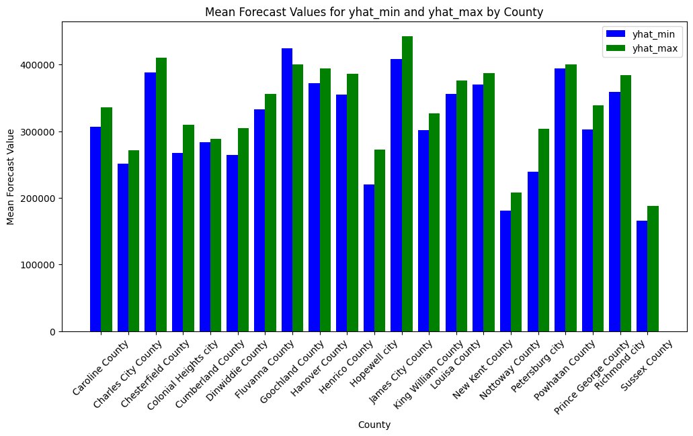
    

    
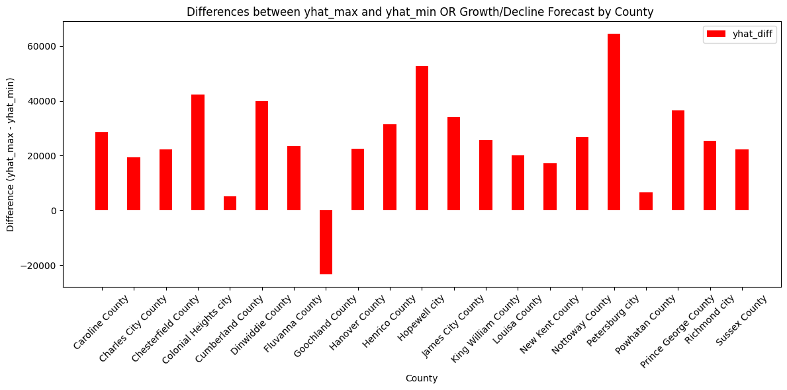
    

<table border="1" class="dataframe">
  <thead>
    <tr style="text-align: right;">
      <th></th>
      <th>county</th>
      <th>yhat_max</th>
      <th>yhat_diff</th>
    </tr>
  </thead>
  <tbody>
    <tr>
      <th>0</th>
      <td>Caroline County</td>
      <td>335814.643752</td>
      <td>28631.491426</td>
    </tr>
    <tr>
      <th>1</th>
      <td>Charles City County</td>
      <td>270979.327139</td>
      <td>19347.270669</td>
    </tr>
    <tr>
      <th>2</th>
      <td>Chesterfield County</td>
      <td>410150.010561</td>
      <td>22332.561814</td>
    </tr>
    <tr>
      <th>3</th>
      <td>Colonial Heights city</td>
      <td>310005.508052</td>
      <td>42351.285779</td>
    </tr>
    <tr>
      <th>4</th>
      <td>Cumberland County</td>
      <td>288377.142370</td>
      <td>5118.012361</td>
    </tr>
    <tr>
      <th>5</th>
      <td>Dinwiddie County</td>
      <td>304236.128593</td>
      <td>39893.953189</td>
    </tr>
    <tr>
      <th>6</th>
      <td>Fluvanna County</td>
      <td>356287.354705</td>
      <td>23503.198640</td>
    </tr>
    <tr>
      <th>7</th>
      <td>Goochland County</td>
      <td>400702.237693</td>
      <td>-23458.839206</td>
    </tr>
    <tr>
      <th>8</th>
      <td>Hanover County</td>
      <td>394468.358553</td>
      <td>22617.672343</td>
    </tr>
    <tr>
      <th>9</th>
      <td>Henrico County</td>
      <td>386032.684766</td>
      <td>31494.096930</td>
    </tr>
    <tr>
      <th>10</th>
      <td>Hopewell city</td>
      <td>272717.328606</td>
      <td>52613.934771</td>
    </tr>
    <tr>
      <th>11</th>
      <td>James City County</td>
      <td>442898.617278</td>
      <td>34054.800698</td>
    </tr>
    <tr>
      <th>12</th>
      <td>King William County</td>
      <td>326797.600488</td>
      <td>25560.297990</td>
    </tr>
    <tr>
      <th>13</th>
      <td>Louisa County</td>
      <td>376355.308734</td>
      <td>20065.592726</td>
    </tr>
    <tr>
      <th>14</th>
      <td>New Kent County</td>
      <td>387257.750624</td>
      <td>17180.197721</td>
    </tr>
    <tr>
      <th>15</th>
      <td>Nottoway County</td>
      <td>208136.589000</td>
      <td>26916.115055</td>
    </tr>
    <tr>
      <th>16</th>
      <td>Petersburg city</td>
      <td>304021.601640</td>
      <td>64616.589769</td>
    </tr>
    <tr>
      <th>17</th>
      <td>Powhatan County</td>
      <td>400554.846973</td>
      <td>6552.486795</td>
    </tr>
    <tr>
      <th>18</th>
      <td>Prince George County</td>
      <td>339163.270955</td>
      <td>36394.934495</td>
    </tr>
    <tr>
      <th>19</th>
      <td>Richmond city</td>
      <td>384588.683859</td>
      <td>25334.387448</td>
    </tr>
    <tr>
      <th>20</th>
      <td>Sussex County</td>
      <td>188157.040925</td>
      <td>22373.080003</td>
    </tr>
  </tbody>
</table>

    

    

    
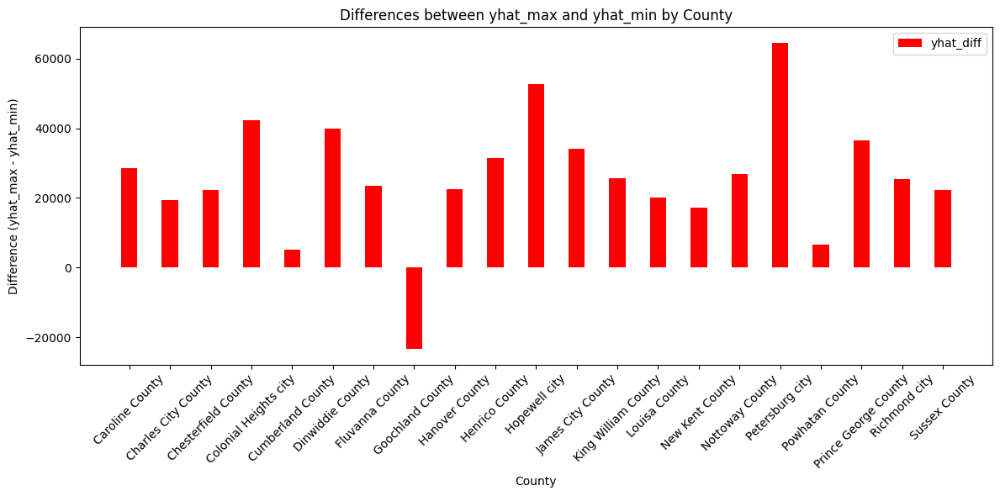
    

    Timestamp('2023-01-31 00:00:00')

<table border="1" class="dataframe">
  <thead>
    <tr style="text-align: right;">
      <th></th>
      <th>ds</th>
      <th>trend</th>
      <th>yhat_lower</th>
      <th>yhat_upper</th>
      <th>trend_lower</th>
      <th>trend_upper</th>
      <th>additive_terms</th>
      <th>additive_terms_lower</th>
      <th>additive_terms_upper</th>
      <th>yearly</th>
      <th>yearly_lower</th>
      <th>yearly_upper</th>
      <th>multiplicative_terms</th>
      <th>multiplicative_terms_lower</th>
      <th>multiplicative_terms_upper</th>
      <th>yhat</th>
    </tr>
  </thead>
  <tbody>
    <tr>
      <th>0</th>
      <td>2023-01-31</td>
      <td>393680.069749</td>
      <td>391168.620340</td>
      <td>396024.092420</td>
      <td>393680.069749</td>
      <td>393680.069749</td>
      <td>-44.821192</td>
      <td>-44.821192</td>
      <td>-44.821192</td>
      <td>-44.821192</td>
      <td>-44.821192</td>
      <td>-44.821192</td>
      <td>0.0</td>
      <td>0.0</td>
      <td>0.0</td>
      <td>393635.248557</td>
    </tr>
    <tr>
      <th>1</th>
      <td>2023-02-28</td>
      <td>395900.712669</td>
      <td>393125.056647</td>
      <td>398224.655038</td>
      <td>395900.712669</td>
      <td>395900.712669</td>
      <td>-290.110292</td>
      <td>-290.110292</td>
      <td>-290.110292</td>
      <td>-290.110292</td>
      <td>-290.110292</td>
      <td>-290.110292</td>
      <td>0.0</td>
      <td>0.0</td>
      <td>0.0</td>
      <td>395610.602377</td>
    </tr>
    <tr>
      <th>2</th>
      <td>2023-03-31</td>
      <td>398359.281616</td>
      <td>395744.253831</td>
      <td>400788.679641</td>
      <td>398259.103981</td>
      <td>398447.490228</td>
      <td>-112.997805</td>
      <td>-112.997805</td>
      <td>-112.997805</td>
      <td>-112.997805</td>
      <td>-112.997805</td>
      <td>-112.997805</td>
      <td>0.0</td>
      <td>0.0</td>
      <td>0.0</td>
      <td>398246.283811</td>
    </tr>
    <tr>
      <th>3</th>
      <td>2023-04-30</td>
      <td>400738.541887</td>
      <td>398011.378865</td>
      <td>403309.608924</td>
      <td>400430.750872</td>
      <td>401020.364452</td>
      <td>16.976512</td>
      <td>16.976512</td>
      <td>16.976512</td>
      <td>16.976512</td>
      <td>16.976512</td>
      <td>16.976512</td>
      <td>0.0</td>
      <td>0.0</td>
      <td>0.0</td>
      <td>400755.518399</td>
    </tr>
    <tr>
      <th>4</th>
      <td>2023-05-31</td>
      <td>403197.110834</td>
      <td>400641.969919</td>
      <td>406185.927825</td>
      <td>402556.730183</td>
      <td>403736.920197</td>
      <td>64.632569</td>
      <td>64.632569</td>
      <td>64.632569</td>
      <td>64.632569</td>
      <td>64.632569</td>
      <td>64.632569</td>
      <td>0.0</td>
      <td>0.0</td>
      <td>0.0</td>
      <td>403261.743403</td>
    </tr>
    <tr>
      <th>5</th>
      <td>2023-06-30</td>
      <td>405576.371105</td>
      <td>402763.852024</td>
      <td>408598.936690</td>
      <td>404534.387515</td>
      <td>406443.506924</td>
      <td>195.490691</td>
      <td>195.490691</td>
      <td>195.490691</td>
      <td>195.490691</td>
      <td>195.490691</td>
      <td>195.490691</td>
      <td>0.0</td>
      <td>0.0</td>
      <td>0.0</td>
      <td>405771.861796</td>
    </tr>
    <tr>
      <th>6</th>
      <td>2023-07-31</td>
      <td>408034.940052</td>
      <td>405113.920468</td>
      <td>411305.193796</td>
      <td>406372.748412</td>
      <td>409295.497379</td>
      <td>291.094237</td>
      <td>291.094237</td>
      <td>291.094237</td>
      <td>291.094237</td>
      <td>291.094237</td>
      <td>291.094237</td>
      <td>0.0</td>
      <td>0.0</td>
      <td>0.0</td>
      <td>408326.034289</td>
    </tr>
    <tr>
      <th>7</th>
      <td>2023-08-31</td>
      <td>410493.508998</td>
      <td>407321.752125</td>
      <td>413929.407807</td>
      <td>408336.800882</td>
      <td>412281.645815</td>
      <td>96.171608</td>
      <td>96.171608</td>
      <td>96.171608</td>
      <td>96.171608</td>
      <td>96.171608</td>
      <td>96.171608</td>
      <td>0.0</td>
      <td>0.0</td>
      <td>0.0</td>
      <td>410589.680607</td>
    </tr>
    <tr>
      <th>8</th>
      <td>2023-09-30</td>
      <td>412872.769270</td>
      <td>408923.542203</td>
      <td>416240.574606</td>
      <td>410081.405936</td>
      <td>415068.747774</td>
      <td>-254.481546</td>
      <td>-254.481546</td>
      <td>-254.481546</td>
      <td>-254.481546</td>
      <td>-254.481546</td>
      <td>-254.481546</td>
      <td>0.0</td>
      <td>0.0</td>
      <td>0.0</td>
      <td>412618.287723</td>
    </tr>
    <tr>
      <th>9</th>
      <td>2023-10-31</td>
      <td>415331.338216</td>
      <td>410456.312622</td>
      <td>418718.244113</td>
      <td>411609.759383</td>
      <td>418184.601271</td>
      <td>-630.841917</td>
      <td>-630.841917</td>
      <td>-630.841917</td>
      <td>-630.841917</td>
      <td>-630.841917</td>
      <td>-630.841917</td>
      <td>0.0</td>
      <td>0.0</td>
      <td>0.0</td>
      <td>414700.496299</td>
    </tr>
    <tr>
      <th>10</th>
      <td>2023-11-30</td>
      <td>417710.598488</td>
      <td>411706.013830</td>
      <td>421325.777679</td>
      <td>413436.531396</td>
      <td>421363.552568</td>
      <td>-775.135729</td>
      <td>-775.135729</td>
      <td>-775.135729</td>
      <td>-775.135729</td>
      <td>-775.135729</td>
      <td>-775.135729</td>
      <td>0.0</td>
      <td>0.0</td>
      <td>0.0</td>
      <td>416935.462758</td>
    </tr>
    <tr>
      <th>11</th>
      <td>2023-12-31</td>
      <td>420169.167434</td>
      <td>413503.586983</td>
      <td>424370.849895</td>
      <td>415216.337888</td>
      <td>424499.071068</td>
      <td>-735.448037</td>
      <td>-735.448037</td>
      <td>-735.448037</td>
      <td>-735.448037</td>
      <td>-735.448037</td>
      <td>-735.448037</td>
      <td>0.0</td>
      <td>0.0</td>
      <td>0.0</td>
      <td>419433.719397</td>
    </tr>
  </tbody>
</table>

    
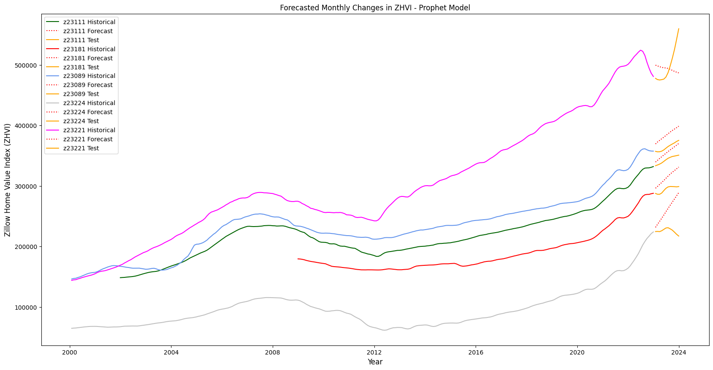
    

    Index(['RegionID', 'SizeRank', 'RegionName', 'RegionType', 'StateName',
           'State', 'City', 'Metro', 'CountyName', '2000-01-31',
           ...
           '2023-03-31', '2023-04-30', '2023-05-31', '2023-06-30', '2023-07-31',
           '2023-08-31', '2023-09-30', '2023-10-31', '2023-11-30', '2023-12-31'],
          dtype='object', length=297)

    Timestamp('2023-01-01 00:00:00')

    
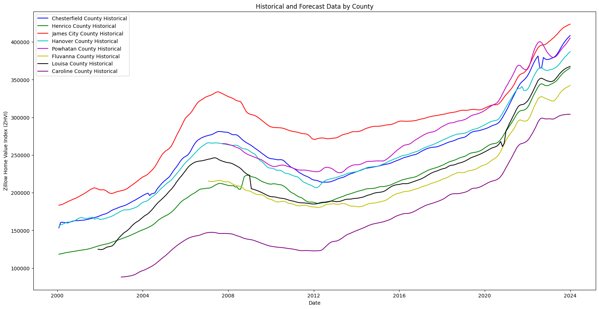
    

<table border="1" class="dataframe">
  <thead>
    <tr style="text-align: right;">
      <th></th>
      <th>zip</th>
      <th>type</th>
      <th>decommissioned</th>
      <th>primary_city</th>
      <th>acceptable_cities</th>
      <th>unacceptable_cities</th>
      <th>state</th>
      <th>county</th>
      <th>timezone</th>
      <th>area_codes</th>
      <th>world_region</th>
      <th>country</th>
      <th>latitude</th>
      <th>longitude</th>
      <th>irs_estimated_population</th>
    </tr>
  </thead>
  <tbody>
    <tr>
      <th>0</th>
      <td>501</td>
      <td>UNIQUE</td>
      <td>0</td>
      <td>Holtsville</td>
      <td>NaN</td>
      <td>Internal Revenue Service</td>
      <td>NY</td>
      <td>Suffolk County</td>
      <td>America/New_York</td>
      <td>631</td>
      <td>NaN</td>
      <td>US</td>
      <td>40.81</td>
      <td>-73.04</td>
      <td>562</td>
    </tr>
    <tr>
      <th>1</th>
      <td>544</td>
      <td>UNIQUE</td>
      <td>0</td>
      <td>Holtsville</td>
      <td>NaN</td>
      <td>Internal Revenue Service</td>
      <td>NY</td>
      <td>Suffolk County</td>
      <td>America/New_York</td>
      <td>631</td>
      <td>NaN</td>
      <td>US</td>
      <td>40.81</td>
      <td>-73.04</td>
      <td>0</td>
    </tr>
    <tr>
      <th>2</th>
      <td>601</td>
      <td>STANDARD</td>
      <td>0</td>
      <td>Adjuntas</td>
      <td>NaN</td>
      <td>Colinas Del Gigante, Jard De Adjuntas, Urb San...</td>
      <td>PR</td>
      <td>Adjuntas Municipio</td>
      <td>America/Puerto_Rico</td>
      <td>787, 939</td>
      <td>NaN</td>
      <td>US</td>
      <td>18.16</td>
      <td>-66.72</td>
      <td>0</td>
    </tr>
    <tr>
      <th>3</th>
      <td>602</td>
      <td>STANDARD</td>
      <td>0</td>
      <td>Aguada</td>
      <td>NaN</td>
      <td>Alts De Aguada, Bo Guaniquilla, Comunidad Las ...</td>
      <td>PR</td>
      <td>Aguada Municipio</td>
      <td>America/Puerto_Rico</td>
      <td>787, 939</td>
      <td>NaN</td>
      <td>US</td>
      <td>18.38</td>
      <td>-67.18</td>
      <td>0</td>
    </tr>
    <tr>
      <th>4</th>
      <td>603</td>
      <td>STANDARD</td>
      <td>0</td>
      <td>Aguadilla</td>
      <td>Ramey</td>
      <td>Bda Caban, Bda Esteves, Bo Borinquen, Bo Ceiba...</td>
      <td>PR</td>
      <td>Aguadilla Municipio</td>
      <td>America/Puerto_Rico</td>
      <td>787, 939</td>
      <td>NaN</td>
      <td>US</td>
      <td>18.43</td>
      <td>-67.15</td>
      <td>0</td>
    </tr>
  </tbody>
</table>

    No forecast data available for zip code 23894
    

    
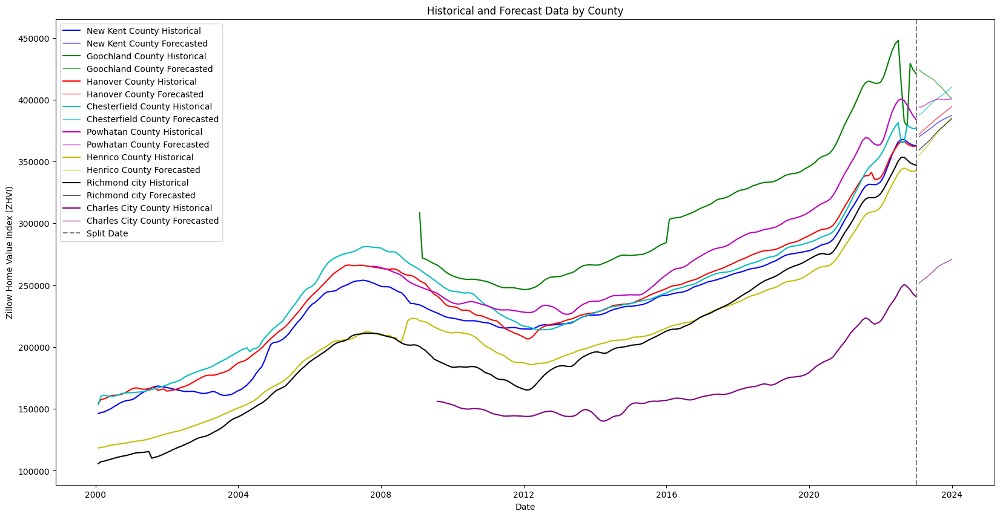
    

    
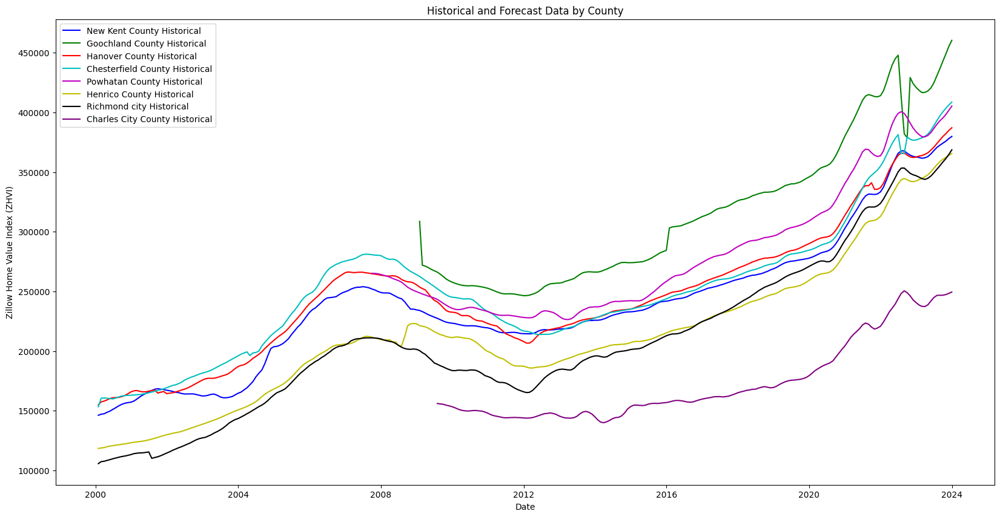
    

    11    419433.719397
    Name: yhat, dtype: float64

<table border="1" class="dataframe">
  <thead>
    <tr style="text-align: right;">
      <th></th>
      <th>Date</th>
      <th>yhat</th>
      <th>County</th>
    </tr>
  </thead>
  <tbody>
    <tr>
      <th>11</th>
      <td>2023-12-31</td>
      <td>11    398758.047664
Name: yhat, dtype: float64</td>
      <td>New Kent County</td>
    </tr>
    <tr>
      <th>23</th>
      <td>2023-12-31</td>
      <td>11    314983.203627
Name: yhat, dtype: float64</td>
      <td>Louisa County</td>
    </tr>
    <tr>
      <th>35</th>
      <td>2023-12-31</td>
      <td>11    425227.524592
Name: yhat, dtype: float64</td>
      <td>Goochland County</td>
    </tr>
    <tr>
      <th>47</th>
      <td>2023-12-31</td>
      <td>11    572800.205408
Name: yhat, dtype: float64</td>
      <td>Goochland County</td>
    </tr>
    <tr>
      <th>59</th>
      <td>2023-12-31</td>
      <td>11    322394.006514
Name: yhat, dtype: float64</td>
      <td>King William County</td>
    </tr>
    <tr>
      <th>...</th>
      <td>...</td>
      <td>...</td>
      <td>...</td>
    </tr>
    <tr>
      <th>899</th>
      <td>2023-12-31</td>
      <td>11    316091.936323
Name: yhat, dtype: float64</td>
      <td>Goochland County</td>
    </tr>
    <tr>
      <th>911</th>
      <td>2023-12-31</td>
      <td>11    417971.258223
Name: yhat, dtype: float64</td>
      <td>Goochland County</td>
    </tr>
    <tr>
      <th>923</th>
      <td>2023-12-31</td>
      <td>11    378921.668089
Name: yhat, dtype: float64</td>
      <td>Hanover County</td>
    </tr>
    <tr>
      <th>935</th>
      <td>2023-12-31</td>
      <td>11    511620.635586
Name: yhat, dtype: float64</td>
      <td>Henrico County</td>
    </tr>
    <tr>
      <th>947</th>
      <td>2023-12-31</td>
      <td>11    419433.719397
Name: yhat, dtype: float64</td>
      <td>Henrico County</td>
    </tr>
  </tbody>
</table>

79 rows × 3 columns

    County
    Caroline County          335814.643752
    Charles City County      270979.327139
    Chesterfield County      410150.010561
    Colonial Heights city    310005.508052
    Cumberland County        288377.142370
    Dinwiddie County         304236.128593
    Fluvanna County          356287.354705
    Goochland County         400702.237693
    Hanover County           394468.358553
    Henrico County           386032.684766
    Hopewell city            272717.328606
    James City County        442898.617278
    King William County      326797.600488
    Louisa County            376355.308734
    New Kent County          387257.750624
    Nottoway County          208136.589000
    Petersburg city          304021.601640
    Powhatan County          400554.846973
    Prince George County     339163.270955
    Richmond city            384588.683859
    Sussex County            188157.040925
    Name: yhat, dtype: float64

    (21,)

    County
    Charles City County    270979.327139
    Chesterfield County    410150.010561
    Goochland County       400702.237693
    Hanover County         394468.358553
    Henrico County         386032.684766
    New Kent County        387257.750624
    Powhatan County        400554.846973
    Richmond city          384588.683859
    Name: yhat, dtype: float64

    No artists with labels found to put in legend.  Note that artists whose label start with an underscore are ignored when legend() is called with no argument.
    

    
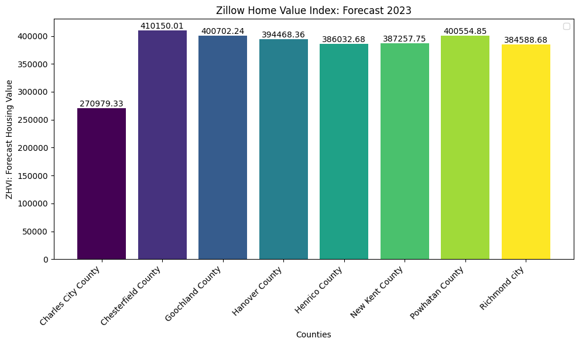
    

<table border="1" class="dataframe">
  <thead>
    <tr style="text-align: right;">
      <th></th>
      <th>Date</th>
      <th>ZHVI</th>
    </tr>
  </thead>
  <tbody>
    <tr>
      <th>0</th>
      <td>2000-01-31</td>
      <td>127330.398149</td>
    </tr>
    <tr>
      <th>1</th>
      <td>2000-02-29</td>
      <td>130655.002311</td>
    </tr>
    <tr>
      <th>2</th>
      <td>2000-03-31</td>
      <td>130999.640531</td>
    </tr>
    <tr>
      <th>3</th>
      <td>2000-04-30</td>
      <td>131461.723712</td>
    </tr>
    <tr>
      <th>4</th>
      <td>2000-05-31</td>
      <td>131887.418763</td>
    </tr>
    <tr>
      <th>...</th>
      <td>...</td>
      <td>...</td>
    </tr>
    <tr>
      <th>271</th>
      <td>2022-08-31</td>
      <td>333057.558892</td>
    </tr>
    <tr>
      <th>272</th>
      <td>2022-09-30</td>
      <td>335170.371724</td>
    </tr>
    <tr>
      <th>273</th>
      <td>2022-10-31</td>
      <td>340610.333732</td>
    </tr>
    <tr>
      <th>274</th>
      <td>2022-11-30</td>
      <td>339920.929841</td>
    </tr>
    <tr>
      <th>275</th>
      <td>2022-12-31</td>
      <td>339839.448645</td>
    </tr>
  </tbody>
</table>

276 rows × 2 columns

<table border="1" class="dataframe">
  <thead>
    <tr style="text-align: right;">
      <th></th>
      <th>Date</th>
      <th>ZHVI</th>
    </tr>
  </thead>
  <tbody>
    <tr>
      <th>0</th>
      <td>2000-01-31</td>
      <td>146225.673952</td>
    </tr>
    <tr>
      <th>1</th>
      <td>2000-02-29</td>
      <td>147105.826253</td>
    </tr>
    <tr>
      <th>2</th>
      <td>2000-03-31</td>
      <td>147514.417170</td>
    </tr>
    <tr>
      <th>3</th>
      <td>2000-04-30</td>
      <td>148746.645899</td>
    </tr>
    <tr>
      <th>4</th>
      <td>2000-05-31</td>
      <td>149794.745239</td>
    </tr>
    <tr>
      <th>...</th>
      <td>...</td>
      <td>...</td>
    </tr>
    <tr>
      <th>16360</th>
      <td>2022-08-31</td>
      <td>372367.543289</td>
    </tr>
    <tr>
      <th>16361</th>
      <td>2022-09-30</td>
      <td>369947.782362</td>
    </tr>
    <tr>
      <th>16362</th>
      <td>2022-10-31</td>
      <td>368496.336948</td>
    </tr>
    <tr>
      <th>16363</th>
      <td>2022-11-30</td>
      <td>367723.343921</td>
    </tr>
    <tr>
      <th>16364</th>
      <td>2022-12-31</td>
      <td>367853.392108</td>
    </tr>
  </tbody>
</table>

955 rows × 2 columns

<table border="1" class="dataframe">
  <thead>
    <tr style="text-align: right;">
      <th></th>
      <th>Zillow Home Value Index (ZHVI)</th>
      <th>financial_crisis_flag</th>
    </tr>
  </thead>
  <tbody>
    <tr>
      <th>2000-01-31</th>
      <td>151144.556713</td>
      <td>0</td>
    </tr>
    <tr>
      <th>2000-02-29</th>
      <td>151664.810128</td>
      <td>0</td>
    </tr>
    <tr>
      <th>2000-03-31</th>
      <td>152108.402130</td>
      <td>0</td>
    </tr>
    <tr>
      <th>2000-04-30</th>
      <td>153070.557079</td>
      <td>0</td>
    </tr>
    <tr>
      <th>2000-05-31</th>
      <td>153814.965294</td>
      <td>0</td>
    </tr>
    <tr>
      <th>...</th>
      <td>...</td>
      <td>...</td>
    </tr>
    <tr>
      <th>2023-08-31</th>
      <td>401697.250270</td>
      <td>0</td>
    </tr>
    <tr>
      <th>2023-09-30</th>
      <td>404834.836102</td>
      <td>0</td>
    </tr>
    <tr>
      <th>2023-10-31</th>
      <td>407219.806150</td>
      <td>0</td>
    </tr>
    <tr>
      <th>2023-11-30</th>
      <td>408973.633817</td>
      <td>0</td>
    </tr>
    <tr>
      <th>2023-12-31</th>
      <td>410534.627066</td>
      <td>0</td>
    </tr>
  </tbody>
</table>

288 rows × 2 columns

    array(['New Kent County', 'Louisa County', 'Goochland County',
           'King William County', 'Hanover County', 'Chesterfield County',
           'Powhatan County', 'Henrico County', 'James City County',
           'Sussex County', 'Dinwiddie County', 'Richmond city',
           'Nottoway County', 'Prince George County', 'Colonial Heights city',
           'Hopewell city', 'Petersburg city', 'Fluvanna County',
           'Caroline County', 'Cumberland County', 'Charles City County'],
          dtype=object)

<table border="1" class="dataframe">
  <thead>
    <tr style="text-align: right;">
      <th></th>
      <th>ds</th>
      <th>trend</th>
      <th>yhat_lower</th>
      <th>yhat_upper</th>
      <th>trend_lower</th>
      <th>trend_upper</th>
      <th>additive_terms</th>
      <th>additive_terms_lower</th>
      <th>additive_terms_upper</th>
      <th>yearly</th>
      <th>yearly_lower</th>
      <th>yearly_upper</th>
      <th>multiplicative_terms</th>
      <th>multiplicative_terms_lower</th>
      <th>multiplicative_terms_upper</th>
      <th>yhat</th>
    </tr>
  </thead>
  <tbody>
    <tr>
      <th>0</th>
      <td>2023-01-31</td>
      <td>393680.069749</td>
      <td>391168.620340</td>
      <td>396024.092420</td>
      <td>393680.069749</td>
      <td>393680.069749</td>
      <td>-44.821192</td>
      <td>-44.821192</td>
      <td>-44.821192</td>
      <td>-44.821192</td>
      <td>-44.821192</td>
      <td>-44.821192</td>
      <td>0.0</td>
      <td>0.0</td>
      <td>0.0</td>
      <td>393635.248557</td>
    </tr>
    <tr>
      <th>1</th>
      <td>2023-02-28</td>
      <td>395900.712669</td>
      <td>393125.056647</td>
      <td>398224.655038</td>
      <td>395900.712669</td>
      <td>395900.712669</td>
      <td>-290.110292</td>
      <td>-290.110292</td>
      <td>-290.110292</td>
      <td>-290.110292</td>
      <td>-290.110292</td>
      <td>-290.110292</td>
      <td>0.0</td>
      <td>0.0</td>
      <td>0.0</td>
      <td>395610.602377</td>
    </tr>
    <tr>
      <th>2</th>
      <td>2023-03-31</td>
      <td>398359.281616</td>
      <td>395744.253831</td>
      <td>400788.679641</td>
      <td>398259.103981</td>
      <td>398447.490228</td>
      <td>-112.997805</td>
      <td>-112.997805</td>
      <td>-112.997805</td>
      <td>-112.997805</td>
      <td>-112.997805</td>
      <td>-112.997805</td>
      <td>0.0</td>
      <td>0.0</td>
      <td>0.0</td>
      <td>398246.283811</td>
    </tr>
    <tr>
      <th>3</th>
      <td>2023-04-30</td>
      <td>400738.541887</td>
      <td>398011.378865</td>
      <td>403309.608924</td>
      <td>400430.750872</td>
      <td>401020.364452</td>
      <td>16.976512</td>
      <td>16.976512</td>
      <td>16.976512</td>
      <td>16.976512</td>
      <td>16.976512</td>
      <td>16.976512</td>
      <td>0.0</td>
      <td>0.0</td>
      <td>0.0</td>
      <td>400755.518399</td>
    </tr>
    <tr>
      <th>4</th>
      <td>2023-05-31</td>
      <td>403197.110834</td>
      <td>400641.969919</td>
      <td>406185.927825</td>
      <td>402556.730183</td>
      <td>403736.920197</td>
      <td>64.632569</td>
      <td>64.632569</td>
      <td>64.632569</td>
      <td>64.632569</td>
      <td>64.632569</td>
      <td>64.632569</td>
      <td>0.0</td>
      <td>0.0</td>
      <td>0.0</td>
      <td>403261.743403</td>
    </tr>
    <tr>
      <th>5</th>
      <td>2023-06-30</td>
      <td>405576.371105</td>
      <td>402763.852024</td>
      <td>408598.936690</td>
      <td>404534.387515</td>
      <td>406443.506924</td>
      <td>195.490691</td>
      <td>195.490691</td>
      <td>195.490691</td>
      <td>195.490691</td>
      <td>195.490691</td>
      <td>195.490691</td>
      <td>0.0</td>
      <td>0.0</td>
      <td>0.0</td>
      <td>405771.861796</td>
    </tr>
    <tr>
      <th>6</th>
      <td>2023-07-31</td>
      <td>408034.940052</td>
      <td>405113.920468</td>
      <td>411305.193796</td>
      <td>406372.748412</td>
      <td>409295.497379</td>
      <td>291.094237</td>
      <td>291.094237</td>
      <td>291.094237</td>
      <td>291.094237</td>
      <td>291.094237</td>
      <td>291.094237</td>
      <td>0.0</td>
      <td>0.0</td>
      <td>0.0</td>
      <td>408326.034289</td>
    </tr>
    <tr>
      <th>7</th>
      <td>2023-08-31</td>
      <td>410493.508998</td>
      <td>407321.752125</td>
      <td>413929.407807</td>
      <td>408336.800882</td>
      <td>412281.645815</td>
      <td>96.171608</td>
      <td>96.171608</td>
      <td>96.171608</td>
      <td>96.171608</td>
      <td>96.171608</td>
      <td>96.171608</td>
      <td>0.0</td>
      <td>0.0</td>
      <td>0.0</td>
      <td>410589.680607</td>
    </tr>
    <tr>
      <th>8</th>
      <td>2023-09-30</td>
      <td>412872.769270</td>
      <td>408923.542203</td>
      <td>416240.574606</td>
      <td>410081.405936</td>
      <td>415068.747774</td>
      <td>-254.481546</td>
      <td>-254.481546</td>
      <td>-254.481546</td>
      <td>-254.481546</td>
      <td>-254.481546</td>
      <td>-254.481546</td>
      <td>0.0</td>
      <td>0.0</td>
      <td>0.0</td>
      <td>412618.287723</td>
    </tr>
    <tr>
      <th>9</th>
      <td>2023-10-31</td>
      <td>415331.338216</td>
      <td>410456.312622</td>
      <td>418718.244113</td>
      <td>411609.759383</td>
      <td>418184.601271</td>
      <td>-630.841917</td>
      <td>-630.841917</td>
      <td>-630.841917</td>
      <td>-630.841917</td>
      <td>-630.841917</td>
      <td>-630.841917</td>
      <td>0.0</td>
      <td>0.0</td>
      <td>0.0</td>
      <td>414700.496299</td>
    </tr>
    <tr>
      <th>10</th>
      <td>2023-11-30</td>
      <td>417710.598488</td>
      <td>411706.013830</td>
      <td>421325.777679</td>
      <td>413436.531396</td>
      <td>421363.552568</td>
      <td>-775.135729</td>
      <td>-775.135729</td>
      <td>-775.135729</td>
      <td>-775.135729</td>
      <td>-775.135729</td>
      <td>-775.135729</td>
      <td>0.0</td>
      <td>0.0</td>
      <td>0.0</td>
      <td>416935.462758</td>
    </tr>
    <tr>
      <th>11</th>
      <td>2023-12-31</td>
      <td>420169.167434</td>
      <td>413503.586983</td>
      <td>424370.849895</td>
      <td>415216.337888</td>
      <td>424499.071068</td>
      <td>-735.448037</td>
      <td>-735.448037</td>
      <td>-735.448037</td>
      <td>-735.448037</td>
      <td>-735.448037</td>
      <td>-735.448037</td>
      <td>0.0</td>
      <td>0.0</td>
      <td>0.0</td>
      <td>419433.719397</td>
    </tr>
  </tbody>
</table>

    202510.76181030678

    numpy.datetime64('2022-12-31T00:00:00.000000000')

    '2022-12-31'

<table border="1" class="dataframe">
  <thead>
    <tr style="text-align: right;">
      <th></th>
      <th>RegionID</th>
      <th>SizeRank</th>
      <th>RegionName</th>
      <th>RegionType</th>
      <th>StateName</th>
      <th>State</th>
      <th>City</th>
      <th>Metro</th>
      <th>CountyName</th>
      <th>2000-01-31</th>
      <th>...</th>
      <th>2023-03-31</th>
      <th>2023-04-30</th>
      <th>2023-05-31</th>
      <th>2023-06-30</th>
      <th>2023-07-31</th>
      <th>2023-08-31</th>
      <th>2023-09-30</th>
      <th>2023-10-31</th>
      <th>2023-11-30</th>
      <th>2023-12-31</th>
    </tr>
  </thead>
  <tbody>
    <tr>
      <th>0</th>
      <td>91982</td>
      <td>1</td>
      <td>77494</td>
      <td>zip</td>
      <td>TX</td>
      <td>TX</td>
      <td>Katy</td>
      <td>Houston-The Woodlands-Sugar Land, TX</td>
      <td>Fort Bend County</td>
      <td>208752.177188</td>
      <td>...</td>
      <td>468400.012962</td>
      <td>469600.790271</td>
      <td>471587.869725</td>
      <td>474687.471351</td>
      <td>477460.027392</td>
      <td>479919.299106</td>
      <td>481726.908022</td>
      <td>482958.479293</td>
      <td>483644.390919</td>
      <td>484254.484150</td>
    </tr>
    <tr>
      <th>1</th>
      <td>61148</td>
      <td>2</td>
      <td>8701</td>
      <td>zip</td>
      <td>NJ</td>
      <td>NJ</td>
      <td>Lakewood</td>
      <td>New York-Newark-Jersey City, NY-NJ-PA</td>
      <td>Ocean County</td>
      <td>133799.965954</td>
      <td>...</td>
      <td>517054.419786</td>
      <td>521100.063176</td>
      <td>526320.736228</td>
      <td>532105.809020</td>
      <td>538056.023382</td>
      <td>543798.549494</td>
      <td>549960.546654</td>
      <td>557112.585902</td>
      <td>563739.635747</td>
      <td>568385.787815</td>
    </tr>
    <tr>
      <th>2</th>
      <td>91940</td>
      <td>3</td>
      <td>77449</td>
      <td>zip</td>
      <td>TX</td>
      <td>TX</td>
      <td>Katy</td>
      <td>Houston-The Woodlands-Sugar Land, TX</td>
      <td>Harris County</td>
      <td>102327.332899</td>
      <td>...</td>
      <td>274575.011824</td>
      <td>273391.851083</td>
      <td>272916.706411</td>
      <td>273291.932508</td>
      <td>274045.370378</td>
      <td>274933.235990</td>
      <td>275461.772882</td>
      <td>275451.663963</td>
      <td>275219.130604</td>
      <td>274931.001539</td>
    </tr>
    <tr>
      <th>3</th>
      <td>62080</td>
      <td>4</td>
      <td>11368</td>
      <td>zip</td>
      <td>NY</td>
      <td>NY</td>
      <td>New York</td>
      <td>New York-Newark-Jersey City, NY-NJ-PA</td>
      <td>Queens County</td>
      <td>147672.475058</td>
      <td>...</td>
      <td>480340.864596</td>
      <td>473730.902787</td>
      <td>466644.010241</td>
      <td>461261.507623</td>
      <td>459443.414913</td>
      <td>459437.482269</td>
      <td>458881.548977</td>
      <td>456860.171677</td>
      <td>453514.767036</td>
      <td>449239.710048</td>
    </tr>
    <tr>
      <th>4</th>
      <td>91733</td>
      <td>5</td>
      <td>77084</td>
      <td>zip</td>
      <td>TX</td>
      <td>TX</td>
      <td>Houston</td>
      <td>Houston-The Woodlands-Sugar Land, TX</td>
      <td>Harris County</td>
      <td>100957.722364</td>
      <td>...</td>
      <td>267553.019024</td>
      <td>266769.398609</td>
      <td>266628.259422</td>
      <td>267219.988459</td>
      <td>268054.762069</td>
      <td>268918.974834</td>
      <td>269342.669492</td>
      <td>269333.119699</td>
      <td>268917.017812</td>
      <td>268499.368493</td>
    </tr>
  </tbody>
</table>

5 rows × 297 columns

<table border="1" class="dataframe">
  <thead>
    <tr style="text-align: right;">
      <th></th>
      <th>zip</th>
      <th>type</th>
      <th>decommissioned</th>
      <th>primary_city</th>
      <th>acceptable_cities</th>
      <th>unacceptable_cities</th>
      <th>state</th>
      <th>county</th>
      <th>timezone</th>
      <th>area_codes</th>
      <th>world_region</th>
      <th>country</th>
      <th>latitude</th>
      <th>longitude</th>
      <th>irs_estimated_population</th>
    </tr>
  </thead>
  <tbody>
    <tr>
      <th>0</th>
      <td>501</td>
      <td>UNIQUE</td>
      <td>0</td>
      <td>Holtsville</td>
      <td>NaN</td>
      <td>Internal Revenue Service</td>
      <td>NY</td>
      <td>Suffolk County</td>
      <td>America/New_York</td>
      <td>631</td>
      <td>NaN</td>
      <td>US</td>
      <td>40.81</td>
      <td>-73.04</td>
      <td>562</td>
    </tr>
    <tr>
      <th>1</th>
      <td>544</td>
      <td>UNIQUE</td>
      <td>0</td>
      <td>Holtsville</td>
      <td>NaN</td>
      <td>Internal Revenue Service</td>
      <td>NY</td>
      <td>Suffolk County</td>
      <td>America/New_York</td>
      <td>631</td>
      <td>NaN</td>
      <td>US</td>
      <td>40.81</td>
      <td>-73.04</td>
      <td>0</td>
    </tr>
    <tr>
      <th>2</th>
      <td>601</td>
      <td>STANDARD</td>
      <td>0</td>
      <td>Adjuntas</td>
      <td>NaN</td>
      <td>Colinas Del Gigante, Jard De Adjuntas, Urb San...</td>
      <td>PR</td>
      <td>Adjuntas Municipio</td>
      <td>America/Puerto_Rico</td>
      <td>787, 939</td>
      <td>NaN</td>
      <td>US</td>
      <td>18.16</td>
      <td>-66.72</td>
      <td>0</td>
    </tr>
    <tr>
      <th>3</th>
      <td>602</td>
      <td>STANDARD</td>
      <td>0</td>
      <td>Aguada</td>
      <td>NaN</td>
      <td>Alts De Aguada, Bo Guaniquilla, Comunidad Las ...</td>
      <td>PR</td>
      <td>Aguada Municipio</td>
      <td>America/Puerto_Rico</td>
      <td>787, 939</td>
      <td>NaN</td>
      <td>US</td>
      <td>18.38</td>
      <td>-67.18</td>
      <td>0</td>
    </tr>
    <tr>
      <th>4</th>
      <td>603</td>
      <td>STANDARD</td>
      <td>0</td>
      <td>Aguadilla</td>
      <td>Ramey</td>
      <td>Bda Caban, Bda Esteves, Bo Borinquen, Bo Ceiba...</td>
      <td>PR</td>
      <td>Aguadilla Municipio</td>
      <td>America/Puerto_Rico</td>
      <td>787, 939</td>
      <td>NaN</td>
      <td>US</td>
      <td>18.43</td>
      <td>-67.15</td>
      <td>0</td>
    </tr>
    <tr>
      <th>...</th>
      <td>...</td>
      <td>...</td>
      <td>...</td>
      <td>...</td>
      <td>...</td>
      <td>...</td>
      <td>...</td>
      <td>...</td>
      <td>...</td>
      <td>...</td>
      <td>...</td>
      <td>...</td>
      <td>...</td>
      <td>...</td>
      <td>...</td>
    </tr>
    <tr>
      <th>42730</th>
      <td>99926</td>
      <td>PO BOX</td>
      <td>0</td>
      <td>Metlakatla</td>
      <td>NaN</td>
      <td>NaN</td>
      <td>AK</td>
      <td>Prince of Wales-Hyder Census Area</td>
      <td>America/Metlakatla</td>
      <td>907</td>
      <td>NaN</td>
      <td>US</td>
      <td>55.14</td>
      <td>-131.49</td>
      <td>1140</td>
    </tr>
    <tr>
      <th>42731</th>
      <td>99927</td>
      <td>PO BOX</td>
      <td>0</td>
      <td>Point Baker</td>
      <td>NaN</td>
      <td>NaN</td>
      <td>AK</td>
      <td>Prince of Wales-Hyder Census Area</td>
      <td>America/Sitka</td>
      <td>907</td>
      <td>NaN</td>
      <td>US</td>
      <td>56.33</td>
      <td>-133.61</td>
      <td>48</td>
    </tr>
    <tr>
      <th>42732</th>
      <td>99928</td>
      <td>PO BOX</td>
      <td>0</td>
      <td>Ward Cove</td>
      <td>NaN</td>
      <td>NaN</td>
      <td>AK</td>
      <td>Ketchikan Gateway Borough</td>
      <td>America/Sitka</td>
      <td>907</td>
      <td>NaN</td>
      <td>US</td>
      <td>55.45</td>
      <td>-131.79</td>
      <td>1530</td>
    </tr>
    <tr>
      <th>42733</th>
      <td>99929</td>
      <td>PO BOX</td>
      <td>0</td>
      <td>Wrangell</td>
      <td>NaN</td>
      <td>NaN</td>
      <td>AK</td>
      <td>Wrangell City and Borough</td>
      <td>America/Sitka</td>
      <td>236, 250, 672, 778, 907</td>
      <td>NaN</td>
      <td>US</td>
      <td>56.41</td>
      <td>-131.61</td>
      <td>2145</td>
    </tr>
    <tr>
      <th>42734</th>
      <td>99950</td>
      <td>PO BOX</td>
      <td>0</td>
      <td>Ketchikan</td>
      <td>Edna Bay, Kasaan</td>
      <td>NaN</td>
      <td>AK</td>
      <td>Prince of Wales-Outer Ketchikan Borough</td>
      <td>America/Sitka</td>
      <td>907</td>
      <td>NaN</td>
      <td>US</td>
      <td>55.34</td>
      <td>-131.64</td>
      <td>262</td>
    </tr>
  </tbody>
</table>

42735 rows × 15 columns

      Cell In[629], line 2
        df2.renamecolumns{'zip':'RegionName',inplace = True}
                                                   ^
    SyntaxError: ':' expected after dictionary key
    

    (26354, 311)

    Index(['RegionID', 'SizeRank', 'RegionName', 'RegionType', 'StateName',
           'State', 'City', 'Metro', 'CountyName', '2000-01-31',
           ...
           'unacceptable_cities', 'state', 'county', 'timezone', 'area_codes',
           'world_region', 'country', 'latitude', 'longitude',
           'irs_estimated_population'],
          dtype='object', length=311)

    'C:\\Users\\rsingh\\Downloads'

    Data merged and saved to merged_data.xlsx
    
