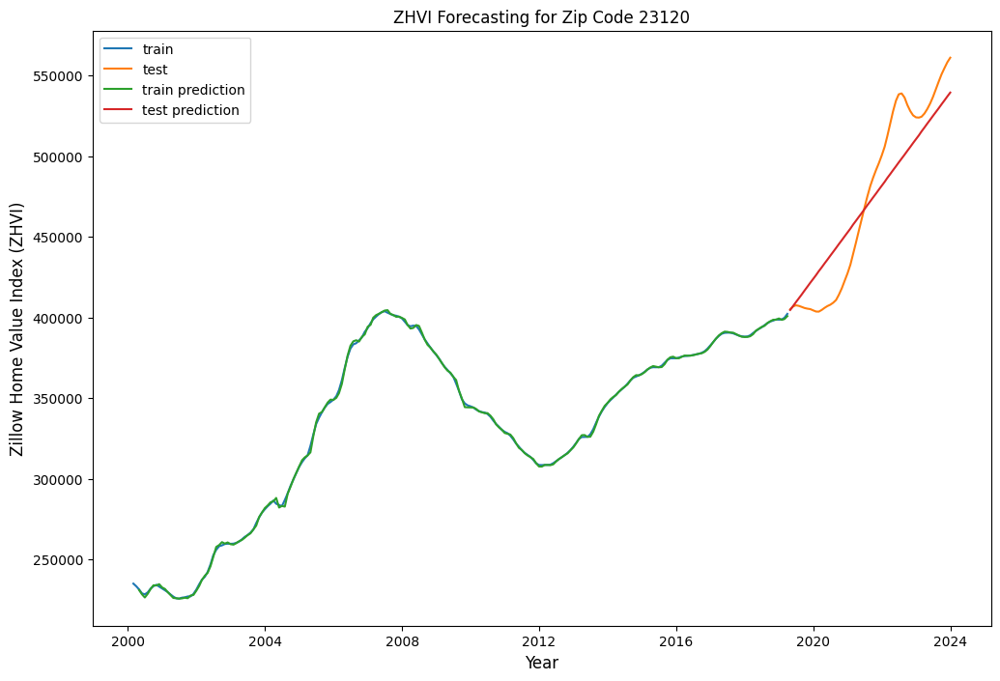
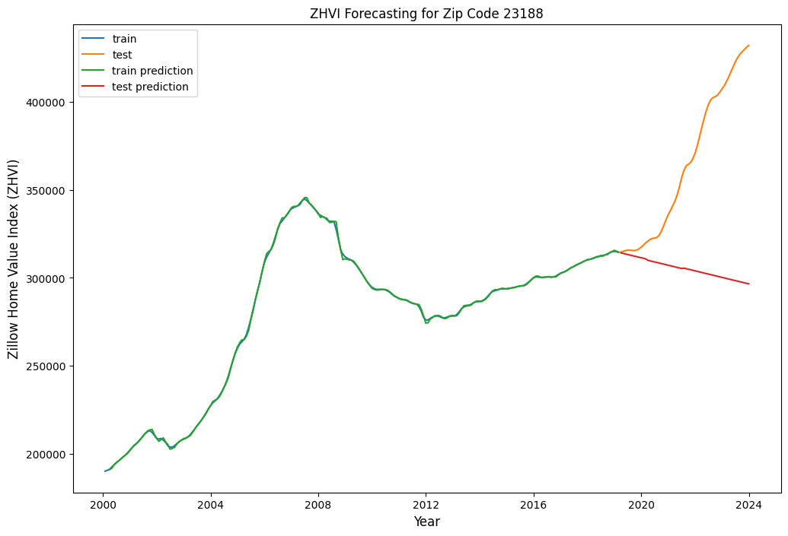

<table border="1" class="dataframe">
  <thead>
    <tr style="text-align: right;">
      <th></th>
      <th>RegionID</th>
      <th>SizeRank</th>
      <th>RegionName</th>
      <th>RegionType</th>
      <th>StateName</th>
      <th>State</th>
      <th>City</th>
      <th>Metro</th>
      <th>CountyName</th>
      <th>2000-01-31</th>
      <th>...</th>
      <th>2023-03-31</th>
      <th>2023-04-30</th>
      <th>2023-05-31</th>
      <th>2023-06-30</th>
      <th>2023-07-31</th>
      <th>2023-08-31</th>
      <th>2023-09-30</th>
      <th>2023-10-31</th>
      <th>2023-11-30</th>
      <th>2023-12-31</th>
    </tr>
  </thead>
  <tbody>
    <tr>
      <th>0</th>
      <td>91982</td>
      <td>1</td>
      <td>77494</td>
      <td>zip</td>
      <td>TX</td>
      <td>TX</td>
      <td>Katy</td>
      <td>Houston-The Woodlands-Sugar Land, TX</td>
      <td>Fort Bend County</td>
      <td>208752.177188</td>
      <td>...</td>
      <td>468400.012962</td>
      <td>469600.790271</td>
      <td>471587.869725</td>
      <td>474687.471351</td>
      <td>477460.027392</td>
      <td>479919.299106</td>
      <td>481726.908022</td>
      <td>482958.479293</td>
      <td>483644.390919</td>
      <td>484254.484150</td>
    </tr>
    <tr>
      <th>1</th>
      <td>61148</td>
      <td>2</td>
      <td>8701</td>
      <td>zip</td>
      <td>NJ</td>
      <td>NJ</td>
      <td>Lakewood</td>
      <td>New York-Newark-Jersey City, NY-NJ-PA</td>
      <td>Ocean County</td>
      <td>133799.965954</td>
      <td>...</td>
      <td>517054.419786</td>
      <td>521100.063176</td>
      <td>526320.736228</td>
      <td>532105.809020</td>
      <td>538056.023382</td>
      <td>543798.549494</td>
      <td>549960.546654</td>
      <td>557112.585902</td>
      <td>563739.635747</td>
      <td>568385.787815</td>
    </tr>
    <tr>
      <th>2</th>
      <td>91940</td>
      <td>3</td>
      <td>77449</td>
      <td>zip</td>
      <td>TX</td>
      <td>TX</td>
      <td>Katy</td>
      <td>Houston-The Woodlands-Sugar Land, TX</td>
      <td>Harris County</td>
      <td>102327.332899</td>
      <td>...</td>
      <td>274575.011824</td>
      <td>273391.851083</td>
      <td>272916.706411</td>
      <td>273291.932508</td>
      <td>274045.370378</td>
      <td>274933.235990</td>
      <td>275461.772882</td>
      <td>275451.663963</td>
      <td>275219.130604</td>
      <td>274931.001539</td>
    </tr>
    <tr>
      <th>3</th>
      <td>62080</td>
      <td>4</td>
      <td>11368</td>
      <td>zip</td>
      <td>NY</td>
      <td>NY</td>
      <td>New York</td>
      <td>New York-Newark-Jersey City, NY-NJ-PA</td>
      <td>Queens County</td>
      <td>147672.475058</td>
      <td>...</td>
      <td>480340.864596</td>
      <td>473730.902787</td>
      <td>466644.010241</td>
      <td>461261.507623</td>
      <td>459443.414913</td>
      <td>459437.482269</td>
      <td>458881.548977</td>
      <td>456860.171677</td>
      <td>453514.767036</td>
      <td>449239.710048</td>
    </tr>
    <tr>
      <th>4</th>
      <td>91733</td>
      <td>5</td>
      <td>77084</td>
      <td>zip</td>
      <td>TX</td>
      <td>TX</td>
      <td>Houston</td>
      <td>Houston-The Woodlands-Sugar Land, TX</td>
      <td>Harris County</td>
      <td>100957.722364</td>
      <td>...</td>
      <td>267553.019024</td>
      <td>266769.398609</td>
      <td>266628.259422</td>
      <td>267219.988459</td>
      <td>268054.762069</td>
      <td>268918.974834</td>
      <td>269342.669492</td>
      <td>269333.119699</td>
      <td>268917.017812</td>
      <td>268499.368493</td>
    </tr>
  </tbody>
</table>

5 rows × 297 columns

    Index(['RegionID', 'SizeRank', 'RegionName', 'RegionType', 'StateName',
           'State', 'City', 'Metro', 'CountyName', '2000-01-31',
           ...
           '2023-03-31', '2023-04-30', '2023-05-31', '2023-06-30', '2023-07-31',
           '2023-08-31', '2023-09-30', '2023-10-31', '2023-11-30', '2023-12-31'],
          dtype='object', length=297)

    (26354, 297)

<table border="1" class="dataframe">
  <thead>
    <tr style="text-align: right;">
      <th></th>
      <th>0</th>
      <th>1</th>
      <th>2</th>
      <th>3</th>
      <th>4</th>
      <th>5</th>
      <th>6</th>
      <th>7</th>
      <th>8</th>
      <th>9</th>
      <th>...</th>
      <th>26344</th>
      <th>26345</th>
      <th>26346</th>
      <th>26347</th>
      <th>26348</th>
      <th>26349</th>
      <th>26350</th>
      <th>26351</th>
      <th>26352</th>
      <th>26353</th>
    </tr>
  </thead>
  <tbody>
    <tr>
      <th>2000-01-31</th>
      <td>208752.177188</td>
      <td>133799.965954</td>
      <td>102327.332899</td>
      <td>147672.475058</td>
      <td>100957.722364</td>
      <td>89209.529378</td>
      <td>260775.195493</td>
      <td>153242.924036</td>
      <td>181060.959958</td>
      <td>112567.262934</td>
      <td>...</td>
      <td>NaN</td>
      <td>NaN</td>
      <td>NaN</td>
      <td>92897.827606</td>
      <td>NaN</td>
      <td>NaN</td>
      <td>NaN</td>
      <td>NaN</td>
      <td>NaN</td>
      <td>NaN</td>
    </tr>
    <tr>
      <th>2000-02-29</th>
      <td>208933.355223</td>
      <td>134352.196216</td>
      <td>102341.472343</td>
      <td>149140.189415</td>
      <td>100915.381721</td>
      <td>89194.374796</td>
      <td>261897.642882</td>
      <td>153540.930524</td>
      <td>181301.483813</td>
      <td>113020.027694</td>
      <td>...</td>
      <td>NaN</td>
      <td>NaN</td>
      <td>NaN</td>
      <td>93242.611189</td>
      <td>NaN</td>
      <td>NaN</td>
      <td>NaN</td>
      <td>NaN</td>
      <td>NaN</td>
      <td>NaN</td>
    </tr>
    <tr>
      <th>2000-03-31</th>
      <td>209417.484597</td>
      <td>134725.444700</td>
      <td>102215.866898</td>
      <td>150242.618161</td>
      <td>100736.106679</td>
      <td>89213.721442</td>
      <td>263318.510956</td>
      <td>153690.642549</td>
      <td>181605.552842</td>
      <td>113694.729026</td>
      <td>...</td>
      <td>NaN</td>
      <td>NaN</td>
      <td>NaN</td>
      <td>93555.552949</td>
      <td>NaN</td>
      <td>NaN</td>
      <td>NaN</td>
      <td>NaN</td>
      <td>NaN</td>
      <td>NaN</td>
    </tr>
    <tr>
      <th>2000-04-30</th>
      <td>210395.321387</td>
      <td>135671.036962</td>
      <td>102206.257761</td>
      <td>152082.798879</td>
      <td>100654.202432</td>
      <td>89190.711160</td>
      <td>265320.337636</td>
      <td>154078.667948</td>
      <td>182443.232876</td>
      <td>114738.515131</td>
      <td>...</td>
      <td>NaN</td>
      <td>NaN</td>
      <td>NaN</td>
      <td>93591.534454</td>
      <td>NaN</td>
      <td>NaN</td>
      <td>NaN</td>
      <td>NaN</td>
      <td>NaN</td>
      <td>NaN</td>
    </tr>
    <tr>
      <th>2000-05-31</th>
      <td>210430.298443</td>
      <td>136654.797404</td>
      <td>102252.914700</td>
      <td>153402.530230</td>
      <td>100629.838251</td>
      <td>89215.579690</td>
      <td>266758.899723</td>
      <td>154412.141624</td>
      <td>183719.323956</td>
      <td>115661.091881</td>
      <td>...</td>
      <td>NaN</td>
      <td>NaN</td>
      <td>NaN</td>
      <td>93761.792886</td>
      <td>NaN</td>
      <td>NaN</td>
      <td>NaN</td>
      <td>NaN</td>
      <td>NaN</td>
      <td>NaN</td>
    </tr>
    <tr>
      <th>...</th>
      <td>...</td>
      <td>...</td>
      <td>...</td>
      <td>...</td>
      <td>...</td>
      <td>...</td>
      <td>...</td>
      <td>...</td>
      <td>...</td>
      <td>...</td>
      <td>...</td>
      <td>...</td>
      <td>...</td>
      <td>...</td>
      <td>...</td>
      <td>...</td>
      <td>...</td>
      <td>...</td>
      <td>...</td>
      <td>...</td>
      <td>...</td>
    </tr>
    <tr>
      <th>2023-08-31</th>
      <td>479919.299106</td>
      <td>543798.549494</td>
      <td>274933.235990</td>
      <td>459437.482269</td>
      <td>268918.974834</td>
      <td>202834.973696</td>
      <td>794531.597036</td>
      <td>404537.125588</td>
      <td>657428.859504</td>
      <td>555302.427921</td>
      <td>...</td>
      <td>349103.150059</td>
      <td>180495.338305</td>
      <td>177392.795295</td>
      <td>203073.135906</td>
      <td>84201.214216</td>
      <td>339422.454131</td>
      <td>175266.666374</td>
      <td>102138.167674</td>
      <td>103008.548422</td>
      <td>188893.327101</td>
    </tr>
    <tr>
      <th>2023-09-30</th>
      <td>481726.908022</td>
      <td>549960.546654</td>
      <td>275461.772882</td>
      <td>458881.548977</td>
      <td>269342.669492</td>
      <td>203766.774891</td>
      <td>792554.183994</td>
      <td>402707.518398</td>
      <td>656723.666185</td>
      <td>562943.391380</td>
      <td>...</td>
      <td>350525.216453</td>
      <td>179971.338387</td>
      <td>176375.701615</td>
      <td>204330.536466</td>
      <td>84705.676269</td>
      <td>341345.810653</td>
      <td>175371.383285</td>
      <td>102509.371773</td>
      <td>104356.053262</td>
      <td>189526.836516</td>
    </tr>
    <tr>
      <th>2023-10-31</th>
      <td>482958.479293</td>
      <td>557112.585902</td>
      <td>275451.663963</td>
      <td>456860.171677</td>
      <td>269333.119699</td>
      <td>204465.130798</td>
      <td>791285.829718</td>
      <td>400968.770012</td>
      <td>655585.521751</td>
      <td>569213.775274</td>
      <td>...</td>
      <td>351066.696656</td>
      <td>179101.409734</td>
      <td>175829.886878</td>
      <td>204894.639796</td>
      <td>85641.204921</td>
      <td>342917.881661</td>
      <td>175565.910147</td>
      <td>103003.798605</td>
      <td>105233.060031</td>
      <td>190129.583364</td>
    </tr>
    <tr>
      <th>2023-11-30</th>
      <td>483644.390919</td>
      <td>563739.635747</td>
      <td>275219.130604</td>
      <td>453514.767036</td>
      <td>268917.017812</td>
      <td>204640.102855</td>
      <td>790059.804507</td>
      <td>399185.708326</td>
      <td>655055.195335</td>
      <td>574733.557641</td>
      <td>...</td>
      <td>351217.036317</td>
      <td>177946.680047</td>
      <td>175541.800674</td>
      <td>204736.905723</td>
      <td>86506.384636</td>
      <td>343768.957866</td>
      <td>175480.717039</td>
      <td>102776.008170</td>
      <td>105655.210102</td>
      <td>190661.229579</td>
    </tr>
    <tr>
      <th>2023-12-31</th>
      <td>484254.484150</td>
      <td>568385.787815</td>
      <td>274931.001539</td>
      <td>449239.710048</td>
      <td>268499.368493</td>
      <td>204820.250162</td>
      <td>789922.404553</td>
      <td>397292.509346</td>
      <td>656671.669776</td>
      <td>578625.465840</td>
      <td>...</td>
      <td>351324.667325</td>
      <td>176831.704775</td>
      <td>175871.874494</td>
      <td>202979.091676</td>
      <td>87050.209550</td>
      <td>344129.353257</td>
      <td>175335.009772</td>
      <td>102900.456065</td>
      <td>105737.932944</td>
      <td>191578.956245</td>
    </tr>
  </tbody>
</table>

288 rows × 26354 columns

    (26354, 297)

    cutoff: 23719
    

<table border="1" class="dataframe">
  <thead>
    <tr style="text-align: right;">
      <th></th>
      <th>ZCTA5CE10</th>
      <th>GEOID10</th>
      <th>CLASSFP10</th>
      <th>MTFCC10</th>
      <th>FUNCSTAT10</th>
      <th>ALAND10</th>
      <th>AWATER10</th>
      <th>INTPTLAT10</th>
      <th>INTPTLON10</th>
      <th>geometry</th>
    </tr>
  </thead>
  <tbody>
    <tr>
      <th>0</th>
      <td>43451</td>
      <td>43451</td>
      <td>B5</td>
      <td>G6350</td>
      <td>S</td>
      <td>63484186</td>
      <td>157689</td>
      <td>+41.3183010</td>
      <td>-083.6174935</td>
      <td>POLYGON ((-83.70873 41.32733, -83.70815 41.327...</td>
    </tr>
    <tr>
      <th>1</th>
      <td>43452</td>
      <td>43452</td>
      <td>B5</td>
      <td>G6350</td>
      <td>S</td>
      <td>121522304</td>
      <td>13721730</td>
      <td>+41.5157923</td>
      <td>-082.9809454</td>
      <td>POLYGON ((-83.08698 41.53780, -83.08256 41.537...</td>
    </tr>
    <tr>
      <th>2</th>
      <td>43456</td>
      <td>43456</td>
      <td>B5</td>
      <td>G6350</td>
      <td>S</td>
      <td>9320975</td>
      <td>1003775</td>
      <td>+41.6318300</td>
      <td>-082.8393923</td>
      <td>MULTIPOLYGON (((-82.83558 41.71082, -82.83515 ...</td>
    </tr>
    <tr>
      <th>3</th>
      <td>43457</td>
      <td>43457</td>
      <td>B5</td>
      <td>G6350</td>
      <td>S</td>
      <td>48004681</td>
      <td>0</td>
      <td>+41.2673301</td>
      <td>-083.4274872</td>
      <td>POLYGON ((-83.49650 41.25371, -83.48382 41.253...</td>
    </tr>
    <tr>
      <th>4</th>
      <td>43458</td>
      <td>43458</td>
      <td>B5</td>
      <td>G6350</td>
      <td>S</td>
      <td>2573816</td>
      <td>39915</td>
      <td>+41.5304461</td>
      <td>-083.2133648</td>
      <td>POLYGON ((-83.22229 41.53102, -83.22228 41.532...</td>
    </tr>
  </tbody>
</table>

    0     23089
    1     23093
    2     23102
    3     23103
    4     23106
          ...  
    80    23038
    81    23039
    82    23047
    83    23059
    84    23060
    Name: GEOID10, Length: 85, dtype: int32

    Index(['RegionID', 'SizeRank', 'RegionName', 'RegionType', 'StateName',
           'State', 'City', 'Metro', 'CountyName', '2000-01-31',
           ...
           '2023-03-31', '2023-04-30', '2023-05-31', '2023-06-30', '2023-07-31',
           '2023-08-31', '2023-09-30', '2023-10-31', '2023-11-30', '2023-12-31'],
          dtype='object', length=297)

    len(exog): 230
    

    C:\Users\rsingh\anaconda3\lib\site-packages\statsmodels\tsa\base\tsa_model.py:471: ValueWarning: No frequency information was provided, so inferred frequency M will be used.
      self._init_dates(dates, freq)
    C:\Users\rsingh\anaconda3\lib\site-packages\statsmodels\tsa\base\tsa_model.py:471: ValueWarning: No frequency information was provided, so inferred frequency M will be used.
      self._init_dates(dates, freq)
    C:\Users\rsingh\anaconda3\lib\site-packages\statsmodels\tsa\base\tsa_model.py:471: ValueWarning: No frequency information was provided, so inferred frequency M will be used.
      self._init_dates(dates, freq)
    C:\Users\rsingh\anaconda3\lib\site-packages\statsmodels\tsa\base\tsa_model.py:471: ValueWarning: No frequency information was provided, so inferred frequency M will be used.
      self._init_dates(dates, freq)
    C:\Users\rsingh\anaconda3\lib\site-packages\statsmodels\tsa\base\tsa_model.py:471: ValueWarning: No frequency information was provided, so inferred frequency M will be used.
      self._init_dates(dates, freq)
    C:\Users\rsingh\anaconda3\lib\site-packages\statsmodels\tsa\base\tsa_model.py:471: ValueWarning: No frequency information was provided, so inferred frequency M will be used.
      self._init_dates(dates, freq)
    C:\Users\rsingh\anaconda3\lib\site-packages\statsmodels\tsa\base\tsa_model.py:471: ValueWarning: No frequency information was provided, so inferred frequency M will be used.
      self._init_dates(dates, freq)
    C:\Users\rsingh\anaconda3\lib\site-packages\statsmodels\tsa\base\tsa_model.py:471: ValueWarning: No frequency information was provided, so inferred frequency M will be used.
      self._init_dates(dates, freq)
    C:\Users\rsingh\anaconda3\lib\site-packages\statsmodels\tsa\base\tsa_model.py:471: ValueWarning: No frequency information was provided, so inferred frequency M will be used.
      self._init_dates(dates, freq)
    C:\Users\rsingh\anaconda3\lib\site-packages\statsmodels\tsa\base\tsa_model.py:471: ValueWarning: No frequency information was provided, so inferred frequency M will be used.
      self._init_dates(dates, freq)
    C:\Users\rsingh\anaconda3\lib\site-packages\statsmodels\tsa\base\tsa_model.py:471: ValueWarning: No frequency information was provided, so inferred frequency M will be used.
      self._init_dates(dates, freq)
    C:\Users\rsingh\anaconda3\lib\site-packages\statsmodels\tsa\base\tsa_model.py:471: ValueWarning: No frequency information was provided, so inferred frequency M will be used.
      self._init_dates(dates, freq)
    C:\Users\rsingh\anaconda3\lib\site-packages\statsmodels\tsa\base\tsa_model.py:471: ValueWarning: No frequency information was provided, so inferred frequency M will be used.
      self._init_dates(dates, freq)
    C:\Users\rsingh\anaconda3\lib\site-packages\statsmodels\tsa\base\tsa_model.py:471: ValueWarning: No frequency information was provided, so inferred frequency M will be used.
      self._init_dates(dates, freq)
    C:\Users\rsingh\anaconda3\lib\site-packages\statsmodels\tsa\base\tsa_model.py:471: ValueWarning: No frequency information was provided, so inferred frequency M will be used.
      self._init_dates(dates, freq)
    C:\Users\rsingh\anaconda3\lib\site-packages\statsmodels\tsa\base\tsa_model.py:471: ValueWarning: No frequency information was provided, so inferred frequency M will be used.
      self._init_dates(dates, freq)
    C:\Users\rsingh\anaconda3\lib\site-packages\statsmodels\tsa\base\tsa_model.py:471: ValueWarning: No frequency information was provided, so inferred frequency M will be used.
      self._init_dates(dates, freq)
    C:\Users\rsingh\anaconda3\lib\site-packages\statsmodels\tsa\base\tsa_model.py:471: ValueWarning: No frequency information was provided, so inferred frequency M will be used.
      self._init_dates(dates, freq)
    C:\Users\rsingh\anaconda3\lib\site-packages\statsmodels\tsa\base\tsa_model.py:471: ValueWarning: No frequency information was provided, so inferred frequency M will be used.
      self._init_dates(dates, freq)
    C:\Users\rsingh\anaconda3\lib\site-packages\statsmodels\tsa\base\tsa_model.py:471: ValueWarning: No frequency information was provided, so inferred frequency M will be used.
      self._init_dates(dates, freq)
    C:\Users\rsingh\anaconda3\lib\site-packages\statsmodels\tsa\base\tsa_model.py:471: ValueWarning: No frequency information was provided, so inferred frequency M will be used.
      self._init_dates(dates, freq)
    C:\Users\rsingh\anaconda3\lib\site-packages\statsmodels\tsa\base\tsa_model.py:471: ValueWarning: No frequency information was provided, so inferred frequency M will be used.
      self._init_dates(dates, freq)
    C:\Users\rsingh\anaconda3\lib\site-packages\statsmodels\tsa\base\tsa_model.py:471: ValueWarning: No frequency information was provided, so inferred frequency M will be used.
      self._init_dates(dates, freq)
    C:\Users\rsingh\anaconda3\lib\site-packages\statsmodels\tsa\base\tsa_model.py:471: ValueWarning: No frequency information was provided, so inferred frequency M will be used.
      self._init_dates(dates, freq)
    C:\Users\rsingh\anaconda3\lib\site-packages\statsmodels\tsa\base\tsa_model.py:471: ValueWarning: No frequency information was provided, so inferred frequency M will be used.
      self._init_dates(dates, freq)
    C:\Users\rsingh\anaconda3\lib\site-packages\statsmodels\tsa\base\tsa_model.py:471: ValueWarning: No frequency information was provided, so inferred frequency M will be used.
      self._init_dates(dates, freq)
    C:\Users\rsingh\anaconda3\lib\site-packages\statsmodels\tsa\base\tsa_model.py:471: ValueWarning: No frequency information was provided, so inferred frequency M will be used.
      self._init_dates(dates, freq)
    C:\Users\rsingh\anaconda3\lib\site-packages\statsmodels\tsa\base\tsa_model.py:471: ValueWarning: No frequency information was provided, so inferred frequency M will be used.
      self._init_dates(dates, freq)
    C:\Users\rsingh\anaconda3\lib\site-packages\statsmodels\tsa\base\tsa_model.py:471: ValueWarning: No frequency information was provided, so inferred frequency M will be used.
      self._init_dates(dates, freq)
    C:\Users\rsingh\anaconda3\lib\site-packages\statsmodels\tsa\base\tsa_model.py:471: ValueWarning: No frequency information was provided, so inferred frequency M will be used.
      self._init_dates(dates, freq)
    C:\Users\rsingh\anaconda3\lib\site-packages\statsmodels\tsa\base\tsa_model.py:471: ValueWarning: No frequency information was provided, so inferred frequency M will be used.
      self._init_dates(dates, freq)
    C:\Users\rsingh\anaconda3\lib\site-packages\statsmodels\tsa\base\tsa_model.py:471: ValueWarning: No frequency information was provided, so inferred frequency M will be used.
      self._init_dates(dates, freq)
    C:\Users\rsingh\anaconda3\lib\site-packages\statsmodels\tsa\base\tsa_model.py:471: ValueWarning: No frequency information was provided, so inferred frequency M will be used.
      self._init_dates(dates, freq)
    C:\Users\rsingh\anaconda3\lib\site-packages\statsmodels\tsa\base\tsa_model.py:471: ValueWarning: No frequency information was provided, so inferred frequency M will be used.
      self._init_dates(dates, freq)
    C:\Users\rsingh\anaconda3\lib\site-packages\statsmodels\tsa\base\tsa_model.py:471: ValueWarning: No frequency information was provided, so inferred frequency M will be used.
      self._init_dates(dates, freq)
    C:\Users\rsingh\anaconda3\lib\site-packages\statsmodels\tsa\base\tsa_model.py:471: ValueWarning: No frequency information was provided, so inferred frequency M will be used.
      self._init_dates(dates, freq)
    C:\Users\rsingh\anaconda3\lib\site-packages\statsmodels\tsa\base\tsa_model.py:471: ValueWarning: No frequency information was provided, so inferred frequency M will be used.
      self._init_dates(dates, freq)
    C:\Users\rsingh\anaconda3\lib\site-packages\statsmodels\tsa\statespace\sarimax.py:978: UserWarning: Non-invertible starting MA parameters found. Using zeros as starting parameters.
      warn('Non-invertible starting MA parameters found.'
    C:\Users\rsingh\anaconda3\lib\site-packages\statsmodels\tsa\base\tsa_model.py:471: ValueWarning: No frequency information was provided, so inferred frequency M will be used.
      self._init_dates(dates, freq)
    C:\Users\rsingh\anaconda3\lib\site-packages\statsmodels\tsa\statespace\sarimax.py:978: UserWarning: Non-invertible starting MA parameters found. Using zeros as starting parameters.
      warn('Non-invertible starting MA parameters found.'
    C:\Users\rsingh\anaconda3\lib\site-packages\statsmodels\tsa\base\tsa_model.py:471: ValueWarning: No frequency information was provided, so inferred frequency M will be used.
      self._init_dates(dates, freq)
    C:\Users\rsingh\anaconda3\lib\site-packages\statsmodels\tsa\statespace\sarimax.py:978: UserWarning: Non-invertible starting MA parameters found. Using zeros as starting parameters.
      warn('Non-invertible starting MA parameters found.'
    C:\Users\rsingh\anaconda3\lib\site-packages\statsmodels\tsa\base\tsa_model.py:471: ValueWarning: No frequency information was provided, so inferred frequency M will be used.
      self._init_dates(dates, freq)
    C:\Users\rsingh\anaconda3\lib\site-packages\statsmodels\tsa\statespace\sarimax.py:978: UserWarning: Non-invertible starting MA parameters found. Using zeros as starting parameters.
      warn('Non-invertible starting MA parameters found.'
    C:\Users\rsingh\anaconda3\lib\site-packages\statsmodels\tsa\base\tsa_model.py:471: ValueWarning: No frequency information was provided, so inferred frequency M will be used.
      self._init_dates(dates, freq)
    C:\Users\rsingh\anaconda3\lib\site-packages\statsmodels\tsa\base\tsa_model.py:471: ValueWarning: No frequency information was provided, so inferred frequency M will be used.
      self._init_dates(dates, freq)
    C:\Users\rsingh\anaconda3\lib\site-packages\statsmodels\base\model.py:604: ConvergenceWarning: Maximum Likelihood optimization failed to converge. Check mle_retvals
      warnings.warn("Maximum Likelihood optimization failed to "
    C:\Users\rsingh\anaconda3\lib\site-packages\statsmodels\tsa\base\tsa_model.py:471: ValueWarning: No frequency information was provided, so inferred frequency M will be used.
      self._init_dates(dates, freq)
    C:\Users\rsingh\anaconda3\lib\site-packages\statsmodels\tsa\base\tsa_model.py:471: ValueWarning: No frequency information was provided, so inferred frequency M will be used.
      self._init_dates(dates, freq)
    C:\Users\rsingh\anaconda3\lib\site-packages\statsmodels\base\model.py:604: ConvergenceWarning: Maximum Likelihood optimization failed to converge. Check mle_retvals
      warnings.warn("Maximum Likelihood optimization failed to "
    C:\Users\rsingh\anaconda3\lib\site-packages\statsmodels\tsa\base\tsa_model.py:471: ValueWarning: No frequency information was provided, so inferred frequency M will be used.
      self._init_dates(dates, freq)
    C:\Users\rsingh\anaconda3\lib\site-packages\statsmodels\base\model.py:604: ConvergenceWarning: Maximum Likelihood optimization failed to converge. Check mle_retvals
      warnings.warn("Maximum Likelihood optimization failed to "
    C:\Users\rsingh\anaconda3\lib\site-packages\statsmodels\tsa\base\tsa_model.py:471: ValueWarning: No frequency information was provided, so inferred frequency M will be used.
      self._init_dates(dates, freq)
    C:\Users\rsingh\anaconda3\lib\site-packages\statsmodels\base\model.py:604: ConvergenceWarning: Maximum Likelihood optimization failed to converge. Check mle_retvals
      warnings.warn("Maximum Likelihood optimization failed to "
    C:\Users\rsingh\anaconda3\lib\site-packages\statsmodels\tsa\base\tsa_model.py:471: ValueWarning: No frequency information was provided, so inferred frequency M will be used.
      self._init_dates(dates, freq)
    C:\Users\rsingh\anaconda3\lib\site-packages\statsmodels\base\model.py:604: ConvergenceWarning: Maximum Likelihood optimization failed to converge. Check mle_retvals
      warnings.warn("Maximum Likelihood optimization failed to "
    C:\Users\rsingh\anaconda3\lib\site-packages\statsmodels\tsa\base\tsa_model.py:471: ValueWarning: No frequency information was provided, so inferred frequency M will be used.
      self._init_dates(dates, freq)
    C:\Users\rsingh\anaconda3\lib\site-packages\statsmodels\base\model.py:604: ConvergenceWarning: Maximum Likelihood optimization failed to converge. Check mle_retvals
      warnings.warn("Maximum Likelihood optimization failed to "
    C:\Users\rsingh\anaconda3\lib\site-packages\statsmodels\tsa\base\tsa_model.py:471: ValueWarning: No frequency information was provided, so inferred frequency M will be used.
      self._init_dates(dates, freq)
    C:\Users\rsingh\anaconda3\lib\site-packages\statsmodels\tsa\base\tsa_model.py:471: ValueWarning: No frequency information was provided, so inferred frequency M will be used.
      self._init_dates(dates, freq)
    C:\Users\rsingh\anaconda3\lib\site-packages\statsmodels\tsa\base\tsa_model.py:471: ValueWarning: No frequency information was provided, so inferred frequency M will be used.
      self._init_dates(dates, freq)
    C:\Users\rsingh\anaconda3\lib\site-packages\statsmodels\tsa\base\tsa_model.py:471: ValueWarning: No frequency information was provided, so inferred frequency M will be used.
      self._init_dates(dates, freq)
    C:\Users\rsingh\anaconda3\lib\site-packages\statsmodels\tsa\base\tsa_model.py:471: ValueWarning: No frequency information was provided, so inferred frequency M will be used.
      self._init_dates(dates, freq)
    C:\Users\rsingh\anaconda3\lib\site-packages\statsmodels\tsa\base\tsa_model.py:471: ValueWarning: No frequency information was provided, so inferred frequency M will be used.
      self._init_dates(dates, freq)
    C:\Users\rsingh\anaconda3\lib\site-packages\statsmodels\tsa\base\tsa_model.py:471: ValueWarning: No frequency information was provided, so inferred frequency M will be used.
      self._init_dates(dates, freq)
    C:\Users\rsingh\anaconda3\lib\site-packages\statsmodels\tsa\base\tsa_model.py:471: ValueWarning: No frequency information was provided, so inferred frequency M will be used.
      self._init_dates(dates, freq)
    C:\Users\rsingh\anaconda3\lib\site-packages\statsmodels\tsa\base\tsa_model.py:471: ValueWarning: No frequency information was provided, so inferred frequency M will be used.
      self._init_dates(dates, freq)
    C:\Users\rsingh\anaconda3\lib\site-packages\statsmodels\tsa\base\tsa_model.py:471: ValueWarning: No frequency information was provided, so inferred frequency M will be used.
      self._init_dates(dates, freq)
    C:\Users\rsingh\anaconda3\lib\site-packages\statsmodels\tsa\base\tsa_model.py:471: ValueWarning: No frequency information was provided, so inferred frequency M will be used.
      self._init_dates(dates, freq)
    C:\Users\rsingh\anaconda3\lib\site-packages\statsmodels\base\model.py:604: ConvergenceWarning: Maximum Likelihood optimization failed to converge. Check mle_retvals
      warnings.warn("Maximum Likelihood optimization failed to "
    C:\Users\rsingh\anaconda3\lib\site-packages\statsmodels\tsa\base\tsa_model.py:471: ValueWarning: No frequency information was provided, so inferred frequency M will be used.
      self._init_dates(dates, freq)
    C:\Users\rsingh\anaconda3\lib\site-packages\statsmodels\base\model.py:604: ConvergenceWarning: Maximum Likelihood optimization failed to converge. Check mle_retvals
      warnings.warn("Maximum Likelihood optimization failed to "
    C:\Users\rsingh\anaconda3\lib\site-packages\statsmodels\tsa\base\tsa_model.py:471: ValueWarning: No frequency information was provided, so inferred frequency M will be used.
      self._init_dates(dates, freq)
    C:\Users\rsingh\anaconda3\lib\site-packages\statsmodels\base\model.py:604: ConvergenceWarning: Maximum Likelihood optimization failed to converge. Check mle_retvals
      warnings.warn("Maximum Likelihood optimization failed to "
    C:\Users\rsingh\anaconda3\lib\site-packages\statsmodels\tsa\base\tsa_model.py:471: ValueWarning: No frequency information was provided, so inferred frequency M will be used.
      self._init_dates(dates, freq)
    C:\Users\rsingh\anaconda3\lib\site-packages\statsmodels\base\model.py:604: ConvergenceWarning: Maximum Likelihood optimization failed to converge. Check mle_retvals
      warnings.warn("Maximum Likelihood optimization failed to "
    C:\Users\rsingh\anaconda3\lib\site-packages\statsmodels\tsa\base\tsa_model.py:471: ValueWarning: No frequency information was provided, so inferred frequency M will be used.
      self._init_dates(dates, freq)
    C:\Users\rsingh\anaconda3\lib\site-packages\statsmodels\base\model.py:604: ConvergenceWarning: Maximum Likelihood optimization failed to converge. Check mle_retvals
      warnings.warn("Maximum Likelihood optimization failed to "
    C:\Users\rsingh\anaconda3\lib\site-packages\statsmodels\tsa\base\tsa_model.py:471: ValueWarning: No frequency information was provided, so inferred frequency M will be used.
      self._init_dates(dates, freq)
    C:\Users\rsingh\anaconda3\lib\site-packages\statsmodels\base\model.py:604: ConvergenceWarning: Maximum Likelihood optimization failed to converge. Check mle_retvals
      warnings.warn("Maximum Likelihood optimization failed to "
    C:\Users\rsingh\anaconda3\lib\site-packages\statsmodels\tsa\base\tsa_model.py:471: ValueWarning: No frequency information was provided, so inferred frequency M will be used.
      self._init_dates(dates, freq)
    C:\Users\rsingh\anaconda3\lib\site-packages\statsmodels\tsa\statespace\sarimax.py:978: UserWarning: Non-invertible starting MA parameters found. Using zeros as starting parameters.
      warn('Non-invertible starting MA parameters found.'
    

    cutoff: 230
    len(train): 230
    len(exog_train): 230
    len(test): 58
    len(exog_test): 58
                                         SARIMAX Results                                      
    ==========================================================================================
    Dep. Variable:     Zillow Home Value Index (ZHVI)   No. Observations:                  230
    Model:                           SARIMAX(2, 2, 1)   Log Likelihood               -1765.779
    Date:                            Sat, 27 Jan 2024   AIC                           3541.559
    Time:                                    01:35:47   BIC                           3558.706
    Sample:                                01-31-2000   HQIC                          3548.477
                                         - 02-28-2019                                         
    Covariance Type:                              opg                                         
    =========================================================================================
                                coef    std err          z      P>|z|      [0.025      0.975]
    -----------------------------------------------------------------------------------------
    financial_crisis_flag    65.2649    511.953      0.127      0.899    -938.145    1068.675
    ar.L1                     0.5859      0.314      1.868      0.062      -0.029       1.201
    ar.L2                    -0.0649      0.019     -3.421      0.001      -0.102      -0.028
    ma.L1                    -0.5617      0.314     -1.791      0.073      -1.177       0.053
    sigma2                 3.009e+05   1.15e+04     26.197      0.000    2.78e+05    3.23e+05
    ===================================================================================
    Ljung-Box (L1) (Q):                  11.36   Jarque-Bera (JB):              1931.19
    Prob(Q):                              0.00   Prob(JB):                         0.00
    Heteroskedasticity (H):               0.11   Skew:                            -1.33
    Prob(H) (two-sided):                  0.00   Kurtosis:                        17.01
    ===================================================================================
    
    Warnings:
    [1] Covariance matrix calculated using the outer product of gradients (complex-step).
    Test RMSE: 33254.056059205395
    Parameters Used: ((2, 2, 1), (0, 0, 0, 12))
    

    

    

    len(exog_forecast) Forecast time period in months: 58
    len(exog): 144
    

    C:\Users\rsingh\anaconda3\lib\site-packages\statsmodels\tsa\base\tsa_model.py:471: ValueWarning: No frequency information was provided, so inferred frequency M will be used.
      self._init_dates(dates, freq)
    C:\Users\rsingh\anaconda3\lib\site-packages\statsmodels\tsa\base\tsa_model.py:471: ValueWarning: No frequency information was provided, so inferred frequency M will be used.
      self._init_dates(dates, freq)
    C:\Users\rsingh\anaconda3\lib\site-packages\statsmodels\tsa\base\tsa_model.py:471: ValueWarning: No frequency information was provided, so inferred frequency M will be used.
      self._init_dates(dates, freq)
    C:\Users\rsingh\anaconda3\lib\site-packages\statsmodels\tsa\base\tsa_model.py:471: ValueWarning: No frequency information was provided, so inferred frequency M will be used.
      self._init_dates(dates, freq)
    C:\Users\rsingh\anaconda3\lib\site-packages\statsmodels\tsa\base\tsa_model.py:471: ValueWarning: No frequency information was provided, so inferred frequency M will be used.
      self._init_dates(dates, freq)
    C:\Users\rsingh\anaconda3\lib\site-packages\statsmodels\tsa\base\tsa_model.py:471: ValueWarning: No frequency information was provided, so inferred frequency M will be used.
      self._init_dates(dates, freq)
    C:\Users\rsingh\anaconda3\lib\site-packages\statsmodels\tsa\base\tsa_model.py:471: ValueWarning: No frequency information was provided, so inferred frequency M will be used.
      self._init_dates(dates, freq)
    C:\Users\rsingh\anaconda3\lib\site-packages\statsmodels\tsa\base\tsa_model.py:471: ValueWarning: No frequency information was provided, so inferred frequency M will be used.
      self._init_dates(dates, freq)
    C:\Users\rsingh\anaconda3\lib\site-packages\statsmodels\tsa\base\tsa_model.py:471: ValueWarning: No frequency information was provided, so inferred frequency M will be used.
      self._init_dates(dates, freq)
    C:\Users\rsingh\anaconda3\lib\site-packages\statsmodels\tsa\base\tsa_model.py:471: ValueWarning: No frequency information was provided, so inferred frequency M will be used.
      self._init_dates(dates, freq)
    C:\Users\rsingh\anaconda3\lib\site-packages\statsmodels\tsa\base\tsa_model.py:471: ValueWarning: No frequency information was provided, so inferred frequency M will be used.
      self._init_dates(dates, freq)
    C:\Users\rsingh\anaconda3\lib\site-packages\statsmodels\tsa\base\tsa_model.py:471: ValueWarning: No frequency information was provided, so inferred frequency M will be used.
      self._init_dates(dates, freq)
    C:\Users\rsingh\anaconda3\lib\site-packages\statsmodels\tsa\base\tsa_model.py:471: ValueWarning: No frequency information was provided, so inferred frequency M will be used.
      self._init_dates(dates, freq)
    C:\Users\rsingh\anaconda3\lib\site-packages\statsmodels\tsa\base\tsa_model.py:471: ValueWarning: No frequency information was provided, so inferred frequency M will be used.
      self._init_dates(dates, freq)
    C:\Users\rsingh\anaconda3\lib\site-packages\statsmodels\tsa\base\tsa_model.py:471: ValueWarning: No frequency information was provided, so inferred frequency M will be used.
      self._init_dates(dates, freq)
    C:\Users\rsingh\anaconda3\lib\site-packages\statsmodels\tsa\base\tsa_model.py:471: ValueWarning: No frequency information was provided, so inferred frequency M will be used.
      self._init_dates(dates, freq)
    C:\Users\rsingh\anaconda3\lib\site-packages\statsmodels\tsa\base\tsa_model.py:471: ValueWarning: No frequency information was provided, so inferred frequency M will be used.
      self._init_dates(dates, freq)
    C:\Users\rsingh\anaconda3\lib\site-packages\statsmodels\tsa\base\tsa_model.py:471: ValueWarning: No frequency information was provided, so inferred frequency M will be used.
      self._init_dates(dates, freq)
    C:\Users\rsingh\anaconda3\lib\site-packages\statsmodels\tsa\base\tsa_model.py:471: ValueWarning: No frequency information was provided, so inferred frequency M will be used.
      self._init_dates(dates, freq)
    C:\Users\rsingh\anaconda3\lib\site-packages\statsmodels\tsa\base\tsa_model.py:471: ValueWarning: No frequency information was provided, so inferred frequency M will be used.
      self._init_dates(dates, freq)
    C:\Users\rsingh\anaconda3\lib\site-packages\statsmodels\tsa\base\tsa_model.py:471: ValueWarning: No frequency information was provided, so inferred frequency M will be used.
      self._init_dates(dates, freq)
    C:\Users\rsingh\anaconda3\lib\site-packages\statsmodels\tsa\base\tsa_model.py:471: ValueWarning: No frequency information was provided, so inferred frequency M will be used.
      self._init_dates(dates, freq)
    C:\Users\rsingh\anaconda3\lib\site-packages\statsmodels\tsa\base\tsa_model.py:471: ValueWarning: No frequency information was provided, so inferred frequency M will be used.
      self._init_dates(dates, freq)
    C:\Users\rsingh\anaconda3\lib\site-packages\statsmodels\tsa\base\tsa_model.py:471: ValueWarning: No frequency information was provided, so inferred frequency M will be used.
      self._init_dates(dates, freq)
    C:\Users\rsingh\anaconda3\lib\site-packages\statsmodels\tsa\base\tsa_model.py:471: ValueWarning: No frequency information was provided, so inferred frequency M will be used.
      self._init_dates(dates, freq)
    C:\Users\rsingh\anaconda3\lib\site-packages\statsmodels\tsa\base\tsa_model.py:471: ValueWarning: No frequency information was provided, so inferred frequency M will be used.
      self._init_dates(dates, freq)
    C:\Users\rsingh\anaconda3\lib\site-packages\statsmodels\tsa\base\tsa_model.py:471: ValueWarning: No frequency information was provided, so inferred frequency M will be used.
      self._init_dates(dates, freq)
    C:\Users\rsingh\anaconda3\lib\site-packages\statsmodels\tsa\base\tsa_model.py:471: ValueWarning: No frequency information was provided, so inferred frequency M will be used.
      self._init_dates(dates, freq)
    C:\Users\rsingh\anaconda3\lib\site-packages\statsmodels\tsa\base\tsa_model.py:471: ValueWarning: No frequency information was provided, so inferred frequency M will be used.
      self._init_dates(dates, freq)
    C:\Users\rsingh\anaconda3\lib\site-packages\statsmodels\tsa\base\tsa_model.py:471: ValueWarning: No frequency information was provided, so inferred frequency M will be used.
      self._init_dates(dates, freq)
    C:\Users\rsingh\anaconda3\lib\site-packages\statsmodels\base\model.py:604: ConvergenceWarning: Maximum Likelihood optimization failed to converge. Check mle_retvals
      warnings.warn("Maximum Likelihood optimization failed to "
    C:\Users\rsingh\anaconda3\lib\site-packages\statsmodels\tsa\base\tsa_model.py:471: ValueWarning: No frequency information was provided, so inferred frequency M will be used.
      self._init_dates(dates, freq)
    C:\Users\rsingh\anaconda3\lib\site-packages\statsmodels\base\model.py:604: ConvergenceWarning: Maximum Likelihood optimization failed to converge. Check mle_retvals
      warnings.warn("Maximum Likelihood optimization failed to "
    C:\Users\rsingh\anaconda3\lib\site-packages\statsmodels\tsa\base\tsa_model.py:471: ValueWarning: No frequency information was provided, so inferred frequency M will be used.
      self._init_dates(dates, freq)
    C:\Users\rsingh\anaconda3\lib\site-packages\statsmodels\base\model.py:604: ConvergenceWarning: Maximum Likelihood optimization failed to converge. Check mle_retvals
      warnings.warn("Maximum Likelihood optimization failed to "
    C:\Users\rsingh\anaconda3\lib\site-packages\statsmodels\tsa\base\tsa_model.py:471: ValueWarning: No frequency information was provided, so inferred frequency M will be used.
      self._init_dates(dates, freq)
    C:\Users\rsingh\anaconda3\lib\site-packages\statsmodels\tsa\base\tsa_model.py:471: ValueWarning: No frequency information was provided, so inferred frequency M will be used.
      self._init_dates(dates, freq)
    C:\Users\rsingh\anaconda3\lib\site-packages\statsmodels\tsa\base\tsa_model.py:471: ValueWarning: No frequency information was provided, so inferred frequency M will be used.
      self._init_dates(dates, freq)
    C:\Users\rsingh\anaconda3\lib\site-packages\statsmodels\tsa\base\tsa_model.py:471: ValueWarning: No frequency information was provided, so inferred frequency M will be used.
      self._init_dates(dates, freq)
    C:\Users\rsingh\anaconda3\lib\site-packages\statsmodels\tsa\base\tsa_model.py:471: ValueWarning: No frequency information was provided, so inferred frequency M will be used.
      self._init_dates(dates, freq)
    C:\Users\rsingh\anaconda3\lib\site-packages\statsmodels\tsa\statespace\sarimax.py:966: UserWarning: Non-stationary starting autoregressive parameters found. Using zeros as starting parameters.
      warn('Non-stationary starting autoregressive parameters'
    C:\Users\rsingh\anaconda3\lib\site-packages\statsmodels\tsa\statespace\sarimax.py:978: UserWarning: Non-invertible starting MA parameters found. Using zeros as starting parameters.
      warn('Non-invertible starting MA parameters found.'
    C:\Users\rsingh\anaconda3\lib\site-packages\statsmodels\tsa\base\tsa_model.py:471: ValueWarning: No frequency information was provided, so inferred frequency M will be used.
      self._init_dates(dates, freq)
    C:\Users\rsingh\anaconda3\lib\site-packages\statsmodels\tsa\statespace\sarimax.py:966: UserWarning: Non-stationary starting autoregressive parameters found. Using zeros as starting parameters.
      warn('Non-stationary starting autoregressive parameters'
    C:\Users\rsingh\anaconda3\lib\site-packages\statsmodels\tsa\statespace\sarimax.py:978: UserWarning: Non-invertible starting MA parameters found. Using zeros as starting parameters.
      warn('Non-invertible starting MA parameters found.'
    C:\Users\rsingh\anaconda3\lib\site-packages\statsmodels\tsa\base\tsa_model.py:471: ValueWarning: No frequency information was provided, so inferred frequency M will be used.
      self._init_dates(dates, freq)
    C:\Users\rsingh\anaconda3\lib\site-packages\statsmodels\tsa\statespace\sarimax.py:966: UserWarning: Non-stationary starting autoregressive parameters found. Using zeros as starting parameters.
      warn('Non-stationary starting autoregressive parameters'
    C:\Users\rsingh\anaconda3\lib\site-packages\statsmodels\tsa\statespace\sarimax.py:978: UserWarning: Non-invertible starting MA parameters found. Using zeros as starting parameters.
      warn('Non-invertible starting MA parameters found.'
    C:\Users\rsingh\anaconda3\lib\site-packages\statsmodels\tsa\base\tsa_model.py:471: ValueWarning: No frequency information was provided, so inferred frequency M will be used.
      self._init_dates(dates, freq)
    C:\Users\rsingh\anaconda3\lib\site-packages\statsmodels\tsa\statespace\sarimax.py:966: UserWarning: Non-stationary starting autoregressive parameters found. Using zeros as starting parameters.
      warn('Non-stationary starting autoregressive parameters'
    C:\Users\rsingh\anaconda3\lib\site-packages\statsmodels\tsa\statespace\sarimax.py:978: UserWarning: Non-invertible starting MA parameters found. Using zeros as starting parameters.
      warn('Non-invertible starting MA parameters found.'
    C:\Users\rsingh\anaconda3\lib\site-packages\statsmodels\base\model.py:604: ConvergenceWarning: Maximum Likelihood optimization failed to converge. Check mle_retvals
      warnings.warn("Maximum Likelihood optimization failed to "
    C:\Users\rsingh\anaconda3\lib\site-packages\statsmodels\tsa\base\tsa_model.py:471: ValueWarning: No frequency information was provided, so inferred frequency M will be used.
      self._init_dates(dates, freq)
    C:\Users\rsingh\anaconda3\lib\site-packages\statsmodels\tsa\base\tsa_model.py:471: ValueWarning: No frequency information was provided, so inferred frequency M will be used.
      self._init_dates(dates, freq)
    C:\Users\rsingh\anaconda3\lib\site-packages\statsmodels\base\model.py:604: ConvergenceWarning: Maximum Likelihood optimization failed to converge. Check mle_retvals
      warnings.warn("Maximum Likelihood optimization failed to "
    C:\Users\rsingh\anaconda3\lib\site-packages\statsmodels\tsa\base\tsa_model.py:471: ValueWarning: No frequency information was provided, so inferred frequency M will be used.
      self._init_dates(dates, freq)
    C:\Users\rsingh\anaconda3\lib\site-packages\statsmodels\tsa\base\tsa_model.py:471: ValueWarning: No frequency information was provided, so inferred frequency M will be used.
      self._init_dates(dates, freq)
    C:\Users\rsingh\anaconda3\lib\site-packages\statsmodels\base\model.py:604: ConvergenceWarning: Maximum Likelihood optimization failed to converge. Check mle_retvals
      warnings.warn("Maximum Likelihood optimization failed to "
    C:\Users\rsingh\anaconda3\lib\site-packages\statsmodels\tsa\base\tsa_model.py:471: ValueWarning: No frequency information was provided, so inferred frequency M will be used.
      self._init_dates(dates, freq)
    C:\Users\rsingh\anaconda3\lib\site-packages\statsmodels\base\model.py:604: ConvergenceWarning: Maximum Likelihood optimization failed to converge. Check mle_retvals
      warnings.warn("Maximum Likelihood optimization failed to "
    C:\Users\rsingh\anaconda3\lib\site-packages\statsmodels\tsa\base\tsa_model.py:471: ValueWarning: No frequency information was provided, so inferred frequency M will be used.
      self._init_dates(dates, freq)
    C:\Users\rsingh\anaconda3\lib\site-packages\statsmodels\base\model.py:604: ConvergenceWarning: Maximum Likelihood optimization failed to converge. Check mle_retvals
      warnings.warn("Maximum Likelihood optimization failed to "
    C:\Users\rsingh\anaconda3\lib\site-packages\statsmodels\tsa\base\tsa_model.py:471: ValueWarning: No frequency information was provided, so inferred frequency M will be used.
      self._init_dates(dates, freq)
    C:\Users\rsingh\anaconda3\lib\site-packages\statsmodels\base\model.py:604: ConvergenceWarning: Maximum Likelihood optimization failed to converge. Check mle_retvals
      warnings.warn("Maximum Likelihood optimization failed to "
    C:\Users\rsingh\anaconda3\lib\site-packages\statsmodels\tsa\base\tsa_model.py:471: ValueWarning: No frequency information was provided, so inferred frequency M will be used.
      self._init_dates(dates, freq)
    C:\Users\rsingh\anaconda3\lib\site-packages\statsmodels\base\model.py:604: ConvergenceWarning: Maximum Likelihood optimization failed to converge. Check mle_retvals
      warnings.warn("Maximum Likelihood optimization failed to "
    C:\Users\rsingh\anaconda3\lib\site-packages\statsmodels\tsa\base\tsa_model.py:471: ValueWarning: No frequency information was provided, so inferred frequency M will be used.
      self._init_dates(dates, freq)
    C:\Users\rsingh\anaconda3\lib\site-packages\statsmodels\tsa\base\tsa_model.py:471: ValueWarning: No frequency information was provided, so inferred frequency M will be used.
      self._init_dates(dates, freq)
    C:\Users\rsingh\anaconda3\lib\site-packages\statsmodels\tsa\base\tsa_model.py:471: ValueWarning: No frequency information was provided, so inferred frequency M will be used.
      self._init_dates(dates, freq)
    C:\Users\rsingh\anaconda3\lib\site-packages\statsmodels\tsa\base\tsa_model.py:471: ValueWarning: No frequency information was provided, so inferred frequency M will be used.
      self._init_dates(dates, freq)
    C:\Users\rsingh\anaconda3\lib\site-packages\statsmodels\tsa\base\tsa_model.py:471: ValueWarning: No frequency information was provided, so inferred frequency M will be used.
      self._init_dates(dates, freq)
    C:\Users\rsingh\anaconda3\lib\site-packages\statsmodels\tsa\base\tsa_model.py:471: ValueWarning: No frequency information was provided, so inferred frequency M will be used.
      self._init_dates(dates, freq)
    C:\Users\rsingh\anaconda3\lib\site-packages\statsmodels\tsa\base\tsa_model.py:471: ValueWarning: No frequency information was provided, so inferred frequency M will be used.
      self._init_dates(dates, freq)
    C:\Users\rsingh\anaconda3\lib\site-packages\statsmodels\tsa\base\tsa_model.py:471: ValueWarning: No frequency information was provided, so inferred frequency M will be used.
      self._init_dates(dates, freq)
    C:\Users\rsingh\anaconda3\lib\site-packages\statsmodels\base\model.py:604: ConvergenceWarning: Maximum Likelihood optimization failed to converge. Check mle_retvals
      warnings.warn("Maximum Likelihood optimization failed to "
    C:\Users\rsingh\anaconda3\lib\site-packages\statsmodels\tsa\base\tsa_model.py:471: ValueWarning: No frequency information was provided, so inferred frequency M will be used.
      self._init_dates(dates, freq)
    C:\Users\rsingh\anaconda3\lib\site-packages\statsmodels\base\model.py:604: ConvergenceWarning: Maximum Likelihood optimization failed to converge. Check mle_retvals
      warnings.warn("Maximum Likelihood optimization failed to "
    C:\Users\rsingh\anaconda3\lib\site-packages\statsmodels\tsa\base\tsa_model.py:471: ValueWarning: No frequency information was provided, so inferred frequency M will be used.
      self._init_dates(dates, freq)
    C:\Users\rsingh\anaconda3\lib\site-packages\statsmodels\base\model.py:604: ConvergenceWarning: Maximum Likelihood optimization failed to converge. Check mle_retvals
      warnings.warn("Maximum Likelihood optimization failed to "
    C:\Users\rsingh\anaconda3\lib\site-packages\statsmodels\tsa\base\tsa_model.py:471: ValueWarning: No frequency information was provided, so inferred frequency M will be used.
      self._init_dates(dates, freq)
    C:\Users\rsingh\anaconda3\lib\site-packages\statsmodels\tsa\base\tsa_model.py:471: ValueWarning: No frequency information was provided, so inferred frequency M will be used.
      self._init_dates(dates, freq)
    C:\Users\rsingh\anaconda3\lib\site-packages\statsmodels\base\model.py:604: ConvergenceWarning: Maximum Likelihood optimization failed to converge. Check mle_retvals
      warnings.warn("Maximum Likelihood optimization failed to "
    C:\Users\rsingh\anaconda3\lib\site-packages\statsmodels\tsa\base\tsa_model.py:471: ValueWarning: No frequency information was provided, so inferred frequency M will be used.
      self._init_dates(dates, freq)
    C:\Users\rsingh\anaconda3\lib\site-packages\statsmodels\base\model.py:604: ConvergenceWarning: Maximum Likelihood optimization failed to converge. Check mle_retvals
      warnings.warn("Maximum Likelihood optimization failed to "
    C:\Users\rsingh\anaconda3\lib\site-packages\statsmodels\tsa\base\tsa_model.py:471: ValueWarning: No frequency information was provided, so inferred frequency M will be used.
      self._init_dates(dates, freq)
    C:\Users\rsingh\anaconda3\lib\site-packages\statsmodels\base\model.py:604: ConvergenceWarning: Maximum Likelihood optimization failed to converge. Check mle_retvals
      warnings.warn("Maximum Likelihood optimization failed to "
    C:\Users\rsingh\anaconda3\lib\site-packages\statsmodels\tsa\base\tsa_model.py:471: ValueWarning: No frequency information was provided, so inferred frequency M will be used.
      self._init_dates(dates, freq)
    C:\Users\rsingh\anaconda3\lib\site-packages\statsmodels\base\model.py:604: ConvergenceWarning: Maximum Likelihood optimization failed to converge. Check mle_retvals
      warnings.warn("Maximum Likelihood optimization failed to "
    C:\Users\rsingh\anaconda3\lib\site-packages\statsmodels\tsa\base\tsa_model.py:471: ValueWarning: No frequency information was provided, so inferred frequency M will be used.
      self._init_dates(dates, freq)
    

    cutoff: 144
    len(train): 144
    len(exog_train): 144
    len(test): 36
    len(exog_test): 36
    

    C:\Users\rsingh\anaconda3\lib\site-packages\statsmodels\tsa\base\tsa_model.py:471: ValueWarning: No frequency information was provided, so inferred frequency M will be used.
      self._init_dates(dates, freq)
    

                                         SARIMAX Results                                      
    ==========================================================================================
    Dep. Variable:     Zillow Home Value Index (ZHVI)   No. Observations:                  144
    Model:                           SARIMAX(2, 2, 3)   Log Likelihood               -1003.760
    Date:                            Sat, 27 Jan 2024   AIC                           2021.520
    Time:                                    01:36:05   BIC                           2042.210
    Sample:                                01-31-2009   HQIC                          2029.928
                                         - 12-31-2020                                         
    Covariance Type:                              opg                                         
    =========================================================================================
                                coef    std err          z      P>|z|      [0.025      0.975]
    -----------------------------------------------------------------------------------------
    financial_crisis_flag    62.9444    179.088      0.351      0.725    -288.062     413.951
    ar.L1                     0.9536      0.062     15.481      0.000       0.833       1.074
    ar.L2                    -0.9146      0.059    -15.554      0.000      -1.030      -0.799
    ma.L1                    -0.9254      0.083    -11.085      0.000      -1.089      -0.762
    ma.L2                     0.9190      0.074     12.360      0.000       0.773       1.065
    ma.L3                    -0.0055      0.056     -0.100      0.921      -0.114       0.103
    sigma2                 8.435e+04   8538.976      9.879      0.000    6.76e+04    1.01e+05
    ===================================================================================
    Ljung-Box (L1) (Q):                   4.55   Jarque-Bera (JB):                17.26
    Prob(Q):                              0.03   Prob(JB):                         0.00
    Heteroskedasticity (H):               2.59   Skew:                             0.52
    Prob(H) (two-sided):                  0.00   Kurtosis:                         4.35
    ===================================================================================
    
    Warnings:
    [1] Covariance matrix calculated using the outer product of gradients (complex-step).
    Test RMSE: 39470.57837042498
    Parameters Used: ((2, 2, 3), (0, 0, 0, 12))
    

    C:\Users\rsingh\anaconda3\lib\site-packages\statsmodels\base\model.py:604: ConvergenceWarning: Maximum Likelihood optimization failed to converge. Check mle_retvals
      warnings.warn("Maximum Likelihood optimization failed to "
    

    

    

    C:\Users\rsingh\anaconda3\lib\site-packages\statsmodels\tsa\base\tsa_model.py:471: ValueWarning: No frequency information was provided, so inferred frequency M will be used.
      self._init_dates(dates, freq)
    C:\Users\rsingh\anaconda3\lib\site-packages\statsmodels\tsa\base\tsa_model.py:471: ValueWarning: No frequency information was provided, so inferred frequency M will be used.
      self._init_dates(dates, freq)
    

    len(exog_forecast) Forecast time period in months: 36
    len(exog): 144
    

    C:\Users\rsingh\anaconda3\lib\site-packages\statsmodels\tsa\base\tsa_model.py:471: ValueWarning: No frequency information was provided, so inferred frequency M will be used.
      self._init_dates(dates, freq)
    C:\Users\rsingh\anaconda3\lib\site-packages\statsmodels\tsa\base\tsa_model.py:471: ValueWarning: No frequency information was provided, so inferred frequency M will be used.
      self._init_dates(dates, freq)
    C:\Users\rsingh\anaconda3\lib\site-packages\statsmodels\tsa\base\tsa_model.py:471: ValueWarning: No frequency information was provided, so inferred frequency M will be used.
      self._init_dates(dates, freq)
    C:\Users\rsingh\anaconda3\lib\site-packages\statsmodels\tsa\base\tsa_model.py:471: ValueWarning: No frequency information was provided, so inferred frequency M will be used.
      self._init_dates(dates, freq)
    C:\Users\rsingh\anaconda3\lib\site-packages\statsmodels\tsa\base\tsa_model.py:471: ValueWarning: No frequency information was provided, so inferred frequency M will be used.
      self._init_dates(dates, freq)
    C:\Users\rsingh\anaconda3\lib\site-packages\statsmodels\tsa\base\tsa_model.py:471: ValueWarning: No frequency information was provided, so inferred frequency M will be used.
      self._init_dates(dates, freq)
    C:\Users\rsingh\anaconda3\lib\site-packages\statsmodels\tsa\base\tsa_model.py:471: ValueWarning: No frequency information was provided, so inferred frequency M will be used.
      self._init_dates(dates, freq)
    C:\Users\rsingh\anaconda3\lib\site-packages\statsmodels\tsa\base\tsa_model.py:471: ValueWarning: No frequency information was provided, so inferred frequency M will be used.
      self._init_dates(dates, freq)
    C:\Users\rsingh\anaconda3\lib\site-packages\statsmodels\tsa\base\tsa_model.py:471: ValueWarning: No frequency information was provided, so inferred frequency M will be used.
      self._init_dates(dates, freq)
    C:\Users\rsingh\anaconda3\lib\site-packages\statsmodels\tsa\base\tsa_model.py:471: ValueWarning: No frequency information was provided, so inferred frequency M will be used.
      self._init_dates(dates, freq)
    C:\Users\rsingh\anaconda3\lib\site-packages\statsmodels\tsa\base\tsa_model.py:471: ValueWarning: No frequency information was provided, so inferred frequency M will be used.
      self._init_dates(dates, freq)
    C:\Users\rsingh\anaconda3\lib\site-packages\statsmodels\tsa\base\tsa_model.py:471: ValueWarning: No frequency information was provided, so inferred frequency M will be used.
      self._init_dates(dates, freq)
    C:\Users\rsingh\anaconda3\lib\site-packages\statsmodels\tsa\base\tsa_model.py:471: ValueWarning: No frequency information was provided, so inferred frequency M will be used.
      self._init_dates(dates, freq)
    C:\Users\rsingh\anaconda3\lib\site-packages\statsmodels\tsa\base\tsa_model.py:471: ValueWarning: No frequency information was provided, so inferred frequency M will be used.
      self._init_dates(dates, freq)
    C:\Users\rsingh\anaconda3\lib\site-packages\statsmodels\tsa\base\tsa_model.py:471: ValueWarning: No frequency information was provided, so inferred frequency M will be used.
      self._init_dates(dates, freq)
    C:\Users\rsingh\anaconda3\lib\site-packages\statsmodels\tsa\base\tsa_model.py:471: ValueWarning: No frequency information was provided, so inferred frequency M will be used.
      self._init_dates(dates, freq)
    C:\Users\rsingh\anaconda3\lib\site-packages\statsmodels\tsa\base\tsa_model.py:471: ValueWarning: No frequency information was provided, so inferred frequency M will be used.
      self._init_dates(dates, freq)
    C:\Users\rsingh\anaconda3\lib\site-packages\statsmodels\tsa\base\tsa_model.py:471: ValueWarning: No frequency information was provided, so inferred frequency M will be used.
      self._init_dates(dates, freq)
    C:\Users\rsingh\anaconda3\lib\site-packages\statsmodels\tsa\base\tsa_model.py:471: ValueWarning: No frequency information was provided, so inferred frequency M will be used.
      self._init_dates(dates, freq)
    C:\Users\rsingh\anaconda3\lib\site-packages\statsmodels\tsa\base\tsa_model.py:471: ValueWarning: No frequency information was provided, so inferred frequency M will be used.
      self._init_dates(dates, freq)
    C:\Users\rsingh\anaconda3\lib\site-packages\statsmodels\tsa\base\tsa_model.py:471: ValueWarning: No frequency information was provided, so inferred frequency M will be used.
      self._init_dates(dates, freq)
    C:\Users\rsingh\anaconda3\lib\site-packages\statsmodels\tsa\base\tsa_model.py:471: ValueWarning: No frequency information was provided, so inferred frequency M will be used.
      self._init_dates(dates, freq)
    C:\Users\rsingh\anaconda3\lib\site-packages\statsmodels\tsa\base\tsa_model.py:471: ValueWarning: No frequency information was provided, so inferred frequency M will be used.
      self._init_dates(dates, freq)
    C:\Users\rsingh\anaconda3\lib\site-packages\statsmodels\tsa\base\tsa_model.py:471: ValueWarning: No frequency information was provided, so inferred frequency M will be used.
      self._init_dates(dates, freq)
    C:\Users\rsingh\anaconda3\lib\site-packages\statsmodels\tsa\base\tsa_model.py:471: ValueWarning: No frequency information was provided, so inferred frequency M will be used.
      self._init_dates(dates, freq)
    C:\Users\rsingh\anaconda3\lib\site-packages\statsmodels\tsa\base\tsa_model.py:471: ValueWarning: No frequency information was provided, so inferred frequency M will be used.
      self._init_dates(dates, freq)
    C:\Users\rsingh\anaconda3\lib\site-packages\statsmodels\tsa\base\tsa_model.py:471: ValueWarning: No frequency information was provided, so inferred frequency M will be used.
      self._init_dates(dates, freq)
    C:\Users\rsingh\anaconda3\lib\site-packages\statsmodels\tsa\base\tsa_model.py:471: ValueWarning: No frequency information was provided, so inferred frequency M will be used.
      self._init_dates(dates, freq)
    C:\Users\rsingh\anaconda3\lib\site-packages\statsmodels\tsa\base\tsa_model.py:471: ValueWarning: No frequency information was provided, so inferred frequency M will be used.
      self._init_dates(dates, freq)
    C:\Users\rsingh\anaconda3\lib\site-packages\statsmodels\tsa\base\tsa_model.py:471: ValueWarning: No frequency information was provided, so inferred frequency M will be used.
      self._init_dates(dates, freq)
    C:\Users\rsingh\anaconda3\lib\site-packages\statsmodels\tsa\base\tsa_model.py:471: ValueWarning: No frequency information was provided, so inferred frequency M will be used.
      self._init_dates(dates, freq)
    C:\Users\rsingh\anaconda3\lib\site-packages\statsmodels\tsa\base\tsa_model.py:471: ValueWarning: No frequency information was provided, so inferred frequency M will be used.
      self._init_dates(dates, freq)
    C:\Users\rsingh\anaconda3\lib\site-packages\statsmodels\tsa\base\tsa_model.py:471: ValueWarning: No frequency information was provided, so inferred frequency M will be used.
      self._init_dates(dates, freq)
    C:\Users\rsingh\anaconda3\lib\site-packages\statsmodels\tsa\base\tsa_model.py:471: ValueWarning: No frequency information was provided, so inferred frequency M will be used.
      self._init_dates(dates, freq)
    C:\Users\rsingh\anaconda3\lib\site-packages\statsmodels\tsa\base\tsa_model.py:471: ValueWarning: No frequency information was provided, so inferred frequency M will be used.
      self._init_dates(dates, freq)
    C:\Users\rsingh\anaconda3\lib\site-packages\statsmodels\tsa\statespace\sarimax.py:966: UserWarning: Non-stationary starting autoregressive parameters found. Using zeros as starting parameters.
      warn('Non-stationary starting autoregressive parameters'
    C:\Users\rsingh\anaconda3\lib\site-packages\statsmodels\tsa\statespace\sarimax.py:978: UserWarning: Non-invertible starting MA parameters found. Using zeros as starting parameters.
      warn('Non-invertible starting MA parameters found.'
    C:\Users\rsingh\anaconda3\lib\site-packages\statsmodels\tsa\base\tsa_model.py:471: ValueWarning: No frequency information was provided, so inferred frequency M will be used.
      self._init_dates(dates, freq)
    C:\Users\rsingh\anaconda3\lib\site-packages\statsmodels\tsa\statespace\sarimax.py:966: UserWarning: Non-stationary starting autoregressive parameters found. Using zeros as starting parameters.
      warn('Non-stationary starting autoregressive parameters'
    C:\Users\rsingh\anaconda3\lib\site-packages\statsmodels\tsa\statespace\sarimax.py:978: UserWarning: Non-invertible starting MA parameters found. Using zeros as starting parameters.
      warn('Non-invertible starting MA parameters found.'
    C:\Users\rsingh\anaconda3\lib\site-packages\statsmodels\tsa\base\tsa_model.py:471: ValueWarning: No frequency information was provided, so inferred frequency M will be used.
      self._init_dates(dates, freq)
    C:\Users\rsingh\anaconda3\lib\site-packages\statsmodels\tsa\statespace\sarimax.py:966: UserWarning: Non-stationary starting autoregressive parameters found. Using zeros as starting parameters.
      warn('Non-stationary starting autoregressive parameters'
    C:\Users\rsingh\anaconda3\lib\site-packages\statsmodels\tsa\statespace\sarimax.py:978: UserWarning: Non-invertible starting MA parameters found. Using zeros as starting parameters.
      warn('Non-invertible starting MA parameters found.'
    C:\Users\rsingh\anaconda3\lib\site-packages\statsmodels\tsa\base\tsa_model.py:471: ValueWarning: No frequency information was provided, so inferred frequency M will be used.
      self._init_dates(dates, freq)
    C:\Users\rsingh\anaconda3\lib\site-packages\statsmodels\tsa\statespace\sarimax.py:966: UserWarning: Non-stationary starting autoregressive parameters found. Using zeros as starting parameters.
      warn('Non-stationary starting autoregressive parameters'
    C:\Users\rsingh\anaconda3\lib\site-packages\statsmodels\tsa\statespace\sarimax.py:978: UserWarning: Non-invertible starting MA parameters found. Using zeros as starting parameters.
      warn('Non-invertible starting MA parameters found.'
    C:\Users\rsingh\anaconda3\lib\site-packages\statsmodels\tsa\base\tsa_model.py:471: ValueWarning: No frequency information was provided, so inferred frequency M will be used.
      self._init_dates(dates, freq)
    C:\Users\rsingh\anaconda3\lib\site-packages\statsmodels\base\model.py:604: ConvergenceWarning: Maximum Likelihood optimization failed to converge. Check mle_retvals
      warnings.warn("Maximum Likelihood optimization failed to "
    C:\Users\rsingh\anaconda3\lib\site-packages\statsmodels\tsa\base\tsa_model.py:471: ValueWarning: No frequency information was provided, so inferred frequency M will be used.
      self._init_dates(dates, freq)
    C:\Users\rsingh\anaconda3\lib\site-packages\statsmodels\tsa\base\tsa_model.py:471: ValueWarning: No frequency information was provided, so inferred frequency M will be used.
      self._init_dates(dates, freq)
    C:\Users\rsingh\anaconda3\lib\site-packages\statsmodels\tsa\base\tsa_model.py:471: ValueWarning: No frequency information was provided, so inferred frequency M will be used.
      self._init_dates(dates, freq)
    C:\Users\rsingh\anaconda3\lib\site-packages\statsmodels\tsa\base\tsa_model.py:471: ValueWarning: No frequency information was provided, so inferred frequency M will be used.
      self._init_dates(dates, freq)
    C:\Users\rsingh\anaconda3\lib\site-packages\statsmodels\tsa\base\tsa_model.py:471: ValueWarning: No frequency information was provided, so inferred frequency M will be used.
      self._init_dates(dates, freq)
    C:\Users\rsingh\anaconda3\lib\site-packages\statsmodels\tsa\base\tsa_model.py:471: ValueWarning: No frequency information was provided, so inferred frequency M will be used.
      self._init_dates(dates, freq)
    C:\Users\rsingh\anaconda3\lib\site-packages\statsmodels\base\model.py:604: ConvergenceWarning: Maximum Likelihood optimization failed to converge. Check mle_retvals
      warnings.warn("Maximum Likelihood optimization failed to "
    C:\Users\rsingh\anaconda3\lib\site-packages\statsmodels\tsa\base\tsa_model.py:471: ValueWarning: No frequency information was provided, so inferred frequency M will be used.
      self._init_dates(dates, freq)
    C:\Users\rsingh\anaconda3\lib\site-packages\statsmodels\base\model.py:604: ConvergenceWarning: Maximum Likelihood optimization failed to converge. Check mle_retvals
      warnings.warn("Maximum Likelihood optimization failed to "
    C:\Users\rsingh\anaconda3\lib\site-packages\statsmodels\tsa\base\tsa_model.py:471: ValueWarning: No frequency information was provided, so inferred frequency M will be used.
      self._init_dates(dates, freq)
    C:\Users\rsingh\anaconda3\lib\site-packages\statsmodels\tsa\base\tsa_model.py:471: ValueWarning: No frequency information was provided, so inferred frequency M will be used.
      self._init_dates(dates, freq)
    C:\Users\rsingh\anaconda3\lib\site-packages\statsmodels\tsa\base\tsa_model.py:471: ValueWarning: No frequency information was provided, so inferred frequency M will be used.
      self._init_dates(dates, freq)
    C:\Users\rsingh\anaconda3\lib\site-packages\statsmodels\tsa\base\tsa_model.py:471: ValueWarning: No frequency information was provided, so inferred frequency M will be used.
      self._init_dates(dates, freq)
    C:\Users\rsingh\anaconda3\lib\site-packages\statsmodels\tsa\base\tsa_model.py:471: ValueWarning: No frequency information was provided, so inferred frequency M will be used.
      self._init_dates(dates, freq)
    C:\Users\rsingh\anaconda3\lib\site-packages\statsmodels\base\model.py:604: ConvergenceWarning: Maximum Likelihood optimization failed to converge. Check mle_retvals
      warnings.warn("Maximum Likelihood optimization failed to "
    C:\Users\rsingh\anaconda3\lib\site-packages\statsmodels\tsa\base\tsa_model.py:471: ValueWarning: No frequency information was provided, so inferred frequency M will be used.
      self._init_dates(dates, freq)
    C:\Users\rsingh\anaconda3\lib\site-packages\statsmodels\base\model.py:604: ConvergenceWarning: Maximum Likelihood optimization failed to converge. Check mle_retvals
      warnings.warn("Maximum Likelihood optimization failed to "
    C:\Users\rsingh\anaconda3\lib\site-packages\statsmodels\tsa\base\tsa_model.py:471: ValueWarning: No frequency information was provided, so inferred frequency M will be used.
      self._init_dates(dates, freq)
    C:\Users\rsingh\anaconda3\lib\site-packages\statsmodels\base\model.py:604: ConvergenceWarning: Maximum Likelihood optimization failed to converge. Check mle_retvals
      warnings.warn("Maximum Likelihood optimization failed to "
    C:\Users\rsingh\anaconda3\lib\site-packages\statsmodels\tsa\base\tsa_model.py:471: ValueWarning: No frequency information was provided, so inferred frequency M will be used.
      self._init_dates(dates, freq)
    C:\Users\rsingh\anaconda3\lib\site-packages\statsmodels\base\model.py:604: ConvergenceWarning: Maximum Likelihood optimization failed to converge. Check mle_retvals
      warnings.warn("Maximum Likelihood optimization failed to "
    C:\Users\rsingh\anaconda3\lib\site-packages\statsmodels\tsa\base\tsa_model.py:471: ValueWarning: No frequency information was provided, so inferred frequency M will be used.
      self._init_dates(dates, freq)
    C:\Users\rsingh\anaconda3\lib\site-packages\statsmodels\tsa\base\tsa_model.py:471: ValueWarning: No frequency information was provided, so inferred frequency M will be used.
      self._init_dates(dates, freq)
    C:\Users\rsingh\anaconda3\lib\site-packages\statsmodels\tsa\base\tsa_model.py:471: ValueWarning: No frequency information was provided, so inferred frequency M will be used.
      self._init_dates(dates, freq)
    C:\Users\rsingh\anaconda3\lib\site-packages\statsmodels\base\model.py:604: ConvergenceWarning: Maximum Likelihood optimization failed to converge. Check mle_retvals
      warnings.warn("Maximum Likelihood optimization failed to "
    C:\Users\rsingh\anaconda3\lib\site-packages\statsmodels\tsa\base\tsa_model.py:471: ValueWarning: No frequency information was provided, so inferred frequency M will be used.
      self._init_dates(dates, freq)
    C:\Users\rsingh\anaconda3\lib\site-packages\statsmodels\base\model.py:604: ConvergenceWarning: Maximum Likelihood optimization failed to converge. Check mle_retvals
      warnings.warn("Maximum Likelihood optimization failed to "
    C:\Users\rsingh\anaconda3\lib\site-packages\statsmodels\tsa\base\tsa_model.py:471: ValueWarning: No frequency information was provided, so inferred frequency M will be used.
      self._init_dates(dates, freq)
    C:\Users\rsingh\anaconda3\lib\site-packages\statsmodels\tsa\base\tsa_model.py:471: ValueWarning: No frequency information was provided, so inferred frequency M will be used.
      self._init_dates(dates, freq)
    C:\Users\rsingh\anaconda3\lib\site-packages\statsmodels\tsa\base\tsa_model.py:471: ValueWarning: No frequency information was provided, so inferred frequency M will be used.
      self._init_dates(dates, freq)
    C:\Users\rsingh\anaconda3\lib\site-packages\statsmodels\tsa\base\tsa_model.py:471: ValueWarning: No frequency information was provided, so inferred frequency M will be used.
      self._init_dates(dates, freq)
    

    cutoff: 144
    len(train): 144
    len(exog_train): 144
    len(test): 36
    len(exog_test): 36
    

    C:\Users\rsingh\anaconda3\lib\site-packages\statsmodels\tsa\base\tsa_model.py:471: ValueWarning: No frequency information was provided, so inferred frequency M will be used.
      self._init_dates(dates, freq)
    

                                         SARIMAX Results                                      
    ==========================================================================================
    Dep. Variable:     Zillow Home Value Index (ZHVI)   No. Observations:                  144
    Model:                           SARIMAX(2, 2, 2)   Log Likelihood               -1064.985
    Date:                            Sat, 27 Jan 2024   AIC                           2141.970
    Time:                                    01:36:33   BIC                           2159.705
    Sample:                                01-31-2009   HQIC                          2149.176
                                         - 12-31-2020                                         
    Covariance Type:                              opg                                         
    =========================================================================================
                                coef    std err          z      P>|z|      [0.025      0.975]
    -----------------------------------------------------------------------------------------
    financial_crisis_flag   225.1185    168.794      1.334      0.182    -105.712     555.949
    ar.L1                     0.6801      0.213      3.188      0.001       0.262       1.098
    ar.L2                    -0.7740      0.171     -4.516      0.000      -1.110      -0.438
    ma.L1                    -0.6488      0.218     -2.981      0.003      -1.075      -0.222
    ma.L2                     0.7727      0.168      4.587      0.000       0.443       1.103
    sigma2                 1.538e+05    1.5e+04     10.276      0.000    1.24e+05    1.83e+05
    ===================================================================================
    Ljung-Box (L1) (Q):                  17.54   Jarque-Bera (JB):                 1.14
    Prob(Q):                              0.00   Prob(JB):                         0.57
    Heteroskedasticity (H):               2.92   Skew:                             0.01
    Prob(H) (two-sided):                  0.00   Kurtosis:                         3.44
    ===================================================================================
    
    Warnings:
    [1] Covariance matrix calculated using the outer product of gradients (complex-step).
    Test RMSE: 63255.21646616508
    Parameters Used: ((2, 2, 2), (0, 0, 0, 12))
    

    C:\Users\rsingh\anaconda3\lib\site-packages\statsmodels\base\model.py:604: ConvergenceWarning: Maximum Likelihood optimization failed to converge. Check mle_retvals
      warnings.warn("Maximum Likelihood optimization failed to "
    

    

    

    C:\Users\rsingh\anaconda3\lib\site-packages\statsmodels\tsa\base\tsa_model.py:471: ValueWarning: No frequency information was provided, so inferred frequency M will be used.
      self._init_dates(dates, freq)
    

    len(exog_forecast) Forecast time period in months: 36
    len(exog): 142
    

    C:\Users\rsingh\anaconda3\lib\site-packages\statsmodels\tsa\base\tsa_model.py:471: ValueWarning: No frequency information was provided, so inferred frequency M will be used.
      self._init_dates(dates, freq)
    C:\Users\rsingh\anaconda3\lib\site-packages\statsmodels\tsa\base\tsa_model.py:471: ValueWarning: No frequency information was provided, so inferred frequency M will be used.
      self._init_dates(dates, freq)
    C:\Users\rsingh\anaconda3\lib\site-packages\statsmodels\tsa\base\tsa_model.py:471: ValueWarning: No frequency information was provided, so inferred frequency M will be used.
      self._init_dates(dates, freq)
    C:\Users\rsingh\anaconda3\lib\site-packages\statsmodels\tsa\base\tsa_model.py:471: ValueWarning: No frequency information was provided, so inferred frequency M will be used.
      self._init_dates(dates, freq)
    C:\Users\rsingh\anaconda3\lib\site-packages\statsmodels\tsa\base\tsa_model.py:471: ValueWarning: No frequency information was provided, so inferred frequency M will be used.
      self._init_dates(dates, freq)
    C:\Users\rsingh\anaconda3\lib\site-packages\statsmodels\tsa\base\tsa_model.py:471: ValueWarning: No frequency information was provided, so inferred frequency M will be used.
      self._init_dates(dates, freq)
    C:\Users\rsingh\anaconda3\lib\site-packages\statsmodels\tsa\base\tsa_model.py:471: ValueWarning: No frequency information was provided, so inferred frequency M will be used.
      self._init_dates(dates, freq)
    C:\Users\rsingh\anaconda3\lib\site-packages\statsmodels\base\model.py:604: ConvergenceWarning: Maximum Likelihood optimization failed to converge. Check mle_retvals
      warnings.warn("Maximum Likelihood optimization failed to "
    C:\Users\rsingh\anaconda3\lib\site-packages\statsmodels\tsa\base\tsa_model.py:471: ValueWarning: No frequency information was provided, so inferred frequency M will be used.
      self._init_dates(dates, freq)
    C:\Users\rsingh\anaconda3\lib\site-packages\statsmodels\tsa\base\tsa_model.py:471: ValueWarning: No frequency information was provided, so inferred frequency M will be used.
      self._init_dates(dates, freq)
    C:\Users\rsingh\anaconda3\lib\site-packages\statsmodels\tsa\base\tsa_model.py:471: ValueWarning: No frequency information was provided, so inferred frequency M will be used.
      self._init_dates(dates, freq)
    C:\Users\rsingh\anaconda3\lib\site-packages\statsmodels\tsa\base\tsa_model.py:471: ValueWarning: No frequency information was provided, so inferred frequency M will be used.
      self._init_dates(dates, freq)
    C:\Users\rsingh\anaconda3\lib\site-packages\statsmodels\base\model.py:604: ConvergenceWarning: Maximum Likelihood optimization failed to converge. Check mle_retvals
      warnings.warn("Maximum Likelihood optimization failed to "
    C:\Users\rsingh\anaconda3\lib\site-packages\statsmodels\tsa\base\tsa_model.py:471: ValueWarning: No frequency information was provided, so inferred frequency M will be used.
      self._init_dates(dates, freq)
    C:\Users\rsingh\anaconda3\lib\site-packages\statsmodels\tsa\base\tsa_model.py:471: ValueWarning: No frequency information was provided, so inferred frequency M will be used.
      self._init_dates(dates, freq)
    C:\Users\rsingh\anaconda3\lib\site-packages\statsmodels\tsa\base\tsa_model.py:471: ValueWarning: No frequency information was provided, so inferred frequency M will be used.
      self._init_dates(dates, freq)
    C:\Users\rsingh\anaconda3\lib\site-packages\statsmodels\tsa\base\tsa_model.py:471: ValueWarning: No frequency information was provided, so inferred frequency M will be used.
      self._init_dates(dates, freq)
    C:\Users\rsingh\anaconda3\lib\site-packages\statsmodels\base\model.py:604: ConvergenceWarning: Maximum Likelihood optimization failed to converge. Check mle_retvals
      warnings.warn("Maximum Likelihood optimization failed to "
    C:\Users\rsingh\anaconda3\lib\site-packages\statsmodels\tsa\base\tsa_model.py:471: ValueWarning: No frequency information was provided, so inferred frequency M will be used.
      self._init_dates(dates, freq)
    C:\Users\rsingh\anaconda3\lib\site-packages\statsmodels\tsa\base\tsa_model.py:471: ValueWarning: No frequency information was provided, so inferred frequency M will be used.
      self._init_dates(dates, freq)
    C:\Users\rsingh\anaconda3\lib\site-packages\statsmodels\tsa\base\tsa_model.py:471: ValueWarning: No frequency information was provided, so inferred frequency M will be used.
      self._init_dates(dates, freq)
    C:\Users\rsingh\anaconda3\lib\site-packages\statsmodels\tsa\base\tsa_model.py:471: ValueWarning: No frequency information was provided, so inferred frequency M will be used.
      self._init_dates(dates, freq)
    C:\Users\rsingh\anaconda3\lib\site-packages\statsmodels\tsa\base\tsa_model.py:471: ValueWarning: No frequency information was provided, so inferred frequency M will be used.
      self._init_dates(dates, freq)
    C:\Users\rsingh\anaconda3\lib\site-packages\statsmodels\tsa\base\tsa_model.py:471: ValueWarning: No frequency information was provided, so inferred frequency M will be used.
      self._init_dates(dates, freq)
    C:\Users\rsingh\anaconda3\lib\site-packages\statsmodels\tsa\base\tsa_model.py:471: ValueWarning: No frequency information was provided, so inferred frequency M will be used.
      self._init_dates(dates, freq)
    C:\Users\rsingh\anaconda3\lib\site-packages\statsmodels\tsa\base\tsa_model.py:471: ValueWarning: No frequency information was provided, so inferred frequency M will be used.
      self._init_dates(dates, freq)
    C:\Users\rsingh\anaconda3\lib\site-packages\statsmodels\base\model.py:604: ConvergenceWarning: Maximum Likelihood optimization failed to converge. Check mle_retvals
      warnings.warn("Maximum Likelihood optimization failed to "
    C:\Users\rsingh\anaconda3\lib\site-packages\statsmodels\tsa\base\tsa_model.py:471: ValueWarning: No frequency information was provided, so inferred frequency M will be used.
      self._init_dates(dates, freq)
    C:\Users\rsingh\anaconda3\lib\site-packages\statsmodels\tsa\base\tsa_model.py:471: ValueWarning: No frequency information was provided, so inferred frequency M will be used.
      self._init_dates(dates, freq)
    C:\Users\rsingh\anaconda3\lib\site-packages\statsmodels\tsa\base\tsa_model.py:471: ValueWarning: No frequency information was provided, so inferred frequency M will be used.
      self._init_dates(dates, freq)
    C:\Users\rsingh\anaconda3\lib\site-packages\statsmodels\tsa\base\tsa_model.py:471: ValueWarning: No frequency information was provided, so inferred frequency M will be used.
      self._init_dates(dates, freq)
    C:\Users\rsingh\anaconda3\lib\site-packages\statsmodels\base\model.py:604: ConvergenceWarning: Maximum Likelihood optimization failed to converge. Check mle_retvals
      warnings.warn("Maximum Likelihood optimization failed to "
    C:\Users\rsingh\anaconda3\lib\site-packages\statsmodels\tsa\base\tsa_model.py:471: ValueWarning: No frequency information was provided, so inferred frequency M will be used.
      self._init_dates(dates, freq)
    C:\Users\rsingh\anaconda3\lib\site-packages\statsmodels\base\model.py:604: ConvergenceWarning: Maximum Likelihood optimization failed to converge. Check mle_retvals
      warnings.warn("Maximum Likelihood optimization failed to "
    C:\Users\rsingh\anaconda3\lib\site-packages\statsmodels\tsa\base\tsa_model.py:471: ValueWarning: No frequency information was provided, so inferred frequency M will be used.
      self._init_dates(dates, freq)
    C:\Users\rsingh\anaconda3\lib\site-packages\statsmodels\tsa\base\tsa_model.py:471: ValueWarning: No frequency information was provided, so inferred frequency M will be used.
      self._init_dates(dates, freq)
    C:\Users\rsingh\anaconda3\lib\site-packages\statsmodels\tsa\base\tsa_model.py:471: ValueWarning: No frequency information was provided, so inferred frequency M will be used.
      self._init_dates(dates, freq)
    C:\Users\rsingh\anaconda3\lib\site-packages\statsmodels\base\model.py:604: ConvergenceWarning: Maximum Likelihood optimization failed to converge. Check mle_retvals
      warnings.warn("Maximum Likelihood optimization failed to "
    C:\Users\rsingh\anaconda3\lib\site-packages\statsmodels\tsa\base\tsa_model.py:471: ValueWarning: No frequency information was provided, so inferred frequency M will be used.
      self._init_dates(dates, freq)
    C:\Users\rsingh\anaconda3\lib\site-packages\statsmodels\tsa\base\tsa_model.py:471: ValueWarning: No frequency information was provided, so inferred frequency M will be used.
      self._init_dates(dates, freq)
    C:\Users\rsingh\anaconda3\lib\site-packages\statsmodels\base\model.py:604: ConvergenceWarning: Maximum Likelihood optimization failed to converge. Check mle_retvals
      warnings.warn("Maximum Likelihood optimization failed to "
    C:\Users\rsingh\anaconda3\lib\site-packages\statsmodels\tsa\base\tsa_model.py:471: ValueWarning: No frequency information was provided, so inferred frequency M will be used.
      self._init_dates(dates, freq)
    C:\Users\rsingh\anaconda3\lib\site-packages\statsmodels\base\model.py:604: ConvergenceWarning: Maximum Likelihood optimization failed to converge. Check mle_retvals
      warnings.warn("Maximum Likelihood optimization failed to "
    C:\Users\rsingh\anaconda3\lib\site-packages\statsmodels\tsa\base\tsa_model.py:471: ValueWarning: No frequency information was provided, so inferred frequency M will be used.
      self._init_dates(dates, freq)
    C:\Users\rsingh\anaconda3\lib\site-packages\statsmodels\base\model.py:604: ConvergenceWarning: Maximum Likelihood optimization failed to converge. Check mle_retvals
      warnings.warn("Maximum Likelihood optimization failed to "
    C:\Users\rsingh\anaconda3\lib\site-packages\statsmodels\tsa\base\tsa_model.py:471: ValueWarning: No frequency information was provided, so inferred frequency M will be used.
      self._init_dates(dates, freq)
    C:\Users\rsingh\anaconda3\lib\site-packages\statsmodels\tsa\statespace\sarimax.py:966: UserWarning: Non-stationary starting autoregressive parameters found. Using zeros as starting parameters.
      warn('Non-stationary starting autoregressive parameters'
    C:\Users\rsingh\anaconda3\lib\site-packages\statsmodels\tsa\statespace\sarimax.py:978: UserWarning: Non-invertible starting MA parameters found. Using zeros as starting parameters.
      warn('Non-invertible starting MA parameters found.'
    C:\Users\rsingh\anaconda3\lib\site-packages\statsmodels\tsa\base\tsa_model.py:471: ValueWarning: No frequency information was provided, so inferred frequency M will be used.
      self._init_dates(dates, freq)
    C:\Users\rsingh\anaconda3\lib\site-packages\statsmodels\tsa\statespace\sarimax.py:966: UserWarning: Non-stationary starting autoregressive parameters found. Using zeros as starting parameters.
      warn('Non-stationary starting autoregressive parameters'
    C:\Users\rsingh\anaconda3\lib\site-packages\statsmodels\tsa\statespace\sarimax.py:978: UserWarning: Non-invertible starting MA parameters found. Using zeros as starting parameters.
      warn('Non-invertible starting MA parameters found.'
    C:\Users\rsingh\anaconda3\lib\site-packages\statsmodels\tsa\base\tsa_model.py:471: ValueWarning: No frequency information was provided, so inferred frequency M will be used.
      self._init_dates(dates, freq)
    C:\Users\rsingh\anaconda3\lib\site-packages\statsmodels\tsa\statespace\sarimax.py:966: UserWarning: Non-stationary starting autoregressive parameters found. Using zeros as starting parameters.
      warn('Non-stationary starting autoregressive parameters'
    C:\Users\rsingh\anaconda3\lib\site-packages\statsmodels\tsa\statespace\sarimax.py:978: UserWarning: Non-invertible starting MA parameters found. Using zeros as starting parameters.
      warn('Non-invertible starting MA parameters found.'
    C:\Users\rsingh\anaconda3\lib\site-packages\statsmodels\tsa\base\tsa_model.py:471: ValueWarning: No frequency information was provided, so inferred frequency M will be used.
      self._init_dates(dates, freq)
    C:\Users\rsingh\anaconda3\lib\site-packages\statsmodels\tsa\statespace\sarimax.py:966: UserWarning: Non-stationary starting autoregressive parameters found. Using zeros as starting parameters.
      warn('Non-stationary starting autoregressive parameters'
    C:\Users\rsingh\anaconda3\lib\site-packages\statsmodels\tsa\statespace\sarimax.py:978: UserWarning: Non-invertible starting MA parameters found. Using zeros as starting parameters.
      warn('Non-invertible starting MA parameters found.'
    C:\Users\rsingh\anaconda3\lib\site-packages\statsmodels\base\model.py:604: ConvergenceWarning: Maximum Likelihood optimization failed to converge. Check mle_retvals
      warnings.warn("Maximum Likelihood optimization failed to "
    C:\Users\rsingh\anaconda3\lib\site-packages\statsmodels\tsa\base\tsa_model.py:471: ValueWarning: No frequency information was provided, so inferred frequency M will be used.
      self._init_dates(dates, freq)
    C:\Users\rsingh\anaconda3\lib\site-packages\statsmodels\tsa\base\tsa_model.py:471: ValueWarning: No frequency information was provided, so inferred frequency M will be used.
      self._init_dates(dates, freq)
    C:\Users\rsingh\anaconda3\lib\site-packages\statsmodels\tsa\base\tsa_model.py:471: ValueWarning: No frequency information was provided, so inferred frequency M will be used.
      self._init_dates(dates, freq)
    C:\Users\rsingh\anaconda3\lib\site-packages\statsmodels\tsa\base\tsa_model.py:471: ValueWarning: No frequency information was provided, so inferred frequency M will be used.
      self._init_dates(dates, freq)
    C:\Users\rsingh\anaconda3\lib\site-packages\statsmodels\tsa\base\tsa_model.py:471: ValueWarning: No frequency information was provided, so inferred frequency M will be used.
      self._init_dates(dates, freq)
    C:\Users\rsingh\anaconda3\lib\site-packages\statsmodels\base\model.py:604: ConvergenceWarning: Maximum Likelihood optimization failed to converge. Check mle_retvals
      warnings.warn("Maximum Likelihood optimization failed to "
    C:\Users\rsingh\anaconda3\lib\site-packages\statsmodels\tsa\base\tsa_model.py:471: ValueWarning: No frequency information was provided, so inferred frequency M will be used.
      self._init_dates(dates, freq)
    C:\Users\rsingh\anaconda3\lib\site-packages\statsmodels\base\model.py:604: ConvergenceWarning: Maximum Likelihood optimization failed to converge. Check mle_retvals
      warnings.warn("Maximum Likelihood optimization failed to "
    C:\Users\rsingh\anaconda3\lib\site-packages\statsmodels\tsa\base\tsa_model.py:471: ValueWarning: No frequency information was provided, so inferred frequency M will be used.
      self._init_dates(dates, freq)
    C:\Users\rsingh\anaconda3\lib\site-packages\statsmodels\base\model.py:604: ConvergenceWarning: Maximum Likelihood optimization failed to converge. Check mle_retvals
      warnings.warn("Maximum Likelihood optimization failed to "
    C:\Users\rsingh\anaconda3\lib\site-packages\statsmodels\tsa\base\tsa_model.py:471: ValueWarning: No frequency information was provided, so inferred frequency M will be used.
      self._init_dates(dates, freq)
    C:\Users\rsingh\anaconda3\lib\site-packages\statsmodels\base\model.py:604: ConvergenceWarning: Maximum Likelihood optimization failed to converge. Check mle_retvals
      warnings.warn("Maximum Likelihood optimization failed to "
    C:\Users\rsingh\anaconda3\lib\site-packages\statsmodels\tsa\base\tsa_model.py:471: ValueWarning: No frequency information was provided, so inferred frequency M will be used.
      self._init_dates(dates, freq)
    C:\Users\rsingh\anaconda3\lib\site-packages\statsmodels\tsa\base\tsa_model.py:471: ValueWarning: No frequency information was provided, so inferred frequency M will be used.
      self._init_dates(dates, freq)
    C:\Users\rsingh\anaconda3\lib\site-packages\statsmodels\tsa\base\tsa_model.py:471: ValueWarning: No frequency information was provided, so inferred frequency M will be used.
      self._init_dates(dates, freq)
    C:\Users\rsingh\anaconda3\lib\site-packages\statsmodels\tsa\base\tsa_model.py:471: ValueWarning: No frequency information was provided, so inferred frequency M will be used.
      self._init_dates(dates, freq)
    C:\Users\rsingh\anaconda3\lib\site-packages\statsmodels\base\model.py:604: ConvergenceWarning: Maximum Likelihood optimization failed to converge. Check mle_retvals
      warnings.warn("Maximum Likelihood optimization failed to "
    C:\Users\rsingh\anaconda3\lib\site-packages\statsmodels\tsa\base\tsa_model.py:471: ValueWarning: No frequency information was provided, so inferred frequency M will be used.
      self._init_dates(dates, freq)
    C:\Users\rsingh\anaconda3\lib\site-packages\statsmodels\tsa\base\tsa_model.py:471: ValueWarning: No frequency information was provided, so inferred frequency M will be used.
      self._init_dates(dates, freq)
    C:\Users\rsingh\anaconda3\lib\site-packages\statsmodels\tsa\base\tsa_model.py:471: ValueWarning: No frequency information was provided, so inferred frequency M will be used.
      self._init_dates(dates, freq)
    C:\Users\rsingh\anaconda3\lib\site-packages\statsmodels\tsa\base\tsa_model.py:471: ValueWarning: No frequency information was provided, so inferred frequency M will be used.
      self._init_dates(dates, freq)
    C:\Users\rsingh\anaconda3\lib\site-packages\statsmodels\tsa\base\tsa_model.py:471: ValueWarning: No frequency information was provided, so inferred frequency M will be used.
      self._init_dates(dates, freq)
    C:\Users\rsingh\anaconda3\lib\site-packages\statsmodels\base\model.py:604: ConvergenceWarning: Maximum Likelihood optimization failed to converge. Check mle_retvals
      warnings.warn("Maximum Likelihood optimization failed to "
    C:\Users\rsingh\anaconda3\lib\site-packages\statsmodels\tsa\base\tsa_model.py:471: ValueWarning: No frequency information was provided, so inferred frequency M will be used.
      self._init_dates(dates, freq)
    C:\Users\rsingh\anaconda3\lib\site-packages\statsmodels\tsa\base\tsa_model.py:471: ValueWarning: No frequency information was provided, so inferred frequency M will be used.
      self._init_dates(dates, freq)
    C:\Users\rsingh\anaconda3\lib\site-packages\statsmodels\tsa\base\tsa_model.py:471: ValueWarning: No frequency information was provided, so inferred frequency M will be used.
      self._init_dates(dates, freq)
    C:\Users\rsingh\anaconda3\lib\site-packages\statsmodels\tsa\base\tsa_model.py:471: ValueWarning: No frequency information was provided, so inferred frequency M will be used.
      self._init_dates(dates, freq)
    C:\Users\rsingh\anaconda3\lib\site-packages\statsmodels\tsa\base\tsa_model.py:471: ValueWarning: No frequency information was provided, so inferred frequency M will be used.
      self._init_dates(dates, freq)
    C:\Users\rsingh\anaconda3\lib\site-packages\statsmodels\base\model.py:604: ConvergenceWarning: Maximum Likelihood optimization failed to converge. Check mle_retvals
      warnings.warn("Maximum Likelihood optimization failed to "
    C:\Users\rsingh\anaconda3\lib\site-packages\statsmodels\tsa\base\tsa_model.py:471: ValueWarning: No frequency information was provided, so inferred frequency M will be used.
      self._init_dates(dates, freq)
    C:\Users\rsingh\anaconda3\lib\site-packages\statsmodels\base\model.py:604: ConvergenceWarning: Maximum Likelihood optimization failed to converge. Check mle_retvals
      warnings.warn("Maximum Likelihood optimization failed to "
    C:\Users\rsingh\anaconda3\lib\site-packages\statsmodels\tsa\base\tsa_model.py:471: ValueWarning: No frequency information was provided, so inferred frequency M will be used.
      self._init_dates(dates, freq)
    C:\Users\rsingh\anaconda3\lib\site-packages\statsmodels\base\model.py:604: ConvergenceWarning: Maximum Likelihood optimization failed to converge. Check mle_retvals
      warnings.warn("Maximum Likelihood optimization failed to "
    C:\Users\rsingh\anaconda3\lib\site-packages\statsmodels\tsa\base\tsa_model.py:471: ValueWarning: No frequency information was provided, so inferred frequency M will be used.
      self._init_dates(dates, freq)
    C:\Users\rsingh\anaconda3\lib\site-packages\statsmodels\tsa\base\tsa_model.py:471: ValueWarning: No frequency information was provided, so inferred frequency M will be used.
      self._init_dates(dates, freq)
    C:\Users\rsingh\anaconda3\lib\site-packages\statsmodels\tsa\base\tsa_model.py:471: ValueWarning: No frequency information was provided, so inferred frequency M will be used.
      self._init_dates(dates, freq)
    

    cutoff: 142
    len(train): 142
    len(exog_train): 142
    len(test): 35
    len(exog_test): 35
    Error processing ZIP Code 23103: Provided exogenous values are not of the appropriate shape. Required (38, 1), got (35, 1).. Skipping...
    len(exog): 145
    

    C:\Users\rsingh\anaconda3\lib\site-packages\statsmodels\tsa\base\tsa_model.py:471: ValueWarning: No frequency information was provided, so inferred frequency M will be used.
      self._init_dates(dates, freq)
    C:\Users\rsingh\anaconda3\lib\site-packages\statsmodels\tsa\base\tsa_model.py:471: ValueWarning: No frequency information was provided, so inferred frequency M will be used.
      self._init_dates(dates, freq)
    C:\Users\rsingh\anaconda3\lib\site-packages\statsmodels\tsa\base\tsa_model.py:471: ValueWarning: No frequency information was provided, so inferred frequency M will be used.
      self._init_dates(dates, freq)
    C:\Users\rsingh\anaconda3\lib\site-packages\statsmodels\tsa\base\tsa_model.py:471: ValueWarning: No frequency information was provided, so inferred frequency M will be used.
      self._init_dates(dates, freq)
    C:\Users\rsingh\anaconda3\lib\site-packages\statsmodels\tsa\base\tsa_model.py:471: ValueWarning: No frequency information was provided, so inferred frequency M will be used.
      self._init_dates(dates, freq)
    C:\Users\rsingh\anaconda3\lib\site-packages\statsmodels\tsa\base\tsa_model.py:471: ValueWarning: No frequency information was provided, so inferred frequency M will be used.
      self._init_dates(dates, freq)
    C:\Users\rsingh\anaconda3\lib\site-packages\statsmodels\tsa\base\tsa_model.py:471: ValueWarning: No frequency information was provided, so inferred frequency M will be used.
      self._init_dates(dates, freq)
    C:\Users\rsingh\anaconda3\lib\site-packages\statsmodels\tsa\base\tsa_model.py:471: ValueWarning: No frequency information was provided, so inferred frequency M will be used.
      self._init_dates(dates, freq)
    C:\Users\rsingh\anaconda3\lib\site-packages\statsmodels\tsa\base\tsa_model.py:471: ValueWarning: No frequency information was provided, so inferred frequency M will be used.
      self._init_dates(dates, freq)
    C:\Users\rsingh\anaconda3\lib\site-packages\statsmodels\tsa\base\tsa_model.py:471: ValueWarning: No frequency information was provided, so inferred frequency M will be used.
      self._init_dates(dates, freq)
    C:\Users\rsingh\anaconda3\lib\site-packages\statsmodels\tsa\base\tsa_model.py:471: ValueWarning: No frequency information was provided, so inferred frequency M will be used.
      self._init_dates(dates, freq)
    C:\Users\rsingh\anaconda3\lib\site-packages\statsmodels\tsa\statespace\sarimax.py:978: UserWarning: Non-invertible starting MA parameters found. Using zeros as starting parameters.
      warn('Non-invertible starting MA parameters found.'
    C:\Users\rsingh\anaconda3\lib\site-packages\statsmodels\tsa\base\tsa_model.py:471: ValueWarning: No frequency information was provided, so inferred frequency M will be used.
      self._init_dates(dates, freq)
    C:\Users\rsingh\anaconda3\lib\site-packages\statsmodels\tsa\statespace\sarimax.py:978: UserWarning: Non-invertible starting MA parameters found. Using zeros as starting parameters.
      warn('Non-invertible starting MA parameters found.'
    C:\Users\rsingh\anaconda3\lib\site-packages\statsmodels\tsa\base\tsa_model.py:471: ValueWarning: No frequency information was provided, so inferred frequency M will be used.
      self._init_dates(dates, freq)
    C:\Users\rsingh\anaconda3\lib\site-packages\statsmodels\tsa\statespace\sarimax.py:978: UserWarning: Non-invertible starting MA parameters found. Using zeros as starting parameters.
      warn('Non-invertible starting MA parameters found.'
    C:\Users\rsingh\anaconda3\lib\site-packages\statsmodels\tsa\base\tsa_model.py:471: ValueWarning: No frequency information was provided, so inferred frequency M will be used.
      self._init_dates(dates, freq)
    C:\Users\rsingh\anaconda3\lib\site-packages\statsmodels\tsa\statespace\sarimax.py:978: UserWarning: Non-invertible starting MA parameters found. Using zeros as starting parameters.
      warn('Non-invertible starting MA parameters found.'
    C:\Users\rsingh\anaconda3\lib\site-packages\statsmodels\tsa\base\tsa_model.py:471: ValueWarning: No frequency information was provided, so inferred frequency M will be used.
      self._init_dates(dates, freq)
    C:\Users\rsingh\anaconda3\lib\site-packages\statsmodels\tsa\base\tsa_model.py:471: ValueWarning: No frequency information was provided, so inferred frequency M will be used.
      self._init_dates(dates, freq)
    C:\Users\rsingh\anaconda3\lib\site-packages\statsmodels\tsa\base\tsa_model.py:471: ValueWarning: No frequency information was provided, so inferred frequency M will be used.
      self._init_dates(dates, freq)
    C:\Users\rsingh\anaconda3\lib\site-packages\statsmodels\tsa\base\tsa_model.py:471: ValueWarning: No frequency information was provided, so inferred frequency M will be used.
      self._init_dates(dates, freq)
    C:\Users\rsingh\anaconda3\lib\site-packages\statsmodels\tsa\base\tsa_model.py:471: ValueWarning: No frequency information was provided, so inferred frequency M will be used.
      self._init_dates(dates, freq)
    C:\Users\rsingh\anaconda3\lib\site-packages\statsmodels\tsa\base\tsa_model.py:471: ValueWarning: No frequency information was provided, so inferred frequency M will be used.
      self._init_dates(dates, freq)
    C:\Users\rsingh\anaconda3\lib\site-packages\statsmodels\tsa\base\tsa_model.py:471: ValueWarning: No frequency information was provided, so inferred frequency M will be used.
      self._init_dates(dates, freq)
    C:\Users\rsingh\anaconda3\lib\site-packages\statsmodels\tsa\base\tsa_model.py:471: ValueWarning: No frequency information was provided, so inferred frequency M will be used.
      self._init_dates(dates, freq)
    C:\Users\rsingh\anaconda3\lib\site-packages\statsmodels\tsa\base\tsa_model.py:471: ValueWarning: No frequency information was provided, so inferred frequency M will be used.
      self._init_dates(dates, freq)
    C:\Users\rsingh\anaconda3\lib\site-packages\statsmodels\tsa\base\tsa_model.py:471: ValueWarning: No frequency information was provided, so inferred frequency M will be used.
      self._init_dates(dates, freq)
    C:\Users\rsingh\anaconda3\lib\site-packages\statsmodels\tsa\base\tsa_model.py:471: ValueWarning: No frequency information was provided, so inferred frequency M will be used.
      self._init_dates(dates, freq)
    C:\Users\rsingh\anaconda3\lib\site-packages\statsmodels\tsa\base\tsa_model.py:471: ValueWarning: No frequency information was provided, so inferred frequency M will be used.
      self._init_dates(dates, freq)
    C:\Users\rsingh\anaconda3\lib\site-packages\statsmodels\tsa\base\tsa_model.py:471: ValueWarning: No frequency information was provided, so inferred frequency M will be used.
      self._init_dates(dates, freq)
    C:\Users\rsingh\anaconda3\lib\site-packages\statsmodels\tsa\base\tsa_model.py:471: ValueWarning: No frequency information was provided, so inferred frequency M will be used.
      self._init_dates(dates, freq)
    C:\Users\rsingh\anaconda3\lib\site-packages\statsmodels\base\model.py:604: ConvergenceWarning: Maximum Likelihood optimization failed to converge. Check mle_retvals
      warnings.warn("Maximum Likelihood optimization failed to "
    C:\Users\rsingh\anaconda3\lib\site-packages\statsmodels\tsa\base\tsa_model.py:471: ValueWarning: No frequency information was provided, so inferred frequency M will be used.
      self._init_dates(dates, freq)
    C:\Users\rsingh\anaconda3\lib\site-packages\statsmodels\base\model.py:604: ConvergenceWarning: Maximum Likelihood optimization failed to converge. Check mle_retvals
      warnings.warn("Maximum Likelihood optimization failed to "
    C:\Users\rsingh\anaconda3\lib\site-packages\statsmodels\tsa\base\tsa_model.py:471: ValueWarning: No frequency information was provided, so inferred frequency M will be used.
      self._init_dates(dates, freq)
    C:\Users\rsingh\anaconda3\lib\site-packages\statsmodels\tsa\base\tsa_model.py:471: ValueWarning: No frequency information was provided, so inferred frequency M will be used.
      self._init_dates(dates, freq)
    C:\Users\rsingh\anaconda3\lib\site-packages\statsmodels\tsa\base\tsa_model.py:471: ValueWarning: No frequency information was provided, so inferred frequency M will be used.
      self._init_dates(dates, freq)
    C:\Users\rsingh\anaconda3\lib\site-packages\statsmodels\tsa\base\tsa_model.py:471: ValueWarning: No frequency information was provided, so inferred frequency M will be used.
      self._init_dates(dates, freq)
    C:\Users\rsingh\anaconda3\lib\site-packages\statsmodels\tsa\base\tsa_model.py:471: ValueWarning: No frequency information was provided, so inferred frequency M will be used.
      self._init_dates(dates, freq)
    C:\Users\rsingh\anaconda3\lib\site-packages\statsmodels\tsa\base\tsa_model.py:471: ValueWarning: No frequency information was provided, so inferred frequency M will be used.
      self._init_dates(dates, freq)
    C:\Users\rsingh\anaconda3\lib\site-packages\statsmodels\tsa\statespace\sarimax.py:966: UserWarning: Non-stationary starting autoregressive parameters found. Using zeros as starting parameters.
      warn('Non-stationary starting autoregressive parameters'
    C:\Users\rsingh\anaconda3\lib\site-packages\statsmodels\tsa\statespace\sarimax.py:978: UserWarning: Non-invertible starting MA parameters found. Using zeros as starting parameters.
      warn('Non-invertible starting MA parameters found.'
    C:\Users\rsingh\anaconda3\lib\site-packages\statsmodels\tsa\base\tsa_model.py:471: ValueWarning: No frequency information was provided, so inferred frequency M will be used.
      self._init_dates(dates, freq)
    C:\Users\rsingh\anaconda3\lib\site-packages\statsmodels\tsa\statespace\sarimax.py:966: UserWarning: Non-stationary starting autoregressive parameters found. Using zeros as starting parameters.
      warn('Non-stationary starting autoregressive parameters'
    C:\Users\rsingh\anaconda3\lib\site-packages\statsmodels\tsa\statespace\sarimax.py:978: UserWarning: Non-invertible starting MA parameters found. Using zeros as starting parameters.
      warn('Non-invertible starting MA parameters found.'
    C:\Users\rsingh\anaconda3\lib\site-packages\statsmodels\tsa\base\tsa_model.py:471: ValueWarning: No frequency information was provided, so inferred frequency M will be used.
      self._init_dates(dates, freq)
    C:\Users\rsingh\anaconda3\lib\site-packages\statsmodels\tsa\statespace\sarimax.py:966: UserWarning: Non-stationary starting autoregressive parameters found. Using zeros as starting parameters.
      warn('Non-stationary starting autoregressive parameters'
    C:\Users\rsingh\anaconda3\lib\site-packages\statsmodels\tsa\statespace\sarimax.py:978: UserWarning: Non-invertible starting MA parameters found. Using zeros as starting parameters.
      warn('Non-invertible starting MA parameters found.'
    C:\Users\rsingh\anaconda3\lib\site-packages\statsmodels\base\model.py:604: ConvergenceWarning: Maximum Likelihood optimization failed to converge. Check mle_retvals
      warnings.warn("Maximum Likelihood optimization failed to "
    C:\Users\rsingh\anaconda3\lib\site-packages\statsmodels\tsa\base\tsa_model.py:471: ValueWarning: No frequency information was provided, so inferred frequency M will be used.
      self._init_dates(dates, freq)
    C:\Users\rsingh\anaconda3\lib\site-packages\statsmodels\tsa\statespace\sarimax.py:966: UserWarning: Non-stationary starting autoregressive parameters found. Using zeros as starting parameters.
      warn('Non-stationary starting autoregressive parameters'
    C:\Users\rsingh\anaconda3\lib\site-packages\statsmodels\tsa\statespace\sarimax.py:978: UserWarning: Non-invertible starting MA parameters found. Using zeros as starting parameters.
      warn('Non-invertible starting MA parameters found.'
    C:\Users\rsingh\anaconda3\lib\site-packages\statsmodels\tsa\base\tsa_model.py:471: ValueWarning: No frequency information was provided, so inferred frequency M will be used.
      self._init_dates(dates, freq)
    C:\Users\rsingh\anaconda3\lib\site-packages\statsmodels\tsa\base\tsa_model.py:471: ValueWarning: No frequency information was provided, so inferred frequency M will be used.
      self._init_dates(dates, freq)
    C:\Users\rsingh\anaconda3\lib\site-packages\statsmodels\tsa\base\tsa_model.py:471: ValueWarning: No frequency information was provided, so inferred frequency M will be used.
      self._init_dates(dates, freq)
    C:\Users\rsingh\anaconda3\lib\site-packages\statsmodels\base\model.py:604: ConvergenceWarning: Maximum Likelihood optimization failed to converge. Check mle_retvals
      warnings.warn("Maximum Likelihood optimization failed to "
    C:\Users\rsingh\anaconda3\lib\site-packages\statsmodels\tsa\base\tsa_model.py:471: ValueWarning: No frequency information was provided, so inferred frequency M will be used.
      self._init_dates(dates, freq)
    C:\Users\rsingh\anaconda3\lib\site-packages\statsmodels\tsa\base\tsa_model.py:471: ValueWarning: No frequency information was provided, so inferred frequency M will be used.
      self._init_dates(dates, freq)
    C:\Users\rsingh\anaconda3\lib\site-packages\statsmodels\base\model.py:604: ConvergenceWarning: Maximum Likelihood optimization failed to converge. Check mle_retvals
      warnings.warn("Maximum Likelihood optimization failed to "
    C:\Users\rsingh\anaconda3\lib\site-packages\statsmodels\tsa\base\tsa_model.py:471: ValueWarning: No frequency information was provided, so inferred frequency M will be used.
      self._init_dates(dates, freq)
    C:\Users\rsingh\anaconda3\lib\site-packages\statsmodels\base\model.py:604: ConvergenceWarning: Maximum Likelihood optimization failed to converge. Check mle_retvals
      warnings.warn("Maximum Likelihood optimization failed to "
    C:\Users\rsingh\anaconda3\lib\site-packages\statsmodels\tsa\base\tsa_model.py:471: ValueWarning: No frequency information was provided, so inferred frequency M will be used.
      self._init_dates(dates, freq)
    C:\Users\rsingh\anaconda3\lib\site-packages\statsmodels\base\model.py:604: ConvergenceWarning: Maximum Likelihood optimization failed to converge. Check mle_retvals
      warnings.warn("Maximum Likelihood optimization failed to "
    C:\Users\rsingh\anaconda3\lib\site-packages\statsmodels\tsa\base\tsa_model.py:471: ValueWarning: No frequency information was provided, so inferred frequency M will be used.
      self._init_dates(dates, freq)
    C:\Users\rsingh\anaconda3\lib\site-packages\statsmodels\base\model.py:604: ConvergenceWarning: Maximum Likelihood optimization failed to converge. Check mle_retvals
      warnings.warn("Maximum Likelihood optimization failed to "
    C:\Users\rsingh\anaconda3\lib\site-packages\statsmodels\tsa\base\tsa_model.py:471: ValueWarning: No frequency information was provided, so inferred frequency M will be used.
      self._init_dates(dates, freq)
    C:\Users\rsingh\anaconda3\lib\site-packages\statsmodels\tsa\base\tsa_model.py:471: ValueWarning: No frequency information was provided, so inferred frequency M will be used.
      self._init_dates(dates, freq)
    C:\Users\rsingh\anaconda3\lib\site-packages\statsmodels\tsa\base\tsa_model.py:471: ValueWarning: No frequency information was provided, so inferred frequency M will be used.
      self._init_dates(dates, freq)
    C:\Users\rsingh\anaconda3\lib\site-packages\statsmodels\tsa\base\tsa_model.py:471: ValueWarning: No frequency information was provided, so inferred frequency M will be used.
      self._init_dates(dates, freq)
    C:\Users\rsingh\anaconda3\lib\site-packages\statsmodels\tsa\base\tsa_model.py:471: ValueWarning: No frequency information was provided, so inferred frequency M will be used.
      self._init_dates(dates, freq)
    C:\Users\rsingh\anaconda3\lib\site-packages\statsmodels\tsa\base\tsa_model.py:471: ValueWarning: No frequency information was provided, so inferred frequency M will be used.
      self._init_dates(dates, freq)
    C:\Users\rsingh\anaconda3\lib\site-packages\statsmodels\tsa\base\tsa_model.py:471: ValueWarning: No frequency information was provided, so inferred frequency M will be used.
      self._init_dates(dates, freq)
    C:\Users\rsingh\anaconda3\lib\site-packages\statsmodels\tsa\base\tsa_model.py:471: ValueWarning: No frequency information was provided, so inferred frequency M will be used.
      self._init_dates(dates, freq)
    C:\Users\rsingh\anaconda3\lib\site-packages\statsmodels\base\model.py:604: ConvergenceWarning: Maximum Likelihood optimization failed to converge. Check mle_retvals
      warnings.warn("Maximum Likelihood optimization failed to "
    C:\Users\rsingh\anaconda3\lib\site-packages\statsmodels\tsa\base\tsa_model.py:471: ValueWarning: No frequency information was provided, so inferred frequency M will be used.
      self._init_dates(dates, freq)
    C:\Users\rsingh\anaconda3\lib\site-packages\statsmodels\base\model.py:604: ConvergenceWarning: Maximum Likelihood optimization failed to converge. Check mle_retvals
      warnings.warn("Maximum Likelihood optimization failed to "
    C:\Users\rsingh\anaconda3\lib\site-packages\statsmodels\tsa\base\tsa_model.py:471: ValueWarning: No frequency information was provided, so inferred frequency M will be used.
      self._init_dates(dates, freq)
    C:\Users\rsingh\anaconda3\lib\site-packages\statsmodels\base\model.py:604: ConvergenceWarning: Maximum Likelihood optimization failed to converge. Check mle_retvals
      warnings.warn("Maximum Likelihood optimization failed to "
    C:\Users\rsingh\anaconda3\lib\site-packages\statsmodels\tsa\base\tsa_model.py:471: ValueWarning: No frequency information was provided, so inferred frequency M will be used.
      self._init_dates(dates, freq)
    C:\Users\rsingh\anaconda3\lib\site-packages\statsmodels\base\model.py:604: ConvergenceWarning: Maximum Likelihood optimization failed to converge. Check mle_retvals
      warnings.warn("Maximum Likelihood optimization failed to "
    C:\Users\rsingh\anaconda3\lib\site-packages\statsmodels\tsa\base\tsa_model.py:471: ValueWarning: No frequency information was provided, so inferred frequency M will be used.
      self._init_dates(dates, freq)
    C:\Users\rsingh\anaconda3\lib\site-packages\statsmodels\base\model.py:604: ConvergenceWarning: Maximum Likelihood optimization failed to converge. Check mle_retvals
      warnings.warn("Maximum Likelihood optimization failed to "
    C:\Users\rsingh\anaconda3\lib\site-packages\statsmodels\tsa\base\tsa_model.py:471: ValueWarning: No frequency information was provided, so inferred frequency M will be used.
      self._init_dates(dates, freq)
    C:\Users\rsingh\anaconda3\lib\site-packages\statsmodels\base\model.py:604: ConvergenceWarning: Maximum Likelihood optimization failed to converge. Check mle_retvals
      warnings.warn("Maximum Likelihood optimization failed to "
    C:\Users\rsingh\anaconda3\lib\site-packages\statsmodels\tsa\base\tsa_model.py:471: ValueWarning: No frequency information was provided, so inferred frequency M will be used.
      self._init_dates(dates, freq)
    C:\Users\rsingh\anaconda3\lib\site-packages\statsmodels\base\model.py:604: ConvergenceWarning: Maximum Likelihood optimization failed to converge. Check mle_retvals
      warnings.warn("Maximum Likelihood optimization failed to "
    C:\Users\rsingh\anaconda3\lib\site-packages\statsmodels\tsa\base\tsa_model.py:471: ValueWarning: No frequency information was provided, so inferred frequency M will be used.
      self._init_dates(dates, freq)
    C:\Users\rsingh\anaconda3\lib\site-packages\statsmodels\base\model.py:604: ConvergenceWarning: Maximum Likelihood optimization failed to converge. Check mle_retvals
      warnings.warn("Maximum Likelihood optimization failed to "
    C:\Users\rsingh\anaconda3\lib\site-packages\statsmodels\tsa\base\tsa_model.py:471: ValueWarning: No frequency information was provided, so inferred frequency M will be used.
      self._init_dates(dates, freq)
    C:\Users\rsingh\anaconda3\lib\site-packages\statsmodels\base\model.py:604: ConvergenceWarning: Maximum Likelihood optimization failed to converge. Check mle_retvals
      warnings.warn("Maximum Likelihood optimization failed to "
    C:\Users\rsingh\anaconda3\lib\site-packages\statsmodels\tsa\base\tsa_model.py:471: ValueWarning: No frequency information was provided, so inferred frequency M will be used.
      self._init_dates(dates, freq)
    

    cutoff: 145
    len(train): 145
    len(exog_train): 145
    len(test): 36
    len(exog_test): 36
                                         SARIMAX Results                                      
    ==========================================================================================
    Dep. Variable:     Zillow Home Value Index (ZHVI)   No. Observations:                  145
    Model:                           SARIMAX(3, 2, 2)   Log Likelihood               -1089.682
    Date:                            Sat, 27 Jan 2024   AIC                           2193.365
    Time:                                    01:37:30   BIC                           2214.105
    Sample:                                12-31-2008   HQIC                          2201.792
                                         - 12-31-2020                                         
    Covariance Type:                              opg                                         
    =========================================================================================
                                coef    std err          z      P>|z|      [0.025      0.975]
    -----------------------------------------------------------------------------------------
    financial_crisis_flag    79.4854    245.137      0.324      0.746    -400.974     559.945
    ar.L1                     1.0907      0.026     42.620      0.000       1.041       1.141
    ar.L2                    -1.0207      0.024    -43.318      0.000      -1.067      -0.975
    ar.L3                     0.0203      0.021      0.987      0.324      -0.020       0.061
    ma.L1                    -1.0663      0.043    -24.543      0.000      -1.152      -0.981
    ma.L2                     0.9988      0.080     12.503      0.000       0.842       1.155
    sigma2                  1.67e+05      0.075   2.24e+06      0.000    1.67e+05    1.67e+05
    ===================================================================================
    Ljung-Box (L1) (Q):                  11.55   Jarque-Bera (JB):                52.95
    Prob(Q):                              0.00   Prob(JB):                         0.00
    Heteroskedasticity (H):               0.51   Skew:                             0.20
    Prob(H) (two-sided):                  0.02   Kurtosis:                         5.95
    ===================================================================================
    
    Warnings:
    [1] Covariance matrix calculated using the outer product of gradients (complex-step).
    [2] Covariance matrix is singular or near-singular, with condition number 3.96e+22. Standard errors may be unstable.
    Test RMSE: 28930.36766221483
    Parameters Used: ((3, 2, 2), (0, 0, 0, 12))
    

    C:\Users\rsingh\anaconda3\lib\site-packages\statsmodels\base\model.py:604: ConvergenceWarning: Maximum Likelihood optimization failed to converge. Check mle_retvals
      warnings.warn("Maximum Likelihood optimization failed to "
    

    

    

    len(exog_forecast) Forecast time period in months: 36
    len(exog): 212
    

    C:\Users\rsingh\anaconda3\lib\site-packages\statsmodels\tsa\base\tsa_model.py:471: ValueWarning: No frequency information was provided, so inferred frequency M will be used.
      self._init_dates(dates, freq)
    C:\Users\rsingh\anaconda3\lib\site-packages\statsmodels\tsa\base\tsa_model.py:471: ValueWarning: No frequency information was provided, so inferred frequency M will be used.
      self._init_dates(dates, freq)
    C:\Users\rsingh\anaconda3\lib\site-packages\statsmodels\tsa\base\tsa_model.py:471: ValueWarning: No frequency information was provided, so inferred frequency M will be used.
      self._init_dates(dates, freq)
    C:\Users\rsingh\anaconda3\lib\site-packages\statsmodels\tsa\base\tsa_model.py:471: ValueWarning: No frequency information was provided, so inferred frequency M will be used.
      self._init_dates(dates, freq)
    C:\Users\rsingh\anaconda3\lib\site-packages\statsmodels\tsa\base\tsa_model.py:471: ValueWarning: No frequency information was provided, so inferred frequency M will be used.
      self._init_dates(dates, freq)
    C:\Users\rsingh\anaconda3\lib\site-packages\statsmodels\tsa\base\tsa_model.py:471: ValueWarning: No frequency information was provided, so inferred frequency M will be used.
      self._init_dates(dates, freq)
    C:\Users\rsingh\anaconda3\lib\site-packages\statsmodels\tsa\base\tsa_model.py:471: ValueWarning: No frequency information was provided, so inferred frequency M will be used.
      self._init_dates(dates, freq)
    C:\Users\rsingh\anaconda3\lib\site-packages\statsmodels\tsa\base\tsa_model.py:471: ValueWarning: No frequency information was provided, so inferred frequency M will be used.
      self._init_dates(dates, freq)
    C:\Users\rsingh\anaconda3\lib\site-packages\statsmodels\tsa\base\tsa_model.py:471: ValueWarning: No frequency information was provided, so inferred frequency M will be used.
      self._init_dates(dates, freq)
    C:\Users\rsingh\anaconda3\lib\site-packages\statsmodels\tsa\base\tsa_model.py:471: ValueWarning: No frequency information was provided, so inferred frequency M will be used.
      self._init_dates(dates, freq)
    C:\Users\rsingh\anaconda3\lib\site-packages\statsmodels\tsa\base\tsa_model.py:471: ValueWarning: No frequency information was provided, so inferred frequency M will be used.
      self._init_dates(dates, freq)
    C:\Users\rsingh\anaconda3\lib\site-packages\statsmodels\tsa\base\tsa_model.py:471: ValueWarning: No frequency information was provided, so inferred frequency M will be used.
      self._init_dates(dates, freq)
    C:\Users\rsingh\anaconda3\lib\site-packages\statsmodels\tsa\base\tsa_model.py:471: ValueWarning: No frequency information was provided, so inferred frequency M will be used.
      self._init_dates(dates, freq)
    C:\Users\rsingh\anaconda3\lib\site-packages\statsmodels\tsa\base\tsa_model.py:471: ValueWarning: No frequency information was provided, so inferred frequency M will be used.
      self._init_dates(dates, freq)
    C:\Users\rsingh\anaconda3\lib\site-packages\statsmodels\tsa\base\tsa_model.py:471: ValueWarning: No frequency information was provided, so inferred frequency M will be used.
      self._init_dates(dates, freq)
    C:\Users\rsingh\anaconda3\lib\site-packages\statsmodels\tsa\base\tsa_model.py:471: ValueWarning: No frequency information was provided, so inferred frequency M will be used.
      self._init_dates(dates, freq)
    C:\Users\rsingh\anaconda3\lib\site-packages\statsmodels\tsa\base\tsa_model.py:471: ValueWarning: No frequency information was provided, so inferred frequency M will be used.
      self._init_dates(dates, freq)
    C:\Users\rsingh\anaconda3\lib\site-packages\statsmodels\tsa\base\tsa_model.py:471: ValueWarning: No frequency information was provided, so inferred frequency M will be used.
      self._init_dates(dates, freq)
    C:\Users\rsingh\anaconda3\lib\site-packages\statsmodels\tsa\base\tsa_model.py:471: ValueWarning: No frequency information was provided, so inferred frequency M will be used.
      self._init_dates(dates, freq)
    C:\Users\rsingh\anaconda3\lib\site-packages\statsmodels\tsa\base\tsa_model.py:471: ValueWarning: No frequency information was provided, so inferred frequency M will be used.
      self._init_dates(dates, freq)
    C:\Users\rsingh\anaconda3\lib\site-packages\statsmodels\tsa\base\tsa_model.py:471: ValueWarning: No frequency information was provided, so inferred frequency M will be used.
      self._init_dates(dates, freq)
    C:\Users\rsingh\anaconda3\lib\site-packages\statsmodels\tsa\base\tsa_model.py:471: ValueWarning: No frequency information was provided, so inferred frequency M will be used.
      self._init_dates(dates, freq)
    C:\Users\rsingh\anaconda3\lib\site-packages\statsmodels\tsa\base\tsa_model.py:471: ValueWarning: No frequency information was provided, so inferred frequency M will be used.
      self._init_dates(dates, freq)
    C:\Users\rsingh\anaconda3\lib\site-packages\statsmodels\tsa\base\tsa_model.py:471: ValueWarning: No frequency information was provided, so inferred frequency M will be used.
      self._init_dates(dates, freq)
    C:\Users\rsingh\anaconda3\lib\site-packages\statsmodels\tsa\base\tsa_model.py:471: ValueWarning: No frequency information was provided, so inferred frequency M will be used.
      self._init_dates(dates, freq)
    C:\Users\rsingh\anaconda3\lib\site-packages\statsmodels\tsa\base\tsa_model.py:471: ValueWarning: No frequency information was provided, so inferred frequency M will be used.
      self._init_dates(dates, freq)
    C:\Users\rsingh\anaconda3\lib\site-packages\statsmodels\tsa\base\tsa_model.py:471: ValueWarning: No frequency information was provided, so inferred frequency M will be used.
      self._init_dates(dates, freq)
    C:\Users\rsingh\anaconda3\lib\site-packages\statsmodels\tsa\base\tsa_model.py:471: ValueWarning: No frequency information was provided, so inferred frequency M will be used.
      self._init_dates(dates, freq)
    C:\Users\rsingh\anaconda3\lib\site-packages\statsmodels\tsa\base\tsa_model.py:471: ValueWarning: No frequency information was provided, so inferred frequency M will be used.
      self._init_dates(dates, freq)
    C:\Users\rsingh\anaconda3\lib\site-packages\statsmodels\tsa\base\tsa_model.py:471: ValueWarning: No frequency information was provided, so inferred frequency M will be used.
      self._init_dates(dates, freq)
    C:\Users\rsingh\anaconda3\lib\site-packages\statsmodels\tsa\base\tsa_model.py:471: ValueWarning: No frequency information was provided, so inferred frequency M will be used.
      self._init_dates(dates, freq)
    C:\Users\rsingh\anaconda3\lib\site-packages\statsmodels\tsa\base\tsa_model.py:471: ValueWarning: No frequency information was provided, so inferred frequency M will be used.
      self._init_dates(dates, freq)
    C:\Users\rsingh\anaconda3\lib\site-packages\statsmodels\tsa\base\tsa_model.py:471: ValueWarning: No frequency information was provided, so inferred frequency M will be used.
      self._init_dates(dates, freq)
    C:\Users\rsingh\anaconda3\lib\site-packages\statsmodels\tsa\base\tsa_model.py:471: ValueWarning: No frequency information was provided, so inferred frequency M will be used.
      self._init_dates(dates, freq)
    C:\Users\rsingh\anaconda3\lib\site-packages\statsmodels\tsa\base\tsa_model.py:471: ValueWarning: No frequency information was provided, so inferred frequency M will be used.
      self._init_dates(dates, freq)
    C:\Users\rsingh\anaconda3\lib\site-packages\statsmodels\tsa\base\tsa_model.py:471: ValueWarning: No frequency information was provided, so inferred frequency M will be used.
      self._init_dates(dates, freq)
    C:\Users\rsingh\anaconda3\lib\site-packages\statsmodels\tsa\base\tsa_model.py:471: ValueWarning: No frequency information was provided, so inferred frequency M will be used.
      self._init_dates(dates, freq)
    C:\Users\rsingh\anaconda3\lib\site-packages\statsmodels\tsa\statespace\sarimax.py:978: UserWarning: Non-invertible starting MA parameters found. Using zeros as starting parameters.
      warn('Non-invertible starting MA parameters found.'
    C:\Users\rsingh\anaconda3\lib\site-packages\statsmodels\tsa\base\tsa_model.py:471: ValueWarning: No frequency information was provided, so inferred frequency M will be used.
      self._init_dates(dates, freq)
    C:\Users\rsingh\anaconda3\lib\site-packages\statsmodels\tsa\statespace\sarimax.py:978: UserWarning: Non-invertible starting MA parameters found. Using zeros as starting parameters.
      warn('Non-invertible starting MA parameters found.'
    C:\Users\rsingh\anaconda3\lib\site-packages\statsmodels\tsa\base\tsa_model.py:471: ValueWarning: No frequency information was provided, so inferred frequency M will be used.
      self._init_dates(dates, freq)
    C:\Users\rsingh\anaconda3\lib\site-packages\statsmodels\tsa\statespace\sarimax.py:978: UserWarning: Non-invertible starting MA parameters found. Using zeros as starting parameters.
      warn('Non-invertible starting MA parameters found.'
    C:\Users\rsingh\anaconda3\lib\site-packages\statsmodels\tsa\base\tsa_model.py:471: ValueWarning: No frequency information was provided, so inferred frequency M will be used.
      self._init_dates(dates, freq)
    C:\Users\rsingh\anaconda3\lib\site-packages\statsmodels\tsa\statespace\sarimax.py:978: UserWarning: Non-invertible starting MA parameters found. Using zeros as starting parameters.
      warn('Non-invertible starting MA parameters found.'
    C:\Users\rsingh\anaconda3\lib\site-packages\statsmodels\base\model.py:604: ConvergenceWarning: Maximum Likelihood optimization failed to converge. Check mle_retvals
      warnings.warn("Maximum Likelihood optimization failed to "
    C:\Users\rsingh\anaconda3\lib\site-packages\statsmodels\tsa\base\tsa_model.py:471: ValueWarning: No frequency information was provided, so inferred frequency M will be used.
      self._init_dates(dates, freq)
    C:\Users\rsingh\anaconda3\lib\site-packages\statsmodels\tsa\base\tsa_model.py:471: ValueWarning: No frequency information was provided, so inferred frequency M will be used.
      self._init_dates(dates, freq)
    C:\Users\rsingh\anaconda3\lib\site-packages\statsmodels\tsa\base\tsa_model.py:471: ValueWarning: No frequency information was provided, so inferred frequency M will be used.
      self._init_dates(dates, freq)
    C:\Users\rsingh\anaconda3\lib\site-packages\statsmodels\tsa\base\tsa_model.py:471: ValueWarning: No frequency information was provided, so inferred frequency M will be used.
      self._init_dates(dates, freq)
    C:\Users\rsingh\anaconda3\lib\site-packages\statsmodels\tsa\base\tsa_model.py:471: ValueWarning: No frequency information was provided, so inferred frequency M will be used.
      self._init_dates(dates, freq)
    C:\Users\rsingh\anaconda3\lib\site-packages\statsmodels\tsa\base\tsa_model.py:471: ValueWarning: No frequency information was provided, so inferred frequency M will be used.
      self._init_dates(dates, freq)
    C:\Users\rsingh\anaconda3\lib\site-packages\statsmodels\tsa\base\tsa_model.py:471: ValueWarning: No frequency information was provided, so inferred frequency M will be used.
      self._init_dates(dates, freq)
    C:\Users\rsingh\anaconda3\lib\site-packages\statsmodels\tsa\base\tsa_model.py:471: ValueWarning: No frequency information was provided, so inferred frequency M will be used.
      self._init_dates(dates, freq)
    C:\Users\rsingh\anaconda3\lib\site-packages\statsmodels\tsa\base\tsa_model.py:471: ValueWarning: No frequency information was provided, so inferred frequency M will be used.
      self._init_dates(dates, freq)
    C:\Users\rsingh\anaconda3\lib\site-packages\statsmodels\tsa\base\tsa_model.py:471: ValueWarning: No frequency information was provided, so inferred frequency M will be used.
      self._init_dates(dates, freq)
    C:\Users\rsingh\anaconda3\lib\site-packages\statsmodels\tsa\base\tsa_model.py:471: ValueWarning: No frequency information was provided, so inferred frequency M will be used.
      self._init_dates(dates, freq)
    C:\Users\rsingh\anaconda3\lib\site-packages\statsmodels\tsa\base\tsa_model.py:471: ValueWarning: No frequency information was provided, so inferred frequency M will be used.
      self._init_dates(dates, freq)
    C:\Users\rsingh\anaconda3\lib\site-packages\statsmodels\tsa\base\tsa_model.py:471: ValueWarning: No frequency information was provided, so inferred frequency M will be used.
      self._init_dates(dates, freq)
    C:\Users\rsingh\anaconda3\lib\site-packages\statsmodels\tsa\base\tsa_model.py:471: ValueWarning: No frequency information was provided, so inferred frequency M will be used.
      self._init_dates(dates, freq)
    C:\Users\rsingh\anaconda3\lib\site-packages\statsmodels\tsa\base\tsa_model.py:471: ValueWarning: No frequency information was provided, so inferred frequency M will be used.
      self._init_dates(dates, freq)
    C:\Users\rsingh\anaconda3\lib\site-packages\statsmodels\tsa\base\tsa_model.py:471: ValueWarning: No frequency information was provided, so inferred frequency M will be used.
      self._init_dates(dates, freq)
    C:\Users\rsingh\anaconda3\lib\site-packages\statsmodels\tsa\base\tsa_model.py:471: ValueWarning: No frequency information was provided, so inferred frequency M will be used.
      self._init_dates(dates, freq)
    C:\Users\rsingh\anaconda3\lib\site-packages\statsmodels\tsa\base\tsa_model.py:471: ValueWarning: No frequency information was provided, so inferred frequency M will be used.
      self._init_dates(dates, freq)
    C:\Users\rsingh\anaconda3\lib\site-packages\statsmodels\tsa\base\tsa_model.py:471: ValueWarning: No frequency information was provided, so inferred frequency M will be used.
      self._init_dates(dates, freq)
    C:\Users\rsingh\anaconda3\lib\site-packages\statsmodels\tsa\base\tsa_model.py:471: ValueWarning: No frequency information was provided, so inferred frequency M will be used.
      self._init_dates(dates, freq)
    C:\Users\rsingh\anaconda3\lib\site-packages\statsmodels\base\model.py:604: ConvergenceWarning: Maximum Likelihood optimization failed to converge. Check mle_retvals
      warnings.warn("Maximum Likelihood optimization failed to "
    C:\Users\rsingh\anaconda3\lib\site-packages\statsmodels\tsa\base\tsa_model.py:471: ValueWarning: No frequency information was provided, so inferred frequency M will be used.
      self._init_dates(dates, freq)
    C:\Users\rsingh\anaconda3\lib\site-packages\statsmodels\tsa\base\tsa_model.py:471: ValueWarning: No frequency information was provided, so inferred frequency M will be used.
      self._init_dates(dates, freq)
    C:\Users\rsingh\anaconda3\lib\site-packages\statsmodels\tsa\base\tsa_model.py:471: ValueWarning: No frequency information was provided, so inferred frequency M will be used.
      self._init_dates(dates, freq)
    C:\Users\rsingh\anaconda3\lib\site-packages\statsmodels\base\model.py:604: ConvergenceWarning: Maximum Likelihood optimization failed to converge. Check mle_retvals
      warnings.warn("Maximum Likelihood optimization failed to "
    C:\Users\rsingh\anaconda3\lib\site-packages\statsmodels\tsa\base\tsa_model.py:471: ValueWarning: No frequency information was provided, so inferred frequency M will be used.
      self._init_dates(dates, freq)
    

    cutoff: 212
    len(train): 212
    len(exog_train): 212
    len(test): 53
    len(exog_test): 53
                                         SARIMAX Results                                      
    ==========================================================================================
    Dep. Variable:     Zillow Home Value Index (ZHVI)   No. Observations:                  212
    Model:                           SARIMAX(2, 2, 2)   Log Likelihood               -1548.192
    Date:                            Sat, 27 Jan 2024   AIC                           3108.384
    Time:                                    01:37:56   BIC                           3128.467
    Sample:                                12-31-2001   HQIC                          3116.503
                                         - 07-31-2019                                         
    Covariance Type:                              opg                                         
    =========================================================================================
                                coef    std err          z      P>|z|      [0.025      0.975]
    -----------------------------------------------------------------------------------------
    financial_crisis_flag   199.8067     77.217      2.588      0.010      48.464     351.150
    ar.L1                     0.4478      0.067      6.654      0.000       0.316       0.580
    ar.L2                    -0.8832      0.065    -13.660      0.000      -1.010      -0.756
    ma.L1                    -0.4285      0.077     -5.563      0.000      -0.579      -0.278
    ma.L2                     0.8457      0.075     11.333      0.000       0.699       0.992
    sigma2                 1.303e+05   8490.472     15.348      0.000    1.14e+05    1.47e+05
    ===================================================================================
    Ljung-Box (L1) (Q):                   4.26   Jarque-Bera (JB):               117.70
    Prob(Q):                              0.04   Prob(JB):                         0.00
    Heteroskedasticity (H):               0.72   Skew:                             0.16
    Prob(H) (two-sided):                  0.18   Kurtosis:                         6.65
    ===================================================================================
    
    Warnings:
    [1] Covariance matrix calculated using the outer product of gradients (complex-step).
    Test RMSE: 44967.4193534858
    Parameters Used: ((2, 2, 2), (0, 0, 0, 12))
    

    C:\Users\rsingh\anaconda3\lib\site-packages\statsmodels\tsa\base\tsa_model.py:471: ValueWarning: No frequency information was provided, so inferred frequency M will be used.
      self._init_dates(dates, freq)
    

    

    

    len(exog_forecast) Forecast time period in months: 53
    len(exog): 230
    

    C:\Users\rsingh\anaconda3\lib\site-packages\statsmodels\tsa\base\tsa_model.py:471: ValueWarning: No frequency information was provided, so inferred frequency M will be used.
      self._init_dates(dates, freq)
    C:\Users\rsingh\anaconda3\lib\site-packages\statsmodels\tsa\base\tsa_model.py:471: ValueWarning: No frequency information was provided, so inferred frequency M will be used.
      self._init_dates(dates, freq)
    C:\Users\rsingh\anaconda3\lib\site-packages\statsmodels\tsa\base\tsa_model.py:471: ValueWarning: No frequency information was provided, so inferred frequency M will be used.
      self._init_dates(dates, freq)
    C:\Users\rsingh\anaconda3\lib\site-packages\statsmodels\tsa\base\tsa_model.py:471: ValueWarning: No frequency information was provided, so inferred frequency M will be used.
      self._init_dates(dates, freq)
    C:\Users\rsingh\anaconda3\lib\site-packages\statsmodels\tsa\base\tsa_model.py:471: ValueWarning: No frequency information was provided, so inferred frequency M will be used.
      self._init_dates(dates, freq)
    C:\Users\rsingh\anaconda3\lib\site-packages\statsmodels\tsa\base\tsa_model.py:471: ValueWarning: No frequency information was provided, so inferred frequency M will be used.
      self._init_dates(dates, freq)
    C:\Users\rsingh\anaconda3\lib\site-packages\statsmodels\tsa\base\tsa_model.py:471: ValueWarning: No frequency information was provided, so inferred frequency M will be used.
      self._init_dates(dates, freq)
    C:\Users\rsingh\anaconda3\lib\site-packages\statsmodels\tsa\base\tsa_model.py:471: ValueWarning: No frequency information was provided, so inferred frequency M will be used.
      self._init_dates(dates, freq)
    C:\Users\rsingh\anaconda3\lib\site-packages\statsmodels\tsa\base\tsa_model.py:471: ValueWarning: No frequency information was provided, so inferred frequency M will be used.
      self._init_dates(dates, freq)
    C:\Users\rsingh\anaconda3\lib\site-packages\statsmodels\tsa\base\tsa_model.py:471: ValueWarning: No frequency information was provided, so inferred frequency M will be used.
      self._init_dates(dates, freq)
    C:\Users\rsingh\anaconda3\lib\site-packages\statsmodels\tsa\base\tsa_model.py:471: ValueWarning: No frequency information was provided, so inferred frequency M will be used.
      self._init_dates(dates, freq)
    C:\Users\rsingh\anaconda3\lib\site-packages\statsmodels\tsa\base\tsa_model.py:471: ValueWarning: No frequency information was provided, so inferred frequency M will be used.
      self._init_dates(dates, freq)
    C:\Users\rsingh\anaconda3\lib\site-packages\statsmodels\tsa\base\tsa_model.py:471: ValueWarning: No frequency information was provided, so inferred frequency M will be used.
      self._init_dates(dates, freq)
    C:\Users\rsingh\anaconda3\lib\site-packages\statsmodels\tsa\base\tsa_model.py:471: ValueWarning: No frequency information was provided, so inferred frequency M will be used.
      self._init_dates(dates, freq)
    C:\Users\rsingh\anaconda3\lib\site-packages\statsmodels\tsa\base\tsa_model.py:471: ValueWarning: No frequency information was provided, so inferred frequency M will be used.
      self._init_dates(dates, freq)
    C:\Users\rsingh\anaconda3\lib\site-packages\statsmodels\tsa\base\tsa_model.py:471: ValueWarning: No frequency information was provided, so inferred frequency M will be used.
      self._init_dates(dates, freq)
    C:\Users\rsingh\anaconda3\lib\site-packages\statsmodels\tsa\base\tsa_model.py:471: ValueWarning: No frequency information was provided, so inferred frequency M will be used.
      self._init_dates(dates, freq)
    C:\Users\rsingh\anaconda3\lib\site-packages\statsmodels\tsa\base\tsa_model.py:471: ValueWarning: No frequency information was provided, so inferred frequency M will be used.
      self._init_dates(dates, freq)
    C:\Users\rsingh\anaconda3\lib\site-packages\statsmodels\tsa\base\tsa_model.py:471: ValueWarning: No frequency information was provided, so inferred frequency M will be used.
      self._init_dates(dates, freq)
    C:\Users\rsingh\anaconda3\lib\site-packages\statsmodels\tsa\base\tsa_model.py:471: ValueWarning: No frequency information was provided, so inferred frequency M will be used.
      self._init_dates(dates, freq)
    C:\Users\rsingh\anaconda3\lib\site-packages\statsmodels\tsa\base\tsa_model.py:471: ValueWarning: No frequency information was provided, so inferred frequency M will be used.
      self._init_dates(dates, freq)
    C:\Users\rsingh\anaconda3\lib\site-packages\statsmodels\tsa\base\tsa_model.py:471: ValueWarning: No frequency information was provided, so inferred frequency M will be used.
      self._init_dates(dates, freq)
    C:\Users\rsingh\anaconda3\lib\site-packages\statsmodels\tsa\base\tsa_model.py:471: ValueWarning: No frequency information was provided, so inferred frequency M will be used.
      self._init_dates(dates, freq)
    C:\Users\rsingh\anaconda3\lib\site-packages\statsmodels\tsa\base\tsa_model.py:471: ValueWarning: No frequency information was provided, so inferred frequency M will be used.
      self._init_dates(dates, freq)
    C:\Users\rsingh\anaconda3\lib\site-packages\statsmodels\tsa\base\tsa_model.py:471: ValueWarning: No frequency information was provided, so inferred frequency M will be used.
      self._init_dates(dates, freq)
    C:\Users\rsingh\anaconda3\lib\site-packages\statsmodels\tsa\base\tsa_model.py:471: ValueWarning: No frequency information was provided, so inferred frequency M will be used.
      self._init_dates(dates, freq)
    C:\Users\rsingh\anaconda3\lib\site-packages\statsmodels\tsa\base\tsa_model.py:471: ValueWarning: No frequency information was provided, so inferred frequency M will be used.
      self._init_dates(dates, freq)
    C:\Users\rsingh\anaconda3\lib\site-packages\statsmodels\tsa\base\tsa_model.py:471: ValueWarning: No frequency information was provided, so inferred frequency M will be used.
      self._init_dates(dates, freq)
    C:\Users\rsingh\anaconda3\lib\site-packages\statsmodels\tsa\base\tsa_model.py:471: ValueWarning: No frequency information was provided, so inferred frequency M will be used.
      self._init_dates(dates, freq)
    C:\Users\rsingh\anaconda3\lib\site-packages\statsmodels\base\model.py:604: ConvergenceWarning: Maximum Likelihood optimization failed to converge. Check mle_retvals
      warnings.warn("Maximum Likelihood optimization failed to "
    C:\Users\rsingh\anaconda3\lib\site-packages\statsmodels\tsa\base\tsa_model.py:471: ValueWarning: No frequency information was provided, so inferred frequency M will be used.
      self._init_dates(dates, freq)
    C:\Users\rsingh\anaconda3\lib\site-packages\statsmodels\tsa\base\tsa_model.py:471: ValueWarning: No frequency information was provided, so inferred frequency M will be used.
      self._init_dates(dates, freq)
    C:\Users\rsingh\anaconda3\lib\site-packages\statsmodels\tsa\base\tsa_model.py:471: ValueWarning: No frequency information was provided, so inferred frequency M will be used.
      self._init_dates(dates, freq)
    C:\Users\rsingh\anaconda3\lib\site-packages\statsmodels\base\model.py:604: ConvergenceWarning: Maximum Likelihood optimization failed to converge. Check mle_retvals
      warnings.warn("Maximum Likelihood optimization failed to "
    C:\Users\rsingh\anaconda3\lib\site-packages\statsmodels\tsa\base\tsa_model.py:471: ValueWarning: No frequency information was provided, so inferred frequency M will be used.
      self._init_dates(dates, freq)
    C:\Users\rsingh\anaconda3\lib\site-packages\statsmodels\tsa\base\tsa_model.py:471: ValueWarning: No frequency information was provided, so inferred frequency M will be used.
      self._init_dates(dates, freq)
    C:\Users\rsingh\anaconda3\lib\site-packages\statsmodels\tsa\base\tsa_model.py:471: ValueWarning: No frequency information was provided, so inferred frequency M will be used.
      self._init_dates(dates, freq)
    C:\Users\rsingh\anaconda3\lib\site-packages\statsmodels\tsa\base\tsa_model.py:471: ValueWarning: No frequency information was provided, so inferred frequency M will be used.
      self._init_dates(dates, freq)
    C:\Users\rsingh\anaconda3\lib\site-packages\statsmodels\tsa\base\tsa_model.py:471: ValueWarning: No frequency information was provided, so inferred frequency M will be used.
      self._init_dates(dates, freq)
    C:\Users\rsingh\anaconda3\lib\site-packages\statsmodels\tsa\statespace\sarimax.py:966: UserWarning: Non-stationary starting autoregressive parameters found. Using zeros as starting parameters.
      warn('Non-stationary starting autoregressive parameters'
    C:\Users\rsingh\anaconda3\lib\site-packages\statsmodels\tsa\statespace\sarimax.py:978: UserWarning: Non-invertible starting MA parameters found. Using zeros as starting parameters.
      warn('Non-invertible starting MA parameters found.'
    C:\Users\rsingh\anaconda3\lib\site-packages\statsmodels\tsa\base\tsa_model.py:471: ValueWarning: No frequency information was provided, so inferred frequency M will be used.
      self._init_dates(dates, freq)
    C:\Users\rsingh\anaconda3\lib\site-packages\statsmodels\tsa\statespace\sarimax.py:966: UserWarning: Non-stationary starting autoregressive parameters found. Using zeros as starting parameters.
      warn('Non-stationary starting autoregressive parameters'
    C:\Users\rsingh\anaconda3\lib\site-packages\statsmodels\tsa\statespace\sarimax.py:978: UserWarning: Non-invertible starting MA parameters found. Using zeros as starting parameters.
      warn('Non-invertible starting MA parameters found.'
    C:\Users\rsingh\anaconda3\lib\site-packages\statsmodels\tsa\base\tsa_model.py:471: ValueWarning: No frequency information was provided, so inferred frequency M will be used.
      self._init_dates(dates, freq)
    C:\Users\rsingh\anaconda3\lib\site-packages\statsmodels\tsa\statespace\sarimax.py:966: UserWarning: Non-stationary starting autoregressive parameters found. Using zeros as starting parameters.
      warn('Non-stationary starting autoregressive parameters'
    C:\Users\rsingh\anaconda3\lib\site-packages\statsmodels\tsa\statespace\sarimax.py:978: UserWarning: Non-invertible starting MA parameters found. Using zeros as starting parameters.
      warn('Non-invertible starting MA parameters found.'
    C:\Users\rsingh\anaconda3\lib\site-packages\statsmodels\tsa\base\tsa_model.py:471: ValueWarning: No frequency information was provided, so inferred frequency M will be used.
      self._init_dates(dates, freq)
    C:\Users\rsingh\anaconda3\lib\site-packages\statsmodels\tsa\statespace\sarimax.py:966: UserWarning: Non-stationary starting autoregressive parameters found. Using zeros as starting parameters.
      warn('Non-stationary starting autoregressive parameters'
    C:\Users\rsingh\anaconda3\lib\site-packages\statsmodels\tsa\statespace\sarimax.py:978: UserWarning: Non-invertible starting MA parameters found. Using zeros as starting parameters.
      warn('Non-invertible starting MA parameters found.'
    C:\Users\rsingh\anaconda3\lib\site-packages\statsmodels\tsa\base\tsa_model.py:471: ValueWarning: No frequency information was provided, so inferred frequency M will be used.
      self._init_dates(dates, freq)
    C:\Users\rsingh\anaconda3\lib\site-packages\statsmodels\tsa\base\tsa_model.py:471: ValueWarning: No frequency information was provided, so inferred frequency M will be used.
      self._init_dates(dates, freq)
    C:\Users\rsingh\anaconda3\lib\site-packages\statsmodels\tsa\base\tsa_model.py:471: ValueWarning: No frequency information was provided, so inferred frequency M will be used.
      self._init_dates(dates, freq)
    C:\Users\rsingh\anaconda3\lib\site-packages\statsmodels\tsa\base\tsa_model.py:471: ValueWarning: No frequency information was provided, so inferred frequency M will be used.
      self._init_dates(dates, freq)
    C:\Users\rsingh\anaconda3\lib\site-packages\statsmodels\tsa\base\tsa_model.py:471: ValueWarning: No frequency information was provided, so inferred frequency M will be used.
      self._init_dates(dates, freq)
    C:\Users\rsingh\anaconda3\lib\site-packages\statsmodels\base\model.py:604: ConvergenceWarning: Maximum Likelihood optimization failed to converge. Check mle_retvals
      warnings.warn("Maximum Likelihood optimization failed to "
    C:\Users\rsingh\anaconda3\lib\site-packages\statsmodels\tsa\base\tsa_model.py:471: ValueWarning: No frequency information was provided, so inferred frequency M will be used.
      self._init_dates(dates, freq)
    C:\Users\rsingh\anaconda3\lib\site-packages\statsmodels\base\model.py:604: ConvergenceWarning: Maximum Likelihood optimization failed to converge. Check mle_retvals
      warnings.warn("Maximum Likelihood optimization failed to "
    C:\Users\rsingh\anaconda3\lib\site-packages\statsmodels\tsa\base\tsa_model.py:471: ValueWarning: No frequency information was provided, so inferred frequency M will be used.
      self._init_dates(dates, freq)
    C:\Users\rsingh\anaconda3\lib\site-packages\statsmodels\base\model.py:604: ConvergenceWarning: Maximum Likelihood optimization failed to converge. Check mle_retvals
      warnings.warn("Maximum Likelihood optimization failed to "
    C:\Users\rsingh\anaconda3\lib\site-packages\statsmodels\tsa\base\tsa_model.py:471: ValueWarning: No frequency information was provided, so inferred frequency M will be used.
      self._init_dates(dates, freq)
    C:\Users\rsingh\anaconda3\lib\site-packages\statsmodels\base\model.py:604: ConvergenceWarning: Maximum Likelihood optimization failed to converge. Check mle_retvals
      warnings.warn("Maximum Likelihood optimization failed to "
    C:\Users\rsingh\anaconda3\lib\site-packages\statsmodels\tsa\base\tsa_model.py:471: ValueWarning: No frequency information was provided, so inferred frequency M will be used.
      self._init_dates(dates, freq)
    C:\Users\rsingh\anaconda3\lib\site-packages\statsmodels\tsa\base\tsa_model.py:471: ValueWarning: No frequency information was provided, so inferred frequency M will be used.
      self._init_dates(dates, freq)
    C:\Users\rsingh\anaconda3\lib\site-packages\statsmodels\tsa\base\tsa_model.py:471: ValueWarning: No frequency information was provided, so inferred frequency M will be used.
      self._init_dates(dates, freq)
    C:\Users\rsingh\anaconda3\lib\site-packages\statsmodels\tsa\base\tsa_model.py:471: ValueWarning: No frequency information was provided, so inferred frequency M will be used.
      self._init_dates(dates, freq)
    C:\Users\rsingh\anaconda3\lib\site-packages\statsmodels\tsa\base\tsa_model.py:471: ValueWarning: No frequency information was provided, so inferred frequency M will be used.
      self._init_dates(dates, freq)
    C:\Users\rsingh\anaconda3\lib\site-packages\statsmodels\tsa\base\tsa_model.py:471: ValueWarning: No frequency information was provided, so inferred frequency M will be used.
      self._init_dates(dates, freq)
    C:\Users\rsingh\anaconda3\lib\site-packages\statsmodels\tsa\base\tsa_model.py:471: ValueWarning: No frequency information was provided, so inferred frequency M will be used.
      self._init_dates(dates, freq)
    C:\Users\rsingh\anaconda3\lib\site-packages\statsmodels\tsa\base\tsa_model.py:471: ValueWarning: No frequency information was provided, so inferred frequency M will be used.
      self._init_dates(dates, freq)
    C:\Users\rsingh\anaconda3\lib\site-packages\statsmodels\tsa\base\tsa_model.py:471: ValueWarning: No frequency information was provided, so inferred frequency M will be used.
      self._init_dates(dates, freq)
    C:\Users\rsingh\anaconda3\lib\site-packages\statsmodels\base\model.py:604: ConvergenceWarning: Maximum Likelihood optimization failed to converge. Check mle_retvals
      warnings.warn("Maximum Likelihood optimization failed to "
    C:\Users\rsingh\anaconda3\lib\site-packages\statsmodels\tsa\base\tsa_model.py:471: ValueWarning: No frequency information was provided, so inferred frequency M will be used.
      self._init_dates(dates, freq)
    C:\Users\rsingh\anaconda3\lib\site-packages\statsmodels\base\model.py:604: ConvergenceWarning: Maximum Likelihood optimization failed to converge. Check mle_retvals
      warnings.warn("Maximum Likelihood optimization failed to "
    C:\Users\rsingh\anaconda3\lib\site-packages\statsmodels\tsa\base\tsa_model.py:471: ValueWarning: No frequency information was provided, so inferred frequency M will be used.
      self._init_dates(dates, freq)
    C:\Users\rsingh\anaconda3\lib\site-packages\statsmodels\base\model.py:604: ConvergenceWarning: Maximum Likelihood optimization failed to converge. Check mle_retvals
      warnings.warn("Maximum Likelihood optimization failed to "
    C:\Users\rsingh\anaconda3\lib\site-packages\statsmodels\tsa\base\tsa_model.py:471: ValueWarning: No frequency information was provided, so inferred frequency M will be used.
      self._init_dates(dates, freq)
    C:\Users\rsingh\anaconda3\lib\site-packages\statsmodels\base\model.py:604: ConvergenceWarning: Maximum Likelihood optimization failed to converge. Check mle_retvals
      warnings.warn("Maximum Likelihood optimization failed to "
    C:\Users\rsingh\anaconda3\lib\site-packages\statsmodels\tsa\base\tsa_model.py:471: ValueWarning: No frequency information was provided, so inferred frequency M will be used.
      self._init_dates(dates, freq)
    C:\Users\rsingh\anaconda3\lib\site-packages\statsmodels\base\model.py:604: ConvergenceWarning: Maximum Likelihood optimization failed to converge. Check mle_retvals
      warnings.warn("Maximum Likelihood optimization failed to "
    C:\Users\rsingh\anaconda3\lib\site-packages\statsmodels\tsa\base\tsa_model.py:471: ValueWarning: No frequency information was provided, so inferred frequency M will be used.
      self._init_dates(dates, freq)
    C:\Users\rsingh\anaconda3\lib\site-packages\statsmodels\base\model.py:604: ConvergenceWarning: Maximum Likelihood optimization failed to converge. Check mle_retvals
      warnings.warn("Maximum Likelihood optimization failed to "
    C:\Users\rsingh\anaconda3\lib\site-packages\statsmodels\tsa\base\tsa_model.py:471: ValueWarning: No frequency information was provided, so inferred frequency M will be used.
      self._init_dates(dates, freq)
    C:\Users\rsingh\anaconda3\lib\site-packages\statsmodels\base\model.py:604: ConvergenceWarning: Maximum Likelihood optimization failed to converge. Check mle_retvals
      warnings.warn("Maximum Likelihood optimization failed to "
    C:\Users\rsingh\anaconda3\lib\site-packages\statsmodels\tsa\base\tsa_model.py:471: ValueWarning: No frequency information was provided, so inferred frequency M will be used.
      self._init_dates(dates, freq)
    C:\Users\rsingh\anaconda3\lib\site-packages\statsmodels\base\model.py:604: ConvergenceWarning: Maximum Likelihood optimization failed to converge. Check mle_retvals
      warnings.warn("Maximum Likelihood optimization failed to "
    C:\Users\rsingh\anaconda3\lib\site-packages\statsmodels\tsa\base\tsa_model.py:471: ValueWarning: No frequency information was provided, so inferred frequency M will be used.
      self._init_dates(dates, freq)
    

    cutoff: 230
    len(train): 230
    len(exog_train): 230
    len(test): 58
    len(exog_test): 58
                                         SARIMAX Results                                      
    ==========================================================================================
    Dep. Variable:     Zillow Home Value Index (ZHVI)   No. Observations:                  230
    Model:                           SARIMAX(2, 2, 2)   Log Likelihood               -1691.126
    Date:                            Sat, 27 Jan 2024   AIC                           3394.253
    Time:                                    01:38:25   BIC                           3414.829
    Sample:                                01-31-2000   HQIC                          3402.555
                                         - 02-28-2019                                         
    Covariance Type:                              opg                                         
    =========================================================================================
                                coef    std err          z      P>|z|      [0.025      0.975]
    -----------------------------------------------------------------------------------------
    financial_crisis_flag  -154.5489    145.115     -1.065      0.287    -438.970     129.872
    ar.L1                     1.0733      0.009    113.938      0.000       1.055       1.092
    ar.L2                    -0.9955      0.009   -106.533      0.000      -1.014      -0.977
    ma.L1                    -1.0654      0.015    -72.723      0.000      -1.094      -1.037
    ma.L2                     0.9946      0.028     36.112      0.000       0.941       1.049
    sigma2                 1.466e+05   9533.018     15.376      0.000    1.28e+05    1.65e+05
    ===================================================================================
    Ljung-Box (L1) (Q):                  14.14   Jarque-Bera (JB):               131.70
    Prob(Q):                              0.00   Prob(JB):                         0.00
    Heteroskedasticity (H):               0.22   Skew:                             0.35
    Prob(H) (two-sided):                  0.00   Kurtosis:                         6.66
    ===================================================================================
    
    Warnings:
    [1] Covariance matrix calculated using the outer product of gradients (complex-step).
    Test RMSE: 29736.680912999862
    Parameters Used: ((2, 2, 2), (0, 0, 0, 12))
    

    

    

    len(exog_forecast) Forecast time period in months: 58
    len(exog): 229
    

    C:\Users\rsingh\anaconda3\lib\site-packages\statsmodels\tsa\base\tsa_model.py:471: ValueWarning: No frequency information was provided, so inferred frequency M will be used.
      self._init_dates(dates, freq)
    C:\Users\rsingh\anaconda3\lib\site-packages\statsmodels\tsa\base\tsa_model.py:471: ValueWarning: No frequency information was provided, so inferred frequency M will be used.
      self._init_dates(dates, freq)
    C:\Users\rsingh\anaconda3\lib\site-packages\statsmodels\tsa\base\tsa_model.py:471: ValueWarning: No frequency information was provided, so inferred frequency M will be used.
      self._init_dates(dates, freq)
    C:\Users\rsingh\anaconda3\lib\site-packages\statsmodels\tsa\base\tsa_model.py:471: ValueWarning: No frequency information was provided, so inferred frequency M will be used.
      self._init_dates(dates, freq)
    C:\Users\rsingh\anaconda3\lib\site-packages\statsmodels\tsa\base\tsa_model.py:471: ValueWarning: No frequency information was provided, so inferred frequency M will be used.
      self._init_dates(dates, freq)
    C:\Users\rsingh\anaconda3\lib\site-packages\statsmodels\tsa\base\tsa_model.py:471: ValueWarning: No frequency information was provided, so inferred frequency M will be used.
      self._init_dates(dates, freq)
    C:\Users\rsingh\anaconda3\lib\site-packages\statsmodels\tsa\base\tsa_model.py:471: ValueWarning: No frequency information was provided, so inferred frequency M will be used.
      self._init_dates(dates, freq)
    C:\Users\rsingh\anaconda3\lib\site-packages\statsmodels\tsa\base\tsa_model.py:471: ValueWarning: No frequency information was provided, so inferred frequency M will be used.
      self._init_dates(dates, freq)
    C:\Users\rsingh\anaconda3\lib\site-packages\statsmodels\tsa\base\tsa_model.py:471: ValueWarning: No frequency information was provided, so inferred frequency M will be used.
      self._init_dates(dates, freq)
    C:\Users\rsingh\anaconda3\lib\site-packages\statsmodels\tsa\base\tsa_model.py:471: ValueWarning: No frequency information was provided, so inferred frequency M will be used.
      self._init_dates(dates, freq)
    C:\Users\rsingh\anaconda3\lib\site-packages\statsmodels\tsa\base\tsa_model.py:471: ValueWarning: No frequency information was provided, so inferred frequency M will be used.
      self._init_dates(dates, freq)
    C:\Users\rsingh\anaconda3\lib\site-packages\statsmodels\tsa\base\tsa_model.py:471: ValueWarning: No frequency information was provided, so inferred frequency M will be used.
      self._init_dates(dates, freq)
    C:\Users\rsingh\anaconda3\lib\site-packages\statsmodels\tsa\base\tsa_model.py:471: ValueWarning: No frequency information was provided, so inferred frequency M will be used.
      self._init_dates(dates, freq)
    C:\Users\rsingh\anaconda3\lib\site-packages\statsmodels\tsa\base\tsa_model.py:471: ValueWarning: No frequency information was provided, so inferred frequency M will be used.
      self._init_dates(dates, freq)
    C:\Users\rsingh\anaconda3\lib\site-packages\statsmodels\tsa\base\tsa_model.py:471: ValueWarning: No frequency information was provided, so inferred frequency M will be used.
      self._init_dates(dates, freq)
    C:\Users\rsingh\anaconda3\lib\site-packages\statsmodels\tsa\base\tsa_model.py:471: ValueWarning: No frequency information was provided, so inferred frequency M will be used.
      self._init_dates(dates, freq)
    C:\Users\rsingh\anaconda3\lib\site-packages\statsmodels\base\model.py:604: ConvergenceWarning: Maximum Likelihood optimization failed to converge. Check mle_retvals
      warnings.warn("Maximum Likelihood optimization failed to "
    C:\Users\rsingh\anaconda3\lib\site-packages\statsmodels\tsa\base\tsa_model.py:471: ValueWarning: No frequency information was provided, so inferred frequency M will be used.
      self._init_dates(dates, freq)
    C:\Users\rsingh\anaconda3\lib\site-packages\statsmodels\tsa\base\tsa_model.py:471: ValueWarning: No frequency information was provided, so inferred frequency M will be used.
      self._init_dates(dates, freq)
    C:\Users\rsingh\anaconda3\lib\site-packages\statsmodels\tsa\base\tsa_model.py:471: ValueWarning: No frequency information was provided, so inferred frequency M will be used.
      self._init_dates(dates, freq)
    C:\Users\rsingh\anaconda3\lib\site-packages\statsmodels\tsa\base\tsa_model.py:471: ValueWarning: No frequency information was provided, so inferred frequency M will be used.
      self._init_dates(dates, freq)
    C:\Users\rsingh\anaconda3\lib\site-packages\statsmodels\tsa\base\tsa_model.py:471: ValueWarning: No frequency information was provided, so inferred frequency M will be used.
      self._init_dates(dates, freq)
    C:\Users\rsingh\anaconda3\lib\site-packages\statsmodels\tsa\base\tsa_model.py:471: ValueWarning: No frequency information was provided, so inferred frequency M will be used.
      self._init_dates(dates, freq)
    C:\Users\rsingh\anaconda3\lib\site-packages\statsmodels\tsa\base\tsa_model.py:471: ValueWarning: No frequency information was provided, so inferred frequency M will be used.
      self._init_dates(dates, freq)
    C:\Users\rsingh\anaconda3\lib\site-packages\statsmodels\tsa\base\tsa_model.py:471: ValueWarning: No frequency information was provided, so inferred frequency M will be used.
      self._init_dates(dates, freq)
    C:\Users\rsingh\anaconda3\lib\site-packages\statsmodels\tsa\base\tsa_model.py:471: ValueWarning: No frequency information was provided, so inferred frequency M will be used.
      self._init_dates(dates, freq)
    C:\Users\rsingh\anaconda3\lib\site-packages\statsmodels\tsa\base\tsa_model.py:471: ValueWarning: No frequency information was provided, so inferred frequency M will be used.
      self._init_dates(dates, freq)
    C:\Users\rsingh\anaconda3\lib\site-packages\statsmodels\tsa\base\tsa_model.py:471: ValueWarning: No frequency information was provided, so inferred frequency M will be used.
      self._init_dates(dates, freq)
    C:\Users\rsingh\anaconda3\lib\site-packages\statsmodels\tsa\base\tsa_model.py:471: ValueWarning: No frequency information was provided, so inferred frequency M will be used.
      self._init_dates(dates, freq)
    C:\Users\rsingh\anaconda3\lib\site-packages\statsmodels\tsa\base\tsa_model.py:471: ValueWarning: No frequency information was provided, so inferred frequency M will be used.
      self._init_dates(dates, freq)
    C:\Users\rsingh\anaconda3\lib\site-packages\statsmodels\tsa\base\tsa_model.py:471: ValueWarning: No frequency information was provided, so inferred frequency M will be used.
      self._init_dates(dates, freq)
    C:\Users\rsingh\anaconda3\lib\site-packages\statsmodels\tsa\base\tsa_model.py:471: ValueWarning: No frequency information was provided, so inferred frequency M will be used.
      self._init_dates(dates, freq)
    C:\Users\rsingh\anaconda3\lib\site-packages\statsmodels\base\model.py:604: ConvergenceWarning: Maximum Likelihood optimization failed to converge. Check mle_retvals
      warnings.warn("Maximum Likelihood optimization failed to "
    C:\Users\rsingh\anaconda3\lib\site-packages\statsmodels\tsa\base\tsa_model.py:471: ValueWarning: No frequency information was provided, so inferred frequency M will be used.
      self._init_dates(dates, freq)
    C:\Users\rsingh\anaconda3\lib\site-packages\statsmodels\tsa\base\tsa_model.py:471: ValueWarning: No frequency information was provided, so inferred frequency M will be used.
      self._init_dates(dates, freq)
    C:\Users\rsingh\anaconda3\lib\site-packages\statsmodels\tsa\base\tsa_model.py:471: ValueWarning: No frequency information was provided, so inferred frequency M will be used.
      self._init_dates(dates, freq)
    C:\Users\rsingh\anaconda3\lib\site-packages\statsmodels\tsa\base\tsa_model.py:471: ValueWarning: No frequency information was provided, so inferred frequency M will be used.
      self._init_dates(dates, freq)
    C:\Users\rsingh\anaconda3\lib\site-packages\statsmodels\tsa\base\tsa_model.py:471: ValueWarning: No frequency information was provided, so inferred frequency M will be used.
      self._init_dates(dates, freq)
    C:\Users\rsingh\anaconda3\lib\site-packages\statsmodels\tsa\base\tsa_model.py:471: ValueWarning: No frequency information was provided, so inferred frequency M will be used.
      self._init_dates(dates, freq)
    C:\Users\rsingh\anaconda3\lib\site-packages\statsmodels\tsa\statespace\sarimax.py:966: UserWarning: Non-stationary starting autoregressive parameters found. Using zeros as starting parameters.
      warn('Non-stationary starting autoregressive parameters'
    C:\Users\rsingh\anaconda3\lib\site-packages\statsmodels\tsa\statespace\sarimax.py:978: UserWarning: Non-invertible starting MA parameters found. Using zeros as starting parameters.
      warn('Non-invertible starting MA parameters found.'
    C:\Users\rsingh\anaconda3\lib\site-packages\statsmodels\tsa\base\tsa_model.py:471: ValueWarning: No frequency information was provided, so inferred frequency M will be used.
      self._init_dates(dates, freq)
    C:\Users\rsingh\anaconda3\lib\site-packages\statsmodels\tsa\statespace\sarimax.py:966: UserWarning: Non-stationary starting autoregressive parameters found. Using zeros as starting parameters.
      warn('Non-stationary starting autoregressive parameters'
    C:\Users\rsingh\anaconda3\lib\site-packages\statsmodels\tsa\statespace\sarimax.py:978: UserWarning: Non-invertible starting MA parameters found. Using zeros as starting parameters.
      warn('Non-invertible starting MA parameters found.'
    C:\Users\rsingh\anaconda3\lib\site-packages\statsmodels\tsa\base\tsa_model.py:471: ValueWarning: No frequency information was provided, so inferred frequency M will be used.
      self._init_dates(dates, freq)
    C:\Users\rsingh\anaconda3\lib\site-packages\statsmodels\tsa\statespace\sarimax.py:966: UserWarning: Non-stationary starting autoregressive parameters found. Using zeros as starting parameters.
      warn('Non-stationary starting autoregressive parameters'
    C:\Users\rsingh\anaconda3\lib\site-packages\statsmodels\tsa\statespace\sarimax.py:978: UserWarning: Non-invertible starting MA parameters found. Using zeros as starting parameters.
      warn('Non-invertible starting MA parameters found.'
    C:\Users\rsingh\anaconda3\lib\site-packages\statsmodels\tsa\base\tsa_model.py:471: ValueWarning: No frequency information was provided, so inferred frequency M will be used.
      self._init_dates(dates, freq)
    C:\Users\rsingh\anaconda3\lib\site-packages\statsmodels\tsa\statespace\sarimax.py:966: UserWarning: Non-stationary starting autoregressive parameters found. Using zeros as starting parameters.
      warn('Non-stationary starting autoregressive parameters'
    C:\Users\rsingh\anaconda3\lib\site-packages\statsmodels\tsa\statespace\sarimax.py:978: UserWarning: Non-invertible starting MA parameters found. Using zeros as starting parameters.
      warn('Non-invertible starting MA parameters found.'
    C:\Users\rsingh\anaconda3\lib\site-packages\statsmodels\tsa\base\tsa_model.py:471: ValueWarning: No frequency information was provided, so inferred frequency M will be used.
      self._init_dates(dates, freq)
    C:\Users\rsingh\anaconda3\lib\site-packages\statsmodels\tsa\base\tsa_model.py:471: ValueWarning: No frequency information was provided, so inferred frequency M will be used.
      self._init_dates(dates, freq)
    C:\Users\rsingh\anaconda3\lib\site-packages\statsmodels\tsa\base\tsa_model.py:471: ValueWarning: No frequency information was provided, so inferred frequency M will be used.
      self._init_dates(dates, freq)
    C:\Users\rsingh\anaconda3\lib\site-packages\statsmodels\base\model.py:604: ConvergenceWarning: Maximum Likelihood optimization failed to converge. Check mle_retvals
      warnings.warn("Maximum Likelihood optimization failed to "
    C:\Users\rsingh\anaconda3\lib\site-packages\statsmodels\tsa\base\tsa_model.py:471: ValueWarning: No frequency information was provided, so inferred frequency M will be used.
      self._init_dates(dates, freq)
    C:\Users\rsingh\anaconda3\lib\site-packages\statsmodels\base\model.py:604: ConvergenceWarning: Maximum Likelihood optimization failed to converge. Check mle_retvals
      warnings.warn("Maximum Likelihood optimization failed to "
    C:\Users\rsingh\anaconda3\lib\site-packages\statsmodels\tsa\base\tsa_model.py:471: ValueWarning: No frequency information was provided, so inferred frequency M will be used.
      self._init_dates(dates, freq)
    C:\Users\rsingh\anaconda3\lib\site-packages\statsmodels\tsa\base\tsa_model.py:471: ValueWarning: No frequency information was provided, so inferred frequency M will be used.
      self._init_dates(dates, freq)
    C:\Users\rsingh\anaconda3\lib\site-packages\statsmodels\base\model.py:604: ConvergenceWarning: Maximum Likelihood optimization failed to converge. Check mle_retvals
      warnings.warn("Maximum Likelihood optimization failed to "
    C:\Users\rsingh\anaconda3\lib\site-packages\statsmodels\tsa\base\tsa_model.py:471: ValueWarning: No frequency information was provided, so inferred frequency M will be used.
      self._init_dates(dates, freq)
    C:\Users\rsingh\anaconda3\lib\site-packages\statsmodels\tsa\base\tsa_model.py:471: ValueWarning: No frequency information was provided, so inferred frequency M will be used.
      self._init_dates(dates, freq)
    C:\Users\rsingh\anaconda3\lib\site-packages\statsmodels\base\model.py:604: ConvergenceWarning: Maximum Likelihood optimization failed to converge. Check mle_retvals
      warnings.warn("Maximum Likelihood optimization failed to "
    C:\Users\rsingh\anaconda3\lib\site-packages\statsmodels\tsa\base\tsa_model.py:471: ValueWarning: No frequency information was provided, so inferred frequency M will be used.
      self._init_dates(dates, freq)
    C:\Users\rsingh\anaconda3\lib\site-packages\statsmodels\tsa\base\tsa_model.py:471: ValueWarning: No frequency information was provided, so inferred frequency M will be used.
      self._init_dates(dates, freq)
    C:\Users\rsingh\anaconda3\lib\site-packages\statsmodels\tsa\base\tsa_model.py:471: ValueWarning: No frequency information was provided, so inferred frequency M will be used.
      self._init_dates(dates, freq)
    C:\Users\rsingh\anaconda3\lib\site-packages\statsmodels\tsa\base\tsa_model.py:471: ValueWarning: No frequency information was provided, so inferred frequency M will be used.
      self._init_dates(dates, freq)
    C:\Users\rsingh\anaconda3\lib\site-packages\statsmodels\tsa\base\tsa_model.py:471: ValueWarning: No frequency information was provided, so inferred frequency M will be used.
      self._init_dates(dates, freq)
    C:\Users\rsingh\anaconda3\lib\site-packages\statsmodels\tsa\base\tsa_model.py:471: ValueWarning: No frequency information was provided, so inferred frequency M will be used.
      self._init_dates(dates, freq)
    C:\Users\rsingh\anaconda3\lib\site-packages\statsmodels\tsa\base\tsa_model.py:471: ValueWarning: No frequency information was provided, so inferred frequency M will be used.
      self._init_dates(dates, freq)
    C:\Users\rsingh\anaconda3\lib\site-packages\statsmodels\tsa\base\tsa_model.py:471: ValueWarning: No frequency information was provided, so inferred frequency M will be used.
      self._init_dates(dates, freq)
    C:\Users\rsingh\anaconda3\lib\site-packages\statsmodels\tsa\base\tsa_model.py:471: ValueWarning: No frequency information was provided, so inferred frequency M will be used.
      self._init_dates(dates, freq)
    C:\Users\rsingh\anaconda3\lib\site-packages\statsmodels\tsa\base\tsa_model.py:471: ValueWarning: No frequency information was provided, so inferred frequency M will be used.
      self._init_dates(dates, freq)
    C:\Users\rsingh\anaconda3\lib\site-packages\statsmodels\base\model.py:604: ConvergenceWarning: Maximum Likelihood optimization failed to converge. Check mle_retvals
      warnings.warn("Maximum Likelihood optimization failed to "
    C:\Users\rsingh\anaconda3\lib\site-packages\statsmodels\tsa\base\tsa_model.py:471: ValueWarning: No frequency information was provided, so inferred frequency M will be used.
      self._init_dates(dates, freq)
    C:\Users\rsingh\anaconda3\lib\site-packages\statsmodels\tsa\base\tsa_model.py:471: ValueWarning: No frequency information was provided, so inferred frequency M will be used.
      self._init_dates(dates, freq)
    C:\Users\rsingh\anaconda3\lib\site-packages\statsmodels\tsa\base\tsa_model.py:471: ValueWarning: No frequency information was provided, so inferred frequency M will be used.
      self._init_dates(dates, freq)
    C:\Users\rsingh\anaconda3\lib\site-packages\statsmodels\base\model.py:604: ConvergenceWarning: Maximum Likelihood optimization failed to converge. Check mle_retvals
      warnings.warn("Maximum Likelihood optimization failed to "
    C:\Users\rsingh\anaconda3\lib\site-packages\statsmodels\tsa\base\tsa_model.py:471: ValueWarning: No frequency information was provided, so inferred frequency M will be used.
      self._init_dates(dates, freq)
    C:\Users\rsingh\anaconda3\lib\site-packages\statsmodels\tsa\base\tsa_model.py:471: ValueWarning: No frequency information was provided, so inferred frequency M will be used.
      self._init_dates(dates, freq)
    C:\Users\rsingh\anaconda3\lib\site-packages\statsmodels\base\model.py:604: ConvergenceWarning: Maximum Likelihood optimization failed to converge. Check mle_retvals
      warnings.warn("Maximum Likelihood optimization failed to "
    C:\Users\rsingh\anaconda3\lib\site-packages\statsmodels\tsa\base\tsa_model.py:471: ValueWarning: No frequency information was provided, so inferred frequency M will be used.
      self._init_dates(dates, freq)
    C:\Users\rsingh\anaconda3\lib\site-packages\statsmodels\base\model.py:604: ConvergenceWarning: Maximum Likelihood optimization failed to converge. Check mle_retvals
      warnings.warn("Maximum Likelihood optimization failed to "
    C:\Users\rsingh\anaconda3\lib\site-packages\statsmodels\tsa\base\tsa_model.py:471: ValueWarning: No frequency information was provided, so inferred frequency M will be used.
      self._init_dates(dates, freq)
    

    cutoff: 229
    len(train): 229
    len(exog_train): 229
    len(test): 57
    len(exog_test): 57
    

    C:\Users\rsingh\anaconda3\lib\site-packages\statsmodels\base\model.py:604: ConvergenceWarning: Maximum Likelihood optimization failed to converge. Check mle_retvals
      warnings.warn("Maximum Likelihood optimization failed to "
    

    Error processing ZIP Code 23113: Provided exogenous values are not of the appropriate shape. Required (59, 1), got (57, 1).. Skipping...
    len(exog): 230
    No suitable model parameters found for ZIP Code 23114. Skipping...
    len(exog): 230
    

    C:\Users\rsingh\anaconda3\lib\site-packages\statsmodels\tsa\base\tsa_model.py:471: ValueWarning: No frequency information was provided, so inferred frequency M will be used.
      self._init_dates(dates, freq)
    C:\Users\rsingh\anaconda3\lib\site-packages\statsmodels\tsa\base\tsa_model.py:471: ValueWarning: No frequency information was provided, so inferred frequency M will be used.
      self._init_dates(dates, freq)
    C:\Users\rsingh\anaconda3\lib\site-packages\statsmodels\tsa\base\tsa_model.py:471: ValueWarning: No frequency information was provided, so inferred frequency M will be used.
      self._init_dates(dates, freq)
    C:\Users\rsingh\anaconda3\lib\site-packages\statsmodels\tsa\base\tsa_model.py:471: ValueWarning: No frequency information was provided, so inferred frequency M will be used.
      self._init_dates(dates, freq)
    C:\Users\rsingh\anaconda3\lib\site-packages\statsmodels\tsa\base\tsa_model.py:471: ValueWarning: No frequency information was provided, so inferred frequency M will be used.
      self._init_dates(dates, freq)
    C:\Users\rsingh\anaconda3\lib\site-packages\statsmodels\tsa\base\tsa_model.py:471: ValueWarning: No frequency information was provided, so inferred frequency M will be used.
      self._init_dates(dates, freq)
    C:\Users\rsingh\anaconda3\lib\site-packages\statsmodels\tsa\base\tsa_model.py:471: ValueWarning: No frequency information was provided, so inferred frequency M will be used.
      self._init_dates(dates, freq)
    C:\Users\rsingh\anaconda3\lib\site-packages\statsmodels\tsa\base\tsa_model.py:471: ValueWarning: No frequency information was provided, so inferred frequency M will be used.
      self._init_dates(dates, freq)
    C:\Users\rsingh\anaconda3\lib\site-packages\statsmodels\tsa\base\tsa_model.py:471: ValueWarning: No frequency information was provided, so inferred frequency M will be used.
      self._init_dates(dates, freq)
    C:\Users\rsingh\anaconda3\lib\site-packages\statsmodels\tsa\base\tsa_model.py:471: ValueWarning: No frequency information was provided, so inferred frequency M will be used.
      self._init_dates(dates, freq)
    C:\Users\rsingh\anaconda3\lib\site-packages\statsmodels\tsa\base\tsa_model.py:471: ValueWarning: No frequency information was provided, so inferred frequency M will be used.
      self._init_dates(dates, freq)
    C:\Users\rsingh\anaconda3\lib\site-packages\statsmodels\tsa\base\tsa_model.py:471: ValueWarning: No frequency information was provided, so inferred frequency M will be used.
      self._init_dates(dates, freq)
    C:\Users\rsingh\anaconda3\lib\site-packages\statsmodels\tsa\base\tsa_model.py:471: ValueWarning: No frequency information was provided, so inferred frequency M will be used.
      self._init_dates(dates, freq)
    C:\Users\rsingh\anaconda3\lib\site-packages\statsmodels\tsa\base\tsa_model.py:471: ValueWarning: No frequency information was provided, so inferred frequency M will be used.
      self._init_dates(dates, freq)
    C:\Users\rsingh\anaconda3\lib\site-packages\statsmodels\tsa\base\tsa_model.py:471: ValueWarning: No frequency information was provided, so inferred frequency M will be used.
      self._init_dates(dates, freq)
    C:\Users\rsingh\anaconda3\lib\site-packages\statsmodels\tsa\base\tsa_model.py:471: ValueWarning: No frequency information was provided, so inferred frequency M will be used.
      self._init_dates(dates, freq)
    C:\Users\rsingh\anaconda3\lib\site-packages\statsmodels\base\model.py:604: ConvergenceWarning: Maximum Likelihood optimization failed to converge. Check mle_retvals
      warnings.warn("Maximum Likelihood optimization failed to "
    C:\Users\rsingh\anaconda3\lib\site-packages\statsmodels\tsa\base\tsa_model.py:471: ValueWarning: No frequency information was provided, so inferred frequency M will be used.
      self._init_dates(dates, freq)
    C:\Users\rsingh\anaconda3\lib\site-packages\statsmodels\tsa\base\tsa_model.py:471: ValueWarning: No frequency information was provided, so inferred frequency M will be used.
      self._init_dates(dates, freq)
    C:\Users\rsingh\anaconda3\lib\site-packages\statsmodels\tsa\base\tsa_model.py:471: ValueWarning: No frequency information was provided, so inferred frequency M will be used.
      self._init_dates(dates, freq)
    C:\Users\rsingh\anaconda3\lib\site-packages\statsmodels\tsa\base\tsa_model.py:471: ValueWarning: No frequency information was provided, so inferred frequency M will be used.
      self._init_dates(dates, freq)
    C:\Users\rsingh\anaconda3\lib\site-packages\statsmodels\tsa\base\tsa_model.py:471: ValueWarning: No frequency information was provided, so inferred frequency M will be used.
      self._init_dates(dates, freq)
    C:\Users\rsingh\anaconda3\lib\site-packages\statsmodels\tsa\base\tsa_model.py:471: ValueWarning: No frequency information was provided, so inferred frequency M will be used.
      self._init_dates(dates, freq)
    C:\Users\rsingh\anaconda3\lib\site-packages\statsmodels\tsa\base\tsa_model.py:471: ValueWarning: No frequency information was provided, so inferred frequency M will be used.
      self._init_dates(dates, freq)
    C:\Users\rsingh\anaconda3\lib\site-packages\statsmodels\tsa\base\tsa_model.py:471: ValueWarning: No frequency information was provided, so inferred frequency M will be used.
      self._init_dates(dates, freq)
    C:\Users\rsingh\anaconda3\lib\site-packages\statsmodels\base\model.py:604: ConvergenceWarning: Maximum Likelihood optimization failed to converge. Check mle_retvals
      warnings.warn("Maximum Likelihood optimization failed to "
    C:\Users\rsingh\anaconda3\lib\site-packages\statsmodels\tsa\base\tsa_model.py:471: ValueWarning: No frequency information was provided, so inferred frequency M will be used.
      self._init_dates(dates, freq)
    C:\Users\rsingh\anaconda3\lib\site-packages\statsmodels\tsa\base\tsa_model.py:471: ValueWarning: No frequency information was provided, so inferred frequency M will be used.
      self._init_dates(dates, freq)
    C:\Users\rsingh\anaconda3\lib\site-packages\statsmodels\tsa\base\tsa_model.py:471: ValueWarning: No frequency information was provided, so inferred frequency M will be used.
      self._init_dates(dates, freq)
    C:\Users\rsingh\anaconda3\lib\site-packages\statsmodels\tsa\base\tsa_model.py:471: ValueWarning: No frequency information was provided, so inferred frequency M will be used.
      self._init_dates(dates, freq)
    C:\Users\rsingh\anaconda3\lib\site-packages\statsmodels\tsa\base\tsa_model.py:471: ValueWarning: No frequency information was provided, so inferred frequency M will be used.
      self._init_dates(dates, freq)
    C:\Users\rsingh\anaconda3\lib\site-packages\statsmodels\tsa\base\tsa_model.py:471: ValueWarning: No frequency information was provided, so inferred frequency M will be used.
      self._init_dates(dates, freq)
    C:\Users\rsingh\anaconda3\lib\site-packages\statsmodels\tsa\base\tsa_model.py:471: ValueWarning: No frequency information was provided, so inferred frequency M will be used.
      self._init_dates(dates, freq)
    C:\Users\rsingh\anaconda3\lib\site-packages\statsmodels\tsa\base\tsa_model.py:471: ValueWarning: No frequency information was provided, so inferred frequency M will be used.
      self._init_dates(dates, freq)
    C:\Users\rsingh\anaconda3\lib\site-packages\statsmodels\base\model.py:604: ConvergenceWarning: Maximum Likelihood optimization failed to converge. Check mle_retvals
      warnings.warn("Maximum Likelihood optimization failed to "
    C:\Users\rsingh\anaconda3\lib\site-packages\statsmodels\tsa\base\tsa_model.py:471: ValueWarning: No frequency information was provided, so inferred frequency M will be used.
      self._init_dates(dates, freq)
    C:\Users\rsingh\anaconda3\lib\site-packages\statsmodels\tsa\base\tsa_model.py:471: ValueWarning: No frequency information was provided, so inferred frequency M will be used.
      self._init_dates(dates, freq)
    C:\Users\rsingh\anaconda3\lib\site-packages\statsmodels\tsa\base\tsa_model.py:471: ValueWarning: No frequency information was provided, so inferred frequency M will be used.
      self._init_dates(dates, freq)
    C:\Users\rsingh\anaconda3\lib\site-packages\statsmodels\tsa\base\tsa_model.py:471: ValueWarning: No frequency information was provided, so inferred frequency M will be used.
      self._init_dates(dates, freq)
    C:\Users\rsingh\anaconda3\lib\site-packages\statsmodels\tsa\base\tsa_model.py:471: ValueWarning: No frequency information was provided, so inferred frequency M will be used.
      self._init_dates(dates, freq)
    C:\Users\rsingh\anaconda3\lib\site-packages\statsmodels\tsa\statespace\sarimax.py:966: UserWarning: Non-stationary starting autoregressive parameters found. Using zeros as starting parameters.
      warn('Non-stationary starting autoregressive parameters'
    C:\Users\rsingh\anaconda3\lib\site-packages\statsmodels\tsa\statespace\sarimax.py:978: UserWarning: Non-invertible starting MA parameters found. Using zeros as starting parameters.
      warn('Non-invertible starting MA parameters found.'
    C:\Users\rsingh\anaconda3\lib\site-packages\statsmodels\tsa\base\tsa_model.py:471: ValueWarning: No frequency information was provided, so inferred frequency M will be used.
      self._init_dates(dates, freq)
    C:\Users\rsingh\anaconda3\lib\site-packages\statsmodels\tsa\statespace\sarimax.py:966: UserWarning: Non-stationary starting autoregressive parameters found. Using zeros as starting parameters.
      warn('Non-stationary starting autoregressive parameters'
    C:\Users\rsingh\anaconda3\lib\site-packages\statsmodels\tsa\statespace\sarimax.py:978: UserWarning: Non-invertible starting MA parameters found. Using zeros as starting parameters.
      warn('Non-invertible starting MA parameters found.'
    C:\Users\rsingh\anaconda3\lib\site-packages\statsmodels\tsa\base\tsa_model.py:471: ValueWarning: No frequency information was provided, so inferred frequency M will be used.
      self._init_dates(dates, freq)
    C:\Users\rsingh\anaconda3\lib\site-packages\statsmodels\tsa\statespace\sarimax.py:966: UserWarning: Non-stationary starting autoregressive parameters found. Using zeros as starting parameters.
      warn('Non-stationary starting autoregressive parameters'
    C:\Users\rsingh\anaconda3\lib\site-packages\statsmodels\tsa\statespace\sarimax.py:978: UserWarning: Non-invertible starting MA parameters found. Using zeros as starting parameters.
      warn('Non-invertible starting MA parameters found.'
    C:\Users\rsingh\anaconda3\lib\site-packages\statsmodels\tsa\base\tsa_model.py:471: ValueWarning: No frequency information was provided, so inferred frequency M will be used.
      self._init_dates(dates, freq)
    C:\Users\rsingh\anaconda3\lib\site-packages\statsmodels\tsa\statespace\sarimax.py:966: UserWarning: Non-stationary starting autoregressive parameters found. Using zeros as starting parameters.
      warn('Non-stationary starting autoregressive parameters'
    C:\Users\rsingh\anaconda3\lib\site-packages\statsmodels\tsa\statespace\sarimax.py:978: UserWarning: Non-invertible starting MA parameters found. Using zeros as starting parameters.
      warn('Non-invertible starting MA parameters found.'
    C:\Users\rsingh\anaconda3\lib\site-packages\statsmodels\base\model.py:604: ConvergenceWarning: Maximum Likelihood optimization failed to converge. Check mle_retvals
      warnings.warn("Maximum Likelihood optimization failed to "
    C:\Users\rsingh\anaconda3\lib\site-packages\statsmodels\tsa\base\tsa_model.py:471: ValueWarning: No frequency information was provided, so inferred frequency M will be used.
      self._init_dates(dates, freq)
    C:\Users\rsingh\anaconda3\lib\site-packages\statsmodels\tsa\base\tsa_model.py:471: ValueWarning: No frequency information was provided, so inferred frequency M will be used.
      self._init_dates(dates, freq)
    C:\Users\rsingh\anaconda3\lib\site-packages\statsmodels\base\model.py:604: ConvergenceWarning: Maximum Likelihood optimization failed to converge. Check mle_retvals
      warnings.warn("Maximum Likelihood optimization failed to "
    C:\Users\rsingh\anaconda3\lib\site-packages\statsmodels\tsa\base\tsa_model.py:471: ValueWarning: No frequency information was provided, so inferred frequency M will be used.
      self._init_dates(dates, freq)
    C:\Users\rsingh\anaconda3\lib\site-packages\statsmodels\base\model.py:604: ConvergenceWarning: Maximum Likelihood optimization failed to converge. Check mle_retvals
      warnings.warn("Maximum Likelihood optimization failed to "
    C:\Users\rsingh\anaconda3\lib\site-packages\statsmodels\tsa\base\tsa_model.py:471: ValueWarning: No frequency information was provided, so inferred frequency M will be used.
      self._init_dates(dates, freq)
    C:\Users\rsingh\anaconda3\lib\site-packages\statsmodels\base\model.py:604: ConvergenceWarning: Maximum Likelihood optimization failed to converge. Check mle_retvals
      warnings.warn("Maximum Likelihood optimization failed to "
    C:\Users\rsingh\anaconda3\lib\site-packages\statsmodels\tsa\base\tsa_model.py:471: ValueWarning: No frequency information was provided, so inferred frequency M will be used.
      self._init_dates(dates, freq)
    C:\Users\rsingh\anaconda3\lib\site-packages\statsmodels\base\model.py:604: ConvergenceWarning: Maximum Likelihood optimization failed to converge. Check mle_retvals
      warnings.warn("Maximum Likelihood optimization failed to "
    C:\Users\rsingh\anaconda3\lib\site-packages\statsmodels\tsa\base\tsa_model.py:471: ValueWarning: No frequency information was provided, so inferred frequency M will be used.
      self._init_dates(dates, freq)
    C:\Users\rsingh\anaconda3\lib\site-packages\statsmodels\tsa\base\tsa_model.py:471: ValueWarning: No frequency information was provided, so inferred frequency M will be used.
      self._init_dates(dates, freq)
    C:\Users\rsingh\anaconda3\lib\site-packages\statsmodels\tsa\base\tsa_model.py:471: ValueWarning: No frequency information was provided, so inferred frequency M will be used.
      self._init_dates(dates, freq)
    C:\Users\rsingh\anaconda3\lib\site-packages\statsmodels\base\model.py:604: ConvergenceWarning: Maximum Likelihood optimization failed to converge. Check mle_retvals
      warnings.warn("Maximum Likelihood optimization failed to "
    C:\Users\rsingh\anaconda3\lib\site-packages\statsmodels\tsa\base\tsa_model.py:471: ValueWarning: No frequency information was provided, so inferred frequency M will be used.
      self._init_dates(dates, freq)
    C:\Users\rsingh\anaconda3\lib\site-packages\statsmodels\tsa\base\tsa_model.py:471: ValueWarning: No frequency information was provided, so inferred frequency M will be used.
      self._init_dates(dates, freq)
    C:\Users\rsingh\anaconda3\lib\site-packages\statsmodels\tsa\base\tsa_model.py:471: ValueWarning: No frequency information was provided, so inferred frequency M will be used.
      self._init_dates(dates, freq)
    C:\Users\rsingh\anaconda3\lib\site-packages\statsmodels\tsa\base\tsa_model.py:471: ValueWarning: No frequency information was provided, so inferred frequency M will be used.
      self._init_dates(dates, freq)
    C:\Users\rsingh\anaconda3\lib\site-packages\statsmodels\base\model.py:604: ConvergenceWarning: Maximum Likelihood optimization failed to converge. Check mle_retvals
      warnings.warn("Maximum Likelihood optimization failed to "
    C:\Users\rsingh\anaconda3\lib\site-packages\statsmodels\tsa\base\tsa_model.py:471: ValueWarning: No frequency information was provided, so inferred frequency M will be used.
      self._init_dates(dates, freq)
    C:\Users\rsingh\anaconda3\lib\site-packages\statsmodels\tsa\base\tsa_model.py:471: ValueWarning: No frequency information was provided, so inferred frequency M will be used.
      self._init_dates(dates, freq)
    C:\Users\rsingh\anaconda3\lib\site-packages\statsmodels\tsa\base\tsa_model.py:471: ValueWarning: No frequency information was provided, so inferred frequency M will be used.
      self._init_dates(dates, freq)
    C:\Users\rsingh\anaconda3\lib\site-packages\statsmodels\base\model.py:604: ConvergenceWarning: Maximum Likelihood optimization failed to converge. Check mle_retvals
      warnings.warn("Maximum Likelihood optimization failed to "
    C:\Users\rsingh\anaconda3\lib\site-packages\statsmodels\tsa\base\tsa_model.py:471: ValueWarning: No frequency information was provided, so inferred frequency M will be used.
      self._init_dates(dates, freq)
    C:\Users\rsingh\anaconda3\lib\site-packages\statsmodels\base\model.py:604: ConvergenceWarning: Maximum Likelihood optimization failed to converge. Check mle_retvals
      warnings.warn("Maximum Likelihood optimization failed to "
    C:\Users\rsingh\anaconda3\lib\site-packages\statsmodels\tsa\base\tsa_model.py:471: ValueWarning: No frequency information was provided, so inferred frequency M will be used.
      self._init_dates(dates, freq)
    C:\Users\rsingh\anaconda3\lib\site-packages\statsmodels\base\model.py:604: ConvergenceWarning: Maximum Likelihood optimization failed to converge. Check mle_retvals
      warnings.warn("Maximum Likelihood optimization failed to "
    C:\Users\rsingh\anaconda3\lib\site-packages\statsmodels\tsa\base\tsa_model.py:471: ValueWarning: No frequency information was provided, so inferred frequency M will be used.
      self._init_dates(dates, freq)
    C:\Users\rsingh\anaconda3\lib\site-packages\statsmodels\base\model.py:604: ConvergenceWarning: Maximum Likelihood optimization failed to converge. Check mle_retvals
      warnings.warn("Maximum Likelihood optimization failed to "
    C:\Users\rsingh\anaconda3\lib\site-packages\statsmodels\tsa\base\tsa_model.py:471: ValueWarning: No frequency information was provided, so inferred frequency M will be used.
      self._init_dates(dates, freq)
    C:\Users\rsingh\anaconda3\lib\site-packages\statsmodels\tsa\base\tsa_model.py:471: ValueWarning: No frequency information was provided, so inferred frequency M will be used.
      self._init_dates(dates, freq)
    C:\Users\rsingh\anaconda3\lib\site-packages\statsmodels\base\model.py:604: ConvergenceWarning: Maximum Likelihood optimization failed to converge. Check mle_retvals
      warnings.warn("Maximum Likelihood optimization failed to "
    C:\Users\rsingh\anaconda3\lib\site-packages\statsmodels\tsa\base\tsa_model.py:471: ValueWarning: No frequency information was provided, so inferred frequency M will be used.
      self._init_dates(dates, freq)
    C:\Users\rsingh\anaconda3\lib\site-packages\statsmodels\base\model.py:604: ConvergenceWarning: Maximum Likelihood optimization failed to converge. Check mle_retvals
      warnings.warn("Maximum Likelihood optimization failed to "
    C:\Users\rsingh\anaconda3\lib\site-packages\statsmodels\tsa\base\tsa_model.py:471: ValueWarning: No frequency information was provided, so inferred frequency M will be used.
      self._init_dates(dates, freq)
    C:\Users\rsingh\anaconda3\lib\site-packages\statsmodels\tsa\base\tsa_model.py:471: ValueWarning: No frequency information was provided, so inferred frequency M will be used.
      self._init_dates(dates, freq)
    C:\Users\rsingh\anaconda3\lib\site-packages\statsmodels\tsa\base\tsa_model.py:471: ValueWarning: No frequency information was provided, so inferred frequency M will be used.
      self._init_dates(dates, freq)
    C:\Users\rsingh\anaconda3\lib\site-packages\statsmodels\base\model.py:604: ConvergenceWarning: Maximum Likelihood optimization failed to converge. Check mle_retvals
      warnings.warn("Maximum Likelihood optimization failed to "
    C:\Users\rsingh\anaconda3\lib\site-packages\statsmodels\tsa\base\tsa_model.py:471: ValueWarning: No frequency information was provided, so inferred frequency M will be used.
      self._init_dates(dates, freq)
    

    cutoff: 230
    len(train): 230
    len(exog_train): 230
    len(test): 58
    len(exog_test): 58
                                         SARIMAX Results                                      
    ==========================================================================================
    Dep. Variable:     Zillow Home Value Index (ZHVI)   No. Observations:                  230
    Model:                           SARIMAX(2, 2, 2)   Log Likelihood               -1744.058
    Date:                            Sat, 27 Jan 2024   AIC                           3500.117
    Time:                                    01:39:19   BIC                           3520.693
    Sample:                                01-31-2000   HQIC                          3508.419
                                         - 02-28-2019                                         
    Covariance Type:                              opg                                         
    =========================================================================================
                                coef    std err          z      P>|z|      [0.025      0.975]
    -----------------------------------------------------------------------------------------
    financial_crisis_flag   186.6021     93.237      2.001      0.045       3.861     369.343
    ar.L1                     0.5168      0.011     45.191      0.000       0.494       0.539
    ar.L2                    -0.9968      0.010    -99.709      0.000      -1.016      -0.977
    ma.L1                    -0.5220      0.017    -29.915      0.000      -0.556      -0.488
    ma.L2                     0.9956      0.024     41.810      0.000       0.949       1.042
    sigma2                 2.291e+05   1.42e+04     16.183      0.000    2.01e+05    2.57e+05
    ===================================================================================
    Ljung-Box (L1) (Q):                  14.06   Jarque-Bera (JB):               117.62
    Prob(Q):                              0.00   Prob(JB):                         0.00
    Heteroskedasticity (H):               0.91   Skew:                             0.28
    Prob(H) (two-sided):                  0.67   Kurtosis:                         6.47
    ===================================================================================
    
    Warnings:
    [1] Covariance matrix calculated using the outer product of gradients (complex-step).
    [2] Covariance matrix is singular or near-singular, with condition number 9.27e+14. Standard errors may be unstable.
    Test RMSE: 47943.43843315045
    Parameters Used: ((2, 2, 2), (0, 0, 0, 12))
    

    

    

    len(exog_forecast) Forecast time period in months: 58
    len(exog): 211
    

    C:\Users\rsingh\anaconda3\lib\site-packages\statsmodels\tsa\base\tsa_model.py:471: ValueWarning: No frequency information was provided, so inferred frequency M will be used.
      self._init_dates(dates, freq)
    C:\Users\rsingh\anaconda3\lib\site-packages\statsmodels\tsa\base\tsa_model.py:471: ValueWarning: No frequency information was provided, so inferred frequency M will be used.
      self._init_dates(dates, freq)
    C:\Users\rsingh\anaconda3\lib\site-packages\statsmodels\tsa\base\tsa_model.py:471: ValueWarning: No frequency information was provided, so inferred frequency M will be used.
      self._init_dates(dates, freq)
    C:\Users\rsingh\anaconda3\lib\site-packages\statsmodels\tsa\base\tsa_model.py:471: ValueWarning: No frequency information was provided, so inferred frequency M will be used.
      self._init_dates(dates, freq)
    C:\Users\rsingh\anaconda3\lib\site-packages\statsmodels\tsa\base\tsa_model.py:471: ValueWarning: No frequency information was provided, so inferred frequency M will be used.
      self._init_dates(dates, freq)
    C:\Users\rsingh\anaconda3\lib\site-packages\statsmodels\tsa\base\tsa_model.py:471: ValueWarning: No frequency information was provided, so inferred frequency M will be used.
      self._init_dates(dates, freq)
    C:\Users\rsingh\anaconda3\lib\site-packages\statsmodels\tsa\base\tsa_model.py:471: ValueWarning: No frequency information was provided, so inferred frequency M will be used.
      self._init_dates(dates, freq)
    C:\Users\rsingh\anaconda3\lib\site-packages\statsmodels\tsa\base\tsa_model.py:471: ValueWarning: No frequency information was provided, so inferred frequency M will be used.
      self._init_dates(dates, freq)
    C:\Users\rsingh\anaconda3\lib\site-packages\statsmodels\tsa\base\tsa_model.py:471: ValueWarning: No frequency information was provided, so inferred frequency M will be used.
      self._init_dates(dates, freq)
    C:\Users\rsingh\anaconda3\lib\site-packages\statsmodels\tsa\base\tsa_model.py:471: ValueWarning: No frequency information was provided, so inferred frequency M will be used.
      self._init_dates(dates, freq)
    C:\Users\rsingh\anaconda3\lib\site-packages\statsmodels\tsa\base\tsa_model.py:471: ValueWarning: No frequency information was provided, so inferred frequency M will be used.
      self._init_dates(dates, freq)
    C:\Users\rsingh\anaconda3\lib\site-packages\statsmodels\tsa\base\tsa_model.py:471: ValueWarning: No frequency information was provided, so inferred frequency M will be used.
      self._init_dates(dates, freq)
    C:\Users\rsingh\anaconda3\lib\site-packages\statsmodels\tsa\base\tsa_model.py:471: ValueWarning: No frequency information was provided, so inferred frequency M will be used.
      self._init_dates(dates, freq)
    C:\Users\rsingh\anaconda3\lib\site-packages\statsmodels\tsa\base\tsa_model.py:471: ValueWarning: No frequency information was provided, so inferred frequency M will be used.
      self._init_dates(dates, freq)
    C:\Users\rsingh\anaconda3\lib\site-packages\statsmodels\tsa\base\tsa_model.py:471: ValueWarning: No frequency information was provided, so inferred frequency M will be used.
      self._init_dates(dates, freq)
    C:\Users\rsingh\anaconda3\lib\site-packages\statsmodels\tsa\base\tsa_model.py:471: ValueWarning: No frequency information was provided, so inferred frequency M will be used.
      self._init_dates(dates, freq)
    C:\Users\rsingh\anaconda3\lib\site-packages\statsmodels\base\model.py:604: ConvergenceWarning: Maximum Likelihood optimization failed to converge. Check mle_retvals
      warnings.warn("Maximum Likelihood optimization failed to "
    C:\Users\rsingh\anaconda3\lib\site-packages\statsmodels\tsa\base\tsa_model.py:471: ValueWarning: No frequency information was provided, so inferred frequency M will be used.
      self._init_dates(dates, freq)
    C:\Users\rsingh\anaconda3\lib\site-packages\statsmodels\tsa\base\tsa_model.py:471: ValueWarning: No frequency information was provided, so inferred frequency M will be used.
      self._init_dates(dates, freq)
    C:\Users\rsingh\anaconda3\lib\site-packages\statsmodels\tsa\base\tsa_model.py:471: ValueWarning: No frequency information was provided, so inferred frequency M will be used.
      self._init_dates(dates, freq)
    C:\Users\rsingh\anaconda3\lib\site-packages\statsmodels\tsa\base\tsa_model.py:471: ValueWarning: No frequency information was provided, so inferred frequency M will be used.
      self._init_dates(dates, freq)
    C:\Users\rsingh\anaconda3\lib\site-packages\statsmodels\tsa\base\tsa_model.py:471: ValueWarning: No frequency information was provided, so inferred frequency M will be used.
      self._init_dates(dates, freq)
    C:\Users\rsingh\anaconda3\lib\site-packages\statsmodels\tsa\base\tsa_model.py:471: ValueWarning: No frequency information was provided, so inferred frequency M will be used.
      self._init_dates(dates, freq)
    C:\Users\rsingh\anaconda3\lib\site-packages\statsmodels\tsa\base\tsa_model.py:471: ValueWarning: No frequency information was provided, so inferred frequency M will be used.
      self._init_dates(dates, freq)
    C:\Users\rsingh\anaconda3\lib\site-packages\statsmodels\tsa\base\tsa_model.py:471: ValueWarning: No frequency information was provided, so inferred frequency M will be used.
      self._init_dates(dates, freq)
    C:\Users\rsingh\anaconda3\lib\site-packages\statsmodels\tsa\base\tsa_model.py:471: ValueWarning: No frequency information was provided, so inferred frequency M will be used.
      self._init_dates(dates, freq)
    C:\Users\rsingh\anaconda3\lib\site-packages\statsmodels\tsa\base\tsa_model.py:471: ValueWarning: No frequency information was provided, so inferred frequency M will be used.
      self._init_dates(dates, freq)
    C:\Users\rsingh\anaconda3\lib\site-packages\statsmodels\tsa\base\tsa_model.py:471: ValueWarning: No frequency information was provided, so inferred frequency M will be used.
      self._init_dates(dates, freq)
    C:\Users\rsingh\anaconda3\lib\site-packages\statsmodels\tsa\base\tsa_model.py:471: ValueWarning: No frequency information was provided, so inferred frequency M will be used.
      self._init_dates(dates, freq)
    C:\Users\rsingh\anaconda3\lib\site-packages\statsmodels\tsa\base\tsa_model.py:471: ValueWarning: No frequency information was provided, so inferred frequency M will be used.
      self._init_dates(dates, freq)
    C:\Users\rsingh\anaconda3\lib\site-packages\statsmodels\tsa\base\tsa_model.py:471: ValueWarning: No frequency information was provided, so inferred frequency M will be used.
      self._init_dates(dates, freq)
    C:\Users\rsingh\anaconda3\lib\site-packages\statsmodels\tsa\base\tsa_model.py:471: ValueWarning: No frequency information was provided, so inferred frequency M will be used.
      self._init_dates(dates, freq)
    C:\Users\rsingh\anaconda3\lib\site-packages\statsmodels\tsa\base\tsa_model.py:471: ValueWarning: No frequency information was provided, so inferred frequency M will be used.
      self._init_dates(dates, freq)
    C:\Users\rsingh\anaconda3\lib\site-packages\statsmodels\base\model.py:604: ConvergenceWarning: Maximum Likelihood optimization failed to converge. Check mle_retvals
      warnings.warn("Maximum Likelihood optimization failed to "
    C:\Users\rsingh\anaconda3\lib\site-packages\statsmodels\tsa\base\tsa_model.py:471: ValueWarning: No frequency information was provided, so inferred frequency M will be used.
      self._init_dates(dates, freq)
    C:\Users\rsingh\anaconda3\lib\site-packages\statsmodels\tsa\base\tsa_model.py:471: ValueWarning: No frequency information was provided, so inferred frequency M will be used.
      self._init_dates(dates, freq)
    C:\Users\rsingh\anaconda3\lib\site-packages\statsmodels\tsa\base\tsa_model.py:471: ValueWarning: No frequency information was provided, so inferred frequency M will be used.
      self._init_dates(dates, freq)
    C:\Users\rsingh\anaconda3\lib\site-packages\statsmodels\tsa\base\tsa_model.py:471: ValueWarning: No frequency information was provided, so inferred frequency M will be used.
      self._init_dates(dates, freq)
    C:\Users\rsingh\anaconda3\lib\site-packages\statsmodels\tsa\base\tsa_model.py:471: ValueWarning: No frequency information was provided, so inferred frequency M will be used.
      self._init_dates(dates, freq)
    C:\Users\rsingh\anaconda3\lib\site-packages\statsmodels\tsa\statespace\sarimax.py:966: UserWarning: Non-stationary starting autoregressive parameters found. Using zeros as starting parameters.
      warn('Non-stationary starting autoregressive parameters'
    C:\Users\rsingh\anaconda3\lib\site-packages\statsmodels\tsa\statespace\sarimax.py:978: UserWarning: Non-invertible starting MA parameters found. Using zeros as starting parameters.
      warn('Non-invertible starting MA parameters found.'
    C:\Users\rsingh\anaconda3\lib\site-packages\statsmodels\tsa\base\tsa_model.py:471: ValueWarning: No frequency information was provided, so inferred frequency M will be used.
      self._init_dates(dates, freq)
    C:\Users\rsingh\anaconda3\lib\site-packages\statsmodels\tsa\statespace\sarimax.py:966: UserWarning: Non-stationary starting autoregressive parameters found. Using zeros as starting parameters.
      warn('Non-stationary starting autoregressive parameters'
    C:\Users\rsingh\anaconda3\lib\site-packages\statsmodels\tsa\statespace\sarimax.py:978: UserWarning: Non-invertible starting MA parameters found. Using zeros as starting parameters.
      warn('Non-invertible starting MA parameters found.'
    C:\Users\rsingh\anaconda3\lib\site-packages\statsmodels\tsa\base\tsa_model.py:471: ValueWarning: No frequency information was provided, so inferred frequency M will be used.
      self._init_dates(dates, freq)
    C:\Users\rsingh\anaconda3\lib\site-packages\statsmodels\tsa\statespace\sarimax.py:966: UserWarning: Non-stationary starting autoregressive parameters found. Using zeros as starting parameters.
      warn('Non-stationary starting autoregressive parameters'
    C:\Users\rsingh\anaconda3\lib\site-packages\statsmodels\tsa\statespace\sarimax.py:978: UserWarning: Non-invertible starting MA parameters found. Using zeros as starting parameters.
      warn('Non-invertible starting MA parameters found.'
    C:\Users\rsingh\anaconda3\lib\site-packages\statsmodels\tsa\base\tsa_model.py:471: ValueWarning: No frequency information was provided, so inferred frequency M will be used.
      self._init_dates(dates, freq)
    C:\Users\rsingh\anaconda3\lib\site-packages\statsmodels\tsa\statespace\sarimax.py:966: UserWarning: Non-stationary starting autoregressive parameters found. Using zeros as starting parameters.
      warn('Non-stationary starting autoregressive parameters'
    C:\Users\rsingh\anaconda3\lib\site-packages\statsmodels\tsa\statespace\sarimax.py:978: UserWarning: Non-invertible starting MA parameters found. Using zeros as starting parameters.
      warn('Non-invertible starting MA parameters found.'
    C:\Users\rsingh\anaconda3\lib\site-packages\statsmodels\base\model.py:604: ConvergenceWarning: Maximum Likelihood optimization failed to converge. Check mle_retvals
      warnings.warn("Maximum Likelihood optimization failed to "
    C:\Users\rsingh\anaconda3\lib\site-packages\statsmodels\tsa\base\tsa_model.py:471: ValueWarning: No frequency information was provided, so inferred frequency M will be used.
      self._init_dates(dates, freq)
    C:\Users\rsingh\anaconda3\lib\site-packages\statsmodels\base\model.py:604: ConvergenceWarning: Maximum Likelihood optimization failed to converge. Check mle_retvals
      warnings.warn("Maximum Likelihood optimization failed to "
    C:\Users\rsingh\anaconda3\lib\site-packages\statsmodels\tsa\base\tsa_model.py:471: ValueWarning: No frequency information was provided, so inferred frequency M will be used.
      self._init_dates(dates, freq)
    C:\Users\rsingh\anaconda3\lib\site-packages\statsmodels\tsa\base\tsa_model.py:471: ValueWarning: No frequency information was provided, so inferred frequency M will be used.
      self._init_dates(dates, freq)
    C:\Users\rsingh\anaconda3\lib\site-packages\statsmodels\tsa\base\tsa_model.py:471: ValueWarning: No frequency information was provided, so inferred frequency M will be used.
      self._init_dates(dates, freq)
    C:\Users\rsingh\anaconda3\lib\site-packages\statsmodels\tsa\base\tsa_model.py:471: ValueWarning: No frequency information was provided, so inferred frequency M will be used.
      self._init_dates(dates, freq)
    C:\Users\rsingh\anaconda3\lib\site-packages\statsmodels\base\model.py:604: ConvergenceWarning: Maximum Likelihood optimization failed to converge. Check mle_retvals
      warnings.warn("Maximum Likelihood optimization failed to "
    C:\Users\rsingh\anaconda3\lib\site-packages\statsmodels\tsa\base\tsa_model.py:471: ValueWarning: No frequency information was provided, so inferred frequency M will be used.
      self._init_dates(dates, freq)
    C:\Users\rsingh\anaconda3\lib\site-packages\statsmodels\base\model.py:604: ConvergenceWarning: Maximum Likelihood optimization failed to converge. Check mle_retvals
      warnings.warn("Maximum Likelihood optimization failed to "
    C:\Users\rsingh\anaconda3\lib\site-packages\statsmodels\tsa\base\tsa_model.py:471: ValueWarning: No frequency information was provided, so inferred frequency M will be used.
      self._init_dates(dates, freq)
    C:\Users\rsingh\anaconda3\lib\site-packages\statsmodels\base\model.py:604: ConvergenceWarning: Maximum Likelihood optimization failed to converge. Check mle_retvals
      warnings.warn("Maximum Likelihood optimization failed to "
    C:\Users\rsingh\anaconda3\lib\site-packages\statsmodels\tsa\base\tsa_model.py:471: ValueWarning: No frequency information was provided, so inferred frequency M will be used.
      self._init_dates(dates, freq)
    C:\Users\rsingh\anaconda3\lib\site-packages\statsmodels\base\model.py:604: ConvergenceWarning: Maximum Likelihood optimization failed to converge. Check mle_retvals
      warnings.warn("Maximum Likelihood optimization failed to "
    C:\Users\rsingh\anaconda3\lib\site-packages\statsmodels\tsa\base\tsa_model.py:471: ValueWarning: No frequency information was provided, so inferred frequency M will be used.
      self._init_dates(dates, freq)
    C:\Users\rsingh\anaconda3\lib\site-packages\statsmodels\tsa\base\tsa_model.py:471: ValueWarning: No frequency information was provided, so inferred frequency M will be used.
      self._init_dates(dates, freq)
    C:\Users\rsingh\anaconda3\lib\site-packages\statsmodels\tsa\base\tsa_model.py:471: ValueWarning: No frequency information was provided, so inferred frequency M will be used.
      self._init_dates(dates, freq)
    C:\Users\rsingh\anaconda3\lib\site-packages\statsmodels\tsa\base\tsa_model.py:471: ValueWarning: No frequency information was provided, so inferred frequency M will be used.
      self._init_dates(dates, freq)
    C:\Users\rsingh\anaconda3\lib\site-packages\statsmodels\tsa\base\tsa_model.py:471: ValueWarning: No frequency information was provided, so inferred frequency M will be used.
      self._init_dates(dates, freq)
    C:\Users\rsingh\anaconda3\lib\site-packages\statsmodels\tsa\base\tsa_model.py:471: ValueWarning: No frequency information was provided, so inferred frequency M will be used.
      self._init_dates(dates, freq)
    C:\Users\rsingh\anaconda3\lib\site-packages\statsmodels\tsa\base\tsa_model.py:471: ValueWarning: No frequency information was provided, so inferred frequency M will be used.
      self._init_dates(dates, freq)
    C:\Users\rsingh\anaconda3\lib\site-packages\statsmodels\tsa\base\tsa_model.py:471: ValueWarning: No frequency information was provided, so inferred frequency M will be used.
      self._init_dates(dates, freq)
    C:\Users\rsingh\anaconda3\lib\site-packages\statsmodels\tsa\base\tsa_model.py:471: ValueWarning: No frequency information was provided, so inferred frequency M will be used.
      self._init_dates(dates, freq)
    C:\Users\rsingh\anaconda3\lib\site-packages\statsmodels\tsa\base\tsa_model.py:471: ValueWarning: No frequency information was provided, so inferred frequency M will be used.
      self._init_dates(dates, freq)
    C:\Users\rsingh\anaconda3\lib\site-packages\statsmodels\tsa\base\tsa_model.py:471: ValueWarning: No frequency information was provided, so inferred frequency M will be used.
      self._init_dates(dates, freq)
    C:\Users\rsingh\anaconda3\lib\site-packages\statsmodels\base\model.py:604: ConvergenceWarning: Maximum Likelihood optimization failed to converge. Check mle_retvals
      warnings.warn("Maximum Likelihood optimization failed to "
    C:\Users\rsingh\anaconda3\lib\site-packages\statsmodels\tsa\base\tsa_model.py:471: ValueWarning: No frequency information was provided, so inferred frequency M will be used.
      self._init_dates(dates, freq)
    C:\Users\rsingh\anaconda3\lib\site-packages\statsmodels\tsa\base\tsa_model.py:471: ValueWarning: No frequency information was provided, so inferred frequency M will be used.
      self._init_dates(dates, freq)
    C:\Users\rsingh\anaconda3\lib\site-packages\statsmodels\tsa\statespace\sarimax.py:978: UserWarning: Non-invertible starting MA parameters found. Using zeros as starting parameters.
      warn('Non-invertible starting MA parameters found.'
    C:\Users\rsingh\anaconda3\lib\site-packages\statsmodels\base\model.py:604: ConvergenceWarning: Maximum Likelihood optimization failed to converge. Check mle_retvals
      warnings.warn("Maximum Likelihood optimization failed to "
    C:\Users\rsingh\anaconda3\lib\site-packages\statsmodels\tsa\base\tsa_model.py:471: ValueWarning: No frequency information was provided, so inferred frequency M will be used.
      self._init_dates(dates, freq)
    C:\Users\rsingh\anaconda3\lib\site-packages\statsmodels\tsa\statespace\sarimax.py:978: UserWarning: Non-invertible starting MA parameters found. Using zeros as starting parameters.
      warn('Non-invertible starting MA parameters found.'
    C:\Users\rsingh\anaconda3\lib\site-packages\statsmodels\base\model.py:604: ConvergenceWarning: Maximum Likelihood optimization failed to converge. Check mle_retvals
      warnings.warn("Maximum Likelihood optimization failed to "
    C:\Users\rsingh\anaconda3\lib\site-packages\statsmodels\tsa\base\tsa_model.py:471: ValueWarning: No frequency information was provided, so inferred frequency M will be used.
      self._init_dates(dates, freq)
    C:\Users\rsingh\anaconda3\lib\site-packages\statsmodels\tsa\statespace\sarimax.py:978: UserWarning: Non-invertible starting MA parameters found. Using zeros as starting parameters.
      warn('Non-invertible starting MA parameters found.'
    C:\Users\rsingh\anaconda3\lib\site-packages\statsmodels\base\model.py:604: ConvergenceWarning: Maximum Likelihood optimization failed to converge. Check mle_retvals
      warnings.warn("Maximum Likelihood optimization failed to "
    C:\Users\rsingh\anaconda3\lib\site-packages\statsmodels\tsa\base\tsa_model.py:471: ValueWarning: No frequency information was provided, so inferred frequency M will be used.
      self._init_dates(dates, freq)
    C:\Users\rsingh\anaconda3\lib\site-packages\statsmodels\tsa\statespace\sarimax.py:978: UserWarning: Non-invertible starting MA parameters found. Using zeros as starting parameters.
      warn('Non-invertible starting MA parameters found.'
    C:\Users\rsingh\anaconda3\lib\site-packages\statsmodels\base\model.py:604: ConvergenceWarning: Maximum Likelihood optimization failed to converge. Check mle_retvals
      warnings.warn("Maximum Likelihood optimization failed to "
    C:\Users\rsingh\anaconda3\lib\site-packages\statsmodels\tsa\base\tsa_model.py:471: ValueWarning: No frequency information was provided, so inferred frequency M will be used.
      self._init_dates(dates, freq)
    C:\Users\rsingh\anaconda3\lib\site-packages\statsmodels\tsa\base\tsa_model.py:471: ValueWarning: No frequency information was provided, so inferred frequency M will be used.
      self._init_dates(dates, freq)
    C:\Users\rsingh\anaconda3\lib\site-packages\statsmodels\tsa\base\tsa_model.py:471: ValueWarning: No frequency information was provided, so inferred frequency M will be used.
      self._init_dates(dates, freq)
    

    cutoff: 211
    len(train): 211
    len(exog_train): 211
    len(test): 53
    len(exog_test): 53
    Error processing ZIP Code 23117: Provided exogenous values are not of the appropriate shape. Required (55, 1), got (53, 1).. Skipping...
    len(exog): 230
    

    C:\Users\rsingh\anaconda3\lib\site-packages\statsmodels\tsa\base\tsa_model.py:471: ValueWarning: No frequency information was provided, so inferred frequency M will be used.
      self._init_dates(dates, freq)
    C:\Users\rsingh\anaconda3\lib\site-packages\statsmodels\tsa\base\tsa_model.py:471: ValueWarning: No frequency information was provided, so inferred frequency M will be used.
      self._init_dates(dates, freq)
    C:\Users\rsingh\anaconda3\lib\site-packages\statsmodels\tsa\base\tsa_model.py:471: ValueWarning: No frequency information was provided, so inferred frequency M will be used.
      self._init_dates(dates, freq)
    C:\Users\rsingh\anaconda3\lib\site-packages\statsmodels\tsa\base\tsa_model.py:471: ValueWarning: No frequency information was provided, so inferred frequency M will be used.
      self._init_dates(dates, freq)
    C:\Users\rsingh\anaconda3\lib\site-packages\statsmodels\tsa\base\tsa_model.py:471: ValueWarning: No frequency information was provided, so inferred frequency M will be used.
      self._init_dates(dates, freq)
    C:\Users\rsingh\anaconda3\lib\site-packages\statsmodels\tsa\base\tsa_model.py:471: ValueWarning: No frequency information was provided, so inferred frequency M will be used.
      self._init_dates(dates, freq)
    C:\Users\rsingh\anaconda3\lib\site-packages\statsmodels\tsa\base\tsa_model.py:471: ValueWarning: No frequency information was provided, so inferred frequency M will be used.
      self._init_dates(dates, freq)
    C:\Users\rsingh\anaconda3\lib\site-packages\statsmodels\tsa\base\tsa_model.py:471: ValueWarning: No frequency information was provided, so inferred frequency M will be used.
      self._init_dates(dates, freq)
    C:\Users\rsingh\anaconda3\lib\site-packages\statsmodels\tsa\base\tsa_model.py:471: ValueWarning: No frequency information was provided, so inferred frequency M will be used.
      self._init_dates(dates, freq)
    C:\Users\rsingh\anaconda3\lib\site-packages\statsmodels\tsa\base\tsa_model.py:471: ValueWarning: No frequency information was provided, so inferred frequency M will be used.
      self._init_dates(dates, freq)
    C:\Users\rsingh\anaconda3\lib\site-packages\statsmodels\tsa\base\tsa_model.py:471: ValueWarning: No frequency information was provided, so inferred frequency M will be used.
      self._init_dates(dates, freq)
    C:\Users\rsingh\anaconda3\lib\site-packages\statsmodels\tsa\base\tsa_model.py:471: ValueWarning: No frequency information was provided, so inferred frequency M will be used.
      self._init_dates(dates, freq)
    C:\Users\rsingh\anaconda3\lib\site-packages\statsmodels\tsa\base\tsa_model.py:471: ValueWarning: No frequency information was provided, so inferred frequency M will be used.
      self._init_dates(dates, freq)
    C:\Users\rsingh\anaconda3\lib\site-packages\statsmodels\tsa\base\tsa_model.py:471: ValueWarning: No frequency information was provided, so inferred frequency M will be used.
      self._init_dates(dates, freq)
    C:\Users\rsingh\anaconda3\lib\site-packages\statsmodels\tsa\base\tsa_model.py:471: ValueWarning: No frequency information was provided, so inferred frequency M will be used.
      self._init_dates(dates, freq)
    C:\Users\rsingh\anaconda3\lib\site-packages\statsmodels\base\model.py:604: ConvergenceWarning: Maximum Likelihood optimization failed to converge. Check mle_retvals
      warnings.warn("Maximum Likelihood optimization failed to "
    C:\Users\rsingh\anaconda3\lib\site-packages\statsmodels\tsa\base\tsa_model.py:471: ValueWarning: No frequency information was provided, so inferred frequency M will be used.
      self._init_dates(dates, freq)
    C:\Users\rsingh\anaconda3\lib\site-packages\statsmodels\tsa\base\tsa_model.py:471: ValueWarning: No frequency information was provided, so inferred frequency M will be used.
      self._init_dates(dates, freq)
    C:\Users\rsingh\anaconda3\lib\site-packages\statsmodels\tsa\base\tsa_model.py:471: ValueWarning: No frequency information was provided, so inferred frequency M will be used.
      self._init_dates(dates, freq)
    C:\Users\rsingh\anaconda3\lib\site-packages\statsmodels\tsa\base\tsa_model.py:471: ValueWarning: No frequency information was provided, so inferred frequency M will be used.
      self._init_dates(dates, freq)
    C:\Users\rsingh\anaconda3\lib\site-packages\statsmodels\tsa\base\tsa_model.py:471: ValueWarning: No frequency information was provided, so inferred frequency M will be used.
      self._init_dates(dates, freq)
    C:\Users\rsingh\anaconda3\lib\site-packages\statsmodels\tsa\base\tsa_model.py:471: ValueWarning: No frequency information was provided, so inferred frequency M will be used.
      self._init_dates(dates, freq)
    C:\Users\rsingh\anaconda3\lib\site-packages\statsmodels\tsa\base\tsa_model.py:471: ValueWarning: No frequency information was provided, so inferred frequency M will be used.
      self._init_dates(dates, freq)
    C:\Users\rsingh\anaconda3\lib\site-packages\statsmodels\tsa\base\tsa_model.py:471: ValueWarning: No frequency information was provided, so inferred frequency M will be used.
      self._init_dates(dates, freq)
    C:\Users\rsingh\anaconda3\lib\site-packages\statsmodels\tsa\base\tsa_model.py:471: ValueWarning: No frequency information was provided, so inferred frequency M will be used.
      self._init_dates(dates, freq)
    C:\Users\rsingh\anaconda3\lib\site-packages\statsmodels\tsa\base\tsa_model.py:471: ValueWarning: No frequency information was provided, so inferred frequency M will be used.
      self._init_dates(dates, freq)
    C:\Users\rsingh\anaconda3\lib\site-packages\statsmodels\tsa\base\tsa_model.py:471: ValueWarning: No frequency information was provided, so inferred frequency M will be used.
      self._init_dates(dates, freq)
    C:\Users\rsingh\anaconda3\lib\site-packages\statsmodels\tsa\base\tsa_model.py:471: ValueWarning: No frequency information was provided, so inferred frequency M will be used.
      self._init_dates(dates, freq)
    C:\Users\rsingh\anaconda3\lib\site-packages\statsmodels\tsa\base\tsa_model.py:471: ValueWarning: No frequency information was provided, so inferred frequency M will be used.
      self._init_dates(dates, freq)
    C:\Users\rsingh\anaconda3\lib\site-packages\statsmodels\tsa\base\tsa_model.py:471: ValueWarning: No frequency information was provided, so inferred frequency M will be used.
      self._init_dates(dates, freq)
    C:\Users\rsingh\anaconda3\lib\site-packages\statsmodels\tsa\base\tsa_model.py:471: ValueWarning: No frequency information was provided, so inferred frequency M will be used.
      self._init_dates(dates, freq)
    C:\Users\rsingh\anaconda3\lib\site-packages\statsmodels\tsa\base\tsa_model.py:471: ValueWarning: No frequency information was provided, so inferred frequency M will be used.
      self._init_dates(dates, freq)
    C:\Users\rsingh\anaconda3\lib\site-packages\statsmodels\tsa\base\tsa_model.py:471: ValueWarning: No frequency information was provided, so inferred frequency M will be used.
      self._init_dates(dates, freq)
    C:\Users\rsingh\anaconda3\lib\site-packages\statsmodels\tsa\base\tsa_model.py:471: ValueWarning: No frequency information was provided, so inferred frequency M will be used.
      self._init_dates(dates, freq)
    C:\Users\rsingh\anaconda3\lib\site-packages\statsmodels\tsa\base\tsa_model.py:471: ValueWarning: No frequency information was provided, so inferred frequency M will be used.
      self._init_dates(dates, freq)
    C:\Users\rsingh\anaconda3\lib\site-packages\statsmodels\tsa\base\tsa_model.py:471: ValueWarning: No frequency information was provided, so inferred frequency M will be used.
      self._init_dates(dates, freq)
    C:\Users\rsingh\anaconda3\lib\site-packages\statsmodels\tsa\statespace\sarimax.py:966: UserWarning: Non-stationary starting autoregressive parameters found. Using zeros as starting parameters.
      warn('Non-stationary starting autoregressive parameters'
    C:\Users\rsingh\anaconda3\lib\site-packages\statsmodels\tsa\statespace\sarimax.py:978: UserWarning: Non-invertible starting MA parameters found. Using zeros as starting parameters.
      warn('Non-invertible starting MA parameters found.'
    C:\Users\rsingh\anaconda3\lib\site-packages\statsmodels\base\model.py:604: ConvergenceWarning: Maximum Likelihood optimization failed to converge. Check mle_retvals
      warnings.warn("Maximum Likelihood optimization failed to "
    C:\Users\rsingh\anaconda3\lib\site-packages\statsmodels\tsa\base\tsa_model.py:471: ValueWarning: No frequency information was provided, so inferred frequency M will be used.
      self._init_dates(dates, freq)
    C:\Users\rsingh\anaconda3\lib\site-packages\statsmodels\tsa\statespace\sarimax.py:966: UserWarning: Non-stationary starting autoregressive parameters found. Using zeros as starting parameters.
      warn('Non-stationary starting autoregressive parameters'
    C:\Users\rsingh\anaconda3\lib\site-packages\statsmodels\tsa\statespace\sarimax.py:978: UserWarning: Non-invertible starting MA parameters found. Using zeros as starting parameters.
      warn('Non-invertible starting MA parameters found.'
    C:\Users\rsingh\anaconda3\lib\site-packages\statsmodels\tsa\base\tsa_model.py:471: ValueWarning: No frequency information was provided, so inferred frequency M will be used.
      self._init_dates(dates, freq)
    C:\Users\rsingh\anaconda3\lib\site-packages\statsmodels\tsa\statespace\sarimax.py:966: UserWarning: Non-stationary starting autoregressive parameters found. Using zeros as starting parameters.
      warn('Non-stationary starting autoregressive parameters'
    C:\Users\rsingh\anaconda3\lib\site-packages\statsmodels\tsa\statespace\sarimax.py:978: UserWarning: Non-invertible starting MA parameters found. Using zeros as starting parameters.
      warn('Non-invertible starting MA parameters found.'
    C:\Users\rsingh\anaconda3\lib\site-packages\statsmodels\tsa\base\tsa_model.py:471: ValueWarning: No frequency information was provided, so inferred frequency M will be used.
      self._init_dates(dates, freq)
    C:\Users\rsingh\anaconda3\lib\site-packages\statsmodels\tsa\statespace\sarimax.py:966: UserWarning: Non-stationary starting autoregressive parameters found. Using zeros as starting parameters.
      warn('Non-stationary starting autoregressive parameters'
    C:\Users\rsingh\anaconda3\lib\site-packages\statsmodels\tsa\statespace\sarimax.py:978: UserWarning: Non-invertible starting MA parameters found. Using zeros as starting parameters.
      warn('Non-invertible starting MA parameters found.'
    C:\Users\rsingh\anaconda3\lib\site-packages\statsmodels\tsa\base\tsa_model.py:471: ValueWarning: No frequency information was provided, so inferred frequency M will be used.
      self._init_dates(dates, freq)
    C:\Users\rsingh\anaconda3\lib\site-packages\statsmodels\tsa\base\tsa_model.py:471: ValueWarning: No frequency information was provided, so inferred frequency M will be used.
      self._init_dates(dates, freq)
    C:\Users\rsingh\anaconda3\lib\site-packages\statsmodels\base\model.py:604: ConvergenceWarning: Maximum Likelihood optimization failed to converge. Check mle_retvals
      warnings.warn("Maximum Likelihood optimization failed to "
    C:\Users\rsingh\anaconda3\lib\site-packages\statsmodels\tsa\base\tsa_model.py:471: ValueWarning: No frequency information was provided, so inferred frequency M will be used.
      self._init_dates(dates, freq)
    C:\Users\rsingh\anaconda3\lib\site-packages\statsmodels\base\model.py:604: ConvergenceWarning: Maximum Likelihood optimization failed to converge. Check mle_retvals
      warnings.warn("Maximum Likelihood optimization failed to "
    C:\Users\rsingh\anaconda3\lib\site-packages\statsmodels\tsa\base\tsa_model.py:471: ValueWarning: No frequency information was provided, so inferred frequency M will be used.
      self._init_dates(dates, freq)
    C:\Users\rsingh\anaconda3\lib\site-packages\statsmodels\base\model.py:604: ConvergenceWarning: Maximum Likelihood optimization failed to converge. Check mle_retvals
      warnings.warn("Maximum Likelihood optimization failed to "
    C:\Users\rsingh\anaconda3\lib\site-packages\statsmodels\tsa\base\tsa_model.py:471: ValueWarning: No frequency information was provided, so inferred frequency M will be used.
      self._init_dates(dates, freq)
    C:\Users\rsingh\anaconda3\lib\site-packages\statsmodels\base\model.py:604: ConvergenceWarning: Maximum Likelihood optimization failed to converge. Check mle_retvals
      warnings.warn("Maximum Likelihood optimization failed to "
    C:\Users\rsingh\anaconda3\lib\site-packages\statsmodels\tsa\base\tsa_model.py:471: ValueWarning: No frequency information was provided, so inferred frequency M will be used.
      self._init_dates(dates, freq)
    C:\Users\rsingh\anaconda3\lib\site-packages\statsmodels\tsa\base\tsa_model.py:471: ValueWarning: No frequency information was provided, so inferred frequency M will be used.
      self._init_dates(dates, freq)
    C:\Users\rsingh\anaconda3\lib\site-packages\statsmodels\tsa\base\tsa_model.py:471: ValueWarning: No frequency information was provided, so inferred frequency M will be used.
      self._init_dates(dates, freq)
    C:\Users\rsingh\anaconda3\lib\site-packages\statsmodels\base\model.py:604: ConvergenceWarning: Maximum Likelihood optimization failed to converge. Check mle_retvals
      warnings.warn("Maximum Likelihood optimization failed to "
    C:\Users\rsingh\anaconda3\lib\site-packages\statsmodels\tsa\base\tsa_model.py:471: ValueWarning: No frequency information was provided, so inferred frequency M will be used.
      self._init_dates(dates, freq)
    C:\Users\rsingh\anaconda3\lib\site-packages\statsmodels\tsa\base\tsa_model.py:471: ValueWarning: No frequency information was provided, so inferred frequency M will be used.
      self._init_dates(dates, freq)
    C:\Users\rsingh\anaconda3\lib\site-packages\statsmodels\tsa\base\tsa_model.py:471: ValueWarning: No frequency information was provided, so inferred frequency M will be used.
      self._init_dates(dates, freq)
    C:\Users\rsingh\anaconda3\lib\site-packages\statsmodels\tsa\base\tsa_model.py:471: ValueWarning: No frequency information was provided, so inferred frequency M will be used.
      self._init_dates(dates, freq)
    C:\Users\rsingh\anaconda3\lib\site-packages\statsmodels\tsa\base\tsa_model.py:471: ValueWarning: No frequency information was provided, so inferred frequency M will be used.
      self._init_dates(dates, freq)
    C:\Users\rsingh\anaconda3\lib\site-packages\statsmodels\tsa\base\tsa_model.py:471: ValueWarning: No frequency information was provided, so inferred frequency M will be used.
      self._init_dates(dates, freq)
    C:\Users\rsingh\anaconda3\lib\site-packages\statsmodels\tsa\base\tsa_model.py:471: ValueWarning: No frequency information was provided, so inferred frequency M will be used.
      self._init_dates(dates, freq)
    C:\Users\rsingh\anaconda3\lib\site-packages\statsmodels\tsa\base\tsa_model.py:471: ValueWarning: No frequency information was provided, so inferred frequency M will be used.
      self._init_dates(dates, freq)
    C:\Users\rsingh\anaconda3\lib\site-packages\statsmodels\tsa\base\tsa_model.py:471: ValueWarning: No frequency information was provided, so inferred frequency M will be used.
      self._init_dates(dates, freq)
    C:\Users\rsingh\anaconda3\lib\site-packages\statsmodels\base\model.py:604: ConvergenceWarning: Maximum Likelihood optimization failed to converge. Check mle_retvals
      warnings.warn("Maximum Likelihood optimization failed to "
    C:\Users\rsingh\anaconda3\lib\site-packages\statsmodels\tsa\base\tsa_model.py:471: ValueWarning: No frequency information was provided, so inferred frequency M will be used.
      self._init_dates(dates, freq)
    C:\Users\rsingh\anaconda3\lib\site-packages\statsmodels\base\model.py:604: ConvergenceWarning: Maximum Likelihood optimization failed to converge. Check mle_retvals
      warnings.warn("Maximum Likelihood optimization failed to "
    C:\Users\rsingh\anaconda3\lib\site-packages\statsmodels\tsa\base\tsa_model.py:471: ValueWarning: No frequency information was provided, so inferred frequency M will be used.
      self._init_dates(dates, freq)
    C:\Users\rsingh\anaconda3\lib\site-packages\statsmodels\tsa\base\tsa_model.py:471: ValueWarning: No frequency information was provided, so inferred frequency M will be used.
      self._init_dates(dates, freq)
    C:\Users\rsingh\anaconda3\lib\site-packages\statsmodels\tsa\base\tsa_model.py:471: ValueWarning: No frequency information was provided, so inferred frequency M will be used.
      self._init_dates(dates, freq)
    C:\Users\rsingh\anaconda3\lib\site-packages\statsmodels\base\model.py:604: ConvergenceWarning: Maximum Likelihood optimization failed to converge. Check mle_retvals
      warnings.warn("Maximum Likelihood optimization failed to "
    C:\Users\rsingh\anaconda3\lib\site-packages\statsmodels\tsa\base\tsa_model.py:471: ValueWarning: No frequency information was provided, so inferred frequency M will be used.
      self._init_dates(dates, freq)
    C:\Users\rsingh\anaconda3\lib\site-packages\statsmodels\base\model.py:604: ConvergenceWarning: Maximum Likelihood optimization failed to converge. Check mle_retvals
      warnings.warn("Maximum Likelihood optimization failed to "
    C:\Users\rsingh\anaconda3\lib\site-packages\statsmodels\tsa\base\tsa_model.py:471: ValueWarning: No frequency information was provided, so inferred frequency M will be used.
      self._init_dates(dates, freq)
    C:\Users\rsingh\anaconda3\lib\site-packages\statsmodels\base\model.py:604: ConvergenceWarning: Maximum Likelihood optimization failed to converge. Check mle_retvals
      warnings.warn("Maximum Likelihood optimization failed to "
    C:\Users\rsingh\anaconda3\lib\site-packages\statsmodels\tsa\base\tsa_model.py:471: ValueWarning: No frequency information was provided, so inferred frequency M will be used.
      self._init_dates(dates, freq)
    C:\Users\rsingh\anaconda3\lib\site-packages\statsmodels\base\model.py:604: ConvergenceWarning: Maximum Likelihood optimization failed to converge. Check mle_retvals
      warnings.warn("Maximum Likelihood optimization failed to "
    C:\Users\rsingh\anaconda3\lib\site-packages\statsmodels\tsa\base\tsa_model.py:471: ValueWarning: No frequency information was provided, so inferred frequency M will be used.
      self._init_dates(dates, freq)
    

    cutoff: 230
    len(train): 230
    len(exog_train): 230
    len(test): 57
    len(exog_test): 57
                                         SARIMAX Results                                      
    ==========================================================================================
    Dep. Variable:     Zillow Home Value Index (ZHVI)   No. Observations:                  230
    Model:                           SARIMAX(2, 2, 2)   Log Likelihood               -1872.245
    Date:                            Sat, 27 Jan 2024   AIC                           3756.490
    Time:                                    01:40:02   BIC                           3777.066
    Sample:                                02-29-2000   HQIC                          3764.791
                                         - 03-31-2019                                         
    Covariance Type:                              opg                                         
    =========================================================================================
                                coef    std err          z      P>|z|      [0.025      0.975]
    -----------------------------------------------------------------------------------------
    financial_crisis_flag   -85.4367   3352.484     -0.025      0.980   -6656.184    6485.311
    ar.L1                     0.7330      0.012     60.107      0.000       0.709       0.757
    ar.L2                    -0.9658      0.014    -69.628      0.000      -0.993      -0.939
    ma.L1                    -0.7213      0.013    -57.248      0.000      -0.746      -0.697
    ma.L2                     0.9712      0.013     73.263      0.000       0.945       0.997
    sigma2                 7.328e+05   4.16e+04     17.626      0.000    6.51e+05    8.14e+05
    ===================================================================================
    Ljung-Box (L1) (Q):                  12.12   Jarque-Bera (JB):               179.77
    Prob(Q):                              0.00   Prob(JB):                         0.00
    Heteroskedasticity (H):               0.20   Skew:                             0.38
    Prob(H) (two-sided):                  0.00   Kurtosis:                         7.28
    ===================================================================================
    
    Warnings:
    [1] Covariance matrix calculated using the outer product of gradients (complex-step).
    Test RMSE: 21834.006062146007
    Parameters Used: ((2, 2, 2), (0, 0, 0, 12))
    

    

    

    len(exog_forecast) Forecast time period in months: 57
    len(exog): 146
    

    C:\Users\rsingh\anaconda3\lib\site-packages\statsmodels\tsa\base\tsa_model.py:471: ValueWarning: No frequency information was provided, so inferred frequency M will be used.
      self._init_dates(dates, freq)
    C:\Users\rsingh\anaconda3\lib\site-packages\statsmodels\tsa\base\tsa_model.py:471: ValueWarning: No frequency information was provided, so inferred frequency M will be used.
      self._init_dates(dates, freq)
    C:\Users\rsingh\anaconda3\lib\site-packages\statsmodels\tsa\base\tsa_model.py:471: ValueWarning: No frequency information was provided, so inferred frequency M will be used.
      self._init_dates(dates, freq)
    C:\Users\rsingh\anaconda3\lib\site-packages\statsmodels\tsa\base\tsa_model.py:471: ValueWarning: No frequency information was provided, so inferred frequency M will be used.
      self._init_dates(dates, freq)
    C:\Users\rsingh\anaconda3\lib\site-packages\statsmodels\tsa\base\tsa_model.py:471: ValueWarning: No frequency information was provided, so inferred frequency M will be used.
      self._init_dates(dates, freq)
    C:\Users\rsingh\anaconda3\lib\site-packages\statsmodels\tsa\base\tsa_model.py:471: ValueWarning: No frequency information was provided, so inferred frequency M will be used.
      self._init_dates(dates, freq)
    C:\Users\rsingh\anaconda3\lib\site-packages\statsmodels\tsa\base\tsa_model.py:471: ValueWarning: No frequency information was provided, so inferred frequency M will be used.
      self._init_dates(dates, freq)
    C:\Users\rsingh\anaconda3\lib\site-packages\statsmodels\tsa\base\tsa_model.py:471: ValueWarning: No frequency information was provided, so inferred frequency M will be used.
      self._init_dates(dates, freq)
    C:\Users\rsingh\anaconda3\lib\site-packages\statsmodels\tsa\base\tsa_model.py:471: ValueWarning: No frequency information was provided, so inferred frequency M will be used.
      self._init_dates(dates, freq)
    C:\Users\rsingh\anaconda3\lib\site-packages\statsmodels\tsa\base\tsa_model.py:471: ValueWarning: No frequency information was provided, so inferred frequency M will be used.
      self._init_dates(dates, freq)
    C:\Users\rsingh\anaconda3\lib\site-packages\statsmodels\tsa\base\tsa_model.py:471: ValueWarning: No frequency information was provided, so inferred frequency M will be used.
      self._init_dates(dates, freq)
    C:\Users\rsingh\anaconda3\lib\site-packages\statsmodels\tsa\base\tsa_model.py:471: ValueWarning: No frequency information was provided, so inferred frequency M will be used.
      self._init_dates(dates, freq)
    C:\Users\rsingh\anaconda3\lib\site-packages\statsmodels\tsa\base\tsa_model.py:471: ValueWarning: No frequency information was provided, so inferred frequency M will be used.
      self._init_dates(dates, freq)
    C:\Users\rsingh\anaconda3\lib\site-packages\statsmodels\tsa\base\tsa_model.py:471: ValueWarning: No frequency information was provided, so inferred frequency M will be used.
      self._init_dates(dates, freq)
    C:\Users\rsingh\anaconda3\lib\site-packages\statsmodels\tsa\base\tsa_model.py:471: ValueWarning: No frequency information was provided, so inferred frequency M will be used.
      self._init_dates(dates, freq)
    C:\Users\rsingh\anaconda3\lib\site-packages\statsmodels\tsa\base\tsa_model.py:471: ValueWarning: No frequency information was provided, so inferred frequency M will be used.
      self._init_dates(dates, freq)
    C:\Users\rsingh\anaconda3\lib\site-packages\statsmodels\tsa\base\tsa_model.py:471: ValueWarning: No frequency information was provided, so inferred frequency M will be used.
      self._init_dates(dates, freq)
    C:\Users\rsingh\anaconda3\lib\site-packages\statsmodels\tsa\base\tsa_model.py:471: ValueWarning: No frequency information was provided, so inferred frequency M will be used.
      self._init_dates(dates, freq)
    C:\Users\rsingh\anaconda3\lib\site-packages\statsmodels\tsa\base\tsa_model.py:471: ValueWarning: No frequency information was provided, so inferred frequency M will be used.
      self._init_dates(dates, freq)
    C:\Users\rsingh\anaconda3\lib\site-packages\statsmodels\tsa\base\tsa_model.py:471: ValueWarning: No frequency information was provided, so inferred frequency M will be used.
      self._init_dates(dates, freq)
    C:\Users\rsingh\anaconda3\lib\site-packages\statsmodels\tsa\base\tsa_model.py:471: ValueWarning: No frequency information was provided, so inferred frequency M will be used.
      self._init_dates(dates, freq)
    C:\Users\rsingh\anaconda3\lib\site-packages\statsmodels\tsa\base\tsa_model.py:471: ValueWarning: No frequency information was provided, so inferred frequency M will be used.
      self._init_dates(dates, freq)
    C:\Users\rsingh\anaconda3\lib\site-packages\statsmodels\tsa\base\tsa_model.py:471: ValueWarning: No frequency information was provided, so inferred frequency M will be used.
      self._init_dates(dates, freq)
    C:\Users\rsingh\anaconda3\lib\site-packages\statsmodels\tsa\base\tsa_model.py:471: ValueWarning: No frequency information was provided, so inferred frequency M will be used.
      self._init_dates(dates, freq)
    C:\Users\rsingh\anaconda3\lib\site-packages\statsmodels\base\model.py:604: ConvergenceWarning: Maximum Likelihood optimization failed to converge. Check mle_retvals
      warnings.warn("Maximum Likelihood optimization failed to "
    C:\Users\rsingh\anaconda3\lib\site-packages\statsmodels\tsa\base\tsa_model.py:471: ValueWarning: No frequency information was provided, so inferred frequency M will be used.
      self._init_dates(dates, freq)
    C:\Users\rsingh\anaconda3\lib\site-packages\statsmodels\tsa\base\tsa_model.py:471: ValueWarning: No frequency information was provided, so inferred frequency M will be used.
      self._init_dates(dates, freq)
    C:\Users\rsingh\anaconda3\lib\site-packages\statsmodels\tsa\base\tsa_model.py:471: ValueWarning: No frequency information was provided, so inferred frequency M will be used.
      self._init_dates(dates, freq)
    C:\Users\rsingh\anaconda3\lib\site-packages\statsmodels\tsa\base\tsa_model.py:471: ValueWarning: No frequency information was provided, so inferred frequency M will be used.
      self._init_dates(dates, freq)
    C:\Users\rsingh\anaconda3\lib\site-packages\statsmodels\base\model.py:604: ConvergenceWarning: Maximum Likelihood optimization failed to converge. Check mle_retvals
      warnings.warn("Maximum Likelihood optimization failed to "
    C:\Users\rsingh\anaconda3\lib\site-packages\statsmodels\tsa\base\tsa_model.py:471: ValueWarning: No frequency information was provided, so inferred frequency M will be used.
      self._init_dates(dates, freq)
    C:\Users\rsingh\anaconda3\lib\site-packages\statsmodels\tsa\statespace\sarimax.py:978: UserWarning: Non-invertible starting MA parameters found. Using zeros as starting parameters.
      warn('Non-invertible starting MA parameters found.'
    C:\Users\rsingh\anaconda3\lib\site-packages\statsmodels\tsa\base\tsa_model.py:471: ValueWarning: No frequency information was provided, so inferred frequency M will be used.
      self._init_dates(dates, freq)
    C:\Users\rsingh\anaconda3\lib\site-packages\statsmodels\tsa\statespace\sarimax.py:978: UserWarning: Non-invertible starting MA parameters found. Using zeros as starting parameters.
      warn('Non-invertible starting MA parameters found.'
    C:\Users\rsingh\anaconda3\lib\site-packages\statsmodels\tsa\base\tsa_model.py:471: ValueWarning: No frequency information was provided, so inferred frequency M will be used.
      self._init_dates(dates, freq)
    C:\Users\rsingh\anaconda3\lib\site-packages\statsmodels\tsa\statespace\sarimax.py:978: UserWarning: Non-invertible starting MA parameters found. Using zeros as starting parameters.
      warn('Non-invertible starting MA parameters found.'
    C:\Users\rsingh\anaconda3\lib\site-packages\statsmodels\tsa\base\tsa_model.py:471: ValueWarning: No frequency information was provided, so inferred frequency M will be used.
      self._init_dates(dates, freq)
    C:\Users\rsingh\anaconda3\lib\site-packages\statsmodels\tsa\statespace\sarimax.py:978: UserWarning: Non-invertible starting MA parameters found. Using zeros as starting parameters.
      warn('Non-invertible starting MA parameters found.'
    C:\Users\rsingh\anaconda3\lib\site-packages\statsmodels\base\model.py:604: ConvergenceWarning: Maximum Likelihood optimization failed to converge. Check mle_retvals
      warnings.warn("Maximum Likelihood optimization failed to "
    C:\Users\rsingh\anaconda3\lib\site-packages\statsmodels\tsa\base\tsa_model.py:471: ValueWarning: No frequency information was provided, so inferred frequency M will be used.
      self._init_dates(dates, freq)
    C:\Users\rsingh\anaconda3\lib\site-packages\statsmodels\tsa\base\tsa_model.py:471: ValueWarning: No frequency information was provided, so inferred frequency M will be used.
      self._init_dates(dates, freq)
    C:\Users\rsingh\anaconda3\lib\site-packages\statsmodels\tsa\base\tsa_model.py:471: ValueWarning: No frequency information was provided, so inferred frequency M will be used.
      self._init_dates(dates, freq)
    C:\Users\rsingh\anaconda3\lib\site-packages\statsmodels\tsa\base\tsa_model.py:471: ValueWarning: No frequency information was provided, so inferred frequency M will be used.
      self._init_dates(dates, freq)
    C:\Users\rsingh\anaconda3\lib\site-packages\statsmodels\tsa\base\tsa_model.py:471: ValueWarning: No frequency information was provided, so inferred frequency M will be used.
      self._init_dates(dates, freq)
    C:\Users\rsingh\anaconda3\lib\site-packages\statsmodels\tsa\statespace\sarimax.py:966: UserWarning: Non-stationary starting autoregressive parameters found. Using zeros as starting parameters.
      warn('Non-stationary starting autoregressive parameters'
    C:\Users\rsingh\anaconda3\lib\site-packages\statsmodels\tsa\statespace\sarimax.py:978: UserWarning: Non-invertible starting MA parameters found. Using zeros as starting parameters.
      warn('Non-invertible starting MA parameters found.'
    C:\Users\rsingh\anaconda3\lib\site-packages\statsmodels\tsa\base\tsa_model.py:471: ValueWarning: No frequency information was provided, so inferred frequency M will be used.
      self._init_dates(dates, freq)
    C:\Users\rsingh\anaconda3\lib\site-packages\statsmodels\tsa\statespace\sarimax.py:966: UserWarning: Non-stationary starting autoregressive parameters found. Using zeros as starting parameters.
      warn('Non-stationary starting autoregressive parameters'
    C:\Users\rsingh\anaconda3\lib\site-packages\statsmodels\tsa\statespace\sarimax.py:978: UserWarning: Non-invertible starting MA parameters found. Using zeros as starting parameters.
      warn('Non-invertible starting MA parameters found.'
    C:\Users\rsingh\anaconda3\lib\site-packages\statsmodels\tsa\base\tsa_model.py:471: ValueWarning: No frequency information was provided, so inferred frequency M will be used.
      self._init_dates(dates, freq)
    C:\Users\rsingh\anaconda3\lib\site-packages\statsmodels\tsa\statespace\sarimax.py:966: UserWarning: Non-stationary starting autoregressive parameters found. Using zeros as starting parameters.
      warn('Non-stationary starting autoregressive parameters'
    C:\Users\rsingh\anaconda3\lib\site-packages\statsmodels\tsa\statespace\sarimax.py:978: UserWarning: Non-invertible starting MA parameters found. Using zeros as starting parameters.
      warn('Non-invertible starting MA parameters found.'
    C:\Users\rsingh\anaconda3\lib\site-packages\statsmodels\tsa\base\tsa_model.py:471: ValueWarning: No frequency information was provided, so inferred frequency M will be used.
      self._init_dates(dates, freq)
    C:\Users\rsingh\anaconda3\lib\site-packages\statsmodels\tsa\statespace\sarimax.py:966: UserWarning: Non-stationary starting autoregressive parameters found. Using zeros as starting parameters.
      warn('Non-stationary starting autoregressive parameters'
    C:\Users\rsingh\anaconda3\lib\site-packages\statsmodels\tsa\statespace\sarimax.py:978: UserWarning: Non-invertible starting MA parameters found. Using zeros as starting parameters.
      warn('Non-invertible starting MA parameters found.'
    C:\Users\rsingh\anaconda3\lib\site-packages\statsmodels\tsa\base\tsa_model.py:471: ValueWarning: No frequency information was provided, so inferred frequency M will be used.
      self._init_dates(dates, freq)
    C:\Users\rsingh\anaconda3\lib\site-packages\statsmodels\tsa\base\tsa_model.py:471: ValueWarning: No frequency information was provided, so inferred frequency M will be used.
      self._init_dates(dates, freq)
    C:\Users\rsingh\anaconda3\lib\site-packages\statsmodels\tsa\base\tsa_model.py:471: ValueWarning: No frequency information was provided, so inferred frequency M will be used.
      self._init_dates(dates, freq)
    C:\Users\rsingh\anaconda3\lib\site-packages\statsmodels\tsa\base\tsa_model.py:471: ValueWarning: No frequency information was provided, so inferred frequency M will be used.
      self._init_dates(dates, freq)
    C:\Users\rsingh\anaconda3\lib\site-packages\statsmodels\base\model.py:604: ConvergenceWarning: Maximum Likelihood optimization failed to converge. Check mle_retvals
      warnings.warn("Maximum Likelihood optimization failed to "
    C:\Users\rsingh\anaconda3\lib\site-packages\statsmodels\tsa\base\tsa_model.py:471: ValueWarning: No frequency information was provided, so inferred frequency M will be used.
      self._init_dates(dates, freq)
    C:\Users\rsingh\anaconda3\lib\site-packages\statsmodels\tsa\statespace\sarimax.py:978: UserWarning: Non-invertible starting MA parameters found. Using zeros as starting parameters.
      warn('Non-invertible starting MA parameters found.'
    C:\Users\rsingh\anaconda3\lib\site-packages\statsmodels\base\model.py:604: ConvergenceWarning: Maximum Likelihood optimization failed to converge. Check mle_retvals
      warnings.warn("Maximum Likelihood optimization failed to "
    C:\Users\rsingh\anaconda3\lib\site-packages\statsmodels\tsa\base\tsa_model.py:471: ValueWarning: No frequency information was provided, so inferred frequency M will be used.
      self._init_dates(dates, freq)
    C:\Users\rsingh\anaconda3\lib\site-packages\statsmodels\tsa\statespace\sarimax.py:978: UserWarning: Non-invertible starting MA parameters found. Using zeros as starting parameters.
      warn('Non-invertible starting MA parameters found.'
    C:\Users\rsingh\anaconda3\lib\site-packages\statsmodels\base\model.py:604: ConvergenceWarning: Maximum Likelihood optimization failed to converge. Check mle_retvals
      warnings.warn("Maximum Likelihood optimization failed to "
    C:\Users\rsingh\anaconda3\lib\site-packages\statsmodels\tsa\base\tsa_model.py:471: ValueWarning: No frequency information was provided, so inferred frequency M will be used.
      self._init_dates(dates, freq)
    C:\Users\rsingh\anaconda3\lib\site-packages\statsmodels\tsa\statespace\sarimax.py:978: UserWarning: Non-invertible starting MA parameters found. Using zeros as starting parameters.
      warn('Non-invertible starting MA parameters found.'
    C:\Users\rsingh\anaconda3\lib\site-packages\statsmodels\base\model.py:604: ConvergenceWarning: Maximum Likelihood optimization failed to converge. Check mle_retvals
      warnings.warn("Maximum Likelihood optimization failed to "
    C:\Users\rsingh\anaconda3\lib\site-packages\statsmodels\tsa\base\tsa_model.py:471: ValueWarning: No frequency information was provided, so inferred frequency M will be used.
      self._init_dates(dates, freq)
    C:\Users\rsingh\anaconda3\lib\site-packages\statsmodels\tsa\statespace\sarimax.py:978: UserWarning: Non-invertible starting MA parameters found. Using zeros as starting parameters.
      warn('Non-invertible starting MA parameters found.'
    C:\Users\rsingh\anaconda3\lib\site-packages\statsmodels\base\model.py:604: ConvergenceWarning: Maximum Likelihood optimization failed to converge. Check mle_retvals
      warnings.warn("Maximum Likelihood optimization failed to "
    C:\Users\rsingh\anaconda3\lib\site-packages\statsmodels\tsa\base\tsa_model.py:471: ValueWarning: No frequency information was provided, so inferred frequency M will be used.
      self._init_dates(dates, freq)
    C:\Users\rsingh\anaconda3\lib\site-packages\statsmodels\tsa\base\tsa_model.py:471: ValueWarning: No frequency information was provided, so inferred frequency M will be used.
      self._init_dates(dates, freq)
    C:\Users\rsingh\anaconda3\lib\site-packages\statsmodels\tsa\base\tsa_model.py:471: ValueWarning: No frequency information was provided, so inferred frequency M will be used.
      self._init_dates(dates, freq)
    C:\Users\rsingh\anaconda3\lib\site-packages\statsmodels\tsa\base\tsa_model.py:471: ValueWarning: No frequency information was provided, so inferred frequency M will be used.
      self._init_dates(dates, freq)
    C:\Users\rsingh\anaconda3\lib\site-packages\statsmodels\tsa\base\tsa_model.py:471: ValueWarning: No frequency information was provided, so inferred frequency M will be used.
      self._init_dates(dates, freq)
    C:\Users\rsingh\anaconda3\lib\site-packages\statsmodels\tsa\base\tsa_model.py:471: ValueWarning: No frequency information was provided, so inferred frequency M will be used.
      self._init_dates(dates, freq)
    C:\Users\rsingh\anaconda3\lib\site-packages\statsmodels\tsa\base\tsa_model.py:471: ValueWarning: No frequency information was provided, so inferred frequency M will be used.
      self._init_dates(dates, freq)
    C:\Users\rsingh\anaconda3\lib\site-packages\statsmodels\tsa\base\tsa_model.py:471: ValueWarning: No frequency information was provided, so inferred frequency M will be used.
      self._init_dates(dates, freq)
    C:\Users\rsingh\anaconda3\lib\site-packages\statsmodels\tsa\base\tsa_model.py:471: ValueWarning: No frequency information was provided, so inferred frequency M will be used.
      self._init_dates(dates, freq)
    C:\Users\rsingh\anaconda3\lib\site-packages\statsmodels\tsa\base\tsa_model.py:471: ValueWarning: No frequency information was provided, so inferred frequency M will be used.
      self._init_dates(dates, freq)
    C:\Users\rsingh\anaconda3\lib\site-packages\statsmodels\tsa\base\tsa_model.py:471: ValueWarning: No frequency information was provided, so inferred frequency M will be used.
      self._init_dates(dates, freq)
    C:\Users\rsingh\anaconda3\lib\site-packages\statsmodels\base\model.py:604: ConvergenceWarning: Maximum Likelihood optimization failed to converge. Check mle_retvals
      warnings.warn("Maximum Likelihood optimization failed to "
    C:\Users\rsingh\anaconda3\lib\site-packages\statsmodels\tsa\base\tsa_model.py:471: ValueWarning: No frequency information was provided, so inferred frequency M will be used.
      self._init_dates(dates, freq)
    C:\Users\rsingh\anaconda3\lib\site-packages\statsmodels\base\model.py:604: ConvergenceWarning: Maximum Likelihood optimization failed to converge. Check mle_retvals
      warnings.warn("Maximum Likelihood optimization failed to "
    C:\Users\rsingh\anaconda3\lib\site-packages\statsmodels\tsa\base\tsa_model.py:471: ValueWarning: No frequency information was provided, so inferred frequency M will be used.
      self._init_dates(dates, freq)
    C:\Users\rsingh\anaconda3\lib\site-packages\statsmodels\base\model.py:604: ConvergenceWarning: Maximum Likelihood optimization failed to converge. Check mle_retvals
      warnings.warn("Maximum Likelihood optimization failed to "
    C:\Users\rsingh\anaconda3\lib\site-packages\statsmodels\tsa\base\tsa_model.py:471: ValueWarning: No frequency information was provided, so inferred frequency M will be used.
      self._init_dates(dates, freq)
    C:\Users\rsingh\anaconda3\lib\site-packages\statsmodels\base\model.py:604: ConvergenceWarning: Maximum Likelihood optimization failed to converge. Check mle_retvals
      warnings.warn("Maximum Likelihood optimization failed to "
    C:\Users\rsingh\anaconda3\lib\site-packages\statsmodels\tsa\base\tsa_model.py:471: ValueWarning: No frequency information was provided, so inferred frequency M will be used.
      self._init_dates(dates, freq)
    C:\Users\rsingh\anaconda3\lib\site-packages\statsmodels\base\model.py:604: ConvergenceWarning: Maximum Likelihood optimization failed to converge. Check mle_retvals
      warnings.warn("Maximum Likelihood optimization failed to "
    C:\Users\rsingh\anaconda3\lib\site-packages\statsmodels\tsa\base\tsa_model.py:471: ValueWarning: No frequency information was provided, so inferred frequency M will be used.
      self._init_dates(dates, freq)
    

    cutoff: 146
    len(train): 146
    len(exog_train): 146
    len(test): 36
    len(exog_test): 36
                                         SARIMAX Results                                      
    ==========================================================================================
    Dep. Variable:     Zillow Home Value Index (ZHVI)   No. Observations:                  146
    Model:                           SARIMAX(2, 2, 0)   Log Likelihood               -1029.552
    Date:                            Sat, 27 Jan 2024   AIC                           2067.104
    Time:                                    01:40:24   BIC                           2078.983
    Sample:                                11-30-2008   HQIC                          2071.931
                                         - 12-31-2020                                         
    Covariance Type:                              opg                                         
    =========================================================================================
                                coef    std err          z      P>|z|      [0.025      0.975]
    -----------------------------------------------------------------------------------------
    financial_crisis_flag   133.3627    168.292      0.792      0.428    -196.483     463.208
    ar.L1                     0.0232      0.017      1.405      0.160      -0.009       0.056
    ar.L2                     0.0407      0.033      1.240      0.215      -0.024       0.105
    sigma2                 9.261e+04   1.08e+04      8.611      0.000    7.15e+04    1.14e+05
    ===================================================================================
    Ljung-Box (L1) (Q):                  24.10   Jarque-Bera (JB):                 3.71
    Prob(Q):                              0.00   Prob(JB):                         0.16
    Heteroskedasticity (H):               1.14   Skew:                             0.39
    Prob(H) (two-sided):                  0.66   Kurtosis:                         3.10
    ===================================================================================
    
    Warnings:
    [1] Covariance matrix calculated using the outer product of gradients (complex-step).
    Test RMSE: 42688.16352510824
    Parameters Used: ((2, 2, 0), (0, 0, 0, 12))
    

    C:\Users\rsingh\anaconda3\lib\site-packages\statsmodels\base\model.py:604: ConvergenceWarning: Maximum Likelihood optimization failed to converge. Check mle_retvals
      warnings.warn("Maximum Likelihood optimization failed to "
    C:\Users\rsingh\anaconda3\lib\site-packages\statsmodels\tsa\base\tsa_model.py:471: ValueWarning: No frequency information was provided, so inferred frequency M will be used.
      self._init_dates(dates, freq)
    

    

    

    len(exog_forecast) Forecast time period in months: 36
    len(exog): 75
    

    C:\Users\rsingh\anaconda3\lib\site-packages\statsmodels\tsa\base\tsa_model.py:471: ValueWarning: No frequency information was provided, so inferred frequency M will be used.
      self._init_dates(dates, freq)
    C:\Users\rsingh\anaconda3\lib\site-packages\statsmodels\tsa\base\tsa_model.py:471: ValueWarning: No frequency information was provided, so inferred frequency M will be used.
      self._init_dates(dates, freq)
    C:\Users\rsingh\anaconda3\lib\site-packages\statsmodels\tsa\base\tsa_model.py:471: ValueWarning: No frequency information was provided, so inferred frequency M will be used.
      self._init_dates(dates, freq)
    C:\Users\rsingh\anaconda3\lib\site-packages\statsmodels\tsa\base\tsa_model.py:471: ValueWarning: No frequency information was provided, so inferred frequency M will be used.
      self._init_dates(dates, freq)
    C:\Users\rsingh\anaconda3\lib\site-packages\statsmodels\tsa\base\tsa_model.py:471: ValueWarning: No frequency information was provided, so inferred frequency M will be used.
      self._init_dates(dates, freq)
    C:\Users\rsingh\anaconda3\lib\site-packages\statsmodels\tsa\base\tsa_model.py:471: ValueWarning: No frequency information was provided, so inferred frequency M will be used.
      self._init_dates(dates, freq)
    C:\Users\rsingh\anaconda3\lib\site-packages\statsmodels\tsa\base\tsa_model.py:471: ValueWarning: No frequency information was provided, so inferred frequency M will be used.
      self._init_dates(dates, freq)
    C:\Users\rsingh\anaconda3\lib\site-packages\statsmodels\tsa\base\tsa_model.py:471: ValueWarning: No frequency information was provided, so inferred frequency M will be used.
      self._init_dates(dates, freq)
    C:\Users\rsingh\anaconda3\lib\site-packages\statsmodels\tsa\base\tsa_model.py:471: ValueWarning: No frequency information was provided, so inferred frequency M will be used.
      self._init_dates(dates, freq)
    C:\Users\rsingh\anaconda3\lib\site-packages\statsmodels\tsa\base\tsa_model.py:471: ValueWarning: No frequency information was provided, so inferred frequency M will be used.
      self._init_dates(dates, freq)
    C:\Users\rsingh\anaconda3\lib\site-packages\statsmodels\tsa\base\tsa_model.py:471: ValueWarning: No frequency information was provided, so inferred frequency M will be used.
      self._init_dates(dates, freq)
    C:\Users\rsingh\anaconda3\lib\site-packages\statsmodels\tsa\base\tsa_model.py:471: ValueWarning: No frequency information was provided, so inferred frequency M will be used.
      self._init_dates(dates, freq)
    C:\Users\rsingh\anaconda3\lib\site-packages\statsmodels\tsa\base\tsa_model.py:471: ValueWarning: No frequency information was provided, so inferred frequency M will be used.
      self._init_dates(dates, freq)
    C:\Users\rsingh\anaconda3\lib\site-packages\statsmodels\tsa\base\tsa_model.py:471: ValueWarning: No frequency information was provided, so inferred frequency M will be used.
      self._init_dates(dates, freq)
    C:\Users\rsingh\anaconda3\lib\site-packages\statsmodels\tsa\base\tsa_model.py:471: ValueWarning: No frequency information was provided, so inferred frequency M will be used.
      self._init_dates(dates, freq)
    C:\Users\rsingh\anaconda3\lib\site-packages\statsmodels\tsa\base\tsa_model.py:471: ValueWarning: No frequency information was provided, so inferred frequency M will be used.
      self._init_dates(dates, freq)
    C:\Users\rsingh\anaconda3\lib\site-packages\statsmodels\base\model.py:604: ConvergenceWarning: Maximum Likelihood optimization failed to converge. Check mle_retvals
      warnings.warn("Maximum Likelihood optimization failed to "
    C:\Users\rsingh\anaconda3\lib\site-packages\statsmodels\tsa\base\tsa_model.py:471: ValueWarning: No frequency information was provided, so inferred frequency M will be used.
      self._init_dates(dates, freq)
    C:\Users\rsingh\anaconda3\lib\site-packages\statsmodels\tsa\base\tsa_model.py:471: ValueWarning: No frequency information was provided, so inferred frequency M will be used.
      self._init_dates(dates, freq)
    C:\Users\rsingh\anaconda3\lib\site-packages\statsmodels\tsa\base\tsa_model.py:471: ValueWarning: No frequency information was provided, so inferred frequency M will be used.
      self._init_dates(dates, freq)
    C:\Users\rsingh\anaconda3\lib\site-packages\statsmodels\tsa\base\tsa_model.py:471: ValueWarning: No frequency information was provided, so inferred frequency M will be used.
      self._init_dates(dates, freq)
    C:\Users\rsingh\anaconda3\lib\site-packages\statsmodels\base\model.py:604: ConvergenceWarning: Maximum Likelihood optimization failed to converge. Check mle_retvals
      warnings.warn("Maximum Likelihood optimization failed to "
    C:\Users\rsingh\anaconda3\lib\site-packages\statsmodels\tsa\base\tsa_model.py:471: ValueWarning: No frequency information was provided, so inferred frequency M will be used.
      self._init_dates(dates, freq)
    C:\Users\rsingh\anaconda3\lib\site-packages\statsmodels\tsa\base\tsa_model.py:471: ValueWarning: No frequency information was provided, so inferred frequency M will be used.
      self._init_dates(dates, freq)
    C:\Users\rsingh\anaconda3\lib\site-packages\statsmodels\tsa\base\tsa_model.py:471: ValueWarning: No frequency information was provided, so inferred frequency M will be used.
      self._init_dates(dates, freq)
    C:\Users\rsingh\anaconda3\lib\site-packages\statsmodels\tsa\base\tsa_model.py:471: ValueWarning: No frequency information was provided, so inferred frequency M will be used.
      self._init_dates(dates, freq)
    C:\Users\rsingh\anaconda3\lib\site-packages\statsmodels\tsa\base\tsa_model.py:471: ValueWarning: No frequency information was provided, so inferred frequency M will be used.
      self._init_dates(dates, freq)
    C:\Users\rsingh\anaconda3\lib\site-packages\statsmodels\tsa\base\tsa_model.py:471: ValueWarning: No frequency information was provided, so inferred frequency M will be used.
      self._init_dates(dates, freq)
    C:\Users\rsingh\anaconda3\lib\site-packages\statsmodels\tsa\base\tsa_model.py:471: ValueWarning: No frequency information was provided, so inferred frequency M will be used.
      self._init_dates(dates, freq)
    C:\Users\rsingh\anaconda3\lib\site-packages\statsmodels\tsa\base\tsa_model.py:471: ValueWarning: No frequency information was provided, so inferred frequency M will be used.
      self._init_dates(dates, freq)
    C:\Users\rsingh\anaconda3\lib\site-packages\statsmodels\tsa\base\tsa_model.py:471: ValueWarning: No frequency information was provided, so inferred frequency M will be used.
      self._init_dates(dates, freq)
    C:\Users\rsingh\anaconda3\lib\site-packages\statsmodels\tsa\base\tsa_model.py:471: ValueWarning: No frequency information was provided, so inferred frequency M will be used.
      self._init_dates(dates, freq)
    C:\Users\rsingh\anaconda3\lib\site-packages\statsmodels\tsa\base\tsa_model.py:471: ValueWarning: No frequency information was provided, so inferred frequency M will be used.
      self._init_dates(dates, freq)
    C:\Users\rsingh\anaconda3\lib\site-packages\statsmodels\tsa\base\tsa_model.py:471: ValueWarning: No frequency information was provided, so inferred frequency M will be used.
      self._init_dates(dates, freq)
    C:\Users\rsingh\anaconda3\lib\site-packages\statsmodels\tsa\base\tsa_model.py:471: ValueWarning: No frequency information was provided, so inferred frequency M will be used.
      self._init_dates(dates, freq)
    C:\Users\rsingh\anaconda3\lib\site-packages\statsmodels\tsa\base\tsa_model.py:471: ValueWarning: No frequency information was provided, so inferred frequency M will be used.
      self._init_dates(dates, freq)
    C:\Users\rsingh\anaconda3\lib\site-packages\statsmodels\tsa\base\tsa_model.py:471: ValueWarning: No frequency information was provided, so inferred frequency M will be used.
      self._init_dates(dates, freq)
    C:\Users\rsingh\anaconda3\lib\site-packages\statsmodels\tsa\base\tsa_model.py:471: ValueWarning: No frequency information was provided, so inferred frequency M will be used.
      self._init_dates(dates, freq)
    C:\Users\rsingh\anaconda3\lib\site-packages\statsmodels\tsa\base\tsa_model.py:471: ValueWarning: No frequency information was provided, so inferred frequency M will be used.
      self._init_dates(dates, freq)
    C:\Users\rsingh\anaconda3\lib\site-packages\statsmodels\tsa\statespace\sarimax.py:966: UserWarning: Non-stationary starting autoregressive parameters found. Using zeros as starting parameters.
      warn('Non-stationary starting autoregressive parameters'
    C:\Users\rsingh\anaconda3\lib\site-packages\statsmodels\tsa\statespace\sarimax.py:978: UserWarning: Non-invertible starting MA parameters found. Using zeros as starting parameters.
      warn('Non-invertible starting MA parameters found.'
    C:\Users\rsingh\anaconda3\lib\site-packages\statsmodels\tsa\base\tsa_model.py:471: ValueWarning: No frequency information was provided, so inferred frequency M will be used.
      self._init_dates(dates, freq)
    C:\Users\rsingh\anaconda3\lib\site-packages\statsmodels\tsa\statespace\sarimax.py:966: UserWarning: Non-stationary starting autoregressive parameters found. Using zeros as starting parameters.
      warn('Non-stationary starting autoregressive parameters'
    C:\Users\rsingh\anaconda3\lib\site-packages\statsmodels\tsa\statespace\sarimax.py:978: UserWarning: Non-invertible starting MA parameters found. Using zeros as starting parameters.
      warn('Non-invertible starting MA parameters found.'
    C:\Users\rsingh\anaconda3\lib\site-packages\statsmodels\tsa\base\tsa_model.py:471: ValueWarning: No frequency information was provided, so inferred frequency M will be used.
      self._init_dates(dates, freq)
    C:\Users\rsingh\anaconda3\lib\site-packages\statsmodels\tsa\statespace\sarimax.py:966: UserWarning: Non-stationary starting autoregressive parameters found. Using zeros as starting parameters.
      warn('Non-stationary starting autoregressive parameters'
    C:\Users\rsingh\anaconda3\lib\site-packages\statsmodels\tsa\statespace\sarimax.py:978: UserWarning: Non-invertible starting MA parameters found. Using zeros as starting parameters.
      warn('Non-invertible starting MA parameters found.'
    C:\Users\rsingh\anaconda3\lib\site-packages\statsmodels\tsa\base\tsa_model.py:471: ValueWarning: No frequency information was provided, so inferred frequency M will be used.
      self._init_dates(dates, freq)
    C:\Users\rsingh\anaconda3\lib\site-packages\statsmodels\tsa\statespace\sarimax.py:966: UserWarning: Non-stationary starting autoregressive parameters found. Using zeros as starting parameters.
      warn('Non-stationary starting autoregressive parameters'
    C:\Users\rsingh\anaconda3\lib\site-packages\statsmodels\tsa\statespace\sarimax.py:978: UserWarning: Non-invertible starting MA parameters found. Using zeros as starting parameters.
      warn('Non-invertible starting MA parameters found.'
    C:\Users\rsingh\anaconda3\lib\site-packages\statsmodels\tsa\base\tsa_model.py:471: ValueWarning: No frequency information was provided, so inferred frequency M will be used.
      self._init_dates(dates, freq)
    C:\Users\rsingh\anaconda3\lib\site-packages\statsmodels\tsa\base\tsa_model.py:471: ValueWarning: No frequency information was provided, so inferred frequency M will be used.
      self._init_dates(dates, freq)
    C:\Users\rsingh\anaconda3\lib\site-packages\statsmodels\tsa\base\tsa_model.py:471: ValueWarning: No frequency information was provided, so inferred frequency M will be used.
      self._init_dates(dates, freq)
    C:\Users\rsingh\anaconda3\lib\site-packages\statsmodels\tsa\base\tsa_model.py:471: ValueWarning: No frequency information was provided, so inferred frequency M will be used.
      self._init_dates(dates, freq)
    C:\Users\rsingh\anaconda3\lib\site-packages\statsmodels\tsa\base\tsa_model.py:471: ValueWarning: No frequency information was provided, so inferred frequency M will be used.
      self._init_dates(dates, freq)
    C:\Users\rsingh\anaconda3\lib\site-packages\statsmodels\tsa\base\tsa_model.py:471: ValueWarning: No frequency information was provided, so inferred frequency M will be used.
      self._init_dates(dates, freq)
    C:\Users\rsingh\anaconda3\lib\site-packages\statsmodels\tsa\base\tsa_model.py:471: ValueWarning: No frequency information was provided, so inferred frequency M will be used.
      self._init_dates(dates, freq)
    C:\Users\rsingh\anaconda3\lib\site-packages\statsmodels\tsa\base\tsa_model.py:471: ValueWarning: No frequency information was provided, so inferred frequency M will be used.
      self._init_dates(dates, freq)
    C:\Users\rsingh\anaconda3\lib\site-packages\statsmodels\tsa\base\tsa_model.py:471: ValueWarning: No frequency information was provided, so inferred frequency M will be used.
      self._init_dates(dates, freq)
    C:\Users\rsingh\anaconda3\lib\site-packages\statsmodels\tsa\base\tsa_model.py:471: ValueWarning: No frequency information was provided, so inferred frequency M will be used.
      self._init_dates(dates, freq)
    C:\Users\rsingh\anaconda3\lib\site-packages\statsmodels\tsa\base\tsa_model.py:471: ValueWarning: No frequency information was provided, so inferred frequency M will be used.
      self._init_dates(dates, freq)
    C:\Users\rsingh\anaconda3\lib\site-packages\statsmodels\tsa\base\tsa_model.py:471: ValueWarning: No frequency information was provided, so inferred frequency M will be used.
      self._init_dates(dates, freq)
    C:\Users\rsingh\anaconda3\lib\site-packages\statsmodels\base\model.py:604: ConvergenceWarning: Maximum Likelihood optimization failed to converge. Check mle_retvals
      warnings.warn("Maximum Likelihood optimization failed to "
    C:\Users\rsingh\anaconda3\lib\site-packages\statsmodels\tsa\base\tsa_model.py:471: ValueWarning: No frequency information was provided, so inferred frequency M will be used.
      self._init_dates(dates, freq)
    C:\Users\rsingh\anaconda3\lib\site-packages\statsmodels\tsa\base\tsa_model.py:471: ValueWarning: No frequency information was provided, so inferred frequency M will be used.
      self._init_dates(dates, freq)
    C:\Users\rsingh\anaconda3\lib\site-packages\statsmodels\tsa\base\tsa_model.py:471: ValueWarning: No frequency information was provided, so inferred frequency M will be used.
      self._init_dates(dates, freq)
    C:\Users\rsingh\anaconda3\lib\site-packages\statsmodels\tsa\base\tsa_model.py:471: ValueWarning: No frequency information was provided, so inferred frequency M will be used.
      self._init_dates(dates, freq)
    C:\Users\rsingh\anaconda3\lib\site-packages\statsmodels\base\model.py:604: ConvergenceWarning: Maximum Likelihood optimization failed to converge. Check mle_retvals
      warnings.warn("Maximum Likelihood optimization failed to "
    C:\Users\rsingh\anaconda3\lib\site-packages\statsmodels\tsa\base\tsa_model.py:471: ValueWarning: No frequency information was provided, so inferred frequency M will be used.
      self._init_dates(dates, freq)
    C:\Users\rsingh\anaconda3\lib\site-packages\statsmodels\base\model.py:604: ConvergenceWarning: Maximum Likelihood optimization failed to converge. Check mle_retvals
      warnings.warn("Maximum Likelihood optimization failed to "
    C:\Users\rsingh\anaconda3\lib\site-packages\statsmodels\tsa\base\tsa_model.py:471: ValueWarning: No frequency information was provided, so inferred frequency M will be used.
      self._init_dates(dates, freq)
    C:\Users\rsingh\anaconda3\lib\site-packages\statsmodels\tsa\base\tsa_model.py:471: ValueWarning: No frequency information was provided, so inferred frequency M will be used.
      self._init_dates(dates, freq)
    C:\Users\rsingh\anaconda3\lib\site-packages\statsmodels\base\model.py:604: ConvergenceWarning: Maximum Likelihood optimization failed to converge. Check mle_retvals
      warnings.warn("Maximum Likelihood optimization failed to "
    C:\Users\rsingh\anaconda3\lib\site-packages\statsmodels\tsa\base\tsa_model.py:471: ValueWarning: No frequency information was provided, so inferred frequency M will be used.
      self._init_dates(dates, freq)
    C:\Users\rsingh\anaconda3\lib\site-packages\statsmodels\base\model.py:604: ConvergenceWarning: Maximum Likelihood optimization failed to converge. Check mle_retvals
      warnings.warn("Maximum Likelihood optimization failed to "
    C:\Users\rsingh\anaconda3\lib\site-packages\statsmodels\tsa\base\tsa_model.py:471: ValueWarning: No frequency information was provided, so inferred frequency M will be used.
      self._init_dates(dates, freq)
    C:\Users\rsingh\anaconda3\lib\site-packages\statsmodels\tsa\base\tsa_model.py:471: ValueWarning: No frequency information was provided, so inferred frequency M will be used.
      self._init_dates(dates, freq)
    C:\Users\rsingh\anaconda3\lib\site-packages\statsmodels\base\model.py:604: ConvergenceWarning: Maximum Likelihood optimization failed to converge. Check mle_retvals
      warnings.warn("Maximum Likelihood optimization failed to "
    C:\Users\rsingh\anaconda3\lib\site-packages\statsmodels\tsa\base\tsa_model.py:471: ValueWarning: No frequency information was provided, so inferred frequency M will be used.
      self._init_dates(dates, freq)
    C:\Users\rsingh\anaconda3\lib\site-packages\statsmodels\base\model.py:604: ConvergenceWarning: Maximum Likelihood optimization failed to converge. Check mle_retvals
      warnings.warn("Maximum Likelihood optimization failed to "
    C:\Users\rsingh\anaconda3\lib\site-packages\statsmodels\tsa\base\tsa_model.py:471: ValueWarning: No frequency information was provided, so inferred frequency M will be used.
      self._init_dates(dates, freq)
    

    cutoff: 75
    len(train): 75
    len(exog_train): 75
    len(test): 19
    len(exog_test): 19
    Error processing ZIP Code 23129: Provided exogenous values are not of the appropriate shape. Required (21, 1), got (19, 1).. Skipping...
    len(exog): 157
    

    C:\Users\rsingh\anaconda3\lib\site-packages\statsmodels\tsa\base\tsa_model.py:471: ValueWarning: No frequency information was provided, so inferred frequency M will be used.
      self._init_dates(dates, freq)
    C:\Users\rsingh\anaconda3\lib\site-packages\statsmodels\tsa\base\tsa_model.py:471: ValueWarning: No frequency information was provided, so inferred frequency M will be used.
      self._init_dates(dates, freq)
    C:\Users\rsingh\anaconda3\lib\site-packages\statsmodels\tsa\base\tsa_model.py:471: ValueWarning: No frequency information was provided, so inferred frequency M will be used.
      self._init_dates(dates, freq)
    C:\Users\rsingh\anaconda3\lib\site-packages\statsmodels\tsa\base\tsa_model.py:471: ValueWarning: No frequency information was provided, so inferred frequency M will be used.
      self._init_dates(dates, freq)
    C:\Users\rsingh\anaconda3\lib\site-packages\statsmodels\tsa\base\tsa_model.py:471: ValueWarning: No frequency information was provided, so inferred frequency M will be used.
      self._init_dates(dates, freq)
    C:\Users\rsingh\anaconda3\lib\site-packages\statsmodels\tsa\base\tsa_model.py:471: ValueWarning: No frequency information was provided, so inferred frequency M will be used.
      self._init_dates(dates, freq)
    C:\Users\rsingh\anaconda3\lib\site-packages\statsmodels\tsa\base\tsa_model.py:471: ValueWarning: No frequency information was provided, so inferred frequency M will be used.
      self._init_dates(dates, freq)
    C:\Users\rsingh\anaconda3\lib\site-packages\statsmodels\tsa\base\tsa_model.py:471: ValueWarning: No frequency information was provided, so inferred frequency M will be used.
      self._init_dates(dates, freq)
    C:\Users\rsingh\anaconda3\lib\site-packages\statsmodels\tsa\base\tsa_model.py:471: ValueWarning: No frequency information was provided, so inferred frequency M will be used.
      self._init_dates(dates, freq)
    C:\Users\rsingh\anaconda3\lib\site-packages\statsmodels\base\model.py:604: ConvergenceWarning: Maximum Likelihood optimization failed to converge. Check mle_retvals
      warnings.warn("Maximum Likelihood optimization failed to "
    C:\Users\rsingh\anaconda3\lib\site-packages\statsmodels\tsa\base\tsa_model.py:471: ValueWarning: No frequency information was provided, so inferred frequency M will be used.
      self._init_dates(dates, freq)
    C:\Users\rsingh\anaconda3\lib\site-packages\statsmodels\tsa\base\tsa_model.py:471: ValueWarning: No frequency information was provided, so inferred frequency M will be used.
      self._init_dates(dates, freq)
    C:\Users\rsingh\anaconda3\lib\site-packages\statsmodels\tsa\base\tsa_model.py:471: ValueWarning: No frequency information was provided, so inferred frequency M will be used.
      self._init_dates(dates, freq)
    C:\Users\rsingh\anaconda3\lib\site-packages\statsmodels\tsa\base\tsa_model.py:471: ValueWarning: No frequency information was provided, so inferred frequency M will be used.
      self._init_dates(dates, freq)
    C:\Users\rsingh\anaconda3\lib\site-packages\statsmodels\base\model.py:604: ConvergenceWarning: Maximum Likelihood optimization failed to converge. Check mle_retvals
      warnings.warn("Maximum Likelihood optimization failed to "
    C:\Users\rsingh\anaconda3\lib\site-packages\statsmodels\tsa\base\tsa_model.py:471: ValueWarning: No frequency information was provided, so inferred frequency M will be used.
      self._init_dates(dates, freq)
    C:\Users\rsingh\anaconda3\lib\site-packages\statsmodels\tsa\base\tsa_model.py:471: ValueWarning: No frequency information was provided, so inferred frequency M will be used.
      self._init_dates(dates, freq)
    C:\Users\rsingh\anaconda3\lib\site-packages\statsmodels\tsa\base\tsa_model.py:471: ValueWarning: No frequency information was provided, so inferred frequency M will be used.
      self._init_dates(dates, freq)
    C:\Users\rsingh\anaconda3\lib\site-packages\statsmodels\tsa\base\tsa_model.py:471: ValueWarning: No frequency information was provided, so inferred frequency M will be used.
      self._init_dates(dates, freq)
    C:\Users\rsingh\anaconda3\lib\site-packages\statsmodels\base\model.py:604: ConvergenceWarning: Maximum Likelihood optimization failed to converge. Check mle_retvals
      warnings.warn("Maximum Likelihood optimization failed to "
    C:\Users\rsingh\anaconda3\lib\site-packages\statsmodels\tsa\base\tsa_model.py:471: ValueWarning: No frequency information was provided, so inferred frequency M will be used.
      self._init_dates(dates, freq)
    C:\Users\rsingh\anaconda3\lib\site-packages\statsmodels\tsa\base\tsa_model.py:471: ValueWarning: No frequency information was provided, so inferred frequency M will be used.
      self._init_dates(dates, freq)
    C:\Users\rsingh\anaconda3\lib\site-packages\statsmodels\tsa\base\tsa_model.py:471: ValueWarning: No frequency information was provided, so inferred frequency M will be used.
      self._init_dates(dates, freq)
    C:\Users\rsingh\anaconda3\lib\site-packages\statsmodels\tsa\base\tsa_model.py:471: ValueWarning: No frequency information was provided, so inferred frequency M will be used.
      self._init_dates(dates, freq)
    C:\Users\rsingh\anaconda3\lib\site-packages\statsmodels\base\model.py:604: ConvergenceWarning: Maximum Likelihood optimization failed to converge. Check mle_retvals
      warnings.warn("Maximum Likelihood optimization failed to "
    C:\Users\rsingh\anaconda3\lib\site-packages\statsmodels\tsa\base\tsa_model.py:471: ValueWarning: No frequency information was provided, so inferred frequency M will be used.
      self._init_dates(dates, freq)
    C:\Users\rsingh\anaconda3\lib\site-packages\statsmodels\tsa\base\tsa_model.py:471: ValueWarning: No frequency information was provided, so inferred frequency M will be used.
      self._init_dates(dates, freq)
    C:\Users\rsingh\anaconda3\lib\site-packages\statsmodels\tsa\base\tsa_model.py:471: ValueWarning: No frequency information was provided, so inferred frequency M will be used.
      self._init_dates(dates, freq)
    C:\Users\rsingh\anaconda3\lib\site-packages\statsmodels\tsa\base\tsa_model.py:471: ValueWarning: No frequency information was provided, so inferred frequency M will be used.
      self._init_dates(dates, freq)
    C:\Users\rsingh\anaconda3\lib\site-packages\statsmodels\base\model.py:604: ConvergenceWarning: Maximum Likelihood optimization failed to converge. Check mle_retvals
      warnings.warn("Maximum Likelihood optimization failed to "
    C:\Users\rsingh\anaconda3\lib\site-packages\statsmodels\tsa\base\tsa_model.py:471: ValueWarning: No frequency information was provided, so inferred frequency M will be used.
      self._init_dates(dates, freq)
    C:\Users\rsingh\anaconda3\lib\site-packages\statsmodels\tsa\base\tsa_model.py:471: ValueWarning: No frequency information was provided, so inferred frequency M will be used.
      self._init_dates(dates, freq)
    C:\Users\rsingh\anaconda3\lib\site-packages\statsmodels\base\model.py:604: ConvergenceWarning: Maximum Likelihood optimization failed to converge. Check mle_retvals
      warnings.warn("Maximum Likelihood optimization failed to "
    C:\Users\rsingh\anaconda3\lib\site-packages\statsmodels\tsa\base\tsa_model.py:471: ValueWarning: No frequency information was provided, so inferred frequency M will be used.
      self._init_dates(dates, freq)
    C:\Users\rsingh\anaconda3\lib\site-packages\statsmodels\base\model.py:604: ConvergenceWarning: Maximum Likelihood optimization failed to converge. Check mle_retvals
      warnings.warn("Maximum Likelihood optimization failed to "
    C:\Users\rsingh\anaconda3\lib\site-packages\statsmodels\tsa\base\tsa_model.py:471: ValueWarning: No frequency information was provided, so inferred frequency M will be used.
      self._init_dates(dates, freq)
    C:\Users\rsingh\anaconda3\lib\site-packages\statsmodels\tsa\base\tsa_model.py:471: ValueWarning: No frequency information was provided, so inferred frequency M will be used.
      self._init_dates(dates, freq)
    C:\Users\rsingh\anaconda3\lib\site-packages\statsmodels\tsa\statespace\sarimax.py:978: UserWarning: Non-invertible starting MA parameters found. Using zeros as starting parameters.
      warn('Non-invertible starting MA parameters found.'
    C:\Users\rsingh\anaconda3\lib\site-packages\statsmodels\tsa\base\tsa_model.py:471: ValueWarning: No frequency information was provided, so inferred frequency M will be used.
      self._init_dates(dates, freq)
    C:\Users\rsingh\anaconda3\lib\site-packages\statsmodels\tsa\statespace\sarimax.py:978: UserWarning: Non-invertible starting MA parameters found. Using zeros as starting parameters.
      warn('Non-invertible starting MA parameters found.'
    C:\Users\rsingh\anaconda3\lib\site-packages\statsmodels\tsa\base\tsa_model.py:471: ValueWarning: No frequency information was provided, so inferred frequency M will be used.
      self._init_dates(dates, freq)
    C:\Users\rsingh\anaconda3\lib\site-packages\statsmodels\tsa\statespace\sarimax.py:978: UserWarning: Non-invertible starting MA parameters found. Using zeros as starting parameters.
      warn('Non-invertible starting MA parameters found.'
    C:\Users\rsingh\anaconda3\lib\site-packages\statsmodels\tsa\base\tsa_model.py:471: ValueWarning: No frequency information was provided, so inferred frequency M will be used.
      self._init_dates(dates, freq)
    C:\Users\rsingh\anaconda3\lib\site-packages\statsmodels\tsa\statespace\sarimax.py:978: UserWarning: Non-invertible starting MA parameters found. Using zeros as starting parameters.
      warn('Non-invertible starting MA parameters found.'
    C:\Users\rsingh\anaconda3\lib\site-packages\statsmodels\base\model.py:604: ConvergenceWarning: Maximum Likelihood optimization failed to converge. Check mle_retvals
      warnings.warn("Maximum Likelihood optimization failed to "
    C:\Users\rsingh\anaconda3\lib\site-packages\statsmodels\tsa\base\tsa_model.py:471: ValueWarning: No frequency information was provided, so inferred frequency M will be used.
      self._init_dates(dates, freq)
    C:\Users\rsingh\anaconda3\lib\site-packages\statsmodels\tsa\base\tsa_model.py:471: ValueWarning: No frequency information was provided, so inferred frequency M will be used.
      self._init_dates(dates, freq)
    C:\Users\rsingh\anaconda3\lib\site-packages\statsmodels\tsa\base\tsa_model.py:471: ValueWarning: No frequency information was provided, so inferred frequency M will be used.
      self._init_dates(dates, freq)
    C:\Users\rsingh\anaconda3\lib\site-packages\statsmodels\tsa\base\tsa_model.py:471: ValueWarning: No frequency information was provided, so inferred frequency M will be used.
      self._init_dates(dates, freq)
    C:\Users\rsingh\anaconda3\lib\site-packages\statsmodels\tsa\base\tsa_model.py:471: ValueWarning: No frequency information was provided, so inferred frequency M will be used.
      self._init_dates(dates, freq)
    C:\Users\rsingh\anaconda3\lib\site-packages\statsmodels\tsa\statespace\sarimax.py:966: UserWarning: Non-stationary starting autoregressive parameters found. Using zeros as starting parameters.
      warn('Non-stationary starting autoregressive parameters'
    C:\Users\rsingh\anaconda3\lib\site-packages\statsmodels\tsa\statespace\sarimax.py:978: UserWarning: Non-invertible starting MA parameters found. Using zeros as starting parameters.
      warn('Non-invertible starting MA parameters found.'
    C:\Users\rsingh\anaconda3\lib\site-packages\statsmodels\tsa\base\tsa_model.py:471: ValueWarning: No frequency information was provided, so inferred frequency M will be used.
      self._init_dates(dates, freq)
    C:\Users\rsingh\anaconda3\lib\site-packages\statsmodels\tsa\statespace\sarimax.py:966: UserWarning: Non-stationary starting autoregressive parameters found. Using zeros as starting parameters.
      warn('Non-stationary starting autoregressive parameters'
    C:\Users\rsingh\anaconda3\lib\site-packages\statsmodels\tsa\statespace\sarimax.py:978: UserWarning: Non-invertible starting MA parameters found. Using zeros as starting parameters.
      warn('Non-invertible starting MA parameters found.'
    C:\Users\rsingh\anaconda3\lib\site-packages\statsmodels\tsa\base\tsa_model.py:471: ValueWarning: No frequency information was provided, so inferred frequency M will be used.
      self._init_dates(dates, freq)
    C:\Users\rsingh\anaconda3\lib\site-packages\statsmodels\tsa\statespace\sarimax.py:966: UserWarning: Non-stationary starting autoregressive parameters found. Using zeros as starting parameters.
      warn('Non-stationary starting autoregressive parameters'
    C:\Users\rsingh\anaconda3\lib\site-packages\statsmodels\tsa\statespace\sarimax.py:978: UserWarning: Non-invertible starting MA parameters found. Using zeros as starting parameters.
      warn('Non-invertible starting MA parameters found.'
    C:\Users\rsingh\anaconda3\lib\site-packages\statsmodels\tsa\base\tsa_model.py:471: ValueWarning: No frequency information was provided, so inferred frequency M will be used.
      self._init_dates(dates, freq)
    C:\Users\rsingh\anaconda3\lib\site-packages\statsmodels\tsa\statespace\sarimax.py:966: UserWarning: Non-stationary starting autoregressive parameters found. Using zeros as starting parameters.
      warn('Non-stationary starting autoregressive parameters'
    C:\Users\rsingh\anaconda3\lib\site-packages\statsmodels\tsa\statespace\sarimax.py:978: UserWarning: Non-invertible starting MA parameters found. Using zeros as starting parameters.
      warn('Non-invertible starting MA parameters found.'
    C:\Users\rsingh\anaconda3\lib\site-packages\statsmodels\tsa\base\tsa_model.py:471: ValueWarning: No frequency information was provided, so inferred frequency M will be used.
      self._init_dates(dates, freq)
    C:\Users\rsingh\anaconda3\lib\site-packages\statsmodels\base\model.py:604: ConvergenceWarning: Maximum Likelihood optimization failed to converge. Check mle_retvals
      warnings.warn("Maximum Likelihood optimization failed to "
    C:\Users\rsingh\anaconda3\lib\site-packages\statsmodels\tsa\base\tsa_model.py:471: ValueWarning: No frequency information was provided, so inferred frequency M will be used.
      self._init_dates(dates, freq)
    C:\Users\rsingh\anaconda3\lib\site-packages\statsmodels\tsa\base\tsa_model.py:471: ValueWarning: No frequency information was provided, so inferred frequency M will be used.
      self._init_dates(dates, freq)
    C:\Users\rsingh\anaconda3\lib\site-packages\statsmodels\base\model.py:604: ConvergenceWarning: Maximum Likelihood optimization failed to converge. Check mle_retvals
      warnings.warn("Maximum Likelihood optimization failed to "
    C:\Users\rsingh\anaconda3\lib\site-packages\statsmodels\tsa\base\tsa_model.py:471: ValueWarning: No frequency information was provided, so inferred frequency M will be used.
      self._init_dates(dates, freq)
    C:\Users\rsingh\anaconda3\lib\site-packages\statsmodels\tsa\base\tsa_model.py:471: ValueWarning: No frequency information was provided, so inferred frequency M will be used.
      self._init_dates(dates, freq)
    C:\Users\rsingh\anaconda3\lib\site-packages\statsmodels\tsa\statespace\sarimax.py:978: UserWarning: Non-invertible starting MA parameters found. Using zeros as starting parameters.
      warn('Non-invertible starting MA parameters found.'
    C:\Users\rsingh\anaconda3\lib\site-packages\statsmodels\base\model.py:604: ConvergenceWarning: Maximum Likelihood optimization failed to converge. Check mle_retvals
      warnings.warn("Maximum Likelihood optimization failed to "
    C:\Users\rsingh\anaconda3\lib\site-packages\statsmodels\tsa\base\tsa_model.py:471: ValueWarning: No frequency information was provided, so inferred frequency M will be used.
      self._init_dates(dates, freq)
    C:\Users\rsingh\anaconda3\lib\site-packages\statsmodels\tsa\statespace\sarimax.py:978: UserWarning: Non-invertible starting MA parameters found. Using zeros as starting parameters.
      warn('Non-invertible starting MA parameters found.'
    C:\Users\rsingh\anaconda3\lib\site-packages\statsmodels\base\model.py:604: ConvergenceWarning: Maximum Likelihood optimization failed to converge. Check mle_retvals
      warnings.warn("Maximum Likelihood optimization failed to "
    C:\Users\rsingh\anaconda3\lib\site-packages\statsmodels\tsa\base\tsa_model.py:471: ValueWarning: No frequency information was provided, so inferred frequency M will be used.
      self._init_dates(dates, freq)
    C:\Users\rsingh\anaconda3\lib\site-packages\statsmodels\tsa\statespace\sarimax.py:978: UserWarning: Non-invertible starting MA parameters found. Using zeros as starting parameters.
      warn('Non-invertible starting MA parameters found.'
    C:\Users\rsingh\anaconda3\lib\site-packages\statsmodels\base\model.py:604: ConvergenceWarning: Maximum Likelihood optimization failed to converge. Check mle_retvals
      warnings.warn("Maximum Likelihood optimization failed to "
    C:\Users\rsingh\anaconda3\lib\site-packages\statsmodels\tsa\base\tsa_model.py:471: ValueWarning: No frequency information was provided, so inferred frequency M will be used.
      self._init_dates(dates, freq)
    C:\Users\rsingh\anaconda3\lib\site-packages\statsmodels\tsa\statespace\sarimax.py:978: UserWarning: Non-invertible starting MA parameters found. Using zeros as starting parameters.
      warn('Non-invertible starting MA parameters found.'
    C:\Users\rsingh\anaconda3\lib\site-packages\statsmodels\base\model.py:604: ConvergenceWarning: Maximum Likelihood optimization failed to converge. Check mle_retvals
      warnings.warn("Maximum Likelihood optimization failed to "
    C:\Users\rsingh\anaconda3\lib\site-packages\statsmodels\tsa\base\tsa_model.py:471: ValueWarning: No frequency information was provided, so inferred frequency M will be used.
      self._init_dates(dates, freq)
    C:\Users\rsingh\anaconda3\lib\site-packages\statsmodels\tsa\base\tsa_model.py:471: ValueWarning: No frequency information was provided, so inferred frequency M will be used.
      self._init_dates(dates, freq)
    C:\Users\rsingh\anaconda3\lib\site-packages\statsmodels\tsa\base\tsa_model.py:471: ValueWarning: No frequency information was provided, so inferred frequency M will be used.
      self._init_dates(dates, freq)
    C:\Users\rsingh\anaconda3\lib\site-packages\statsmodels\tsa\base\tsa_model.py:471: ValueWarning: No frequency information was provided, so inferred frequency M will be used.
      self._init_dates(dates, freq)
    C:\Users\rsingh\anaconda3\lib\site-packages\statsmodels\base\model.py:604: ConvergenceWarning: Maximum Likelihood optimization failed to converge. Check mle_retvals
      warnings.warn("Maximum Likelihood optimization failed to "
    C:\Users\rsingh\anaconda3\lib\site-packages\statsmodels\tsa\base\tsa_model.py:471: ValueWarning: No frequency information was provided, so inferred frequency M will be used.
      self._init_dates(dates, freq)
    C:\Users\rsingh\anaconda3\lib\site-packages\statsmodels\tsa\base\tsa_model.py:471: ValueWarning: No frequency information was provided, so inferred frequency M will be used.
      self._init_dates(dates, freq)
    C:\Users\rsingh\anaconda3\lib\site-packages\statsmodels\tsa\base\tsa_model.py:471: ValueWarning: No frequency information was provided, so inferred frequency M will be used.
      self._init_dates(dates, freq)
    C:\Users\rsingh\anaconda3\lib\site-packages\statsmodels\tsa\base\tsa_model.py:471: ValueWarning: No frequency information was provided, so inferred frequency M will be used.
      self._init_dates(dates, freq)
    C:\Users\rsingh\anaconda3\lib\site-packages\statsmodels\tsa\base\tsa_model.py:471: ValueWarning: No frequency information was provided, so inferred frequency M will be used.
      self._init_dates(dates, freq)
    C:\Users\rsingh\anaconda3\lib\site-packages\statsmodels\tsa\base\tsa_model.py:471: ValueWarning: No frequency information was provided, so inferred frequency M will be used.
      self._init_dates(dates, freq)
    C:\Users\rsingh\anaconda3\lib\site-packages\statsmodels\tsa\base\tsa_model.py:471: ValueWarning: No frequency information was provided, so inferred frequency M will be used.
      self._init_dates(dates, freq)
    C:\Users\rsingh\anaconda3\lib\site-packages\statsmodels\tsa\base\tsa_model.py:471: ValueWarning: No frequency information was provided, so inferred frequency M will be used.
      self._init_dates(dates, freq)
    C:\Users\rsingh\anaconda3\lib\site-packages\statsmodels\base\model.py:604: ConvergenceWarning: Maximum Likelihood optimization failed to converge. Check mle_retvals
      warnings.warn("Maximum Likelihood optimization failed to "
    C:\Users\rsingh\anaconda3\lib\site-packages\statsmodels\tsa\base\tsa_model.py:471: ValueWarning: No frequency information was provided, so inferred frequency M will be used.
      self._init_dates(dates, freq)
    C:\Users\rsingh\anaconda3\lib\site-packages\statsmodels\tsa\statespace\sarimax.py:978: UserWarning: Non-invertible starting MA parameters found. Using zeros as starting parameters.
      warn('Non-invertible starting MA parameters found.'
    C:\Users\rsingh\anaconda3\lib\site-packages\statsmodels\base\model.py:604: ConvergenceWarning: Maximum Likelihood optimization failed to converge. Check mle_retvals
      warnings.warn("Maximum Likelihood optimization failed to "
    C:\Users\rsingh\anaconda3\lib\site-packages\statsmodels\tsa\base\tsa_model.py:471: ValueWarning: No frequency information was provided, so inferred frequency M will be used.
      self._init_dates(dates, freq)
    C:\Users\rsingh\anaconda3\lib\site-packages\statsmodels\tsa\statespace\sarimax.py:978: UserWarning: Non-invertible starting MA parameters found. Using zeros as starting parameters.
      warn('Non-invertible starting MA parameters found.'
    C:\Users\rsingh\anaconda3\lib\site-packages\statsmodels\base\model.py:604: ConvergenceWarning: Maximum Likelihood optimization failed to converge. Check mle_retvals
      warnings.warn("Maximum Likelihood optimization failed to "
    C:\Users\rsingh\anaconda3\lib\site-packages\statsmodels\tsa\base\tsa_model.py:471: ValueWarning: No frequency information was provided, so inferred frequency M will be used.
      self._init_dates(dates, freq)
    C:\Users\rsingh\anaconda3\lib\site-packages\statsmodels\tsa\statespace\sarimax.py:978: UserWarning: Non-invertible starting MA parameters found. Using zeros as starting parameters.
      warn('Non-invertible starting MA parameters found.'
    C:\Users\rsingh\anaconda3\lib\site-packages\statsmodels\base\model.py:604: ConvergenceWarning: Maximum Likelihood optimization failed to converge. Check mle_retvals
      warnings.warn("Maximum Likelihood optimization failed to "
    C:\Users\rsingh\anaconda3\lib\site-packages\statsmodels\tsa\base\tsa_model.py:471: ValueWarning: No frequency information was provided, so inferred frequency M will be used.
      self._init_dates(dates, freq)
    C:\Users\rsingh\anaconda3\lib\site-packages\statsmodels\tsa\statespace\sarimax.py:978: UserWarning: Non-invertible starting MA parameters found. Using zeros as starting parameters.
      warn('Non-invertible starting MA parameters found.'
    C:\Users\rsingh\anaconda3\lib\site-packages\statsmodels\base\model.py:604: ConvergenceWarning: Maximum Likelihood optimization failed to converge. Check mle_retvals
      warnings.warn("Maximum Likelihood optimization failed to "
    C:\Users\rsingh\anaconda3\lib\site-packages\statsmodels\tsa\base\tsa_model.py:471: ValueWarning: No frequency information was provided, so inferred frequency M will be used.
      self._init_dates(dates, freq)
    

    cutoff: 157
    len(train): 157
    len(exog_train): 157
    len(test): 39
    len(exog_test): 39
                                          SARIMAX Results                                       
    ============================================================================================
    Dep. Variable:       Zillow Home Value Index (ZHVI)   No. Observations:                  157
    Model:             SARIMAX(3, 2, 2)x(1, 0, [1], 12)   Log Likelihood               -1134.817
    Date:                              Sat, 27 Jan 2024   AIC                           2287.635
    Time:                                      01:41:08   BIC                           2315.025
    Sample:                                  09-30-2007   HQIC                          2298.760
                                           - 09-30-2020                                         
    Covariance Type:                                opg                                         
    =========================================================================================
                                coef    std err          z      P>|z|      [0.025      0.975]
    -----------------------------------------------------------------------------------------
    financial_crisis_flag    40.0538    536.240      0.075      0.940   -1010.957    1091.064
    ar.L1                     1.7656      0.018     95.988      0.000       1.730       1.802
    ar.L2                    -1.0268      0.024    -42.803      0.000      -1.074      -0.980
    ar.L3                     0.0211      0.013      1.672      0.095      -0.004       0.046
    ma.L1                    -1.7498      0.019    -91.255      0.000      -1.787      -1.712
    ma.L2                     0.9902      0.017     57.463      0.000       0.956       1.024
    ar.S.L12                  0.7789      0.366      2.127      0.033       0.061       1.497
    ma.S.L12                 -0.7937      0.357     -2.221      0.026      -1.494      -0.093
    sigma2                 1.351e+05      0.264   5.11e+05      0.000    1.35e+05    1.35e+05
    ===================================================================================
    Ljung-Box (L1) (Q):                  27.66   Jarque-Bera (JB):                 2.66
    Prob(Q):                              0.00   Prob(JB):                         0.26
    Heteroskedasticity (H):               2.18   Skew:                            -0.01
    Prob(H) (two-sided):                  0.01   Kurtosis:                         3.64
    ===================================================================================
    
    Warnings:
    [1] Covariance matrix calculated using the outer product of gradients (complex-step).
    [2] Covariance matrix is singular or near-singular, with condition number 1.84e+22. Standard errors may be unstable.
    Test RMSE: 37674.07472813267
    Parameters Used: ((3, 2, 2), (1, 0, 1, 12))
    

    C:\Users\rsingh\anaconda3\lib\site-packages\statsmodels\base\model.py:604: ConvergenceWarning: Maximum Likelihood optimization failed to converge. Check mle_retvals
      warnings.warn("Maximum Likelihood optimization failed to "
    

    

    

    C:\Users\rsingh\anaconda3\lib\site-packages\statsmodels\tsa\base\tsa_model.py:471: ValueWarning: No frequency information was provided, so inferred frequency M will be used.
      self._init_dates(dates, freq)
    C:\Users\rsingh\anaconda3\lib\site-packages\statsmodels\tsa\base\tsa_model.py:471: ValueWarning: No frequency information was provided, so inferred frequency M will be used.
      self._init_dates(dates, freq)
    

    len(exog_forecast) Forecast time period in months: 39
    len(exog): 146
    

    C:\Users\rsingh\anaconda3\lib\site-packages\statsmodels\tsa\base\tsa_model.py:471: ValueWarning: No frequency information was provided, so inferred frequency M will be used.
      self._init_dates(dates, freq)
    C:\Users\rsingh\anaconda3\lib\site-packages\statsmodels\tsa\base\tsa_model.py:471: ValueWarning: No frequency information was provided, so inferred frequency M will be used.
      self._init_dates(dates, freq)
    C:\Users\rsingh\anaconda3\lib\site-packages\statsmodels\tsa\base\tsa_model.py:471: ValueWarning: No frequency information was provided, so inferred frequency M will be used.
      self._init_dates(dates, freq)
    C:\Users\rsingh\anaconda3\lib\site-packages\statsmodels\tsa\base\tsa_model.py:471: ValueWarning: No frequency information was provided, so inferred frequency M will be used.
      self._init_dates(dates, freq)
    C:\Users\rsingh\anaconda3\lib\site-packages\statsmodels\tsa\base\tsa_model.py:471: ValueWarning: No frequency information was provided, so inferred frequency M will be used.
      self._init_dates(dates, freq)
    C:\Users\rsingh\anaconda3\lib\site-packages\statsmodels\tsa\base\tsa_model.py:471: ValueWarning: No frequency information was provided, so inferred frequency M will be used.
      self._init_dates(dates, freq)
    C:\Users\rsingh\anaconda3\lib\site-packages\statsmodels\tsa\base\tsa_model.py:471: ValueWarning: No frequency information was provided, so inferred frequency M will be used.
      self._init_dates(dates, freq)
    C:\Users\rsingh\anaconda3\lib\site-packages\statsmodels\tsa\base\tsa_model.py:471: ValueWarning: No frequency information was provided, so inferred frequency M will be used.
      self._init_dates(dates, freq)
    C:\Users\rsingh\anaconda3\lib\site-packages\statsmodels\tsa\base\tsa_model.py:471: ValueWarning: No frequency information was provided, so inferred frequency M will be used.
      self._init_dates(dates, freq)
    C:\Users\rsingh\anaconda3\lib\site-packages\statsmodels\tsa\base\tsa_model.py:471: ValueWarning: No frequency information was provided, so inferred frequency M will be used.
      self._init_dates(dates, freq)
    C:\Users\rsingh\anaconda3\lib\site-packages\statsmodels\tsa\base\tsa_model.py:471: ValueWarning: No frequency information was provided, so inferred frequency M will be used.
      self._init_dates(dates, freq)
    C:\Users\rsingh\anaconda3\lib\site-packages\statsmodels\tsa\base\tsa_model.py:471: ValueWarning: No frequency information was provided, so inferred frequency M will be used.
      self._init_dates(dates, freq)
    C:\Users\rsingh\anaconda3\lib\site-packages\statsmodels\tsa\base\tsa_model.py:471: ValueWarning: No frequency information was provided, so inferred frequency M will be used.
      self._init_dates(dates, freq)
    C:\Users\rsingh\anaconda3\lib\site-packages\statsmodels\tsa\base\tsa_model.py:471: ValueWarning: No frequency information was provided, so inferred frequency M will be used.
      self._init_dates(dates, freq)
    C:\Users\rsingh\anaconda3\lib\site-packages\statsmodels\tsa\base\tsa_model.py:471: ValueWarning: No frequency information was provided, so inferred frequency M will be used.
      self._init_dates(dates, freq)
    C:\Users\rsingh\anaconda3\lib\site-packages\statsmodels\tsa\base\tsa_model.py:471: ValueWarning: No frequency information was provided, so inferred frequency M will be used.
      self._init_dates(dates, freq)
    C:\Users\rsingh\anaconda3\lib\site-packages\statsmodels\tsa\base\tsa_model.py:471: ValueWarning: No frequency information was provided, so inferred frequency M will be used.
      self._init_dates(dates, freq)
    C:\Users\rsingh\anaconda3\lib\site-packages\statsmodels\tsa\base\tsa_model.py:471: ValueWarning: No frequency information was provided, so inferred frequency M will be used.
      self._init_dates(dates, freq)
    C:\Users\rsingh\anaconda3\lib\site-packages\statsmodels\tsa\base\tsa_model.py:471: ValueWarning: No frequency information was provided, so inferred frequency M will be used.
      self._init_dates(dates, freq)
    C:\Users\rsingh\anaconda3\lib\site-packages\statsmodels\tsa\base\tsa_model.py:471: ValueWarning: No frequency information was provided, so inferred frequency M will be used.
      self._init_dates(dates, freq)
    C:\Users\rsingh\anaconda3\lib\site-packages\statsmodels\tsa\base\tsa_model.py:471: ValueWarning: No frequency information was provided, so inferred frequency M will be used.
      self._init_dates(dates, freq)
    C:\Users\rsingh\anaconda3\lib\site-packages\statsmodels\tsa\base\tsa_model.py:471: ValueWarning: No frequency information was provided, so inferred frequency M will be used.
      self._init_dates(dates, freq)
    C:\Users\rsingh\anaconda3\lib\site-packages\statsmodels\base\model.py:604: ConvergenceWarning: Maximum Likelihood optimization failed to converge. Check mle_retvals
      warnings.warn("Maximum Likelihood optimization failed to "
    C:\Users\rsingh\anaconda3\lib\site-packages\statsmodels\tsa\base\tsa_model.py:471: ValueWarning: No frequency information was provided, so inferred frequency M will be used.
      self._init_dates(dates, freq)
    C:\Users\rsingh\anaconda3\lib\site-packages\statsmodels\tsa\base\tsa_model.py:471: ValueWarning: No frequency information was provided, so inferred frequency M will be used.
      self._init_dates(dates, freq)
    C:\Users\rsingh\anaconda3\lib\site-packages\statsmodels\tsa\base\tsa_model.py:471: ValueWarning: No frequency information was provided, so inferred frequency M will be used.
      self._init_dates(dates, freq)
    C:\Users\rsingh\anaconda3\lib\site-packages\statsmodels\tsa\base\tsa_model.py:471: ValueWarning: No frequency information was provided, so inferred frequency M will be used.
      self._init_dates(dates, freq)
    C:\Users\rsingh\anaconda3\lib\site-packages\statsmodels\tsa\base\tsa_model.py:471: ValueWarning: No frequency information was provided, so inferred frequency M will be used.
      self._init_dates(dates, freq)
    C:\Users\rsingh\anaconda3\lib\site-packages\statsmodels\tsa\statespace\sarimax.py:978: UserWarning: Non-invertible starting MA parameters found. Using zeros as starting parameters.
      warn('Non-invertible starting MA parameters found.'
    C:\Users\rsingh\anaconda3\lib\site-packages\statsmodels\base\model.py:604: ConvergenceWarning: Maximum Likelihood optimization failed to converge. Check mle_retvals
      warnings.warn("Maximum Likelihood optimization failed to "
    C:\Users\rsingh\anaconda3\lib\site-packages\statsmodels\tsa\base\tsa_model.py:471: ValueWarning: No frequency information was provided, so inferred frequency M will be used.
      self._init_dates(dates, freq)
    C:\Users\rsingh\anaconda3\lib\site-packages\statsmodels\tsa\statespace\sarimax.py:978: UserWarning: Non-invertible starting MA parameters found. Using zeros as starting parameters.
      warn('Non-invertible starting MA parameters found.'
    C:\Users\rsingh\anaconda3\lib\site-packages\statsmodels\base\model.py:604: ConvergenceWarning: Maximum Likelihood optimization failed to converge. Check mle_retvals
      warnings.warn("Maximum Likelihood optimization failed to "
    C:\Users\rsingh\anaconda3\lib\site-packages\statsmodels\tsa\base\tsa_model.py:471: ValueWarning: No frequency information was provided, so inferred frequency M will be used.
      self._init_dates(dates, freq)
    C:\Users\rsingh\anaconda3\lib\site-packages\statsmodels\tsa\statespace\sarimax.py:978: UserWarning: Non-invertible starting MA parameters found. Using zeros as starting parameters.
      warn('Non-invertible starting MA parameters found.'
    C:\Users\rsingh\anaconda3\lib\site-packages\statsmodels\tsa\base\tsa_model.py:471: ValueWarning: No frequency information was provided, so inferred frequency M will be used.
      self._init_dates(dates, freq)
    C:\Users\rsingh\anaconda3\lib\site-packages\statsmodels\tsa\statespace\sarimax.py:978: UserWarning: Non-invertible starting MA parameters found. Using zeros as starting parameters.
      warn('Non-invertible starting MA parameters found.'
    C:\Users\rsingh\anaconda3\lib\site-packages\statsmodels\base\model.py:604: ConvergenceWarning: Maximum Likelihood optimization failed to converge. Check mle_retvals
      warnings.warn("Maximum Likelihood optimization failed to "
    C:\Users\rsingh\anaconda3\lib\site-packages\statsmodels\tsa\base\tsa_model.py:471: ValueWarning: No frequency information was provided, so inferred frequency M will be used.
      self._init_dates(dates, freq)
    C:\Users\rsingh\anaconda3\lib\site-packages\statsmodels\tsa\base\tsa_model.py:471: ValueWarning: No frequency information was provided, so inferred frequency M will be used.
      self._init_dates(dates, freq)
    C:\Users\rsingh\anaconda3\lib\site-packages\statsmodels\tsa\base\tsa_model.py:471: ValueWarning: No frequency information was provided, so inferred frequency M will be used.
      self._init_dates(dates, freq)
    C:\Users\rsingh\anaconda3\lib\site-packages\statsmodels\tsa\base\tsa_model.py:471: ValueWarning: No frequency information was provided, so inferred frequency M will be used.
      self._init_dates(dates, freq)
    C:\Users\rsingh\anaconda3\lib\site-packages\statsmodels\tsa\base\tsa_model.py:471: ValueWarning: No frequency information was provided, so inferred frequency M will be used.
      self._init_dates(dates, freq)
    C:\Users\rsingh\anaconda3\lib\site-packages\statsmodels\tsa\statespace\sarimax.py:966: UserWarning: Non-stationary starting autoregressive parameters found. Using zeros as starting parameters.
      warn('Non-stationary starting autoregressive parameters'
    C:\Users\rsingh\anaconda3\lib\site-packages\statsmodels\tsa\statespace\sarimax.py:978: UserWarning: Non-invertible starting MA parameters found. Using zeros as starting parameters.
      warn('Non-invertible starting MA parameters found.'
    C:\Users\rsingh\anaconda3\lib\site-packages\statsmodels\tsa\base\tsa_model.py:471: ValueWarning: No frequency information was provided, so inferred frequency M will be used.
      self._init_dates(dates, freq)
    C:\Users\rsingh\anaconda3\lib\site-packages\statsmodels\tsa\statespace\sarimax.py:966: UserWarning: Non-stationary starting autoregressive parameters found. Using zeros as starting parameters.
      warn('Non-stationary starting autoregressive parameters'
    C:\Users\rsingh\anaconda3\lib\site-packages\statsmodels\tsa\statespace\sarimax.py:978: UserWarning: Non-invertible starting MA parameters found. Using zeros as starting parameters.
      warn('Non-invertible starting MA parameters found.'
    C:\Users\rsingh\anaconda3\lib\site-packages\statsmodels\tsa\base\tsa_model.py:471: ValueWarning: No frequency information was provided, so inferred frequency M will be used.
      self._init_dates(dates, freq)
    C:\Users\rsingh\anaconda3\lib\site-packages\statsmodels\tsa\statespace\sarimax.py:966: UserWarning: Non-stationary starting autoregressive parameters found. Using zeros as starting parameters.
      warn('Non-stationary starting autoregressive parameters'
    C:\Users\rsingh\anaconda3\lib\site-packages\statsmodels\tsa\statespace\sarimax.py:978: UserWarning: Non-invertible starting MA parameters found. Using zeros as starting parameters.
      warn('Non-invertible starting MA parameters found.'
    C:\Users\rsingh\anaconda3\lib\site-packages\statsmodels\base\model.py:604: ConvergenceWarning: Maximum Likelihood optimization failed to converge. Check mle_retvals
      warnings.warn("Maximum Likelihood optimization failed to "
    C:\Users\rsingh\anaconda3\lib\site-packages\statsmodels\tsa\base\tsa_model.py:471: ValueWarning: No frequency information was provided, so inferred frequency M will be used.
      self._init_dates(dates, freq)
    C:\Users\rsingh\anaconda3\lib\site-packages\statsmodels\tsa\statespace\sarimax.py:966: UserWarning: Non-stationary starting autoregressive parameters found. Using zeros as starting parameters.
      warn('Non-stationary starting autoregressive parameters'
    C:\Users\rsingh\anaconda3\lib\site-packages\statsmodels\tsa\statespace\sarimax.py:978: UserWarning: Non-invertible starting MA parameters found. Using zeros as starting parameters.
      warn('Non-invertible starting MA parameters found.'
    C:\Users\rsingh\anaconda3\lib\site-packages\statsmodels\tsa\base\tsa_model.py:471: ValueWarning: No frequency information was provided, so inferred frequency M will be used.
      self._init_dates(dates, freq)
    C:\Users\rsingh\anaconda3\lib\site-packages\statsmodels\tsa\base\tsa_model.py:471: ValueWarning: No frequency information was provided, so inferred frequency M will be used.
      self._init_dates(dates, freq)
    C:\Users\rsingh\anaconda3\lib\site-packages\statsmodels\tsa\base\tsa_model.py:471: ValueWarning: No frequency information was provided, so inferred frequency M will be used.
      self._init_dates(dates, freq)
    C:\Users\rsingh\anaconda3\lib\site-packages\statsmodels\tsa\base\tsa_model.py:471: ValueWarning: No frequency information was provided, so inferred frequency M will be used.
      self._init_dates(dates, freq)
    C:\Users\rsingh\anaconda3\lib\site-packages\statsmodels\tsa\base\tsa_model.py:471: ValueWarning: No frequency information was provided, so inferred frequency M will be used.
      self._init_dates(dates, freq)
    C:\Users\rsingh\anaconda3\lib\site-packages\statsmodels\base\model.py:604: ConvergenceWarning: Maximum Likelihood optimization failed to converge. Check mle_retvals
      warnings.warn("Maximum Likelihood optimization failed to "
    C:\Users\rsingh\anaconda3\lib\site-packages\statsmodels\tsa\base\tsa_model.py:471: ValueWarning: No frequency information was provided, so inferred frequency M will be used.
      self._init_dates(dates, freq)
    C:\Users\rsingh\anaconda3\lib\site-packages\statsmodels\base\model.py:604: ConvergenceWarning: Maximum Likelihood optimization failed to converge. Check mle_retvals
      warnings.warn("Maximum Likelihood optimization failed to "
    C:\Users\rsingh\anaconda3\lib\site-packages\statsmodels\tsa\base\tsa_model.py:471: ValueWarning: No frequency information was provided, so inferred frequency M will be used.
      self._init_dates(dates, freq)
    C:\Users\rsingh\anaconda3\lib\site-packages\statsmodels\base\model.py:604: ConvergenceWarning: Maximum Likelihood optimization failed to converge. Check mle_retvals
      warnings.warn("Maximum Likelihood optimization failed to "
    C:\Users\rsingh\anaconda3\lib\site-packages\statsmodels\tsa\base\tsa_model.py:471: ValueWarning: No frequency information was provided, so inferred frequency M will be used.
      self._init_dates(dates, freq)
    C:\Users\rsingh\anaconda3\lib\site-packages\statsmodels\base\model.py:604: ConvergenceWarning: Maximum Likelihood optimization failed to converge. Check mle_retvals
      warnings.warn("Maximum Likelihood optimization failed to "
    C:\Users\rsingh\anaconda3\lib\site-packages\statsmodels\tsa\base\tsa_model.py:471: ValueWarning: No frequency information was provided, so inferred frequency M will be used.
      self._init_dates(dates, freq)
    C:\Users\rsingh\anaconda3\lib\site-packages\statsmodels\tsa\base\tsa_model.py:471: ValueWarning: No frequency information was provided, so inferred frequency M will be used.
      self._init_dates(dates, freq)
    C:\Users\rsingh\anaconda3\lib\site-packages\statsmodels\tsa\base\tsa_model.py:471: ValueWarning: No frequency information was provided, so inferred frequency M will be used.
      self._init_dates(dates, freq)
    C:\Users\rsingh\anaconda3\lib\site-packages\statsmodels\tsa\base\tsa_model.py:471: ValueWarning: No frequency information was provided, so inferred frequency M will be used.
      self._init_dates(dates, freq)
    C:\Users\rsingh\anaconda3\lib\site-packages\statsmodels\tsa\base\tsa_model.py:471: ValueWarning: No frequency information was provided, so inferred frequency M will be used.
      self._init_dates(dates, freq)
    C:\Users\rsingh\anaconda3\lib\site-packages\statsmodels\base\model.py:604: ConvergenceWarning: Maximum Likelihood optimization failed to converge. Check mle_retvals
      warnings.warn("Maximum Likelihood optimization failed to "
    C:\Users\rsingh\anaconda3\lib\site-packages\statsmodels\tsa\base\tsa_model.py:471: ValueWarning: No frequency information was provided, so inferred frequency M will be used.
      self._init_dates(dates, freq)
    C:\Users\rsingh\anaconda3\lib\site-packages\statsmodels\base\model.py:604: ConvergenceWarning: Maximum Likelihood optimization failed to converge. Check mle_retvals
      warnings.warn("Maximum Likelihood optimization failed to "
    C:\Users\rsingh\anaconda3\lib\site-packages\statsmodels\tsa\base\tsa_model.py:471: ValueWarning: No frequency information was provided, so inferred frequency M will be used.
      self._init_dates(dates, freq)
    C:\Users\rsingh\anaconda3\lib\site-packages\statsmodels\base\model.py:604: ConvergenceWarning: Maximum Likelihood optimization failed to converge. Check mle_retvals
      warnings.warn("Maximum Likelihood optimization failed to "
    C:\Users\rsingh\anaconda3\lib\site-packages\statsmodels\tsa\base\tsa_model.py:471: ValueWarning: No frequency information was provided, so inferred frequency M will be used.
      self._init_dates(dates, freq)
    C:\Users\rsingh\anaconda3\lib\site-packages\statsmodels\base\model.py:604: ConvergenceWarning: Maximum Likelihood optimization failed to converge. Check mle_retvals
      warnings.warn("Maximum Likelihood optimization failed to "
    C:\Users\rsingh\anaconda3\lib\site-packages\statsmodels\tsa\base\tsa_model.py:471: ValueWarning: No frequency information was provided, so inferred frequency M will be used.
      self._init_dates(dates, freq)
    C:\Users\rsingh\anaconda3\lib\site-packages\statsmodels\base\model.py:604: ConvergenceWarning: Maximum Likelihood optimization failed to converge. Check mle_retvals
      warnings.warn("Maximum Likelihood optimization failed to "
    C:\Users\rsingh\anaconda3\lib\site-packages\statsmodels\tsa\base\tsa_model.py:471: ValueWarning: No frequency information was provided, so inferred frequency M will be used.
      self._init_dates(dates, freq)
    C:\Users\rsingh\anaconda3\lib\site-packages\statsmodels\base\model.py:604: ConvergenceWarning: Maximum Likelihood optimization failed to converge. Check mle_retvals
      warnings.warn("Maximum Likelihood optimization failed to "
    C:\Users\rsingh\anaconda3\lib\site-packages\statsmodels\tsa\base\tsa_model.py:471: ValueWarning: No frequency information was provided, so inferred frequency M will be used.
      self._init_dates(dates, freq)
    C:\Users\rsingh\anaconda3\lib\site-packages\statsmodels\base\model.py:604: ConvergenceWarning: Maximum Likelihood optimization failed to converge. Check mle_retvals
      warnings.warn("Maximum Likelihood optimization failed to "
    C:\Users\rsingh\anaconda3\lib\site-packages\statsmodels\tsa\base\tsa_model.py:471: ValueWarning: No frequency information was provided, so inferred frequency M will be used.
      self._init_dates(dates, freq)
    C:\Users\rsingh\anaconda3\lib\site-packages\statsmodels\base\model.py:604: ConvergenceWarning: Maximum Likelihood optimization failed to converge. Check mle_retvals
      warnings.warn("Maximum Likelihood optimization failed to "
    C:\Users\rsingh\anaconda3\lib\site-packages\statsmodels\tsa\base\tsa_model.py:471: ValueWarning: No frequency information was provided, so inferred frequency M will be used.
      self._init_dates(dates, freq)
    C:\Users\rsingh\anaconda3\lib\site-packages\statsmodels\base\model.py:604: ConvergenceWarning: Maximum Likelihood optimization failed to converge. Check mle_retvals
      warnings.warn("Maximum Likelihood optimization failed to "
    C:\Users\rsingh\anaconda3\lib\site-packages\statsmodels\tsa\base\tsa_model.py:471: ValueWarning: No frequency information was provided, so inferred frequency M will be used.
      self._init_dates(dates, freq)
    C:\Users\rsingh\anaconda3\lib\site-packages\statsmodels\base\model.py:604: ConvergenceWarning: Maximum Likelihood optimization failed to converge. Check mle_retvals
      warnings.warn("Maximum Likelihood optimization failed to "
    C:\Users\rsingh\anaconda3\lib\site-packages\statsmodels\tsa\base\tsa_model.py:471: ValueWarning: No frequency information was provided, so inferred frequency M will be used.
      self._init_dates(dates, freq)
    C:\Users\rsingh\anaconda3\lib\site-packages\statsmodels\base\model.py:604: ConvergenceWarning: Maximum Likelihood optimization failed to converge. Check mle_retvals
      warnings.warn("Maximum Likelihood optimization failed to "
    C:\Users\rsingh\anaconda3\lib\site-packages\statsmodels\tsa\base\tsa_model.py:471: ValueWarning: No frequency information was provided, so inferred frequency M will be used.
      self._init_dates(dates, freq)
    

    cutoff: 146
    len(train): 146
    len(exog_train): 146
    len(test): 36
    len(exog_test): 36
                                         SARIMAX Results                                      
    ==========================================================================================
    Dep. Variable:     Zillow Home Value Index (ZHVI)   No. Observations:                  146
    Model:                           SARIMAX(2, 2, 0)   Log Likelihood               -1055.530
    Date:                            Sat, 27 Jan 2024   AIC                           2119.060
    Time:                                    01:41:30   BIC                           2130.939
    Sample:                                11-30-2008   HQIC                          2123.887
                                         - 12-31-2020                                         
    Covariance Type:                              opg                                         
    =========================================================================================
                                coef    std err          z      P>|z|      [0.025      0.975]
    -----------------------------------------------------------------------------------------
    financial_crisis_flag   149.1437    270.322      0.552      0.581    -380.678     678.965
    ar.L1                     0.0413      0.017      2.436      0.015       0.008       0.075
    ar.L2                     0.0340      0.064      0.533      0.594      -0.091       0.159
    sigma2                 1.157e+05   1.12e+04     10.342      0.000    9.37e+04    1.38e+05
    ===================================================================================
    Ljung-Box (L1) (Q):                  18.71   Jarque-Bera (JB):                 1.46
    Prob(Q):                              0.00   Prob(JB):                         0.48
    Heteroskedasticity (H):               1.27   Skew:                             0.20
    Prob(H) (two-sided):                  0.41   Kurtosis:                         3.30
    ===================================================================================
    
    Warnings:
    [1] Covariance matrix calculated using the outer product of gradients (complex-step).
    Test RMSE: 39105.53666320717
    Parameters Used: ((2, 2, 0), (0, 0, 0, 12))
    

    C:\Users\rsingh\anaconda3\lib\site-packages\statsmodels\base\model.py:604: ConvergenceWarning: Maximum Likelihood optimization failed to converge. Check mle_retvals
      warnings.warn("Maximum Likelihood optimization failed to "
    C:\Users\rsingh\anaconda3\lib\site-packages\statsmodels\tsa\base\tsa_model.py:471: ValueWarning: No frequency information was provided, so inferred frequency M will be used.
      self._init_dates(dates, freq)
    

    

    

    C:\Users\rsingh\anaconda3\lib\site-packages\statsmodels\tsa\base\tsa_model.py:471: ValueWarning: No frequency information was provided, so inferred frequency M will be used.
      self._init_dates(dates, freq)
    C:\Users\rsingh\anaconda3\lib\site-packages\statsmodels\tsa\base\tsa_model.py:471: ValueWarning: No frequency information was provided, so inferred frequency M will be used.
      self._init_dates(dates, freq)
    

    len(exog_forecast) Forecast time period in months: 36
    len(exog): 146
    

    C:\Users\rsingh\anaconda3\lib\site-packages\statsmodels\tsa\base\tsa_model.py:471: ValueWarning: No frequency information was provided, so inferred frequency M will be used.
      self._init_dates(dates, freq)
    C:\Users\rsingh\anaconda3\lib\site-packages\statsmodels\tsa\base\tsa_model.py:471: ValueWarning: No frequency information was provided, so inferred frequency M will be used.
      self._init_dates(dates, freq)
    C:\Users\rsingh\anaconda3\lib\site-packages\statsmodels\tsa\base\tsa_model.py:471: ValueWarning: No frequency information was provided, so inferred frequency M will be used.
      self._init_dates(dates, freq)
    C:\Users\rsingh\anaconda3\lib\site-packages\statsmodels\tsa\base\tsa_model.py:471: ValueWarning: No frequency information was provided, so inferred frequency M will be used.
      self._init_dates(dates, freq)
    C:\Users\rsingh\anaconda3\lib\site-packages\statsmodels\tsa\base\tsa_model.py:471: ValueWarning: No frequency information was provided, so inferred frequency M will be used.
      self._init_dates(dates, freq)
    C:\Users\rsingh\anaconda3\lib\site-packages\statsmodels\tsa\base\tsa_model.py:471: ValueWarning: No frequency information was provided, so inferred frequency M will be used.
      self._init_dates(dates, freq)
    C:\Users\rsingh\anaconda3\lib\site-packages\statsmodels\tsa\base\tsa_model.py:471: ValueWarning: No frequency information was provided, so inferred frequency M will be used.
      self._init_dates(dates, freq)
    C:\Users\rsingh\anaconda3\lib\site-packages\statsmodels\tsa\base\tsa_model.py:471: ValueWarning: No frequency information was provided, so inferred frequency M will be used.
      self._init_dates(dates, freq)
    C:\Users\rsingh\anaconda3\lib\site-packages\statsmodels\tsa\base\tsa_model.py:471: ValueWarning: No frequency information was provided, so inferred frequency M will be used.
      self._init_dates(dates, freq)
    C:\Users\rsingh\anaconda3\lib\site-packages\statsmodels\tsa\base\tsa_model.py:471: ValueWarning: No frequency information was provided, so inferred frequency M will be used.
      self._init_dates(dates, freq)
    C:\Users\rsingh\anaconda3\lib\site-packages\statsmodels\tsa\base\tsa_model.py:471: ValueWarning: No frequency information was provided, so inferred frequency M will be used.
      self._init_dates(dates, freq)
    C:\Users\rsingh\anaconda3\lib\site-packages\statsmodels\tsa\base\tsa_model.py:471: ValueWarning: No frequency information was provided, so inferred frequency M will be used.
      self._init_dates(dates, freq)
    C:\Users\rsingh\anaconda3\lib\site-packages\statsmodels\tsa\base\tsa_model.py:471: ValueWarning: No frequency information was provided, so inferred frequency M will be used.
      self._init_dates(dates, freq)
    C:\Users\rsingh\anaconda3\lib\site-packages\statsmodels\tsa\base\tsa_model.py:471: ValueWarning: No frequency information was provided, so inferred frequency M will be used.
      self._init_dates(dates, freq)
    C:\Users\rsingh\anaconda3\lib\site-packages\statsmodels\tsa\base\tsa_model.py:471: ValueWarning: No frequency information was provided, so inferred frequency M will be used.
      self._init_dates(dates, freq)
    C:\Users\rsingh\anaconda3\lib\site-packages\statsmodels\tsa\base\tsa_model.py:471: ValueWarning: No frequency information was provided, so inferred frequency M will be used.
      self._init_dates(dates, freq)
    C:\Users\rsingh\anaconda3\lib\site-packages\statsmodels\tsa\base\tsa_model.py:471: ValueWarning: No frequency information was provided, so inferred frequency M will be used.
      self._init_dates(dates, freq)
    C:\Users\rsingh\anaconda3\lib\site-packages\statsmodels\tsa\base\tsa_model.py:471: ValueWarning: No frequency information was provided, so inferred frequency M will be used.
      self._init_dates(dates, freq)
    C:\Users\rsingh\anaconda3\lib\site-packages\statsmodels\tsa\base\tsa_model.py:471: ValueWarning: No frequency information was provided, so inferred frequency M will be used.
      self._init_dates(dates, freq)
    C:\Users\rsingh\anaconda3\lib\site-packages\statsmodels\tsa\base\tsa_model.py:471: ValueWarning: No frequency information was provided, so inferred frequency M will be used.
      self._init_dates(dates, freq)
    C:\Users\rsingh\anaconda3\lib\site-packages\statsmodels\tsa\base\tsa_model.py:471: ValueWarning: No frequency information was provided, so inferred frequency M will be used.
      self._init_dates(dates, freq)
    C:\Users\rsingh\anaconda3\lib\site-packages\statsmodels\tsa\base\tsa_model.py:471: ValueWarning: No frequency information was provided, so inferred frequency M will be used.
      self._init_dates(dates, freq)
    C:\Users\rsingh\anaconda3\lib\site-packages\statsmodels\tsa\base\tsa_model.py:471: ValueWarning: No frequency information was provided, so inferred frequency M will be used.
      self._init_dates(dates, freq)
    C:\Users\rsingh\anaconda3\lib\site-packages\statsmodels\tsa\base\tsa_model.py:471: ValueWarning: No frequency information was provided, so inferred frequency M will be used.
      self._init_dates(dates, freq)
    C:\Users\rsingh\anaconda3\lib\site-packages\statsmodels\base\model.py:604: ConvergenceWarning: Maximum Likelihood optimization failed to converge. Check mle_retvals
      warnings.warn("Maximum Likelihood optimization failed to "
    C:\Users\rsingh\anaconda3\lib\site-packages\statsmodels\tsa\base\tsa_model.py:471: ValueWarning: No frequency information was provided, so inferred frequency M will be used.
      self._init_dates(dates, freq)
    C:\Users\rsingh\anaconda3\lib\site-packages\statsmodels\base\model.py:604: ConvergenceWarning: Maximum Likelihood optimization failed to converge. Check mle_retvals
      warnings.warn("Maximum Likelihood optimization failed to "
    C:\Users\rsingh\anaconda3\lib\site-packages\statsmodels\tsa\base\tsa_model.py:471: ValueWarning: No frequency information was provided, so inferred frequency M will be used.
      self._init_dates(dates, freq)
    C:\Users\rsingh\anaconda3\lib\site-packages\statsmodels\tsa\base\tsa_model.py:471: ValueWarning: No frequency information was provided, so inferred frequency M will be used.
      self._init_dates(dates, freq)
    C:\Users\rsingh\anaconda3\lib\site-packages\statsmodels\tsa\statespace\sarimax.py:978: UserWarning: Non-invertible starting MA parameters found. Using zeros as starting parameters.
      warn('Non-invertible starting MA parameters found.'
    C:\Users\rsingh\anaconda3\lib\site-packages\statsmodels\tsa\base\tsa_model.py:471: ValueWarning: No frequency information was provided, so inferred frequency M will be used.
      self._init_dates(dates, freq)
    C:\Users\rsingh\anaconda3\lib\site-packages\statsmodels\tsa\statespace\sarimax.py:978: UserWarning: Non-invertible starting MA parameters found. Using zeros as starting parameters.
      warn('Non-invertible starting MA parameters found.'
    C:\Users\rsingh\anaconda3\lib\site-packages\statsmodels\tsa\base\tsa_model.py:471: ValueWarning: No frequency information was provided, so inferred frequency M will be used.
      self._init_dates(dates, freq)
    C:\Users\rsingh\anaconda3\lib\site-packages\statsmodels\tsa\statespace\sarimax.py:978: UserWarning: Non-invertible starting MA parameters found. Using zeros as starting parameters.
      warn('Non-invertible starting MA parameters found.'
    C:\Users\rsingh\anaconda3\lib\site-packages\statsmodels\tsa\base\tsa_model.py:471: ValueWarning: No frequency information was provided, so inferred frequency M will be used.
      self._init_dates(dates, freq)
    C:\Users\rsingh\anaconda3\lib\site-packages\statsmodels\tsa\statespace\sarimax.py:978: UserWarning: Non-invertible starting MA parameters found. Using zeros as starting parameters.
      warn('Non-invertible starting MA parameters found.'
    C:\Users\rsingh\anaconda3\lib\site-packages\statsmodels\tsa\base\tsa_model.py:471: ValueWarning: No frequency information was provided, so inferred frequency M will be used.
      self._init_dates(dates, freq)
    C:\Users\rsingh\anaconda3\lib\site-packages\statsmodels\tsa\base\tsa_model.py:471: ValueWarning: No frequency information was provided, so inferred frequency M will be used.
      self._init_dates(dates, freq)
    C:\Users\rsingh\anaconda3\lib\site-packages\statsmodels\tsa\base\tsa_model.py:471: ValueWarning: No frequency information was provided, so inferred frequency M will be used.
      self._init_dates(dates, freq)
    C:\Users\rsingh\anaconda3\lib\site-packages\statsmodels\tsa\base\tsa_model.py:471: ValueWarning: No frequency information was provided, so inferred frequency M will be used.
      self._init_dates(dates, freq)
    C:\Users\rsingh\anaconda3\lib\site-packages\statsmodels\tsa\base\tsa_model.py:471: ValueWarning: No frequency information was provided, so inferred frequency M will be used.
      self._init_dates(dates, freq)
    C:\Users\rsingh\anaconda3\lib\site-packages\statsmodels\tsa\statespace\sarimax.py:966: UserWarning: Non-stationary starting autoregressive parameters found. Using zeros as starting parameters.
      warn('Non-stationary starting autoregressive parameters'
    C:\Users\rsingh\anaconda3\lib\site-packages\statsmodels\tsa\statespace\sarimax.py:978: UserWarning: Non-invertible starting MA parameters found. Using zeros as starting parameters.
      warn('Non-invertible starting MA parameters found.'
    C:\Users\rsingh\anaconda3\lib\site-packages\statsmodels\tsa\base\tsa_model.py:471: ValueWarning: No frequency information was provided, so inferred frequency M will be used.
      self._init_dates(dates, freq)
    C:\Users\rsingh\anaconda3\lib\site-packages\statsmodels\tsa\statespace\sarimax.py:966: UserWarning: Non-stationary starting autoregressive parameters found. Using zeros as starting parameters.
      warn('Non-stationary starting autoregressive parameters'
    C:\Users\rsingh\anaconda3\lib\site-packages\statsmodels\tsa\statespace\sarimax.py:978: UserWarning: Non-invertible starting MA parameters found. Using zeros as starting parameters.
      warn('Non-invertible starting MA parameters found.'
    C:\Users\rsingh\anaconda3\lib\site-packages\statsmodels\tsa\base\tsa_model.py:471: ValueWarning: No frequency information was provided, so inferred frequency M will be used.
      self._init_dates(dates, freq)
    C:\Users\rsingh\anaconda3\lib\site-packages\statsmodels\tsa\statespace\sarimax.py:966: UserWarning: Non-stationary starting autoregressive parameters found. Using zeros as starting parameters.
      warn('Non-stationary starting autoregressive parameters'
    C:\Users\rsingh\anaconda3\lib\site-packages\statsmodels\tsa\statespace\sarimax.py:978: UserWarning: Non-invertible starting MA parameters found. Using zeros as starting parameters.
      warn('Non-invertible starting MA parameters found.'
    C:\Users\rsingh\anaconda3\lib\site-packages\statsmodels\tsa\base\tsa_model.py:471: ValueWarning: No frequency information was provided, so inferred frequency M will be used.
      self._init_dates(dates, freq)
    C:\Users\rsingh\anaconda3\lib\site-packages\statsmodels\tsa\statespace\sarimax.py:966: UserWarning: Non-stationary starting autoregressive parameters found. Using zeros as starting parameters.
      warn('Non-stationary starting autoregressive parameters'
    C:\Users\rsingh\anaconda3\lib\site-packages\statsmodels\tsa\statespace\sarimax.py:978: UserWarning: Non-invertible starting MA parameters found. Using zeros as starting parameters.
      warn('Non-invertible starting MA parameters found.'
    C:\Users\rsingh\anaconda3\lib\site-packages\statsmodels\tsa\base\tsa_model.py:471: ValueWarning: No frequency information was provided, so inferred frequency M will be used.
      self._init_dates(dates, freq)
    C:\Users\rsingh\anaconda3\lib\site-packages\statsmodels\base\model.py:604: ConvergenceWarning: Maximum Likelihood optimization failed to converge. Check mle_retvals
      warnings.warn("Maximum Likelihood optimization failed to "
    C:\Users\rsingh\anaconda3\lib\site-packages\statsmodels\tsa\base\tsa_model.py:471: ValueWarning: No frequency information was provided, so inferred frequency M will be used.
      self._init_dates(dates, freq)
    C:\Users\rsingh\anaconda3\lib\site-packages\statsmodels\base\model.py:604: ConvergenceWarning: Maximum Likelihood optimization failed to converge. Check mle_retvals
      warnings.warn("Maximum Likelihood optimization failed to "
    C:\Users\rsingh\anaconda3\lib\site-packages\statsmodels\tsa\base\tsa_model.py:471: ValueWarning: No frequency information was provided, so inferred frequency M will be used.
      self._init_dates(dates, freq)
    C:\Users\rsingh\anaconda3\lib\site-packages\statsmodels\base\model.py:604: ConvergenceWarning: Maximum Likelihood optimization failed to converge. Check mle_retvals
      warnings.warn("Maximum Likelihood optimization failed to "
    C:\Users\rsingh\anaconda3\lib\site-packages\statsmodels\tsa\base\tsa_model.py:471: ValueWarning: No frequency information was provided, so inferred frequency M will be used.
      self._init_dates(dates, freq)
    C:\Users\rsingh\anaconda3\lib\site-packages\statsmodels\base\model.py:604: ConvergenceWarning: Maximum Likelihood optimization failed to converge. Check mle_retvals
      warnings.warn("Maximum Likelihood optimization failed to "
    C:\Users\rsingh\anaconda3\lib\site-packages\statsmodels\tsa\base\tsa_model.py:471: ValueWarning: No frequency information was provided, so inferred frequency M will be used.
      self._init_dates(dates, freq)
    C:\Users\rsingh\anaconda3\lib\site-packages\statsmodels\tsa\statespace\sarimax.py:978: UserWarning: Non-invertible starting MA parameters found. Using zeros as starting parameters.
      warn('Non-invertible starting MA parameters found.'
    C:\Users\rsingh\anaconda3\lib\site-packages\statsmodels\base\model.py:604: ConvergenceWarning: Maximum Likelihood optimization failed to converge. Check mle_retvals
      warnings.warn("Maximum Likelihood optimization failed to "
    C:\Users\rsingh\anaconda3\lib\site-packages\statsmodels\tsa\base\tsa_model.py:471: ValueWarning: No frequency information was provided, so inferred frequency M will be used.
      self._init_dates(dates, freq)
    C:\Users\rsingh\anaconda3\lib\site-packages\statsmodels\tsa\statespace\sarimax.py:978: UserWarning: Non-invertible starting MA parameters found. Using zeros as starting parameters.
      warn('Non-invertible starting MA parameters found.'
    C:\Users\rsingh\anaconda3\lib\site-packages\statsmodels\base\model.py:604: ConvergenceWarning: Maximum Likelihood optimization failed to converge. Check mle_retvals
      warnings.warn("Maximum Likelihood optimization failed to "
    C:\Users\rsingh\anaconda3\lib\site-packages\statsmodels\tsa\base\tsa_model.py:471: ValueWarning: No frequency information was provided, so inferred frequency M will be used.
      self._init_dates(dates, freq)
    C:\Users\rsingh\anaconda3\lib\site-packages\statsmodels\tsa\statespace\sarimax.py:978: UserWarning: Non-invertible starting MA parameters found. Using zeros as starting parameters.
      warn('Non-invertible starting MA parameters found.'
    C:\Users\rsingh\anaconda3\lib\site-packages\statsmodels\base\model.py:604: ConvergenceWarning: Maximum Likelihood optimization failed to converge. Check mle_retvals
      warnings.warn("Maximum Likelihood optimization failed to "
    C:\Users\rsingh\anaconda3\lib\site-packages\statsmodels\tsa\base\tsa_model.py:471: ValueWarning: No frequency information was provided, so inferred frequency M will be used.
      self._init_dates(dates, freq)
    C:\Users\rsingh\anaconda3\lib\site-packages\statsmodels\tsa\statespace\sarimax.py:978: UserWarning: Non-invertible starting MA parameters found. Using zeros as starting parameters.
      warn('Non-invertible starting MA parameters found.'
    C:\Users\rsingh\anaconda3\lib\site-packages\statsmodels\base\model.py:604: ConvergenceWarning: Maximum Likelihood optimization failed to converge. Check mle_retvals
      warnings.warn("Maximum Likelihood optimization failed to "
    C:\Users\rsingh\anaconda3\lib\site-packages\statsmodels\tsa\base\tsa_model.py:471: ValueWarning: No frequency information was provided, so inferred frequency M will be used.
      self._init_dates(dates, freq)
    C:\Users\rsingh\anaconda3\lib\site-packages\statsmodels\tsa\base\tsa_model.py:471: ValueWarning: No frequency information was provided, so inferred frequency M will be used.
      self._init_dates(dates, freq)
    C:\Users\rsingh\anaconda3\lib\site-packages\statsmodels\tsa\base\tsa_model.py:471: ValueWarning: No frequency information was provided, so inferred frequency M will be used.
      self._init_dates(dates, freq)
    C:\Users\rsingh\anaconda3\lib\site-packages\statsmodels\tsa\base\tsa_model.py:471: ValueWarning: No frequency information was provided, so inferred frequency M will be used.
      self._init_dates(dates, freq)
    C:\Users\rsingh\anaconda3\lib\site-packages\statsmodels\tsa\base\tsa_model.py:471: ValueWarning: No frequency information was provided, so inferred frequency M will be used.
      self._init_dates(dates, freq)
    C:\Users\rsingh\anaconda3\lib\site-packages\statsmodels\tsa\base\tsa_model.py:471: ValueWarning: No frequency information was provided, so inferred frequency M will be used.
      self._init_dates(dates, freq)
    C:\Users\rsingh\anaconda3\lib\site-packages\statsmodels\tsa\base\tsa_model.py:471: ValueWarning: No frequency information was provided, so inferred frequency M will be used.
      self._init_dates(dates, freq)
    C:\Users\rsingh\anaconda3\lib\site-packages\statsmodels\tsa\base\tsa_model.py:471: ValueWarning: No frequency information was provided, so inferred frequency M will be used.
      self._init_dates(dates, freq)
    C:\Users\rsingh\anaconda3\lib\site-packages\statsmodels\tsa\base\tsa_model.py:471: ValueWarning: No frequency information was provided, so inferred frequency M will be used.
      self._init_dates(dates, freq)
    C:\Users\rsingh\anaconda3\lib\site-packages\statsmodels\tsa\base\tsa_model.py:471: ValueWarning: No frequency information was provided, so inferred frequency M will be used.
      self._init_dates(dates, freq)
    C:\Users\rsingh\anaconda3\lib\site-packages\statsmodels\base\model.py:604: ConvergenceWarning: Maximum Likelihood optimization failed to converge. Check mle_retvals
      warnings.warn("Maximum Likelihood optimization failed to "
    C:\Users\rsingh\anaconda3\lib\site-packages\statsmodels\tsa\base\tsa_model.py:471: ValueWarning: No frequency information was provided, so inferred frequency M will be used.
      self._init_dates(dates, freq)
    C:\Users\rsingh\anaconda3\lib\site-packages\statsmodels\tsa\base\tsa_model.py:471: ValueWarning: No frequency information was provided, so inferred frequency M will be used.
      self._init_dates(dates, freq)
    C:\Users\rsingh\anaconda3\lib\site-packages\statsmodels\tsa\base\tsa_model.py:471: ValueWarning: No frequency information was provided, so inferred frequency M will be used.
      self._init_dates(dates, freq)
    C:\Users\rsingh\anaconda3\lib\site-packages\statsmodels\tsa\statespace\sarimax.py:978: UserWarning: Non-invertible starting MA parameters found. Using zeros as starting parameters.
      warn('Non-invertible starting MA parameters found.'
    C:\Users\rsingh\anaconda3\lib\site-packages\statsmodels\base\model.py:604: ConvergenceWarning: Maximum Likelihood optimization failed to converge. Check mle_retvals
      warnings.warn("Maximum Likelihood optimization failed to "
    C:\Users\rsingh\anaconda3\lib\site-packages\statsmodels\tsa\base\tsa_model.py:471: ValueWarning: No frequency information was provided, so inferred frequency M will be used.
      self._init_dates(dates, freq)
    C:\Users\rsingh\anaconda3\lib\site-packages\statsmodels\tsa\statespace\sarimax.py:978: UserWarning: Non-invertible starting MA parameters found. Using zeros as starting parameters.
      warn('Non-invertible starting MA parameters found.'
    C:\Users\rsingh\anaconda3\lib\site-packages\statsmodels\base\model.py:604: ConvergenceWarning: Maximum Likelihood optimization failed to converge. Check mle_retvals
      warnings.warn("Maximum Likelihood optimization failed to "
    C:\Users\rsingh\anaconda3\lib\site-packages\statsmodels\tsa\base\tsa_model.py:471: ValueWarning: No frequency information was provided, so inferred frequency M will be used.
      self._init_dates(dates, freq)
    C:\Users\rsingh\anaconda3\lib\site-packages\statsmodels\tsa\statespace\sarimax.py:978: UserWarning: Non-invertible starting MA parameters found. Using zeros as starting parameters.
      warn('Non-invertible starting MA parameters found.'
    C:\Users\rsingh\anaconda3\lib\site-packages\statsmodels\base\model.py:604: ConvergenceWarning: Maximum Likelihood optimization failed to converge. Check mle_retvals
      warnings.warn("Maximum Likelihood optimization failed to "
    C:\Users\rsingh\anaconda3\lib\site-packages\statsmodels\tsa\base\tsa_model.py:471: ValueWarning: No frequency information was provided, so inferred frequency M will be used.
      self._init_dates(dates, freq)
    C:\Users\rsingh\anaconda3\lib\site-packages\statsmodels\tsa\statespace\sarimax.py:978: UserWarning: Non-invertible starting MA parameters found. Using zeros as starting parameters.
      warn('Non-invertible starting MA parameters found.'
    

    cutoff: 146
    len(train): 146
    len(exog_train): 146
    len(test): 36
    len(exog_test): 36
                                         SARIMAX Results                                      
    ==========================================================================================
    Dep. Variable:     Zillow Home Value Index (ZHVI)   No. Observations:                  146
    Model:                           SARIMAX(0, 2, 2)   Log Likelihood               -1027.466
    Date:                            Sat, 27 Jan 2024   AIC                           2062.931
    Time:                                    01:41:54   BIC                           2074.811
    Sample:                                11-30-2008   HQIC                          2067.758
                                         - 12-31-2020                                         
    Covariance Type:                              opg                                         
    =========================================================================================
                                coef    std err          z      P>|z|      [0.025      0.975]
    -----------------------------------------------------------------------------------------
    financial_crisis_flag   163.9680    219.550      0.747      0.455    -266.342     594.278
    ma.L1                     0.0253      0.018      1.415      0.157      -0.010       0.060
    ma.L2                     0.0351      0.047      0.743      0.458      -0.058       0.128
    sigma2                  9.04e+04   1.02e+04      8.847      0.000    7.04e+04     1.1e+05
    ===================================================================================
    Ljung-Box (L1) (Q):                  20.09   Jarque-Bera (JB):                 1.48
    Prob(Q):                              0.00   Prob(JB):                         0.48
    Heteroskedasticity (H):               1.80   Skew:                             0.21
    Prob(H) (two-sided):                  0.04   Kurtosis:                         3.27
    ===================================================================================
    
    Warnings:
    [1] Covariance matrix calculated using the outer product of gradients (complex-step).
    Test RMSE: 29592.794490436383
    Parameters Used: ((0, 2, 2), (0, 0, 0, 12))
    

    C:\Users\rsingh\anaconda3\lib\site-packages\statsmodels\base\model.py:604: ConvergenceWarning: Maximum Likelihood optimization failed to converge. Check mle_retvals
      warnings.warn("Maximum Likelihood optimization failed to "
    C:\Users\rsingh\anaconda3\lib\site-packages\statsmodels\tsa\base\tsa_model.py:471: ValueWarning: No frequency information was provided, so inferred frequency M will be used.
      self._init_dates(dates, freq)
    

    

    

    len(exog_forecast) Forecast time period in months: 36
    len(exog): 230
    

    C:\Users\rsingh\anaconda3\lib\site-packages\statsmodels\tsa\base\tsa_model.py:471: ValueWarning: No frequency information was provided, so inferred frequency M will be used.
      self._init_dates(dates, freq)
    C:\Users\rsingh\anaconda3\lib\site-packages\statsmodels\tsa\base\tsa_model.py:471: ValueWarning: No frequency information was provided, so inferred frequency M will be used.
      self._init_dates(dates, freq)
    C:\Users\rsingh\anaconda3\lib\site-packages\statsmodels\tsa\base\tsa_model.py:471: ValueWarning: No frequency information was provided, so inferred frequency M will be used.
      self._init_dates(dates, freq)
    C:\Users\rsingh\anaconda3\lib\site-packages\statsmodels\tsa\base\tsa_model.py:471: ValueWarning: No frequency information was provided, so inferred frequency M will be used.
      self._init_dates(dates, freq)
    C:\Users\rsingh\anaconda3\lib\site-packages\statsmodels\tsa\base\tsa_model.py:471: ValueWarning: No frequency information was provided, so inferred frequency M will be used.
      self._init_dates(dates, freq)
    C:\Users\rsingh\anaconda3\lib\site-packages\statsmodels\tsa\base\tsa_model.py:471: ValueWarning: No frequency information was provided, so inferred frequency M will be used.
      self._init_dates(dates, freq)
    C:\Users\rsingh\anaconda3\lib\site-packages\statsmodels\tsa\base\tsa_model.py:471: ValueWarning: No frequency information was provided, so inferred frequency M will be used.
      self._init_dates(dates, freq)
    C:\Users\rsingh\anaconda3\lib\site-packages\statsmodels\tsa\base\tsa_model.py:471: ValueWarning: No frequency information was provided, so inferred frequency M will be used.
      self._init_dates(dates, freq)
    C:\Users\rsingh\anaconda3\lib\site-packages\statsmodels\tsa\base\tsa_model.py:471: ValueWarning: No frequency information was provided, so inferred frequency M will be used.
      self._init_dates(dates, freq)
    C:\Users\rsingh\anaconda3\lib\site-packages\statsmodels\tsa\base\tsa_model.py:471: ValueWarning: No frequency information was provided, so inferred frequency M will be used.
      self._init_dates(dates, freq)
    C:\Users\rsingh\anaconda3\lib\site-packages\statsmodels\tsa\base\tsa_model.py:471: ValueWarning: No frequency information was provided, so inferred frequency M will be used.
      self._init_dates(dates, freq)
    C:\Users\rsingh\anaconda3\lib\site-packages\statsmodels\tsa\base\tsa_model.py:471: ValueWarning: No frequency information was provided, so inferred frequency M will be used.
      self._init_dates(dates, freq)
    C:\Users\rsingh\anaconda3\lib\site-packages\statsmodels\tsa\base\tsa_model.py:471: ValueWarning: No frequency information was provided, so inferred frequency M will be used.
      self._init_dates(dates, freq)
    C:\Users\rsingh\anaconda3\lib\site-packages\statsmodels\tsa\base\tsa_model.py:471: ValueWarning: No frequency information was provided, so inferred frequency M will be used.
      self._init_dates(dates, freq)
    C:\Users\rsingh\anaconda3\lib\site-packages\statsmodels\tsa\base\tsa_model.py:471: ValueWarning: No frequency information was provided, so inferred frequency M will be used.
      self._init_dates(dates, freq)
    C:\Users\rsingh\anaconda3\lib\site-packages\statsmodels\tsa\base\tsa_model.py:471: ValueWarning: No frequency information was provided, so inferred frequency M will be used.
      self._init_dates(dates, freq)
    C:\Users\rsingh\anaconda3\lib\site-packages\statsmodels\tsa\base\tsa_model.py:471: ValueWarning: No frequency information was provided, so inferred frequency M will be used.
      self._init_dates(dates, freq)
    C:\Users\rsingh\anaconda3\lib\site-packages\statsmodels\tsa\base\tsa_model.py:471: ValueWarning: No frequency information was provided, so inferred frequency M will be used.
      self._init_dates(dates, freq)
    C:\Users\rsingh\anaconda3\lib\site-packages\statsmodels\tsa\base\tsa_model.py:471: ValueWarning: No frequency information was provided, so inferred frequency M will be used.
      self._init_dates(dates, freq)
    C:\Users\rsingh\anaconda3\lib\site-packages\statsmodels\tsa\base\tsa_model.py:471: ValueWarning: No frequency information was provided, so inferred frequency M will be used.
      self._init_dates(dates, freq)
    C:\Users\rsingh\anaconda3\lib\site-packages\statsmodels\tsa\base\tsa_model.py:471: ValueWarning: No frequency information was provided, so inferred frequency M will be used.
      self._init_dates(dates, freq)
    C:\Users\rsingh\anaconda3\lib\site-packages\statsmodels\tsa\base\tsa_model.py:471: ValueWarning: No frequency information was provided, so inferred frequency M will be used.
      self._init_dates(dates, freq)
    C:\Users\rsingh\anaconda3\lib\site-packages\statsmodels\tsa\base\tsa_model.py:471: ValueWarning: No frequency information was provided, so inferred frequency M will be used.
      self._init_dates(dates, freq)
    C:\Users\rsingh\anaconda3\lib\site-packages\statsmodels\tsa\base\tsa_model.py:471: ValueWarning: No frequency information was provided, so inferred frequency M will be used.
      self._init_dates(dates, freq)
    C:\Users\rsingh\anaconda3\lib\site-packages\statsmodels\tsa\base\tsa_model.py:471: ValueWarning: No frequency information was provided, so inferred frequency M will be used.
      self._init_dates(dates, freq)
    C:\Users\rsingh\anaconda3\lib\site-packages\statsmodels\tsa\base\tsa_model.py:471: ValueWarning: No frequency information was provided, so inferred frequency M will be used.
      self._init_dates(dates, freq)
    C:\Users\rsingh\anaconda3\lib\site-packages\statsmodels\tsa\base\tsa_model.py:471: ValueWarning: No frequency information was provided, so inferred frequency M will be used.
      self._init_dates(dates, freq)
    C:\Users\rsingh\anaconda3\lib\site-packages\statsmodels\tsa\base\tsa_model.py:471: ValueWarning: No frequency information was provided, so inferred frequency M will be used.
      self._init_dates(dates, freq)
    C:\Users\rsingh\anaconda3\lib\site-packages\statsmodels\tsa\base\tsa_model.py:471: ValueWarning: No frequency information was provided, so inferred frequency M will be used.
      self._init_dates(dates, freq)
    C:\Users\rsingh\anaconda3\lib\site-packages\statsmodels\tsa\base\tsa_model.py:471: ValueWarning: No frequency information was provided, so inferred frequency M will be used.
      self._init_dates(dates, freq)
    C:\Users\rsingh\anaconda3\lib\site-packages\statsmodels\tsa\base\tsa_model.py:471: ValueWarning: No frequency information was provided, so inferred frequency M will be used.
      self._init_dates(dates, freq)
    C:\Users\rsingh\anaconda3\lib\site-packages\statsmodels\tsa\base\tsa_model.py:471: ValueWarning: No frequency information was provided, so inferred frequency M will be used.
      self._init_dates(dates, freq)
    C:\Users\rsingh\anaconda3\lib\site-packages\statsmodels\tsa\base\tsa_model.py:471: ValueWarning: No frequency information was provided, so inferred frequency M will be used.
      self._init_dates(dates, freq)
    C:\Users\rsingh\anaconda3\lib\site-packages\statsmodels\tsa\base\tsa_model.py:471: ValueWarning: No frequency information was provided, so inferred frequency M will be used.
      self._init_dates(dates, freq)
    C:\Users\rsingh\anaconda3\lib\site-packages\statsmodels\tsa\base\tsa_model.py:471: ValueWarning: No frequency information was provided, so inferred frequency M will be used.
      self._init_dates(dates, freq)
    C:\Users\rsingh\anaconda3\lib\site-packages\statsmodels\tsa\base\tsa_model.py:471: ValueWarning: No frequency information was provided, so inferred frequency M will be used.
      self._init_dates(dates, freq)
    C:\Users\rsingh\anaconda3\lib\site-packages\statsmodels\tsa\base\tsa_model.py:471: ValueWarning: No frequency information was provided, so inferred frequency M will be used.
      self._init_dates(dates, freq)
    C:\Users\rsingh\anaconda3\lib\site-packages\statsmodels\tsa\statespace\sarimax.py:978: UserWarning: Non-invertible starting MA parameters found. Using zeros as starting parameters.
      warn('Non-invertible starting MA parameters found.'
    C:\Users\rsingh\anaconda3\lib\site-packages\statsmodels\base\model.py:604: ConvergenceWarning: Maximum Likelihood optimization failed to converge. Check mle_retvals
      warnings.warn("Maximum Likelihood optimization failed to "
    C:\Users\rsingh\anaconda3\lib\site-packages\statsmodels\tsa\base\tsa_model.py:471: ValueWarning: No frequency information was provided, so inferred frequency M will be used.
      self._init_dates(dates, freq)
    C:\Users\rsingh\anaconda3\lib\site-packages\statsmodels\tsa\statespace\sarimax.py:978: UserWarning: Non-invertible starting MA parameters found. Using zeros as starting parameters.
      warn('Non-invertible starting MA parameters found.'
    C:\Users\rsingh\anaconda3\lib\site-packages\statsmodels\base\model.py:604: ConvergenceWarning: Maximum Likelihood optimization failed to converge. Check mle_retvals
      warnings.warn("Maximum Likelihood optimization failed to "
    C:\Users\rsingh\anaconda3\lib\site-packages\statsmodels\tsa\base\tsa_model.py:471: ValueWarning: No frequency information was provided, so inferred frequency M will be used.
      self._init_dates(dates, freq)
    C:\Users\rsingh\anaconda3\lib\site-packages\statsmodels\tsa\statespace\sarimax.py:978: UserWarning: Non-invertible starting MA parameters found. Using zeros as starting parameters.
      warn('Non-invertible starting MA parameters found.'
    C:\Users\rsingh\anaconda3\lib\site-packages\statsmodels\tsa\base\tsa_model.py:471: ValueWarning: No frequency information was provided, so inferred frequency M will be used.
      self._init_dates(dates, freq)
    C:\Users\rsingh\anaconda3\lib\site-packages\statsmodels\tsa\statespace\sarimax.py:978: UserWarning: Non-invertible starting MA parameters found. Using zeros as starting parameters.
      warn('Non-invertible starting MA parameters found.'
    C:\Users\rsingh\anaconda3\lib\site-packages\statsmodels\base\model.py:604: ConvergenceWarning: Maximum Likelihood optimization failed to converge. Check mle_retvals
      warnings.warn("Maximum Likelihood optimization failed to "
    C:\Users\rsingh\anaconda3\lib\site-packages\statsmodels\tsa\base\tsa_model.py:471: ValueWarning: No frequency information was provided, so inferred frequency M will be used.
      self._init_dates(dates, freq)
    C:\Users\rsingh\anaconda3\lib\site-packages\statsmodels\base\model.py:604: ConvergenceWarning: Maximum Likelihood optimization failed to converge. Check mle_retvals
      warnings.warn("Maximum Likelihood optimization failed to "
    C:\Users\rsingh\anaconda3\lib\site-packages\statsmodels\tsa\base\tsa_model.py:471: ValueWarning: No frequency information was provided, so inferred frequency M will be used.
      self._init_dates(dates, freq)
    C:\Users\rsingh\anaconda3\lib\site-packages\statsmodels\tsa\base\tsa_model.py:471: ValueWarning: No frequency information was provided, so inferred frequency M will be used.
      self._init_dates(dates, freq)
    C:\Users\rsingh\anaconda3\lib\site-packages\statsmodels\base\model.py:604: ConvergenceWarning: Maximum Likelihood optimization failed to converge. Check mle_retvals
      warnings.warn("Maximum Likelihood optimization failed to "
    C:\Users\rsingh\anaconda3\lib\site-packages\statsmodels\tsa\base\tsa_model.py:471: ValueWarning: No frequency information was provided, so inferred frequency M will be used.
      self._init_dates(dates, freq)
    C:\Users\rsingh\anaconda3\lib\site-packages\statsmodels\tsa\base\tsa_model.py:471: ValueWarning: No frequency information was provided, so inferred frequency M will be used.
      self._init_dates(dates, freq)
    C:\Users\rsingh\anaconda3\lib\site-packages\statsmodels\base\model.py:604: ConvergenceWarning: Maximum Likelihood optimization failed to converge. Check mle_retvals
      warnings.warn("Maximum Likelihood optimization failed to "
    C:\Users\rsingh\anaconda3\lib\site-packages\statsmodels\tsa\base\tsa_model.py:471: ValueWarning: No frequency information was provided, so inferred frequency M will be used.
      self._init_dates(dates, freq)
    C:\Users\rsingh\anaconda3\lib\site-packages\statsmodels\tsa\base\tsa_model.py:471: ValueWarning: No frequency information was provided, so inferred frequency M will be used.
      self._init_dates(dates, freq)
    C:\Users\rsingh\anaconda3\lib\site-packages\statsmodels\base\model.py:604: ConvergenceWarning: Maximum Likelihood optimization failed to converge. Check mle_retvals
      warnings.warn("Maximum Likelihood optimization failed to "
    C:\Users\rsingh\anaconda3\lib\site-packages\statsmodels\tsa\base\tsa_model.py:471: ValueWarning: No frequency information was provided, so inferred frequency M will be used.
      self._init_dates(dates, freq)
    C:\Users\rsingh\anaconda3\lib\site-packages\statsmodels\base\model.py:604: ConvergenceWarning: Maximum Likelihood optimization failed to converge. Check mle_retvals
      warnings.warn("Maximum Likelihood optimization failed to "
    C:\Users\rsingh\anaconda3\lib\site-packages\statsmodels\tsa\base\tsa_model.py:471: ValueWarning: No frequency information was provided, so inferred frequency M will be used.
      self._init_dates(dates, freq)
    C:\Users\rsingh\anaconda3\lib\site-packages\statsmodels\tsa\base\tsa_model.py:471: ValueWarning: No frequency information was provided, so inferred frequency M will be used.
      self._init_dates(dates, freq)
    C:\Users\rsingh\anaconda3\lib\site-packages\statsmodels\tsa\base\tsa_model.py:471: ValueWarning: No frequency information was provided, so inferred frequency M will be used.
      self._init_dates(dates, freq)
    C:\Users\rsingh\anaconda3\lib\site-packages\statsmodels\tsa\base\tsa_model.py:471: ValueWarning: No frequency information was provided, so inferred frequency M will be used.
      self._init_dates(dates, freq)
    C:\Users\rsingh\anaconda3\lib\site-packages\statsmodels\tsa\base\tsa_model.py:471: ValueWarning: No frequency information was provided, so inferred frequency M will be used.
      self._init_dates(dates, freq)
    C:\Users\rsingh\anaconda3\lib\site-packages\statsmodels\tsa\base\tsa_model.py:471: ValueWarning: No frequency information was provided, so inferred frequency M will be used.
      self._init_dates(dates, freq)
    C:\Users\rsingh\anaconda3\lib\site-packages\statsmodels\tsa\base\tsa_model.py:471: ValueWarning: No frequency information was provided, so inferred frequency M will be used.
      self._init_dates(dates, freq)
    C:\Users\rsingh\anaconda3\lib\site-packages\statsmodels\tsa\base\tsa_model.py:471: ValueWarning: No frequency information was provided, so inferred frequency M will be used.
      self._init_dates(dates, freq)
    C:\Users\rsingh\anaconda3\lib\site-packages\statsmodels\tsa\base\tsa_model.py:471: ValueWarning: No frequency information was provided, so inferred frequency M will be used.
      self._init_dates(dates, freq)
    C:\Users\rsingh\anaconda3\lib\site-packages\statsmodels\base\model.py:604: ConvergenceWarning: Maximum Likelihood optimization failed to converge. Check mle_retvals
      warnings.warn("Maximum Likelihood optimization failed to "
    C:\Users\rsingh\anaconda3\lib\site-packages\statsmodels\tsa\base\tsa_model.py:471: ValueWarning: No frequency information was provided, so inferred frequency M will be used.
      self._init_dates(dates, freq)
    C:\Users\rsingh\anaconda3\lib\site-packages\statsmodels\base\model.py:604: ConvergenceWarning: Maximum Likelihood optimization failed to converge. Check mle_retvals
      warnings.warn("Maximum Likelihood optimization failed to "
    C:\Users\rsingh\anaconda3\lib\site-packages\statsmodels\tsa\base\tsa_model.py:471: ValueWarning: No frequency information was provided, so inferred frequency M will be used.
      self._init_dates(dates, freq)
    C:\Users\rsingh\anaconda3\lib\site-packages\statsmodels\base\model.py:604: ConvergenceWarning: Maximum Likelihood optimization failed to converge. Check mle_retvals
      warnings.warn("Maximum Likelihood optimization failed to "
    C:\Users\rsingh\anaconda3\lib\site-packages\statsmodels\tsa\base\tsa_model.py:471: ValueWarning: No frequency information was provided, so inferred frequency M will be used.
      self._init_dates(dates, freq)
    C:\Users\rsingh\anaconda3\lib\site-packages\statsmodels\base\model.py:604: ConvergenceWarning: Maximum Likelihood optimization failed to converge. Check mle_retvals
      warnings.warn("Maximum Likelihood optimization failed to "
    C:\Users\rsingh\anaconda3\lib\site-packages\statsmodels\tsa\base\tsa_model.py:471: ValueWarning: No frequency information was provided, so inferred frequency M will be used.
      self._init_dates(dates, freq)
    C:\Users\rsingh\anaconda3\lib\site-packages\statsmodels\base\model.py:604: ConvergenceWarning: Maximum Likelihood optimization failed to converge. Check mle_retvals
      warnings.warn("Maximum Likelihood optimization failed to "
    C:\Users\rsingh\anaconda3\lib\site-packages\statsmodels\tsa\base\tsa_model.py:471: ValueWarning: No frequency information was provided, so inferred frequency M will be used.
      self._init_dates(dates, freq)
    C:\Users\rsingh\anaconda3\lib\site-packages\statsmodels\base\model.py:604: ConvergenceWarning: Maximum Likelihood optimization failed to converge. Check mle_retvals
      warnings.warn("Maximum Likelihood optimization failed to "
    C:\Users\rsingh\anaconda3\lib\site-packages\statsmodels\tsa\base\tsa_model.py:471: ValueWarning: No frequency information was provided, so inferred frequency M will be used.
      self._init_dates(dates, freq)
    C:\Users\rsingh\anaconda3\lib\site-packages\statsmodels\tsa\base\tsa_model.py:471: ValueWarning: No frequency information was provided, so inferred frequency M will be used.
      self._init_dates(dates, freq)
    

    cutoff: 230
    len(train): 230
    len(exog_train): 230
    len(test): 57
    len(exog_test): 57
    

    C:\Users\rsingh\anaconda3\lib\site-packages\statsmodels\tsa\base\tsa_model.py:471: ValueWarning: No frequency information was provided, so inferred frequency M will be used.
      self._init_dates(dates, freq)
    

                                         SARIMAX Results                                      
    ==========================================================================================
    Dep. Variable:     Zillow Home Value Index (ZHVI)   No. Observations:                  230
    Model:                           SARIMAX(2, 2, 2)   Log Likelihood               -1833.471
    Date:                            Sat, 27 Jan 2024   AIC                           3678.941
    Time:                                    01:42:29   BIC                           3699.518
    Sample:                                02-29-2000   HQIC                          3687.243
                                         - 03-31-2019                                         
    Covariance Type:                              opg                                         
    =========================================================================================
                                coef    std err          z      P>|z|      [0.025      0.975]
    -----------------------------------------------------------------------------------------
    financial_crisis_flag   212.0355    155.190      1.366      0.172     -92.132     516.203
    ar.L1                     0.5916      0.010     58.139      0.000       0.572       0.612
    ar.L2                    -0.9862      0.009   -106.713      0.000      -1.004      -0.968
    ma.L1                    -0.5894      0.014    -41.849      0.000      -0.617      -0.562
    ma.L2                     0.9766      0.012     79.691      0.000       0.953       1.001
    sigma2                 4.162e+05   2.54e+04     16.404      0.000    3.67e+05    4.66e+05
    ===================================================================================
    Ljung-Box (L1) (Q):                  13.76   Jarque-Bera (JB):                 8.67
    Prob(Q):                              0.00   Prob(JB):                         0.01
    Heteroskedasticity (H):               0.37   Skew:                             0.04
    Prob(H) (two-sided):                  0.00   Kurtosis:                         3.95
    ===================================================================================
    
    Warnings:
    [1] Covariance matrix calculated using the outer product of gradients (complex-step).
    Test RMSE: 25424.171138904305
    Parameters Used: ((2, 2, 2), (0, 0, 0, 12))
    

    C:\Users\rsingh\anaconda3\lib\site-packages\statsmodels\base\model.py:604: ConvergenceWarning: Maximum Likelihood optimization failed to converge. Check mle_retvals
      warnings.warn("Maximum Likelihood optimization failed to "
    

    

    

    C:\Users\rsingh\anaconda3\lib\site-packages\statsmodels\tsa\base\tsa_model.py:471: ValueWarning: No frequency information was provided, so inferred frequency M will be used.
      self._init_dates(dates, freq)
    C:\Users\rsingh\anaconda3\lib\site-packages\statsmodels\tsa\base\tsa_model.py:471: ValueWarning: No frequency information was provided, so inferred frequency M will be used.
      self._init_dates(dates, freq)
    

    len(exog_forecast) Forecast time period in months: 57
    len(exog): 230
    

    C:\Users\rsingh\anaconda3\lib\site-packages\statsmodels\tsa\base\tsa_model.py:471: ValueWarning: No frequency information was provided, so inferred frequency M will be used.
      self._init_dates(dates, freq)
    C:\Users\rsingh\anaconda3\lib\site-packages\statsmodels\tsa\base\tsa_model.py:471: ValueWarning: No frequency information was provided, so inferred frequency M will be used.
      self._init_dates(dates, freq)
    C:\Users\rsingh\anaconda3\lib\site-packages\statsmodels\tsa\base\tsa_model.py:471: ValueWarning: No frequency information was provided, so inferred frequency M will be used.
      self._init_dates(dates, freq)
    C:\Users\rsingh\anaconda3\lib\site-packages\statsmodels\tsa\base\tsa_model.py:471: ValueWarning: No frequency information was provided, so inferred frequency M will be used.
      self._init_dates(dates, freq)
    C:\Users\rsingh\anaconda3\lib\site-packages\statsmodels\tsa\base\tsa_model.py:471: ValueWarning: No frequency information was provided, so inferred frequency M will be used.
      self._init_dates(dates, freq)
    C:\Users\rsingh\anaconda3\lib\site-packages\statsmodels\tsa\base\tsa_model.py:471: ValueWarning: No frequency information was provided, so inferred frequency M will be used.
      self._init_dates(dates, freq)
    C:\Users\rsingh\anaconda3\lib\site-packages\statsmodels\tsa\base\tsa_model.py:471: ValueWarning: No frequency information was provided, so inferred frequency M will be used.
      self._init_dates(dates, freq)
    C:\Users\rsingh\anaconda3\lib\site-packages\statsmodels\tsa\base\tsa_model.py:471: ValueWarning: No frequency information was provided, so inferred frequency M will be used.
      self._init_dates(dates, freq)
    C:\Users\rsingh\anaconda3\lib\site-packages\statsmodels\tsa\base\tsa_model.py:471: ValueWarning: No frequency information was provided, so inferred frequency M will be used.
      self._init_dates(dates, freq)
    C:\Users\rsingh\anaconda3\lib\site-packages\statsmodels\tsa\base\tsa_model.py:471: ValueWarning: No frequency information was provided, so inferred frequency M will be used.
      self._init_dates(dates, freq)
    C:\Users\rsingh\anaconda3\lib\site-packages\statsmodels\tsa\base\tsa_model.py:471: ValueWarning: No frequency information was provided, so inferred frequency M will be used.
      self._init_dates(dates, freq)
    C:\Users\rsingh\anaconda3\lib\site-packages\statsmodels\tsa\base\tsa_model.py:471: ValueWarning: No frequency information was provided, so inferred frequency M will be used.
      self._init_dates(dates, freq)
    C:\Users\rsingh\anaconda3\lib\site-packages\statsmodels\tsa\base\tsa_model.py:471: ValueWarning: No frequency information was provided, so inferred frequency M will be used.
      self._init_dates(dates, freq)
    C:\Users\rsingh\anaconda3\lib\site-packages\statsmodels\tsa\base\tsa_model.py:471: ValueWarning: No frequency information was provided, so inferred frequency M will be used.
      self._init_dates(dates, freq)
    C:\Users\rsingh\anaconda3\lib\site-packages\statsmodels\base\model.py:604: ConvergenceWarning: Maximum Likelihood optimization failed to converge. Check mle_retvals
      warnings.warn("Maximum Likelihood optimization failed to "
    C:\Users\rsingh\anaconda3\lib\site-packages\statsmodels\tsa\base\tsa_model.py:471: ValueWarning: No frequency information was provided, so inferred frequency M will be used.
      self._init_dates(dates, freq)
    C:\Users\rsingh\anaconda3\lib\site-packages\statsmodels\tsa\base\tsa_model.py:471: ValueWarning: No frequency information was provided, so inferred frequency M will be used.
      self._init_dates(dates, freq)
    C:\Users\rsingh\anaconda3\lib\site-packages\statsmodels\tsa\base\tsa_model.py:471: ValueWarning: No frequency information was provided, so inferred frequency M will be used.
      self._init_dates(dates, freq)
    C:\Users\rsingh\anaconda3\lib\site-packages\statsmodels\tsa\base\tsa_model.py:471: ValueWarning: No frequency information was provided, so inferred frequency M will be used.
      self._init_dates(dates, freq)
    C:\Users\rsingh\anaconda3\lib\site-packages\statsmodels\tsa\base\tsa_model.py:471: ValueWarning: No frequency information was provided, so inferred frequency M will be used.
      self._init_dates(dates, freq)
    C:\Users\rsingh\anaconda3\lib\site-packages\statsmodels\tsa\base\tsa_model.py:471: ValueWarning: No frequency information was provided, so inferred frequency M will be used.
      self._init_dates(dates, freq)
    C:\Users\rsingh\anaconda3\lib\site-packages\statsmodels\tsa\base\tsa_model.py:471: ValueWarning: No frequency information was provided, so inferred frequency M will be used.
      self._init_dates(dates, freq)
    C:\Users\rsingh\anaconda3\lib\site-packages\statsmodels\tsa\base\tsa_model.py:471: ValueWarning: No frequency information was provided, so inferred frequency M will be used.
      self._init_dates(dates, freq)
    C:\Users\rsingh\anaconda3\lib\site-packages\statsmodels\tsa\base\tsa_model.py:471: ValueWarning: No frequency information was provided, so inferred frequency M will be used.
      self._init_dates(dates, freq)
    C:\Users\rsingh\anaconda3\lib\site-packages\statsmodels\tsa\base\tsa_model.py:471: ValueWarning: No frequency information was provided, so inferred frequency M will be used.
      self._init_dates(dates, freq)
    C:\Users\rsingh\anaconda3\lib\site-packages\statsmodels\tsa\base\tsa_model.py:471: ValueWarning: No frequency information was provided, so inferred frequency M will be used.
      self._init_dates(dates, freq)
    C:\Users\rsingh\anaconda3\lib\site-packages\statsmodels\tsa\base\tsa_model.py:471: ValueWarning: No frequency information was provided, so inferred frequency M will be used.
      self._init_dates(dates, freq)
    C:\Users\rsingh\anaconda3\lib\site-packages\statsmodels\tsa\base\tsa_model.py:471: ValueWarning: No frequency information was provided, so inferred frequency M will be used.
      self._init_dates(dates, freq)
    C:\Users\rsingh\anaconda3\lib\site-packages\statsmodels\tsa\base\tsa_model.py:471: ValueWarning: No frequency information was provided, so inferred frequency M will be used.
      self._init_dates(dates, freq)
    C:\Users\rsingh\anaconda3\lib\site-packages\statsmodels\tsa\base\tsa_model.py:471: ValueWarning: No frequency information was provided, so inferred frequency M will be used.
      self._init_dates(dates, freq)
    C:\Users\rsingh\anaconda3\lib\site-packages\statsmodels\tsa\base\tsa_model.py:471: ValueWarning: No frequency information was provided, so inferred frequency M will be used.
      self._init_dates(dates, freq)
    C:\Users\rsingh\anaconda3\lib\site-packages\statsmodels\base\model.py:604: ConvergenceWarning: Maximum Likelihood optimization failed to converge. Check mle_retvals
      warnings.warn("Maximum Likelihood optimization failed to "
    C:\Users\rsingh\anaconda3\lib\site-packages\statsmodels\tsa\base\tsa_model.py:471: ValueWarning: No frequency information was provided, so inferred frequency M will be used.
      self._init_dates(dates, freq)
    C:\Users\rsingh\anaconda3\lib\site-packages\statsmodels\tsa\base\tsa_model.py:471: ValueWarning: No frequency information was provided, so inferred frequency M will be used.
      self._init_dates(dates, freq)
    C:\Users\rsingh\anaconda3\lib\site-packages\statsmodels\tsa\base\tsa_model.py:471: ValueWarning: No frequency information was provided, so inferred frequency M will be used.
      self._init_dates(dates, freq)
    C:\Users\rsingh\anaconda3\lib\site-packages\statsmodels\tsa\base\tsa_model.py:471: ValueWarning: No frequency information was provided, so inferred frequency M will be used.
      self._init_dates(dates, freq)
    C:\Users\rsingh\anaconda3\lib\site-packages\statsmodels\tsa\base\tsa_model.py:471: ValueWarning: No frequency information was provided, so inferred frequency M will be used.
      self._init_dates(dates, freq)
    C:\Users\rsingh\anaconda3\lib\site-packages\statsmodels\tsa\statespace\sarimax.py:966: UserWarning: Non-stationary starting autoregressive parameters found. Using zeros as starting parameters.
      warn('Non-stationary starting autoregressive parameters'
    C:\Users\rsingh\anaconda3\lib\site-packages\statsmodels\tsa\statespace\sarimax.py:978: UserWarning: Non-invertible starting MA parameters found. Using zeros as starting parameters.
      warn('Non-invertible starting MA parameters found.'
    C:\Users\rsingh\anaconda3\lib\site-packages\statsmodels\tsa\base\tsa_model.py:471: ValueWarning: No frequency information was provided, so inferred frequency M will be used.
      self._init_dates(dates, freq)
    C:\Users\rsingh\anaconda3\lib\site-packages\statsmodels\tsa\statespace\sarimax.py:966: UserWarning: Non-stationary starting autoregressive parameters found. Using zeros as starting parameters.
      warn('Non-stationary starting autoregressive parameters'
    C:\Users\rsingh\anaconda3\lib\site-packages\statsmodels\tsa\statespace\sarimax.py:978: UserWarning: Non-invertible starting MA parameters found. Using zeros as starting parameters.
      warn('Non-invertible starting MA parameters found.'
    C:\Users\rsingh\anaconda3\lib\site-packages\statsmodels\tsa\base\tsa_model.py:471: ValueWarning: No frequency information was provided, so inferred frequency M will be used.
      self._init_dates(dates, freq)
    C:\Users\rsingh\anaconda3\lib\site-packages\statsmodels\tsa\statespace\sarimax.py:966: UserWarning: Non-stationary starting autoregressive parameters found. Using zeros as starting parameters.
      warn('Non-stationary starting autoregressive parameters'
    C:\Users\rsingh\anaconda3\lib\site-packages\statsmodels\tsa\statespace\sarimax.py:978: UserWarning: Non-invertible starting MA parameters found. Using zeros as starting parameters.
      warn('Non-invertible starting MA parameters found.'
    C:\Users\rsingh\anaconda3\lib\site-packages\statsmodels\tsa\base\tsa_model.py:471: ValueWarning: No frequency information was provided, so inferred frequency M will be used.
      self._init_dates(dates, freq)
    C:\Users\rsingh\anaconda3\lib\site-packages\statsmodels\tsa\statespace\sarimax.py:966: UserWarning: Non-stationary starting autoregressive parameters found. Using zeros as starting parameters.
      warn('Non-stationary starting autoregressive parameters'
    C:\Users\rsingh\anaconda3\lib\site-packages\statsmodels\tsa\statespace\sarimax.py:978: UserWarning: Non-invertible starting MA parameters found. Using zeros as starting parameters.
      warn('Non-invertible starting MA parameters found.'
    C:\Users\rsingh\anaconda3\lib\site-packages\statsmodels\base\model.py:604: ConvergenceWarning: Maximum Likelihood optimization failed to converge. Check mle_retvals
      warnings.warn("Maximum Likelihood optimization failed to "
    C:\Users\rsingh\anaconda3\lib\site-packages\statsmodels\tsa\base\tsa_model.py:471: ValueWarning: No frequency information was provided, so inferred frequency M will be used.
      self._init_dates(dates, freq)
    C:\Users\rsingh\anaconda3\lib\site-packages\statsmodels\tsa\base\tsa_model.py:471: ValueWarning: No frequency information was provided, so inferred frequency M will be used.
      self._init_dates(dates, freq)
    C:\Users\rsingh\anaconda3\lib\site-packages\statsmodels\tsa\base\tsa_model.py:471: ValueWarning: No frequency information was provided, so inferred frequency M will be used.
      self._init_dates(dates, freq)
    C:\Users\rsingh\anaconda3\lib\site-packages\statsmodels\tsa\base\tsa_model.py:471: ValueWarning: No frequency information was provided, so inferred frequency M will be used.
      self._init_dates(dates, freq)
    C:\Users\rsingh\anaconda3\lib\site-packages\statsmodels\base\model.py:604: ConvergenceWarning: Maximum Likelihood optimization failed to converge. Check mle_retvals
      warnings.warn("Maximum Likelihood optimization failed to "
    C:\Users\rsingh\anaconda3\lib\site-packages\statsmodels\tsa\base\tsa_model.py:471: ValueWarning: No frequency information was provided, so inferred frequency M will be used.
      self._init_dates(dates, freq)
    C:\Users\rsingh\anaconda3\lib\site-packages\statsmodels\tsa\base\tsa_model.py:471: ValueWarning: No frequency information was provided, so inferred frequency M will be used.
      self._init_dates(dates, freq)
    C:\Users\rsingh\anaconda3\lib\site-packages\statsmodels\tsa\base\tsa_model.py:471: ValueWarning: No frequency information was provided, so inferred frequency M will be used.
      self._init_dates(dates, freq)
    C:\Users\rsingh\anaconda3\lib\site-packages\statsmodels\tsa\base\tsa_model.py:471: ValueWarning: No frequency information was provided, so inferred frequency M will be used.
      self._init_dates(dates, freq)
    C:\Users\rsingh\anaconda3\lib\site-packages\statsmodels\base\model.py:604: ConvergenceWarning: Maximum Likelihood optimization failed to converge. Check mle_retvals
      warnings.warn("Maximum Likelihood optimization failed to "
    C:\Users\rsingh\anaconda3\lib\site-packages\statsmodels\tsa\base\tsa_model.py:471: ValueWarning: No frequency information was provided, so inferred frequency M will be used.
      self._init_dates(dates, freq)
    C:\Users\rsingh\anaconda3\lib\site-packages\statsmodels\tsa\base\tsa_model.py:471: ValueWarning: No frequency information was provided, so inferred frequency M will be used.
      self._init_dates(dates, freq)
    C:\Users\rsingh\anaconda3\lib\site-packages\statsmodels\tsa\base\tsa_model.py:471: ValueWarning: No frequency information was provided, so inferred frequency M will be used.
      self._init_dates(dates, freq)
    C:\Users\rsingh\anaconda3\lib\site-packages\statsmodels\tsa\base\tsa_model.py:471: ValueWarning: No frequency information was provided, so inferred frequency M will be used.
      self._init_dates(dates, freq)
    C:\Users\rsingh\anaconda3\lib\site-packages\statsmodels\tsa\base\tsa_model.py:471: ValueWarning: No frequency information was provided, so inferred frequency M will be used.
      self._init_dates(dates, freq)
    C:\Users\rsingh\anaconda3\lib\site-packages\statsmodels\tsa\base\tsa_model.py:471: ValueWarning: No frequency information was provided, so inferred frequency M will be used.
      self._init_dates(dates, freq)
    C:\Users\rsingh\anaconda3\lib\site-packages\statsmodels\tsa\base\tsa_model.py:471: ValueWarning: No frequency information was provided, so inferred frequency M will be used.
      self._init_dates(dates, freq)
    C:\Users\rsingh\anaconda3\lib\site-packages\statsmodels\tsa\base\tsa_model.py:471: ValueWarning: No frequency information was provided, so inferred frequency M will be used.
      self._init_dates(dates, freq)
    C:\Users\rsingh\anaconda3\lib\site-packages\statsmodels\base\model.py:604: ConvergenceWarning: Maximum Likelihood optimization failed to converge. Check mle_retvals
      warnings.warn("Maximum Likelihood optimization failed to "
    C:\Users\rsingh\anaconda3\lib\site-packages\statsmodels\tsa\base\tsa_model.py:471: ValueWarning: No frequency information was provided, so inferred frequency M will be used.
      self._init_dates(dates, freq)
    C:\Users\rsingh\anaconda3\lib\site-packages\statsmodels\tsa\base\tsa_model.py:471: ValueWarning: No frequency information was provided, so inferred frequency M will be used.
      self._init_dates(dates, freq)
    C:\Users\rsingh\anaconda3\lib\site-packages\statsmodels\tsa\base\tsa_model.py:471: ValueWarning: No frequency information was provided, so inferred frequency M will be used.
      self._init_dates(dates, freq)
    C:\Users\rsingh\anaconda3\lib\site-packages\statsmodels\tsa\base\tsa_model.py:471: ValueWarning: No frequency information was provided, so inferred frequency M will be used.
      self._init_dates(dates, freq)
    C:\Users\rsingh\anaconda3\lib\site-packages\statsmodels\base\model.py:604: ConvergenceWarning: Maximum Likelihood optimization failed to converge. Check mle_retvals
      warnings.warn("Maximum Likelihood optimization failed to "
    C:\Users\rsingh\anaconda3\lib\site-packages\statsmodels\tsa\base\tsa_model.py:471: ValueWarning: No frequency information was provided, so inferred frequency M will be used.
      self._init_dates(dates, freq)
    C:\Users\rsingh\anaconda3\lib\site-packages\statsmodels\base\model.py:604: ConvergenceWarning: Maximum Likelihood optimization failed to converge. Check mle_retvals
      warnings.warn("Maximum Likelihood optimization failed to "
    C:\Users\rsingh\anaconda3\lib\site-packages\statsmodels\tsa\base\tsa_model.py:471: ValueWarning: No frequency information was provided, so inferred frequency M will be used.
      self._init_dates(dates, freq)
    C:\Users\rsingh\anaconda3\lib\site-packages\statsmodels\base\model.py:604: ConvergenceWarning: Maximum Likelihood optimization failed to converge. Check mle_retvals
      warnings.warn("Maximum Likelihood optimization failed to "
    C:\Users\rsingh\anaconda3\lib\site-packages\statsmodels\tsa\base\tsa_model.py:471: ValueWarning: No frequency information was provided, so inferred frequency M will be used.
      self._init_dates(dates, freq)
    C:\Users\rsingh\anaconda3\lib\site-packages\statsmodels\base\model.py:604: ConvergenceWarning: Maximum Likelihood optimization failed to converge. Check mle_retvals
      warnings.warn("Maximum Likelihood optimization failed to "
    C:\Users\rsingh\anaconda3\lib\site-packages\statsmodels\tsa\base\tsa_model.py:471: ValueWarning: No frequency information was provided, so inferred frequency M will be used.
      self._init_dates(dates, freq)
    C:\Users\rsingh\anaconda3\lib\site-packages\statsmodels\base\model.py:604: ConvergenceWarning: Maximum Likelihood optimization failed to converge. Check mle_retvals
      warnings.warn("Maximum Likelihood optimization failed to "
    C:\Users\rsingh\anaconda3\lib\site-packages\statsmodels\tsa\base\tsa_model.py:471: ValueWarning: No frequency information was provided, so inferred frequency M will be used.
      self._init_dates(dates, freq)
    

    cutoff: 230
    len(train): 230
    len(exog_train): 230
    len(test): 58
    len(exog_test): 58
                                         SARIMAX Results                                      
    ==========================================================================================
    Dep. Variable:     Zillow Home Value Index (ZHVI)   No. Observations:                  230
    Model:                           SARIMAX(0, 2, 3)   Log Likelihood               -1604.073
    Date:                            Sat, 27 Jan 2024   AIC                           3218.145
    Time:                                    01:42:53   BIC                           3235.292
    Sample:                                01-31-2000   HQIC                          3225.063
                                         - 02-28-2019                                         
    Covariance Type:                              opg                                         
    =========================================================================================
                                coef    std err          z      P>|z|      [0.025      0.975]
    -----------------------------------------------------------------------------------------
    financial_crisis_flag   -39.0368     72.267     -0.540      0.589    -180.678     102.604
    ma.L1                     0.0494      0.039      1.266      0.205      -0.027       0.126
    ma.L2                    -0.0425      0.048     -0.877      0.380      -0.138       0.052
    ma.L3                    -0.1424      0.014     -9.839      0.000      -0.171      -0.114
    sigma2                 6.897e+04   5239.010     13.165      0.000    5.87e+04    7.92e+04
    ===================================================================================
    Ljung-Box (L1) (Q):                   0.52   Jarque-Bera (JB):                17.87
    Prob(Q):                              0.47   Prob(JB):                         0.00
    Heteroskedasticity (H):               0.54   Skew:                            -0.26
    Prob(H) (two-sided):                  0.01   Kurtosis:                         4.27
    ===================================================================================
    
    Warnings:
    [1] Covariance matrix calculated using the outer product of gradients (complex-step).
    Test RMSE: 33610.62790073567
    Parameters Used: ((0, 2, 3), (0, 0, 0, 12))
    

    

    

    len(exog_forecast) Forecast time period in months: 58
    len(exog): 144
    

    C:\Users\rsingh\anaconda3\lib\site-packages\statsmodels\tsa\base\tsa_model.py:471: ValueWarning: No frequency information was provided, so inferred frequency M will be used.
      self._init_dates(dates, freq)
    C:\Users\rsingh\anaconda3\lib\site-packages\statsmodels\tsa\base\tsa_model.py:471: ValueWarning: No frequency information was provided, so inferred frequency M will be used.
      self._init_dates(dates, freq)
    C:\Users\rsingh\anaconda3\lib\site-packages\statsmodels\tsa\base\tsa_model.py:471: ValueWarning: No frequency information was provided, so inferred frequency M will be used.
      self._init_dates(dates, freq)
    C:\Users\rsingh\anaconda3\lib\site-packages\statsmodels\tsa\base\tsa_model.py:471: ValueWarning: No frequency information was provided, so inferred frequency M will be used.
      self._init_dates(dates, freq)
    C:\Users\rsingh\anaconda3\lib\site-packages\statsmodels\tsa\base\tsa_model.py:471: ValueWarning: No frequency information was provided, so inferred frequency M will be used.
      self._init_dates(dates, freq)
    C:\Users\rsingh\anaconda3\lib\site-packages\statsmodels\tsa\base\tsa_model.py:471: ValueWarning: No frequency information was provided, so inferred frequency M will be used.
      self._init_dates(dates, freq)
    C:\Users\rsingh\anaconda3\lib\site-packages\statsmodels\tsa\base\tsa_model.py:471: ValueWarning: No frequency information was provided, so inferred frequency M will be used.
      self._init_dates(dates, freq)
    C:\Users\rsingh\anaconda3\lib\site-packages\statsmodels\tsa\base\tsa_model.py:471: ValueWarning: No frequency information was provided, so inferred frequency M will be used.
      self._init_dates(dates, freq)
    C:\Users\rsingh\anaconda3\lib\site-packages\statsmodels\tsa\base\tsa_model.py:471: ValueWarning: No frequency information was provided, so inferred frequency M will be used.
      self._init_dates(dates, freq)
    C:\Users\rsingh\anaconda3\lib\site-packages\statsmodels\tsa\base\tsa_model.py:471: ValueWarning: No frequency information was provided, so inferred frequency M will be used.
      self._init_dates(dates, freq)
    C:\Users\rsingh\anaconda3\lib\site-packages\statsmodels\tsa\base\tsa_model.py:471: ValueWarning: No frequency information was provided, so inferred frequency M will be used.
      self._init_dates(dates, freq)
    C:\Users\rsingh\anaconda3\lib\site-packages\statsmodels\tsa\base\tsa_model.py:471: ValueWarning: No frequency information was provided, so inferred frequency M will be used.
      self._init_dates(dates, freq)
    C:\Users\rsingh\anaconda3\lib\site-packages\statsmodels\base\model.py:604: ConvergenceWarning: Maximum Likelihood optimization failed to converge. Check mle_retvals
      warnings.warn("Maximum Likelihood optimization failed to "
    C:\Users\rsingh\anaconda3\lib\site-packages\statsmodels\tsa\base\tsa_model.py:471: ValueWarning: No frequency information was provided, so inferred frequency M will be used.
      self._init_dates(dates, freq)
    C:\Users\rsingh\anaconda3\lib\site-packages\statsmodels\tsa\base\tsa_model.py:471: ValueWarning: No frequency information was provided, so inferred frequency M will be used.
      self._init_dates(dates, freq)
    C:\Users\rsingh\anaconda3\lib\site-packages\statsmodels\tsa\base\tsa_model.py:471: ValueWarning: No frequency information was provided, so inferred frequency M will be used.
      self._init_dates(dates, freq)
    C:\Users\rsingh\anaconda3\lib\site-packages\statsmodels\tsa\base\tsa_model.py:471: ValueWarning: No frequency information was provided, so inferred frequency M will be used.
      self._init_dates(dates, freq)
    C:\Users\rsingh\anaconda3\lib\site-packages\statsmodels\base\model.py:604: ConvergenceWarning: Maximum Likelihood optimization failed to converge. Check mle_retvals
      warnings.warn("Maximum Likelihood optimization failed to "
    C:\Users\rsingh\anaconda3\lib\site-packages\statsmodels\tsa\base\tsa_model.py:471: ValueWarning: No frequency information was provided, so inferred frequency M will be used.
      self._init_dates(dates, freq)
    C:\Users\rsingh\anaconda3\lib\site-packages\statsmodels\tsa\base\tsa_model.py:471: ValueWarning: No frequency information was provided, so inferred frequency M will be used.
      self._init_dates(dates, freq)
    C:\Users\rsingh\anaconda3\lib\site-packages\statsmodels\tsa\base\tsa_model.py:471: ValueWarning: No frequency information was provided, so inferred frequency M will be used.
      self._init_dates(dates, freq)
    C:\Users\rsingh\anaconda3\lib\site-packages\statsmodels\tsa\base\tsa_model.py:471: ValueWarning: No frequency information was provided, so inferred frequency M will be used.
      self._init_dates(dates, freq)
    C:\Users\rsingh\anaconda3\lib\site-packages\statsmodels\tsa\base\tsa_model.py:471: ValueWarning: No frequency information was provided, so inferred frequency M will be used.
      self._init_dates(dates, freq)
    C:\Users\rsingh\anaconda3\lib\site-packages\statsmodels\tsa\base\tsa_model.py:471: ValueWarning: No frequency information was provided, so inferred frequency M will be used.
      self._init_dates(dates, freq)
    C:\Users\rsingh\anaconda3\lib\site-packages\statsmodels\tsa\base\tsa_model.py:471: ValueWarning: No frequency information was provided, so inferred frequency M will be used.
      self._init_dates(dates, freq)
    C:\Users\rsingh\anaconda3\lib\site-packages\statsmodels\tsa\base\tsa_model.py:471: ValueWarning: No frequency information was provided, so inferred frequency M will be used.
      self._init_dates(dates, freq)
    C:\Users\rsingh\anaconda3\lib\site-packages\statsmodels\base\model.py:604: ConvergenceWarning: Maximum Likelihood optimization failed to converge. Check mle_retvals
      warnings.warn("Maximum Likelihood optimization failed to "
    C:\Users\rsingh\anaconda3\lib\site-packages\statsmodels\tsa\base\tsa_model.py:471: ValueWarning: No frequency information was provided, so inferred frequency M will be used.
      self._init_dates(dates, freq)
    C:\Users\rsingh\anaconda3\lib\site-packages\statsmodels\tsa\base\tsa_model.py:471: ValueWarning: No frequency information was provided, so inferred frequency M will be used.
      self._init_dates(dates, freq)
    C:\Users\rsingh\anaconda3\lib\site-packages\statsmodels\tsa\base\tsa_model.py:471: ValueWarning: No frequency information was provided, so inferred frequency M will be used.
      self._init_dates(dates, freq)
    C:\Users\rsingh\anaconda3\lib\site-packages\statsmodels\tsa\base\tsa_model.py:471: ValueWarning: No frequency information was provided, so inferred frequency M will be used.
      self._init_dates(dates, freq)
    C:\Users\rsingh\anaconda3\lib\site-packages\statsmodels\tsa\base\tsa_model.py:471: ValueWarning: No frequency information was provided, so inferred frequency M will be used.
      self._init_dates(dates, freq)
    C:\Users\rsingh\anaconda3\lib\site-packages\statsmodels\tsa\base\tsa_model.py:471: ValueWarning: No frequency information was provided, so inferred frequency M will be used.
      self._init_dates(dates, freq)
    C:\Users\rsingh\anaconda3\lib\site-packages\statsmodels\tsa\base\tsa_model.py:471: ValueWarning: No frequency information was provided, so inferred frequency M will be used.
      self._init_dates(dates, freq)
    C:\Users\rsingh\anaconda3\lib\site-packages\statsmodels\tsa\base\tsa_model.py:471: ValueWarning: No frequency information was provided, so inferred frequency M will be used.
      self._init_dates(dates, freq)
    C:\Users\rsingh\anaconda3\lib\site-packages\statsmodels\base\model.py:604: ConvergenceWarning: Maximum Likelihood optimization failed to converge. Check mle_retvals
      warnings.warn("Maximum Likelihood optimization failed to "
    C:\Users\rsingh\anaconda3\lib\site-packages\statsmodels\tsa\base\tsa_model.py:471: ValueWarning: No frequency information was provided, so inferred frequency M will be used.
      self._init_dates(dates, freq)
    C:\Users\rsingh\anaconda3\lib\site-packages\statsmodels\tsa\base\tsa_model.py:471: ValueWarning: No frequency information was provided, so inferred frequency M will be used.
      self._init_dates(dates, freq)
    C:\Users\rsingh\anaconda3\lib\site-packages\statsmodels\tsa\base\tsa_model.py:471: ValueWarning: No frequency information was provided, so inferred frequency M will be used.
      self._init_dates(dates, freq)
    C:\Users\rsingh\anaconda3\lib\site-packages\statsmodels\tsa\base\tsa_model.py:471: ValueWarning: No frequency information was provided, so inferred frequency M will be used.
      self._init_dates(dates, freq)
    C:\Users\rsingh\anaconda3\lib\site-packages\statsmodels\tsa\base\tsa_model.py:471: ValueWarning: No frequency information was provided, so inferred frequency M will be used.
      self._init_dates(dates, freq)
    C:\Users\rsingh\anaconda3\lib\site-packages\statsmodels\tsa\statespace\sarimax.py:966: UserWarning: Non-stationary starting autoregressive parameters found. Using zeros as starting parameters.
      warn('Non-stationary starting autoregressive parameters'
    C:\Users\rsingh\anaconda3\lib\site-packages\statsmodels\tsa\statespace\sarimax.py:978: UserWarning: Non-invertible starting MA parameters found. Using zeros as starting parameters.
      warn('Non-invertible starting MA parameters found.'
    C:\Users\rsingh\anaconda3\lib\site-packages\statsmodels\tsa\base\tsa_model.py:471: ValueWarning: No frequency information was provided, so inferred frequency M will be used.
      self._init_dates(dates, freq)
    C:\Users\rsingh\anaconda3\lib\site-packages\statsmodels\tsa\statespace\sarimax.py:966: UserWarning: Non-stationary starting autoregressive parameters found. Using zeros as starting parameters.
      warn('Non-stationary starting autoregressive parameters'
    C:\Users\rsingh\anaconda3\lib\site-packages\statsmodels\tsa\statespace\sarimax.py:978: UserWarning: Non-invertible starting MA parameters found. Using zeros as starting parameters.
      warn('Non-invertible starting MA parameters found.'
    C:\Users\rsingh\anaconda3\lib\site-packages\statsmodels\tsa\base\tsa_model.py:471: ValueWarning: No frequency information was provided, so inferred frequency M will be used.
      self._init_dates(dates, freq)
    C:\Users\rsingh\anaconda3\lib\site-packages\statsmodels\tsa\statespace\sarimax.py:966: UserWarning: Non-stationary starting autoregressive parameters found. Using zeros as starting parameters.
      warn('Non-stationary starting autoregressive parameters'
    C:\Users\rsingh\anaconda3\lib\site-packages\statsmodels\tsa\statespace\sarimax.py:978: UserWarning: Non-invertible starting MA parameters found. Using zeros as starting parameters.
      warn('Non-invertible starting MA parameters found.'
    C:\Users\rsingh\anaconda3\lib\site-packages\statsmodels\tsa\base\tsa_model.py:471: ValueWarning: No frequency information was provided, so inferred frequency M will be used.
      self._init_dates(dates, freq)
    C:\Users\rsingh\anaconda3\lib\site-packages\statsmodels\tsa\statespace\sarimax.py:966: UserWarning: Non-stationary starting autoregressive parameters found. Using zeros as starting parameters.
      warn('Non-stationary starting autoregressive parameters'
    C:\Users\rsingh\anaconda3\lib\site-packages\statsmodels\tsa\statespace\sarimax.py:978: UserWarning: Non-invertible starting MA parameters found. Using zeros as starting parameters.
      warn('Non-invertible starting MA parameters found.'
    C:\Users\rsingh\anaconda3\lib\site-packages\statsmodels\tsa\base\tsa_model.py:471: ValueWarning: No frequency information was provided, so inferred frequency M will be used.
      self._init_dates(dates, freq)
    C:\Users\rsingh\anaconda3\lib\site-packages\statsmodels\tsa\base\tsa_model.py:471: ValueWarning: No frequency information was provided, so inferred frequency M will be used.
      self._init_dates(dates, freq)
    C:\Users\rsingh\anaconda3\lib\site-packages\statsmodels\base\model.py:604: ConvergenceWarning: Maximum Likelihood optimization failed to converge. Check mle_retvals
      warnings.warn("Maximum Likelihood optimization failed to "
    C:\Users\rsingh\anaconda3\lib\site-packages\statsmodels\tsa\base\tsa_model.py:471: ValueWarning: No frequency information was provided, so inferred frequency M will be used.
      self._init_dates(dates, freq)
    C:\Users\rsingh\anaconda3\lib\site-packages\statsmodels\tsa\base\tsa_model.py:471: ValueWarning: No frequency information was provided, so inferred frequency M will be used.
      self._init_dates(dates, freq)
    C:\Users\rsingh\anaconda3\lib\site-packages\statsmodels\base\model.py:604: ConvergenceWarning: Maximum Likelihood optimization failed to converge. Check mle_retvals
      warnings.warn("Maximum Likelihood optimization failed to "
    C:\Users\rsingh\anaconda3\lib\site-packages\statsmodels\tsa\base\tsa_model.py:471: ValueWarning: No frequency information was provided, so inferred frequency M will be used.
      self._init_dates(dates, freq)
    C:\Users\rsingh\anaconda3\lib\site-packages\statsmodels\tsa\statespace\sarimax.py:978: UserWarning: Non-invertible starting MA parameters found. Using zeros as starting parameters.
      warn('Non-invertible starting MA parameters found.'
    C:\Users\rsingh\anaconda3\lib\site-packages\statsmodels\base\model.py:604: ConvergenceWarning: Maximum Likelihood optimization failed to converge. Check mle_retvals
      warnings.warn("Maximum Likelihood optimization failed to "
    C:\Users\rsingh\anaconda3\lib\site-packages\statsmodels\tsa\base\tsa_model.py:471: ValueWarning: No frequency information was provided, so inferred frequency M will be used.
      self._init_dates(dates, freq)
    C:\Users\rsingh\anaconda3\lib\site-packages\statsmodels\tsa\statespace\sarimax.py:978: UserWarning: Non-invertible starting MA parameters found. Using zeros as starting parameters.
      warn('Non-invertible starting MA parameters found.'
    C:\Users\rsingh\anaconda3\lib\site-packages\statsmodels\base\model.py:604: ConvergenceWarning: Maximum Likelihood optimization failed to converge. Check mle_retvals
      warnings.warn("Maximum Likelihood optimization failed to "
    C:\Users\rsingh\anaconda3\lib\site-packages\statsmodels\tsa\base\tsa_model.py:471: ValueWarning: No frequency information was provided, so inferred frequency M will be used.
      self._init_dates(dates, freq)
    C:\Users\rsingh\anaconda3\lib\site-packages\statsmodels\tsa\statespace\sarimax.py:978: UserWarning: Non-invertible starting MA parameters found. Using zeros as starting parameters.
      warn('Non-invertible starting MA parameters found.'
    C:\Users\rsingh\anaconda3\lib\site-packages\statsmodels\tsa\base\tsa_model.py:471: ValueWarning: No frequency information was provided, so inferred frequency M will be used.
      self._init_dates(dates, freq)
    C:\Users\rsingh\anaconda3\lib\site-packages\statsmodels\tsa\statespace\sarimax.py:978: UserWarning: Non-invertible starting MA parameters found. Using zeros as starting parameters.
      warn('Non-invertible starting MA parameters found.'
    C:\Users\rsingh\anaconda3\lib\site-packages\statsmodels\base\model.py:604: ConvergenceWarning: Maximum Likelihood optimization failed to converge. Check mle_retvals
      warnings.warn("Maximum Likelihood optimization failed to "
    C:\Users\rsingh\anaconda3\lib\site-packages\statsmodels\tsa\base\tsa_model.py:471: ValueWarning: No frequency information was provided, so inferred frequency M will be used.
      self._init_dates(dates, freq)
    C:\Users\rsingh\anaconda3\lib\site-packages\statsmodels\tsa\base\tsa_model.py:471: ValueWarning: No frequency information was provided, so inferred frequency M will be used.
      self._init_dates(dates, freq)
    C:\Users\rsingh\anaconda3\lib\site-packages\statsmodels\tsa\base\tsa_model.py:471: ValueWarning: No frequency information was provided, so inferred frequency M will be used.
      self._init_dates(dates, freq)
    C:\Users\rsingh\anaconda3\lib\site-packages\statsmodels\tsa\base\tsa_model.py:471: ValueWarning: No frequency information was provided, so inferred frequency M will be used.
      self._init_dates(dates, freq)
    C:\Users\rsingh\anaconda3\lib\site-packages\statsmodels\tsa\base\tsa_model.py:471: ValueWarning: No frequency information was provided, so inferred frequency M will be used.
      self._init_dates(dates, freq)
    C:\Users\rsingh\anaconda3\lib\site-packages\statsmodels\tsa\base\tsa_model.py:471: ValueWarning: No frequency information was provided, so inferred frequency M will be used.
      self._init_dates(dates, freq)
    C:\Users\rsingh\anaconda3\lib\site-packages\statsmodels\base\model.py:604: ConvergenceWarning: Maximum Likelihood optimization failed to converge. Check mle_retvals
      warnings.warn("Maximum Likelihood optimization failed to "
    C:\Users\rsingh\anaconda3\lib\site-packages\statsmodels\tsa\base\tsa_model.py:471: ValueWarning: No frequency information was provided, so inferred frequency M will be used.
      self._init_dates(dates, freq)
    C:\Users\rsingh\anaconda3\lib\site-packages\statsmodels\tsa\base\tsa_model.py:471: ValueWarning: No frequency information was provided, so inferred frequency M will be used.
      self._init_dates(dates, freq)
    C:\Users\rsingh\anaconda3\lib\site-packages\statsmodels\tsa\base\tsa_model.py:471: ValueWarning: No frequency information was provided, so inferred frequency M will be used.
      self._init_dates(dates, freq)
    C:\Users\rsingh\anaconda3\lib\site-packages\statsmodels\tsa\base\tsa_model.py:471: ValueWarning: No frequency information was provided, so inferred frequency M will be used.
      self._init_dates(dates, freq)
    C:\Users\rsingh\anaconda3\lib\site-packages\statsmodels\tsa\base\tsa_model.py:471: ValueWarning: No frequency information was provided, so inferred frequency M will be used.
      self._init_dates(dates, freq)
    C:\Users\rsingh\anaconda3\lib\site-packages\statsmodels\base\model.py:604: ConvergenceWarning: Maximum Likelihood optimization failed to converge. Check mle_retvals
      warnings.warn("Maximum Likelihood optimization failed to "
    C:\Users\rsingh\anaconda3\lib\site-packages\statsmodels\tsa\base\tsa_model.py:471: ValueWarning: No frequency information was provided, so inferred frequency M will be used.
      self._init_dates(dates, freq)
    C:\Users\rsingh\anaconda3\lib\site-packages\statsmodels\tsa\base\tsa_model.py:471: ValueWarning: No frequency information was provided, so inferred frequency M will be used.
      self._init_dates(dates, freq)
    C:\Users\rsingh\anaconda3\lib\site-packages\statsmodels\tsa\statespace\sarimax.py:978: UserWarning: Non-invertible starting MA parameters found. Using zeros as starting parameters.
      warn('Non-invertible starting MA parameters found.'
    C:\Users\rsingh\anaconda3\lib\site-packages\statsmodels\tsa\base\tsa_model.py:471: ValueWarning: No frequency information was provided, so inferred frequency M will be used.
      self._init_dates(dates, freq)
    C:\Users\rsingh\anaconda3\lib\site-packages\statsmodels\tsa\statespace\sarimax.py:978: UserWarning: Non-invertible starting MA parameters found. Using zeros as starting parameters.
      warn('Non-invertible starting MA parameters found.'
    C:\Users\rsingh\anaconda3\lib\site-packages\statsmodels\base\model.py:604: ConvergenceWarning: Maximum Likelihood optimization failed to converge. Check mle_retvals
      warnings.warn("Maximum Likelihood optimization failed to "
    C:\Users\rsingh\anaconda3\lib\site-packages\statsmodels\tsa\base\tsa_model.py:471: ValueWarning: No frequency information was provided, so inferred frequency M will be used.
      self._init_dates(dates, freq)
    C:\Users\rsingh\anaconda3\lib\site-packages\statsmodels\tsa\statespace\sarimax.py:978: UserWarning: Non-invertible starting MA parameters found. Using zeros as starting parameters.
      warn('Non-invertible starting MA parameters found.'
    C:\Users\rsingh\anaconda3\lib\site-packages\statsmodels\base\model.py:604: ConvergenceWarning: Maximum Likelihood optimization failed to converge. Check mle_retvals
      warnings.warn("Maximum Likelihood optimization failed to "
    C:\Users\rsingh\anaconda3\lib\site-packages\statsmodels\tsa\base\tsa_model.py:471: ValueWarning: No frequency information was provided, so inferred frequency M will be used.
      self._init_dates(dates, freq)
    C:\Users\rsingh\anaconda3\lib\site-packages\statsmodels\tsa\statespace\sarimax.py:978: UserWarning: Non-invertible starting MA parameters found. Using zeros as starting parameters.
      warn('Non-invertible starting MA parameters found.'
    C:\Users\rsingh\anaconda3\lib\site-packages\statsmodels\base\model.py:604: ConvergenceWarning: Maximum Likelihood optimization failed to converge. Check mle_retvals
      warnings.warn("Maximum Likelihood optimization failed to "
    C:\Users\rsingh\anaconda3\lib\site-packages\statsmodels\tsa\base\tsa_model.py:471: ValueWarning: No frequency information was provided, so inferred frequency M will be used.
      self._init_dates(dates, freq)
    

    cutoff: 144
    len(train): 144
    len(exog_train): 144
    len(test): 36
    len(exog_test): 36
                                         SARIMAX Results                                      
    ==========================================================================================
    Dep. Variable:     Zillow Home Value Index (ZHVI)   No. Observations:                  144
    Model:             SARIMAX(0, 2, 1)x(1, 0, 1, 12)   Log Likelihood               -1072.449
    Date:                            Sat, 27 Jan 2024   AIC                           2154.898
    Time:                                    01:43:17   BIC                           2169.677
    Sample:                                01-31-2009   HQIC                          2160.903
                                         - 12-31-2020                                         
    Covariance Type:                              opg                                         
    =========================================================================================
                                coef    std err          z      P>|z|      [0.025      0.975]
    -----------------------------------------------------------------------------------------
    financial_crisis_flag   367.3267    327.475      1.122      0.262    -274.512    1009.166
    ma.L1                     0.0246      0.022      1.121      0.262      -0.018       0.067
    ar.S.L12                  0.8624      0.174      4.965      0.000       0.522       1.203
    ma.S.L12                 -0.8753      0.164     -5.341      0.000      -1.197      -0.554
    sigma2                 2.089e+05   2.63e+04      7.941      0.000    1.57e+05    2.61e+05
    ===================================================================================
    Ljung-Box (L1) (Q):                  14.41   Jarque-Bera (JB):                 0.14
    Prob(Q):                              0.00   Prob(JB):                         0.93
    Heteroskedasticity (H):               2.24   Skew:                             0.07
    Prob(H) (two-sided):                  0.01   Kurtosis:                         2.92
    ===================================================================================
    
    Warnings:
    [1] Covariance matrix calculated using the outer product of gradients (complex-step).
    Test RMSE: 91127.72516365987
    Parameters Used: ((0, 2, 1), (1, 0, 1, 12))
    

    

    

    len(exog_forecast) Forecast time period in months: 36
    Zip code 23160 not found in DataFrame. Skipping...
    Zip code 23173 not found in DataFrame. Skipping...
    len(exog): 145
    

    C:\Users\rsingh\anaconda3\lib\site-packages\statsmodels\tsa\base\tsa_model.py:471: ValueWarning: No frequency information was provided, so inferred frequency M will be used.
      self._init_dates(dates, freq)
    C:\Users\rsingh\anaconda3\lib\site-packages\statsmodels\tsa\base\tsa_model.py:471: ValueWarning: No frequency information was provided, so inferred frequency M will be used.
      self._init_dates(dates, freq)
    C:\Users\rsingh\anaconda3\lib\site-packages\statsmodels\tsa\base\tsa_model.py:471: ValueWarning: No frequency information was provided, so inferred frequency M will be used.
      self._init_dates(dates, freq)
    C:\Users\rsingh\anaconda3\lib\site-packages\statsmodels\tsa\base\tsa_model.py:471: ValueWarning: No frequency information was provided, so inferred frequency M will be used.
      self._init_dates(dates, freq)
    C:\Users\rsingh\anaconda3\lib\site-packages\statsmodels\tsa\base\tsa_model.py:471: ValueWarning: No frequency information was provided, so inferred frequency M will be used.
      self._init_dates(dates, freq)
    C:\Users\rsingh\anaconda3\lib\site-packages\statsmodels\tsa\base\tsa_model.py:471: ValueWarning: No frequency information was provided, so inferred frequency M will be used.
      self._init_dates(dates, freq)
    C:\Users\rsingh\anaconda3\lib\site-packages\statsmodels\tsa\base\tsa_model.py:471: ValueWarning: No frequency information was provided, so inferred frequency M will be used.
      self._init_dates(dates, freq)
    C:\Users\rsingh\anaconda3\lib\site-packages\statsmodels\tsa\base\tsa_model.py:471: ValueWarning: No frequency information was provided, so inferred frequency M will be used.
      self._init_dates(dates, freq)
    C:\Users\rsingh\anaconda3\lib\site-packages\statsmodels\tsa\base\tsa_model.py:471: ValueWarning: No frequency information was provided, so inferred frequency M will be used.
      self._init_dates(dates, freq)
    C:\Users\rsingh\anaconda3\lib\site-packages\statsmodels\tsa\base\tsa_model.py:471: ValueWarning: No frequency information was provided, so inferred frequency M will be used.
      self._init_dates(dates, freq)
    C:\Users\rsingh\anaconda3\lib\site-packages\statsmodels\tsa\base\tsa_model.py:471: ValueWarning: No frequency information was provided, so inferred frequency M will be used.
      self._init_dates(dates, freq)
    C:\Users\rsingh\anaconda3\lib\site-packages\statsmodels\tsa\base\tsa_model.py:471: ValueWarning: No frequency information was provided, so inferred frequency M will be used.
      self._init_dates(dates, freq)
    C:\Users\rsingh\anaconda3\lib\site-packages\statsmodels\tsa\base\tsa_model.py:471: ValueWarning: No frequency information was provided, so inferred frequency M will be used.
      self._init_dates(dates, freq)
    C:\Users\rsingh\anaconda3\lib\site-packages\statsmodels\tsa\base\tsa_model.py:471: ValueWarning: No frequency information was provided, so inferred frequency M will be used.
      self._init_dates(dates, freq)
    C:\Users\rsingh\anaconda3\lib\site-packages\statsmodels\tsa\base\tsa_model.py:471: ValueWarning: No frequency information was provided, so inferred frequency M will be used.
      self._init_dates(dates, freq)
    C:\Users\rsingh\anaconda3\lib\site-packages\statsmodels\tsa\base\tsa_model.py:471: ValueWarning: No frequency information was provided, so inferred frequency M will be used.
      self._init_dates(dates, freq)
    C:\Users\rsingh\anaconda3\lib\site-packages\statsmodels\tsa\base\tsa_model.py:471: ValueWarning: No frequency information was provided, so inferred frequency M will be used.
      self._init_dates(dates, freq)
    C:\Users\rsingh\anaconda3\lib\site-packages\statsmodels\tsa\base\tsa_model.py:471: ValueWarning: No frequency information was provided, so inferred frequency M will be used.
      self._init_dates(dates, freq)
    C:\Users\rsingh\anaconda3\lib\site-packages\statsmodels\tsa\base\tsa_model.py:471: ValueWarning: No frequency information was provided, so inferred frequency M will be used.
      self._init_dates(dates, freq)
    C:\Users\rsingh\anaconda3\lib\site-packages\statsmodels\tsa\base\tsa_model.py:471: ValueWarning: No frequency information was provided, so inferred frequency M will be used.
      self._init_dates(dates, freq)
    C:\Users\rsingh\anaconda3\lib\site-packages\statsmodels\tsa\base\tsa_model.py:471: ValueWarning: No frequency information was provided, so inferred frequency M will be used.
      self._init_dates(dates, freq)
    C:\Users\rsingh\anaconda3\lib\site-packages\statsmodels\tsa\base\tsa_model.py:471: ValueWarning: No frequency information was provided, so inferred frequency M will be used.
      self._init_dates(dates, freq)
    C:\Users\rsingh\anaconda3\lib\site-packages\statsmodels\tsa\base\tsa_model.py:471: ValueWarning: No frequency information was provided, so inferred frequency M will be used.
      self._init_dates(dates, freq)
    C:\Users\rsingh\anaconda3\lib\site-packages\statsmodels\tsa\base\tsa_model.py:471: ValueWarning: No frequency information was provided, so inferred frequency M will be used.
      self._init_dates(dates, freq)
    C:\Users\rsingh\anaconda3\lib\site-packages\statsmodels\tsa\base\tsa_model.py:471: ValueWarning: No frequency information was provided, so inferred frequency M will be used.
      self._init_dates(dates, freq)
    C:\Users\rsingh\anaconda3\lib\site-packages\statsmodels\tsa\base\tsa_model.py:471: ValueWarning: No frequency information was provided, so inferred frequency M will be used.
      self._init_dates(dates, freq)
    C:\Users\rsingh\anaconda3\lib\site-packages\statsmodels\tsa\base\tsa_model.py:471: ValueWarning: No frequency information was provided, so inferred frequency M will be used.
      self._init_dates(dates, freq)
    C:\Users\rsingh\anaconda3\lib\site-packages\statsmodels\tsa\base\tsa_model.py:471: ValueWarning: No frequency information was provided, so inferred frequency M will be used.
      self._init_dates(dates, freq)
    C:\Users\rsingh\anaconda3\lib\site-packages\statsmodels\tsa\base\tsa_model.py:471: ValueWarning: No frequency information was provided, so inferred frequency M will be used.
      self._init_dates(dates, freq)
    C:\Users\rsingh\anaconda3\lib\site-packages\statsmodels\base\model.py:604: ConvergenceWarning: Maximum Likelihood optimization failed to converge. Check mle_retvals
      warnings.warn("Maximum Likelihood optimization failed to "
    C:\Users\rsingh\anaconda3\lib\site-packages\statsmodels\tsa\base\tsa_model.py:471: ValueWarning: No frequency information was provided, so inferred frequency M will be used.
      self._init_dates(dates, freq)
    C:\Users\rsingh\anaconda3\lib\site-packages\statsmodels\tsa\base\tsa_model.py:471: ValueWarning: No frequency information was provided, so inferred frequency M will be used.
      self._init_dates(dates, freq)
    C:\Users\rsingh\anaconda3\lib\site-packages\statsmodels\tsa\base\tsa_model.py:471: ValueWarning: No frequency information was provided, so inferred frequency M will be used.
      self._init_dates(dates, freq)
    C:\Users\rsingh\anaconda3\lib\site-packages\statsmodels\base\model.py:604: ConvergenceWarning: Maximum Likelihood optimization failed to converge. Check mle_retvals
      warnings.warn("Maximum Likelihood optimization failed to "
    C:\Users\rsingh\anaconda3\lib\site-packages\statsmodels\tsa\base\tsa_model.py:471: ValueWarning: No frequency information was provided, so inferred frequency M will be used.
      self._init_dates(dates, freq)
    C:\Users\rsingh\anaconda3\lib\site-packages\statsmodels\tsa\base\tsa_model.py:471: ValueWarning: No frequency information was provided, so inferred frequency M will be used.
      self._init_dates(dates, freq)
    C:\Users\rsingh\anaconda3\lib\site-packages\statsmodels\tsa\base\tsa_model.py:471: ValueWarning: No frequency information was provided, so inferred frequency M will be used.
      self._init_dates(dates, freq)
    C:\Users\rsingh\anaconda3\lib\site-packages\statsmodels\tsa\base\tsa_model.py:471: ValueWarning: No frequency information was provided, so inferred frequency M will be used.
      self._init_dates(dates, freq)
    C:\Users\rsingh\anaconda3\lib\site-packages\statsmodels\tsa\base\tsa_model.py:471: ValueWarning: No frequency information was provided, so inferred frequency M will be used.
      self._init_dates(dates, freq)
    C:\Users\rsingh\anaconda3\lib\site-packages\statsmodels\tsa\statespace\sarimax.py:966: UserWarning: Non-stationary starting autoregressive parameters found. Using zeros as starting parameters.
      warn('Non-stationary starting autoregressive parameters'
    C:\Users\rsingh\anaconda3\lib\site-packages\statsmodels\tsa\statespace\sarimax.py:978: UserWarning: Non-invertible starting MA parameters found. Using zeros as starting parameters.
      warn('Non-invertible starting MA parameters found.'
    C:\Users\rsingh\anaconda3\lib\site-packages\statsmodels\tsa\base\tsa_model.py:471: ValueWarning: No frequency information was provided, so inferred frequency M will be used.
      self._init_dates(dates, freq)
    C:\Users\rsingh\anaconda3\lib\site-packages\statsmodels\tsa\statespace\sarimax.py:966: UserWarning: Non-stationary starting autoregressive parameters found. Using zeros as starting parameters.
      warn('Non-stationary starting autoregressive parameters'
    C:\Users\rsingh\anaconda3\lib\site-packages\statsmodels\tsa\statespace\sarimax.py:978: UserWarning: Non-invertible starting MA parameters found. Using zeros as starting parameters.
      warn('Non-invertible starting MA parameters found.'
    C:\Users\rsingh\anaconda3\lib\site-packages\statsmodels\tsa\base\tsa_model.py:471: ValueWarning: No frequency information was provided, so inferred frequency M will be used.
      self._init_dates(dates, freq)
    C:\Users\rsingh\anaconda3\lib\site-packages\statsmodels\tsa\statespace\sarimax.py:966: UserWarning: Non-stationary starting autoregressive parameters found. Using zeros as starting parameters.
      warn('Non-stationary starting autoregressive parameters'
    C:\Users\rsingh\anaconda3\lib\site-packages\statsmodels\tsa\statespace\sarimax.py:978: UserWarning: Non-invertible starting MA parameters found. Using zeros as starting parameters.
      warn('Non-invertible starting MA parameters found.'
    C:\Users\rsingh\anaconda3\lib\site-packages\statsmodels\tsa\base\tsa_model.py:471: ValueWarning: No frequency information was provided, so inferred frequency M will be used.
      self._init_dates(dates, freq)
    C:\Users\rsingh\anaconda3\lib\site-packages\statsmodels\tsa\statespace\sarimax.py:966: UserWarning: Non-stationary starting autoregressive parameters found. Using zeros as starting parameters.
      warn('Non-stationary starting autoregressive parameters'
    C:\Users\rsingh\anaconda3\lib\site-packages\statsmodels\tsa\statespace\sarimax.py:978: UserWarning: Non-invertible starting MA parameters found. Using zeros as starting parameters.
      warn('Non-invertible starting MA parameters found.'
    C:\Users\rsingh\anaconda3\lib\site-packages\statsmodels\tsa\base\tsa_model.py:471: ValueWarning: No frequency information was provided, so inferred frequency M will be used.
      self._init_dates(dates, freq)
    C:\Users\rsingh\anaconda3\lib\site-packages\statsmodels\tsa\base\tsa_model.py:471: ValueWarning: No frequency information was provided, so inferred frequency M will be used.
      self._init_dates(dates, freq)
    C:\Users\rsingh\anaconda3\lib\site-packages\statsmodels\base\model.py:604: ConvergenceWarning: Maximum Likelihood optimization failed to converge. Check mle_retvals
      warnings.warn("Maximum Likelihood optimization failed to "
    C:\Users\rsingh\anaconda3\lib\site-packages\statsmodels\tsa\base\tsa_model.py:471: ValueWarning: No frequency information was provided, so inferred frequency M will be used.
      self._init_dates(dates, freq)
    C:\Users\rsingh\anaconda3\lib\site-packages\statsmodels\tsa\base\tsa_model.py:471: ValueWarning: No frequency information was provided, so inferred frequency M will be used.
      self._init_dates(dates, freq)
    C:\Users\rsingh\anaconda3\lib\site-packages\statsmodels\base\model.py:604: ConvergenceWarning: Maximum Likelihood optimization failed to converge. Check mle_retvals
      warnings.warn("Maximum Likelihood optimization failed to "
    C:\Users\rsingh\anaconda3\lib\site-packages\statsmodels\tsa\base\tsa_model.py:471: ValueWarning: No frequency information was provided, so inferred frequency M will be used.
      self._init_dates(dates, freq)
    C:\Users\rsingh\anaconda3\lib\site-packages\statsmodels\tsa\base\tsa_model.py:471: ValueWarning: No frequency information was provided, so inferred frequency M will be used.
      self._init_dates(dates, freq)
    C:\Users\rsingh\anaconda3\lib\site-packages\statsmodels\tsa\base\tsa_model.py:471: ValueWarning: No frequency information was provided, so inferred frequency M will be used.
      self._init_dates(dates, freq)
    C:\Users\rsingh\anaconda3\lib\site-packages\statsmodels\tsa\base\tsa_model.py:471: ValueWarning: No frequency information was provided, so inferred frequency M will be used.
      self._init_dates(dates, freq)
    C:\Users\rsingh\anaconda3\lib\site-packages\statsmodels\base\model.py:604: ConvergenceWarning: Maximum Likelihood optimization failed to converge. Check mle_retvals
      warnings.warn("Maximum Likelihood optimization failed to "
    C:\Users\rsingh\anaconda3\lib\site-packages\statsmodels\tsa\base\tsa_model.py:471: ValueWarning: No frequency information was provided, so inferred frequency M will be used.
      self._init_dates(dates, freq)
    C:\Users\rsingh\anaconda3\lib\site-packages\statsmodels\tsa\base\tsa_model.py:471: ValueWarning: No frequency information was provided, so inferred frequency M will be used.
      self._init_dates(dates, freq)
    C:\Users\rsingh\anaconda3\lib\site-packages\statsmodels\tsa\base\tsa_model.py:471: ValueWarning: No frequency information was provided, so inferred frequency M will be used.
      self._init_dates(dates, freq)
    C:\Users\rsingh\anaconda3\lib\site-packages\statsmodels\tsa\base\tsa_model.py:471: ValueWarning: No frequency information was provided, so inferred frequency M will be used.
      self._init_dates(dates, freq)
    C:\Users\rsingh\anaconda3\lib\site-packages\statsmodels\tsa\base\tsa_model.py:471: ValueWarning: No frequency information was provided, so inferred frequency M will be used.
      self._init_dates(dates, freq)
    C:\Users\rsingh\anaconda3\lib\site-packages\statsmodels\base\model.py:604: ConvergenceWarning: Maximum Likelihood optimization failed to converge. Check mle_retvals
      warnings.warn("Maximum Likelihood optimization failed to "
    C:\Users\rsingh\anaconda3\lib\site-packages\statsmodels\tsa\base\tsa_model.py:471: ValueWarning: No frequency information was provided, so inferred frequency M will be used.
      self._init_dates(dates, freq)
    C:\Users\rsingh\anaconda3\lib\site-packages\statsmodels\tsa\base\tsa_model.py:471: ValueWarning: No frequency information was provided, so inferred frequency M will be used.
      self._init_dates(dates, freq)
    C:\Users\rsingh\anaconda3\lib\site-packages\statsmodels\tsa\base\tsa_model.py:471: ValueWarning: No frequency information was provided, so inferred frequency M will be used.
      self._init_dates(dates, freq)
    C:\Users\rsingh\anaconda3\lib\site-packages\statsmodels\tsa\base\tsa_model.py:471: ValueWarning: No frequency information was provided, so inferred frequency M will be used.
      self._init_dates(dates, freq)
    C:\Users\rsingh\anaconda3\lib\site-packages\statsmodels\tsa\base\tsa_model.py:471: ValueWarning: No frequency information was provided, so inferred frequency M will be used.
      self._init_dates(dates, freq)
    C:\Users\rsingh\anaconda3\lib\site-packages\statsmodels\base\model.py:604: ConvergenceWarning: Maximum Likelihood optimization failed to converge. Check mle_retvals
      warnings.warn("Maximum Likelihood optimization failed to "
    C:\Users\rsingh\anaconda3\lib\site-packages\statsmodels\tsa\base\tsa_model.py:471: ValueWarning: No frequency information was provided, so inferred frequency M will be used.
      self._init_dates(dates, freq)
    C:\Users\rsingh\anaconda3\lib\site-packages\statsmodels\tsa\base\tsa_model.py:471: ValueWarning: No frequency information was provided, so inferred frequency M will be used.
      self._init_dates(dates, freq)
    C:\Users\rsingh\anaconda3\lib\site-packages\statsmodels\tsa\base\tsa_model.py:471: ValueWarning: No frequency information was provided, so inferred frequency M will be used.
      self._init_dates(dates, freq)
    C:\Users\rsingh\anaconda3\lib\site-packages\statsmodels\tsa\base\tsa_model.py:471: ValueWarning: No frequency information was provided, so inferred frequency M will be used.
      self._init_dates(dates, freq)
    C:\Users\rsingh\anaconda3\lib\site-packages\statsmodels\tsa\base\tsa_model.py:471: ValueWarning: No frequency information was provided, so inferred frequency M will be used.
      self._init_dates(dates, freq)
    C:\Users\rsingh\anaconda3\lib\site-packages\statsmodels\tsa\base\tsa_model.py:471: ValueWarning: No frequency information was provided, so inferred frequency M will be used.
      self._init_dates(dates, freq)
    C:\Users\rsingh\anaconda3\lib\site-packages\statsmodels\base\model.py:604: ConvergenceWarning: Maximum Likelihood optimization failed to converge. Check mle_retvals
      warnings.warn("Maximum Likelihood optimization failed to "
    C:\Users\rsingh\anaconda3\lib\site-packages\statsmodels\tsa\base\tsa_model.py:471: ValueWarning: No frequency information was provided, so inferred frequency M will be used.
      self._init_dates(dates, freq)
    

    cutoff: 145
    len(train): 145
    len(exog_train): 145
    len(test): 36
    len(exog_test): 36
                                         SARIMAX Results                                      
    ==========================================================================================
    Dep. Variable:     Zillow Home Value Index (ZHVI)   No. Observations:                  145
    Model:                           SARIMAX(2, 2, 2)   Log Likelihood               -1006.726
    Date:                            Sat, 27 Jan 2024   AIC                           2025.452
    Time:                                    01:43:42   BIC                           2043.229
    Sample:                                12-31-2008   HQIC                          2032.676
                                         - 12-31-2020                                         
    Covariance Type:                              opg                                         
    =========================================================================================
                                coef    std err          z      P>|z|      [0.025      0.975]
    -----------------------------------------------------------------------------------------
    financial_crisis_flag    -5.9134    193.315     -0.031      0.976    -384.804     372.977
    ar.L1                     1.0555      0.009    116.504      0.000       1.038       1.073
    ar.L2                    -0.9933      0.010   -103.331      0.000      -1.012      -0.974
    ma.L1                    -1.0431      0.017    -61.476      0.000      -1.076      -1.010
    ma.L2                     0.9932      0.027     37.250      0.000       0.941       1.045
    sigma2                 7.409e+04   9532.748      7.772      0.000    5.54e+04    9.28e+04
    ===================================================================================
    Ljung-Box (L1) (Q):                  12.68   Jarque-Bera (JB):                14.71
    Prob(Q):                              0.00   Prob(JB):                         0.00
    Heteroskedasticity (H):               1.14   Skew:                            -0.30
    Prob(H) (two-sided):                  0.65   Kurtosis:                         4.45
    ===================================================================================
    
    Warnings:
    [1] Covariance matrix calculated using the outer product of gradients (complex-step).
    Test RMSE: 19091.18116014279
    Parameters Used: ((2, 2, 2), (0, 0, 0, 12))
    

    

    

    len(exog_forecast) Forecast time period in months: 36
    len(exog): 230
    

    C:\Users\rsingh\anaconda3\lib\site-packages\statsmodels\tsa\base\tsa_model.py:471: ValueWarning: No frequency information was provided, so inferred frequency M will be used.
      self._init_dates(dates, freq)
    C:\Users\rsingh\anaconda3\lib\site-packages\statsmodels\tsa\base\tsa_model.py:471: ValueWarning: No frequency information was provided, so inferred frequency M will be used.
      self._init_dates(dates, freq)
    C:\Users\rsingh\anaconda3\lib\site-packages\statsmodels\tsa\base\tsa_model.py:471: ValueWarning: No frequency information was provided, so inferred frequency M will be used.
      self._init_dates(dates, freq)
    C:\Users\rsingh\anaconda3\lib\site-packages\statsmodels\tsa\base\tsa_model.py:471: ValueWarning: No frequency information was provided, so inferred frequency M will be used.
      self._init_dates(dates, freq)
    C:\Users\rsingh\anaconda3\lib\site-packages\statsmodels\base\model.py:604: ConvergenceWarning: Maximum Likelihood optimization failed to converge. Check mle_retvals
      warnings.warn("Maximum Likelihood optimization failed to "
    C:\Users\rsingh\anaconda3\lib\site-packages\statsmodels\tsa\base\tsa_model.py:471: ValueWarning: No frequency information was provided, so inferred frequency M will be used.
      self._init_dates(dates, freq)
    C:\Users\rsingh\anaconda3\lib\site-packages\statsmodels\tsa\base\tsa_model.py:471: ValueWarning: No frequency information was provided, so inferred frequency M will be used.
      self._init_dates(dates, freq)
    C:\Users\rsingh\anaconda3\lib\site-packages\statsmodels\tsa\base\tsa_model.py:471: ValueWarning: No frequency information was provided, so inferred frequency M will be used.
      self._init_dates(dates, freq)
    C:\Users\rsingh\anaconda3\lib\site-packages\statsmodels\tsa\base\tsa_model.py:471: ValueWarning: No frequency information was provided, so inferred frequency M will be used.
      self._init_dates(dates, freq)
    C:\Users\rsingh\anaconda3\lib\site-packages\statsmodels\tsa\base\tsa_model.py:471: ValueWarning: No frequency information was provided, so inferred frequency M will be used.
      self._init_dates(dates, freq)
    C:\Users\rsingh\anaconda3\lib\site-packages\statsmodels\tsa\base\tsa_model.py:471: ValueWarning: No frequency information was provided, so inferred frequency M will be used.
      self._init_dates(dates, freq)
    C:\Users\rsingh\anaconda3\lib\site-packages\statsmodels\tsa\base\tsa_model.py:471: ValueWarning: No frequency information was provided, so inferred frequency M will be used.
      self._init_dates(dates, freq)
    C:\Users\rsingh\anaconda3\lib\site-packages\statsmodels\tsa\base\tsa_model.py:471: ValueWarning: No frequency information was provided, so inferred frequency M will be used.
      self._init_dates(dates, freq)
    C:\Users\rsingh\anaconda3\lib\site-packages\statsmodels\tsa\base\tsa_model.py:471: ValueWarning: No frequency information was provided, so inferred frequency M will be used.
      self._init_dates(dates, freq)
    C:\Users\rsingh\anaconda3\lib\site-packages\statsmodels\tsa\base\tsa_model.py:471: ValueWarning: No frequency information was provided, so inferred frequency M will be used.
      self._init_dates(dates, freq)
    C:\Users\rsingh\anaconda3\lib\site-packages\statsmodels\tsa\base\tsa_model.py:471: ValueWarning: No frequency information was provided, so inferred frequency M will be used.
      self._init_dates(dates, freq)
    C:\Users\rsingh\anaconda3\lib\site-packages\statsmodels\tsa\base\tsa_model.py:471: ValueWarning: No frequency information was provided, so inferred frequency M will be used.
      self._init_dates(dates, freq)
    C:\Users\rsingh\anaconda3\lib\site-packages\statsmodels\tsa\base\tsa_model.py:471: ValueWarning: No frequency information was provided, so inferred frequency M will be used.
      self._init_dates(dates, freq)
    C:\Users\rsingh\anaconda3\lib\site-packages\statsmodels\tsa\base\tsa_model.py:471: ValueWarning: No frequency information was provided, so inferred frequency M will be used.
      self._init_dates(dates, freq)
    C:\Users\rsingh\anaconda3\lib\site-packages\statsmodels\tsa\base\tsa_model.py:471: ValueWarning: No frequency information was provided, so inferred frequency M will be used.
      self._init_dates(dates, freq)
    C:\Users\rsingh\anaconda3\lib\site-packages\statsmodels\tsa\base\tsa_model.py:471: ValueWarning: No frequency information was provided, so inferred frequency M will be used.
      self._init_dates(dates, freq)
    C:\Users\rsingh\anaconda3\lib\site-packages\statsmodels\tsa\base\tsa_model.py:471: ValueWarning: No frequency information was provided, so inferred frequency M will be used.
      self._init_dates(dates, freq)
    C:\Users\rsingh\anaconda3\lib\site-packages\statsmodels\tsa\base\tsa_model.py:471: ValueWarning: No frequency information was provided, so inferred frequency M will be used.
      self._init_dates(dates, freq)
    C:\Users\rsingh\anaconda3\lib\site-packages\statsmodels\tsa\base\tsa_model.py:471: ValueWarning: No frequency information was provided, so inferred frequency M will be used.
      self._init_dates(dates, freq)
    C:\Users\rsingh\anaconda3\lib\site-packages\statsmodels\tsa\base\tsa_model.py:471: ValueWarning: No frequency information was provided, so inferred frequency M will be used.
      self._init_dates(dates, freq)
    C:\Users\rsingh\anaconda3\lib\site-packages\statsmodels\tsa\base\tsa_model.py:471: ValueWarning: No frequency information was provided, so inferred frequency M will be used.
      self._init_dates(dates, freq)
    C:\Users\rsingh\anaconda3\lib\site-packages\statsmodels\tsa\base\tsa_model.py:471: ValueWarning: No frequency information was provided, so inferred frequency M will be used.
      self._init_dates(dates, freq)
    C:\Users\rsingh\anaconda3\lib\site-packages\statsmodels\tsa\base\tsa_model.py:471: ValueWarning: No frequency information was provided, so inferred frequency M will be used.
      self._init_dates(dates, freq)
    C:\Users\rsingh\anaconda3\lib\site-packages\statsmodels\tsa\base\tsa_model.py:471: ValueWarning: No frequency information was provided, so inferred frequency M will be used.
      self._init_dates(dates, freq)
    C:\Users\rsingh\anaconda3\lib\site-packages\statsmodels\tsa\base\tsa_model.py:471: ValueWarning: No frequency information was provided, so inferred frequency M will be used.
      self._init_dates(dates, freq)
    C:\Users\rsingh\anaconda3\lib\site-packages\statsmodels\base\model.py:604: ConvergenceWarning: Maximum Likelihood optimization failed to converge. Check mle_retvals
      warnings.warn("Maximum Likelihood optimization failed to "
    C:\Users\rsingh\anaconda3\lib\site-packages\statsmodels\tsa\base\tsa_model.py:471: ValueWarning: No frequency information was provided, so inferred frequency M will be used.
      self._init_dates(dates, freq)
    C:\Users\rsingh\anaconda3\lib\site-packages\statsmodels\base\model.py:604: ConvergenceWarning: Maximum Likelihood optimization failed to converge. Check mle_retvals
      warnings.warn("Maximum Likelihood optimization failed to "
    C:\Users\rsingh\anaconda3\lib\site-packages\statsmodels\tsa\base\tsa_model.py:471: ValueWarning: No frequency information was provided, so inferred frequency M will be used.
      self._init_dates(dates, freq)
    C:\Users\rsingh\anaconda3\lib\site-packages\statsmodels\tsa\base\tsa_model.py:471: ValueWarning: No frequency information was provided, so inferred frequency M will be used.
      self._init_dates(dates, freq)
    C:\Users\rsingh\anaconda3\lib\site-packages\statsmodels\base\model.py:604: ConvergenceWarning: Maximum Likelihood optimization failed to converge. Check mle_retvals
      warnings.warn("Maximum Likelihood optimization failed to "
    C:\Users\rsingh\anaconda3\lib\site-packages\statsmodels\tsa\base\tsa_model.py:471: ValueWarning: No frequency information was provided, so inferred frequency M will be used.
      self._init_dates(dates, freq)
    C:\Users\rsingh\anaconda3\lib\site-packages\statsmodels\tsa\base\tsa_model.py:471: ValueWarning: No frequency information was provided, so inferred frequency M will be used.
      self._init_dates(dates, freq)
    C:\Users\rsingh\anaconda3\lib\site-packages\statsmodels\tsa\base\tsa_model.py:471: ValueWarning: No frequency information was provided, so inferred frequency M will be used.
      self._init_dates(dates, freq)
    C:\Users\rsingh\anaconda3\lib\site-packages\statsmodels\tsa\base\tsa_model.py:471: ValueWarning: No frequency information was provided, so inferred frequency M will be used.
      self._init_dates(dates, freq)
    C:\Users\rsingh\anaconda3\lib\site-packages\statsmodels\tsa\base\tsa_model.py:471: ValueWarning: No frequency information was provided, so inferred frequency M will be used.
      self._init_dates(dates, freq)
    C:\Users\rsingh\anaconda3\lib\site-packages\statsmodels\tsa\statespace\sarimax.py:966: UserWarning: Non-stationary starting autoregressive parameters found. Using zeros as starting parameters.
      warn('Non-stationary starting autoregressive parameters'
    C:\Users\rsingh\anaconda3\lib\site-packages\statsmodels\tsa\statespace\sarimax.py:978: UserWarning: Non-invertible starting MA parameters found. Using zeros as starting parameters.
      warn('Non-invertible starting MA parameters found.'
    C:\Users\rsingh\anaconda3\lib\site-packages\statsmodels\tsa\base\tsa_model.py:471: ValueWarning: No frequency information was provided, so inferred frequency M will be used.
      self._init_dates(dates, freq)
    C:\Users\rsingh\anaconda3\lib\site-packages\statsmodels\tsa\statespace\sarimax.py:966: UserWarning: Non-stationary starting autoregressive parameters found. Using zeros as starting parameters.
      warn('Non-stationary starting autoregressive parameters'
    C:\Users\rsingh\anaconda3\lib\site-packages\statsmodels\tsa\statespace\sarimax.py:978: UserWarning: Non-invertible starting MA parameters found. Using zeros as starting parameters.
      warn('Non-invertible starting MA parameters found.'
    C:\Users\rsingh\anaconda3\lib\site-packages\statsmodels\base\model.py:604: ConvergenceWarning: Maximum Likelihood optimization failed to converge. Check mle_retvals
      warnings.warn("Maximum Likelihood optimization failed to "
    C:\Users\rsingh\anaconda3\lib\site-packages\statsmodels\tsa\base\tsa_model.py:471: ValueWarning: No frequency information was provided, so inferred frequency M will be used.
      self._init_dates(dates, freq)
    C:\Users\rsingh\anaconda3\lib\site-packages\statsmodels\tsa\statespace\sarimax.py:966: UserWarning: Non-stationary starting autoregressive parameters found. Using zeros as starting parameters.
      warn('Non-stationary starting autoregressive parameters'
    C:\Users\rsingh\anaconda3\lib\site-packages\statsmodels\tsa\statespace\sarimax.py:978: UserWarning: Non-invertible starting MA parameters found. Using zeros as starting parameters.
      warn('Non-invertible starting MA parameters found.'
    C:\Users\rsingh\anaconda3\lib\site-packages\statsmodels\tsa\base\tsa_model.py:471: ValueWarning: No frequency information was provided, so inferred frequency M will be used.
      self._init_dates(dates, freq)
    C:\Users\rsingh\anaconda3\lib\site-packages\statsmodels\tsa\statespace\sarimax.py:966: UserWarning: Non-stationary starting autoregressive parameters found. Using zeros as starting parameters.
      warn('Non-stationary starting autoregressive parameters'
    C:\Users\rsingh\anaconda3\lib\site-packages\statsmodels\tsa\statespace\sarimax.py:978: UserWarning: Non-invertible starting MA parameters found. Using zeros as starting parameters.
      warn('Non-invertible starting MA parameters found.'
    C:\Users\rsingh\anaconda3\lib\site-packages\statsmodels\tsa\base\tsa_model.py:471: ValueWarning: No frequency information was provided, so inferred frequency M will be used.
      self._init_dates(dates, freq)
    C:\Users\rsingh\anaconda3\lib\site-packages\statsmodels\base\model.py:604: ConvergenceWarning: Maximum Likelihood optimization failed to converge. Check mle_retvals
      warnings.warn("Maximum Likelihood optimization failed to "
    C:\Users\rsingh\anaconda3\lib\site-packages\statsmodels\tsa\base\tsa_model.py:471: ValueWarning: No frequency information was provided, so inferred frequency M will be used.
      self._init_dates(dates, freq)
    C:\Users\rsingh\anaconda3\lib\site-packages\statsmodels\base\model.py:604: ConvergenceWarning: Maximum Likelihood optimization failed to converge. Check mle_retvals
      warnings.warn("Maximum Likelihood optimization failed to "
    C:\Users\rsingh\anaconda3\lib\site-packages\statsmodels\tsa\base\tsa_model.py:471: ValueWarning: No frequency information was provided, so inferred frequency M will be used.
      self._init_dates(dates, freq)
    C:\Users\rsingh\anaconda3\lib\site-packages\statsmodels\tsa\base\tsa_model.py:471: ValueWarning: No frequency information was provided, so inferred frequency M will be used.
      self._init_dates(dates, freq)
    C:\Users\rsingh\anaconda3\lib\site-packages\statsmodels\tsa\base\tsa_model.py:471: ValueWarning: No frequency information was provided, so inferred frequency M will be used.
      self._init_dates(dates, freq)
    C:\Users\rsingh\anaconda3\lib\site-packages\statsmodels\base\model.py:604: ConvergenceWarning: Maximum Likelihood optimization failed to converge. Check mle_retvals
      warnings.warn("Maximum Likelihood optimization failed to "
    C:\Users\rsingh\anaconda3\lib\site-packages\statsmodels\tsa\base\tsa_model.py:471: ValueWarning: No frequency information was provided, so inferred frequency M will be used.
      self._init_dates(dates, freq)
    C:\Users\rsingh\anaconda3\lib\site-packages\statsmodels\base\model.py:604: ConvergenceWarning: Maximum Likelihood optimization failed to converge. Check mle_retvals
      warnings.warn("Maximum Likelihood optimization failed to "
    C:\Users\rsingh\anaconda3\lib\site-packages\statsmodels\tsa\base\tsa_model.py:471: ValueWarning: No frequency information was provided, so inferred frequency M will be used.
      self._init_dates(dates, freq)
    C:\Users\rsingh\anaconda3\lib\site-packages\statsmodels\base\model.py:604: ConvergenceWarning: Maximum Likelihood optimization failed to converge. Check mle_retvals
      warnings.warn("Maximum Likelihood optimization failed to "
    C:\Users\rsingh\anaconda3\lib\site-packages\statsmodels\tsa\base\tsa_model.py:471: ValueWarning: No frequency information was provided, so inferred frequency M will be used.
      self._init_dates(dates, freq)
    C:\Users\rsingh\anaconda3\lib\site-packages\statsmodels\base\model.py:604: ConvergenceWarning: Maximum Likelihood optimization failed to converge. Check mle_retvals
      warnings.warn("Maximum Likelihood optimization failed to "
    C:\Users\rsingh\anaconda3\lib\site-packages\statsmodels\tsa\base\tsa_model.py:471: ValueWarning: No frequency information was provided, so inferred frequency M will be used.
      self._init_dates(dates, freq)
    C:\Users\rsingh\anaconda3\lib\site-packages\statsmodels\tsa\base\tsa_model.py:471: ValueWarning: No frequency information was provided, so inferred frequency M will be used.
      self._init_dates(dates, freq)
    C:\Users\rsingh\anaconda3\lib\site-packages\statsmodels\tsa\base\tsa_model.py:471: ValueWarning: No frequency information was provided, so inferred frequency M will be used.
      self._init_dates(dates, freq)
    C:\Users\rsingh\anaconda3\lib\site-packages\statsmodels\tsa\base\tsa_model.py:471: ValueWarning: No frequency information was provided, so inferred frequency M will be used.
      self._init_dates(dates, freq)
    C:\Users\rsingh\anaconda3\lib\site-packages\statsmodels\base\model.py:604: ConvergenceWarning: Maximum Likelihood optimization failed to converge. Check mle_retvals
      warnings.warn("Maximum Likelihood optimization failed to "
    C:\Users\rsingh\anaconda3\lib\site-packages\statsmodels\tsa\base\tsa_model.py:471: ValueWarning: No frequency information was provided, so inferred frequency M will be used.
      self._init_dates(dates, freq)
    C:\Users\rsingh\anaconda3\lib\site-packages\statsmodels\base\model.py:604: ConvergenceWarning: Maximum Likelihood optimization failed to converge. Check mle_retvals
      warnings.warn("Maximum Likelihood optimization failed to "
    C:\Users\rsingh\anaconda3\lib\site-packages\statsmodels\tsa\base\tsa_model.py:471: ValueWarning: No frequency information was provided, so inferred frequency M will be used.
      self._init_dates(dates, freq)
    C:\Users\rsingh\anaconda3\lib\site-packages\statsmodels\base\model.py:604: ConvergenceWarning: Maximum Likelihood optimization failed to converge. Check mle_retvals
      warnings.warn("Maximum Likelihood optimization failed to "
    C:\Users\rsingh\anaconda3\lib\site-packages\statsmodels\tsa\base\tsa_model.py:471: ValueWarning: No frequency information was provided, so inferred frequency M will be used.
      self._init_dates(dates, freq)
    C:\Users\rsingh\anaconda3\lib\site-packages\statsmodels\base\model.py:604: ConvergenceWarning: Maximum Likelihood optimization failed to converge. Check mle_retvals
      warnings.warn("Maximum Likelihood optimization failed to "
    C:\Users\rsingh\anaconda3\lib\site-packages\statsmodels\tsa\base\tsa_model.py:471: ValueWarning: No frequency information was provided, so inferred frequency M will be used.
      self._init_dates(dates, freq)
    C:\Users\rsingh\anaconda3\lib\site-packages\statsmodels\base\model.py:604: ConvergenceWarning: Maximum Likelihood optimization failed to converge. Check mle_retvals
      warnings.warn("Maximum Likelihood optimization failed to "
    C:\Users\rsingh\anaconda3\lib\site-packages\statsmodels\tsa\base\tsa_model.py:471: ValueWarning: No frequency information was provided, so inferred frequency M will be used.
      self._init_dates(dates, freq)
    C:\Users\rsingh\anaconda3\lib\site-packages\statsmodels\base\model.py:604: ConvergenceWarning: Maximum Likelihood optimization failed to converge. Check mle_retvals
      warnings.warn("Maximum Likelihood optimization failed to "
    C:\Users\rsingh\anaconda3\lib\site-packages\statsmodels\tsa\base\tsa_model.py:471: ValueWarning: No frequency information was provided, so inferred frequency M will be used.
      self._init_dates(dates, freq)
    C:\Users\rsingh\anaconda3\lib\site-packages\statsmodels\base\model.py:604: ConvergenceWarning: Maximum Likelihood optimization failed to converge. Check mle_retvals
      warnings.warn("Maximum Likelihood optimization failed to "
    C:\Users\rsingh\anaconda3\lib\site-packages\statsmodels\tsa\base\tsa_model.py:471: ValueWarning: No frequency information was provided, so inferred frequency M will be used.
      self._init_dates(dates, freq)
    C:\Users\rsingh\anaconda3\lib\site-packages\statsmodels\base\model.py:604: ConvergenceWarning: Maximum Likelihood optimization failed to converge. Check mle_retvals
      warnings.warn("Maximum Likelihood optimization failed to "
    C:\Users\rsingh\anaconda3\lib\site-packages\statsmodels\tsa\base\tsa_model.py:471: ValueWarning: No frequency information was provided, so inferred frequency M will be used.
      self._init_dates(dates, freq)
    C:\Users\rsingh\anaconda3\lib\site-packages\statsmodels\base\model.py:604: ConvergenceWarning: Maximum Likelihood optimization failed to converge. Check mle_retvals
      warnings.warn("Maximum Likelihood optimization failed to "
    C:\Users\rsingh\anaconda3\lib\site-packages\statsmodels\tsa\base\tsa_model.py:471: ValueWarning: No frequency information was provided, so inferred frequency M will be used.
      self._init_dates(dates, freq)
    C:\Users\rsingh\anaconda3\lib\site-packages\statsmodels\base\model.py:604: ConvergenceWarning: Maximum Likelihood optimization failed to converge. Check mle_retvals
      warnings.warn("Maximum Likelihood optimization failed to "
    C:\Users\rsingh\anaconda3\lib\site-packages\statsmodels\tsa\base\tsa_model.py:471: ValueWarning: No frequency information was provided, so inferred frequency M will be used.
      self._init_dates(dates, freq)
    C:\Users\rsingh\anaconda3\lib\site-packages\statsmodels\base\model.py:604: ConvergenceWarning: Maximum Likelihood optimization failed to converge. Check mle_retvals
      warnings.warn("Maximum Likelihood optimization failed to "
    C:\Users\rsingh\anaconda3\lib\site-packages\statsmodels\tsa\base\tsa_model.py:471: ValueWarning: No frequency information was provided, so inferred frequency M will be used.
      self._init_dates(dates, freq)
    C:\Users\rsingh\anaconda3\lib\site-packages\statsmodels\base\model.py:604: ConvergenceWarning: Maximum Likelihood optimization failed to converge. Check mle_retvals
      warnings.warn("Maximum Likelihood optimization failed to "
    C:\Users\rsingh\anaconda3\lib\site-packages\statsmodels\tsa\base\tsa_model.py:471: ValueWarning: No frequency information was provided, so inferred frequency M will be used.
      self._init_dates(dates, freq)
    

    cutoff: 230
    len(train): 230
    len(exog_train): 230
    len(test): 58
    len(exog_test): 58
    

    C:\Users\rsingh\anaconda3\lib\site-packages\statsmodels\tsa\base\tsa_model.py:471: ValueWarning: No frequency information was provided, so inferred frequency M will be used.
      self._init_dates(dates, freq)
    

                                         SARIMAX Results                                      
    ==========================================================================================
    Dep. Variable:     Zillow Home Value Index (ZHVI)   No. Observations:                  230
    Model:                           SARIMAX(2, 2, 2)   Log Likelihood               -1709.592
    Date:                            Sat, 27 Jan 2024   AIC                           3431.184
    Time:                                    01:44:12   BIC                           3451.760
    Sample:                                01-31-2000   HQIC                          3439.486
                                         - 02-28-2019                                         
    Covariance Type:                              opg                                         
    =========================================================================================
                                coef    std err          z      P>|z|      [0.025      0.975]
    -----------------------------------------------------------------------------------------
    financial_crisis_flag  -523.0353    273.319     -1.914      0.056   -1058.731      12.661
    ar.L1                     1.0917      0.010    112.901      0.000       1.073       1.111
    ar.L2                    -0.9868      0.010    -99.647      0.000      -1.006      -0.967
    ma.L1                    -1.0810      0.015    -74.233      0.000      -1.110      -1.052
    ma.L2                     0.9757      0.015     63.061      0.000       0.945       1.006
    sigma2                 1.844e+05   1.13e+04     16.390      0.000    1.62e+05    2.06e+05
    ===================================================================================
    Ljung-Box (L1) (Q):                  13.55   Jarque-Bera (JB):                85.84
    Prob(Q):                              0.00   Prob(JB):                         0.00
    Heteroskedasticity (H):               0.29   Skew:                             0.03
    Prob(H) (two-sided):                  0.00   Kurtosis:                         6.01
    ===================================================================================
    
    Warnings:
    [1] Covariance matrix calculated using the outer product of gradients (complex-step).
    Test RMSE: 57824.348655149006
    Parameters Used: ((2, 2, 2), (0, 0, 0, 12))
    

    C:\Users\rsingh\anaconda3\lib\site-packages\statsmodels\base\model.py:604: ConvergenceWarning: Maximum Likelihood optimization failed to converge. Check mle_retvals
      warnings.warn("Maximum Likelihood optimization failed to "
    

    

    

    C:\Users\rsingh\anaconda3\lib\site-packages\statsmodels\tsa\base\tsa_model.py:471: ValueWarning: No frequency information was provided, so inferred frequency M will be used.
      self._init_dates(dates, freq)
    C:\Users\rsingh\anaconda3\lib\site-packages\statsmodels\tsa\base\tsa_model.py:471: ValueWarning: No frequency information was provided, so inferred frequency M will be used.
      self._init_dates(dates, freq)
    

    len(exog_forecast) Forecast time period in months: 58
    len(exog): 115
    

    C:\Users\rsingh\anaconda3\lib\site-packages\statsmodels\tsa\base\tsa_model.py:471: ValueWarning: No frequency information was provided, so inferred frequency M will be used.
      self._init_dates(dates, freq)
    C:\Users\rsingh\anaconda3\lib\site-packages\statsmodels\tsa\base\tsa_model.py:471: ValueWarning: No frequency information was provided, so inferred frequency M will be used.
      self._init_dates(dates, freq)
    C:\Users\rsingh\anaconda3\lib\site-packages\statsmodels\tsa\base\tsa_model.py:471: ValueWarning: No frequency information was provided, so inferred frequency M will be used.
      self._init_dates(dates, freq)
    C:\Users\rsingh\anaconda3\lib\site-packages\statsmodels\tsa\base\tsa_model.py:471: ValueWarning: No frequency information was provided, so inferred frequency M will be used.
      self._init_dates(dates, freq)
    C:\Users\rsingh\anaconda3\lib\site-packages\statsmodels\tsa\base\tsa_model.py:471: ValueWarning: No frequency information was provided, so inferred frequency M will be used.
      self._init_dates(dates, freq)
    C:\Users\rsingh\anaconda3\lib\site-packages\statsmodels\tsa\base\tsa_model.py:471: ValueWarning: No frequency information was provided, so inferred frequency M will be used.
      self._init_dates(dates, freq)
    C:\Users\rsingh\anaconda3\lib\site-packages\statsmodels\tsa\base\tsa_model.py:471: ValueWarning: No frequency information was provided, so inferred frequency M will be used.
      self._init_dates(dates, freq)
    C:\Users\rsingh\anaconda3\lib\site-packages\statsmodels\tsa\base\tsa_model.py:471: ValueWarning: No frequency information was provided, so inferred frequency M will be used.
      self._init_dates(dates, freq)
    C:\Users\rsingh\anaconda3\lib\site-packages\statsmodels\tsa\base\tsa_model.py:471: ValueWarning: No frequency information was provided, so inferred frequency M will be used.
      self._init_dates(dates, freq)
    C:\Users\rsingh\anaconda3\lib\site-packages\statsmodels\tsa\base\tsa_model.py:471: ValueWarning: No frequency information was provided, so inferred frequency M will be used.
      self._init_dates(dates, freq)
    C:\Users\rsingh\anaconda3\lib\site-packages\statsmodels\tsa\base\tsa_model.py:471: ValueWarning: No frequency information was provided, so inferred frequency M will be used.
      self._init_dates(dates, freq)
    C:\Users\rsingh\anaconda3\lib\site-packages\statsmodels\tsa\base\tsa_model.py:471: ValueWarning: No frequency information was provided, so inferred frequency M will be used.
      self._init_dates(dates, freq)
    C:\Users\rsingh\anaconda3\lib\site-packages\statsmodels\tsa\base\tsa_model.py:471: ValueWarning: No frequency information was provided, so inferred frequency M will be used.
      self._init_dates(dates, freq)
    C:\Users\rsingh\anaconda3\lib\site-packages\statsmodels\tsa\base\tsa_model.py:471: ValueWarning: No frequency information was provided, so inferred frequency M will be used.
      self._init_dates(dates, freq)
    C:\Users\rsingh\anaconda3\lib\site-packages\statsmodels\tsa\base\tsa_model.py:471: ValueWarning: No frequency information was provided, so inferred frequency M will be used.
      self._init_dates(dates, freq)
    C:\Users\rsingh\anaconda3\lib\site-packages\statsmodels\tsa\base\tsa_model.py:471: ValueWarning: No frequency information was provided, so inferred frequency M will be used.
      self._init_dates(dates, freq)
    C:\Users\rsingh\anaconda3\lib\site-packages\statsmodels\tsa\base\tsa_model.py:471: ValueWarning: No frequency information was provided, so inferred frequency M will be used.
      self._init_dates(dates, freq)
    C:\Users\rsingh\anaconda3\lib\site-packages\statsmodels\tsa\base\tsa_model.py:471: ValueWarning: No frequency information was provided, so inferred frequency M will be used.
      self._init_dates(dates, freq)
    C:\Users\rsingh\anaconda3\lib\site-packages\statsmodels\tsa\base\tsa_model.py:471: ValueWarning: No frequency information was provided, so inferred frequency M will be used.
      self._init_dates(dates, freq)
    C:\Users\rsingh\anaconda3\lib\site-packages\statsmodels\tsa\statespace\sarimax.py:966: UserWarning: Non-stationary starting autoregressive parameters found. Using zeros as starting parameters.
      warn('Non-stationary starting autoregressive parameters'
    C:\Users\rsingh\anaconda3\lib\site-packages\statsmodels\tsa\statespace\sarimax.py:978: UserWarning: Non-invertible starting MA parameters found. Using zeros as starting parameters.
      warn('Non-invertible starting MA parameters found.'
    C:\Users\rsingh\anaconda3\lib\site-packages\statsmodels\tsa\base\tsa_model.py:471: ValueWarning: No frequency information was provided, so inferred frequency M will be used.
      self._init_dates(dates, freq)
    C:\Users\rsingh\anaconda3\lib\site-packages\statsmodels\tsa\statespace\sarimax.py:966: UserWarning: Non-stationary starting autoregressive parameters found. Using zeros as starting parameters.
      warn('Non-stationary starting autoregressive parameters'
    C:\Users\rsingh\anaconda3\lib\site-packages\statsmodels\tsa\statespace\sarimax.py:978: UserWarning: Non-invertible starting MA parameters found. Using zeros as starting parameters.
      warn('Non-invertible starting MA parameters found.'
    C:\Users\rsingh\anaconda3\lib\site-packages\statsmodels\tsa\base\tsa_model.py:471: ValueWarning: No frequency information was provided, so inferred frequency M will be used.
      self._init_dates(dates, freq)
    C:\Users\rsingh\anaconda3\lib\site-packages\statsmodels\tsa\statespace\sarimax.py:966: UserWarning: Non-stationary starting autoregressive parameters found. Using zeros as starting parameters.
      warn('Non-stationary starting autoregressive parameters'
    C:\Users\rsingh\anaconda3\lib\site-packages\statsmodels\tsa\statespace\sarimax.py:978: UserWarning: Non-invertible starting MA parameters found. Using zeros as starting parameters.
      warn('Non-invertible starting MA parameters found.'
    C:\Users\rsingh\anaconda3\lib\site-packages\statsmodels\tsa\base\tsa_model.py:471: ValueWarning: No frequency information was provided, so inferred frequency M will be used.
      self._init_dates(dates, freq)
    C:\Users\rsingh\anaconda3\lib\site-packages\statsmodels\tsa\statespace\sarimax.py:966: UserWarning: Non-stationary starting autoregressive parameters found. Using zeros as starting parameters.
      warn('Non-stationary starting autoregressive parameters'
    C:\Users\rsingh\anaconda3\lib\site-packages\statsmodels\tsa\statespace\sarimax.py:978: UserWarning: Non-invertible starting MA parameters found. Using zeros as starting parameters.
      warn('Non-invertible starting MA parameters found.'
    C:\Users\rsingh\anaconda3\lib\site-packages\statsmodels\base\model.py:604: ConvergenceWarning: Maximum Likelihood optimization failed to converge. Check mle_retvals
      warnings.warn("Maximum Likelihood optimization failed to "
    C:\Users\rsingh\anaconda3\lib\site-packages\statsmodels\tsa\base\tsa_model.py:471: ValueWarning: No frequency information was provided, so inferred frequency M will be used.
      self._init_dates(dates, freq)
    C:\Users\rsingh\anaconda3\lib\site-packages\statsmodels\tsa\base\tsa_model.py:471: ValueWarning: No frequency information was provided, so inferred frequency M will be used.
      self._init_dates(dates, freq)
    C:\Users\rsingh\anaconda3\lib\site-packages\statsmodels\tsa\base\tsa_model.py:471: ValueWarning: No frequency information was provided, so inferred frequency M will be used.
      self._init_dates(dates, freq)
    C:\Users\rsingh\anaconda3\lib\site-packages\statsmodels\tsa\base\tsa_model.py:471: ValueWarning: No frequency information was provided, so inferred frequency M will be used.
      self._init_dates(dates, freq)
    C:\Users\rsingh\anaconda3\lib\site-packages\statsmodels\tsa\base\tsa_model.py:471: ValueWarning: No frequency information was provided, so inferred frequency M will be used.
      self._init_dates(dates, freq)
    C:\Users\rsingh\anaconda3\lib\site-packages\statsmodels\tsa\base\tsa_model.py:471: ValueWarning: No frequency information was provided, so inferred frequency M will be used.
      self._init_dates(dates, freq)
    C:\Users\rsingh\anaconda3\lib\site-packages\statsmodels\base\model.py:604: ConvergenceWarning: Maximum Likelihood optimization failed to converge. Check mle_retvals
      warnings.warn("Maximum Likelihood optimization failed to "
    C:\Users\rsingh\anaconda3\lib\site-packages\statsmodels\tsa\base\tsa_model.py:471: ValueWarning: No frequency information was provided, so inferred frequency M will be used.
      self._init_dates(dates, freq)
    C:\Users\rsingh\anaconda3\lib\site-packages\statsmodels\tsa\base\tsa_model.py:471: ValueWarning: No frequency information was provided, so inferred frequency M will be used.
      self._init_dates(dates, freq)
    C:\Users\rsingh\anaconda3\lib\site-packages\statsmodels\base\model.py:604: ConvergenceWarning: Maximum Likelihood optimization failed to converge. Check mle_retvals
      warnings.warn("Maximum Likelihood optimization failed to "
    C:\Users\rsingh\anaconda3\lib\site-packages\statsmodels\tsa\base\tsa_model.py:471: ValueWarning: No frequency information was provided, so inferred frequency M will be used.
      self._init_dates(dates, freq)
    C:\Users\rsingh\anaconda3\lib\site-packages\statsmodels\tsa\base\tsa_model.py:471: ValueWarning: No frequency information was provided, so inferred frequency M will be used.
      self._init_dates(dates, freq)
    C:\Users\rsingh\anaconda3\lib\site-packages\statsmodels\tsa\base\tsa_model.py:471: ValueWarning: No frequency information was provided, so inferred frequency M will be used.
      self._init_dates(dates, freq)
    C:\Users\rsingh\anaconda3\lib\site-packages\statsmodels\tsa\base\tsa_model.py:471: ValueWarning: No frequency information was provided, so inferred frequency M will be used.
      self._init_dates(dates, freq)
    C:\Users\rsingh\anaconda3\lib\site-packages\statsmodels\tsa\base\tsa_model.py:471: ValueWarning: No frequency information was provided, so inferred frequency M will be used.
      self._init_dates(dates, freq)
    C:\Users\rsingh\anaconda3\lib\site-packages\statsmodels\tsa\statespace\sarimax.py:966: UserWarning: Non-stationary starting autoregressive parameters found. Using zeros as starting parameters.
      warn('Non-stationary starting autoregressive parameters'
    C:\Users\rsingh\anaconda3\lib\site-packages\statsmodels\tsa\statespace\sarimax.py:978: UserWarning: Non-invertible starting MA parameters found. Using zeros as starting parameters.
      warn('Non-invertible starting MA parameters found.'
    C:\Users\rsingh\anaconda3\lib\site-packages\statsmodels\base\model.py:604: ConvergenceWarning: Maximum Likelihood optimization failed to converge. Check mle_retvals
      warnings.warn("Maximum Likelihood optimization failed to "
    C:\Users\rsingh\anaconda3\lib\site-packages\statsmodels\tsa\base\tsa_model.py:471: ValueWarning: No frequency information was provided, so inferred frequency M will be used.
      self._init_dates(dates, freq)
    C:\Users\rsingh\anaconda3\lib\site-packages\statsmodels\tsa\statespace\sarimax.py:966: UserWarning: Non-stationary starting autoregressive parameters found. Using zeros as starting parameters.
      warn('Non-stationary starting autoregressive parameters'
    C:\Users\rsingh\anaconda3\lib\site-packages\statsmodels\tsa\statespace\sarimax.py:978: UserWarning: Non-invertible starting MA parameters found. Using zeros as starting parameters.
      warn('Non-invertible starting MA parameters found.'
    C:\Users\rsingh\anaconda3\lib\site-packages\statsmodels\tsa\base\tsa_model.py:471: ValueWarning: No frequency information was provided, so inferred frequency M will be used.
      self._init_dates(dates, freq)
    C:\Users\rsingh\anaconda3\lib\site-packages\statsmodels\tsa\statespace\sarimax.py:966: UserWarning: Non-stationary starting autoregressive parameters found. Using zeros as starting parameters.
      warn('Non-stationary starting autoregressive parameters'
    C:\Users\rsingh\anaconda3\lib\site-packages\statsmodels\tsa\statespace\sarimax.py:978: UserWarning: Non-invertible starting MA parameters found. Using zeros as starting parameters.
      warn('Non-invertible starting MA parameters found.'
    C:\Users\rsingh\anaconda3\lib\site-packages\statsmodels\base\model.py:604: ConvergenceWarning: Maximum Likelihood optimization failed to converge. Check mle_retvals
      warnings.warn("Maximum Likelihood optimization failed to "
    C:\Users\rsingh\anaconda3\lib\site-packages\statsmodels\tsa\base\tsa_model.py:471: ValueWarning: No frequency information was provided, so inferred frequency M will be used.
      self._init_dates(dates, freq)
    C:\Users\rsingh\anaconda3\lib\site-packages\statsmodels\tsa\statespace\sarimax.py:966: UserWarning: Non-stationary starting autoregressive parameters found. Using zeros as starting parameters.
      warn('Non-stationary starting autoregressive parameters'
    C:\Users\rsingh\anaconda3\lib\site-packages\statsmodels\tsa\statespace\sarimax.py:978: UserWarning: Non-invertible starting MA parameters found. Using zeros as starting parameters.
      warn('Non-invertible starting MA parameters found.'
    C:\Users\rsingh\anaconda3\lib\site-packages\statsmodels\base\model.py:604: ConvergenceWarning: Maximum Likelihood optimization failed to converge. Check mle_retvals
      warnings.warn("Maximum Likelihood optimization failed to "
    C:\Users\rsingh\anaconda3\lib\site-packages\statsmodels\tsa\base\tsa_model.py:471: ValueWarning: No frequency information was provided, so inferred frequency M will be used.
      self._init_dates(dates, freq)
    C:\Users\rsingh\anaconda3\lib\site-packages\statsmodels\base\model.py:604: ConvergenceWarning: Maximum Likelihood optimization failed to converge. Check mle_retvals
      warnings.warn("Maximum Likelihood optimization failed to "
    C:\Users\rsingh\anaconda3\lib\site-packages\statsmodels\tsa\base\tsa_model.py:471: ValueWarning: No frequency information was provided, so inferred frequency M will be used.
      self._init_dates(dates, freq)
    C:\Users\rsingh\anaconda3\lib\site-packages\statsmodels\base\model.py:604: ConvergenceWarning: Maximum Likelihood optimization failed to converge. Check mle_retvals
      warnings.warn("Maximum Likelihood optimization failed to "
    C:\Users\rsingh\anaconda3\lib\site-packages\statsmodels\tsa\base\tsa_model.py:471: ValueWarning: No frequency information was provided, so inferred frequency M will be used.
      self._init_dates(dates, freq)
    C:\Users\rsingh\anaconda3\lib\site-packages\statsmodels\base\model.py:604: ConvergenceWarning: Maximum Likelihood optimization failed to converge. Check mle_retvals
      warnings.warn("Maximum Likelihood optimization failed to "
    C:\Users\rsingh\anaconda3\lib\site-packages\statsmodels\tsa\base\tsa_model.py:471: ValueWarning: No frequency information was provided, so inferred frequency M will be used.
      self._init_dates(dates, freq)
    C:\Users\rsingh\anaconda3\lib\site-packages\statsmodels\base\model.py:604: ConvergenceWarning: Maximum Likelihood optimization failed to converge. Check mle_retvals
      warnings.warn("Maximum Likelihood optimization failed to "
    C:\Users\rsingh\anaconda3\lib\site-packages\statsmodels\tsa\base\tsa_model.py:471: ValueWarning: No frequency information was provided, so inferred frequency M will be used.
      self._init_dates(dates, freq)
    C:\Users\rsingh\anaconda3\lib\site-packages\statsmodels\base\model.py:604: ConvergenceWarning: Maximum Likelihood optimization failed to converge. Check mle_retvals
      warnings.warn("Maximum Likelihood optimization failed to "
    C:\Users\rsingh\anaconda3\lib\site-packages\statsmodels\tsa\base\tsa_model.py:471: ValueWarning: No frequency information was provided, so inferred frequency M will be used.
      self._init_dates(dates, freq)
    C:\Users\rsingh\anaconda3\lib\site-packages\statsmodels\base\model.py:604: ConvergenceWarning: Maximum Likelihood optimization failed to converge. Check mle_retvals
      warnings.warn("Maximum Likelihood optimization failed to "
    C:\Users\rsingh\anaconda3\lib\site-packages\statsmodels\tsa\base\tsa_model.py:471: ValueWarning: No frequency information was provided, so inferred frequency M will be used.
      self._init_dates(dates, freq)
    C:\Users\rsingh\anaconda3\lib\site-packages\statsmodels\base\model.py:604: ConvergenceWarning: Maximum Likelihood optimization failed to converge. Check mle_retvals
      warnings.warn("Maximum Likelihood optimization failed to "
    C:\Users\rsingh\anaconda3\lib\site-packages\statsmodels\tsa\base\tsa_model.py:471: ValueWarning: No frequency information was provided, so inferred frequency M will be used.
      self._init_dates(dates, freq)
    C:\Users\rsingh\anaconda3\lib\site-packages\statsmodels\base\model.py:604: ConvergenceWarning: Maximum Likelihood optimization failed to converge. Check mle_retvals
      warnings.warn("Maximum Likelihood optimization failed to "
    C:\Users\rsingh\anaconda3\lib\site-packages\statsmodels\tsa\base\tsa_model.py:471: ValueWarning: No frequency information was provided, so inferred frequency M will be used.
      self._init_dates(dates, freq)
    C:\Users\rsingh\anaconda3\lib\site-packages\statsmodels\tsa\base\tsa_model.py:471: ValueWarning: No frequency information was provided, so inferred frequency M will be used.
      self._init_dates(dates, freq)
    C:\Users\rsingh\anaconda3\lib\site-packages\statsmodels\tsa\base\tsa_model.py:471: ValueWarning: No frequency information was provided, so inferred frequency M will be used.
      self._init_dates(dates, freq)
    C:\Users\rsingh\anaconda3\lib\site-packages\statsmodels\tsa\base\tsa_model.py:471: ValueWarning: No frequency information was provided, so inferred frequency M will be used.
      self._init_dates(dates, freq)
    C:\Users\rsingh\anaconda3\lib\site-packages\statsmodels\tsa\base\tsa_model.py:471: ValueWarning: No frequency information was provided, so inferred frequency M will be used.
      self._init_dates(dates, freq)
    C:\Users\rsingh\anaconda3\lib\site-packages\statsmodels\tsa\base\tsa_model.py:471: ValueWarning: No frequency information was provided, so inferred frequency M will be used.
      self._init_dates(dates, freq)
    C:\Users\rsingh\anaconda3\lib\site-packages\statsmodels\tsa\base\tsa_model.py:471: ValueWarning: No frequency information was provided, so inferred frequency M will be used.
      self._init_dates(dates, freq)
    C:\Users\rsingh\anaconda3\lib\site-packages\statsmodels\tsa\base\tsa_model.py:471: ValueWarning: No frequency information was provided, so inferred frequency M will be used.
      self._init_dates(dates, freq)
    C:\Users\rsingh\anaconda3\lib\site-packages\statsmodels\base\model.py:604: ConvergenceWarning: Maximum Likelihood optimization failed to converge. Check mle_retvals
      warnings.warn("Maximum Likelihood optimization failed to "
    C:\Users\rsingh\anaconda3\lib\site-packages\statsmodels\tsa\base\tsa_model.py:471: ValueWarning: No frequency information was provided, so inferred frequency M will be used.
      self._init_dates(dates, freq)
    C:\Users\rsingh\anaconda3\lib\site-packages\statsmodels\tsa\base\tsa_model.py:471: ValueWarning: No frequency information was provided, so inferred frequency M will be used.
      self._init_dates(dates, freq)
    C:\Users\rsingh\anaconda3\lib\site-packages\statsmodels\tsa\base\tsa_model.py:471: ValueWarning: No frequency information was provided, so inferred frequency M will be used.
      self._init_dates(dates, freq)
    C:\Users\rsingh\anaconda3\lib\site-packages\statsmodels\base\model.py:604: ConvergenceWarning: Maximum Likelihood optimization failed to converge. Check mle_retvals
      warnings.warn("Maximum Likelihood optimization failed to "
    C:\Users\rsingh\anaconda3\lib\site-packages\statsmodels\tsa\base\tsa_model.py:471: ValueWarning: No frequency information was provided, so inferred frequency M will be used.
      self._init_dates(dates, freq)
    C:\Users\rsingh\anaconda3\lib\site-packages\statsmodels\base\model.py:604: ConvergenceWarning: Maximum Likelihood optimization failed to converge. Check mle_retvals
      warnings.warn("Maximum Likelihood optimization failed to "
    C:\Users\rsingh\anaconda3\lib\site-packages\statsmodels\tsa\base\tsa_model.py:471: ValueWarning: No frequency information was provided, so inferred frequency M will be used.
      self._init_dates(dates, freq)
    C:\Users\rsingh\anaconda3\lib\site-packages\statsmodels\base\model.py:604: ConvergenceWarning: Maximum Likelihood optimization failed to converge. Check mle_retvals
      warnings.warn("Maximum Likelihood optimization failed to "
    C:\Users\rsingh\anaconda3\lib\site-packages\statsmodels\tsa\base\tsa_model.py:471: ValueWarning: No frequency information was provided, so inferred frequency M will be used.
      self._init_dates(dates, freq)
    C:\Users\rsingh\anaconda3\lib\site-packages\statsmodels\base\model.py:604: ConvergenceWarning: Maximum Likelihood optimization failed to converge. Check mle_retvals
      warnings.warn("Maximum Likelihood optimization failed to "
    C:\Users\rsingh\anaconda3\lib\site-packages\statsmodels\tsa\base\tsa_model.py:471: ValueWarning: No frequency information was provided, so inferred frequency M will be used.
      self._init_dates(dates, freq)
    C:\Users\rsingh\anaconda3\lib\site-packages\statsmodels\base\model.py:604: ConvergenceWarning: Maximum Likelihood optimization failed to converge. Check mle_retvals
      warnings.warn("Maximum Likelihood optimization failed to "
    C:\Users\rsingh\anaconda3\lib\site-packages\statsmodels\tsa\base\tsa_model.py:471: ValueWarning: No frequency information was provided, so inferred frequency M will be used.
      self._init_dates(dates, freq)
    C:\Users\rsingh\anaconda3\lib\site-packages\statsmodels\base\model.py:604: ConvergenceWarning: Maximum Likelihood optimization failed to converge. Check mle_retvals
      warnings.warn("Maximum Likelihood optimization failed to "
    C:\Users\rsingh\anaconda3\lib\site-packages\statsmodels\tsa\base\tsa_model.py:471: ValueWarning: No frequency information was provided, so inferred frequency M will be used.
      self._init_dates(dates, freq)
    C:\Users\rsingh\anaconda3\lib\site-packages\statsmodels\base\model.py:604: ConvergenceWarning: Maximum Likelihood optimization failed to converge. Check mle_retvals
      warnings.warn("Maximum Likelihood optimization failed to "
    

    cutoff: 115
    len(train): 115
    len(exog_train): 115
    len(test): 29
    len(exog_test): 29
                                         SARIMAX Results                                      
    ==========================================================================================
    Dep. Variable:     Zillow Home Value Index (ZHVI)   No. Observations:                  115
    Model:                           SARIMAX(2, 2, 2)   Log Likelihood                -865.731
    Date:                            Sat, 27 Jan 2024   AIC                           1743.461
    Time:                                    01:44:38   BIC                           1759.826
    Sample:                                01-31-2012   HQIC                          1750.102
                                         - 07-31-2021                                         
    Covariance Type:                              opg                                         
    =========================================================================================
                                coef    std err          z      P>|z|      [0.025      0.975]
    -----------------------------------------------------------------------------------------
    financial_crisis_flag   674.7112    222.246      3.036      0.002     239.117    1110.306
    ar.L1                    -1.8108      0.027    -67.831      0.000      -1.863      -1.759
    ar.L2                    -0.8965      0.025    -35.796      0.000      -0.946      -0.847
    ma.L1                     1.8753      0.037     50.574      0.000       1.803       1.948
    ma.L2                     0.9803      0.038     25.665      0.000       0.905       1.055
    sigma2                 2.587e+05      0.374   6.91e+05      0.000    2.59e+05    2.59e+05
    ===================================================================================
    Ljung-Box (L1) (Q):                   6.82   Jarque-Bera (JB):                 2.77
    Prob(Q):                              0.01   Prob(JB):                         0.25
    Heteroskedasticity (H):               0.65   Skew:                             0.05
    Prob(H) (two-sided):                  0.18   Kurtosis:                         3.76
    ===================================================================================
    
    Warnings:
    [1] Covariance matrix calculated using the outer product of gradients (complex-step).
    [2] Covariance matrix is singular or near-singular, with condition number 1.27e+23. Standard errors may be unstable.
    Test RMSE: 5529.342245454633
    Parameters Used: ((2, 2, 2), (0, 0, 0, 12))
    

    

    

    len(exog_forecast) Forecast time period in months: 29
    len(exog): 115
    

    C:\Users\rsingh\anaconda3\lib\site-packages\statsmodels\tsa\base\tsa_model.py:471: ValueWarning: No frequency information was provided, so inferred frequency M will be used.
      self._init_dates(dates, freq)
    C:\Users\rsingh\anaconda3\lib\site-packages\statsmodels\tsa\base\tsa_model.py:471: ValueWarning: No frequency information was provided, so inferred frequency M will be used.
      self._init_dates(dates, freq)
    C:\Users\rsingh\anaconda3\lib\site-packages\statsmodels\tsa\base\tsa_model.py:471: ValueWarning: No frequency information was provided, so inferred frequency M will be used.
      self._init_dates(dates, freq)
    C:\Users\rsingh\anaconda3\lib\site-packages\statsmodels\tsa\base\tsa_model.py:471: ValueWarning: No frequency information was provided, so inferred frequency M will be used.
      self._init_dates(dates, freq)
    C:\Users\rsingh\anaconda3\lib\site-packages\statsmodels\tsa\base\tsa_model.py:471: ValueWarning: No frequency information was provided, so inferred frequency M will be used.
      self._init_dates(dates, freq)
    C:\Users\rsingh\anaconda3\lib\site-packages\statsmodels\tsa\base\tsa_model.py:471: ValueWarning: No frequency information was provided, so inferred frequency M will be used.
      self._init_dates(dates, freq)
    C:\Users\rsingh\anaconda3\lib\site-packages\statsmodels\tsa\base\tsa_model.py:471: ValueWarning: No frequency information was provided, so inferred frequency M will be used.
      self._init_dates(dates, freq)
    C:\Users\rsingh\anaconda3\lib\site-packages\statsmodels\tsa\base\tsa_model.py:471: ValueWarning: No frequency information was provided, so inferred frequency M will be used.
      self._init_dates(dates, freq)
    C:\Users\rsingh\anaconda3\lib\site-packages\statsmodels\tsa\base\tsa_model.py:471: ValueWarning: No frequency information was provided, so inferred frequency M will be used.
      self._init_dates(dates, freq)
    C:\Users\rsingh\anaconda3\lib\site-packages\statsmodels\tsa\base\tsa_model.py:471: ValueWarning: No frequency information was provided, so inferred frequency M will be used.
      self._init_dates(dates, freq)
    C:\Users\rsingh\anaconda3\lib\site-packages\statsmodels\tsa\base\tsa_model.py:471: ValueWarning: No frequency information was provided, so inferred frequency M will be used.
      self._init_dates(dates, freq)
    C:\Users\rsingh\anaconda3\lib\site-packages\statsmodels\tsa\base\tsa_model.py:471: ValueWarning: No frequency information was provided, so inferred frequency M will be used.
      self._init_dates(dates, freq)
    C:\Users\rsingh\anaconda3\lib\site-packages\statsmodels\tsa\base\tsa_model.py:471: ValueWarning: No frequency information was provided, so inferred frequency M will be used.
      self._init_dates(dates, freq)
    C:\Users\rsingh\anaconda3\lib\site-packages\statsmodels\tsa\statespace\sarimax.py:978: UserWarning: Non-invertible starting MA parameters found. Using zeros as starting parameters.
      warn('Non-invertible starting MA parameters found.'
    C:\Users\rsingh\anaconda3\lib\site-packages\statsmodels\tsa\base\tsa_model.py:471: ValueWarning: No frequency information was provided, so inferred frequency M will be used.
      self._init_dates(dates, freq)
    C:\Users\rsingh\anaconda3\lib\site-packages\statsmodels\tsa\statespace\sarimax.py:978: UserWarning: Non-invertible starting MA parameters found. Using zeros as starting parameters.
      warn('Non-invertible starting MA parameters found.'
    C:\Users\rsingh\anaconda3\lib\site-packages\statsmodels\tsa\base\tsa_model.py:471: ValueWarning: No frequency information was provided, so inferred frequency M will be used.
      self._init_dates(dates, freq)
    C:\Users\rsingh\anaconda3\lib\site-packages\statsmodels\tsa\statespace\sarimax.py:978: UserWarning: Non-invertible starting MA parameters found. Using zeros as starting parameters.
      warn('Non-invertible starting MA parameters found.'
    C:\Users\rsingh\anaconda3\lib\site-packages\statsmodels\tsa\base\tsa_model.py:471: ValueWarning: No frequency information was provided, so inferred frequency M will be used.
      self._init_dates(dates, freq)
    C:\Users\rsingh\anaconda3\lib\site-packages\statsmodels\tsa\statespace\sarimax.py:978: UserWarning: Non-invertible starting MA parameters found. Using zeros as starting parameters.
      warn('Non-invertible starting MA parameters found.'
    C:\Users\rsingh\anaconda3\lib\site-packages\statsmodels\tsa\base\tsa_model.py:471: ValueWarning: No frequency information was provided, so inferred frequency M will be used.
      self._init_dates(dates, freq)
    C:\Users\rsingh\anaconda3\lib\site-packages\statsmodels\tsa\base\tsa_model.py:471: ValueWarning: No frequency information was provided, so inferred frequency M will be used.
      self._init_dates(dates, freq)
    C:\Users\rsingh\anaconda3\lib\site-packages\statsmodels\tsa\base\tsa_model.py:471: ValueWarning: No frequency information was provided, so inferred frequency M will be used.
      self._init_dates(dates, freq)
    C:\Users\rsingh\anaconda3\lib\site-packages\statsmodels\tsa\base\tsa_model.py:471: ValueWarning: No frequency information was provided, so inferred frequency M will be used.
      self._init_dates(dates, freq)
    C:\Users\rsingh\anaconda3\lib\site-packages\statsmodels\tsa\base\tsa_model.py:471: ValueWarning: No frequency information was provided, so inferred frequency M will be used.
      self._init_dates(dates, freq)
    C:\Users\rsingh\anaconda3\lib\site-packages\statsmodels\tsa\base\tsa_model.py:471: ValueWarning: No frequency information was provided, so inferred frequency M will be used.
      self._init_dates(dates, freq)
    C:\Users\rsingh\anaconda3\lib\site-packages\statsmodels\tsa\base\tsa_model.py:471: ValueWarning: No frequency information was provided, so inferred frequency M will be used.
      self._init_dates(dates, freq)
    C:\Users\rsingh\anaconda3\lib\site-packages\statsmodels\tsa\base\tsa_model.py:471: ValueWarning: No frequency information was provided, so inferred frequency M will be used.
      self._init_dates(dates, freq)
    C:\Users\rsingh\anaconda3\lib\site-packages\statsmodels\tsa\base\tsa_model.py:471: ValueWarning: No frequency information was provided, so inferred frequency M will be used.
      self._init_dates(dates, freq)
    C:\Users\rsingh\anaconda3\lib\site-packages\statsmodels\tsa\base\tsa_model.py:471: ValueWarning: No frequency information was provided, so inferred frequency M will be used.
      self._init_dates(dates, freq)
    C:\Users\rsingh\anaconda3\lib\site-packages\statsmodels\tsa\base\tsa_model.py:471: ValueWarning: No frequency information was provided, so inferred frequency M will be used.
      self._init_dates(dates, freq)
    C:\Users\rsingh\anaconda3\lib\site-packages\statsmodels\tsa\base\tsa_model.py:471: ValueWarning: No frequency information was provided, so inferred frequency M will be used.
      self._init_dates(dates, freq)
    C:\Users\rsingh\anaconda3\lib\site-packages\statsmodels\base\model.py:604: ConvergenceWarning: Maximum Likelihood optimization failed to converge. Check mle_retvals
      warnings.warn("Maximum Likelihood optimization failed to "
    C:\Users\rsingh\anaconda3\lib\site-packages\statsmodels\tsa\base\tsa_model.py:471: ValueWarning: No frequency information was provided, so inferred frequency M will be used.
      self._init_dates(dates, freq)
    C:\Users\rsingh\anaconda3\lib\site-packages\statsmodels\base\model.py:604: ConvergenceWarning: Maximum Likelihood optimization failed to converge. Check mle_retvals
      warnings.warn("Maximum Likelihood optimization failed to "
    C:\Users\rsingh\anaconda3\lib\site-packages\statsmodels\tsa\base\tsa_model.py:471: ValueWarning: No frequency information was provided, so inferred frequency M will be used.
      self._init_dates(dates, freq)
    C:\Users\rsingh\anaconda3\lib\site-packages\statsmodels\base\model.py:604: ConvergenceWarning: Maximum Likelihood optimization failed to converge. Check mle_retvals
      warnings.warn("Maximum Likelihood optimization failed to "
    C:\Users\rsingh\anaconda3\lib\site-packages\statsmodels\tsa\base\tsa_model.py:471: ValueWarning: No frequency information was provided, so inferred frequency M will be used.
      self._init_dates(dates, freq)
    C:\Users\rsingh\anaconda3\lib\site-packages\statsmodels\base\model.py:604: ConvergenceWarning: Maximum Likelihood optimization failed to converge. Check mle_retvals
      warnings.warn("Maximum Likelihood optimization failed to "
    C:\Users\rsingh\anaconda3\lib\site-packages\statsmodels\tsa\base\tsa_model.py:471: ValueWarning: No frequency information was provided, so inferred frequency M will be used.
      self._init_dates(dates, freq)
    C:\Users\rsingh\anaconda3\lib\site-packages\statsmodels\base\model.py:604: ConvergenceWarning: Maximum Likelihood optimization failed to converge. Check mle_retvals
      warnings.warn("Maximum Likelihood optimization failed to "
    C:\Users\rsingh\anaconda3\lib\site-packages\statsmodels\tsa\base\tsa_model.py:471: ValueWarning: No frequency information was provided, so inferred frequency M will be used.
      self._init_dates(dates, freq)
    C:\Users\rsingh\anaconda3\lib\site-packages\statsmodels\tsa\base\tsa_model.py:471: ValueWarning: No frequency information was provided, so inferred frequency M will be used.
      self._init_dates(dates, freq)
    C:\Users\rsingh\anaconda3\lib\site-packages\statsmodels\tsa\base\tsa_model.py:471: ValueWarning: No frequency information was provided, so inferred frequency M will be used.
      self._init_dates(dates, freq)
    C:\Users\rsingh\anaconda3\lib\site-packages\statsmodels\tsa\base\tsa_model.py:471: ValueWarning: No frequency information was provided, so inferred frequency M will be used.
      self._init_dates(dates, freq)
    C:\Users\rsingh\anaconda3\lib\site-packages\statsmodels\tsa\base\tsa_model.py:471: ValueWarning: No frequency information was provided, so inferred frequency M will be used.
      self._init_dates(dates, freq)
    C:\Users\rsingh\anaconda3\lib\site-packages\statsmodels\tsa\statespace\sarimax.py:966: UserWarning: Non-stationary starting autoregressive parameters found. Using zeros as starting parameters.
      warn('Non-stationary starting autoregressive parameters'
    C:\Users\rsingh\anaconda3\lib\site-packages\statsmodels\tsa\statespace\sarimax.py:978: UserWarning: Non-invertible starting MA parameters found. Using zeros as starting parameters.
      warn('Non-invertible starting MA parameters found.'
    C:\Users\rsingh\anaconda3\lib\site-packages\statsmodels\tsa\base\tsa_model.py:471: ValueWarning: No frequency information was provided, so inferred frequency M will be used.
      self._init_dates(dates, freq)
    C:\Users\rsingh\anaconda3\lib\site-packages\statsmodels\tsa\statespace\sarimax.py:966: UserWarning: Non-stationary starting autoregressive parameters found. Using zeros as starting parameters.
      warn('Non-stationary starting autoregressive parameters'
    C:\Users\rsingh\anaconda3\lib\site-packages\statsmodels\tsa\statespace\sarimax.py:978: UserWarning: Non-invertible starting MA parameters found. Using zeros as starting parameters.
      warn('Non-invertible starting MA parameters found.'
    C:\Users\rsingh\anaconda3\lib\site-packages\statsmodels\base\model.py:604: ConvergenceWarning: Maximum Likelihood optimization failed to converge. Check mle_retvals
      warnings.warn("Maximum Likelihood optimization failed to "
    C:\Users\rsingh\anaconda3\lib\site-packages\statsmodels\tsa\base\tsa_model.py:471: ValueWarning: No frequency information was provided, so inferred frequency M will be used.
      self._init_dates(dates, freq)
    C:\Users\rsingh\anaconda3\lib\site-packages\statsmodels\tsa\statespace\sarimax.py:966: UserWarning: Non-stationary starting autoregressive parameters found. Using zeros as starting parameters.
      warn('Non-stationary starting autoregressive parameters'
    C:\Users\rsingh\anaconda3\lib\site-packages\statsmodels\tsa\statespace\sarimax.py:978: UserWarning: Non-invertible starting MA parameters found. Using zeros as starting parameters.
      warn('Non-invertible starting MA parameters found.'
    C:\Users\rsingh\anaconda3\lib\site-packages\statsmodels\tsa\base\tsa_model.py:471: ValueWarning: No frequency information was provided, so inferred frequency M will be used.
      self._init_dates(dates, freq)
    C:\Users\rsingh\anaconda3\lib\site-packages\statsmodels\tsa\statespace\sarimax.py:966: UserWarning: Non-stationary starting autoregressive parameters found. Using zeros as starting parameters.
      warn('Non-stationary starting autoregressive parameters'
    C:\Users\rsingh\anaconda3\lib\site-packages\statsmodels\tsa\statespace\sarimax.py:978: UserWarning: Non-invertible starting MA parameters found. Using zeros as starting parameters.
      warn('Non-invertible starting MA parameters found.'
    C:\Users\rsingh\anaconda3\lib\site-packages\statsmodels\base\model.py:604: ConvergenceWarning: Maximum Likelihood optimization failed to converge. Check mle_retvals
      warnings.warn("Maximum Likelihood optimization failed to "
    C:\Users\rsingh\anaconda3\lib\site-packages\statsmodels\tsa\base\tsa_model.py:471: ValueWarning: No frequency information was provided, so inferred frequency M will be used.
      self._init_dates(dates, freq)
    C:\Users\rsingh\anaconda3\lib\site-packages\statsmodels\tsa\base\tsa_model.py:471: ValueWarning: No frequency information was provided, so inferred frequency M will be used.
      self._init_dates(dates, freq)
    C:\Users\rsingh\anaconda3\lib\site-packages\statsmodels\base\model.py:604: ConvergenceWarning: Maximum Likelihood optimization failed to converge. Check mle_retvals
      warnings.warn("Maximum Likelihood optimization failed to "
    C:\Users\rsingh\anaconda3\lib\site-packages\statsmodels\tsa\base\tsa_model.py:471: ValueWarning: No frequency information was provided, so inferred frequency M will be used.
      self._init_dates(dates, freq)
    C:\Users\rsingh\anaconda3\lib\site-packages\statsmodels\base\model.py:604: ConvergenceWarning: Maximum Likelihood optimization failed to converge. Check mle_retvals
      warnings.warn("Maximum Likelihood optimization failed to "
    C:\Users\rsingh\anaconda3\lib\site-packages\statsmodels\tsa\base\tsa_model.py:471: ValueWarning: No frequency information was provided, so inferred frequency M will be used.
      self._init_dates(dates, freq)
    C:\Users\rsingh\anaconda3\lib\site-packages\statsmodels\tsa\base\tsa_model.py:471: ValueWarning: No frequency information was provided, so inferred frequency M will be used.
      self._init_dates(dates, freq)
    C:\Users\rsingh\anaconda3\lib\site-packages\statsmodels\base\model.py:604: ConvergenceWarning: Maximum Likelihood optimization failed to converge. Check mle_retvals
      warnings.warn("Maximum Likelihood optimization failed to "
    C:\Users\rsingh\anaconda3\lib\site-packages\statsmodels\tsa\base\tsa_model.py:471: ValueWarning: No frequency information was provided, so inferred frequency M will be used.
      self._init_dates(dates, freq)
    C:\Users\rsingh\anaconda3\lib\site-packages\statsmodels\base\model.py:604: ConvergenceWarning: Maximum Likelihood optimization failed to converge. Check mle_retvals
      warnings.warn("Maximum Likelihood optimization failed to "
    C:\Users\rsingh\anaconda3\lib\site-packages\statsmodels\tsa\base\tsa_model.py:471: ValueWarning: No frequency information was provided, so inferred frequency M will be used.
      self._init_dates(dates, freq)
    C:\Users\rsingh\anaconda3\lib\site-packages\statsmodels\base\model.py:604: ConvergenceWarning: Maximum Likelihood optimization failed to converge. Check mle_retvals
      warnings.warn("Maximum Likelihood optimization failed to "
    C:\Users\rsingh\anaconda3\lib\site-packages\statsmodels\tsa\base\tsa_model.py:471: ValueWarning: No frequency information was provided, so inferred frequency M will be used.
      self._init_dates(dates, freq)
    C:\Users\rsingh\anaconda3\lib\site-packages\statsmodels\base\model.py:604: ConvergenceWarning: Maximum Likelihood optimization failed to converge. Check mle_retvals
      warnings.warn("Maximum Likelihood optimization failed to "
    C:\Users\rsingh\anaconda3\lib\site-packages\statsmodels\tsa\base\tsa_model.py:471: ValueWarning: No frequency information was provided, so inferred frequency M will be used.
      self._init_dates(dates, freq)
    C:\Users\rsingh\anaconda3\lib\site-packages\statsmodels\tsa\base\tsa_model.py:471: ValueWarning: No frequency information was provided, so inferred frequency M will be used.
      self._init_dates(dates, freq)
    C:\Users\rsingh\anaconda3\lib\site-packages\statsmodels\tsa\base\tsa_model.py:471: ValueWarning: No frequency information was provided, so inferred frequency M will be used.
      self._init_dates(dates, freq)
    C:\Users\rsingh\anaconda3\lib\site-packages\statsmodels\tsa\base\tsa_model.py:471: ValueWarning: No frequency information was provided, so inferred frequency M will be used.
      self._init_dates(dates, freq)
    C:\Users\rsingh\anaconda3\lib\site-packages\statsmodels\base\model.py:604: ConvergenceWarning: Maximum Likelihood optimization failed to converge. Check mle_retvals
      warnings.warn("Maximum Likelihood optimization failed to "
    C:\Users\rsingh\anaconda3\lib\site-packages\statsmodels\tsa\base\tsa_model.py:471: ValueWarning: No frequency information was provided, so inferred frequency M will be used.
      self._init_dates(dates, freq)
    C:\Users\rsingh\anaconda3\lib\site-packages\statsmodels\tsa\base\tsa_model.py:471: ValueWarning: No frequency information was provided, so inferred frequency M will be used.
      self._init_dates(dates, freq)
    C:\Users\rsingh\anaconda3\lib\site-packages\statsmodels\tsa\base\tsa_model.py:471: ValueWarning: No frequency information was provided, so inferred frequency M will be used.
      self._init_dates(dates, freq)
    C:\Users\rsingh\anaconda3\lib\site-packages\statsmodels\tsa\base\tsa_model.py:471: ValueWarning: No frequency information was provided, so inferred frequency M will be used.
      self._init_dates(dates, freq)
    C:\Users\rsingh\anaconda3\lib\site-packages\statsmodels\base\model.py:604: ConvergenceWarning: Maximum Likelihood optimization failed to converge. Check mle_retvals
      warnings.warn("Maximum Likelihood optimization failed to "
    C:\Users\rsingh\anaconda3\lib\site-packages\statsmodels\tsa\base\tsa_model.py:471: ValueWarning: No frequency information was provided, so inferred frequency M will be used.
      self._init_dates(dates, freq)
    C:\Users\rsingh\anaconda3\lib\site-packages\statsmodels\base\model.py:604: ConvergenceWarning: Maximum Likelihood optimization failed to converge. Check mle_retvals
      warnings.warn("Maximum Likelihood optimization failed to "
    C:\Users\rsingh\anaconda3\lib\site-packages\statsmodels\tsa\base\tsa_model.py:471: ValueWarning: No frequency information was provided, so inferred frequency M will be used.
      self._init_dates(dates, freq)
    C:\Users\rsingh\anaconda3\lib\site-packages\statsmodels\base\model.py:604: ConvergenceWarning: Maximum Likelihood optimization failed to converge. Check mle_retvals
      warnings.warn("Maximum Likelihood optimization failed to "
    C:\Users\rsingh\anaconda3\lib\site-packages\statsmodels\tsa\base\tsa_model.py:471: ValueWarning: No frequency information was provided, so inferred frequency M will be used.
      self._init_dates(dates, freq)
    C:\Users\rsingh\anaconda3\lib\site-packages\statsmodels\base\model.py:604: ConvergenceWarning: Maximum Likelihood optimization failed to converge. Check mle_retvals
      warnings.warn("Maximum Likelihood optimization failed to "
    C:\Users\rsingh\anaconda3\lib\site-packages\statsmodels\tsa\base\tsa_model.py:471: ValueWarning: No frequency information was provided, so inferred frequency M will be used.
      self._init_dates(dates, freq)
    C:\Users\rsingh\anaconda3\lib\site-packages\statsmodels\base\model.py:604: ConvergenceWarning: Maximum Likelihood optimization failed to converge. Check mle_retvals
      warnings.warn("Maximum Likelihood optimization failed to "
    C:\Users\rsingh\anaconda3\lib\site-packages\statsmodels\tsa\base\tsa_model.py:471: ValueWarning: No frequency information was provided, so inferred frequency M will be used.
      self._init_dates(dates, freq)
    C:\Users\rsingh\anaconda3\lib\site-packages\statsmodels\base\model.py:604: ConvergenceWarning: Maximum Likelihood optimization failed to converge. Check mle_retvals
      warnings.warn("Maximum Likelihood optimization failed to "
    C:\Users\rsingh\anaconda3\lib\site-packages\statsmodels\tsa\base\tsa_model.py:471: ValueWarning: No frequency information was provided, so inferred frequency M will be used.
      self._init_dates(dates, freq)
    C:\Users\rsingh\anaconda3\lib\site-packages\statsmodels\base\model.py:604: ConvergenceWarning: Maximum Likelihood optimization failed to converge. Check mle_retvals
      warnings.warn("Maximum Likelihood optimization failed to "
    C:\Users\rsingh\anaconda3\lib\site-packages\statsmodels\tsa\base\tsa_model.py:471: ValueWarning: No frequency information was provided, so inferred frequency M will be used.
      self._init_dates(dates, freq)
    C:\Users\rsingh\anaconda3\lib\site-packages\statsmodels\base\model.py:604: ConvergenceWarning: Maximum Likelihood optimization failed to converge. Check mle_retvals
      warnings.warn("Maximum Likelihood optimization failed to "
    C:\Users\rsingh\anaconda3\lib\site-packages\statsmodels\tsa\base\tsa_model.py:471: ValueWarning: No frequency information was provided, so inferred frequency M will be used.
      self._init_dates(dates, freq)
    C:\Users\rsingh\anaconda3\lib\site-packages\statsmodels\base\model.py:604: ConvergenceWarning: Maximum Likelihood optimization failed to converge. Check mle_retvals
      warnings.warn("Maximum Likelihood optimization failed to "
    C:\Users\rsingh\anaconda3\lib\site-packages\statsmodels\tsa\base\tsa_model.py:471: ValueWarning: No frequency information was provided, so inferred frequency M will be used.
      self._init_dates(dates, freq)
    C:\Users\rsingh\anaconda3\lib\site-packages\statsmodels\base\model.py:604: ConvergenceWarning: Maximum Likelihood optimization failed to converge. Check mle_retvals
      warnings.warn("Maximum Likelihood optimization failed to "
    

    cutoff: 115
    len(train): 115
    len(exog_train): 115
    len(test): 29
    len(exog_test): 29
                                         SARIMAX Results                                      
    ==========================================================================================
    Dep. Variable:     Zillow Home Value Index (ZHVI)   No. Observations:                  115
    Model:                           SARIMAX(2, 2, 3)   Log Likelihood                -824.936
    Date:                            Sat, 27 Jan 2024   AIC                           1663.871
    Time:                                    01:44:59   BIC                           1682.963
    Sample:                                01-31-2012   HQIC                          1671.619
                                         - 07-31-2021                                         
    Covariance Type:                              opg                                         
    =========================================================================================
                                coef    std err          z      P>|z|      [0.025      0.975]
    -----------------------------------------------------------------------------------------
    financial_crisis_flag   452.3290    107.476      4.209      0.000     241.680     662.978
    ar.L1                     0.3452      0.064      5.394      0.000       0.220       0.471
    ar.L2                    -0.9001      0.087    -10.358      0.000      -1.070      -0.730
    ma.L1                    -0.3405      0.079     -4.320      0.000      -0.495      -0.186
    ma.L2                     0.8977      0.094      9.516      0.000       0.713       1.083
    ma.L3                    -0.0303      0.045     -0.667      0.505      -0.119       0.059
    sigma2                 1.284e+05   1.56e+04      8.209      0.000    9.78e+04    1.59e+05
    ===================================================================================
    Ljung-Box (L1) (Q):                   3.00   Jarque-Bera (JB):                 4.40
    Prob(Q):                              0.08   Prob(JB):                         0.11
    Heteroskedasticity (H):               3.49   Skew:                             0.22
    Prob(H) (two-sided):                  0.00   Kurtosis:                         3.86
    ===================================================================================
    
    Warnings:
    [1] Covariance matrix calculated using the outer product of gradients (complex-step).
    Test RMSE: 7112.799389424293
    Parameters Used: ((2, 2, 3), (0, 0, 0, 12))
    

    

    

    len(exog_forecast) Forecast time period in months: 29
    len(exog): 230
    

    C:\Users\rsingh\anaconda3\lib\site-packages\statsmodels\tsa\base\tsa_model.py:471: ValueWarning: No frequency information was provided, so inferred frequency M will be used.
      self._init_dates(dates, freq)
    C:\Users\rsingh\anaconda3\lib\site-packages\statsmodels\tsa\base\tsa_model.py:471: ValueWarning: No frequency information was provided, so inferred frequency M will be used.
      self._init_dates(dates, freq)
    C:\Users\rsingh\anaconda3\lib\site-packages\statsmodels\tsa\base\tsa_model.py:471: ValueWarning: No frequency information was provided, so inferred frequency M will be used.
      self._init_dates(dates, freq)
    C:\Users\rsingh\anaconda3\lib\site-packages\statsmodels\tsa\base\tsa_model.py:471: ValueWarning: No frequency information was provided, so inferred frequency M will be used.
      self._init_dates(dates, freq)
    C:\Users\rsingh\anaconda3\lib\site-packages\statsmodels\tsa\base\tsa_model.py:471: ValueWarning: No frequency information was provided, so inferred frequency M will be used.
      self._init_dates(dates, freq)
    C:\Users\rsingh\anaconda3\lib\site-packages\statsmodels\tsa\base\tsa_model.py:471: ValueWarning: No frequency information was provided, so inferred frequency M will be used.
      self._init_dates(dates, freq)
    C:\Users\rsingh\anaconda3\lib\site-packages\statsmodels\tsa\base\tsa_model.py:471: ValueWarning: No frequency information was provided, so inferred frequency M will be used.
      self._init_dates(dates, freq)
    C:\Users\rsingh\anaconda3\lib\site-packages\statsmodels\tsa\base\tsa_model.py:471: ValueWarning: No frequency information was provided, so inferred frequency M will be used.
      self._init_dates(dates, freq)
    C:\Users\rsingh\anaconda3\lib\site-packages\statsmodels\tsa\base\tsa_model.py:471: ValueWarning: No frequency information was provided, so inferred frequency M will be used.
      self._init_dates(dates, freq)
    C:\Users\rsingh\anaconda3\lib\site-packages\statsmodels\tsa\base\tsa_model.py:471: ValueWarning: No frequency information was provided, so inferred frequency M will be used.
      self._init_dates(dates, freq)
    C:\Users\rsingh\anaconda3\lib\site-packages\statsmodels\tsa\base\tsa_model.py:471: ValueWarning: No frequency information was provided, so inferred frequency M will be used.
      self._init_dates(dates, freq)
    C:\Users\rsingh\anaconda3\lib\site-packages\statsmodels\tsa\base\tsa_model.py:471: ValueWarning: No frequency information was provided, so inferred frequency M will be used.
      self._init_dates(dates, freq)
    C:\Users\rsingh\anaconda3\lib\site-packages\statsmodels\tsa\base\tsa_model.py:471: ValueWarning: No frequency information was provided, so inferred frequency M will be used.
      self._init_dates(dates, freq)
    C:\Users\rsingh\anaconda3\lib\site-packages\statsmodels\tsa\base\tsa_model.py:471: ValueWarning: No frequency information was provided, so inferred frequency M will be used.
      self._init_dates(dates, freq)
    C:\Users\rsingh\anaconda3\lib\site-packages\statsmodels\tsa\base\tsa_model.py:471: ValueWarning: No frequency information was provided, so inferred frequency M will be used.
      self._init_dates(dates, freq)
    C:\Users\rsingh\anaconda3\lib\site-packages\statsmodels\tsa\base\tsa_model.py:471: ValueWarning: No frequency information was provided, so inferred frequency M will be used.
      self._init_dates(dates, freq)
    C:\Users\rsingh\anaconda3\lib\site-packages\statsmodels\tsa\base\tsa_model.py:471: ValueWarning: No frequency information was provided, so inferred frequency M will be used.
      self._init_dates(dates, freq)
    C:\Users\rsingh\anaconda3\lib\site-packages\statsmodels\tsa\base\tsa_model.py:471: ValueWarning: No frequency information was provided, so inferred frequency M will be used.
      self._init_dates(dates, freq)
    C:\Users\rsingh\anaconda3\lib\site-packages\statsmodels\tsa\base\tsa_model.py:471: ValueWarning: No frequency information was provided, so inferred frequency M will be used.
      self._init_dates(dates, freq)
    C:\Users\rsingh\anaconda3\lib\site-packages\statsmodels\tsa\base\tsa_model.py:471: ValueWarning: No frequency information was provided, so inferred frequency M will be used.
      self._init_dates(dates, freq)
    C:\Users\rsingh\anaconda3\lib\site-packages\statsmodels\tsa\base\tsa_model.py:471: ValueWarning: No frequency information was provided, so inferred frequency M will be used.
      self._init_dates(dates, freq)
    C:\Users\rsingh\anaconda3\lib\site-packages\statsmodels\tsa\base\tsa_model.py:471: ValueWarning: No frequency information was provided, so inferred frequency M will be used.
      self._init_dates(dates, freq)
    C:\Users\rsingh\anaconda3\lib\site-packages\statsmodels\tsa\base\tsa_model.py:471: ValueWarning: No frequency information was provided, so inferred frequency M will be used.
      self._init_dates(dates, freq)
    C:\Users\rsingh\anaconda3\lib\site-packages\statsmodels\tsa\base\tsa_model.py:471: ValueWarning: No frequency information was provided, so inferred frequency M will be used.
      self._init_dates(dates, freq)
    C:\Users\rsingh\anaconda3\lib\site-packages\statsmodels\tsa\base\tsa_model.py:471: ValueWarning: No frequency information was provided, so inferred frequency M will be used.
      self._init_dates(dates, freq)
    C:\Users\rsingh\anaconda3\lib\site-packages\statsmodels\tsa\base\tsa_model.py:471: ValueWarning: No frequency information was provided, so inferred frequency M will be used.
      self._init_dates(dates, freq)
    C:\Users\rsingh\anaconda3\lib\site-packages\statsmodels\tsa\base\tsa_model.py:471: ValueWarning: No frequency information was provided, so inferred frequency M will be used.
      self._init_dates(dates, freq)
    C:\Users\rsingh\anaconda3\lib\site-packages\statsmodels\tsa\base\tsa_model.py:471: ValueWarning: No frequency information was provided, so inferred frequency M will be used.
      self._init_dates(dates, freq)
    C:\Users\rsingh\anaconda3\lib\site-packages\statsmodels\base\model.py:604: ConvergenceWarning: Maximum Likelihood optimization failed to converge. Check mle_retvals
      warnings.warn("Maximum Likelihood optimization failed to "
    C:\Users\rsingh\anaconda3\lib\site-packages\statsmodels\tsa\base\tsa_model.py:471: ValueWarning: No frequency information was provided, so inferred frequency M will be used.
      self._init_dates(dates, freq)
    C:\Users\rsingh\anaconda3\lib\site-packages\statsmodels\tsa\base\tsa_model.py:471: ValueWarning: No frequency information was provided, so inferred frequency M will be used.
      self._init_dates(dates, freq)
    C:\Users\rsingh\anaconda3\lib\site-packages\statsmodels\tsa\base\tsa_model.py:471: ValueWarning: No frequency information was provided, so inferred frequency M will be used.
      self._init_dates(dates, freq)
    C:\Users\rsingh\anaconda3\lib\site-packages\statsmodels\tsa\base\tsa_model.py:471: ValueWarning: No frequency information was provided, so inferred frequency M will be used.
      self._init_dates(dates, freq)
    C:\Users\rsingh\anaconda3\lib\site-packages\statsmodels\base\model.py:604: ConvergenceWarning: Maximum Likelihood optimization failed to converge. Check mle_retvals
      warnings.warn("Maximum Likelihood optimization failed to "
    C:\Users\rsingh\anaconda3\lib\site-packages\statsmodels\tsa\base\tsa_model.py:471: ValueWarning: No frequency information was provided, so inferred frequency M will be used.
      self._init_dates(dates, freq)
    C:\Users\rsingh\anaconda3\lib\site-packages\statsmodels\tsa\base\tsa_model.py:471: ValueWarning: No frequency information was provided, so inferred frequency M will be used.
      self._init_dates(dates, freq)
    C:\Users\rsingh\anaconda3\lib\site-packages\statsmodels\tsa\base\tsa_model.py:471: ValueWarning: No frequency information was provided, so inferred frequency M will be used.
      self._init_dates(dates, freq)
    C:\Users\rsingh\anaconda3\lib\site-packages\statsmodels\tsa\base\tsa_model.py:471: ValueWarning: No frequency information was provided, so inferred frequency M will be used.
      self._init_dates(dates, freq)
    C:\Users\rsingh\anaconda3\lib\site-packages\statsmodels\tsa\base\tsa_model.py:471: ValueWarning: No frequency information was provided, so inferred frequency M will be used.
      self._init_dates(dates, freq)
    C:\Users\rsingh\anaconda3\lib\site-packages\statsmodels\tsa\statespace\sarimax.py:966: UserWarning: Non-stationary starting autoregressive parameters found. Using zeros as starting parameters.
      warn('Non-stationary starting autoregressive parameters'
    C:\Users\rsingh\anaconda3\lib\site-packages\statsmodels\tsa\statespace\sarimax.py:978: UserWarning: Non-invertible starting MA parameters found. Using zeros as starting parameters.
      warn('Non-invertible starting MA parameters found.'
    C:\Users\rsingh\anaconda3\lib\site-packages\statsmodels\tsa\base\tsa_model.py:471: ValueWarning: No frequency information was provided, so inferred frequency M will be used.
      self._init_dates(dates, freq)
    C:\Users\rsingh\anaconda3\lib\site-packages\statsmodels\tsa\statespace\sarimax.py:966: UserWarning: Non-stationary starting autoregressive parameters found. Using zeros as starting parameters.
      warn('Non-stationary starting autoregressive parameters'
    C:\Users\rsingh\anaconda3\lib\site-packages\statsmodels\tsa\statespace\sarimax.py:978: UserWarning: Non-invertible starting MA parameters found. Using zeros as starting parameters.
      warn('Non-invertible starting MA parameters found.'
    C:\Users\rsingh\anaconda3\lib\site-packages\statsmodels\tsa\base\tsa_model.py:471: ValueWarning: No frequency information was provided, so inferred frequency M will be used.
      self._init_dates(dates, freq)
    C:\Users\rsingh\anaconda3\lib\site-packages\statsmodels\tsa\statespace\sarimax.py:966: UserWarning: Non-stationary starting autoregressive parameters found. Using zeros as starting parameters.
      warn('Non-stationary starting autoregressive parameters'
    C:\Users\rsingh\anaconda3\lib\site-packages\statsmodels\tsa\statespace\sarimax.py:978: UserWarning: Non-invertible starting MA parameters found. Using zeros as starting parameters.
      warn('Non-invertible starting MA parameters found.'
    C:\Users\rsingh\anaconda3\lib\site-packages\statsmodels\tsa\base\tsa_model.py:471: ValueWarning: No frequency information was provided, so inferred frequency M will be used.
      self._init_dates(dates, freq)
    C:\Users\rsingh\anaconda3\lib\site-packages\statsmodels\tsa\statespace\sarimax.py:966: UserWarning: Non-stationary starting autoregressive parameters found. Using zeros as starting parameters.
      warn('Non-stationary starting autoregressive parameters'
    C:\Users\rsingh\anaconda3\lib\site-packages\statsmodels\tsa\statespace\sarimax.py:978: UserWarning: Non-invertible starting MA parameters found. Using zeros as starting parameters.
      warn('Non-invertible starting MA parameters found.'
    C:\Users\rsingh\anaconda3\lib\site-packages\statsmodels\base\model.py:604: ConvergenceWarning: Maximum Likelihood optimization failed to converge. Check mle_retvals
      warnings.warn("Maximum Likelihood optimization failed to "
    C:\Users\rsingh\anaconda3\lib\site-packages\statsmodels\tsa\base\tsa_model.py:471: ValueWarning: No frequency information was provided, so inferred frequency M will be used.
      self._init_dates(dates, freq)
    C:\Users\rsingh\anaconda3\lib\site-packages\statsmodels\tsa\base\tsa_model.py:471: ValueWarning: No frequency information was provided, so inferred frequency M will be used.
      self._init_dates(dates, freq)
    C:\Users\rsingh\anaconda3\lib\site-packages\statsmodels\tsa\base\tsa_model.py:471: ValueWarning: No frequency information was provided, so inferred frequency M will be used.
      self._init_dates(dates, freq)
    C:\Users\rsingh\anaconda3\lib\site-packages\statsmodels\tsa\base\tsa_model.py:471: ValueWarning: No frequency information was provided, so inferred frequency M will be used.
      self._init_dates(dates, freq)
    C:\Users\rsingh\anaconda3\lib\site-packages\statsmodels\tsa\base\tsa_model.py:471: ValueWarning: No frequency information was provided, so inferred frequency M will be used.
      self._init_dates(dates, freq)
    C:\Users\rsingh\anaconda3\lib\site-packages\statsmodels\tsa\base\tsa_model.py:471: ValueWarning: No frequency information was provided, so inferred frequency M will be used.
      self._init_dates(dates, freq)
    C:\Users\rsingh\anaconda3\lib\site-packages\statsmodels\tsa\base\tsa_model.py:471: ValueWarning: No frequency information was provided, so inferred frequency M will be used.
      self._init_dates(dates, freq)
    C:\Users\rsingh\anaconda3\lib\site-packages\statsmodels\tsa\base\tsa_model.py:471: ValueWarning: No frequency information was provided, so inferred frequency M will be used.
      self._init_dates(dates, freq)
    C:\Users\rsingh\anaconda3\lib\site-packages\statsmodels\base\model.py:604: ConvergenceWarning: Maximum Likelihood optimization failed to converge. Check mle_retvals
      warnings.warn("Maximum Likelihood optimization failed to "
    C:\Users\rsingh\anaconda3\lib\site-packages\statsmodels\tsa\base\tsa_model.py:471: ValueWarning: No frequency information was provided, so inferred frequency M will be used.
      self._init_dates(dates, freq)
    C:\Users\rsingh\anaconda3\lib\site-packages\statsmodels\tsa\base\tsa_model.py:471: ValueWarning: No frequency information was provided, so inferred frequency M will be used.
      self._init_dates(dates, freq)
    C:\Users\rsingh\anaconda3\lib\site-packages\statsmodels\tsa\base\tsa_model.py:471: ValueWarning: No frequency information was provided, so inferred frequency M will be used.
      self._init_dates(dates, freq)
    C:\Users\rsingh\anaconda3\lib\site-packages\statsmodels\tsa\base\tsa_model.py:471: ValueWarning: No frequency information was provided, so inferred frequency M will be used.
      self._init_dates(dates, freq)
    C:\Users\rsingh\anaconda3\lib\site-packages\statsmodels\tsa\base\tsa_model.py:471: ValueWarning: No frequency information was provided, so inferred frequency M will be used.
      self._init_dates(dates, freq)
    C:\Users\rsingh\anaconda3\lib\site-packages\statsmodels\tsa\base\tsa_model.py:471: ValueWarning: No frequency information was provided, so inferred frequency M will be used.
      self._init_dates(dates, freq)
    C:\Users\rsingh\anaconda3\lib\site-packages\statsmodels\tsa\base\tsa_model.py:471: ValueWarning: No frequency information was provided, so inferred frequency M will be used.
      self._init_dates(dates, freq)
    C:\Users\rsingh\anaconda3\lib\site-packages\statsmodels\tsa\base\tsa_model.py:471: ValueWarning: No frequency information was provided, so inferred frequency M will be used.
      self._init_dates(dates, freq)
    C:\Users\rsingh\anaconda3\lib\site-packages\statsmodels\tsa\base\tsa_model.py:471: ValueWarning: No frequency information was provided, so inferred frequency M will be used.
      self._init_dates(dates, freq)
    C:\Users\rsingh\anaconda3\lib\site-packages\statsmodels\tsa\base\tsa_model.py:471: ValueWarning: No frequency information was provided, so inferred frequency M will be used.
      self._init_dates(dates, freq)
    C:\Users\rsingh\anaconda3\lib\site-packages\statsmodels\tsa\base\tsa_model.py:471: ValueWarning: No frequency information was provided, so inferred frequency M will be used.
      self._init_dates(dates, freq)
    C:\Users\rsingh\anaconda3\lib\site-packages\statsmodels\tsa\base\tsa_model.py:471: ValueWarning: No frequency information was provided, so inferred frequency M will be used.
      self._init_dates(dates, freq)
    C:\Users\rsingh\anaconda3\lib\site-packages\statsmodels\base\model.py:604: ConvergenceWarning: Maximum Likelihood optimization failed to converge. Check mle_retvals
      warnings.warn("Maximum Likelihood optimization failed to "
    C:\Users\rsingh\anaconda3\lib\site-packages\statsmodels\tsa\base\tsa_model.py:471: ValueWarning: No frequency information was provided, so inferred frequency M will be used.
      self._init_dates(dates, freq)
    C:\Users\rsingh\anaconda3\lib\site-packages\statsmodels\base\model.py:604: ConvergenceWarning: Maximum Likelihood optimization failed to converge. Check mle_retvals
      warnings.warn("Maximum Likelihood optimization failed to "
    C:\Users\rsingh\anaconda3\lib\site-packages\statsmodels\tsa\base\tsa_model.py:471: ValueWarning: No frequency information was provided, so inferred frequency M will be used.
      self._init_dates(dates, freq)
    C:\Users\rsingh\anaconda3\lib\site-packages\statsmodels\base\model.py:604: ConvergenceWarning: Maximum Likelihood optimization failed to converge. Check mle_retvals
      warnings.warn("Maximum Likelihood optimization failed to "
    C:\Users\rsingh\anaconda3\lib\site-packages\statsmodels\tsa\base\tsa_model.py:471: ValueWarning: No frequency information was provided, so inferred frequency M will be used.
      self._init_dates(dates, freq)
    C:\Users\rsingh\anaconda3\lib\site-packages\statsmodels\base\model.py:604: ConvergenceWarning: Maximum Likelihood optimization failed to converge. Check mle_retvals
      warnings.warn("Maximum Likelihood optimization failed to "
    C:\Users\rsingh\anaconda3\lib\site-packages\statsmodels\tsa\base\tsa_model.py:471: ValueWarning: No frequency information was provided, so inferred frequency M will be used.
      self._init_dates(dates, freq)
    C:\Users\rsingh\anaconda3\lib\site-packages\statsmodels\base\model.py:604: ConvergenceWarning: Maximum Likelihood optimization failed to converge. Check mle_retvals
      warnings.warn("Maximum Likelihood optimization failed to "
    C:\Users\rsingh\anaconda3\lib\site-packages\statsmodels\tsa\base\tsa_model.py:471: ValueWarning: No frequency information was provided, so inferred frequency M will be used.
      self._init_dates(dates, freq)
    

    cutoff: 230
    len(train): 230
    len(exog_train): 230
    len(test): 58
    len(exog_test): 58
                                         SARIMAX Results                                      
    ==========================================================================================
    Dep. Variable:     Zillow Home Value Index (ZHVI)   No. Observations:                  230
    Model:                           SARIMAX(0, 2, 3)   Log Likelihood               -1596.301
    Date:                            Sat, 27 Jan 2024   AIC                           3202.601
    Time:                                    01:45:27   BIC                           3219.748
    Sample:                                01-31-2000   HQIC                          3209.519
                                         - 02-28-2019                                         
    Covariance Type:                              opg                                         
    =========================================================================================
                                coef    std err          z      P>|z|      [0.025      0.975]
    -----------------------------------------------------------------------------------------
    financial_crisis_flag   -31.0647     68.351     -0.454      0.649    -165.030     102.900
    ma.L1                     0.1684      0.023      7.185      0.000       0.122       0.214
    ma.L2                    -0.0405      0.047     -0.859      0.390      -0.133       0.052
    ma.L3                    -0.1774      0.019     -9.337      0.000      -0.215      -0.140
    sigma2                 5.805e+04   4435.900     13.087      0.000    4.94e+04    6.67e+04
    ===================================================================================
    Ljung-Box (L1) (Q):                   5.53   Jarque-Bera (JB):                92.06
    Prob(Q):                              0.02   Prob(JB):                         0.00
    Heteroskedasticity (H):               0.41   Skew:                            -0.72
    Prob(H) (two-sided):                  0.00   Kurtosis:                         5.76
    ===================================================================================
    
    Warnings:
    [1] Covariance matrix calculated using the outer product of gradients (complex-step).
    Test RMSE: 25110.122768031284
    Parameters Used: ((0, 2, 3), (0, 0, 0, 12))
    

    

    

    len(exog_forecast) Forecast time period in months: 58
    len(exog): 230
    

    C:\Users\rsingh\anaconda3\lib\site-packages\statsmodels\tsa\base\tsa_model.py:471: ValueWarning: No frequency information was provided, so inferred frequency M will be used.
      self._init_dates(dates, freq)
    C:\Users\rsingh\anaconda3\lib\site-packages\statsmodels\tsa\base\tsa_model.py:471: ValueWarning: No frequency information was provided, so inferred frequency M will be used.
      self._init_dates(dates, freq)
    C:\Users\rsingh\anaconda3\lib\site-packages\statsmodels\tsa\base\tsa_model.py:471: ValueWarning: No frequency information was provided, so inferred frequency M will be used.
      self._init_dates(dates, freq)
    C:\Users\rsingh\anaconda3\lib\site-packages\statsmodels\tsa\base\tsa_model.py:471: ValueWarning: No frequency information was provided, so inferred frequency M will be used.
      self._init_dates(dates, freq)
    C:\Users\rsingh\anaconda3\lib\site-packages\statsmodels\tsa\base\tsa_model.py:471: ValueWarning: No frequency information was provided, so inferred frequency M will be used.
      self._init_dates(dates, freq)
    C:\Users\rsingh\anaconda3\lib\site-packages\statsmodels\tsa\base\tsa_model.py:471: ValueWarning: No frequency information was provided, so inferred frequency M will be used.
      self._init_dates(dates, freq)
    C:\Users\rsingh\anaconda3\lib\site-packages\statsmodels\tsa\base\tsa_model.py:471: ValueWarning: No frequency information was provided, so inferred frequency M will be used.
      self._init_dates(dates, freq)
    C:\Users\rsingh\anaconda3\lib\site-packages\statsmodels\tsa\base\tsa_model.py:471: ValueWarning: No frequency information was provided, so inferred frequency M will be used.
      self._init_dates(dates, freq)
    C:\Users\rsingh\anaconda3\lib\site-packages\statsmodels\tsa\base\tsa_model.py:471: ValueWarning: No frequency information was provided, so inferred frequency M will be used.
      self._init_dates(dates, freq)
    C:\Users\rsingh\anaconda3\lib\site-packages\statsmodels\tsa\base\tsa_model.py:471: ValueWarning: No frequency information was provided, so inferred frequency M will be used.
      self._init_dates(dates, freq)
    C:\Users\rsingh\anaconda3\lib\site-packages\statsmodels\tsa\base\tsa_model.py:471: ValueWarning: No frequency information was provided, so inferred frequency M will be used.
      self._init_dates(dates, freq)
    C:\Users\rsingh\anaconda3\lib\site-packages\statsmodels\tsa\base\tsa_model.py:471: ValueWarning: No frequency information was provided, so inferred frequency M will be used.
      self._init_dates(dates, freq)
    C:\Users\rsingh\anaconda3\lib\site-packages\statsmodels\tsa\base\tsa_model.py:471: ValueWarning: No frequency information was provided, so inferred frequency M will be used.
      self._init_dates(dates, freq)
    C:\Users\rsingh\anaconda3\lib\site-packages\statsmodels\tsa\base\tsa_model.py:471: ValueWarning: No frequency information was provided, so inferred frequency M will be used.
      self._init_dates(dates, freq)
    C:\Users\rsingh\anaconda3\lib\site-packages\statsmodels\tsa\base\tsa_model.py:471: ValueWarning: No frequency information was provided, so inferred frequency M will be used.
      self._init_dates(dates, freq)
    C:\Users\rsingh\anaconda3\lib\site-packages\statsmodels\tsa\base\tsa_model.py:471: ValueWarning: No frequency information was provided, so inferred frequency M will be used.
      self._init_dates(dates, freq)
    C:\Users\rsingh\anaconda3\lib\site-packages\statsmodels\base\model.py:604: ConvergenceWarning: Maximum Likelihood optimization failed to converge. Check mle_retvals
      warnings.warn("Maximum Likelihood optimization failed to "
    C:\Users\rsingh\anaconda3\lib\site-packages\statsmodels\tsa\base\tsa_model.py:471: ValueWarning: No frequency information was provided, so inferred frequency M will be used.
      self._init_dates(dates, freq)
    C:\Users\rsingh\anaconda3\lib\site-packages\statsmodels\tsa\base\tsa_model.py:471: ValueWarning: No frequency information was provided, so inferred frequency M will be used.
      self._init_dates(dates, freq)
    C:\Users\rsingh\anaconda3\lib\site-packages\statsmodels\tsa\base\tsa_model.py:471: ValueWarning: No frequency information was provided, so inferred frequency M will be used.
      self._init_dates(dates, freq)
    C:\Users\rsingh\anaconda3\lib\site-packages\statsmodels\tsa\base\tsa_model.py:471: ValueWarning: No frequency information was provided, so inferred frequency M will be used.
      self._init_dates(dates, freq)
    C:\Users\rsingh\anaconda3\lib\site-packages\statsmodels\tsa\base\tsa_model.py:471: ValueWarning: No frequency information was provided, so inferred frequency M will be used.
      self._init_dates(dates, freq)
    C:\Users\rsingh\anaconda3\lib\site-packages\statsmodels\tsa\base\tsa_model.py:471: ValueWarning: No frequency information was provided, so inferred frequency M will be used.
      self._init_dates(dates, freq)
    C:\Users\rsingh\anaconda3\lib\site-packages\statsmodels\tsa\base\tsa_model.py:471: ValueWarning: No frequency information was provided, so inferred frequency M will be used.
      self._init_dates(dates, freq)
    C:\Users\rsingh\anaconda3\lib\site-packages\statsmodels\tsa\base\tsa_model.py:471: ValueWarning: No frequency information was provided, so inferred frequency M will be used.
      self._init_dates(dates, freq)
    C:\Users\rsingh\anaconda3\lib\site-packages\statsmodels\tsa\base\tsa_model.py:471: ValueWarning: No frequency information was provided, so inferred frequency M will be used.
      self._init_dates(dates, freq)
    C:\Users\rsingh\anaconda3\lib\site-packages\statsmodels\tsa\base\tsa_model.py:471: ValueWarning: No frequency information was provided, so inferred frequency M will be used.
      self._init_dates(dates, freq)
    C:\Users\rsingh\anaconda3\lib\site-packages\statsmodels\tsa\base\tsa_model.py:471: ValueWarning: No frequency information was provided, so inferred frequency M will be used.
      self._init_dates(dates, freq)
    C:\Users\rsingh\anaconda3\lib\site-packages\statsmodels\tsa\base\tsa_model.py:471: ValueWarning: No frequency information was provided, so inferred frequency M will be used.
      self._init_dates(dates, freq)
    C:\Users\rsingh\anaconda3\lib\site-packages\statsmodels\base\model.py:604: ConvergenceWarning: Maximum Likelihood optimization failed to converge. Check mle_retvals
      warnings.warn("Maximum Likelihood optimization failed to "
    C:\Users\rsingh\anaconda3\lib\site-packages\statsmodels\tsa\base\tsa_model.py:471: ValueWarning: No frequency information was provided, so inferred frequency M will be used.
      self._init_dates(dates, freq)
    C:\Users\rsingh\anaconda3\lib\site-packages\statsmodels\tsa\base\tsa_model.py:471: ValueWarning: No frequency information was provided, so inferred frequency M will be used.
      self._init_dates(dates, freq)
    C:\Users\rsingh\anaconda3\lib\site-packages\statsmodels\tsa\base\tsa_model.py:471: ValueWarning: No frequency information was provided, so inferred frequency M will be used.
      self._init_dates(dates, freq)
    C:\Users\rsingh\anaconda3\lib\site-packages\statsmodels\tsa\base\tsa_model.py:471: ValueWarning: No frequency information was provided, so inferred frequency M will be used.
      self._init_dates(dates, freq)
    C:\Users\rsingh\anaconda3\lib\site-packages\statsmodels\base\model.py:604: ConvergenceWarning: Maximum Likelihood optimization failed to converge. Check mle_retvals
      warnings.warn("Maximum Likelihood optimization failed to "
    C:\Users\rsingh\anaconda3\lib\site-packages\statsmodels\tsa\base\tsa_model.py:471: ValueWarning: No frequency information was provided, so inferred frequency M will be used.
      self._init_dates(dates, freq)
    C:\Users\rsingh\anaconda3\lib\site-packages\statsmodels\tsa\base\tsa_model.py:471: ValueWarning: No frequency information was provided, so inferred frequency M will be used.
      self._init_dates(dates, freq)
    C:\Users\rsingh\anaconda3\lib\site-packages\statsmodels\tsa\base\tsa_model.py:471: ValueWarning: No frequency information was provided, so inferred frequency M will be used.
      self._init_dates(dates, freq)
    C:\Users\rsingh\anaconda3\lib\site-packages\statsmodels\tsa\base\tsa_model.py:471: ValueWarning: No frequency information was provided, so inferred frequency M will be used.
      self._init_dates(dates, freq)
    C:\Users\rsingh\anaconda3\lib\site-packages\statsmodels\tsa\base\tsa_model.py:471: ValueWarning: No frequency information was provided, so inferred frequency M will be used.
      self._init_dates(dates, freq)
    C:\Users\rsingh\anaconda3\lib\site-packages\statsmodels\tsa\statespace\sarimax.py:966: UserWarning: Non-stationary starting autoregressive parameters found. Using zeros as starting parameters.
      warn('Non-stationary starting autoregressive parameters'
    C:\Users\rsingh\anaconda3\lib\site-packages\statsmodels\tsa\statespace\sarimax.py:978: UserWarning: Non-invertible starting MA parameters found. Using zeros as starting parameters.
      warn('Non-invertible starting MA parameters found.'
    C:\Users\rsingh\anaconda3\lib\site-packages\statsmodels\tsa\base\tsa_model.py:471: ValueWarning: No frequency information was provided, so inferred frequency M will be used.
      self._init_dates(dates, freq)
    C:\Users\rsingh\anaconda3\lib\site-packages\statsmodels\tsa\statespace\sarimax.py:966: UserWarning: Non-stationary starting autoregressive parameters found. Using zeros as starting parameters.
      warn('Non-stationary starting autoregressive parameters'
    C:\Users\rsingh\anaconda3\lib\site-packages\statsmodels\tsa\statespace\sarimax.py:978: UserWarning: Non-invertible starting MA parameters found. Using zeros as starting parameters.
      warn('Non-invertible starting MA parameters found.'
    C:\Users\rsingh\anaconda3\lib\site-packages\statsmodels\tsa\base\tsa_model.py:471: ValueWarning: No frequency information was provided, so inferred frequency M will be used.
      self._init_dates(dates, freq)
    C:\Users\rsingh\anaconda3\lib\site-packages\statsmodels\tsa\statespace\sarimax.py:966: UserWarning: Non-stationary starting autoregressive parameters found. Using zeros as starting parameters.
      warn('Non-stationary starting autoregressive parameters'
    C:\Users\rsingh\anaconda3\lib\site-packages\statsmodels\tsa\statespace\sarimax.py:978: UserWarning: Non-invertible starting MA parameters found. Using zeros as starting parameters.
      warn('Non-invertible starting MA parameters found.'
    C:\Users\rsingh\anaconda3\lib\site-packages\statsmodels\tsa\base\tsa_model.py:471: ValueWarning: No frequency information was provided, so inferred frequency M will be used.
      self._init_dates(dates, freq)
    C:\Users\rsingh\anaconda3\lib\site-packages\statsmodels\tsa\statespace\sarimax.py:966: UserWarning: Non-stationary starting autoregressive parameters found. Using zeros as starting parameters.
      warn('Non-stationary starting autoregressive parameters'
    C:\Users\rsingh\anaconda3\lib\site-packages\statsmodels\tsa\statespace\sarimax.py:978: UserWarning: Non-invertible starting MA parameters found. Using zeros as starting parameters.
      warn('Non-invertible starting MA parameters found.'
    C:\Users\rsingh\anaconda3\lib\site-packages\statsmodels\base\model.py:604: ConvergenceWarning: Maximum Likelihood optimization failed to converge. Check mle_retvals
      warnings.warn("Maximum Likelihood optimization failed to "
    C:\Users\rsingh\anaconda3\lib\site-packages\statsmodels\tsa\base\tsa_model.py:471: ValueWarning: No frequency information was provided, so inferred frequency M will be used.
      self._init_dates(dates, freq)
    C:\Users\rsingh\anaconda3\lib\site-packages\statsmodels\tsa\base\tsa_model.py:471: ValueWarning: No frequency information was provided, so inferred frequency M will be used.
      self._init_dates(dates, freq)
    C:\Users\rsingh\anaconda3\lib\site-packages\statsmodels\tsa\base\tsa_model.py:471: ValueWarning: No frequency information was provided, so inferred frequency M will be used.
      self._init_dates(dates, freq)
    C:\Users\rsingh\anaconda3\lib\site-packages\statsmodels\tsa\base\tsa_model.py:471: ValueWarning: No frequency information was provided, so inferred frequency M will be used.
      self._init_dates(dates, freq)
    C:\Users\rsingh\anaconda3\lib\site-packages\statsmodels\tsa\base\tsa_model.py:471: ValueWarning: No frequency information was provided, so inferred frequency M will be used.
      self._init_dates(dates, freq)
    C:\Users\rsingh\anaconda3\lib\site-packages\statsmodels\tsa\base\tsa_model.py:471: ValueWarning: No frequency information was provided, so inferred frequency M will be used.
      self._init_dates(dates, freq)
    C:\Users\rsingh\anaconda3\lib\site-packages\statsmodels\tsa\base\tsa_model.py:471: ValueWarning: No frequency information was provided, so inferred frequency M will be used.
      self._init_dates(dates, freq)
    C:\Users\rsingh\anaconda3\lib\site-packages\statsmodels\tsa\base\tsa_model.py:471: ValueWarning: No frequency information was provided, so inferred frequency M will be used.
      self._init_dates(dates, freq)
    C:\Users\rsingh\anaconda3\lib\site-packages\statsmodels\tsa\base\tsa_model.py:471: ValueWarning: No frequency information was provided, so inferred frequency M will be used.
      self._init_dates(dates, freq)
    C:\Users\rsingh\anaconda3\lib\site-packages\statsmodels\tsa\base\tsa_model.py:471: ValueWarning: No frequency information was provided, so inferred frequency M will be used.
      self._init_dates(dates, freq)
    C:\Users\rsingh\anaconda3\lib\site-packages\statsmodels\tsa\base\tsa_model.py:471: ValueWarning: No frequency information was provided, so inferred frequency M will be used.
      self._init_dates(dates, freq)
    C:\Users\rsingh\anaconda3\lib\site-packages\statsmodels\tsa\base\tsa_model.py:471: ValueWarning: No frequency information was provided, so inferred frequency M will be used.
      self._init_dates(dates, freq)
    C:\Users\rsingh\anaconda3\lib\site-packages\statsmodels\tsa\base\tsa_model.py:471: ValueWarning: No frequency information was provided, so inferred frequency M will be used.
      self._init_dates(dates, freq)
    C:\Users\rsingh\anaconda3\lib\site-packages\statsmodels\tsa\base\tsa_model.py:471: ValueWarning: No frequency information was provided, so inferred frequency M will be used.
      self._init_dates(dates, freq)
    C:\Users\rsingh\anaconda3\lib\site-packages\statsmodels\tsa\base\tsa_model.py:471: ValueWarning: No frequency information was provided, so inferred frequency M will be used.
      self._init_dates(dates, freq)
    C:\Users\rsingh\anaconda3\lib\site-packages\statsmodels\tsa\base\tsa_model.py:471: ValueWarning: No frequency information was provided, so inferred frequency M will be used.
      self._init_dates(dates, freq)
    C:\Users\rsingh\anaconda3\lib\site-packages\statsmodels\tsa\base\tsa_model.py:471: ValueWarning: No frequency information was provided, so inferred frequency M will be used.
      self._init_dates(dates, freq)
    C:\Users\rsingh\anaconda3\lib\site-packages\statsmodels\tsa\base\tsa_model.py:471: ValueWarning: No frequency information was provided, so inferred frequency M will be used.
      self._init_dates(dates, freq)
    C:\Users\rsingh\anaconda3\lib\site-packages\statsmodels\tsa\base\tsa_model.py:471: ValueWarning: No frequency information was provided, so inferred frequency M will be used.
      self._init_dates(dates, freq)
    C:\Users\rsingh\anaconda3\lib\site-packages\statsmodels\tsa\base\tsa_model.py:471: ValueWarning: No frequency information was provided, so inferred frequency M will be used.
      self._init_dates(dates, freq)
    C:\Users\rsingh\anaconda3\lib\site-packages\statsmodels\tsa\base\tsa_model.py:471: ValueWarning: No frequency information was provided, so inferred frequency M will be used.
      self._init_dates(dates, freq)
    C:\Users\rsingh\anaconda3\lib\site-packages\statsmodels\tsa\base\tsa_model.py:471: ValueWarning: No frequency information was provided, so inferred frequency M will be used.
      self._init_dates(dates, freq)
    C:\Users\rsingh\anaconda3\lib\site-packages\statsmodels\tsa\base\tsa_model.py:471: ValueWarning: No frequency information was provided, so inferred frequency M will be used.
      self._init_dates(dates, freq)
    C:\Users\rsingh\anaconda3\lib\site-packages\statsmodels\tsa\base\tsa_model.py:471: ValueWarning: No frequency information was provided, so inferred frequency M will be used.
      self._init_dates(dates, freq)
    C:\Users\rsingh\anaconda3\lib\site-packages\statsmodels\base\model.py:604: ConvergenceWarning: Maximum Likelihood optimization failed to converge. Check mle_retvals
      warnings.warn("Maximum Likelihood optimization failed to "
    C:\Users\rsingh\anaconda3\lib\site-packages\statsmodels\tsa\base\tsa_model.py:471: ValueWarning: No frequency information was provided, so inferred frequency M will be used.
      self._init_dates(dates, freq)
    

    cutoff: 230
    len(train): 230
    len(exog_train): 230
    len(test): 58
    len(exog_test): 58
                                         SARIMAX Results                                      
    ==========================================================================================
    Dep. Variable:     Zillow Home Value Index (ZHVI)   No. Observations:                  230
    Model:                           SARIMAX(1, 2, 3)   Log Likelihood               -1616.627
    Date:                            Sat, 27 Jan 2024   AIC                           3245.254
    Time:                                    01:45:52   BIC                           3265.830
    Sample:                                01-31-2000   HQIC                          3253.556
                                         - 02-28-2019                                         
    Covariance Type:                              opg                                         
    =========================================================================================
                                coef    std err          z      P>|z|      [0.025      0.975]
    -----------------------------------------------------------------------------------------
    financial_crisis_flag   117.3738     92.246      1.272      0.203     -63.426     298.173
    ar.L1                     0.4009      0.077      5.207      0.000       0.250       0.552
    ma.L1                    -0.0191      0.088     -0.217      0.828      -0.192       0.154
    ma.L2                     0.0316      0.050      0.635      0.526      -0.066       0.129
    ma.L3                    -0.4499      0.026    -17.130      0.000      -0.501      -0.398
    sigma2                 5.343e+04   4720.714     11.319      0.000    4.42e+04    6.27e+04
    ===================================================================================
    Ljung-Box (L1) (Q):                   4.13   Jarque-Bera (JB):                49.64
    Prob(Q):                              0.04   Prob(JB):                         0.00
    Heteroskedasticity (H):               0.89   Skew:                            -0.05
    Prob(H) (two-sided):                  0.62   Kurtosis:                         5.28
    ===================================================================================
    
    Warnings:
    [1] Covariance matrix calculated using the outer product of gradients (complex-step).
    Test RMSE: 18024.145008178763
    Parameters Used: ((1, 2, 3), (0, 0, 0, 12))
    

    

    

    len(exog_forecast) Forecast time period in months: 58
    len(exog): 230
    

    C:\Users\rsingh\anaconda3\lib\site-packages\statsmodels\tsa\base\tsa_model.py:471: ValueWarning: No frequency information was provided, so inferred frequency M will be used.
      self._init_dates(dates, freq)
    C:\Users\rsingh\anaconda3\lib\site-packages\statsmodels\tsa\base\tsa_model.py:471: ValueWarning: No frequency information was provided, so inferred frequency M will be used.
      self._init_dates(dates, freq)
    C:\Users\rsingh\anaconda3\lib\site-packages\statsmodels\tsa\base\tsa_model.py:471: ValueWarning: No frequency information was provided, so inferred frequency M will be used.
      self._init_dates(dates, freq)
    C:\Users\rsingh\anaconda3\lib\site-packages\statsmodels\tsa\base\tsa_model.py:471: ValueWarning: No frequency information was provided, so inferred frequency M will be used.
      self._init_dates(dates, freq)
    C:\Users\rsingh\anaconda3\lib\site-packages\statsmodels\tsa\base\tsa_model.py:471: ValueWarning: No frequency information was provided, so inferred frequency M will be used.
      self._init_dates(dates, freq)
    C:\Users\rsingh\anaconda3\lib\site-packages\statsmodels\tsa\base\tsa_model.py:471: ValueWarning: No frequency information was provided, so inferred frequency M will be used.
      self._init_dates(dates, freq)
    C:\Users\rsingh\anaconda3\lib\site-packages\statsmodels\tsa\base\tsa_model.py:471: ValueWarning: No frequency information was provided, so inferred frequency M will be used.
      self._init_dates(dates, freq)
    C:\Users\rsingh\anaconda3\lib\site-packages\statsmodels\tsa\base\tsa_model.py:471: ValueWarning: No frequency information was provided, so inferred frequency M will be used.
      self._init_dates(dates, freq)
    C:\Users\rsingh\anaconda3\lib\site-packages\statsmodels\tsa\base\tsa_model.py:471: ValueWarning: No frequency information was provided, so inferred frequency M will be used.
      self._init_dates(dates, freq)
    C:\Users\rsingh\anaconda3\lib\site-packages\statsmodels\tsa\base\tsa_model.py:471: ValueWarning: No frequency information was provided, so inferred frequency M will be used.
      self._init_dates(dates, freq)
    C:\Users\rsingh\anaconda3\lib\site-packages\statsmodels\tsa\base\tsa_model.py:471: ValueWarning: No frequency information was provided, so inferred frequency M will be used.
      self._init_dates(dates, freq)
    C:\Users\rsingh\anaconda3\lib\site-packages\statsmodels\tsa\base\tsa_model.py:471: ValueWarning: No frequency information was provided, so inferred frequency M will be used.
      self._init_dates(dates, freq)
    C:\Users\rsingh\anaconda3\lib\site-packages\statsmodels\base\model.py:604: ConvergenceWarning: Maximum Likelihood optimization failed to converge. Check mle_retvals
      warnings.warn("Maximum Likelihood optimization failed to "
    C:\Users\rsingh\anaconda3\lib\site-packages\statsmodels\tsa\base\tsa_model.py:471: ValueWarning: No frequency information was provided, so inferred frequency M will be used.
      self._init_dates(dates, freq)
    C:\Users\rsingh\anaconda3\lib\site-packages\statsmodels\tsa\base\tsa_model.py:471: ValueWarning: No frequency information was provided, so inferred frequency M will be used.
      self._init_dates(dates, freq)
    C:\Users\rsingh\anaconda3\lib\site-packages\statsmodels\tsa\base\tsa_model.py:471: ValueWarning: No frequency information was provided, so inferred frequency M will be used.
      self._init_dates(dates, freq)
    C:\Users\rsingh\anaconda3\lib\site-packages\statsmodels\tsa\base\tsa_model.py:471: ValueWarning: No frequency information was provided, so inferred frequency M will be used.
      self._init_dates(dates, freq)
    C:\Users\rsingh\anaconda3\lib\site-packages\statsmodels\tsa\base\tsa_model.py:471: ValueWarning: No frequency information was provided, so inferred frequency M will be used.
      self._init_dates(dates, freq)
    C:\Users\rsingh\anaconda3\lib\site-packages\statsmodels\tsa\base\tsa_model.py:471: ValueWarning: No frequency information was provided, so inferred frequency M will be used.
      self._init_dates(dates, freq)
    C:\Users\rsingh\anaconda3\lib\site-packages\statsmodels\tsa\base\tsa_model.py:471: ValueWarning: No frequency information was provided, so inferred frequency M will be used.
      self._init_dates(dates, freq)
    C:\Users\rsingh\anaconda3\lib\site-packages\statsmodels\tsa\base\tsa_model.py:471: ValueWarning: No frequency information was provided, so inferred frequency M will be used.
      self._init_dates(dates, freq)
    C:\Users\rsingh\anaconda3\lib\site-packages\statsmodels\tsa\base\tsa_model.py:471: ValueWarning: No frequency information was provided, so inferred frequency M will be used.
      self._init_dates(dates, freq)
    C:\Users\rsingh\anaconda3\lib\site-packages\statsmodels\tsa\base\tsa_model.py:471: ValueWarning: No frequency information was provided, so inferred frequency M will be used.
      self._init_dates(dates, freq)
    C:\Users\rsingh\anaconda3\lib\site-packages\statsmodels\tsa\base\tsa_model.py:471: ValueWarning: No frequency information was provided, so inferred frequency M will be used.
      self._init_dates(dates, freq)
    C:\Users\rsingh\anaconda3\lib\site-packages\statsmodels\tsa\base\tsa_model.py:471: ValueWarning: No frequency information was provided, so inferred frequency M will be used.
      self._init_dates(dates, freq)
    C:\Users\rsingh\anaconda3\lib\site-packages\statsmodels\tsa\base\tsa_model.py:471: ValueWarning: No frequency information was provided, so inferred frequency M will be used.
      self._init_dates(dates, freq)
    C:\Users\rsingh\anaconda3\lib\site-packages\statsmodels\tsa\base\tsa_model.py:471: ValueWarning: No frequency information was provided, so inferred frequency M will be used.
      self._init_dates(dates, freq)
    C:\Users\rsingh\anaconda3\lib\site-packages\statsmodels\tsa\base\tsa_model.py:471: ValueWarning: No frequency information was provided, so inferred frequency M will be used.
      self._init_dates(dates, freq)
    C:\Users\rsingh\anaconda3\lib\site-packages\statsmodels\tsa\base\tsa_model.py:471: ValueWarning: No frequency information was provided, so inferred frequency M will be used.
      self._init_dates(dates, freq)
    C:\Users\rsingh\anaconda3\lib\site-packages\statsmodels\base\model.py:604: ConvergenceWarning: Maximum Likelihood optimization failed to converge. Check mle_retvals
      warnings.warn("Maximum Likelihood optimization failed to "
    C:\Users\rsingh\anaconda3\lib\site-packages\statsmodels\tsa\base\tsa_model.py:471: ValueWarning: No frequency information was provided, so inferred frequency M will be used.
      self._init_dates(dates, freq)
    C:\Users\rsingh\anaconda3\lib\site-packages\statsmodels\tsa\base\tsa_model.py:471: ValueWarning: No frequency information was provided, so inferred frequency M will be used.
      self._init_dates(dates, freq)
    C:\Users\rsingh\anaconda3\lib\site-packages\statsmodels\tsa\base\tsa_model.py:471: ValueWarning: No frequency information was provided, so inferred frequency M will be used.
      self._init_dates(dates, freq)
    C:\Users\rsingh\anaconda3\lib\site-packages\statsmodels\tsa\base\tsa_model.py:471: ValueWarning: No frequency information was provided, so inferred frequency M will be used.
      self._init_dates(dates, freq)
    C:\Users\rsingh\anaconda3\lib\site-packages\statsmodels\base\model.py:604: ConvergenceWarning: Maximum Likelihood optimization failed to converge. Check mle_retvals
      warnings.warn("Maximum Likelihood optimization failed to "
    C:\Users\rsingh\anaconda3\lib\site-packages\statsmodels\tsa\base\tsa_model.py:471: ValueWarning: No frequency information was provided, so inferred frequency M will be used.
      self._init_dates(dates, freq)
    C:\Users\rsingh\anaconda3\lib\site-packages\statsmodels\tsa\base\tsa_model.py:471: ValueWarning: No frequency information was provided, so inferred frequency M will be used.
      self._init_dates(dates, freq)
    C:\Users\rsingh\anaconda3\lib\site-packages\statsmodels\tsa\base\tsa_model.py:471: ValueWarning: No frequency information was provided, so inferred frequency M will be used.
      self._init_dates(dates, freq)
    C:\Users\rsingh\anaconda3\lib\site-packages\statsmodels\tsa\base\tsa_model.py:471: ValueWarning: No frequency information was provided, so inferred frequency M will be used.
      self._init_dates(dates, freq)
    C:\Users\rsingh\anaconda3\lib\site-packages\statsmodels\tsa\base\tsa_model.py:471: ValueWarning: No frequency information was provided, so inferred frequency M will be used.
      self._init_dates(dates, freq)
    C:\Users\rsingh\anaconda3\lib\site-packages\statsmodels\tsa\statespace\sarimax.py:966: UserWarning: Non-stationary starting autoregressive parameters found. Using zeros as starting parameters.
      warn('Non-stationary starting autoregressive parameters'
    C:\Users\rsingh\anaconda3\lib\site-packages\statsmodels\tsa\statespace\sarimax.py:978: UserWarning: Non-invertible starting MA parameters found. Using zeros as starting parameters.
      warn('Non-invertible starting MA parameters found.'
    C:\Users\rsingh\anaconda3\lib\site-packages\statsmodels\tsa\base\tsa_model.py:471: ValueWarning: No frequency information was provided, so inferred frequency M will be used.
      self._init_dates(dates, freq)
    C:\Users\rsingh\anaconda3\lib\site-packages\statsmodels\tsa\statespace\sarimax.py:966: UserWarning: Non-stationary starting autoregressive parameters found. Using zeros as starting parameters.
      warn('Non-stationary starting autoregressive parameters'
    C:\Users\rsingh\anaconda3\lib\site-packages\statsmodels\tsa\statespace\sarimax.py:978: UserWarning: Non-invertible starting MA parameters found. Using zeros as starting parameters.
      warn('Non-invertible starting MA parameters found.'
    C:\Users\rsingh\anaconda3\lib\site-packages\statsmodels\tsa\base\tsa_model.py:471: ValueWarning: No frequency information was provided, so inferred frequency M will be used.
      self._init_dates(dates, freq)
    C:\Users\rsingh\anaconda3\lib\site-packages\statsmodels\tsa\statespace\sarimax.py:966: UserWarning: Non-stationary starting autoregressive parameters found. Using zeros as starting parameters.
      warn('Non-stationary starting autoregressive parameters'
    C:\Users\rsingh\anaconda3\lib\site-packages\statsmodels\tsa\statespace\sarimax.py:978: UserWarning: Non-invertible starting MA parameters found. Using zeros as starting parameters.
      warn('Non-invertible starting MA parameters found.'
    C:\Users\rsingh\anaconda3\lib\site-packages\statsmodels\tsa\base\tsa_model.py:471: ValueWarning: No frequency information was provided, so inferred frequency M will be used.
      self._init_dates(dates, freq)
    C:\Users\rsingh\anaconda3\lib\site-packages\statsmodels\tsa\statespace\sarimax.py:966: UserWarning: Non-stationary starting autoregressive parameters found. Using zeros as starting parameters.
      warn('Non-stationary starting autoregressive parameters'
    C:\Users\rsingh\anaconda3\lib\site-packages\statsmodels\tsa\statespace\sarimax.py:978: UserWarning: Non-invertible starting MA parameters found. Using zeros as starting parameters.
      warn('Non-invertible starting MA parameters found.'
    C:\Users\rsingh\anaconda3\lib\site-packages\statsmodels\base\model.py:604: ConvergenceWarning: Maximum Likelihood optimization failed to converge. Check mle_retvals
      warnings.warn("Maximum Likelihood optimization failed to "
    C:\Users\rsingh\anaconda3\lib\site-packages\statsmodels\tsa\base\tsa_model.py:471: ValueWarning: No frequency information was provided, so inferred frequency M will be used.
      self._init_dates(dates, freq)
    C:\Users\rsingh\anaconda3\lib\site-packages\statsmodels\tsa\base\tsa_model.py:471: ValueWarning: No frequency information was provided, so inferred frequency M will be used.
      self._init_dates(dates, freq)
    C:\Users\rsingh\anaconda3\lib\site-packages\statsmodels\tsa\base\tsa_model.py:471: ValueWarning: No frequency information was provided, so inferred frequency M will be used.
      self._init_dates(dates, freq)
    C:\Users\rsingh\anaconda3\lib\site-packages\statsmodels\tsa\base\tsa_model.py:471: ValueWarning: No frequency information was provided, so inferred frequency M will be used.
      self._init_dates(dates, freq)
    C:\Users\rsingh\anaconda3\lib\site-packages\statsmodels\base\model.py:604: ConvergenceWarning: Maximum Likelihood optimization failed to converge. Check mle_retvals
      warnings.warn("Maximum Likelihood optimization failed to "
    C:\Users\rsingh\anaconda3\lib\site-packages\statsmodels\tsa\base\tsa_model.py:471: ValueWarning: No frequency information was provided, so inferred frequency M will be used.
      self._init_dates(dates, freq)
    C:\Users\rsingh\anaconda3\lib\site-packages\statsmodels\base\model.py:604: ConvergenceWarning: Maximum Likelihood optimization failed to converge. Check mle_retvals
      warnings.warn("Maximum Likelihood optimization failed to "
    C:\Users\rsingh\anaconda3\lib\site-packages\statsmodels\tsa\base\tsa_model.py:471: ValueWarning: No frequency information was provided, so inferred frequency M will be used.
      self._init_dates(dates, freq)
    C:\Users\rsingh\anaconda3\lib\site-packages\statsmodels\base\model.py:604: ConvergenceWarning: Maximum Likelihood optimization failed to converge. Check mle_retvals
      warnings.warn("Maximum Likelihood optimization failed to "
    C:\Users\rsingh\anaconda3\lib\site-packages\statsmodels\tsa\base\tsa_model.py:471: ValueWarning: No frequency information was provided, so inferred frequency M will be used.
      self._init_dates(dates, freq)
    C:\Users\rsingh\anaconda3\lib\site-packages\statsmodels\base\model.py:604: ConvergenceWarning: Maximum Likelihood optimization failed to converge. Check mle_retvals
      warnings.warn("Maximum Likelihood optimization failed to "
    C:\Users\rsingh\anaconda3\lib\site-packages\statsmodels\tsa\base\tsa_model.py:471: ValueWarning: No frequency information was provided, so inferred frequency M will be used.
      self._init_dates(dates, freq)
    C:\Users\rsingh\anaconda3\lib\site-packages\statsmodels\base\model.py:604: ConvergenceWarning: Maximum Likelihood optimization failed to converge. Check mle_retvals
      warnings.warn("Maximum Likelihood optimization failed to "
    C:\Users\rsingh\anaconda3\lib\site-packages\statsmodels\tsa\base\tsa_model.py:471: ValueWarning: No frequency information was provided, so inferred frequency M will be used.
      self._init_dates(dates, freq)
    C:\Users\rsingh\anaconda3\lib\site-packages\statsmodels\tsa\base\tsa_model.py:471: ValueWarning: No frequency information was provided, so inferred frequency M will be used.
      self._init_dates(dates, freq)
    C:\Users\rsingh\anaconda3\lib\site-packages\statsmodels\tsa\base\tsa_model.py:471: ValueWarning: No frequency information was provided, so inferred frequency M will be used.
      self._init_dates(dates, freq)
    C:\Users\rsingh\anaconda3\lib\site-packages\statsmodels\tsa\base\tsa_model.py:471: ValueWarning: No frequency information was provided, so inferred frequency M will be used.
      self._init_dates(dates, freq)
    C:\Users\rsingh\anaconda3\lib\site-packages\statsmodels\tsa\base\tsa_model.py:471: ValueWarning: No frequency information was provided, so inferred frequency M will be used.
      self._init_dates(dates, freq)
    C:\Users\rsingh\anaconda3\lib\site-packages\statsmodels\tsa\base\tsa_model.py:471: ValueWarning: No frequency information was provided, so inferred frequency M will be used.
      self._init_dates(dates, freq)
    C:\Users\rsingh\anaconda3\lib\site-packages\statsmodels\tsa\base\tsa_model.py:471: ValueWarning: No frequency information was provided, so inferred frequency M will be used.
      self._init_dates(dates, freq)
    C:\Users\rsingh\anaconda3\lib\site-packages\statsmodels\tsa\base\tsa_model.py:471: ValueWarning: No frequency information was provided, so inferred frequency M will be used.
      self._init_dates(dates, freq)
    C:\Users\rsingh\anaconda3\lib\site-packages\statsmodels\base\model.py:604: ConvergenceWarning: Maximum Likelihood optimization failed to converge. Check mle_retvals
      warnings.warn("Maximum Likelihood optimization failed to "
    C:\Users\rsingh\anaconda3\lib\site-packages\statsmodels\tsa\base\tsa_model.py:471: ValueWarning: No frequency information was provided, so inferred frequency M will be used.
      self._init_dates(dates, freq)
    C:\Users\rsingh\anaconda3\lib\site-packages\statsmodels\base\model.py:604: ConvergenceWarning: Maximum Likelihood optimization failed to converge. Check mle_retvals
      warnings.warn("Maximum Likelihood optimization failed to "
    C:\Users\rsingh\anaconda3\lib\site-packages\statsmodels\tsa\base\tsa_model.py:471: ValueWarning: No frequency information was provided, so inferred frequency M will be used.
      self._init_dates(dates, freq)
    C:\Users\rsingh\anaconda3\lib\site-packages\statsmodels\base\model.py:604: ConvergenceWarning: Maximum Likelihood optimization failed to converge. Check mle_retvals
      warnings.warn("Maximum Likelihood optimization failed to "
    C:\Users\rsingh\anaconda3\lib\site-packages\statsmodels\tsa\base\tsa_model.py:471: ValueWarning: No frequency information was provided, so inferred frequency M will be used.
      self._init_dates(dates, freq)
    C:\Users\rsingh\anaconda3\lib\site-packages\statsmodels\base\model.py:604: ConvergenceWarning: Maximum Likelihood optimization failed to converge. Check mle_retvals
      warnings.warn("Maximum Likelihood optimization failed to "
    C:\Users\rsingh\anaconda3\lib\site-packages\statsmodels\tsa\base\tsa_model.py:471: ValueWarning: No frequency information was provided, so inferred frequency M will be used.
      self._init_dates(dates, freq)
    C:\Users\rsingh\anaconda3\lib\site-packages\statsmodels\base\model.py:604: ConvergenceWarning: Maximum Likelihood optimization failed to converge. Check mle_retvals
      warnings.warn("Maximum Likelihood optimization failed to "
    C:\Users\rsingh\anaconda3\lib\site-packages\statsmodels\tsa\base\tsa_model.py:471: ValueWarning: No frequency information was provided, so inferred frequency M will be used.
      self._init_dates(dates, freq)
    C:\Users\rsingh\anaconda3\lib\site-packages\statsmodels\tsa\statespace\sarimax.py:978: UserWarning: Non-invertible starting MA parameters found. Using zeros as starting parameters.
      warn('Non-invertible starting MA parameters found.'
    C:\Users\rsingh\anaconda3\lib\site-packages\statsmodels\base\model.py:604: ConvergenceWarning: Maximum Likelihood optimization failed to converge. Check mle_retvals
      warnings.warn("Maximum Likelihood optimization failed to "
    C:\Users\rsingh\anaconda3\lib\site-packages\statsmodels\tsa\base\tsa_model.py:471: ValueWarning: No frequency information was provided, so inferred frequency M will be used.
      self._init_dates(dates, freq)
    C:\Users\rsingh\anaconda3\lib\site-packages\statsmodels\tsa\statespace\sarimax.py:978: UserWarning: Non-invertible starting MA parameters found. Using zeros as starting parameters.
      warn('Non-invertible starting MA parameters found.'
    C:\Users\rsingh\anaconda3\lib\site-packages\statsmodels\base\model.py:604: ConvergenceWarning: Maximum Likelihood optimization failed to converge. Check mle_retvals
      warnings.warn("Maximum Likelihood optimization failed to "
    C:\Users\rsingh\anaconda3\lib\site-packages\statsmodels\tsa\base\tsa_model.py:471: ValueWarning: No frequency information was provided, so inferred frequency M will be used.
      self._init_dates(dates, freq)
    C:\Users\rsingh\anaconda3\lib\site-packages\statsmodels\tsa\statespace\sarimax.py:978: UserWarning: Non-invertible starting MA parameters found. Using zeros as starting parameters.
      warn('Non-invertible starting MA parameters found.'
    C:\Users\rsingh\anaconda3\lib\site-packages\statsmodels\base\model.py:604: ConvergenceWarning: Maximum Likelihood optimization failed to converge. Check mle_retvals
      warnings.warn("Maximum Likelihood optimization failed to "
    C:\Users\rsingh\anaconda3\lib\site-packages\statsmodels\tsa\base\tsa_model.py:471: ValueWarning: No frequency information was provided, so inferred frequency M will be used.
      self._init_dates(dates, freq)
    C:\Users\rsingh\anaconda3\lib\site-packages\statsmodels\tsa\statespace\sarimax.py:978: UserWarning: Non-invertible starting MA parameters found. Using zeros as starting parameters.
      warn('Non-invertible starting MA parameters found.'
    C:\Users\rsingh\anaconda3\lib\site-packages\statsmodels\base\model.py:604: ConvergenceWarning: Maximum Likelihood optimization failed to converge. Check mle_retvals
      warnings.warn("Maximum Likelihood optimization failed to "
    C:\Users\rsingh\anaconda3\lib\site-packages\statsmodels\tsa\base\tsa_model.py:471: ValueWarning: No frequency information was provided, so inferred frequency M will be used.
      self._init_dates(dates, freq)
    

    cutoff: 230
    len(train): 230
    len(exog_train): 230
    len(test): 58
    len(exog_test): 58
                                          SARIMAX Results                                       
    ============================================================================================
    Dep. Variable:       Zillow Home Value Index (ZHVI)   No. Observations:                  230
    Model:             SARIMAX(0, 2, 3)x(1, 0, [1], 12)   Log Likelihood               -1655.443
    Date:                              Sat, 27 Jan 2024   AIC                           3324.885
    Time:                                      01:46:20   BIC                           3348.891
    Sample:                                  01-31-2000   HQIC                          3334.571
                                           - 02-28-2019                                         
    Covariance Type:                                opg                                         
    =========================================================================================
                                coef    std err          z      P>|z|      [0.025      0.975]
    -----------------------------------------------------------------------------------------
    financial_crisis_flag   -39.5047    129.396     -0.305      0.760    -293.117     214.107
    ma.L1                     0.0824      0.016      5.055      0.000       0.050       0.114
    ma.L2                    -0.0160      0.041     -0.388      0.698      -0.097       0.065
    ma.L3                    -0.0820      0.016     -5.291      0.000      -0.112      -0.052
    ar.S.L12                 -0.9451      0.021    -44.206      0.000      -0.987      -0.903
    ma.S.L12                  0.9998      0.069     14.576      0.000       0.865       1.134
    sigma2                  1.07e+05      0.005   1.96e+07      0.000    1.07e+05    1.07e+05
    ===================================================================================
    Ljung-Box (L1) (Q):                  13.96   Jarque-Bera (JB):                34.31
    Prob(Q):                              0.00   Prob(JB):                         0.00
    Heteroskedasticity (H):               1.95   Skew:                             0.35
    Prob(H) (two-sided):                  0.00   Kurtosis:                         4.77
    ===================================================================================
    
    Warnings:
    [1] Covariance matrix calculated using the outer product of gradients (complex-step).
    [2] Covariance matrix is singular or near-singular, with condition number 2.4e+25. Standard errors may be unstable.
    Test RMSE: 25460.337724734865
    Parameters Used: ((0, 2, 3), (1, 0, 1, 12))
    

    

    

    len(exog_forecast) Forecast time period in months: 58
    len(exog): 230
    

    C:\Users\rsingh\anaconda3\lib\site-packages\statsmodels\tsa\base\tsa_model.py:471: ValueWarning: No frequency information was provided, so inferred frequency M will be used.
      self._init_dates(dates, freq)
    C:\Users\rsingh\anaconda3\lib\site-packages\statsmodels\tsa\base\tsa_model.py:471: ValueWarning: No frequency information was provided, so inferred frequency M will be used.
      self._init_dates(dates, freq)
    C:\Users\rsingh\anaconda3\lib\site-packages\statsmodels\tsa\base\tsa_model.py:471: ValueWarning: No frequency information was provided, so inferred frequency M will be used.
      self._init_dates(dates, freq)
    C:\Users\rsingh\anaconda3\lib\site-packages\statsmodels\tsa\base\tsa_model.py:471: ValueWarning: No frequency information was provided, so inferred frequency M will be used.
      self._init_dates(dates, freq)
    C:\Users\rsingh\anaconda3\lib\site-packages\statsmodels\tsa\base\tsa_model.py:471: ValueWarning: No frequency information was provided, so inferred frequency M will be used.
      self._init_dates(dates, freq)
    C:\Users\rsingh\anaconda3\lib\site-packages\statsmodels\tsa\base\tsa_model.py:471: ValueWarning: No frequency information was provided, so inferred frequency M will be used.
      self._init_dates(dates, freq)
    C:\Users\rsingh\anaconda3\lib\site-packages\statsmodels\tsa\base\tsa_model.py:471: ValueWarning: No frequency information was provided, so inferred frequency M will be used.
      self._init_dates(dates, freq)
    C:\Users\rsingh\anaconda3\lib\site-packages\statsmodels\tsa\base\tsa_model.py:471: ValueWarning: No frequency information was provided, so inferred frequency M will be used.
      self._init_dates(dates, freq)
    C:\Users\rsingh\anaconda3\lib\site-packages\statsmodels\tsa\base\tsa_model.py:471: ValueWarning: No frequency information was provided, so inferred frequency M will be used.
      self._init_dates(dates, freq)
    C:\Users\rsingh\anaconda3\lib\site-packages\statsmodels\tsa\base\tsa_model.py:471: ValueWarning: No frequency information was provided, so inferred frequency M will be used.
      self._init_dates(dates, freq)
    C:\Users\rsingh\anaconda3\lib\site-packages\statsmodels\tsa\base\tsa_model.py:471: ValueWarning: No frequency information was provided, so inferred frequency M will be used.
      self._init_dates(dates, freq)
    C:\Users\rsingh\anaconda3\lib\site-packages\statsmodels\tsa\base\tsa_model.py:471: ValueWarning: No frequency information was provided, so inferred frequency M will be used.
      self._init_dates(dates, freq)
    C:\Users\rsingh\anaconda3\lib\site-packages\statsmodels\tsa\base\tsa_model.py:471: ValueWarning: No frequency information was provided, so inferred frequency M will be used.
      self._init_dates(dates, freq)
    C:\Users\rsingh\anaconda3\lib\site-packages\statsmodels\tsa\base\tsa_model.py:471: ValueWarning: No frequency information was provided, so inferred frequency M will be used.
      self._init_dates(dates, freq)
    C:\Users\rsingh\anaconda3\lib\site-packages\statsmodels\tsa\base\tsa_model.py:471: ValueWarning: No frequency information was provided, so inferred frequency M will be used.
      self._init_dates(dates, freq)
    C:\Users\rsingh\anaconda3\lib\site-packages\statsmodels\tsa\base\tsa_model.py:471: ValueWarning: No frequency information was provided, so inferred frequency M will be used.
      self._init_dates(dates, freq)
    C:\Users\rsingh\anaconda3\lib\site-packages\statsmodels\base\model.py:604: ConvergenceWarning: Maximum Likelihood optimization failed to converge. Check mle_retvals
      warnings.warn("Maximum Likelihood optimization failed to "
    C:\Users\rsingh\anaconda3\lib\site-packages\statsmodels\tsa\base\tsa_model.py:471: ValueWarning: No frequency information was provided, so inferred frequency M will be used.
      self._init_dates(dates, freq)
    C:\Users\rsingh\anaconda3\lib\site-packages\statsmodels\tsa\base\tsa_model.py:471: ValueWarning: No frequency information was provided, so inferred frequency M will be used.
      self._init_dates(dates, freq)
    C:\Users\rsingh\anaconda3\lib\site-packages\statsmodels\tsa\base\tsa_model.py:471: ValueWarning: No frequency information was provided, so inferred frequency M will be used.
      self._init_dates(dates, freq)
    C:\Users\rsingh\anaconda3\lib\site-packages\statsmodels\tsa\base\tsa_model.py:471: ValueWarning: No frequency information was provided, so inferred frequency M will be used.
      self._init_dates(dates, freq)
    C:\Users\rsingh\anaconda3\lib\site-packages\statsmodels\tsa\base\tsa_model.py:471: ValueWarning: No frequency information was provided, so inferred frequency M will be used.
      self._init_dates(dates, freq)
    C:\Users\rsingh\anaconda3\lib\site-packages\statsmodels\tsa\base\tsa_model.py:471: ValueWarning: No frequency information was provided, so inferred frequency M will be used.
      self._init_dates(dates, freq)
    C:\Users\rsingh\anaconda3\lib\site-packages\statsmodels\tsa\base\tsa_model.py:471: ValueWarning: No frequency information was provided, so inferred frequency M will be used.
      self._init_dates(dates, freq)
    C:\Users\rsingh\anaconda3\lib\site-packages\statsmodels\tsa\base\tsa_model.py:471: ValueWarning: No frequency information was provided, so inferred frequency M will be used.
      self._init_dates(dates, freq)
    C:\Users\rsingh\anaconda3\lib\site-packages\statsmodels\tsa\base\tsa_model.py:471: ValueWarning: No frequency information was provided, so inferred frequency M will be used.
      self._init_dates(dates, freq)
    C:\Users\rsingh\anaconda3\lib\site-packages\statsmodels\tsa\base\tsa_model.py:471: ValueWarning: No frequency information was provided, so inferred frequency M will be used.
      self._init_dates(dates, freq)
    C:\Users\rsingh\anaconda3\lib\site-packages\statsmodels\tsa\base\tsa_model.py:471: ValueWarning: No frequency information was provided, so inferred frequency M will be used.
      self._init_dates(dates, freq)
    C:\Users\rsingh\anaconda3\lib\site-packages\statsmodels\tsa\base\tsa_model.py:471: ValueWarning: No frequency information was provided, so inferred frequency M will be used.
      self._init_dates(dates, freq)
    C:\Users\rsingh\anaconda3\lib\site-packages\statsmodels\tsa\base\tsa_model.py:471: ValueWarning: No frequency information was provided, so inferred frequency M will be used.
      self._init_dates(dates, freq)
    C:\Users\rsingh\anaconda3\lib\site-packages\statsmodels\tsa\base\tsa_model.py:471: ValueWarning: No frequency information was provided, so inferred frequency M will be used.
      self._init_dates(dates, freq)
    C:\Users\rsingh\anaconda3\lib\site-packages\statsmodels\tsa\base\tsa_model.py:471: ValueWarning: No frequency information was provided, so inferred frequency M will be used.
      self._init_dates(dates, freq)
    C:\Users\rsingh\anaconda3\lib\site-packages\statsmodels\tsa\base\tsa_model.py:471: ValueWarning: No frequency information was provided, so inferred frequency M will be used.
      self._init_dates(dates, freq)
    C:\Users\rsingh\anaconda3\lib\site-packages\statsmodels\base\model.py:604: ConvergenceWarning: Maximum Likelihood optimization failed to converge. Check mle_retvals
      warnings.warn("Maximum Likelihood optimization failed to "
    C:\Users\rsingh\anaconda3\lib\site-packages\statsmodels\tsa\base\tsa_model.py:471: ValueWarning: No frequency information was provided, so inferred frequency M will be used.
      self._init_dates(dates, freq)
    C:\Users\rsingh\anaconda3\lib\site-packages\statsmodels\tsa\base\tsa_model.py:471: ValueWarning: No frequency information was provided, so inferred frequency M will be used.
      self._init_dates(dates, freq)
    C:\Users\rsingh\anaconda3\lib\site-packages\statsmodels\tsa\base\tsa_model.py:471: ValueWarning: No frequency information was provided, so inferred frequency M will be used.
      self._init_dates(dates, freq)
    C:\Users\rsingh\anaconda3\lib\site-packages\statsmodels\tsa\base\tsa_model.py:471: ValueWarning: No frequency information was provided, so inferred frequency M will be used.
      self._init_dates(dates, freq)
    C:\Users\rsingh\anaconda3\lib\site-packages\statsmodels\tsa\base\tsa_model.py:471: ValueWarning: No frequency information was provided, so inferred frequency M will be used.
      self._init_dates(dates, freq)
    C:\Users\rsingh\anaconda3\lib\site-packages\statsmodels\tsa\statespace\sarimax.py:966: UserWarning: Non-stationary starting autoregressive parameters found. Using zeros as starting parameters.
      warn('Non-stationary starting autoregressive parameters'
    C:\Users\rsingh\anaconda3\lib\site-packages\statsmodels\tsa\statespace\sarimax.py:978: UserWarning: Non-invertible starting MA parameters found. Using zeros as starting parameters.
      warn('Non-invertible starting MA parameters found.'
    C:\Users\rsingh\anaconda3\lib\site-packages\statsmodels\tsa\base\tsa_model.py:471: ValueWarning: No frequency information was provided, so inferred frequency M will be used.
      self._init_dates(dates, freq)
    C:\Users\rsingh\anaconda3\lib\site-packages\statsmodels\tsa\statespace\sarimax.py:966: UserWarning: Non-stationary starting autoregressive parameters found. Using zeros as starting parameters.
      warn('Non-stationary starting autoregressive parameters'
    C:\Users\rsingh\anaconda3\lib\site-packages\statsmodels\tsa\statespace\sarimax.py:978: UserWarning: Non-invertible starting MA parameters found. Using zeros as starting parameters.
      warn('Non-invertible starting MA parameters found.'
    C:\Users\rsingh\anaconda3\lib\site-packages\statsmodels\tsa\base\tsa_model.py:471: ValueWarning: No frequency information was provided, so inferred frequency M will be used.
      self._init_dates(dates, freq)
    C:\Users\rsingh\anaconda3\lib\site-packages\statsmodels\tsa\statespace\sarimax.py:966: UserWarning: Non-stationary starting autoregressive parameters found. Using zeros as starting parameters.
      warn('Non-stationary starting autoregressive parameters'
    C:\Users\rsingh\anaconda3\lib\site-packages\statsmodels\tsa\statespace\sarimax.py:978: UserWarning: Non-invertible starting MA parameters found. Using zeros as starting parameters.
      warn('Non-invertible starting MA parameters found.'
    C:\Users\rsingh\anaconda3\lib\site-packages\statsmodels\tsa\base\tsa_model.py:471: ValueWarning: No frequency information was provided, so inferred frequency M will be used.
      self._init_dates(dates, freq)
    C:\Users\rsingh\anaconda3\lib\site-packages\statsmodels\tsa\statespace\sarimax.py:966: UserWarning: Non-stationary starting autoregressive parameters found. Using zeros as starting parameters.
      warn('Non-stationary starting autoregressive parameters'
    C:\Users\rsingh\anaconda3\lib\site-packages\statsmodels\tsa\statespace\sarimax.py:978: UserWarning: Non-invertible starting MA parameters found. Using zeros as starting parameters.
      warn('Non-invertible starting MA parameters found.'
    C:\Users\rsingh\anaconda3\lib\site-packages\statsmodels\base\model.py:604: ConvergenceWarning: Maximum Likelihood optimization failed to converge. Check mle_retvals
      warnings.warn("Maximum Likelihood optimization failed to "
    C:\Users\rsingh\anaconda3\lib\site-packages\statsmodels\tsa\base\tsa_model.py:471: ValueWarning: No frequency information was provided, so inferred frequency M will be used.
      self._init_dates(dates, freq)
    C:\Users\rsingh\anaconda3\lib\site-packages\statsmodels\tsa\base\tsa_model.py:471: ValueWarning: No frequency information was provided, so inferred frequency M will be used.
      self._init_dates(dates, freq)
    C:\Users\rsingh\anaconda3\lib\site-packages\statsmodels\tsa\base\tsa_model.py:471: ValueWarning: No frequency information was provided, so inferred frequency M will be used.
      self._init_dates(dates, freq)
    C:\Users\rsingh\anaconda3\lib\site-packages\statsmodels\base\model.py:604: ConvergenceWarning: Maximum Likelihood optimization failed to converge. Check mle_retvals
      warnings.warn("Maximum Likelihood optimization failed to "
    C:\Users\rsingh\anaconda3\lib\site-packages\statsmodels\tsa\base\tsa_model.py:471: ValueWarning: No frequency information was provided, so inferred frequency M will be used.
      self._init_dates(dates, freq)
    C:\Users\rsingh\anaconda3\lib\site-packages\statsmodels\base\model.py:604: ConvergenceWarning: Maximum Likelihood optimization failed to converge. Check mle_retvals
      warnings.warn("Maximum Likelihood optimization failed to "
    C:\Users\rsingh\anaconda3\lib\site-packages\statsmodels\tsa\base\tsa_model.py:471: ValueWarning: No frequency information was provided, so inferred frequency M will be used.
      self._init_dates(dates, freq)
    C:\Users\rsingh\anaconda3\lib\site-packages\statsmodels\base\model.py:604: ConvergenceWarning: Maximum Likelihood optimization failed to converge. Check mle_retvals
      warnings.warn("Maximum Likelihood optimization failed to "
    C:\Users\rsingh\anaconda3\lib\site-packages\statsmodels\tsa\base\tsa_model.py:471: ValueWarning: No frequency information was provided, so inferred frequency M will be used.
      self._init_dates(dates, freq)
    C:\Users\rsingh\anaconda3\lib\site-packages\statsmodels\base\model.py:604: ConvergenceWarning: Maximum Likelihood optimization failed to converge. Check mle_retvals
      warnings.warn("Maximum Likelihood optimization failed to "
    C:\Users\rsingh\anaconda3\lib\site-packages\statsmodels\tsa\base\tsa_model.py:471: ValueWarning: No frequency information was provided, so inferred frequency M will be used.
      self._init_dates(dates, freq)
    C:\Users\rsingh\anaconda3\lib\site-packages\statsmodels\base\model.py:604: ConvergenceWarning: Maximum Likelihood optimization failed to converge. Check mle_retvals
      warnings.warn("Maximum Likelihood optimization failed to "
    C:\Users\rsingh\anaconda3\lib\site-packages\statsmodels\tsa\base\tsa_model.py:471: ValueWarning: No frequency information was provided, so inferred frequency M will be used.
      self._init_dates(dates, freq)
    C:\Users\rsingh\anaconda3\lib\site-packages\statsmodels\base\model.py:604: ConvergenceWarning: Maximum Likelihood optimization failed to converge. Check mle_retvals
      warnings.warn("Maximum Likelihood optimization failed to "
    C:\Users\rsingh\anaconda3\lib\site-packages\statsmodels\tsa\base\tsa_model.py:471: ValueWarning: No frequency information was provided, so inferred frequency M will be used.
      self._init_dates(dates, freq)
    C:\Users\rsingh\anaconda3\lib\site-packages\statsmodels\tsa\base\tsa_model.py:471: ValueWarning: No frequency information was provided, so inferred frequency M will be used.
      self._init_dates(dates, freq)
    C:\Users\rsingh\anaconda3\lib\site-packages\statsmodels\tsa\base\tsa_model.py:471: ValueWarning: No frequency information was provided, so inferred frequency M will be used.
      self._init_dates(dates, freq)
    C:\Users\rsingh\anaconda3\lib\site-packages\statsmodels\tsa\base\tsa_model.py:471: ValueWarning: No frequency information was provided, so inferred frequency M will be used.
      self._init_dates(dates, freq)
    C:\Users\rsingh\anaconda3\lib\site-packages\statsmodels\base\model.py:604: ConvergenceWarning: Maximum Likelihood optimization failed to converge. Check mle_retvals
      warnings.warn("Maximum Likelihood optimization failed to "
    C:\Users\rsingh\anaconda3\lib\site-packages\statsmodels\tsa\base\tsa_model.py:471: ValueWarning: No frequency information was provided, so inferred frequency M will be used.
      self._init_dates(dates, freq)
    C:\Users\rsingh\anaconda3\lib\site-packages\statsmodels\tsa\base\tsa_model.py:471: ValueWarning: No frequency information was provided, so inferred frequency M will be used.
      self._init_dates(dates, freq)
    C:\Users\rsingh\anaconda3\lib\site-packages\statsmodels\tsa\base\tsa_model.py:471: ValueWarning: No frequency information was provided, so inferred frequency M will be used.
      self._init_dates(dates, freq)
    C:\Users\rsingh\anaconda3\lib\site-packages\statsmodels\tsa\base\tsa_model.py:471: ValueWarning: No frequency information was provided, so inferred frequency M will be used.
      self._init_dates(dates, freq)
    C:\Users\rsingh\anaconda3\lib\site-packages\statsmodels\base\model.py:604: ConvergenceWarning: Maximum Likelihood optimization failed to converge. Check mle_retvals
      warnings.warn("Maximum Likelihood optimization failed to "
    C:\Users\rsingh\anaconda3\lib\site-packages\statsmodels\tsa\base\tsa_model.py:471: ValueWarning: No frequency information was provided, so inferred frequency M will be used.
      self._init_dates(dates, freq)
    C:\Users\rsingh\anaconda3\lib\site-packages\statsmodels\base\model.py:604: ConvergenceWarning: Maximum Likelihood optimization failed to converge. Check mle_retvals
      warnings.warn("Maximum Likelihood optimization failed to "
    C:\Users\rsingh\anaconda3\lib\site-packages\statsmodels\tsa\base\tsa_model.py:471: ValueWarning: No frequency information was provided, so inferred frequency M will be used.
      self._init_dates(dates, freq)
    C:\Users\rsingh\anaconda3\lib\site-packages\statsmodels\base\model.py:604: ConvergenceWarning: Maximum Likelihood optimization failed to converge. Check mle_retvals
      warnings.warn("Maximum Likelihood optimization failed to "
    C:\Users\rsingh\anaconda3\lib\site-packages\statsmodels\tsa\base\tsa_model.py:471: ValueWarning: No frequency information was provided, so inferred frequency M will be used.
      self._init_dates(dates, freq)
    C:\Users\rsingh\anaconda3\lib\site-packages\statsmodels\base\model.py:604: ConvergenceWarning: Maximum Likelihood optimization failed to converge. Check mle_retvals
      warnings.warn("Maximum Likelihood optimization failed to "
    C:\Users\rsingh\anaconda3\lib\site-packages\statsmodels\tsa\base\tsa_model.py:471: ValueWarning: No frequency information was provided, so inferred frequency M will be used.
      self._init_dates(dates, freq)
    C:\Users\rsingh\anaconda3\lib\site-packages\statsmodels\base\model.py:604: ConvergenceWarning: Maximum Likelihood optimization failed to converge. Check mle_retvals
      warnings.warn("Maximum Likelihood optimization failed to "
    C:\Users\rsingh\anaconda3\lib\site-packages\statsmodels\tsa\base\tsa_model.py:471: ValueWarning: No frequency information was provided, so inferred frequency M will be used.
      self._init_dates(dates, freq)
    C:\Users\rsingh\anaconda3\lib\site-packages\statsmodels\base\model.py:604: ConvergenceWarning: Maximum Likelihood optimization failed to converge. Check mle_retvals
      warnings.warn("Maximum Likelihood optimization failed to "
    C:\Users\rsingh\anaconda3\lib\site-packages\statsmodels\tsa\base\tsa_model.py:471: ValueWarning: No frequency information was provided, so inferred frequency M will be used.
      self._init_dates(dates, freq)
    C:\Users\rsingh\anaconda3\lib\site-packages\statsmodels\base\model.py:604: ConvergenceWarning: Maximum Likelihood optimization failed to converge. Check mle_retvals
      warnings.warn("Maximum Likelihood optimization failed to "
    C:\Users\rsingh\anaconda3\lib\site-packages\statsmodels\tsa\base\tsa_model.py:471: ValueWarning: No frequency information was provided, so inferred frequency M will be used.
      self._init_dates(dates, freq)
    C:\Users\rsingh\anaconda3\lib\site-packages\statsmodels\base\model.py:604: ConvergenceWarning: Maximum Likelihood optimization failed to converge. Check mle_retvals
      warnings.warn("Maximum Likelihood optimization failed to "
    C:\Users\rsingh\anaconda3\lib\site-packages\statsmodels\tsa\base\tsa_model.py:471: ValueWarning: No frequency information was provided, so inferred frequency M will be used.
      self._init_dates(dates, freq)
    C:\Users\rsingh\anaconda3\lib\site-packages\statsmodels\base\model.py:604: ConvergenceWarning: Maximum Likelihood optimization failed to converge. Check mle_retvals
      warnings.warn("Maximum Likelihood optimization failed to "
    C:\Users\rsingh\anaconda3\lib\site-packages\statsmodels\tsa\base\tsa_model.py:471: ValueWarning: No frequency information was provided, so inferred frequency M will be used.
      self._init_dates(dates, freq)
    

    cutoff: 230
    len(train): 230
    len(exog_train): 230
    len(test): 58
    len(exog_test): 58
                                          SARIMAX Results                                      
    ===========================================================================================
    Dep. Variable:      Zillow Home Value Index (ZHVI)   No. Observations:                  230
    Model:             SARIMAX(2, 2, 2)x(1, 0, [], 12)   Log Likelihood               -1718.221
    Date:                             Sat, 27 Jan 2024   AIC                           3450.442
    Time:                                     01:46:46   BIC                           3474.448
    Sample:                                 01-31-2000   HQIC                          3460.128
                                          - 02-28-2019                                         
    Covariance Type:                               opg                                         
    =========================================================================================
                                coef    std err          z      P>|z|      [0.025      0.975]
    -----------------------------------------------------------------------------------------
    financial_crisis_flag   -16.7100    121.300     -0.138      0.890    -254.453     221.033
    ar.L1                     1.0947      0.173      6.331      0.000       0.756       1.434
    ar.L2                    -0.7839      0.169     -4.652      0.000      -1.114      -0.454
    ma.L1                    -1.0725      0.181     -5.920      0.000      -1.428      -0.717
    ma.L2                     0.7425      0.177      4.200      0.000       0.396       1.089
    ar.S.L12                  0.0221      0.049      0.448      0.654      -0.075       0.119
    sigma2                 1.984e+05   1.63e+04     12.172      0.000    1.66e+05     2.3e+05
    ===================================================================================
    Ljung-Box (L1) (Q):                  22.99   Jarque-Bera (JB):                10.22
    Prob(Q):                              0.00   Prob(JB):                         0.01
    Heteroskedasticity (H):               2.08   Skew:                             0.30
    Prob(H) (two-sided):                  0.00   Kurtosis:                         3.84
    ===================================================================================
    
    Warnings:
    [1] Covariance matrix calculated using the outer product of gradients (complex-step).
    Test RMSE: 18668.54109035659
    Parameters Used: ((2, 2, 2), (1, 0, 0, 12))
    

    C:\Users\rsingh\anaconda3\lib\site-packages\statsmodels\base\model.py:604: ConvergenceWarning: Maximum Likelihood optimization failed to converge. Check mle_retvals
      warnings.warn("Maximum Likelihood optimization failed to "
    

    

    

    C:\Users\rsingh\anaconda3\lib\site-packages\statsmodels\tsa\base\tsa_model.py:471: ValueWarning: No frequency information was provided, so inferred frequency M will be used.
      self._init_dates(dates, freq)
    

    len(exog_forecast) Forecast time period in months: 58
    len(exog): 230
    

    C:\Users\rsingh\anaconda3\lib\site-packages\statsmodels\tsa\base\tsa_model.py:471: ValueWarning: No frequency information was provided, so inferred frequency M will be used.
      self._init_dates(dates, freq)
    C:\Users\rsingh\anaconda3\lib\site-packages\statsmodels\tsa\base\tsa_model.py:471: ValueWarning: No frequency information was provided, so inferred frequency M will be used.
      self._init_dates(dates, freq)
    C:\Users\rsingh\anaconda3\lib\site-packages\statsmodels\tsa\base\tsa_model.py:471: ValueWarning: No frequency information was provided, so inferred frequency M will be used.
      self._init_dates(dates, freq)
    C:\Users\rsingh\anaconda3\lib\site-packages\statsmodels\tsa\base\tsa_model.py:471: ValueWarning: No frequency information was provided, so inferred frequency M will be used.
      self._init_dates(dates, freq)
    C:\Users\rsingh\anaconda3\lib\site-packages\statsmodels\tsa\base\tsa_model.py:471: ValueWarning: No frequency information was provided, so inferred frequency M will be used.
      self._init_dates(dates, freq)
    C:\Users\rsingh\anaconda3\lib\site-packages\statsmodels\tsa\base\tsa_model.py:471: ValueWarning: No frequency information was provided, so inferred frequency M will be used.
      self._init_dates(dates, freq)
    C:\Users\rsingh\anaconda3\lib\site-packages\statsmodels\tsa\base\tsa_model.py:471: ValueWarning: No frequency information was provided, so inferred frequency M will be used.
      self._init_dates(dates, freq)
    C:\Users\rsingh\anaconda3\lib\site-packages\statsmodels\tsa\base\tsa_model.py:471: ValueWarning: No frequency information was provided, so inferred frequency M will be used.
      self._init_dates(dates, freq)
    C:\Users\rsingh\anaconda3\lib\site-packages\statsmodels\tsa\base\tsa_model.py:471: ValueWarning: No frequency information was provided, so inferred frequency M will be used.
      self._init_dates(dates, freq)
    C:\Users\rsingh\anaconda3\lib\site-packages\statsmodels\tsa\base\tsa_model.py:471: ValueWarning: No frequency information was provided, so inferred frequency M will be used.
      self._init_dates(dates, freq)
    C:\Users\rsingh\anaconda3\lib\site-packages\statsmodels\tsa\base\tsa_model.py:471: ValueWarning: No frequency information was provided, so inferred frequency M will be used.
      self._init_dates(dates, freq)
    C:\Users\rsingh\anaconda3\lib\site-packages\statsmodels\tsa\base\tsa_model.py:471: ValueWarning: No frequency information was provided, so inferred frequency M will be used.
      self._init_dates(dates, freq)
    C:\Users\rsingh\anaconda3\lib\site-packages\statsmodels\tsa\base\tsa_model.py:471: ValueWarning: No frequency information was provided, so inferred frequency M will be used.
      self._init_dates(dates, freq)
    C:\Users\rsingh\anaconda3\lib\site-packages\statsmodels\tsa\base\tsa_model.py:471: ValueWarning: No frequency information was provided, so inferred frequency M will be used.
      self._init_dates(dates, freq)
    C:\Users\rsingh\anaconda3\lib\site-packages\statsmodels\tsa\base\tsa_model.py:471: ValueWarning: No frequency information was provided, so inferred frequency M will be used.
      self._init_dates(dates, freq)
    C:\Users\rsingh\anaconda3\lib\site-packages\statsmodels\tsa\base\tsa_model.py:471: ValueWarning: No frequency information was provided, so inferred frequency M will be used.
      self._init_dates(dates, freq)
    C:\Users\rsingh\anaconda3\lib\site-packages\statsmodels\tsa\base\tsa_model.py:471: ValueWarning: No frequency information was provided, so inferred frequency M will be used.
      self._init_dates(dates, freq)
    C:\Users\rsingh\anaconda3\lib\site-packages\statsmodels\tsa\base\tsa_model.py:471: ValueWarning: No frequency information was provided, so inferred frequency M will be used.
      self._init_dates(dates, freq)
    C:\Users\rsingh\anaconda3\lib\site-packages\statsmodels\tsa\base\tsa_model.py:471: ValueWarning: No frequency information was provided, so inferred frequency M will be used.
      self._init_dates(dates, freq)
    C:\Users\rsingh\anaconda3\lib\site-packages\statsmodels\tsa\base\tsa_model.py:471: ValueWarning: No frequency information was provided, so inferred frequency M will be used.
      self._init_dates(dates, freq)
    C:\Users\rsingh\anaconda3\lib\site-packages\statsmodels\tsa\base\tsa_model.py:471: ValueWarning: No frequency information was provided, so inferred frequency M will be used.
      self._init_dates(dates, freq)
    C:\Users\rsingh\anaconda3\lib\site-packages\statsmodels\tsa\base\tsa_model.py:471: ValueWarning: No frequency information was provided, so inferred frequency M will be used.
      self._init_dates(dates, freq)
    C:\Users\rsingh\anaconda3\lib\site-packages\statsmodels\tsa\base\tsa_model.py:471: ValueWarning: No frequency information was provided, so inferred frequency M will be used.
      self._init_dates(dates, freq)
    C:\Users\rsingh\anaconda3\lib\site-packages\statsmodels\tsa\base\tsa_model.py:471: ValueWarning: No frequency information was provided, so inferred frequency M will be used.
      self._init_dates(dates, freq)
    C:\Users\rsingh\anaconda3\lib\site-packages\statsmodels\tsa\base\tsa_model.py:471: ValueWarning: No frequency information was provided, so inferred frequency M will be used.
      self._init_dates(dates, freq)
    C:\Users\rsingh\anaconda3\lib\site-packages\statsmodels\tsa\base\tsa_model.py:471: ValueWarning: No frequency information was provided, so inferred frequency M will be used.
      self._init_dates(dates, freq)
    C:\Users\rsingh\anaconda3\lib\site-packages\statsmodels\tsa\base\tsa_model.py:471: ValueWarning: No frequency information was provided, so inferred frequency M will be used.
      self._init_dates(dates, freq)
    C:\Users\rsingh\anaconda3\lib\site-packages\statsmodels\tsa\base\tsa_model.py:471: ValueWarning: No frequency information was provided, so inferred frequency M will be used.
      self._init_dates(dates, freq)
    C:\Users\rsingh\anaconda3\lib\site-packages\statsmodels\tsa\base\tsa_model.py:471: ValueWarning: No frequency information was provided, so inferred frequency M will be used.
      self._init_dates(dates, freq)
    C:\Users\rsingh\anaconda3\lib\site-packages\statsmodels\tsa\base\tsa_model.py:471: ValueWarning: No frequency information was provided, so inferred frequency M will be used.
      self._init_dates(dates, freq)
    C:\Users\rsingh\anaconda3\lib\site-packages\statsmodels\tsa\base\tsa_model.py:471: ValueWarning: No frequency information was provided, so inferred frequency M will be used.
      self._init_dates(dates, freq)
    C:\Users\rsingh\anaconda3\lib\site-packages\statsmodels\base\model.py:604: ConvergenceWarning: Maximum Likelihood optimization failed to converge. Check mle_retvals
      warnings.warn("Maximum Likelihood optimization failed to "
    C:\Users\rsingh\anaconda3\lib\site-packages\statsmodels\tsa\base\tsa_model.py:471: ValueWarning: No frequency information was provided, so inferred frequency M will be used.
      self._init_dates(dates, freq)
    C:\Users\rsingh\anaconda3\lib\site-packages\statsmodels\tsa\base\tsa_model.py:471: ValueWarning: No frequency information was provided, so inferred frequency M will be used.
      self._init_dates(dates, freq)
    C:\Users\rsingh\anaconda3\lib\site-packages\statsmodels\tsa\base\tsa_model.py:471: ValueWarning: No frequency information was provided, so inferred frequency M will be used.
      self._init_dates(dates, freq)
    C:\Users\rsingh\anaconda3\lib\site-packages\statsmodels\tsa\base\tsa_model.py:471: ValueWarning: No frequency information was provided, so inferred frequency M will be used.
      self._init_dates(dates, freq)
    C:\Users\rsingh\anaconda3\lib\site-packages\statsmodels\tsa\base\tsa_model.py:471: ValueWarning: No frequency information was provided, so inferred frequency M will be used.
      self._init_dates(dates, freq)
    C:\Users\rsingh\anaconda3\lib\site-packages\statsmodels\tsa\statespace\sarimax.py:966: UserWarning: Non-stationary starting autoregressive parameters found. Using zeros as starting parameters.
      warn('Non-stationary starting autoregressive parameters'
    C:\Users\rsingh\anaconda3\lib\site-packages\statsmodels\tsa\statespace\sarimax.py:978: UserWarning: Non-invertible starting MA parameters found. Using zeros as starting parameters.
      warn('Non-invertible starting MA parameters found.'
    C:\Users\rsingh\anaconda3\lib\site-packages\statsmodels\tsa\base\tsa_model.py:471: ValueWarning: No frequency information was provided, so inferred frequency M will be used.
      self._init_dates(dates, freq)
    C:\Users\rsingh\anaconda3\lib\site-packages\statsmodels\tsa\statespace\sarimax.py:966: UserWarning: Non-stationary starting autoregressive parameters found. Using zeros as starting parameters.
      warn('Non-stationary starting autoregressive parameters'
    C:\Users\rsingh\anaconda3\lib\site-packages\statsmodels\tsa\statespace\sarimax.py:978: UserWarning: Non-invertible starting MA parameters found. Using zeros as starting parameters.
      warn('Non-invertible starting MA parameters found.'
    C:\Users\rsingh\anaconda3\lib\site-packages\statsmodels\tsa\base\tsa_model.py:471: ValueWarning: No frequency information was provided, so inferred frequency M will be used.
      self._init_dates(dates, freq)
    C:\Users\rsingh\anaconda3\lib\site-packages\statsmodels\tsa\statespace\sarimax.py:966: UserWarning: Non-stationary starting autoregressive parameters found. Using zeros as starting parameters.
      warn('Non-stationary starting autoregressive parameters'
    C:\Users\rsingh\anaconda3\lib\site-packages\statsmodels\tsa\statespace\sarimax.py:978: UserWarning: Non-invertible starting MA parameters found. Using zeros as starting parameters.
      warn('Non-invertible starting MA parameters found.'
    C:\Users\rsingh\anaconda3\lib\site-packages\statsmodels\tsa\base\tsa_model.py:471: ValueWarning: No frequency information was provided, so inferred frequency M will be used.
      self._init_dates(dates, freq)
    C:\Users\rsingh\anaconda3\lib\site-packages\statsmodels\tsa\statespace\sarimax.py:966: UserWarning: Non-stationary starting autoregressive parameters found. Using zeros as starting parameters.
      warn('Non-stationary starting autoregressive parameters'
    C:\Users\rsingh\anaconda3\lib\site-packages\statsmodels\tsa\statespace\sarimax.py:978: UserWarning: Non-invertible starting MA parameters found. Using zeros as starting parameters.
      warn('Non-invertible starting MA parameters found.'
    C:\Users\rsingh\anaconda3\lib\site-packages\statsmodels\base\model.py:604: ConvergenceWarning: Maximum Likelihood optimization failed to converge. Check mle_retvals
      warnings.warn("Maximum Likelihood optimization failed to "
    C:\Users\rsingh\anaconda3\lib\site-packages\statsmodels\tsa\base\tsa_model.py:471: ValueWarning: No frequency information was provided, so inferred frequency M will be used.
      self._init_dates(dates, freq)
    C:\Users\rsingh\anaconda3\lib\site-packages\statsmodels\tsa\base\tsa_model.py:471: ValueWarning: No frequency information was provided, so inferred frequency M will be used.
      self._init_dates(dates, freq)
    C:\Users\rsingh\anaconda3\lib\site-packages\statsmodels\tsa\base\tsa_model.py:471: ValueWarning: No frequency information was provided, so inferred frequency M will be used.
      self._init_dates(dates, freq)
    C:\Users\rsingh\anaconda3\lib\site-packages\statsmodels\tsa\base\tsa_model.py:471: ValueWarning: No frequency information was provided, so inferred frequency M will be used.
      self._init_dates(dates, freq)
    C:\Users\rsingh\anaconda3\lib\site-packages\statsmodels\base\model.py:604: ConvergenceWarning: Maximum Likelihood optimization failed to converge. Check mle_retvals
      warnings.warn("Maximum Likelihood optimization failed to "
    C:\Users\rsingh\anaconda3\lib\site-packages\statsmodels\tsa\base\tsa_model.py:471: ValueWarning: No frequency information was provided, so inferred frequency M will be used.
      self._init_dates(dates, freq)
    C:\Users\rsingh\anaconda3\lib\site-packages\statsmodels\base\model.py:604: ConvergenceWarning: Maximum Likelihood optimization failed to converge. Check mle_retvals
      warnings.warn("Maximum Likelihood optimization failed to "
    C:\Users\rsingh\anaconda3\lib\site-packages\statsmodels\tsa\base\tsa_model.py:471: ValueWarning: No frequency information was provided, so inferred frequency M will be used.
      self._init_dates(dates, freq)
    C:\Users\rsingh\anaconda3\lib\site-packages\statsmodels\tsa\base\tsa_model.py:471: ValueWarning: No frequency information was provided, so inferred frequency M will be used.
      self._init_dates(dates, freq)
    C:\Users\rsingh\anaconda3\lib\site-packages\statsmodels\base\model.py:604: ConvergenceWarning: Maximum Likelihood optimization failed to converge. Check mle_retvals
      warnings.warn("Maximum Likelihood optimization failed to "
    C:\Users\rsingh\anaconda3\lib\site-packages\statsmodels\tsa\base\tsa_model.py:471: ValueWarning: No frequency information was provided, so inferred frequency M will be used.
      self._init_dates(dates, freq)
    C:\Users\rsingh\anaconda3\lib\site-packages\statsmodels\base\model.py:604: ConvergenceWarning: Maximum Likelihood optimization failed to converge. Check mle_retvals
      warnings.warn("Maximum Likelihood optimization failed to "
    C:\Users\rsingh\anaconda3\lib\site-packages\statsmodels\tsa\base\tsa_model.py:471: ValueWarning: No frequency information was provided, so inferred frequency M will be used.
      self._init_dates(dates, freq)
    C:\Users\rsingh\anaconda3\lib\site-packages\statsmodels\tsa\base\tsa_model.py:471: ValueWarning: No frequency information was provided, so inferred frequency M will be used.
      self._init_dates(dates, freq)
    C:\Users\rsingh\anaconda3\lib\site-packages\statsmodels\tsa\base\tsa_model.py:471: ValueWarning: No frequency information was provided, so inferred frequency M will be used.
      self._init_dates(dates, freq)
    C:\Users\rsingh\anaconda3\lib\site-packages\statsmodels\tsa\base\tsa_model.py:471: ValueWarning: No frequency information was provided, so inferred frequency M will be used.
      self._init_dates(dates, freq)
    C:\Users\rsingh\anaconda3\lib\site-packages\statsmodels\tsa\base\tsa_model.py:471: ValueWarning: No frequency information was provided, so inferred frequency M will be used.
      self._init_dates(dates, freq)
    C:\Users\rsingh\anaconda3\lib\site-packages\statsmodels\tsa\base\tsa_model.py:471: ValueWarning: No frequency information was provided, so inferred frequency M will be used.
      self._init_dates(dates, freq)
    C:\Users\rsingh\anaconda3\lib\site-packages\statsmodels\tsa\base\tsa_model.py:471: ValueWarning: No frequency information was provided, so inferred frequency M will be used.
      self._init_dates(dates, freq)
    C:\Users\rsingh\anaconda3\lib\site-packages\statsmodels\tsa\base\tsa_model.py:471: ValueWarning: No frequency information was provided, so inferred frequency M will be used.
      self._init_dates(dates, freq)
    C:\Users\rsingh\anaconda3\lib\site-packages\statsmodels\tsa\base\tsa_model.py:471: ValueWarning: No frequency information was provided, so inferred frequency M will be used.
      self._init_dates(dates, freq)
    C:\Users\rsingh\anaconda3\lib\site-packages\statsmodels\tsa\base\tsa_model.py:471: ValueWarning: No frequency information was provided, so inferred frequency M will be used.
      self._init_dates(dates, freq)
    C:\Users\rsingh\anaconda3\lib\site-packages\statsmodels\tsa\base\tsa_model.py:471: ValueWarning: No frequency information was provided, so inferred frequency M will be used.
      self._init_dates(dates, freq)
    C:\Users\rsingh\anaconda3\lib\site-packages\statsmodels\base\model.py:604: ConvergenceWarning: Maximum Likelihood optimization failed to converge. Check mle_retvals
      warnings.warn("Maximum Likelihood optimization failed to "
    C:\Users\rsingh\anaconda3\lib\site-packages\statsmodels\tsa\base\tsa_model.py:471: ValueWarning: No frequency information was provided, so inferred frequency M will be used.
      self._init_dates(dates, freq)
    C:\Users\rsingh\anaconda3\lib\site-packages\statsmodels\base\model.py:604: ConvergenceWarning: Maximum Likelihood optimization failed to converge. Check mle_retvals
      warnings.warn("Maximum Likelihood optimization failed to "
    C:\Users\rsingh\anaconda3\lib\site-packages\statsmodels\tsa\base\tsa_model.py:471: ValueWarning: No frequency information was provided, so inferred frequency M will be used.
      self._init_dates(dates, freq)
    C:\Users\rsingh\anaconda3\lib\site-packages\statsmodels\base\model.py:604: ConvergenceWarning: Maximum Likelihood optimization failed to converge. Check mle_retvals
      warnings.warn("Maximum Likelihood optimization failed to "
    C:\Users\rsingh\anaconda3\lib\site-packages\statsmodels\tsa\base\tsa_model.py:471: ValueWarning: No frequency information was provided, so inferred frequency M will be used.
      self._init_dates(dates, freq)
    C:\Users\rsingh\anaconda3\lib\site-packages\statsmodels\base\model.py:604: ConvergenceWarning: Maximum Likelihood optimization failed to converge. Check mle_retvals
      warnings.warn("Maximum Likelihood optimization failed to "
    C:\Users\rsingh\anaconda3\lib\site-packages\statsmodels\tsa\base\tsa_model.py:471: ValueWarning: No frequency information was provided, so inferred frequency M will be used.
      self._init_dates(dates, freq)
    C:\Users\rsingh\anaconda3\lib\site-packages\statsmodels\base\model.py:604: ConvergenceWarning: Maximum Likelihood optimization failed to converge. Check mle_retvals
      warnings.warn("Maximum Likelihood optimization failed to "
    C:\Users\rsingh\anaconda3\lib\site-packages\statsmodels\tsa\base\tsa_model.py:471: ValueWarning: No frequency information was provided, so inferred frequency M will be used.
      self._init_dates(dates, freq)
    C:\Users\rsingh\anaconda3\lib\site-packages\statsmodels\base\model.py:604: ConvergenceWarning: Maximum Likelihood optimization failed to converge. Check mle_retvals
      warnings.warn("Maximum Likelihood optimization failed to "
    C:\Users\rsingh\anaconda3\lib\site-packages\statsmodels\tsa\base\tsa_model.py:471: ValueWarning: No frequency information was provided, so inferred frequency M will be used.
      self._init_dates(dates, freq)
    

    cutoff: 230
    len(train): 230
    len(exog_train): 230
    len(test): 58
    len(exog_test): 58
                                         SARIMAX Results                                      
    ==========================================================================================
    Dep. Variable:     Zillow Home Value Index (ZHVI)   No. Observations:                  230
    Model:                           SARIMAX(0, 2, 3)   Log Likelihood               -1636.154
    Date:                            Sat, 27 Jan 2024   AIC                           3282.309
    Time:                                    01:47:14   BIC                           3299.456
    Sample:                                01-31-2000   HQIC                          3289.227
                                         - 02-28-2019                                         
    Covariance Type:                              opg                                         
    =========================================================================================
                                coef    std err          z      P>|z|      [0.025      0.975]
    -----------------------------------------------------------------------------------------
    financial_crisis_flag   -30.5474     54.904     -0.556      0.578    -138.156      77.062
    ma.L1                     0.0465      0.017      2.662      0.008       0.012       0.081
    ma.L2                    -0.0451      0.051     -0.879      0.379      -0.146       0.055
    ma.L3                    -0.0993      0.013     -7.497      0.000      -0.125      -0.073
    sigma2                 9.155e+04   6972.085     13.131      0.000    7.79e+04    1.05e+05
    ===================================================================================
    Ljung-Box (L1) (Q):                  12.66   Jarque-Bera (JB):                12.47
    Prob(Q):                              0.00   Prob(JB):                         0.00
    Heteroskedasticity (H):               0.92   Skew:                             0.19
    Prob(H) (two-sided):                  0.72   Kurtosis:                         4.08
    ===================================================================================
    
    Warnings:
    [1] Covariance matrix calculated using the outer product of gradients (complex-step).
    Test RMSE: 29763.17510465127
    Parameters Used: ((0, 2, 3), (0, 0, 0, 12))
    

    

    

    len(exog_forecast) Forecast time period in months: 58
    len(exog): 230
    

    C:\Users\rsingh\anaconda3\lib\site-packages\statsmodels\tsa\base\tsa_model.py:471: ValueWarning: No frequency information was provided, so inferred frequency M will be used.
      self._init_dates(dates, freq)
    C:\Users\rsingh\anaconda3\lib\site-packages\statsmodels\tsa\base\tsa_model.py:471: ValueWarning: No frequency information was provided, so inferred frequency M will be used.
      self._init_dates(dates, freq)
    C:\Users\rsingh\anaconda3\lib\site-packages\statsmodels\tsa\base\tsa_model.py:471: ValueWarning: No frequency information was provided, so inferred frequency M will be used.
      self._init_dates(dates, freq)
    C:\Users\rsingh\anaconda3\lib\site-packages\statsmodels\tsa\base\tsa_model.py:471: ValueWarning: No frequency information was provided, so inferred frequency M will be used.
      self._init_dates(dates, freq)
    C:\Users\rsingh\anaconda3\lib\site-packages\statsmodels\tsa\base\tsa_model.py:471: ValueWarning: No frequency information was provided, so inferred frequency M will be used.
      self._init_dates(dates, freq)
    C:\Users\rsingh\anaconda3\lib\site-packages\statsmodels\tsa\base\tsa_model.py:471: ValueWarning: No frequency information was provided, so inferred frequency M will be used.
      self._init_dates(dates, freq)
    C:\Users\rsingh\anaconda3\lib\site-packages\statsmodels\tsa\base\tsa_model.py:471: ValueWarning: No frequency information was provided, so inferred frequency M will be used.
      self._init_dates(dates, freq)
    C:\Users\rsingh\anaconda3\lib\site-packages\statsmodels\tsa\base\tsa_model.py:471: ValueWarning: No frequency information was provided, so inferred frequency M will be used.
      self._init_dates(dates, freq)
    C:\Users\rsingh\anaconda3\lib\site-packages\statsmodels\tsa\base\tsa_model.py:471: ValueWarning: No frequency information was provided, so inferred frequency M will be used.
      self._init_dates(dates, freq)
    C:\Users\rsingh\anaconda3\lib\site-packages\statsmodels\tsa\base\tsa_model.py:471: ValueWarning: No frequency information was provided, so inferred frequency M will be used.
      self._init_dates(dates, freq)
    C:\Users\rsingh\anaconda3\lib\site-packages\statsmodels\tsa\base\tsa_model.py:471: ValueWarning: No frequency information was provided, so inferred frequency M will be used.
      self._init_dates(dates, freq)
    C:\Users\rsingh\anaconda3\lib\site-packages\statsmodels\tsa\base\tsa_model.py:471: ValueWarning: No frequency information was provided, so inferred frequency M will be used.
      self._init_dates(dates, freq)
    C:\Users\rsingh\anaconda3\lib\site-packages\statsmodels\tsa\base\tsa_model.py:471: ValueWarning: No frequency information was provided, so inferred frequency M will be used.
      self._init_dates(dates, freq)
    C:\Users\rsingh\anaconda3\lib\site-packages\statsmodels\tsa\base\tsa_model.py:471: ValueWarning: No frequency information was provided, so inferred frequency M will be used.
      self._init_dates(dates, freq)
    C:\Users\rsingh\anaconda3\lib\site-packages\statsmodels\tsa\base\tsa_model.py:471: ValueWarning: No frequency information was provided, so inferred frequency M will be used.
      self._init_dates(dates, freq)
    C:\Users\rsingh\anaconda3\lib\site-packages\statsmodels\tsa\base\tsa_model.py:471: ValueWarning: No frequency information was provided, so inferred frequency M will be used.
      self._init_dates(dates, freq)
    C:\Users\rsingh\anaconda3\lib\site-packages\statsmodels\tsa\base\tsa_model.py:471: ValueWarning: No frequency information was provided, so inferred frequency M will be used.
      self._init_dates(dates, freq)
    C:\Users\rsingh\anaconda3\lib\site-packages\statsmodels\tsa\base\tsa_model.py:471: ValueWarning: No frequency information was provided, so inferred frequency M will be used.
      self._init_dates(dates, freq)
    C:\Users\rsingh\anaconda3\lib\site-packages\statsmodels\tsa\base\tsa_model.py:471: ValueWarning: No frequency information was provided, so inferred frequency M will be used.
      self._init_dates(dates, freq)
    C:\Users\rsingh\anaconda3\lib\site-packages\statsmodels\tsa\base\tsa_model.py:471: ValueWarning: No frequency information was provided, so inferred frequency M will be used.
      self._init_dates(dates, freq)
    C:\Users\rsingh\anaconda3\lib\site-packages\statsmodels\tsa\base\tsa_model.py:471: ValueWarning: No frequency information was provided, so inferred frequency M will be used.
      self._init_dates(dates, freq)
    C:\Users\rsingh\anaconda3\lib\site-packages\statsmodels\tsa\base\tsa_model.py:471: ValueWarning: No frequency information was provided, so inferred frequency M will be used.
      self._init_dates(dates, freq)
    C:\Users\rsingh\anaconda3\lib\site-packages\statsmodels\tsa\base\tsa_model.py:471: ValueWarning: No frequency information was provided, so inferred frequency M will be used.
      self._init_dates(dates, freq)
    C:\Users\rsingh\anaconda3\lib\site-packages\statsmodels\tsa\base\tsa_model.py:471: ValueWarning: No frequency information was provided, so inferred frequency M will be used.
      self._init_dates(dates, freq)
    C:\Users\rsingh\anaconda3\lib\site-packages\statsmodels\tsa\base\tsa_model.py:471: ValueWarning: No frequency information was provided, so inferred frequency M will be used.
      self._init_dates(dates, freq)
    C:\Users\rsingh\anaconda3\lib\site-packages\statsmodels\tsa\base\tsa_model.py:471: ValueWarning: No frequency information was provided, so inferred frequency M will be used.
      self._init_dates(dates, freq)
    C:\Users\rsingh\anaconda3\lib\site-packages\statsmodels\tsa\base\tsa_model.py:471: ValueWarning: No frequency information was provided, so inferred frequency M will be used.
      self._init_dates(dates, freq)
    C:\Users\rsingh\anaconda3\lib\site-packages\statsmodels\tsa\base\tsa_model.py:471: ValueWarning: No frequency information was provided, so inferred frequency M will be used.
      self._init_dates(dates, freq)
    C:\Users\rsingh\anaconda3\lib\site-packages\statsmodels\tsa\base\tsa_model.py:471: ValueWarning: No frequency information was provided, so inferred frequency M will be used.
      self._init_dates(dates, freq)
    C:\Users\rsingh\anaconda3\lib\site-packages\statsmodels\tsa\base\tsa_model.py:471: ValueWarning: No frequency information was provided, so inferred frequency M will be used.
      self._init_dates(dates, freq)
    C:\Users\rsingh\anaconda3\lib\site-packages\statsmodels\tsa\base\tsa_model.py:471: ValueWarning: No frequency information was provided, so inferred frequency M will be used.
      self._init_dates(dates, freq)
    C:\Users\rsingh\anaconda3\lib\site-packages\statsmodels\tsa\base\tsa_model.py:471: ValueWarning: No frequency information was provided, so inferred frequency M will be used.
      self._init_dates(dates, freq)
    C:\Users\rsingh\anaconda3\lib\site-packages\statsmodels\base\model.py:604: ConvergenceWarning: Maximum Likelihood optimization failed to converge. Check mle_retvals
      warnings.warn("Maximum Likelihood optimization failed to "
    C:\Users\rsingh\anaconda3\lib\site-packages\statsmodels\tsa\base\tsa_model.py:471: ValueWarning: No frequency information was provided, so inferred frequency M will be used.
      self._init_dates(dates, freq)
    C:\Users\rsingh\anaconda3\lib\site-packages\statsmodels\tsa\base\tsa_model.py:471: ValueWarning: No frequency information was provided, so inferred frequency M will be used.
      self._init_dates(dates, freq)
    C:\Users\rsingh\anaconda3\lib\site-packages\statsmodels\tsa\base\tsa_model.py:471: ValueWarning: No frequency information was provided, so inferred frequency M will be used.
      self._init_dates(dates, freq)
    C:\Users\rsingh\anaconda3\lib\site-packages\statsmodels\tsa\base\tsa_model.py:471: ValueWarning: No frequency information was provided, so inferred frequency M will be used.
      self._init_dates(dates, freq)
    C:\Users\rsingh\anaconda3\lib\site-packages\statsmodels\tsa\base\tsa_model.py:471: ValueWarning: No frequency information was provided, so inferred frequency M will be used.
      self._init_dates(dates, freq)
    C:\Users\rsingh\anaconda3\lib\site-packages\statsmodels\tsa\statespace\sarimax.py:966: UserWarning: Non-stationary starting autoregressive parameters found. Using zeros as starting parameters.
      warn('Non-stationary starting autoregressive parameters'
    C:\Users\rsingh\anaconda3\lib\site-packages\statsmodels\tsa\statespace\sarimax.py:978: UserWarning: Non-invertible starting MA parameters found. Using zeros as starting parameters.
      warn('Non-invertible starting MA parameters found.'
    C:\Users\rsingh\anaconda3\lib\site-packages\statsmodels\tsa\base\tsa_model.py:471: ValueWarning: No frequency information was provided, so inferred frequency M will be used.
      self._init_dates(dates, freq)
    C:\Users\rsingh\anaconda3\lib\site-packages\statsmodels\tsa\statespace\sarimax.py:966: UserWarning: Non-stationary starting autoregressive parameters found. Using zeros as starting parameters.
      warn('Non-stationary starting autoregressive parameters'
    C:\Users\rsingh\anaconda3\lib\site-packages\statsmodels\tsa\statespace\sarimax.py:978: UserWarning: Non-invertible starting MA parameters found. Using zeros as starting parameters.
      warn('Non-invertible starting MA parameters found.'
    C:\Users\rsingh\anaconda3\lib\site-packages\statsmodels\tsa\base\tsa_model.py:471: ValueWarning: No frequency information was provided, so inferred frequency M will be used.
      self._init_dates(dates, freq)
    C:\Users\rsingh\anaconda3\lib\site-packages\statsmodels\tsa\statespace\sarimax.py:966: UserWarning: Non-stationary starting autoregressive parameters found. Using zeros as starting parameters.
      warn('Non-stationary starting autoregressive parameters'
    C:\Users\rsingh\anaconda3\lib\site-packages\statsmodels\tsa\statespace\sarimax.py:978: UserWarning: Non-invertible starting MA parameters found. Using zeros as starting parameters.
      warn('Non-invertible starting MA parameters found.'
    C:\Users\rsingh\anaconda3\lib\site-packages\statsmodels\tsa\base\tsa_model.py:471: ValueWarning: No frequency information was provided, so inferred frequency M will be used.
      self._init_dates(dates, freq)
    C:\Users\rsingh\anaconda3\lib\site-packages\statsmodels\tsa\statespace\sarimax.py:966: UserWarning: Non-stationary starting autoregressive parameters found. Using zeros as starting parameters.
      warn('Non-stationary starting autoregressive parameters'
    C:\Users\rsingh\anaconda3\lib\site-packages\statsmodels\tsa\statespace\sarimax.py:978: UserWarning: Non-invertible starting MA parameters found. Using zeros as starting parameters.
      warn('Non-invertible starting MA parameters found.'
    C:\Users\rsingh\anaconda3\lib\site-packages\statsmodels\base\model.py:604: ConvergenceWarning: Maximum Likelihood optimization failed to converge. Check mle_retvals
      warnings.warn("Maximum Likelihood optimization failed to "
    C:\Users\rsingh\anaconda3\lib\site-packages\statsmodels\tsa\base\tsa_model.py:471: ValueWarning: No frequency information was provided, so inferred frequency M will be used.
      self._init_dates(dates, freq)
    C:\Users\rsingh\anaconda3\lib\site-packages\statsmodels\tsa\statespace\sarimax.py:978: UserWarning: Non-invertible starting MA parameters found. Using zeros as starting parameters.
      warn('Non-invertible starting MA parameters found.'
    C:\Users\rsingh\anaconda3\lib\site-packages\statsmodels\base\model.py:604: ConvergenceWarning: Maximum Likelihood optimization failed to converge. Check mle_retvals
      warnings.warn("Maximum Likelihood optimization failed to "
    C:\Users\rsingh\anaconda3\lib\site-packages\statsmodels\tsa\base\tsa_model.py:471: ValueWarning: No frequency information was provided, so inferred frequency M will be used.
      self._init_dates(dates, freq)
    C:\Users\rsingh\anaconda3\lib\site-packages\statsmodels\tsa\statespace\sarimax.py:978: UserWarning: Non-invertible starting MA parameters found. Using zeros as starting parameters.
      warn('Non-invertible starting MA parameters found.'
    C:\Users\rsingh\anaconda3\lib\site-packages\statsmodels\base\model.py:604: ConvergenceWarning: Maximum Likelihood optimization failed to converge. Check mle_retvals
      warnings.warn("Maximum Likelihood optimization failed to "
    C:\Users\rsingh\anaconda3\lib\site-packages\statsmodels\tsa\base\tsa_model.py:471: ValueWarning: No frequency information was provided, so inferred frequency M will be used.
      self._init_dates(dates, freq)
    C:\Users\rsingh\anaconda3\lib\site-packages\statsmodels\tsa\statespace\sarimax.py:978: UserWarning: Non-invertible starting MA parameters found. Using zeros as starting parameters.
      warn('Non-invertible starting MA parameters found.'
    C:\Users\rsingh\anaconda3\lib\site-packages\statsmodels\base\model.py:604: ConvergenceWarning: Maximum Likelihood optimization failed to converge. Check mle_retvals
      warnings.warn("Maximum Likelihood optimization failed to "
    C:\Users\rsingh\anaconda3\lib\site-packages\statsmodels\tsa\base\tsa_model.py:471: ValueWarning: No frequency information was provided, so inferred frequency M will be used.
      self._init_dates(dates, freq)
    C:\Users\rsingh\anaconda3\lib\site-packages\statsmodels\tsa\statespace\sarimax.py:978: UserWarning: Non-invertible starting MA parameters found. Using zeros as starting parameters.
      warn('Non-invertible starting MA parameters found.'
    C:\Users\rsingh\anaconda3\lib\site-packages\statsmodels\base\model.py:604: ConvergenceWarning: Maximum Likelihood optimization failed to converge. Check mle_retvals
      warnings.warn("Maximum Likelihood optimization failed to "
    C:\Users\rsingh\anaconda3\lib\site-packages\statsmodels\tsa\base\tsa_model.py:471: ValueWarning: No frequency information was provided, so inferred frequency M will be used.
      self._init_dates(dates, freq)
    C:\Users\rsingh\anaconda3\lib\site-packages\statsmodels\tsa\base\tsa_model.py:471: ValueWarning: No frequency information was provided, so inferred frequency M will be used.
      self._init_dates(dates, freq)
    C:\Users\rsingh\anaconda3\lib\site-packages\statsmodels\tsa\base\tsa_model.py:471: ValueWarning: No frequency information was provided, so inferred frequency M will be used.
      self._init_dates(dates, freq)
    C:\Users\rsingh\anaconda3\lib\site-packages\statsmodels\base\model.py:604: ConvergenceWarning: Maximum Likelihood optimization failed to converge. Check mle_retvals
      warnings.warn("Maximum Likelihood optimization failed to "
    C:\Users\rsingh\anaconda3\lib\site-packages\statsmodels\tsa\base\tsa_model.py:471: ValueWarning: No frequency information was provided, so inferred frequency M will be used.
      self._init_dates(dates, freq)
    C:\Users\rsingh\anaconda3\lib\site-packages\statsmodels\base\model.py:604: ConvergenceWarning: Maximum Likelihood optimization failed to converge. Check mle_retvals
      warnings.warn("Maximum Likelihood optimization failed to "
    C:\Users\rsingh\anaconda3\lib\site-packages\statsmodels\tsa\base\tsa_model.py:471: ValueWarning: No frequency information was provided, so inferred frequency M will be used.
      self._init_dates(dates, freq)
    C:\Users\rsingh\anaconda3\lib\site-packages\statsmodels\tsa\base\tsa_model.py:471: ValueWarning: No frequency information was provided, so inferred frequency M will be used.
      self._init_dates(dates, freq)
    C:\Users\rsingh\anaconda3\lib\site-packages\statsmodels\tsa\base\tsa_model.py:471: ValueWarning: No frequency information was provided, so inferred frequency M will be used.
      self._init_dates(dates, freq)
    C:\Users\rsingh\anaconda3\lib\site-packages\statsmodels\tsa\base\tsa_model.py:471: ValueWarning: No frequency information was provided, so inferred frequency M will be used.
      self._init_dates(dates, freq)
    C:\Users\rsingh\anaconda3\lib\site-packages\statsmodels\tsa\base\tsa_model.py:471: ValueWarning: No frequency information was provided, so inferred frequency M will be used.
      self._init_dates(dates, freq)
    C:\Users\rsingh\anaconda3\lib\site-packages\statsmodels\tsa\base\tsa_model.py:471: ValueWarning: No frequency information was provided, so inferred frequency M will be used.
      self._init_dates(dates, freq)
    C:\Users\rsingh\anaconda3\lib\site-packages\statsmodels\tsa\base\tsa_model.py:471: ValueWarning: No frequency information was provided, so inferred frequency M will be used.
      self._init_dates(dates, freq)
    C:\Users\rsingh\anaconda3\lib\site-packages\statsmodels\tsa\base\tsa_model.py:471: ValueWarning: No frequency information was provided, so inferred frequency M will be used.
      self._init_dates(dates, freq)
    C:\Users\rsingh\anaconda3\lib\site-packages\statsmodels\base\model.py:604: ConvergenceWarning: Maximum Likelihood optimization failed to converge. Check mle_retvals
      warnings.warn("Maximum Likelihood optimization failed to "
    C:\Users\rsingh\anaconda3\lib\site-packages\statsmodels\tsa\base\tsa_model.py:471: ValueWarning: No frequency information was provided, so inferred frequency M will be used.
      self._init_dates(dates, freq)
    C:\Users\rsingh\anaconda3\lib\site-packages\statsmodels\base\model.py:604: ConvergenceWarning: Maximum Likelihood optimization failed to converge. Check mle_retvals
      warnings.warn("Maximum Likelihood optimization failed to "
    C:\Users\rsingh\anaconda3\lib\site-packages\statsmodels\tsa\base\tsa_model.py:471: ValueWarning: No frequency information was provided, so inferred frequency M will be used.
      self._init_dates(dates, freq)
    C:\Users\rsingh\anaconda3\lib\site-packages\statsmodels\base\model.py:604: ConvergenceWarning: Maximum Likelihood optimization failed to converge. Check mle_retvals
      warnings.warn("Maximum Likelihood optimization failed to "
    C:\Users\rsingh\anaconda3\lib\site-packages\statsmodels\tsa\base\tsa_model.py:471: ValueWarning: No frequency information was provided, so inferred frequency M will be used.
      self._init_dates(dates, freq)
    C:\Users\rsingh\anaconda3\lib\site-packages\statsmodels\base\model.py:604: ConvergenceWarning: Maximum Likelihood optimization failed to converge. Check mle_retvals
      warnings.warn("Maximum Likelihood optimization failed to "
    C:\Users\rsingh\anaconda3\lib\site-packages\statsmodels\tsa\base\tsa_model.py:471: ValueWarning: No frequency information was provided, so inferred frequency M will be used.
      self._init_dates(dates, freq)
    C:\Users\rsingh\anaconda3\lib\site-packages\statsmodels\base\model.py:604: ConvergenceWarning: Maximum Likelihood optimization failed to converge. Check mle_retvals
      warnings.warn("Maximum Likelihood optimization failed to "
    C:\Users\rsingh\anaconda3\lib\site-packages\statsmodels\tsa\base\tsa_model.py:471: ValueWarning: No frequency information was provided, so inferred frequency M will be used.
      self._init_dates(dates, freq)
    C:\Users\rsingh\anaconda3\lib\site-packages\statsmodels\tsa\statespace\sarimax.py:978: UserWarning: Non-invertible starting MA parameters found. Using zeros as starting parameters.
      warn('Non-invertible starting MA parameters found.'
    C:\Users\rsingh\anaconda3\lib\site-packages\statsmodels\base\model.py:604: ConvergenceWarning: Maximum Likelihood optimization failed to converge. Check mle_retvals
      warnings.warn("Maximum Likelihood optimization failed to "
    C:\Users\rsingh\anaconda3\lib\site-packages\statsmodels\tsa\base\tsa_model.py:471: ValueWarning: No frequency information was provided, so inferred frequency M will be used.
      self._init_dates(dates, freq)
    C:\Users\rsingh\anaconda3\lib\site-packages\statsmodels\tsa\statespace\sarimax.py:978: UserWarning: Non-invertible starting MA parameters found. Using zeros as starting parameters.
      warn('Non-invertible starting MA parameters found.'
    C:\Users\rsingh\anaconda3\lib\site-packages\statsmodels\base\model.py:604: ConvergenceWarning: Maximum Likelihood optimization failed to converge. Check mle_retvals
      warnings.warn("Maximum Likelihood optimization failed to "
    C:\Users\rsingh\anaconda3\lib\site-packages\statsmodels\tsa\base\tsa_model.py:471: ValueWarning: No frequency information was provided, so inferred frequency M will be used.
      self._init_dates(dates, freq)
    C:\Users\rsingh\anaconda3\lib\site-packages\statsmodels\tsa\statespace\sarimax.py:978: UserWarning: Non-invertible starting MA parameters found. Using zeros as starting parameters.
      warn('Non-invertible starting MA parameters found.'
    C:\Users\rsingh\anaconda3\lib\site-packages\statsmodels\base\model.py:604: ConvergenceWarning: Maximum Likelihood optimization failed to converge. Check mle_retvals
      warnings.warn("Maximum Likelihood optimization failed to "
    C:\Users\rsingh\anaconda3\lib\site-packages\statsmodels\tsa\base\tsa_model.py:471: ValueWarning: No frequency information was provided, so inferred frequency M will be used.
      self._init_dates(dates, freq)
    C:\Users\rsingh\anaconda3\lib\site-packages\statsmodels\tsa\statespace\sarimax.py:978: UserWarning: Non-invertible starting MA parameters found. Using zeros as starting parameters.
      warn('Non-invertible starting MA parameters found.'
    C:\Users\rsingh\anaconda3\lib\site-packages\statsmodels\base\model.py:604: ConvergenceWarning: Maximum Likelihood optimization failed to converge. Check mle_retvals
      warnings.warn("Maximum Likelihood optimization failed to "
    C:\Users\rsingh\anaconda3\lib\site-packages\statsmodels\tsa\base\tsa_model.py:471: ValueWarning: No frequency information was provided, so inferred frequency M will be used.
      self._init_dates(dates, freq)
    

    cutoff: 230
    len(train): 230
    len(exog_train): 230
    len(test): 58
    len(exog_test): 58
                                         SARIMAX Results                                      
    ==========================================================================================
    Dep. Variable:     Zillow Home Value Index (ZHVI)   No. Observations:                  230
    Model:                           SARIMAX(0, 2, 3)   Log Likelihood               -1664.323
    Date:                            Sat, 27 Jan 2024   AIC                           3338.647
    Time:                                    01:47:41   BIC                           3355.793
    Sample:                                01-31-2000   HQIC                          3345.565
                                         - 02-28-2019                                         
    Covariance Type:                              opg                                         
    =========================================================================================
                                coef    std err          z      P>|z|      [0.025      0.975]
    -----------------------------------------------------------------------------------------
    financial_crisis_flag  -103.0634    103.453     -0.996      0.319    -305.827      99.701
    ma.L1                     0.0820      0.022      3.743      0.000       0.039       0.125
    ma.L2                     0.0006      0.040      0.015      0.988      -0.077       0.078
    ma.L3                    -0.1255      0.014     -8.932      0.000      -0.153      -0.098
    sigma2                 1.158e+05   5935.593     19.517      0.000    1.04e+05    1.27e+05
    ===================================================================================
    Ljung-Box (L1) (Q):                   4.39   Jarque-Bera (JB):               287.52
    Prob(Q):                              0.04   Prob(JB):                         0.00
    Heteroskedasticity (H):               1.01   Skew:                             0.55
    Prob(H) (two-sided):                  0.95   Kurtosis:                         8.39
    ===================================================================================
    
    Warnings:
    [1] Covariance matrix calculated using the outer product of gradients (complex-step).
    Test RMSE: 17958.11242591756
    Parameters Used: ((0, 2, 3), (0, 0, 0, 12))
    

    

    

    len(exog_forecast) Forecast time period in months: 58
    len(exog): 227
    No suitable model parameters found for ZIP Code 23229. Skipping...
    len(exog): 230
    

    C:\Users\rsingh\anaconda3\lib\site-packages\statsmodels\tsa\base\tsa_model.py:471: ValueWarning: No frequency information was provided, so inferred frequency M will be used.
      self._init_dates(dates, freq)
    C:\Users\rsingh\anaconda3\lib\site-packages\statsmodels\tsa\base\tsa_model.py:471: ValueWarning: No frequency information was provided, so inferred frequency M will be used.
      self._init_dates(dates, freq)
    C:\Users\rsingh\anaconda3\lib\site-packages\statsmodels\tsa\base\tsa_model.py:471: ValueWarning: No frequency information was provided, so inferred frequency M will be used.
      self._init_dates(dates, freq)
    C:\Users\rsingh\anaconda3\lib\site-packages\statsmodels\tsa\base\tsa_model.py:471: ValueWarning: No frequency information was provided, so inferred frequency M will be used.
      self._init_dates(dates, freq)
    C:\Users\rsingh\anaconda3\lib\site-packages\statsmodels\tsa\base\tsa_model.py:471: ValueWarning: No frequency information was provided, so inferred frequency M will be used.
      self._init_dates(dates, freq)
    C:\Users\rsingh\anaconda3\lib\site-packages\statsmodels\tsa\base\tsa_model.py:471: ValueWarning: No frequency information was provided, so inferred frequency M will be used.
      self._init_dates(dates, freq)
    C:\Users\rsingh\anaconda3\lib\site-packages\statsmodels\tsa\base\tsa_model.py:471: ValueWarning: No frequency information was provided, so inferred frequency M will be used.
      self._init_dates(dates, freq)
    C:\Users\rsingh\anaconda3\lib\site-packages\statsmodels\tsa\base\tsa_model.py:471: ValueWarning: No frequency information was provided, so inferred frequency M will be used.
      self._init_dates(dates, freq)
    C:\Users\rsingh\anaconda3\lib\site-packages\statsmodels\tsa\base\tsa_model.py:471: ValueWarning: No frequency information was provided, so inferred frequency M will be used.
      self._init_dates(dates, freq)
    C:\Users\rsingh\anaconda3\lib\site-packages\statsmodels\tsa\base\tsa_model.py:471: ValueWarning: No frequency information was provided, so inferred frequency M will be used.
      self._init_dates(dates, freq)
    C:\Users\rsingh\anaconda3\lib\site-packages\statsmodels\tsa\base\tsa_model.py:471: ValueWarning: No frequency information was provided, so inferred frequency M will be used.
      self._init_dates(dates, freq)
    C:\Users\rsingh\anaconda3\lib\site-packages\statsmodels\tsa\base\tsa_model.py:471: ValueWarning: No frequency information was provided, so inferred frequency M will be used.
      self._init_dates(dates, freq)
    C:\Users\rsingh\anaconda3\lib\site-packages\statsmodels\tsa\base\tsa_model.py:471: ValueWarning: No frequency information was provided, so inferred frequency M will be used.
      self._init_dates(dates, freq)
    C:\Users\rsingh\anaconda3\lib\site-packages\statsmodels\tsa\base\tsa_model.py:471: ValueWarning: No frequency information was provided, so inferred frequency M will be used.
      self._init_dates(dates, freq)
    C:\Users\rsingh\anaconda3\lib\site-packages\statsmodels\tsa\base\tsa_model.py:471: ValueWarning: No frequency information was provided, so inferred frequency M will be used.
      self._init_dates(dates, freq)
    C:\Users\rsingh\anaconda3\lib\site-packages\statsmodels\tsa\base\tsa_model.py:471: ValueWarning: No frequency information was provided, so inferred frequency M will be used.
      self._init_dates(dates, freq)
    C:\Users\rsingh\anaconda3\lib\site-packages\statsmodels\tsa\base\tsa_model.py:471: ValueWarning: No frequency information was provided, so inferred frequency M will be used.
      self._init_dates(dates, freq)
    C:\Users\rsingh\anaconda3\lib\site-packages\statsmodels\tsa\base\tsa_model.py:471: ValueWarning: No frequency information was provided, so inferred frequency M will be used.
      self._init_dates(dates, freq)
    C:\Users\rsingh\anaconda3\lib\site-packages\statsmodels\tsa\base\tsa_model.py:471: ValueWarning: No frequency information was provided, so inferred frequency M will be used.
      self._init_dates(dates, freq)
    C:\Users\rsingh\anaconda3\lib\site-packages\statsmodels\tsa\base\tsa_model.py:471: ValueWarning: No frequency information was provided, so inferred frequency M will be used.
      self._init_dates(dates, freq)
    C:\Users\rsingh\anaconda3\lib\site-packages\statsmodels\tsa\base\tsa_model.py:471: ValueWarning: No frequency information was provided, so inferred frequency M will be used.
      self._init_dates(dates, freq)
    C:\Users\rsingh\anaconda3\lib\site-packages\statsmodels\tsa\base\tsa_model.py:471: ValueWarning: No frequency information was provided, so inferred frequency M will be used.
      self._init_dates(dates, freq)
    C:\Users\rsingh\anaconda3\lib\site-packages\statsmodels\tsa\base\tsa_model.py:471: ValueWarning: No frequency information was provided, so inferred frequency M will be used.
      self._init_dates(dates, freq)
    C:\Users\rsingh\anaconda3\lib\site-packages\statsmodels\tsa\base\tsa_model.py:471: ValueWarning: No frequency information was provided, so inferred frequency M will be used.
      self._init_dates(dates, freq)
    C:\Users\rsingh\anaconda3\lib\site-packages\statsmodels\tsa\base\tsa_model.py:471: ValueWarning: No frequency information was provided, so inferred frequency M will be used.
      self._init_dates(dates, freq)
    C:\Users\rsingh\anaconda3\lib\site-packages\statsmodels\tsa\base\tsa_model.py:471: ValueWarning: No frequency information was provided, so inferred frequency M will be used.
      self._init_dates(dates, freq)
    C:\Users\rsingh\anaconda3\lib\site-packages\statsmodels\tsa\base\tsa_model.py:471: ValueWarning: No frequency information was provided, so inferred frequency M will be used.
      self._init_dates(dates, freq)
    C:\Users\rsingh\anaconda3\lib\site-packages\statsmodels\tsa\base\tsa_model.py:471: ValueWarning: No frequency information was provided, so inferred frequency M will be used.
      self._init_dates(dates, freq)
    C:\Users\rsingh\anaconda3\lib\site-packages\statsmodels\tsa\base\tsa_model.py:471: ValueWarning: No frequency information was provided, so inferred frequency M will be used.
      self._init_dates(dates, freq)
    C:\Users\rsingh\anaconda3\lib\site-packages\statsmodels\tsa\base\tsa_model.py:471: ValueWarning: No frequency information was provided, so inferred frequency M will be used.
      self._init_dates(dates, freq)
    C:\Users\rsingh\anaconda3\lib\site-packages\statsmodels\tsa\base\tsa_model.py:471: ValueWarning: No frequency information was provided, so inferred frequency M will be used.
      self._init_dates(dates, freq)
    C:\Users\rsingh\anaconda3\lib\site-packages\statsmodels\tsa\base\tsa_model.py:471: ValueWarning: No frequency information was provided, so inferred frequency M will be used.
      self._init_dates(dates, freq)
    C:\Users\rsingh\anaconda3\lib\site-packages\statsmodels\base\model.py:604: ConvergenceWarning: Maximum Likelihood optimization failed to converge. Check mle_retvals
      warnings.warn("Maximum Likelihood optimization failed to "
    C:\Users\rsingh\anaconda3\lib\site-packages\statsmodels\tsa\base\tsa_model.py:471: ValueWarning: No frequency information was provided, so inferred frequency M will be used.
      self._init_dates(dates, freq)
    C:\Users\rsingh\anaconda3\lib\site-packages\statsmodels\tsa\base\tsa_model.py:471: ValueWarning: No frequency information was provided, so inferred frequency M will be used.
      self._init_dates(dates, freq)
    C:\Users\rsingh\anaconda3\lib\site-packages\statsmodels\tsa\base\tsa_model.py:471: ValueWarning: No frequency information was provided, so inferred frequency M will be used.
      self._init_dates(dates, freq)
    C:\Users\rsingh\anaconda3\lib\site-packages\statsmodels\tsa\base\tsa_model.py:471: ValueWarning: No frequency information was provided, so inferred frequency M will be used.
      self._init_dates(dates, freq)
    C:\Users\rsingh\anaconda3\lib\site-packages\statsmodels\tsa\base\tsa_model.py:471: ValueWarning: No frequency information was provided, so inferred frequency M will be used.
      self._init_dates(dates, freq)
    C:\Users\rsingh\anaconda3\lib\site-packages\statsmodels\tsa\statespace\sarimax.py:966: UserWarning: Non-stationary starting autoregressive parameters found. Using zeros as starting parameters.
      warn('Non-stationary starting autoregressive parameters'
    C:\Users\rsingh\anaconda3\lib\site-packages\statsmodels\tsa\statespace\sarimax.py:978: UserWarning: Non-invertible starting MA parameters found. Using zeros as starting parameters.
      warn('Non-invertible starting MA parameters found.'
    C:\Users\rsingh\anaconda3\lib\site-packages\statsmodels\tsa\base\tsa_model.py:471: ValueWarning: No frequency information was provided, so inferred frequency M will be used.
      self._init_dates(dates, freq)
    C:\Users\rsingh\anaconda3\lib\site-packages\statsmodels\tsa\statespace\sarimax.py:966: UserWarning: Non-stationary starting autoregressive parameters found. Using zeros as starting parameters.
      warn('Non-stationary starting autoregressive parameters'
    C:\Users\rsingh\anaconda3\lib\site-packages\statsmodels\tsa\statespace\sarimax.py:978: UserWarning: Non-invertible starting MA parameters found. Using zeros as starting parameters.
      warn('Non-invertible starting MA parameters found.'
    C:\Users\rsingh\anaconda3\lib\site-packages\statsmodels\tsa\base\tsa_model.py:471: ValueWarning: No frequency information was provided, so inferred frequency M will be used.
      self._init_dates(dates, freq)
    C:\Users\rsingh\anaconda3\lib\site-packages\statsmodels\tsa\statespace\sarimax.py:966: UserWarning: Non-stationary starting autoregressive parameters found. Using zeros as starting parameters.
      warn('Non-stationary starting autoregressive parameters'
    C:\Users\rsingh\anaconda3\lib\site-packages\statsmodels\tsa\statespace\sarimax.py:978: UserWarning: Non-invertible starting MA parameters found. Using zeros as starting parameters.
      warn('Non-invertible starting MA parameters found.'
    C:\Users\rsingh\anaconda3\lib\site-packages\statsmodels\tsa\base\tsa_model.py:471: ValueWarning: No frequency information was provided, so inferred frequency M will be used.
      self._init_dates(dates, freq)
    C:\Users\rsingh\anaconda3\lib\site-packages\statsmodels\tsa\statespace\sarimax.py:966: UserWarning: Non-stationary starting autoregressive parameters found. Using zeros as starting parameters.
      warn('Non-stationary starting autoregressive parameters'
    C:\Users\rsingh\anaconda3\lib\site-packages\statsmodels\tsa\statespace\sarimax.py:978: UserWarning: Non-invertible starting MA parameters found. Using zeros as starting parameters.
      warn('Non-invertible starting MA parameters found.'
    C:\Users\rsingh\anaconda3\lib\site-packages\statsmodels\base\model.py:604: ConvergenceWarning: Maximum Likelihood optimization failed to converge. Check mle_retvals
      warnings.warn("Maximum Likelihood optimization failed to "
    C:\Users\rsingh\anaconda3\lib\site-packages\statsmodels\tsa\base\tsa_model.py:471: ValueWarning: No frequency information was provided, so inferred frequency M will be used.
      self._init_dates(dates, freq)
    C:\Users\rsingh\anaconda3\lib\site-packages\statsmodels\tsa\base\tsa_model.py:471: ValueWarning: No frequency information was provided, so inferred frequency M will be used.
      self._init_dates(dates, freq)
    C:\Users\rsingh\anaconda3\lib\site-packages\statsmodels\tsa\base\tsa_model.py:471: ValueWarning: No frequency information was provided, so inferred frequency M will be used.
      self._init_dates(dates, freq)
    C:\Users\rsingh\anaconda3\lib\site-packages\statsmodels\tsa\base\tsa_model.py:471: ValueWarning: No frequency information was provided, so inferred frequency M will be used.
      self._init_dates(dates, freq)
    C:\Users\rsingh\anaconda3\lib\site-packages\statsmodels\tsa\base\tsa_model.py:471: ValueWarning: No frequency information was provided, so inferred frequency M will be used.
      self._init_dates(dates, freq)
    C:\Users\rsingh\anaconda3\lib\site-packages\statsmodels\base\model.py:604: ConvergenceWarning: Maximum Likelihood optimization failed to converge. Check mle_retvals
      warnings.warn("Maximum Likelihood optimization failed to "
    C:\Users\rsingh\anaconda3\lib\site-packages\statsmodels\tsa\base\tsa_model.py:471: ValueWarning: No frequency information was provided, so inferred frequency M will be used.
      self._init_dates(dates, freq)
    C:\Users\rsingh\anaconda3\lib\site-packages\statsmodels\base\model.py:604: ConvergenceWarning: Maximum Likelihood optimization failed to converge. Check mle_retvals
      warnings.warn("Maximum Likelihood optimization failed to "
    C:\Users\rsingh\anaconda3\lib\site-packages\statsmodels\tsa\base\tsa_model.py:471: ValueWarning: No frequency information was provided, so inferred frequency M will be used.
      self._init_dates(dates, freq)
    C:\Users\rsingh\anaconda3\lib\site-packages\statsmodels\base\model.py:604: ConvergenceWarning: Maximum Likelihood optimization failed to converge. Check mle_retvals
      warnings.warn("Maximum Likelihood optimization failed to "
    C:\Users\rsingh\anaconda3\lib\site-packages\statsmodels\tsa\base\tsa_model.py:471: ValueWarning: No frequency information was provided, so inferred frequency M will be used.
      self._init_dates(dates, freq)
    C:\Users\rsingh\anaconda3\lib\site-packages\statsmodels\base\model.py:604: ConvergenceWarning: Maximum Likelihood optimization failed to converge. Check mle_retvals
      warnings.warn("Maximum Likelihood optimization failed to "
    C:\Users\rsingh\anaconda3\lib\site-packages\statsmodels\tsa\base\tsa_model.py:471: ValueWarning: No frequency information was provided, so inferred frequency M will be used.
      self._init_dates(dates, freq)
    C:\Users\rsingh\anaconda3\lib\site-packages\statsmodels\tsa\base\tsa_model.py:471: ValueWarning: No frequency information was provided, so inferred frequency M will be used.
      self._init_dates(dates, freq)
    C:\Users\rsingh\anaconda3\lib\site-packages\statsmodels\tsa\base\tsa_model.py:471: ValueWarning: No frequency information was provided, so inferred frequency M will be used.
      self._init_dates(dates, freq)
    C:\Users\rsingh\anaconda3\lib\site-packages\statsmodels\tsa\base\tsa_model.py:471: ValueWarning: No frequency information was provided, so inferred frequency M will be used.
      self._init_dates(dates, freq)
    C:\Users\rsingh\anaconda3\lib\site-packages\statsmodels\tsa\base\tsa_model.py:471: ValueWarning: No frequency information was provided, so inferred frequency M will be used.
      self._init_dates(dates, freq)
    C:\Users\rsingh\anaconda3\lib\site-packages\statsmodels\tsa\base\tsa_model.py:471: ValueWarning: No frequency information was provided, so inferred frequency M will be used.
      self._init_dates(dates, freq)
    C:\Users\rsingh\anaconda3\lib\site-packages\statsmodels\tsa\base\tsa_model.py:471: ValueWarning: No frequency information was provided, so inferred frequency M will be used.
      self._init_dates(dates, freq)
    C:\Users\rsingh\anaconda3\lib\site-packages\statsmodels\tsa\base\tsa_model.py:471: ValueWarning: No frequency information was provided, so inferred frequency M will be used.
      self._init_dates(dates, freq)
    C:\Users\rsingh\anaconda3\lib\site-packages\statsmodels\tsa\base\tsa_model.py:471: ValueWarning: No frequency information was provided, so inferred frequency M will be used.
      self._init_dates(dates, freq)
    C:\Users\rsingh\anaconda3\lib\site-packages\statsmodels\tsa\base\tsa_model.py:471: ValueWarning: No frequency information was provided, so inferred frequency M will be used.
      self._init_dates(dates, freq)
    C:\Users\rsingh\anaconda3\lib\site-packages\statsmodels\tsa\base\tsa_model.py:471: ValueWarning: No frequency information was provided, so inferred frequency M will be used.
      self._init_dates(dates, freq)
    C:\Users\rsingh\anaconda3\lib\site-packages\statsmodels\base\model.py:604: ConvergenceWarning: Maximum Likelihood optimization failed to converge. Check mle_retvals
      warnings.warn("Maximum Likelihood optimization failed to "
    C:\Users\rsingh\anaconda3\lib\site-packages\statsmodels\tsa\base\tsa_model.py:471: ValueWarning: No frequency information was provided, so inferred frequency M will be used.
      self._init_dates(dates, freq)
    C:\Users\rsingh\anaconda3\lib\site-packages\statsmodels\base\model.py:604: ConvergenceWarning: Maximum Likelihood optimization failed to converge. Check mle_retvals
      warnings.warn("Maximum Likelihood optimization failed to "
    C:\Users\rsingh\anaconda3\lib\site-packages\statsmodels\tsa\base\tsa_model.py:471: ValueWarning: No frequency information was provided, so inferred frequency M will be used.
      self._init_dates(dates, freq)
    C:\Users\rsingh\anaconda3\lib\site-packages\statsmodels\base\model.py:604: ConvergenceWarning: Maximum Likelihood optimization failed to converge. Check mle_retvals
      warnings.warn("Maximum Likelihood optimization failed to "
    C:\Users\rsingh\anaconda3\lib\site-packages\statsmodels\tsa\base\tsa_model.py:471: ValueWarning: No frequency information was provided, so inferred frequency M will be used.
      self._init_dates(dates, freq)
    C:\Users\rsingh\anaconda3\lib\site-packages\statsmodels\base\model.py:604: ConvergenceWarning: Maximum Likelihood optimization failed to converge. Check mle_retvals
      warnings.warn("Maximum Likelihood optimization failed to "
    C:\Users\rsingh\anaconda3\lib\site-packages\statsmodels\tsa\base\tsa_model.py:471: ValueWarning: No frequency information was provided, so inferred frequency M will be used.
      self._init_dates(dates, freq)
    C:\Users\rsingh\anaconda3\lib\site-packages\statsmodels\base\model.py:604: ConvergenceWarning: Maximum Likelihood optimization failed to converge. Check mle_retvals
      warnings.warn("Maximum Likelihood optimization failed to "
    C:\Users\rsingh\anaconda3\lib\site-packages\statsmodels\tsa\base\tsa_model.py:471: ValueWarning: No frequency information was provided, so inferred frequency M will be used.
      self._init_dates(dates, freq)
    C:\Users\rsingh\anaconda3\lib\site-packages\statsmodels\base\model.py:604: ConvergenceWarning: Maximum Likelihood optimization failed to converge. Check mle_retvals
      warnings.warn("Maximum Likelihood optimization failed to "
    C:\Users\rsingh\anaconda3\lib\site-packages\statsmodels\tsa\base\tsa_model.py:471: ValueWarning: No frequency information was provided, so inferred frequency M will be used.
      self._init_dates(dates, freq)
    

    cutoff: 230
    len(train): 230
    len(exog_train): 230
    len(test): 58
    len(exog_test): 58
                                         SARIMAX Results                                      
    ==========================================================================================
    Dep. Variable:     Zillow Home Value Index (ZHVI)   No. Observations:                  230
    Model:                           SARIMAX(0, 2, 3)   Log Likelihood               -1661.882
    Date:                            Sat, 27 Jan 2024   AIC                           3333.764
    Time:                                    01:48:08   BIC                           3350.911
    Sample:                                01-31-2000   HQIC                          3340.682
                                         - 02-28-2019                                         
    Covariance Type:                              opg                                         
    =========================================================================================
                                coef    std err          z      P>|z|      [0.025      0.975]
    -----------------------------------------------------------------------------------------
    financial_crisis_flag   -34.3886     98.839     -0.348      0.728    -228.109     159.332
    ma.L1                     0.0528      0.019      2.788      0.005       0.016       0.090
    ma.L2                    -0.0203      0.053     -0.386      0.700      -0.123       0.083
    ma.L3                    -0.1016      0.012     -8.182      0.000      -0.126      -0.077
    sigma2                 1.145e+05   7754.888     14.771      0.000    9.94e+04     1.3e+05
    ===================================================================================
    Ljung-Box (L1) (Q):                  10.98   Jarque-Bera (JB):                38.54
    Prob(Q):                              0.00   Prob(JB):                         0.00
    Heteroskedasticity (H):               1.26   Skew:                             0.27
    Prob(H) (two-sided):                  0.32   Kurtosis:                         4.94
    ===================================================================================
    
    Warnings:
    [1] Covariance matrix calculated using the outer product of gradients (complex-step).
    Test RMSE: 21169.47175267092
    Parameters Used: ((0, 2, 3), (0, 0, 0, 12))
    

    

    

    len(exog_forecast) Forecast time period in months: 58
    len(exog): 230
    

    C:\Users\rsingh\anaconda3\lib\site-packages\statsmodels\tsa\base\tsa_model.py:471: ValueWarning: No frequency information was provided, so inferred frequency M will be used.
      self._init_dates(dates, freq)
    C:\Users\rsingh\anaconda3\lib\site-packages\statsmodels\tsa\base\tsa_model.py:471: ValueWarning: No frequency information was provided, so inferred frequency M will be used.
      self._init_dates(dates, freq)
    C:\Users\rsingh\anaconda3\lib\site-packages\statsmodels\tsa\base\tsa_model.py:471: ValueWarning: No frequency information was provided, so inferred frequency M will be used.
      self._init_dates(dates, freq)
    C:\Users\rsingh\anaconda3\lib\site-packages\statsmodels\tsa\base\tsa_model.py:471: ValueWarning: No frequency information was provided, so inferred frequency M will be used.
      self._init_dates(dates, freq)
    C:\Users\rsingh\anaconda3\lib\site-packages\statsmodels\tsa\base\tsa_model.py:471: ValueWarning: No frequency information was provided, so inferred frequency M will be used.
      self._init_dates(dates, freq)
    C:\Users\rsingh\anaconda3\lib\site-packages\statsmodels\tsa\base\tsa_model.py:471: ValueWarning: No frequency information was provided, so inferred frequency M will be used.
      self._init_dates(dates, freq)
    C:\Users\rsingh\anaconda3\lib\site-packages\statsmodels\tsa\base\tsa_model.py:471: ValueWarning: No frequency information was provided, so inferred frequency M will be used.
      self._init_dates(dates, freq)
    C:\Users\rsingh\anaconda3\lib\site-packages\statsmodels\tsa\base\tsa_model.py:471: ValueWarning: No frequency information was provided, so inferred frequency M will be used.
      self._init_dates(dates, freq)
    C:\Users\rsingh\anaconda3\lib\site-packages\statsmodels\tsa\base\tsa_model.py:471: ValueWarning: No frequency information was provided, so inferred frequency M will be used.
      self._init_dates(dates, freq)
    C:\Users\rsingh\anaconda3\lib\site-packages\statsmodels\tsa\base\tsa_model.py:471: ValueWarning: No frequency information was provided, so inferred frequency M will be used.
      self._init_dates(dates, freq)
    C:\Users\rsingh\anaconda3\lib\site-packages\statsmodels\tsa\base\tsa_model.py:471: ValueWarning: No frequency information was provided, so inferred frequency M will be used.
      self._init_dates(dates, freq)
    C:\Users\rsingh\anaconda3\lib\site-packages\statsmodels\tsa\base\tsa_model.py:471: ValueWarning: No frequency information was provided, so inferred frequency M will be used.
      self._init_dates(dates, freq)
    C:\Users\rsingh\anaconda3\lib\site-packages\statsmodels\tsa\base\tsa_model.py:471: ValueWarning: No frequency information was provided, so inferred frequency M will be used.
      self._init_dates(dates, freq)
    C:\Users\rsingh\anaconda3\lib\site-packages\statsmodels\tsa\statespace\sarimax.py:978: UserWarning: Non-invertible starting MA parameters found. Using zeros as starting parameters.
      warn('Non-invertible starting MA parameters found.'
    C:\Users\rsingh\anaconda3\lib\site-packages\statsmodels\tsa\base\tsa_model.py:471: ValueWarning: No frequency information was provided, so inferred frequency M will be used.
      self._init_dates(dates, freq)
    C:\Users\rsingh\anaconda3\lib\site-packages\statsmodels\tsa\statespace\sarimax.py:978: UserWarning: Non-invertible starting MA parameters found. Using zeros as starting parameters.
      warn('Non-invertible starting MA parameters found.'
    C:\Users\rsingh\anaconda3\lib\site-packages\statsmodels\tsa\base\tsa_model.py:471: ValueWarning: No frequency information was provided, so inferred frequency M will be used.
      self._init_dates(dates, freq)
    C:\Users\rsingh\anaconda3\lib\site-packages\statsmodels\tsa\statespace\sarimax.py:978: UserWarning: Non-invertible starting MA parameters found. Using zeros as starting parameters.
      warn('Non-invertible starting MA parameters found.'
    C:\Users\rsingh\anaconda3\lib\site-packages\statsmodels\tsa\base\tsa_model.py:471: ValueWarning: No frequency information was provided, so inferred frequency M will be used.
      self._init_dates(dates, freq)
    C:\Users\rsingh\anaconda3\lib\site-packages\statsmodels\tsa\statespace\sarimax.py:978: UserWarning: Non-invertible starting MA parameters found. Using zeros as starting parameters.
      warn('Non-invertible starting MA parameters found.'
    C:\Users\rsingh\anaconda3\lib\site-packages\statsmodels\tsa\base\tsa_model.py:471: ValueWarning: No frequency information was provided, so inferred frequency M will be used.
      self._init_dates(dates, freq)
    C:\Users\rsingh\anaconda3\lib\site-packages\statsmodels\tsa\base\tsa_model.py:471: ValueWarning: No frequency information was provided, so inferred frequency M will be used.
      self._init_dates(dates, freq)
    C:\Users\rsingh\anaconda3\lib\site-packages\statsmodels\tsa\base\tsa_model.py:471: ValueWarning: No frequency information was provided, so inferred frequency M will be used.
      self._init_dates(dates, freq)
    C:\Users\rsingh\anaconda3\lib\site-packages\statsmodels\tsa\base\tsa_model.py:471: ValueWarning: No frequency information was provided, so inferred frequency M will be used.
      self._init_dates(dates, freq)
    C:\Users\rsingh\anaconda3\lib\site-packages\statsmodels\tsa\base\tsa_model.py:471: ValueWarning: No frequency information was provided, so inferred frequency M will be used.
      self._init_dates(dates, freq)
    C:\Users\rsingh\anaconda3\lib\site-packages\statsmodels\tsa\base\tsa_model.py:471: ValueWarning: No frequency information was provided, so inferred frequency M will be used.
      self._init_dates(dates, freq)
    C:\Users\rsingh\anaconda3\lib\site-packages\statsmodels\tsa\base\tsa_model.py:471: ValueWarning: No frequency information was provided, so inferred frequency M will be used.
      self._init_dates(dates, freq)
    C:\Users\rsingh\anaconda3\lib\site-packages\statsmodels\tsa\base\tsa_model.py:471: ValueWarning: No frequency information was provided, so inferred frequency M will be used.
      self._init_dates(dates, freq)
    C:\Users\rsingh\anaconda3\lib\site-packages\statsmodels\tsa\base\tsa_model.py:471: ValueWarning: No frequency information was provided, so inferred frequency M will be used.
      self._init_dates(dates, freq)
    C:\Users\rsingh\anaconda3\lib\site-packages\statsmodels\tsa\base\tsa_model.py:471: ValueWarning: No frequency information was provided, so inferred frequency M will be used.
      self._init_dates(dates, freq)
    C:\Users\rsingh\anaconda3\lib\site-packages\statsmodels\tsa\base\tsa_model.py:471: ValueWarning: No frequency information was provided, so inferred frequency M will be used.
      self._init_dates(dates, freq)
    C:\Users\rsingh\anaconda3\lib\site-packages\statsmodels\tsa\base\tsa_model.py:471: ValueWarning: No frequency information was provided, so inferred frequency M will be used.
      self._init_dates(dates, freq)
    C:\Users\rsingh\anaconda3\lib\site-packages\statsmodels\tsa\base\tsa_model.py:471: ValueWarning: No frequency information was provided, so inferred frequency M will be used.
      self._init_dates(dates, freq)
    C:\Users\rsingh\anaconda3\lib\site-packages\statsmodels\base\model.py:604: ConvergenceWarning: Maximum Likelihood optimization failed to converge. Check mle_retvals
      warnings.warn("Maximum Likelihood optimization failed to "
    C:\Users\rsingh\anaconda3\lib\site-packages\statsmodels\tsa\base\tsa_model.py:471: ValueWarning: No frequency information was provided, so inferred frequency M will be used.
      self._init_dates(dates, freq)
    C:\Users\rsingh\anaconda3\lib\site-packages\statsmodels\base\model.py:604: ConvergenceWarning: Maximum Likelihood optimization failed to converge. Check mle_retvals
      warnings.warn("Maximum Likelihood optimization failed to "
    C:\Users\rsingh\anaconda3\lib\site-packages\statsmodels\tsa\base\tsa_model.py:471: ValueWarning: No frequency information was provided, so inferred frequency M will be used.
      self._init_dates(dates, freq)
    C:\Users\rsingh\anaconda3\lib\site-packages\statsmodels\base\model.py:604: ConvergenceWarning: Maximum Likelihood optimization failed to converge. Check mle_retvals
      warnings.warn("Maximum Likelihood optimization failed to "
    C:\Users\rsingh\anaconda3\lib\site-packages\statsmodels\tsa\base\tsa_model.py:471: ValueWarning: No frequency information was provided, so inferred frequency M will be used.
      self._init_dates(dates, freq)
    C:\Users\rsingh\anaconda3\lib\site-packages\statsmodels\base\model.py:604: ConvergenceWarning: Maximum Likelihood optimization failed to converge. Check mle_retvals
      warnings.warn("Maximum Likelihood optimization failed to "
    C:\Users\rsingh\anaconda3\lib\site-packages\statsmodels\tsa\base\tsa_model.py:471: ValueWarning: No frequency information was provided, so inferred frequency M will be used.
      self._init_dates(dates, freq)
    C:\Users\rsingh\anaconda3\lib\site-packages\statsmodels\tsa\base\tsa_model.py:471: ValueWarning: No frequency information was provided, so inferred frequency M will be used.
      self._init_dates(dates, freq)
    C:\Users\rsingh\anaconda3\lib\site-packages\statsmodels\tsa\base\tsa_model.py:471: ValueWarning: No frequency information was provided, so inferred frequency M will be used.
      self._init_dates(dates, freq)
    C:\Users\rsingh\anaconda3\lib\site-packages\statsmodels\tsa\base\tsa_model.py:471: ValueWarning: No frequency information was provided, so inferred frequency M will be used.
      self._init_dates(dates, freq)
    C:\Users\rsingh\anaconda3\lib\site-packages\statsmodels\tsa\base\tsa_model.py:471: ValueWarning: No frequency information was provided, so inferred frequency M will be used.
      self._init_dates(dates, freq)
    C:\Users\rsingh\anaconda3\lib\site-packages\statsmodels\tsa\base\tsa_model.py:471: ValueWarning: No frequency information was provided, so inferred frequency M will be used.
      self._init_dates(dates, freq)
    C:\Users\rsingh\anaconda3\lib\site-packages\statsmodels\tsa\base\tsa_model.py:471: ValueWarning: No frequency information was provided, so inferred frequency M will be used.
      self._init_dates(dates, freq)
    C:\Users\rsingh\anaconda3\lib\site-packages\statsmodels\tsa\base\tsa_model.py:471: ValueWarning: No frequency information was provided, so inferred frequency M will be used.
      self._init_dates(dates, freq)
    C:\Users\rsingh\anaconda3\lib\site-packages\statsmodels\base\model.py:604: ConvergenceWarning: Maximum Likelihood optimization failed to converge. Check mle_retvals
      warnings.warn("Maximum Likelihood optimization failed to "
    C:\Users\rsingh\anaconda3\lib\site-packages\statsmodels\tsa\base\tsa_model.py:471: ValueWarning: No frequency information was provided, so inferred frequency M will be used.
      self._init_dates(dates, freq)
    C:\Users\rsingh\anaconda3\lib\site-packages\statsmodels\tsa\base\tsa_model.py:471: ValueWarning: No frequency information was provided, so inferred frequency M will be used.
      self._init_dates(dates, freq)
    C:\Users\rsingh\anaconda3\lib\site-packages\statsmodels\tsa\base\tsa_model.py:471: ValueWarning: No frequency information was provided, so inferred frequency M will be used.
      self._init_dates(dates, freq)
    C:\Users\rsingh\anaconda3\lib\site-packages\statsmodels\tsa\base\tsa_model.py:471: ValueWarning: No frequency information was provided, so inferred frequency M will be used.
      self._init_dates(dates, freq)
    C:\Users\rsingh\anaconda3\lib\site-packages\statsmodels\tsa\base\tsa_model.py:471: ValueWarning: No frequency information was provided, so inferred frequency M will be used.
      self._init_dates(dates, freq)
    C:\Users\rsingh\anaconda3\lib\site-packages\statsmodels\base\model.py:604: ConvergenceWarning: Maximum Likelihood optimization failed to converge. Check mle_retvals
      warnings.warn("Maximum Likelihood optimization failed to "
    C:\Users\rsingh\anaconda3\lib\site-packages\statsmodels\tsa\base\tsa_model.py:471: ValueWarning: No frequency information was provided, so inferred frequency M will be used.
      self._init_dates(dates, freq)
    C:\Users\rsingh\anaconda3\lib\site-packages\statsmodels\base\model.py:604: ConvergenceWarning: Maximum Likelihood optimization failed to converge. Check mle_retvals
      warnings.warn("Maximum Likelihood optimization failed to "
    C:\Users\rsingh\anaconda3\lib\site-packages\statsmodels\tsa\base\tsa_model.py:471: ValueWarning: No frequency information was provided, so inferred frequency M will be used.
      self._init_dates(dates, freq)
    C:\Users\rsingh\anaconda3\lib\site-packages\statsmodels\base\model.py:604: ConvergenceWarning: Maximum Likelihood optimization failed to converge. Check mle_retvals
      warnings.warn("Maximum Likelihood optimization failed to "
    C:\Users\rsingh\anaconda3\lib\site-packages\statsmodels\tsa\base\tsa_model.py:471: ValueWarning: No frequency information was provided, so inferred frequency M will be used.
      self._init_dates(dates, freq)
    C:\Users\rsingh\anaconda3\lib\site-packages\statsmodels\base\model.py:604: ConvergenceWarning: Maximum Likelihood optimization failed to converge. Check mle_retvals
      warnings.warn("Maximum Likelihood optimization failed to "
    C:\Users\rsingh\anaconda3\lib\site-packages\statsmodels\tsa\base\tsa_model.py:471: ValueWarning: No frequency information was provided, so inferred frequency M will be used.
      self._init_dates(dates, freq)
    C:\Users\rsingh\anaconda3\lib\site-packages\statsmodels\tsa\base\tsa_model.py:471: ValueWarning: No frequency information was provided, so inferred frequency M will be used.
      self._init_dates(dates, freq)
    C:\Users\rsingh\anaconda3\lib\site-packages\statsmodels\tsa\base\tsa_model.py:471: ValueWarning: No frequency information was provided, so inferred frequency M will be used.
      self._init_dates(dates, freq)
    C:\Users\rsingh\anaconda3\lib\site-packages\statsmodels\tsa\base\tsa_model.py:471: ValueWarning: No frequency information was provided, so inferred frequency M will be used.
      self._init_dates(dates, freq)
    C:\Users\rsingh\anaconda3\lib\site-packages\statsmodels\tsa\base\tsa_model.py:471: ValueWarning: No frequency information was provided, so inferred frequency M will be used.
      self._init_dates(dates, freq)
    C:\Users\rsingh\anaconda3\lib\site-packages\statsmodels\tsa\base\tsa_model.py:471: ValueWarning: No frequency information was provided, so inferred frequency M will be used.
      self._init_dates(dates, freq)
    C:\Users\rsingh\anaconda3\lib\site-packages\statsmodels\tsa\base\tsa_model.py:471: ValueWarning: No frequency information was provided, so inferred frequency M will be used.
      self._init_dates(dates, freq)
    C:\Users\rsingh\anaconda3\lib\site-packages\statsmodels\tsa\base\tsa_model.py:471: ValueWarning: No frequency information was provided, so inferred frequency M will be used.
      self._init_dates(dates, freq)
    C:\Users\rsingh\anaconda3\lib\site-packages\statsmodels\tsa\base\tsa_model.py:471: ValueWarning: No frequency information was provided, so inferred frequency M will be used.
      self._init_dates(dates, freq)
    C:\Users\rsingh\anaconda3\lib\site-packages\statsmodels\tsa\statespace\sarimax.py:966: UserWarning: Non-stationary starting autoregressive parameters found. Using zeros as starting parameters.
      warn('Non-stationary starting autoregressive parameters'
    C:\Users\rsingh\anaconda3\lib\site-packages\statsmodels\tsa\statespace\sarimax.py:978: UserWarning: Non-invertible starting MA parameters found. Using zeros as starting parameters.
      warn('Non-invertible starting MA parameters found.'
    C:\Users\rsingh\anaconda3\lib\site-packages\statsmodels\tsa\base\tsa_model.py:471: ValueWarning: No frequency information was provided, so inferred frequency M will be used.
      self._init_dates(dates, freq)
    C:\Users\rsingh\anaconda3\lib\site-packages\statsmodels\tsa\statespace\sarimax.py:966: UserWarning: Non-stationary starting autoregressive parameters found. Using zeros as starting parameters.
      warn('Non-stationary starting autoregressive parameters'
    C:\Users\rsingh\anaconda3\lib\site-packages\statsmodels\tsa\statespace\sarimax.py:978: UserWarning: Non-invertible starting MA parameters found. Using zeros as starting parameters.
      warn('Non-invertible starting MA parameters found.'
    C:\Users\rsingh\anaconda3\lib\site-packages\statsmodels\tsa\base\tsa_model.py:471: ValueWarning: No frequency information was provided, so inferred frequency M will be used.
      self._init_dates(dates, freq)
    C:\Users\rsingh\anaconda3\lib\site-packages\statsmodels\tsa\statespace\sarimax.py:966: UserWarning: Non-stationary starting autoregressive parameters found. Using zeros as starting parameters.
      warn('Non-stationary starting autoregressive parameters'
    C:\Users\rsingh\anaconda3\lib\site-packages\statsmodels\tsa\statespace\sarimax.py:978: UserWarning: Non-invertible starting MA parameters found. Using zeros as starting parameters.
      warn('Non-invertible starting MA parameters found.'
    C:\Users\rsingh\anaconda3\lib\site-packages\statsmodels\tsa\base\tsa_model.py:471: ValueWarning: No frequency information was provided, so inferred frequency M will be used.
      self._init_dates(dates, freq)
    C:\Users\rsingh\anaconda3\lib\site-packages\statsmodels\tsa\statespace\sarimax.py:966: UserWarning: Non-stationary starting autoregressive parameters found. Using zeros as starting parameters.
      warn('Non-stationary starting autoregressive parameters'
    C:\Users\rsingh\anaconda3\lib\site-packages\statsmodels\tsa\statespace\sarimax.py:978: UserWarning: Non-invertible starting MA parameters found. Using zeros as starting parameters.
      warn('Non-invertible starting MA parameters found.'
    C:\Users\rsingh\anaconda3\lib\site-packages\statsmodels\base\model.py:604: ConvergenceWarning: Maximum Likelihood optimization failed to converge. Check mle_retvals
      warnings.warn("Maximum Likelihood optimization failed to "
    C:\Users\rsingh\anaconda3\lib\site-packages\statsmodels\tsa\base\tsa_model.py:471: ValueWarning: No frequency information was provided, so inferred frequency M will be used.
      self._init_dates(dates, freq)
    C:\Users\rsingh\anaconda3\lib\site-packages\statsmodels\base\model.py:604: ConvergenceWarning: Maximum Likelihood optimization failed to converge. Check mle_retvals
      warnings.warn("Maximum Likelihood optimization failed to "
    C:\Users\rsingh\anaconda3\lib\site-packages\statsmodels\tsa\base\tsa_model.py:471: ValueWarning: No frequency information was provided, so inferred frequency M will be used.
      self._init_dates(dates, freq)
    C:\Users\rsingh\anaconda3\lib\site-packages\statsmodels\base\model.py:604: ConvergenceWarning: Maximum Likelihood optimization failed to converge. Check mle_retvals
      warnings.warn("Maximum Likelihood optimization failed to "
    C:\Users\rsingh\anaconda3\lib\site-packages\statsmodels\tsa\base\tsa_model.py:471: ValueWarning: No frequency information was provided, so inferred frequency M will be used.
      self._init_dates(dates, freq)
    C:\Users\rsingh\anaconda3\lib\site-packages\statsmodels\base\model.py:604: ConvergenceWarning: Maximum Likelihood optimization failed to converge. Check mle_retvals
      warnings.warn("Maximum Likelihood optimization failed to "
    C:\Users\rsingh\anaconda3\lib\site-packages\statsmodels\tsa\base\tsa_model.py:471: ValueWarning: No frequency information was provided, so inferred frequency M will be used.
      self._init_dates(dates, freq)
    C:\Users\rsingh\anaconda3\lib\site-packages\statsmodels\base\model.py:604: ConvergenceWarning: Maximum Likelihood optimization failed to converge. Check mle_retvals
      warnings.warn("Maximum Likelihood optimization failed to "
    C:\Users\rsingh\anaconda3\lib\site-packages\statsmodels\tsa\base\tsa_model.py:471: ValueWarning: No frequency information was provided, so inferred frequency M will be used.
      self._init_dates(dates, freq)
    C:\Users\rsingh\anaconda3\lib\site-packages\statsmodels\tsa\statespace\sarimax.py:966: UserWarning: Non-stationary starting autoregressive parameters found. Using zeros as starting parameters.
      warn('Non-stationary starting autoregressive parameters'
    C:\Users\rsingh\anaconda3\lib\site-packages\statsmodels\tsa\statespace\sarimax.py:978: UserWarning: Non-invertible starting MA parameters found. Using zeros as starting parameters.
      warn('Non-invertible starting MA parameters found.'
    

    cutoff: 230
    len(train): 230
    len(exog_train): 230
    len(test): 58
    len(exog_test): 58
                                         SARIMAX Results                                      
    ==========================================================================================
    Dep. Variable:     Zillow Home Value Index (ZHVI)   No. Observations:                  230
    Model:                           SARIMAX(3, 2, 2)   Log Likelihood               -1734.319
    Date:                            Sat, 27 Jan 2024   AIC                           3482.639
    Time:                                    01:48:35   BIC                           3506.644
    Sample:                                01-31-2000   HQIC                          3492.324
                                         - 02-28-2019                                         
    Covariance Type:                              opg                                         
    =========================================================================================
                                coef    std err          z      P>|z|      [0.025      0.975]
    -----------------------------------------------------------------------------------------
    financial_crisis_flag    -9.0576    136.110     -0.067      0.947    -275.828     257.713
    ar.L1                    -0.1362      0.182     -0.749      0.454      -0.493       0.220
    ar.L2                     0.4509      0.173      2.610      0.009       0.112       0.790
    ar.L3                    -0.1597      0.021     -7.556      0.000      -0.201      -0.118
    ma.L1                     0.1935      0.189      1.023      0.306      -0.177       0.564
    ma.L2                    -0.5210      0.176     -2.959      0.003      -0.866      -0.176
    sigma2                 2.044e+05   7777.614     26.282      0.000    1.89e+05     2.2e+05
    ===================================================================================
    Ljung-Box (L1) (Q):                  20.81   Jarque-Bera (JB):              2591.52
    Prob(Q):                              0.00   Prob(JB):                         0.00
    Heteroskedasticity (H):               0.52   Skew:                            -1.01
    Prob(H) (two-sided):                  0.00   Kurtosis:                        19.39
    ===================================================================================
    
    Warnings:
    [1] Covariance matrix calculated using the outer product of gradients (complex-step).
    Test RMSE: 31375.703208282517
    Parameters Used: ((3, 2, 2), (0, 0, 0, 12))
    

    

    

    len(exog_forecast) Forecast time period in months: 58
    len(exog): 228
    No suitable model parameters found for ZIP Code 23233. Skipping...
    len(exog): 230
    

    C:\Users\rsingh\anaconda3\lib\site-packages\statsmodels\tsa\base\tsa_model.py:471: ValueWarning: No frequency information was provided, so inferred frequency M will be used.
      self._init_dates(dates, freq)
    C:\Users\rsingh\anaconda3\lib\site-packages\statsmodels\tsa\base\tsa_model.py:471: ValueWarning: No frequency information was provided, so inferred frequency M will be used.
      self._init_dates(dates, freq)
    C:\Users\rsingh\anaconda3\lib\site-packages\statsmodels\tsa\base\tsa_model.py:471: ValueWarning: No frequency information was provided, so inferred frequency M will be used.
      self._init_dates(dates, freq)
    C:\Users\rsingh\anaconda3\lib\site-packages\statsmodels\tsa\base\tsa_model.py:471: ValueWarning: No frequency information was provided, so inferred frequency M will be used.
      self._init_dates(dates, freq)
    C:\Users\rsingh\anaconda3\lib\site-packages\statsmodels\tsa\base\tsa_model.py:471: ValueWarning: No frequency information was provided, so inferred frequency M will be used.
      self._init_dates(dates, freq)
    C:\Users\rsingh\anaconda3\lib\site-packages\statsmodels\tsa\base\tsa_model.py:471: ValueWarning: No frequency information was provided, so inferred frequency M will be used.
      self._init_dates(dates, freq)
    C:\Users\rsingh\anaconda3\lib\site-packages\statsmodels\tsa\base\tsa_model.py:471: ValueWarning: No frequency information was provided, so inferred frequency M will be used.
      self._init_dates(dates, freq)
    C:\Users\rsingh\anaconda3\lib\site-packages\statsmodels\tsa\base\tsa_model.py:471: ValueWarning: No frequency information was provided, so inferred frequency M will be used.
      self._init_dates(dates, freq)
    C:\Users\rsingh\anaconda3\lib\site-packages\statsmodels\tsa\base\tsa_model.py:471: ValueWarning: No frequency information was provided, so inferred frequency M will be used.
      self._init_dates(dates, freq)
    C:\Users\rsingh\anaconda3\lib\site-packages\statsmodels\tsa\base\tsa_model.py:471: ValueWarning: No frequency information was provided, so inferred frequency M will be used.
      self._init_dates(dates, freq)
    C:\Users\rsingh\anaconda3\lib\site-packages\statsmodels\tsa\base\tsa_model.py:471: ValueWarning: No frequency information was provided, so inferred frequency M will be used.
      self._init_dates(dates, freq)
    C:\Users\rsingh\anaconda3\lib\site-packages\statsmodels\tsa\base\tsa_model.py:471: ValueWarning: No frequency information was provided, so inferred frequency M will be used.
      self._init_dates(dates, freq)
    C:\Users\rsingh\anaconda3\lib\site-packages\statsmodels\base\model.py:604: ConvergenceWarning: Maximum Likelihood optimization failed to converge. Check mle_retvals
      warnings.warn("Maximum Likelihood optimization failed to "
    C:\Users\rsingh\anaconda3\lib\site-packages\statsmodels\tsa\base\tsa_model.py:471: ValueWarning: No frequency information was provided, so inferred frequency M will be used.
      self._init_dates(dates, freq)
    C:\Users\rsingh\anaconda3\lib\site-packages\statsmodels\tsa\base\tsa_model.py:471: ValueWarning: No frequency information was provided, so inferred frequency M will be used.
      self._init_dates(dates, freq)
    C:\Users\rsingh\anaconda3\lib\site-packages\statsmodels\tsa\base\tsa_model.py:471: ValueWarning: No frequency information was provided, so inferred frequency M will be used.
      self._init_dates(dates, freq)
    C:\Users\rsingh\anaconda3\lib\site-packages\statsmodels\tsa\base\tsa_model.py:471: ValueWarning: No frequency information was provided, so inferred frequency M will be used.
      self._init_dates(dates, freq)
    C:\Users\rsingh\anaconda3\lib\site-packages\statsmodels\tsa\base\tsa_model.py:471: ValueWarning: No frequency information was provided, so inferred frequency M will be used.
      self._init_dates(dates, freq)
    C:\Users\rsingh\anaconda3\lib\site-packages\statsmodels\tsa\base\tsa_model.py:471: ValueWarning: No frequency information was provided, so inferred frequency M will be used.
      self._init_dates(dates, freq)
    C:\Users\rsingh\anaconda3\lib\site-packages\statsmodels\tsa\base\tsa_model.py:471: ValueWarning: No frequency information was provided, so inferred frequency M will be used.
      self._init_dates(dates, freq)
    C:\Users\rsingh\anaconda3\lib\site-packages\statsmodels\tsa\base\tsa_model.py:471: ValueWarning: No frequency information was provided, so inferred frequency M will be used.
      self._init_dates(dates, freq)
    C:\Users\rsingh\anaconda3\lib\site-packages\statsmodels\base\model.py:604: ConvergenceWarning: Maximum Likelihood optimization failed to converge. Check mle_retvals
      warnings.warn("Maximum Likelihood optimization failed to "
    C:\Users\rsingh\anaconda3\lib\site-packages\statsmodels\tsa\base\tsa_model.py:471: ValueWarning: No frequency information was provided, so inferred frequency M will be used.
      self._init_dates(dates, freq)
    C:\Users\rsingh\anaconda3\lib\site-packages\statsmodels\tsa\base\tsa_model.py:471: ValueWarning: No frequency information was provided, so inferred frequency M will be used.
      self._init_dates(dates, freq)
    C:\Users\rsingh\anaconda3\lib\site-packages\statsmodels\tsa\base\tsa_model.py:471: ValueWarning: No frequency information was provided, so inferred frequency M will be used.
      self._init_dates(dates, freq)
    C:\Users\rsingh\anaconda3\lib\site-packages\statsmodels\tsa\base\tsa_model.py:471: ValueWarning: No frequency information was provided, so inferred frequency M will be used.
      self._init_dates(dates, freq)
    C:\Users\rsingh\anaconda3\lib\site-packages\statsmodels\base\model.py:604: ConvergenceWarning: Maximum Likelihood optimization failed to converge. Check mle_retvals
      warnings.warn("Maximum Likelihood optimization failed to "
    C:\Users\rsingh\anaconda3\lib\site-packages\statsmodels\tsa\base\tsa_model.py:471: ValueWarning: No frequency information was provided, so inferred frequency M will be used.
      self._init_dates(dates, freq)
    C:\Users\rsingh\anaconda3\lib\site-packages\statsmodels\tsa\base\tsa_model.py:471: ValueWarning: No frequency information was provided, so inferred frequency M will be used.
      self._init_dates(dates, freq)
    C:\Users\rsingh\anaconda3\lib\site-packages\statsmodels\tsa\base\tsa_model.py:471: ValueWarning: No frequency information was provided, so inferred frequency M will be used.
      self._init_dates(dates, freq)
    C:\Users\rsingh\anaconda3\lib\site-packages\statsmodels\tsa\base\tsa_model.py:471: ValueWarning: No frequency information was provided, so inferred frequency M will be used.
      self._init_dates(dates, freq)
    C:\Users\rsingh\anaconda3\lib\site-packages\statsmodels\tsa\base\tsa_model.py:471: ValueWarning: No frequency information was provided, so inferred frequency M will be used.
      self._init_dates(dates, freq)
    C:\Users\rsingh\anaconda3\lib\site-packages\statsmodels\tsa\base\tsa_model.py:471: ValueWarning: No frequency information was provided, so inferred frequency M will be used.
      self._init_dates(dates, freq)
    C:\Users\rsingh\anaconda3\lib\site-packages\statsmodels\tsa\base\tsa_model.py:471: ValueWarning: No frequency information was provided, so inferred frequency M will be used.
      self._init_dates(dates, freq)
    C:\Users\rsingh\anaconda3\lib\site-packages\statsmodels\tsa\base\tsa_model.py:471: ValueWarning: No frequency information was provided, so inferred frequency M will be used.
      self._init_dates(dates, freq)
    C:\Users\rsingh\anaconda3\lib\site-packages\statsmodels\tsa\base\tsa_model.py:471: ValueWarning: No frequency information was provided, so inferred frequency M will be used.
      self._init_dates(dates, freq)
    C:\Users\rsingh\anaconda3\lib\site-packages\statsmodels\tsa\base\tsa_model.py:471: ValueWarning: No frequency information was provided, so inferred frequency M will be used.
      self._init_dates(dates, freq)
    C:\Users\rsingh\anaconda3\lib\site-packages\statsmodels\tsa\base\tsa_model.py:471: ValueWarning: No frequency information was provided, so inferred frequency M will be used.
      self._init_dates(dates, freq)
    C:\Users\rsingh\anaconda3\lib\site-packages\statsmodels\tsa\base\tsa_model.py:471: ValueWarning: No frequency information was provided, so inferred frequency M will be used.
      self._init_dates(dates, freq)
    C:\Users\rsingh\anaconda3\lib\site-packages\statsmodels\base\model.py:604: ConvergenceWarning: Maximum Likelihood optimization failed to converge. Check mle_retvals
      warnings.warn("Maximum Likelihood optimization failed to "
    C:\Users\rsingh\anaconda3\lib\site-packages\statsmodels\tsa\base\tsa_model.py:471: ValueWarning: No frequency information was provided, so inferred frequency M will be used.
      self._init_dates(dates, freq)
    C:\Users\rsingh\anaconda3\lib\site-packages\statsmodels\tsa\statespace\sarimax.py:966: UserWarning: Non-stationary starting autoregressive parameters found. Using zeros as starting parameters.
      warn('Non-stationary starting autoregressive parameters'
    C:\Users\rsingh\anaconda3\lib\site-packages\statsmodels\tsa\statespace\sarimax.py:978: UserWarning: Non-invertible starting MA parameters found. Using zeros as starting parameters.
      warn('Non-invertible starting MA parameters found.'
    C:\Users\rsingh\anaconda3\lib\site-packages\statsmodels\tsa\base\tsa_model.py:471: ValueWarning: No frequency information was provided, so inferred frequency M will be used.
      self._init_dates(dates, freq)
    C:\Users\rsingh\anaconda3\lib\site-packages\statsmodels\tsa\statespace\sarimax.py:966: UserWarning: Non-stationary starting autoregressive parameters found. Using zeros as starting parameters.
      warn('Non-stationary starting autoregressive parameters'
    C:\Users\rsingh\anaconda3\lib\site-packages\statsmodels\tsa\statespace\sarimax.py:978: UserWarning: Non-invertible starting MA parameters found. Using zeros as starting parameters.
      warn('Non-invertible starting MA parameters found.'
    C:\Users\rsingh\anaconda3\lib\site-packages\statsmodels\tsa\base\tsa_model.py:471: ValueWarning: No frequency information was provided, so inferred frequency M will be used.
      self._init_dates(dates, freq)
    C:\Users\rsingh\anaconda3\lib\site-packages\statsmodels\tsa\statespace\sarimax.py:966: UserWarning: Non-stationary starting autoregressive parameters found. Using zeros as starting parameters.
      warn('Non-stationary starting autoregressive parameters'
    C:\Users\rsingh\anaconda3\lib\site-packages\statsmodels\tsa\statespace\sarimax.py:978: UserWarning: Non-invertible starting MA parameters found. Using zeros as starting parameters.
      warn('Non-invertible starting MA parameters found.'
    C:\Users\rsingh\anaconda3\lib\site-packages\statsmodels\tsa\base\tsa_model.py:471: ValueWarning: No frequency information was provided, so inferred frequency M will be used.
      self._init_dates(dates, freq)
    C:\Users\rsingh\anaconda3\lib\site-packages\statsmodels\tsa\statespace\sarimax.py:966: UserWarning: Non-stationary starting autoregressive parameters found. Using zeros as starting parameters.
      warn('Non-stationary starting autoregressive parameters'
    C:\Users\rsingh\anaconda3\lib\site-packages\statsmodels\tsa\statespace\sarimax.py:978: UserWarning: Non-invertible starting MA parameters found. Using zeros as starting parameters.
      warn('Non-invertible starting MA parameters found.'
    C:\Users\rsingh\anaconda3\lib\site-packages\statsmodels\tsa\base\tsa_model.py:471: ValueWarning: No frequency information was provided, so inferred frequency M will be used.
      self._init_dates(dates, freq)
    C:\Users\rsingh\anaconda3\lib\site-packages\statsmodels\tsa\base\tsa_model.py:471: ValueWarning: No frequency information was provided, so inferred frequency M will be used.
      self._init_dates(dates, freq)
    C:\Users\rsingh\anaconda3\lib\site-packages\statsmodels\tsa\base\tsa_model.py:471: ValueWarning: No frequency information was provided, so inferred frequency M will be used.
      self._init_dates(dates, freq)
    C:\Users\rsingh\anaconda3\lib\site-packages\statsmodels\tsa\base\tsa_model.py:471: ValueWarning: No frequency information was provided, so inferred frequency M will be used.
      self._init_dates(dates, freq)
    C:\Users\rsingh\anaconda3\lib\site-packages\statsmodels\base\model.py:604: ConvergenceWarning: Maximum Likelihood optimization failed to converge. Check mle_retvals
      warnings.warn("Maximum Likelihood optimization failed to "
    C:\Users\rsingh\anaconda3\lib\site-packages\statsmodels\tsa\base\tsa_model.py:471: ValueWarning: No frequency information was provided, so inferred frequency M will be used.
      self._init_dates(dates, freq)
    C:\Users\rsingh\anaconda3\lib\site-packages\statsmodels\tsa\base\tsa_model.py:471: ValueWarning: No frequency information was provided, so inferred frequency M will be used.
      self._init_dates(dates, freq)
    C:\Users\rsingh\anaconda3\lib\site-packages\statsmodels\tsa\base\tsa_model.py:471: ValueWarning: No frequency information was provided, so inferred frequency M will be used.
      self._init_dates(dates, freq)
    C:\Users\rsingh\anaconda3\lib\site-packages\statsmodels\tsa\base\tsa_model.py:471: ValueWarning: No frequency information was provided, so inferred frequency M will be used.
      self._init_dates(dates, freq)
    C:\Users\rsingh\anaconda3\lib\site-packages\statsmodels\tsa\base\tsa_model.py:471: ValueWarning: No frequency information was provided, so inferred frequency M will be used.
      self._init_dates(dates, freq)
    C:\Users\rsingh\anaconda3\lib\site-packages\statsmodels\tsa\base\tsa_model.py:471: ValueWarning: No frequency information was provided, so inferred frequency M will be used.
      self._init_dates(dates, freq)
    C:\Users\rsingh\anaconda3\lib\site-packages\statsmodels\tsa\base\tsa_model.py:471: ValueWarning: No frequency information was provided, so inferred frequency M will be used.
      self._init_dates(dates, freq)
    C:\Users\rsingh\anaconda3\lib\site-packages\statsmodels\tsa\base\tsa_model.py:471: ValueWarning: No frequency information was provided, so inferred frequency M will be used.
      self._init_dates(dates, freq)
    C:\Users\rsingh\anaconda3\lib\site-packages\statsmodels\tsa\base\tsa_model.py:471: ValueWarning: No frequency information was provided, so inferred frequency M will be used.
      self._init_dates(dates, freq)
    C:\Users\rsingh\anaconda3\lib\site-packages\statsmodels\tsa\base\tsa_model.py:471: ValueWarning: No frequency information was provided, so inferred frequency M will be used.
      self._init_dates(dates, freq)
    C:\Users\rsingh\anaconda3\lib\site-packages\statsmodels\tsa\base\tsa_model.py:471: ValueWarning: No frequency information was provided, so inferred frequency M will be used.
      self._init_dates(dates, freq)
    C:\Users\rsingh\anaconda3\lib\site-packages\statsmodels\tsa\base\tsa_model.py:471: ValueWarning: No frequency information was provided, so inferred frequency M will be used.
      self._init_dates(dates, freq)
    C:\Users\rsingh\anaconda3\lib\site-packages\statsmodels\tsa\base\tsa_model.py:471: ValueWarning: No frequency information was provided, so inferred frequency M will be used.
      self._init_dates(dates, freq)
    C:\Users\rsingh\anaconda3\lib\site-packages\statsmodels\tsa\base\tsa_model.py:471: ValueWarning: No frequency information was provided, so inferred frequency M will be used.
      self._init_dates(dates, freq)
    C:\Users\rsingh\anaconda3\lib\site-packages\statsmodels\tsa\base\tsa_model.py:471: ValueWarning: No frequency information was provided, so inferred frequency M will be used.
      self._init_dates(dates, freq)
    C:\Users\rsingh\anaconda3\lib\site-packages\statsmodels\tsa\base\tsa_model.py:471: ValueWarning: No frequency information was provided, so inferred frequency M will be used.
      self._init_dates(dates, freq)
    C:\Users\rsingh\anaconda3\lib\site-packages\statsmodels\tsa\base\tsa_model.py:471: ValueWarning: No frequency information was provided, so inferred frequency M will be used.
      self._init_dates(dates, freq)
    C:\Users\rsingh\anaconda3\lib\site-packages\statsmodels\tsa\base\tsa_model.py:471: ValueWarning: No frequency information was provided, so inferred frequency M will be used.
      self._init_dates(dates, freq)
    C:\Users\rsingh\anaconda3\lib\site-packages\statsmodels\tsa\base\tsa_model.py:471: ValueWarning: No frequency information was provided, so inferred frequency M will be used.
      self._init_dates(dates, freq)
    C:\Users\rsingh\anaconda3\lib\site-packages\statsmodels\tsa\base\tsa_model.py:471: ValueWarning: No frequency information was provided, so inferred frequency M will be used.
      self._init_dates(dates, freq)
    

    cutoff: 230
    len(train): 230
    len(exog_train): 230
    len(test): 58
    len(exog_test): 58
    

    C:\Users\rsingh\anaconda3\lib\site-packages\statsmodels\tsa\base\tsa_model.py:471: ValueWarning: No frequency information was provided, so inferred frequency M will be used.
      self._init_dates(dates, freq)
    

                                         SARIMAX Results                                      
    ==========================================================================================
    Dep. Variable:     Zillow Home Value Index (ZHVI)   No. Observations:                  230
    Model:                           SARIMAX(0, 2, 3)   Log Likelihood               -1558.914
    Date:                            Sat, 27 Jan 2024   AIC                           3127.829
    Time:                                    01:48:57   BIC                           3144.975
    Sample:                                01-31-2000   HQIC                          3134.747
                                         - 02-28-2019                                         
    Covariance Type:                              opg                                         
    =========================================================================================
                                coef    std err          z      P>|z|      [0.025      0.975]
    -----------------------------------------------------------------------------------------
    financial_crisis_flag   -90.1847     71.487     -1.262      0.207    -230.296      49.927
    ma.L1                     0.2418      0.019     12.801      0.000       0.205       0.279
    ma.L2                     0.0532      0.032      1.660      0.097      -0.010       0.116
    ma.L3                    -0.2676      0.024    -11.284      0.000      -0.314      -0.221
    sigma2                 3.812e+04   2524.872     15.098      0.000    3.32e+04    4.31e+04
    ===================================================================================
    Ljung-Box (L1) (Q):                   7.49   Jarque-Bera (JB):                44.15
    Prob(Q):                              0.01   Prob(JB):                         0.00
    Heteroskedasticity (H):               0.32   Skew:                            -0.00
    Prob(H) (two-sided):                  0.00   Kurtosis:                         5.16
    ===================================================================================
    
    Warnings:
    [1] Covariance matrix calculated using the outer product of gradients (complex-step).
    Test RMSE: 20395.326799476592
    Parameters Used: ((0, 2, 3), (0, 0, 0, 12))
    

    

    

    len(exog_forecast) Forecast time period in months: 58
    len(exog): 230
    

    C:\Users\rsingh\anaconda3\lib\site-packages\statsmodels\tsa\base\tsa_model.py:471: ValueWarning: No frequency information was provided, so inferred frequency M will be used.
      self._init_dates(dates, freq)
    C:\Users\rsingh\anaconda3\lib\site-packages\statsmodels\tsa\base\tsa_model.py:471: ValueWarning: No frequency information was provided, so inferred frequency M will be used.
      self._init_dates(dates, freq)
    C:\Users\rsingh\anaconda3\lib\site-packages\statsmodels\tsa\base\tsa_model.py:471: ValueWarning: No frequency information was provided, so inferred frequency M will be used.
      self._init_dates(dates, freq)
    C:\Users\rsingh\anaconda3\lib\site-packages\statsmodels\tsa\base\tsa_model.py:471: ValueWarning: No frequency information was provided, so inferred frequency M will be used.
      self._init_dates(dates, freq)
    C:\Users\rsingh\anaconda3\lib\site-packages\statsmodels\tsa\base\tsa_model.py:471: ValueWarning: No frequency information was provided, so inferred frequency M will be used.
      self._init_dates(dates, freq)
    C:\Users\rsingh\anaconda3\lib\site-packages\statsmodels\tsa\base\tsa_model.py:471: ValueWarning: No frequency information was provided, so inferred frequency M will be used.
      self._init_dates(dates, freq)
    C:\Users\rsingh\anaconda3\lib\site-packages\statsmodels\tsa\base\tsa_model.py:471: ValueWarning: No frequency information was provided, so inferred frequency M will be used.
      self._init_dates(dates, freq)
    C:\Users\rsingh\anaconda3\lib\site-packages\statsmodels\tsa\base\tsa_model.py:471: ValueWarning: No frequency information was provided, so inferred frequency M will be used.
      self._init_dates(dates, freq)
    C:\Users\rsingh\anaconda3\lib\site-packages\statsmodels\tsa\base\tsa_model.py:471: ValueWarning: No frequency information was provided, so inferred frequency M will be used.
      self._init_dates(dates, freq)
    C:\Users\rsingh\anaconda3\lib\site-packages\statsmodels\tsa\base\tsa_model.py:471: ValueWarning: No frequency information was provided, so inferred frequency M will be used.
      self._init_dates(dates, freq)
    C:\Users\rsingh\anaconda3\lib\site-packages\statsmodels\tsa\base\tsa_model.py:471: ValueWarning: No frequency information was provided, so inferred frequency M will be used.
      self._init_dates(dates, freq)
    C:\Users\rsingh\anaconda3\lib\site-packages\statsmodels\tsa\base\tsa_model.py:471: ValueWarning: No frequency information was provided, so inferred frequency M will be used.
      self._init_dates(dates, freq)
    C:\Users\rsingh\anaconda3\lib\site-packages\statsmodels\tsa\base\tsa_model.py:471: ValueWarning: No frequency information was provided, so inferred frequency M will be used.
      self._init_dates(dates, freq)
    C:\Users\rsingh\anaconda3\lib\site-packages\statsmodels\tsa\base\tsa_model.py:471: ValueWarning: No frequency information was provided, so inferred frequency M will be used.
      self._init_dates(dates, freq)
    C:\Users\rsingh\anaconda3\lib\site-packages\statsmodels\tsa\base\tsa_model.py:471: ValueWarning: No frequency information was provided, so inferred frequency M will be used.
      self._init_dates(dates, freq)
    C:\Users\rsingh\anaconda3\lib\site-packages\statsmodels\tsa\base\tsa_model.py:471: ValueWarning: No frequency information was provided, so inferred frequency M will be used.
      self._init_dates(dates, freq)
    C:\Users\rsingh\anaconda3\lib\site-packages\statsmodels\base\model.py:604: ConvergenceWarning: Maximum Likelihood optimization failed to converge. Check mle_retvals
      warnings.warn("Maximum Likelihood optimization failed to "
    C:\Users\rsingh\anaconda3\lib\site-packages\statsmodels\tsa\base\tsa_model.py:471: ValueWarning: No frequency information was provided, so inferred frequency M will be used.
      self._init_dates(dates, freq)
    C:\Users\rsingh\anaconda3\lib\site-packages\statsmodels\tsa\base\tsa_model.py:471: ValueWarning: No frequency information was provided, so inferred frequency M will be used.
      self._init_dates(dates, freq)
    C:\Users\rsingh\anaconda3\lib\site-packages\statsmodels\tsa\base\tsa_model.py:471: ValueWarning: No frequency information was provided, so inferred frequency M will be used.
      self._init_dates(dates, freq)
    C:\Users\rsingh\anaconda3\lib\site-packages\statsmodels\tsa\base\tsa_model.py:471: ValueWarning: No frequency information was provided, so inferred frequency M will be used.
      self._init_dates(dates, freq)
    C:\Users\rsingh\anaconda3\lib\site-packages\statsmodels\tsa\base\tsa_model.py:471: ValueWarning: No frequency information was provided, so inferred frequency M will be used.
      self._init_dates(dates, freq)
    C:\Users\rsingh\anaconda3\lib\site-packages\statsmodels\tsa\base\tsa_model.py:471: ValueWarning: No frequency information was provided, so inferred frequency M will be used.
      self._init_dates(dates, freq)
    C:\Users\rsingh\anaconda3\lib\site-packages\statsmodels\tsa\base\tsa_model.py:471: ValueWarning: No frequency information was provided, so inferred frequency M will be used.
      self._init_dates(dates, freq)
    C:\Users\rsingh\anaconda3\lib\site-packages\statsmodels\tsa\base\tsa_model.py:471: ValueWarning: No frequency information was provided, so inferred frequency M will be used.
      self._init_dates(dates, freq)
    C:\Users\rsingh\anaconda3\lib\site-packages\statsmodels\tsa\base\tsa_model.py:471: ValueWarning: No frequency information was provided, so inferred frequency M will be used.
      self._init_dates(dates, freq)
    C:\Users\rsingh\anaconda3\lib\site-packages\statsmodels\tsa\base\tsa_model.py:471: ValueWarning: No frequency information was provided, so inferred frequency M will be used.
      self._init_dates(dates, freq)
    C:\Users\rsingh\anaconda3\lib\site-packages\statsmodels\tsa\base\tsa_model.py:471: ValueWarning: No frequency information was provided, so inferred frequency M will be used.
      self._init_dates(dates, freq)
    C:\Users\rsingh\anaconda3\lib\site-packages\statsmodels\tsa\base\tsa_model.py:471: ValueWarning: No frequency information was provided, so inferred frequency M will be used.
      self._init_dates(dates, freq)
    C:\Users\rsingh\anaconda3\lib\site-packages\statsmodels\tsa\base\tsa_model.py:471: ValueWarning: No frequency information was provided, so inferred frequency M will be used.
      self._init_dates(dates, freq)
    C:\Users\rsingh\anaconda3\lib\site-packages\statsmodels\tsa\base\tsa_model.py:471: ValueWarning: No frequency information was provided, so inferred frequency M will be used.
      self._init_dates(dates, freq)
    C:\Users\rsingh\anaconda3\lib\site-packages\statsmodels\tsa\base\tsa_model.py:471: ValueWarning: No frequency information was provided, so inferred frequency M will be used.
      self._init_dates(dates, freq)
    C:\Users\rsingh\anaconda3\lib\site-packages\statsmodels\tsa\base\tsa_model.py:471: ValueWarning: No frequency information was provided, so inferred frequency M will be used.
      self._init_dates(dates, freq)
    C:\Users\rsingh\anaconda3\lib\site-packages\statsmodels\base\model.py:604: ConvergenceWarning: Maximum Likelihood optimization failed to converge. Check mle_retvals
      warnings.warn("Maximum Likelihood optimization failed to "
    C:\Users\rsingh\anaconda3\lib\site-packages\statsmodels\tsa\base\tsa_model.py:471: ValueWarning: No frequency information was provided, so inferred frequency M will be used.
      self._init_dates(dates, freq)
    C:\Users\rsingh\anaconda3\lib\site-packages\statsmodels\tsa\base\tsa_model.py:471: ValueWarning: No frequency information was provided, so inferred frequency M will be used.
      self._init_dates(dates, freq)
    C:\Users\rsingh\anaconda3\lib\site-packages\statsmodels\tsa\base\tsa_model.py:471: ValueWarning: No frequency information was provided, so inferred frequency M will be used.
      self._init_dates(dates, freq)
    C:\Users\rsingh\anaconda3\lib\site-packages\statsmodels\tsa\base\tsa_model.py:471: ValueWarning: No frequency information was provided, so inferred frequency M will be used.
      self._init_dates(dates, freq)
    C:\Users\rsingh\anaconda3\lib\site-packages\statsmodels\base\model.py:604: ConvergenceWarning: Maximum Likelihood optimization failed to converge. Check mle_retvals
      warnings.warn("Maximum Likelihood optimization failed to "
    C:\Users\rsingh\anaconda3\lib\site-packages\statsmodels\tsa\base\tsa_model.py:471: ValueWarning: No frequency information was provided, so inferred frequency M will be used.
      self._init_dates(dates, freq)
    C:\Users\rsingh\anaconda3\lib\site-packages\statsmodels\tsa\statespace\sarimax.py:966: UserWarning: Non-stationary starting autoregressive parameters found. Using zeros as starting parameters.
      warn('Non-stationary starting autoregressive parameters'
    C:\Users\rsingh\anaconda3\lib\site-packages\statsmodels\tsa\statespace\sarimax.py:978: UserWarning: Non-invertible starting MA parameters found. Using zeros as starting parameters.
      warn('Non-invertible starting MA parameters found.'
    C:\Users\rsingh\anaconda3\lib\site-packages\statsmodels\tsa\base\tsa_model.py:471: ValueWarning: No frequency information was provided, so inferred frequency M will be used.
      self._init_dates(dates, freq)
    C:\Users\rsingh\anaconda3\lib\site-packages\statsmodels\tsa\statespace\sarimax.py:966: UserWarning: Non-stationary starting autoregressive parameters found. Using zeros as starting parameters.
      warn('Non-stationary starting autoregressive parameters'
    C:\Users\rsingh\anaconda3\lib\site-packages\statsmodels\tsa\statespace\sarimax.py:978: UserWarning: Non-invertible starting MA parameters found. Using zeros as starting parameters.
      warn('Non-invertible starting MA parameters found.'
    C:\Users\rsingh\anaconda3\lib\site-packages\statsmodels\tsa\base\tsa_model.py:471: ValueWarning: No frequency information was provided, so inferred frequency M will be used.
      self._init_dates(dates, freq)
    C:\Users\rsingh\anaconda3\lib\site-packages\statsmodels\tsa\statespace\sarimax.py:966: UserWarning: Non-stationary starting autoregressive parameters found. Using zeros as starting parameters.
      warn('Non-stationary starting autoregressive parameters'
    C:\Users\rsingh\anaconda3\lib\site-packages\statsmodels\tsa\statespace\sarimax.py:978: UserWarning: Non-invertible starting MA parameters found. Using zeros as starting parameters.
      warn('Non-invertible starting MA parameters found.'
    C:\Users\rsingh\anaconda3\lib\site-packages\statsmodels\tsa\base\tsa_model.py:471: ValueWarning: No frequency information was provided, so inferred frequency M will be used.
      self._init_dates(dates, freq)
    C:\Users\rsingh\anaconda3\lib\site-packages\statsmodels\tsa\statespace\sarimax.py:966: UserWarning: Non-stationary starting autoregressive parameters found. Using zeros as starting parameters.
      warn('Non-stationary starting autoregressive parameters'
    C:\Users\rsingh\anaconda3\lib\site-packages\statsmodels\tsa\statespace\sarimax.py:978: UserWarning: Non-invertible starting MA parameters found. Using zeros as starting parameters.
      warn('Non-invertible starting MA parameters found.'
    C:\Users\rsingh\anaconda3\lib\site-packages\statsmodels\tsa\base\tsa_model.py:471: ValueWarning: No frequency information was provided, so inferred frequency M will be used.
      self._init_dates(dates, freq)
    C:\Users\rsingh\anaconda3\lib\site-packages\statsmodels\base\model.py:604: ConvergenceWarning: Maximum Likelihood optimization failed to converge. Check mle_retvals
      warnings.warn("Maximum Likelihood optimization failed to "
    C:\Users\rsingh\anaconda3\lib\site-packages\statsmodels\tsa\base\tsa_model.py:471: ValueWarning: No frequency information was provided, so inferred frequency M will be used.
      self._init_dates(dates, freq)
    C:\Users\rsingh\anaconda3\lib\site-packages\statsmodels\base\model.py:604: ConvergenceWarning: Maximum Likelihood optimization failed to converge. Check mle_retvals
      warnings.warn("Maximum Likelihood optimization failed to "
    C:\Users\rsingh\anaconda3\lib\site-packages\statsmodels\tsa\base\tsa_model.py:471: ValueWarning: No frequency information was provided, so inferred frequency M will be used.
      self._init_dates(dates, freq)
    C:\Users\rsingh\anaconda3\lib\site-packages\statsmodels\base\model.py:604: ConvergenceWarning: Maximum Likelihood optimization failed to converge. Check mle_retvals
      warnings.warn("Maximum Likelihood optimization failed to "
    C:\Users\rsingh\anaconda3\lib\site-packages\statsmodels\tsa\base\tsa_model.py:471: ValueWarning: No frequency information was provided, so inferred frequency M will be used.
      self._init_dates(dates, freq)
    C:\Users\rsingh\anaconda3\lib\site-packages\statsmodels\base\model.py:604: ConvergenceWarning: Maximum Likelihood optimization failed to converge. Check mle_retvals
      warnings.warn("Maximum Likelihood optimization failed to "
    C:\Users\rsingh\anaconda3\lib\site-packages\statsmodels\tsa\base\tsa_model.py:471: ValueWarning: No frequency information was provided, so inferred frequency M will be used.
      self._init_dates(dates, freq)
    C:\Users\rsingh\anaconda3\lib\site-packages\statsmodels\tsa\base\tsa_model.py:471: ValueWarning: No frequency information was provided, so inferred frequency M will be used.
      self._init_dates(dates, freq)
    C:\Users\rsingh\anaconda3\lib\site-packages\statsmodels\base\model.py:604: ConvergenceWarning: Maximum Likelihood optimization failed to converge. Check mle_retvals
      warnings.warn("Maximum Likelihood optimization failed to "
    C:\Users\rsingh\anaconda3\lib\site-packages\statsmodels\tsa\base\tsa_model.py:471: ValueWarning: No frequency information was provided, so inferred frequency M will be used.
      self._init_dates(dates, freq)
    C:\Users\rsingh\anaconda3\lib\site-packages\statsmodels\base\model.py:604: ConvergenceWarning: Maximum Likelihood optimization failed to converge. Check mle_retvals
      warnings.warn("Maximum Likelihood optimization failed to "
    C:\Users\rsingh\anaconda3\lib\site-packages\statsmodels\tsa\base\tsa_model.py:471: ValueWarning: No frequency information was provided, so inferred frequency M will be used.
      self._init_dates(dates, freq)
    C:\Users\rsingh\anaconda3\lib\site-packages\statsmodels\base\model.py:604: ConvergenceWarning: Maximum Likelihood optimization failed to converge. Check mle_retvals
      warnings.warn("Maximum Likelihood optimization failed to "
    C:\Users\rsingh\anaconda3\lib\site-packages\statsmodels\tsa\base\tsa_model.py:471: ValueWarning: No frequency information was provided, so inferred frequency M will be used.
      self._init_dates(dates, freq)
    C:\Users\rsingh\anaconda3\lib\site-packages\statsmodels\tsa\base\tsa_model.py:471: ValueWarning: No frequency information was provided, so inferred frequency M will be used.
      self._init_dates(dates, freq)
    C:\Users\rsingh\anaconda3\lib\site-packages\statsmodels\tsa\base\tsa_model.py:471: ValueWarning: No frequency information was provided, so inferred frequency M will be used.
      self._init_dates(dates, freq)
    C:\Users\rsingh\anaconda3\lib\site-packages\statsmodels\tsa\base\tsa_model.py:471: ValueWarning: No frequency information was provided, so inferred frequency M will be used.
      self._init_dates(dates, freq)
    C:\Users\rsingh\anaconda3\lib\site-packages\statsmodels\base\model.py:604: ConvergenceWarning: Maximum Likelihood optimization failed to converge. Check mle_retvals
      warnings.warn("Maximum Likelihood optimization failed to "
    C:\Users\rsingh\anaconda3\lib\site-packages\statsmodels\tsa\base\tsa_model.py:471: ValueWarning: No frequency information was provided, so inferred frequency M will be used.
      self._init_dates(dates, freq)
    C:\Users\rsingh\anaconda3\lib\site-packages\statsmodels\tsa\base\tsa_model.py:471: ValueWarning: No frequency information was provided, so inferred frequency M will be used.
      self._init_dates(dates, freq)
    C:\Users\rsingh\anaconda3\lib\site-packages\statsmodels\tsa\base\tsa_model.py:471: ValueWarning: No frequency information was provided, so inferred frequency M will be used.
      self._init_dates(dates, freq)
    C:\Users\rsingh\anaconda3\lib\site-packages\statsmodels\tsa\base\tsa_model.py:471: ValueWarning: No frequency information was provided, so inferred frequency M will be used.
      self._init_dates(dates, freq)
    C:\Users\rsingh\anaconda3\lib\site-packages\statsmodels\base\model.py:604: ConvergenceWarning: Maximum Likelihood optimization failed to converge. Check mle_retvals
      warnings.warn("Maximum Likelihood optimization failed to "
    C:\Users\rsingh\anaconda3\lib\site-packages\statsmodels\tsa\base\tsa_model.py:471: ValueWarning: No frequency information was provided, so inferred frequency M will be used.
      self._init_dates(dates, freq)
    C:\Users\rsingh\anaconda3\lib\site-packages\statsmodels\tsa\base\tsa_model.py:471: ValueWarning: No frequency information was provided, so inferred frequency M will be used.
      self._init_dates(dates, freq)
    C:\Users\rsingh\anaconda3\lib\site-packages\statsmodels\base\model.py:604: ConvergenceWarning: Maximum Likelihood optimization failed to converge. Check mle_retvals
      warnings.warn("Maximum Likelihood optimization failed to "
    C:\Users\rsingh\anaconda3\lib\site-packages\statsmodels\tsa\base\tsa_model.py:471: ValueWarning: No frequency information was provided, so inferred frequency M will be used.
      self._init_dates(dates, freq)
    C:\Users\rsingh\anaconda3\lib\site-packages\statsmodels\tsa\base\tsa_model.py:471: ValueWarning: No frequency information was provided, so inferred frequency M will be used.
      self._init_dates(dates, freq)
    C:\Users\rsingh\anaconda3\lib\site-packages\statsmodels\base\model.py:604: ConvergenceWarning: Maximum Likelihood optimization failed to converge. Check mle_retvals
      warnings.warn("Maximum Likelihood optimization failed to "
    C:\Users\rsingh\anaconda3\lib\site-packages\statsmodels\tsa\base\tsa_model.py:471: ValueWarning: No frequency information was provided, so inferred frequency M will be used.
      self._init_dates(dates, freq)
    C:\Users\rsingh\anaconda3\lib\site-packages\statsmodels\base\model.py:604: ConvergenceWarning: Maximum Likelihood optimization failed to converge. Check mle_retvals
      warnings.warn("Maximum Likelihood optimization failed to "
    C:\Users\rsingh\anaconda3\lib\site-packages\statsmodels\tsa\base\tsa_model.py:471: ValueWarning: No frequency information was provided, so inferred frequency M will be used.
      self._init_dates(dates, freq)
    C:\Users\rsingh\anaconda3\lib\site-packages\statsmodels\base\model.py:604: ConvergenceWarning: Maximum Likelihood optimization failed to converge. Check mle_retvals
      warnings.warn("Maximum Likelihood optimization failed to "
    C:\Users\rsingh\anaconda3\lib\site-packages\statsmodels\tsa\base\tsa_model.py:471: ValueWarning: No frequency information was provided, so inferred frequency M will be used.
      self._init_dates(dates, freq)
    C:\Users\rsingh\anaconda3\lib\site-packages\statsmodels\base\model.py:604: ConvergenceWarning: Maximum Likelihood optimization failed to converge. Check mle_retvals
      warnings.warn("Maximum Likelihood optimization failed to "
    C:\Users\rsingh\anaconda3\lib\site-packages\statsmodels\tsa\base\tsa_model.py:471: ValueWarning: No frequency information was provided, so inferred frequency M will be used.
      self._init_dates(dates, freq)
    C:\Users\rsingh\anaconda3\lib\site-packages\statsmodels\base\model.py:604: ConvergenceWarning: Maximum Likelihood optimization failed to converge. Check mle_retvals
      warnings.warn("Maximum Likelihood optimization failed to "
    C:\Users\rsingh\anaconda3\lib\site-packages\statsmodels\tsa\base\tsa_model.py:471: ValueWarning: No frequency information was provided, so inferred frequency M will be used.
      self._init_dates(dates, freq)
    

    cutoff: 230
    len(train): 230
    len(exog_train): 230
    len(test): 58
    len(exog_test): 58
                                         SARIMAX Results                                      
    ==========================================================================================
    Dep. Variable:     Zillow Home Value Index (ZHVI)   No. Observations:                  230
    Model:                           SARIMAX(3, 2, 0)   Log Likelihood               -1645.706
    Date:                            Sat, 27 Jan 2024   AIC                           3301.412
    Time:                                    01:49:27   BIC                           3318.559
    Sample:                                01-31-2000   HQIC                          3308.330
                                         - 02-28-2019                                         
    Covariance Type:                              opg                                         
    =========================================================================================
                                coef    std err          z      P>|z|      [0.025      0.975]
    -----------------------------------------------------------------------------------------
    financial_crisis_flag   -43.1310    171.831     -0.251      0.802    -379.913     293.651
    ar.L1                     0.0614      0.015      4.138      0.000       0.032       0.091
    ar.L2                     0.0186      0.038      0.487      0.626      -0.056       0.094
    ar.L3                    -0.0909      0.011     -8.642      0.000      -0.111      -0.070
    sigma2                 9.938e+04   6473.898     15.351      0.000    8.67e+04    1.12e+05
    ===================================================================================
    Ljung-Box (L1) (Q):                  16.29   Jarque-Bera (JB):                52.33
    Prob(Q):                              0.00   Prob(JB):                         0.00
    Heteroskedasticity (H):               0.39   Skew:                             0.21
    Prob(H) (two-sided):                  0.00   Kurtosis:                         5.31
    ===================================================================================
    
    Warnings:
    [1] Covariance matrix calculated using the outer product of gradients (complex-step).
    Test RMSE: 19185.175163527314
    Parameters Used: ((3, 2, 0), (0, 0, 0, 12))
    

    

    

    len(exog_forecast) Forecast time period in months: 58
    len(exog): 230
    

    C:\Users\rsingh\anaconda3\lib\site-packages\statsmodels\tsa\base\tsa_model.py:471: ValueWarning: No frequency information was provided, so inferred frequency M will be used.
      self._init_dates(dates, freq)
    C:\Users\rsingh\anaconda3\lib\site-packages\statsmodels\tsa\base\tsa_model.py:471: ValueWarning: No frequency information was provided, so inferred frequency M will be used.
      self._init_dates(dates, freq)
    C:\Users\rsingh\anaconda3\lib\site-packages\statsmodels\tsa\base\tsa_model.py:471: ValueWarning: No frequency information was provided, so inferred frequency M will be used.
      self._init_dates(dates, freq)
    C:\Users\rsingh\anaconda3\lib\site-packages\statsmodels\tsa\base\tsa_model.py:471: ValueWarning: No frequency information was provided, so inferred frequency M will be used.
      self._init_dates(dates, freq)
    C:\Users\rsingh\anaconda3\lib\site-packages\statsmodels\tsa\base\tsa_model.py:471: ValueWarning: No frequency information was provided, so inferred frequency M will be used.
      self._init_dates(dates, freq)
    C:\Users\rsingh\anaconda3\lib\site-packages\statsmodels\tsa\base\tsa_model.py:471: ValueWarning: No frequency information was provided, so inferred frequency M will be used.
      self._init_dates(dates, freq)
    C:\Users\rsingh\anaconda3\lib\site-packages\statsmodels\tsa\base\tsa_model.py:471: ValueWarning: No frequency information was provided, so inferred frequency M will be used.
      self._init_dates(dates, freq)
    C:\Users\rsingh\anaconda3\lib\site-packages\statsmodels\tsa\base\tsa_model.py:471: ValueWarning: No frequency information was provided, so inferred frequency M will be used.
      self._init_dates(dates, freq)
    C:\Users\rsingh\anaconda3\lib\site-packages\statsmodels\tsa\base\tsa_model.py:471: ValueWarning: No frequency information was provided, so inferred frequency M will be used.
      self._init_dates(dates, freq)
    C:\Users\rsingh\anaconda3\lib\site-packages\statsmodels\tsa\base\tsa_model.py:471: ValueWarning: No frequency information was provided, so inferred frequency M will be used.
      self._init_dates(dates, freq)
    C:\Users\rsingh\anaconda3\lib\site-packages\statsmodels\tsa\base\tsa_model.py:471: ValueWarning: No frequency information was provided, so inferred frequency M will be used.
      self._init_dates(dates, freq)
    C:\Users\rsingh\anaconda3\lib\site-packages\statsmodels\tsa\base\tsa_model.py:471: ValueWarning: No frequency information was provided, so inferred frequency M will be used.
      self._init_dates(dates, freq)
    C:\Users\rsingh\anaconda3\lib\site-packages\statsmodels\tsa\base\tsa_model.py:471: ValueWarning: No frequency information was provided, so inferred frequency M will be used.
      self._init_dates(dates, freq)
    C:\Users\rsingh\anaconda3\lib\site-packages\statsmodels\tsa\base\tsa_model.py:471: ValueWarning: No frequency information was provided, so inferred frequency M will be used.
      self._init_dates(dates, freq)
    C:\Users\rsingh\anaconda3\lib\site-packages\statsmodels\tsa\base\tsa_model.py:471: ValueWarning: No frequency information was provided, so inferred frequency M will be used.
      self._init_dates(dates, freq)
    C:\Users\rsingh\anaconda3\lib\site-packages\statsmodels\tsa\base\tsa_model.py:471: ValueWarning: No frequency information was provided, so inferred frequency M will be used.
      self._init_dates(dates, freq)
    C:\Users\rsingh\anaconda3\lib\site-packages\statsmodels\tsa\base\tsa_model.py:471: ValueWarning: No frequency information was provided, so inferred frequency M will be used.
      self._init_dates(dates, freq)
    C:\Users\rsingh\anaconda3\lib\site-packages\statsmodels\tsa\base\tsa_model.py:471: ValueWarning: No frequency information was provided, so inferred frequency M will be used.
      self._init_dates(dates, freq)
    C:\Users\rsingh\anaconda3\lib\site-packages\statsmodels\tsa\base\tsa_model.py:471: ValueWarning: No frequency information was provided, so inferred frequency M will be used.
      self._init_dates(dates, freq)
    C:\Users\rsingh\anaconda3\lib\site-packages\statsmodels\tsa\base\tsa_model.py:471: ValueWarning: No frequency information was provided, so inferred frequency M will be used.
      self._init_dates(dates, freq)
    C:\Users\rsingh\anaconda3\lib\site-packages\statsmodels\tsa\base\tsa_model.py:471: ValueWarning: No frequency information was provided, so inferred frequency M will be used.
      self._init_dates(dates, freq)
    C:\Users\rsingh\anaconda3\lib\site-packages\statsmodels\tsa\base\tsa_model.py:471: ValueWarning: No frequency information was provided, so inferred frequency M will be used.
      self._init_dates(dates, freq)
    C:\Users\rsingh\anaconda3\lib\site-packages\statsmodels\tsa\base\tsa_model.py:471: ValueWarning: No frequency information was provided, so inferred frequency M will be used.
      self._init_dates(dates, freq)
    C:\Users\rsingh\anaconda3\lib\site-packages\statsmodels\tsa\base\tsa_model.py:471: ValueWarning: No frequency information was provided, so inferred frequency M will be used.
      self._init_dates(dates, freq)
    C:\Users\rsingh\anaconda3\lib\site-packages\statsmodels\tsa\base\tsa_model.py:471: ValueWarning: No frequency information was provided, so inferred frequency M will be used.
      self._init_dates(dates, freq)
    C:\Users\rsingh\anaconda3\lib\site-packages\statsmodels\tsa\base\tsa_model.py:471: ValueWarning: No frequency information was provided, so inferred frequency M will be used.
      self._init_dates(dates, freq)
    C:\Users\rsingh\anaconda3\lib\site-packages\statsmodels\tsa\base\tsa_model.py:471: ValueWarning: No frequency information was provided, so inferred frequency M will be used.
      self._init_dates(dates, freq)
    C:\Users\rsingh\anaconda3\lib\site-packages\statsmodels\tsa\base\tsa_model.py:471: ValueWarning: No frequency information was provided, so inferred frequency M will be used.
      self._init_dates(dates, freq)
    C:\Users\rsingh\anaconda3\lib\site-packages\statsmodels\tsa\base\tsa_model.py:471: ValueWarning: No frequency information was provided, so inferred frequency M will be used.
      self._init_dates(dates, freq)
    C:\Users\rsingh\anaconda3\lib\site-packages\statsmodels\tsa\base\tsa_model.py:471: ValueWarning: No frequency information was provided, so inferred frequency M will be used.
      self._init_dates(dates, freq)
    C:\Users\rsingh\anaconda3\lib\site-packages\statsmodels\tsa\base\tsa_model.py:471: ValueWarning: No frequency information was provided, so inferred frequency M will be used.
      self._init_dates(dates, freq)
    C:\Users\rsingh\anaconda3\lib\site-packages\statsmodels\tsa\base\tsa_model.py:471: ValueWarning: No frequency information was provided, so inferred frequency M will be used.
      self._init_dates(dates, freq)
    C:\Users\rsingh\anaconda3\lib\site-packages\statsmodels\tsa\base\tsa_model.py:471: ValueWarning: No frequency information was provided, so inferred frequency M will be used.
      self._init_dates(dates, freq)
    C:\Users\rsingh\anaconda3\lib\site-packages\statsmodels\tsa\base\tsa_model.py:471: ValueWarning: No frequency information was provided, so inferred frequency M will be used.
      self._init_dates(dates, freq)
    C:\Users\rsingh\anaconda3\lib\site-packages\statsmodels\tsa\base\tsa_model.py:471: ValueWarning: No frequency information was provided, so inferred frequency M will be used.
      self._init_dates(dates, freq)
    C:\Users\rsingh\anaconda3\lib\site-packages\statsmodels\tsa\base\tsa_model.py:471: ValueWarning: No frequency information was provided, so inferred frequency M will be used.
      self._init_dates(dates, freq)
    C:\Users\rsingh\anaconda3\lib\site-packages\statsmodels\tsa\base\tsa_model.py:471: ValueWarning: No frequency information was provided, so inferred frequency M will be used.
      self._init_dates(dates, freq)
    C:\Users\rsingh\anaconda3\lib\site-packages\statsmodels\tsa\statespace\sarimax.py:966: UserWarning: Non-stationary starting autoregressive parameters found. Using zeros as starting parameters.
      warn('Non-stationary starting autoregressive parameters'
    C:\Users\rsingh\anaconda3\lib\site-packages\statsmodels\tsa\statespace\sarimax.py:978: UserWarning: Non-invertible starting MA parameters found. Using zeros as starting parameters.
      warn('Non-invertible starting MA parameters found.'
    C:\Users\rsingh\anaconda3\lib\site-packages\statsmodels\tsa\base\tsa_model.py:471: ValueWarning: No frequency information was provided, so inferred frequency M will be used.
      self._init_dates(dates, freq)
    C:\Users\rsingh\anaconda3\lib\site-packages\statsmodels\tsa\statespace\sarimax.py:966: UserWarning: Non-stationary starting autoregressive parameters found. Using zeros as starting parameters.
      warn('Non-stationary starting autoregressive parameters'
    C:\Users\rsingh\anaconda3\lib\site-packages\statsmodels\tsa\statespace\sarimax.py:978: UserWarning: Non-invertible starting MA parameters found. Using zeros as starting parameters.
      warn('Non-invertible starting MA parameters found.'
    C:\Users\rsingh\anaconda3\lib\site-packages\statsmodels\tsa\base\tsa_model.py:471: ValueWarning: No frequency information was provided, so inferred frequency M will be used.
      self._init_dates(dates, freq)
    C:\Users\rsingh\anaconda3\lib\site-packages\statsmodels\tsa\statespace\sarimax.py:966: UserWarning: Non-stationary starting autoregressive parameters found. Using zeros as starting parameters.
      warn('Non-stationary starting autoregressive parameters'
    C:\Users\rsingh\anaconda3\lib\site-packages\statsmodels\tsa\statespace\sarimax.py:978: UserWarning: Non-invertible starting MA parameters found. Using zeros as starting parameters.
      warn('Non-invertible starting MA parameters found.'
    C:\Users\rsingh\anaconda3\lib\site-packages\statsmodels\tsa\base\tsa_model.py:471: ValueWarning: No frequency information was provided, so inferred frequency M will be used.
      self._init_dates(dates, freq)
    C:\Users\rsingh\anaconda3\lib\site-packages\statsmodels\tsa\statespace\sarimax.py:966: UserWarning: Non-stationary starting autoregressive parameters found. Using zeros as starting parameters.
      warn('Non-stationary starting autoregressive parameters'
    C:\Users\rsingh\anaconda3\lib\site-packages\statsmodels\tsa\statespace\sarimax.py:978: UserWarning: Non-invertible starting MA parameters found. Using zeros as starting parameters.
      warn('Non-invertible starting MA parameters found.'
    C:\Users\rsingh\anaconda3\lib\site-packages\statsmodels\tsa\base\tsa_model.py:471: ValueWarning: No frequency information was provided, so inferred frequency M will be used.
      self._init_dates(dates, freq)
    C:\Users\rsingh\anaconda3\lib\site-packages\statsmodels\base\model.py:604: ConvergenceWarning: Maximum Likelihood optimization failed to converge. Check mle_retvals
      warnings.warn("Maximum Likelihood optimization failed to "
    C:\Users\rsingh\anaconda3\lib\site-packages\statsmodels\tsa\base\tsa_model.py:471: ValueWarning: No frequency information was provided, so inferred frequency M will be used.
      self._init_dates(dates, freq)
    C:\Users\rsingh\anaconda3\lib\site-packages\statsmodels\base\model.py:604: ConvergenceWarning: Maximum Likelihood optimization failed to converge. Check mle_retvals
      warnings.warn("Maximum Likelihood optimization failed to "
    C:\Users\rsingh\anaconda3\lib\site-packages\statsmodels\tsa\base\tsa_model.py:471: ValueWarning: No frequency information was provided, so inferred frequency M will be used.
      self._init_dates(dates, freq)
    C:\Users\rsingh\anaconda3\lib\site-packages\statsmodels\base\model.py:604: ConvergenceWarning: Maximum Likelihood optimization failed to converge. Check mle_retvals
      warnings.warn("Maximum Likelihood optimization failed to "
    C:\Users\rsingh\anaconda3\lib\site-packages\statsmodels\tsa\base\tsa_model.py:471: ValueWarning: No frequency information was provided, so inferred frequency M will be used.
      self._init_dates(dates, freq)
    C:\Users\rsingh\anaconda3\lib\site-packages\statsmodels\tsa\base\tsa_model.py:471: ValueWarning: No frequency information was provided, so inferred frequency M will be used.
      self._init_dates(dates, freq)
    C:\Users\rsingh\anaconda3\lib\site-packages\statsmodels\tsa\base\tsa_model.py:471: ValueWarning: No frequency information was provided, so inferred frequency M will be used.
      self._init_dates(dates, freq)
    C:\Users\rsingh\anaconda3\lib\site-packages\statsmodels\base\model.py:604: ConvergenceWarning: Maximum Likelihood optimization failed to converge. Check mle_retvals
      warnings.warn("Maximum Likelihood optimization failed to "
    C:\Users\rsingh\anaconda3\lib\site-packages\statsmodels\tsa\base\tsa_model.py:471: ValueWarning: No frequency information was provided, so inferred frequency M will be used.
      self._init_dates(dates, freq)
    C:\Users\rsingh\anaconda3\lib\site-packages\statsmodels\base\model.py:604: ConvergenceWarning: Maximum Likelihood optimization failed to converge. Check mle_retvals
      warnings.warn("Maximum Likelihood optimization failed to "
    C:\Users\rsingh\anaconda3\lib\site-packages\statsmodels\tsa\base\tsa_model.py:471: ValueWarning: No frequency information was provided, so inferred frequency M will be used.
      self._init_dates(dates, freq)
    C:\Users\rsingh\anaconda3\lib\site-packages\statsmodels\base\model.py:604: ConvergenceWarning: Maximum Likelihood optimization failed to converge. Check mle_retvals
      warnings.warn("Maximum Likelihood optimization failed to "
    C:\Users\rsingh\anaconda3\lib\site-packages\statsmodels\tsa\base\tsa_model.py:471: ValueWarning: No frequency information was provided, so inferred frequency M will be used.
      self._init_dates(dates, freq)
    C:\Users\rsingh\anaconda3\lib\site-packages\statsmodels\tsa\base\tsa_model.py:471: ValueWarning: No frequency information was provided, so inferred frequency M will be used.
      self._init_dates(dates, freq)
    C:\Users\rsingh\anaconda3\lib\site-packages\statsmodels\tsa\base\tsa_model.py:471: ValueWarning: No frequency information was provided, so inferred frequency M will be used.
      self._init_dates(dates, freq)
    C:\Users\rsingh\anaconda3\lib\site-packages\statsmodels\tsa\base\tsa_model.py:471: ValueWarning: No frequency information was provided, so inferred frequency M will be used.
      self._init_dates(dates, freq)
    C:\Users\rsingh\anaconda3\lib\site-packages\statsmodels\tsa\base\tsa_model.py:471: ValueWarning: No frequency information was provided, so inferred frequency M will be used.
      self._init_dates(dates, freq)
    C:\Users\rsingh\anaconda3\lib\site-packages\statsmodels\tsa\base\tsa_model.py:471: ValueWarning: No frequency information was provided, so inferred frequency M will be used.
      self._init_dates(dates, freq)
    C:\Users\rsingh\anaconda3\lib\site-packages\statsmodels\tsa\base\tsa_model.py:471: ValueWarning: No frequency information was provided, so inferred frequency M will be used.
      self._init_dates(dates, freq)
    C:\Users\rsingh\anaconda3\lib\site-packages\statsmodels\tsa\base\tsa_model.py:471: ValueWarning: No frequency information was provided, so inferred frequency M will be used.
      self._init_dates(dates, freq)
    C:\Users\rsingh\anaconda3\lib\site-packages\statsmodels\tsa\base\tsa_model.py:471: ValueWarning: No frequency information was provided, so inferred frequency M will be used.
      self._init_dates(dates, freq)
    C:\Users\rsingh\anaconda3\lib\site-packages\statsmodels\tsa\base\tsa_model.py:471: ValueWarning: No frequency information was provided, so inferred frequency M will be used.
      self._init_dates(dates, freq)
    C:\Users\rsingh\anaconda3\lib\site-packages\statsmodels\tsa\base\tsa_model.py:471: ValueWarning: No frequency information was provided, so inferred frequency M will be used.
      self._init_dates(dates, freq)
    C:\Users\rsingh\anaconda3\lib\site-packages\statsmodels\base\model.py:604: ConvergenceWarning: Maximum Likelihood optimization failed to converge. Check mle_retvals
      warnings.warn("Maximum Likelihood optimization failed to "
    C:\Users\rsingh\anaconda3\lib\site-packages\statsmodels\tsa\base\tsa_model.py:471: ValueWarning: No frequency information was provided, so inferred frequency M will be used.
      self._init_dates(dates, freq)
    C:\Users\rsingh\anaconda3\lib\site-packages\statsmodels\base\model.py:604: ConvergenceWarning: Maximum Likelihood optimization failed to converge. Check mle_retvals
      warnings.warn("Maximum Likelihood optimization failed to "
    C:\Users\rsingh\anaconda3\lib\site-packages\statsmodels\tsa\base\tsa_model.py:471: ValueWarning: No frequency information was provided, so inferred frequency M will be used.
      self._init_dates(dates, freq)
    C:\Users\rsingh\anaconda3\lib\site-packages\statsmodels\base\model.py:604: ConvergenceWarning: Maximum Likelihood optimization failed to converge. Check mle_retvals
      warnings.warn("Maximum Likelihood optimization failed to "
    C:\Users\rsingh\anaconda3\lib\site-packages\statsmodels\tsa\base\tsa_model.py:471: ValueWarning: No frequency information was provided, so inferred frequency M will be used.
      self._init_dates(dates, freq)
    C:\Users\rsingh\anaconda3\lib\site-packages\statsmodels\base\model.py:604: ConvergenceWarning: Maximum Likelihood optimization failed to converge. Check mle_retvals
      warnings.warn("Maximum Likelihood optimization failed to "
    C:\Users\rsingh\anaconda3\lib\site-packages\statsmodels\tsa\base\tsa_model.py:471: ValueWarning: No frequency information was provided, so inferred frequency M will be used.
      self._init_dates(dates, freq)
    C:\Users\rsingh\anaconda3\lib\site-packages\statsmodels\base\model.py:604: ConvergenceWarning: Maximum Likelihood optimization failed to converge. Check mle_retvals
      warnings.warn("Maximum Likelihood optimization failed to "
    C:\Users\rsingh\anaconda3\lib\site-packages\statsmodels\tsa\base\tsa_model.py:471: ValueWarning: No frequency information was provided, so inferred frequency M will be used.
      self._init_dates(dates, freq)
    C:\Users\rsingh\anaconda3\lib\site-packages\statsmodels\base\model.py:604: ConvergenceWarning: Maximum Likelihood optimization failed to converge. Check mle_retvals
      warnings.warn("Maximum Likelihood optimization failed to "
    C:\Users\rsingh\anaconda3\lib\site-packages\statsmodels\tsa\base\tsa_model.py:471: ValueWarning: No frequency information was provided, so inferred frequency M will be used.
      self._init_dates(dates, freq)
    

    cutoff: 230
    len(train): 230
    len(exog_train): 230
    len(test): 58
    len(exog_test): 58
                                         SARIMAX Results                                      
    ==========================================================================================
    Dep. Variable:     Zillow Home Value Index (ZHVI)   No. Observations:                  230
    Model:                           SARIMAX(3, 2, 1)   Log Likelihood               -1649.166
    Date:                            Sat, 27 Jan 2024   AIC                           3310.332
    Time:                                    01:49:58   BIC                           3330.908
    Sample:                                01-31-2000   HQIC                          3318.634
                                         - 02-28-2019                                         
    Covariance Type:                              opg                                         
    =========================================================================================
                                coef    std err          z      P>|z|      [0.025      0.975]
    -----------------------------------------------------------------------------------------
    financial_crisis_flag  -113.3867    423.178     -0.268      0.789    -942.801     716.028
    ar.L1                     0.6043      0.147      4.119      0.000       0.317       0.892
    ar.L2                     0.0210      0.050      0.422      0.673      -0.077       0.119
    ar.L3                    -0.1046      0.030     -3.469      0.001      -0.164      -0.045
    ma.L1                    -0.5625      0.149     -3.778      0.000      -0.854      -0.271
    sigma2                 1.046e+05   6510.552     16.064      0.000    9.18e+04    1.17e+05
    ===================================================================================
    Ljung-Box (L1) (Q):                  13.61   Jarque-Bera (JB):               106.58
    Prob(Q):                              0.00   Prob(JB):                         0.00
    Heteroskedasticity (H):               0.25   Skew:                             0.34
    Prob(H) (two-sided):                  0.00   Kurtosis:                         6.28
    ===================================================================================
    
    Warnings:
    [1] Covariance matrix calculated using the outer product of gradients (complex-step).
    Test RMSE: 25189.13524399547
    Parameters Used: ((3, 2, 1), (0, 0, 0, 12))
    

    

    

    len(exog_forecast) Forecast time period in months: 58
    len(exog): 230
    

    C:\Users\rsingh\anaconda3\lib\site-packages\statsmodels\tsa\base\tsa_model.py:471: ValueWarning: No frequency information was provided, so inferred frequency M will be used.
      self._init_dates(dates, freq)
    C:\Users\rsingh\anaconda3\lib\site-packages\statsmodels\tsa\base\tsa_model.py:471: ValueWarning: No frequency information was provided, so inferred frequency M will be used.
      self._init_dates(dates, freq)
    C:\Users\rsingh\anaconda3\lib\site-packages\statsmodels\tsa\base\tsa_model.py:471: ValueWarning: No frequency information was provided, so inferred frequency M will be used.
      self._init_dates(dates, freq)
    C:\Users\rsingh\anaconda3\lib\site-packages\statsmodels\tsa\base\tsa_model.py:471: ValueWarning: No frequency information was provided, so inferred frequency M will be used.
      self._init_dates(dates, freq)
    C:\Users\rsingh\anaconda3\lib\site-packages\statsmodels\tsa\base\tsa_model.py:471: ValueWarning: No frequency information was provided, so inferred frequency M will be used.
      self._init_dates(dates, freq)
    C:\Users\rsingh\anaconda3\lib\site-packages\statsmodels\tsa\base\tsa_model.py:471: ValueWarning: No frequency information was provided, so inferred frequency M will be used.
      self._init_dates(dates, freq)
    C:\Users\rsingh\anaconda3\lib\site-packages\statsmodels\tsa\base\tsa_model.py:471: ValueWarning: No frequency information was provided, so inferred frequency M will be used.
      self._init_dates(dates, freq)
    C:\Users\rsingh\anaconda3\lib\site-packages\statsmodels\tsa\base\tsa_model.py:471: ValueWarning: No frequency information was provided, so inferred frequency M will be used.
      self._init_dates(dates, freq)
    C:\Users\rsingh\anaconda3\lib\site-packages\statsmodels\tsa\base\tsa_model.py:471: ValueWarning: No frequency information was provided, so inferred frequency M will be used.
      self._init_dates(dates, freq)
    C:\Users\rsingh\anaconda3\lib\site-packages\statsmodels\tsa\base\tsa_model.py:471: ValueWarning: No frequency information was provided, so inferred frequency M will be used.
      self._init_dates(dates, freq)
    C:\Users\rsingh\anaconda3\lib\site-packages\statsmodels\tsa\base\tsa_model.py:471: ValueWarning: No frequency information was provided, so inferred frequency M will be used.
      self._init_dates(dates, freq)
    C:\Users\rsingh\anaconda3\lib\site-packages\statsmodels\tsa\base\tsa_model.py:471: ValueWarning: No frequency information was provided, so inferred frequency M will be used.
      self._init_dates(dates, freq)
    C:\Users\rsingh\anaconda3\lib\site-packages\statsmodels\tsa\base\tsa_model.py:471: ValueWarning: No frequency information was provided, so inferred frequency M will be used.
      self._init_dates(dates, freq)
    C:\Users\rsingh\anaconda3\lib\site-packages\statsmodels\tsa\base\tsa_model.py:471: ValueWarning: No frequency information was provided, so inferred frequency M will be used.
      self._init_dates(dates, freq)
    C:\Users\rsingh\anaconda3\lib\site-packages\statsmodels\tsa\base\tsa_model.py:471: ValueWarning: No frequency information was provided, so inferred frequency M will be used.
      self._init_dates(dates, freq)
    C:\Users\rsingh\anaconda3\lib\site-packages\statsmodels\tsa\base\tsa_model.py:471: ValueWarning: No frequency information was provided, so inferred frequency M will be used.
      self._init_dates(dates, freq)
    C:\Users\rsingh\anaconda3\lib\site-packages\statsmodels\tsa\base\tsa_model.py:471: ValueWarning: No frequency information was provided, so inferred frequency M will be used.
      self._init_dates(dates, freq)
    C:\Users\rsingh\anaconda3\lib\site-packages\statsmodels\tsa\base\tsa_model.py:471: ValueWarning: No frequency information was provided, so inferred frequency M will be used.
      self._init_dates(dates, freq)
    C:\Users\rsingh\anaconda3\lib\site-packages\statsmodels\tsa\base\tsa_model.py:471: ValueWarning: No frequency information was provided, so inferred frequency M will be used.
      self._init_dates(dates, freq)
    C:\Users\rsingh\anaconda3\lib\site-packages\statsmodels\tsa\base\tsa_model.py:471: ValueWarning: No frequency information was provided, so inferred frequency M will be used.
      self._init_dates(dates, freq)
    C:\Users\rsingh\anaconda3\lib\site-packages\statsmodels\tsa\base\tsa_model.py:471: ValueWarning: No frequency information was provided, so inferred frequency M will be used.
      self._init_dates(dates, freq)
    C:\Users\rsingh\anaconda3\lib\site-packages\statsmodels\tsa\base\tsa_model.py:471: ValueWarning: No frequency information was provided, so inferred frequency M will be used.
      self._init_dates(dates, freq)
    C:\Users\rsingh\anaconda3\lib\site-packages\statsmodels\tsa\base\tsa_model.py:471: ValueWarning: No frequency information was provided, so inferred frequency M will be used.
      self._init_dates(dates, freq)
    C:\Users\rsingh\anaconda3\lib\site-packages\statsmodels\tsa\base\tsa_model.py:471: ValueWarning: No frequency information was provided, so inferred frequency M will be used.
      self._init_dates(dates, freq)
    C:\Users\rsingh\anaconda3\lib\site-packages\statsmodels\tsa\base\tsa_model.py:471: ValueWarning: No frequency information was provided, so inferred frequency M will be used.
      self._init_dates(dates, freq)
    C:\Users\rsingh\anaconda3\lib\site-packages\statsmodels\tsa\base\tsa_model.py:471: ValueWarning: No frequency information was provided, so inferred frequency M will be used.
      self._init_dates(dates, freq)
    C:\Users\rsingh\anaconda3\lib\site-packages\statsmodels\tsa\base\tsa_model.py:471: ValueWarning: No frequency information was provided, so inferred frequency M will be used.
      self._init_dates(dates, freq)
    C:\Users\rsingh\anaconda3\lib\site-packages\statsmodels\tsa\base\tsa_model.py:471: ValueWarning: No frequency information was provided, so inferred frequency M will be used.
      self._init_dates(dates, freq)
    C:\Users\rsingh\anaconda3\lib\site-packages\statsmodels\tsa\base\tsa_model.py:471: ValueWarning: No frequency information was provided, so inferred frequency M will be used.
      self._init_dates(dates, freq)
    C:\Users\rsingh\anaconda3\lib\site-packages\statsmodels\tsa\base\tsa_model.py:471: ValueWarning: No frequency information was provided, so inferred frequency M will be used.
      self._init_dates(dates, freq)
    C:\Users\rsingh\anaconda3\lib\site-packages\statsmodels\tsa\base\tsa_model.py:471: ValueWarning: No frequency information was provided, so inferred frequency M will be used.
      self._init_dates(dates, freq)
    C:\Users\rsingh\anaconda3\lib\site-packages\statsmodels\tsa\base\tsa_model.py:471: ValueWarning: No frequency information was provided, so inferred frequency M will be used.
      self._init_dates(dates, freq)
    C:\Users\rsingh\anaconda3\lib\site-packages\statsmodels\base\model.py:604: ConvergenceWarning: Maximum Likelihood optimization failed to converge. Check mle_retvals
      warnings.warn("Maximum Likelihood optimization failed to "
    C:\Users\rsingh\anaconda3\lib\site-packages\statsmodels\tsa\base\tsa_model.py:471: ValueWarning: No frequency information was provided, so inferred frequency M will be used.
      self._init_dates(dates, freq)
    C:\Users\rsingh\anaconda3\lib\site-packages\statsmodels\tsa\base\tsa_model.py:471: ValueWarning: No frequency information was provided, so inferred frequency M will be used.
      self._init_dates(dates, freq)
    C:\Users\rsingh\anaconda3\lib\site-packages\statsmodels\tsa\base\tsa_model.py:471: ValueWarning: No frequency information was provided, so inferred frequency M will be used.
      self._init_dates(dates, freq)
    C:\Users\rsingh\anaconda3\lib\site-packages\statsmodels\tsa\base\tsa_model.py:471: ValueWarning: No frequency information was provided, so inferred frequency M will be used.
      self._init_dates(dates, freq)
    C:\Users\rsingh\anaconda3\lib\site-packages\statsmodels\tsa\base\tsa_model.py:471: ValueWarning: No frequency information was provided, so inferred frequency M will be used.
      self._init_dates(dates, freq)
    C:\Users\rsingh\anaconda3\lib\site-packages\statsmodels\tsa\statespace\sarimax.py:966: UserWarning: Non-stationary starting autoregressive parameters found. Using zeros as starting parameters.
      warn('Non-stationary starting autoregressive parameters'
    C:\Users\rsingh\anaconda3\lib\site-packages\statsmodels\tsa\statespace\sarimax.py:978: UserWarning: Non-invertible starting MA parameters found. Using zeros as starting parameters.
      warn('Non-invertible starting MA parameters found.'
    C:\Users\rsingh\anaconda3\lib\site-packages\statsmodels\tsa\base\tsa_model.py:471: ValueWarning: No frequency information was provided, so inferred frequency M will be used.
      self._init_dates(dates, freq)
    C:\Users\rsingh\anaconda3\lib\site-packages\statsmodels\tsa\statespace\sarimax.py:966: UserWarning: Non-stationary starting autoregressive parameters found. Using zeros as starting parameters.
      warn('Non-stationary starting autoregressive parameters'
    C:\Users\rsingh\anaconda3\lib\site-packages\statsmodels\tsa\statespace\sarimax.py:978: UserWarning: Non-invertible starting MA parameters found. Using zeros as starting parameters.
      warn('Non-invertible starting MA parameters found.'
    C:\Users\rsingh\anaconda3\lib\site-packages\statsmodels\tsa\base\tsa_model.py:471: ValueWarning: No frequency information was provided, so inferred frequency M will be used.
      self._init_dates(dates, freq)
    C:\Users\rsingh\anaconda3\lib\site-packages\statsmodels\tsa\statespace\sarimax.py:966: UserWarning: Non-stationary starting autoregressive parameters found. Using zeros as starting parameters.
      warn('Non-stationary starting autoregressive parameters'
    C:\Users\rsingh\anaconda3\lib\site-packages\statsmodels\tsa\statespace\sarimax.py:978: UserWarning: Non-invertible starting MA parameters found. Using zeros as starting parameters.
      warn('Non-invertible starting MA parameters found.'
    C:\Users\rsingh\anaconda3\lib\site-packages\statsmodels\tsa\base\tsa_model.py:471: ValueWarning: No frequency information was provided, so inferred frequency M will be used.
      self._init_dates(dates, freq)
    C:\Users\rsingh\anaconda3\lib\site-packages\statsmodels\tsa\statespace\sarimax.py:966: UserWarning: Non-stationary starting autoregressive parameters found. Using zeros as starting parameters.
      warn('Non-stationary starting autoregressive parameters'
    C:\Users\rsingh\anaconda3\lib\site-packages\statsmodels\tsa\statespace\sarimax.py:978: UserWarning: Non-invertible starting MA parameters found. Using zeros as starting parameters.
      warn('Non-invertible starting MA parameters found.'
    C:\Users\rsingh\anaconda3\lib\site-packages\statsmodels\base\model.py:604: ConvergenceWarning: Maximum Likelihood optimization failed to converge. Check mle_retvals
      warnings.warn("Maximum Likelihood optimization failed to "
    C:\Users\rsingh\anaconda3\lib\site-packages\statsmodels\tsa\base\tsa_model.py:471: ValueWarning: No frequency information was provided, so inferred frequency M will be used.
      self._init_dates(dates, freq)
    C:\Users\rsingh\anaconda3\lib\site-packages\statsmodels\tsa\base\tsa_model.py:471: ValueWarning: No frequency information was provided, so inferred frequency M will be used.
      self._init_dates(dates, freq)
    C:\Users\rsingh\anaconda3\lib\site-packages\statsmodels\tsa\base\tsa_model.py:471: ValueWarning: No frequency information was provided, so inferred frequency M will be used.
      self._init_dates(dates, freq)
    C:\Users\rsingh\anaconda3\lib\site-packages\statsmodels\tsa\base\tsa_model.py:471: ValueWarning: No frequency information was provided, so inferred frequency M will be used.
      self._init_dates(dates, freq)
    C:\Users\rsingh\anaconda3\lib\site-packages\statsmodels\base\model.py:604: ConvergenceWarning: Maximum Likelihood optimization failed to converge. Check mle_retvals
      warnings.warn("Maximum Likelihood optimization failed to "
    C:\Users\rsingh\anaconda3\lib\site-packages\statsmodels\tsa\base\tsa_model.py:471: ValueWarning: No frequency information was provided, so inferred frequency M will be used.
      self._init_dates(dates, freq)
    C:\Users\rsingh\anaconda3\lib\site-packages\statsmodels\tsa\base\tsa_model.py:471: ValueWarning: No frequency information was provided, so inferred frequency M will be used.
      self._init_dates(dates, freq)
    C:\Users\rsingh\anaconda3\lib\site-packages\statsmodels\tsa\base\tsa_model.py:471: ValueWarning: No frequency information was provided, so inferred frequency M will be used.
      self._init_dates(dates, freq)
    C:\Users\rsingh\anaconda3\lib\site-packages\statsmodels\tsa\base\tsa_model.py:471: ValueWarning: No frequency information was provided, so inferred frequency M will be used.
      self._init_dates(dates, freq)
    C:\Users\rsingh\anaconda3\lib\site-packages\statsmodels\base\model.py:604: ConvergenceWarning: Maximum Likelihood optimization failed to converge. Check mle_retvals
      warnings.warn("Maximum Likelihood optimization failed to "
    C:\Users\rsingh\anaconda3\lib\site-packages\statsmodels\tsa\base\tsa_model.py:471: ValueWarning: No frequency information was provided, so inferred frequency M will be used.
      self._init_dates(dates, freq)
    C:\Users\rsingh\anaconda3\lib\site-packages\statsmodels\tsa\base\tsa_model.py:471: ValueWarning: No frequency information was provided, so inferred frequency M will be used.
      self._init_dates(dates, freq)
    C:\Users\rsingh\anaconda3\lib\site-packages\statsmodels\tsa\base\tsa_model.py:471: ValueWarning: No frequency information was provided, so inferred frequency M will be used.
      self._init_dates(dates, freq)
    C:\Users\rsingh\anaconda3\lib\site-packages\statsmodels\tsa\base\tsa_model.py:471: ValueWarning: No frequency information was provided, so inferred frequency M will be used.
      self._init_dates(dates, freq)
    C:\Users\rsingh\anaconda3\lib\site-packages\statsmodels\base\model.py:604: ConvergenceWarning: Maximum Likelihood optimization failed to converge. Check mle_retvals
      warnings.warn("Maximum Likelihood optimization failed to "
    C:\Users\rsingh\anaconda3\lib\site-packages\statsmodels\tsa\base\tsa_model.py:471: ValueWarning: No frequency information was provided, so inferred frequency M will be used.
      self._init_dates(dates, freq)
    C:\Users\rsingh\anaconda3\lib\site-packages\statsmodels\tsa\base\tsa_model.py:471: ValueWarning: No frequency information was provided, so inferred frequency M will be used.
      self._init_dates(dates, freq)
    C:\Users\rsingh\anaconda3\lib\site-packages\statsmodels\tsa\base\tsa_model.py:471: ValueWarning: No frequency information was provided, so inferred frequency M will be used.
      self._init_dates(dates, freq)
    C:\Users\rsingh\anaconda3\lib\site-packages\statsmodels\tsa\base\tsa_model.py:471: ValueWarning: No frequency information was provided, so inferred frequency M will be used.
      self._init_dates(dates, freq)
    C:\Users\rsingh\anaconda3\lib\site-packages\statsmodels\base\model.py:604: ConvergenceWarning: Maximum Likelihood optimization failed to converge. Check mle_retvals
      warnings.warn("Maximum Likelihood optimization failed to "
    C:\Users\rsingh\anaconda3\lib\site-packages\statsmodels\tsa\base\tsa_model.py:471: ValueWarning: No frequency information was provided, so inferred frequency M will be used.
      self._init_dates(dates, freq)
    C:\Users\rsingh\anaconda3\lib\site-packages\statsmodels\tsa\base\tsa_model.py:471: ValueWarning: No frequency information was provided, so inferred frequency M will be used.
      self._init_dates(dates, freq)
    C:\Users\rsingh\anaconda3\lib\site-packages\statsmodels\tsa\base\tsa_model.py:471: ValueWarning: No frequency information was provided, so inferred frequency M will be used.
      self._init_dates(dates, freq)
    C:\Users\rsingh\anaconda3\lib\site-packages\statsmodels\tsa\base\tsa_model.py:471: ValueWarning: No frequency information was provided, so inferred frequency M will be used.
      self._init_dates(dates, freq)
    C:\Users\rsingh\anaconda3\lib\site-packages\statsmodels\base\model.py:604: ConvergenceWarning: Maximum Likelihood optimization failed to converge. Check mle_retvals
      warnings.warn("Maximum Likelihood optimization failed to "
    C:\Users\rsingh\anaconda3\lib\site-packages\statsmodels\tsa\base\tsa_model.py:471: ValueWarning: No frequency information was provided, so inferred frequency M will be used.
      self._init_dates(dates, freq)
    C:\Users\rsingh\anaconda3\lib\site-packages\statsmodels\base\model.py:604: ConvergenceWarning: Maximum Likelihood optimization failed to converge. Check mle_retvals
      warnings.warn("Maximum Likelihood optimization failed to "
    C:\Users\rsingh\anaconda3\lib\site-packages\statsmodels\tsa\base\tsa_model.py:471: ValueWarning: No frequency information was provided, so inferred frequency M will be used.
      self._init_dates(dates, freq)
    C:\Users\rsingh\anaconda3\lib\site-packages\statsmodels\base\model.py:604: ConvergenceWarning: Maximum Likelihood optimization failed to converge. Check mle_retvals
      warnings.warn("Maximum Likelihood optimization failed to "
    C:\Users\rsingh\anaconda3\lib\site-packages\statsmodels\tsa\base\tsa_model.py:471: ValueWarning: No frequency information was provided, so inferred frequency M will be used.
      self._init_dates(dates, freq)
    C:\Users\rsingh\anaconda3\lib\site-packages\statsmodels\tsa\base\tsa_model.py:471: ValueWarning: No frequency information was provided, so inferred frequency M will be used.
      self._init_dates(dates, freq)
    C:\Users\rsingh\anaconda3\lib\site-packages\statsmodels\base\model.py:604: ConvergenceWarning: Maximum Likelihood optimization failed to converge. Check mle_retvals
      warnings.warn("Maximum Likelihood optimization failed to "
    C:\Users\rsingh\anaconda3\lib\site-packages\statsmodels\tsa\base\tsa_model.py:471: ValueWarning: No frequency information was provided, so inferred frequency M will be used.
      self._init_dates(dates, freq)
    

    cutoff: 230
    len(train): 230
    len(exog_train): 230
    len(test): 58
    len(exog_test): 58
                                         SARIMAX Results                                      
    ==========================================================================================
    Dep. Variable:     Zillow Home Value Index (ZHVI)   No. Observations:                  230
    Model:                           SARIMAX(3, 2, 0)   Log Likelihood               -1610.879
    Date:                            Sat, 27 Jan 2024   AIC                           3231.759
    Time:                                    01:50:34   BIC                           3248.906
    Sample:                                01-31-2000   HQIC                          3238.677
                                         - 02-28-2019                                         
    Covariance Type:                              opg                                         
    =========================================================================================
                                coef    std err          z      P>|z|      [0.025      0.975]
    -----------------------------------------------------------------------------------------
    financial_crisis_flag   -92.7232    145.493     -0.637      0.524    -377.885     192.439
    ar.L1                     0.1065      0.017      6.371      0.000       0.074       0.139
    ar.L2                     0.0274      0.042      0.647      0.518      -0.056       0.110
    ar.L3                    -0.1566      0.013    -12.048      0.000      -0.182      -0.131
    sigma2                 6.956e+04   5028.146     13.833      0.000    5.97e+04    7.94e+04
    ===================================================================================
    Ljung-Box (L1) (Q):                  11.93   Jarque-Bera (JB):                22.67
    Prob(Q):                              0.00   Prob(JB):                         0.00
    Heteroskedasticity (H):               0.50   Skew:                            -0.09
    Prob(H) (two-sided):                  0.00   Kurtosis:                         4.53
    ===================================================================================
    
    Warnings:
    [1] Covariance matrix calculated using the outer product of gradients (complex-step).
    Test RMSE: 23443.46184203669
    Parameters Used: ((3, 2, 0), (0, 0, 0, 12))
    

    

    

    len(exog_forecast) Forecast time period in months: 58
    len(exog): 228
    No suitable model parameters found for ZIP Code 23238. Skipping...
    Zip code 23250 not found in DataFrame. Skipping...
    len(exog): 230
    

    C:\Users\rsingh\anaconda3\lib\site-packages\statsmodels\tsa\base\tsa_model.py:471: ValueWarning: No frequency information was provided, so inferred frequency M will be used.
      self._init_dates(dates, freq)
    C:\Users\rsingh\anaconda3\lib\site-packages\statsmodels\tsa\base\tsa_model.py:471: ValueWarning: No frequency information was provided, so inferred frequency M will be used.
      self._init_dates(dates, freq)
    C:\Users\rsingh\anaconda3\lib\site-packages\statsmodels\tsa\base\tsa_model.py:471: ValueWarning: No frequency information was provided, so inferred frequency M will be used.
      self._init_dates(dates, freq)
    C:\Users\rsingh\anaconda3\lib\site-packages\statsmodels\tsa\base\tsa_model.py:471: ValueWarning: No frequency information was provided, so inferred frequency M will be used.
      self._init_dates(dates, freq)
    C:\Users\rsingh\anaconda3\lib\site-packages\statsmodels\tsa\base\tsa_model.py:471: ValueWarning: No frequency information was provided, so inferred frequency M will be used.
      self._init_dates(dates, freq)
    C:\Users\rsingh\anaconda3\lib\site-packages\statsmodels\tsa\base\tsa_model.py:471: ValueWarning: No frequency information was provided, so inferred frequency M will be used.
      self._init_dates(dates, freq)
    C:\Users\rsingh\anaconda3\lib\site-packages\statsmodels\tsa\base\tsa_model.py:471: ValueWarning: No frequency information was provided, so inferred frequency M will be used.
      self._init_dates(dates, freq)
    C:\Users\rsingh\anaconda3\lib\site-packages\statsmodels\tsa\base\tsa_model.py:471: ValueWarning: No frequency information was provided, so inferred frequency M will be used.
      self._init_dates(dates, freq)
    C:\Users\rsingh\anaconda3\lib\site-packages\statsmodels\tsa\base\tsa_model.py:471: ValueWarning: No frequency information was provided, so inferred frequency M will be used.
      self._init_dates(dates, freq)
    C:\Users\rsingh\anaconda3\lib\site-packages\statsmodels\tsa\base\tsa_model.py:471: ValueWarning: No frequency information was provided, so inferred frequency M will be used.
      self._init_dates(dates, freq)
    C:\Users\rsingh\anaconda3\lib\site-packages\statsmodels\tsa\base\tsa_model.py:471: ValueWarning: No frequency information was provided, so inferred frequency M will be used.
      self._init_dates(dates, freq)
    C:\Users\rsingh\anaconda3\lib\site-packages\statsmodels\tsa\base\tsa_model.py:471: ValueWarning: No frequency information was provided, so inferred frequency M will be used.
      self._init_dates(dates, freq)
    C:\Users\rsingh\anaconda3\lib\site-packages\statsmodels\tsa\base\tsa_model.py:471: ValueWarning: No frequency information was provided, so inferred frequency M will be used.
      self._init_dates(dates, freq)
    C:\Users\rsingh\anaconda3\lib\site-packages\statsmodels\tsa\base\tsa_model.py:471: ValueWarning: No frequency information was provided, so inferred frequency M will be used.
      self._init_dates(dates, freq)
    C:\Users\rsingh\anaconda3\lib\site-packages\statsmodels\tsa\base\tsa_model.py:471: ValueWarning: No frequency information was provided, so inferred frequency M will be used.
      self._init_dates(dates, freq)
    C:\Users\rsingh\anaconda3\lib\site-packages\statsmodels\tsa\base\tsa_model.py:471: ValueWarning: No frequency information was provided, so inferred frequency M will be used.
      self._init_dates(dates, freq)
    C:\Users\rsingh\anaconda3\lib\site-packages\statsmodels\tsa\base\tsa_model.py:471: ValueWarning: No frequency information was provided, so inferred frequency M will be used.
      self._init_dates(dates, freq)
    C:\Users\rsingh\anaconda3\lib\site-packages\statsmodels\tsa\base\tsa_model.py:471: ValueWarning: No frequency information was provided, so inferred frequency M will be used.
      self._init_dates(dates, freq)
    C:\Users\rsingh\anaconda3\lib\site-packages\statsmodels\tsa\base\tsa_model.py:471: ValueWarning: No frequency information was provided, so inferred frequency M will be used.
      self._init_dates(dates, freq)
    C:\Users\rsingh\anaconda3\lib\site-packages\statsmodels\tsa\base\tsa_model.py:471: ValueWarning: No frequency information was provided, so inferred frequency M will be used.
      self._init_dates(dates, freq)
    C:\Users\rsingh\anaconda3\lib\site-packages\statsmodels\tsa\base\tsa_model.py:471: ValueWarning: No frequency information was provided, so inferred frequency M will be used.
      self._init_dates(dates, freq)
    C:\Users\rsingh\anaconda3\lib\site-packages\statsmodels\tsa\base\tsa_model.py:471: ValueWarning: No frequency information was provided, so inferred frequency M will be used.
      self._init_dates(dates, freq)
    C:\Users\rsingh\anaconda3\lib\site-packages\statsmodels\tsa\base\tsa_model.py:471: ValueWarning: No frequency information was provided, so inferred frequency M will be used.
      self._init_dates(dates, freq)
    C:\Users\rsingh\anaconda3\lib\site-packages\statsmodels\tsa\base\tsa_model.py:471: ValueWarning: No frequency information was provided, so inferred frequency M will be used.
      self._init_dates(dates, freq)
    C:\Users\rsingh\anaconda3\lib\site-packages\statsmodels\tsa\base\tsa_model.py:471: ValueWarning: No frequency information was provided, so inferred frequency M will be used.
      self._init_dates(dates, freq)
    C:\Users\rsingh\anaconda3\lib\site-packages\statsmodels\tsa\base\tsa_model.py:471: ValueWarning: No frequency information was provided, so inferred frequency M will be used.
      self._init_dates(dates, freq)
    C:\Users\rsingh\anaconda3\lib\site-packages\statsmodels\tsa\base\tsa_model.py:471: ValueWarning: No frequency information was provided, so inferred frequency M will be used.
      self._init_dates(dates, freq)
    C:\Users\rsingh\anaconda3\lib\site-packages\statsmodels\tsa\base\tsa_model.py:471: ValueWarning: No frequency information was provided, so inferred frequency M will be used.
      self._init_dates(dates, freq)
    C:\Users\rsingh\anaconda3\lib\site-packages\statsmodels\tsa\base\tsa_model.py:471: ValueWarning: No frequency information was provided, so inferred frequency M will be used.
      self._init_dates(dates, freq)
    C:\Users\rsingh\anaconda3\lib\site-packages\statsmodels\tsa\base\tsa_model.py:471: ValueWarning: No frequency information was provided, so inferred frequency M will be used.
      self._init_dates(dates, freq)
    C:\Users\rsingh\anaconda3\lib\site-packages\statsmodels\tsa\base\tsa_model.py:471: ValueWarning: No frequency information was provided, so inferred frequency M will be used.
      self._init_dates(dates, freq)
    C:\Users\rsingh\anaconda3\lib\site-packages\statsmodels\tsa\base\tsa_model.py:471: ValueWarning: No frequency information was provided, so inferred frequency M will be used.
      self._init_dates(dates, freq)
    C:\Users\rsingh\anaconda3\lib\site-packages\statsmodels\tsa\base\tsa_model.py:471: ValueWarning: No frequency information was provided, so inferred frequency M will be used.
      self._init_dates(dates, freq)
    C:\Users\rsingh\anaconda3\lib\site-packages\statsmodels\tsa\base\tsa_model.py:471: ValueWarning: No frequency information was provided, so inferred frequency M will be used.
      self._init_dates(dates, freq)
    C:\Users\rsingh\anaconda3\lib\site-packages\statsmodels\tsa\base\tsa_model.py:471: ValueWarning: No frequency information was provided, so inferred frequency M will be used.
      self._init_dates(dates, freq)
    C:\Users\rsingh\anaconda3\lib\site-packages\statsmodels\tsa\base\tsa_model.py:471: ValueWarning: No frequency information was provided, so inferred frequency M will be used.
      self._init_dates(dates, freq)
    C:\Users\rsingh\anaconda3\lib\site-packages\statsmodels\tsa\base\tsa_model.py:471: ValueWarning: No frequency information was provided, so inferred frequency M will be used.
      self._init_dates(dates, freq)
    C:\Users\rsingh\anaconda3\lib\site-packages\statsmodels\tsa\statespace\sarimax.py:966: UserWarning: Non-stationary starting autoregressive parameters found. Using zeros as starting parameters.
      warn('Non-stationary starting autoregressive parameters'
    C:\Users\rsingh\anaconda3\lib\site-packages\statsmodels\tsa\statespace\sarimax.py:978: UserWarning: Non-invertible starting MA parameters found. Using zeros as starting parameters.
      warn('Non-invertible starting MA parameters found.'
    C:\Users\rsingh\anaconda3\lib\site-packages\statsmodels\tsa\base\tsa_model.py:471: ValueWarning: No frequency information was provided, so inferred frequency M will be used.
      self._init_dates(dates, freq)
    C:\Users\rsingh\anaconda3\lib\site-packages\statsmodels\tsa\statespace\sarimax.py:966: UserWarning: Non-stationary starting autoregressive parameters found. Using zeros as starting parameters.
      warn('Non-stationary starting autoregressive parameters'
    C:\Users\rsingh\anaconda3\lib\site-packages\statsmodels\tsa\statespace\sarimax.py:978: UserWarning: Non-invertible starting MA parameters found. Using zeros as starting parameters.
      warn('Non-invertible starting MA parameters found.'
    C:\Users\rsingh\anaconda3\lib\site-packages\statsmodels\tsa\base\tsa_model.py:471: ValueWarning: No frequency information was provided, so inferred frequency M will be used.
      self._init_dates(dates, freq)
    C:\Users\rsingh\anaconda3\lib\site-packages\statsmodels\tsa\statespace\sarimax.py:966: UserWarning: Non-stationary starting autoregressive parameters found. Using zeros as starting parameters.
      warn('Non-stationary starting autoregressive parameters'
    C:\Users\rsingh\anaconda3\lib\site-packages\statsmodels\tsa\statespace\sarimax.py:978: UserWarning: Non-invertible starting MA parameters found. Using zeros as starting parameters.
      warn('Non-invertible starting MA parameters found.'
    C:\Users\rsingh\anaconda3\lib\site-packages\statsmodels\tsa\base\tsa_model.py:471: ValueWarning: No frequency information was provided, so inferred frequency M will be used.
      self._init_dates(dates, freq)
    C:\Users\rsingh\anaconda3\lib\site-packages\statsmodels\tsa\statespace\sarimax.py:966: UserWarning: Non-stationary starting autoregressive parameters found. Using zeros as starting parameters.
      warn('Non-stationary starting autoregressive parameters'
    C:\Users\rsingh\anaconda3\lib\site-packages\statsmodels\tsa\statespace\sarimax.py:978: UserWarning: Non-invertible starting MA parameters found. Using zeros as starting parameters.
      warn('Non-invertible starting MA parameters found.'
    C:\Users\rsingh\anaconda3\lib\site-packages\statsmodels\base\model.py:604: ConvergenceWarning: Maximum Likelihood optimization failed to converge. Check mle_retvals
      warnings.warn("Maximum Likelihood optimization failed to "
    C:\Users\rsingh\anaconda3\lib\site-packages\statsmodels\tsa\base\tsa_model.py:471: ValueWarning: No frequency information was provided, so inferred frequency M will be used.
      self._init_dates(dates, freq)
    C:\Users\rsingh\anaconda3\lib\site-packages\statsmodels\tsa\base\tsa_model.py:471: ValueWarning: No frequency information was provided, so inferred frequency M will be used.
      self._init_dates(dates, freq)
    C:\Users\rsingh\anaconda3\lib\site-packages\statsmodels\tsa\base\tsa_model.py:471: ValueWarning: No frequency information was provided, so inferred frequency M will be used.
      self._init_dates(dates, freq)
    C:\Users\rsingh\anaconda3\lib\site-packages\statsmodels\tsa\base\tsa_model.py:471: ValueWarning: No frequency information was provided, so inferred frequency M will be used.
      self._init_dates(dates, freq)
    C:\Users\rsingh\anaconda3\lib\site-packages\statsmodels\tsa\base\tsa_model.py:471: ValueWarning: No frequency information was provided, so inferred frequency M will be used.
      self._init_dates(dates, freq)
    C:\Users\rsingh\anaconda3\lib\site-packages\statsmodels\base\model.py:604: ConvergenceWarning: Maximum Likelihood optimization failed to converge. Check mle_retvals
      warnings.warn("Maximum Likelihood optimization failed to "
    C:\Users\rsingh\anaconda3\lib\site-packages\statsmodels\tsa\base\tsa_model.py:471: ValueWarning: No frequency information was provided, so inferred frequency M will be used.
      self._init_dates(dates, freq)
    C:\Users\rsingh\anaconda3\lib\site-packages\statsmodels\base\model.py:604: ConvergenceWarning: Maximum Likelihood optimization failed to converge. Check mle_retvals
      warnings.warn("Maximum Likelihood optimization failed to "
    C:\Users\rsingh\anaconda3\lib\site-packages\statsmodels\tsa\base\tsa_model.py:471: ValueWarning: No frequency information was provided, so inferred frequency M will be used.
      self._init_dates(dates, freq)
    C:\Users\rsingh\anaconda3\lib\site-packages\statsmodels\base\model.py:604: ConvergenceWarning: Maximum Likelihood optimization failed to converge. Check mle_retvals
      warnings.warn("Maximum Likelihood optimization failed to "
    C:\Users\rsingh\anaconda3\lib\site-packages\statsmodels\tsa\base\tsa_model.py:471: ValueWarning: No frequency information was provided, so inferred frequency M will be used.
      self._init_dates(dates, freq)
    C:\Users\rsingh\anaconda3\lib\site-packages\statsmodels\base\model.py:604: ConvergenceWarning: Maximum Likelihood optimization failed to converge. Check mle_retvals
      warnings.warn("Maximum Likelihood optimization failed to "
    C:\Users\rsingh\anaconda3\lib\site-packages\statsmodels\tsa\base\tsa_model.py:471: ValueWarning: No frequency information was provided, so inferred frequency M will be used.
      self._init_dates(dates, freq)
    C:\Users\rsingh\anaconda3\lib\site-packages\statsmodels\tsa\base\tsa_model.py:471: ValueWarning: No frequency information was provided, so inferred frequency M will be used.
      self._init_dates(dates, freq)
    C:\Users\rsingh\anaconda3\lib\site-packages\statsmodels\tsa\base\tsa_model.py:471: ValueWarning: No frequency information was provided, so inferred frequency M will be used.
      self._init_dates(dates, freq)
    C:\Users\rsingh\anaconda3\lib\site-packages\statsmodels\tsa\base\tsa_model.py:471: ValueWarning: No frequency information was provided, so inferred frequency M will be used.
      self._init_dates(dates, freq)
    C:\Users\rsingh\anaconda3\lib\site-packages\statsmodels\tsa\base\tsa_model.py:471: ValueWarning: No frequency information was provided, so inferred frequency M will be used.
      self._init_dates(dates, freq)
    C:\Users\rsingh\anaconda3\lib\site-packages\statsmodels\tsa\base\tsa_model.py:471: ValueWarning: No frequency information was provided, so inferred frequency M will be used.
      self._init_dates(dates, freq)
    C:\Users\rsingh\anaconda3\lib\site-packages\statsmodels\tsa\base\tsa_model.py:471: ValueWarning: No frequency information was provided, so inferred frequency M will be used.
      self._init_dates(dates, freq)
    C:\Users\rsingh\anaconda3\lib\site-packages\statsmodels\tsa\base\tsa_model.py:471: ValueWarning: No frequency information was provided, so inferred frequency M will be used.
      self._init_dates(dates, freq)
    C:\Users\rsingh\anaconda3\lib\site-packages\statsmodels\base\model.py:604: ConvergenceWarning: Maximum Likelihood optimization failed to converge. Check mle_retvals
      warnings.warn("Maximum Likelihood optimization failed to "
    C:\Users\rsingh\anaconda3\lib\site-packages\statsmodels\tsa\base\tsa_model.py:471: ValueWarning: No frequency information was provided, so inferred frequency M will be used.
      self._init_dates(dates, freq)
    C:\Users\rsingh\anaconda3\lib\site-packages\statsmodels\tsa\base\tsa_model.py:471: ValueWarning: No frequency information was provided, so inferred frequency M will be used.
      self._init_dates(dates, freq)
    C:\Users\rsingh\anaconda3\lib\site-packages\statsmodels\base\model.py:604: ConvergenceWarning: Maximum Likelihood optimization failed to converge. Check mle_retvals
      warnings.warn("Maximum Likelihood optimization failed to "
    C:\Users\rsingh\anaconda3\lib\site-packages\statsmodels\tsa\base\tsa_model.py:471: ValueWarning: No frequency information was provided, so inferred frequency M will be used.
      self._init_dates(dates, freq)
    C:\Users\rsingh\anaconda3\lib\site-packages\statsmodels\tsa\base\tsa_model.py:471: ValueWarning: No frequency information was provided, so inferred frequency M will be used.
      self._init_dates(dates, freq)
    C:\Users\rsingh\anaconda3\lib\site-packages\statsmodels\base\model.py:604: ConvergenceWarning: Maximum Likelihood optimization failed to converge. Check mle_retvals
      warnings.warn("Maximum Likelihood optimization failed to "
    C:\Users\rsingh\anaconda3\lib\site-packages\statsmodels\tsa\base\tsa_model.py:471: ValueWarning: No frequency information was provided, so inferred frequency M will be used.
      self._init_dates(dates, freq)
    C:\Users\rsingh\anaconda3\lib\site-packages\statsmodels\tsa\statespace\sarimax.py:978: UserWarning: Non-invertible starting MA parameters found. Using zeros as starting parameters.
      warn('Non-invertible starting MA parameters found.'
    C:\Users\rsingh\anaconda3\lib\site-packages\statsmodels\base\model.py:604: ConvergenceWarning: Maximum Likelihood optimization failed to converge. Check mle_retvals
      warnings.warn("Maximum Likelihood optimization failed to "
    C:\Users\rsingh\anaconda3\lib\site-packages\statsmodels\tsa\base\tsa_model.py:471: ValueWarning: No frequency information was provided, so inferred frequency M will be used.
      self._init_dates(dates, freq)
    C:\Users\rsingh\anaconda3\lib\site-packages\statsmodels\tsa\statespace\sarimax.py:978: UserWarning: Non-invertible starting MA parameters found. Using zeros as starting parameters.
      warn('Non-invertible starting MA parameters found.'
    C:\Users\rsingh\anaconda3\lib\site-packages\statsmodels\base\model.py:604: ConvergenceWarning: Maximum Likelihood optimization failed to converge. Check mle_retvals
      warnings.warn("Maximum Likelihood optimization failed to "
    C:\Users\rsingh\anaconda3\lib\site-packages\statsmodels\tsa\base\tsa_model.py:471: ValueWarning: No frequency information was provided, so inferred frequency M will be used.
      self._init_dates(dates, freq)
    C:\Users\rsingh\anaconda3\lib\site-packages\statsmodels\tsa\statespace\sarimax.py:978: UserWarning: Non-invertible starting MA parameters found. Using zeros as starting parameters.
      warn('Non-invertible starting MA parameters found.'
    C:\Users\rsingh\anaconda3\lib\site-packages\statsmodels\base\model.py:604: ConvergenceWarning: Maximum Likelihood optimization failed to converge. Check mle_retvals
      warnings.warn("Maximum Likelihood optimization failed to "
    C:\Users\rsingh\anaconda3\lib\site-packages\statsmodels\tsa\base\tsa_model.py:471: ValueWarning: No frequency information was provided, so inferred frequency M will be used.
      self._init_dates(dates, freq)
    C:\Users\rsingh\anaconda3\lib\site-packages\statsmodels\tsa\statespace\sarimax.py:978: UserWarning: Non-invertible starting MA parameters found. Using zeros as starting parameters.
      warn('Non-invertible starting MA parameters found.'
    C:\Users\rsingh\anaconda3\lib\site-packages\statsmodels\base\model.py:604: ConvergenceWarning: Maximum Likelihood optimization failed to converge. Check mle_retvals
      warnings.warn("Maximum Likelihood optimization failed to "
    C:\Users\rsingh\anaconda3\lib\site-packages\statsmodels\tsa\base\tsa_model.py:471: ValueWarning: No frequency information was provided, so inferred frequency M will be used.
      self._init_dates(dates, freq)
    

    cutoff: 230
    len(train): 230
    len(exog_train): 230
    len(test): 58
    len(exog_test): 58
                                         SARIMAX Results                                      
    ==========================================================================================
    Dep. Variable:     Zillow Home Value Index (ZHVI)   No. Observations:                  230
    Model:                           SARIMAX(0, 2, 3)   Log Likelihood               -1681.854
    Date:                            Sat, 27 Jan 2024   AIC                           3373.707
    Time:                                    01:50:57   BIC                           3390.854
    Sample:                                01-31-2000   HQIC                          3380.625
                                         - 02-28-2019                                         
    Covariance Type:                              opg                                         
    =========================================================================================
                                coef    std err          z      P>|z|      [0.025      0.975]
    -----------------------------------------------------------------------------------------
    financial_crisis_flag  -172.1220    107.467     -1.602      0.109    -382.753      38.509
    ma.L1                     0.0525      0.018      2.975      0.003       0.018       0.087
    ma.L2                    -0.0491      0.039     -1.263      0.206      -0.125       0.027
    ma.L3                    -0.0771      0.014     -5.544      0.000      -0.104      -0.050
    sigma2                 1.403e+05   7902.895     17.753      0.000    1.25e+05    1.56e+05
    ===================================================================================
    Ljung-Box (L1) (Q):                  12.64   Jarque-Bera (JB):               173.77
    Prob(Q):                              0.00   Prob(JB):                         0.00
    Heteroskedasticity (H):               1.50   Skew:                            -0.19
    Prob(H) (two-sided):                  0.08   Kurtosis:                         7.26
    ===================================================================================
    
    Warnings:
    [1] Covariance matrix calculated using the outer product of gradients (complex-step).
    Test RMSE: 25133.0353809512
    Parameters Used: ((0, 2, 3), (0, 0, 0, 12))
    

    

    

    len(exog_forecast) Forecast time period in months: 58
    len(exog): 115
    

    C:\Users\rsingh\anaconda3\lib\site-packages\statsmodels\tsa\base\tsa_model.py:471: ValueWarning: No frequency information was provided, so inferred frequency M will be used.
      self._init_dates(dates, freq)
    C:\Users\rsingh\anaconda3\lib\site-packages\statsmodels\tsa\base\tsa_model.py:471: ValueWarning: No frequency information was provided, so inferred frequency M will be used.
      self._init_dates(dates, freq)
    C:\Users\rsingh\anaconda3\lib\site-packages\statsmodels\tsa\base\tsa_model.py:471: ValueWarning: No frequency information was provided, so inferred frequency M will be used.
      self._init_dates(dates, freq)
    C:\Users\rsingh\anaconda3\lib\site-packages\statsmodels\tsa\base\tsa_model.py:471: ValueWarning: No frequency information was provided, so inferred frequency M will be used.
      self._init_dates(dates, freq)
    C:\Users\rsingh\anaconda3\lib\site-packages\statsmodels\tsa\base\tsa_model.py:471: ValueWarning: No frequency information was provided, so inferred frequency M will be used.
      self._init_dates(dates, freq)
    C:\Users\rsingh\anaconda3\lib\site-packages\statsmodels\tsa\base\tsa_model.py:471: ValueWarning: No frequency information was provided, so inferred frequency M will be used.
      self._init_dates(dates, freq)
    C:\Users\rsingh\anaconda3\lib\site-packages\statsmodels\tsa\base\tsa_model.py:471: ValueWarning: No frequency information was provided, so inferred frequency M will be used.
      self._init_dates(dates, freq)
    C:\Users\rsingh\anaconda3\lib\site-packages\statsmodels\tsa\base\tsa_model.py:471: ValueWarning: No frequency information was provided, so inferred frequency M will be used.
      self._init_dates(dates, freq)
    C:\Users\rsingh\anaconda3\lib\site-packages\statsmodels\tsa\base\tsa_model.py:471: ValueWarning: No frequency information was provided, so inferred frequency M will be used.
      self._init_dates(dates, freq)
    C:\Users\rsingh\anaconda3\lib\site-packages\statsmodels\tsa\base\tsa_model.py:471: ValueWarning: No frequency information was provided, so inferred frequency M will be used.
      self._init_dates(dates, freq)
    C:\Users\rsingh\anaconda3\lib\site-packages\statsmodels\tsa\base\tsa_model.py:471: ValueWarning: No frequency information was provided, so inferred frequency M will be used.
      self._init_dates(dates, freq)
    C:\Users\rsingh\anaconda3\lib\site-packages\statsmodels\tsa\base\tsa_model.py:471: ValueWarning: No frequency information was provided, so inferred frequency M will be used.
      self._init_dates(dates, freq)
    C:\Users\rsingh\anaconda3\lib\site-packages\statsmodels\tsa\base\tsa_model.py:471: ValueWarning: No frequency information was provided, so inferred frequency M will be used.
      self._init_dates(dates, freq)
    C:\Users\rsingh\anaconda3\lib\site-packages\statsmodels\tsa\base\tsa_model.py:471: ValueWarning: No frequency information was provided, so inferred frequency M will be used.
      self._init_dates(dates, freq)
    C:\Users\rsingh\anaconda3\lib\site-packages\statsmodels\tsa\base\tsa_model.py:471: ValueWarning: No frequency information was provided, so inferred frequency M will be used.
      self._init_dates(dates, freq)
    C:\Users\rsingh\anaconda3\lib\site-packages\statsmodels\tsa\base\tsa_model.py:471: ValueWarning: No frequency information was provided, so inferred frequency M will be used.
      self._init_dates(dates, freq)
    C:\Users\rsingh\anaconda3\lib\site-packages\statsmodels\base\model.py:604: ConvergenceWarning: Maximum Likelihood optimization failed to converge. Check mle_retvals
      warnings.warn("Maximum Likelihood optimization failed to "
    C:\Users\rsingh\anaconda3\lib\site-packages\statsmodels\tsa\base\tsa_model.py:471: ValueWarning: No frequency information was provided, so inferred frequency M will be used.
      self._init_dates(dates, freq)
    C:\Users\rsingh\anaconda3\lib\site-packages\statsmodels\tsa\base\tsa_model.py:471: ValueWarning: No frequency information was provided, so inferred frequency M will be used.
      self._init_dates(dates, freq)
    C:\Users\rsingh\anaconda3\lib\site-packages\statsmodels\tsa\base\tsa_model.py:471: ValueWarning: No frequency information was provided, so inferred frequency M will be used.
      self._init_dates(dates, freq)
    C:\Users\rsingh\anaconda3\lib\site-packages\statsmodels\tsa\base\tsa_model.py:471: ValueWarning: No frequency information was provided, so inferred frequency M will be used.
      self._init_dates(dates, freq)
    C:\Users\rsingh\anaconda3\lib\site-packages\statsmodels\tsa\base\tsa_model.py:471: ValueWarning: No frequency information was provided, so inferred frequency M will be used.
      self._init_dates(dates, freq)
    C:\Users\rsingh\anaconda3\lib\site-packages\statsmodels\tsa\base\tsa_model.py:471: ValueWarning: No frequency information was provided, so inferred frequency M will be used.
      self._init_dates(dates, freq)
    C:\Users\rsingh\anaconda3\lib\site-packages\statsmodels\tsa\base\tsa_model.py:471: ValueWarning: No frequency information was provided, so inferred frequency M will be used.
      self._init_dates(dates, freq)
    C:\Users\rsingh\anaconda3\lib\site-packages\statsmodels\tsa\base\tsa_model.py:471: ValueWarning: No frequency information was provided, so inferred frequency M will be used.
      self._init_dates(dates, freq)
    C:\Users\rsingh\anaconda3\lib\site-packages\statsmodels\tsa\base\tsa_model.py:471: ValueWarning: No frequency information was provided, so inferred frequency M will be used.
      self._init_dates(dates, freq)
    C:\Users\rsingh\anaconda3\lib\site-packages\statsmodels\tsa\base\tsa_model.py:471: ValueWarning: No frequency information was provided, so inferred frequency M will be used.
      self._init_dates(dates, freq)
    C:\Users\rsingh\anaconda3\lib\site-packages\statsmodels\tsa\base\tsa_model.py:471: ValueWarning: No frequency information was provided, so inferred frequency M will be used.
      self._init_dates(dates, freq)
    C:\Users\rsingh\anaconda3\lib\site-packages\statsmodels\tsa\base\tsa_model.py:471: ValueWarning: No frequency information was provided, so inferred frequency M will be used.
      self._init_dates(dates, freq)
    C:\Users\rsingh\anaconda3\lib\site-packages\statsmodels\tsa\base\tsa_model.py:471: ValueWarning: No frequency information was provided, so inferred frequency M will be used.
      self._init_dates(dates, freq)
    C:\Users\rsingh\anaconda3\lib\site-packages\statsmodels\tsa\base\tsa_model.py:471: ValueWarning: No frequency information was provided, so inferred frequency M will be used.
      self._init_dates(dates, freq)
    C:\Users\rsingh\anaconda3\lib\site-packages\statsmodels\tsa\base\tsa_model.py:471: ValueWarning: No frequency information was provided, so inferred frequency M will be used.
      self._init_dates(dates, freq)
    C:\Users\rsingh\anaconda3\lib\site-packages\statsmodels\tsa\base\tsa_model.py:471: ValueWarning: No frequency information was provided, so inferred frequency M will be used.
      self._init_dates(dates, freq)
    C:\Users\rsingh\anaconda3\lib\site-packages\statsmodels\base\model.py:604: ConvergenceWarning: Maximum Likelihood optimization failed to converge. Check mle_retvals
      warnings.warn("Maximum Likelihood optimization failed to "
    C:\Users\rsingh\anaconda3\lib\site-packages\statsmodels\tsa\base\tsa_model.py:471: ValueWarning: No frequency information was provided, so inferred frequency M will be used.
      self._init_dates(dates, freq)
    C:\Users\rsingh\anaconda3\lib\site-packages\statsmodels\tsa\base\tsa_model.py:471: ValueWarning: No frequency information was provided, so inferred frequency M will be used.
      self._init_dates(dates, freq)
    C:\Users\rsingh\anaconda3\lib\site-packages\statsmodels\tsa\base\tsa_model.py:471: ValueWarning: No frequency information was provided, so inferred frequency M will be used.
      self._init_dates(dates, freq)
    C:\Users\rsingh\anaconda3\lib\site-packages\statsmodels\tsa\base\tsa_model.py:471: ValueWarning: No frequency information was provided, so inferred frequency M will be used.
      self._init_dates(dates, freq)
    C:\Users\rsingh\anaconda3\lib\site-packages\statsmodels\base\model.py:604: ConvergenceWarning: Maximum Likelihood optimization failed to converge. Check mle_retvals
      warnings.warn("Maximum Likelihood optimization failed to "
    C:\Users\rsingh\anaconda3\lib\site-packages\statsmodels\tsa\base\tsa_model.py:471: ValueWarning: No frequency information was provided, so inferred frequency M will be used.
      self._init_dates(dates, freq)
    C:\Users\rsingh\anaconda3\lib\site-packages\statsmodels\tsa\statespace\sarimax.py:966: UserWarning: Non-stationary starting autoregressive parameters found. Using zeros as starting parameters.
      warn('Non-stationary starting autoregressive parameters'
    C:\Users\rsingh\anaconda3\lib\site-packages\statsmodels\tsa\statespace\sarimax.py:978: UserWarning: Non-invertible starting MA parameters found. Using zeros as starting parameters.
      warn('Non-invertible starting MA parameters found.'
    C:\Users\rsingh\anaconda3\lib\site-packages\statsmodels\tsa\base\tsa_model.py:471: ValueWarning: No frequency information was provided, so inferred frequency M will be used.
      self._init_dates(dates, freq)
    C:\Users\rsingh\anaconda3\lib\site-packages\statsmodels\tsa\statespace\sarimax.py:966: UserWarning: Non-stationary starting autoregressive parameters found. Using zeros as starting parameters.
      warn('Non-stationary starting autoregressive parameters'
    C:\Users\rsingh\anaconda3\lib\site-packages\statsmodels\tsa\statespace\sarimax.py:978: UserWarning: Non-invertible starting MA parameters found. Using zeros as starting parameters.
      warn('Non-invertible starting MA parameters found.'
    C:\Users\rsingh\anaconda3\lib\site-packages\statsmodels\tsa\base\tsa_model.py:471: ValueWarning: No frequency information was provided, so inferred frequency M will be used.
      self._init_dates(dates, freq)
    C:\Users\rsingh\anaconda3\lib\site-packages\statsmodels\tsa\statespace\sarimax.py:966: UserWarning: Non-stationary starting autoregressive parameters found. Using zeros as starting parameters.
      warn('Non-stationary starting autoregressive parameters'
    C:\Users\rsingh\anaconda3\lib\site-packages\statsmodels\tsa\statespace\sarimax.py:978: UserWarning: Non-invertible starting MA parameters found. Using zeros as starting parameters.
      warn('Non-invertible starting MA parameters found.'
    C:\Users\rsingh\anaconda3\lib\site-packages\statsmodels\tsa\base\tsa_model.py:471: ValueWarning: No frequency information was provided, so inferred frequency M will be used.
      self._init_dates(dates, freq)
    C:\Users\rsingh\anaconda3\lib\site-packages\statsmodels\tsa\statespace\sarimax.py:966: UserWarning: Non-stationary starting autoregressive parameters found. Using zeros as starting parameters.
      warn('Non-stationary starting autoregressive parameters'
    C:\Users\rsingh\anaconda3\lib\site-packages\statsmodels\tsa\statespace\sarimax.py:978: UserWarning: Non-invertible starting MA parameters found. Using zeros as starting parameters.
      warn('Non-invertible starting MA parameters found.'
    C:\Users\rsingh\anaconda3\lib\site-packages\statsmodels\base\model.py:604: ConvergenceWarning: Maximum Likelihood optimization failed to converge. Check mle_retvals
      warnings.warn("Maximum Likelihood optimization failed to "
    C:\Users\rsingh\anaconda3\lib\site-packages\statsmodels\tsa\base\tsa_model.py:471: ValueWarning: No frequency information was provided, so inferred frequency M will be used.
      self._init_dates(dates, freq)
    C:\Users\rsingh\anaconda3\lib\site-packages\statsmodels\tsa\base\tsa_model.py:471: ValueWarning: No frequency information was provided, so inferred frequency M will be used.
      self._init_dates(dates, freq)
    C:\Users\rsingh\anaconda3\lib\site-packages\statsmodels\base\model.py:604: ConvergenceWarning: Maximum Likelihood optimization failed to converge. Check mle_retvals
      warnings.warn("Maximum Likelihood optimization failed to "
    C:\Users\rsingh\anaconda3\lib\site-packages\statsmodels\tsa\base\tsa_model.py:471: ValueWarning: No frequency information was provided, so inferred frequency M will be used.
      self._init_dates(dates, freq)
    C:\Users\rsingh\anaconda3\lib\site-packages\statsmodels\base\model.py:604: ConvergenceWarning: Maximum Likelihood optimization failed to converge. Check mle_retvals
      warnings.warn("Maximum Likelihood optimization failed to "
    C:\Users\rsingh\anaconda3\lib\site-packages\statsmodels\tsa\base\tsa_model.py:471: ValueWarning: No frequency information was provided, so inferred frequency M will be used.
      self._init_dates(dates, freq)
    C:\Users\rsingh\anaconda3\lib\site-packages\statsmodels\base\model.py:604: ConvergenceWarning: Maximum Likelihood optimization failed to converge. Check mle_retvals
      warnings.warn("Maximum Likelihood optimization failed to "
    C:\Users\rsingh\anaconda3\lib\site-packages\statsmodels\tsa\base\tsa_model.py:471: ValueWarning: No frequency information was provided, so inferred frequency M will be used.
      self._init_dates(dates, freq)
    C:\Users\rsingh\anaconda3\lib\site-packages\statsmodels\base\model.py:604: ConvergenceWarning: Maximum Likelihood optimization failed to converge. Check mle_retvals
      warnings.warn("Maximum Likelihood optimization failed to "
    C:\Users\rsingh\anaconda3\lib\site-packages\statsmodels\tsa\base\tsa_model.py:471: ValueWarning: No frequency information was provided, so inferred frequency M will be used.
      self._init_dates(dates, freq)
    C:\Users\rsingh\anaconda3\lib\site-packages\statsmodels\base\model.py:604: ConvergenceWarning: Maximum Likelihood optimization failed to converge. Check mle_retvals
      warnings.warn("Maximum Likelihood optimization failed to "
    C:\Users\rsingh\anaconda3\lib\site-packages\statsmodels\tsa\base\tsa_model.py:471: ValueWarning: No frequency information was provided, so inferred frequency M will be used.
      self._init_dates(dates, freq)
    C:\Users\rsingh\anaconda3\lib\site-packages\statsmodels\base\model.py:604: ConvergenceWarning: Maximum Likelihood optimization failed to converge. Check mle_retvals
      warnings.warn("Maximum Likelihood optimization failed to "
    C:\Users\rsingh\anaconda3\lib\site-packages\statsmodels\tsa\base\tsa_model.py:471: ValueWarning: No frequency information was provided, so inferred frequency M will be used.
      self._init_dates(dates, freq)
    C:\Users\rsingh\anaconda3\lib\site-packages\statsmodels\base\model.py:604: ConvergenceWarning: Maximum Likelihood optimization failed to converge. Check mle_retvals
      warnings.warn("Maximum Likelihood optimization failed to "
    C:\Users\rsingh\anaconda3\lib\site-packages\statsmodels\tsa\base\tsa_model.py:471: ValueWarning: No frequency information was provided, so inferred frequency M will be used.
      self._init_dates(dates, freq)
    C:\Users\rsingh\anaconda3\lib\site-packages\statsmodels\tsa\base\tsa_model.py:471: ValueWarning: No frequency information was provided, so inferred frequency M will be used.
      self._init_dates(dates, freq)
    C:\Users\rsingh\anaconda3\lib\site-packages\statsmodels\tsa\base\tsa_model.py:471: ValueWarning: No frequency information was provided, so inferred frequency M will be used.
      self._init_dates(dates, freq)
    C:\Users\rsingh\anaconda3\lib\site-packages\statsmodels\tsa\base\tsa_model.py:471: ValueWarning: No frequency information was provided, so inferred frequency M will be used.
      self._init_dates(dates, freq)
    C:\Users\rsingh\anaconda3\lib\site-packages\statsmodels\base\model.py:604: ConvergenceWarning: Maximum Likelihood optimization failed to converge. Check mle_retvals
      warnings.warn("Maximum Likelihood optimization failed to "
    C:\Users\rsingh\anaconda3\lib\site-packages\statsmodels\tsa\base\tsa_model.py:471: ValueWarning: No frequency information was provided, so inferred frequency M will be used.
      self._init_dates(dates, freq)
    C:\Users\rsingh\anaconda3\lib\site-packages\statsmodels\tsa\base\tsa_model.py:471: ValueWarning: No frequency information was provided, so inferred frequency M will be used.
      self._init_dates(dates, freq)
    C:\Users\rsingh\anaconda3\lib\site-packages\statsmodels\tsa\base\tsa_model.py:471: ValueWarning: No frequency information was provided, so inferred frequency M will be used.
      self._init_dates(dates, freq)
    C:\Users\rsingh\anaconda3\lib\site-packages\statsmodels\tsa\base\tsa_model.py:471: ValueWarning: No frequency information was provided, so inferred frequency M will be used.
      self._init_dates(dates, freq)
    C:\Users\rsingh\anaconda3\lib\site-packages\statsmodels\base\model.py:604: ConvergenceWarning: Maximum Likelihood optimization failed to converge. Check mle_retvals
      warnings.warn("Maximum Likelihood optimization failed to "
    C:\Users\rsingh\anaconda3\lib\site-packages\statsmodels\tsa\base\tsa_model.py:471: ValueWarning: No frequency information was provided, so inferred frequency M will be used.
      self._init_dates(dates, freq)
    C:\Users\rsingh\anaconda3\lib\site-packages\statsmodels\tsa\statespace\sarimax.py:966: UserWarning: Non-stationary starting autoregressive parameters found. Using zeros as starting parameters.
      warn('Non-stationary starting autoregressive parameters'
    C:\Users\rsingh\anaconda3\lib\site-packages\statsmodels\base\model.py:604: ConvergenceWarning: Maximum Likelihood optimization failed to converge. Check mle_retvals
      warnings.warn("Maximum Likelihood optimization failed to "
    C:\Users\rsingh\anaconda3\lib\site-packages\statsmodels\tsa\base\tsa_model.py:471: ValueWarning: No frequency information was provided, so inferred frequency M will be used.
      self._init_dates(dates, freq)
    C:\Users\rsingh\anaconda3\lib\site-packages\statsmodels\tsa\statespace\sarimax.py:966: UserWarning: Non-stationary starting autoregressive parameters found. Using zeros as starting parameters.
      warn('Non-stationary starting autoregressive parameters'
    C:\Users\rsingh\anaconda3\lib\site-packages\statsmodels\base\model.py:604: ConvergenceWarning: Maximum Likelihood optimization failed to converge. Check mle_retvals
      warnings.warn("Maximum Likelihood optimization failed to "
    C:\Users\rsingh\anaconda3\lib\site-packages\statsmodels\tsa\base\tsa_model.py:471: ValueWarning: No frequency information was provided, so inferred frequency M will be used.
      self._init_dates(dates, freq)
    C:\Users\rsingh\anaconda3\lib\site-packages\statsmodels\tsa\statespace\sarimax.py:966: UserWarning: Non-stationary starting autoregressive parameters found. Using zeros as starting parameters.
      warn('Non-stationary starting autoregressive parameters'
    C:\Users\rsingh\anaconda3\lib\site-packages\statsmodels\base\model.py:604: ConvergenceWarning: Maximum Likelihood optimization failed to converge. Check mle_retvals
      warnings.warn("Maximum Likelihood optimization failed to "
    C:\Users\rsingh\anaconda3\lib\site-packages\statsmodels\tsa\base\tsa_model.py:471: ValueWarning: No frequency information was provided, so inferred frequency M will be used.
      self._init_dates(dates, freq)
    C:\Users\rsingh\anaconda3\lib\site-packages\statsmodels\tsa\statespace\sarimax.py:966: UserWarning: Non-stationary starting autoregressive parameters found. Using zeros as starting parameters.
      warn('Non-stationary starting autoregressive parameters'
    C:\Users\rsingh\anaconda3\lib\site-packages\statsmodels\base\model.py:604: ConvergenceWarning: Maximum Likelihood optimization failed to converge. Check mle_retvals
      warnings.warn("Maximum Likelihood optimization failed to "
    C:\Users\rsingh\anaconda3\lib\site-packages\statsmodels\tsa\base\tsa_model.py:471: ValueWarning: No frequency information was provided, so inferred frequency M will be used.
      self._init_dates(dates, freq)
    C:\Users\rsingh\anaconda3\lib\site-packages\statsmodels\base\model.py:604: ConvergenceWarning: Maximum Likelihood optimization failed to converge. Check mle_retvals
      warnings.warn("Maximum Likelihood optimization failed to "
    C:\Users\rsingh\anaconda3\lib\site-packages\statsmodels\tsa\base\tsa_model.py:471: ValueWarning: No frequency information was provided, so inferred frequency M will be used.
      self._init_dates(dates, freq)
    C:\Users\rsingh\anaconda3\lib\site-packages\statsmodels\base\model.py:604: ConvergenceWarning: Maximum Likelihood optimization failed to converge. Check mle_retvals
      warnings.warn("Maximum Likelihood optimization failed to "
    C:\Users\rsingh\anaconda3\lib\site-packages\statsmodels\tsa\base\tsa_model.py:471: ValueWarning: No frequency information was provided, so inferred frequency M will be used.
      self._init_dates(dates, freq)
    C:\Users\rsingh\anaconda3\lib\site-packages\statsmodels\base\model.py:604: ConvergenceWarning: Maximum Likelihood optimization failed to converge. Check mle_retvals
      warnings.warn("Maximum Likelihood optimization failed to "
    C:\Users\rsingh\anaconda3\lib\site-packages\statsmodels\tsa\base\tsa_model.py:471: ValueWarning: No frequency information was provided, so inferred frequency M will be used.
      self._init_dates(dates, freq)
    C:\Users\rsingh\anaconda3\lib\site-packages\statsmodels\base\model.py:604: ConvergenceWarning: Maximum Likelihood optimization failed to converge. Check mle_retvals
      warnings.warn("Maximum Likelihood optimization failed to "
    C:\Users\rsingh\anaconda3\lib\site-packages\statsmodels\tsa\base\tsa_model.py:471: ValueWarning: No frequency information was provided, so inferred frequency M will be used.
      self._init_dates(dates, freq)
    

    cutoff: 115
    len(train): 115
    len(exog_train): 115
    len(test): 29
    len(exog_test): 29
                                          SARIMAX Results                                      
    ===========================================================================================
    Dep. Variable:      Zillow Home Value Index (ZHVI)   No. Observations:                  115
    Model:             SARIMAX(2, 2, 3)x(1, 0, [], 12)   Log Likelihood                -868.898
    Date:                             Sat, 27 Jan 2024   AIC                           1753.797
    Time:                                     01:51:17   BIC                           1775.616
    Sample:                                 01-31-2012   HQIC                          1762.651
                                          - 07-31-2021                                         
    Covariance Type:                               opg                                         
    =========================================================================================
                                coef    std err          z      P>|z|      [0.025      0.975]
    -----------------------------------------------------------------------------------------
    financial_crisis_flag  -104.7364    207.885     -0.504      0.614    -512.183     302.710
    ar.L1                     1.6511      0.067     24.748      0.000       1.520       1.782
    ar.L2                    -0.8869      0.061    -14.598      0.000      -1.006      -0.768
    ma.L1                    -1.6439      0.070    -23.556      0.000      -1.781      -1.507
    ma.L2                     0.8141      0.089      9.105      0.000       0.639       0.989
    ma.L3                     0.0498      0.035      1.411      0.158      -0.019       0.119
    ar.S.L12                  0.0107      0.028      0.379      0.704      -0.045       0.066
    sigma2                 2.692e+05   3.57e+04      7.538      0.000    1.99e+05    3.39e+05
    ===================================================================================
    Ljung-Box (L1) (Q):                  10.20   Jarque-Bera (JB):                 0.57
    Prob(Q):                              0.00   Prob(JB):                         0.75
    Heteroskedasticity (H):               1.11   Skew:                             0.03
    Prob(H) (two-sided):                  0.76   Kurtosis:                         3.34
    ===================================================================================
    
    Warnings:
    [1] Covariance matrix calculated using the outer product of gradients (complex-step).
    Test RMSE: 5612.53759802421
    Parameters Used: ((2, 2, 3), (1, 0, 0, 12))
    

    C:\Users\rsingh\anaconda3\lib\site-packages\statsmodels\base\model.py:604: ConvergenceWarning: Maximum Likelihood optimization failed to converge. Check mle_retvals
      warnings.warn("Maximum Likelihood optimization failed to "
    

    

    

    C:\Users\rsingh\anaconda3\lib\site-packages\statsmodels\tsa\base\tsa_model.py:471: ValueWarning: No frequency information was provided, so inferred frequency M will be used.
      self._init_dates(dates, freq)
    C:\Users\rsingh\anaconda3\lib\site-packages\statsmodels\tsa\base\tsa_model.py:471: ValueWarning: No frequency information was provided, so inferred frequency M will be used.
      self._init_dates(dates, freq)
    

    len(exog_forecast) Forecast time period in months: 29
    len(exog): 230
    

    C:\Users\rsingh\anaconda3\lib\site-packages\statsmodels\tsa\base\tsa_model.py:471: ValueWarning: No frequency information was provided, so inferred frequency M will be used.
      self._init_dates(dates, freq)
    C:\Users\rsingh\anaconda3\lib\site-packages\statsmodels\tsa\base\tsa_model.py:471: ValueWarning: No frequency information was provided, so inferred frequency M will be used.
      self._init_dates(dates, freq)
    C:\Users\rsingh\anaconda3\lib\site-packages\statsmodels\tsa\base\tsa_model.py:471: ValueWarning: No frequency information was provided, so inferred frequency M will be used.
      self._init_dates(dates, freq)
    C:\Users\rsingh\anaconda3\lib\site-packages\statsmodels\tsa\base\tsa_model.py:471: ValueWarning: No frequency information was provided, so inferred frequency M will be used.
      self._init_dates(dates, freq)
    C:\Users\rsingh\anaconda3\lib\site-packages\statsmodels\tsa\base\tsa_model.py:471: ValueWarning: No frequency information was provided, so inferred frequency M will be used.
      self._init_dates(dates, freq)
    C:\Users\rsingh\anaconda3\lib\site-packages\statsmodels\tsa\base\tsa_model.py:471: ValueWarning: No frequency information was provided, so inferred frequency M will be used.
      self._init_dates(dates, freq)
    C:\Users\rsingh\anaconda3\lib\site-packages\statsmodels\tsa\base\tsa_model.py:471: ValueWarning: No frequency information was provided, so inferred frequency M will be used.
      self._init_dates(dates, freq)
    C:\Users\rsingh\anaconda3\lib\site-packages\statsmodels\tsa\base\tsa_model.py:471: ValueWarning: No frequency information was provided, so inferred frequency M will be used.
      self._init_dates(dates, freq)
    C:\Users\rsingh\anaconda3\lib\site-packages\statsmodels\tsa\base\tsa_model.py:471: ValueWarning: No frequency information was provided, so inferred frequency M will be used.
      self._init_dates(dates, freq)
    C:\Users\rsingh\anaconda3\lib\site-packages\statsmodels\tsa\base\tsa_model.py:471: ValueWarning: No frequency information was provided, so inferred frequency M will be used.
      self._init_dates(dates, freq)
    C:\Users\rsingh\anaconda3\lib\site-packages\statsmodels\tsa\base\tsa_model.py:471: ValueWarning: No frequency information was provided, so inferred frequency M will be used.
      self._init_dates(dates, freq)
    C:\Users\rsingh\anaconda3\lib\site-packages\statsmodels\tsa\base\tsa_model.py:471: ValueWarning: No frequency information was provided, so inferred frequency M will be used.
      self._init_dates(dates, freq)
    C:\Users\rsingh\anaconda3\lib\site-packages\statsmodels\tsa\base\tsa_model.py:471: ValueWarning: No frequency information was provided, so inferred frequency M will be used.
      self._init_dates(dates, freq)
    C:\Users\rsingh\anaconda3\lib\site-packages\statsmodels\tsa\base\tsa_model.py:471: ValueWarning: No frequency information was provided, so inferred frequency M will be used.
      self._init_dates(dates, freq)
    C:\Users\rsingh\anaconda3\lib\site-packages\statsmodels\tsa\base\tsa_model.py:471: ValueWarning: No frequency information was provided, so inferred frequency M will be used.
      self._init_dates(dates, freq)
    C:\Users\rsingh\anaconda3\lib\site-packages\statsmodels\tsa\base\tsa_model.py:471: ValueWarning: No frequency information was provided, so inferred frequency M will be used.
      self._init_dates(dates, freq)
    C:\Users\rsingh\anaconda3\lib\site-packages\statsmodels\tsa\base\tsa_model.py:471: ValueWarning: No frequency information was provided, so inferred frequency M will be used.
      self._init_dates(dates, freq)
    C:\Users\rsingh\anaconda3\lib\site-packages\statsmodels\tsa\base\tsa_model.py:471: ValueWarning: No frequency information was provided, so inferred frequency M will be used.
      self._init_dates(dates, freq)
    C:\Users\rsingh\anaconda3\lib\site-packages\statsmodels\tsa\base\tsa_model.py:471: ValueWarning: No frequency information was provided, so inferred frequency M will be used.
      self._init_dates(dates, freq)
    C:\Users\rsingh\anaconda3\lib\site-packages\statsmodels\tsa\base\tsa_model.py:471: ValueWarning: No frequency information was provided, so inferred frequency M will be used.
      self._init_dates(dates, freq)
    C:\Users\rsingh\anaconda3\lib\site-packages\statsmodels\tsa\base\tsa_model.py:471: ValueWarning: No frequency information was provided, so inferred frequency M will be used.
      self._init_dates(dates, freq)
    C:\Users\rsingh\anaconda3\lib\site-packages\statsmodels\tsa\base\tsa_model.py:471: ValueWarning: No frequency information was provided, so inferred frequency M will be used.
      self._init_dates(dates, freq)
    C:\Users\rsingh\anaconda3\lib\site-packages\statsmodels\tsa\base\tsa_model.py:471: ValueWarning: No frequency information was provided, so inferred frequency M will be used.
      self._init_dates(dates, freq)
    C:\Users\rsingh\anaconda3\lib\site-packages\statsmodels\tsa\base\tsa_model.py:471: ValueWarning: No frequency information was provided, so inferred frequency M will be used.
      self._init_dates(dates, freq)
    C:\Users\rsingh\anaconda3\lib\site-packages\statsmodels\tsa\base\tsa_model.py:471: ValueWarning: No frequency information was provided, so inferred frequency M will be used.
      self._init_dates(dates, freq)
    C:\Users\rsingh\anaconda3\lib\site-packages\statsmodels\tsa\base\tsa_model.py:471: ValueWarning: No frequency information was provided, so inferred frequency M will be used.
      self._init_dates(dates, freq)
    C:\Users\rsingh\anaconda3\lib\site-packages\statsmodels\tsa\base\tsa_model.py:471: ValueWarning: No frequency information was provided, so inferred frequency M will be used.
      self._init_dates(dates, freq)
    C:\Users\rsingh\anaconda3\lib\site-packages\statsmodels\tsa\base\tsa_model.py:471: ValueWarning: No frequency information was provided, so inferred frequency M will be used.
      self._init_dates(dates, freq)
    C:\Users\rsingh\anaconda3\lib\site-packages\statsmodels\base\model.py:604: ConvergenceWarning: Maximum Likelihood optimization failed to converge. Check mle_retvals
      warnings.warn("Maximum Likelihood optimization failed to "
    C:\Users\rsingh\anaconda3\lib\site-packages\statsmodels\tsa\base\tsa_model.py:471: ValueWarning: No frequency information was provided, so inferred frequency M will be used.
      self._init_dates(dates, freq)
    C:\Users\rsingh\anaconda3\lib\site-packages\statsmodels\base\model.py:604: ConvergenceWarning: Maximum Likelihood optimization failed to converge. Check mle_retvals
      warnings.warn("Maximum Likelihood optimization failed to "
    C:\Users\rsingh\anaconda3\lib\site-packages\statsmodels\tsa\base\tsa_model.py:471: ValueWarning: No frequency information was provided, so inferred frequency M will be used.
      self._init_dates(dates, freq)
    C:\Users\rsingh\anaconda3\lib\site-packages\statsmodels\base\model.py:604: ConvergenceWarning: Maximum Likelihood optimization failed to converge. Check mle_retvals
      warnings.warn("Maximum Likelihood optimization failed to "
    C:\Users\rsingh\anaconda3\lib\site-packages\statsmodels\tsa\base\tsa_model.py:471: ValueWarning: No frequency information was provided, so inferred frequency M will be used.
      self._init_dates(dates, freq)
    C:\Users\rsingh\anaconda3\lib\site-packages\statsmodels\tsa\base\tsa_model.py:471: ValueWarning: No frequency information was provided, so inferred frequency M will be used.
      self._init_dates(dates, freq)
    C:\Users\rsingh\anaconda3\lib\site-packages\statsmodels\tsa\base\tsa_model.py:471: ValueWarning: No frequency information was provided, so inferred frequency M will be used.
      self._init_dates(dates, freq)
    C:\Users\rsingh\anaconda3\lib\site-packages\statsmodels\tsa\base\tsa_model.py:471: ValueWarning: No frequency information was provided, so inferred frequency M will be used.
      self._init_dates(dates, freq)
    C:\Users\rsingh\anaconda3\lib\site-packages\statsmodels\tsa\base\tsa_model.py:471: ValueWarning: No frequency information was provided, so inferred frequency M will be used.
      self._init_dates(dates, freq)
    C:\Users\rsingh\anaconda3\lib\site-packages\statsmodels\tsa\statespace\sarimax.py:966: UserWarning: Non-stationary starting autoregressive parameters found. Using zeros as starting parameters.
      warn('Non-stationary starting autoregressive parameters'
    C:\Users\rsingh\anaconda3\lib\site-packages\statsmodels\tsa\statespace\sarimax.py:978: UserWarning: Non-invertible starting MA parameters found. Using zeros as starting parameters.
      warn('Non-invertible starting MA parameters found.'
    C:\Users\rsingh\anaconda3\lib\site-packages\statsmodels\tsa\base\tsa_model.py:471: ValueWarning: No frequency information was provided, so inferred frequency M will be used.
      self._init_dates(dates, freq)
    C:\Users\rsingh\anaconda3\lib\site-packages\statsmodels\tsa\statespace\sarimax.py:966: UserWarning: Non-stationary starting autoregressive parameters found. Using zeros as starting parameters.
      warn('Non-stationary starting autoregressive parameters'
    C:\Users\rsingh\anaconda3\lib\site-packages\statsmodels\tsa\statespace\sarimax.py:978: UserWarning: Non-invertible starting MA parameters found. Using zeros as starting parameters.
      warn('Non-invertible starting MA parameters found.'
    C:\Users\rsingh\anaconda3\lib\site-packages\statsmodels\tsa\base\tsa_model.py:471: ValueWarning: No frequency information was provided, so inferred frequency M will be used.
      self._init_dates(dates, freq)
    C:\Users\rsingh\anaconda3\lib\site-packages\statsmodels\tsa\statespace\sarimax.py:966: UserWarning: Non-stationary starting autoregressive parameters found. Using zeros as starting parameters.
      warn('Non-stationary starting autoregressive parameters'
    C:\Users\rsingh\anaconda3\lib\site-packages\statsmodels\tsa\statespace\sarimax.py:978: UserWarning: Non-invertible starting MA parameters found. Using zeros as starting parameters.
      warn('Non-invertible starting MA parameters found.'
    C:\Users\rsingh\anaconda3\lib\site-packages\statsmodels\tsa\base\tsa_model.py:471: ValueWarning: No frequency information was provided, so inferred frequency M will be used.
      self._init_dates(dates, freq)
    C:\Users\rsingh\anaconda3\lib\site-packages\statsmodels\tsa\statespace\sarimax.py:966: UserWarning: Non-stationary starting autoregressive parameters found. Using zeros as starting parameters.
      warn('Non-stationary starting autoregressive parameters'
    C:\Users\rsingh\anaconda3\lib\site-packages\statsmodels\tsa\statespace\sarimax.py:978: UserWarning: Non-invertible starting MA parameters found. Using zeros as starting parameters.
      warn('Non-invertible starting MA parameters found.'
    C:\Users\rsingh\anaconda3\lib\site-packages\statsmodels\base\model.py:604: ConvergenceWarning: Maximum Likelihood optimization failed to converge. Check mle_retvals
      warnings.warn("Maximum Likelihood optimization failed to "
    C:\Users\rsingh\anaconda3\lib\site-packages\statsmodels\tsa\base\tsa_model.py:471: ValueWarning: No frequency information was provided, so inferred frequency M will be used.
      self._init_dates(dates, freq)
    C:\Users\rsingh\anaconda3\lib\site-packages\statsmodels\base\model.py:604: ConvergenceWarning: Maximum Likelihood optimization failed to converge. Check mle_retvals
      warnings.warn("Maximum Likelihood optimization failed to "
    C:\Users\rsingh\anaconda3\lib\site-packages\statsmodels\tsa\base\tsa_model.py:471: ValueWarning: No frequency information was provided, so inferred frequency M will be used.
      self._init_dates(dates, freq)
    C:\Users\rsingh\anaconda3\lib\site-packages\statsmodels\tsa\base\tsa_model.py:471: ValueWarning: No frequency information was provided, so inferred frequency M will be used.
      self._init_dates(dates, freq)
    C:\Users\rsingh\anaconda3\lib\site-packages\statsmodels\tsa\base\tsa_model.py:471: ValueWarning: No frequency information was provided, so inferred frequency M will be used.
      self._init_dates(dates, freq)
    C:\Users\rsingh\anaconda3\lib\site-packages\statsmodels\base\model.py:604: ConvergenceWarning: Maximum Likelihood optimization failed to converge. Check mle_retvals
      warnings.warn("Maximum Likelihood optimization failed to "
    C:\Users\rsingh\anaconda3\lib\site-packages\statsmodels\tsa\base\tsa_model.py:471: ValueWarning: No frequency information was provided, so inferred frequency M will be used.
      self._init_dates(dates, freq)
    C:\Users\rsingh\anaconda3\lib\site-packages\statsmodels\base\model.py:604: ConvergenceWarning: Maximum Likelihood optimization failed to converge. Check mle_retvals
      warnings.warn("Maximum Likelihood optimization failed to "
    C:\Users\rsingh\anaconda3\lib\site-packages\statsmodels\tsa\base\tsa_model.py:471: ValueWarning: No frequency information was provided, so inferred frequency M will be used.
      self._init_dates(dates, freq)
    C:\Users\rsingh\anaconda3\lib\site-packages\statsmodels\base\model.py:604: ConvergenceWarning: Maximum Likelihood optimization failed to converge. Check mle_retvals
      warnings.warn("Maximum Likelihood optimization failed to "
    C:\Users\rsingh\anaconda3\lib\site-packages\statsmodels\tsa\base\tsa_model.py:471: ValueWarning: No frequency information was provided, so inferred frequency M will be used.
      self._init_dates(dates, freq)
    C:\Users\rsingh\anaconda3\lib\site-packages\statsmodels\base\model.py:604: ConvergenceWarning: Maximum Likelihood optimization failed to converge. Check mle_retvals
      warnings.warn("Maximum Likelihood optimization failed to "
    C:\Users\rsingh\anaconda3\lib\site-packages\statsmodels\tsa\base\tsa_model.py:471: ValueWarning: No frequency information was provided, so inferred frequency M will be used.
      self._init_dates(dates, freq)
    C:\Users\rsingh\anaconda3\lib\site-packages\statsmodels\base\model.py:604: ConvergenceWarning: Maximum Likelihood optimization failed to converge. Check mle_retvals
      warnings.warn("Maximum Likelihood optimization failed to "
    C:\Users\rsingh\anaconda3\lib\site-packages\statsmodels\tsa\base\tsa_model.py:471: ValueWarning: No frequency information was provided, so inferred frequency M will be used.
      self._init_dates(dates, freq)
    C:\Users\rsingh\anaconda3\lib\site-packages\statsmodels\tsa\base\tsa_model.py:471: ValueWarning: No frequency information was provided, so inferred frequency M will be used.
      self._init_dates(dates, freq)
    C:\Users\rsingh\anaconda3\lib\site-packages\statsmodels\tsa\base\tsa_model.py:471: ValueWarning: No frequency information was provided, so inferred frequency M will be used.
      self._init_dates(dates, freq)
    C:\Users\rsingh\anaconda3\lib\site-packages\statsmodels\tsa\base\tsa_model.py:471: ValueWarning: No frequency information was provided, so inferred frequency M will be used.
      self._init_dates(dates, freq)
    C:\Users\rsingh\anaconda3\lib\site-packages\statsmodels\tsa\base\tsa_model.py:471: ValueWarning: No frequency information was provided, so inferred frequency M will be used.
      self._init_dates(dates, freq)
    C:\Users\rsingh\anaconda3\lib\site-packages\statsmodels\tsa\base\tsa_model.py:471: ValueWarning: No frequency information was provided, so inferred frequency M will be used.
      self._init_dates(dates, freq)
    C:\Users\rsingh\anaconda3\lib\site-packages\statsmodels\tsa\base\tsa_model.py:471: ValueWarning: No frequency information was provided, so inferred frequency M will be used.
      self._init_dates(dates, freq)
    C:\Users\rsingh\anaconda3\lib\site-packages\statsmodels\tsa\base\tsa_model.py:471: ValueWarning: No frequency information was provided, so inferred frequency M will be used.
      self._init_dates(dates, freq)
    C:\Users\rsingh\anaconda3\lib\site-packages\statsmodels\tsa\base\tsa_model.py:471: ValueWarning: No frequency information was provided, so inferred frequency M will be used.
      self._init_dates(dates, freq)
    C:\Users\rsingh\anaconda3\lib\site-packages\statsmodels\tsa\base\tsa_model.py:471: ValueWarning: No frequency information was provided, so inferred frequency M will be used.
      self._init_dates(dates, freq)
    C:\Users\rsingh\anaconda3\lib\site-packages\statsmodels\tsa\base\tsa_model.py:471: ValueWarning: No frequency information was provided, so inferred frequency M will be used.
      self._init_dates(dates, freq)
    C:\Users\rsingh\anaconda3\lib\site-packages\statsmodels\tsa\base\tsa_model.py:471: ValueWarning: No frequency information was provided, so inferred frequency M will be used.
      self._init_dates(dates, freq)
    C:\Users\rsingh\anaconda3\lib\site-packages\statsmodels\tsa\base\tsa_model.py:471: ValueWarning: No frequency information was provided, so inferred frequency M will be used.
      self._init_dates(dates, freq)
    C:\Users\rsingh\anaconda3\lib\site-packages\statsmodels\tsa\statespace\sarimax.py:978: UserWarning: Non-invertible starting MA parameters found. Using zeros as starting parameters.
      warn('Non-invertible starting MA parameters found.'
    C:\Users\rsingh\anaconda3\lib\site-packages\statsmodels\base\model.py:604: ConvergenceWarning: Maximum Likelihood optimization failed to converge. Check mle_retvals
      warnings.warn("Maximum Likelihood optimization failed to "
    C:\Users\rsingh\anaconda3\lib\site-packages\statsmodels\tsa\base\tsa_model.py:471: ValueWarning: No frequency information was provided, so inferred frequency M will be used.
      self._init_dates(dates, freq)
    C:\Users\rsingh\anaconda3\lib\site-packages\statsmodels\tsa\statespace\sarimax.py:978: UserWarning: Non-invertible starting MA parameters found. Using zeros as starting parameters.
      warn('Non-invertible starting MA parameters found.'
    C:\Users\rsingh\anaconda3\lib\site-packages\statsmodels\base\model.py:604: ConvergenceWarning: Maximum Likelihood optimization failed to converge. Check mle_retvals
      warnings.warn("Maximum Likelihood optimization failed to "
    C:\Users\rsingh\anaconda3\lib\site-packages\statsmodels\tsa\base\tsa_model.py:471: ValueWarning: No frequency information was provided, so inferred frequency M will be used.
      self._init_dates(dates, freq)
    C:\Users\rsingh\anaconda3\lib\site-packages\statsmodels\tsa\statespace\sarimax.py:978: UserWarning: Non-invertible starting MA parameters found. Using zeros as starting parameters.
      warn('Non-invertible starting MA parameters found.'
    C:\Users\rsingh\anaconda3\lib\site-packages\statsmodels\base\model.py:604: ConvergenceWarning: Maximum Likelihood optimization failed to converge. Check mle_retvals
      warnings.warn("Maximum Likelihood optimization failed to "
    C:\Users\rsingh\anaconda3\lib\site-packages\statsmodels\tsa\base\tsa_model.py:471: ValueWarning: No frequency information was provided, so inferred frequency M will be used.
      self._init_dates(dates, freq)
    C:\Users\rsingh\anaconda3\lib\site-packages\statsmodels\tsa\statespace\sarimax.py:978: UserWarning: Non-invertible starting MA parameters found. Using zeros as starting parameters.
      warn('Non-invertible starting MA parameters found.'
    C:\Users\rsingh\anaconda3\lib\site-packages\statsmodels\base\model.py:604: ConvergenceWarning: Maximum Likelihood optimization failed to converge. Check mle_retvals
      warnings.warn("Maximum Likelihood optimization failed to "
    C:\Users\rsingh\anaconda3\lib\site-packages\statsmodels\tsa\base\tsa_model.py:471: ValueWarning: No frequency information was provided, so inferred frequency M will be used.
      self._init_dates(dates, freq)
    

    cutoff: 230
    len(train): 230
    len(exog_train): 230
    len(test): 58
    len(exog_test): 58
                                         SARIMAX Results                                      
    ==========================================================================================
    Dep. Variable:     Zillow Home Value Index (ZHVI)   No. Observations:                  230
    Model:                           SARIMAX(2, 2, 2)   Log Likelihood               -1630.359
    Date:                            Sat, 27 Jan 2024   AIC                           3272.718
    Time:                                    01:51:41   BIC                           3293.294
    Sample:                                01-31-2000   HQIC                          3281.020
                                         - 02-28-2019                                         
    Covariance Type:                              opg                                         
    =========================================================================================
                                coef    std err          z      P>|z|      [0.025      0.975]
    -----------------------------------------------------------------------------------------
    financial_crisis_flag   189.5644    112.453      1.686      0.092     -30.840     409.969
    ar.L1                    -0.2410      0.063     -3.820      0.000      -0.365      -0.117
    ar.L2                    -0.8450      0.046    -18.263      0.000      -0.936      -0.754
    ma.L1                     0.3419      0.062      5.501      0.000       0.220       0.464
    ma.L2                     0.8592      0.056     15.442      0.000       0.750       0.968
    sigma2                 8.529e+04   7010.920     12.166      0.000    7.16e+04     9.9e+04
    ===================================================================================
    Ljung-Box (L1) (Q):                   2.48   Jarque-Bera (JB):                 3.47
    Prob(Q):                              0.12   Prob(JB):                         0.18
    Heteroskedasticity (H):               0.40   Skew:                            -0.18
    Prob(H) (two-sided):                  0.00   Kurtosis:                         3.49
    ===================================================================================
    
    Warnings:
    [1] Covariance matrix calculated using the outer product of gradients (complex-step).
    Test RMSE: 33858.14078130278
    Parameters Used: ((2, 2, 2), (0, 0, 0, 12))
    

    C:\Users\rsingh\anaconda3\lib\site-packages\statsmodels\base\model.py:604: ConvergenceWarning: Maximum Likelihood optimization failed to converge. Check mle_retvals
      warnings.warn("Maximum Likelihood optimization failed to "
    

    

    

    len(exog_forecast) Forecast time period in months: 58
    len(exog): 230
    No suitable model parameters found for ZIP Code 23831. Skipping...
    len(exog): 230
    

    C:\Users\rsingh\anaconda3\lib\site-packages\statsmodels\tsa\base\tsa_model.py:471: ValueWarning: No frequency information was provided, so inferred frequency M will be used.
      self._init_dates(dates, freq)
    C:\Users\rsingh\anaconda3\lib\site-packages\statsmodels\tsa\base\tsa_model.py:471: ValueWarning: No frequency information was provided, so inferred frequency M will be used.
      self._init_dates(dates, freq)
    C:\Users\rsingh\anaconda3\lib\site-packages\statsmodels\tsa\base\tsa_model.py:471: ValueWarning: No frequency information was provided, so inferred frequency M will be used.
      self._init_dates(dates, freq)
    C:\Users\rsingh\anaconda3\lib\site-packages\statsmodels\tsa\base\tsa_model.py:471: ValueWarning: No frequency information was provided, so inferred frequency M will be used.
      self._init_dates(dates, freq)
    C:\Users\rsingh\anaconda3\lib\site-packages\statsmodels\tsa\base\tsa_model.py:471: ValueWarning: No frequency information was provided, so inferred frequency M will be used.
      self._init_dates(dates, freq)
    C:\Users\rsingh\anaconda3\lib\site-packages\statsmodels\tsa\base\tsa_model.py:471: ValueWarning: No frequency information was provided, so inferred frequency M will be used.
      self._init_dates(dates, freq)
    C:\Users\rsingh\anaconda3\lib\site-packages\statsmodels\tsa\base\tsa_model.py:471: ValueWarning: No frequency information was provided, so inferred frequency M will be used.
      self._init_dates(dates, freq)
    C:\Users\rsingh\anaconda3\lib\site-packages\statsmodels\tsa\base\tsa_model.py:471: ValueWarning: No frequency information was provided, so inferred frequency M will be used.
      self._init_dates(dates, freq)
    C:\Users\rsingh\anaconda3\lib\site-packages\statsmodels\tsa\base\tsa_model.py:471: ValueWarning: No frequency information was provided, so inferred frequency M will be used.
      self._init_dates(dates, freq)
    C:\Users\rsingh\anaconda3\lib\site-packages\statsmodels\tsa\base\tsa_model.py:471: ValueWarning: No frequency information was provided, so inferred frequency M will be used.
      self._init_dates(dates, freq)
    C:\Users\rsingh\anaconda3\lib\site-packages\statsmodels\tsa\base\tsa_model.py:471: ValueWarning: No frequency information was provided, so inferred frequency M will be used.
      self._init_dates(dates, freq)
    C:\Users\rsingh\anaconda3\lib\site-packages\statsmodels\tsa\base\tsa_model.py:471: ValueWarning: No frequency information was provided, so inferred frequency M will be used.
      self._init_dates(dates, freq)
    C:\Users\rsingh\anaconda3\lib\site-packages\statsmodels\tsa\base\tsa_model.py:471: ValueWarning: No frequency information was provided, so inferred frequency M will be used.
      self._init_dates(dates, freq)
    C:\Users\rsingh\anaconda3\lib\site-packages\statsmodels\tsa\base\tsa_model.py:471: ValueWarning: No frequency information was provided, so inferred frequency M will be used.
      self._init_dates(dates, freq)
    C:\Users\rsingh\anaconda3\lib\site-packages\statsmodels\tsa\base\tsa_model.py:471: ValueWarning: No frequency information was provided, so inferred frequency M will be used.
      self._init_dates(dates, freq)
    C:\Users\rsingh\anaconda3\lib\site-packages\statsmodels\tsa\base\tsa_model.py:471: ValueWarning: No frequency information was provided, so inferred frequency M will be used.
      self._init_dates(dates, freq)
    C:\Users\rsingh\anaconda3\lib\site-packages\statsmodels\tsa\base\tsa_model.py:471: ValueWarning: No frequency information was provided, so inferred frequency M will be used.
      self._init_dates(dates, freq)
    C:\Users\rsingh\anaconda3\lib\site-packages\statsmodels\tsa\base\tsa_model.py:471: ValueWarning: No frequency information was provided, so inferred frequency M will be used.
      self._init_dates(dates, freq)
    C:\Users\rsingh\anaconda3\lib\site-packages\statsmodels\tsa\base\tsa_model.py:471: ValueWarning: No frequency information was provided, so inferred frequency M will be used.
      self._init_dates(dates, freq)
    C:\Users\rsingh\anaconda3\lib\site-packages\statsmodels\tsa\base\tsa_model.py:471: ValueWarning: No frequency information was provided, so inferred frequency M will be used.
      self._init_dates(dates, freq)
    C:\Users\rsingh\anaconda3\lib\site-packages\statsmodels\tsa\base\tsa_model.py:471: ValueWarning: No frequency information was provided, so inferred frequency M will be used.
      self._init_dates(dates, freq)
    C:\Users\rsingh\anaconda3\lib\site-packages\statsmodels\tsa\base\tsa_model.py:471: ValueWarning: No frequency information was provided, so inferred frequency M will be used.
      self._init_dates(dates, freq)
    C:\Users\rsingh\anaconda3\lib\site-packages\statsmodels\tsa\base\tsa_model.py:471: ValueWarning: No frequency information was provided, so inferred frequency M will be used.
      self._init_dates(dates, freq)
    C:\Users\rsingh\anaconda3\lib\site-packages\statsmodels\tsa\base\tsa_model.py:471: ValueWarning: No frequency information was provided, so inferred frequency M will be used.
      self._init_dates(dates, freq)
    C:\Users\rsingh\anaconda3\lib\site-packages\statsmodels\tsa\base\tsa_model.py:471: ValueWarning: No frequency information was provided, so inferred frequency M will be used.
      self._init_dates(dates, freq)
    C:\Users\rsingh\anaconda3\lib\site-packages\statsmodels\tsa\base\tsa_model.py:471: ValueWarning: No frequency information was provided, so inferred frequency M will be used.
      self._init_dates(dates, freq)
    C:\Users\rsingh\anaconda3\lib\site-packages\statsmodels\tsa\base\tsa_model.py:471: ValueWarning: No frequency information was provided, so inferred frequency M will be used.
      self._init_dates(dates, freq)
    C:\Users\rsingh\anaconda3\lib\site-packages\statsmodels\tsa\base\tsa_model.py:471: ValueWarning: No frequency information was provided, so inferred frequency M will be used.
      self._init_dates(dates, freq)
    C:\Users\rsingh\anaconda3\lib\site-packages\statsmodels\tsa\base\tsa_model.py:471: ValueWarning: No frequency information was provided, so inferred frequency M will be used.
      self._init_dates(dates, freq)
    C:\Users\rsingh\anaconda3\lib\site-packages\statsmodels\tsa\base\tsa_model.py:471: ValueWarning: No frequency information was provided, so inferred frequency M will be used.
      self._init_dates(dates, freq)
    C:\Users\rsingh\anaconda3\lib\site-packages\statsmodels\tsa\base\tsa_model.py:471: ValueWarning: No frequency information was provided, so inferred frequency M will be used.
      self._init_dates(dates, freq)
    C:\Users\rsingh\anaconda3\lib\site-packages\statsmodels\tsa\base\tsa_model.py:471: ValueWarning: No frequency information was provided, so inferred frequency M will be used.
      self._init_dates(dates, freq)
    C:\Users\rsingh\anaconda3\lib\site-packages\statsmodels\tsa\base\tsa_model.py:471: ValueWarning: No frequency information was provided, so inferred frequency M will be used.
      self._init_dates(dates, freq)
    C:\Users\rsingh\anaconda3\lib\site-packages\statsmodels\tsa\base\tsa_model.py:471: ValueWarning: No frequency information was provided, so inferred frequency M will be used.
      self._init_dates(dates, freq)
    C:\Users\rsingh\anaconda3\lib\site-packages\statsmodels\tsa\base\tsa_model.py:471: ValueWarning: No frequency information was provided, so inferred frequency M will be used.
      self._init_dates(dates, freq)
    C:\Users\rsingh\anaconda3\lib\site-packages\statsmodels\tsa\base\tsa_model.py:471: ValueWarning: No frequency information was provided, so inferred frequency M will be used.
      self._init_dates(dates, freq)
    C:\Users\rsingh\anaconda3\lib\site-packages\statsmodels\tsa\base\tsa_model.py:471: ValueWarning: No frequency information was provided, so inferred frequency M will be used.
      self._init_dates(dates, freq)
    C:\Users\rsingh\anaconda3\lib\site-packages\statsmodels\tsa\statespace\sarimax.py:966: UserWarning: Non-stationary starting autoregressive parameters found. Using zeros as starting parameters.
      warn('Non-stationary starting autoregressive parameters'
    C:\Users\rsingh\anaconda3\lib\site-packages\statsmodels\tsa\statespace\sarimax.py:978: UserWarning: Non-invertible starting MA parameters found. Using zeros as starting parameters.
      warn('Non-invertible starting MA parameters found.'
    C:\Users\rsingh\anaconda3\lib\site-packages\statsmodels\tsa\base\tsa_model.py:471: ValueWarning: No frequency information was provided, so inferred frequency M will be used.
      self._init_dates(dates, freq)
    C:\Users\rsingh\anaconda3\lib\site-packages\statsmodels\tsa\statespace\sarimax.py:966: UserWarning: Non-stationary starting autoregressive parameters found. Using zeros as starting parameters.
      warn('Non-stationary starting autoregressive parameters'
    C:\Users\rsingh\anaconda3\lib\site-packages\statsmodels\tsa\statespace\sarimax.py:978: UserWarning: Non-invertible starting MA parameters found. Using zeros as starting parameters.
      warn('Non-invertible starting MA parameters found.'
    C:\Users\rsingh\anaconda3\lib\site-packages\statsmodels\tsa\base\tsa_model.py:471: ValueWarning: No frequency information was provided, so inferred frequency M will be used.
      self._init_dates(dates, freq)
    C:\Users\rsingh\anaconda3\lib\site-packages\statsmodels\tsa\statespace\sarimax.py:966: UserWarning: Non-stationary starting autoregressive parameters found. Using zeros as starting parameters.
      warn('Non-stationary starting autoregressive parameters'
    C:\Users\rsingh\anaconda3\lib\site-packages\statsmodels\tsa\statespace\sarimax.py:978: UserWarning: Non-invertible starting MA parameters found. Using zeros as starting parameters.
      warn('Non-invertible starting MA parameters found.'
    C:\Users\rsingh\anaconda3\lib\site-packages\statsmodels\tsa\base\tsa_model.py:471: ValueWarning: No frequency information was provided, so inferred frequency M will be used.
      self._init_dates(dates, freq)
    C:\Users\rsingh\anaconda3\lib\site-packages\statsmodels\tsa\statespace\sarimax.py:966: UserWarning: Non-stationary starting autoregressive parameters found. Using zeros as starting parameters.
      warn('Non-stationary starting autoregressive parameters'
    C:\Users\rsingh\anaconda3\lib\site-packages\statsmodels\tsa\statespace\sarimax.py:978: UserWarning: Non-invertible starting MA parameters found. Using zeros as starting parameters.
      warn('Non-invertible starting MA parameters found.'
    C:\Users\rsingh\anaconda3\lib\site-packages\statsmodels\tsa\base\tsa_model.py:471: ValueWarning: No frequency information was provided, so inferred frequency M will be used.
      self._init_dates(dates, freq)
    C:\Users\rsingh\anaconda3\lib\site-packages\statsmodels\tsa\base\tsa_model.py:471: ValueWarning: No frequency information was provided, so inferred frequency M will be used.
      self._init_dates(dates, freq)
    C:\Users\rsingh\anaconda3\lib\site-packages\statsmodels\tsa\base\tsa_model.py:471: ValueWarning: No frequency information was provided, so inferred frequency M will be used.
      self._init_dates(dates, freq)
    C:\Users\rsingh\anaconda3\lib\site-packages\statsmodels\tsa\base\tsa_model.py:471: ValueWarning: No frequency information was provided, so inferred frequency M will be used.
      self._init_dates(dates, freq)
    C:\Users\rsingh\anaconda3\lib\site-packages\statsmodels\tsa\base\tsa_model.py:471: ValueWarning: No frequency information was provided, so inferred frequency M will be used.
      self._init_dates(dates, freq)
    C:\Users\rsingh\anaconda3\lib\site-packages\statsmodels\tsa\base\tsa_model.py:471: ValueWarning: No frequency information was provided, so inferred frequency M will be used.
      self._init_dates(dates, freq)
    C:\Users\rsingh\anaconda3\lib\site-packages\statsmodels\base\model.py:604: ConvergenceWarning: Maximum Likelihood optimization failed to converge. Check mle_retvals
      warnings.warn("Maximum Likelihood optimization failed to "
    C:\Users\rsingh\anaconda3\lib\site-packages\statsmodels\tsa\base\tsa_model.py:471: ValueWarning: No frequency information was provided, so inferred frequency M will be used.
      self._init_dates(dates, freq)
    C:\Users\rsingh\anaconda3\lib\site-packages\statsmodels\base\model.py:604: ConvergenceWarning: Maximum Likelihood optimization failed to converge. Check mle_retvals
      warnings.warn("Maximum Likelihood optimization failed to "
    C:\Users\rsingh\anaconda3\lib\site-packages\statsmodels\tsa\base\tsa_model.py:471: ValueWarning: No frequency information was provided, so inferred frequency M will be used.
      self._init_dates(dates, freq)
    C:\Users\rsingh\anaconda3\lib\site-packages\statsmodels\base\model.py:604: ConvergenceWarning: Maximum Likelihood optimization failed to converge. Check mle_retvals
      warnings.warn("Maximum Likelihood optimization failed to "
    C:\Users\rsingh\anaconda3\lib\site-packages\statsmodels\tsa\base\tsa_model.py:471: ValueWarning: No frequency information was provided, so inferred frequency M will be used.
      self._init_dates(dates, freq)
    C:\Users\rsingh\anaconda3\lib\site-packages\statsmodels\tsa\base\tsa_model.py:471: ValueWarning: No frequency information was provided, so inferred frequency M will be used.
      self._init_dates(dates, freq)
    C:\Users\rsingh\anaconda3\lib\site-packages\statsmodels\tsa\base\tsa_model.py:471: ValueWarning: No frequency information was provided, so inferred frequency M will be used.
      self._init_dates(dates, freq)
    C:\Users\rsingh\anaconda3\lib\site-packages\statsmodels\tsa\base\tsa_model.py:471: ValueWarning: No frequency information was provided, so inferred frequency M will be used.
      self._init_dates(dates, freq)
    C:\Users\rsingh\anaconda3\lib\site-packages\statsmodels\tsa\base\tsa_model.py:471: ValueWarning: No frequency information was provided, so inferred frequency M will be used.
      self._init_dates(dates, freq)
    C:\Users\rsingh\anaconda3\lib\site-packages\statsmodels\tsa\base\tsa_model.py:471: ValueWarning: No frequency information was provided, so inferred frequency M will be used.
      self._init_dates(dates, freq)
    C:\Users\rsingh\anaconda3\lib\site-packages\statsmodels\tsa\base\tsa_model.py:471: ValueWarning: No frequency information was provided, so inferred frequency M will be used.
      self._init_dates(dates, freq)
    C:\Users\rsingh\anaconda3\lib\site-packages\statsmodels\tsa\base\tsa_model.py:471: ValueWarning: No frequency information was provided, so inferred frequency M will be used.
      self._init_dates(dates, freq)
    C:\Users\rsingh\anaconda3\lib\site-packages\statsmodels\base\model.py:604: ConvergenceWarning: Maximum Likelihood optimization failed to converge. Check mle_retvals
      warnings.warn("Maximum Likelihood optimization failed to "
    C:\Users\rsingh\anaconda3\lib\site-packages\statsmodels\tsa\base\tsa_model.py:471: ValueWarning: No frequency information was provided, so inferred frequency M will be used.
      self._init_dates(dates, freq)
    C:\Users\rsingh\anaconda3\lib\site-packages\statsmodels\tsa\base\tsa_model.py:471: ValueWarning: No frequency information was provided, so inferred frequency M will be used.
      self._init_dates(dates, freq)
    C:\Users\rsingh\anaconda3\lib\site-packages\statsmodels\base\model.py:604: ConvergenceWarning: Maximum Likelihood optimization failed to converge. Check mle_retvals
      warnings.warn("Maximum Likelihood optimization failed to "
    C:\Users\rsingh\anaconda3\lib\site-packages\statsmodels\tsa\base\tsa_model.py:471: ValueWarning: No frequency information was provided, so inferred frequency M will be used.
      self._init_dates(dates, freq)
    C:\Users\rsingh\anaconda3\lib\site-packages\statsmodels\base\model.py:604: ConvergenceWarning: Maximum Likelihood optimization failed to converge. Check mle_retvals
      warnings.warn("Maximum Likelihood optimization failed to "
    C:\Users\rsingh\anaconda3\lib\site-packages\statsmodels\tsa\base\tsa_model.py:471: ValueWarning: No frequency information was provided, so inferred frequency M will be used.
      self._init_dates(dates, freq)
    C:\Users\rsingh\anaconda3\lib\site-packages\statsmodels\base\model.py:604: ConvergenceWarning: Maximum Likelihood optimization failed to converge. Check mle_retvals
      warnings.warn("Maximum Likelihood optimization failed to "
    C:\Users\rsingh\anaconda3\lib\site-packages\statsmodels\tsa\base\tsa_model.py:471: ValueWarning: No frequency information was provided, so inferred frequency M will be used.
      self._init_dates(dates, freq)
    C:\Users\rsingh\anaconda3\lib\site-packages\statsmodels\base\model.py:604: ConvergenceWarning: Maximum Likelihood optimization failed to converge. Check mle_retvals
      warnings.warn("Maximum Likelihood optimization failed to "
    C:\Users\rsingh\anaconda3\lib\site-packages\statsmodels\tsa\base\tsa_model.py:471: ValueWarning: No frequency information was provided, so inferred frequency M will be used.
      self._init_dates(dates, freq)
    C:\Users\rsingh\anaconda3\lib\site-packages\statsmodels\base\model.py:604: ConvergenceWarning: Maximum Likelihood optimization failed to converge. Check mle_retvals
      warnings.warn("Maximum Likelihood optimization failed to "
    C:\Users\rsingh\anaconda3\lib\site-packages\statsmodels\tsa\base\tsa_model.py:471: ValueWarning: No frequency information was provided, so inferred frequency M will be used.
      self._init_dates(dates, freq)
    C:\Users\rsingh\anaconda3\lib\site-packages\statsmodels\base\model.py:604: ConvergenceWarning: Maximum Likelihood optimization failed to converge. Check mle_retvals
      warnings.warn("Maximum Likelihood optimization failed to "
    C:\Users\rsingh\anaconda3\lib\site-packages\statsmodels\tsa\base\tsa_model.py:471: ValueWarning: No frequency information was provided, so inferred frequency M will be used.
      self._init_dates(dates, freq)
    C:\Users\rsingh\anaconda3\lib\site-packages\statsmodels\base\model.py:604: ConvergenceWarning: Maximum Likelihood optimization failed to converge. Check mle_retvals
      warnings.warn("Maximum Likelihood optimization failed to "
    C:\Users\rsingh\anaconda3\lib\site-packages\statsmodels\tsa\base\tsa_model.py:471: ValueWarning: No frequency information was provided, so inferred frequency M will be used.
      self._init_dates(dates, freq)
    

    cutoff: 230
    len(train): 230
    len(exog_train): 230
    len(test): 58
    len(exog_test): 58
                                         SARIMAX Results                                      
    ==========================================================================================
    Dep. Variable:     Zillow Home Value Index (ZHVI)   No. Observations:                  230
    Model:                           SARIMAX(3, 2, 0)   Log Likelihood               -1663.895
    Date:                            Sat, 27 Jan 2024   AIC                           3337.791
    Time:                                    01:52:10   BIC                           3354.937
    Sample:                                01-31-2000   HQIC                          3344.709
                                         - 02-28-2019                                         
    Covariance Type:                              opg                                         
    =========================================================================================
                                coef    std err          z      P>|z|      [0.025      0.975]
    -----------------------------------------------------------------------------------------
    financial_crisis_flag  -124.3742    161.123     -0.772      0.440    -440.170     191.421
    ar.L1                     0.0361      0.016      2.200      0.028       0.004       0.068
    ar.L2                     0.0299      0.047      0.641      0.522      -0.062       0.121
    ar.L3                    -0.0655      0.010     -6.573      0.000      -0.085      -0.046
    sigma2                 1.204e+05   7534.809     15.980      0.000    1.06e+05    1.35e+05
    ===================================================================================
    Ljung-Box (L1) (Q):                  14.09   Jarque-Bera (JB):                83.99
    Prob(Q):                              0.00   Prob(JB):                         0.00
    Heteroskedasticity (H):               0.18   Skew:                             0.17
    Prob(H) (two-sided):                  0.00   Kurtosis:                         5.95
    ===================================================================================
    
    Warnings:
    [1] Covariance matrix calculated using the outer product of gradients (complex-step).
    Test RMSE: 36725.99757501821
    Parameters Used: ((3, 2, 0), (0, 0, 0, 12))
    

    

    

    len(exog_forecast) Forecast time period in months: 58
    len(exog): 115
    

    C:\Users\rsingh\anaconda3\lib\site-packages\statsmodels\tsa\base\tsa_model.py:471: ValueWarning: No frequency information was provided, so inferred frequency M will be used.
      self._init_dates(dates, freq)
    C:\Users\rsingh\anaconda3\lib\site-packages\statsmodels\tsa\base\tsa_model.py:471: ValueWarning: No frequency information was provided, so inferred frequency M will be used.
      self._init_dates(dates, freq)
    C:\Users\rsingh\anaconda3\lib\site-packages\statsmodels\tsa\base\tsa_model.py:471: ValueWarning: No frequency information was provided, so inferred frequency M will be used.
      self._init_dates(dates, freq)
    C:\Users\rsingh\anaconda3\lib\site-packages\statsmodels\tsa\base\tsa_model.py:471: ValueWarning: No frequency information was provided, so inferred frequency M will be used.
      self._init_dates(dates, freq)
    C:\Users\rsingh\anaconda3\lib\site-packages\statsmodels\tsa\base\tsa_model.py:471: ValueWarning: No frequency information was provided, so inferred frequency M will be used.
      self._init_dates(dates, freq)
    C:\Users\rsingh\anaconda3\lib\site-packages\statsmodels\tsa\base\tsa_model.py:471: ValueWarning: No frequency information was provided, so inferred frequency M will be used.
      self._init_dates(dates, freq)
    C:\Users\rsingh\anaconda3\lib\site-packages\statsmodels\tsa\base\tsa_model.py:471: ValueWarning: No frequency information was provided, so inferred frequency M will be used.
      self._init_dates(dates, freq)
    C:\Users\rsingh\anaconda3\lib\site-packages\statsmodels\tsa\base\tsa_model.py:471: ValueWarning: No frequency information was provided, so inferred frequency M will be used.
      self._init_dates(dates, freq)
    C:\Users\rsingh\anaconda3\lib\site-packages\statsmodels\tsa\base\tsa_model.py:471: ValueWarning: No frequency information was provided, so inferred frequency M will be used.
      self._init_dates(dates, freq)
    C:\Users\rsingh\anaconda3\lib\site-packages\statsmodels\tsa\base\tsa_model.py:471: ValueWarning: No frequency information was provided, so inferred frequency M will be used.
      self._init_dates(dates, freq)
    C:\Users\rsingh\anaconda3\lib\site-packages\statsmodels\tsa\base\tsa_model.py:471: ValueWarning: No frequency information was provided, so inferred frequency M will be used.
      self._init_dates(dates, freq)
    C:\Users\rsingh\anaconda3\lib\site-packages\statsmodels\tsa\base\tsa_model.py:471: ValueWarning: No frequency information was provided, so inferred frequency M will be used.
      self._init_dates(dates, freq)
    C:\Users\rsingh\anaconda3\lib\site-packages\statsmodels\tsa\base\tsa_model.py:471: ValueWarning: No frequency information was provided, so inferred frequency M will be used.
      self._init_dates(dates, freq)
    C:\Users\rsingh\anaconda3\lib\site-packages\statsmodels\tsa\base\tsa_model.py:471: ValueWarning: No frequency information was provided, so inferred frequency M will be used.
      self._init_dates(dates, freq)
    C:\Users\rsingh\anaconda3\lib\site-packages\statsmodels\tsa\base\tsa_model.py:471: ValueWarning: No frequency information was provided, so inferred frequency M will be used.
      self._init_dates(dates, freq)
    C:\Users\rsingh\anaconda3\lib\site-packages\statsmodels\tsa\base\tsa_model.py:471: ValueWarning: No frequency information was provided, so inferred frequency M will be used.
      self._init_dates(dates, freq)
    C:\Users\rsingh\anaconda3\lib\site-packages\statsmodels\base\model.py:604: ConvergenceWarning: Maximum Likelihood optimization failed to converge. Check mle_retvals
      warnings.warn("Maximum Likelihood optimization failed to "
    C:\Users\rsingh\anaconda3\lib\site-packages\statsmodels\tsa\base\tsa_model.py:471: ValueWarning: No frequency information was provided, so inferred frequency M will be used.
      self._init_dates(dates, freq)
    C:\Users\rsingh\anaconda3\lib\site-packages\statsmodels\tsa\base\tsa_model.py:471: ValueWarning: No frequency information was provided, so inferred frequency M will be used.
      self._init_dates(dates, freq)
    C:\Users\rsingh\anaconda3\lib\site-packages\statsmodels\tsa\base\tsa_model.py:471: ValueWarning: No frequency information was provided, so inferred frequency M will be used.
      self._init_dates(dates, freq)
    C:\Users\rsingh\anaconda3\lib\site-packages\statsmodels\tsa\base\tsa_model.py:471: ValueWarning: No frequency information was provided, so inferred frequency M will be used.
      self._init_dates(dates, freq)
    C:\Users\rsingh\anaconda3\lib\site-packages\statsmodels\tsa\base\tsa_model.py:471: ValueWarning: No frequency information was provided, so inferred frequency M will be used.
      self._init_dates(dates, freq)
    C:\Users\rsingh\anaconda3\lib\site-packages\statsmodels\tsa\base\tsa_model.py:471: ValueWarning: No frequency information was provided, so inferred frequency M will be used.
      self._init_dates(dates, freq)
    C:\Users\rsingh\anaconda3\lib\site-packages\statsmodels\tsa\base\tsa_model.py:471: ValueWarning: No frequency information was provided, so inferred frequency M will be used.
      self._init_dates(dates, freq)
    C:\Users\rsingh\anaconda3\lib\site-packages\statsmodels\tsa\base\tsa_model.py:471: ValueWarning: No frequency information was provided, so inferred frequency M will be used.
      self._init_dates(dates, freq)
    C:\Users\rsingh\anaconda3\lib\site-packages\statsmodels\tsa\base\tsa_model.py:471: ValueWarning: No frequency information was provided, so inferred frequency M will be used.
      self._init_dates(dates, freq)
    C:\Users\rsingh\anaconda3\lib\site-packages\statsmodels\tsa\base\tsa_model.py:471: ValueWarning: No frequency information was provided, so inferred frequency M will be used.
      self._init_dates(dates, freq)
    C:\Users\rsingh\anaconda3\lib\site-packages\statsmodels\tsa\base\tsa_model.py:471: ValueWarning: No frequency information was provided, so inferred frequency M will be used.
      self._init_dates(dates, freq)
    C:\Users\rsingh\anaconda3\lib\site-packages\statsmodels\tsa\base\tsa_model.py:471: ValueWarning: No frequency information was provided, so inferred frequency M will be used.
      self._init_dates(dates, freq)
    C:\Users\rsingh\anaconda3\lib\site-packages\statsmodels\tsa\base\tsa_model.py:471: ValueWarning: No frequency information was provided, so inferred frequency M will be used.
      self._init_dates(dates, freq)
    C:\Users\rsingh\anaconda3\lib\site-packages\statsmodels\tsa\base\tsa_model.py:471: ValueWarning: No frequency information was provided, so inferred frequency M will be used.
      self._init_dates(dates, freq)
    C:\Users\rsingh\anaconda3\lib\site-packages\statsmodels\tsa\base\tsa_model.py:471: ValueWarning: No frequency information was provided, so inferred frequency M will be used.
      self._init_dates(dates, freq)
    C:\Users\rsingh\anaconda3\lib\site-packages\statsmodels\tsa\base\tsa_model.py:471: ValueWarning: No frequency information was provided, so inferred frequency M will be used.
      self._init_dates(dates, freq)
    C:\Users\rsingh\anaconda3\lib\site-packages\statsmodels\base\model.py:604: ConvergenceWarning: Maximum Likelihood optimization failed to converge. Check mle_retvals
      warnings.warn("Maximum Likelihood optimization failed to "
    C:\Users\rsingh\anaconda3\lib\site-packages\statsmodels\tsa\base\tsa_model.py:471: ValueWarning: No frequency information was provided, so inferred frequency M will be used.
      self._init_dates(dates, freq)
    C:\Users\rsingh\anaconda3\lib\site-packages\statsmodels\tsa\base\tsa_model.py:471: ValueWarning: No frequency information was provided, so inferred frequency M will be used.
      self._init_dates(dates, freq)
    C:\Users\rsingh\anaconda3\lib\site-packages\statsmodels\tsa\base\tsa_model.py:471: ValueWarning: No frequency information was provided, so inferred frequency M will be used.
      self._init_dates(dates, freq)
    C:\Users\rsingh\anaconda3\lib\site-packages\statsmodels\tsa\base\tsa_model.py:471: ValueWarning: No frequency information was provided, so inferred frequency M will be used.
      self._init_dates(dates, freq)
    C:\Users\rsingh\anaconda3\lib\site-packages\statsmodels\tsa\base\tsa_model.py:471: ValueWarning: No frequency information was provided, so inferred frequency M will be used.
      self._init_dates(dates, freq)
    C:\Users\rsingh\anaconda3\lib\site-packages\statsmodels\tsa\statespace\sarimax.py:966: UserWarning: Non-stationary starting autoregressive parameters found. Using zeros as starting parameters.
      warn('Non-stationary starting autoregressive parameters'
    C:\Users\rsingh\anaconda3\lib\site-packages\statsmodels\tsa\statespace\sarimax.py:978: UserWarning: Non-invertible starting MA parameters found. Using zeros as starting parameters.
      warn('Non-invertible starting MA parameters found.'
    C:\Users\rsingh\anaconda3\lib\site-packages\statsmodels\tsa\base\tsa_model.py:471: ValueWarning: No frequency information was provided, so inferred frequency M will be used.
      self._init_dates(dates, freq)
    C:\Users\rsingh\anaconda3\lib\site-packages\statsmodels\tsa\statespace\sarimax.py:966: UserWarning: Non-stationary starting autoregressive parameters found. Using zeros as starting parameters.
      warn('Non-stationary starting autoregressive parameters'
    C:\Users\rsingh\anaconda3\lib\site-packages\statsmodels\tsa\statespace\sarimax.py:978: UserWarning: Non-invertible starting MA parameters found. Using zeros as starting parameters.
      warn('Non-invertible starting MA parameters found.'
    C:\Users\rsingh\anaconda3\lib\site-packages\statsmodels\tsa\base\tsa_model.py:471: ValueWarning: No frequency information was provided, so inferred frequency M will be used.
      self._init_dates(dates, freq)
    C:\Users\rsingh\anaconda3\lib\site-packages\statsmodels\tsa\statespace\sarimax.py:966: UserWarning: Non-stationary starting autoregressive parameters found. Using zeros as starting parameters.
      warn('Non-stationary starting autoregressive parameters'
    C:\Users\rsingh\anaconda3\lib\site-packages\statsmodels\tsa\statespace\sarimax.py:978: UserWarning: Non-invertible starting MA parameters found. Using zeros as starting parameters.
      warn('Non-invertible starting MA parameters found.'
    C:\Users\rsingh\anaconda3\lib\site-packages\statsmodels\tsa\base\tsa_model.py:471: ValueWarning: No frequency information was provided, so inferred frequency M will be used.
      self._init_dates(dates, freq)
    C:\Users\rsingh\anaconda3\lib\site-packages\statsmodels\tsa\statespace\sarimax.py:966: UserWarning: Non-stationary starting autoregressive parameters found. Using zeros as starting parameters.
      warn('Non-stationary starting autoregressive parameters'
    C:\Users\rsingh\anaconda3\lib\site-packages\statsmodels\tsa\statespace\sarimax.py:978: UserWarning: Non-invertible starting MA parameters found. Using zeros as starting parameters.
      warn('Non-invertible starting MA parameters found.'
    C:\Users\rsingh\anaconda3\lib\site-packages\statsmodels\base\model.py:604: ConvergenceWarning: Maximum Likelihood optimization failed to converge. Check mle_retvals
      warnings.warn("Maximum Likelihood optimization failed to "
    C:\Users\rsingh\anaconda3\lib\site-packages\statsmodels\tsa\base\tsa_model.py:471: ValueWarning: No frequency information was provided, so inferred frequency M will be used.
      self._init_dates(dates, freq)
    C:\Users\rsingh\anaconda3\lib\site-packages\statsmodels\tsa\base\tsa_model.py:471: ValueWarning: No frequency information was provided, so inferred frequency M will be used.
      self._init_dates(dates, freq)
    C:\Users\rsingh\anaconda3\lib\site-packages\statsmodels\base\model.py:604: ConvergenceWarning: Maximum Likelihood optimization failed to converge. Check mle_retvals
      warnings.warn("Maximum Likelihood optimization failed to "
    C:\Users\rsingh\anaconda3\lib\site-packages\statsmodels\tsa\base\tsa_model.py:471: ValueWarning: No frequency information was provided, so inferred frequency M will be used.
      self._init_dates(dates, freq)
    C:\Users\rsingh\anaconda3\lib\site-packages\statsmodels\base\model.py:604: ConvergenceWarning: Maximum Likelihood optimization failed to converge. Check mle_retvals
      warnings.warn("Maximum Likelihood optimization failed to "
    C:\Users\rsingh\anaconda3\lib\site-packages\statsmodels\tsa\base\tsa_model.py:471: ValueWarning: No frequency information was provided, so inferred frequency M will be used.
      self._init_dates(dates, freq)
    C:\Users\rsingh\anaconda3\lib\site-packages\statsmodels\tsa\base\tsa_model.py:471: ValueWarning: No frequency information was provided, so inferred frequency M will be used.
      self._init_dates(dates, freq)
    C:\Users\rsingh\anaconda3\lib\site-packages\statsmodels\tsa\base\tsa_model.py:471: ValueWarning: No frequency information was provided, so inferred frequency M will be used.
      self._init_dates(dates, freq)
    C:\Users\rsingh\anaconda3\lib\site-packages\statsmodels\base\model.py:604: ConvergenceWarning: Maximum Likelihood optimization failed to converge. Check mle_retvals
      warnings.warn("Maximum Likelihood optimization failed to "
    C:\Users\rsingh\anaconda3\lib\site-packages\statsmodels\tsa\base\tsa_model.py:471: ValueWarning: No frequency information was provided, so inferred frequency M will be used.
      self._init_dates(dates, freq)
    C:\Users\rsingh\anaconda3\lib\site-packages\statsmodels\tsa\base\tsa_model.py:471: ValueWarning: No frequency information was provided, so inferred frequency M will be used.
      self._init_dates(dates, freq)
    C:\Users\rsingh\anaconda3\lib\site-packages\statsmodels\base\model.py:604: ConvergenceWarning: Maximum Likelihood optimization failed to converge. Check mle_retvals
      warnings.warn("Maximum Likelihood optimization failed to "
    C:\Users\rsingh\anaconda3\lib\site-packages\statsmodels\tsa\base\tsa_model.py:471: ValueWarning: No frequency information was provided, so inferred frequency M will be used.
      self._init_dates(dates, freq)
    C:\Users\rsingh\anaconda3\lib\site-packages\statsmodels\tsa\base\tsa_model.py:471: ValueWarning: No frequency information was provided, so inferred frequency M will be used.
      self._init_dates(dates, freq)
    C:\Users\rsingh\anaconda3\lib\site-packages\statsmodels\tsa\base\tsa_model.py:471: ValueWarning: No frequency information was provided, so inferred frequency M will be used.
      self._init_dates(dates, freq)
    C:\Users\rsingh\anaconda3\lib\site-packages\statsmodels\tsa\base\tsa_model.py:471: ValueWarning: No frequency information was provided, so inferred frequency M will be used.
      self._init_dates(dates, freq)
    C:\Users\rsingh\anaconda3\lib\site-packages\statsmodels\tsa\base\tsa_model.py:471: ValueWarning: No frequency information was provided, so inferred frequency M will be used.
      self._init_dates(dates, freq)
    C:\Users\rsingh\anaconda3\lib\site-packages\statsmodels\tsa\base\tsa_model.py:471: ValueWarning: No frequency information was provided, so inferred frequency M will be used.
      self._init_dates(dates, freq)
    C:\Users\rsingh\anaconda3\lib\site-packages\statsmodels\tsa\base\tsa_model.py:471: ValueWarning: No frequency information was provided, so inferred frequency M will be used.
      self._init_dates(dates, freq)
    C:\Users\rsingh\anaconda3\lib\site-packages\statsmodels\tsa\base\tsa_model.py:471: ValueWarning: No frequency information was provided, so inferred frequency M will be used.
      self._init_dates(dates, freq)
    C:\Users\rsingh\anaconda3\lib\site-packages\statsmodels\base\model.py:604: ConvergenceWarning: Maximum Likelihood optimization failed to converge. Check mle_retvals
      warnings.warn("Maximum Likelihood optimization failed to "
    C:\Users\rsingh\anaconda3\lib\site-packages\statsmodels\tsa\base\tsa_model.py:471: ValueWarning: No frequency information was provided, so inferred frequency M will be used.
      self._init_dates(dates, freq)
    C:\Users\rsingh\anaconda3\lib\site-packages\statsmodels\tsa\base\tsa_model.py:471: ValueWarning: No frequency information was provided, so inferred frequency M will be used.
      self._init_dates(dates, freq)
    C:\Users\rsingh\anaconda3\lib\site-packages\statsmodels\tsa\base\tsa_model.py:471: ValueWarning: No frequency information was provided, so inferred frequency M will be used.
      self._init_dates(dates, freq)
    C:\Users\rsingh\anaconda3\lib\site-packages\statsmodels\base\model.py:604: ConvergenceWarning: Maximum Likelihood optimization failed to converge. Check mle_retvals
      warnings.warn("Maximum Likelihood optimization failed to "
    C:\Users\rsingh\anaconda3\lib\site-packages\statsmodels\tsa\base\tsa_model.py:471: ValueWarning: No frequency information was provided, so inferred frequency M will be used.
      self._init_dates(dates, freq)
    C:\Users\rsingh\anaconda3\lib\site-packages\statsmodels\base\model.py:604: ConvergenceWarning: Maximum Likelihood optimization failed to converge. Check mle_retvals
      warnings.warn("Maximum Likelihood optimization failed to "
    C:\Users\rsingh\anaconda3\lib\site-packages\statsmodels\tsa\base\tsa_model.py:471: ValueWarning: No frequency information was provided, so inferred frequency M will be used.
      self._init_dates(dates, freq)
    C:\Users\rsingh\anaconda3\lib\site-packages\statsmodels\base\model.py:604: ConvergenceWarning: Maximum Likelihood optimization failed to converge. Check mle_retvals
      warnings.warn("Maximum Likelihood optimization failed to "
    C:\Users\rsingh\anaconda3\lib\site-packages\statsmodels\tsa\base\tsa_model.py:471: ValueWarning: No frequency information was provided, so inferred frequency M will be used.
      self._init_dates(dates, freq)
    C:\Users\rsingh\anaconda3\lib\site-packages\statsmodels\base\model.py:604: ConvergenceWarning: Maximum Likelihood optimization failed to converge. Check mle_retvals
      warnings.warn("Maximum Likelihood optimization failed to "
    C:\Users\rsingh\anaconda3\lib\site-packages\statsmodels\tsa\base\tsa_model.py:471: ValueWarning: No frequency information was provided, so inferred frequency M will be used.
      self._init_dates(dates, freq)
    C:\Users\rsingh\anaconda3\lib\site-packages\statsmodels\base\model.py:604: ConvergenceWarning: Maximum Likelihood optimization failed to converge. Check mle_retvals
      warnings.warn("Maximum Likelihood optimization failed to "
    C:\Users\rsingh\anaconda3\lib\site-packages\statsmodels\tsa\base\tsa_model.py:471: ValueWarning: No frequency information was provided, so inferred frequency M will be used.
      self._init_dates(dates, freq)
    C:\Users\rsingh\anaconda3\lib\site-packages\statsmodels\base\model.py:604: ConvergenceWarning: Maximum Likelihood optimization failed to converge. Check mle_retvals
      warnings.warn("Maximum Likelihood optimization failed to "
    C:\Users\rsingh\anaconda3\lib\site-packages\statsmodels\tsa\base\tsa_model.py:471: ValueWarning: No frequency information was provided, so inferred frequency M will be used.
      self._init_dates(dates, freq)
    

    cutoff: 115
    len(train): 115
    len(exog_train): 115
    len(test): 29
    len(exog_test): 29
                                          SARIMAX Results                                      
    ===========================================================================================
    Dep. Variable:      Zillow Home Value Index (ZHVI)   No. Observations:                  115
    Model:             SARIMAX(2, 2, 2)x(1, 0, [], 12)   Log Likelihood                -823.396
    Date:                             Sat, 27 Jan 2024   AIC                           1660.792
    Time:                                     01:52:29   BIC                           1679.884
    Sample:                                 01-31-2012   HQIC                          1668.539
                                          - 07-31-2021                                         
    Covariance Type:                               opg                                         
    =========================================================================================
                                coef    std err          z      P>|z|      [0.025      0.975]
    -----------------------------------------------------------------------------------------
    financial_crisis_flag   550.2480    192.966      2.852      0.004     172.041     928.455
    ar.L1                     1.2659      0.016     77.338      0.000       1.234       1.298
    ar.L2                    -0.9804      0.018    -54.695      0.000      -1.016      -0.945
    ma.L1                    -1.2940      0.091    -14.248      0.000      -1.472      -1.116
    ma.L2                     0.9977      0.131      7.613      0.000       0.741       1.255
    ar.S.L12                 -0.0351      0.059     -0.597      0.551      -0.150       0.080
    sigma2                 1.207e+05    2.6e+04      4.648      0.000    6.98e+04    1.72e+05
    ===================================================================================
    Ljung-Box (L1) (Q):                   8.01   Jarque-Bera (JB):                11.35
    Prob(Q):                              0.00   Prob(JB):                         0.00
    Heteroskedasticity (H):               2.32   Skew:                             0.46
    Prob(H) (two-sided):                  0.01   Kurtosis:                         4.24
    ===================================================================================
    
    Warnings:
    [1] Covariance matrix calculated using the outer product of gradients (complex-step).
    Test RMSE: 10020.378276144726
    Parameters Used: ((2, 2, 2), (1, 0, 0, 12))
    

    C:\Users\rsingh\anaconda3\lib\site-packages\statsmodels\base\model.py:604: ConvergenceWarning: Maximum Likelihood optimization failed to converge. Check mle_retvals
      warnings.warn("Maximum Likelihood optimization failed to "
    

    

    

    C:\Users\rsingh\anaconda3\lib\site-packages\statsmodels\tsa\base\tsa_model.py:471: ValueWarning: No frequency information was provided, so inferred frequency M will be used.
      self._init_dates(dates, freq)
    C:\Users\rsingh\anaconda3\lib\site-packages\statsmodels\tsa\base\tsa_model.py:471: ValueWarning: No frequency information was provided, so inferred frequency M will be used.
      self._init_dates(dates, freq)
    

    len(exog_forecast) Forecast time period in months: 29
    len(exog): 230
    

    C:\Users\rsingh\anaconda3\lib\site-packages\statsmodels\tsa\base\tsa_model.py:471: ValueWarning: No frequency information was provided, so inferred frequency M will be used.
      self._init_dates(dates, freq)
    C:\Users\rsingh\anaconda3\lib\site-packages\statsmodels\tsa\base\tsa_model.py:471: ValueWarning: No frequency information was provided, so inferred frequency M will be used.
      self._init_dates(dates, freq)
    C:\Users\rsingh\anaconda3\lib\site-packages\statsmodels\tsa\base\tsa_model.py:471: ValueWarning: No frequency information was provided, so inferred frequency M will be used.
      self._init_dates(dates, freq)
    C:\Users\rsingh\anaconda3\lib\site-packages\statsmodels\tsa\base\tsa_model.py:471: ValueWarning: No frequency information was provided, so inferred frequency M will be used.
      self._init_dates(dates, freq)
    C:\Users\rsingh\anaconda3\lib\site-packages\statsmodels\tsa\base\tsa_model.py:471: ValueWarning: No frequency information was provided, so inferred frequency M will be used.
      self._init_dates(dates, freq)
    C:\Users\rsingh\anaconda3\lib\site-packages\statsmodels\tsa\base\tsa_model.py:471: ValueWarning: No frequency information was provided, so inferred frequency M will be used.
      self._init_dates(dates, freq)
    C:\Users\rsingh\anaconda3\lib\site-packages\statsmodels\tsa\base\tsa_model.py:471: ValueWarning: No frequency information was provided, so inferred frequency M will be used.
      self._init_dates(dates, freq)
    C:\Users\rsingh\anaconda3\lib\site-packages\statsmodels\tsa\base\tsa_model.py:471: ValueWarning: No frequency information was provided, so inferred frequency M will be used.
      self._init_dates(dates, freq)
    C:\Users\rsingh\anaconda3\lib\site-packages\statsmodels\tsa\base\tsa_model.py:471: ValueWarning: No frequency information was provided, so inferred frequency M will be used.
      self._init_dates(dates, freq)
    C:\Users\rsingh\anaconda3\lib\site-packages\statsmodels\tsa\base\tsa_model.py:471: ValueWarning: No frequency information was provided, so inferred frequency M will be used.
      self._init_dates(dates, freq)
    C:\Users\rsingh\anaconda3\lib\site-packages\statsmodels\tsa\base\tsa_model.py:471: ValueWarning: No frequency information was provided, so inferred frequency M will be used.
      self._init_dates(dates, freq)
    C:\Users\rsingh\anaconda3\lib\site-packages\statsmodels\tsa\base\tsa_model.py:471: ValueWarning: No frequency information was provided, so inferred frequency M will be used.
      self._init_dates(dates, freq)
    C:\Users\rsingh\anaconda3\lib\site-packages\statsmodels\tsa\base\tsa_model.py:471: ValueWarning: No frequency information was provided, so inferred frequency M will be used.
      self._init_dates(dates, freq)
    C:\Users\rsingh\anaconda3\lib\site-packages\statsmodels\tsa\base\tsa_model.py:471: ValueWarning: No frequency information was provided, so inferred frequency M will be used.
      self._init_dates(dates, freq)
    C:\Users\rsingh\anaconda3\lib\site-packages\statsmodels\tsa\base\tsa_model.py:471: ValueWarning: No frequency information was provided, so inferred frequency M will be used.
      self._init_dates(dates, freq)
    C:\Users\rsingh\anaconda3\lib\site-packages\statsmodels\tsa\base\tsa_model.py:471: ValueWarning: No frequency information was provided, so inferred frequency M will be used.
      self._init_dates(dates, freq)
    C:\Users\rsingh\anaconda3\lib\site-packages\statsmodels\tsa\base\tsa_model.py:471: ValueWarning: No frequency information was provided, so inferred frequency M will be used.
      self._init_dates(dates, freq)
    C:\Users\rsingh\anaconda3\lib\site-packages\statsmodels\tsa\base\tsa_model.py:471: ValueWarning: No frequency information was provided, so inferred frequency M will be used.
      self._init_dates(dates, freq)
    C:\Users\rsingh\anaconda3\lib\site-packages\statsmodels\tsa\base\tsa_model.py:471: ValueWarning: No frequency information was provided, so inferred frequency M will be used.
      self._init_dates(dates, freq)
    C:\Users\rsingh\anaconda3\lib\site-packages\statsmodels\tsa\base\tsa_model.py:471: ValueWarning: No frequency information was provided, so inferred frequency M will be used.
      self._init_dates(dates, freq)
    C:\Users\rsingh\anaconda3\lib\site-packages\statsmodels\tsa\base\tsa_model.py:471: ValueWarning: No frequency information was provided, so inferred frequency M will be used.
      self._init_dates(dates, freq)
    C:\Users\rsingh\anaconda3\lib\site-packages\statsmodels\tsa\base\tsa_model.py:471: ValueWarning: No frequency information was provided, so inferred frequency M will be used.
      self._init_dates(dates, freq)
    C:\Users\rsingh\anaconda3\lib\site-packages\statsmodels\tsa\base\tsa_model.py:471: ValueWarning: No frequency information was provided, so inferred frequency M will be used.
      self._init_dates(dates, freq)
    C:\Users\rsingh\anaconda3\lib\site-packages\statsmodels\tsa\base\tsa_model.py:471: ValueWarning: No frequency information was provided, so inferred frequency M will be used.
      self._init_dates(dates, freq)
    C:\Users\rsingh\anaconda3\lib\site-packages\statsmodels\tsa\base\tsa_model.py:471: ValueWarning: No frequency information was provided, so inferred frequency M will be used.
      self._init_dates(dates, freq)
    C:\Users\rsingh\anaconda3\lib\site-packages\statsmodels\tsa\base\tsa_model.py:471: ValueWarning: No frequency information was provided, so inferred frequency M will be used.
      self._init_dates(dates, freq)
    C:\Users\rsingh\anaconda3\lib\site-packages\statsmodels\tsa\base\tsa_model.py:471: ValueWarning: No frequency information was provided, so inferred frequency M will be used.
      self._init_dates(dates, freq)
    C:\Users\rsingh\anaconda3\lib\site-packages\statsmodels\tsa\base\tsa_model.py:471: ValueWarning: No frequency information was provided, so inferred frequency M will be used.
      self._init_dates(dates, freq)
    C:\Users\rsingh\anaconda3\lib\site-packages\statsmodels\tsa\base\tsa_model.py:471: ValueWarning: No frequency information was provided, so inferred frequency M will be used.
      self._init_dates(dates, freq)
    C:\Users\rsingh\anaconda3\lib\site-packages\statsmodels\tsa\base\tsa_model.py:471: ValueWarning: No frequency information was provided, so inferred frequency M will be used.
      self._init_dates(dates, freq)
    C:\Users\rsingh\anaconda3\lib\site-packages\statsmodels\tsa\base\tsa_model.py:471: ValueWarning: No frequency information was provided, so inferred frequency M will be used.
      self._init_dates(dates, freq)
    C:\Users\rsingh\anaconda3\lib\site-packages\statsmodels\tsa\base\tsa_model.py:471: ValueWarning: No frequency information was provided, so inferred frequency M will be used.
      self._init_dates(dates, freq)
    C:\Users\rsingh\anaconda3\lib\site-packages\statsmodels\tsa\base\tsa_model.py:471: ValueWarning: No frequency information was provided, so inferred frequency M will be used.
      self._init_dates(dates, freq)
    C:\Users\rsingh\anaconda3\lib\site-packages\statsmodels\tsa\base\tsa_model.py:471: ValueWarning: No frequency information was provided, so inferred frequency M will be used.
      self._init_dates(dates, freq)
    C:\Users\rsingh\anaconda3\lib\site-packages\statsmodels\tsa\base\tsa_model.py:471: ValueWarning: No frequency information was provided, so inferred frequency M will be used.
      self._init_dates(dates, freq)
    C:\Users\rsingh\anaconda3\lib\site-packages\statsmodels\tsa\statespace\sarimax.py:966: UserWarning: Non-stationary starting autoregressive parameters found. Using zeros as starting parameters.
      warn('Non-stationary starting autoregressive parameters'
    C:\Users\rsingh\anaconda3\lib\site-packages\statsmodels\tsa\statespace\sarimax.py:978: UserWarning: Non-invertible starting MA parameters found. Using zeros as starting parameters.
      warn('Non-invertible starting MA parameters found.'
    C:\Users\rsingh\anaconda3\lib\site-packages\statsmodels\tsa\base\tsa_model.py:471: ValueWarning: No frequency information was provided, so inferred frequency M will be used.
      self._init_dates(dates, freq)
    C:\Users\rsingh\anaconda3\lib\site-packages\statsmodels\tsa\statespace\sarimax.py:966: UserWarning: Non-stationary starting autoregressive parameters found. Using zeros as starting parameters.
      warn('Non-stationary starting autoregressive parameters'
    C:\Users\rsingh\anaconda3\lib\site-packages\statsmodels\tsa\statespace\sarimax.py:978: UserWarning: Non-invertible starting MA parameters found. Using zeros as starting parameters.
      warn('Non-invertible starting MA parameters found.'
    C:\Users\rsingh\anaconda3\lib\site-packages\statsmodels\tsa\base\tsa_model.py:471: ValueWarning: No frequency information was provided, so inferred frequency M will be used.
      self._init_dates(dates, freq)
    C:\Users\rsingh\anaconda3\lib\site-packages\statsmodels\tsa\statespace\sarimax.py:966: UserWarning: Non-stationary starting autoregressive parameters found. Using zeros as starting parameters.
      warn('Non-stationary starting autoregressive parameters'
    C:\Users\rsingh\anaconda3\lib\site-packages\statsmodels\tsa\statespace\sarimax.py:978: UserWarning: Non-invertible starting MA parameters found. Using zeros as starting parameters.
      warn('Non-invertible starting MA parameters found.'
    C:\Users\rsingh\anaconda3\lib\site-packages\statsmodels\tsa\base\tsa_model.py:471: ValueWarning: No frequency information was provided, so inferred frequency M will be used.
      self._init_dates(dates, freq)
    C:\Users\rsingh\anaconda3\lib\site-packages\statsmodels\tsa\statespace\sarimax.py:966: UserWarning: Non-stationary starting autoregressive parameters found. Using zeros as starting parameters.
      warn('Non-stationary starting autoregressive parameters'
    C:\Users\rsingh\anaconda3\lib\site-packages\statsmodels\tsa\statespace\sarimax.py:978: UserWarning: Non-invertible starting MA parameters found. Using zeros as starting parameters.
      warn('Non-invertible starting MA parameters found.'
    C:\Users\rsingh\anaconda3\lib\site-packages\statsmodels\base\model.py:604: ConvergenceWarning: Maximum Likelihood optimization failed to converge. Check mle_retvals
      warnings.warn("Maximum Likelihood optimization failed to "
    C:\Users\rsingh\anaconda3\lib\site-packages\statsmodels\tsa\base\tsa_model.py:471: ValueWarning: No frequency information was provided, so inferred frequency M will be used.
      self._init_dates(dates, freq)
    C:\Users\rsingh\anaconda3\lib\site-packages\statsmodels\tsa\base\tsa_model.py:471: ValueWarning: No frequency information was provided, so inferred frequency M will be used.
      self._init_dates(dates, freq)
    C:\Users\rsingh\anaconda3\lib\site-packages\statsmodels\tsa\base\tsa_model.py:471: ValueWarning: No frequency information was provided, so inferred frequency M will be used.
      self._init_dates(dates, freq)
    C:\Users\rsingh\anaconda3\lib\site-packages\statsmodels\tsa\base\tsa_model.py:471: ValueWarning: No frequency information was provided, so inferred frequency M will be used.
      self._init_dates(dates, freq)
    C:\Users\rsingh\anaconda3\lib\site-packages\statsmodels\base\model.py:604: ConvergenceWarning: Maximum Likelihood optimization failed to converge. Check mle_retvals
      warnings.warn("Maximum Likelihood optimization failed to "
    C:\Users\rsingh\anaconda3\lib\site-packages\statsmodels\tsa\base\tsa_model.py:471: ValueWarning: No frequency information was provided, so inferred frequency M will be used.
      self._init_dates(dates, freq)
    C:\Users\rsingh\anaconda3\lib\site-packages\statsmodels\tsa\base\tsa_model.py:471: ValueWarning: No frequency information was provided, so inferred frequency M will be used.
      self._init_dates(dates, freq)
    C:\Users\rsingh\anaconda3\lib\site-packages\statsmodels\tsa\base\tsa_model.py:471: ValueWarning: No frequency information was provided, so inferred frequency M will be used.
      self._init_dates(dates, freq)
    C:\Users\rsingh\anaconda3\lib\site-packages\statsmodels\tsa\base\tsa_model.py:471: ValueWarning: No frequency information was provided, so inferred frequency M will be used.
      self._init_dates(dates, freq)
    C:\Users\rsingh\anaconda3\lib\site-packages\statsmodels\tsa\base\tsa_model.py:471: ValueWarning: No frequency information was provided, so inferred frequency M will be used.
      self._init_dates(dates, freq)
    C:\Users\rsingh\anaconda3\lib\site-packages\statsmodels\tsa\base\tsa_model.py:471: ValueWarning: No frequency information was provided, so inferred frequency M will be used.
      self._init_dates(dates, freq)
    C:\Users\rsingh\anaconda3\lib\site-packages\statsmodels\tsa\base\tsa_model.py:471: ValueWarning: No frequency information was provided, so inferred frequency M will be used.
      self._init_dates(dates, freq)
    C:\Users\rsingh\anaconda3\lib\site-packages\statsmodels\tsa\base\tsa_model.py:471: ValueWarning: No frequency information was provided, so inferred frequency M will be used.
      self._init_dates(dates, freq)
    C:\Users\rsingh\anaconda3\lib\site-packages\statsmodels\tsa\base\tsa_model.py:471: ValueWarning: No frequency information was provided, so inferred frequency M will be used.
      self._init_dates(dates, freq)
    C:\Users\rsingh\anaconda3\lib\site-packages\statsmodels\tsa\base\tsa_model.py:471: ValueWarning: No frequency information was provided, so inferred frequency M will be used.
      self._init_dates(dates, freq)
    C:\Users\rsingh\anaconda3\lib\site-packages\statsmodels\tsa\base\tsa_model.py:471: ValueWarning: No frequency information was provided, so inferred frequency M will be used.
      self._init_dates(dates, freq)
    C:\Users\rsingh\anaconda3\lib\site-packages\statsmodels\tsa\base\tsa_model.py:471: ValueWarning: No frequency information was provided, so inferred frequency M will be used.
      self._init_dates(dates, freq)
    C:\Users\rsingh\anaconda3\lib\site-packages\statsmodels\tsa\base\tsa_model.py:471: ValueWarning: No frequency information was provided, so inferred frequency M will be used.
      self._init_dates(dates, freq)
    C:\Users\rsingh\anaconda3\lib\site-packages\statsmodels\tsa\base\tsa_model.py:471: ValueWarning: No frequency information was provided, so inferred frequency M will be used.
      self._init_dates(dates, freq)
    C:\Users\rsingh\anaconda3\lib\site-packages\statsmodels\tsa\base\tsa_model.py:471: ValueWarning: No frequency information was provided, so inferred frequency M will be used.
      self._init_dates(dates, freq)
    C:\Users\rsingh\anaconda3\lib\site-packages\statsmodels\tsa\base\tsa_model.py:471: ValueWarning: No frequency information was provided, so inferred frequency M will be used.
      self._init_dates(dates, freq)
    C:\Users\rsingh\anaconda3\lib\site-packages\statsmodels\tsa\base\tsa_model.py:471: ValueWarning: No frequency information was provided, so inferred frequency M will be used.
      self._init_dates(dates, freq)
    C:\Users\rsingh\anaconda3\lib\site-packages\statsmodels\base\model.py:604: ConvergenceWarning: Maximum Likelihood optimization failed to converge. Check mle_retvals
      warnings.warn("Maximum Likelihood optimization failed to "
    C:\Users\rsingh\anaconda3\lib\site-packages\statsmodels\tsa\base\tsa_model.py:471: ValueWarning: No frequency information was provided, so inferred frequency M will be used.
      self._init_dates(dates, freq)
    C:\Users\rsingh\anaconda3\lib\site-packages\statsmodels\tsa\base\tsa_model.py:471: ValueWarning: No frequency information was provided, so inferred frequency M will be used.
      self._init_dates(dates, freq)
    C:\Users\rsingh\anaconda3\lib\site-packages\statsmodels\tsa\base\tsa_model.py:471: ValueWarning: No frequency information was provided, so inferred frequency M will be used.
      self._init_dates(dates, freq)
    C:\Users\rsingh\anaconda3\lib\site-packages\statsmodels\base\model.py:604: ConvergenceWarning: Maximum Likelihood optimization failed to converge. Check mle_retvals
      warnings.warn("Maximum Likelihood optimization failed to "
    C:\Users\rsingh\anaconda3\lib\site-packages\statsmodels\tsa\base\tsa_model.py:471: ValueWarning: No frequency information was provided, so inferred frequency M will be used.
      self._init_dates(dates, freq)
    

    cutoff: 230
    len(train): 230
    len(exog_train): 230
    len(test): 58
    len(exog_test): 58
                                         SARIMAX Results                                      
    ==========================================================================================
    Dep. Variable:     Zillow Home Value Index (ZHVI)   No. Observations:                  230
    Model:                           SARIMAX(3, 2, 2)   Log Likelihood               -1550.272
    Date:                            Sat, 27 Jan 2024   AIC                           3114.544
    Time:                                    01:52:49   BIC                           3138.549
    Sample:                                01-31-2000   HQIC                          3124.229
                                         - 02-28-2019                                         
    Covariance Type:                              opg                                         
    =========================================================================================
                                coef    std err          z      P>|z|      [0.025      0.975]
    -----------------------------------------------------------------------------------------
    financial_crisis_flag    97.5436    134.498      0.725      0.468    -166.067     361.155
    ar.L1                     0.3225      0.185      1.740      0.082      -0.041       0.686
    ar.L2                     0.3467      0.122      2.833      0.005       0.107       0.587
    ar.L3                    -0.3033      0.025    -12.175      0.000      -0.352      -0.255
    ma.L1                    -0.2132      0.204     -1.048      0.295      -0.612       0.186
    ma.L2                    -0.2648      0.114     -2.329      0.020      -0.488      -0.042
    sigma2                 4.035e+04   2209.441     18.265      0.000     3.6e+04    4.47e+04
    ===================================================================================
    Ljung-Box (L1) (Q):                   4.78   Jarque-Bera (JB):               244.87
    Prob(Q):                              0.03   Prob(JB):                         0.00
    Heteroskedasticity (H):               0.50   Skew:                             0.15
    Prob(H) (two-sided):                  0.00   Kurtosis:                         8.07
    ===================================================================================
    
    Warnings:
    [1] Covariance matrix calculated using the outer product of gradients (complex-step).
    Test RMSE: 25985.785732745004
    Parameters Used: ((3, 2, 2), (0, 0, 0, 12))
    

    

    

    len(exog_forecast) Forecast time period in months: 58
    len(exog): 230
    

    C:\Users\rsingh\anaconda3\lib\site-packages\statsmodels\tsa\base\tsa_model.py:471: ValueWarning: No frequency information was provided, so inferred frequency M will be used.
      self._init_dates(dates, freq)
    C:\Users\rsingh\anaconda3\lib\site-packages\statsmodels\tsa\base\tsa_model.py:471: ValueWarning: No frequency information was provided, so inferred frequency M will be used.
      self._init_dates(dates, freq)
    C:\Users\rsingh\anaconda3\lib\site-packages\statsmodels\tsa\base\tsa_model.py:471: ValueWarning: No frequency information was provided, so inferred frequency M will be used.
      self._init_dates(dates, freq)
    C:\Users\rsingh\anaconda3\lib\site-packages\statsmodels\tsa\base\tsa_model.py:471: ValueWarning: No frequency information was provided, so inferred frequency M will be used.
      self._init_dates(dates, freq)
    C:\Users\rsingh\anaconda3\lib\site-packages\statsmodels\tsa\base\tsa_model.py:471: ValueWarning: No frequency information was provided, so inferred frequency M will be used.
      self._init_dates(dates, freq)
    C:\Users\rsingh\anaconda3\lib\site-packages\statsmodels\tsa\base\tsa_model.py:471: ValueWarning: No frequency information was provided, so inferred frequency M will be used.
      self._init_dates(dates, freq)
    C:\Users\rsingh\anaconda3\lib\site-packages\statsmodels\tsa\base\tsa_model.py:471: ValueWarning: No frequency information was provided, so inferred frequency M will be used.
      self._init_dates(dates, freq)
    C:\Users\rsingh\anaconda3\lib\site-packages\statsmodels\tsa\base\tsa_model.py:471: ValueWarning: No frequency information was provided, so inferred frequency M will be used.
      self._init_dates(dates, freq)
    C:\Users\rsingh\anaconda3\lib\site-packages\statsmodels\tsa\base\tsa_model.py:471: ValueWarning: No frequency information was provided, so inferred frequency M will be used.
      self._init_dates(dates, freq)
    C:\Users\rsingh\anaconda3\lib\site-packages\statsmodels\tsa\base\tsa_model.py:471: ValueWarning: No frequency information was provided, so inferred frequency M will be used.
      self._init_dates(dates, freq)
    C:\Users\rsingh\anaconda3\lib\site-packages\statsmodels\tsa\base\tsa_model.py:471: ValueWarning: No frequency information was provided, so inferred frequency M will be used.
      self._init_dates(dates, freq)
    C:\Users\rsingh\anaconda3\lib\site-packages\statsmodels\tsa\base\tsa_model.py:471: ValueWarning: No frequency information was provided, so inferred frequency M will be used.
      self._init_dates(dates, freq)
    C:\Users\rsingh\anaconda3\lib\site-packages\statsmodels\tsa\base\tsa_model.py:471: ValueWarning: No frequency information was provided, so inferred frequency M will be used.
      self._init_dates(dates, freq)
    C:\Users\rsingh\anaconda3\lib\site-packages\statsmodels\tsa\base\tsa_model.py:471: ValueWarning: No frequency information was provided, so inferred frequency M will be used.
      self._init_dates(dates, freq)
    C:\Users\rsingh\anaconda3\lib\site-packages\statsmodels\tsa\base\tsa_model.py:471: ValueWarning: No frequency information was provided, so inferred frequency M will be used.
      self._init_dates(dates, freq)
    C:\Users\rsingh\anaconda3\lib\site-packages\statsmodels\tsa\base\tsa_model.py:471: ValueWarning: No frequency information was provided, so inferred frequency M will be used.
      self._init_dates(dates, freq)
    C:\Users\rsingh\anaconda3\lib\site-packages\statsmodels\tsa\base\tsa_model.py:471: ValueWarning: No frequency information was provided, so inferred frequency M will be used.
      self._init_dates(dates, freq)
    C:\Users\rsingh\anaconda3\lib\site-packages\statsmodels\tsa\base\tsa_model.py:471: ValueWarning: No frequency information was provided, so inferred frequency M will be used.
      self._init_dates(dates, freq)
    C:\Users\rsingh\anaconda3\lib\site-packages\statsmodels\tsa\base\tsa_model.py:471: ValueWarning: No frequency information was provided, so inferred frequency M will be used.
      self._init_dates(dates, freq)
    C:\Users\rsingh\anaconda3\lib\site-packages\statsmodels\tsa\base\tsa_model.py:471: ValueWarning: No frequency information was provided, so inferred frequency M will be used.
      self._init_dates(dates, freq)
    C:\Users\rsingh\anaconda3\lib\site-packages\statsmodels\tsa\base\tsa_model.py:471: ValueWarning: No frequency information was provided, so inferred frequency M will be used.
      self._init_dates(dates, freq)
    C:\Users\rsingh\anaconda3\lib\site-packages\statsmodels\tsa\base\tsa_model.py:471: ValueWarning: No frequency information was provided, so inferred frequency M will be used.
      self._init_dates(dates, freq)
    C:\Users\rsingh\anaconda3\lib\site-packages\statsmodels\tsa\base\tsa_model.py:471: ValueWarning: No frequency information was provided, so inferred frequency M will be used.
      self._init_dates(dates, freq)
    C:\Users\rsingh\anaconda3\lib\site-packages\statsmodels\tsa\base\tsa_model.py:471: ValueWarning: No frequency information was provided, so inferred frequency M will be used.
      self._init_dates(dates, freq)
    C:\Users\rsingh\anaconda3\lib\site-packages\statsmodels\base\model.py:604: ConvergenceWarning: Maximum Likelihood optimization failed to converge. Check mle_retvals
      warnings.warn("Maximum Likelihood optimization failed to "
    C:\Users\rsingh\anaconda3\lib\site-packages\statsmodels\tsa\base\tsa_model.py:471: ValueWarning: No frequency information was provided, so inferred frequency M will be used.
      self._init_dates(dates, freq)
    C:\Users\rsingh\anaconda3\lib\site-packages\statsmodels\tsa\base\tsa_model.py:471: ValueWarning: No frequency information was provided, so inferred frequency M will be used.
      self._init_dates(dates, freq)
    C:\Users\rsingh\anaconda3\lib\site-packages\statsmodels\tsa\base\tsa_model.py:471: ValueWarning: No frequency information was provided, so inferred frequency M will be used.
      self._init_dates(dates, freq)
    C:\Users\rsingh\anaconda3\lib\site-packages\statsmodels\tsa\base\tsa_model.py:471: ValueWarning: No frequency information was provided, so inferred frequency M will be used.
      self._init_dates(dates, freq)
    C:\Users\rsingh\anaconda3\lib\site-packages\statsmodels\tsa\base\tsa_model.py:471: ValueWarning: No frequency information was provided, so inferred frequency M will be used.
      self._init_dates(dates, freq)
    C:\Users\rsingh\anaconda3\lib\site-packages\statsmodels\base\model.py:604: ConvergenceWarning: Maximum Likelihood optimization failed to converge. Check mle_retvals
      warnings.warn("Maximum Likelihood optimization failed to "
    C:\Users\rsingh\anaconda3\lib\site-packages\statsmodels\tsa\base\tsa_model.py:471: ValueWarning: No frequency information was provided, so inferred frequency M will be used.
      self._init_dates(dates, freq)
    C:\Users\rsingh\anaconda3\lib\site-packages\statsmodels\tsa\base\tsa_model.py:471: ValueWarning: No frequency information was provided, so inferred frequency M will be used.
      self._init_dates(dates, freq)
    C:\Users\rsingh\anaconda3\lib\site-packages\statsmodels\base\model.py:604: ConvergenceWarning: Maximum Likelihood optimization failed to converge. Check mle_retvals
      warnings.warn("Maximum Likelihood optimization failed to "
    C:\Users\rsingh\anaconda3\lib\site-packages\statsmodels\tsa\base\tsa_model.py:471: ValueWarning: No frequency information was provided, so inferred frequency M will be used.
      self._init_dates(dates, freq)
    C:\Users\rsingh\anaconda3\lib\site-packages\statsmodels\tsa\base\tsa_model.py:471: ValueWarning: No frequency information was provided, so inferred frequency M will be used.
      self._init_dates(dates, freq)
    C:\Users\rsingh\anaconda3\lib\site-packages\statsmodels\tsa\base\tsa_model.py:471: ValueWarning: No frequency information was provided, so inferred frequency M will be used.
      self._init_dates(dates, freq)
    C:\Users\rsingh\anaconda3\lib\site-packages\statsmodels\tsa\base\tsa_model.py:471: ValueWarning: No frequency information was provided, so inferred frequency M will be used.
      self._init_dates(dates, freq)
    C:\Users\rsingh\anaconda3\lib\site-packages\statsmodels\tsa\base\tsa_model.py:471: ValueWarning: No frequency information was provided, so inferred frequency M will be used.
      self._init_dates(dates, freq)
    C:\Users\rsingh\anaconda3\lib\site-packages\statsmodels\tsa\base\tsa_model.py:471: ValueWarning: No frequency information was provided, so inferred frequency M will be used.
      self._init_dates(dates, freq)
    C:\Users\rsingh\anaconda3\lib\site-packages\statsmodels\tsa\statespace\sarimax.py:966: UserWarning: Non-stationary starting autoregressive parameters found. Using zeros as starting parameters.
      warn('Non-stationary starting autoregressive parameters'
    C:\Users\rsingh\anaconda3\lib\site-packages\statsmodels\tsa\statespace\sarimax.py:978: UserWarning: Non-invertible starting MA parameters found. Using zeros as starting parameters.
      warn('Non-invertible starting MA parameters found.'
    C:\Users\rsingh\anaconda3\lib\site-packages\statsmodels\tsa\base\tsa_model.py:471: ValueWarning: No frequency information was provided, so inferred frequency M will be used.
      self._init_dates(dates, freq)
    C:\Users\rsingh\anaconda3\lib\site-packages\statsmodels\tsa\statespace\sarimax.py:966: UserWarning: Non-stationary starting autoregressive parameters found. Using zeros as starting parameters.
      warn('Non-stationary starting autoregressive parameters'
    C:\Users\rsingh\anaconda3\lib\site-packages\statsmodels\tsa\statespace\sarimax.py:978: UserWarning: Non-invertible starting MA parameters found. Using zeros as starting parameters.
      warn('Non-invertible starting MA parameters found.'
    C:\Users\rsingh\anaconda3\lib\site-packages\statsmodels\tsa\base\tsa_model.py:471: ValueWarning: No frequency information was provided, so inferred frequency M will be used.
      self._init_dates(dates, freq)
    C:\Users\rsingh\anaconda3\lib\site-packages\statsmodels\tsa\statespace\sarimax.py:966: UserWarning: Non-stationary starting autoregressive parameters found. Using zeros as starting parameters.
      warn('Non-stationary starting autoregressive parameters'
    C:\Users\rsingh\anaconda3\lib\site-packages\statsmodels\tsa\statespace\sarimax.py:978: UserWarning: Non-invertible starting MA parameters found. Using zeros as starting parameters.
      warn('Non-invertible starting MA parameters found.'
    C:\Users\rsingh\anaconda3\lib\site-packages\statsmodels\tsa\base\tsa_model.py:471: ValueWarning: No frequency information was provided, so inferred frequency M will be used.
      self._init_dates(dates, freq)
    C:\Users\rsingh\anaconda3\lib\site-packages\statsmodels\tsa\statespace\sarimax.py:966: UserWarning: Non-stationary starting autoregressive parameters found. Using zeros as starting parameters.
      warn('Non-stationary starting autoregressive parameters'
    C:\Users\rsingh\anaconda3\lib\site-packages\statsmodels\tsa\statespace\sarimax.py:978: UserWarning: Non-invertible starting MA parameters found. Using zeros as starting parameters.
      warn('Non-invertible starting MA parameters found.'
    C:\Users\rsingh\anaconda3\lib\site-packages\statsmodels\tsa\base\tsa_model.py:471: ValueWarning: No frequency information was provided, so inferred frequency M will be used.
      self._init_dates(dates, freq)
    C:\Users\rsingh\anaconda3\lib\site-packages\statsmodels\base\model.py:604: ConvergenceWarning: Maximum Likelihood optimization failed to converge. Check mle_retvals
      warnings.warn("Maximum Likelihood optimization failed to "
    C:\Users\rsingh\anaconda3\lib\site-packages\statsmodels\tsa\base\tsa_model.py:471: ValueWarning: No frequency information was provided, so inferred frequency M will be used.
      self._init_dates(dates, freq)
    C:\Users\rsingh\anaconda3\lib\site-packages\statsmodels\base\model.py:604: ConvergenceWarning: Maximum Likelihood optimization failed to converge. Check mle_retvals
      warnings.warn("Maximum Likelihood optimization failed to "
    C:\Users\rsingh\anaconda3\lib\site-packages\statsmodels\tsa\base\tsa_model.py:471: ValueWarning: No frequency information was provided, so inferred frequency M will be used.
      self._init_dates(dates, freq)
    C:\Users\rsingh\anaconda3\lib\site-packages\statsmodels\base\model.py:604: ConvergenceWarning: Maximum Likelihood optimization failed to converge. Check mle_retvals
      warnings.warn("Maximum Likelihood optimization failed to "
    C:\Users\rsingh\anaconda3\lib\site-packages\statsmodels\tsa\base\tsa_model.py:471: ValueWarning: No frequency information was provided, so inferred frequency M will be used.
      self._init_dates(dates, freq)
    C:\Users\rsingh\anaconda3\lib\site-packages\statsmodels\tsa\base\tsa_model.py:471: ValueWarning: No frequency information was provided, so inferred frequency M will be used.
      self._init_dates(dates, freq)
    C:\Users\rsingh\anaconda3\lib\site-packages\statsmodels\base\model.py:604: ConvergenceWarning: Maximum Likelihood optimization failed to converge. Check mle_retvals
      warnings.warn("Maximum Likelihood optimization failed to "
    C:\Users\rsingh\anaconda3\lib\site-packages\statsmodels\tsa\base\tsa_model.py:471: ValueWarning: No frequency information was provided, so inferred frequency M will be used.
      self._init_dates(dates, freq)
    C:\Users\rsingh\anaconda3\lib\site-packages\statsmodels\base\model.py:604: ConvergenceWarning: Maximum Likelihood optimization failed to converge. Check mle_retvals
      warnings.warn("Maximum Likelihood optimization failed to "
    C:\Users\rsingh\anaconda3\lib\site-packages\statsmodels\tsa\base\tsa_model.py:471: ValueWarning: No frequency information was provided, so inferred frequency M will be used.
      self._init_dates(dates, freq)
    C:\Users\rsingh\anaconda3\lib\site-packages\statsmodels\base\model.py:604: ConvergenceWarning: Maximum Likelihood optimization failed to converge. Check mle_retvals
      warnings.warn("Maximum Likelihood optimization failed to "
    C:\Users\rsingh\anaconda3\lib\site-packages\statsmodels\tsa\base\tsa_model.py:471: ValueWarning: No frequency information was provided, so inferred frequency M will be used.
      self._init_dates(dates, freq)
    C:\Users\rsingh\anaconda3\lib\site-packages\statsmodels\base\model.py:604: ConvergenceWarning: Maximum Likelihood optimization failed to converge. Check mle_retvals
      warnings.warn("Maximum Likelihood optimization failed to "
    C:\Users\rsingh\anaconda3\lib\site-packages\statsmodels\tsa\base\tsa_model.py:471: ValueWarning: No frequency information was provided, so inferred frequency M will be used.
      self._init_dates(dates, freq)
    C:\Users\rsingh\anaconda3\lib\site-packages\statsmodels\tsa\base\tsa_model.py:471: ValueWarning: No frequency information was provided, so inferred frequency M will be used.
      self._init_dates(dates, freq)
    C:\Users\rsingh\anaconda3\lib\site-packages\statsmodels\tsa\base\tsa_model.py:471: ValueWarning: No frequency information was provided, so inferred frequency M will be used.
      self._init_dates(dates, freq)
    C:\Users\rsingh\anaconda3\lib\site-packages\statsmodels\tsa\base\tsa_model.py:471: ValueWarning: No frequency information was provided, so inferred frequency M will be used.
      self._init_dates(dates, freq)
    C:\Users\rsingh\anaconda3\lib\site-packages\statsmodels\tsa\base\tsa_model.py:471: ValueWarning: No frequency information was provided, so inferred frequency M will be used.
      self._init_dates(dates, freq)
    C:\Users\rsingh\anaconda3\lib\site-packages\statsmodels\tsa\base\tsa_model.py:471: ValueWarning: No frequency information was provided, so inferred frequency M will be used.
      self._init_dates(dates, freq)
    C:\Users\rsingh\anaconda3\lib\site-packages\statsmodels\base\model.py:604: ConvergenceWarning: Maximum Likelihood optimization failed to converge. Check mle_retvals
      warnings.warn("Maximum Likelihood optimization failed to "
    C:\Users\rsingh\anaconda3\lib\site-packages\statsmodels\tsa\base\tsa_model.py:471: ValueWarning: No frequency information was provided, so inferred frequency M will be used.
      self._init_dates(dates, freq)
    C:\Users\rsingh\anaconda3\lib\site-packages\statsmodels\base\model.py:604: ConvergenceWarning: Maximum Likelihood optimization failed to converge. Check mle_retvals
      warnings.warn("Maximum Likelihood optimization failed to "
    C:\Users\rsingh\anaconda3\lib\site-packages\statsmodels\tsa\base\tsa_model.py:471: ValueWarning: No frequency information was provided, so inferred frequency M will be used.
      self._init_dates(dates, freq)
    C:\Users\rsingh\anaconda3\lib\site-packages\statsmodels\tsa\base\tsa_model.py:471: ValueWarning: No frequency information was provided, so inferred frequency M will be used.
      self._init_dates(dates, freq)
    C:\Users\rsingh\anaconda3\lib\site-packages\statsmodels\base\model.py:604: ConvergenceWarning: Maximum Likelihood optimization failed to converge. Check mle_retvals
      warnings.warn("Maximum Likelihood optimization failed to "
    C:\Users\rsingh\anaconda3\lib\site-packages\statsmodels\tsa\base\tsa_model.py:471: ValueWarning: No frequency information was provided, so inferred frequency M will be used.
      self._init_dates(dates, freq)
    C:\Users\rsingh\anaconda3\lib\site-packages\statsmodels\base\model.py:604: ConvergenceWarning: Maximum Likelihood optimization failed to converge. Check mle_retvals
      warnings.warn("Maximum Likelihood optimization failed to "
    C:\Users\rsingh\anaconda3\lib\site-packages\statsmodels\tsa\base\tsa_model.py:471: ValueWarning: No frequency information was provided, so inferred frequency M will be used.
      self._init_dates(dates, freq)
    C:\Users\rsingh\anaconda3\lib\site-packages\statsmodels\base\model.py:604: ConvergenceWarning: Maximum Likelihood optimization failed to converge. Check mle_retvals
      warnings.warn("Maximum Likelihood optimization failed to "
    C:\Users\rsingh\anaconda3\lib\site-packages\statsmodels\tsa\base\tsa_model.py:471: ValueWarning: No frequency information was provided, so inferred frequency M will be used.
      self._init_dates(dates, freq)
    C:\Users\rsingh\anaconda3\lib\site-packages\statsmodels\base\model.py:604: ConvergenceWarning: Maximum Likelihood optimization failed to converge. Check mle_retvals
      warnings.warn("Maximum Likelihood optimization failed to "
    C:\Users\rsingh\anaconda3\lib\site-packages\statsmodels\tsa\base\tsa_model.py:471: ValueWarning: No frequency information was provided, so inferred frequency M will be used.
      self._init_dates(dates, freq)
    C:\Users\rsingh\anaconda3\lib\site-packages\statsmodels\base\model.py:604: ConvergenceWarning: Maximum Likelihood optimization failed to converge. Check mle_retvals
      warnings.warn("Maximum Likelihood optimization failed to "
    C:\Users\rsingh\anaconda3\lib\site-packages\statsmodels\tsa\base\tsa_model.py:471: ValueWarning: No frequency information was provided, so inferred frequency M will be used.
      self._init_dates(dates, freq)
    C:\Users\rsingh\anaconda3\lib\site-packages\statsmodels\base\model.py:604: ConvergenceWarning: Maximum Likelihood optimization failed to converge. Check mle_retvals
      warnings.warn("Maximum Likelihood optimization failed to "
    C:\Users\rsingh\anaconda3\lib\site-packages\statsmodels\tsa\base\tsa_model.py:471: ValueWarning: No frequency information was provided, so inferred frequency M will be used.
      self._init_dates(dates, freq)
    C:\Users\rsingh\anaconda3\lib\site-packages\statsmodels\base\model.py:604: ConvergenceWarning: Maximum Likelihood optimization failed to converge. Check mle_retvals
      warnings.warn("Maximum Likelihood optimization failed to "
    C:\Users\rsingh\anaconda3\lib\site-packages\statsmodels\tsa\base\tsa_model.py:471: ValueWarning: No frequency information was provided, so inferred frequency M will be used.
      self._init_dates(dates, freq)
    C:\Users\rsingh\anaconda3\lib\site-packages\statsmodels\base\model.py:604: ConvergenceWarning: Maximum Likelihood optimization failed to converge. Check mle_retvals
      warnings.warn("Maximum Likelihood optimization failed to "
    C:\Users\rsingh\anaconda3\lib\site-packages\statsmodels\tsa\base\tsa_model.py:471: ValueWarning: No frequency information was provided, so inferred frequency M will be used.
      self._init_dates(dates, freq)
    

    cutoff: 230
    len(train): 230
    len(exog_train): 230
    len(test): 58
    len(exog_test): 58
                                         SARIMAX Results                                      
    ==========================================================================================
    Dep. Variable:     Zillow Home Value Index (ZHVI)   No. Observations:                  230
    Model:                           SARIMAX(2, 2, 2)   Log Likelihood               -1721.688
    Date:                            Sat, 27 Jan 2024   AIC                           3455.377
    Time:                                    01:53:17   BIC                           3475.953
    Sample:                                01-31-2000   HQIC                          3463.679
                                         - 02-28-2019                                         
    Covariance Type:                              opg                                         
    =========================================================================================
                                coef    std err          z      P>|z|      [0.025      0.975]
    -----------------------------------------------------------------------------------------
    financial_crisis_flag  -321.9088    609.412     -0.528      0.597   -1516.334     872.517
    ar.L1                     0.5853      0.011     53.514      0.000       0.564       0.607
    ar.L2                    -0.9830      0.012    -80.630      0.000      -1.007      -0.959
    ma.L1                    -0.5716      0.013    -44.932      0.000      -0.597      -0.547
    ma.L2                     0.9845      0.015     64.713      0.000       0.955       1.014
    sigma2                 1.962e+05   1.38e+04     14.193      0.000    1.69e+05    2.23e+05
    ===================================================================================
    Ljung-Box (L1) (Q):                  13.98   Jarque-Bera (JB):               140.06
    Prob(Q):                              0.00   Prob(JB):                         0.00
    Heteroskedasticity (H):               0.25   Skew:                             0.26
    Prob(H) (two-sided):                  0.00   Kurtosis:                         6.80
    ===================================================================================
    
    Warnings:
    [1] Covariance matrix calculated using the outer product of gradients (complex-step).
    Test RMSE: 22567.94465812128
    Parameters Used: ((2, 2, 2), (0, 0, 0, 12))
    

    C:\Users\rsingh\anaconda3\lib\site-packages\statsmodels\base\model.py:604: ConvergenceWarning: Maximum Likelihood optimization failed to converge. Check mle_retvals
      warnings.warn("Maximum Likelihood optimization failed to "
    

    

    

    len(exog_forecast) Forecast time period in months: 58
    len(exog): 230
    No suitable model parameters found for ZIP Code 23838. Skipping...
    len(exog): 115
    

    C:\Users\rsingh\anaconda3\lib\site-packages\statsmodels\tsa\base\tsa_model.py:471: ValueWarning: No frequency information was provided, so inferred frequency M will be used.
      self._init_dates(dates, freq)
    C:\Users\rsingh\anaconda3\lib\site-packages\statsmodels\tsa\base\tsa_model.py:471: ValueWarning: No frequency information was provided, so inferred frequency M will be used.
      self._init_dates(dates, freq)
    C:\Users\rsingh\anaconda3\lib\site-packages\statsmodels\tsa\base\tsa_model.py:471: ValueWarning: No frequency information was provided, so inferred frequency M will be used.
      self._init_dates(dates, freq)
    C:\Users\rsingh\anaconda3\lib\site-packages\statsmodels\tsa\base\tsa_model.py:471: ValueWarning: No frequency information was provided, so inferred frequency M will be used.
      self._init_dates(dates, freq)
    C:\Users\rsingh\anaconda3\lib\site-packages\statsmodels\tsa\base\tsa_model.py:471: ValueWarning: No frequency information was provided, so inferred frequency M will be used.
      self._init_dates(dates, freq)
    C:\Users\rsingh\anaconda3\lib\site-packages\statsmodels\tsa\base\tsa_model.py:471: ValueWarning: No frequency information was provided, so inferred frequency M will be used.
      self._init_dates(dates, freq)
    C:\Users\rsingh\anaconda3\lib\site-packages\statsmodels\tsa\base\tsa_model.py:471: ValueWarning: No frequency information was provided, so inferred frequency M will be used.
      self._init_dates(dates, freq)
    C:\Users\rsingh\anaconda3\lib\site-packages\statsmodels\tsa\base\tsa_model.py:471: ValueWarning: No frequency information was provided, so inferred frequency M will be used.
      self._init_dates(dates, freq)
    C:\Users\rsingh\anaconda3\lib\site-packages\statsmodels\base\model.py:604: ConvergenceWarning: Maximum Likelihood optimization failed to converge. Check mle_retvals
      warnings.warn("Maximum Likelihood optimization failed to "
    C:\Users\rsingh\anaconda3\lib\site-packages\statsmodels\tsa\base\tsa_model.py:471: ValueWarning: No frequency information was provided, so inferred frequency M will be used.
      self._init_dates(dates, freq)
    C:\Users\rsingh\anaconda3\lib\site-packages\statsmodels\tsa\base\tsa_model.py:471: ValueWarning: No frequency information was provided, so inferred frequency M will be used.
      self._init_dates(dates, freq)
    C:\Users\rsingh\anaconda3\lib\site-packages\statsmodels\tsa\base\tsa_model.py:471: ValueWarning: No frequency information was provided, so inferred frequency M will be used.
      self._init_dates(dates, freq)
    C:\Users\rsingh\anaconda3\lib\site-packages\statsmodels\tsa\base\tsa_model.py:471: ValueWarning: No frequency information was provided, so inferred frequency M will be used.
      self._init_dates(dates, freq)
    C:\Users\rsingh\anaconda3\lib\site-packages\statsmodels\base\model.py:604: ConvergenceWarning: Maximum Likelihood optimization failed to converge. Check mle_retvals
      warnings.warn("Maximum Likelihood optimization failed to "
    C:\Users\rsingh\anaconda3\lib\site-packages\statsmodels\tsa\base\tsa_model.py:471: ValueWarning: No frequency information was provided, so inferred frequency M will be used.
      self._init_dates(dates, freq)
    C:\Users\rsingh\anaconda3\lib\site-packages\statsmodels\tsa\base\tsa_model.py:471: ValueWarning: No frequency information was provided, so inferred frequency M will be used.
      self._init_dates(dates, freq)
    C:\Users\rsingh\anaconda3\lib\site-packages\statsmodels\tsa\base\tsa_model.py:471: ValueWarning: No frequency information was provided, so inferred frequency M will be used.
      self._init_dates(dates, freq)
    C:\Users\rsingh\anaconda3\lib\site-packages\statsmodels\tsa\base\tsa_model.py:471: ValueWarning: No frequency information was provided, so inferred frequency M will be used.
      self._init_dates(dates, freq)
    C:\Users\rsingh\anaconda3\lib\site-packages\statsmodels\base\model.py:604: ConvergenceWarning: Maximum Likelihood optimization failed to converge. Check mle_retvals
      warnings.warn("Maximum Likelihood optimization failed to "
    C:\Users\rsingh\anaconda3\lib\site-packages\statsmodels\tsa\base\tsa_model.py:471: ValueWarning: No frequency information was provided, so inferred frequency M will be used.
      self._init_dates(dates, freq)
    C:\Users\rsingh\anaconda3\lib\site-packages\statsmodels\tsa\base\tsa_model.py:471: ValueWarning: No frequency information was provided, so inferred frequency M will be used.
      self._init_dates(dates, freq)
    C:\Users\rsingh\anaconda3\lib\site-packages\statsmodels\tsa\base\tsa_model.py:471: ValueWarning: No frequency information was provided, so inferred frequency M will be used.
      self._init_dates(dates, freq)
    C:\Users\rsingh\anaconda3\lib\site-packages\statsmodels\tsa\base\tsa_model.py:471: ValueWarning: No frequency information was provided, so inferred frequency M will be used.
      self._init_dates(dates, freq)
    C:\Users\rsingh\anaconda3\lib\site-packages\statsmodels\base\model.py:604: ConvergenceWarning: Maximum Likelihood optimization failed to converge. Check mle_retvals
      warnings.warn("Maximum Likelihood optimization failed to "
    C:\Users\rsingh\anaconda3\lib\site-packages\statsmodels\tsa\base\tsa_model.py:471: ValueWarning: No frequency information was provided, so inferred frequency M will be used.
      self._init_dates(dates, freq)
    C:\Users\rsingh\anaconda3\lib\site-packages\statsmodels\tsa\base\tsa_model.py:471: ValueWarning: No frequency information was provided, so inferred frequency M will be used.
      self._init_dates(dates, freq)
    C:\Users\rsingh\anaconda3\lib\site-packages\statsmodels\tsa\base\tsa_model.py:471: ValueWarning: No frequency information was provided, so inferred frequency M will be used.
      self._init_dates(dates, freq)
    C:\Users\rsingh\anaconda3\lib\site-packages\statsmodels\tsa\base\tsa_model.py:471: ValueWarning: No frequency information was provided, so inferred frequency M will be used.
      self._init_dates(dates, freq)
    C:\Users\rsingh\anaconda3\lib\site-packages\statsmodels\base\model.py:604: ConvergenceWarning: Maximum Likelihood optimization failed to converge. Check mle_retvals
      warnings.warn("Maximum Likelihood optimization failed to "
    C:\Users\rsingh\anaconda3\lib\site-packages\statsmodels\tsa\base\tsa_model.py:471: ValueWarning: No frequency information was provided, so inferred frequency M will be used.
      self._init_dates(dates, freq)
    C:\Users\rsingh\anaconda3\lib\site-packages\statsmodels\tsa\base\tsa_model.py:471: ValueWarning: No frequency information was provided, so inferred frequency M will be used.
      self._init_dates(dates, freq)
    C:\Users\rsingh\anaconda3\lib\site-packages\statsmodels\tsa\base\tsa_model.py:471: ValueWarning: No frequency information was provided, so inferred frequency M will be used.
      self._init_dates(dates, freq)
    C:\Users\rsingh\anaconda3\lib\site-packages\statsmodels\tsa\base\tsa_model.py:471: ValueWarning: No frequency information was provided, so inferred frequency M will be used.
      self._init_dates(dates, freq)
    C:\Users\rsingh\anaconda3\lib\site-packages\statsmodels\base\model.py:604: ConvergenceWarning: Maximum Likelihood optimization failed to converge. Check mle_retvals
      warnings.warn("Maximum Likelihood optimization failed to "
    C:\Users\rsingh\anaconda3\lib\site-packages\statsmodels\tsa\base\tsa_model.py:471: ValueWarning: No frequency information was provided, so inferred frequency M will be used.
      self._init_dates(dates, freq)
    C:\Users\rsingh\anaconda3\lib\site-packages\statsmodels\tsa\base\tsa_model.py:471: ValueWarning: No frequency information was provided, so inferred frequency M will be used.
      self._init_dates(dates, freq)
    C:\Users\rsingh\anaconda3\lib\site-packages\statsmodels\tsa\base\tsa_model.py:471: ValueWarning: No frequency information was provided, so inferred frequency M will be used.
      self._init_dates(dates, freq)
    C:\Users\rsingh\anaconda3\lib\site-packages\statsmodels\tsa\base\tsa_model.py:471: ValueWarning: No frequency information was provided, so inferred frequency M will be used.
      self._init_dates(dates, freq)
    C:\Users\rsingh\anaconda3\lib\site-packages\statsmodels\base\model.py:604: ConvergenceWarning: Maximum Likelihood optimization failed to converge. Check mle_retvals
      warnings.warn("Maximum Likelihood optimization failed to "
    C:\Users\rsingh\anaconda3\lib\site-packages\statsmodels\tsa\base\tsa_model.py:471: ValueWarning: No frequency information was provided, so inferred frequency M will be used.
      self._init_dates(dates, freq)
    C:\Users\rsingh\anaconda3\lib\site-packages\statsmodels\tsa\base\tsa_model.py:471: ValueWarning: No frequency information was provided, so inferred frequency M will be used.
      self._init_dates(dates, freq)
    C:\Users\rsingh\anaconda3\lib\site-packages\statsmodels\tsa\base\tsa_model.py:471: ValueWarning: No frequency information was provided, so inferred frequency M will be used.
      self._init_dates(dates, freq)
    C:\Users\rsingh\anaconda3\lib\site-packages\statsmodels\tsa\base\tsa_model.py:471: ValueWarning: No frequency information was provided, so inferred frequency M will be used.
      self._init_dates(dates, freq)
    C:\Users\rsingh\anaconda3\lib\site-packages\statsmodels\tsa\base\tsa_model.py:471: ValueWarning: No frequency information was provided, so inferred frequency M will be used.
      self._init_dates(dates, freq)
    C:\Users\rsingh\anaconda3\lib\site-packages\statsmodels\tsa\statespace\sarimax.py:966: UserWarning: Non-stationary starting autoregressive parameters found. Using zeros as starting parameters.
      warn('Non-stationary starting autoregressive parameters'
    C:\Users\rsingh\anaconda3\lib\site-packages\statsmodels\tsa\statespace\sarimax.py:978: UserWarning: Non-invertible starting MA parameters found. Using zeros as starting parameters.
      warn('Non-invertible starting MA parameters found.'
    C:\Users\rsingh\anaconda3\lib\site-packages\statsmodels\tsa\base\tsa_model.py:471: ValueWarning: No frequency information was provided, so inferred frequency M will be used.
      self._init_dates(dates, freq)
    C:\Users\rsingh\anaconda3\lib\site-packages\statsmodels\tsa\statespace\sarimax.py:966: UserWarning: Non-stationary starting autoregressive parameters found. Using zeros as starting parameters.
      warn('Non-stationary starting autoregressive parameters'
    C:\Users\rsingh\anaconda3\lib\site-packages\statsmodels\tsa\statespace\sarimax.py:978: UserWarning: Non-invertible starting MA parameters found. Using zeros as starting parameters.
      warn('Non-invertible starting MA parameters found.'
    C:\Users\rsingh\anaconda3\lib\site-packages\statsmodels\tsa\base\tsa_model.py:471: ValueWarning: No frequency information was provided, so inferred frequency M will be used.
      self._init_dates(dates, freq)
    C:\Users\rsingh\anaconda3\lib\site-packages\statsmodels\tsa\statespace\sarimax.py:966: UserWarning: Non-stationary starting autoregressive parameters found. Using zeros as starting parameters.
      warn('Non-stationary starting autoregressive parameters'
    C:\Users\rsingh\anaconda3\lib\site-packages\statsmodels\tsa\statespace\sarimax.py:978: UserWarning: Non-invertible starting MA parameters found. Using zeros as starting parameters.
      warn('Non-invertible starting MA parameters found.'
    C:\Users\rsingh\anaconda3\lib\site-packages\statsmodels\tsa\base\tsa_model.py:471: ValueWarning: No frequency information was provided, so inferred frequency M will be used.
      self._init_dates(dates, freq)
    C:\Users\rsingh\anaconda3\lib\site-packages\statsmodels\tsa\statespace\sarimax.py:966: UserWarning: Non-stationary starting autoregressive parameters found. Using zeros as starting parameters.
      warn('Non-stationary starting autoregressive parameters'
    C:\Users\rsingh\anaconda3\lib\site-packages\statsmodels\tsa\statespace\sarimax.py:978: UserWarning: Non-invertible starting MA parameters found. Using zeros as starting parameters.
      warn('Non-invertible starting MA parameters found.'
    C:\Users\rsingh\anaconda3\lib\site-packages\statsmodels\base\model.py:604: ConvergenceWarning: Maximum Likelihood optimization failed to converge. Check mle_retvals
      warnings.warn("Maximum Likelihood optimization failed to "
    C:\Users\rsingh\anaconda3\lib\site-packages\statsmodels\tsa\base\tsa_model.py:471: ValueWarning: No frequency information was provided, so inferred frequency M will be used.
      self._init_dates(dates, freq)
    C:\Users\rsingh\anaconda3\lib\site-packages\statsmodels\tsa\base\tsa_model.py:471: ValueWarning: No frequency information was provided, so inferred frequency M will be used.
      self._init_dates(dates, freq)
    C:\Users\rsingh\anaconda3\lib\site-packages\statsmodels\tsa\base\tsa_model.py:471: ValueWarning: No frequency information was provided, so inferred frequency M will be used.
      self._init_dates(dates, freq)
    C:\Users\rsingh\anaconda3\lib\site-packages\statsmodels\tsa\base\tsa_model.py:471: ValueWarning: No frequency information was provided, so inferred frequency M will be used.
      self._init_dates(dates, freq)
    C:\Users\rsingh\anaconda3\lib\site-packages\statsmodels\tsa\base\tsa_model.py:471: ValueWarning: No frequency information was provided, so inferred frequency M will be used.
      self._init_dates(dates, freq)
    C:\Users\rsingh\anaconda3\lib\site-packages\statsmodels\base\model.py:604: ConvergenceWarning: Maximum Likelihood optimization failed to converge. Check mle_retvals
      warnings.warn("Maximum Likelihood optimization failed to "
    C:\Users\rsingh\anaconda3\lib\site-packages\statsmodels\tsa\base\tsa_model.py:471: ValueWarning: No frequency information was provided, so inferred frequency M will be used.
      self._init_dates(dates, freq)
    C:\Users\rsingh\anaconda3\lib\site-packages\statsmodels\base\model.py:604: ConvergenceWarning: Maximum Likelihood optimization failed to converge. Check mle_retvals
      warnings.warn("Maximum Likelihood optimization failed to "
    C:\Users\rsingh\anaconda3\lib\site-packages\statsmodels\tsa\base\tsa_model.py:471: ValueWarning: No frequency information was provided, so inferred frequency M will be used.
      self._init_dates(dates, freq)
    C:\Users\rsingh\anaconda3\lib\site-packages\statsmodels\base\model.py:604: ConvergenceWarning: Maximum Likelihood optimization failed to converge. Check mle_retvals
      warnings.warn("Maximum Likelihood optimization failed to "
    C:\Users\rsingh\anaconda3\lib\site-packages\statsmodels\tsa\base\tsa_model.py:471: ValueWarning: No frequency information was provided, so inferred frequency M will be used.
      self._init_dates(dates, freq)
    C:\Users\rsingh\anaconda3\lib\site-packages\statsmodels\base\model.py:604: ConvergenceWarning: Maximum Likelihood optimization failed to converge. Check mle_retvals
      warnings.warn("Maximum Likelihood optimization failed to "
    C:\Users\rsingh\anaconda3\lib\site-packages\statsmodels\tsa\base\tsa_model.py:471: ValueWarning: No frequency information was provided, so inferred frequency M will be used.
      self._init_dates(dates, freq)
    C:\Users\rsingh\anaconda3\lib\site-packages\statsmodels\tsa\base\tsa_model.py:471: ValueWarning: No frequency information was provided, so inferred frequency M will be used.
      self._init_dates(dates, freq)
    C:\Users\rsingh\anaconda3\lib\site-packages\statsmodels\tsa\base\tsa_model.py:471: ValueWarning: No frequency information was provided, so inferred frequency M will be used.
      self._init_dates(dates, freq)
    C:\Users\rsingh\anaconda3\lib\site-packages\statsmodels\tsa\base\tsa_model.py:471: ValueWarning: No frequency information was provided, so inferred frequency M will be used.
      self._init_dates(dates, freq)
    C:\Users\rsingh\anaconda3\lib\site-packages\statsmodels\tsa\base\tsa_model.py:471: ValueWarning: No frequency information was provided, so inferred frequency M will be used.
      self._init_dates(dates, freq)
    C:\Users\rsingh\anaconda3\lib\site-packages\statsmodels\tsa\base\tsa_model.py:471: ValueWarning: No frequency information was provided, so inferred frequency M will be used.
      self._init_dates(dates, freq)
    C:\Users\rsingh\anaconda3\lib\site-packages\statsmodels\tsa\base\tsa_model.py:471: ValueWarning: No frequency information was provided, so inferred frequency M will be used.
      self._init_dates(dates, freq)
    C:\Users\rsingh\anaconda3\lib\site-packages\statsmodels\tsa\base\tsa_model.py:471: ValueWarning: No frequency information was provided, so inferred frequency M will be used.
      self._init_dates(dates, freq)
    C:\Users\rsingh\anaconda3\lib\site-packages\statsmodels\tsa\base\tsa_model.py:471: ValueWarning: No frequency information was provided, so inferred frequency M will be used.
      self._init_dates(dates, freq)
    C:\Users\rsingh\anaconda3\lib\site-packages\statsmodels\base\model.py:604: ConvergenceWarning: Maximum Likelihood optimization failed to converge. Check mle_retvals
      warnings.warn("Maximum Likelihood optimization failed to "
    C:\Users\rsingh\anaconda3\lib\site-packages\statsmodels\tsa\base\tsa_model.py:471: ValueWarning: No frequency information was provided, so inferred frequency M will be used.
      self._init_dates(dates, freq)
    C:\Users\rsingh\anaconda3\lib\site-packages\statsmodels\base\model.py:604: ConvergenceWarning: Maximum Likelihood optimization failed to converge. Check mle_retvals
      warnings.warn("Maximum Likelihood optimization failed to "
    C:\Users\rsingh\anaconda3\lib\site-packages\statsmodels\tsa\base\tsa_model.py:471: ValueWarning: No frequency information was provided, so inferred frequency M will be used.
      self._init_dates(dates, freq)
    C:\Users\rsingh\anaconda3\lib\site-packages\statsmodels\base\model.py:604: ConvergenceWarning: Maximum Likelihood optimization failed to converge. Check mle_retvals
      warnings.warn("Maximum Likelihood optimization failed to "
    C:\Users\rsingh\anaconda3\lib\site-packages\statsmodels\tsa\base\tsa_model.py:471: ValueWarning: No frequency information was provided, so inferred frequency M will be used.
      self._init_dates(dates, freq)
    C:\Users\rsingh\anaconda3\lib\site-packages\statsmodels\base\model.py:604: ConvergenceWarning: Maximum Likelihood optimization failed to converge. Check mle_retvals
      warnings.warn("Maximum Likelihood optimization failed to "
    C:\Users\rsingh\anaconda3\lib\site-packages\statsmodels\tsa\base\tsa_model.py:471: ValueWarning: No frequency information was provided, so inferred frequency M will be used.
      self._init_dates(dates, freq)
    C:\Users\rsingh\anaconda3\lib\site-packages\statsmodels\base\model.py:604: ConvergenceWarning: Maximum Likelihood optimization failed to converge. Check mle_retvals
      warnings.warn("Maximum Likelihood optimization failed to "
    C:\Users\rsingh\anaconda3\lib\site-packages\statsmodels\tsa\base\tsa_model.py:471: ValueWarning: No frequency information was provided, so inferred frequency M will be used.
      self._init_dates(dates, freq)
    C:\Users\rsingh\anaconda3\lib\site-packages\statsmodels\base\model.py:604: ConvergenceWarning: Maximum Likelihood optimization failed to converge. Check mle_retvals
      warnings.warn("Maximum Likelihood optimization failed to "
    C:\Users\rsingh\anaconda3\lib\site-packages\statsmodels\tsa\base\tsa_model.py:471: ValueWarning: No frequency information was provided, so inferred frequency M will be used.
      self._init_dates(dates, freq)
    C:\Users\rsingh\anaconda3\lib\site-packages\statsmodels\base\model.py:604: ConvergenceWarning: Maximum Likelihood optimization failed to converge. Check mle_retvals
      warnings.warn("Maximum Likelihood optimization failed to "
    C:\Users\rsingh\anaconda3\lib\site-packages\statsmodels\tsa\base\tsa_model.py:471: ValueWarning: No frequency information was provided, so inferred frequency M will be used.
      self._init_dates(dates, freq)
    C:\Users\rsingh\anaconda3\lib\site-packages\statsmodels\base\model.py:604: ConvergenceWarning: Maximum Likelihood optimization failed to converge. Check mle_retvals
      warnings.warn("Maximum Likelihood optimization failed to "
    C:\Users\rsingh\anaconda3\lib\site-packages\statsmodels\tsa\base\tsa_model.py:471: ValueWarning: No frequency information was provided, so inferred frequency M will be used.
      self._init_dates(dates, freq)
    

    cutoff: 115
    len(train): 115
    len(exog_train): 115
    len(test): 29
    len(exog_test): 29
                                         SARIMAX Results                                      
    ==========================================================================================
    Dep. Variable:     Zillow Home Value Index (ZHVI)   No. Observations:                  115
    Model:                           SARIMAX(2, 2, 2)   Log Likelihood                -833.075
    Date:                            Sat, 27 Jan 2024   AIC                           1678.151
    Time:                                    01:53:39   BIC                           1694.515
    Sample:                                01-31-2012   HQIC                          1684.791
                                         - 07-31-2021                                         
    Covariance Type:                              opg                                         
    =========================================================================================
                                coef    std err          z      P>|z|      [0.025      0.975]
    -----------------------------------------------------------------------------------------
    financial_crisis_flag   347.9511    193.205      1.801      0.072     -30.724     726.626
    ar.L1                     0.9695      0.080     12.125      0.000       0.813       1.126
    ar.L2                    -0.8688      0.071    -12.165      0.000      -1.009      -0.729
    ma.L1                    -0.9294      0.098     -9.530      0.000      -1.120      -0.738
    ma.L2                     0.8142      0.088      9.252      0.000       0.642       0.987
    sigma2                 1.484e+05   2.26e+04      6.568      0.000    1.04e+05    1.93e+05
    ===================================================================================
    Ljung-Box (L1) (Q):                   8.31   Jarque-Bera (JB):                 1.98
    Prob(Q):                              0.00   Prob(JB):                         0.37
    Heteroskedasticity (H):               2.50   Skew:                             0.32
    Prob(H) (two-sided):                  0.01   Kurtosis:                         2.91
    ===================================================================================
    
    Warnings:
    [1] Covariance matrix calculated using the outer product of gradients (complex-step).
    Test RMSE: 8302.709562144044
    Parameters Used: ((2, 2, 2), (0, 0, 0, 12))
    

    

    

    len(exog_forecast) Forecast time period in months: 29
    len(exog): 115
    

    C:\Users\rsingh\anaconda3\lib\site-packages\statsmodels\tsa\base\tsa_model.py:471: ValueWarning: No frequency information was provided, so inferred frequency M will be used.
      self._init_dates(dates, freq)
    C:\Users\rsingh\anaconda3\lib\site-packages\statsmodels\tsa\base\tsa_model.py:471: ValueWarning: No frequency information was provided, so inferred frequency M will be used.
      self._init_dates(dates, freq)
    C:\Users\rsingh\anaconda3\lib\site-packages\statsmodels\tsa\base\tsa_model.py:471: ValueWarning: No frequency information was provided, so inferred frequency M will be used.
      self._init_dates(dates, freq)
    C:\Users\rsingh\anaconda3\lib\site-packages\statsmodels\tsa\base\tsa_model.py:471: ValueWarning: No frequency information was provided, so inferred frequency M will be used.
      self._init_dates(dates, freq)
    C:\Users\rsingh\anaconda3\lib\site-packages\statsmodels\tsa\base\tsa_model.py:471: ValueWarning: No frequency information was provided, so inferred frequency M will be used.
      self._init_dates(dates, freq)
    C:\Users\rsingh\anaconda3\lib\site-packages\statsmodels\tsa\base\tsa_model.py:471: ValueWarning: No frequency information was provided, so inferred frequency M will be used.
      self._init_dates(dates, freq)
    C:\Users\rsingh\anaconda3\lib\site-packages\statsmodels\tsa\base\tsa_model.py:471: ValueWarning: No frequency information was provided, so inferred frequency M will be used.
      self._init_dates(dates, freq)
    C:\Users\rsingh\anaconda3\lib\site-packages\statsmodels\tsa\base\tsa_model.py:471: ValueWarning: No frequency information was provided, so inferred frequency M will be used.
      self._init_dates(dates, freq)
    C:\Users\rsingh\anaconda3\lib\site-packages\statsmodels\tsa\base\tsa_model.py:471: ValueWarning: No frequency information was provided, so inferred frequency M will be used.
      self._init_dates(dates, freq)
    C:\Users\rsingh\anaconda3\lib\site-packages\statsmodels\tsa\base\tsa_model.py:471: ValueWarning: No frequency information was provided, so inferred frequency M will be used.
      self._init_dates(dates, freq)
    C:\Users\rsingh\anaconda3\lib\site-packages\statsmodels\tsa\base\tsa_model.py:471: ValueWarning: No frequency information was provided, so inferred frequency M will be used.
      self._init_dates(dates, freq)
    C:\Users\rsingh\anaconda3\lib\site-packages\statsmodels\tsa\base\tsa_model.py:471: ValueWarning: No frequency information was provided, so inferred frequency M will be used.
      self._init_dates(dates, freq)
    C:\Users\rsingh\anaconda3\lib\site-packages\statsmodels\base\model.py:604: ConvergenceWarning: Maximum Likelihood optimization failed to converge. Check mle_retvals
      warnings.warn("Maximum Likelihood optimization failed to "
    C:\Users\rsingh\anaconda3\lib\site-packages\statsmodels\tsa\base\tsa_model.py:471: ValueWarning: No frequency information was provided, so inferred frequency M will be used.
      self._init_dates(dates, freq)
    C:\Users\rsingh\anaconda3\lib\site-packages\statsmodels\tsa\statespace\sarimax.py:978: UserWarning: Non-invertible starting MA parameters found. Using zeros as starting parameters.
      warn('Non-invertible starting MA parameters found.'
    C:\Users\rsingh\anaconda3\lib\site-packages\statsmodels\tsa\base\tsa_model.py:471: ValueWarning: No frequency information was provided, so inferred frequency M will be used.
      self._init_dates(dates, freq)
    C:\Users\rsingh\anaconda3\lib\site-packages\statsmodels\tsa\statespace\sarimax.py:978: UserWarning: Non-invertible starting MA parameters found. Using zeros as starting parameters.
      warn('Non-invertible starting MA parameters found.'
    C:\Users\rsingh\anaconda3\lib\site-packages\statsmodels\tsa\base\tsa_model.py:471: ValueWarning: No frequency information was provided, so inferred frequency M will be used.
      self._init_dates(dates, freq)
    C:\Users\rsingh\anaconda3\lib\site-packages\statsmodels\tsa\statespace\sarimax.py:978: UserWarning: Non-invertible starting MA parameters found. Using zeros as starting parameters.
      warn('Non-invertible starting MA parameters found.'
    C:\Users\rsingh\anaconda3\lib\site-packages\statsmodels\tsa\base\tsa_model.py:471: ValueWarning: No frequency information was provided, so inferred frequency M will be used.
      self._init_dates(dates, freq)
    C:\Users\rsingh\anaconda3\lib\site-packages\statsmodels\tsa\statespace\sarimax.py:978: UserWarning: Non-invertible starting MA parameters found. Using zeros as starting parameters.
      warn('Non-invertible starting MA parameters found.'
    C:\Users\rsingh\anaconda3\lib\site-packages\statsmodels\tsa\base\tsa_model.py:471: ValueWarning: No frequency information was provided, so inferred frequency M will be used.
      self._init_dates(dates, freq)
    C:\Users\rsingh\anaconda3\lib\site-packages\statsmodels\tsa\base\tsa_model.py:471: ValueWarning: No frequency information was provided, so inferred frequency M will be used.
      self._init_dates(dates, freq)
    C:\Users\rsingh\anaconda3\lib\site-packages\statsmodels\tsa\base\tsa_model.py:471: ValueWarning: No frequency information was provided, so inferred frequency M will be used.
      self._init_dates(dates, freq)
    C:\Users\rsingh\anaconda3\lib\site-packages\statsmodels\tsa\base\tsa_model.py:471: ValueWarning: No frequency information was provided, so inferred frequency M will be used.
      self._init_dates(dates, freq)
    C:\Users\rsingh\anaconda3\lib\site-packages\statsmodels\tsa\base\tsa_model.py:471: ValueWarning: No frequency information was provided, so inferred frequency M will be used.
      self._init_dates(dates, freq)
    C:\Users\rsingh\anaconda3\lib\site-packages\statsmodels\tsa\base\tsa_model.py:471: ValueWarning: No frequency information was provided, so inferred frequency M will be used.
      self._init_dates(dates, freq)
    C:\Users\rsingh\anaconda3\lib\site-packages\statsmodels\tsa\base\tsa_model.py:471: ValueWarning: No frequency information was provided, so inferred frequency M will be used.
      self._init_dates(dates, freq)
    C:\Users\rsingh\anaconda3\lib\site-packages\statsmodels\tsa\base\tsa_model.py:471: ValueWarning: No frequency information was provided, so inferred frequency M will be used.
      self._init_dates(dates, freq)
    C:\Users\rsingh\anaconda3\lib\site-packages\statsmodels\tsa\base\tsa_model.py:471: ValueWarning: No frequency information was provided, so inferred frequency M will be used.
      self._init_dates(dates, freq)
    C:\Users\rsingh\anaconda3\lib\site-packages\statsmodels\tsa\base\tsa_model.py:471: ValueWarning: No frequency information was provided, so inferred frequency M will be used.
      self._init_dates(dates, freq)
    C:\Users\rsingh\anaconda3\lib\site-packages\statsmodels\tsa\base\tsa_model.py:471: ValueWarning: No frequency information was provided, so inferred frequency M will be used.
      self._init_dates(dates, freq)
    C:\Users\rsingh\anaconda3\lib\site-packages\statsmodels\tsa\base\tsa_model.py:471: ValueWarning: No frequency information was provided, so inferred frequency M will be used.
      self._init_dates(dates, freq)
    C:\Users\rsingh\anaconda3\lib\site-packages\statsmodels\base\model.py:604: ConvergenceWarning: Maximum Likelihood optimization failed to converge. Check mle_retvals
      warnings.warn("Maximum Likelihood optimization failed to "
    C:\Users\rsingh\anaconda3\lib\site-packages\statsmodels\tsa\base\tsa_model.py:471: ValueWarning: No frequency information was provided, so inferred frequency M will be used.
      self._init_dates(dates, freq)
    C:\Users\rsingh\anaconda3\lib\site-packages\statsmodels\base\model.py:604: ConvergenceWarning: Maximum Likelihood optimization failed to converge. Check mle_retvals
      warnings.warn("Maximum Likelihood optimization failed to "
    C:\Users\rsingh\anaconda3\lib\site-packages\statsmodels\tsa\base\tsa_model.py:471: ValueWarning: No frequency information was provided, so inferred frequency M will be used.
      self._init_dates(dates, freq)
    C:\Users\rsingh\anaconda3\lib\site-packages\statsmodels\base\model.py:604: ConvergenceWarning: Maximum Likelihood optimization failed to converge. Check mle_retvals
      warnings.warn("Maximum Likelihood optimization failed to "
    C:\Users\rsingh\anaconda3\lib\site-packages\statsmodels\tsa\base\tsa_model.py:471: ValueWarning: No frequency information was provided, so inferred frequency M will be used.
      self._init_dates(dates, freq)
    C:\Users\rsingh\anaconda3\lib\site-packages\statsmodels\base\model.py:604: ConvergenceWarning: Maximum Likelihood optimization failed to converge. Check mle_retvals
      warnings.warn("Maximum Likelihood optimization failed to "
    C:\Users\rsingh\anaconda3\lib\site-packages\statsmodels\tsa\base\tsa_model.py:471: ValueWarning: No frequency information was provided, so inferred frequency M will be used.
      self._init_dates(dates, freq)
    C:\Users\rsingh\anaconda3\lib\site-packages\statsmodels\base\model.py:604: ConvergenceWarning: Maximum Likelihood optimization failed to converge. Check mle_retvals
      warnings.warn("Maximum Likelihood optimization failed to "
    C:\Users\rsingh\anaconda3\lib\site-packages\statsmodels\tsa\base\tsa_model.py:471: ValueWarning: No frequency information was provided, so inferred frequency M will be used.
      self._init_dates(dates, freq)
    C:\Users\rsingh\anaconda3\lib\site-packages\statsmodels\tsa\base\tsa_model.py:471: ValueWarning: No frequency information was provided, so inferred frequency M will be used.
      self._init_dates(dates, freq)
    C:\Users\rsingh\anaconda3\lib\site-packages\statsmodels\tsa\base\tsa_model.py:471: ValueWarning: No frequency information was provided, so inferred frequency M will be used.
      self._init_dates(dates, freq)
    C:\Users\rsingh\anaconda3\lib\site-packages\statsmodels\tsa\base\tsa_model.py:471: ValueWarning: No frequency information was provided, so inferred frequency M will be used.
      self._init_dates(dates, freq)
    C:\Users\rsingh\anaconda3\lib\site-packages\statsmodels\base\model.py:604: ConvergenceWarning: Maximum Likelihood optimization failed to converge. Check mle_retvals
      warnings.warn("Maximum Likelihood optimization failed to "
    C:\Users\rsingh\anaconda3\lib\site-packages\statsmodels\tsa\base\tsa_model.py:471: ValueWarning: No frequency information was provided, so inferred frequency M will be used.
      self._init_dates(dates, freq)
    C:\Users\rsingh\anaconda3\lib\site-packages\statsmodels\tsa\statespace\sarimax.py:966: UserWarning: Non-stationary starting autoregressive parameters found. Using zeros as starting parameters.
      warn('Non-stationary starting autoregressive parameters'
    C:\Users\rsingh\anaconda3\lib\site-packages\statsmodels\tsa\statespace\sarimax.py:978: UserWarning: Non-invertible starting MA parameters found. Using zeros as starting parameters.
      warn('Non-invertible starting MA parameters found.'
    C:\Users\rsingh\anaconda3\lib\site-packages\statsmodels\tsa\base\tsa_model.py:471: ValueWarning: No frequency information was provided, so inferred frequency M will be used.
      self._init_dates(dates, freq)
    C:\Users\rsingh\anaconda3\lib\site-packages\statsmodels\tsa\statespace\sarimax.py:966: UserWarning: Non-stationary starting autoregressive parameters found. Using zeros as starting parameters.
      warn('Non-stationary starting autoregressive parameters'
    C:\Users\rsingh\anaconda3\lib\site-packages\statsmodels\tsa\statespace\sarimax.py:978: UserWarning: Non-invertible starting MA parameters found. Using zeros as starting parameters.
      warn('Non-invertible starting MA parameters found.'
    C:\Users\rsingh\anaconda3\lib\site-packages\statsmodels\tsa\base\tsa_model.py:471: ValueWarning: No frequency information was provided, so inferred frequency M will be used.
      self._init_dates(dates, freq)
    C:\Users\rsingh\anaconda3\lib\site-packages\statsmodels\tsa\statespace\sarimax.py:966: UserWarning: Non-stationary starting autoregressive parameters found. Using zeros as starting parameters.
      warn('Non-stationary starting autoregressive parameters'
    C:\Users\rsingh\anaconda3\lib\site-packages\statsmodels\tsa\statespace\sarimax.py:978: UserWarning: Non-invertible starting MA parameters found. Using zeros as starting parameters.
      warn('Non-invertible starting MA parameters found.'
    C:\Users\rsingh\anaconda3\lib\site-packages\statsmodels\tsa\base\tsa_model.py:471: ValueWarning: No frequency information was provided, so inferred frequency M will be used.
      self._init_dates(dates, freq)
    C:\Users\rsingh\anaconda3\lib\site-packages\statsmodels\tsa\statespace\sarimax.py:966: UserWarning: Non-stationary starting autoregressive parameters found. Using zeros as starting parameters.
      warn('Non-stationary starting autoregressive parameters'
    C:\Users\rsingh\anaconda3\lib\site-packages\statsmodels\tsa\statespace\sarimax.py:978: UserWarning: Non-invertible starting MA parameters found. Using zeros as starting parameters.
      warn('Non-invertible starting MA parameters found.'
    C:\Users\rsingh\anaconda3\lib\site-packages\statsmodels\tsa\base\tsa_model.py:471: ValueWarning: No frequency information was provided, so inferred frequency M will be used.
      self._init_dates(dates, freq)
    C:\Users\rsingh\anaconda3\lib\site-packages\statsmodels\tsa\base\tsa_model.py:471: ValueWarning: No frequency information was provided, so inferred frequency M will be used.
      self._init_dates(dates, freq)
    C:\Users\rsingh\anaconda3\lib\site-packages\statsmodels\tsa\base\tsa_model.py:471: ValueWarning: No frequency information was provided, so inferred frequency M will be used.
      self._init_dates(dates, freq)
    C:\Users\rsingh\anaconda3\lib\site-packages\statsmodels\tsa\base\tsa_model.py:471: ValueWarning: No frequency information was provided, so inferred frequency M will be used.
      self._init_dates(dates, freq)
    C:\Users\rsingh\anaconda3\lib\site-packages\statsmodels\base\model.py:604: ConvergenceWarning: Maximum Likelihood optimization failed to converge. Check mle_retvals
      warnings.warn("Maximum Likelihood optimization failed to "
    C:\Users\rsingh\anaconda3\lib\site-packages\statsmodels\tsa\base\tsa_model.py:471: ValueWarning: No frequency information was provided, so inferred frequency M will be used.
      self._init_dates(dates, freq)
    C:\Users\rsingh\anaconda3\lib\site-packages\statsmodels\base\model.py:604: ConvergenceWarning: Maximum Likelihood optimization failed to converge. Check mle_retvals
      warnings.warn("Maximum Likelihood optimization failed to "
    C:\Users\rsingh\anaconda3\lib\site-packages\statsmodels\tsa\base\tsa_model.py:471: ValueWarning: No frequency information was provided, so inferred frequency M will be used.
      self._init_dates(dates, freq)
    C:\Users\rsingh\anaconda3\lib\site-packages\statsmodels\base\model.py:604: ConvergenceWarning: Maximum Likelihood optimization failed to converge. Check mle_retvals
      warnings.warn("Maximum Likelihood optimization failed to "
    C:\Users\rsingh\anaconda3\lib\site-packages\statsmodels\tsa\base\tsa_model.py:471: ValueWarning: No frequency information was provided, so inferred frequency M will be used.
      self._init_dates(dates, freq)
    C:\Users\rsingh\anaconda3\lib\site-packages\statsmodels\base\model.py:604: ConvergenceWarning: Maximum Likelihood optimization failed to converge. Check mle_retvals
      warnings.warn("Maximum Likelihood optimization failed to "
    C:\Users\rsingh\anaconda3\lib\site-packages\statsmodels\tsa\base\tsa_model.py:471: ValueWarning: No frequency information was provided, so inferred frequency M will be used.
      self._init_dates(dates, freq)
    C:\Users\rsingh\anaconda3\lib\site-packages\statsmodels\base\model.py:604: ConvergenceWarning: Maximum Likelihood optimization failed to converge. Check mle_retvals
      warnings.warn("Maximum Likelihood optimization failed to "
    C:\Users\rsingh\anaconda3\lib\site-packages\statsmodels\tsa\base\tsa_model.py:471: ValueWarning: No frequency information was provided, so inferred frequency M will be used.
      self._init_dates(dates, freq)
    C:\Users\rsingh\anaconda3\lib\site-packages\statsmodels\tsa\base\tsa_model.py:471: ValueWarning: No frequency information was provided, so inferred frequency M will be used.
      self._init_dates(dates, freq)
    C:\Users\rsingh\anaconda3\lib\site-packages\statsmodels\tsa\base\tsa_model.py:471: ValueWarning: No frequency information was provided, so inferred frequency M will be used.
      self._init_dates(dates, freq)
    C:\Users\rsingh\anaconda3\lib\site-packages\statsmodels\tsa\base\tsa_model.py:471: ValueWarning: No frequency information was provided, so inferred frequency M will be used.
      self._init_dates(dates, freq)
    C:\Users\rsingh\anaconda3\lib\site-packages\statsmodels\base\model.py:604: ConvergenceWarning: Maximum Likelihood optimization failed to converge. Check mle_retvals
      warnings.warn("Maximum Likelihood optimization failed to "
    C:\Users\rsingh\anaconda3\lib\site-packages\statsmodels\tsa\base\tsa_model.py:471: ValueWarning: No frequency information was provided, so inferred frequency M will be used.
      self._init_dates(dates, freq)
    C:\Users\rsingh\anaconda3\lib\site-packages\statsmodels\tsa\base\tsa_model.py:471: ValueWarning: No frequency information was provided, so inferred frequency M will be used.
      self._init_dates(dates, freq)
    C:\Users\rsingh\anaconda3\lib\site-packages\statsmodels\tsa\base\tsa_model.py:471: ValueWarning: No frequency information was provided, so inferred frequency M will be used.
      self._init_dates(dates, freq)
    C:\Users\rsingh\anaconda3\lib\site-packages\statsmodels\tsa\base\tsa_model.py:471: ValueWarning: No frequency information was provided, so inferred frequency M will be used.
      self._init_dates(dates, freq)
    C:\Users\rsingh\anaconda3\lib\site-packages\statsmodels\base\model.py:604: ConvergenceWarning: Maximum Likelihood optimization failed to converge. Check mle_retvals
      warnings.warn("Maximum Likelihood optimization failed to "
    C:\Users\rsingh\anaconda3\lib\site-packages\statsmodels\tsa\base\tsa_model.py:471: ValueWarning: No frequency information was provided, so inferred frequency M will be used.
      self._init_dates(dates, freq)
    C:\Users\rsingh\anaconda3\lib\site-packages\statsmodels\base\model.py:604: ConvergenceWarning: Maximum Likelihood optimization failed to converge. Check mle_retvals
      warnings.warn("Maximum Likelihood optimization failed to "
    C:\Users\rsingh\anaconda3\lib\site-packages\statsmodels\tsa\base\tsa_model.py:471: ValueWarning: No frequency information was provided, so inferred frequency M will be used.
      self._init_dates(dates, freq)
    C:\Users\rsingh\anaconda3\lib\site-packages\statsmodels\base\model.py:604: ConvergenceWarning: Maximum Likelihood optimization failed to converge. Check mle_retvals
      warnings.warn("Maximum Likelihood optimization failed to "
    C:\Users\rsingh\anaconda3\lib\site-packages\statsmodels\tsa\base\tsa_model.py:471: ValueWarning: No frequency information was provided, so inferred frequency M will be used.
      self._init_dates(dates, freq)
    C:\Users\rsingh\anaconda3\lib\site-packages\statsmodels\base\model.py:604: ConvergenceWarning: Maximum Likelihood optimization failed to converge. Check mle_retvals
      warnings.warn("Maximum Likelihood optimization failed to "
    C:\Users\rsingh\anaconda3\lib\site-packages\statsmodels\tsa\base\tsa_model.py:471: ValueWarning: No frequency information was provided, so inferred frequency M will be used.
      self._init_dates(dates, freq)
    C:\Users\rsingh\anaconda3\lib\site-packages\statsmodels\base\model.py:604: ConvergenceWarning: Maximum Likelihood optimization failed to converge. Check mle_retvals
      warnings.warn("Maximum Likelihood optimization failed to "
    C:\Users\rsingh\anaconda3\lib\site-packages\statsmodels\tsa\base\tsa_model.py:471: ValueWarning: No frequency information was provided, so inferred frequency M will be used.
      self._init_dates(dates, freq)
    C:\Users\rsingh\anaconda3\lib\site-packages\statsmodels\base\model.py:604: ConvergenceWarning: Maximum Likelihood optimization failed to converge. Check mle_retvals
      warnings.warn("Maximum Likelihood optimization failed to "
    C:\Users\rsingh\anaconda3\lib\site-packages\statsmodels\tsa\base\tsa_model.py:471: ValueWarning: No frequency information was provided, so inferred frequency M will be used.
      self._init_dates(dates, freq)
    C:\Users\rsingh\anaconda3\lib\site-packages\statsmodels\base\model.py:604: ConvergenceWarning: Maximum Likelihood optimization failed to converge. Check mle_retvals
      warnings.warn("Maximum Likelihood optimization failed to "
    C:\Users\rsingh\anaconda3\lib\site-packages\statsmodels\tsa\base\tsa_model.py:471: ValueWarning: No frequency information was provided, so inferred frequency M will be used.
      self._init_dates(dates, freq)
    C:\Users\rsingh\anaconda3\lib\site-packages\statsmodels\base\model.py:604: ConvergenceWarning: Maximum Likelihood optimization failed to converge. Check mle_retvals
      warnings.warn("Maximum Likelihood optimization failed to "
    C:\Users\rsingh\anaconda3\lib\site-packages\statsmodels\tsa\base\tsa_model.py:471: ValueWarning: No frequency information was provided, so inferred frequency M will be used.
      self._init_dates(dates, freq)
    C:\Users\rsingh\anaconda3\lib\site-packages\statsmodels\base\model.py:604: ConvergenceWarning: Maximum Likelihood optimization failed to converge. Check mle_retvals
      warnings.warn("Maximum Likelihood optimization failed to "
    C:\Users\rsingh\anaconda3\lib\site-packages\statsmodels\tsa\base\tsa_model.py:471: ValueWarning: No frequency information was provided, so inferred frequency M will be used.
      self._init_dates(dates, freq)
    

    cutoff: 115
    len(train): 115
    len(exog_train): 115
    len(test): 29
    len(exog_test): 29
                                         SARIMAX Results                                      
    ==========================================================================================
    Dep. Variable:     Zillow Home Value Index (ZHVI)   No. Observations:                  115
    Model:                           SARIMAX(3, 2, 0)   Log Likelihood                -831.338
    Date:                            Sat, 27 Jan 2024   AIC                           1672.676
    Time:                                    01:53:58   BIC                           1686.313
    Sample:                                01-31-2012   HQIC                          1678.210
                                         - 07-31-2021                                         
    Covariance Type:                              opg                                         
    =========================================================================================
                                coef    std err          z      P>|z|      [0.025      0.975]
    -----------------------------------------------------------------------------------------
    financial_crisis_flag   308.9869    130.739      2.363      0.018      52.743     565.231
    ar.L1                     0.0184      0.036      0.511      0.610      -0.052       0.089
    ar.L2                    -0.0229      0.048     -0.472      0.637      -0.118       0.072
    ar.L3                    -0.1009      0.020     -5.132      0.000      -0.139      -0.062
    sigma2                 1.311e+05   1.72e+04      7.644      0.000    9.75e+04    1.65e+05
    ===================================================================================
    Ljung-Box (L1) (Q):                   2.88   Jarque-Bera (JB):                 0.78
    Prob(Q):                              0.09   Prob(JB):                         0.68
    Heteroskedasticity (H):               3.01   Skew:                             0.17
    Prob(H) (two-sided):                  0.00   Kurtosis:                         3.23
    ===================================================================================
    
    Warnings:
    [1] Covariance matrix calculated using the outer product of gradients (complex-step).
    Test RMSE: 6947.214703643515
    Parameters Used: ((3, 2, 0), (0, 0, 0, 12))
    

    

    

    len(exog_forecast) Forecast time period in months: 29
    len(exog): 115
    

    C:\Users\rsingh\anaconda3\lib\site-packages\statsmodels\tsa\base\tsa_model.py:471: ValueWarning: No frequency information was provided, so inferred frequency M will be used.
      self._init_dates(dates, freq)
    C:\Users\rsingh\anaconda3\lib\site-packages\statsmodels\tsa\base\tsa_model.py:471: ValueWarning: No frequency information was provided, so inferred frequency M will be used.
      self._init_dates(dates, freq)
    C:\Users\rsingh\anaconda3\lib\site-packages\statsmodels\tsa\base\tsa_model.py:471: ValueWarning: No frequency information was provided, so inferred frequency M will be used.
      self._init_dates(dates, freq)
    C:\Users\rsingh\anaconda3\lib\site-packages\statsmodels\tsa\base\tsa_model.py:471: ValueWarning: No frequency information was provided, so inferred frequency M will be used.
      self._init_dates(dates, freq)
    C:\Users\rsingh\anaconda3\lib\site-packages\statsmodels\tsa\base\tsa_model.py:471: ValueWarning: No frequency information was provided, so inferred frequency M will be used.
      self._init_dates(dates, freq)
    C:\Users\rsingh\anaconda3\lib\site-packages\statsmodels\tsa\base\tsa_model.py:471: ValueWarning: No frequency information was provided, so inferred frequency M will be used.
      self._init_dates(dates, freq)
    C:\Users\rsingh\anaconda3\lib\site-packages\statsmodels\tsa\base\tsa_model.py:471: ValueWarning: No frequency information was provided, so inferred frequency M will be used.
      self._init_dates(dates, freq)
    C:\Users\rsingh\anaconda3\lib\site-packages\statsmodels\tsa\base\tsa_model.py:471: ValueWarning: No frequency information was provided, so inferred frequency M will be used.
      self._init_dates(dates, freq)
    C:\Users\rsingh\anaconda3\lib\site-packages\statsmodels\tsa\base\tsa_model.py:471: ValueWarning: No frequency information was provided, so inferred frequency M will be used.
      self._init_dates(dates, freq)
    C:\Users\rsingh\anaconda3\lib\site-packages\statsmodels\tsa\base\tsa_model.py:471: ValueWarning: No frequency information was provided, so inferred frequency M will be used.
      self._init_dates(dates, freq)
    C:\Users\rsingh\anaconda3\lib\site-packages\statsmodels\tsa\base\tsa_model.py:471: ValueWarning: No frequency information was provided, so inferred frequency M will be used.
      self._init_dates(dates, freq)
    C:\Users\rsingh\anaconda3\lib\site-packages\statsmodels\tsa\base\tsa_model.py:471: ValueWarning: No frequency information was provided, so inferred frequency M will be used.
      self._init_dates(dates, freq)
    C:\Users\rsingh\anaconda3\lib\site-packages\statsmodels\tsa\base\tsa_model.py:471: ValueWarning: No frequency information was provided, so inferred frequency M will be used.
      self._init_dates(dates, freq)
    C:\Users\rsingh\anaconda3\lib\site-packages\statsmodels\tsa\base\tsa_model.py:471: ValueWarning: No frequency information was provided, so inferred frequency M will be used.
      self._init_dates(dates, freq)
    C:\Users\rsingh\anaconda3\lib\site-packages\statsmodels\tsa\base\tsa_model.py:471: ValueWarning: No frequency information was provided, so inferred frequency M will be used.
      self._init_dates(dates, freq)
    C:\Users\rsingh\anaconda3\lib\site-packages\statsmodels\tsa\base\tsa_model.py:471: ValueWarning: No frequency information was provided, so inferred frequency M will be used.
      self._init_dates(dates, freq)
    C:\Users\rsingh\anaconda3\lib\site-packages\statsmodels\tsa\base\tsa_model.py:471: ValueWarning: No frequency information was provided, so inferred frequency M will be used.
      self._init_dates(dates, freq)
    C:\Users\rsingh\anaconda3\lib\site-packages\statsmodels\tsa\base\tsa_model.py:471: ValueWarning: No frequency information was provided, so inferred frequency M will be used.
      self._init_dates(dates, freq)
    C:\Users\rsingh\anaconda3\lib\site-packages\statsmodels\tsa\base\tsa_model.py:471: ValueWarning: No frequency information was provided, so inferred frequency M will be used.
      self._init_dates(dates, freq)
    C:\Users\rsingh\anaconda3\lib\site-packages\statsmodels\tsa\base\tsa_model.py:471: ValueWarning: No frequency information was provided, so inferred frequency M will be used.
      self._init_dates(dates, freq)
    C:\Users\rsingh\anaconda3\lib\site-packages\statsmodels\tsa\base\tsa_model.py:471: ValueWarning: No frequency information was provided, so inferred frequency M will be used.
      self._init_dates(dates, freq)
    C:\Users\rsingh\anaconda3\lib\site-packages\statsmodels\tsa\base\tsa_model.py:471: ValueWarning: No frequency information was provided, so inferred frequency M will be used.
      self._init_dates(dates, freq)
    C:\Users\rsingh\anaconda3\lib\site-packages\statsmodels\tsa\base\tsa_model.py:471: ValueWarning: No frequency information was provided, so inferred frequency M will be used.
      self._init_dates(dates, freq)
    C:\Users\rsingh\anaconda3\lib\site-packages\statsmodels\tsa\base\tsa_model.py:471: ValueWarning: No frequency information was provided, so inferred frequency M will be used.
      self._init_dates(dates, freq)
    C:\Users\rsingh\anaconda3\lib\site-packages\statsmodels\tsa\base\tsa_model.py:471: ValueWarning: No frequency information was provided, so inferred frequency M will be used.
      self._init_dates(dates, freq)
    C:\Users\rsingh\anaconda3\lib\site-packages\statsmodels\tsa\base\tsa_model.py:471: ValueWarning: No frequency information was provided, so inferred frequency M will be used.
      self._init_dates(dates, freq)
    C:\Users\rsingh\anaconda3\lib\site-packages\statsmodels\tsa\base\tsa_model.py:471: ValueWarning: No frequency information was provided, so inferred frequency M will be used.
      self._init_dates(dates, freq)
    C:\Users\rsingh\anaconda3\lib\site-packages\statsmodels\tsa\base\tsa_model.py:471: ValueWarning: No frequency information was provided, so inferred frequency M will be used.
      self._init_dates(dates, freq)
    C:\Users\rsingh\anaconda3\lib\site-packages\statsmodels\tsa\base\tsa_model.py:471: ValueWarning: No frequency information was provided, so inferred frequency M will be used.
      self._init_dates(dates, freq)
    C:\Users\rsingh\anaconda3\lib\site-packages\statsmodels\tsa\base\tsa_model.py:471: ValueWarning: No frequency information was provided, so inferred frequency M will be used.
      self._init_dates(dates, freq)
    C:\Users\rsingh\anaconda3\lib\site-packages\statsmodels\tsa\base\tsa_model.py:471: ValueWarning: No frequency information was provided, so inferred frequency M will be used.
      self._init_dates(dates, freq)
    C:\Users\rsingh\anaconda3\lib\site-packages\statsmodels\tsa\base\tsa_model.py:471: ValueWarning: No frequency information was provided, so inferred frequency M will be used.
      self._init_dates(dates, freq)
    C:\Users\rsingh\anaconda3\lib\site-packages\statsmodels\tsa\base\tsa_model.py:471: ValueWarning: No frequency information was provided, so inferred frequency M will be used.
      self._init_dates(dates, freq)
    C:\Users\rsingh\anaconda3\lib\site-packages\statsmodels\tsa\base\tsa_model.py:471: ValueWarning: No frequency information was provided, so inferred frequency M will be used.
      self._init_dates(dates, freq)
    C:\Users\rsingh\anaconda3\lib\site-packages\statsmodels\tsa\base\tsa_model.py:471: ValueWarning: No frequency information was provided, so inferred frequency M will be used.
      self._init_dates(dates, freq)
    C:\Users\rsingh\anaconda3\lib\site-packages\statsmodels\tsa\base\tsa_model.py:471: ValueWarning: No frequency information was provided, so inferred frequency M will be used.
      self._init_dates(dates, freq)
    C:\Users\rsingh\anaconda3\lib\site-packages\statsmodels\tsa\base\tsa_model.py:471: ValueWarning: No frequency information was provided, so inferred frequency M will be used.
      self._init_dates(dates, freq)
    C:\Users\rsingh\anaconda3\lib\site-packages\statsmodels\tsa\statespace\sarimax.py:966: UserWarning: Non-stationary starting autoregressive parameters found. Using zeros as starting parameters.
      warn('Non-stationary starting autoregressive parameters'
    C:\Users\rsingh\anaconda3\lib\site-packages\statsmodels\tsa\statespace\sarimax.py:978: UserWarning: Non-invertible starting MA parameters found. Using zeros as starting parameters.
      warn('Non-invertible starting MA parameters found.'
    C:\Users\rsingh\anaconda3\lib\site-packages\statsmodels\tsa\base\tsa_model.py:471: ValueWarning: No frequency information was provided, so inferred frequency M will be used.
      self._init_dates(dates, freq)
    C:\Users\rsingh\anaconda3\lib\site-packages\statsmodels\tsa\statespace\sarimax.py:966: UserWarning: Non-stationary starting autoregressive parameters found. Using zeros as starting parameters.
      warn('Non-stationary starting autoregressive parameters'
    C:\Users\rsingh\anaconda3\lib\site-packages\statsmodels\tsa\statespace\sarimax.py:978: UserWarning: Non-invertible starting MA parameters found. Using zeros as starting parameters.
      warn('Non-invertible starting MA parameters found.'
    C:\Users\rsingh\anaconda3\lib\site-packages\statsmodels\tsa\base\tsa_model.py:471: ValueWarning: No frequency information was provided, so inferred frequency M will be used.
      self._init_dates(dates, freq)
    C:\Users\rsingh\anaconda3\lib\site-packages\statsmodels\tsa\statespace\sarimax.py:966: UserWarning: Non-stationary starting autoregressive parameters found. Using zeros as starting parameters.
      warn('Non-stationary starting autoregressive parameters'
    C:\Users\rsingh\anaconda3\lib\site-packages\statsmodels\tsa\statespace\sarimax.py:978: UserWarning: Non-invertible starting MA parameters found. Using zeros as starting parameters.
      warn('Non-invertible starting MA parameters found.'
    C:\Users\rsingh\anaconda3\lib\site-packages\statsmodels\tsa\base\tsa_model.py:471: ValueWarning: No frequency information was provided, so inferred frequency M will be used.
      self._init_dates(dates, freq)
    C:\Users\rsingh\anaconda3\lib\site-packages\statsmodels\tsa\statespace\sarimax.py:966: UserWarning: Non-stationary starting autoregressive parameters found. Using zeros as starting parameters.
      warn('Non-stationary starting autoregressive parameters'
    C:\Users\rsingh\anaconda3\lib\site-packages\statsmodels\tsa\statespace\sarimax.py:978: UserWarning: Non-invertible starting MA parameters found. Using zeros as starting parameters.
      warn('Non-invertible starting MA parameters found.'
    C:\Users\rsingh\anaconda3\lib\site-packages\statsmodels\tsa\base\tsa_model.py:471: ValueWarning: No frequency information was provided, so inferred frequency M will be used.
      self._init_dates(dates, freq)
    C:\Users\rsingh\anaconda3\lib\site-packages\statsmodels\tsa\base\tsa_model.py:471: ValueWarning: No frequency information was provided, so inferred frequency M will be used.
      self._init_dates(dates, freq)
    C:\Users\rsingh\anaconda3\lib\site-packages\statsmodels\tsa\base\tsa_model.py:471: ValueWarning: No frequency information was provided, so inferred frequency M will be used.
      self._init_dates(dates, freq)
    C:\Users\rsingh\anaconda3\lib\site-packages\statsmodels\tsa\base\tsa_model.py:471: ValueWarning: No frequency information was provided, so inferred frequency M will be used.
      self._init_dates(dates, freq)
    C:\Users\rsingh\anaconda3\lib\site-packages\statsmodels\base\model.py:604: ConvergenceWarning: Maximum Likelihood optimization failed to converge. Check mle_retvals
      warnings.warn("Maximum Likelihood optimization failed to "
    C:\Users\rsingh\anaconda3\lib\site-packages\statsmodels\tsa\base\tsa_model.py:471: ValueWarning: No frequency information was provided, so inferred frequency M will be used.
      self._init_dates(dates, freq)
    C:\Users\rsingh\anaconda3\lib\site-packages\statsmodels\base\model.py:604: ConvergenceWarning: Maximum Likelihood optimization failed to converge. Check mle_retvals
      warnings.warn("Maximum Likelihood optimization failed to "
    C:\Users\rsingh\anaconda3\lib\site-packages\statsmodels\tsa\base\tsa_model.py:471: ValueWarning: No frequency information was provided, so inferred frequency M will be used.
      self._init_dates(dates, freq)
    C:\Users\rsingh\anaconda3\lib\site-packages\statsmodels\base\model.py:604: ConvergenceWarning: Maximum Likelihood optimization failed to converge. Check mle_retvals
      warnings.warn("Maximum Likelihood optimization failed to "
    C:\Users\rsingh\anaconda3\lib\site-packages\statsmodels\tsa\base\tsa_model.py:471: ValueWarning: No frequency information was provided, so inferred frequency M will be used.
      self._init_dates(dates, freq)
    C:\Users\rsingh\anaconda3\lib\site-packages\statsmodels\base\model.py:604: ConvergenceWarning: Maximum Likelihood optimization failed to converge. Check mle_retvals
      warnings.warn("Maximum Likelihood optimization failed to "
    C:\Users\rsingh\anaconda3\lib\site-packages\statsmodels\tsa\base\tsa_model.py:471: ValueWarning: No frequency information was provided, so inferred frequency M will be used.
      self._init_dates(dates, freq)
    C:\Users\rsingh\anaconda3\lib\site-packages\statsmodels\base\model.py:604: ConvergenceWarning: Maximum Likelihood optimization failed to converge. Check mle_retvals
      warnings.warn("Maximum Likelihood optimization failed to "
    C:\Users\rsingh\anaconda3\lib\site-packages\statsmodels\tsa\base\tsa_model.py:471: ValueWarning: No frequency information was provided, so inferred frequency M will be used.
      self._init_dates(dates, freq)
    C:\Users\rsingh\anaconda3\lib\site-packages\statsmodels\tsa\base\tsa_model.py:471: ValueWarning: No frequency information was provided, so inferred frequency M will be used.
      self._init_dates(dates, freq)
    C:\Users\rsingh\anaconda3\lib\site-packages\statsmodels\tsa\base\tsa_model.py:471: ValueWarning: No frequency information was provided, so inferred frequency M will be used.
      self._init_dates(dates, freq)
    C:\Users\rsingh\anaconda3\lib\site-packages\statsmodels\tsa\base\tsa_model.py:471: ValueWarning: No frequency information was provided, so inferred frequency M will be used.
      self._init_dates(dates, freq)
    C:\Users\rsingh\anaconda3\lib\site-packages\statsmodels\tsa\base\tsa_model.py:471: ValueWarning: No frequency information was provided, so inferred frequency M will be used.
      self._init_dates(dates, freq)
    C:\Users\rsingh\anaconda3\lib\site-packages\statsmodels\tsa\base\tsa_model.py:471: ValueWarning: No frequency information was provided, so inferred frequency M will be used.
      self._init_dates(dates, freq)
    C:\Users\rsingh\anaconda3\lib\site-packages\statsmodels\tsa\base\tsa_model.py:471: ValueWarning: No frequency information was provided, so inferred frequency M will be used.
      self._init_dates(dates, freq)
    C:\Users\rsingh\anaconda3\lib\site-packages\statsmodels\tsa\base\tsa_model.py:471: ValueWarning: No frequency information was provided, so inferred frequency M will be used.
      self._init_dates(dates, freq)
    C:\Users\rsingh\anaconda3\lib\site-packages\statsmodels\tsa\base\tsa_model.py:471: ValueWarning: No frequency information was provided, so inferred frequency M will be used.
      self._init_dates(dates, freq)
    C:\Users\rsingh\anaconda3\lib\site-packages\statsmodels\base\model.py:604: ConvergenceWarning: Maximum Likelihood optimization failed to converge. Check mle_retvals
      warnings.warn("Maximum Likelihood optimization failed to "
    C:\Users\rsingh\anaconda3\lib\site-packages\statsmodels\tsa\base\tsa_model.py:471: ValueWarning: No frequency information was provided, so inferred frequency M will be used.
      self._init_dates(dates, freq)
    C:\Users\rsingh\anaconda3\lib\site-packages\statsmodels\tsa\base\tsa_model.py:471: ValueWarning: No frequency information was provided, so inferred frequency M will be used.
      self._init_dates(dates, freq)
    C:\Users\rsingh\anaconda3\lib\site-packages\statsmodels\tsa\base\tsa_model.py:471: ValueWarning: No frequency information was provided, so inferred frequency M will be used.
      self._init_dates(dates, freq)
    C:\Users\rsingh\anaconda3\lib\site-packages\statsmodels\base\model.py:604: ConvergenceWarning: Maximum Likelihood optimization failed to converge. Check mle_retvals
      warnings.warn("Maximum Likelihood optimization failed to "
    C:\Users\rsingh\anaconda3\lib\site-packages\statsmodels\tsa\base\tsa_model.py:471: ValueWarning: No frequency information was provided, so inferred frequency M will be used.
      self._init_dates(dates, freq)
    C:\Users\rsingh\anaconda3\lib\site-packages\statsmodels\base\model.py:604: ConvergenceWarning: Maximum Likelihood optimization failed to converge. Check mle_retvals
      warnings.warn("Maximum Likelihood optimization failed to "
    C:\Users\rsingh\anaconda3\lib\site-packages\statsmodels\tsa\base\tsa_model.py:471: ValueWarning: No frequency information was provided, so inferred frequency M will be used.
      self._init_dates(dates, freq)
    C:\Users\rsingh\anaconda3\lib\site-packages\statsmodels\base\model.py:604: ConvergenceWarning: Maximum Likelihood optimization failed to converge. Check mle_retvals
      warnings.warn("Maximum Likelihood optimization failed to "
    C:\Users\rsingh\anaconda3\lib\site-packages\statsmodels\tsa\base\tsa_model.py:471: ValueWarning: No frequency information was provided, so inferred frequency M will be used.
      self._init_dates(dates, freq)
    C:\Users\rsingh\anaconda3\lib\site-packages\statsmodels\base\model.py:604: ConvergenceWarning: Maximum Likelihood optimization failed to converge. Check mle_retvals
      warnings.warn("Maximum Likelihood optimization failed to "
    C:\Users\rsingh\anaconda3\lib\site-packages\statsmodels\tsa\base\tsa_model.py:471: ValueWarning: No frequency information was provided, so inferred frequency M will be used.
      self._init_dates(dates, freq)
    C:\Users\rsingh\anaconda3\lib\site-packages\statsmodels\base\model.py:604: ConvergenceWarning: Maximum Likelihood optimization failed to converge. Check mle_retvals
      warnings.warn("Maximum Likelihood optimization failed to "
    C:\Users\rsingh\anaconda3\lib\site-packages\statsmodels\tsa\base\tsa_model.py:471: ValueWarning: No frequency information was provided, so inferred frequency M will be used.
      self._init_dates(dates, freq)
    

    cutoff: 115
    len(train): 115
    len(exog_train): 115
    len(test): 29
    len(exog_test): 29
                                          SARIMAX Results                                       
    ============================================================================================
    Dep. Variable:       Zillow Home Value Index (ZHVI)   No. Observations:                  115
    Model:             SARIMAX(2, 2, 2)x(0, 0, [1], 12)   Log Likelihood                -842.676
    Date:                              Sat, 27 Jan 2024   AIC                           1699.353
    Time:                                      01:54:19   BIC                           1718.445
    Sample:                                  01-31-2012   HQIC                          1707.100
                                           - 07-31-2021                                         
    Covariance Type:                                opg                                         
    =========================================================================================
                                coef    std err          z      P>|z|      [0.025      0.975]
    -----------------------------------------------------------------------------------------
    financial_crisis_flag   562.2392    132.213      4.253      0.000     303.106     821.373
    ar.L1                     0.8642      0.118      7.347      0.000       0.634       1.095
    ar.L2                    -0.7406      0.148     -5.007      0.000      -1.031      -0.451
    ma.L1                    -0.7985      0.132     -6.057      0.000      -1.057      -0.540
    ma.L2                     0.6375      0.178      3.582      0.000       0.289       0.986
    ma.S.L12                 -0.0936      0.050     -1.863      0.062      -0.192       0.005
    sigma2                 1.745e+05   2.78e+04      6.278      0.000     1.2e+05    2.29e+05
    ===================================================================================
    Ljung-Box (L1) (Q):                   5.15   Jarque-Bera (JB):                 0.04
    Prob(Q):                              0.02   Prob(JB):                         0.98
    Heteroskedasticity (H):               1.93   Skew:                            -0.03
    Prob(H) (two-sided):                  0.05   Kurtosis:                         2.93
    ===================================================================================
    
    Warnings:
    [1] Covariance matrix calculated using the outer product of gradients (complex-step).
    Test RMSE: 6888.561476671278
    Parameters Used: ((2, 2, 2), (0, 0, 1, 12))
    

    

    

    len(exog_forecast) Forecast time period in months: 29
    len(exog): 230
    

    C:\Users\rsingh\anaconda3\lib\site-packages\statsmodels\tsa\base\tsa_model.py:471: ValueWarning: No frequency information was provided, so inferred frequency M will be used.
      self._init_dates(dates, freq)
    C:\Users\rsingh\anaconda3\lib\site-packages\statsmodels\tsa\base\tsa_model.py:471: ValueWarning: No frequency information was provided, so inferred frequency M will be used.
      self._init_dates(dates, freq)
    C:\Users\rsingh\anaconda3\lib\site-packages\statsmodels\tsa\base\tsa_model.py:471: ValueWarning: No frequency information was provided, so inferred frequency M will be used.
      self._init_dates(dates, freq)
    C:\Users\rsingh\anaconda3\lib\site-packages\statsmodels\tsa\base\tsa_model.py:471: ValueWarning: No frequency information was provided, so inferred frequency M will be used.
      self._init_dates(dates, freq)
    C:\Users\rsingh\anaconda3\lib\site-packages\statsmodels\tsa\base\tsa_model.py:471: ValueWarning: No frequency information was provided, so inferred frequency M will be used.
      self._init_dates(dates, freq)
    C:\Users\rsingh\anaconda3\lib\site-packages\statsmodels\tsa\base\tsa_model.py:471: ValueWarning: No frequency information was provided, so inferred frequency M will be used.
      self._init_dates(dates, freq)
    C:\Users\rsingh\anaconda3\lib\site-packages\statsmodels\tsa\base\tsa_model.py:471: ValueWarning: No frequency information was provided, so inferred frequency M will be used.
      self._init_dates(dates, freq)
    C:\Users\rsingh\anaconda3\lib\site-packages\statsmodels\tsa\base\tsa_model.py:471: ValueWarning: No frequency information was provided, so inferred frequency M will be used.
      self._init_dates(dates, freq)
    C:\Users\rsingh\anaconda3\lib\site-packages\statsmodels\tsa\base\tsa_model.py:471: ValueWarning: No frequency information was provided, so inferred frequency M will be used.
      self._init_dates(dates, freq)
    C:\Users\rsingh\anaconda3\lib\site-packages\statsmodels\tsa\base\tsa_model.py:471: ValueWarning: No frequency information was provided, so inferred frequency M will be used.
      self._init_dates(dates, freq)
    C:\Users\rsingh\anaconda3\lib\site-packages\statsmodels\tsa\base\tsa_model.py:471: ValueWarning: No frequency information was provided, so inferred frequency M will be used.
      self._init_dates(dates, freq)
    C:\Users\rsingh\anaconda3\lib\site-packages\statsmodels\tsa\base\tsa_model.py:471: ValueWarning: No frequency information was provided, so inferred frequency M will be used.
      self._init_dates(dates, freq)
    C:\Users\rsingh\anaconda3\lib\site-packages\statsmodels\tsa\base\tsa_model.py:471: ValueWarning: No frequency information was provided, so inferred frequency M will be used.
      self._init_dates(dates, freq)
    C:\Users\rsingh\anaconda3\lib\site-packages\statsmodels\base\model.py:604: ConvergenceWarning: Maximum Likelihood optimization failed to converge. Check mle_retvals
      warnings.warn("Maximum Likelihood optimization failed to "
    C:\Users\rsingh\anaconda3\lib\site-packages\statsmodels\tsa\base\tsa_model.py:471: ValueWarning: No frequency information was provided, so inferred frequency M will be used.
      self._init_dates(dates, freq)
    C:\Users\rsingh\anaconda3\lib\site-packages\statsmodels\base\model.py:604: ConvergenceWarning: Maximum Likelihood optimization failed to converge. Check mle_retvals
      warnings.warn("Maximum Likelihood optimization failed to "
    C:\Users\rsingh\anaconda3\lib\site-packages\statsmodels\tsa\base\tsa_model.py:471: ValueWarning: No frequency information was provided, so inferred frequency M will be used.
      self._init_dates(dates, freq)
    C:\Users\rsingh\anaconda3\lib\site-packages\statsmodels\base\model.py:604: ConvergenceWarning: Maximum Likelihood optimization failed to converge. Check mle_retvals
      warnings.warn("Maximum Likelihood optimization failed to "
    C:\Users\rsingh\anaconda3\lib\site-packages\statsmodels\tsa\base\tsa_model.py:471: ValueWarning: No frequency information was provided, so inferred frequency M will be used.
      self._init_dates(dates, freq)
    C:\Users\rsingh\anaconda3\lib\site-packages\statsmodels\base\model.py:604: ConvergenceWarning: Maximum Likelihood optimization failed to converge. Check mle_retvals
      warnings.warn("Maximum Likelihood optimization failed to "
    C:\Users\rsingh\anaconda3\lib\site-packages\statsmodels\tsa\base\tsa_model.py:471: ValueWarning: No frequency information was provided, so inferred frequency M will be used.
      self._init_dates(dates, freq)
    C:\Users\rsingh\anaconda3\lib\site-packages\statsmodels\tsa\base\tsa_model.py:471: ValueWarning: No frequency information was provided, so inferred frequency M will be used.
      self._init_dates(dates, freq)
    C:\Users\rsingh\anaconda3\lib\site-packages\statsmodels\tsa\base\tsa_model.py:471: ValueWarning: No frequency information was provided, so inferred frequency M will be used.
      self._init_dates(dates, freq)
    C:\Users\rsingh\anaconda3\lib\site-packages\statsmodels\tsa\base\tsa_model.py:471: ValueWarning: No frequency information was provided, so inferred frequency M will be used.
      self._init_dates(dates, freq)
    C:\Users\rsingh\anaconda3\lib\site-packages\statsmodels\tsa\base\tsa_model.py:471: ValueWarning: No frequency information was provided, so inferred frequency M will be used.
      self._init_dates(dates, freq)
    C:\Users\rsingh\anaconda3\lib\site-packages\statsmodels\tsa\base\tsa_model.py:471: ValueWarning: No frequency information was provided, so inferred frequency M will be used.
      self._init_dates(dates, freq)
    C:\Users\rsingh\anaconda3\lib\site-packages\statsmodels\tsa\base\tsa_model.py:471: ValueWarning: No frequency information was provided, so inferred frequency M will be used.
      self._init_dates(dates, freq)
    C:\Users\rsingh\anaconda3\lib\site-packages\statsmodels\tsa\base\tsa_model.py:471: ValueWarning: No frequency information was provided, so inferred frequency M will be used.
      self._init_dates(dates, freq)
    C:\Users\rsingh\anaconda3\lib\site-packages\statsmodels\tsa\base\tsa_model.py:471: ValueWarning: No frequency information was provided, so inferred frequency M will be used.
      self._init_dates(dates, freq)
    C:\Users\rsingh\anaconda3\lib\site-packages\statsmodels\tsa\base\tsa_model.py:471: ValueWarning: No frequency information was provided, so inferred frequency M will be used.
      self._init_dates(dates, freq)
    C:\Users\rsingh\anaconda3\lib\site-packages\statsmodels\tsa\base\tsa_model.py:471: ValueWarning: No frequency information was provided, so inferred frequency M will be used.
      self._init_dates(dates, freq)
    C:\Users\rsingh\anaconda3\lib\site-packages\statsmodels\tsa\base\tsa_model.py:471: ValueWarning: No frequency information was provided, so inferred frequency M will be used.
      self._init_dates(dates, freq)
    C:\Users\rsingh\anaconda3\lib\site-packages\statsmodels\tsa\base\tsa_model.py:471: ValueWarning: No frequency information was provided, so inferred frequency M will be used.
      self._init_dates(dates, freq)
    C:\Users\rsingh\anaconda3\lib\site-packages\statsmodels\base\model.py:604: ConvergenceWarning: Maximum Likelihood optimization failed to converge. Check mle_retvals
      warnings.warn("Maximum Likelihood optimization failed to "
    C:\Users\rsingh\anaconda3\lib\site-packages\statsmodels\tsa\base\tsa_model.py:471: ValueWarning: No frequency information was provided, so inferred frequency M will be used.
      self._init_dates(dates, freq)
    C:\Users\rsingh\anaconda3\lib\site-packages\statsmodels\base\model.py:604: ConvergenceWarning: Maximum Likelihood optimization failed to converge. Check mle_retvals
      warnings.warn("Maximum Likelihood optimization failed to "
    C:\Users\rsingh\anaconda3\lib\site-packages\statsmodels\tsa\base\tsa_model.py:471: ValueWarning: No frequency information was provided, so inferred frequency M will be used.
      self._init_dates(dates, freq)
    C:\Users\rsingh\anaconda3\lib\site-packages\statsmodels\base\model.py:604: ConvergenceWarning: Maximum Likelihood optimization failed to converge. Check mle_retvals
      warnings.warn("Maximum Likelihood optimization failed to "
    C:\Users\rsingh\anaconda3\lib\site-packages\statsmodels\tsa\base\tsa_model.py:471: ValueWarning: No frequency information was provided, so inferred frequency M will be used.
      self._init_dates(dates, freq)
    C:\Users\rsingh\anaconda3\lib\site-packages\statsmodels\base\model.py:604: ConvergenceWarning: Maximum Likelihood optimization failed to converge. Check mle_retvals
      warnings.warn("Maximum Likelihood optimization failed to "
    C:\Users\rsingh\anaconda3\lib\site-packages\statsmodels\tsa\base\tsa_model.py:471: ValueWarning: No frequency information was provided, so inferred frequency M will be used.
      self._init_dates(dates, freq)
    C:\Users\rsingh\anaconda3\lib\site-packages\statsmodels\tsa\base\tsa_model.py:471: ValueWarning: No frequency information was provided, so inferred frequency M will be used.
      self._init_dates(dates, freq)
    C:\Users\rsingh\anaconda3\lib\site-packages\statsmodels\tsa\base\tsa_model.py:471: ValueWarning: No frequency information was provided, so inferred frequency M will be used.
      self._init_dates(dates, freq)
    C:\Users\rsingh\anaconda3\lib\site-packages\statsmodels\tsa\base\tsa_model.py:471: ValueWarning: No frequency information was provided, so inferred frequency M will be used.
      self._init_dates(dates, freq)
    C:\Users\rsingh\anaconda3\lib\site-packages\statsmodels\tsa\base\tsa_model.py:471: ValueWarning: No frequency information was provided, so inferred frequency M will be used.
      self._init_dates(dates, freq)
    C:\Users\rsingh\anaconda3\lib\site-packages\statsmodels\tsa\statespace\sarimax.py:966: UserWarning: Non-stationary starting autoregressive parameters found. Using zeros as starting parameters.
      warn('Non-stationary starting autoregressive parameters'
    C:\Users\rsingh\anaconda3\lib\site-packages\statsmodels\tsa\statespace\sarimax.py:978: UserWarning: Non-invertible starting MA parameters found. Using zeros as starting parameters.
      warn('Non-invertible starting MA parameters found.'
    C:\Users\rsingh\anaconda3\lib\site-packages\statsmodels\tsa\base\tsa_model.py:471: ValueWarning: No frequency information was provided, so inferred frequency M will be used.
      self._init_dates(dates, freq)
    C:\Users\rsingh\anaconda3\lib\site-packages\statsmodels\tsa\statespace\sarimax.py:966: UserWarning: Non-stationary starting autoregressive parameters found. Using zeros as starting parameters.
      warn('Non-stationary starting autoregressive parameters'
    C:\Users\rsingh\anaconda3\lib\site-packages\statsmodels\tsa\statespace\sarimax.py:978: UserWarning: Non-invertible starting MA parameters found. Using zeros as starting parameters.
      warn('Non-invertible starting MA parameters found.'
    C:\Users\rsingh\anaconda3\lib\site-packages\statsmodels\tsa\base\tsa_model.py:471: ValueWarning: No frequency information was provided, so inferred frequency M will be used.
      self._init_dates(dates, freq)
    C:\Users\rsingh\anaconda3\lib\site-packages\statsmodels\tsa\statespace\sarimax.py:966: UserWarning: Non-stationary starting autoregressive parameters found. Using zeros as starting parameters.
      warn('Non-stationary starting autoregressive parameters'
    C:\Users\rsingh\anaconda3\lib\site-packages\statsmodels\tsa\statespace\sarimax.py:978: UserWarning: Non-invertible starting MA parameters found. Using zeros as starting parameters.
      warn('Non-invertible starting MA parameters found.'
    C:\Users\rsingh\anaconda3\lib\site-packages\statsmodels\tsa\base\tsa_model.py:471: ValueWarning: No frequency information was provided, so inferred frequency M will be used.
      self._init_dates(dates, freq)
    C:\Users\rsingh\anaconda3\lib\site-packages\statsmodels\tsa\statespace\sarimax.py:966: UserWarning: Non-stationary starting autoregressive parameters found. Using zeros as starting parameters.
      warn('Non-stationary starting autoregressive parameters'
    C:\Users\rsingh\anaconda3\lib\site-packages\statsmodels\tsa\statespace\sarimax.py:978: UserWarning: Non-invertible starting MA parameters found. Using zeros as starting parameters.
      warn('Non-invertible starting MA parameters found.'
    C:\Users\rsingh\anaconda3\lib\site-packages\statsmodels\tsa\base\tsa_model.py:471: ValueWarning: No frequency information was provided, so inferred frequency M will be used.
      self._init_dates(dates, freq)
    C:\Users\rsingh\anaconda3\lib\site-packages\statsmodels\tsa\base\tsa_model.py:471: ValueWarning: No frequency information was provided, so inferred frequency M will be used.
      self._init_dates(dates, freq)
    C:\Users\rsingh\anaconda3\lib\site-packages\statsmodels\tsa\base\tsa_model.py:471: ValueWarning: No frequency information was provided, so inferred frequency M will be used.
      self._init_dates(dates, freq)
    C:\Users\rsingh\anaconda3\lib\site-packages\statsmodels\base\model.py:604: ConvergenceWarning: Maximum Likelihood optimization failed to converge. Check mle_retvals
      warnings.warn("Maximum Likelihood optimization failed to "
    C:\Users\rsingh\anaconda3\lib\site-packages\statsmodels\tsa\base\tsa_model.py:471: ValueWarning: No frequency information was provided, so inferred frequency M will be used.
      self._init_dates(dates, freq)
    C:\Users\rsingh\anaconda3\lib\site-packages\statsmodels\base\model.py:604: ConvergenceWarning: Maximum Likelihood optimization failed to converge. Check mle_retvals
      warnings.warn("Maximum Likelihood optimization failed to "
    C:\Users\rsingh\anaconda3\lib\site-packages\statsmodels\tsa\base\tsa_model.py:471: ValueWarning: No frequency information was provided, so inferred frequency M will be used.
      self._init_dates(dates, freq)
    C:\Users\rsingh\anaconda3\lib\site-packages\statsmodels\tsa\statespace\sarimax.py:978: UserWarning: Non-invertible starting MA parameters found. Using zeros as starting parameters.
      warn('Non-invertible starting MA parameters found.'
    C:\Users\rsingh\anaconda3\lib\site-packages\statsmodels\base\model.py:604: ConvergenceWarning: Maximum Likelihood optimization failed to converge. Check mle_retvals
      warnings.warn("Maximum Likelihood optimization failed to "
    C:\Users\rsingh\anaconda3\lib\site-packages\statsmodels\tsa\base\tsa_model.py:471: ValueWarning: No frequency information was provided, so inferred frequency M will be used.
      self._init_dates(dates, freq)
    C:\Users\rsingh\anaconda3\lib\site-packages\statsmodels\tsa\statespace\sarimax.py:978: UserWarning: Non-invertible starting MA parameters found. Using zeros as starting parameters.
      warn('Non-invertible starting MA parameters found.'
    C:\Users\rsingh\anaconda3\lib\site-packages\statsmodels\base\model.py:604: ConvergenceWarning: Maximum Likelihood optimization failed to converge. Check mle_retvals
      warnings.warn("Maximum Likelihood optimization failed to "
    C:\Users\rsingh\anaconda3\lib\site-packages\statsmodels\tsa\base\tsa_model.py:471: ValueWarning: No frequency information was provided, so inferred frequency M will be used.
      self._init_dates(dates, freq)
    C:\Users\rsingh\anaconda3\lib\site-packages\statsmodels\tsa\statespace\sarimax.py:978: UserWarning: Non-invertible starting MA parameters found. Using zeros as starting parameters.
      warn('Non-invertible starting MA parameters found.'
    C:\Users\rsingh\anaconda3\lib\site-packages\statsmodels\base\model.py:604: ConvergenceWarning: Maximum Likelihood optimization failed to converge. Check mle_retvals
      warnings.warn("Maximum Likelihood optimization failed to "
    C:\Users\rsingh\anaconda3\lib\site-packages\statsmodels\tsa\base\tsa_model.py:471: ValueWarning: No frequency information was provided, so inferred frequency M will be used.
      self._init_dates(dates, freq)
    C:\Users\rsingh\anaconda3\lib\site-packages\statsmodels\tsa\statespace\sarimax.py:978: UserWarning: Non-invertible starting MA parameters found. Using zeros as starting parameters.
      warn('Non-invertible starting MA parameters found.'
    C:\Users\rsingh\anaconda3\lib\site-packages\statsmodels\base\model.py:604: ConvergenceWarning: Maximum Likelihood optimization failed to converge. Check mle_retvals
      warnings.warn("Maximum Likelihood optimization failed to "
    C:\Users\rsingh\anaconda3\lib\site-packages\statsmodels\tsa\base\tsa_model.py:471: ValueWarning: No frequency information was provided, so inferred frequency M will be used.
      self._init_dates(dates, freq)
    C:\Users\rsingh\anaconda3\lib\site-packages\statsmodels\tsa\base\tsa_model.py:471: ValueWarning: No frequency information was provided, so inferred frequency M will be used.
      self._init_dates(dates, freq)
    C:\Users\rsingh\anaconda3\lib\site-packages\statsmodels\tsa\base\tsa_model.py:471: ValueWarning: No frequency information was provided, so inferred frequency M will be used.
      self._init_dates(dates, freq)
    C:\Users\rsingh\anaconda3\lib\site-packages\statsmodels\tsa\base\tsa_model.py:471: ValueWarning: No frequency information was provided, so inferred frequency M will be used.
      self._init_dates(dates, freq)
    C:\Users\rsingh\anaconda3\lib\site-packages\statsmodels\tsa\base\tsa_model.py:471: ValueWarning: No frequency information was provided, so inferred frequency M will be used.
      self._init_dates(dates, freq)
    C:\Users\rsingh\anaconda3\lib\site-packages\statsmodels\tsa\base\tsa_model.py:471: ValueWarning: No frequency information was provided, so inferred frequency M will be used.
      self._init_dates(dates, freq)
    C:\Users\rsingh\anaconda3\lib\site-packages\statsmodels\tsa\base\tsa_model.py:471: ValueWarning: No frequency information was provided, so inferred frequency M will be used.
      self._init_dates(dates, freq)
    C:\Users\rsingh\anaconda3\lib\site-packages\statsmodels\tsa\base\tsa_model.py:471: ValueWarning: No frequency information was provided, so inferred frequency M will be used.
      self._init_dates(dates, freq)
    C:\Users\rsingh\anaconda3\lib\site-packages\statsmodels\tsa\base\tsa_model.py:471: ValueWarning: No frequency information was provided, so inferred frequency M will be used.
      self._init_dates(dates, freq)
    C:\Users\rsingh\anaconda3\lib\site-packages\statsmodels\tsa\base\tsa_model.py:471: ValueWarning: No frequency information was provided, so inferred frequency M will be used.
      self._init_dates(dates, freq)
    C:\Users\rsingh\anaconda3\lib\site-packages\statsmodels\tsa\base\tsa_model.py:471: ValueWarning: No frequency information was provided, so inferred frequency M will be used.
      self._init_dates(dates, freq)
    C:\Users\rsingh\anaconda3\lib\site-packages\statsmodels\tsa\base\tsa_model.py:471: ValueWarning: No frequency information was provided, so inferred frequency M will be used.
      self._init_dates(dates, freq)
    C:\Users\rsingh\anaconda3\lib\site-packages\statsmodels\base\model.py:604: ConvergenceWarning: Maximum Likelihood optimization failed to converge. Check mle_retvals
      warnings.warn("Maximum Likelihood optimization failed to "
    C:\Users\rsingh\anaconda3\lib\site-packages\statsmodels\tsa\base\tsa_model.py:471: ValueWarning: No frequency information was provided, so inferred frequency M will be used.
      self._init_dates(dates, freq)
    C:\Users\rsingh\anaconda3\lib\site-packages\statsmodels\tsa\statespace\sarimax.py:978: UserWarning: Non-invertible starting MA parameters found. Using zeros as starting parameters.
      warn('Non-invertible starting MA parameters found.'
    C:\Users\rsingh\anaconda3\lib\site-packages\statsmodels\base\model.py:604: ConvergenceWarning: Maximum Likelihood optimization failed to converge. Check mle_retvals
      warnings.warn("Maximum Likelihood optimization failed to "
    C:\Users\rsingh\anaconda3\lib\site-packages\statsmodels\tsa\base\tsa_model.py:471: ValueWarning: No frequency information was provided, so inferred frequency M will be used.
      self._init_dates(dates, freq)
    C:\Users\rsingh\anaconda3\lib\site-packages\statsmodels\tsa\statespace\sarimax.py:978: UserWarning: Non-invertible starting MA parameters found. Using zeros as starting parameters.
      warn('Non-invertible starting MA parameters found.'
    C:\Users\rsingh\anaconda3\lib\site-packages\statsmodels\base\model.py:604: ConvergenceWarning: Maximum Likelihood optimization failed to converge. Check mle_retvals
      warnings.warn("Maximum Likelihood optimization failed to "
    C:\Users\rsingh\anaconda3\lib\site-packages\statsmodels\tsa\base\tsa_model.py:471: ValueWarning: No frequency information was provided, so inferred frequency M will be used.
      self._init_dates(dates, freq)
    C:\Users\rsingh\anaconda3\lib\site-packages\statsmodels\tsa\statespace\sarimax.py:978: UserWarning: Non-invertible starting MA parameters found. Using zeros as starting parameters.
      warn('Non-invertible starting MA parameters found.'
    C:\Users\rsingh\anaconda3\lib\site-packages\statsmodels\base\model.py:604: ConvergenceWarning: Maximum Likelihood optimization failed to converge. Check mle_retvals
      warnings.warn("Maximum Likelihood optimization failed to "
    C:\Users\rsingh\anaconda3\lib\site-packages\statsmodels\tsa\base\tsa_model.py:471: ValueWarning: No frequency information was provided, so inferred frequency M will be used.
      self._init_dates(dates, freq)
    C:\Users\rsingh\anaconda3\lib\site-packages\statsmodels\tsa\statespace\sarimax.py:978: UserWarning: Non-invertible starting MA parameters found. Using zeros as starting parameters.
      warn('Non-invertible starting MA parameters found.'
    C:\Users\rsingh\anaconda3\lib\site-packages\statsmodels\base\model.py:604: ConvergenceWarning: Maximum Likelihood optimization failed to converge. Check mle_retvals
      warnings.warn("Maximum Likelihood optimization failed to "
    C:\Users\rsingh\anaconda3\lib\site-packages\statsmodels\tsa\base\tsa_model.py:471: ValueWarning: No frequency information was provided, so inferred frequency M will be used.
      self._init_dates(dates, freq)
    C:\Users\rsingh\anaconda3\lib\site-packages\statsmodels\tsa\statespace\sarimax.py:978: UserWarning: Non-invertible starting MA parameters found. Using zeros as starting parameters.
      warn('Non-invertible starting MA parameters found.'
    

    cutoff: 230
    len(train): 230
    len(exog_train): 230
    len(test): 58
    len(exog_test): 58
                                         SARIMAX Results                                      
    ==========================================================================================
    Dep. Variable:     Zillow Home Value Index (ZHVI)   No. Observations:                  230
    Model:                           SARIMAX(3, 2, 3)   Log Likelihood               -1504.189
    Date:                            Sat, 27 Jan 2024   AIC                           3024.377
    Time:                                    01:54:45   BIC                           3051.812
    Sample:                                01-31-2000   HQIC                          3035.446
                                         - 02-28-2019                                         
    Covariance Type:                              opg                                         
    =========================================================================================
                                coef    std err          z      P>|z|      [0.025      0.975]
    -----------------------------------------------------------------------------------------
    financial_crisis_flag    65.9317     33.907      1.945      0.052      -0.524     132.387
    ar.L1                     0.3210      0.049      6.496      0.000       0.224       0.418
    ar.L2                    -0.0147      0.050     -0.298      0.766      -0.112       0.082
    ar.L3                     0.2451      0.033      7.341      0.000       0.180       0.311
    ma.L1                     0.0157      0.065      0.241      0.809      -0.112       0.143
    ma.L2                     0.1345      0.056      2.383      0.017       0.024       0.245
    ma.L3                    -0.9170      0.065    -14.063      0.000      -1.045      -0.789
    sigma2                 2.222e+04   1851.068     12.005      0.000    1.86e+04    2.58e+04
    ===================================================================================
    Ljung-Box (L1) (Q):                   0.62   Jarque-Bera (JB):               121.30
    Prob(Q):                              0.43   Prob(JB):                         0.00
    Heteroskedasticity (H):               0.92   Skew:                            -0.48
    Prob(H) (two-sided):                  0.72   Kurtosis:                         6.44
    ===================================================================================
    
    Warnings:
    [1] Covariance matrix calculated using the outer product of gradients (complex-step).
    Test RMSE: 30727.23859212034
    Parameters Used: ((3, 2, 3), (0, 0, 0, 12))
    

    C:\Users\rsingh\anaconda3\lib\site-packages\statsmodels\base\model.py:604: ConvergenceWarning: Maximum Likelihood optimization failed to converge. Check mle_retvals
      warnings.warn("Maximum Likelihood optimization failed to "
    

    

    

    C:\Users\rsingh\anaconda3\lib\site-packages\statsmodels\tsa\base\tsa_model.py:471: ValueWarning: No frequency information was provided, so inferred frequency M will be used.
      self._init_dates(dates, freq)
    C:\Users\rsingh\anaconda3\lib\site-packages\statsmodels\tsa\base\tsa_model.py:471: ValueWarning: No frequency information was provided, so inferred frequency M will be used.
      self._init_dates(dates, freq)
    

    len(exog_forecast) Forecast time period in months: 58
    len(exog): 115
    

    C:\Users\rsingh\anaconda3\lib\site-packages\statsmodels\tsa\base\tsa_model.py:471: ValueWarning: No frequency information was provided, so inferred frequency M will be used.
      self._init_dates(dates, freq)
    C:\Users\rsingh\anaconda3\lib\site-packages\statsmodels\tsa\base\tsa_model.py:471: ValueWarning: No frequency information was provided, so inferred frequency M will be used.
      self._init_dates(dates, freq)
    C:\Users\rsingh\anaconda3\lib\site-packages\statsmodels\tsa\base\tsa_model.py:471: ValueWarning: No frequency information was provided, so inferred frequency M will be used.
      self._init_dates(dates, freq)
    C:\Users\rsingh\anaconda3\lib\site-packages\statsmodels\tsa\base\tsa_model.py:471: ValueWarning: No frequency information was provided, so inferred frequency M will be used.
      self._init_dates(dates, freq)
    C:\Users\rsingh\anaconda3\lib\site-packages\statsmodels\tsa\base\tsa_model.py:471: ValueWarning: No frequency information was provided, so inferred frequency M will be used.
      self._init_dates(dates, freq)
    C:\Users\rsingh\anaconda3\lib\site-packages\statsmodels\tsa\base\tsa_model.py:471: ValueWarning: No frequency information was provided, so inferred frequency M will be used.
      self._init_dates(dates, freq)
    C:\Users\rsingh\anaconda3\lib\site-packages\statsmodels\tsa\base\tsa_model.py:471: ValueWarning: No frequency information was provided, so inferred frequency M will be used.
      self._init_dates(dates, freq)
    C:\Users\rsingh\anaconda3\lib\site-packages\statsmodels\tsa\base\tsa_model.py:471: ValueWarning: No frequency information was provided, so inferred frequency M will be used.
      self._init_dates(dates, freq)
    C:\Users\rsingh\anaconda3\lib\site-packages\statsmodels\tsa\base\tsa_model.py:471: ValueWarning: No frequency information was provided, so inferred frequency M will be used.
      self._init_dates(dates, freq)
    C:\Users\rsingh\anaconda3\lib\site-packages\statsmodels\tsa\base\tsa_model.py:471: ValueWarning: No frequency information was provided, so inferred frequency M will be used.
      self._init_dates(dates, freq)
    C:\Users\rsingh\anaconda3\lib\site-packages\statsmodels\tsa\base\tsa_model.py:471: ValueWarning: No frequency information was provided, so inferred frequency M will be used.
      self._init_dates(dates, freq)
    C:\Users\rsingh\anaconda3\lib\site-packages\statsmodels\tsa\statespace\sarimax.py:978: UserWarning: Non-invertible starting MA parameters found. Using zeros as starting parameters.
      warn('Non-invertible starting MA parameters found.'
    C:\Users\rsingh\anaconda3\lib\site-packages\statsmodels\tsa\base\tsa_model.py:471: ValueWarning: No frequency information was provided, so inferred frequency M will be used.
      self._init_dates(dates, freq)
    C:\Users\rsingh\anaconda3\lib\site-packages\statsmodels\tsa\statespace\sarimax.py:978: UserWarning: Non-invertible starting MA parameters found. Using zeros as starting parameters.
      warn('Non-invertible starting MA parameters found.'
    C:\Users\rsingh\anaconda3\lib\site-packages\statsmodels\tsa\base\tsa_model.py:471: ValueWarning: No frequency information was provided, so inferred frequency M will be used.
      self._init_dates(dates, freq)
    C:\Users\rsingh\anaconda3\lib\site-packages\statsmodels\tsa\statespace\sarimax.py:978: UserWarning: Non-invertible starting MA parameters found. Using zeros as starting parameters.
      warn('Non-invertible starting MA parameters found.'
    C:\Users\rsingh\anaconda3\lib\site-packages\statsmodels\tsa\base\tsa_model.py:471: ValueWarning: No frequency information was provided, so inferred frequency M will be used.
      self._init_dates(dates, freq)
    C:\Users\rsingh\anaconda3\lib\site-packages\statsmodels\tsa\statespace\sarimax.py:978: UserWarning: Non-invertible starting MA parameters found. Using zeros as starting parameters.
      warn('Non-invertible starting MA parameters found.'
    C:\Users\rsingh\anaconda3\lib\site-packages\statsmodels\tsa\base\tsa_model.py:471: ValueWarning: No frequency information was provided, so inferred frequency M will be used.
      self._init_dates(dates, freq)
    C:\Users\rsingh\anaconda3\lib\site-packages\statsmodels\tsa\base\tsa_model.py:471: ValueWarning: No frequency information was provided, so inferred frequency M will be used.
      self._init_dates(dates, freq)
    C:\Users\rsingh\anaconda3\lib\site-packages\statsmodels\tsa\base\tsa_model.py:471: ValueWarning: No frequency information was provided, so inferred frequency M will be used.
      self._init_dates(dates, freq)
    C:\Users\rsingh\anaconda3\lib\site-packages\statsmodels\tsa\base\tsa_model.py:471: ValueWarning: No frequency information was provided, so inferred frequency M will be used.
      self._init_dates(dates, freq)
    C:\Users\rsingh\anaconda3\lib\site-packages\statsmodels\tsa\base\tsa_model.py:471: ValueWarning: No frequency information was provided, so inferred frequency M will be used.
      self._init_dates(dates, freq)
    C:\Users\rsingh\anaconda3\lib\site-packages\statsmodels\tsa\base\tsa_model.py:471: ValueWarning: No frequency information was provided, so inferred frequency M will be used.
      self._init_dates(dates, freq)
    C:\Users\rsingh\anaconda3\lib\site-packages\statsmodels\tsa\base\tsa_model.py:471: ValueWarning: No frequency information was provided, so inferred frequency M will be used.
      self._init_dates(dates, freq)
    C:\Users\rsingh\anaconda3\lib\site-packages\statsmodels\tsa\base\tsa_model.py:471: ValueWarning: No frequency information was provided, so inferred frequency M will be used.
      self._init_dates(dates, freq)
    C:\Users\rsingh\anaconda3\lib\site-packages\statsmodels\tsa\base\tsa_model.py:471: ValueWarning: No frequency information was provided, so inferred frequency M will be used.
      self._init_dates(dates, freq)
    C:\Users\rsingh\anaconda3\lib\site-packages\statsmodels\tsa\base\tsa_model.py:471: ValueWarning: No frequency information was provided, so inferred frequency M will be used.
      self._init_dates(dates, freq)
    C:\Users\rsingh\anaconda3\lib\site-packages\statsmodels\tsa\base\tsa_model.py:471: ValueWarning: No frequency information was provided, so inferred frequency M will be used.
      self._init_dates(dates, freq)
    C:\Users\rsingh\anaconda3\lib\site-packages\statsmodels\tsa\base\tsa_model.py:471: ValueWarning: No frequency information was provided, so inferred frequency M will be used.
      self._init_dates(dates, freq)
    C:\Users\rsingh\anaconda3\lib\site-packages\statsmodels\base\model.py:604: ConvergenceWarning: Maximum Likelihood optimization failed to converge. Check mle_retvals
      warnings.warn("Maximum Likelihood optimization failed to "
    C:\Users\rsingh\anaconda3\lib\site-packages\statsmodels\tsa\base\tsa_model.py:471: ValueWarning: No frequency information was provided, so inferred frequency M will be used.
      self._init_dates(dates, freq)
    C:\Users\rsingh\anaconda3\lib\site-packages\statsmodels\tsa\base\tsa_model.py:471: ValueWarning: No frequency information was provided, so inferred frequency M will be used.
      self._init_dates(dates, freq)
    C:\Users\rsingh\anaconda3\lib\site-packages\statsmodels\tsa\base\tsa_model.py:471: ValueWarning: No frequency information was provided, so inferred frequency M will be used.
      self._init_dates(dates, freq)
    C:\Users\rsingh\anaconda3\lib\site-packages\statsmodels\tsa\base\tsa_model.py:471: ValueWarning: No frequency information was provided, so inferred frequency M will be used.
      self._init_dates(dates, freq)
    C:\Users\rsingh\anaconda3\lib\site-packages\statsmodels\base\model.py:604: ConvergenceWarning: Maximum Likelihood optimization failed to converge. Check mle_retvals
      warnings.warn("Maximum Likelihood optimization failed to "
    C:\Users\rsingh\anaconda3\lib\site-packages\statsmodels\tsa\base\tsa_model.py:471: ValueWarning: No frequency information was provided, so inferred frequency M will be used.
      self._init_dates(dates, freq)
    C:\Users\rsingh\anaconda3\lib\site-packages\statsmodels\tsa\base\tsa_model.py:471: ValueWarning: No frequency information was provided, so inferred frequency M will be used.
      self._init_dates(dates, freq)
    C:\Users\rsingh\anaconda3\lib\site-packages\statsmodels\tsa\base\tsa_model.py:471: ValueWarning: No frequency information was provided, so inferred frequency M will be used.
      self._init_dates(dates, freq)
    C:\Users\rsingh\anaconda3\lib\site-packages\statsmodels\tsa\base\tsa_model.py:471: ValueWarning: No frequency information was provided, so inferred frequency M will be used.
      self._init_dates(dates, freq)
    C:\Users\rsingh\anaconda3\lib\site-packages\statsmodels\tsa\base\tsa_model.py:471: ValueWarning: No frequency information was provided, so inferred frequency M will be used.
      self._init_dates(dates, freq)
    C:\Users\rsingh\anaconda3\lib\site-packages\statsmodels\tsa\statespace\sarimax.py:966: UserWarning: Non-stationary starting autoregressive parameters found. Using zeros as starting parameters.
      warn('Non-stationary starting autoregressive parameters'
    C:\Users\rsingh\anaconda3\lib\site-packages\statsmodels\tsa\statespace\sarimax.py:978: UserWarning: Non-invertible starting MA parameters found. Using zeros as starting parameters.
      warn('Non-invertible starting MA parameters found.'
    C:\Users\rsingh\anaconda3\lib\site-packages\statsmodels\tsa\base\tsa_model.py:471: ValueWarning: No frequency information was provided, so inferred frequency M will be used.
      self._init_dates(dates, freq)
    C:\Users\rsingh\anaconda3\lib\site-packages\statsmodels\tsa\statespace\sarimax.py:966: UserWarning: Non-stationary starting autoregressive parameters found. Using zeros as starting parameters.
      warn('Non-stationary starting autoregressive parameters'
    C:\Users\rsingh\anaconda3\lib\site-packages\statsmodels\tsa\statespace\sarimax.py:978: UserWarning: Non-invertible starting MA parameters found. Using zeros as starting parameters.
      warn('Non-invertible starting MA parameters found.'
    C:\Users\rsingh\anaconda3\lib\site-packages\statsmodels\tsa\base\tsa_model.py:471: ValueWarning: No frequency information was provided, so inferred frequency M will be used.
      self._init_dates(dates, freq)
    C:\Users\rsingh\anaconda3\lib\site-packages\statsmodels\tsa\statespace\sarimax.py:966: UserWarning: Non-stationary starting autoregressive parameters found. Using zeros as starting parameters.
      warn('Non-stationary starting autoregressive parameters'
    C:\Users\rsingh\anaconda3\lib\site-packages\statsmodels\tsa\statespace\sarimax.py:978: UserWarning: Non-invertible starting MA parameters found. Using zeros as starting parameters.
      warn('Non-invertible starting MA parameters found.'
    C:\Users\rsingh\anaconda3\lib\site-packages\statsmodels\tsa\base\tsa_model.py:471: ValueWarning: No frequency information was provided, so inferred frequency M will be used.
      self._init_dates(dates, freq)
    C:\Users\rsingh\anaconda3\lib\site-packages\statsmodels\tsa\statespace\sarimax.py:966: UserWarning: Non-stationary starting autoregressive parameters found. Using zeros as starting parameters.
      warn('Non-stationary starting autoregressive parameters'
    C:\Users\rsingh\anaconda3\lib\site-packages\statsmodels\tsa\statespace\sarimax.py:978: UserWarning: Non-invertible starting MA parameters found. Using zeros as starting parameters.
      warn('Non-invertible starting MA parameters found.'
    C:\Users\rsingh\anaconda3\lib\site-packages\statsmodels\tsa\base\tsa_model.py:471: ValueWarning: No frequency information was provided, so inferred frequency M will be used.
      self._init_dates(dates, freq)
    C:\Users\rsingh\anaconda3\lib\site-packages\statsmodels\tsa\base\tsa_model.py:471: ValueWarning: No frequency information was provided, so inferred frequency M will be used.
      self._init_dates(dates, freq)
    C:\Users\rsingh\anaconda3\lib\site-packages\statsmodels\tsa\base\tsa_model.py:471: ValueWarning: No frequency information was provided, so inferred frequency M will be used.
      self._init_dates(dates, freq)
    C:\Users\rsingh\anaconda3\lib\site-packages\statsmodels\tsa\base\tsa_model.py:471: ValueWarning: No frequency information was provided, so inferred frequency M will be used.
      self._init_dates(dates, freq)
    C:\Users\rsingh\anaconda3\lib\site-packages\statsmodels\tsa\base\tsa_model.py:471: ValueWarning: No frequency information was provided, so inferred frequency M will be used.
      self._init_dates(dates, freq)
    C:\Users\rsingh\anaconda3\lib\site-packages\statsmodels\base\model.py:604: ConvergenceWarning: Maximum Likelihood optimization failed to converge. Check mle_retvals
      warnings.warn("Maximum Likelihood optimization failed to "
    C:\Users\rsingh\anaconda3\lib\site-packages\statsmodels\tsa\base\tsa_model.py:471: ValueWarning: No frequency information was provided, so inferred frequency M will be used.
      self._init_dates(dates, freq)
    C:\Users\rsingh\anaconda3\lib\site-packages\statsmodels\base\model.py:604: ConvergenceWarning: Maximum Likelihood optimization failed to converge. Check mle_retvals
      warnings.warn("Maximum Likelihood optimization failed to "
    C:\Users\rsingh\anaconda3\lib\site-packages\statsmodels\tsa\base\tsa_model.py:471: ValueWarning: No frequency information was provided, so inferred frequency M will be used.
      self._init_dates(dates, freq)
    C:\Users\rsingh\anaconda3\lib\site-packages\statsmodels\base\model.py:604: ConvergenceWarning: Maximum Likelihood optimization failed to converge. Check mle_retvals
      warnings.warn("Maximum Likelihood optimization failed to "
    C:\Users\rsingh\anaconda3\lib\site-packages\statsmodels\tsa\base\tsa_model.py:471: ValueWarning: No frequency information was provided, so inferred frequency M will be used.
      self._init_dates(dates, freq)
    C:\Users\rsingh\anaconda3\lib\site-packages\statsmodels\base\model.py:604: ConvergenceWarning: Maximum Likelihood optimization failed to converge. Check mle_retvals
      warnings.warn("Maximum Likelihood optimization failed to "
    C:\Users\rsingh\anaconda3\lib\site-packages\statsmodels\tsa\base\tsa_model.py:471: ValueWarning: No frequency information was provided, so inferred frequency M will be used.
      self._init_dates(dates, freq)
    C:\Users\rsingh\anaconda3\lib\site-packages\statsmodels\tsa\base\tsa_model.py:471: ValueWarning: No frequency information was provided, so inferred frequency M will be used.
      self._init_dates(dates, freq)
    C:\Users\rsingh\anaconda3\lib\site-packages\statsmodels\tsa\base\tsa_model.py:471: ValueWarning: No frequency information was provided, so inferred frequency M will be used.
      self._init_dates(dates, freq)
    C:\Users\rsingh\anaconda3\lib\site-packages\statsmodels\tsa\base\tsa_model.py:471: ValueWarning: No frequency information was provided, so inferred frequency M will be used.
      self._init_dates(dates, freq)
    C:\Users\rsingh\anaconda3\lib\site-packages\statsmodels\tsa\base\tsa_model.py:471: ValueWarning: No frequency information was provided, so inferred frequency M will be used.
      self._init_dates(dates, freq)
    C:\Users\rsingh\anaconda3\lib\site-packages\statsmodels\tsa\base\tsa_model.py:471: ValueWarning: No frequency information was provided, so inferred frequency M will be used.
      self._init_dates(dates, freq)
    C:\Users\rsingh\anaconda3\lib\site-packages\statsmodels\tsa\base\tsa_model.py:471: ValueWarning: No frequency information was provided, so inferred frequency M will be used.
      self._init_dates(dates, freq)
    C:\Users\rsingh\anaconda3\lib\site-packages\statsmodels\tsa\base\tsa_model.py:471: ValueWarning: No frequency information was provided, so inferred frequency M will be used.
      self._init_dates(dates, freq)
    C:\Users\rsingh\anaconda3\lib\site-packages\statsmodels\base\model.py:604: ConvergenceWarning: Maximum Likelihood optimization failed to converge. Check mle_retvals
      warnings.warn("Maximum Likelihood optimization failed to "
    C:\Users\rsingh\anaconda3\lib\site-packages\statsmodels\tsa\base\tsa_model.py:471: ValueWarning: No frequency information was provided, so inferred frequency M will be used.
      self._init_dates(dates, freq)
    C:\Users\rsingh\anaconda3\lib\site-packages\statsmodels\base\model.py:604: ConvergenceWarning: Maximum Likelihood optimization failed to converge. Check mle_retvals
      warnings.warn("Maximum Likelihood optimization failed to "
    C:\Users\rsingh\anaconda3\lib\site-packages\statsmodels\tsa\base\tsa_model.py:471: ValueWarning: No frequency information was provided, so inferred frequency M will be used.
      self._init_dates(dates, freq)
    C:\Users\rsingh\anaconda3\lib\site-packages\statsmodels\base\model.py:604: ConvergenceWarning: Maximum Likelihood optimization failed to converge. Check mle_retvals
      warnings.warn("Maximum Likelihood optimization failed to "
    C:\Users\rsingh\anaconda3\lib\site-packages\statsmodels\tsa\base\tsa_model.py:471: ValueWarning: No frequency information was provided, so inferred frequency M will be used.
      self._init_dates(dates, freq)
    C:\Users\rsingh\anaconda3\lib\site-packages\statsmodels\base\model.py:604: ConvergenceWarning: Maximum Likelihood optimization failed to converge. Check mle_retvals
      warnings.warn("Maximum Likelihood optimization failed to "
    C:\Users\rsingh\anaconda3\lib\site-packages\statsmodels\tsa\base\tsa_model.py:471: ValueWarning: No frequency information was provided, so inferred frequency M will be used.
      self._init_dates(dates, freq)
    C:\Users\rsingh\anaconda3\lib\site-packages\statsmodels\base\model.py:604: ConvergenceWarning: Maximum Likelihood optimization failed to converge. Check mle_retvals
      warnings.warn("Maximum Likelihood optimization failed to "
    C:\Users\rsingh\anaconda3\lib\site-packages\statsmodels\tsa\base\tsa_model.py:471: ValueWarning: No frequency information was provided, so inferred frequency M will be used.
      self._init_dates(dates, freq)
    C:\Users\rsingh\anaconda3\lib\site-packages\statsmodels\base\model.py:604: ConvergenceWarning: Maximum Likelihood optimization failed to converge. Check mle_retvals
      warnings.warn("Maximum Likelihood optimization failed to "
    C:\Users\rsingh\anaconda3\lib\site-packages\statsmodels\tsa\base\tsa_model.py:471: ValueWarning: No frequency information was provided, so inferred frequency M will be used.
      self._init_dates(dates, freq)
    C:\Users\rsingh\anaconda3\lib\site-packages\statsmodels\base\model.py:604: ConvergenceWarning: Maximum Likelihood optimization failed to converge. Check mle_retvals
      warnings.warn("Maximum Likelihood optimization failed to "
    C:\Users\rsingh\anaconda3\lib\site-packages\statsmodels\tsa\base\tsa_model.py:471: ValueWarning: No frequency information was provided, so inferred frequency M will be used.
      self._init_dates(dates, freq)
    C:\Users\rsingh\anaconda3\lib\site-packages\statsmodels\base\model.py:604: ConvergenceWarning: Maximum Likelihood optimization failed to converge. Check mle_retvals
      warnings.warn("Maximum Likelihood optimization failed to "
    C:\Users\rsingh\anaconda3\lib\site-packages\statsmodels\tsa\base\tsa_model.py:471: ValueWarning: No frequency information was provided, so inferred frequency M will be used.
      self._init_dates(dates, freq)
    C:\Users\rsingh\anaconda3\lib\site-packages\statsmodels\base\model.py:604: ConvergenceWarning: Maximum Likelihood optimization failed to converge. Check mle_retvals
      warnings.warn("Maximum Likelihood optimization failed to "
    C:\Users\rsingh\anaconda3\lib\site-packages\statsmodels\tsa\base\tsa_model.py:471: ValueWarning: No frequency information was provided, so inferred frequency M will be used.
      self._init_dates(dates, freq)
    

    cutoff: 115
    len(train): 115
    len(exog_train): 115
    len(test): 29
    len(exog_test): 29
                                         SARIMAX Results                                      
    ==========================================================================================
    Dep. Variable:     Zillow Home Value Index (ZHVI)   No. Observations:                  115
    Model:                           SARIMAX(3, 2, 0)   Log Likelihood                -840.987
    Date:                            Sat, 27 Jan 2024   AIC                           1691.975
    Time:                                    01:55:02   BIC                           1705.612
    Sample:                                01-31-2012   HQIC                          1697.508
                                         - 07-31-2021                                         
    Covariance Type:                              opg                                         
    =========================================================================================
                                coef    std err          z      P>|z|      [0.025      0.975]
    -----------------------------------------------------------------------------------------
    financial_crisis_flag   307.6362    156.365      1.967      0.049       1.166     614.106
    ar.L1                     0.0974      0.032      3.036      0.002       0.035       0.160
    ar.L2                    -0.0146      0.050     -0.295      0.768      -0.112       0.083
    ar.L3                    -0.1330      0.020     -6.726      0.000      -0.172      -0.094
    sigma2                 1.449e+05    1.9e+04      7.644      0.000    1.08e+05    1.82e+05
    ===================================================================================
    Ljung-Box (L1) (Q):                   7.22   Jarque-Bera (JB):                 0.96
    Prob(Q):                              0.01   Prob(JB):                         0.62
    Heteroskedasticity (H):               2.75   Skew:                             0.12
    Prob(H) (two-sided):                  0.00   Kurtosis:                         3.38
    ===================================================================================
    
    Warnings:
    [1] Covariance matrix calculated using the outer product of gradients (complex-step).
    Test RMSE: 8686.579368178305
    Parameters Used: ((3, 2, 0), (0, 0, 0, 12))
    

    

    

    len(exog_forecast) Forecast time period in months: 29
    len(exog): 230
    

    C:\Users\rsingh\anaconda3\lib\site-packages\statsmodels\tsa\base\tsa_model.py:471: ValueWarning: No frequency information was provided, so inferred frequency M will be used.
      self._init_dates(dates, freq)
    C:\Users\rsingh\anaconda3\lib\site-packages\statsmodels\tsa\base\tsa_model.py:471: ValueWarning: No frequency information was provided, so inferred frequency M will be used.
      self._init_dates(dates, freq)
    C:\Users\rsingh\anaconda3\lib\site-packages\statsmodels\tsa\base\tsa_model.py:471: ValueWarning: No frequency information was provided, so inferred frequency M will be used.
      self._init_dates(dates, freq)
    C:\Users\rsingh\anaconda3\lib\site-packages\statsmodels\tsa\base\tsa_model.py:471: ValueWarning: No frequency information was provided, so inferred frequency M will be used.
      self._init_dates(dates, freq)
    C:\Users\rsingh\anaconda3\lib\site-packages\statsmodels\tsa\base\tsa_model.py:471: ValueWarning: No frequency information was provided, so inferred frequency M will be used.
      self._init_dates(dates, freq)
    C:\Users\rsingh\anaconda3\lib\site-packages\statsmodels\tsa\base\tsa_model.py:471: ValueWarning: No frequency information was provided, so inferred frequency M will be used.
      self._init_dates(dates, freq)
    C:\Users\rsingh\anaconda3\lib\site-packages\statsmodels\tsa\base\tsa_model.py:471: ValueWarning: No frequency information was provided, so inferred frequency M will be used.
      self._init_dates(dates, freq)
    C:\Users\rsingh\anaconda3\lib\site-packages\statsmodels\tsa\base\tsa_model.py:471: ValueWarning: No frequency information was provided, so inferred frequency M will be used.
      self._init_dates(dates, freq)
    C:\Users\rsingh\anaconda3\lib\site-packages\statsmodels\tsa\base\tsa_model.py:471: ValueWarning: No frequency information was provided, so inferred frequency M will be used.
      self._init_dates(dates, freq)
    C:\Users\rsingh\anaconda3\lib\site-packages\statsmodels\tsa\base\tsa_model.py:471: ValueWarning: No frequency information was provided, so inferred frequency M will be used.
      self._init_dates(dates, freq)
    C:\Users\rsingh\anaconda3\lib\site-packages\statsmodels\tsa\base\tsa_model.py:471: ValueWarning: No frequency information was provided, so inferred frequency M will be used.
      self._init_dates(dates, freq)
    C:\Users\rsingh\anaconda3\lib\site-packages\statsmodels\tsa\base\tsa_model.py:471: ValueWarning: No frequency information was provided, so inferred frequency M will be used.
      self._init_dates(dates, freq)
    C:\Users\rsingh\anaconda3\lib\site-packages\statsmodels\tsa\base\tsa_model.py:471: ValueWarning: No frequency information was provided, so inferred frequency M will be used.
      self._init_dates(dates, freq)
    C:\Users\rsingh\anaconda3\lib\site-packages\statsmodels\tsa\base\tsa_model.py:471: ValueWarning: No frequency information was provided, so inferred frequency M will be used.
      self._init_dates(dates, freq)
    C:\Users\rsingh\anaconda3\lib\site-packages\statsmodels\tsa\base\tsa_model.py:471: ValueWarning: No frequency information was provided, so inferred frequency M will be used.
      self._init_dates(dates, freq)
    C:\Users\rsingh\anaconda3\lib\site-packages\statsmodels\tsa\base\tsa_model.py:471: ValueWarning: No frequency information was provided, so inferred frequency M will be used.
      self._init_dates(dates, freq)
    C:\Users\rsingh\anaconda3\lib\site-packages\statsmodels\tsa\base\tsa_model.py:471: ValueWarning: No frequency information was provided, so inferred frequency M will be used.
      self._init_dates(dates, freq)
    C:\Users\rsingh\anaconda3\lib\site-packages\statsmodels\tsa\base\tsa_model.py:471: ValueWarning: No frequency information was provided, so inferred frequency M will be used.
      self._init_dates(dates, freq)
    C:\Users\rsingh\anaconda3\lib\site-packages\statsmodels\tsa\base\tsa_model.py:471: ValueWarning: No frequency information was provided, so inferred frequency M will be used.
      self._init_dates(dates, freq)
    C:\Users\rsingh\anaconda3\lib\site-packages\statsmodels\tsa\base\tsa_model.py:471: ValueWarning: No frequency information was provided, so inferred frequency M will be used.
      self._init_dates(dates, freq)
    C:\Users\rsingh\anaconda3\lib\site-packages\statsmodels\tsa\base\tsa_model.py:471: ValueWarning: No frequency information was provided, so inferred frequency M will be used.
      self._init_dates(dates, freq)
    C:\Users\rsingh\anaconda3\lib\site-packages\statsmodels\tsa\base\tsa_model.py:471: ValueWarning: No frequency information was provided, so inferred frequency M will be used.
      self._init_dates(dates, freq)
    C:\Users\rsingh\anaconda3\lib\site-packages\statsmodels\tsa\base\tsa_model.py:471: ValueWarning: No frequency information was provided, so inferred frequency M will be used.
      self._init_dates(dates, freq)
    C:\Users\rsingh\anaconda3\lib\site-packages\statsmodels\tsa\base\tsa_model.py:471: ValueWarning: No frequency information was provided, so inferred frequency M will be used.
      self._init_dates(dates, freq)
    C:\Users\rsingh\anaconda3\lib\site-packages\statsmodels\tsa\base\tsa_model.py:471: ValueWarning: No frequency information was provided, so inferred frequency M will be used.
      self._init_dates(dates, freq)
    C:\Users\rsingh\anaconda3\lib\site-packages\statsmodels\tsa\base\tsa_model.py:471: ValueWarning: No frequency information was provided, so inferred frequency M will be used.
      self._init_dates(dates, freq)
    C:\Users\rsingh\anaconda3\lib\site-packages\statsmodels\tsa\base\tsa_model.py:471: ValueWarning: No frequency information was provided, so inferred frequency M will be used.
      self._init_dates(dates, freq)
    C:\Users\rsingh\anaconda3\lib\site-packages\statsmodels\tsa\base\tsa_model.py:471: ValueWarning: No frequency information was provided, so inferred frequency M will be used.
      self._init_dates(dates, freq)
    C:\Users\rsingh\anaconda3\lib\site-packages\statsmodels\tsa\base\tsa_model.py:471: ValueWarning: No frequency information was provided, so inferred frequency M will be used.
      self._init_dates(dates, freq)
    C:\Users\rsingh\anaconda3\lib\site-packages\statsmodels\tsa\base\tsa_model.py:471: ValueWarning: No frequency information was provided, so inferred frequency M will be used.
      self._init_dates(dates, freq)
    C:\Users\rsingh\anaconda3\lib\site-packages\statsmodels\tsa\base\tsa_model.py:471: ValueWarning: No frequency information was provided, so inferred frequency M will be used.
      self._init_dates(dates, freq)
    C:\Users\rsingh\anaconda3\lib\site-packages\statsmodels\tsa\base\tsa_model.py:471: ValueWarning: No frequency information was provided, so inferred frequency M will be used.
      self._init_dates(dates, freq)
    C:\Users\rsingh\anaconda3\lib\site-packages\statsmodels\tsa\base\tsa_model.py:471: ValueWarning: No frequency information was provided, so inferred frequency M will be used.
      self._init_dates(dates, freq)
    C:\Users\rsingh\anaconda3\lib\site-packages\statsmodels\tsa\base\tsa_model.py:471: ValueWarning: No frequency information was provided, so inferred frequency M will be used.
      self._init_dates(dates, freq)
    C:\Users\rsingh\anaconda3\lib\site-packages\statsmodels\tsa\base\tsa_model.py:471: ValueWarning: No frequency information was provided, so inferred frequency M will be used.
      self._init_dates(dates, freq)
    C:\Users\rsingh\anaconda3\lib\site-packages\statsmodels\tsa\base\tsa_model.py:471: ValueWarning: No frequency information was provided, so inferred frequency M will be used.
      self._init_dates(dates, freq)
    C:\Users\rsingh\anaconda3\lib\site-packages\statsmodels\tsa\base\tsa_model.py:471: ValueWarning: No frequency information was provided, so inferred frequency M will be used.
      self._init_dates(dates, freq)
    C:\Users\rsingh\anaconda3\lib\site-packages\statsmodels\tsa\statespace\sarimax.py:966: UserWarning: Non-stationary starting autoregressive parameters found. Using zeros as starting parameters.
      warn('Non-stationary starting autoregressive parameters'
    C:\Users\rsingh\anaconda3\lib\site-packages\statsmodels\tsa\statespace\sarimax.py:978: UserWarning: Non-invertible starting MA parameters found. Using zeros as starting parameters.
      warn('Non-invertible starting MA parameters found.'
    C:\Users\rsingh\anaconda3\lib\site-packages\statsmodels\tsa\base\tsa_model.py:471: ValueWarning: No frequency information was provided, so inferred frequency M will be used.
      self._init_dates(dates, freq)
    C:\Users\rsingh\anaconda3\lib\site-packages\statsmodels\tsa\statespace\sarimax.py:966: UserWarning: Non-stationary starting autoregressive parameters found. Using zeros as starting parameters.
      warn('Non-stationary starting autoregressive parameters'
    C:\Users\rsingh\anaconda3\lib\site-packages\statsmodels\tsa\statespace\sarimax.py:978: UserWarning: Non-invertible starting MA parameters found. Using zeros as starting parameters.
      warn('Non-invertible starting MA parameters found.'
    C:\Users\rsingh\anaconda3\lib\site-packages\statsmodels\tsa\base\tsa_model.py:471: ValueWarning: No frequency information was provided, so inferred frequency M will be used.
      self._init_dates(dates, freq)
    C:\Users\rsingh\anaconda3\lib\site-packages\statsmodels\tsa\statespace\sarimax.py:966: UserWarning: Non-stationary starting autoregressive parameters found. Using zeros as starting parameters.
      warn('Non-stationary starting autoregressive parameters'
    C:\Users\rsingh\anaconda3\lib\site-packages\statsmodels\tsa\statespace\sarimax.py:978: UserWarning: Non-invertible starting MA parameters found. Using zeros as starting parameters.
      warn('Non-invertible starting MA parameters found.'
    C:\Users\rsingh\anaconda3\lib\site-packages\statsmodels\tsa\base\tsa_model.py:471: ValueWarning: No frequency information was provided, so inferred frequency M will be used.
      self._init_dates(dates, freq)
    C:\Users\rsingh\anaconda3\lib\site-packages\statsmodels\tsa\statespace\sarimax.py:966: UserWarning: Non-stationary starting autoregressive parameters found. Using zeros as starting parameters.
      warn('Non-stationary starting autoregressive parameters'
    C:\Users\rsingh\anaconda3\lib\site-packages\statsmodels\tsa\statespace\sarimax.py:978: UserWarning: Non-invertible starting MA parameters found. Using zeros as starting parameters.
      warn('Non-invertible starting MA parameters found.'
    C:\Users\rsingh\anaconda3\lib\site-packages\statsmodels\base\model.py:604: ConvergenceWarning: Maximum Likelihood optimization failed to converge. Check mle_retvals
      warnings.warn("Maximum Likelihood optimization failed to "
    C:\Users\rsingh\anaconda3\lib\site-packages\statsmodels\tsa\base\tsa_model.py:471: ValueWarning: No frequency information was provided, so inferred frequency M will be used.
      self._init_dates(dates, freq)
    C:\Users\rsingh\anaconda3\lib\site-packages\statsmodels\tsa\base\tsa_model.py:471: ValueWarning: No frequency information was provided, so inferred frequency M will be used.
      self._init_dates(dates, freq)
    C:\Users\rsingh\anaconda3\lib\site-packages\statsmodels\tsa\base\tsa_model.py:471: ValueWarning: No frequency information was provided, so inferred frequency M will be used.
      self._init_dates(dates, freq)
    C:\Users\rsingh\anaconda3\lib\site-packages\statsmodels\tsa\base\tsa_model.py:471: ValueWarning: No frequency information was provided, so inferred frequency M will be used.
      self._init_dates(dates, freq)
    C:\Users\rsingh\anaconda3\lib\site-packages\statsmodels\tsa\base\tsa_model.py:471: ValueWarning: No frequency information was provided, so inferred frequency M will be used.
      self._init_dates(dates, freq)
    C:\Users\rsingh\anaconda3\lib\site-packages\statsmodels\tsa\base\tsa_model.py:471: ValueWarning: No frequency information was provided, so inferred frequency M will be used.
      self._init_dates(dates, freq)
    C:\Users\rsingh\anaconda3\lib\site-packages\statsmodels\tsa\base\tsa_model.py:471: ValueWarning: No frequency information was provided, so inferred frequency M will be used.
      self._init_dates(dates, freq)
    C:\Users\rsingh\anaconda3\lib\site-packages\statsmodels\tsa\base\tsa_model.py:471: ValueWarning: No frequency information was provided, so inferred frequency M will be used.
      self._init_dates(dates, freq)
    C:\Users\rsingh\anaconda3\lib\site-packages\statsmodels\base\model.py:604: ConvergenceWarning: Maximum Likelihood optimization failed to converge. Check mle_retvals
      warnings.warn("Maximum Likelihood optimization failed to "
    C:\Users\rsingh\anaconda3\lib\site-packages\statsmodels\tsa\base\tsa_model.py:471: ValueWarning: No frequency information was provided, so inferred frequency M will be used.
      self._init_dates(dates, freq)
    C:\Users\rsingh\anaconda3\lib\site-packages\statsmodels\tsa\base\tsa_model.py:471: ValueWarning: No frequency information was provided, so inferred frequency M will be used.
      self._init_dates(dates, freq)
    C:\Users\rsingh\anaconda3\lib\site-packages\statsmodels\tsa\base\tsa_model.py:471: ValueWarning: No frequency information was provided, so inferred frequency M will be used.
      self._init_dates(dates, freq)
    C:\Users\rsingh\anaconda3\lib\site-packages\statsmodels\tsa\base\tsa_model.py:471: ValueWarning: No frequency information was provided, so inferred frequency M will be used.
      self._init_dates(dates, freq)
    C:\Users\rsingh\anaconda3\lib\site-packages\statsmodels\tsa\base\tsa_model.py:471: ValueWarning: No frequency information was provided, so inferred frequency M will be used.
      self._init_dates(dates, freq)
    C:\Users\rsingh\anaconda3\lib\site-packages\statsmodels\tsa\base\tsa_model.py:471: ValueWarning: No frequency information was provided, so inferred frequency M will be used.
      self._init_dates(dates, freq)
    C:\Users\rsingh\anaconda3\lib\site-packages\statsmodels\tsa\base\tsa_model.py:471: ValueWarning: No frequency information was provided, so inferred frequency M will be used.
      self._init_dates(dates, freq)
    C:\Users\rsingh\anaconda3\lib\site-packages\statsmodels\tsa\base\tsa_model.py:471: ValueWarning: No frequency information was provided, so inferred frequency M will be used.
      self._init_dates(dates, freq)
    C:\Users\rsingh\anaconda3\lib\site-packages\statsmodels\tsa\base\tsa_model.py:471: ValueWarning: No frequency information was provided, so inferred frequency M will be used.
      self._init_dates(dates, freq)
    C:\Users\rsingh\anaconda3\lib\site-packages\statsmodels\tsa\base\tsa_model.py:471: ValueWarning: No frequency information was provided, so inferred frequency M will be used.
      self._init_dates(dates, freq)
    C:\Users\rsingh\anaconda3\lib\site-packages\statsmodels\tsa\base\tsa_model.py:471: ValueWarning: No frequency information was provided, so inferred frequency M will be used.
      self._init_dates(dates, freq)
    C:\Users\rsingh\anaconda3\lib\site-packages\statsmodels\tsa\base\tsa_model.py:471: ValueWarning: No frequency information was provided, so inferred frequency M will be used.
      self._init_dates(dates, freq)
    C:\Users\rsingh\anaconda3\lib\site-packages\statsmodels\tsa\base\tsa_model.py:471: ValueWarning: No frequency information was provided, so inferred frequency M will be used.
      self._init_dates(dates, freq)
    C:\Users\rsingh\anaconda3\lib\site-packages\statsmodels\tsa\statespace\sarimax.py:978: UserWarning: Non-invertible starting MA parameters found. Using zeros as starting parameters.
      warn('Non-invertible starting MA parameters found.'
    C:\Users\rsingh\anaconda3\lib\site-packages\statsmodels\base\model.py:604: ConvergenceWarning: Maximum Likelihood optimization failed to converge. Check mle_retvals
      warnings.warn("Maximum Likelihood optimization failed to "
    C:\Users\rsingh\anaconda3\lib\site-packages\statsmodels\tsa\base\tsa_model.py:471: ValueWarning: No frequency information was provided, so inferred frequency M will be used.
      self._init_dates(dates, freq)
    C:\Users\rsingh\anaconda3\lib\site-packages\statsmodels\tsa\statespace\sarimax.py:978: UserWarning: Non-invertible starting MA parameters found. Using zeros as starting parameters.
      warn('Non-invertible starting MA parameters found.'
    C:\Users\rsingh\anaconda3\lib\site-packages\statsmodels\base\model.py:604: ConvergenceWarning: Maximum Likelihood optimization failed to converge. Check mle_retvals
      warnings.warn("Maximum Likelihood optimization failed to "
    C:\Users\rsingh\anaconda3\lib\site-packages\statsmodels\tsa\base\tsa_model.py:471: ValueWarning: No frequency information was provided, so inferred frequency M will be used.
      self._init_dates(dates, freq)
    C:\Users\rsingh\anaconda3\lib\site-packages\statsmodels\tsa\statespace\sarimax.py:978: UserWarning: Non-invertible starting MA parameters found. Using zeros as starting parameters.
      warn('Non-invertible starting MA parameters found.'
    C:\Users\rsingh\anaconda3\lib\site-packages\statsmodels\base\model.py:604: ConvergenceWarning: Maximum Likelihood optimization failed to converge. Check mle_retvals
      warnings.warn("Maximum Likelihood optimization failed to "
    C:\Users\rsingh\anaconda3\lib\site-packages\statsmodels\tsa\base\tsa_model.py:471: ValueWarning: No frequency information was provided, so inferred frequency M will be used.
      self._init_dates(dates, freq)
    C:\Users\rsingh\anaconda3\lib\site-packages\statsmodels\tsa\statespace\sarimax.py:978: UserWarning: Non-invertible starting MA parameters found. Using zeros as starting parameters.
      warn('Non-invertible starting MA parameters found.'
    C:\Users\rsingh\anaconda3\lib\site-packages\statsmodels\base\model.py:604: ConvergenceWarning: Maximum Likelihood optimization failed to converge. Check mle_retvals
      warnings.warn("Maximum Likelihood optimization failed to "
    C:\Users\rsingh\anaconda3\lib\site-packages\statsmodels\tsa\base\tsa_model.py:471: ValueWarning: No frequency information was provided, so inferred frequency M will be used.
      self._init_dates(dates, freq)
    

    cutoff: 230
    len(train): 230
    len(exog_train): 230
    len(test): 58
    len(exog_test): 58
                                         SARIMAX Results                                      
    ==========================================================================================
    Dep. Variable:     Zillow Home Value Index (ZHVI)   No. Observations:                  230
    Model:                           SARIMAX(0, 2, 3)   Log Likelihood               -1572.023
    Date:                            Sat, 27 Jan 2024   AIC                           3154.046
    Time:                                    01:55:25   BIC                           3171.193
    Sample:                                01-31-2000   HQIC                          3160.964
                                         - 02-28-2019                                         
    Covariance Type:                              opg                                         
    =========================================================================================
                                coef    std err          z      P>|z|      [0.025      0.975]
    -----------------------------------------------------------------------------------------
    financial_crisis_flag   145.2551     89.194      1.629      0.103     -29.562     320.073
    ma.L1                     0.1010      0.025      4.050      0.000       0.052       0.150
    ma.L2                    -0.0277      0.042     -0.658      0.511      -0.110       0.055
    ma.L3                    -0.1699      0.016    -10.553      0.000      -0.201      -0.138
    sigma2                 5.034e+04   2611.490     19.274      0.000    4.52e+04    5.55e+04
    ===================================================================================
    Ljung-Box (L1) (Q):                   3.24   Jarque-Bera (JB):               176.34
    Prob(Q):                              0.07   Prob(JB):                         0.00
    Heteroskedasticity (H):               1.50   Skew:                            -0.33
    Prob(H) (two-sided):                  0.08   Kurtosis:                         7.26
    ===================================================================================
    
    Warnings:
    [1] Covariance matrix calculated using the outer product of gradients (complex-step).
    Test RMSE: 48293.93050314988
    Parameters Used: ((0, 2, 3), (0, 0, 0, 12))
    

    

    

    len(exog_forecast) Forecast time period in months: 58
    Zip code 23801 not found in DataFrame. Skipping...
    len(exog): 229
    No suitable model parameters found for ZIP Code 23803. Skipping...
    len(exog): 230
    

    C:\Users\rsingh\anaconda3\lib\site-packages\statsmodels\tsa\base\tsa_model.py:471: ValueWarning: No frequency information was provided, so inferred frequency M will be used.
      self._init_dates(dates, freq)
    C:\Users\rsingh\anaconda3\lib\site-packages\statsmodels\tsa\base\tsa_model.py:471: ValueWarning: No frequency information was provided, so inferred frequency M will be used.
      self._init_dates(dates, freq)
    C:\Users\rsingh\anaconda3\lib\site-packages\statsmodels\tsa\base\tsa_model.py:471: ValueWarning: No frequency information was provided, so inferred frequency M will be used.
      self._init_dates(dates, freq)
    C:\Users\rsingh\anaconda3\lib\site-packages\statsmodels\tsa\base\tsa_model.py:471: ValueWarning: No frequency information was provided, so inferred frequency M will be used.
      self._init_dates(dates, freq)
    C:\Users\rsingh\anaconda3\lib\site-packages\statsmodels\tsa\base\tsa_model.py:471: ValueWarning: No frequency information was provided, so inferred frequency M will be used.
      self._init_dates(dates, freq)
    C:\Users\rsingh\anaconda3\lib\site-packages\statsmodels\tsa\base\tsa_model.py:471: ValueWarning: No frequency information was provided, so inferred frequency M will be used.
      self._init_dates(dates, freq)
    C:\Users\rsingh\anaconda3\lib\site-packages\statsmodels\tsa\base\tsa_model.py:471: ValueWarning: No frequency information was provided, so inferred frequency M will be used.
      self._init_dates(dates, freq)
    C:\Users\rsingh\anaconda3\lib\site-packages\statsmodels\tsa\base\tsa_model.py:471: ValueWarning: No frequency information was provided, so inferred frequency M will be used.
      self._init_dates(dates, freq)
    C:\Users\rsingh\anaconda3\lib\site-packages\statsmodels\tsa\base\tsa_model.py:471: ValueWarning: No frequency information was provided, so inferred frequency M will be used.
      self._init_dates(dates, freq)
    C:\Users\rsingh\anaconda3\lib\site-packages\statsmodels\tsa\base\tsa_model.py:471: ValueWarning: No frequency information was provided, so inferred frequency M will be used.
      self._init_dates(dates, freq)
    C:\Users\rsingh\anaconda3\lib\site-packages\statsmodels\tsa\base\tsa_model.py:471: ValueWarning: No frequency information was provided, so inferred frequency M will be used.
      self._init_dates(dates, freq)
    C:\Users\rsingh\anaconda3\lib\site-packages\statsmodels\tsa\base\tsa_model.py:471: ValueWarning: No frequency information was provided, so inferred frequency M will be used.
      self._init_dates(dates, freq)
    C:\Users\rsingh\anaconda3\lib\site-packages\statsmodels\tsa\base\tsa_model.py:471: ValueWarning: No frequency information was provided, so inferred frequency M will be used.
      self._init_dates(dates, freq)
    C:\Users\rsingh\anaconda3\lib\site-packages\statsmodels\base\model.py:604: ConvergenceWarning: Maximum Likelihood optimization failed to converge. Check mle_retvals
      warnings.warn("Maximum Likelihood optimization failed to "
    C:\Users\rsingh\anaconda3\lib\site-packages\statsmodels\tsa\base\tsa_model.py:471: ValueWarning: No frequency information was provided, so inferred frequency M will be used.
      self._init_dates(dates, freq)
    C:\Users\rsingh\anaconda3\lib\site-packages\statsmodels\base\model.py:604: ConvergenceWarning: Maximum Likelihood optimization failed to converge. Check mle_retvals
      warnings.warn("Maximum Likelihood optimization failed to "
    C:\Users\rsingh\anaconda3\lib\site-packages\statsmodels\tsa\base\tsa_model.py:471: ValueWarning: No frequency information was provided, so inferred frequency M will be used.
      self._init_dates(dates, freq)
    C:\Users\rsingh\anaconda3\lib\site-packages\statsmodels\base\model.py:604: ConvergenceWarning: Maximum Likelihood optimization failed to converge. Check mle_retvals
      warnings.warn("Maximum Likelihood optimization failed to "
    C:\Users\rsingh\anaconda3\lib\site-packages\statsmodels\tsa\base\tsa_model.py:471: ValueWarning: No frequency information was provided, so inferred frequency M will be used.
      self._init_dates(dates, freq)
    C:\Users\rsingh\anaconda3\lib\site-packages\statsmodels\base\model.py:604: ConvergenceWarning: Maximum Likelihood optimization failed to converge. Check mle_retvals
      warnings.warn("Maximum Likelihood optimization failed to "
    C:\Users\rsingh\anaconda3\lib\site-packages\statsmodels\tsa\base\tsa_model.py:471: ValueWarning: No frequency information was provided, so inferred frequency M will be used.
      self._init_dates(dates, freq)
    C:\Users\rsingh\anaconda3\lib\site-packages\statsmodels\tsa\base\tsa_model.py:471: ValueWarning: No frequency information was provided, so inferred frequency M will be used.
      self._init_dates(dates, freq)
    C:\Users\rsingh\anaconda3\lib\site-packages\statsmodels\tsa\base\tsa_model.py:471: ValueWarning: No frequency information was provided, so inferred frequency M will be used.
      self._init_dates(dates, freq)
    C:\Users\rsingh\anaconda3\lib\site-packages\statsmodels\tsa\base\tsa_model.py:471: ValueWarning: No frequency information was provided, so inferred frequency M will be used.
      self._init_dates(dates, freq)
    C:\Users\rsingh\anaconda3\lib\site-packages\statsmodels\tsa\base\tsa_model.py:471: ValueWarning: No frequency information was provided, so inferred frequency M will be used.
      self._init_dates(dates, freq)
    C:\Users\rsingh\anaconda3\lib\site-packages\statsmodels\tsa\base\tsa_model.py:471: ValueWarning: No frequency information was provided, so inferred frequency M will be used.
      self._init_dates(dates, freq)
    C:\Users\rsingh\anaconda3\lib\site-packages\statsmodels\tsa\base\tsa_model.py:471: ValueWarning: No frequency information was provided, so inferred frequency M will be used.
      self._init_dates(dates, freq)
    C:\Users\rsingh\anaconda3\lib\site-packages\statsmodels\tsa\base\tsa_model.py:471: ValueWarning: No frequency information was provided, so inferred frequency M will be used.
      self._init_dates(dates, freq)
    C:\Users\rsingh\anaconda3\lib\site-packages\statsmodels\tsa\base\tsa_model.py:471: ValueWarning: No frequency information was provided, so inferred frequency M will be used.
      self._init_dates(dates, freq)
    C:\Users\rsingh\anaconda3\lib\site-packages\statsmodels\base\model.py:604: ConvergenceWarning: Maximum Likelihood optimization failed to converge. Check mle_retvals
      warnings.warn("Maximum Likelihood optimization failed to "
    C:\Users\rsingh\anaconda3\lib\site-packages\statsmodels\tsa\base\tsa_model.py:471: ValueWarning: No frequency information was provided, so inferred frequency M will be used.
      self._init_dates(dates, freq)
    C:\Users\rsingh\anaconda3\lib\site-packages\statsmodels\base\model.py:604: ConvergenceWarning: Maximum Likelihood optimization failed to converge. Check mle_retvals
      warnings.warn("Maximum Likelihood optimization failed to "
    C:\Users\rsingh\anaconda3\lib\site-packages\statsmodels\tsa\base\tsa_model.py:471: ValueWarning: No frequency information was provided, so inferred frequency M will be used.
      self._init_dates(dates, freq)
    C:\Users\rsingh\anaconda3\lib\site-packages\statsmodels\base\model.py:604: ConvergenceWarning: Maximum Likelihood optimization failed to converge. Check mle_retvals
      warnings.warn("Maximum Likelihood optimization failed to "
    C:\Users\rsingh\anaconda3\lib\site-packages\statsmodels\tsa\base\tsa_model.py:471: ValueWarning: No frequency information was provided, so inferred frequency M will be used.
      self._init_dates(dates, freq)
    C:\Users\rsingh\anaconda3\lib\site-packages\statsmodels\base\model.py:604: ConvergenceWarning: Maximum Likelihood optimization failed to converge. Check mle_retvals
      warnings.warn("Maximum Likelihood optimization failed to "
    C:\Users\rsingh\anaconda3\lib\site-packages\statsmodels\tsa\base\tsa_model.py:471: ValueWarning: No frequency information was provided, so inferred frequency M will be used.
      self._init_dates(dates, freq)
    C:\Users\rsingh\anaconda3\lib\site-packages\statsmodels\base\model.py:604: ConvergenceWarning: Maximum Likelihood optimization failed to converge. Check mle_retvals
      warnings.warn("Maximum Likelihood optimization failed to "
    C:\Users\rsingh\anaconda3\lib\site-packages\statsmodels\tsa\base\tsa_model.py:471: ValueWarning: No frequency information was provided, so inferred frequency M will be used.
      self._init_dates(dates, freq)
    C:\Users\rsingh\anaconda3\lib\site-packages\statsmodels\base\model.py:604: ConvergenceWarning: Maximum Likelihood optimization failed to converge. Check mle_retvals
      warnings.warn("Maximum Likelihood optimization failed to "
    C:\Users\rsingh\anaconda3\lib\site-packages\statsmodels\tsa\base\tsa_model.py:471: ValueWarning: No frequency information was provided, so inferred frequency M will be used.
      self._init_dates(dates, freq)
    C:\Users\rsingh\anaconda3\lib\site-packages\statsmodels\base\model.py:604: ConvergenceWarning: Maximum Likelihood optimization failed to converge. Check mle_retvals
      warnings.warn("Maximum Likelihood optimization failed to "
    C:\Users\rsingh\anaconda3\lib\site-packages\statsmodels\tsa\base\tsa_model.py:471: ValueWarning: No frequency information was provided, so inferred frequency M will be used.
      self._init_dates(dates, freq)
    C:\Users\rsingh\anaconda3\lib\site-packages\statsmodels\base\model.py:604: ConvergenceWarning: Maximum Likelihood optimization failed to converge. Check mle_retvals
      warnings.warn("Maximum Likelihood optimization failed to "
    C:\Users\rsingh\anaconda3\lib\site-packages\statsmodels\tsa\base\tsa_model.py:471: ValueWarning: No frequency information was provided, so inferred frequency M will be used.
      self._init_dates(dates, freq)
    C:\Users\rsingh\anaconda3\lib\site-packages\statsmodels\tsa\base\tsa_model.py:471: ValueWarning: No frequency information was provided, so inferred frequency M will be used.
      self._init_dates(dates, freq)
    C:\Users\rsingh\anaconda3\lib\site-packages\statsmodels\tsa\base\tsa_model.py:471: ValueWarning: No frequency information was provided, so inferred frequency M will be used.
      self._init_dates(dates, freq)
    C:\Users\rsingh\anaconda3\lib\site-packages\statsmodels\tsa\base\tsa_model.py:471: ValueWarning: No frequency information was provided, so inferred frequency M will be used.
      self._init_dates(dates, freq)
    C:\Users\rsingh\anaconda3\lib\site-packages\statsmodels\tsa\base\tsa_model.py:471: ValueWarning: No frequency information was provided, so inferred frequency M will be used.
      self._init_dates(dates, freq)
    C:\Users\rsingh\anaconda3\lib\site-packages\statsmodels\tsa\statespace\sarimax.py:966: UserWarning: Non-stationary starting autoregressive parameters found. Using zeros as starting parameters.
      warn('Non-stationary starting autoregressive parameters'
    C:\Users\rsingh\anaconda3\lib\site-packages\statsmodels\tsa\statespace\sarimax.py:978: UserWarning: Non-invertible starting MA parameters found. Using zeros as starting parameters.
      warn('Non-invertible starting MA parameters found.'
    C:\Users\rsingh\anaconda3\lib\site-packages\statsmodels\tsa\base\tsa_model.py:471: ValueWarning: No frequency information was provided, so inferred frequency M will be used.
      self._init_dates(dates, freq)
    C:\Users\rsingh\anaconda3\lib\site-packages\statsmodels\tsa\statespace\sarimax.py:966: UserWarning: Non-stationary starting autoregressive parameters found. Using zeros as starting parameters.
      warn('Non-stationary starting autoregressive parameters'
    C:\Users\rsingh\anaconda3\lib\site-packages\statsmodels\tsa\statespace\sarimax.py:978: UserWarning: Non-invertible starting MA parameters found. Using zeros as starting parameters.
      warn('Non-invertible starting MA parameters found.'
    C:\Users\rsingh\anaconda3\lib\site-packages\statsmodels\tsa\base\tsa_model.py:471: ValueWarning: No frequency information was provided, so inferred frequency M will be used.
      self._init_dates(dates, freq)
    C:\Users\rsingh\anaconda3\lib\site-packages\statsmodels\tsa\statespace\sarimax.py:966: UserWarning: Non-stationary starting autoregressive parameters found. Using zeros as starting parameters.
      warn('Non-stationary starting autoregressive parameters'
    C:\Users\rsingh\anaconda3\lib\site-packages\statsmodels\tsa\statespace\sarimax.py:978: UserWarning: Non-invertible starting MA parameters found. Using zeros as starting parameters.
      warn('Non-invertible starting MA parameters found.'
    C:\Users\rsingh\anaconda3\lib\site-packages\statsmodels\tsa\base\tsa_model.py:471: ValueWarning: No frequency information was provided, so inferred frequency M will be used.
      self._init_dates(dates, freq)
    C:\Users\rsingh\anaconda3\lib\site-packages\statsmodels\tsa\statespace\sarimax.py:966: UserWarning: Non-stationary starting autoregressive parameters found. Using zeros as starting parameters.
      warn('Non-stationary starting autoregressive parameters'
    C:\Users\rsingh\anaconda3\lib\site-packages\statsmodels\tsa\statespace\sarimax.py:978: UserWarning: Non-invertible starting MA parameters found. Using zeros as starting parameters.
      warn('Non-invertible starting MA parameters found.'
    C:\Users\rsingh\anaconda3\lib\site-packages\statsmodels\tsa\base\tsa_model.py:471: ValueWarning: No frequency information was provided, so inferred frequency M will be used.
      self._init_dates(dates, freq)
    C:\Users\rsingh\anaconda3\lib\site-packages\statsmodels\base\model.py:604: ConvergenceWarning: Maximum Likelihood optimization failed to converge. Check mle_retvals
      warnings.warn("Maximum Likelihood optimization failed to "
    C:\Users\rsingh\anaconda3\lib\site-packages\statsmodels\tsa\base\tsa_model.py:471: ValueWarning: No frequency information was provided, so inferred frequency M will be used.
      self._init_dates(dates, freq)
    C:\Users\rsingh\anaconda3\lib\site-packages\statsmodels\base\model.py:604: ConvergenceWarning: Maximum Likelihood optimization failed to converge. Check mle_retvals
      warnings.warn("Maximum Likelihood optimization failed to "
    C:\Users\rsingh\anaconda3\lib\site-packages\statsmodels\tsa\base\tsa_model.py:471: ValueWarning: No frequency information was provided, so inferred frequency M will be used.
      self._init_dates(dates, freq)
    C:\Users\rsingh\anaconda3\lib\site-packages\statsmodels\tsa\base\tsa_model.py:471: ValueWarning: No frequency information was provided, so inferred frequency M will be used.
      self._init_dates(dates, freq)
    C:\Users\rsingh\anaconda3\lib\site-packages\statsmodels\base\model.py:604: ConvergenceWarning: Maximum Likelihood optimization failed to converge. Check mle_retvals
      warnings.warn("Maximum Likelihood optimization failed to "
    C:\Users\rsingh\anaconda3\lib\site-packages\statsmodels\tsa\base\tsa_model.py:471: ValueWarning: No frequency information was provided, so inferred frequency M will be used.
      self._init_dates(dates, freq)
    C:\Users\rsingh\anaconda3\lib\site-packages\statsmodels\base\model.py:604: ConvergenceWarning: Maximum Likelihood optimization failed to converge. Check mle_retvals
      warnings.warn("Maximum Likelihood optimization failed to "
    C:\Users\rsingh\anaconda3\lib\site-packages\statsmodels\tsa\base\tsa_model.py:471: ValueWarning: No frequency information was provided, so inferred frequency M will be used.
      self._init_dates(dates, freq)
    C:\Users\rsingh\anaconda3\lib\site-packages\statsmodels\base\model.py:604: ConvergenceWarning: Maximum Likelihood optimization failed to converge. Check mle_retvals
      warnings.warn("Maximum Likelihood optimization failed to "
    C:\Users\rsingh\anaconda3\lib\site-packages\statsmodels\tsa\base\tsa_model.py:471: ValueWarning: No frequency information was provided, so inferred frequency M will be used.
      self._init_dates(dates, freq)
    C:\Users\rsingh\anaconda3\lib\site-packages\statsmodels\base\model.py:604: ConvergenceWarning: Maximum Likelihood optimization failed to converge. Check mle_retvals
      warnings.warn("Maximum Likelihood optimization failed to "
    C:\Users\rsingh\anaconda3\lib\site-packages\statsmodels\tsa\base\tsa_model.py:471: ValueWarning: No frequency information was provided, so inferred frequency M will be used.
      self._init_dates(dates, freq)
    C:\Users\rsingh\anaconda3\lib\site-packages\statsmodels\base\model.py:604: ConvergenceWarning: Maximum Likelihood optimization failed to converge. Check mle_retvals
      warnings.warn("Maximum Likelihood optimization failed to "
    C:\Users\rsingh\anaconda3\lib\site-packages\statsmodels\tsa\base\tsa_model.py:471: ValueWarning: No frequency information was provided, so inferred frequency M will be used.
      self._init_dates(dates, freq)
    C:\Users\rsingh\anaconda3\lib\site-packages\statsmodels\tsa\base\tsa_model.py:471: ValueWarning: No frequency information was provided, so inferred frequency M will be used.
      self._init_dates(dates, freq)
    C:\Users\rsingh\anaconda3\lib\site-packages\statsmodels\tsa\base\tsa_model.py:471: ValueWarning: No frequency information was provided, so inferred frequency M will be used.
      self._init_dates(dates, freq)
    C:\Users\rsingh\anaconda3\lib\site-packages\statsmodels\tsa\base\tsa_model.py:471: ValueWarning: No frequency information was provided, so inferred frequency M will be used.
      self._init_dates(dates, freq)
    C:\Users\rsingh\anaconda3\lib\site-packages\statsmodels\tsa\base\tsa_model.py:471: ValueWarning: No frequency information was provided, so inferred frequency M will be used.
      self._init_dates(dates, freq)
    C:\Users\rsingh\anaconda3\lib\site-packages\statsmodels\tsa\base\tsa_model.py:471: ValueWarning: No frequency information was provided, so inferred frequency M will be used.
      self._init_dates(dates, freq)
    C:\Users\rsingh\anaconda3\lib\site-packages\statsmodels\tsa\base\tsa_model.py:471: ValueWarning: No frequency information was provided, so inferred frequency M will be used.
      self._init_dates(dates, freq)
    C:\Users\rsingh\anaconda3\lib\site-packages\statsmodels\tsa\base\tsa_model.py:471: ValueWarning: No frequency information was provided, so inferred frequency M will be used.
      self._init_dates(dates, freq)
    C:\Users\rsingh\anaconda3\lib\site-packages\statsmodels\tsa\base\tsa_model.py:471: ValueWarning: No frequency information was provided, so inferred frequency M will be used.
      self._init_dates(dates, freq)
    C:\Users\rsingh\anaconda3\lib\site-packages\statsmodels\base\model.py:604: ConvergenceWarning: Maximum Likelihood optimization failed to converge. Check mle_retvals
      warnings.warn("Maximum Likelihood optimization failed to "
    C:\Users\rsingh\anaconda3\lib\site-packages\statsmodels\tsa\base\tsa_model.py:471: ValueWarning: No frequency information was provided, so inferred frequency M will be used.
      self._init_dates(dates, freq)
    C:\Users\rsingh\anaconda3\lib\site-packages\statsmodels\base\model.py:604: ConvergenceWarning: Maximum Likelihood optimization failed to converge. Check mle_retvals
      warnings.warn("Maximum Likelihood optimization failed to "
    C:\Users\rsingh\anaconda3\lib\site-packages\statsmodels\tsa\base\tsa_model.py:471: ValueWarning: No frequency information was provided, so inferred frequency M will be used.
      self._init_dates(dates, freq)
    C:\Users\rsingh\anaconda3\lib\site-packages\statsmodels\base\model.py:604: ConvergenceWarning: Maximum Likelihood optimization failed to converge. Check mle_retvals
      warnings.warn("Maximum Likelihood optimization failed to "
    C:\Users\rsingh\anaconda3\lib\site-packages\statsmodels\tsa\base\tsa_model.py:471: ValueWarning: No frequency information was provided, so inferred frequency M will be used.
      self._init_dates(dates, freq)
    C:\Users\rsingh\anaconda3\lib\site-packages\statsmodels\base\model.py:604: ConvergenceWarning: Maximum Likelihood optimization failed to converge. Check mle_retvals
      warnings.warn("Maximum Likelihood optimization failed to "
    C:\Users\rsingh\anaconda3\lib\site-packages\statsmodels\tsa\base\tsa_model.py:471: ValueWarning: No frequency information was provided, so inferred frequency M will be used.
      self._init_dates(dates, freq)
    C:\Users\rsingh\anaconda3\lib\site-packages\statsmodels\base\model.py:604: ConvergenceWarning: Maximum Likelihood optimization failed to converge. Check mle_retvals
      warnings.warn("Maximum Likelihood optimization failed to "
    C:\Users\rsingh\anaconda3\lib\site-packages\statsmodels\tsa\base\tsa_model.py:471: ValueWarning: No frequency information was provided, so inferred frequency M will be used.
      self._init_dates(dates, freq)
    C:\Users\rsingh\anaconda3\lib\site-packages\statsmodels\base\model.py:604: ConvergenceWarning: Maximum Likelihood optimization failed to converge. Check mle_retvals
      warnings.warn("Maximum Likelihood optimization failed to "
    C:\Users\rsingh\anaconda3\lib\site-packages\statsmodels\tsa\base\tsa_model.py:471: ValueWarning: No frequency information was provided, so inferred frequency M will be used.
      self._init_dates(dates, freq)
    C:\Users\rsingh\anaconda3\lib\site-packages\statsmodels\base\model.py:604: ConvergenceWarning: Maximum Likelihood optimization failed to converge. Check mle_retvals
      warnings.warn("Maximum Likelihood optimization failed to "
    C:\Users\rsingh\anaconda3\lib\site-packages\statsmodels\tsa\base\tsa_model.py:471: ValueWarning: No frequency information was provided, so inferred frequency M will be used.
      self._init_dates(dates, freq)
    C:\Users\rsingh\anaconda3\lib\site-packages\statsmodels\base\model.py:604: ConvergenceWarning: Maximum Likelihood optimization failed to converge. Check mle_retvals
      warnings.warn("Maximum Likelihood optimization failed to "
    C:\Users\rsingh\anaconda3\lib\site-packages\statsmodels\tsa\base\tsa_model.py:471: ValueWarning: No frequency information was provided, so inferred frequency M will be used.
      self._init_dates(dates, freq)
    

    cutoff: 230
    len(train): 230
    len(exog_train): 230
    len(test): 58
    len(exog_test): 58
                                          SARIMAX Results                                      
    ===========================================================================================
    Dep. Variable:      Zillow Home Value Index (ZHVI)   No. Observations:                  230
    Model:             SARIMAX(2, 2, 3)x(1, 0, [], 12)   Log Likelihood               -1462.514
    Date:                             Sat, 27 Jan 2024   AIC                           2941.028
    Time:                                     01:55:59   BIC                           2968.462
    Sample:                                 01-31-2000   HQIC                          2952.097
                                          - 02-28-2019                                         
    Covariance Type:                               opg                                         
    =========================================================================================
                                coef    std err          z      P>|z|      [0.025      0.975]
    -----------------------------------------------------------------------------------------
    financial_crisis_flag    52.6226     21.727      2.422      0.015      10.038      95.207
    ar.L1                     0.1975      0.054      3.640      0.000       0.091       0.304
    ar.L2                    -0.1620      0.053     -3.084      0.002      -0.265      -0.059
    ma.L1                     0.2205      0.051      4.300      0.000       0.120       0.321
    ma.L2                     0.3188      0.054      5.904      0.000       0.213       0.425
    ma.L3                    -0.6771      0.052    -12.919      0.000      -0.780      -0.574
    ar.S.L12                  0.1631      0.042      3.891      0.000       0.081       0.245
    sigma2                 1.534e+04    938.044     16.351      0.000    1.35e+04    1.72e+04
    ===================================================================================
    Ljung-Box (L1) (Q):                   0.15   Jarque-Bera (JB):                37.27
    Prob(Q):                              0.70   Prob(JB):                         0.00
    Heteroskedasticity (H):               2.84   Skew:                             0.08
    Prob(H) (two-sided):                  0.00   Kurtosis:                         4.97
    ===================================================================================
    
    Warnings:
    [1] Covariance matrix calculated using the outer product of gradients (complex-step).
    Test RMSE: 35953.24920508907
    Parameters Used: ((2, 2, 3), (1, 0, 0, 12))
    

    C:\Users\rsingh\anaconda3\lib\site-packages\statsmodels\base\model.py:604: ConvergenceWarning: Maximum Likelihood optimization failed to converge. Check mle_retvals
      warnings.warn("Maximum Likelihood optimization failed to "
    

    

    

    C:\Users\rsingh\anaconda3\lib\site-packages\statsmodels\tsa\base\tsa_model.py:471: ValueWarning: No frequency information was provided, so inferred frequency M will be used.
      self._init_dates(dates, freq)
    C:\Users\rsingh\anaconda3\lib\site-packages\statsmodels\tsa\base\tsa_model.py:471: ValueWarning: No frequency information was provided, so inferred frequency M will be used.
      self._init_dates(dates, freq)
    

    len(exog_forecast) Forecast time period in months: 58
    Zip code 23806 not found in DataFrame. Skipping...
    len(exog): 143
    

    C:\Users\rsingh\anaconda3\lib\site-packages\statsmodels\tsa\base\tsa_model.py:471: ValueWarning: No frequency information was provided, so inferred frequency M will be used.
      self._init_dates(dates, freq)
    C:\Users\rsingh\anaconda3\lib\site-packages\statsmodels\tsa\base\tsa_model.py:471: ValueWarning: No frequency information was provided, so inferred frequency M will be used.
      self._init_dates(dates, freq)
    C:\Users\rsingh\anaconda3\lib\site-packages\statsmodels\tsa\base\tsa_model.py:471: ValueWarning: No frequency information was provided, so inferred frequency M will be used.
      self._init_dates(dates, freq)
    C:\Users\rsingh\anaconda3\lib\site-packages\statsmodels\tsa\base\tsa_model.py:471: ValueWarning: No frequency information was provided, so inferred frequency M will be used.
      self._init_dates(dates, freq)
    C:\Users\rsingh\anaconda3\lib\site-packages\statsmodels\tsa\base\tsa_model.py:471: ValueWarning: No frequency information was provided, so inferred frequency M will be used.
      self._init_dates(dates, freq)
    C:\Users\rsingh\anaconda3\lib\site-packages\statsmodels\tsa\base\tsa_model.py:471: ValueWarning: No frequency information was provided, so inferred frequency M will be used.
      self._init_dates(dates, freq)
    C:\Users\rsingh\anaconda3\lib\site-packages\statsmodels\tsa\base\tsa_model.py:471: ValueWarning: No frequency information was provided, so inferred frequency M will be used.
      self._init_dates(dates, freq)
    C:\Users\rsingh\anaconda3\lib\site-packages\statsmodels\tsa\base\tsa_model.py:471: ValueWarning: No frequency information was provided, so inferred frequency M will be used.
      self._init_dates(dates, freq)
    C:\Users\rsingh\anaconda3\lib\site-packages\statsmodels\tsa\base\tsa_model.py:471: ValueWarning: No frequency information was provided, so inferred frequency M will be used.
      self._init_dates(dates, freq)
    C:\Users\rsingh\anaconda3\lib\site-packages\statsmodels\tsa\base\tsa_model.py:471: ValueWarning: No frequency information was provided, so inferred frequency M will be used.
      self._init_dates(dates, freq)
    C:\Users\rsingh\anaconda3\lib\site-packages\statsmodels\tsa\base\tsa_model.py:471: ValueWarning: No frequency information was provided, so inferred frequency M will be used.
      self._init_dates(dates, freq)
    C:\Users\rsingh\anaconda3\lib\site-packages\statsmodels\tsa\base\tsa_model.py:471: ValueWarning: No frequency information was provided, so inferred frequency M will be used.
      self._init_dates(dates, freq)
    C:\Users\rsingh\anaconda3\lib\site-packages\statsmodels\tsa\base\tsa_model.py:471: ValueWarning: No frequency information was provided, so inferred frequency M will be used.
      self._init_dates(dates, freq)
    C:\Users\rsingh\anaconda3\lib\site-packages\statsmodels\tsa\base\tsa_model.py:471: ValueWarning: No frequency information was provided, so inferred frequency M will be used.
      self._init_dates(dates, freq)
    C:\Users\rsingh\anaconda3\lib\site-packages\statsmodels\tsa\base\tsa_model.py:471: ValueWarning: No frequency information was provided, so inferred frequency M will be used.
      self._init_dates(dates, freq)
    C:\Users\rsingh\anaconda3\lib\site-packages\statsmodels\tsa\base\tsa_model.py:471: ValueWarning: No frequency information was provided, so inferred frequency M will be used.
      self._init_dates(dates, freq)
    C:\Users\rsingh\anaconda3\lib\site-packages\statsmodels\tsa\base\tsa_model.py:471: ValueWarning: No frequency information was provided, so inferred frequency M will be used.
      self._init_dates(dates, freq)
    C:\Users\rsingh\anaconda3\lib\site-packages\statsmodels\tsa\base\tsa_model.py:471: ValueWarning: No frequency information was provided, so inferred frequency M will be used.
      self._init_dates(dates, freq)
    C:\Users\rsingh\anaconda3\lib\site-packages\statsmodels\tsa\base\tsa_model.py:471: ValueWarning: No frequency information was provided, so inferred frequency M will be used.
      self._init_dates(dates, freq)
    C:\Users\rsingh\anaconda3\lib\site-packages\statsmodels\tsa\base\tsa_model.py:471: ValueWarning: No frequency information was provided, so inferred frequency M will be used.
      self._init_dates(dates, freq)
    C:\Users\rsingh\anaconda3\lib\site-packages\statsmodels\tsa\base\tsa_model.py:471: ValueWarning: No frequency information was provided, so inferred frequency M will be used.
      self._init_dates(dates, freq)
    C:\Users\rsingh\anaconda3\lib\site-packages\statsmodels\tsa\base\tsa_model.py:471: ValueWarning: No frequency information was provided, so inferred frequency M will be used.
      self._init_dates(dates, freq)
    C:\Users\rsingh\anaconda3\lib\site-packages\statsmodels\tsa\base\tsa_model.py:471: ValueWarning: No frequency information was provided, so inferred frequency M will be used.
      self._init_dates(dates, freq)
    C:\Users\rsingh\anaconda3\lib\site-packages\statsmodels\tsa\base\tsa_model.py:471: ValueWarning: No frequency information was provided, so inferred frequency M will be used.
      self._init_dates(dates, freq)
    C:\Users\rsingh\anaconda3\lib\site-packages\statsmodels\tsa\base\tsa_model.py:471: ValueWarning: No frequency information was provided, so inferred frequency M will be used.
      self._init_dates(dates, freq)
    C:\Users\rsingh\anaconda3\lib\site-packages\statsmodels\tsa\base\tsa_model.py:471: ValueWarning: No frequency information was provided, so inferred frequency M will be used.
      self._init_dates(dates, freq)
    C:\Users\rsingh\anaconda3\lib\site-packages\statsmodels\tsa\base\tsa_model.py:471: ValueWarning: No frequency information was provided, so inferred frequency M will be used.
      self._init_dates(dates, freq)
    C:\Users\rsingh\anaconda3\lib\site-packages\statsmodels\base\model.py:604: ConvergenceWarning: Maximum Likelihood optimization failed to converge. Check mle_retvals
      warnings.warn("Maximum Likelihood optimization failed to "
    C:\Users\rsingh\anaconda3\lib\site-packages\statsmodels\tsa\base\tsa_model.py:471: ValueWarning: No frequency information was provided, so inferred frequency M will be used.
      self._init_dates(dates, freq)
    C:\Users\rsingh\anaconda3\lib\site-packages\statsmodels\base\model.py:604: ConvergenceWarning: Maximum Likelihood optimization failed to converge. Check mle_retvals
      warnings.warn("Maximum Likelihood optimization failed to "
    C:\Users\rsingh\anaconda3\lib\site-packages\statsmodels\tsa\base\tsa_model.py:471: ValueWarning: No frequency information was provided, so inferred frequency M will be used.
      self._init_dates(dates, freq)
    C:\Users\rsingh\anaconda3\lib\site-packages\statsmodels\base\model.py:604: ConvergenceWarning: Maximum Likelihood optimization failed to converge. Check mle_retvals
      warnings.warn("Maximum Likelihood optimization failed to "
    C:\Users\rsingh\anaconda3\lib\site-packages\statsmodels\tsa\base\tsa_model.py:471: ValueWarning: No frequency information was provided, so inferred frequency M will be used.
      self._init_dates(dates, freq)
    C:\Users\rsingh\anaconda3\lib\site-packages\statsmodels\tsa\base\tsa_model.py:471: ValueWarning: No frequency information was provided, so inferred frequency M will be used.
      self._init_dates(dates, freq)
    C:\Users\rsingh\anaconda3\lib\site-packages\statsmodels\tsa\base\tsa_model.py:471: ValueWarning: No frequency information was provided, so inferred frequency M will be used.
      self._init_dates(dates, freq)
    C:\Users\rsingh\anaconda3\lib\site-packages\statsmodels\tsa\base\tsa_model.py:471: ValueWarning: No frequency information was provided, so inferred frequency M will be used.
      self._init_dates(dates, freq)
    C:\Users\rsingh\anaconda3\lib\site-packages\statsmodels\tsa\base\tsa_model.py:471: ValueWarning: No frequency information was provided, so inferred frequency M will be used.
      self._init_dates(dates, freq)
    C:\Users\rsingh\anaconda3\lib\site-packages\statsmodels\tsa\base\tsa_model.py:471: ValueWarning: No frequency information was provided, so inferred frequency M will be used.
      self._init_dates(dates, freq)
    C:\Users\rsingh\anaconda3\lib\site-packages\statsmodels\tsa\statespace\sarimax.py:966: UserWarning: Non-stationary starting autoregressive parameters found. Using zeros as starting parameters.
      warn('Non-stationary starting autoregressive parameters'
    C:\Users\rsingh\anaconda3\lib\site-packages\statsmodels\tsa\statespace\sarimax.py:978: UserWarning: Non-invertible starting MA parameters found. Using zeros as starting parameters.
      warn('Non-invertible starting MA parameters found.'
    C:\Users\rsingh\anaconda3\lib\site-packages\statsmodels\tsa\base\tsa_model.py:471: ValueWarning: No frequency information was provided, so inferred frequency M will be used.
      self._init_dates(dates, freq)
    C:\Users\rsingh\anaconda3\lib\site-packages\statsmodels\tsa\statespace\sarimax.py:966: UserWarning: Non-stationary starting autoregressive parameters found. Using zeros as starting parameters.
      warn('Non-stationary starting autoregressive parameters'
    C:\Users\rsingh\anaconda3\lib\site-packages\statsmodels\tsa\statespace\sarimax.py:978: UserWarning: Non-invertible starting MA parameters found. Using zeros as starting parameters.
      warn('Non-invertible starting MA parameters found.'
    C:\Users\rsingh\anaconda3\lib\site-packages\statsmodels\tsa\base\tsa_model.py:471: ValueWarning: No frequency information was provided, so inferred frequency M will be used.
      self._init_dates(dates, freq)
    C:\Users\rsingh\anaconda3\lib\site-packages\statsmodels\tsa\statespace\sarimax.py:966: UserWarning: Non-stationary starting autoregressive parameters found. Using zeros as starting parameters.
      warn('Non-stationary starting autoregressive parameters'
    C:\Users\rsingh\anaconda3\lib\site-packages\statsmodels\tsa\statespace\sarimax.py:978: UserWarning: Non-invertible starting MA parameters found. Using zeros as starting parameters.
      warn('Non-invertible starting MA parameters found.'
    C:\Users\rsingh\anaconda3\lib\site-packages\statsmodels\tsa\base\tsa_model.py:471: ValueWarning: No frequency information was provided, so inferred frequency M will be used.
      self._init_dates(dates, freq)
    C:\Users\rsingh\anaconda3\lib\site-packages\statsmodels\tsa\statespace\sarimax.py:966: UserWarning: Non-stationary starting autoregressive parameters found. Using zeros as starting parameters.
      warn('Non-stationary starting autoregressive parameters'
    C:\Users\rsingh\anaconda3\lib\site-packages\statsmodels\tsa\statespace\sarimax.py:978: UserWarning: Non-invertible starting MA parameters found. Using zeros as starting parameters.
      warn('Non-invertible starting MA parameters found.'
    C:\Users\rsingh\anaconda3\lib\site-packages\statsmodels\tsa\base\tsa_model.py:471: ValueWarning: No frequency information was provided, so inferred frequency M will be used.
      self._init_dates(dates, freq)
    C:\Users\rsingh\anaconda3\lib\site-packages\statsmodels\tsa\base\tsa_model.py:471: ValueWarning: No frequency information was provided, so inferred frequency M will be used.
      self._init_dates(dates, freq)
    C:\Users\rsingh\anaconda3\lib\site-packages\statsmodels\base\model.py:604: ConvergenceWarning: Maximum Likelihood optimization failed to converge. Check mle_retvals
      warnings.warn("Maximum Likelihood optimization failed to "
    C:\Users\rsingh\anaconda3\lib\site-packages\statsmodels\tsa\base\tsa_model.py:471: ValueWarning: No frequency information was provided, so inferred frequency M will be used.
      self._init_dates(dates, freq)
    C:\Users\rsingh\anaconda3\lib\site-packages\statsmodels\tsa\base\tsa_model.py:471: ValueWarning: No frequency information was provided, so inferred frequency M will be used.
      self._init_dates(dates, freq)
    C:\Users\rsingh\anaconda3\lib\site-packages\statsmodels\tsa\base\tsa_model.py:471: ValueWarning: No frequency information was provided, so inferred frequency M will be used.
      self._init_dates(dates, freq)
    C:\Users\rsingh\anaconda3\lib\site-packages\statsmodels\base\model.py:604: ConvergenceWarning: Maximum Likelihood optimization failed to converge. Check mle_retvals
      warnings.warn("Maximum Likelihood optimization failed to "
    C:\Users\rsingh\anaconda3\lib\site-packages\statsmodels\tsa\base\tsa_model.py:471: ValueWarning: No frequency information was provided, so inferred frequency M will be used.
      self._init_dates(dates, freq)
    C:\Users\rsingh\anaconda3\lib\site-packages\statsmodels\base\model.py:604: ConvergenceWarning: Maximum Likelihood optimization failed to converge. Check mle_retvals
      warnings.warn("Maximum Likelihood optimization failed to "
    C:\Users\rsingh\anaconda3\lib\site-packages\statsmodels\tsa\base\tsa_model.py:471: ValueWarning: No frequency information was provided, so inferred frequency M will be used.
      self._init_dates(dates, freq)
    C:\Users\rsingh\anaconda3\lib\site-packages\statsmodels\base\model.py:604: ConvergenceWarning: Maximum Likelihood optimization failed to converge. Check mle_retvals
      warnings.warn("Maximum Likelihood optimization failed to "
    C:\Users\rsingh\anaconda3\lib\site-packages\statsmodels\tsa\base\tsa_model.py:471: ValueWarning: No frequency information was provided, so inferred frequency M will be used.
      self._init_dates(dates, freq)
    C:\Users\rsingh\anaconda3\lib\site-packages\statsmodels\tsa\base\tsa_model.py:471: ValueWarning: No frequency information was provided, so inferred frequency M will be used.
      self._init_dates(dates, freq)
    C:\Users\rsingh\anaconda3\lib\site-packages\statsmodels\tsa\base\tsa_model.py:471: ValueWarning: No frequency information was provided, so inferred frequency M will be used.
      self._init_dates(dates, freq)
    C:\Users\rsingh\anaconda3\lib\site-packages\statsmodels\tsa\base\tsa_model.py:471: ValueWarning: No frequency information was provided, so inferred frequency M will be used.
      self._init_dates(dates, freq)
    C:\Users\rsingh\anaconda3\lib\site-packages\statsmodels\tsa\base\tsa_model.py:471: ValueWarning: No frequency information was provided, so inferred frequency M will be used.
      self._init_dates(dates, freq)
    C:\Users\rsingh\anaconda3\lib\site-packages\statsmodels\tsa\base\tsa_model.py:471: ValueWarning: No frequency information was provided, so inferred frequency M will be used.
      self._init_dates(dates, freq)
    C:\Users\rsingh\anaconda3\lib\site-packages\statsmodels\tsa\base\tsa_model.py:471: ValueWarning: No frequency information was provided, so inferred frequency M will be used.
      self._init_dates(dates, freq)
    C:\Users\rsingh\anaconda3\lib\site-packages\statsmodels\tsa\base\tsa_model.py:471: ValueWarning: No frequency information was provided, so inferred frequency M will be used.
      self._init_dates(dates, freq)
    C:\Users\rsingh\anaconda3\lib\site-packages\statsmodels\tsa\base\tsa_model.py:471: ValueWarning: No frequency information was provided, so inferred frequency M will be used.
      self._init_dates(dates, freq)
    C:\Users\rsingh\anaconda3\lib\site-packages\statsmodels\tsa\base\tsa_model.py:471: ValueWarning: No frequency information was provided, so inferred frequency M will be used.
      self._init_dates(dates, freq)
    C:\Users\rsingh\anaconda3\lib\site-packages\statsmodels\base\model.py:604: ConvergenceWarning: Maximum Likelihood optimization failed to converge. Check mle_retvals
      warnings.warn("Maximum Likelihood optimization failed to "
    C:\Users\rsingh\anaconda3\lib\site-packages\statsmodels\tsa\base\tsa_model.py:471: ValueWarning: No frequency information was provided, so inferred frequency M will be used.
      self._init_dates(dates, freq)
    C:\Users\rsingh\anaconda3\lib\site-packages\statsmodels\base\model.py:604: ConvergenceWarning: Maximum Likelihood optimization failed to converge. Check mle_retvals
      warnings.warn("Maximum Likelihood optimization failed to "
    C:\Users\rsingh\anaconda3\lib\site-packages\statsmodels\tsa\base\tsa_model.py:471: ValueWarning: No frequency information was provided, so inferred frequency M will be used.
      self._init_dates(dates, freq)
    C:\Users\rsingh\anaconda3\lib\site-packages\statsmodels\tsa\base\tsa_model.py:471: ValueWarning: No frequency information was provided, so inferred frequency M will be used.
      self._init_dates(dates, freq)
    C:\Users\rsingh\anaconda3\lib\site-packages\statsmodels\base\model.py:604: ConvergenceWarning: Maximum Likelihood optimization failed to converge. Check mle_retvals
      warnings.warn("Maximum Likelihood optimization failed to "
    C:\Users\rsingh\anaconda3\lib\site-packages\statsmodels\tsa\base\tsa_model.py:471: ValueWarning: No frequency information was provided, so inferred frequency M will be used.
      self._init_dates(dates, freq)
    C:\Users\rsingh\anaconda3\lib\site-packages\statsmodels\base\model.py:604: ConvergenceWarning: Maximum Likelihood optimization failed to converge. Check mle_retvals
      warnings.warn("Maximum Likelihood optimization failed to "
    C:\Users\rsingh\anaconda3\lib\site-packages\statsmodels\tsa\base\tsa_model.py:471: ValueWarning: No frequency information was provided, so inferred frequency M will be used.
      self._init_dates(dates, freq)
    C:\Users\rsingh\anaconda3\lib\site-packages\statsmodels\base\model.py:604: ConvergenceWarning: Maximum Likelihood optimization failed to converge. Check mle_retvals
      warnings.warn("Maximum Likelihood optimization failed to "
    C:\Users\rsingh\anaconda3\lib\site-packages\statsmodels\tsa\base\tsa_model.py:471: ValueWarning: No frequency information was provided, so inferred frequency M will be used.
      self._init_dates(dates, freq)
    C:\Users\rsingh\anaconda3\lib\site-packages\statsmodels\base\model.py:604: ConvergenceWarning: Maximum Likelihood optimization failed to converge. Check mle_retvals
      warnings.warn("Maximum Likelihood optimization failed to "
    C:\Users\rsingh\anaconda3\lib\site-packages\statsmodels\tsa\base\tsa_model.py:471: ValueWarning: No frequency information was provided, so inferred frequency M will be used.
      self._init_dates(dates, freq)
    

    cutoff: 143
    len(train): 143
    len(exog_train): 143
    len(test): 36
    len(exog_test): 36
                                         SARIMAX Results                                      
    ==========================================================================================
    Dep. Variable:     Zillow Home Value Index (ZHVI)   No. Observations:                  143
    Model:                           SARIMAX(2, 2, 0)   Log Likelihood               -1031.656
    Date:                            Sat, 27 Jan 2024   AIC                           2071.313
    Time:                                    01:56:27   BIC                           2083.108
    Sample:                                02-28-2009   HQIC                          2076.106
                                         - 12-31-2020                                         
    Covariance Type:                              opg                                         
    =========================================================================================
                                coef    std err          z      P>|z|      [0.025      0.975]
    -----------------------------------------------------------------------------------------
    financial_crisis_flag   243.9892    275.341      0.886      0.376    -295.670     783.648
    ar.L1                     0.0257      0.024      1.077      0.282      -0.021       0.072
    ar.L2                     0.0296      0.063      0.469      0.639      -0.094       0.153
    sigma2                 1.318e+05    1.3e+04     10.166      0.000    1.06e+05    1.57e+05
    ===================================================================================
    Ljung-Box (L1) (Q):                  11.91   Jarque-Bera (JB):                 8.25
    Prob(Q):                              0.00   Prob(JB):                         0.02
    Heteroskedasticity (H):               3.18   Skew:                             0.06
    Prob(H) (two-sided):                  0.00   Kurtosis:                         4.18
    ===================================================================================
    
    Warnings:
    [1] Covariance matrix calculated using the outer product of gradients (complex-step).
    Test RMSE: 57916.31214670818
    Parameters Used: ((2, 2, 0), (0, 0, 0, 12))
    

    C:\Users\rsingh\anaconda3\lib\site-packages\statsmodels\base\model.py:604: ConvergenceWarning: Maximum Likelihood optimization failed to converge. Check mle_retvals
      warnings.warn("Maximum Likelihood optimization failed to "
    C:\Users\rsingh\anaconda3\lib\site-packages\statsmodels\tsa\base\tsa_model.py:471: ValueWarning: No frequency information was provided, so inferred frequency M will be used.
      self._init_dates(dates, freq)
    

    

    

    len(exog_forecast) Forecast time period in months: 36
    len(exog): 144
    

    C:\Users\rsingh\anaconda3\lib\site-packages\statsmodels\tsa\base\tsa_model.py:471: ValueWarning: No frequency information was provided, so inferred frequency M will be used.
      self._init_dates(dates, freq)
    C:\Users\rsingh\anaconda3\lib\site-packages\statsmodels\tsa\base\tsa_model.py:471: ValueWarning: No frequency information was provided, so inferred frequency M will be used.
      self._init_dates(dates, freq)
    C:\Users\rsingh\anaconda3\lib\site-packages\statsmodels\tsa\base\tsa_model.py:471: ValueWarning: No frequency information was provided, so inferred frequency M will be used.
      self._init_dates(dates, freq)
    C:\Users\rsingh\anaconda3\lib\site-packages\statsmodels\tsa\base\tsa_model.py:471: ValueWarning: No frequency information was provided, so inferred frequency M will be used.
      self._init_dates(dates, freq)
    C:\Users\rsingh\anaconda3\lib\site-packages\statsmodels\tsa\base\tsa_model.py:471: ValueWarning: No frequency information was provided, so inferred frequency M will be used.
      self._init_dates(dates, freq)
    C:\Users\rsingh\anaconda3\lib\site-packages\statsmodels\tsa\base\tsa_model.py:471: ValueWarning: No frequency information was provided, so inferred frequency M will be used.
      self._init_dates(dates, freq)
    C:\Users\rsingh\anaconda3\lib\site-packages\statsmodels\tsa\base\tsa_model.py:471: ValueWarning: No frequency information was provided, so inferred frequency M will be used.
      self._init_dates(dates, freq)
    C:\Users\rsingh\anaconda3\lib\site-packages\statsmodels\tsa\base\tsa_model.py:471: ValueWarning: No frequency information was provided, so inferred frequency M will be used.
      self._init_dates(dates, freq)
    C:\Users\rsingh\anaconda3\lib\site-packages\statsmodels\tsa\base\tsa_model.py:471: ValueWarning: No frequency information was provided, so inferred frequency M will be used.
      self._init_dates(dates, freq)
    C:\Users\rsingh\anaconda3\lib\site-packages\statsmodels\tsa\base\tsa_model.py:471: ValueWarning: No frequency information was provided, so inferred frequency M will be used.
      self._init_dates(dates, freq)
    C:\Users\rsingh\anaconda3\lib\site-packages\statsmodels\tsa\base\tsa_model.py:471: ValueWarning: No frequency information was provided, so inferred frequency M will be used.
      self._init_dates(dates, freq)
    C:\Users\rsingh\anaconda3\lib\site-packages\statsmodels\tsa\base\tsa_model.py:471: ValueWarning: No frequency information was provided, so inferred frequency M will be used.
      self._init_dates(dates, freq)
    C:\Users\rsingh\anaconda3\lib\site-packages\statsmodels\tsa\base\tsa_model.py:471: ValueWarning: No frequency information was provided, so inferred frequency M will be used.
      self._init_dates(dates, freq)
    C:\Users\rsingh\anaconda3\lib\site-packages\statsmodels\tsa\base\tsa_model.py:471: ValueWarning: No frequency information was provided, so inferred frequency M will be used.
      self._init_dates(dates, freq)
    C:\Users\rsingh\anaconda3\lib\site-packages\statsmodels\tsa\base\tsa_model.py:471: ValueWarning: No frequency information was provided, so inferred frequency M will be used.
      self._init_dates(dates, freq)
    C:\Users\rsingh\anaconda3\lib\site-packages\statsmodels\tsa\base\tsa_model.py:471: ValueWarning: No frequency information was provided, so inferred frequency M will be used.
      self._init_dates(dates, freq)
    C:\Users\rsingh\anaconda3\lib\site-packages\statsmodels\tsa\base\tsa_model.py:471: ValueWarning: No frequency information was provided, so inferred frequency M will be used.
      self._init_dates(dates, freq)
    C:\Users\rsingh\anaconda3\lib\site-packages\statsmodels\tsa\base\tsa_model.py:471: ValueWarning: No frequency information was provided, so inferred frequency M will be used.
      self._init_dates(dates, freq)
    C:\Users\rsingh\anaconda3\lib\site-packages\statsmodels\tsa\base\tsa_model.py:471: ValueWarning: No frequency information was provided, so inferred frequency M will be used.
      self._init_dates(dates, freq)
    C:\Users\rsingh\anaconda3\lib\site-packages\statsmodels\tsa\base\tsa_model.py:471: ValueWarning: No frequency information was provided, so inferred frequency M will be used.
      self._init_dates(dates, freq)
    C:\Users\rsingh\anaconda3\lib\site-packages\statsmodels\tsa\base\tsa_model.py:471: ValueWarning: No frequency information was provided, so inferred frequency M will be used.
      self._init_dates(dates, freq)
    C:\Users\rsingh\anaconda3\lib\site-packages\statsmodels\tsa\base\tsa_model.py:471: ValueWarning: No frequency information was provided, so inferred frequency M will be used.
      self._init_dates(dates, freq)
    C:\Users\rsingh\anaconda3\lib\site-packages\statsmodels\tsa\base\tsa_model.py:471: ValueWarning: No frequency information was provided, so inferred frequency M will be used.
      self._init_dates(dates, freq)
    C:\Users\rsingh\anaconda3\lib\site-packages\statsmodels\tsa\base\tsa_model.py:471: ValueWarning: No frequency information was provided, so inferred frequency M will be used.
      self._init_dates(dates, freq)
    C:\Users\rsingh\anaconda3\lib\site-packages\statsmodels\base\model.py:604: ConvergenceWarning: Maximum Likelihood optimization failed to converge. Check mle_retvals
      warnings.warn("Maximum Likelihood optimization failed to "
    C:\Users\rsingh\anaconda3\lib\site-packages\statsmodels\tsa\base\tsa_model.py:471: ValueWarning: No frequency information was provided, so inferred frequency M will be used.
      self._init_dates(dates, freq)
    C:\Users\rsingh\anaconda3\lib\site-packages\statsmodels\tsa\base\tsa_model.py:471: ValueWarning: No frequency information was provided, so inferred frequency M will be used.
      self._init_dates(dates, freq)
    C:\Users\rsingh\anaconda3\lib\site-packages\statsmodels\tsa\base\tsa_model.py:471: ValueWarning: No frequency information was provided, so inferred frequency M will be used.
      self._init_dates(dates, freq)
    C:\Users\rsingh\anaconda3\lib\site-packages\statsmodels\tsa\base\tsa_model.py:471: ValueWarning: No frequency information was provided, so inferred frequency M will be used.
      self._init_dates(dates, freq)
    C:\Users\rsingh\anaconda3\lib\site-packages\statsmodels\base\model.py:604: ConvergenceWarning: Maximum Likelihood optimization failed to converge. Check mle_retvals
      warnings.warn("Maximum Likelihood optimization failed to "
    C:\Users\rsingh\anaconda3\lib\site-packages\statsmodels\tsa\base\tsa_model.py:471: ValueWarning: No frequency information was provided, so inferred frequency M will be used.
      self._init_dates(dates, freq)
    C:\Users\rsingh\anaconda3\lib\site-packages\statsmodels\tsa\base\tsa_model.py:471: ValueWarning: No frequency information was provided, so inferred frequency M will be used.
      self._init_dates(dates, freq)
    C:\Users\rsingh\anaconda3\lib\site-packages\statsmodels\base\model.py:604: ConvergenceWarning: Maximum Likelihood optimization failed to converge. Check mle_retvals
      warnings.warn("Maximum Likelihood optimization failed to "
    C:\Users\rsingh\anaconda3\lib\site-packages\statsmodels\tsa\base\tsa_model.py:471: ValueWarning: No frequency information was provided, so inferred frequency M will be used.
      self._init_dates(dates, freq)
    C:\Users\rsingh\anaconda3\lib\site-packages\statsmodels\base\model.py:604: ConvergenceWarning: Maximum Likelihood optimization failed to converge. Check mle_retvals
      warnings.warn("Maximum Likelihood optimization failed to "
    C:\Users\rsingh\anaconda3\lib\site-packages\statsmodels\tsa\base\tsa_model.py:471: ValueWarning: No frequency information was provided, so inferred frequency M will be used.
      self._init_dates(dates, freq)
    C:\Users\rsingh\anaconda3\lib\site-packages\statsmodels\base\model.py:604: ConvergenceWarning: Maximum Likelihood optimization failed to converge. Check mle_retvals
      warnings.warn("Maximum Likelihood optimization failed to "
    C:\Users\rsingh\anaconda3\lib\site-packages\statsmodels\tsa\base\tsa_model.py:471: ValueWarning: No frequency information was provided, so inferred frequency M will be used.
      self._init_dates(dates, freq)
    C:\Users\rsingh\anaconda3\lib\site-packages\statsmodels\tsa\base\tsa_model.py:471: ValueWarning: No frequency information was provided, so inferred frequency M will be used.
      self._init_dates(dates, freq)
    C:\Users\rsingh\anaconda3\lib\site-packages\statsmodels\tsa\base\tsa_model.py:471: ValueWarning: No frequency information was provided, so inferred frequency M will be used.
      self._init_dates(dates, freq)
    C:\Users\rsingh\anaconda3\lib\site-packages\statsmodels\tsa\base\tsa_model.py:471: ValueWarning: No frequency information was provided, so inferred frequency M will be used.
      self._init_dates(dates, freq)
    C:\Users\rsingh\anaconda3\lib\site-packages\statsmodels\tsa\base\tsa_model.py:471: ValueWarning: No frequency information was provided, so inferred frequency M will be used.
      self._init_dates(dates, freq)
    C:\Users\rsingh\anaconda3\lib\site-packages\statsmodels\tsa\statespace\sarimax.py:966: UserWarning: Non-stationary starting autoregressive parameters found. Using zeros as starting parameters.
      warn('Non-stationary starting autoregressive parameters'
    C:\Users\rsingh\anaconda3\lib\site-packages\statsmodels\tsa\statespace\sarimax.py:978: UserWarning: Non-invertible starting MA parameters found. Using zeros as starting parameters.
      warn('Non-invertible starting MA parameters found.'
    C:\Users\rsingh\anaconda3\lib\site-packages\statsmodels\tsa\base\tsa_model.py:471: ValueWarning: No frequency information was provided, so inferred frequency M will be used.
      self._init_dates(dates, freq)
    C:\Users\rsingh\anaconda3\lib\site-packages\statsmodels\tsa\statespace\sarimax.py:966: UserWarning: Non-stationary starting autoregressive parameters found. Using zeros as starting parameters.
      warn('Non-stationary starting autoregressive parameters'
    C:\Users\rsingh\anaconda3\lib\site-packages\statsmodels\tsa\statespace\sarimax.py:978: UserWarning: Non-invertible starting MA parameters found. Using zeros as starting parameters.
      warn('Non-invertible starting MA parameters found.'
    C:\Users\rsingh\anaconda3\lib\site-packages\statsmodels\tsa\base\tsa_model.py:471: ValueWarning: No frequency information was provided, so inferred frequency M will be used.
      self._init_dates(dates, freq)
    C:\Users\rsingh\anaconda3\lib\site-packages\statsmodels\tsa\statespace\sarimax.py:966: UserWarning: Non-stationary starting autoregressive parameters found. Using zeros as starting parameters.
      warn('Non-stationary starting autoregressive parameters'
    C:\Users\rsingh\anaconda3\lib\site-packages\statsmodels\tsa\statespace\sarimax.py:978: UserWarning: Non-invertible starting MA parameters found. Using zeros as starting parameters.
      warn('Non-invertible starting MA parameters found.'
    C:\Users\rsingh\anaconda3\lib\site-packages\statsmodels\tsa\base\tsa_model.py:471: ValueWarning: No frequency information was provided, so inferred frequency M will be used.
      self._init_dates(dates, freq)
    C:\Users\rsingh\anaconda3\lib\site-packages\statsmodels\tsa\statespace\sarimax.py:966: UserWarning: Non-stationary starting autoregressive parameters found. Using zeros as starting parameters.
      warn('Non-stationary starting autoregressive parameters'
    C:\Users\rsingh\anaconda3\lib\site-packages\statsmodels\tsa\statespace\sarimax.py:978: UserWarning: Non-invertible starting MA parameters found. Using zeros as starting parameters.
      warn('Non-invertible starting MA parameters found.'
    C:\Users\rsingh\anaconda3\lib\site-packages\statsmodels\base\model.py:604: ConvergenceWarning: Maximum Likelihood optimization failed to converge. Check mle_retvals
      warnings.warn("Maximum Likelihood optimization failed to "
    C:\Users\rsingh\anaconda3\lib\site-packages\statsmodels\tsa\base\tsa_model.py:471: ValueWarning: No frequency information was provided, so inferred frequency M will be used.
      self._init_dates(dates, freq)
    C:\Users\rsingh\anaconda3\lib\site-packages\statsmodels\tsa\base\tsa_model.py:471: ValueWarning: No frequency information was provided, so inferred frequency M will be used.
      self._init_dates(dates, freq)
    C:\Users\rsingh\anaconda3\lib\site-packages\statsmodels\tsa\base\tsa_model.py:471: ValueWarning: No frequency information was provided, so inferred frequency M will be used.
      self._init_dates(dates, freq)
    C:\Users\rsingh\anaconda3\lib\site-packages\statsmodels\tsa\base\tsa_model.py:471: ValueWarning: No frequency information was provided, so inferred frequency M will be used.
      self._init_dates(dates, freq)
    C:\Users\rsingh\anaconda3\lib\site-packages\statsmodels\base\model.py:604: ConvergenceWarning: Maximum Likelihood optimization failed to converge. Check mle_retvals
      warnings.warn("Maximum Likelihood optimization failed to "
    C:\Users\rsingh\anaconda3\lib\site-packages\statsmodels\tsa\base\tsa_model.py:471: ValueWarning: No frequency information was provided, so inferred frequency M will be used.
      self._init_dates(dates, freq)
    C:\Users\rsingh\anaconda3\lib\site-packages\statsmodels\base\model.py:604: ConvergenceWarning: Maximum Likelihood optimization failed to converge. Check mle_retvals
      warnings.warn("Maximum Likelihood optimization failed to "
    C:\Users\rsingh\anaconda3\lib\site-packages\statsmodels\tsa\base\tsa_model.py:471: ValueWarning: No frequency information was provided, so inferred frequency M will be used.
      self._init_dates(dates, freq)
    C:\Users\rsingh\anaconda3\lib\site-packages\statsmodels\base\model.py:604: ConvergenceWarning: Maximum Likelihood optimization failed to converge. Check mle_retvals
      warnings.warn("Maximum Likelihood optimization failed to "
    C:\Users\rsingh\anaconda3\lib\site-packages\statsmodels\tsa\base\tsa_model.py:471: ValueWarning: No frequency information was provided, so inferred frequency M will be used.
      self._init_dates(dates, freq)
    C:\Users\rsingh\anaconda3\lib\site-packages\statsmodels\base\model.py:604: ConvergenceWarning: Maximum Likelihood optimization failed to converge. Check mle_retvals
      warnings.warn("Maximum Likelihood optimization failed to "
    C:\Users\rsingh\anaconda3\lib\site-packages\statsmodels\tsa\base\tsa_model.py:471: ValueWarning: No frequency information was provided, so inferred frequency M will be used.
      self._init_dates(dates, freq)
    C:\Users\rsingh\anaconda3\lib\site-packages\statsmodels\base\model.py:604: ConvergenceWarning: Maximum Likelihood optimization failed to converge. Check mle_retvals
      warnings.warn("Maximum Likelihood optimization failed to "
    C:\Users\rsingh\anaconda3\lib\site-packages\statsmodels\tsa\base\tsa_model.py:471: ValueWarning: No frequency information was provided, so inferred frequency M will be used.
      self._init_dates(dates, freq)
    C:\Users\rsingh\anaconda3\lib\site-packages\statsmodels\tsa\base\tsa_model.py:471: ValueWarning: No frequency information was provided, so inferred frequency M will be used.
      self._init_dates(dates, freq)
    C:\Users\rsingh\anaconda3\lib\site-packages\statsmodels\tsa\base\tsa_model.py:471: ValueWarning: No frequency information was provided, so inferred frequency M will be used.
      self._init_dates(dates, freq)
    C:\Users\rsingh\anaconda3\lib\site-packages\statsmodels\tsa\base\tsa_model.py:471: ValueWarning: No frequency information was provided, so inferred frequency M will be used.
      self._init_dates(dates, freq)
    C:\Users\rsingh\anaconda3\lib\site-packages\statsmodels\tsa\base\tsa_model.py:471: ValueWarning: No frequency information was provided, so inferred frequency M will be used.
      self._init_dates(dates, freq)
    C:\Users\rsingh\anaconda3\lib\site-packages\statsmodels\tsa\base\tsa_model.py:471: ValueWarning: No frequency information was provided, so inferred frequency M will be used.
      self._init_dates(dates, freq)
    C:\Users\rsingh\anaconda3\lib\site-packages\statsmodels\tsa\base\tsa_model.py:471: ValueWarning: No frequency information was provided, so inferred frequency M will be used.
      self._init_dates(dates, freq)
    C:\Users\rsingh\anaconda3\lib\site-packages\statsmodels\base\model.py:604: ConvergenceWarning: Maximum Likelihood optimization failed to converge. Check mle_retvals
      warnings.warn("Maximum Likelihood optimization failed to "
    C:\Users\rsingh\anaconda3\lib\site-packages\statsmodels\tsa\base\tsa_model.py:471: ValueWarning: No frequency information was provided, so inferred frequency M will be used.
      self._init_dates(dates, freq)
    C:\Users\rsingh\anaconda3\lib\site-packages\statsmodels\base\model.py:604: ConvergenceWarning: Maximum Likelihood optimization failed to converge. Check mle_retvals
      warnings.warn("Maximum Likelihood optimization failed to "
    C:\Users\rsingh\anaconda3\lib\site-packages\statsmodels\tsa\base\tsa_model.py:471: ValueWarning: No frequency information was provided, so inferred frequency M will be used.
      self._init_dates(dates, freq)
    C:\Users\rsingh\anaconda3\lib\site-packages\statsmodels\base\model.py:604: ConvergenceWarning: Maximum Likelihood optimization failed to converge. Check mle_retvals
      warnings.warn("Maximum Likelihood optimization failed to "
    C:\Users\rsingh\anaconda3\lib\site-packages\statsmodels\tsa\base\tsa_model.py:471: ValueWarning: No frequency information was provided, so inferred frequency M will be used.
      self._init_dates(dates, freq)
    C:\Users\rsingh\anaconda3\lib\site-packages\statsmodels\base\model.py:604: ConvergenceWarning: Maximum Likelihood optimization failed to converge. Check mle_retvals
      warnings.warn("Maximum Likelihood optimization failed to "
    C:\Users\rsingh\anaconda3\lib\site-packages\statsmodels\tsa\base\tsa_model.py:471: ValueWarning: No frequency information was provided, so inferred frequency M will be used.
      self._init_dates(dates, freq)
    C:\Users\rsingh\anaconda3\lib\site-packages\statsmodels\base\model.py:604: ConvergenceWarning: Maximum Likelihood optimization failed to converge. Check mle_retvals
      warnings.warn("Maximum Likelihood optimization failed to "
    C:\Users\rsingh\anaconda3\lib\site-packages\statsmodels\tsa\base\tsa_model.py:471: ValueWarning: No frequency information was provided, so inferred frequency M will be used.
      self._init_dates(dates, freq)
    C:\Users\rsingh\anaconda3\lib\site-packages\statsmodels\base\model.py:604: ConvergenceWarning: Maximum Likelihood optimization failed to converge. Check mle_retvals
      warnings.warn("Maximum Likelihood optimization failed to "
    C:\Users\rsingh\anaconda3\lib\site-packages\statsmodels\tsa\base\tsa_model.py:471: ValueWarning: No frequency information was provided, so inferred frequency M will be used.
      self._init_dates(dates, freq)
    C:\Users\rsingh\anaconda3\lib\site-packages\statsmodels\base\model.py:604: ConvergenceWarning: Maximum Likelihood optimization failed to converge. Check mle_retvals
      warnings.warn("Maximum Likelihood optimization failed to "
    C:\Users\rsingh\anaconda3\lib\site-packages\statsmodels\tsa\base\tsa_model.py:471: ValueWarning: No frequency information was provided, so inferred frequency M will be used.
      self._init_dates(dates, freq)
    C:\Users\rsingh\anaconda3\lib\site-packages\statsmodels\base\model.py:604: ConvergenceWarning: Maximum Likelihood optimization failed to converge. Check mle_retvals
      warnings.warn("Maximum Likelihood optimization failed to "
    C:\Users\rsingh\anaconda3\lib\site-packages\statsmodels\tsa\base\tsa_model.py:471: ValueWarning: No frequency information was provided, so inferred frequency M will be used.
      self._init_dates(dates, freq)
    C:\Users\rsingh\anaconda3\lib\site-packages\statsmodels\base\model.py:604: ConvergenceWarning: Maximum Likelihood optimization failed to converge. Check mle_retvals
      warnings.warn("Maximum Likelihood optimization failed to "
    C:\Users\rsingh\anaconda3\lib\site-packages\statsmodels\tsa\base\tsa_model.py:471: ValueWarning: No frequency information was provided, so inferred frequency M will be used.
      self._init_dates(dates, freq)
    

    cutoff: 144
    len(train): 144
    len(exog_train): 144
    len(test): 36
    len(exog_test): 36
                                         SARIMAX Results                                      
    ==========================================================================================
    Dep. Variable:     Zillow Home Value Index (ZHVI)   No. Observations:                  144
    Model:                           SARIMAX(1, 2, 0)   Log Likelihood               -1018.322
    Date:                            Sat, 27 Jan 2024   AIC                           2042.643
    Time:                                    01:56:57   BIC                           2051.511
    Sample:                                01-31-2009   HQIC                          2046.247
                                         - 12-31-2020                                         
    Covariance Type:                              opg                                         
    =========================================================================================
                                coef    std err          z      P>|z|      [0.025      0.975]
    -----------------------------------------------------------------------------------------
    financial_crisis_flag   320.8284    192.624      1.666      0.096     -56.708     698.365
    ar.L1                     0.0308      0.019      1.599      0.110      -0.007       0.068
    sigma2                 9.729e+04   9518.663     10.221      0.000    7.86e+04    1.16e+05
    ===================================================================================
    Ljung-Box (L1) (Q):                  17.14   Jarque-Bera (JB):                 7.82
    Prob(Q):                              0.00   Prob(JB):                         0.02
    Heteroskedasticity (H):               4.59   Skew:                             0.23
    Prob(H) (two-sided):                  0.00   Kurtosis:                         4.05
    ===================================================================================
    
    Warnings:
    [1] Covariance matrix calculated using the outer product of gradients (complex-step).
    Test RMSE: 50730.195400616
    Parameters Used: ((1, 2, 0), (0, 0, 0, 12))
    

    C:\Users\rsingh\anaconda3\lib\site-packages\statsmodels\base\model.py:604: ConvergenceWarning: Maximum Likelihood optimization failed to converge. Check mle_retvals
      warnings.warn("Maximum Likelihood optimization failed to "
    C:\Users\rsingh\anaconda3\lib\site-packages\statsmodels\tsa\base\tsa_model.py:471: ValueWarning: No frequency information was provided, so inferred frequency M will be used.
      self._init_dates(dates, freq)
    

    

    

    len(exog_forecast) Forecast time period in months: 36
    len(exog): 230
    

    C:\Users\rsingh\anaconda3\lib\site-packages\statsmodels\tsa\base\tsa_model.py:471: ValueWarning: No frequency information was provided, so inferred frequency M will be used.
      self._init_dates(dates, freq)
    C:\Users\rsingh\anaconda3\lib\site-packages\statsmodels\tsa\base\tsa_model.py:471: ValueWarning: No frequency information was provided, so inferred frequency M will be used.
      self._init_dates(dates, freq)
    C:\Users\rsingh\anaconda3\lib\site-packages\statsmodels\tsa\base\tsa_model.py:471: ValueWarning: No frequency information was provided, so inferred frequency M will be used.
      self._init_dates(dates, freq)
    C:\Users\rsingh\anaconda3\lib\site-packages\statsmodels\tsa\base\tsa_model.py:471: ValueWarning: No frequency information was provided, so inferred frequency M will be used.
      self._init_dates(dates, freq)
    C:\Users\rsingh\anaconda3\lib\site-packages\statsmodels\tsa\base\tsa_model.py:471: ValueWarning: No frequency information was provided, so inferred frequency M will be used.
      self._init_dates(dates, freq)
    C:\Users\rsingh\anaconda3\lib\site-packages\statsmodels\tsa\base\tsa_model.py:471: ValueWarning: No frequency information was provided, so inferred frequency M will be used.
      self._init_dates(dates, freq)
    C:\Users\rsingh\anaconda3\lib\site-packages\statsmodels\tsa\base\tsa_model.py:471: ValueWarning: No frequency information was provided, so inferred frequency M will be used.
      self._init_dates(dates, freq)
    C:\Users\rsingh\anaconda3\lib\site-packages\statsmodels\tsa\base\tsa_model.py:471: ValueWarning: No frequency information was provided, so inferred frequency M will be used.
      self._init_dates(dates, freq)
    C:\Users\rsingh\anaconda3\lib\site-packages\statsmodels\tsa\base\tsa_model.py:471: ValueWarning: No frequency information was provided, so inferred frequency M will be used.
      self._init_dates(dates, freq)
    C:\Users\rsingh\anaconda3\lib\site-packages\statsmodels\tsa\base\tsa_model.py:471: ValueWarning: No frequency information was provided, so inferred frequency M will be used.
      self._init_dates(dates, freq)
    C:\Users\rsingh\anaconda3\lib\site-packages\statsmodels\tsa\base\tsa_model.py:471: ValueWarning: No frequency information was provided, so inferred frequency M will be used.
      self._init_dates(dates, freq)
    C:\Users\rsingh\anaconda3\lib\site-packages\statsmodels\tsa\base\tsa_model.py:471: ValueWarning: No frequency information was provided, so inferred frequency M will be used.
      self._init_dates(dates, freq)
    C:\Users\rsingh\anaconda3\lib\site-packages\statsmodels\tsa\base\tsa_model.py:471: ValueWarning: No frequency information was provided, so inferred frequency M will be used.
      self._init_dates(dates, freq)
    C:\Users\rsingh\anaconda3\lib\site-packages\statsmodels\tsa\base\tsa_model.py:471: ValueWarning: No frequency information was provided, so inferred frequency M will be used.
      self._init_dates(dates, freq)
    C:\Users\rsingh\anaconda3\lib\site-packages\statsmodels\tsa\base\tsa_model.py:471: ValueWarning: No frequency information was provided, so inferred frequency M will be used.
      self._init_dates(dates, freq)
    C:\Users\rsingh\anaconda3\lib\site-packages\statsmodels\tsa\base\tsa_model.py:471: ValueWarning: No frequency information was provided, so inferred frequency M will be used.
      self._init_dates(dates, freq)
    C:\Users\rsingh\anaconda3\lib\site-packages\statsmodels\tsa\base\tsa_model.py:471: ValueWarning: No frequency information was provided, so inferred frequency M will be used.
      self._init_dates(dates, freq)
    C:\Users\rsingh\anaconda3\lib\site-packages\statsmodels\tsa\base\tsa_model.py:471: ValueWarning: No frequency information was provided, so inferred frequency M will be used.
      self._init_dates(dates, freq)
    C:\Users\rsingh\anaconda3\lib\site-packages\statsmodels\tsa\base\tsa_model.py:471: ValueWarning: No frequency information was provided, so inferred frequency M will be used.
      self._init_dates(dates, freq)
    C:\Users\rsingh\anaconda3\lib\site-packages\statsmodels\tsa\base\tsa_model.py:471: ValueWarning: No frequency information was provided, so inferred frequency M will be used.
      self._init_dates(dates, freq)
    C:\Users\rsingh\anaconda3\lib\site-packages\statsmodels\tsa\base\tsa_model.py:471: ValueWarning: No frequency information was provided, so inferred frequency M will be used.
      self._init_dates(dates, freq)
    C:\Users\rsingh\anaconda3\lib\site-packages\statsmodels\tsa\base\tsa_model.py:471: ValueWarning: No frequency information was provided, so inferred frequency M will be used.
      self._init_dates(dates, freq)
    C:\Users\rsingh\anaconda3\lib\site-packages\statsmodels\tsa\base\tsa_model.py:471: ValueWarning: No frequency information was provided, so inferred frequency M will be used.
      self._init_dates(dates, freq)
    C:\Users\rsingh\anaconda3\lib\site-packages\statsmodels\tsa\base\tsa_model.py:471: ValueWarning: No frequency information was provided, so inferred frequency M will be used.
      self._init_dates(dates, freq)
    C:\Users\rsingh\anaconda3\lib\site-packages\statsmodels\tsa\base\tsa_model.py:471: ValueWarning: No frequency information was provided, so inferred frequency M will be used.
      self._init_dates(dates, freq)
    C:\Users\rsingh\anaconda3\lib\site-packages\statsmodels\tsa\base\tsa_model.py:471: ValueWarning: No frequency information was provided, so inferred frequency M will be used.
      self._init_dates(dates, freq)
    C:\Users\rsingh\anaconda3\lib\site-packages\statsmodels\tsa\base\tsa_model.py:471: ValueWarning: No frequency information was provided, so inferred frequency M will be used.
      self._init_dates(dates, freq)
    C:\Users\rsingh\anaconda3\lib\site-packages\statsmodels\tsa\base\tsa_model.py:471: ValueWarning: No frequency information was provided, so inferred frequency M will be used.
      self._init_dates(dates, freq)
    C:\Users\rsingh\anaconda3\lib\site-packages\statsmodels\tsa\base\tsa_model.py:471: ValueWarning: No frequency information was provided, so inferred frequency M will be used.
      self._init_dates(dates, freq)
    C:\Users\rsingh\anaconda3\lib\site-packages\statsmodels\tsa\base\tsa_model.py:471: ValueWarning: No frequency information was provided, so inferred frequency M will be used.
      self._init_dates(dates, freq)
    C:\Users\rsingh\anaconda3\lib\site-packages\statsmodels\tsa\base\tsa_model.py:471: ValueWarning: No frequency information was provided, so inferred frequency M will be used.
      self._init_dates(dates, freq)
    C:\Users\rsingh\anaconda3\lib\site-packages\statsmodels\tsa\base\tsa_model.py:471: ValueWarning: No frequency information was provided, so inferred frequency M will be used.
      self._init_dates(dates, freq)
    C:\Users\rsingh\anaconda3\lib\site-packages\statsmodels\base\model.py:604: ConvergenceWarning: Maximum Likelihood optimization failed to converge. Check mle_retvals
      warnings.warn("Maximum Likelihood optimization failed to "
    C:\Users\rsingh\anaconda3\lib\site-packages\statsmodels\tsa\base\tsa_model.py:471: ValueWarning: No frequency information was provided, so inferred frequency M will be used.
      self._init_dates(dates, freq)
    C:\Users\rsingh\anaconda3\lib\site-packages\statsmodels\tsa\base\tsa_model.py:471: ValueWarning: No frequency information was provided, so inferred frequency M will be used.
      self._init_dates(dates, freq)
    C:\Users\rsingh\anaconda3\lib\site-packages\statsmodels\tsa\base\tsa_model.py:471: ValueWarning: No frequency information was provided, so inferred frequency M will be used.
      self._init_dates(dates, freq)
    C:\Users\rsingh\anaconda3\lib\site-packages\statsmodels\tsa\base\tsa_model.py:471: ValueWarning: No frequency information was provided, so inferred frequency M will be used.
      self._init_dates(dates, freq)
    C:\Users\rsingh\anaconda3\lib\site-packages\statsmodels\tsa\base\tsa_model.py:471: ValueWarning: No frequency information was provided, so inferred frequency M will be used.
      self._init_dates(dates, freq)
    C:\Users\rsingh\anaconda3\lib\site-packages\statsmodels\tsa\statespace\sarimax.py:966: UserWarning: Non-stationary starting autoregressive parameters found. Using zeros as starting parameters.
      warn('Non-stationary starting autoregressive parameters'
    C:\Users\rsingh\anaconda3\lib\site-packages\statsmodels\tsa\statespace\sarimax.py:978: UserWarning: Non-invertible starting MA parameters found. Using zeros as starting parameters.
      warn('Non-invertible starting MA parameters found.'
    C:\Users\rsingh\anaconda3\lib\site-packages\statsmodels\tsa\base\tsa_model.py:471: ValueWarning: No frequency information was provided, so inferred frequency M will be used.
      self._init_dates(dates, freq)
    C:\Users\rsingh\anaconda3\lib\site-packages\statsmodels\tsa\statespace\sarimax.py:966: UserWarning: Non-stationary starting autoregressive parameters found. Using zeros as starting parameters.
      warn('Non-stationary starting autoregressive parameters'
    C:\Users\rsingh\anaconda3\lib\site-packages\statsmodels\tsa\statespace\sarimax.py:978: UserWarning: Non-invertible starting MA parameters found. Using zeros as starting parameters.
      warn('Non-invertible starting MA parameters found.'
    C:\Users\rsingh\anaconda3\lib\site-packages\statsmodels\tsa\base\tsa_model.py:471: ValueWarning: No frequency information was provided, so inferred frequency M will be used.
      self._init_dates(dates, freq)
    C:\Users\rsingh\anaconda3\lib\site-packages\statsmodels\tsa\statespace\sarimax.py:966: UserWarning: Non-stationary starting autoregressive parameters found. Using zeros as starting parameters.
      warn('Non-stationary starting autoregressive parameters'
    C:\Users\rsingh\anaconda3\lib\site-packages\statsmodels\tsa\statespace\sarimax.py:978: UserWarning: Non-invertible starting MA parameters found. Using zeros as starting parameters.
      warn('Non-invertible starting MA parameters found.'
    C:\Users\rsingh\anaconda3\lib\site-packages\statsmodels\tsa\base\tsa_model.py:471: ValueWarning: No frequency information was provided, so inferred frequency M will be used.
      self._init_dates(dates, freq)
    C:\Users\rsingh\anaconda3\lib\site-packages\statsmodels\tsa\statespace\sarimax.py:966: UserWarning: Non-stationary starting autoregressive parameters found. Using zeros as starting parameters.
      warn('Non-stationary starting autoregressive parameters'
    C:\Users\rsingh\anaconda3\lib\site-packages\statsmodels\tsa\statespace\sarimax.py:978: UserWarning: Non-invertible starting MA parameters found. Using zeros as starting parameters.
      warn('Non-invertible starting MA parameters found.'
    C:\Users\rsingh\anaconda3\lib\site-packages\statsmodels\tsa\base\tsa_model.py:471: ValueWarning: No frequency information was provided, so inferred frequency M will be used.
      self._init_dates(dates, freq)
    C:\Users\rsingh\anaconda3\lib\site-packages\statsmodels\tsa\base\tsa_model.py:471: ValueWarning: No frequency information was provided, so inferred frequency M will be used.
      self._init_dates(dates, freq)
    C:\Users\rsingh\anaconda3\lib\site-packages\statsmodels\base\model.py:604: ConvergenceWarning: Maximum Likelihood optimization failed to converge. Check mle_retvals
      warnings.warn("Maximum Likelihood optimization failed to "
    C:\Users\rsingh\anaconda3\lib\site-packages\statsmodels\tsa\base\tsa_model.py:471: ValueWarning: No frequency information was provided, so inferred frequency M will be used.
      self._init_dates(dates, freq)
    C:\Users\rsingh\anaconda3\lib\site-packages\statsmodels\base\model.py:604: ConvergenceWarning: Maximum Likelihood optimization failed to converge. Check mle_retvals
      warnings.warn("Maximum Likelihood optimization failed to "
    C:\Users\rsingh\anaconda3\lib\site-packages\statsmodels\tsa\base\tsa_model.py:471: ValueWarning: No frequency information was provided, so inferred frequency M will be used.
      self._init_dates(dates, freq)
    C:\Users\rsingh\anaconda3\lib\site-packages\statsmodels\base\model.py:604: ConvergenceWarning: Maximum Likelihood optimization failed to converge. Check mle_retvals
      warnings.warn("Maximum Likelihood optimization failed to "
    C:\Users\rsingh\anaconda3\lib\site-packages\statsmodels\tsa\base\tsa_model.py:471: ValueWarning: No frequency information was provided, so inferred frequency M will be used.
      self._init_dates(dates, freq)
    C:\Users\rsingh\anaconda3\lib\site-packages\statsmodels\base\model.py:604: ConvergenceWarning: Maximum Likelihood optimization failed to converge. Check mle_retvals
      warnings.warn("Maximum Likelihood optimization failed to "
    C:\Users\rsingh\anaconda3\lib\site-packages\statsmodels\tsa\base\tsa_model.py:471: ValueWarning: No frequency information was provided, so inferred frequency M will be used.
      self._init_dates(dates, freq)
    C:\Users\rsingh\anaconda3\lib\site-packages\statsmodels\base\model.py:604: ConvergenceWarning: Maximum Likelihood optimization failed to converge. Check mle_retvals
      warnings.warn("Maximum Likelihood optimization failed to "
    C:\Users\rsingh\anaconda3\lib\site-packages\statsmodels\tsa\base\tsa_model.py:471: ValueWarning: No frequency information was provided, so inferred frequency M will be used.
      self._init_dates(dates, freq)
    C:\Users\rsingh\anaconda3\lib\site-packages\statsmodels\tsa\base\tsa_model.py:471: ValueWarning: No frequency information was provided, so inferred frequency M will be used.
      self._init_dates(dates, freq)
    C:\Users\rsingh\anaconda3\lib\site-packages\statsmodels\base\model.py:604: ConvergenceWarning: Maximum Likelihood optimization failed to converge. Check mle_retvals
      warnings.warn("Maximum Likelihood optimization failed to "
    C:\Users\rsingh\anaconda3\lib\site-packages\statsmodels\tsa\base\tsa_model.py:471: ValueWarning: No frequency information was provided, so inferred frequency M will be used.
      self._init_dates(dates, freq)
    C:\Users\rsingh\anaconda3\lib\site-packages\statsmodels\tsa\base\tsa_model.py:471: ValueWarning: No frequency information was provided, so inferred frequency M will be used.
      self._init_dates(dates, freq)
    C:\Users\rsingh\anaconda3\lib\site-packages\statsmodels\tsa\base\tsa_model.py:471: ValueWarning: No frequency information was provided, so inferred frequency M will be used.
      self._init_dates(dates, freq)
    C:\Users\rsingh\anaconda3\lib\site-packages\statsmodels\tsa\base\tsa_model.py:471: ValueWarning: No frequency information was provided, so inferred frequency M will be used.
      self._init_dates(dates, freq)
    C:\Users\rsingh\anaconda3\lib\site-packages\statsmodels\tsa\base\tsa_model.py:471: ValueWarning: No frequency information was provided, so inferred frequency M will be used.
      self._init_dates(dates, freq)
    C:\Users\rsingh\anaconda3\lib\site-packages\statsmodels\tsa\base\tsa_model.py:471: ValueWarning: No frequency information was provided, so inferred frequency M will be used.
      self._init_dates(dates, freq)
    C:\Users\rsingh\anaconda3\lib\site-packages\statsmodels\tsa\base\tsa_model.py:471: ValueWarning: No frequency information was provided, so inferred frequency M will be used.
      self._init_dates(dates, freq)
    C:\Users\rsingh\anaconda3\lib\site-packages\statsmodels\tsa\base\tsa_model.py:471: ValueWarning: No frequency information was provided, so inferred frequency M will be used.
      self._init_dates(dates, freq)
    C:\Users\rsingh\anaconda3\lib\site-packages\statsmodels\tsa\base\tsa_model.py:471: ValueWarning: No frequency information was provided, so inferred frequency M will be used.
      self._init_dates(dates, freq)
    C:\Users\rsingh\anaconda3\lib\site-packages\statsmodels\tsa\base\tsa_model.py:471: ValueWarning: No frequency information was provided, so inferred frequency M will be used.
      self._init_dates(dates, freq)
    C:\Users\rsingh\anaconda3\lib\site-packages\statsmodels\tsa\base\tsa_model.py:471: ValueWarning: No frequency information was provided, so inferred frequency M will be used.
      self._init_dates(dates, freq)
    C:\Users\rsingh\anaconda3\lib\site-packages\statsmodels\base\model.py:604: ConvergenceWarning: Maximum Likelihood optimization failed to converge. Check mle_retvals
      warnings.warn("Maximum Likelihood optimization failed to "
    C:\Users\rsingh\anaconda3\lib\site-packages\statsmodels\tsa\base\tsa_model.py:471: ValueWarning: No frequency information was provided, so inferred frequency M will be used.
      self._init_dates(dates, freq)
    C:\Users\rsingh\anaconda3\lib\site-packages\statsmodels\base\model.py:604: ConvergenceWarning: Maximum Likelihood optimization failed to converge. Check mle_retvals
      warnings.warn("Maximum Likelihood optimization failed to "
    C:\Users\rsingh\anaconda3\lib\site-packages\statsmodels\tsa\base\tsa_model.py:471: ValueWarning: No frequency information was provided, so inferred frequency M will be used.
      self._init_dates(dates, freq)
    C:\Users\rsingh\anaconda3\lib\site-packages\statsmodels\base\model.py:604: ConvergenceWarning: Maximum Likelihood optimization failed to converge. Check mle_retvals
      warnings.warn("Maximum Likelihood optimization failed to "
    C:\Users\rsingh\anaconda3\lib\site-packages\statsmodels\tsa\base\tsa_model.py:471: ValueWarning: No frequency information was provided, so inferred frequency M will be used.
      self._init_dates(dates, freq)
    C:\Users\rsingh\anaconda3\lib\site-packages\statsmodels\base\model.py:604: ConvergenceWarning: Maximum Likelihood optimization failed to converge. Check mle_retvals
      warnings.warn("Maximum Likelihood optimization failed to "
    C:\Users\rsingh\anaconda3\lib\site-packages\statsmodels\tsa\base\tsa_model.py:471: ValueWarning: No frequency information was provided, so inferred frequency M will be used.
      self._init_dates(dates, freq)
    C:\Users\rsingh\anaconda3\lib\site-packages\statsmodels\base\model.py:604: ConvergenceWarning: Maximum Likelihood optimization failed to converge. Check mle_retvals
      warnings.warn("Maximum Likelihood optimization failed to "
    C:\Users\rsingh\anaconda3\lib\site-packages\statsmodels\tsa\base\tsa_model.py:471: ValueWarning: No frequency information was provided, so inferred frequency M will be used.
      self._init_dates(dates, freq)
    C:\Users\rsingh\anaconda3\lib\site-packages\statsmodels\base\model.py:604: ConvergenceWarning: Maximum Likelihood optimization failed to converge. Check mle_retvals
      warnings.warn("Maximum Likelihood optimization failed to "
    C:\Users\rsingh\anaconda3\lib\site-packages\statsmodels\tsa\base\tsa_model.py:471: ValueWarning: No frequency information was provided, so inferred frequency M will be used.
      self._init_dates(dates, freq)
    

    cutoff: 230
    len(train): 230
    len(exog_train): 230
    len(test): 58
    len(exog_test): 58
                                         SARIMAX Results                                      
    ==========================================================================================
    Dep. Variable:     Zillow Home Value Index (ZHVI)   No. Observations:                  230
    Model:                           SARIMAX(2, 2, 3)   Log Likelihood               -1662.174
    Date:                            Sat, 27 Jan 2024   AIC                           3338.348
    Time:                                    01:57:24   BIC                           3362.353
    Sample:                                01-31-2000   HQIC                          3348.033
                                         - 02-28-2019                                         
    Covariance Type:                              opg                                         
    =========================================================================================
                                coef    std err          z      P>|z|      [0.025      0.975]
    -----------------------------------------------------------------------------------------
    financial_crisis_flag    14.9850     93.639      0.160      0.873    -168.545     198.515
    ar.L1                     0.2090      0.177      1.182      0.237      -0.138       0.556
    ar.L2                    -0.6427      0.119     -5.396      0.000      -0.876      -0.409
    ma.L1                    -0.2011      0.181     -1.112      0.266      -0.556       0.153
    ma.L2                     0.5863      0.135      4.340      0.000       0.322       0.851
    ma.L3                    -0.0588      0.023     -2.595      0.009      -0.103      -0.014
    sigma2                 1.181e+05   1.09e+04     10.833      0.000    9.67e+04    1.39e+05
    ===================================================================================
    Ljung-Box (L1) (Q):                  12.61   Jarque-Bera (JB):                 0.28
    Prob(Q):                              0.00   Prob(JB):                         0.87
    Heteroskedasticity (H):               0.56   Skew:                            -0.02
    Prob(H) (two-sided):                  0.01   Kurtosis:                         3.17
    ===================================================================================
    
    Warnings:
    [1] Covariance matrix calculated using the outer product of gradients (complex-step).
    Test RMSE: 30642.805442283272
    Parameters Used: ((2, 2, 3), (0, 0, 0, 12))
    

    C:\Users\rsingh\anaconda3\lib\site-packages\statsmodels\base\model.py:604: ConvergenceWarning: Maximum Likelihood optimization failed to converge. Check mle_retvals
      warnings.warn("Maximum Likelihood optimization failed to "
    

    

    

    C:\Users\rsingh\anaconda3\lib\site-packages\statsmodels\tsa\base\tsa_model.py:471: ValueWarning: No frequency information was provided, so inferred frequency M will be used.
      self._init_dates(dates, freq)
    

    len(exog_forecast) Forecast time period in months: 58
    len(exog): 230
    

    C:\Users\rsingh\anaconda3\lib\site-packages\statsmodels\tsa\base\tsa_model.py:471: ValueWarning: No frequency information was provided, so inferred frequency M will be used.
      self._init_dates(dates, freq)
    C:\Users\rsingh\anaconda3\lib\site-packages\statsmodels\tsa\base\tsa_model.py:471: ValueWarning: No frequency information was provided, so inferred frequency M will be used.
      self._init_dates(dates, freq)
    C:\Users\rsingh\anaconda3\lib\site-packages\statsmodels\tsa\base\tsa_model.py:471: ValueWarning: No frequency information was provided, so inferred frequency M will be used.
      self._init_dates(dates, freq)
    C:\Users\rsingh\anaconda3\lib\site-packages\statsmodels\tsa\base\tsa_model.py:471: ValueWarning: No frequency information was provided, so inferred frequency M will be used.
      self._init_dates(dates, freq)
    C:\Users\rsingh\anaconda3\lib\site-packages\statsmodels\tsa\base\tsa_model.py:471: ValueWarning: No frequency information was provided, so inferred frequency M will be used.
      self._init_dates(dates, freq)
    C:\Users\rsingh\anaconda3\lib\site-packages\statsmodels\tsa\base\tsa_model.py:471: ValueWarning: No frequency information was provided, so inferred frequency M will be used.
      self._init_dates(dates, freq)
    C:\Users\rsingh\anaconda3\lib\site-packages\statsmodels\tsa\base\tsa_model.py:471: ValueWarning: No frequency information was provided, so inferred frequency M will be used.
      self._init_dates(dates, freq)
    C:\Users\rsingh\anaconda3\lib\site-packages\statsmodels\tsa\base\tsa_model.py:471: ValueWarning: No frequency information was provided, so inferred frequency M will be used.
      self._init_dates(dates, freq)
    C:\Users\rsingh\anaconda3\lib\site-packages\statsmodels\tsa\base\tsa_model.py:471: ValueWarning: No frequency information was provided, so inferred frequency M will be used.
      self._init_dates(dates, freq)
    C:\Users\rsingh\anaconda3\lib\site-packages\statsmodels\tsa\base\tsa_model.py:471: ValueWarning: No frequency information was provided, so inferred frequency M will be used.
      self._init_dates(dates, freq)
    C:\Users\rsingh\anaconda3\lib\site-packages\statsmodels\tsa\base\tsa_model.py:471: ValueWarning: No frequency information was provided, so inferred frequency M will be used.
      self._init_dates(dates, freq)
    C:\Users\rsingh\anaconda3\lib\site-packages\statsmodels\tsa\base\tsa_model.py:471: ValueWarning: No frequency information was provided, so inferred frequency M will be used.
      self._init_dates(dates, freq)
    C:\Users\rsingh\anaconda3\lib\site-packages\statsmodels\tsa\base\tsa_model.py:471: ValueWarning: No frequency information was provided, so inferred frequency M will be used.
      self._init_dates(dates, freq)
    C:\Users\rsingh\anaconda3\lib\site-packages\statsmodels\tsa\base\tsa_model.py:471: ValueWarning: No frequency information was provided, so inferred frequency M will be used.
      self._init_dates(dates, freq)
    C:\Users\rsingh\anaconda3\lib\site-packages\statsmodels\tsa\base\tsa_model.py:471: ValueWarning: No frequency information was provided, so inferred frequency M will be used.
      self._init_dates(dates, freq)
    C:\Users\rsingh\anaconda3\lib\site-packages\statsmodels\tsa\base\tsa_model.py:471: ValueWarning: No frequency information was provided, so inferred frequency M will be used.
      self._init_dates(dates, freq)
    C:\Users\rsingh\anaconda3\lib\site-packages\statsmodels\tsa\base\tsa_model.py:471: ValueWarning: No frequency information was provided, so inferred frequency M will be used.
      self._init_dates(dates, freq)
    C:\Users\rsingh\anaconda3\lib\site-packages\statsmodels\tsa\base\tsa_model.py:471: ValueWarning: No frequency information was provided, so inferred frequency M will be used.
      self._init_dates(dates, freq)
    C:\Users\rsingh\anaconda3\lib\site-packages\statsmodels\tsa\base\tsa_model.py:471: ValueWarning: No frequency information was provided, so inferred frequency M will be used.
      self._init_dates(dates, freq)
    C:\Users\rsingh\anaconda3\lib\site-packages\statsmodels\tsa\base\tsa_model.py:471: ValueWarning: No frequency information was provided, so inferred frequency M will be used.
      self._init_dates(dates, freq)
    C:\Users\rsingh\anaconda3\lib\site-packages\statsmodels\tsa\base\tsa_model.py:471: ValueWarning: No frequency information was provided, so inferred frequency M will be used.
      self._init_dates(dates, freq)
    C:\Users\rsingh\anaconda3\lib\site-packages\statsmodels\tsa\base\tsa_model.py:471: ValueWarning: No frequency information was provided, so inferred frequency M will be used.
      self._init_dates(dates, freq)
    C:\Users\rsingh\anaconda3\lib\site-packages\statsmodels\tsa\base\tsa_model.py:471: ValueWarning: No frequency information was provided, so inferred frequency M will be used.
      self._init_dates(dates, freq)
    C:\Users\rsingh\anaconda3\lib\site-packages\statsmodels\tsa\base\tsa_model.py:471: ValueWarning: No frequency information was provided, so inferred frequency M will be used.
      self._init_dates(dates, freq)
    C:\Users\rsingh\anaconda3\lib\site-packages\statsmodels\tsa\base\tsa_model.py:471: ValueWarning: No frequency information was provided, so inferred frequency M will be used.
      self._init_dates(dates, freq)
    C:\Users\rsingh\anaconda3\lib\site-packages\statsmodels\tsa\base\tsa_model.py:471: ValueWarning: No frequency information was provided, so inferred frequency M will be used.
      self._init_dates(dates, freq)
    C:\Users\rsingh\anaconda3\lib\site-packages\statsmodels\tsa\base\tsa_model.py:471: ValueWarning: No frequency information was provided, so inferred frequency M will be used.
      self._init_dates(dates, freq)
    C:\Users\rsingh\anaconda3\lib\site-packages\statsmodels\base\model.py:604: ConvergenceWarning: Maximum Likelihood optimization failed to converge. Check mle_retvals
      warnings.warn("Maximum Likelihood optimization failed to "
    C:\Users\rsingh\anaconda3\lib\site-packages\statsmodels\tsa\base\tsa_model.py:471: ValueWarning: No frequency information was provided, so inferred frequency M will be used.
      self._init_dates(dates, freq)
    C:\Users\rsingh\anaconda3\lib\site-packages\statsmodels\tsa\base\tsa_model.py:471: ValueWarning: No frequency information was provided, so inferred frequency M will be used.
      self._init_dates(dates, freq)
    C:\Users\rsingh\anaconda3\lib\site-packages\statsmodels\tsa\base\tsa_model.py:471: ValueWarning: No frequency information was provided, so inferred frequency M will be used.
      self._init_dates(dates, freq)
    C:\Users\rsingh\anaconda3\lib\site-packages\statsmodels\tsa\base\tsa_model.py:471: ValueWarning: No frequency information was provided, so inferred frequency M will be used.
      self._init_dates(dates, freq)
    C:\Users\rsingh\anaconda3\lib\site-packages\statsmodels\tsa\base\tsa_model.py:471: ValueWarning: No frequency information was provided, so inferred frequency M will be used.
      self._init_dates(dates, freq)
    C:\Users\rsingh\anaconda3\lib\site-packages\statsmodels\tsa\base\tsa_model.py:471: ValueWarning: No frequency information was provided, so inferred frequency M will be used.
      self._init_dates(dates, freq)
    C:\Users\rsingh\anaconda3\lib\site-packages\statsmodels\tsa\base\tsa_model.py:471: ValueWarning: No frequency information was provided, so inferred frequency M will be used.
      self._init_dates(dates, freq)
    C:\Users\rsingh\anaconda3\lib\site-packages\statsmodels\tsa\base\tsa_model.py:471: ValueWarning: No frequency information was provided, so inferred frequency M will be used.
      self._init_dates(dates, freq)
    C:\Users\rsingh\anaconda3\lib\site-packages\statsmodels\tsa\base\tsa_model.py:471: ValueWarning: No frequency information was provided, so inferred frequency M will be used.
      self._init_dates(dates, freq)
    C:\Users\rsingh\anaconda3\lib\site-packages\statsmodels\tsa\statespace\sarimax.py:966: UserWarning: Non-stationary starting autoregressive parameters found. Using zeros as starting parameters.
      warn('Non-stationary starting autoregressive parameters'
    C:\Users\rsingh\anaconda3\lib\site-packages\statsmodels\tsa\statespace\sarimax.py:978: UserWarning: Non-invertible starting MA parameters found. Using zeros as starting parameters.
      warn('Non-invertible starting MA parameters found.'
    C:\Users\rsingh\anaconda3\lib\site-packages\statsmodels\tsa\base\tsa_model.py:471: ValueWarning: No frequency information was provided, so inferred frequency M will be used.
      self._init_dates(dates, freq)
    C:\Users\rsingh\anaconda3\lib\site-packages\statsmodels\tsa\statespace\sarimax.py:966: UserWarning: Non-stationary starting autoregressive parameters found. Using zeros as starting parameters.
      warn('Non-stationary starting autoregressive parameters'
    C:\Users\rsingh\anaconda3\lib\site-packages\statsmodels\tsa\statespace\sarimax.py:978: UserWarning: Non-invertible starting MA parameters found. Using zeros as starting parameters.
      warn('Non-invertible starting MA parameters found.'
    C:\Users\rsingh\anaconda3\lib\site-packages\statsmodels\tsa\base\tsa_model.py:471: ValueWarning: No frequency information was provided, so inferred frequency M will be used.
      self._init_dates(dates, freq)
    C:\Users\rsingh\anaconda3\lib\site-packages\statsmodels\tsa\statespace\sarimax.py:966: UserWarning: Non-stationary starting autoregressive parameters found. Using zeros as starting parameters.
      warn('Non-stationary starting autoregressive parameters'
    C:\Users\rsingh\anaconda3\lib\site-packages\statsmodels\tsa\statespace\sarimax.py:978: UserWarning: Non-invertible starting MA parameters found. Using zeros as starting parameters.
      warn('Non-invertible starting MA parameters found.'
    C:\Users\rsingh\anaconda3\lib\site-packages\statsmodels\tsa\base\tsa_model.py:471: ValueWarning: No frequency information was provided, so inferred frequency M will be used.
      self._init_dates(dates, freq)
    C:\Users\rsingh\anaconda3\lib\site-packages\statsmodels\tsa\statespace\sarimax.py:966: UserWarning: Non-stationary starting autoregressive parameters found. Using zeros as starting parameters.
      warn('Non-stationary starting autoregressive parameters'
    C:\Users\rsingh\anaconda3\lib\site-packages\statsmodels\tsa\statespace\sarimax.py:978: UserWarning: Non-invertible starting MA parameters found. Using zeros as starting parameters.
      warn('Non-invertible starting MA parameters found.'
    C:\Users\rsingh\anaconda3\lib\site-packages\statsmodels\tsa\base\tsa_model.py:471: ValueWarning: No frequency information was provided, so inferred frequency M will be used.
      self._init_dates(dates, freq)
    C:\Users\rsingh\anaconda3\lib\site-packages\statsmodels\tsa\base\tsa_model.py:471: ValueWarning: No frequency information was provided, so inferred frequency M will be used.
      self._init_dates(dates, freq)
    C:\Users\rsingh\anaconda3\lib\site-packages\statsmodels\tsa\base\tsa_model.py:471: ValueWarning: No frequency information was provided, so inferred frequency M will be used.
      self._init_dates(dates, freq)
    C:\Users\rsingh\anaconda3\lib\site-packages\statsmodels\tsa\base\tsa_model.py:471: ValueWarning: No frequency information was provided, so inferred frequency M will be used.
      self._init_dates(dates, freq)
    C:\Users\rsingh\anaconda3\lib\site-packages\statsmodels\base\model.py:604: ConvergenceWarning: Maximum Likelihood optimization failed to converge. Check mle_retvals
      warnings.warn("Maximum Likelihood optimization failed to "
    C:\Users\rsingh\anaconda3\lib\site-packages\statsmodels\tsa\base\tsa_model.py:471: ValueWarning: No frequency information was provided, so inferred frequency M will be used.
      self._init_dates(dates, freq)
    C:\Users\rsingh\anaconda3\lib\site-packages\statsmodels\tsa\base\tsa_model.py:471: ValueWarning: No frequency information was provided, so inferred frequency M will be used.
      self._init_dates(dates, freq)
    C:\Users\rsingh\anaconda3\lib\site-packages\statsmodels\tsa\base\tsa_model.py:471: ValueWarning: No frequency information was provided, so inferred frequency M will be used.
      self._init_dates(dates, freq)
    C:\Users\rsingh\anaconda3\lib\site-packages\statsmodels\tsa\base\tsa_model.py:471: ValueWarning: No frequency information was provided, so inferred frequency M will be used.
      self._init_dates(dates, freq)
    C:\Users\rsingh\anaconda3\lib\site-packages\statsmodels\tsa\base\tsa_model.py:471: ValueWarning: No frequency information was provided, so inferred frequency M will be used.
      self._init_dates(dates, freq)
    C:\Users\rsingh\anaconda3\lib\site-packages\statsmodels\tsa\base\tsa_model.py:471: ValueWarning: No frequency information was provided, so inferred frequency M will be used.
      self._init_dates(dates, freq)
    C:\Users\rsingh\anaconda3\lib\site-packages\statsmodels\tsa\base\tsa_model.py:471: ValueWarning: No frequency information was provided, so inferred frequency M will be used.
      self._init_dates(dates, freq)
    C:\Users\rsingh\anaconda3\lib\site-packages\statsmodels\tsa\base\tsa_model.py:471: ValueWarning: No frequency information was provided, so inferred frequency M will be used.
      self._init_dates(dates, freq)
    C:\Users\rsingh\anaconda3\lib\site-packages\statsmodels\tsa\base\tsa_model.py:471: ValueWarning: No frequency information was provided, so inferred frequency M will be used.
      self._init_dates(dates, freq)
    C:\Users\rsingh\anaconda3\lib\site-packages\statsmodels\tsa\base\tsa_model.py:471: ValueWarning: No frequency information was provided, so inferred frequency M will be used.
      self._init_dates(dates, freq)
    C:\Users\rsingh\anaconda3\lib\site-packages\statsmodels\tsa\base\tsa_model.py:471: ValueWarning: No frequency information was provided, so inferred frequency M will be used.
      self._init_dates(dates, freq)
    C:\Users\rsingh\anaconda3\lib\site-packages\statsmodels\tsa\base\tsa_model.py:471: ValueWarning: No frequency information was provided, so inferred frequency M will be used.
      self._init_dates(dates, freq)
    C:\Users\rsingh\anaconda3\lib\site-packages\statsmodels\tsa\base\tsa_model.py:471: ValueWarning: No frequency information was provided, so inferred frequency M will be used.
      self._init_dates(dates, freq)
    C:\Users\rsingh\anaconda3\lib\site-packages\statsmodels\tsa\statespace\sarimax.py:966: UserWarning: Non-stationary starting autoregressive parameters found. Using zeros as starting parameters.
      warn('Non-stationary starting autoregressive parameters'
    C:\Users\rsingh\anaconda3\lib\site-packages\statsmodels\tsa\statespace\sarimax.py:978: UserWarning: Non-invertible starting MA parameters found. Using zeros as starting parameters.
      warn('Non-invertible starting MA parameters found.'
    C:\Users\rsingh\anaconda3\lib\site-packages\statsmodels\tsa\base\tsa_model.py:471: ValueWarning: No frequency information was provided, so inferred frequency M will be used.
      self._init_dates(dates, freq)
    C:\Users\rsingh\anaconda3\lib\site-packages\statsmodels\tsa\statespace\sarimax.py:966: UserWarning: Non-stationary starting autoregressive parameters found. Using zeros as starting parameters.
      warn('Non-stationary starting autoregressive parameters'
    C:\Users\rsingh\anaconda3\lib\site-packages\statsmodels\tsa\statespace\sarimax.py:978: UserWarning: Non-invertible starting MA parameters found. Using zeros as starting parameters.
      warn('Non-invertible starting MA parameters found.'
    C:\Users\rsingh\anaconda3\lib\site-packages\statsmodels\tsa\base\tsa_model.py:471: ValueWarning: No frequency information was provided, so inferred frequency M will be used.
      self._init_dates(dates, freq)
    C:\Users\rsingh\anaconda3\lib\site-packages\statsmodels\tsa\statespace\sarimax.py:966: UserWarning: Non-stationary starting autoregressive parameters found. Using zeros as starting parameters.
      warn('Non-stationary starting autoregressive parameters'
    C:\Users\rsingh\anaconda3\lib\site-packages\statsmodels\tsa\statespace\sarimax.py:978: UserWarning: Non-invertible starting MA parameters found. Using zeros as starting parameters.
      warn('Non-invertible starting MA parameters found.'
    C:\Users\rsingh\anaconda3\lib\site-packages\statsmodels\tsa\base\tsa_model.py:471: ValueWarning: No frequency information was provided, so inferred frequency M will be used.
      self._init_dates(dates, freq)
    C:\Users\rsingh\anaconda3\lib\site-packages\statsmodels\tsa\statespace\sarimax.py:966: UserWarning: Non-stationary starting autoregressive parameters found. Using zeros as starting parameters.
      warn('Non-stationary starting autoregressive parameters'
    C:\Users\rsingh\anaconda3\lib\site-packages\statsmodels\tsa\statespace\sarimax.py:978: UserWarning: Non-invertible starting MA parameters found. Using zeros as starting parameters.
      warn('Non-invertible starting MA parameters found.'
    C:\Users\rsingh\anaconda3\lib\site-packages\statsmodels\tsa\base\tsa_model.py:471: ValueWarning: No frequency information was provided, so inferred frequency M will be used.
      self._init_dates(dates, freq)
    C:\Users\rsingh\anaconda3\lib\site-packages\statsmodels\base\model.py:604: ConvergenceWarning: Maximum Likelihood optimization failed to converge. Check mle_retvals
      warnings.warn("Maximum Likelihood optimization failed to "
    C:\Users\rsingh\anaconda3\lib\site-packages\statsmodels\tsa\base\tsa_model.py:471: ValueWarning: No frequency information was provided, so inferred frequency M will be used.
      self._init_dates(dates, freq)
    C:\Users\rsingh\anaconda3\lib\site-packages\statsmodels\base\model.py:604: ConvergenceWarning: Maximum Likelihood optimization failed to converge. Check mle_retvals
      warnings.warn("Maximum Likelihood optimization failed to "
    C:\Users\rsingh\anaconda3\lib\site-packages\statsmodels\tsa\base\tsa_model.py:471: ValueWarning: No frequency information was provided, so inferred frequency M will be used.
      self._init_dates(dates, freq)
    C:\Users\rsingh\anaconda3\lib\site-packages\statsmodels\base\model.py:604: ConvergenceWarning: Maximum Likelihood optimization failed to converge. Check mle_retvals
      warnings.warn("Maximum Likelihood optimization failed to "
    C:\Users\rsingh\anaconda3\lib\site-packages\statsmodels\tsa\base\tsa_model.py:471: ValueWarning: No frequency information was provided, so inferred frequency M will be used.
      self._init_dates(dates, freq)
    C:\Users\rsingh\anaconda3\lib\site-packages\statsmodels\base\model.py:604: ConvergenceWarning: Maximum Likelihood optimization failed to converge. Check mle_retvals
      warnings.warn("Maximum Likelihood optimization failed to "
    C:\Users\rsingh\anaconda3\lib\site-packages\statsmodels\tsa\base\tsa_model.py:471: ValueWarning: No frequency information was provided, so inferred frequency M will be used.
      self._init_dates(dates, freq)
    

    cutoff: 230
    len(train): 230
    len(exog_train): 230
    len(test): 58
    len(exog_test): 58
                                         SARIMAX Results                                      
    ==========================================================================================
    Dep. Variable:     Zillow Home Value Index (ZHVI)   No. Observations:                  230
    Model:                           SARIMAX(3, 2, 3)   Log Likelihood               -1665.149
    Date:                            Sat, 27 Jan 2024   AIC                           3346.297
    Time:                                    01:57:42   BIC                           3373.732
    Sample:                                01-31-2000   HQIC                          3357.366
                                         - 02-28-2019                                         
    Covariance Type:                              opg                                         
    =========================================================================================
                                coef    std err          z      P>|z|      [0.025      0.975]
    -----------------------------------------------------------------------------------------
    financial_crisis_flag    80.7849     90.593      0.892      0.373     -96.775     258.345
    ar.L1                     0.3084      0.060      5.102      0.000       0.190       0.427
    ar.L2                    -0.1674      0.068     -2.447      0.014      -0.302      -0.033
    ar.L3                     0.3640      0.050      7.237      0.000       0.265       0.463
    ma.L1                    -0.0560      0.065     -0.866      0.387      -0.183       0.071
    ma.L2                     0.1119      0.068      1.646      0.100      -0.021       0.245
    ma.L3                    -0.7718      0.054    -14.400      0.000      -0.877      -0.667
    sigma2                 9.096e+04   4237.094     21.467      0.000    8.27e+04    9.93e+04
    ===================================================================================
    Ljung-Box (L1) (Q):                   1.15   Jarque-Bera (JB):               322.94
    Prob(Q):                              0.28   Prob(JB):                         0.00
    Heteroskedasticity (H):               0.75   Skew:                             0.47
    Prob(H) (two-sided):                  0.21   Kurtosis:                         8.75
    ===================================================================================
    
    Warnings:
    [1] Covariance matrix calculated using the outer product of gradients (complex-step).
    Test RMSE: 29896.873523035134
    Parameters Used: ((3, 2, 3), (0, 0, 0, 12))
    

    C:\Users\rsingh\anaconda3\lib\site-packages\statsmodels\base\model.py:604: ConvergenceWarning: Maximum Likelihood optimization failed to converge. Check mle_retvals
      warnings.warn("Maximum Likelihood optimization failed to "
    

    

    

    C:\Users\rsingh\anaconda3\lib\site-packages\statsmodels\tsa\base\tsa_model.py:471: ValueWarning: No frequency information was provided, so inferred frequency M will be used.
      self._init_dates(dates, freq)
    C:\Users\rsingh\anaconda3\lib\site-packages\statsmodels\tsa\base\tsa_model.py:471: ValueWarning: No frequency information was provided, so inferred frequency M will be used.
      self._init_dates(dates, freq)
    

    len(exog_forecast) Forecast time period in months: 58
    len(exog): 163
    

    C:\Users\rsingh\anaconda3\lib\site-packages\statsmodels\tsa\base\tsa_model.py:471: ValueWarning: No frequency information was provided, so inferred frequency M will be used.
      self._init_dates(dates, freq)
    C:\Users\rsingh\anaconda3\lib\site-packages\statsmodels\tsa\base\tsa_model.py:471: ValueWarning: No frequency information was provided, so inferred frequency M will be used.
      self._init_dates(dates, freq)
    C:\Users\rsingh\anaconda3\lib\site-packages\statsmodels\tsa\base\tsa_model.py:471: ValueWarning: No frequency information was provided, so inferred frequency M will be used.
      self._init_dates(dates, freq)
    C:\Users\rsingh\anaconda3\lib\site-packages\statsmodels\tsa\base\tsa_model.py:471: ValueWarning: No frequency information was provided, so inferred frequency M will be used.
      self._init_dates(dates, freq)
    C:\Users\rsingh\anaconda3\lib\site-packages\statsmodels\tsa\base\tsa_model.py:471: ValueWarning: No frequency information was provided, so inferred frequency M will be used.
      self._init_dates(dates, freq)
    C:\Users\rsingh\anaconda3\lib\site-packages\statsmodels\tsa\base\tsa_model.py:471: ValueWarning: No frequency information was provided, so inferred frequency M will be used.
      self._init_dates(dates, freq)
    C:\Users\rsingh\anaconda3\lib\site-packages\statsmodels\tsa\base\tsa_model.py:471: ValueWarning: No frequency information was provided, so inferred frequency M will be used.
      self._init_dates(dates, freq)
    C:\Users\rsingh\anaconda3\lib\site-packages\statsmodels\tsa\base\tsa_model.py:471: ValueWarning: No frequency information was provided, so inferred frequency M will be used.
      self._init_dates(dates, freq)
    C:\Users\rsingh\anaconda3\lib\site-packages\statsmodels\tsa\base\tsa_model.py:471: ValueWarning: No frequency information was provided, so inferred frequency M will be used.
      self._init_dates(dates, freq)
    C:\Users\rsingh\anaconda3\lib\site-packages\statsmodels\tsa\base\tsa_model.py:471: ValueWarning: No frequency information was provided, so inferred frequency M will be used.
      self._init_dates(dates, freq)
    C:\Users\rsingh\anaconda3\lib\site-packages\statsmodels\tsa\base\tsa_model.py:471: ValueWarning: No frequency information was provided, so inferred frequency M will be used.
      self._init_dates(dates, freq)
    C:\Users\rsingh\anaconda3\lib\site-packages\statsmodels\tsa\base\tsa_model.py:471: ValueWarning: No frequency information was provided, so inferred frequency M will be used.
      self._init_dates(dates, freq)
    C:\Users\rsingh\anaconda3\lib\site-packages\statsmodels\tsa\base\tsa_model.py:471: ValueWarning: No frequency information was provided, so inferred frequency M will be used.
      self._init_dates(dates, freq)
    C:\Users\rsingh\anaconda3\lib\site-packages\statsmodels\tsa\base\tsa_model.py:471: ValueWarning: No frequency information was provided, so inferred frequency M will be used.
      self._init_dates(dates, freq)
    C:\Users\rsingh\anaconda3\lib\site-packages\statsmodels\base\model.py:604: ConvergenceWarning: Maximum Likelihood optimization failed to converge. Check mle_retvals
      warnings.warn("Maximum Likelihood optimization failed to "
    C:\Users\rsingh\anaconda3\lib\site-packages\statsmodels\tsa\base\tsa_model.py:471: ValueWarning: No frequency information was provided, so inferred frequency M will be used.
      self._init_dates(dates, freq)
    C:\Users\rsingh\anaconda3\lib\site-packages\statsmodels\tsa\base\tsa_model.py:471: ValueWarning: No frequency information was provided, so inferred frequency M will be used.
      self._init_dates(dates, freq)
    C:\Users\rsingh\anaconda3\lib\site-packages\statsmodels\tsa\base\tsa_model.py:471: ValueWarning: No frequency information was provided, so inferred frequency M will be used.
      self._init_dates(dates, freq)
    C:\Users\rsingh\anaconda3\lib\site-packages\statsmodels\tsa\base\tsa_model.py:471: ValueWarning: No frequency information was provided, so inferred frequency M will be used.
      self._init_dates(dates, freq)
    C:\Users\rsingh\anaconda3\lib\site-packages\statsmodels\tsa\base\tsa_model.py:471: ValueWarning: No frequency information was provided, so inferred frequency M will be used.
      self._init_dates(dates, freq)
    C:\Users\rsingh\anaconda3\lib\site-packages\statsmodels\tsa\base\tsa_model.py:471: ValueWarning: No frequency information was provided, so inferred frequency M will be used.
      self._init_dates(dates, freq)
    C:\Users\rsingh\anaconda3\lib\site-packages\statsmodels\tsa\base\tsa_model.py:471: ValueWarning: No frequency information was provided, so inferred frequency M will be used.
      self._init_dates(dates, freq)
    C:\Users\rsingh\anaconda3\lib\site-packages\statsmodels\tsa\base\tsa_model.py:471: ValueWarning: No frequency information was provided, so inferred frequency M will be used.
      self._init_dates(dates, freq)
    C:\Users\rsingh\anaconda3\lib\site-packages\statsmodels\tsa\base\tsa_model.py:471: ValueWarning: No frequency information was provided, so inferred frequency M will be used.
      self._init_dates(dates, freq)
    C:\Users\rsingh\anaconda3\lib\site-packages\statsmodels\tsa\base\tsa_model.py:471: ValueWarning: No frequency information was provided, so inferred frequency M will be used.
      self._init_dates(dates, freq)
    C:\Users\rsingh\anaconda3\lib\site-packages\statsmodels\tsa\base\tsa_model.py:471: ValueWarning: No frequency information was provided, so inferred frequency M will be used.
      self._init_dates(dates, freq)
    C:\Users\rsingh\anaconda3\lib\site-packages\statsmodels\tsa\base\tsa_model.py:471: ValueWarning: No frequency information was provided, so inferred frequency M will be used.
      self._init_dates(dates, freq)
    C:\Users\rsingh\anaconda3\lib\site-packages\statsmodels\tsa\base\tsa_model.py:471: ValueWarning: No frequency information was provided, so inferred frequency M will be used.
      self._init_dates(dates, freq)
    C:\Users\rsingh\anaconda3\lib\site-packages\statsmodels\tsa\base\tsa_model.py:471: ValueWarning: No frequency information was provided, so inferred frequency M will be used.
      self._init_dates(dates, freq)
    C:\Users\rsingh\anaconda3\lib\site-packages\statsmodels\base\model.py:604: ConvergenceWarning: Maximum Likelihood optimization failed to converge. Check mle_retvals
      warnings.warn("Maximum Likelihood optimization failed to "
    C:\Users\rsingh\anaconda3\lib\site-packages\statsmodels\tsa\base\tsa_model.py:471: ValueWarning: No frequency information was provided, so inferred frequency M will be used.
      self._init_dates(dates, freq)
    C:\Users\rsingh\anaconda3\lib\site-packages\statsmodels\tsa\base\tsa_model.py:471: ValueWarning: No frequency information was provided, so inferred frequency M will be used.
      self._init_dates(dates, freq)
    C:\Users\rsingh\anaconda3\lib\site-packages\statsmodels\base\model.py:604: ConvergenceWarning: Maximum Likelihood optimization failed to converge. Check mle_retvals
      warnings.warn("Maximum Likelihood optimization failed to "
    C:\Users\rsingh\anaconda3\lib\site-packages\statsmodels\tsa\base\tsa_model.py:471: ValueWarning: No frequency information was provided, so inferred frequency M will be used.
      self._init_dates(dates, freq)
    C:\Users\rsingh\anaconda3\lib\site-packages\statsmodels\tsa\base\tsa_model.py:471: ValueWarning: No frequency information was provided, so inferred frequency M will be used.
      self._init_dates(dates, freq)
    C:\Users\rsingh\anaconda3\lib\site-packages\statsmodels\tsa\base\tsa_model.py:471: ValueWarning: No frequency information was provided, so inferred frequency M will be used.
      self._init_dates(dates, freq)
    C:\Users\rsingh\anaconda3\lib\site-packages\statsmodels\tsa\base\tsa_model.py:471: ValueWarning: No frequency information was provided, so inferred frequency M will be used.
      self._init_dates(dates, freq)
    C:\Users\rsingh\anaconda3\lib\site-packages\statsmodels\tsa\base\tsa_model.py:471: ValueWarning: No frequency information was provided, so inferred frequency M will be used.
      self._init_dates(dates, freq)
    C:\Users\rsingh\anaconda3\lib\site-packages\statsmodels\tsa\statespace\sarimax.py:978: UserWarning: Non-invertible starting MA parameters found. Using zeros as starting parameters.
      warn('Non-invertible starting MA parameters found.'
    C:\Users\rsingh\anaconda3\lib\site-packages\statsmodels\tsa\base\tsa_model.py:471: ValueWarning: No frequency information was provided, so inferred frequency M will be used.
      self._init_dates(dates, freq)
    C:\Users\rsingh\anaconda3\lib\site-packages\statsmodels\tsa\statespace\sarimax.py:978: UserWarning: Non-invertible starting MA parameters found. Using zeros as starting parameters.
      warn('Non-invertible starting MA parameters found.'
    C:\Users\rsingh\anaconda3\lib\site-packages\statsmodels\tsa\base\tsa_model.py:471: ValueWarning: No frequency information was provided, so inferred frequency M will be used.
      self._init_dates(dates, freq)
    C:\Users\rsingh\anaconda3\lib\site-packages\statsmodels\tsa\statespace\sarimax.py:978: UserWarning: Non-invertible starting MA parameters found. Using zeros as starting parameters.
      warn('Non-invertible starting MA parameters found.'
    C:\Users\rsingh\anaconda3\lib\site-packages\statsmodels\tsa\base\tsa_model.py:471: ValueWarning: No frequency information was provided, so inferred frequency M will be used.
      self._init_dates(dates, freq)
    C:\Users\rsingh\anaconda3\lib\site-packages\statsmodels\tsa\statespace\sarimax.py:978: UserWarning: Non-invertible starting MA parameters found. Using zeros as starting parameters.
      warn('Non-invertible starting MA parameters found.'
    C:\Users\rsingh\anaconda3\lib\site-packages\statsmodels\base\model.py:604: ConvergenceWarning: Maximum Likelihood optimization failed to converge. Check mle_retvals
      warnings.warn("Maximum Likelihood optimization failed to "
    C:\Users\rsingh\anaconda3\lib\site-packages\statsmodels\tsa\base\tsa_model.py:471: ValueWarning: No frequency information was provided, so inferred frequency M will be used.
      self._init_dates(dates, freq)
    C:\Users\rsingh\anaconda3\lib\site-packages\statsmodels\tsa\base\tsa_model.py:471: ValueWarning: No frequency information was provided, so inferred frequency M will be used.
      self._init_dates(dates, freq)
    C:\Users\rsingh\anaconda3\lib\site-packages\statsmodels\tsa\base\tsa_model.py:471: ValueWarning: No frequency information was provided, so inferred frequency M will be used.
      self._init_dates(dates, freq)
    C:\Users\rsingh\anaconda3\lib\site-packages\statsmodels\tsa\base\tsa_model.py:471: ValueWarning: No frequency information was provided, so inferred frequency M will be used.
      self._init_dates(dates, freq)
    C:\Users\rsingh\anaconda3\lib\site-packages\statsmodels\base\model.py:604: ConvergenceWarning: Maximum Likelihood optimization failed to converge. Check mle_retvals
      warnings.warn("Maximum Likelihood optimization failed to "
    C:\Users\rsingh\anaconda3\lib\site-packages\statsmodels\tsa\base\tsa_model.py:471: ValueWarning: No frequency information was provided, so inferred frequency M will be used.
      self._init_dates(dates, freq)
    C:\Users\rsingh\anaconda3\lib\site-packages\statsmodels\base\model.py:604: ConvergenceWarning: Maximum Likelihood optimization failed to converge. Check mle_retvals
      warnings.warn("Maximum Likelihood optimization failed to "
    C:\Users\rsingh\anaconda3\lib\site-packages\statsmodels\tsa\base\tsa_model.py:471: ValueWarning: No frequency information was provided, so inferred frequency M will be used.
      self._init_dates(dates, freq)
    C:\Users\rsingh\anaconda3\lib\site-packages\statsmodels\base\model.py:604: ConvergenceWarning: Maximum Likelihood optimization failed to converge. Check mle_retvals
      warnings.warn("Maximum Likelihood optimization failed to "
    C:\Users\rsingh\anaconda3\lib\site-packages\statsmodels\tsa\base\tsa_model.py:471: ValueWarning: No frequency information was provided, so inferred frequency M will be used.
      self._init_dates(dates, freq)
    C:\Users\rsingh\anaconda3\lib\site-packages\statsmodels\base\model.py:604: ConvergenceWarning: Maximum Likelihood optimization failed to converge. Check mle_retvals
      warnings.warn("Maximum Likelihood optimization failed to "
    C:\Users\rsingh\anaconda3\lib\site-packages\statsmodels\tsa\base\tsa_model.py:471: ValueWarning: No frequency information was provided, so inferred frequency M will be used.
      self._init_dates(dates, freq)
    C:\Users\rsingh\anaconda3\lib\site-packages\statsmodels\base\model.py:604: ConvergenceWarning: Maximum Likelihood optimization failed to converge. Check mle_retvals
      warnings.warn("Maximum Likelihood optimization failed to "
    C:\Users\rsingh\anaconda3\lib\site-packages\statsmodels\tsa\base\tsa_model.py:471: ValueWarning: No frequency information was provided, so inferred frequency M will be used.
      self._init_dates(dates, freq)
    C:\Users\rsingh\anaconda3\lib\site-packages\statsmodels\tsa\base\tsa_model.py:471: ValueWarning: No frequency information was provided, so inferred frequency M will be used.
      self._init_dates(dates, freq)
    C:\Users\rsingh\anaconda3\lib\site-packages\statsmodels\tsa\base\tsa_model.py:471: ValueWarning: No frequency information was provided, so inferred frequency M will be used.
      self._init_dates(dates, freq)
    C:\Users\rsingh\anaconda3\lib\site-packages\statsmodels\tsa\base\tsa_model.py:471: ValueWarning: No frequency information was provided, so inferred frequency M will be used.
      self._init_dates(dates, freq)
    C:\Users\rsingh\anaconda3\lib\site-packages\statsmodels\tsa\base\tsa_model.py:471: ValueWarning: No frequency information was provided, so inferred frequency M will be used.
      self._init_dates(dates, freq)
    C:\Users\rsingh\anaconda3\lib\site-packages\statsmodels\tsa\base\tsa_model.py:471: ValueWarning: No frequency information was provided, so inferred frequency M will be used.
      self._init_dates(dates, freq)
    C:\Users\rsingh\anaconda3\lib\site-packages\statsmodels\tsa\base\tsa_model.py:471: ValueWarning: No frequency information was provided, so inferred frequency M will be used.
      self._init_dates(dates, freq)
    C:\Users\rsingh\anaconda3\lib\site-packages\statsmodels\tsa\base\tsa_model.py:471: ValueWarning: No frequency information was provided, so inferred frequency M will be used.
      self._init_dates(dates, freq)
    C:\Users\rsingh\anaconda3\lib\site-packages\statsmodels\tsa\base\tsa_model.py:471: ValueWarning: No frequency information was provided, so inferred frequency M will be used.
      self._init_dates(dates, freq)
    C:\Users\rsingh\anaconda3\lib\site-packages\statsmodels\base\model.py:604: ConvergenceWarning: Maximum Likelihood optimization failed to converge. Check mle_retvals
      warnings.warn("Maximum Likelihood optimization failed to "
    C:\Users\rsingh\anaconda3\lib\site-packages\statsmodels\tsa\base\tsa_model.py:471: ValueWarning: No frequency information was provided, so inferred frequency M will be used.
      self._init_dates(dates, freq)
    C:\Users\rsingh\anaconda3\lib\site-packages\statsmodels\base\model.py:604: ConvergenceWarning: Maximum Likelihood optimization failed to converge. Check mle_retvals
      warnings.warn("Maximum Likelihood optimization failed to "
    C:\Users\rsingh\anaconda3\lib\site-packages\statsmodels\tsa\base\tsa_model.py:471: ValueWarning: No frequency information was provided, so inferred frequency M will be used.
      self._init_dates(dates, freq)
    C:\Users\rsingh\anaconda3\lib\site-packages\statsmodels\base\model.py:604: ConvergenceWarning: Maximum Likelihood optimization failed to converge. Check mle_retvals
      warnings.warn("Maximum Likelihood optimization failed to "
    C:\Users\rsingh\anaconda3\lib\site-packages\statsmodels\tsa\base\tsa_model.py:471: ValueWarning: No frequency information was provided, so inferred frequency M will be used.
      self._init_dates(dates, freq)
    C:\Users\rsingh\anaconda3\lib\site-packages\statsmodels\base\model.py:604: ConvergenceWarning: Maximum Likelihood optimization failed to converge. Check mle_retvals
      warnings.warn("Maximum Likelihood optimization failed to "
    C:\Users\rsingh\anaconda3\lib\site-packages\statsmodels\tsa\base\tsa_model.py:471: ValueWarning: No frequency information was provided, so inferred frequency M will be used.
      self._init_dates(dates, freq)
    C:\Users\rsingh\anaconda3\lib\site-packages\statsmodels\base\model.py:604: ConvergenceWarning: Maximum Likelihood optimization failed to converge. Check mle_retvals
      warnings.warn("Maximum Likelihood optimization failed to "
    C:\Users\rsingh\anaconda3\lib\site-packages\statsmodels\tsa\base\tsa_model.py:471: ValueWarning: No frequency information was provided, so inferred frequency M will be used.
      self._init_dates(dates, freq)
    C:\Users\rsingh\anaconda3\lib\site-packages\statsmodels\base\model.py:604: ConvergenceWarning: Maximum Likelihood optimization failed to converge. Check mle_retvals
      warnings.warn("Maximum Likelihood optimization failed to "
    C:\Users\rsingh\anaconda3\lib\site-packages\statsmodels\tsa\base\tsa_model.py:471: ValueWarning: No frequency information was provided, so inferred frequency M will be used.
      self._init_dates(dates, freq)
    C:\Users\rsingh\anaconda3\lib\site-packages\statsmodels\base\model.py:604: ConvergenceWarning: Maximum Likelihood optimization failed to converge. Check mle_retvals
      warnings.warn("Maximum Likelihood optimization failed to "
    C:\Users\rsingh\anaconda3\lib\site-packages\statsmodels\tsa\base\tsa_model.py:471: ValueWarning: No frequency information was provided, so inferred frequency M will be used.
      self._init_dates(dates, freq)
    

    cutoff: 163
    len(train): 163
    len(exog_train): 163
    len(test): 41
    len(exog_test): 41
    

    C:\Users\rsingh\anaconda3\lib\site-packages\statsmodels\tsa\base\tsa_model.py:471: ValueWarning: No frequency information was provided, so inferred frequency M will be used.
      self._init_dates(dates, freq)
    

                                         SARIMAX Results                                      
    ==========================================================================================
    Dep. Variable:     Zillow Home Value Index (ZHVI)   No. Observations:                  163
    Model:                           SARIMAX(3, 2, 2)   Log Likelihood               -1164.501
    Date:                            Sat, 27 Jan 2024   AIC                           2343.002
    Time:                                    01:58:09   BIC                           2364.572
    Sample:                                01-31-2007   HQIC                          2351.761
                                         - 07-31-2020                                         
    Covariance Type:                              opg                                         
    =========================================================================================
                                coef    std err          z      P>|z|      [0.025      0.975]
    -----------------------------------------------------------------------------------------
    financial_crisis_flag   222.9454    160.333      1.391      0.164     -91.301     537.192
    ar.L1                     0.9148      0.036     25.137      0.000       0.843       0.986
    ar.L2                    -0.9087      0.033    -27.187      0.000      -0.974      -0.843
    ar.L3                    -0.0459      0.030     -1.522      0.128      -0.105       0.013
    ma.L1                    -0.9423      0.022    -42.618      0.000      -0.986      -0.899
    ma.L2                     0.9179      0.016     56.546      0.000       0.886       0.950
    sigma2                 9.808e+04   9594.982     10.222      0.000    7.93e+04    1.17e+05
    ===================================================================================
    Ljung-Box (L1) (Q):                   6.53   Jarque-Bera (JB):                 5.43
    Prob(Q):                              0.01   Prob(JB):                         0.07
    Heteroskedasticity (H):               0.91   Skew:                            -0.44
    Prob(H) (two-sided):                  0.73   Kurtosis:                         3.19
    ===================================================================================
    
    Warnings:
    [1] Covariance matrix calculated using the outer product of gradients (complex-step).
    Test RMSE: 18209.488332015782
    Parameters Used: ((3, 2, 2), (0, 0, 0, 12))
    

    C:\Users\rsingh\anaconda3\lib\site-packages\statsmodels\base\model.py:604: ConvergenceWarning: Maximum Likelihood optimization failed to converge. Check mle_retvals
      warnings.warn("Maximum Likelihood optimization failed to "
    

    

    

    C:\Users\rsingh\anaconda3\lib\site-packages\statsmodels\tsa\base\tsa_model.py:471: ValueWarning: No frequency information was provided, so inferred frequency M will be used.
      self._init_dates(dates, freq)
    C:\Users\rsingh\anaconda3\lib\site-packages\statsmodels\tsa\base\tsa_model.py:471: ValueWarning: No frequency information was provided, so inferred frequency M will be used.
      self._init_dates(dates, freq)
    

    len(exog_forecast) Forecast time period in months: 41
    len(exog): 230
    

    C:\Users\rsingh\anaconda3\lib\site-packages\statsmodels\tsa\base\tsa_model.py:471: ValueWarning: No frequency information was provided, so inferred frequency M will be used.
      self._init_dates(dates, freq)
    C:\Users\rsingh\anaconda3\lib\site-packages\statsmodels\tsa\base\tsa_model.py:471: ValueWarning: No frequency information was provided, so inferred frequency M will be used.
      self._init_dates(dates, freq)
    C:\Users\rsingh\anaconda3\lib\site-packages\statsmodels\tsa\base\tsa_model.py:471: ValueWarning: No frequency information was provided, so inferred frequency M will be used.
      self._init_dates(dates, freq)
    C:\Users\rsingh\anaconda3\lib\site-packages\statsmodels\tsa\base\tsa_model.py:471: ValueWarning: No frequency information was provided, so inferred frequency M will be used.
      self._init_dates(dates, freq)
    C:\Users\rsingh\anaconda3\lib\site-packages\statsmodels\tsa\base\tsa_model.py:471: ValueWarning: No frequency information was provided, so inferred frequency M will be used.
      self._init_dates(dates, freq)
    C:\Users\rsingh\anaconda3\lib\site-packages\statsmodels\tsa\base\tsa_model.py:471: ValueWarning: No frequency information was provided, so inferred frequency M will be used.
      self._init_dates(dates, freq)
    C:\Users\rsingh\anaconda3\lib\site-packages\statsmodels\tsa\base\tsa_model.py:471: ValueWarning: No frequency information was provided, so inferred frequency M will be used.
      self._init_dates(dates, freq)
    C:\Users\rsingh\anaconda3\lib\site-packages\statsmodels\tsa\base\tsa_model.py:471: ValueWarning: No frequency information was provided, so inferred frequency M will be used.
      self._init_dates(dates, freq)
    C:\Users\rsingh\anaconda3\lib\site-packages\statsmodels\tsa\base\tsa_model.py:471: ValueWarning: No frequency information was provided, so inferred frequency M will be used.
      self._init_dates(dates, freq)
    C:\Users\rsingh\anaconda3\lib\site-packages\statsmodels\tsa\base\tsa_model.py:471: ValueWarning: No frequency information was provided, so inferred frequency M will be used.
      self._init_dates(dates, freq)
    C:\Users\rsingh\anaconda3\lib\site-packages\statsmodels\tsa\base\tsa_model.py:471: ValueWarning: No frequency information was provided, so inferred frequency M will be used.
      self._init_dates(dates, freq)
    C:\Users\rsingh\anaconda3\lib\site-packages\statsmodels\tsa\base\tsa_model.py:471: ValueWarning: No frequency information was provided, so inferred frequency M will be used.
      self._init_dates(dates, freq)
    C:\Users\rsingh\anaconda3\lib\site-packages\statsmodels\tsa\base\tsa_model.py:471: ValueWarning: No frequency information was provided, so inferred frequency M will be used.
      self._init_dates(dates, freq)
    C:\Users\rsingh\anaconda3\lib\site-packages\statsmodels\tsa\base\tsa_model.py:471: ValueWarning: No frequency information was provided, so inferred frequency M will be used.
      self._init_dates(dates, freq)
    C:\Users\rsingh\anaconda3\lib\site-packages\statsmodels\base\model.py:604: ConvergenceWarning: Maximum Likelihood optimization failed to converge. Check mle_retvals
      warnings.warn("Maximum Likelihood optimization failed to "
    C:\Users\rsingh\anaconda3\lib\site-packages\statsmodels\tsa\base\tsa_model.py:471: ValueWarning: No frequency information was provided, so inferred frequency M will be used.
      self._init_dates(dates, freq)
    C:\Users\rsingh\anaconda3\lib\site-packages\statsmodels\tsa\base\tsa_model.py:471: ValueWarning: No frequency information was provided, so inferred frequency M will be used.
      self._init_dates(dates, freq)
    C:\Users\rsingh\anaconda3\lib\site-packages\statsmodels\tsa\base\tsa_model.py:471: ValueWarning: No frequency information was provided, so inferred frequency M will be used.
      self._init_dates(dates, freq)
    C:\Users\rsingh\anaconda3\lib\site-packages\statsmodels\tsa\base\tsa_model.py:471: ValueWarning: No frequency information was provided, so inferred frequency M will be used.
      self._init_dates(dates, freq)
    C:\Users\rsingh\anaconda3\lib\site-packages\statsmodels\tsa\base\tsa_model.py:471: ValueWarning: No frequency information was provided, so inferred frequency M will be used.
      self._init_dates(dates, freq)
    C:\Users\rsingh\anaconda3\lib\site-packages\statsmodels\tsa\base\tsa_model.py:471: ValueWarning: No frequency information was provided, so inferred frequency M will be used.
      self._init_dates(dates, freq)
    C:\Users\rsingh\anaconda3\lib\site-packages\statsmodels\tsa\base\tsa_model.py:471: ValueWarning: No frequency information was provided, so inferred frequency M will be used.
      self._init_dates(dates, freq)
    C:\Users\rsingh\anaconda3\lib\site-packages\statsmodels\tsa\base\tsa_model.py:471: ValueWarning: No frequency information was provided, so inferred frequency M will be used.
      self._init_dates(dates, freq)
    C:\Users\rsingh\anaconda3\lib\site-packages\statsmodels\tsa\base\tsa_model.py:471: ValueWarning: No frequency information was provided, so inferred frequency M will be used.
      self._init_dates(dates, freq)
    C:\Users\rsingh\anaconda3\lib\site-packages\statsmodels\tsa\base\tsa_model.py:471: ValueWarning: No frequency information was provided, so inferred frequency M will be used.
      self._init_dates(dates, freq)
    C:\Users\rsingh\anaconda3\lib\site-packages\statsmodels\tsa\base\tsa_model.py:471: ValueWarning: No frequency information was provided, so inferred frequency M will be used.
      self._init_dates(dates, freq)
    C:\Users\rsingh\anaconda3\lib\site-packages\statsmodels\tsa\base\tsa_model.py:471: ValueWarning: No frequency information was provided, so inferred frequency M will be used.
      self._init_dates(dates, freq)
    C:\Users\rsingh\anaconda3\lib\site-packages\statsmodels\tsa\base\tsa_model.py:471: ValueWarning: No frequency information was provided, so inferred frequency M will be used.
      self._init_dates(dates, freq)
    C:\Users\rsingh\anaconda3\lib\site-packages\statsmodels\base\model.py:604: ConvergenceWarning: Maximum Likelihood optimization failed to converge. Check mle_retvals
      warnings.warn("Maximum Likelihood optimization failed to "
    C:\Users\rsingh\anaconda3\lib\site-packages\statsmodels\tsa\base\tsa_model.py:471: ValueWarning: No frequency information was provided, so inferred frequency M will be used.
      self._init_dates(dates, freq)
    C:\Users\rsingh\anaconda3\lib\site-packages\statsmodels\tsa\base\tsa_model.py:471: ValueWarning: No frequency information was provided, so inferred frequency M will be used.
      self._init_dates(dates, freq)
    C:\Users\rsingh\anaconda3\lib\site-packages\statsmodels\base\model.py:604: ConvergenceWarning: Maximum Likelihood optimization failed to converge. Check mle_retvals
      warnings.warn("Maximum Likelihood optimization failed to "
    C:\Users\rsingh\anaconda3\lib\site-packages\statsmodels\tsa\base\tsa_model.py:471: ValueWarning: No frequency information was provided, so inferred frequency M will be used.
      self._init_dates(dates, freq)
    C:\Users\rsingh\anaconda3\lib\site-packages\statsmodels\base\model.py:604: ConvergenceWarning: Maximum Likelihood optimization failed to converge. Check mle_retvals
      warnings.warn("Maximum Likelihood optimization failed to "
    C:\Users\rsingh\anaconda3\lib\site-packages\statsmodels\tsa\base\tsa_model.py:471: ValueWarning: No frequency information was provided, so inferred frequency M will be used.
      self._init_dates(dates, freq)
    C:\Users\rsingh\anaconda3\lib\site-packages\statsmodels\tsa\base\tsa_model.py:471: ValueWarning: No frequency information was provided, so inferred frequency M will be used.
      self._init_dates(dates, freq)
    C:\Users\rsingh\anaconda3\lib\site-packages\statsmodels\tsa\base\tsa_model.py:471: ValueWarning: No frequency information was provided, so inferred frequency M will be used.
      self._init_dates(dates, freq)
    C:\Users\rsingh\anaconda3\lib\site-packages\statsmodels\tsa\base\tsa_model.py:471: ValueWarning: No frequency information was provided, so inferred frequency M will be used.
      self._init_dates(dates, freq)
    C:\Users\rsingh\anaconda3\lib\site-packages\statsmodels\tsa\base\tsa_model.py:471: ValueWarning: No frequency information was provided, so inferred frequency M will be used.
      self._init_dates(dates, freq)
    C:\Users\rsingh\anaconda3\lib\site-packages\statsmodels\tsa\statespace\sarimax.py:966: UserWarning: Non-stationary starting autoregressive parameters found. Using zeros as starting parameters.
      warn('Non-stationary starting autoregressive parameters'
    C:\Users\rsingh\anaconda3\lib\site-packages\statsmodels\tsa\statespace\sarimax.py:978: UserWarning: Non-invertible starting MA parameters found. Using zeros as starting parameters.
      warn('Non-invertible starting MA parameters found.'
    C:\Users\rsingh\anaconda3\lib\site-packages\statsmodels\base\model.py:604: ConvergenceWarning: Maximum Likelihood optimization failed to converge. Check mle_retvals
      warnings.warn("Maximum Likelihood optimization failed to "
    C:\Users\rsingh\anaconda3\lib\site-packages\statsmodels\tsa\base\tsa_model.py:471: ValueWarning: No frequency information was provided, so inferred frequency M will be used.
      self._init_dates(dates, freq)
    C:\Users\rsingh\anaconda3\lib\site-packages\statsmodels\tsa\statespace\sarimax.py:966: UserWarning: Non-stationary starting autoregressive parameters found. Using zeros as starting parameters.
      warn('Non-stationary starting autoregressive parameters'
    C:\Users\rsingh\anaconda3\lib\site-packages\statsmodels\tsa\statespace\sarimax.py:978: UserWarning: Non-invertible starting MA parameters found. Using zeros as starting parameters.
      warn('Non-invertible starting MA parameters found.'
    C:\Users\rsingh\anaconda3\lib\site-packages\statsmodels\base\model.py:604: ConvergenceWarning: Maximum Likelihood optimization failed to converge. Check mle_retvals
      warnings.warn("Maximum Likelihood optimization failed to "
    C:\Users\rsingh\anaconda3\lib\site-packages\statsmodels\tsa\base\tsa_model.py:471: ValueWarning: No frequency information was provided, so inferred frequency M will be used.
      self._init_dates(dates, freq)
    C:\Users\rsingh\anaconda3\lib\site-packages\statsmodels\tsa\statespace\sarimax.py:966: UserWarning: Non-stationary starting autoregressive parameters found. Using zeros as starting parameters.
      warn('Non-stationary starting autoregressive parameters'
    C:\Users\rsingh\anaconda3\lib\site-packages\statsmodels\tsa\statespace\sarimax.py:978: UserWarning: Non-invertible starting MA parameters found. Using zeros as starting parameters.
      warn('Non-invertible starting MA parameters found.'
    C:\Users\rsingh\anaconda3\lib\site-packages\statsmodels\tsa\base\tsa_model.py:471: ValueWarning: No frequency information was provided, so inferred frequency M will be used.
      self._init_dates(dates, freq)
    C:\Users\rsingh\anaconda3\lib\site-packages\statsmodels\tsa\statespace\sarimax.py:966: UserWarning: Non-stationary starting autoregressive parameters found. Using zeros as starting parameters.
      warn('Non-stationary starting autoregressive parameters'
    C:\Users\rsingh\anaconda3\lib\site-packages\statsmodels\tsa\statespace\sarimax.py:978: UserWarning: Non-invertible starting MA parameters found. Using zeros as starting parameters.
      warn('Non-invertible starting MA parameters found.'
    C:\Users\rsingh\anaconda3\lib\site-packages\statsmodels\base\model.py:604: ConvergenceWarning: Maximum Likelihood optimization failed to converge. Check mle_retvals
      warnings.warn("Maximum Likelihood optimization failed to "
    C:\Users\rsingh\anaconda3\lib\site-packages\statsmodels\tsa\base\tsa_model.py:471: ValueWarning: No frequency information was provided, so inferred frequency M will be used.
      self._init_dates(dates, freq)
    C:\Users\rsingh\anaconda3\lib\site-packages\statsmodels\base\model.py:604: ConvergenceWarning: Maximum Likelihood optimization failed to converge. Check mle_retvals
      warnings.warn("Maximum Likelihood optimization failed to "
    C:\Users\rsingh\anaconda3\lib\site-packages\statsmodels\tsa\base\tsa_model.py:471: ValueWarning: No frequency information was provided, so inferred frequency M will be used.
      self._init_dates(dates, freq)
    C:\Users\rsingh\anaconda3\lib\site-packages\statsmodels\base\model.py:604: ConvergenceWarning: Maximum Likelihood optimization failed to converge. Check mle_retvals
      warnings.warn("Maximum Likelihood optimization failed to "
    C:\Users\rsingh\anaconda3\lib\site-packages\statsmodels\tsa\base\tsa_model.py:471: ValueWarning: No frequency information was provided, so inferred frequency M will be used.
      self._init_dates(dates, freq)
    C:\Users\rsingh\anaconda3\lib\site-packages\statsmodels\tsa\base\tsa_model.py:471: ValueWarning: No frequency information was provided, so inferred frequency M will be used.
      self._init_dates(dates, freq)
    C:\Users\rsingh\anaconda3\lib\site-packages\statsmodels\tsa\base\tsa_model.py:471: ValueWarning: No frequency information was provided, so inferred frequency M will be used.
      self._init_dates(dates, freq)
    C:\Users\rsingh\anaconda3\lib\site-packages\statsmodels\base\model.py:604: ConvergenceWarning: Maximum Likelihood optimization failed to converge. Check mle_retvals
      warnings.warn("Maximum Likelihood optimization failed to "
    C:\Users\rsingh\anaconda3\lib\site-packages\statsmodels\tsa\base\tsa_model.py:471: ValueWarning: No frequency information was provided, so inferred frequency M will be used.
      self._init_dates(dates, freq)
    C:\Users\rsingh\anaconda3\lib\site-packages\statsmodels\base\model.py:604: ConvergenceWarning: Maximum Likelihood optimization failed to converge. Check mle_retvals
      warnings.warn("Maximum Likelihood optimization failed to "
    C:\Users\rsingh\anaconda3\lib\site-packages\statsmodels\tsa\base\tsa_model.py:471: ValueWarning: No frequency information was provided, so inferred frequency M will be used.
      self._init_dates(dates, freq)
    C:\Users\rsingh\anaconda3\lib\site-packages\statsmodels\base\model.py:604: ConvergenceWarning: Maximum Likelihood optimization failed to converge. Check mle_retvals
      warnings.warn("Maximum Likelihood optimization failed to "
    C:\Users\rsingh\anaconda3\lib\site-packages\statsmodels\tsa\base\tsa_model.py:471: ValueWarning: No frequency information was provided, so inferred frequency M will be used.
      self._init_dates(dates, freq)
    C:\Users\rsingh\anaconda3\lib\site-packages\statsmodels\base\model.py:604: ConvergenceWarning: Maximum Likelihood optimization failed to converge. Check mle_retvals
      warnings.warn("Maximum Likelihood optimization failed to "
    C:\Users\rsingh\anaconda3\lib\site-packages\statsmodels\tsa\base\tsa_model.py:471: ValueWarning: No frequency information was provided, so inferred frequency M will be used.
      self._init_dates(dates, freq)
    C:\Users\rsingh\anaconda3\lib\site-packages\statsmodels\tsa\base\tsa_model.py:471: ValueWarning: No frequency information was provided, so inferred frequency M will be used.
      self._init_dates(dates, freq)
    C:\Users\rsingh\anaconda3\lib\site-packages\statsmodels\tsa\base\tsa_model.py:471: ValueWarning: No frequency information was provided, so inferred frequency M will be used.
      self._init_dates(dates, freq)
    C:\Users\rsingh\anaconda3\lib\site-packages\statsmodels\tsa\base\tsa_model.py:471: ValueWarning: No frequency information was provided, so inferred frequency M will be used.
      self._init_dates(dates, freq)
    C:\Users\rsingh\anaconda3\lib\site-packages\statsmodels\base\model.py:604: ConvergenceWarning: Maximum Likelihood optimization failed to converge. Check mle_retvals
      warnings.warn("Maximum Likelihood optimization failed to "
    C:\Users\rsingh\anaconda3\lib\site-packages\statsmodels\tsa\base\tsa_model.py:471: ValueWarning: No frequency information was provided, so inferred frequency M will be used.
      self._init_dates(dates, freq)
    C:\Users\rsingh\anaconda3\lib\site-packages\statsmodels\base\model.py:604: ConvergenceWarning: Maximum Likelihood optimization failed to converge. Check mle_retvals
      warnings.warn("Maximum Likelihood optimization failed to "
    C:\Users\rsingh\anaconda3\lib\site-packages\statsmodels\tsa\base\tsa_model.py:471: ValueWarning: No frequency information was provided, so inferred frequency M will be used.
      self._init_dates(dates, freq)
    C:\Users\rsingh\anaconda3\lib\site-packages\statsmodels\base\model.py:604: ConvergenceWarning: Maximum Likelihood optimization failed to converge. Check mle_retvals
      warnings.warn("Maximum Likelihood optimization failed to "
    C:\Users\rsingh\anaconda3\lib\site-packages\statsmodels\tsa\base\tsa_model.py:471: ValueWarning: No frequency information was provided, so inferred frequency M will be used.
      self._init_dates(dates, freq)
    C:\Users\rsingh\anaconda3\lib\site-packages\statsmodels\base\model.py:604: ConvergenceWarning: Maximum Likelihood optimization failed to converge. Check mle_retvals
      warnings.warn("Maximum Likelihood optimization failed to "
    C:\Users\rsingh\anaconda3\lib\site-packages\statsmodels\tsa\base\tsa_model.py:471: ValueWarning: No frequency information was provided, so inferred frequency M will be used.
      self._init_dates(dates, freq)
    C:\Users\rsingh\anaconda3\lib\site-packages\statsmodels\base\model.py:604: ConvergenceWarning: Maximum Likelihood optimization failed to converge. Check mle_retvals
      warnings.warn("Maximum Likelihood optimization failed to "
    C:\Users\rsingh\anaconda3\lib\site-packages\statsmodels\tsa\base\tsa_model.py:471: ValueWarning: No frequency information was provided, so inferred frequency M will be used.
      self._init_dates(dates, freq)
    C:\Users\rsingh\anaconda3\lib\site-packages\statsmodels\base\model.py:604: ConvergenceWarning: Maximum Likelihood optimization failed to converge. Check mle_retvals
      warnings.warn("Maximum Likelihood optimization failed to "
    C:\Users\rsingh\anaconda3\lib\site-packages\statsmodels\tsa\base\tsa_model.py:471: ValueWarning: No frequency information was provided, so inferred frequency M will be used.
      self._init_dates(dates, freq)
    C:\Users\rsingh\anaconda3\lib\site-packages\statsmodels\tsa\base\tsa_model.py:471: ValueWarning: No frequency information was provided, so inferred frequency M will be used.
      self._init_dates(dates, freq)
    C:\Users\rsingh\anaconda3\lib\site-packages\statsmodels\tsa\base\tsa_model.py:471: ValueWarning: No frequency information was provided, so inferred frequency M will be used.
      self._init_dates(dates, freq)
    C:\Users\rsingh\anaconda3\lib\site-packages\statsmodels\base\model.py:604: ConvergenceWarning: Maximum Likelihood optimization failed to converge. Check mle_retvals
      warnings.warn("Maximum Likelihood optimization failed to "
    C:\Users\rsingh\anaconda3\lib\site-packages\statsmodels\tsa\base\tsa_model.py:471: ValueWarning: No frequency information was provided, so inferred frequency M will be used.
      self._init_dates(dates, freq)
    C:\Users\rsingh\anaconda3\lib\site-packages\statsmodels\base\model.py:604: ConvergenceWarning: Maximum Likelihood optimization failed to converge. Check mle_retvals
      warnings.warn("Maximum Likelihood optimization failed to "
    C:\Users\rsingh\anaconda3\lib\site-packages\statsmodels\tsa\base\tsa_model.py:471: ValueWarning: No frequency information was provided, so inferred frequency M will be used.
      self._init_dates(dates, freq)
    C:\Users\rsingh\anaconda3\lib\site-packages\statsmodels\base\model.py:604: ConvergenceWarning: Maximum Likelihood optimization failed to converge. Check mle_retvals
      warnings.warn("Maximum Likelihood optimization failed to "
    C:\Users\rsingh\anaconda3\lib\site-packages\statsmodels\tsa\base\tsa_model.py:471: ValueWarning: No frequency information was provided, so inferred frequency M will be used.
      self._init_dates(dates, freq)
    C:\Users\rsingh\anaconda3\lib\site-packages\statsmodels\base\model.py:604: ConvergenceWarning: Maximum Likelihood optimization failed to converge. Check mle_retvals
      warnings.warn("Maximum Likelihood optimization failed to "
    C:\Users\rsingh\anaconda3\lib\site-packages\statsmodels\tsa\base\tsa_model.py:471: ValueWarning: No frequency information was provided, so inferred frequency M will be used.
      self._init_dates(dates, freq)
    

    cutoff: 230
    len(train): 230
    len(exog_train): 230
    len(test): 58
    len(exog_test): 58
                                         SARIMAX Results                                      
    ==========================================================================================
    Dep. Variable:     Zillow Home Value Index (ZHVI)   No. Observations:                  230
    Model:                           SARIMAX(0, 2, 0)   Log Likelihood               -1795.965
    Date:                            Sat, 27 Jan 2024   AIC                           3595.930
    Time:                                    01:58:40   BIC                           3602.789
    Sample:                                01-31-2000   HQIC                          3598.697
                                         - 02-28-2019                                         
    Covariance Type:                              opg                                         
    =========================================================================================
                                coef    std err          z      P>|z|      [0.025      0.975]
    -----------------------------------------------------------------------------------------
    financial_crisis_flag  -520.1203    657.662     -0.791      0.429   -1809.114     768.874
    sigma2                 4.059e+05   1.45e+04     27.941      0.000    3.77e+05    4.34e+05
    ===================================================================================
    Ljung-Box (L1) (Q):                  26.75   Jarque-Bera (JB):              1317.32
    Prob(Q):                              0.00   Prob(JB):                         0.00
    Heteroskedasticity (H):               0.22   Skew:                            -0.97
    Prob(H) (two-sided):                  0.00   Kurtosis:                        14.61
    ===================================================================================
    
    Warnings:
    [1] Covariance matrix calculated using the outer product of gradients (complex-step).
    Test RMSE: 75051.33980243167
    Parameters Used: ((0, 2, 0), (0, 0, 0, 12))
    

    C:\Users\rsingh\anaconda3\lib\site-packages\statsmodels\base\model.py:604: ConvergenceWarning: Maximum Likelihood optimization failed to converge. Check mle_retvals
      warnings.warn("Maximum Likelihood optimization failed to "
    C:\Users\rsingh\anaconda3\lib\site-packages\statsmodels\tsa\base\tsa_model.py:471: ValueWarning: No frequency information was provided, so inferred frequency M will be used.
      self._init_dates(dates, freq)
    

    

    

    len(exog_forecast) Forecast time period in months: 58
    len(exog): 214
    

    C:\Users\rsingh\anaconda3\lib\site-packages\statsmodels\tsa\base\tsa_model.py:471: ValueWarning: No frequency information was provided, so inferred frequency M will be used.
      self._init_dates(dates, freq)
    C:\Users\rsingh\anaconda3\lib\site-packages\statsmodels\tsa\base\tsa_model.py:471: ValueWarning: No frequency information was provided, so inferred frequency M will be used.
      self._init_dates(dates, freq)
    C:\Users\rsingh\anaconda3\lib\site-packages\statsmodels\tsa\base\tsa_model.py:471: ValueWarning: No frequency information was provided, so inferred frequency M will be used.
      self._init_dates(dates, freq)
    C:\Users\rsingh\anaconda3\lib\site-packages\statsmodels\base\model.py:604: ConvergenceWarning: Maximum Likelihood optimization failed to converge. Check mle_retvals
      warnings.warn("Maximum Likelihood optimization failed to "
    C:\Users\rsingh\anaconda3\lib\site-packages\statsmodels\tsa\base\tsa_model.py:471: ValueWarning: No frequency information was provided, so inferred frequency M will be used.
      self._init_dates(dates, freq)
    C:\Users\rsingh\anaconda3\lib\site-packages\statsmodels\tsa\base\tsa_model.py:471: ValueWarning: No frequency information was provided, so inferred frequency M will be used.
      self._init_dates(dates, freq)
    C:\Users\rsingh\anaconda3\lib\site-packages\statsmodels\tsa\base\tsa_model.py:471: ValueWarning: No frequency information was provided, so inferred frequency M will be used.
      self._init_dates(dates, freq)
    C:\Users\rsingh\anaconda3\lib\site-packages\statsmodels\tsa\base\tsa_model.py:471: ValueWarning: No frequency information was provided, so inferred frequency M will be used.
      self._init_dates(dates, freq)
    C:\Users\rsingh\anaconda3\lib\site-packages\statsmodels\tsa\base\tsa_model.py:471: ValueWarning: No frequency information was provided, so inferred frequency M will be used.
      self._init_dates(dates, freq)
    C:\Users\rsingh\anaconda3\lib\site-packages\statsmodels\tsa\base\tsa_model.py:471: ValueWarning: No frequency information was provided, so inferred frequency M will be used.
      self._init_dates(dates, freq)
    C:\Users\rsingh\anaconda3\lib\site-packages\statsmodels\tsa\base\tsa_model.py:471: ValueWarning: No frequency information was provided, so inferred frequency M will be used.
      self._init_dates(dates, freq)
    C:\Users\rsingh\anaconda3\lib\site-packages\statsmodels\tsa\base\tsa_model.py:471: ValueWarning: No frequency information was provided, so inferred frequency M will be used.
      self._init_dates(dates, freq)
    C:\Users\rsingh\anaconda3\lib\site-packages\statsmodels\tsa\base\tsa_model.py:471: ValueWarning: No frequency information was provided, so inferred frequency M will be used.
      self._init_dates(dates, freq)
    C:\Users\rsingh\anaconda3\lib\site-packages\statsmodels\tsa\base\tsa_model.py:471: ValueWarning: No frequency information was provided, so inferred frequency M will be used.
      self._init_dates(dates, freq)
    C:\Users\rsingh\anaconda3\lib\site-packages\statsmodels\tsa\base\tsa_model.py:471: ValueWarning: No frequency information was provided, so inferred frequency M will be used.
      self._init_dates(dates, freq)
    C:\Users\rsingh\anaconda3\lib\site-packages\statsmodels\tsa\base\tsa_model.py:471: ValueWarning: No frequency information was provided, so inferred frequency M will be used.
      self._init_dates(dates, freq)
    C:\Users\rsingh\anaconda3\lib\site-packages\statsmodels\tsa\base\tsa_model.py:471: ValueWarning: No frequency information was provided, so inferred frequency M will be used.
      self._init_dates(dates, freq)
    C:\Users\rsingh\anaconda3\lib\site-packages\statsmodels\tsa\base\tsa_model.py:471: ValueWarning: No frequency information was provided, so inferred frequency M will be used.
      self._init_dates(dates, freq)
    C:\Users\rsingh\anaconda3\lib\site-packages\statsmodels\tsa\base\tsa_model.py:471: ValueWarning: No frequency information was provided, so inferred frequency M will be used.
      self._init_dates(dates, freq)
    C:\Users\rsingh\anaconda3\lib\site-packages\statsmodels\tsa\base\tsa_model.py:471: ValueWarning: No frequency information was provided, so inferred frequency M will be used.
      self._init_dates(dates, freq)
    C:\Users\rsingh\anaconda3\lib\site-packages\statsmodels\tsa\base\tsa_model.py:471: ValueWarning: No frequency information was provided, so inferred frequency M will be used.
      self._init_dates(dates, freq)
    C:\Users\rsingh\anaconda3\lib\site-packages\statsmodels\tsa\base\tsa_model.py:471: ValueWarning: No frequency information was provided, so inferred frequency M will be used.
      self._init_dates(dates, freq)
    C:\Users\rsingh\anaconda3\lib\site-packages\statsmodels\tsa\base\tsa_model.py:471: ValueWarning: No frequency information was provided, so inferred frequency M will be used.
      self._init_dates(dates, freq)
    C:\Users\rsingh\anaconda3\lib\site-packages\statsmodels\tsa\base\tsa_model.py:471: ValueWarning: No frequency information was provided, so inferred frequency M will be used.
      self._init_dates(dates, freq)
    C:\Users\rsingh\anaconda3\lib\site-packages\statsmodels\tsa\base\tsa_model.py:471: ValueWarning: No frequency information was provided, so inferred frequency M will be used.
      self._init_dates(dates, freq)
    C:\Users\rsingh\anaconda3\lib\site-packages\statsmodels\base\model.py:604: ConvergenceWarning: Maximum Likelihood optimization failed to converge. Check mle_retvals
      warnings.warn("Maximum Likelihood optimization failed to "
    C:\Users\rsingh\anaconda3\lib\site-packages\statsmodels\tsa\base\tsa_model.py:471: ValueWarning: No frequency information was provided, so inferred frequency M will be used.
      self._init_dates(dates, freq)
    C:\Users\rsingh\anaconda3\lib\site-packages\statsmodels\tsa\base\tsa_model.py:471: ValueWarning: No frequency information was provided, so inferred frequency M will be used.
      self._init_dates(dates, freq)
    C:\Users\rsingh\anaconda3\lib\site-packages\statsmodels\tsa\base\tsa_model.py:471: ValueWarning: No frequency information was provided, so inferred frequency M will be used.
      self._init_dates(dates, freq)
    C:\Users\rsingh\anaconda3\lib\site-packages\statsmodels\tsa\base\tsa_model.py:471: ValueWarning: No frequency information was provided, so inferred frequency M will be used.
      self._init_dates(dates, freq)
    C:\Users\rsingh\anaconda3\lib\site-packages\statsmodels\tsa\base\tsa_model.py:471: ValueWarning: No frequency information was provided, so inferred frequency M will be used.
      self._init_dates(dates, freq)
    C:\Users\rsingh\anaconda3\lib\site-packages\statsmodels\tsa\base\tsa_model.py:471: ValueWarning: No frequency information was provided, so inferred frequency M will be used.
      self._init_dates(dates, freq)
    C:\Users\rsingh\anaconda3\lib\site-packages\statsmodels\tsa\base\tsa_model.py:471: ValueWarning: No frequency information was provided, so inferred frequency M will be used.
      self._init_dates(dates, freq)
    C:\Users\rsingh\anaconda3\lib\site-packages\statsmodels\tsa\base\tsa_model.py:471: ValueWarning: No frequency information was provided, so inferred frequency M will be used.
      self._init_dates(dates, freq)
    C:\Users\rsingh\anaconda3\lib\site-packages\statsmodels\base\model.py:604: ConvergenceWarning: Maximum Likelihood optimization failed to converge. Check mle_retvals
      warnings.warn("Maximum Likelihood optimization failed to "
    C:\Users\rsingh\anaconda3\lib\site-packages\statsmodels\tsa\base\tsa_model.py:471: ValueWarning: No frequency information was provided, so inferred frequency M will be used.
      self._init_dates(dates, freq)
    C:\Users\rsingh\anaconda3\lib\site-packages\statsmodels\tsa\base\tsa_model.py:471: ValueWarning: No frequency information was provided, so inferred frequency M will be used.
      self._init_dates(dates, freq)
    C:\Users\rsingh\anaconda3\lib\site-packages\statsmodels\tsa\base\tsa_model.py:471: ValueWarning: No frequency information was provided, so inferred frequency M will be used.
      self._init_dates(dates, freq)
    C:\Users\rsingh\anaconda3\lib\site-packages\statsmodels\tsa\base\tsa_model.py:471: ValueWarning: No frequency information was provided, so inferred frequency M will be used.
      self._init_dates(dates, freq)
    C:\Users\rsingh\anaconda3\lib\site-packages\statsmodels\tsa\base\tsa_model.py:471: ValueWarning: No frequency information was provided, so inferred frequency M will be used.
      self._init_dates(dates, freq)
    C:\Users\rsingh\anaconda3\lib\site-packages\statsmodels\tsa\statespace\sarimax.py:966: UserWarning: Non-stationary starting autoregressive parameters found. Using zeros as starting parameters.
      warn('Non-stationary starting autoregressive parameters'
    C:\Users\rsingh\anaconda3\lib\site-packages\statsmodels\tsa\statespace\sarimax.py:978: UserWarning: Non-invertible starting MA parameters found. Using zeros as starting parameters.
      warn('Non-invertible starting MA parameters found.'
    C:\Users\rsingh\anaconda3\lib\site-packages\statsmodels\tsa\base\tsa_model.py:471: ValueWarning: No frequency information was provided, so inferred frequency M will be used.
      self._init_dates(dates, freq)
    C:\Users\rsingh\anaconda3\lib\site-packages\statsmodels\tsa\statespace\sarimax.py:966: UserWarning: Non-stationary starting autoregressive parameters found. Using zeros as starting parameters.
      warn('Non-stationary starting autoregressive parameters'
    C:\Users\rsingh\anaconda3\lib\site-packages\statsmodels\tsa\statespace\sarimax.py:978: UserWarning: Non-invertible starting MA parameters found. Using zeros as starting parameters.
      warn('Non-invertible starting MA parameters found.'
    C:\Users\rsingh\anaconda3\lib\site-packages\statsmodels\base\model.py:604: ConvergenceWarning: Maximum Likelihood optimization failed to converge. Check mle_retvals
      warnings.warn("Maximum Likelihood optimization failed to "
    C:\Users\rsingh\anaconda3\lib\site-packages\statsmodels\tsa\base\tsa_model.py:471: ValueWarning: No frequency information was provided, so inferred frequency M will be used.
      self._init_dates(dates, freq)
    C:\Users\rsingh\anaconda3\lib\site-packages\statsmodels\tsa\statespace\sarimax.py:966: UserWarning: Non-stationary starting autoregressive parameters found. Using zeros as starting parameters.
      warn('Non-stationary starting autoregressive parameters'
    C:\Users\rsingh\anaconda3\lib\site-packages\statsmodels\tsa\statespace\sarimax.py:978: UserWarning: Non-invertible starting MA parameters found. Using zeros as starting parameters.
      warn('Non-invertible starting MA parameters found.'
    C:\Users\rsingh\anaconda3\lib\site-packages\statsmodels\tsa\base\tsa_model.py:471: ValueWarning: No frequency information was provided, so inferred frequency M will be used.
      self._init_dates(dates, freq)
    C:\Users\rsingh\anaconda3\lib\site-packages\statsmodels\tsa\statespace\sarimax.py:966: UserWarning: Non-stationary starting autoregressive parameters found. Using zeros as starting parameters.
      warn('Non-stationary starting autoregressive parameters'
    C:\Users\rsingh\anaconda3\lib\site-packages\statsmodels\tsa\statespace\sarimax.py:978: UserWarning: Non-invertible starting MA parameters found. Using zeros as starting parameters.
      warn('Non-invertible starting MA parameters found.'
    C:\Users\rsingh\anaconda3\lib\site-packages\statsmodels\tsa\base\tsa_model.py:471: ValueWarning: No frequency information was provided, so inferred frequency M will be used.
      self._init_dates(dates, freq)
    C:\Users\rsingh\anaconda3\lib\site-packages\statsmodels\tsa\base\tsa_model.py:471: ValueWarning: No frequency information was provided, so inferred frequency M will be used.
      self._init_dates(dates, freq)
    C:\Users\rsingh\anaconda3\lib\site-packages\statsmodels\tsa\base\tsa_model.py:471: ValueWarning: No frequency information was provided, so inferred frequency M will be used.
      self._init_dates(dates, freq)
    C:\Users\rsingh\anaconda3\lib\site-packages\statsmodels\tsa\base\tsa_model.py:471: ValueWarning: No frequency information was provided, so inferred frequency M will be used.
      self._init_dates(dates, freq)
    C:\Users\rsingh\anaconda3\lib\site-packages\statsmodels\base\model.py:604: ConvergenceWarning: Maximum Likelihood optimization failed to converge. Check mle_retvals
      warnings.warn("Maximum Likelihood optimization failed to "
    C:\Users\rsingh\anaconda3\lib\site-packages\statsmodels\tsa\base\tsa_model.py:471: ValueWarning: No frequency information was provided, so inferred frequency M will be used.
      self._init_dates(dates, freq)
    C:\Users\rsingh\anaconda3\lib\site-packages\statsmodels\base\model.py:604: ConvergenceWarning: Maximum Likelihood optimization failed to converge. Check mle_retvals
      warnings.warn("Maximum Likelihood optimization failed to "
    C:\Users\rsingh\anaconda3\lib\site-packages\statsmodels\tsa\base\tsa_model.py:471: ValueWarning: No frequency information was provided, so inferred frequency M will be used.
      self._init_dates(dates, freq)
    C:\Users\rsingh\anaconda3\lib\site-packages\statsmodels\tsa\base\tsa_model.py:471: ValueWarning: No frequency information was provided, so inferred frequency M will be used.
      self._init_dates(dates, freq)
    C:\Users\rsingh\anaconda3\lib\site-packages\statsmodels\tsa\base\tsa_model.py:471: ValueWarning: No frequency information was provided, so inferred frequency M will be used.
      self._init_dates(dates, freq)
    C:\Users\rsingh\anaconda3\lib\site-packages\statsmodels\tsa\base\tsa_model.py:471: ValueWarning: No frequency information was provided, so inferred frequency M will be used.
      self._init_dates(dates, freq)
    C:\Users\rsingh\anaconda3\lib\site-packages\statsmodels\tsa\base\tsa_model.py:471: ValueWarning: No frequency information was provided, so inferred frequency M will be used.
      self._init_dates(dates, freq)
    C:\Users\rsingh\anaconda3\lib\site-packages\statsmodels\tsa\base\tsa_model.py:471: ValueWarning: No frequency information was provided, so inferred frequency M will be used.
      self._init_dates(dates, freq)
    C:\Users\rsingh\anaconda3\lib\site-packages\statsmodels\tsa\base\tsa_model.py:471: ValueWarning: No frequency information was provided, so inferred frequency M will be used.
      self._init_dates(dates, freq)
    C:\Users\rsingh\anaconda3\lib\site-packages\statsmodels\tsa\base\tsa_model.py:471: ValueWarning: No frequency information was provided, so inferred frequency M will be used.
      self._init_dates(dates, freq)
    C:\Users\rsingh\anaconda3\lib\site-packages\statsmodels\tsa\base\tsa_model.py:471: ValueWarning: No frequency information was provided, so inferred frequency M will be used.
      self._init_dates(dates, freq)
    C:\Users\rsingh\anaconda3\lib\site-packages\statsmodels\tsa\base\tsa_model.py:471: ValueWarning: No frequency information was provided, so inferred frequency M will be used.
      self._init_dates(dates, freq)
    C:\Users\rsingh\anaconda3\lib\site-packages\statsmodels\tsa\base\tsa_model.py:471: ValueWarning: No frequency information was provided, so inferred frequency M will be used.
      self._init_dates(dates, freq)
    C:\Users\rsingh\anaconda3\lib\site-packages\statsmodels\tsa\base\tsa_model.py:471: ValueWarning: No frequency information was provided, so inferred frequency M will be used.
      self._init_dates(dates, freq)
    C:\Users\rsingh\anaconda3\lib\site-packages\statsmodels\tsa\base\tsa_model.py:471: ValueWarning: No frequency information was provided, so inferred frequency M will be used.
      self._init_dates(dates, freq)
    C:\Users\rsingh\anaconda3\lib\site-packages\statsmodels\base\model.py:604: ConvergenceWarning: Maximum Likelihood optimization failed to converge. Check mle_retvals
      warnings.warn("Maximum Likelihood optimization failed to "
    C:\Users\rsingh\anaconda3\lib\site-packages\statsmodels\tsa\base\tsa_model.py:471: ValueWarning: No frequency information was provided, so inferred frequency M will be used.
      self._init_dates(dates, freq)
    C:\Users\rsingh\anaconda3\lib\site-packages\statsmodels\base\model.py:604: ConvergenceWarning: Maximum Likelihood optimization failed to converge. Check mle_retvals
      warnings.warn("Maximum Likelihood optimization failed to "
    C:\Users\rsingh\anaconda3\lib\site-packages\statsmodels\tsa\base\tsa_model.py:471: ValueWarning: No frequency information was provided, so inferred frequency M will be used.
      self._init_dates(dates, freq)
    C:\Users\rsingh\anaconda3\lib\site-packages\statsmodels\tsa\base\tsa_model.py:471: ValueWarning: No frequency information was provided, so inferred frequency M will be used.
      self._init_dates(dates, freq)
    C:\Users\rsingh\anaconda3\lib\site-packages\statsmodels\base\model.py:604: ConvergenceWarning: Maximum Likelihood optimization failed to converge. Check mle_retvals
      warnings.warn("Maximum Likelihood optimization failed to "
    C:\Users\rsingh\anaconda3\lib\site-packages\statsmodels\tsa\base\tsa_model.py:471: ValueWarning: No frequency information was provided, so inferred frequency M will be used.
      self._init_dates(dates, freq)
    C:\Users\rsingh\anaconda3\lib\site-packages\statsmodels\base\model.py:604: ConvergenceWarning: Maximum Likelihood optimization failed to converge. Check mle_retvals
      warnings.warn("Maximum Likelihood optimization failed to "
    C:\Users\rsingh\anaconda3\lib\site-packages\statsmodels\tsa\base\tsa_model.py:471: ValueWarning: No frequency information was provided, so inferred frequency M will be used.
      self._init_dates(dates, freq)
    C:\Users\rsingh\anaconda3\lib\site-packages\statsmodels\base\model.py:604: ConvergenceWarning: Maximum Likelihood optimization failed to converge. Check mle_retvals
      warnings.warn("Maximum Likelihood optimization failed to "
    C:\Users\rsingh\anaconda3\lib\site-packages\statsmodels\tsa\base\tsa_model.py:471: ValueWarning: No frequency information was provided, so inferred frequency M will be used.
      self._init_dates(dates, freq)
    C:\Users\rsingh\anaconda3\lib\site-packages\statsmodels\base\model.py:604: ConvergenceWarning: Maximum Likelihood optimization failed to converge. Check mle_retvals
      warnings.warn("Maximum Likelihood optimization failed to "
    C:\Users\rsingh\anaconda3\lib\site-packages\statsmodels\tsa\base\tsa_model.py:471: ValueWarning: No frequency information was provided, so inferred frequency M will be used.
      self._init_dates(dates, freq)
    

    cutoff: 214
    len(train): 214
    len(exog_train): 214
    len(test): 54
    len(exog_test): 54
                                         SARIMAX Results                                      
    ==========================================================================================
    Dep. Variable:     Zillow Home Value Index (ZHVI)   No. Observations:                  214
    Model:                           SARIMAX(2, 2, 2)   Log Likelihood               -1660.531
    Date:                            Sat, 27 Jan 2024   AIC                           3333.062
    Time:                                    01:59:02   BIC                           3353.201
    Sample:                                09-30-2001   HQIC                          3341.201
                                         - 06-30-2019                                         
    Covariance Type:                              opg                                         
    =========================================================================================
                                coef    std err          z      P>|z|      [0.025      0.975]
    -----------------------------------------------------------------------------------------
    financial_crisis_flag    60.6387    157.227      0.386      0.700    -247.521     368.798
    ar.L1                     0.7296      0.011     66.842      0.000       0.708       0.751
    ar.L2                    -0.9991      0.008   -128.337      0.000      -1.014      -0.984
    ma.L1                    -0.7262      0.021    -33.997      0.000      -0.768      -0.684
    ma.L2                     0.9988      0.045     22.117      0.000       0.910       1.087
    sigma2                 3.282e+05      0.024   1.39e+07      0.000    3.28e+05    3.28e+05
    ===================================================================================
    Ljung-Box (L1) (Q):                   4.99   Jarque-Bera (JB):                14.54
    Prob(Q):                              0.03   Prob(JB):                         0.00
    Heteroskedasticity (H):               0.68   Skew:                            -0.04
    Prob(H) (two-sided):                  0.11   Kurtosis:                         4.28
    ===================================================================================
    
    Warnings:
    [1] Covariance matrix calculated using the outer product of gradients (complex-step).
    [2] Covariance matrix is singular or near-singular, with condition number 9.24e+23. Standard errors may be unstable.
    Test RMSE: 32909.600181263246
    Parameters Used: ((2, 2, 2), (0, 0, 0, 12))
    

    

    

    len(exog_forecast) Forecast time period in months: 54
    len(exog): 216
    

    C:\Users\rsingh\anaconda3\lib\site-packages\statsmodels\tsa\base\tsa_model.py:471: ValueWarning: No frequency information was provided, so inferred frequency M will be used.
      self._init_dates(dates, freq)
    C:\Users\rsingh\anaconda3\lib\site-packages\statsmodels\tsa\base\tsa_model.py:471: ValueWarning: No frequency information was provided, so inferred frequency M will be used.
      self._init_dates(dates, freq)
    C:\Users\rsingh\anaconda3\lib\site-packages\statsmodels\tsa\base\tsa_model.py:471: ValueWarning: No frequency information was provided, so inferred frequency M will be used.
      self._init_dates(dates, freq)
    C:\Users\rsingh\anaconda3\lib\site-packages\statsmodels\tsa\base\tsa_model.py:471: ValueWarning: No frequency information was provided, so inferred frequency M will be used.
      self._init_dates(dates, freq)
    C:\Users\rsingh\anaconda3\lib\site-packages\statsmodels\tsa\base\tsa_model.py:471: ValueWarning: No frequency information was provided, so inferred frequency M will be used.
      self._init_dates(dates, freq)
    C:\Users\rsingh\anaconda3\lib\site-packages\statsmodels\tsa\base\tsa_model.py:471: ValueWarning: No frequency information was provided, so inferred frequency M will be used.
      self._init_dates(dates, freq)
    C:\Users\rsingh\anaconda3\lib\site-packages\statsmodels\tsa\base\tsa_model.py:471: ValueWarning: No frequency information was provided, so inferred frequency M will be used.
      self._init_dates(dates, freq)
    C:\Users\rsingh\anaconda3\lib\site-packages\statsmodels\tsa\base\tsa_model.py:471: ValueWarning: No frequency information was provided, so inferred frequency M will be used.
      self._init_dates(dates, freq)
    C:\Users\rsingh\anaconda3\lib\site-packages\statsmodels\tsa\base\tsa_model.py:471: ValueWarning: No frequency information was provided, so inferred frequency M will be used.
      self._init_dates(dates, freq)
    C:\Users\rsingh\anaconda3\lib\site-packages\statsmodels\tsa\base\tsa_model.py:471: ValueWarning: No frequency information was provided, so inferred frequency M will be used.
      self._init_dates(dates, freq)
    C:\Users\rsingh\anaconda3\lib\site-packages\statsmodels\tsa\base\tsa_model.py:471: ValueWarning: No frequency information was provided, so inferred frequency M will be used.
      self._init_dates(dates, freq)
    C:\Users\rsingh\anaconda3\lib\site-packages\statsmodels\tsa\base\tsa_model.py:471: ValueWarning: No frequency information was provided, so inferred frequency M will be used.
      self._init_dates(dates, freq)
    C:\Users\rsingh\anaconda3\lib\site-packages\statsmodels\tsa\base\tsa_model.py:471: ValueWarning: No frequency information was provided, so inferred frequency M will be used.
      self._init_dates(dates, freq)
    C:\Users\rsingh\anaconda3\lib\site-packages\statsmodels\tsa\base\tsa_model.py:471: ValueWarning: No frequency information was provided, so inferred frequency M will be used.
      self._init_dates(dates, freq)
    C:\Users\rsingh\anaconda3\lib\site-packages\statsmodels\tsa\base\tsa_model.py:471: ValueWarning: No frequency information was provided, so inferred frequency M will be used.
      self._init_dates(dates, freq)
    C:\Users\rsingh\anaconda3\lib\site-packages\statsmodels\tsa\base\tsa_model.py:471: ValueWarning: No frequency information was provided, so inferred frequency M will be used.
      self._init_dates(dates, freq)
    C:\Users\rsingh\anaconda3\lib\site-packages\statsmodels\tsa\base\tsa_model.py:471: ValueWarning: No frequency information was provided, so inferred frequency M will be used.
      self._init_dates(dates, freq)
    C:\Users\rsingh\anaconda3\lib\site-packages\statsmodels\tsa\base\tsa_model.py:471: ValueWarning: No frequency information was provided, so inferred frequency M will be used.
      self._init_dates(dates, freq)
    C:\Users\rsingh\anaconda3\lib\site-packages\statsmodels\tsa\base\tsa_model.py:471: ValueWarning: No frequency information was provided, so inferred frequency M will be used.
      self._init_dates(dates, freq)
    C:\Users\rsingh\anaconda3\lib\site-packages\statsmodels\tsa\base\tsa_model.py:471: ValueWarning: No frequency information was provided, so inferred frequency M will be used.
      self._init_dates(dates, freq)
    C:\Users\rsingh\anaconda3\lib\site-packages\statsmodels\tsa\base\tsa_model.py:471: ValueWarning: No frequency information was provided, so inferred frequency M will be used.
      self._init_dates(dates, freq)
    C:\Users\rsingh\anaconda3\lib\site-packages\statsmodels\tsa\base\tsa_model.py:471: ValueWarning: No frequency information was provided, so inferred frequency M will be used.
      self._init_dates(dates, freq)
    C:\Users\rsingh\anaconda3\lib\site-packages\statsmodels\tsa\base\tsa_model.py:471: ValueWarning: No frequency information was provided, so inferred frequency M will be used.
      self._init_dates(dates, freq)
    C:\Users\rsingh\anaconda3\lib\site-packages\statsmodels\tsa\base\tsa_model.py:471: ValueWarning: No frequency information was provided, so inferred frequency M will be used.
      self._init_dates(dates, freq)
    C:\Users\rsingh\anaconda3\lib\site-packages\statsmodels\tsa\base\tsa_model.py:471: ValueWarning: No frequency information was provided, so inferred frequency M will be used.
      self._init_dates(dates, freq)
    C:\Users\rsingh\anaconda3\lib\site-packages\statsmodels\tsa\base\tsa_model.py:471: ValueWarning: No frequency information was provided, so inferred frequency M will be used.
      self._init_dates(dates, freq)
    C:\Users\rsingh\anaconda3\lib\site-packages\statsmodels\tsa\base\tsa_model.py:471: ValueWarning: No frequency information was provided, so inferred frequency M will be used.
      self._init_dates(dates, freq)
    C:\Users\rsingh\anaconda3\lib\site-packages\statsmodels\tsa\base\tsa_model.py:471: ValueWarning: No frequency information was provided, so inferred frequency M will be used.
      self._init_dates(dates, freq)
    C:\Users\rsingh\anaconda3\lib\site-packages\statsmodels\tsa\base\tsa_model.py:471: ValueWarning: No frequency information was provided, so inferred frequency M will be used.
      self._init_dates(dates, freq)
    C:\Users\rsingh\anaconda3\lib\site-packages\statsmodels\tsa\base\tsa_model.py:471: ValueWarning: No frequency information was provided, so inferred frequency M will be used.
      self._init_dates(dates, freq)
    C:\Users\rsingh\anaconda3\lib\site-packages\statsmodels\base\model.py:604: ConvergenceWarning: Maximum Likelihood optimization failed to converge. Check mle_retvals
      warnings.warn("Maximum Likelihood optimization failed to "
    C:\Users\rsingh\anaconda3\lib\site-packages\statsmodels\tsa\base\tsa_model.py:471: ValueWarning: No frequency information was provided, so inferred frequency M will be used.
      self._init_dates(dates, freq)
    C:\Users\rsingh\anaconda3\lib\site-packages\statsmodels\tsa\base\tsa_model.py:471: ValueWarning: No frequency information was provided, so inferred frequency M will be used.
      self._init_dates(dates, freq)
    C:\Users\rsingh\anaconda3\lib\site-packages\statsmodels\base\model.py:604: ConvergenceWarning: Maximum Likelihood optimization failed to converge. Check mle_retvals
      warnings.warn("Maximum Likelihood optimization failed to "
    C:\Users\rsingh\anaconda3\lib\site-packages\statsmodels\tsa\base\tsa_model.py:471: ValueWarning: No frequency information was provided, so inferred frequency M will be used.
      self._init_dates(dates, freq)
    C:\Users\rsingh\anaconda3\lib\site-packages\statsmodels\tsa\base\tsa_model.py:471: ValueWarning: No frequency information was provided, so inferred frequency M will be used.
      self._init_dates(dates, freq)
    C:\Users\rsingh\anaconda3\lib\site-packages\statsmodels\tsa\base\tsa_model.py:471: ValueWarning: No frequency information was provided, so inferred frequency M will be used.
      self._init_dates(dates, freq)
    C:\Users\rsingh\anaconda3\lib\site-packages\statsmodels\tsa\base\tsa_model.py:471: ValueWarning: No frequency information was provided, so inferred frequency M will be used.
      self._init_dates(dates, freq)
    C:\Users\rsingh\anaconda3\lib\site-packages\statsmodels\tsa\base\tsa_model.py:471: ValueWarning: No frequency information was provided, so inferred frequency M will be used.
      self._init_dates(dates, freq)
    C:\Users\rsingh\anaconda3\lib\site-packages\statsmodels\tsa\statespace\sarimax.py:966: UserWarning: Non-stationary starting autoregressive parameters found. Using zeros as starting parameters.
      warn('Non-stationary starting autoregressive parameters'
    C:\Users\rsingh\anaconda3\lib\site-packages\statsmodels\tsa\statespace\sarimax.py:978: UserWarning: Non-invertible starting MA parameters found. Using zeros as starting parameters.
      warn('Non-invertible starting MA parameters found.'
    C:\Users\rsingh\anaconda3\lib\site-packages\statsmodels\tsa\base\tsa_model.py:471: ValueWarning: No frequency information was provided, so inferred frequency M will be used.
      self._init_dates(dates, freq)
    C:\Users\rsingh\anaconda3\lib\site-packages\statsmodels\tsa\statespace\sarimax.py:966: UserWarning: Non-stationary starting autoregressive parameters found. Using zeros as starting parameters.
      warn('Non-stationary starting autoregressive parameters'
    C:\Users\rsingh\anaconda3\lib\site-packages\statsmodels\tsa\statespace\sarimax.py:978: UserWarning: Non-invertible starting MA parameters found. Using zeros as starting parameters.
      warn('Non-invertible starting MA parameters found.'
    C:\Users\rsingh\anaconda3\lib\site-packages\statsmodels\tsa\base\tsa_model.py:471: ValueWarning: No frequency information was provided, so inferred frequency M will be used.
      self._init_dates(dates, freq)
    C:\Users\rsingh\anaconda3\lib\site-packages\statsmodels\tsa\statespace\sarimax.py:966: UserWarning: Non-stationary starting autoregressive parameters found. Using zeros as starting parameters.
      warn('Non-stationary starting autoregressive parameters'
    C:\Users\rsingh\anaconda3\lib\site-packages\statsmodels\tsa\statespace\sarimax.py:978: UserWarning: Non-invertible starting MA parameters found. Using zeros as starting parameters.
      warn('Non-invertible starting MA parameters found.'
    C:\Users\rsingh\anaconda3\lib\site-packages\statsmodels\tsa\base\tsa_model.py:471: ValueWarning: No frequency information was provided, so inferred frequency M will be used.
      self._init_dates(dates, freq)
    C:\Users\rsingh\anaconda3\lib\site-packages\statsmodels\tsa\statespace\sarimax.py:966: UserWarning: Non-stationary starting autoregressive parameters found. Using zeros as starting parameters.
      warn('Non-stationary starting autoregressive parameters'
    C:\Users\rsingh\anaconda3\lib\site-packages\statsmodels\tsa\statespace\sarimax.py:978: UserWarning: Non-invertible starting MA parameters found. Using zeros as starting parameters.
      warn('Non-invertible starting MA parameters found.'
    C:\Users\rsingh\anaconda3\lib\site-packages\statsmodels\base\model.py:604: ConvergenceWarning: Maximum Likelihood optimization failed to converge. Check mle_retvals
      warnings.warn("Maximum Likelihood optimization failed to "
    C:\Users\rsingh\anaconda3\lib\site-packages\statsmodels\tsa\base\tsa_model.py:471: ValueWarning: No frequency information was provided, so inferred frequency M will be used.
      self._init_dates(dates, freq)
    C:\Users\rsingh\anaconda3\lib\site-packages\statsmodels\tsa\base\tsa_model.py:471: ValueWarning: No frequency information was provided, so inferred frequency M will be used.
      self._init_dates(dates, freq)
    C:\Users\rsingh\anaconda3\lib\site-packages\statsmodels\tsa\base\tsa_model.py:471: ValueWarning: No frequency information was provided, so inferred frequency M will be used.
      self._init_dates(dates, freq)
    C:\Users\rsingh\anaconda3\lib\site-packages\statsmodels\tsa\base\tsa_model.py:471: ValueWarning: No frequency information was provided, so inferred frequency M will be used.
      self._init_dates(dates, freq)
    C:\Users\rsingh\anaconda3\lib\site-packages\statsmodels\base\model.py:604: ConvergenceWarning: Maximum Likelihood optimization failed to converge. Check mle_retvals
      warnings.warn("Maximum Likelihood optimization failed to "
    C:\Users\rsingh\anaconda3\lib\site-packages\statsmodels\tsa\base\tsa_model.py:471: ValueWarning: No frequency information was provided, so inferred frequency M will be used.
      self._init_dates(dates, freq)
    C:\Users\rsingh\anaconda3\lib\site-packages\statsmodels\base\model.py:604: ConvergenceWarning: Maximum Likelihood optimization failed to converge. Check mle_retvals
      warnings.warn("Maximum Likelihood optimization failed to "
    C:\Users\rsingh\anaconda3\lib\site-packages\statsmodels\tsa\base\tsa_model.py:471: ValueWarning: No frequency information was provided, so inferred frequency M will be used.
      self._init_dates(dates, freq)
    C:\Users\rsingh\anaconda3\lib\site-packages\statsmodels\base\model.py:604: ConvergenceWarning: Maximum Likelihood optimization failed to converge. Check mle_retvals
      warnings.warn("Maximum Likelihood optimization failed to "
    C:\Users\rsingh\anaconda3\lib\site-packages\statsmodels\tsa\base\tsa_model.py:471: ValueWarning: No frequency information was provided, so inferred frequency M will be used.
      self._init_dates(dates, freq)
    C:\Users\rsingh\anaconda3\lib\site-packages\statsmodels\base\model.py:604: ConvergenceWarning: Maximum Likelihood optimization failed to converge. Check mle_retvals
      warnings.warn("Maximum Likelihood optimization failed to "
    C:\Users\rsingh\anaconda3\lib\site-packages\statsmodels\tsa\base\tsa_model.py:471: ValueWarning: No frequency information was provided, so inferred frequency M will be used.
      self._init_dates(dates, freq)
    C:\Users\rsingh\anaconda3\lib\site-packages\statsmodels\base\model.py:604: ConvergenceWarning: Maximum Likelihood optimization failed to converge. Check mle_retvals
      warnings.warn("Maximum Likelihood optimization failed to "
    C:\Users\rsingh\anaconda3\lib\site-packages\statsmodels\tsa\base\tsa_model.py:471: ValueWarning: No frequency information was provided, so inferred frequency M will be used.
      self._init_dates(dates, freq)
    C:\Users\rsingh\anaconda3\lib\site-packages\statsmodels\tsa\base\tsa_model.py:471: ValueWarning: No frequency information was provided, so inferred frequency M will be used.
      self._init_dates(dates, freq)
    C:\Users\rsingh\anaconda3\lib\site-packages\statsmodels\tsa\base\tsa_model.py:471: ValueWarning: No frequency information was provided, so inferred frequency M will be used.
      self._init_dates(dates, freq)
    C:\Users\rsingh\anaconda3\lib\site-packages\statsmodels\tsa\base\tsa_model.py:471: ValueWarning: No frequency information was provided, so inferred frequency M will be used.
      self._init_dates(dates, freq)
    C:\Users\rsingh\anaconda3\lib\site-packages\statsmodels\tsa\base\tsa_model.py:471: ValueWarning: No frequency information was provided, so inferred frequency M will be used.
      self._init_dates(dates, freq)
    C:\Users\rsingh\anaconda3\lib\site-packages\statsmodels\tsa\base\tsa_model.py:471: ValueWarning: No frequency information was provided, so inferred frequency M will be used.
      self._init_dates(dates, freq)
    C:\Users\rsingh\anaconda3\lib\site-packages\statsmodels\base\model.py:604: ConvergenceWarning: Maximum Likelihood optimization failed to converge. Check mle_retvals
      warnings.warn("Maximum Likelihood optimization failed to "
    C:\Users\rsingh\anaconda3\lib\site-packages\statsmodels\tsa\base\tsa_model.py:471: ValueWarning: No frequency information was provided, so inferred frequency M will be used.
      self._init_dates(dates, freq)
    C:\Users\rsingh\anaconda3\lib\site-packages\statsmodels\tsa\base\tsa_model.py:471: ValueWarning: No frequency information was provided, so inferred frequency M will be used.
      self._init_dates(dates, freq)
    C:\Users\rsingh\anaconda3\lib\site-packages\statsmodels\tsa\base\tsa_model.py:471: ValueWarning: No frequency information was provided, so inferred frequency M will be used.
      self._init_dates(dates, freq)
    C:\Users\rsingh\anaconda3\lib\site-packages\statsmodels\base\model.py:604: ConvergenceWarning: Maximum Likelihood optimization failed to converge. Check mle_retvals
      warnings.warn("Maximum Likelihood optimization failed to "
    C:\Users\rsingh\anaconda3\lib\site-packages\statsmodels\tsa\base\tsa_model.py:471: ValueWarning: No frequency information was provided, so inferred frequency M will be used.
      self._init_dates(dates, freq)
    C:\Users\rsingh\anaconda3\lib\site-packages\statsmodels\base\model.py:604: ConvergenceWarning: Maximum Likelihood optimization failed to converge. Check mle_retvals
      warnings.warn("Maximum Likelihood optimization failed to "
    C:\Users\rsingh\anaconda3\lib\site-packages\statsmodels\tsa\base\tsa_model.py:471: ValueWarning: No frequency information was provided, so inferred frequency M will be used.
      self._init_dates(dates, freq)
    C:\Users\rsingh\anaconda3\lib\site-packages\statsmodels\base\model.py:604: ConvergenceWarning: Maximum Likelihood optimization failed to converge. Check mle_retvals
      warnings.warn("Maximum Likelihood optimization failed to "
    C:\Users\rsingh\anaconda3\lib\site-packages\statsmodels\tsa\base\tsa_model.py:471: ValueWarning: No frequency information was provided, so inferred frequency M will be used.
      self._init_dates(dates, freq)
    C:\Users\rsingh\anaconda3\lib\site-packages\statsmodels\base\model.py:604: ConvergenceWarning: Maximum Likelihood optimization failed to converge. Check mle_retvals
      warnings.warn("Maximum Likelihood optimization failed to "
    C:\Users\rsingh\anaconda3\lib\site-packages\statsmodels\tsa\base\tsa_model.py:471: ValueWarning: No frequency information was provided, so inferred frequency M will be used.
      self._init_dates(dates, freq)
    C:\Users\rsingh\anaconda3\lib\site-packages\statsmodels\base\model.py:604: ConvergenceWarning: Maximum Likelihood optimization failed to converge. Check mle_retvals
      warnings.warn("Maximum Likelihood optimization failed to "
    C:\Users\rsingh\anaconda3\lib\site-packages\statsmodels\tsa\base\tsa_model.py:471: ValueWarning: No frequency information was provided, so inferred frequency M will be used.
      self._init_dates(dates, freq)
    C:\Users\rsingh\anaconda3\lib\site-packages\statsmodels\base\model.py:604: ConvergenceWarning: Maximum Likelihood optimization failed to converge. Check mle_retvals
      warnings.warn("Maximum Likelihood optimization failed to "
    C:\Users\rsingh\anaconda3\lib\site-packages\statsmodels\tsa\base\tsa_model.py:471: ValueWarning: No frequency information was provided, so inferred frequency M will be used.
      self._init_dates(dates, freq)
    C:\Users\rsingh\anaconda3\lib\site-packages\statsmodels\base\model.py:604: ConvergenceWarning: Maximum Likelihood optimization failed to converge. Check mle_retvals
      warnings.warn("Maximum Likelihood optimization failed to "
    C:\Users\rsingh\anaconda3\lib\site-packages\statsmodels\tsa\base\tsa_model.py:471: ValueWarning: No frequency information was provided, so inferred frequency M will be used.
      self._init_dates(dates, freq)
    C:\Users\rsingh\anaconda3\lib\site-packages\statsmodels\base\model.py:604: ConvergenceWarning: Maximum Likelihood optimization failed to converge. Check mle_retvals
      warnings.warn("Maximum Likelihood optimization failed to "
    C:\Users\rsingh\anaconda3\lib\site-packages\statsmodels\tsa\base\tsa_model.py:471: ValueWarning: No frequency information was provided, so inferred frequency M will be used.
      self._init_dates(dates, freq)
    C:\Users\rsingh\anaconda3\lib\site-packages\statsmodels\tsa\statespace\sarimax.py:966: UserWarning: Non-stationary starting autoregressive parameters found. Using zeros as starting parameters.
      warn('Non-stationary starting autoregressive parameters'
    C:\Users\rsingh\anaconda3\lib\site-packages\statsmodels\tsa\statespace\sarimax.py:978: UserWarning: Non-invertible starting MA parameters found. Using zeros as starting parameters.
      warn('Non-invertible starting MA parameters found.'
    

    cutoff: 216
    len(train): 216
    len(exog_train): 216
    len(test): 54
    len(exog_test): 54
                                         SARIMAX Results                                      
    ==========================================================================================
    Dep. Variable:     Zillow Home Value Index (ZHVI)   No. Observations:                  216
    Model:                           SARIMAX(2, 2, 1)   Log Likelihood               -1820.580
    Date:                            Sat, 27 Jan 2024   AIC                           3651.160
    Time:                                    01:59:25   BIC                           3667.990
    Sample:                                07-31-2001   HQIC                          3657.960
                                         - 06-30-2019                                         
    Covariance Type:                              opg                                         
    =========================================================================================
                                coef    std err          z      P>|z|      [0.025      0.975]
    -----------------------------------------------------------------------------------------
    financial_crisis_flag   246.0719    505.979      0.486      0.627    -745.629    1237.773
    ar.L1                     0.9016      0.052     17.305      0.000       0.799       1.004
    ar.L2                    -0.1225      0.020     -6.280      0.000      -0.161      -0.084
    ma.L1                    -0.9239      0.043    -21.573      0.000      -1.008      -0.840
    sigma2                 1.391e+06   1.03e+05     13.490      0.000    1.19e+06    1.59e+06
    ===================================================================================
    Ljung-Box (L1) (Q):                   8.98   Jarque-Bera (JB):                17.69
    Prob(Q):                              0.00   Prob(JB):                         0.00
    Heteroskedasticity (H):               0.17   Skew:                            -0.07
    Prob(H) (two-sided):                  0.00   Kurtosis:                         4.40
    ===================================================================================
    
    Warnings:
    [1] Covariance matrix calculated using the outer product of gradients (complex-step).
    Test RMSE: 21035.532753516614
    Parameters Used: ((2, 2, 1), (0, 0, 0, 12))
    

    

    

    len(exog_forecast) Forecast time period in months: 54
    len(exog): 230
    

    C:\Users\rsingh\anaconda3\lib\site-packages\statsmodels\tsa\base\tsa_model.py:471: ValueWarning: No frequency information was provided, so inferred frequency M will be used.
      self._init_dates(dates, freq)
    C:\Users\rsingh\anaconda3\lib\site-packages\statsmodels\tsa\base\tsa_model.py:471: ValueWarning: No frequency information was provided, so inferred frequency M will be used.
      self._init_dates(dates, freq)
    C:\Users\rsingh\anaconda3\lib\site-packages\statsmodels\tsa\base\tsa_model.py:471: ValueWarning: No frequency information was provided, so inferred frequency M will be used.
      self._init_dates(dates, freq)
    C:\Users\rsingh\anaconda3\lib\site-packages\statsmodels\tsa\base\tsa_model.py:471: ValueWarning: No frequency information was provided, so inferred frequency M will be used.
      self._init_dates(dates, freq)
    C:\Users\rsingh\anaconda3\lib\site-packages\statsmodels\tsa\base\tsa_model.py:471: ValueWarning: No frequency information was provided, so inferred frequency M will be used.
      self._init_dates(dates, freq)
    C:\Users\rsingh\anaconda3\lib\site-packages\statsmodels\tsa\base\tsa_model.py:471: ValueWarning: No frequency information was provided, so inferred frequency M will be used.
      self._init_dates(dates, freq)
    C:\Users\rsingh\anaconda3\lib\site-packages\statsmodels\tsa\base\tsa_model.py:471: ValueWarning: No frequency information was provided, so inferred frequency M will be used.
      self._init_dates(dates, freq)
    C:\Users\rsingh\anaconda3\lib\site-packages\statsmodels\tsa\base\tsa_model.py:471: ValueWarning: No frequency information was provided, so inferred frequency M will be used.
      self._init_dates(dates, freq)
    C:\Users\rsingh\anaconda3\lib\site-packages\statsmodels\tsa\base\tsa_model.py:471: ValueWarning: No frequency information was provided, so inferred frequency M will be used.
      self._init_dates(dates, freq)
    C:\Users\rsingh\anaconda3\lib\site-packages\statsmodels\tsa\base\tsa_model.py:471: ValueWarning: No frequency information was provided, so inferred frequency M will be used.
      self._init_dates(dates, freq)
    C:\Users\rsingh\anaconda3\lib\site-packages\statsmodels\tsa\base\tsa_model.py:471: ValueWarning: No frequency information was provided, so inferred frequency M will be used.
      self._init_dates(dates, freq)
    C:\Users\rsingh\anaconda3\lib\site-packages\statsmodels\tsa\base\tsa_model.py:471: ValueWarning: No frequency information was provided, so inferred frequency M will be used.
      self._init_dates(dates, freq)
    C:\Users\rsingh\anaconda3\lib\site-packages\statsmodels\tsa\base\tsa_model.py:471: ValueWarning: No frequency information was provided, so inferred frequency M will be used.
      self._init_dates(dates, freq)
    C:\Users\rsingh\anaconda3\lib\site-packages\statsmodels\tsa\base\tsa_model.py:471: ValueWarning: No frequency information was provided, so inferred frequency M will be used.
      self._init_dates(dates, freq)
    C:\Users\rsingh\anaconda3\lib\site-packages\statsmodels\tsa\base\tsa_model.py:471: ValueWarning: No frequency information was provided, so inferred frequency M will be used.
      self._init_dates(dates, freq)
    C:\Users\rsingh\anaconda3\lib\site-packages\statsmodels\tsa\base\tsa_model.py:471: ValueWarning: No frequency information was provided, so inferred frequency M will be used.
      self._init_dates(dates, freq)
    C:\Users\rsingh\anaconda3\lib\site-packages\statsmodels\base\model.py:604: ConvergenceWarning: Maximum Likelihood optimization failed to converge. Check mle_retvals
      warnings.warn("Maximum Likelihood optimization failed to "
    C:\Users\rsingh\anaconda3\lib\site-packages\statsmodels\tsa\base\tsa_model.py:471: ValueWarning: No frequency information was provided, so inferred frequency M will be used.
      self._init_dates(dates, freq)
    C:\Users\rsingh\anaconda3\lib\site-packages\statsmodels\tsa\base\tsa_model.py:471: ValueWarning: No frequency information was provided, so inferred frequency M will be used.
      self._init_dates(dates, freq)
    C:\Users\rsingh\anaconda3\lib\site-packages\statsmodels\tsa\base\tsa_model.py:471: ValueWarning: No frequency information was provided, so inferred frequency M will be used.
      self._init_dates(dates, freq)
    C:\Users\rsingh\anaconda3\lib\site-packages\statsmodels\tsa\base\tsa_model.py:471: ValueWarning: No frequency information was provided, so inferred frequency M will be used.
      self._init_dates(dates, freq)
    C:\Users\rsingh\anaconda3\lib\site-packages\statsmodels\tsa\base\tsa_model.py:471: ValueWarning: No frequency information was provided, so inferred frequency M will be used.
      self._init_dates(dates, freq)
    C:\Users\rsingh\anaconda3\lib\site-packages\statsmodels\tsa\base\tsa_model.py:471: ValueWarning: No frequency information was provided, so inferred frequency M will be used.
      self._init_dates(dates, freq)
    C:\Users\rsingh\anaconda3\lib\site-packages\statsmodels\tsa\base\tsa_model.py:471: ValueWarning: No frequency information was provided, so inferred frequency M will be used.
      self._init_dates(dates, freq)
    C:\Users\rsingh\anaconda3\lib\site-packages\statsmodels\tsa\base\tsa_model.py:471: ValueWarning: No frequency information was provided, so inferred frequency M will be used.
      self._init_dates(dates, freq)
    C:\Users\rsingh\anaconda3\lib\site-packages\statsmodels\tsa\base\tsa_model.py:471: ValueWarning: No frequency information was provided, so inferred frequency M will be used.
      self._init_dates(dates, freq)
    C:\Users\rsingh\anaconda3\lib\site-packages\statsmodels\tsa\base\tsa_model.py:471: ValueWarning: No frequency information was provided, so inferred frequency M will be used.
      self._init_dates(dates, freq)
    C:\Users\rsingh\anaconda3\lib\site-packages\statsmodels\tsa\base\tsa_model.py:471: ValueWarning: No frequency information was provided, so inferred frequency M will be used.
      self._init_dates(dates, freq)
    C:\Users\rsingh\anaconda3\lib\site-packages\statsmodels\tsa\base\tsa_model.py:471: ValueWarning: No frequency information was provided, so inferred frequency M will be used.
      self._init_dates(dates, freq)
    C:\Users\rsingh\anaconda3\lib\site-packages\statsmodels\base\model.py:604: ConvergenceWarning: Maximum Likelihood optimization failed to converge. Check mle_retvals
      warnings.warn("Maximum Likelihood optimization failed to "
    C:\Users\rsingh\anaconda3\lib\site-packages\statsmodels\tsa\base\tsa_model.py:471: ValueWarning: No frequency information was provided, so inferred frequency M will be used.
      self._init_dates(dates, freq)
    C:\Users\rsingh\anaconda3\lib\site-packages\statsmodels\tsa\base\tsa_model.py:471: ValueWarning: No frequency information was provided, so inferred frequency M will be used.
      self._init_dates(dates, freq)
    C:\Users\rsingh\anaconda3\lib\site-packages\statsmodels\tsa\base\tsa_model.py:471: ValueWarning: No frequency information was provided, so inferred frequency M will be used.
      self._init_dates(dates, freq)
    C:\Users\rsingh\anaconda3\lib\site-packages\statsmodels\tsa\base\tsa_model.py:471: ValueWarning: No frequency information was provided, so inferred frequency M will be used.
      self._init_dates(dates, freq)
    C:\Users\rsingh\anaconda3\lib\site-packages\statsmodels\base\model.py:604: ConvergenceWarning: Maximum Likelihood optimization failed to converge. Check mle_retvals
      warnings.warn("Maximum Likelihood optimization failed to "
    C:\Users\rsingh\anaconda3\lib\site-packages\statsmodels\tsa\base\tsa_model.py:471: ValueWarning: No frequency information was provided, so inferred frequency M will be used.
      self._init_dates(dates, freq)
    C:\Users\rsingh\anaconda3\lib\site-packages\statsmodels\tsa\base\tsa_model.py:471: ValueWarning: No frequency information was provided, so inferred frequency M will be used.
      self._init_dates(dates, freq)
    C:\Users\rsingh\anaconda3\lib\site-packages\statsmodels\tsa\base\tsa_model.py:471: ValueWarning: No frequency information was provided, so inferred frequency M will be used.
      self._init_dates(dates, freq)
    C:\Users\rsingh\anaconda3\lib\site-packages\statsmodels\tsa\base\tsa_model.py:471: ValueWarning: No frequency information was provided, so inferred frequency M will be used.
      self._init_dates(dates, freq)
    C:\Users\rsingh\anaconda3\lib\site-packages\statsmodels\tsa\base\tsa_model.py:471: ValueWarning: No frequency information was provided, so inferred frequency M will be used.
      self._init_dates(dates, freq)
    C:\Users\rsingh\anaconda3\lib\site-packages\statsmodels\tsa\statespace\sarimax.py:966: UserWarning: Non-stationary starting autoregressive parameters found. Using zeros as starting parameters.
      warn('Non-stationary starting autoregressive parameters'
    C:\Users\rsingh\anaconda3\lib\site-packages\statsmodels\tsa\statespace\sarimax.py:978: UserWarning: Non-invertible starting MA parameters found. Using zeros as starting parameters.
      warn('Non-invertible starting MA parameters found.'
    C:\Users\rsingh\anaconda3\lib\site-packages\statsmodels\tsa\base\tsa_model.py:471: ValueWarning: No frequency information was provided, so inferred frequency M will be used.
      self._init_dates(dates, freq)
    C:\Users\rsingh\anaconda3\lib\site-packages\statsmodels\tsa\statespace\sarimax.py:966: UserWarning: Non-stationary starting autoregressive parameters found. Using zeros as starting parameters.
      warn('Non-stationary starting autoregressive parameters'
    C:\Users\rsingh\anaconda3\lib\site-packages\statsmodels\tsa\statespace\sarimax.py:978: UserWarning: Non-invertible starting MA parameters found. Using zeros as starting parameters.
      warn('Non-invertible starting MA parameters found.'
    C:\Users\rsingh\anaconda3\lib\site-packages\statsmodels\tsa\base\tsa_model.py:471: ValueWarning: No frequency information was provided, so inferred frequency M will be used.
      self._init_dates(dates, freq)
    C:\Users\rsingh\anaconda3\lib\site-packages\statsmodels\tsa\statespace\sarimax.py:966: UserWarning: Non-stationary starting autoregressive parameters found. Using zeros as starting parameters.
      warn('Non-stationary starting autoregressive parameters'
    C:\Users\rsingh\anaconda3\lib\site-packages\statsmodels\tsa\statespace\sarimax.py:978: UserWarning: Non-invertible starting MA parameters found. Using zeros as starting parameters.
      warn('Non-invertible starting MA parameters found.'
    C:\Users\rsingh\anaconda3\lib\site-packages\statsmodels\tsa\base\tsa_model.py:471: ValueWarning: No frequency information was provided, so inferred frequency M will be used.
      self._init_dates(dates, freq)
    C:\Users\rsingh\anaconda3\lib\site-packages\statsmodels\tsa\statespace\sarimax.py:966: UserWarning: Non-stationary starting autoregressive parameters found. Using zeros as starting parameters.
      warn('Non-stationary starting autoregressive parameters'
    C:\Users\rsingh\anaconda3\lib\site-packages\statsmodels\tsa\statespace\sarimax.py:978: UserWarning: Non-invertible starting MA parameters found. Using zeros as starting parameters.
      warn('Non-invertible starting MA parameters found.'
    C:\Users\rsingh\anaconda3\lib\site-packages\statsmodels\base\model.py:604: ConvergenceWarning: Maximum Likelihood optimization failed to converge. Check mle_retvals
      warnings.warn("Maximum Likelihood optimization failed to "
    C:\Users\rsingh\anaconda3\lib\site-packages\statsmodels\tsa\base\tsa_model.py:471: ValueWarning: No frequency information was provided, so inferred frequency M will be used.
      self._init_dates(dates, freq)
    C:\Users\rsingh\anaconda3\lib\site-packages\statsmodels\tsa\base\tsa_model.py:471: ValueWarning: No frequency information was provided, so inferred frequency M will be used.
      self._init_dates(dates, freq)
    C:\Users\rsingh\anaconda3\lib\site-packages\statsmodels\tsa\base\tsa_model.py:471: ValueWarning: No frequency information was provided, so inferred frequency M will be used.
      self._init_dates(dates, freq)
    C:\Users\rsingh\anaconda3\lib\site-packages\statsmodels\tsa\base\tsa_model.py:471: ValueWarning: No frequency information was provided, so inferred frequency M will be used.
      self._init_dates(dates, freq)
    C:\Users\rsingh\anaconda3\lib\site-packages\statsmodels\tsa\base\tsa_model.py:471: ValueWarning: No frequency information was provided, so inferred frequency M will be used.
      self._init_dates(dates, freq)
    C:\Users\rsingh\anaconda3\lib\site-packages\statsmodels\tsa\statespace\sarimax.py:978: UserWarning: Non-invertible starting MA parameters found. Using zeros as starting parameters.
      warn('Non-invertible starting MA parameters found.'
    C:\Users\rsingh\anaconda3\lib\site-packages\statsmodels\base\model.py:604: ConvergenceWarning: Maximum Likelihood optimization failed to converge. Check mle_retvals
      warnings.warn("Maximum Likelihood optimization failed to "
    C:\Users\rsingh\anaconda3\lib\site-packages\statsmodels\tsa\base\tsa_model.py:471: ValueWarning: No frequency information was provided, so inferred frequency M will be used.
      self._init_dates(dates, freq)
    C:\Users\rsingh\anaconda3\lib\site-packages\statsmodels\tsa\statespace\sarimax.py:978: UserWarning: Non-invertible starting MA parameters found. Using zeros as starting parameters.
      warn('Non-invertible starting MA parameters found.'
    C:\Users\rsingh\anaconda3\lib\site-packages\statsmodels\base\model.py:604: ConvergenceWarning: Maximum Likelihood optimization failed to converge. Check mle_retvals
      warnings.warn("Maximum Likelihood optimization failed to "
    C:\Users\rsingh\anaconda3\lib\site-packages\statsmodels\tsa\base\tsa_model.py:471: ValueWarning: No frequency information was provided, so inferred frequency M will be used.
      self._init_dates(dates, freq)
    C:\Users\rsingh\anaconda3\lib\site-packages\statsmodels\tsa\statespace\sarimax.py:978: UserWarning: Non-invertible starting MA parameters found. Using zeros as starting parameters.
      warn('Non-invertible starting MA parameters found.'
    C:\Users\rsingh\anaconda3\lib\site-packages\statsmodels\base\model.py:604: ConvergenceWarning: Maximum Likelihood optimization failed to converge. Check mle_retvals
      warnings.warn("Maximum Likelihood optimization failed to "
    C:\Users\rsingh\anaconda3\lib\site-packages\statsmodels\tsa\base\tsa_model.py:471: ValueWarning: No frequency information was provided, so inferred frequency M will be used.
      self._init_dates(dates, freq)
    C:\Users\rsingh\anaconda3\lib\site-packages\statsmodels\tsa\statespace\sarimax.py:978: UserWarning: Non-invertible starting MA parameters found. Using zeros as starting parameters.
      warn('Non-invertible starting MA parameters found.'
    C:\Users\rsingh\anaconda3\lib\site-packages\statsmodels\base\model.py:604: ConvergenceWarning: Maximum Likelihood optimization failed to converge. Check mle_retvals
      warnings.warn("Maximum Likelihood optimization failed to "
    C:\Users\rsingh\anaconda3\lib\site-packages\statsmodels\tsa\base\tsa_model.py:471: ValueWarning: No frequency information was provided, so inferred frequency M will be used.
      self._init_dates(dates, freq)
    C:\Users\rsingh\anaconda3\lib\site-packages\statsmodels\tsa\base\tsa_model.py:471: ValueWarning: No frequency information was provided, so inferred frequency M will be used.
      self._init_dates(dates, freq)
    C:\Users\rsingh\anaconda3\lib\site-packages\statsmodels\tsa\base\tsa_model.py:471: ValueWarning: No frequency information was provided, so inferred frequency M will be used.
      self._init_dates(dates, freq)
    C:\Users\rsingh\anaconda3\lib\site-packages\statsmodels\tsa\base\tsa_model.py:471: ValueWarning: No frequency information was provided, so inferred frequency M will be used.
      self._init_dates(dates, freq)
    C:\Users\rsingh\anaconda3\lib\site-packages\statsmodels\base\model.py:604: ConvergenceWarning: Maximum Likelihood optimization failed to converge. Check mle_retvals
      warnings.warn("Maximum Likelihood optimization failed to "
    C:\Users\rsingh\anaconda3\lib\site-packages\statsmodels\tsa\base\tsa_model.py:471: ValueWarning: No frequency information was provided, so inferred frequency M will be used.
      self._init_dates(dates, freq)
    C:\Users\rsingh\anaconda3\lib\site-packages\statsmodels\tsa\base\tsa_model.py:471: ValueWarning: No frequency information was provided, so inferred frequency M will be used.
      self._init_dates(dates, freq)
    C:\Users\rsingh\anaconda3\lib\site-packages\statsmodels\tsa\base\tsa_model.py:471: ValueWarning: No frequency information was provided, so inferred frequency M will be used.
      self._init_dates(dates, freq)
    C:\Users\rsingh\anaconda3\lib\site-packages\statsmodels\tsa\base\tsa_model.py:471: ValueWarning: No frequency information was provided, so inferred frequency M will be used.
      self._init_dates(dates, freq)
    C:\Users\rsingh\anaconda3\lib\site-packages\statsmodels\base\model.py:604: ConvergenceWarning: Maximum Likelihood optimization failed to converge. Check mle_retvals
      warnings.warn("Maximum Likelihood optimization failed to "
    C:\Users\rsingh\anaconda3\lib\site-packages\statsmodels\tsa\base\tsa_model.py:471: ValueWarning: No frequency information was provided, so inferred frequency M will be used.
      self._init_dates(dates, freq)
    C:\Users\rsingh\anaconda3\lib\site-packages\statsmodels\base\model.py:604: ConvergenceWarning: Maximum Likelihood optimization failed to converge. Check mle_retvals
      warnings.warn("Maximum Likelihood optimization failed to "
    C:\Users\rsingh\anaconda3\lib\site-packages\statsmodels\tsa\base\tsa_model.py:471: ValueWarning: No frequency information was provided, so inferred frequency M will be used.
      self._init_dates(dates, freq)
    C:\Users\rsingh\anaconda3\lib\site-packages\statsmodels\base\model.py:604: ConvergenceWarning: Maximum Likelihood optimization failed to converge. Check mle_retvals
      warnings.warn("Maximum Likelihood optimization failed to "
    C:\Users\rsingh\anaconda3\lib\site-packages\statsmodels\tsa\base\tsa_model.py:471: ValueWarning: No frequency information was provided, so inferred frequency M will be used.
      self._init_dates(dates, freq)
    C:\Users\rsingh\anaconda3\lib\site-packages\statsmodels\base\model.py:604: ConvergenceWarning: Maximum Likelihood optimization failed to converge. Check mle_retvals
      warnings.warn("Maximum Likelihood optimization failed to "
    C:\Users\rsingh\anaconda3\lib\site-packages\statsmodels\tsa\base\tsa_model.py:471: ValueWarning: No frequency information was provided, so inferred frequency M will be used.
      self._init_dates(dates, freq)
    C:\Users\rsingh\anaconda3\lib\site-packages\statsmodels\base\model.py:604: ConvergenceWarning: Maximum Likelihood optimization failed to converge. Check mle_retvals
      warnings.warn("Maximum Likelihood optimization failed to "
    C:\Users\rsingh\anaconda3\lib\site-packages\statsmodels\tsa\base\tsa_model.py:471: ValueWarning: No frequency information was provided, so inferred frequency M will be used.
      self._init_dates(dates, freq)
    C:\Users\rsingh\anaconda3\lib\site-packages\statsmodels\tsa\statespace\sarimax.py:978: UserWarning: Non-invertible starting MA parameters found. Using zeros as starting parameters.
      warn('Non-invertible starting MA parameters found.'
    C:\Users\rsingh\anaconda3\lib\site-packages\statsmodels\base\model.py:604: ConvergenceWarning: Maximum Likelihood optimization failed to converge. Check mle_retvals
      warnings.warn("Maximum Likelihood optimization failed to "
    C:\Users\rsingh\anaconda3\lib\site-packages\statsmodels\tsa\base\tsa_model.py:471: ValueWarning: No frequency information was provided, so inferred frequency M will be used.
      self._init_dates(dates, freq)
    C:\Users\rsingh\anaconda3\lib\site-packages\statsmodels\tsa\statespace\sarimax.py:978: UserWarning: Non-invertible starting MA parameters found. Using zeros as starting parameters.
      warn('Non-invertible starting MA parameters found.'
    C:\Users\rsingh\anaconda3\lib\site-packages\statsmodels\base\model.py:604: ConvergenceWarning: Maximum Likelihood optimization failed to converge. Check mle_retvals
      warnings.warn("Maximum Likelihood optimization failed to "
    C:\Users\rsingh\anaconda3\lib\site-packages\statsmodels\tsa\base\tsa_model.py:471: ValueWarning: No frequency information was provided, so inferred frequency M will be used.
      self._init_dates(dates, freq)
    C:\Users\rsingh\anaconda3\lib\site-packages\statsmodels\tsa\statespace\sarimax.py:978: UserWarning: Non-invertible starting MA parameters found. Using zeros as starting parameters.
      warn('Non-invertible starting MA parameters found.'
    C:\Users\rsingh\anaconda3\lib\site-packages\statsmodels\base\model.py:604: ConvergenceWarning: Maximum Likelihood optimization failed to converge. Check mle_retvals
      warnings.warn("Maximum Likelihood optimization failed to "
    C:\Users\rsingh\anaconda3\lib\site-packages\statsmodels\tsa\base\tsa_model.py:471: ValueWarning: No frequency information was provided, so inferred frequency M will be used.
      self._init_dates(dates, freq)
    C:\Users\rsingh\anaconda3\lib\site-packages\statsmodels\tsa\statespace\sarimax.py:978: UserWarning: Non-invertible starting MA parameters found. Using zeros as starting parameters.
      warn('Non-invertible starting MA parameters found.'
    C:\Users\rsingh\anaconda3\lib\site-packages\statsmodels\base\model.py:604: ConvergenceWarning: Maximum Likelihood optimization failed to converge. Check mle_retvals
      warnings.warn("Maximum Likelihood optimization failed to "
    C:\Users\rsingh\anaconda3\lib\site-packages\statsmodels\tsa\base\tsa_model.py:471: ValueWarning: No frequency information was provided, so inferred frequency M will be used.
      self._init_dates(dates, freq)
    C:\Users\rsingh\anaconda3\lib\site-packages\statsmodels\tsa\statespace\sarimax.py:978: UserWarning: Non-invertible starting MA parameters found. Using zeros as starting parameters.
      warn('Non-invertible starting MA parameters found.'
    

    cutoff: 230
    len(train): 230
    len(exog_train): 230
    len(test): 57
    len(exog_test): 57
                                         SARIMAX Results                                      
    ==========================================================================================
    Dep. Variable:     Zillow Home Value Index (ZHVI)   No. Observations:                  230
    Model:                           SARIMAX(2, 2, 3)   Log Likelihood               -1747.952
    Date:                            Sat, 27 Jan 2024   AIC                           3509.905
    Time:                                    01:59:52   BIC                           3533.910
    Sample:                                02-29-2000   HQIC                          3519.590
                                         - 03-31-2019                                         
    Covariance Type:                              opg                                         
    =========================================================================================
                                coef    std err          z      P>|z|      [0.025      0.975]
    -----------------------------------------------------------------------------------------
    financial_crisis_flag    20.3909    160.960      0.127      0.899    -295.085     335.867
    ar.L1                     1.7853      0.048     37.114      0.000       1.691       1.880
    ar.L2                    -0.9439      0.045    -21.014      0.000      -1.032      -0.856
    ma.L1                    -1.7616      0.053    -33.199      0.000      -1.866      -1.658
    ma.L2                     0.8784      0.058     15.129      0.000       0.765       0.992
    ma.L3                     0.0369      0.021      1.796      0.073      -0.003       0.077
    sigma2                  2.75e+05   1.92e+04     14.345      0.000    2.37e+05    3.13e+05
    ===================================================================================
    Ljung-Box (L1) (Q):                  17.16   Jarque-Bera (JB):                78.71
    Prob(Q):                              0.00   Prob(JB):                         0.00
    Heteroskedasticity (H):               1.38   Skew:                             0.44
    Prob(H) (two-sided):                  0.17   Kurtosis:                         5.74
    ===================================================================================
    
    Warnings:
    [1] Covariance matrix calculated using the outer product of gradients (complex-step).
    Test RMSE: 34526.35942773662
    Parameters Used: ((2, 2, 3), (0, 0, 0, 12))
    

    C:\Users\rsingh\anaconda3\lib\site-packages\statsmodels\base\model.py:604: ConvergenceWarning: Maximum Likelihood optimization failed to converge. Check mle_retvals
      warnings.warn("Maximum Likelihood optimization failed to "
    

    

    

    C:\Users\rsingh\anaconda3\lib\site-packages\statsmodels\tsa\base\tsa_model.py:471: ValueWarning: No frequency information was provided, so inferred frequency M will be used.
      self._init_dates(dates, freq)
    C:\Users\rsingh\anaconda3\lib\site-packages\statsmodels\tsa\base\tsa_model.py:471: ValueWarning: No frequency information was provided, so inferred frequency M will be used.
      self._init_dates(dates, freq)
    

    len(exog_forecast) Forecast time period in months: 57
    len(exog): 230
    

    C:\Users\rsingh\anaconda3\lib\site-packages\statsmodels\tsa\base\tsa_model.py:471: ValueWarning: No frequency information was provided, so inferred frequency M will be used.
      self._init_dates(dates, freq)
    C:\Users\rsingh\anaconda3\lib\site-packages\statsmodels\tsa\base\tsa_model.py:471: ValueWarning: No frequency information was provided, so inferred frequency M will be used.
      self._init_dates(dates, freq)
    C:\Users\rsingh\anaconda3\lib\site-packages\statsmodels\tsa\base\tsa_model.py:471: ValueWarning: No frequency information was provided, so inferred frequency M will be used.
      self._init_dates(dates, freq)
    C:\Users\rsingh\anaconda3\lib\site-packages\statsmodels\tsa\base\tsa_model.py:471: ValueWarning: No frequency information was provided, so inferred frequency M will be used.
      self._init_dates(dates, freq)
    C:\Users\rsingh\anaconda3\lib\site-packages\statsmodels\tsa\base\tsa_model.py:471: ValueWarning: No frequency information was provided, so inferred frequency M will be used.
      self._init_dates(dates, freq)
    C:\Users\rsingh\anaconda3\lib\site-packages\statsmodels\tsa\base\tsa_model.py:471: ValueWarning: No frequency information was provided, so inferred frequency M will be used.
      self._init_dates(dates, freq)
    C:\Users\rsingh\anaconda3\lib\site-packages\statsmodels\tsa\base\tsa_model.py:471: ValueWarning: No frequency information was provided, so inferred frequency M will be used.
      self._init_dates(dates, freq)
    C:\Users\rsingh\anaconda3\lib\site-packages\statsmodels\tsa\base\tsa_model.py:471: ValueWarning: No frequency information was provided, so inferred frequency M will be used.
      self._init_dates(dates, freq)
    C:\Users\rsingh\anaconda3\lib\site-packages\statsmodels\tsa\base\tsa_model.py:471: ValueWarning: No frequency information was provided, so inferred frequency M will be used.
      self._init_dates(dates, freq)
    C:\Users\rsingh\anaconda3\lib\site-packages\statsmodels\tsa\base\tsa_model.py:471: ValueWarning: No frequency information was provided, so inferred frequency M will be used.
      self._init_dates(dates, freq)
    C:\Users\rsingh\anaconda3\lib\site-packages\statsmodels\tsa\base\tsa_model.py:471: ValueWarning: No frequency information was provided, so inferred frequency M will be used.
      self._init_dates(dates, freq)
    C:\Users\rsingh\anaconda3\lib\site-packages\statsmodels\tsa\base\tsa_model.py:471: ValueWarning: No frequency information was provided, so inferred frequency M will be used.
      self._init_dates(dates, freq)
    C:\Users\rsingh\anaconda3\lib\site-packages\statsmodels\tsa\base\tsa_model.py:471: ValueWarning: No frequency information was provided, so inferred frequency M will be used.
      self._init_dates(dates, freq)
    C:\Users\rsingh\anaconda3\lib\site-packages\statsmodels\tsa\base\tsa_model.py:471: ValueWarning: No frequency information was provided, so inferred frequency M will be used.
      self._init_dates(dates, freq)
    C:\Users\rsingh\anaconda3\lib\site-packages\statsmodels\tsa\base\tsa_model.py:471: ValueWarning: No frequency information was provided, so inferred frequency M will be used.
      self._init_dates(dates, freq)
    C:\Users\rsingh\anaconda3\lib\site-packages\statsmodels\tsa\base\tsa_model.py:471: ValueWarning: No frequency information was provided, so inferred frequency M will be used.
      self._init_dates(dates, freq)
    C:\Users\rsingh\anaconda3\lib\site-packages\statsmodels\tsa\base\tsa_model.py:471: ValueWarning: No frequency information was provided, so inferred frequency M will be used.
      self._init_dates(dates, freq)
    C:\Users\rsingh\anaconda3\lib\site-packages\statsmodels\tsa\base\tsa_model.py:471: ValueWarning: No frequency information was provided, so inferred frequency M will be used.
      self._init_dates(dates, freq)
    C:\Users\rsingh\anaconda3\lib\site-packages\statsmodels\tsa\base\tsa_model.py:471: ValueWarning: No frequency information was provided, so inferred frequency M will be used.
      self._init_dates(dates, freq)
    C:\Users\rsingh\anaconda3\lib\site-packages\statsmodels\tsa\base\tsa_model.py:471: ValueWarning: No frequency information was provided, so inferred frequency M will be used.
      self._init_dates(dates, freq)
    C:\Users\rsingh\anaconda3\lib\site-packages\statsmodels\tsa\base\tsa_model.py:471: ValueWarning: No frequency information was provided, so inferred frequency M will be used.
      self._init_dates(dates, freq)
    C:\Users\rsingh\anaconda3\lib\site-packages\statsmodels\tsa\base\tsa_model.py:471: ValueWarning: No frequency information was provided, so inferred frequency M will be used.
      self._init_dates(dates, freq)
    C:\Users\rsingh\anaconda3\lib\site-packages\statsmodels\tsa\base\tsa_model.py:471: ValueWarning: No frequency information was provided, so inferred frequency M will be used.
      self._init_dates(dates, freq)
    C:\Users\rsingh\anaconda3\lib\site-packages\statsmodels\tsa\base\tsa_model.py:471: ValueWarning: No frequency information was provided, so inferred frequency M will be used.
      self._init_dates(dates, freq)
    C:\Users\rsingh\anaconda3\lib\site-packages\statsmodels\tsa\base\tsa_model.py:471: ValueWarning: No frequency information was provided, so inferred frequency M will be used.
      self._init_dates(dates, freq)
    C:\Users\rsingh\anaconda3\lib\site-packages\statsmodels\tsa\base\tsa_model.py:471: ValueWarning: No frequency information was provided, so inferred frequency M will be used.
      self._init_dates(dates, freq)
    C:\Users\rsingh\anaconda3\lib\site-packages\statsmodels\tsa\base\tsa_model.py:471: ValueWarning: No frequency information was provided, so inferred frequency M will be used.
      self._init_dates(dates, freq)
    C:\Users\rsingh\anaconda3\lib\site-packages\statsmodels\tsa\base\tsa_model.py:471: ValueWarning: No frequency information was provided, so inferred frequency M will be used.
      self._init_dates(dates, freq)
    C:\Users\rsingh\anaconda3\lib\site-packages\statsmodels\base\model.py:604: ConvergenceWarning: Maximum Likelihood optimization failed to converge. Check mle_retvals
      warnings.warn("Maximum Likelihood optimization failed to "
    C:\Users\rsingh\anaconda3\lib\site-packages\statsmodels\tsa\base\tsa_model.py:471: ValueWarning: No frequency information was provided, so inferred frequency M will be used.
      self._init_dates(dates, freq)
    C:\Users\rsingh\anaconda3\lib\site-packages\statsmodels\tsa\base\tsa_model.py:471: ValueWarning: No frequency information was provided, so inferred frequency M will be used.
      self._init_dates(dates, freq)
    C:\Users\rsingh\anaconda3\lib\site-packages\statsmodels\base\model.py:604: ConvergenceWarning: Maximum Likelihood optimization failed to converge. Check mle_retvals
      warnings.warn("Maximum Likelihood optimization failed to "
    C:\Users\rsingh\anaconda3\lib\site-packages\statsmodels\tsa\base\tsa_model.py:471: ValueWarning: No frequency information was provided, so inferred frequency M will be used.
      self._init_dates(dates, freq)
    C:\Users\rsingh\anaconda3\lib\site-packages\statsmodels\tsa\base\tsa_model.py:471: ValueWarning: No frequency information was provided, so inferred frequency M will be used.
      self._init_dates(dates, freq)
    C:\Users\rsingh\anaconda3\lib\site-packages\statsmodels\tsa\base\tsa_model.py:471: ValueWarning: No frequency information was provided, so inferred frequency M will be used.
      self._init_dates(dates, freq)
    C:\Users\rsingh\anaconda3\lib\site-packages\statsmodels\tsa\base\tsa_model.py:471: ValueWarning: No frequency information was provided, so inferred frequency M will be used.
      self._init_dates(dates, freq)
    C:\Users\rsingh\anaconda3\lib\site-packages\statsmodels\tsa\base\tsa_model.py:471: ValueWarning: No frequency information was provided, so inferred frequency M will be used.
      self._init_dates(dates, freq)
    C:\Users\rsingh\anaconda3\lib\site-packages\statsmodels\tsa\statespace\sarimax.py:966: UserWarning: Non-stationary starting autoregressive parameters found. Using zeros as starting parameters.
      warn('Non-stationary starting autoregressive parameters'
    C:\Users\rsingh\anaconda3\lib\site-packages\statsmodels\tsa\statespace\sarimax.py:978: UserWarning: Non-invertible starting MA parameters found. Using zeros as starting parameters.
      warn('Non-invertible starting MA parameters found.'
    C:\Users\rsingh\anaconda3\lib\site-packages\statsmodels\tsa\base\tsa_model.py:471: ValueWarning: No frequency information was provided, so inferred frequency M will be used.
      self._init_dates(dates, freq)
    C:\Users\rsingh\anaconda3\lib\site-packages\statsmodels\tsa\statespace\sarimax.py:966: UserWarning: Non-stationary starting autoregressive parameters found. Using zeros as starting parameters.
      warn('Non-stationary starting autoregressive parameters'
    C:\Users\rsingh\anaconda3\lib\site-packages\statsmodels\tsa\statespace\sarimax.py:978: UserWarning: Non-invertible starting MA parameters found. Using zeros as starting parameters.
      warn('Non-invertible starting MA parameters found.'
    C:\Users\rsingh\anaconda3\lib\site-packages\statsmodels\tsa\base\tsa_model.py:471: ValueWarning: No frequency information was provided, so inferred frequency M will be used.
      self._init_dates(dates, freq)
    C:\Users\rsingh\anaconda3\lib\site-packages\statsmodels\tsa\statespace\sarimax.py:966: UserWarning: Non-stationary starting autoregressive parameters found. Using zeros as starting parameters.
      warn('Non-stationary starting autoregressive parameters'
    C:\Users\rsingh\anaconda3\lib\site-packages\statsmodels\tsa\statespace\sarimax.py:978: UserWarning: Non-invertible starting MA parameters found. Using zeros as starting parameters.
      warn('Non-invertible starting MA parameters found.'
    C:\Users\rsingh\anaconda3\lib\site-packages\statsmodels\base\model.py:604: ConvergenceWarning: Maximum Likelihood optimization failed to converge. Check mle_retvals
      warnings.warn("Maximum Likelihood optimization failed to "
    C:\Users\rsingh\anaconda3\lib\site-packages\statsmodels\tsa\base\tsa_model.py:471: ValueWarning: No frequency information was provided, so inferred frequency M will be used.
      self._init_dates(dates, freq)
    C:\Users\rsingh\anaconda3\lib\site-packages\statsmodels\tsa\statespace\sarimax.py:966: UserWarning: Non-stationary starting autoregressive parameters found. Using zeros as starting parameters.
      warn('Non-stationary starting autoregressive parameters'
    C:\Users\rsingh\anaconda3\lib\site-packages\statsmodels\tsa\statespace\sarimax.py:978: UserWarning: Non-invertible starting MA parameters found. Using zeros as starting parameters.
      warn('Non-invertible starting MA parameters found.'
    C:\Users\rsingh\anaconda3\lib\site-packages\statsmodels\base\model.py:604: ConvergenceWarning: Maximum Likelihood optimization failed to converge. Check mle_retvals
      warnings.warn("Maximum Likelihood optimization failed to "
    C:\Users\rsingh\anaconda3\lib\site-packages\statsmodels\tsa\base\tsa_model.py:471: ValueWarning: No frequency information was provided, so inferred frequency M will be used.
      self._init_dates(dates, freq)
    C:\Users\rsingh\anaconda3\lib\site-packages\statsmodels\tsa\base\tsa_model.py:471: ValueWarning: No frequency information was provided, so inferred frequency M will be used.
      self._init_dates(dates, freq)
    C:\Users\rsingh\anaconda3\lib\site-packages\statsmodels\tsa\base\tsa_model.py:471: ValueWarning: No frequency information was provided, so inferred frequency M will be used.
      self._init_dates(dates, freq)
    C:\Users\rsingh\anaconda3\lib\site-packages\statsmodels\tsa\base\tsa_model.py:471: ValueWarning: No frequency information was provided, so inferred frequency M will be used.
      self._init_dates(dates, freq)
    C:\Users\rsingh\anaconda3\lib\site-packages\statsmodels\tsa\base\tsa_model.py:471: ValueWarning: No frequency information was provided, so inferred frequency M will be used.
      self._init_dates(dates, freq)
    C:\Users\rsingh\anaconda3\lib\site-packages\statsmodels\base\model.py:604: ConvergenceWarning: Maximum Likelihood optimization failed to converge. Check mle_retvals
      warnings.warn("Maximum Likelihood optimization failed to "
    C:\Users\rsingh\anaconda3\lib\site-packages\statsmodels\tsa\base\tsa_model.py:471: ValueWarning: No frequency information was provided, so inferred frequency M will be used.
      self._init_dates(dates, freq)
    C:\Users\rsingh\anaconda3\lib\site-packages\statsmodels\base\model.py:604: ConvergenceWarning: Maximum Likelihood optimization failed to converge. Check mle_retvals
      warnings.warn("Maximum Likelihood optimization failed to "
    C:\Users\rsingh\anaconda3\lib\site-packages\statsmodels\tsa\base\tsa_model.py:471: ValueWarning: No frequency information was provided, so inferred frequency M will be used.
      self._init_dates(dates, freq)
    C:\Users\rsingh\anaconda3\lib\site-packages\statsmodels\base\model.py:604: ConvergenceWarning: Maximum Likelihood optimization failed to converge. Check mle_retvals
      warnings.warn("Maximum Likelihood optimization failed to "
    C:\Users\rsingh\anaconda3\lib\site-packages\statsmodels\tsa\base\tsa_model.py:471: ValueWarning: No frequency information was provided, so inferred frequency M will be used.
      self._init_dates(dates, freq)
    C:\Users\rsingh\anaconda3\lib\site-packages\statsmodels\base\model.py:604: ConvergenceWarning: Maximum Likelihood optimization failed to converge. Check mle_retvals
      warnings.warn("Maximum Likelihood optimization failed to "
    C:\Users\rsingh\anaconda3\lib\site-packages\statsmodels\tsa\base\tsa_model.py:471: ValueWarning: No frequency information was provided, so inferred frequency M will be used.
      self._init_dates(dates, freq)
    C:\Users\rsingh\anaconda3\lib\site-packages\statsmodels\tsa\base\tsa_model.py:471: ValueWarning: No frequency information was provided, so inferred frequency M will be used.
      self._init_dates(dates, freq)
    C:\Users\rsingh\anaconda3\lib\site-packages\statsmodels\tsa\base\tsa_model.py:471: ValueWarning: No frequency information was provided, so inferred frequency M will be used.
      self._init_dates(dates, freq)
    C:\Users\rsingh\anaconda3\lib\site-packages\statsmodels\tsa\base\tsa_model.py:471: ValueWarning: No frequency information was provided, so inferred frequency M will be used.
      self._init_dates(dates, freq)
    C:\Users\rsingh\anaconda3\lib\site-packages\statsmodels\tsa\base\tsa_model.py:471: ValueWarning: No frequency information was provided, so inferred frequency M will be used.
      self._init_dates(dates, freq)
    C:\Users\rsingh\anaconda3\lib\site-packages\statsmodels\base\model.py:604: ConvergenceWarning: Maximum Likelihood optimization failed to converge. Check mle_retvals
      warnings.warn("Maximum Likelihood optimization failed to "
    C:\Users\rsingh\anaconda3\lib\site-packages\statsmodels\tsa\base\tsa_model.py:471: ValueWarning: No frequency information was provided, so inferred frequency M will be used.
      self._init_dates(dates, freq)
    C:\Users\rsingh\anaconda3\lib\site-packages\statsmodels\base\model.py:604: ConvergenceWarning: Maximum Likelihood optimization failed to converge. Check mle_retvals
      warnings.warn("Maximum Likelihood optimization failed to "
    C:\Users\rsingh\anaconda3\lib\site-packages\statsmodels\tsa\base\tsa_model.py:471: ValueWarning: No frequency information was provided, so inferred frequency M will be used.
      self._init_dates(dates, freq)
    C:\Users\rsingh\anaconda3\lib\site-packages\statsmodels\base\model.py:604: ConvergenceWarning: Maximum Likelihood optimization failed to converge. Check mle_retvals
      warnings.warn("Maximum Likelihood optimization failed to "
    C:\Users\rsingh\anaconda3\lib\site-packages\statsmodels\tsa\base\tsa_model.py:471: ValueWarning: No frequency information was provided, so inferred frequency M will be used.
      self._init_dates(dates, freq)
    C:\Users\rsingh\anaconda3\lib\site-packages\statsmodels\tsa\base\tsa_model.py:471: ValueWarning: No frequency information was provided, so inferred frequency M will be used.
      self._init_dates(dates, freq)
    C:\Users\rsingh\anaconda3\lib\site-packages\statsmodels\base\model.py:604: ConvergenceWarning: Maximum Likelihood optimization failed to converge. Check mle_retvals
      warnings.warn("Maximum Likelihood optimization failed to "
    C:\Users\rsingh\anaconda3\lib\site-packages\statsmodels\tsa\base\tsa_model.py:471: ValueWarning: No frequency information was provided, so inferred frequency M will be used.
      self._init_dates(dates, freq)
    C:\Users\rsingh\anaconda3\lib\site-packages\statsmodels\base\model.py:604: ConvergenceWarning: Maximum Likelihood optimization failed to converge. Check mle_retvals
      warnings.warn("Maximum Likelihood optimization failed to "
    C:\Users\rsingh\anaconda3\lib\site-packages\statsmodels\tsa\base\tsa_model.py:471: ValueWarning: No frequency information was provided, so inferred frequency M will be used.
      self._init_dates(dates, freq)
    C:\Users\rsingh\anaconda3\lib\site-packages\statsmodels\base\model.py:604: ConvergenceWarning: Maximum Likelihood optimization failed to converge. Check mle_retvals
      warnings.warn("Maximum Likelihood optimization failed to "
    C:\Users\rsingh\anaconda3\lib\site-packages\statsmodels\tsa\base\tsa_model.py:471: ValueWarning: No frequency information was provided, so inferred frequency M will be used.
      self._init_dates(dates, freq)
    C:\Users\rsingh\anaconda3\lib\site-packages\statsmodels\base\model.py:604: ConvergenceWarning: Maximum Likelihood optimization failed to converge. Check mle_retvals
      warnings.warn("Maximum Likelihood optimization failed to "
    C:\Users\rsingh\anaconda3\lib\site-packages\statsmodels\tsa\base\tsa_model.py:471: ValueWarning: No frequency information was provided, so inferred frequency M will be used.
      self._init_dates(dates, freq)
    C:\Users\rsingh\anaconda3\lib\site-packages\statsmodels\base\model.py:604: ConvergenceWarning: Maximum Likelihood optimization failed to converge. Check mle_retvals
      warnings.warn("Maximum Likelihood optimization failed to "
    C:\Users\rsingh\anaconda3\lib\site-packages\statsmodels\tsa\base\tsa_model.py:471: ValueWarning: No frequency information was provided, so inferred frequency M will be used.
      self._init_dates(dates, freq)
    C:\Users\rsingh\anaconda3\lib\site-packages\statsmodels\base\model.py:604: ConvergenceWarning: Maximum Likelihood optimization failed to converge. Check mle_retvals
      warnings.warn("Maximum Likelihood optimization failed to "
    C:\Users\rsingh\anaconda3\lib\site-packages\statsmodels\tsa\base\tsa_model.py:471: ValueWarning: No frequency information was provided, so inferred frequency M will be used.
      self._init_dates(dates, freq)
    C:\Users\rsingh\anaconda3\lib\site-packages\statsmodels\base\model.py:604: ConvergenceWarning: Maximum Likelihood optimization failed to converge. Check mle_retvals
      warnings.warn("Maximum Likelihood optimization failed to "
    C:\Users\rsingh\anaconda3\lib\site-packages\statsmodels\tsa\base\tsa_model.py:471: ValueWarning: No frequency information was provided, so inferred frequency M will be used.
      self._init_dates(dates, freq)
    C:\Users\rsingh\anaconda3\lib\site-packages\statsmodels\base\model.py:604: ConvergenceWarning: Maximum Likelihood optimization failed to converge. Check mle_retvals
      warnings.warn("Maximum Likelihood optimization failed to "
    C:\Users\rsingh\anaconda3\lib\site-packages\statsmodels\tsa\base\tsa_model.py:471: ValueWarning: No frequency information was provided, so inferred frequency M will be used.
      self._init_dates(dates, freq)
    C:\Users\rsingh\anaconda3\lib\site-packages\statsmodels\tsa\statespace\sarimax.py:966: UserWarning: Non-stationary starting autoregressive parameters found. Using zeros as starting parameters.
      warn('Non-stationary starting autoregressive parameters'
    C:\Users\rsingh\anaconda3\lib\site-packages\statsmodels\tsa\statespace\sarimax.py:978: UserWarning: Non-invertible starting MA parameters found. Using zeros as starting parameters.
      warn('Non-invertible starting MA parameters found.'
    

    cutoff: 230
    len(train): 230
    len(exog_train): 230
    len(test): 58
    len(exog_test): 58
                                         SARIMAX Results                                      
    ==========================================================================================
    Dep. Variable:     Zillow Home Value Index (ZHVI)   No. Observations:                  230
    Model:                           SARIMAX(2, 2, 1)   Log Likelihood               -1794.426
    Date:                            Sat, 27 Jan 2024   AIC                           3598.853
    Time:                                    02:00:22   BIC                           3615.999
    Sample:                                01-31-2000   HQIC                          3605.771
                                         - 02-28-2019                                         
    Covariance Type:                              opg                                         
    =========================================================================================
                                coef    std err          z      P>|z|      [0.025      0.975]
    -----------------------------------------------------------------------------------------
    financial_crisis_flag   -55.2746    142.149     -0.389      0.697    -333.881     223.332
    ar.L1                     0.7724      0.346      2.235      0.025       0.095       1.450
    ar.L2                    -0.0547      0.018     -2.971      0.003      -0.091      -0.019
    ma.L1                    -0.7463      0.343     -2.174      0.030      -1.419      -0.074
    sigma2                 3.901e+05   3.32e+04     11.755      0.000    3.25e+05    4.55e+05
    ===================================================================================
    Ljung-Box (L1) (Q):                  16.38   Jarque-Bera (JB):                16.28
    Prob(Q):                              0.00   Prob(JB):                         0.00
    Heteroskedasticity (H):               2.15   Skew:                             0.53
    Prob(H) (two-sided):                  0.00   Kurtosis:                         3.76
    ===================================================================================
    
    Warnings:
    [1] Covariance matrix calculated using the outer product of gradients (complex-step).
    Test RMSE: 24501.123350545706
    Parameters Used: ((2, 2, 1), (0, 0, 0, 12))
    

    

    

    len(exog_forecast) Forecast time period in months: 58
    len(exog): 230
    

    C:\Users\rsingh\anaconda3\lib\site-packages\statsmodels\tsa\base\tsa_model.py:471: ValueWarning: No frequency information was provided, so inferred frequency M will be used.
      self._init_dates(dates, freq)
    C:\Users\rsingh\anaconda3\lib\site-packages\statsmodels\tsa\base\tsa_model.py:471: ValueWarning: No frequency information was provided, so inferred frequency M will be used.
      self._init_dates(dates, freq)
    C:\Users\rsingh\anaconda3\lib\site-packages\statsmodels\tsa\base\tsa_model.py:471: ValueWarning: No frequency information was provided, so inferred frequency M will be used.
      self._init_dates(dates, freq)
    C:\Users\rsingh\anaconda3\lib\site-packages\statsmodels\tsa\base\tsa_model.py:471: ValueWarning: No frequency information was provided, so inferred frequency M will be used.
      self._init_dates(dates, freq)
    C:\Users\rsingh\anaconda3\lib\site-packages\statsmodels\tsa\base\tsa_model.py:471: ValueWarning: No frequency information was provided, so inferred frequency M will be used.
      self._init_dates(dates, freq)
    C:\Users\rsingh\anaconda3\lib\site-packages\statsmodels\tsa\base\tsa_model.py:471: ValueWarning: No frequency information was provided, so inferred frequency M will be used.
      self._init_dates(dates, freq)
    C:\Users\rsingh\anaconda3\lib\site-packages\statsmodels\tsa\base\tsa_model.py:471: ValueWarning: No frequency information was provided, so inferred frequency M will be used.
      self._init_dates(dates, freq)
    C:\Users\rsingh\anaconda3\lib\site-packages\statsmodels\tsa\base\tsa_model.py:471: ValueWarning: No frequency information was provided, so inferred frequency M will be used.
      self._init_dates(dates, freq)
    C:\Users\rsingh\anaconda3\lib\site-packages\statsmodels\tsa\base\tsa_model.py:471: ValueWarning: No frequency information was provided, so inferred frequency M will be used.
      self._init_dates(dates, freq)
    C:\Users\rsingh\anaconda3\lib\site-packages\statsmodels\tsa\base\tsa_model.py:471: ValueWarning: No frequency information was provided, so inferred frequency M will be used.
      self._init_dates(dates, freq)
    C:\Users\rsingh\anaconda3\lib\site-packages\statsmodels\tsa\base\tsa_model.py:471: ValueWarning: No frequency information was provided, so inferred frequency M will be used.
      self._init_dates(dates, freq)
    C:\Users\rsingh\anaconda3\lib\site-packages\statsmodels\tsa\base\tsa_model.py:471: ValueWarning: No frequency information was provided, so inferred frequency M will be used.
      self._init_dates(dates, freq)
    C:\Users\rsingh\anaconda3\lib\site-packages\statsmodels\base\model.py:604: ConvergenceWarning: Maximum Likelihood optimization failed to converge. Check mle_retvals
      warnings.warn("Maximum Likelihood optimization failed to "
    C:\Users\rsingh\anaconda3\lib\site-packages\statsmodels\tsa\base\tsa_model.py:471: ValueWarning: No frequency information was provided, so inferred frequency M will be used.
      self._init_dates(dates, freq)
    C:\Users\rsingh\anaconda3\lib\site-packages\statsmodels\tsa\base\tsa_model.py:471: ValueWarning: No frequency information was provided, so inferred frequency M will be used.
      self._init_dates(dates, freq)
    C:\Users\rsingh\anaconda3\lib\site-packages\statsmodels\tsa\base\tsa_model.py:471: ValueWarning: No frequency information was provided, so inferred frequency M will be used.
      self._init_dates(dates, freq)
    C:\Users\rsingh\anaconda3\lib\site-packages\statsmodels\tsa\base\tsa_model.py:471: ValueWarning: No frequency information was provided, so inferred frequency M will be used.
      self._init_dates(dates, freq)
    C:\Users\rsingh\anaconda3\lib\site-packages\statsmodels\base\model.py:604: ConvergenceWarning: Maximum Likelihood optimization failed to converge. Check mle_retvals
      warnings.warn("Maximum Likelihood optimization failed to "
    C:\Users\rsingh\anaconda3\lib\site-packages\statsmodels\tsa\base\tsa_model.py:471: ValueWarning: No frequency information was provided, so inferred frequency M will be used.
      self._init_dates(dates, freq)
    C:\Users\rsingh\anaconda3\lib\site-packages\statsmodels\tsa\base\tsa_model.py:471: ValueWarning: No frequency information was provided, so inferred frequency M will be used.
      self._init_dates(dates, freq)
    C:\Users\rsingh\anaconda3\lib\site-packages\statsmodels\tsa\base\tsa_model.py:471: ValueWarning: No frequency information was provided, so inferred frequency M will be used.
      self._init_dates(dates, freq)
    C:\Users\rsingh\anaconda3\lib\site-packages\statsmodels\tsa\base\tsa_model.py:471: ValueWarning: No frequency information was provided, so inferred frequency M will be used.
      self._init_dates(dates, freq)
    C:\Users\rsingh\anaconda3\lib\site-packages\statsmodels\tsa\base\tsa_model.py:471: ValueWarning: No frequency information was provided, so inferred frequency M will be used.
      self._init_dates(dates, freq)
    C:\Users\rsingh\anaconda3\lib\site-packages\statsmodels\tsa\base\tsa_model.py:471: ValueWarning: No frequency information was provided, so inferred frequency M will be used.
      self._init_dates(dates, freq)
    C:\Users\rsingh\anaconda3\lib\site-packages\statsmodels\tsa\base\tsa_model.py:471: ValueWarning: No frequency information was provided, so inferred frequency M will be used.
      self._init_dates(dates, freq)
    C:\Users\rsingh\anaconda3\lib\site-packages\statsmodels\tsa\base\tsa_model.py:471: ValueWarning: No frequency information was provided, so inferred frequency M will be used.
      self._init_dates(dates, freq)
    C:\Users\rsingh\anaconda3\lib\site-packages\statsmodels\tsa\base\tsa_model.py:471: ValueWarning: No frequency information was provided, so inferred frequency M will be used.
      self._init_dates(dates, freq)
    C:\Users\rsingh\anaconda3\lib\site-packages\statsmodels\tsa\base\tsa_model.py:471: ValueWarning: No frequency information was provided, so inferred frequency M will be used.
      self._init_dates(dates, freq)
    C:\Users\rsingh\anaconda3\lib\site-packages\statsmodels\tsa\base\tsa_model.py:471: ValueWarning: No frequency information was provided, so inferred frequency M will be used.
      self._init_dates(dates, freq)
    C:\Users\rsingh\anaconda3\lib\site-packages\statsmodels\tsa\base\tsa_model.py:471: ValueWarning: No frequency information was provided, so inferred frequency M will be used.
      self._init_dates(dates, freq)
    C:\Users\rsingh\anaconda3\lib\site-packages\statsmodels\base\model.py:604: ConvergenceWarning: Maximum Likelihood optimization failed to converge. Check mle_retvals
      warnings.warn("Maximum Likelihood optimization failed to "
    C:\Users\rsingh\anaconda3\lib\site-packages\statsmodels\tsa\base\tsa_model.py:471: ValueWarning: No frequency information was provided, so inferred frequency M will be used.
      self._init_dates(dates, freq)
    C:\Users\rsingh\anaconda3\lib\site-packages\statsmodels\tsa\base\tsa_model.py:471: ValueWarning: No frequency information was provided, so inferred frequency M will be used.
      self._init_dates(dates, freq)
    C:\Users\rsingh\anaconda3\lib\site-packages\statsmodels\tsa\base\tsa_model.py:471: ValueWarning: No frequency information was provided, so inferred frequency M will be used.
      self._init_dates(dates, freq)
    C:\Users\rsingh\anaconda3\lib\site-packages\statsmodels\tsa\base\tsa_model.py:471: ValueWarning: No frequency information was provided, so inferred frequency M will be used.
      self._init_dates(dates, freq)
    C:\Users\rsingh\anaconda3\lib\site-packages\statsmodels\base\model.py:604: ConvergenceWarning: Maximum Likelihood optimization failed to converge. Check mle_retvals
      warnings.warn("Maximum Likelihood optimization failed to "
    C:\Users\rsingh\anaconda3\lib\site-packages\statsmodels\tsa\base\tsa_model.py:471: ValueWarning: No frequency information was provided, so inferred frequency M will be used.
      self._init_dates(dates, freq)
    C:\Users\rsingh\anaconda3\lib\site-packages\statsmodels\tsa\base\tsa_model.py:471: ValueWarning: No frequency information was provided, so inferred frequency M will be used.
      self._init_dates(dates, freq)
    C:\Users\rsingh\anaconda3\lib\site-packages\statsmodels\tsa\base\tsa_model.py:471: ValueWarning: No frequency information was provided, so inferred frequency M will be used.
      self._init_dates(dates, freq)
    C:\Users\rsingh\anaconda3\lib\site-packages\statsmodels\tsa\base\tsa_model.py:471: ValueWarning: No frequency information was provided, so inferred frequency M will be used.
      self._init_dates(dates, freq)
    C:\Users\rsingh\anaconda3\lib\site-packages\statsmodels\base\model.py:604: ConvergenceWarning: Maximum Likelihood optimization failed to converge. Check mle_retvals
      warnings.warn("Maximum Likelihood optimization failed to "
    C:\Users\rsingh\anaconda3\lib\site-packages\statsmodels\tsa\base\tsa_model.py:471: ValueWarning: No frequency information was provided, so inferred frequency M will be used.
      self._init_dates(dates, freq)
    C:\Users\rsingh\anaconda3\lib\site-packages\statsmodels\tsa\statespace\sarimax.py:966: UserWarning: Non-stationary starting autoregressive parameters found. Using zeros as starting parameters.
      warn('Non-stationary starting autoregressive parameters'
    C:\Users\rsingh\anaconda3\lib\site-packages\statsmodels\tsa\statespace\sarimax.py:978: UserWarning: Non-invertible starting MA parameters found. Using zeros as starting parameters.
      warn('Non-invertible starting MA parameters found.'
    C:\Users\rsingh\anaconda3\lib\site-packages\statsmodels\tsa\base\tsa_model.py:471: ValueWarning: No frequency information was provided, so inferred frequency M will be used.
      self._init_dates(dates, freq)
    C:\Users\rsingh\anaconda3\lib\site-packages\statsmodels\tsa\statespace\sarimax.py:966: UserWarning: Non-stationary starting autoregressive parameters found. Using zeros as starting parameters.
      warn('Non-stationary starting autoregressive parameters'
    C:\Users\rsingh\anaconda3\lib\site-packages\statsmodels\tsa\statespace\sarimax.py:978: UserWarning: Non-invertible starting MA parameters found. Using zeros as starting parameters.
      warn('Non-invertible starting MA parameters found.'
    C:\Users\rsingh\anaconda3\lib\site-packages\statsmodels\tsa\base\tsa_model.py:471: ValueWarning: No frequency information was provided, so inferred frequency M will be used.
      self._init_dates(dates, freq)
    C:\Users\rsingh\anaconda3\lib\site-packages\statsmodels\tsa\statespace\sarimax.py:966: UserWarning: Non-stationary starting autoregressive parameters found. Using zeros as starting parameters.
      warn('Non-stationary starting autoregressive parameters'
    C:\Users\rsingh\anaconda3\lib\site-packages\statsmodels\tsa\statespace\sarimax.py:978: UserWarning: Non-invertible starting MA parameters found. Using zeros as starting parameters.
      warn('Non-invertible starting MA parameters found.'
    C:\Users\rsingh\anaconda3\lib\site-packages\statsmodels\tsa\base\tsa_model.py:471: ValueWarning: No frequency information was provided, so inferred frequency M will be used.
      self._init_dates(dates, freq)
    C:\Users\rsingh\anaconda3\lib\site-packages\statsmodels\tsa\statespace\sarimax.py:966: UserWarning: Non-stationary starting autoregressive parameters found. Using zeros as starting parameters.
      warn('Non-stationary starting autoregressive parameters'
    C:\Users\rsingh\anaconda3\lib\site-packages\statsmodels\tsa\statespace\sarimax.py:978: UserWarning: Non-invertible starting MA parameters found. Using zeros as starting parameters.
      warn('Non-invertible starting MA parameters found.'
    C:\Users\rsingh\anaconda3\lib\site-packages\statsmodels\base\model.py:604: ConvergenceWarning: Maximum Likelihood optimization failed to converge. Check mle_retvals
      warnings.warn("Maximum Likelihood optimization failed to "
    C:\Users\rsingh\anaconda3\lib\site-packages\statsmodels\tsa\base\tsa_model.py:471: ValueWarning: No frequency information was provided, so inferred frequency M will be used.
      self._init_dates(dates, freq)
    C:\Users\rsingh\anaconda3\lib\site-packages\statsmodels\tsa\base\tsa_model.py:471: ValueWarning: No frequency information was provided, so inferred frequency M will be used.
      self._init_dates(dates, freq)
    C:\Users\rsingh\anaconda3\lib\site-packages\statsmodels\base\model.py:604: ConvergenceWarning: Maximum Likelihood optimization failed to converge. Check mle_retvals
      warnings.warn("Maximum Likelihood optimization failed to "
    C:\Users\rsingh\anaconda3\lib\site-packages\statsmodels\tsa\base\tsa_model.py:471: ValueWarning: No frequency information was provided, so inferred frequency M will be used.
      self._init_dates(dates, freq)
    C:\Users\rsingh\anaconda3\lib\site-packages\statsmodels\base\model.py:604: ConvergenceWarning: Maximum Likelihood optimization failed to converge. Check mle_retvals
      warnings.warn("Maximum Likelihood optimization failed to "
    C:\Users\rsingh\anaconda3\lib\site-packages\statsmodels\tsa\base\tsa_model.py:471: ValueWarning: No frequency information was provided, so inferred frequency M will be used.
      self._init_dates(dates, freq)
    C:\Users\rsingh\anaconda3\lib\site-packages\statsmodels\base\model.py:604: ConvergenceWarning: Maximum Likelihood optimization failed to converge. Check mle_retvals
      warnings.warn("Maximum Likelihood optimization failed to "
    C:\Users\rsingh\anaconda3\lib\site-packages\statsmodels\tsa\base\tsa_model.py:471: ValueWarning: No frequency information was provided, so inferred frequency M will be used.
      self._init_dates(dates, freq)
    C:\Users\rsingh\anaconda3\lib\site-packages\statsmodels\tsa\statespace\sarimax.py:978: UserWarning: Non-invertible starting MA parameters found. Using zeros as starting parameters.
      warn('Non-invertible starting MA parameters found.'
    C:\Users\rsingh\anaconda3\lib\site-packages\statsmodels\tsa\base\tsa_model.py:471: ValueWarning: No frequency information was provided, so inferred frequency M will be used.
      self._init_dates(dates, freq)
    C:\Users\rsingh\anaconda3\lib\site-packages\statsmodels\tsa\statespace\sarimax.py:978: UserWarning: Non-invertible starting MA parameters found. Using zeros as starting parameters.
      warn('Non-invertible starting MA parameters found.'
    C:\Users\rsingh\anaconda3\lib\site-packages\statsmodels\tsa\base\tsa_model.py:471: ValueWarning: No frequency information was provided, so inferred frequency M will be used.
      self._init_dates(dates, freq)
    C:\Users\rsingh\anaconda3\lib\site-packages\statsmodels\tsa\statespace\sarimax.py:978: UserWarning: Non-invertible starting MA parameters found. Using zeros as starting parameters.
      warn('Non-invertible starting MA parameters found.'
    C:\Users\rsingh\anaconda3\lib\site-packages\statsmodels\tsa\base\tsa_model.py:471: ValueWarning: No frequency information was provided, so inferred frequency M will be used.
      self._init_dates(dates, freq)
    C:\Users\rsingh\anaconda3\lib\site-packages\statsmodels\tsa\statespace\sarimax.py:978: UserWarning: Non-invertible starting MA parameters found. Using zeros as starting parameters.
      warn('Non-invertible starting MA parameters found.'
    C:\Users\rsingh\anaconda3\lib\site-packages\statsmodels\base\model.py:604: ConvergenceWarning: Maximum Likelihood optimization failed to converge. Check mle_retvals
      warnings.warn("Maximum Likelihood optimization failed to "
    C:\Users\rsingh\anaconda3\lib\site-packages\statsmodels\tsa\base\tsa_model.py:471: ValueWarning: No frequency information was provided, so inferred frequency M will be used.
      self._init_dates(dates, freq)
    C:\Users\rsingh\anaconda3\lib\site-packages\statsmodels\tsa\base\tsa_model.py:471: ValueWarning: No frequency information was provided, so inferred frequency M will be used.
      self._init_dates(dates, freq)
    C:\Users\rsingh\anaconda3\lib\site-packages\statsmodels\tsa\base\tsa_model.py:471: ValueWarning: No frequency information was provided, so inferred frequency M will be used.
      self._init_dates(dates, freq)
    C:\Users\rsingh\anaconda3\lib\site-packages\statsmodels\tsa\base\tsa_model.py:471: ValueWarning: No frequency information was provided, so inferred frequency M will be used.
      self._init_dates(dates, freq)
    C:\Users\rsingh\anaconda3\lib\site-packages\statsmodels\tsa\base\tsa_model.py:471: ValueWarning: No frequency information was provided, so inferred frequency M will be used.
      self._init_dates(dates, freq)
    C:\Users\rsingh\anaconda3\lib\site-packages\statsmodels\tsa\base\tsa_model.py:471: ValueWarning: No frequency information was provided, so inferred frequency M will be used.
      self._init_dates(dates, freq)
    C:\Users\rsingh\anaconda3\lib\site-packages\statsmodels\tsa\base\tsa_model.py:471: ValueWarning: No frequency information was provided, so inferred frequency M will be used.
      self._init_dates(dates, freq)
    C:\Users\rsingh\anaconda3\lib\site-packages\statsmodels\tsa\base\tsa_model.py:471: ValueWarning: No frequency information was provided, so inferred frequency M will be used.
      self._init_dates(dates, freq)
    C:\Users\rsingh\anaconda3\lib\site-packages\statsmodels\tsa\base\tsa_model.py:471: ValueWarning: No frequency information was provided, so inferred frequency M will be used.
      self._init_dates(dates, freq)
    C:\Users\rsingh\anaconda3\lib\site-packages\statsmodels\tsa\base\tsa_model.py:471: ValueWarning: No frequency information was provided, so inferred frequency M will be used.
      self._init_dates(dates, freq)
    C:\Users\rsingh\anaconda3\lib\site-packages\statsmodels\tsa\base\tsa_model.py:471: ValueWarning: No frequency information was provided, so inferred frequency M will be used.
      self._init_dates(dates, freq)
    C:\Users\rsingh\anaconda3\lib\site-packages\statsmodels\tsa\base\tsa_model.py:471: ValueWarning: No frequency information was provided, so inferred frequency M will be used.
      self._init_dates(dates, freq)
    C:\Users\rsingh\anaconda3\lib\site-packages\statsmodels\base\model.py:604: ConvergenceWarning: Maximum Likelihood optimization failed to converge. Check mle_retvals
      warnings.warn("Maximum Likelihood optimization failed to "
    C:\Users\rsingh\anaconda3\lib\site-packages\statsmodels\tsa\base\tsa_model.py:471: ValueWarning: No frequency information was provided, so inferred frequency M will be used.
      self._init_dates(dates, freq)
    C:\Users\rsingh\anaconda3\lib\site-packages\statsmodels\tsa\statespace\sarimax.py:978: UserWarning: Non-invertible starting MA parameters found. Using zeros as starting parameters.
      warn('Non-invertible starting MA parameters found.'
    C:\Users\rsingh\anaconda3\lib\site-packages\statsmodels\tsa\base\tsa_model.py:471: ValueWarning: No frequency information was provided, so inferred frequency M will be used.
      self._init_dates(dates, freq)
    C:\Users\rsingh\anaconda3\lib\site-packages\statsmodels\tsa\statespace\sarimax.py:978: UserWarning: Non-invertible starting MA parameters found. Using zeros as starting parameters.
      warn('Non-invertible starting MA parameters found.'
    C:\Users\rsingh\anaconda3\lib\site-packages\statsmodels\base\model.py:604: ConvergenceWarning: Maximum Likelihood optimization failed to converge. Check mle_retvals
      warnings.warn("Maximum Likelihood optimization failed to "
    C:\Users\rsingh\anaconda3\lib\site-packages\statsmodels\tsa\base\tsa_model.py:471: ValueWarning: No frequency information was provided, so inferred frequency M will be used.
      self._init_dates(dates, freq)
    C:\Users\rsingh\anaconda3\lib\site-packages\statsmodels\tsa\statespace\sarimax.py:978: UserWarning: Non-invertible starting MA parameters found. Using zeros as starting parameters.
      warn('Non-invertible starting MA parameters found.'
    C:\Users\rsingh\anaconda3\lib\site-packages\statsmodels\base\model.py:604: ConvergenceWarning: Maximum Likelihood optimization failed to converge. Check mle_retvals
      warnings.warn("Maximum Likelihood optimization failed to "
    C:\Users\rsingh\anaconda3\lib\site-packages\statsmodels\tsa\base\tsa_model.py:471: ValueWarning: No frequency information was provided, so inferred frequency M will be used.
      self._init_dates(dates, freq)
    C:\Users\rsingh\anaconda3\lib\site-packages\statsmodels\tsa\statespace\sarimax.py:978: UserWarning: Non-invertible starting MA parameters found. Using zeros as starting parameters.
      warn('Non-invertible starting MA parameters found.'
    C:\Users\rsingh\anaconda3\lib\site-packages\statsmodels\base\model.py:604: ConvergenceWarning: Maximum Likelihood optimization failed to converge. Check mle_retvals
      warnings.warn("Maximum Likelihood optimization failed to "
    C:\Users\rsingh\anaconda3\lib\site-packages\statsmodels\tsa\base\tsa_model.py:471: ValueWarning: No frequency information was provided, so inferred frequency M will be used.
      self._init_dates(dates, freq)
    C:\Users\rsingh\anaconda3\lib\site-packages\statsmodels\tsa\statespace\sarimax.py:978: UserWarning: Non-invertible starting MA parameters found. Using zeros as starting parameters.
      warn('Non-invertible starting MA parameters found.'
    

    cutoff: 230
    len(train): 230
    len(exog_train): 230
    len(test): 58
    len(exog_test): 58
                                          SARIMAX Results                                       
    ============================================================================================
    Dep. Variable:       Zillow Home Value Index (ZHVI)   No. Observations:                  230
    Model:             SARIMAX(3, 2, 3)x(0, 0, [1], 12)   Log Likelihood               -1618.211
    Date:                              Sat, 27 Jan 2024   AIC                           3254.423
    Time:                                      02:00:48   BIC                           3285.287
    Sample:                                  01-31-2000   HQIC                          3266.875
                                           - 02-28-2019                                         
    Covariance Type:                                opg                                         
    =========================================================================================
                                coef    std err          z      P>|z|      [0.025      0.975]
    -----------------------------------------------------------------------------------------
    financial_crisis_flag   -40.3036     41.721     -0.966      0.334    -122.075      41.468
    ar.L1                     0.2616      0.048      5.417      0.000       0.167       0.356
    ar.L2                     0.1341      0.058      2.325      0.020       0.021       0.247
    ar.L3                     0.1691      0.036      4.747      0.000       0.099       0.239
    ma.L1                     0.0544      0.049      1.109      0.268      -0.042       0.151
    ma.L2                     0.0291      0.055      0.529      0.597      -0.079       0.137
    ma.L3                    -0.8118      0.050    -16.218      0.000      -0.910      -0.714
    ma.S.L12                  0.0933      0.033      2.812      0.005       0.028       0.158
    sigma2                 4.943e+04   3469.585     14.246      0.000    4.26e+04    5.62e+04
    ===================================================================================
    Ljung-Box (L1) (Q):                   0.29   Jarque-Bera (JB):                45.20
    Prob(Q):                              0.59   Prob(JB):                         0.00
    Heteroskedasticity (H):               0.93   Skew:                            -0.25
    Prob(H) (two-sided):                  0.76   Kurtosis:                         5.12
    ===================================================================================
    
    Warnings:
    [1] Covariance matrix calculated using the outer product of gradients (complex-step).
    Test RMSE: 34865.83270484767
    Parameters Used: ((3, 2, 3), (0, 0, 1, 12))
    

    C:\Users\rsingh\anaconda3\lib\site-packages\statsmodels\base\model.py:604: ConvergenceWarning: Maximum Likelihood optimization failed to converge. Check mle_retvals
      warnings.warn("Maximum Likelihood optimization failed to "
    

    

    

    C:\Users\rsingh\anaconda3\lib\site-packages\statsmodels\tsa\base\tsa_model.py:471: ValueWarning: A date index has been provided, but it has no associated frequency information and so will be ignored when e.g. forecasting.
      self._init_dates(dates, freq)
    C:\Users\rsingh\anaconda3\lib\site-packages\statsmodels\tsa\base\tsa_model.py:471: ValueWarning: A date index has been provided, but it has no associated frequency information and so will be ignored when e.g. forecasting.
      self._init_dates(dates, freq)
    C:\Users\rsingh\anaconda3\lib\site-packages\statsmodels\tsa\statespace\sarimax.py:866: UserWarning: Too few observations to estimate starting parameters for seasonal ARMA. All parameters except for variances will be set to zeros.
      warn('Too few observations to estimate starting parameters%s.'
    C:\Users\rsingh\anaconda3\lib\site-packages\statsmodels\tsa\base\tsa_model.py:471: ValueWarning: A date index has been provided, but it has no associated frequency information and so will be ignored when e.g. forecasting.
      self._init_dates(dates, freq)
    C:\Users\rsingh\anaconda3\lib\site-packages\statsmodels\tsa\statespace\sarimax.py:866: UserWarning: Too few observations to estimate starting parameters for seasonal ARMA. All parameters except for variances will be set to zeros.
      warn('Too few observations to estimate starting parameters%s.'
    C:\Users\rsingh\anaconda3\lib\site-packages\numpy\core\fromnumeric.py:3715: RuntimeWarning: Degrees of freedom <= 0 for slice
      return _methods._var(a, axis=axis, dtype=dtype, out=out, ddof=ddof,
    C:\Users\rsingh\anaconda3\lib\site-packages\numpy\core\_methods.py:223: RuntimeWarning: invalid value encountered in divide
      arrmean = um.true_divide(arrmean, div, out=arrmean, casting='unsafe',
    C:\Users\rsingh\anaconda3\lib\site-packages\numpy\core\_methods.py:257: RuntimeWarning: invalid value encountered in double_scalars
      ret = ret.dtype.type(ret / rcount)
    

    len(exog_forecast) Forecast time period in months: 58
    len(exog): 1
    

    C:\Users\rsingh\anaconda3\lib\site-packages\statsmodels\tsa\base\tsa_model.py:471: ValueWarning: A date index has been provided, but it has no associated frequency information and so will be ignored when e.g. forecasting.
      self._init_dates(dates, freq)
    C:\Users\rsingh\anaconda3\lib\site-packages\statsmodels\tsa\base\tsa_model.py:471: ValueWarning: A date index has been provided, but it has no associated frequency information and so will be ignored when e.g. forecasting.
      self._init_dates(dates, freq)
    C:\Users\rsingh\anaconda3\lib\site-packages\statsmodels\tsa\statespace\sarimax.py:866: UserWarning: Too few observations to estimate starting parameters for ARMA and trend. All parameters except for variances will be set to zeros.
      warn('Too few observations to estimate starting parameters%s.'
    C:\Users\rsingh\anaconda3\lib\site-packages\statsmodels\tsa\base\tsa_model.py:471: ValueWarning: A date index has been provided, but it has no associated frequency information and so will be ignored when e.g. forecasting.
      self._init_dates(dates, freq)
    C:\Users\rsingh\anaconda3\lib\site-packages\statsmodels\tsa\statespace\sarimax.py:866: UserWarning: Too few observations to estimate starting parameters for ARMA and trend. All parameters except for variances will be set to zeros.
      warn('Too few observations to estimate starting parameters%s.'
    C:\Users\rsingh\anaconda3\lib\site-packages\statsmodels\tsa\statespace\sarimax.py:866: UserWarning: Too few observations to estimate starting parameters for seasonal ARMA. All parameters except for variances will be set to zeros.
      warn('Too few observations to estimate starting parameters%s.'
    C:\Users\rsingh\anaconda3\lib\site-packages\statsmodels\tsa\base\tsa_model.py:471: ValueWarning: A date index has been provided, but it has no associated frequency information and so will be ignored when e.g. forecasting.
      self._init_dates(dates, freq)
    C:\Users\rsingh\anaconda3\lib\site-packages\statsmodels\tsa\statespace\sarimax.py:866: UserWarning: Too few observations to estimate starting parameters for ARMA and trend. All parameters except for variances will be set to zeros.
      warn('Too few observations to estimate starting parameters%s.'
    C:\Users\rsingh\anaconda3\lib\site-packages\statsmodels\tsa\statespace\sarimax.py:866: UserWarning: Too few observations to estimate starting parameters for seasonal ARMA. All parameters except for variances will be set to zeros.
      warn('Too few observations to estimate starting parameters%s.'
    C:\Users\rsingh\anaconda3\lib\site-packages\numpy\core\fromnumeric.py:3715: RuntimeWarning: Degrees of freedom <= 0 for slice
      return _methods._var(a, axis=axis, dtype=dtype, out=out, ddof=ddof,
    C:\Users\rsingh\anaconda3\lib\site-packages\numpy\core\_methods.py:223: RuntimeWarning: invalid value encountered in divide
      arrmean = um.true_divide(arrmean, div, out=arrmean, casting='unsafe',
    C:\Users\rsingh\anaconda3\lib\site-packages\numpy\core\_methods.py:257: RuntimeWarning: invalid value encountered in double_scalars
      ret = ret.dtype.type(ret / rcount)
    C:\Users\rsingh\anaconda3\lib\site-packages\statsmodels\tsa\base\tsa_model.py:471: ValueWarning: A date index has been provided, but it has no associated frequency information and so will be ignored when e.g. forecasting.
      self._init_dates(dates, freq)
    C:\Users\rsingh\anaconda3\lib\site-packages\statsmodels\tsa\statespace\sarimax.py:866: UserWarning: Too few observations to estimate starting parameters for ARMA and trend. All parameters except for variances will be set to zeros.
      warn('Too few observations to estimate starting parameters%s.'
    C:\Users\rsingh\anaconda3\lib\site-packages\statsmodels\tsa\statespace\sarimax.py:866: UserWarning: Too few observations to estimate starting parameters for seasonal ARMA. All parameters except for variances will be set to zeros.
      warn('Too few observations to estimate starting parameters%s.'
    C:\Users\rsingh\anaconda3\lib\site-packages\statsmodels\tsa\base\tsa_model.py:471: ValueWarning: A date index has been provided, but it has no associated frequency information and so will be ignored when e.g. forecasting.
      self._init_dates(dates, freq)
    C:\Users\rsingh\anaconda3\lib\site-packages\statsmodels\tsa\statespace\sarimax.py:866: UserWarning: Too few observations to estimate starting parameters for ARMA and trend. All parameters except for variances will be set to zeros.
      warn('Too few observations to estimate starting parameters%s.'
    C:\Users\rsingh\anaconda3\lib\site-packages\statsmodels\tsa\base\tsa_model.py:471: ValueWarning: A date index has been provided, but it has no associated frequency information and so will be ignored when e.g. forecasting.
      self._init_dates(dates, freq)
    C:\Users\rsingh\anaconda3\lib\site-packages\statsmodels\tsa\statespace\sarimax.py:866: UserWarning: Too few observations to estimate starting parameters for ARMA and trend. All parameters except for variances will be set to zeros.
      warn('Too few observations to estimate starting parameters%s.'
    C:\Users\rsingh\anaconda3\lib\site-packages\statsmodels\tsa\statespace\sarimax.py:866: UserWarning: Too few observations to estimate starting parameters for seasonal ARMA. All parameters except for variances will be set to zeros.
      warn('Too few observations to estimate starting parameters%s.'
    C:\Users\rsingh\anaconda3\lib\site-packages\statsmodels\tsa\base\tsa_model.py:471: ValueWarning: A date index has been provided, but it has no associated frequency information and so will be ignored when e.g. forecasting.
      self._init_dates(dates, freq)
    C:\Users\rsingh\anaconda3\lib\site-packages\statsmodels\tsa\statespace\sarimax.py:866: UserWarning: Too few observations to estimate starting parameters for ARMA and trend. All parameters except for variances will be set to zeros.
      warn('Too few observations to estimate starting parameters%s.'
    C:\Users\rsingh\anaconda3\lib\site-packages\statsmodels\tsa\statespace\sarimax.py:866: UserWarning: Too few observations to estimate starting parameters for seasonal ARMA. All parameters except for variances will be set to zeros.
      warn('Too few observations to estimate starting parameters%s.'
    C:\Users\rsingh\anaconda3\lib\site-packages\numpy\core\fromnumeric.py:3715: RuntimeWarning: Degrees of freedom <= 0 for slice
      return _methods._var(a, axis=axis, dtype=dtype, out=out, ddof=ddof,
    C:\Users\rsingh\anaconda3\lib\site-packages\numpy\core\_methods.py:223: RuntimeWarning: invalid value encountered in divide
      arrmean = um.true_divide(arrmean, div, out=arrmean, casting='unsafe',
    C:\Users\rsingh\anaconda3\lib\site-packages\numpy\core\_methods.py:257: RuntimeWarning: invalid value encountered in double_scalars
      ret = ret.dtype.type(ret / rcount)
    C:\Users\rsingh\anaconda3\lib\site-packages\statsmodels\tsa\base\tsa_model.py:471: ValueWarning: A date index has been provided, but it has no associated frequency information and so will be ignored when e.g. forecasting.
      self._init_dates(dates, freq)
    C:\Users\rsingh\anaconda3\lib\site-packages\statsmodels\tsa\statespace\sarimax.py:866: UserWarning: Too few observations to estimate starting parameters for ARMA and trend. All parameters except for variances will be set to zeros.
      warn('Too few observations to estimate starting parameters%s.'
    C:\Users\rsingh\anaconda3\lib\site-packages\statsmodels\tsa\statespace\sarimax.py:866: UserWarning: Too few observations to estimate starting parameters for seasonal ARMA. All parameters except for variances will be set to zeros.
      warn('Too few observations to estimate starting parameters%s.'
    C:\Users\rsingh\anaconda3\lib\site-packages\statsmodels\tsa\base\tsa_model.py:471: ValueWarning: A date index has been provided, but it has no associated frequency information and so will be ignored when e.g. forecasting.
      self._init_dates(dates, freq)
    C:\Users\rsingh\anaconda3\lib\site-packages\statsmodels\tsa\statespace\sarimax.py:866: UserWarning: Too few observations to estimate starting parameters for ARMA and trend. All parameters except for variances will be set to zeros.
      warn('Too few observations to estimate starting parameters%s.'
    C:\Users\rsingh\anaconda3\lib\site-packages\statsmodels\tsa\base\tsa_model.py:471: ValueWarning: A date index has been provided, but it has no associated frequency information and so will be ignored when e.g. forecasting.
      self._init_dates(dates, freq)
    C:\Users\rsingh\anaconda3\lib\site-packages\statsmodels\tsa\statespace\sarimax.py:866: UserWarning: Too few observations to estimate starting parameters for ARMA and trend. All parameters except for variances will be set to zeros.
      warn('Too few observations to estimate starting parameters%s.'
    C:\Users\rsingh\anaconda3\lib\site-packages\statsmodels\tsa\statespace\sarimax.py:866: UserWarning: Too few observations to estimate starting parameters for seasonal ARMA. All parameters except for variances will be set to zeros.
      warn('Too few observations to estimate starting parameters%s.'
    C:\Users\rsingh\anaconda3\lib\site-packages\statsmodels\tsa\base\tsa_model.py:471: ValueWarning: A date index has been provided, but it has no associated frequency information and so will be ignored when e.g. forecasting.
      self._init_dates(dates, freq)
    C:\Users\rsingh\anaconda3\lib\site-packages\statsmodels\tsa\statespace\sarimax.py:866: UserWarning: Too few observations to estimate starting parameters for ARMA and trend. All parameters except for variances will be set to zeros.
      warn('Too few observations to estimate starting parameters%s.'
    C:\Users\rsingh\anaconda3\lib\site-packages\statsmodels\tsa\statespace\sarimax.py:866: UserWarning: Too few observations to estimate starting parameters for seasonal ARMA. All parameters except for variances will be set to zeros.
      warn('Too few observations to estimate starting parameters%s.'
    C:\Users\rsingh\anaconda3\lib\site-packages\numpy\core\fromnumeric.py:3715: RuntimeWarning: Degrees of freedom <= 0 for slice
      return _methods._var(a, axis=axis, dtype=dtype, out=out, ddof=ddof,
    C:\Users\rsingh\anaconda3\lib\site-packages\numpy\core\_methods.py:223: RuntimeWarning: invalid value encountered in divide
      arrmean = um.true_divide(arrmean, div, out=arrmean, casting='unsafe',
    C:\Users\rsingh\anaconda3\lib\site-packages\numpy\core\_methods.py:257: RuntimeWarning: invalid value encountered in double_scalars
      ret = ret.dtype.type(ret / rcount)
    C:\Users\rsingh\anaconda3\lib\site-packages\statsmodels\tsa\base\tsa_model.py:471: ValueWarning: A date index has been provided, but it has no associated frequency information and so will be ignored when e.g. forecasting.
      self._init_dates(dates, freq)
    C:\Users\rsingh\anaconda3\lib\site-packages\statsmodels\tsa\statespace\sarimax.py:866: UserWarning: Too few observations to estimate starting parameters for ARMA and trend. All parameters except for variances will be set to zeros.
      warn('Too few observations to estimate starting parameters%s.'
    C:\Users\rsingh\anaconda3\lib\site-packages\statsmodels\tsa\statespace\sarimax.py:866: UserWarning: Too few observations to estimate starting parameters for seasonal ARMA. All parameters except for variances will be set to zeros.
      warn('Too few observations to estimate starting parameters%s.'
    C:\Users\rsingh\anaconda3\lib\site-packages\statsmodels\tsa\base\tsa_model.py:471: ValueWarning: A date index has been provided, but it has no associated frequency information and so will be ignored when e.g. forecasting.
      self._init_dates(dates, freq)
    C:\Users\rsingh\anaconda3\lib\site-packages\statsmodels\tsa\statespace\sarimax.py:866: UserWarning: Too few observations to estimate starting parameters for ARMA and trend. All parameters except for variances will be set to zeros.
      warn('Too few observations to estimate starting parameters%s.'
    C:\Users\rsingh\anaconda3\lib\site-packages\numpy\core\fromnumeric.py:3715: RuntimeWarning: Degrees of freedom <= 0 for slice
      return _methods._var(a, axis=axis, dtype=dtype, out=out, ddof=ddof,
    C:\Users\rsingh\anaconda3\lib\site-packages\numpy\core\_methods.py:223: RuntimeWarning: invalid value encountered in divide
      arrmean = um.true_divide(arrmean, div, out=arrmean, casting='unsafe',
    C:\Users\rsingh\anaconda3\lib\site-packages\numpy\core\_methods.py:257: RuntimeWarning: invalid value encountered in double_scalars
      ret = ret.dtype.type(ret / rcount)
    C:\Users\rsingh\anaconda3\lib\site-packages\statsmodels\base\model.py:604: ConvergenceWarning: Maximum Likelihood optimization failed to converge. Check mle_retvals
      warnings.warn("Maximum Likelihood optimization failed to "
    C:\Users\rsingh\anaconda3\lib\site-packages\statsmodels\tsa\base\tsa_model.py:471: ValueWarning: A date index has been provided, but it has no associated frequency information and so will be ignored when e.g. forecasting.
      self._init_dates(dates, freq)
    C:\Users\rsingh\anaconda3\lib\site-packages\statsmodels\tsa\statespace\sarimax.py:866: UserWarning: Too few observations to estimate starting parameters for ARMA and trend. All parameters except for variances will be set to zeros.
      warn('Too few observations to estimate starting parameters%s.'
    C:\Users\rsingh\anaconda3\lib\site-packages\numpy\core\fromnumeric.py:3715: RuntimeWarning: Degrees of freedom <= 0 for slice
      return _methods._var(a, axis=axis, dtype=dtype, out=out, ddof=ddof,
    C:\Users\rsingh\anaconda3\lib\site-packages\numpy\core\_methods.py:223: RuntimeWarning: invalid value encountered in divide
      arrmean = um.true_divide(arrmean, div, out=arrmean, casting='unsafe',
    C:\Users\rsingh\anaconda3\lib\site-packages\numpy\core\_methods.py:257: RuntimeWarning: invalid value encountered in double_scalars
      ret = ret.dtype.type(ret / rcount)
    C:\Users\rsingh\anaconda3\lib\site-packages\statsmodels\tsa\statespace\sarimax.py:866: UserWarning: Too few observations to estimate starting parameters for seasonal ARMA. All parameters except for variances will be set to zeros.
      warn('Too few observations to estimate starting parameters%s.'
    C:\Users\rsingh\anaconda3\lib\site-packages\statsmodels\tsa\base\tsa_model.py:471: ValueWarning: A date index has been provided, but it has no associated frequency information and so will be ignored when e.g. forecasting.
      self._init_dates(dates, freq)
    C:\Users\rsingh\anaconda3\lib\site-packages\statsmodels\tsa\base\tsa_model.py:471: ValueWarning: A date index has been provided, but it has no associated frequency information and so will be ignored when e.g. forecasting.
      self._init_dates(dates, freq)
    C:\Users\rsingh\anaconda3\lib\site-packages\statsmodels\tsa\base\tsa_model.py:471: ValueWarning: A date index has been provided, but it has no associated frequency information and so will be ignored when e.g. forecasting.
      self._init_dates(dates, freq)
    C:\Users\rsingh\anaconda3\lib\site-packages\statsmodels\tsa\base\tsa_model.py:471: ValueWarning: A date index has been provided, but it has no associated frequency information and so will be ignored when e.g. forecasting.
      self._init_dates(dates, freq)
    C:\Users\rsingh\anaconda3\lib\site-packages\statsmodels\tsa\statespace\sarimax.py:866: UserWarning: Too few observations to estimate starting parameters for ARMA and trend. All parameters except for variances will be set to zeros.
      warn('Too few observations to estimate starting parameters%s.'
    C:\Users\rsingh\anaconda3\lib\site-packages\statsmodels\tsa\statespace\sarimax.py:866: UserWarning: Too few observations to estimate starting parameters for seasonal ARMA. All parameters except for variances will be set to zeros.
      warn('Too few observations to estimate starting parameters%s.'
    C:\Users\rsingh\anaconda3\lib\site-packages\statsmodels\tsa\base\tsa_model.py:471: ValueWarning: A date index has been provided, but it has no associated frequency information and so will be ignored when e.g. forecasting.
      self._init_dates(dates, freq)
    C:\Users\rsingh\anaconda3\lib\site-packages\statsmodels\tsa\statespace\sarimax.py:866: UserWarning: Too few observations to estimate starting parameters for ARMA and trend. All parameters except for variances will be set to zeros.
      warn('Too few observations to estimate starting parameters%s.'
    C:\Users\rsingh\anaconda3\lib\site-packages\statsmodels\tsa\statespace\sarimax.py:866: UserWarning: Too few observations to estimate starting parameters for seasonal ARMA. All parameters except for variances will be set to zeros.
      warn('Too few observations to estimate starting parameters%s.'
    C:\Users\rsingh\anaconda3\lib\site-packages\numpy\core\fromnumeric.py:3715: RuntimeWarning: Degrees of freedom <= 0 for slice
      return _methods._var(a, axis=axis, dtype=dtype, out=out, ddof=ddof,
    C:\Users\rsingh\anaconda3\lib\site-packages\numpy\core\_methods.py:223: RuntimeWarning: invalid value encountered in divide
      arrmean = um.true_divide(arrmean, div, out=arrmean, casting='unsafe',
    C:\Users\rsingh\anaconda3\lib\site-packages\numpy\core\_methods.py:257: RuntimeWarning: invalid value encountered in double_scalars
      ret = ret.dtype.type(ret / rcount)
    C:\Users\rsingh\anaconda3\lib\site-packages\statsmodels\tsa\base\tsa_model.py:471: ValueWarning: A date index has been provided, but it has no associated frequency information and so will be ignored when e.g. forecasting.
      self._init_dates(dates, freq)
    C:\Users\rsingh\anaconda3\lib\site-packages\statsmodels\tsa\statespace\sarimax.py:866: UserWarning: Too few observations to estimate starting parameters for ARMA and trend. All parameters except for variances will be set to zeros.
      warn('Too few observations to estimate starting parameters%s.'
    C:\Users\rsingh\anaconda3\lib\site-packages\statsmodels\tsa\statespace\sarimax.py:866: UserWarning: Too few observations to estimate starting parameters for seasonal ARMA. All parameters except for variances will be set to zeros.
      warn('Too few observations to estimate starting parameters%s.'
    C:\Users\rsingh\anaconda3\lib\site-packages\statsmodels\tsa\base\tsa_model.py:471: ValueWarning: A date index has been provided, but it has no associated frequency information and so will be ignored when e.g. forecasting.
      self._init_dates(dates, freq)
    C:\Users\rsingh\anaconda3\lib\site-packages\statsmodels\tsa\statespace\sarimax.py:866: UserWarning: Too few observations to estimate starting parameters for ARMA and trend. All parameters except for variances will be set to zeros.
      warn('Too few observations to estimate starting parameters%s.'
    C:\Users\rsingh\anaconda3\lib\site-packages\statsmodels\tsa\base\tsa_model.py:471: ValueWarning: A date index has been provided, but it has no associated frequency information and so will be ignored when e.g. forecasting.
      self._init_dates(dates, freq)
    C:\Users\rsingh\anaconda3\lib\site-packages\statsmodels\tsa\statespace\sarimax.py:866: UserWarning: Too few observations to estimate starting parameters for ARMA and trend. All parameters except for variances will be set to zeros.
      warn('Too few observations to estimate starting parameters%s.'
    C:\Users\rsingh\anaconda3\lib\site-packages\statsmodels\tsa\statespace\sarimax.py:866: UserWarning: Too few observations to estimate starting parameters for seasonal ARMA. All parameters except for variances will be set to zeros.
      warn('Too few observations to estimate starting parameters%s.'
    C:\Users\rsingh\anaconda3\lib\site-packages\statsmodels\tsa\base\tsa_model.py:471: ValueWarning: A date index has been provided, but it has no associated frequency information and so will be ignored when e.g. forecasting.
      self._init_dates(dates, freq)
    C:\Users\rsingh\anaconda3\lib\site-packages\statsmodels\tsa\statespace\sarimax.py:866: UserWarning: Too few observations to estimate starting parameters for ARMA and trend. All parameters except for variances will be set to zeros.
      warn('Too few observations to estimate starting parameters%s.'
    C:\Users\rsingh\anaconda3\lib\site-packages\statsmodels\tsa\statespace\sarimax.py:866: UserWarning: Too few observations to estimate starting parameters for seasonal ARMA. All parameters except for variances will be set to zeros.
      warn('Too few observations to estimate starting parameters%s.'
    C:\Users\rsingh\anaconda3\lib\site-packages\numpy\core\fromnumeric.py:3715: RuntimeWarning: Degrees of freedom <= 0 for slice
      return _methods._var(a, axis=axis, dtype=dtype, out=out, ddof=ddof,
    C:\Users\rsingh\anaconda3\lib\site-packages\numpy\core\_methods.py:223: RuntimeWarning: invalid value encountered in divide
      arrmean = um.true_divide(arrmean, div, out=arrmean, casting='unsafe',
    C:\Users\rsingh\anaconda3\lib\site-packages\numpy\core\_methods.py:257: RuntimeWarning: invalid value encountered in double_scalars
      ret = ret.dtype.type(ret / rcount)
    C:\Users\rsingh\anaconda3\lib\site-packages\statsmodels\tsa\base\tsa_model.py:471: ValueWarning: A date index has been provided, but it has no associated frequency information and so will be ignored when e.g. forecasting.
      self._init_dates(dates, freq)
    C:\Users\rsingh\anaconda3\lib\site-packages\statsmodels\tsa\statespace\sarimax.py:866: UserWarning: Too few observations to estimate starting parameters for ARMA and trend. All parameters except for variances will be set to zeros.
      warn('Too few observations to estimate starting parameters%s.'
    C:\Users\rsingh\anaconda3\lib\site-packages\statsmodels\tsa\statespace\sarimax.py:866: UserWarning: Too few observations to estimate starting parameters for seasonal ARMA. All parameters except for variances will be set to zeros.
      warn('Too few observations to estimate starting parameters%s.'
    C:\Users\rsingh\anaconda3\lib\site-packages\statsmodels\tsa\base\tsa_model.py:471: ValueWarning: A date index has been provided, but it has no associated frequency information and so will be ignored when e.g. forecasting.
      self._init_dates(dates, freq)
    C:\Users\rsingh\anaconda3\lib\site-packages\statsmodels\tsa\statespace\sarimax.py:866: UserWarning: Too few observations to estimate starting parameters for ARMA and trend. All parameters except for variances will be set to zeros.
      warn('Too few observations to estimate starting parameters%s.'
    C:\Users\rsingh\anaconda3\lib\site-packages\statsmodels\tsa\base\tsa_model.py:471: ValueWarning: A date index has been provided, but it has no associated frequency information and so will be ignored when e.g. forecasting.
      self._init_dates(dates, freq)
    C:\Users\rsingh\anaconda3\lib\site-packages\statsmodels\tsa\statespace\sarimax.py:866: UserWarning: Too few observations to estimate starting parameters for ARMA and trend. All parameters except for variances will be set to zeros.
      warn('Too few observations to estimate starting parameters%s.'
    C:\Users\rsingh\anaconda3\lib\site-packages\statsmodels\tsa\statespace\sarimax.py:866: UserWarning: Too few observations to estimate starting parameters for seasonal ARMA. All parameters except for variances will be set to zeros.
      warn('Too few observations to estimate starting parameters%s.'
    C:\Users\rsingh\anaconda3\lib\site-packages\statsmodels\tsa\base\tsa_model.py:471: ValueWarning: A date index has been provided, but it has no associated frequency information and so will be ignored when e.g. forecasting.
      self._init_dates(dates, freq)
    C:\Users\rsingh\anaconda3\lib\site-packages\statsmodels\tsa\statespace\sarimax.py:866: UserWarning: Too few observations to estimate starting parameters for ARMA and trend. All parameters except for variances will be set to zeros.
      warn('Too few observations to estimate starting parameters%s.'
    C:\Users\rsingh\anaconda3\lib\site-packages\statsmodels\tsa\statespace\sarimax.py:866: UserWarning: Too few observations to estimate starting parameters for seasonal ARMA. All parameters except for variances will be set to zeros.
      warn('Too few observations to estimate starting parameters%s.'
    C:\Users\rsingh\anaconda3\lib\site-packages\numpy\core\fromnumeric.py:3715: RuntimeWarning: Degrees of freedom <= 0 for slice
      return _methods._var(a, axis=axis, dtype=dtype, out=out, ddof=ddof,
    C:\Users\rsingh\anaconda3\lib\site-packages\numpy\core\_methods.py:223: RuntimeWarning: invalid value encountered in divide
      arrmean = um.true_divide(arrmean, div, out=arrmean, casting='unsafe',
    C:\Users\rsingh\anaconda3\lib\site-packages\numpy\core\_methods.py:257: RuntimeWarning: invalid value encountered in double_scalars
      ret = ret.dtype.type(ret / rcount)
    C:\Users\rsingh\anaconda3\lib\site-packages\statsmodels\tsa\base\tsa_model.py:471: ValueWarning: A date index has been provided, but it has no associated frequency information and so will be ignored when e.g. forecasting.
      self._init_dates(dates, freq)
    C:\Users\rsingh\anaconda3\lib\site-packages\statsmodels\tsa\statespace\sarimax.py:866: UserWarning: Too few observations to estimate starting parameters for ARMA and trend. All parameters except for variances will be set to zeros.
      warn('Too few observations to estimate starting parameters%s.'
    C:\Users\rsingh\anaconda3\lib\site-packages\statsmodels\tsa\statespace\sarimax.py:866: UserWarning: Too few observations to estimate starting parameters for seasonal ARMA. All parameters except for variances will be set to zeros.
      warn('Too few observations to estimate starting parameters%s.'
    C:\Users\rsingh\anaconda3\lib\site-packages\statsmodels\tsa\base\tsa_model.py:471: ValueWarning: A date index has been provided, but it has no associated frequency information and so will be ignored when e.g. forecasting.
      self._init_dates(dates, freq)
    C:\Users\rsingh\anaconda3\lib\site-packages\statsmodels\tsa\statespace\sarimax.py:866: UserWarning: Too few observations to estimate starting parameters for ARMA and trend. All parameters except for variances will be set to zeros.
      warn('Too few observations to estimate starting parameters%s.'
    C:\Users\rsingh\anaconda3\lib\site-packages\numpy\core\fromnumeric.py:3715: RuntimeWarning: Degrees of freedom <= 0 for slice
      return _methods._var(a, axis=axis, dtype=dtype, out=out, ddof=ddof,
    C:\Users\rsingh\anaconda3\lib\site-packages\numpy\core\_methods.py:223: RuntimeWarning: invalid value encountered in divide
      arrmean = um.true_divide(arrmean, div, out=arrmean, casting='unsafe',
    C:\Users\rsingh\anaconda3\lib\site-packages\numpy\core\_methods.py:257: RuntimeWarning: invalid value encountered in double_scalars
      ret = ret.dtype.type(ret / rcount)
    C:\Users\rsingh\anaconda3\lib\site-packages\statsmodels\base\model.py:604: ConvergenceWarning: Maximum Likelihood optimization failed to converge. Check mle_retvals
      warnings.warn("Maximum Likelihood optimization failed to "
    C:\Users\rsingh\anaconda3\lib\site-packages\statsmodels\tsa\base\tsa_model.py:471: ValueWarning: A date index has been provided, but it has no associated frequency information and so will be ignored when e.g. forecasting.
      self._init_dates(dates, freq)
    C:\Users\rsingh\anaconda3\lib\site-packages\statsmodels\tsa\statespace\sarimax.py:866: UserWarning: Too few observations to estimate starting parameters for ARMA and trend. All parameters except for variances will be set to zeros.
      warn('Too few observations to estimate starting parameters%s.'
    C:\Users\rsingh\anaconda3\lib\site-packages\numpy\core\fromnumeric.py:3715: RuntimeWarning: Degrees of freedom <= 0 for slice
      return _methods._var(a, axis=axis, dtype=dtype, out=out, ddof=ddof,
    C:\Users\rsingh\anaconda3\lib\site-packages\numpy\core\_methods.py:223: RuntimeWarning: invalid value encountered in divide
      arrmean = um.true_divide(arrmean, div, out=arrmean, casting='unsafe',
    C:\Users\rsingh\anaconda3\lib\site-packages\numpy\core\_methods.py:257: RuntimeWarning: invalid value encountered in double_scalars
      ret = ret.dtype.type(ret / rcount)
    C:\Users\rsingh\anaconda3\lib\site-packages\statsmodels\tsa\statespace\sarimax.py:866: UserWarning: Too few observations to estimate starting parameters for seasonal ARMA. All parameters except for variances will be set to zeros.
      warn('Too few observations to estimate starting parameters%s.'
    C:\Users\rsingh\anaconda3\lib\site-packages\statsmodels\tsa\base\tsa_model.py:471: ValueWarning: A date index has been provided, but it has no associated frequency information and so will be ignored when e.g. forecasting.
      self._init_dates(dates, freq)
    C:\Users\rsingh\anaconda3\lib\site-packages\statsmodels\tsa\base\tsa_model.py:471: ValueWarning: A date index has been provided, but it has no associated frequency information and so will be ignored when e.g. forecasting.
      self._init_dates(dates, freq)
    C:\Users\rsingh\anaconda3\lib\site-packages\statsmodels\tsa\base\tsa_model.py:471: ValueWarning: A date index has been provided, but it has no associated frequency information and so will be ignored when e.g. forecasting.
      self._init_dates(dates, freq)
    C:\Users\rsingh\anaconda3\lib\site-packages\statsmodels\tsa\base\tsa_model.py:471: ValueWarning: A date index has been provided, but it has no associated frequency information and so will be ignored when e.g. forecasting.
      self._init_dates(dates, freq)
    C:\Users\rsingh\anaconda3\lib\site-packages\statsmodels\tsa\statespace\sarimax.py:866: UserWarning: Too few observations to estimate starting parameters for ARMA and trend. All parameters except for variances will be set to zeros.
      warn('Too few observations to estimate starting parameters%s.'
    C:\Users\rsingh\anaconda3\lib\site-packages\statsmodels\tsa\statespace\sarimax.py:866: UserWarning: Too few observations to estimate starting parameters for seasonal ARMA. All parameters except for variances will be set to zeros.
      warn('Too few observations to estimate starting parameters%s.'
    C:\Users\rsingh\anaconda3\lib\site-packages\statsmodels\tsa\base\tsa_model.py:471: ValueWarning: A date index has been provided, but it has no associated frequency information and so will be ignored when e.g. forecasting.
      self._init_dates(dates, freq)
    C:\Users\rsingh\anaconda3\lib\site-packages\statsmodels\tsa\statespace\sarimax.py:866: UserWarning: Too few observations to estimate starting parameters for ARMA and trend. All parameters except for variances will be set to zeros.
      warn('Too few observations to estimate starting parameters%s.'
    C:\Users\rsingh\anaconda3\lib\site-packages\statsmodels\tsa\statespace\sarimax.py:866: UserWarning: Too few observations to estimate starting parameters for seasonal ARMA. All parameters except for variances will be set to zeros.
      warn('Too few observations to estimate starting parameters%s.'
    C:\Users\rsingh\anaconda3\lib\site-packages\numpy\core\fromnumeric.py:3715: RuntimeWarning: Degrees of freedom <= 0 for slice
      return _methods._var(a, axis=axis, dtype=dtype, out=out, ddof=ddof,
    C:\Users\rsingh\anaconda3\lib\site-packages\numpy\core\_methods.py:223: RuntimeWarning: invalid value encountered in divide
      arrmean = um.true_divide(arrmean, div, out=arrmean, casting='unsafe',
    C:\Users\rsingh\anaconda3\lib\site-packages\numpy\core\_methods.py:257: RuntimeWarning: invalid value encountered in double_scalars
      ret = ret.dtype.type(ret / rcount)
    C:\Users\rsingh\anaconda3\lib\site-packages\statsmodels\tsa\base\tsa_model.py:471: ValueWarning: A date index has been provided, but it has no associated frequency information and so will be ignored when e.g. forecasting.
      self._init_dates(dates, freq)
    C:\Users\rsingh\anaconda3\lib\site-packages\statsmodels\tsa\statespace\sarimax.py:866: UserWarning: Too few observations to estimate starting parameters for ARMA and trend. All parameters except for variances will be set to zeros.
      warn('Too few observations to estimate starting parameters%s.'
    C:\Users\rsingh\anaconda3\lib\site-packages\statsmodels\tsa\statespace\sarimax.py:866: UserWarning: Too few observations to estimate starting parameters for seasonal ARMA. All parameters except for variances will be set to zeros.
      warn('Too few observations to estimate starting parameters%s.'
    C:\Users\rsingh\anaconda3\lib\site-packages\statsmodels\tsa\base\tsa_model.py:471: ValueWarning: A date index has been provided, but it has no associated frequency information and so will be ignored when e.g. forecasting.
      self._init_dates(dates, freq)
    C:\Users\rsingh\anaconda3\lib\site-packages\statsmodels\tsa\statespace\sarimax.py:866: UserWarning: Too few observations to estimate starting parameters for ARMA and trend. All parameters except for variances will be set to zeros.
      warn('Too few observations to estimate starting parameters%s.'
    C:\Users\rsingh\anaconda3\lib\site-packages\statsmodels\tsa\base\tsa_model.py:471: ValueWarning: A date index has been provided, but it has no associated frequency information and so will be ignored when e.g. forecasting.
      self._init_dates(dates, freq)
    C:\Users\rsingh\anaconda3\lib\site-packages\statsmodels\tsa\statespace\sarimax.py:866: UserWarning: Too few observations to estimate starting parameters for ARMA and trend. All parameters except for variances will be set to zeros.
      warn('Too few observations to estimate starting parameters%s.'
    C:\Users\rsingh\anaconda3\lib\site-packages\statsmodels\tsa\statespace\sarimax.py:866: UserWarning: Too few observations to estimate starting parameters for seasonal ARMA. All parameters except for variances will be set to zeros.
      warn('Too few observations to estimate starting parameters%s.'
    C:\Users\rsingh\anaconda3\lib\site-packages\statsmodels\tsa\base\tsa_model.py:471: ValueWarning: A date index has been provided, but it has no associated frequency information and so will be ignored when e.g. forecasting.
      self._init_dates(dates, freq)
    C:\Users\rsingh\anaconda3\lib\site-packages\statsmodels\tsa\statespace\sarimax.py:866: UserWarning: Too few observations to estimate starting parameters for ARMA and trend. All parameters except for variances will be set to zeros.
      warn('Too few observations to estimate starting parameters%s.'
    C:\Users\rsingh\anaconda3\lib\site-packages\statsmodels\tsa\statespace\sarimax.py:866: UserWarning: Too few observations to estimate starting parameters for seasonal ARMA. All parameters except for variances will be set to zeros.
      warn('Too few observations to estimate starting parameters%s.'
    C:\Users\rsingh\anaconda3\lib\site-packages\numpy\core\fromnumeric.py:3715: RuntimeWarning: Degrees of freedom <= 0 for slice
      return _methods._var(a, axis=axis, dtype=dtype, out=out, ddof=ddof,
    C:\Users\rsingh\anaconda3\lib\site-packages\numpy\core\_methods.py:223: RuntimeWarning: invalid value encountered in divide
      arrmean = um.true_divide(arrmean, div, out=arrmean, casting='unsafe',
    C:\Users\rsingh\anaconda3\lib\site-packages\numpy\core\_methods.py:257: RuntimeWarning: invalid value encountered in double_scalars
      ret = ret.dtype.type(ret / rcount)
    C:\Users\rsingh\anaconda3\lib\site-packages\statsmodels\tsa\base\tsa_model.py:471: ValueWarning: A date index has been provided, but it has no associated frequency information and so will be ignored when e.g. forecasting.
      self._init_dates(dates, freq)
    C:\Users\rsingh\anaconda3\lib\site-packages\statsmodels\tsa\statespace\sarimax.py:866: UserWarning: Too few observations to estimate starting parameters for ARMA and trend. All parameters except for variances will be set to zeros.
      warn('Too few observations to estimate starting parameters%s.'
    C:\Users\rsingh\anaconda3\lib\site-packages\statsmodels\tsa\statespace\sarimax.py:866: UserWarning: Too few observations to estimate starting parameters for seasonal ARMA. All parameters except for variances will be set to zeros.
      warn('Too few observations to estimate starting parameters%s.'
    C:\Users\rsingh\anaconda3\lib\site-packages\statsmodels\tsa\base\tsa_model.py:471: ValueWarning: A date index has been provided, but it has no associated frequency information and so will be ignored when e.g. forecasting.
      self._init_dates(dates, freq)
    C:\Users\rsingh\anaconda3\lib\site-packages\statsmodels\tsa\statespace\sarimax.py:866: UserWarning: Too few observations to estimate starting parameters for ARMA and trend. All parameters except for variances will be set to zeros.
      warn('Too few observations to estimate starting parameters%s.'
    C:\Users\rsingh\anaconda3\lib\site-packages\statsmodels\tsa\base\tsa_model.py:471: ValueWarning: A date index has been provided, but it has no associated frequency information and so will be ignored when e.g. forecasting.
      self._init_dates(dates, freq)
    C:\Users\rsingh\anaconda3\lib\site-packages\statsmodels\tsa\statespace\sarimax.py:866: UserWarning: Too few observations to estimate starting parameters for ARMA and trend. All parameters except for variances will be set to zeros.
      warn('Too few observations to estimate starting parameters%s.'
    C:\Users\rsingh\anaconda3\lib\site-packages\statsmodels\tsa\statespace\sarimax.py:866: UserWarning: Too few observations to estimate starting parameters for seasonal ARMA. All parameters except for variances will be set to zeros.
      warn('Too few observations to estimate starting parameters%s.'
    C:\Users\rsingh\anaconda3\lib\site-packages\statsmodels\tsa\base\tsa_model.py:471: ValueWarning: A date index has been provided, but it has no associated frequency information and so will be ignored when e.g. forecasting.
      self._init_dates(dates, freq)
    C:\Users\rsingh\anaconda3\lib\site-packages\statsmodels\tsa\statespace\sarimax.py:866: UserWarning: Too few observations to estimate starting parameters for ARMA and trend. All parameters except for variances will be set to zeros.
      warn('Too few observations to estimate starting parameters%s.'
    C:\Users\rsingh\anaconda3\lib\site-packages\statsmodels\tsa\statespace\sarimax.py:866: UserWarning: Too few observations to estimate starting parameters for seasonal ARMA. All parameters except for variances will be set to zeros.
      warn('Too few observations to estimate starting parameters%s.'
    C:\Users\rsingh\anaconda3\lib\site-packages\numpy\core\fromnumeric.py:3715: RuntimeWarning: Degrees of freedom <= 0 for slice
      return _methods._var(a, axis=axis, dtype=dtype, out=out, ddof=ddof,
    C:\Users\rsingh\anaconda3\lib\site-packages\numpy\core\_methods.py:223: RuntimeWarning: invalid value encountered in divide
      arrmean = um.true_divide(arrmean, div, out=arrmean, casting='unsafe',
    C:\Users\rsingh\anaconda3\lib\site-packages\numpy\core\_methods.py:257: RuntimeWarning: invalid value encountered in double_scalars
      ret = ret.dtype.type(ret / rcount)
    C:\Users\rsingh\anaconda3\lib\site-packages\statsmodels\tsa\base\tsa_model.py:471: ValueWarning: A date index has been provided, but it has no associated frequency information and so will be ignored when e.g. forecasting.
      self._init_dates(dates, freq)
    C:\Users\rsingh\anaconda3\lib\site-packages\statsmodels\tsa\statespace\sarimax.py:866: UserWarning: Too few observations to estimate starting parameters for ARMA and trend. All parameters except for variances will be set to zeros.
      warn('Too few observations to estimate starting parameters%s.'
    C:\Users\rsingh\anaconda3\lib\site-packages\statsmodels\tsa\statespace\sarimax.py:866: UserWarning: Too few observations to estimate starting parameters for seasonal ARMA. All parameters except for variances will be set to zeros.
      warn('Too few observations to estimate starting parameters%s.'
    C:\Users\rsingh\anaconda3\lib\site-packages\statsmodels\tsa\base\tsa_model.py:471: ValueWarning: A date index has been provided, but it has no associated frequency information and so will be ignored when e.g. forecasting.
      self._init_dates(dates, freq)
    C:\Users\rsingh\anaconda3\lib\site-packages\statsmodels\tsa\statespace\sarimax.py:866: UserWarning: Too few observations to estimate starting parameters for ARMA and trend. All parameters except for variances will be set to zeros.
      warn('Too few observations to estimate starting parameters%s.'
    C:\Users\rsingh\anaconda3\lib\site-packages\numpy\core\fromnumeric.py:3715: RuntimeWarning: Degrees of freedom <= 0 for slice
      return _methods._var(a, axis=axis, dtype=dtype, out=out, ddof=ddof,
    C:\Users\rsingh\anaconda3\lib\site-packages\numpy\core\_methods.py:223: RuntimeWarning: invalid value encountered in divide
      arrmean = um.true_divide(arrmean, div, out=arrmean, casting='unsafe',
    C:\Users\rsingh\anaconda3\lib\site-packages\numpy\core\_methods.py:257: RuntimeWarning: invalid value encountered in double_scalars
      ret = ret.dtype.type(ret / rcount)
    C:\Users\rsingh\anaconda3\lib\site-packages\statsmodels\tsa\base\tsa_model.py:471: ValueWarning: A date index has been provided, but it has no associated frequency information and so will be ignored when e.g. forecasting.
      self._init_dates(dates, freq)
    C:\Users\rsingh\anaconda3\lib\site-packages\statsmodels\tsa\statespace\sarimax.py:866: UserWarning: Too few observations to estimate starting parameters for seasonal ARMA. All parameters except for variances will be set to zeros.
      warn('Too few observations to estimate starting parameters%s.'
    C:\Users\rsingh\anaconda3\lib\site-packages\statsmodels\tsa\base\tsa_model.py:471: ValueWarning: A date index has been provided, but it has no associated frequency information and so will be ignored when e.g. forecasting.
      self._init_dates(dates, freq)
    C:\Users\rsingh\anaconda3\lib\site-packages\statsmodels\tsa\base\tsa_model.py:471: ValueWarning: A date index has been provided, but it has no associated frequency information and so will be ignored when e.g. forecasting.
      self._init_dates(dates, freq)
    C:\Users\rsingh\anaconda3\lib\site-packages\statsmodels\tsa\base\tsa_model.py:471: ValueWarning: A date index has been provided, but it has no associated frequency information and so will be ignored when e.g. forecasting.
      self._init_dates(dates, freq)
    C:\Users\rsingh\anaconda3\lib\site-packages\statsmodels\tsa\base\tsa_model.py:471: ValueWarning: A date index has been provided, but it has no associated frequency information and so will be ignored when e.g. forecasting.
      self._init_dates(dates, freq)
    C:\Users\rsingh\anaconda3\lib\site-packages\statsmodels\tsa\statespace\sarimax.py:866: UserWarning: Too few observations to estimate starting parameters for ARMA and trend. All parameters except for variances will be set to zeros.
      warn('Too few observations to estimate starting parameters%s.'
    C:\Users\rsingh\anaconda3\lib\site-packages\statsmodels\tsa\statespace\sarimax.py:866: UserWarning: Too few observations to estimate starting parameters for seasonal ARMA. All parameters except for variances will be set to zeros.
      warn('Too few observations to estimate starting parameters%s.'
    C:\Users\rsingh\anaconda3\lib\site-packages\statsmodels\tsa\base\tsa_model.py:471: ValueWarning: A date index has been provided, but it has no associated frequency information and so will be ignored when e.g. forecasting.
      self._init_dates(dates, freq)
    C:\Users\rsingh\anaconda3\lib\site-packages\statsmodels\tsa\statespace\sarimax.py:866: UserWarning: Too few observations to estimate starting parameters for ARMA and trend. All parameters except for variances will be set to zeros.
      warn('Too few observations to estimate starting parameters%s.'
    C:\Users\rsingh\anaconda3\lib\site-packages\statsmodels\tsa\statespace\sarimax.py:866: UserWarning: Too few observations to estimate starting parameters for seasonal ARMA. All parameters except for variances will be set to zeros.
      warn('Too few observations to estimate starting parameters%s.'
    C:\Users\rsingh\anaconda3\lib\site-packages\numpy\core\fromnumeric.py:3715: RuntimeWarning: Degrees of freedom <= 0 for slice
      return _methods._var(a, axis=axis, dtype=dtype, out=out, ddof=ddof,
    C:\Users\rsingh\anaconda3\lib\site-packages\numpy\core\_methods.py:223: RuntimeWarning: invalid value encountered in divide
      arrmean = um.true_divide(arrmean, div, out=arrmean, casting='unsafe',
    C:\Users\rsingh\anaconda3\lib\site-packages\numpy\core\_methods.py:257: RuntimeWarning: invalid value encountered in double_scalars
      ret = ret.dtype.type(ret / rcount)
    C:\Users\rsingh\anaconda3\lib\site-packages\statsmodels\tsa\base\tsa_model.py:471: ValueWarning: A date index has been provided, but it has no associated frequency information and so will be ignored when e.g. forecasting.
      self._init_dates(dates, freq)
    C:\Users\rsingh\anaconda3\lib\site-packages\statsmodels\tsa\statespace\sarimax.py:866: UserWarning: Too few observations to estimate starting parameters for ARMA and trend. All parameters except for variances will be set to zeros.
      warn('Too few observations to estimate starting parameters%s.'
    C:\Users\rsingh\anaconda3\lib\site-packages\statsmodels\tsa\statespace\sarimax.py:866: UserWarning: Too few observations to estimate starting parameters for seasonal ARMA. All parameters except for variances will be set to zeros.
      warn('Too few observations to estimate starting parameters%s.'
    C:\Users\rsingh\anaconda3\lib\site-packages\statsmodels\tsa\base\tsa_model.py:471: ValueWarning: A date index has been provided, but it has no associated frequency information and so will be ignored when e.g. forecasting.
      self._init_dates(dates, freq)
    C:\Users\rsingh\anaconda3\lib\site-packages\statsmodels\tsa\statespace\sarimax.py:866: UserWarning: Too few observations to estimate starting parameters for ARMA and trend. All parameters except for variances will be set to zeros.
      warn('Too few observations to estimate starting parameters%s.'
    C:\Users\rsingh\anaconda3\lib\site-packages\statsmodels\tsa\base\tsa_model.py:471: ValueWarning: A date index has been provided, but it has no associated frequency information and so will be ignored when e.g. forecasting.
      self._init_dates(dates, freq)
    C:\Users\rsingh\anaconda3\lib\site-packages\statsmodels\tsa\statespace\sarimax.py:866: UserWarning: Too few observations to estimate starting parameters for ARMA and trend. All parameters except for variances will be set to zeros.
      warn('Too few observations to estimate starting parameters%s.'
    C:\Users\rsingh\anaconda3\lib\site-packages\statsmodels\tsa\statespace\sarimax.py:866: UserWarning: Too few observations to estimate starting parameters for seasonal ARMA. All parameters except for variances will be set to zeros.
      warn('Too few observations to estimate starting parameters%s.'
    C:\Users\rsingh\anaconda3\lib\site-packages\statsmodels\tsa\base\tsa_model.py:471: ValueWarning: A date index has been provided, but it has no associated frequency information and so will be ignored when e.g. forecasting.
      self._init_dates(dates, freq)
    C:\Users\rsingh\anaconda3\lib\site-packages\statsmodels\tsa\statespace\sarimax.py:866: UserWarning: Too few observations to estimate starting parameters for ARMA and trend. All parameters except for variances will be set to zeros.
      warn('Too few observations to estimate starting parameters%s.'
    C:\Users\rsingh\anaconda3\lib\site-packages\statsmodels\tsa\statespace\sarimax.py:866: UserWarning: Too few observations to estimate starting parameters for seasonal ARMA. All parameters except for variances will be set to zeros.
      warn('Too few observations to estimate starting parameters%s.'
    C:\Users\rsingh\anaconda3\lib\site-packages\numpy\core\fromnumeric.py:3715: RuntimeWarning: Degrees of freedom <= 0 for slice
      return _methods._var(a, axis=axis, dtype=dtype, out=out, ddof=ddof,
    C:\Users\rsingh\anaconda3\lib\site-packages\numpy\core\_methods.py:223: RuntimeWarning: invalid value encountered in divide
      arrmean = um.true_divide(arrmean, div, out=arrmean, casting='unsafe',
    C:\Users\rsingh\anaconda3\lib\site-packages\numpy\core\_methods.py:257: RuntimeWarning: invalid value encountered in double_scalars
      ret = ret.dtype.type(ret / rcount)
    C:\Users\rsingh\anaconda3\lib\site-packages\statsmodels\tsa\base\tsa_model.py:471: ValueWarning: A date index has been provided, but it has no associated frequency information and so will be ignored when e.g. forecasting.
      self._init_dates(dates, freq)
    C:\Users\rsingh\anaconda3\lib\site-packages\statsmodels\tsa\statespace\sarimax.py:866: UserWarning: Too few observations to estimate starting parameters for ARMA and trend. All parameters except for variances will be set to zeros.
      warn('Too few observations to estimate starting parameters%s.'
    C:\Users\rsingh\anaconda3\lib\site-packages\statsmodels\tsa\statespace\sarimax.py:866: UserWarning: Too few observations to estimate starting parameters for seasonal ARMA. All parameters except for variances will be set to zeros.
      warn('Too few observations to estimate starting parameters%s.'
    C:\Users\rsingh\anaconda3\lib\site-packages\statsmodels\tsa\base\tsa_model.py:471: ValueWarning: A date index has been provided, but it has no associated frequency information and so will be ignored when e.g. forecasting.
      self._init_dates(dates, freq)
    C:\Users\rsingh\anaconda3\lib\site-packages\statsmodels\tsa\statespace\sarimax.py:866: UserWarning: Too few observations to estimate starting parameters for ARMA and trend. All parameters except for variances will be set to zeros.
      warn('Too few observations to estimate starting parameters%s.'
    C:\Users\rsingh\anaconda3\lib\site-packages\statsmodels\tsa\base\tsa_model.py:471: ValueWarning: A date index has been provided, but it has no associated frequency information and so will be ignored when e.g. forecasting.
      self._init_dates(dates, freq)
    C:\Users\rsingh\anaconda3\lib\site-packages\statsmodels\tsa\statespace\sarimax.py:866: UserWarning: Too few observations to estimate starting parameters for ARMA and trend. All parameters except for variances will be set to zeros.
      warn('Too few observations to estimate starting parameters%s.'
    C:\Users\rsingh\anaconda3\lib\site-packages\statsmodels\tsa\statespace\sarimax.py:866: UserWarning: Too few observations to estimate starting parameters for seasonal ARMA. All parameters except for variances will be set to zeros.
      warn('Too few observations to estimate starting parameters%s.'
    C:\Users\rsingh\anaconda3\lib\site-packages\statsmodels\tsa\base\tsa_model.py:471: ValueWarning: A date index has been provided, but it has no associated frequency information and so will be ignored when e.g. forecasting.
      self._init_dates(dates, freq)
    C:\Users\rsingh\anaconda3\lib\site-packages\statsmodels\tsa\statespace\sarimax.py:866: UserWarning: Too few observations to estimate starting parameters for ARMA and trend. All parameters except for variances will be set to zeros.
      warn('Too few observations to estimate starting parameters%s.'
    C:\Users\rsingh\anaconda3\lib\site-packages\statsmodels\tsa\statespace\sarimax.py:866: UserWarning: Too few observations to estimate starting parameters for seasonal ARMA. All parameters except for variances will be set to zeros.
      warn('Too few observations to estimate starting parameters%s.'
    C:\Users\rsingh\anaconda3\lib\site-packages\numpy\core\fromnumeric.py:3715: RuntimeWarning: Degrees of freedom <= 0 for slice
      return _methods._var(a, axis=axis, dtype=dtype, out=out, ddof=ddof,
    C:\Users\rsingh\anaconda3\lib\site-packages\numpy\core\_methods.py:223: RuntimeWarning: invalid value encountered in divide
      arrmean = um.true_divide(arrmean, div, out=arrmean, casting='unsafe',
    C:\Users\rsingh\anaconda3\lib\site-packages\numpy\core\_methods.py:257: RuntimeWarning: invalid value encountered in double_scalars
      ret = ret.dtype.type(ret / rcount)
    C:\Users\rsingh\anaconda3\lib\site-packages\statsmodels\tsa\base\tsa_model.py:471: ValueWarning: A date index has been provided, but it has no associated frequency information and so will be ignored when e.g. forecasting.
      self._init_dates(dates, freq)
    C:\Users\rsingh\anaconda3\lib\site-packages\statsmodels\tsa\statespace\sarimax.py:866: UserWarning: Too few observations to estimate starting parameters for ARMA and trend. All parameters except for variances will be set to zeros.
      warn('Too few observations to estimate starting parameters%s.'
    C:\Users\rsingh\anaconda3\lib\site-packages\statsmodels\tsa\statespace\sarimax.py:866: UserWarning: Too few observations to estimate starting parameters for seasonal ARMA. All parameters except for variances will be set to zeros.
      warn('Too few observations to estimate starting parameters%s.'
    

    cutoff: 1
    len(train): 1
    len(exog_train): 1
    len(test): 0
    len(exog_test): 0
    Error processing ZIP Code 23894: Insufficient data points for prediction.. Skipping...
    len(exog): 201
    No suitable model parameters found for ZIP Code 22546. Skipping...
    

    C:\Users\rsingh\anaconda3\lib\site-packages\statsmodels\tsa\base\tsa_model.py:471: ValueWarning: A date index has been provided, but it has no associated frequency information and so will be ignored when e.g. forecasting.
      self._init_dates(dates, freq)
    

    len(exog): 230
    

    C:\Users\rsingh\anaconda3\lib\site-packages\statsmodels\tsa\base\tsa_model.py:471: ValueWarning: No frequency information was provided, so inferred frequency M will be used.
      self._init_dates(dates, freq)
    C:\Users\rsingh\anaconda3\lib\site-packages\statsmodels\tsa\base\tsa_model.py:471: ValueWarning: No frequency information was provided, so inferred frequency M will be used.
      self._init_dates(dates, freq)
    C:\Users\rsingh\anaconda3\lib\site-packages\statsmodels\tsa\base\tsa_model.py:471: ValueWarning: No frequency information was provided, so inferred frequency M will be used.
      self._init_dates(dates, freq)
    C:\Users\rsingh\anaconda3\lib\site-packages\statsmodels\tsa\base\tsa_model.py:471: ValueWarning: No frequency information was provided, so inferred frequency M will be used.
      self._init_dates(dates, freq)
    C:\Users\rsingh\anaconda3\lib\site-packages\statsmodels\tsa\base\tsa_model.py:471: ValueWarning: No frequency information was provided, so inferred frequency M will be used.
      self._init_dates(dates, freq)
    C:\Users\rsingh\anaconda3\lib\site-packages\statsmodels\tsa\base\tsa_model.py:471: ValueWarning: No frequency information was provided, so inferred frequency M will be used.
      self._init_dates(dates, freq)
    C:\Users\rsingh\anaconda3\lib\site-packages\statsmodels\tsa\base\tsa_model.py:471: ValueWarning: No frequency information was provided, so inferred frequency M will be used.
      self._init_dates(dates, freq)
    C:\Users\rsingh\anaconda3\lib\site-packages\statsmodels\tsa\base\tsa_model.py:471: ValueWarning: No frequency information was provided, so inferred frequency M will be used.
      self._init_dates(dates, freq)
    C:\Users\rsingh\anaconda3\lib\site-packages\statsmodels\tsa\base\tsa_model.py:471: ValueWarning: No frequency information was provided, so inferred frequency M will be used.
      self._init_dates(dates, freq)
    C:\Users\rsingh\anaconda3\lib\site-packages\statsmodels\tsa\base\tsa_model.py:471: ValueWarning: No frequency information was provided, so inferred frequency M will be used.
      self._init_dates(dates, freq)
    C:\Users\rsingh\anaconda3\lib\site-packages\statsmodels\tsa\base\tsa_model.py:471: ValueWarning: No frequency information was provided, so inferred frequency M will be used.
      self._init_dates(dates, freq)
    C:\Users\rsingh\anaconda3\lib\site-packages\statsmodels\tsa\base\tsa_model.py:471: ValueWarning: No frequency information was provided, so inferred frequency M will be used.
      self._init_dates(dates, freq)
    C:\Users\rsingh\anaconda3\lib\site-packages\statsmodels\tsa\base\tsa_model.py:471: ValueWarning: No frequency information was provided, so inferred frequency M will be used.
      self._init_dates(dates, freq)
    C:\Users\rsingh\anaconda3\lib\site-packages\statsmodels\tsa\base\tsa_model.py:471: ValueWarning: No frequency information was provided, so inferred frequency M will be used.
      self._init_dates(dates, freq)
    C:\Users\rsingh\anaconda3\lib\site-packages\statsmodels\base\model.py:604: ConvergenceWarning: Maximum Likelihood optimization failed to converge. Check mle_retvals
      warnings.warn("Maximum Likelihood optimization failed to "
    C:\Users\rsingh\anaconda3\lib\site-packages\statsmodels\tsa\base\tsa_model.py:471: ValueWarning: No frequency information was provided, so inferred frequency M will be used.
      self._init_dates(dates, freq)
    C:\Users\rsingh\anaconda3\lib\site-packages\statsmodels\tsa\base\tsa_model.py:471: ValueWarning: No frequency information was provided, so inferred frequency M will be used.
      self._init_dates(dates, freq)
    C:\Users\rsingh\anaconda3\lib\site-packages\statsmodels\tsa\base\tsa_model.py:471: ValueWarning: No frequency information was provided, so inferred frequency M will be used.
      self._init_dates(dates, freq)
    C:\Users\rsingh\anaconda3\lib\site-packages\statsmodels\tsa\base\tsa_model.py:471: ValueWarning: No frequency information was provided, so inferred frequency M will be used.
      self._init_dates(dates, freq)
    C:\Users\rsingh\anaconda3\lib\site-packages\statsmodels\tsa\base\tsa_model.py:471: ValueWarning: No frequency information was provided, so inferred frequency M will be used.
      self._init_dates(dates, freq)
    C:\Users\rsingh\anaconda3\lib\site-packages\statsmodels\tsa\base\tsa_model.py:471: ValueWarning: No frequency information was provided, so inferred frequency M will be used.
      self._init_dates(dates, freq)
    C:\Users\rsingh\anaconda3\lib\site-packages\statsmodels\tsa\base\tsa_model.py:471: ValueWarning: No frequency information was provided, so inferred frequency M will be used.
      self._init_dates(dates, freq)
    C:\Users\rsingh\anaconda3\lib\site-packages\statsmodels\tsa\base\tsa_model.py:471: ValueWarning: No frequency information was provided, so inferred frequency M will be used.
      self._init_dates(dates, freq)
    C:\Users\rsingh\anaconda3\lib\site-packages\statsmodels\tsa\base\tsa_model.py:471: ValueWarning: No frequency information was provided, so inferred frequency M will be used.
      self._init_dates(dates, freq)
    C:\Users\rsingh\anaconda3\lib\site-packages\statsmodels\tsa\base\tsa_model.py:471: ValueWarning: No frequency information was provided, so inferred frequency M will be used.
      self._init_dates(dates, freq)
    C:\Users\rsingh\anaconda3\lib\site-packages\statsmodels\tsa\base\tsa_model.py:471: ValueWarning: No frequency information was provided, so inferred frequency M will be used.
      self._init_dates(dates, freq)
    C:\Users\rsingh\anaconda3\lib\site-packages\statsmodels\tsa\base\tsa_model.py:471: ValueWarning: No frequency information was provided, so inferred frequency M will be used.
      self._init_dates(dates, freq)
    C:\Users\rsingh\anaconda3\lib\site-packages\statsmodels\tsa\base\tsa_model.py:471: ValueWarning: No frequency information was provided, so inferred frequency M will be used.
      self._init_dates(dates, freq)
    C:\Users\rsingh\anaconda3\lib\site-packages\statsmodels\tsa\base\tsa_model.py:471: ValueWarning: No frequency information was provided, so inferred frequency M will be used.
      self._init_dates(dates, freq)
    C:\Users\rsingh\anaconda3\lib\site-packages\statsmodels\tsa\base\tsa_model.py:471: ValueWarning: No frequency information was provided, so inferred frequency M will be used.
      self._init_dates(dates, freq)
    C:\Users\rsingh\anaconda3\lib\site-packages\statsmodels\tsa\base\tsa_model.py:471: ValueWarning: No frequency information was provided, so inferred frequency M will be used.
      self._init_dates(dates, freq)
    C:\Users\rsingh\anaconda3\lib\site-packages\statsmodels\tsa\base\tsa_model.py:471: ValueWarning: No frequency information was provided, so inferred frequency M will be used.
      self._init_dates(dates, freq)
    C:\Users\rsingh\anaconda3\lib\site-packages\statsmodels\tsa\base\tsa_model.py:471: ValueWarning: No frequency information was provided, so inferred frequency M will be used.
      self._init_dates(dates, freq)
    C:\Users\rsingh\anaconda3\lib\site-packages\statsmodels\base\model.py:604: ConvergenceWarning: Maximum Likelihood optimization failed to converge. Check mle_retvals
      warnings.warn("Maximum Likelihood optimization failed to "
    C:\Users\rsingh\anaconda3\lib\site-packages\statsmodels\tsa\base\tsa_model.py:471: ValueWarning: No frequency information was provided, so inferred frequency M will be used.
      self._init_dates(dates, freq)
    C:\Users\rsingh\anaconda3\lib\site-packages\statsmodels\tsa\base\tsa_model.py:471: ValueWarning: No frequency information was provided, so inferred frequency M will be used.
      self._init_dates(dates, freq)
    C:\Users\rsingh\anaconda3\lib\site-packages\statsmodels\tsa\base\tsa_model.py:471: ValueWarning: No frequency information was provided, so inferred frequency M will be used.
      self._init_dates(dates, freq)
    C:\Users\rsingh\anaconda3\lib\site-packages\statsmodels\tsa\base\tsa_model.py:471: ValueWarning: No frequency information was provided, so inferred frequency M will be used.
      self._init_dates(dates, freq)
    C:\Users\rsingh\anaconda3\lib\site-packages\statsmodels\tsa\base\tsa_model.py:471: ValueWarning: No frequency information was provided, so inferred frequency M will be used.
      self._init_dates(dates, freq)
    C:\Users\rsingh\anaconda3\lib\site-packages\statsmodels\tsa\statespace\sarimax.py:978: UserWarning: Non-invertible starting MA parameters found. Using zeros as starting parameters.
      warn('Non-invertible starting MA parameters found.'
    C:\Users\rsingh\anaconda3\lib\site-packages\statsmodels\tsa\base\tsa_model.py:471: ValueWarning: No frequency information was provided, so inferred frequency M will be used.
      self._init_dates(dates, freq)
    C:\Users\rsingh\anaconda3\lib\site-packages\statsmodels\tsa\statespace\sarimax.py:978: UserWarning: Non-invertible starting MA parameters found. Using zeros as starting parameters.
      warn('Non-invertible starting MA parameters found.'
    C:\Users\rsingh\anaconda3\lib\site-packages\statsmodels\base\model.py:604: ConvergenceWarning: Maximum Likelihood optimization failed to converge. Check mle_retvals
      warnings.warn("Maximum Likelihood optimization failed to "
    C:\Users\rsingh\anaconda3\lib\site-packages\statsmodels\tsa\base\tsa_model.py:471: ValueWarning: No frequency information was provided, so inferred frequency M will be used.
      self._init_dates(dates, freq)
    C:\Users\rsingh\anaconda3\lib\site-packages\statsmodels\tsa\statespace\sarimax.py:978: UserWarning: Non-invertible starting MA parameters found. Using zeros as starting parameters.
      warn('Non-invertible starting MA parameters found.'
    C:\Users\rsingh\anaconda3\lib\site-packages\statsmodels\base\model.py:604: ConvergenceWarning: Maximum Likelihood optimization failed to converge. Check mle_retvals
      warnings.warn("Maximum Likelihood optimization failed to "
    C:\Users\rsingh\anaconda3\lib\site-packages\statsmodels\tsa\base\tsa_model.py:471: ValueWarning: No frequency information was provided, so inferred frequency M will be used.
      self._init_dates(dates, freq)
    C:\Users\rsingh\anaconda3\lib\site-packages\statsmodels\tsa\statespace\sarimax.py:978: UserWarning: Non-invertible starting MA parameters found. Using zeros as starting parameters.
      warn('Non-invertible starting MA parameters found.'
    C:\Users\rsingh\anaconda3\lib\site-packages\statsmodels\base\model.py:604: ConvergenceWarning: Maximum Likelihood optimization failed to converge. Check mle_retvals
      warnings.warn("Maximum Likelihood optimization failed to "
    C:\Users\rsingh\anaconda3\lib\site-packages\statsmodels\tsa\base\tsa_model.py:471: ValueWarning: No frequency information was provided, so inferred frequency M will be used.
      self._init_dates(dates, freq)
    C:\Users\rsingh\anaconda3\lib\site-packages\statsmodels\base\model.py:604: ConvergenceWarning: Maximum Likelihood optimization failed to converge. Check mle_retvals
      warnings.warn("Maximum Likelihood optimization failed to "
    C:\Users\rsingh\anaconda3\lib\site-packages\statsmodels\tsa\base\tsa_model.py:471: ValueWarning: No frequency information was provided, so inferred frequency M will be used.
      self._init_dates(dates, freq)
    C:\Users\rsingh\anaconda3\lib\site-packages\statsmodels\tsa\base\tsa_model.py:471: ValueWarning: No frequency information was provided, so inferred frequency M will be used.
      self._init_dates(dates, freq)
    C:\Users\rsingh\anaconda3\lib\site-packages\statsmodels\tsa\base\tsa_model.py:471: ValueWarning: No frequency information was provided, so inferred frequency M will be used.
      self._init_dates(dates, freq)
    C:\Users\rsingh\anaconda3\lib\site-packages\statsmodels\tsa\base\tsa_model.py:471: ValueWarning: No frequency information was provided, so inferred frequency M will be used.
      self._init_dates(dates, freq)
    C:\Users\rsingh\anaconda3\lib\site-packages\statsmodels\base\model.py:604: ConvergenceWarning: Maximum Likelihood optimization failed to converge. Check mle_retvals
      warnings.warn("Maximum Likelihood optimization failed to "
    C:\Users\rsingh\anaconda3\lib\site-packages\statsmodels\tsa\base\tsa_model.py:471: ValueWarning: No frequency information was provided, so inferred frequency M will be used.
      self._init_dates(dates, freq)
    C:\Users\rsingh\anaconda3\lib\site-packages\statsmodels\base\model.py:604: ConvergenceWarning: Maximum Likelihood optimization failed to converge. Check mle_retvals
      warnings.warn("Maximum Likelihood optimization failed to "
    C:\Users\rsingh\anaconda3\lib\site-packages\statsmodels\tsa\base\tsa_model.py:471: ValueWarning: No frequency information was provided, so inferred frequency M will be used.
      self._init_dates(dates, freq)
    C:\Users\rsingh\anaconda3\lib\site-packages\statsmodels\base\model.py:604: ConvergenceWarning: Maximum Likelihood optimization failed to converge. Check mle_retvals
      warnings.warn("Maximum Likelihood optimization failed to "
    C:\Users\rsingh\anaconda3\lib\site-packages\statsmodels\tsa\base\tsa_model.py:471: ValueWarning: No frequency information was provided, so inferred frequency M will be used.
      self._init_dates(dates, freq)
    C:\Users\rsingh\anaconda3\lib\site-packages\statsmodels\base\model.py:604: ConvergenceWarning: Maximum Likelihood optimization failed to converge. Check mle_retvals
      warnings.warn("Maximum Likelihood optimization failed to "
    C:\Users\rsingh\anaconda3\lib\site-packages\statsmodels\tsa\base\tsa_model.py:471: ValueWarning: No frequency information was provided, so inferred frequency M will be used.
      self._init_dates(dates, freq)
    C:\Users\rsingh\anaconda3\lib\site-packages\statsmodels\tsa\base\tsa_model.py:471: ValueWarning: No frequency information was provided, so inferred frequency M will be used.
      self._init_dates(dates, freq)
    C:\Users\rsingh\anaconda3\lib\site-packages\statsmodels\tsa\base\tsa_model.py:471: ValueWarning: No frequency information was provided, so inferred frequency M will be used.
      self._init_dates(dates, freq)
    C:\Users\rsingh\anaconda3\lib\site-packages\statsmodels\tsa\base\tsa_model.py:471: ValueWarning: No frequency information was provided, so inferred frequency M will be used.
      self._init_dates(dates, freq)
    C:\Users\rsingh\anaconda3\lib\site-packages\statsmodels\tsa\base\tsa_model.py:471: ValueWarning: No frequency information was provided, so inferred frequency M will be used.
      self._init_dates(dates, freq)
    C:\Users\rsingh\anaconda3\lib\site-packages\statsmodels\tsa\base\tsa_model.py:471: ValueWarning: No frequency information was provided, so inferred frequency M will be used.
      self._init_dates(dates, freq)
    C:\Users\rsingh\anaconda3\lib\site-packages\statsmodels\tsa\base\tsa_model.py:471: ValueWarning: No frequency information was provided, so inferred frequency M will be used.
      self._init_dates(dates, freq)
    C:\Users\rsingh\anaconda3\lib\site-packages\statsmodels\tsa\base\tsa_model.py:471: ValueWarning: No frequency information was provided, so inferred frequency M will be used.
      self._init_dates(dates, freq)
    C:\Users\rsingh\anaconda3\lib\site-packages\statsmodels\base\model.py:604: ConvergenceWarning: Maximum Likelihood optimization failed to converge. Check mle_retvals
      warnings.warn("Maximum Likelihood optimization failed to "
    C:\Users\rsingh\anaconda3\lib\site-packages\statsmodels\tsa\base\tsa_model.py:471: ValueWarning: No frequency information was provided, so inferred frequency M will be used.
      self._init_dates(dates, freq)
    C:\Users\rsingh\anaconda3\lib\site-packages\statsmodels\tsa\base\tsa_model.py:471: ValueWarning: No frequency information was provided, so inferred frequency M will be used.
      self._init_dates(dates, freq)
    C:\Users\rsingh\anaconda3\lib\site-packages\statsmodels\base\model.py:604: ConvergenceWarning: Maximum Likelihood optimization failed to converge. Check mle_retvals
      warnings.warn("Maximum Likelihood optimization failed to "
    C:\Users\rsingh\anaconda3\lib\site-packages\statsmodels\tsa\base\tsa_model.py:471: ValueWarning: No frequency information was provided, so inferred frequency M will be used.
      self._init_dates(dates, freq)
    C:\Users\rsingh\anaconda3\lib\site-packages\statsmodels\base\model.py:604: ConvergenceWarning: Maximum Likelihood optimization failed to converge. Check mle_retvals
      warnings.warn("Maximum Likelihood optimization failed to "
    C:\Users\rsingh\anaconda3\lib\site-packages\statsmodels\tsa\base\tsa_model.py:471: ValueWarning: No frequency information was provided, so inferred frequency M will be used.
      self._init_dates(dates, freq)
    C:\Users\rsingh\anaconda3\lib\site-packages\statsmodels\base\model.py:604: ConvergenceWarning: Maximum Likelihood optimization failed to converge. Check mle_retvals
      warnings.warn("Maximum Likelihood optimization failed to "
    C:\Users\rsingh\anaconda3\lib\site-packages\statsmodels\tsa\base\tsa_model.py:471: ValueWarning: No frequency information was provided, so inferred frequency M will be used.
      self._init_dates(dates, freq)
    C:\Users\rsingh\anaconda3\lib\site-packages\statsmodels\base\model.py:604: ConvergenceWarning: Maximum Likelihood optimization failed to converge. Check mle_retvals
      warnings.warn("Maximum Likelihood optimization failed to "
    C:\Users\rsingh\anaconda3\lib\site-packages\statsmodels\tsa\base\tsa_model.py:471: ValueWarning: No frequency information was provided, so inferred frequency M will be used.
      self._init_dates(dates, freq)
    C:\Users\rsingh\anaconda3\lib\site-packages\statsmodels\base\model.py:604: ConvergenceWarning: Maximum Likelihood optimization failed to converge. Check mle_retvals
      warnings.warn("Maximum Likelihood optimization failed to "
    C:\Users\rsingh\anaconda3\lib\site-packages\statsmodels\tsa\base\tsa_model.py:471: ValueWarning: No frequency information was provided, so inferred frequency M will be used.
      self._init_dates(dates, freq)
    C:\Users\rsingh\anaconda3\lib\site-packages\statsmodels\base\model.py:604: ConvergenceWarning: Maximum Likelihood optimization failed to converge. Check mle_retvals
      warnings.warn("Maximum Likelihood optimization failed to "
    C:\Users\rsingh\anaconda3\lib\site-packages\statsmodels\tsa\base\tsa_model.py:471: ValueWarning: No frequency information was provided, so inferred frequency M will be used.
      self._init_dates(dates, freq)
    C:\Users\rsingh\anaconda3\lib\site-packages\statsmodels\base\model.py:604: ConvergenceWarning: Maximum Likelihood optimization failed to converge. Check mle_retvals
      warnings.warn("Maximum Likelihood optimization failed to "
    C:\Users\rsingh\anaconda3\lib\site-packages\statsmodels\tsa\base\tsa_model.py:471: ValueWarning: No frequency information was provided, so inferred frequency M will be used.
      self._init_dates(dates, freq)
    

    cutoff: 230
    len(train): 230
    len(exog_train): 230
    len(test): 58
    len(exog_test): 58
                                         SARIMAX Results                                      
    ==========================================================================================
    Dep. Variable:     Zillow Home Value Index (ZHVI)   No. Observations:                  230
    Model:                           SARIMAX(2, 2, 2)   Log Likelihood               -1749.991
    Date:                            Sat, 27 Jan 2024   AIC                           3511.982
    Time:                                    02:01:20   BIC                           3532.558
    Sample:                                01-31-2000   HQIC                          3520.283
                                         - 02-28-2019                                         
    Covariance Type:                              opg                                         
    =========================================================================================
                                coef    std err          z      P>|z|      [0.025      0.975]
    -----------------------------------------------------------------------------------------
    financial_crisis_flag   136.1875    103.256      1.319      0.187     -66.191     338.566
    ar.L1                     0.9746      0.014     67.353      0.000       0.946       1.003
    ar.L2                    -0.9719      0.014    -70.849      0.000      -0.999      -0.945
    ma.L1                    -0.9770      0.017    -58.763      0.000      -1.010      -0.944
    ma.L2                     0.9597      0.019     51.509      0.000       0.923       0.996
    sigma2                 2.275e+05    1.2e+04     18.897      0.000    2.04e+05    2.51e+05
    ===================================================================================
    Ljung-Box (L1) (Q):                  14.75   Jarque-Bera (JB):               127.52
    Prob(Q):                              0.00   Prob(JB):                         0.00
    Heteroskedasticity (H):               0.65   Skew:                            -0.35
    Prob(H) (two-sided):                  0.06   Kurtosis:                         6.60
    ===================================================================================
    
    Warnings:
    [1] Covariance matrix calculated using the outer product of gradients (complex-step).
    Test RMSE: 28528.432115722422
    Parameters Used: ((2, 2, 2), (0, 0, 0, 12))
    

    C:\Users\rsingh\anaconda3\lib\site-packages\statsmodels\base\model.py:604: ConvergenceWarning: Maximum Likelihood optimization failed to converge. Check mle_retvals
      warnings.warn("Maximum Likelihood optimization failed to "
    

    

    

    len(exog_forecast) Forecast time period in months: 58
    len(exog): 145
    

    C:\Users\rsingh\anaconda3\lib\site-packages\statsmodels\tsa\base\tsa_model.py:471: ValueWarning: No frequency information was provided, so inferred frequency M will be used.
      self._init_dates(dates, freq)
    C:\Users\rsingh\anaconda3\lib\site-packages\statsmodels\tsa\base\tsa_model.py:471: ValueWarning: No frequency information was provided, so inferred frequency M will be used.
      self._init_dates(dates, freq)
    C:\Users\rsingh\anaconda3\lib\site-packages\statsmodels\tsa\base\tsa_model.py:471: ValueWarning: No frequency information was provided, so inferred frequency M will be used.
      self._init_dates(dates, freq)
    C:\Users\rsingh\anaconda3\lib\site-packages\statsmodels\tsa\base\tsa_model.py:471: ValueWarning: No frequency information was provided, so inferred frequency M will be used.
      self._init_dates(dates, freq)
    C:\Users\rsingh\anaconda3\lib\site-packages\statsmodels\tsa\base\tsa_model.py:471: ValueWarning: No frequency information was provided, so inferred frequency M will be used.
      self._init_dates(dates, freq)
    C:\Users\rsingh\anaconda3\lib\site-packages\statsmodels\tsa\base\tsa_model.py:471: ValueWarning: No frequency information was provided, so inferred frequency M will be used.
      self._init_dates(dates, freq)
    C:\Users\rsingh\anaconda3\lib\site-packages\statsmodels\tsa\base\tsa_model.py:471: ValueWarning: No frequency information was provided, so inferred frequency M will be used.
      self._init_dates(dates, freq)
    C:\Users\rsingh\anaconda3\lib\site-packages\statsmodels\tsa\base\tsa_model.py:471: ValueWarning: No frequency information was provided, so inferred frequency M will be used.
      self._init_dates(dates, freq)
    C:\Users\rsingh\anaconda3\lib\site-packages\statsmodels\tsa\base\tsa_model.py:471: ValueWarning: No frequency information was provided, so inferred frequency M will be used.
      self._init_dates(dates, freq)
    C:\Users\rsingh\anaconda3\lib\site-packages\statsmodels\tsa\base\tsa_model.py:471: ValueWarning: No frequency information was provided, so inferred frequency M will be used.
      self._init_dates(dates, freq)
    C:\Users\rsingh\anaconda3\lib\site-packages\statsmodels\tsa\base\tsa_model.py:471: ValueWarning: No frequency information was provided, so inferred frequency M will be used.
      self._init_dates(dates, freq)
    C:\Users\rsingh\anaconda3\lib\site-packages\statsmodels\tsa\base\tsa_model.py:471: ValueWarning: No frequency information was provided, so inferred frequency M will be used.
      self._init_dates(dates, freq)
    C:\Users\rsingh\anaconda3\lib\site-packages\statsmodels\tsa\base\tsa_model.py:471: ValueWarning: No frequency information was provided, so inferred frequency M will be used.
      self._init_dates(dates, freq)
    C:\Users\rsingh\anaconda3\lib\site-packages\statsmodels\tsa\base\tsa_model.py:471: ValueWarning: No frequency information was provided, so inferred frequency M will be used.
      self._init_dates(dates, freq)
    C:\Users\rsingh\anaconda3\lib\site-packages\statsmodels\tsa\base\tsa_model.py:471: ValueWarning: No frequency information was provided, so inferred frequency M will be used.
      self._init_dates(dates, freq)
    C:\Users\rsingh\anaconda3\lib\site-packages\statsmodels\tsa\base\tsa_model.py:471: ValueWarning: No frequency information was provided, so inferred frequency M will be used.
      self._init_dates(dates, freq)
    C:\Users\rsingh\anaconda3\lib\site-packages\statsmodels\tsa\base\tsa_model.py:471: ValueWarning: No frequency information was provided, so inferred frequency M will be used.
      self._init_dates(dates, freq)
    C:\Users\rsingh\anaconda3\lib\site-packages\statsmodels\tsa\base\tsa_model.py:471: ValueWarning: No frequency information was provided, so inferred frequency M will be used.
      self._init_dates(dates, freq)
    C:\Users\rsingh\anaconda3\lib\site-packages\statsmodels\tsa\base\tsa_model.py:471: ValueWarning: No frequency information was provided, so inferred frequency M will be used.
      self._init_dates(dates, freq)
    C:\Users\rsingh\anaconda3\lib\site-packages\statsmodels\tsa\base\tsa_model.py:471: ValueWarning: No frequency information was provided, so inferred frequency M will be used.
      self._init_dates(dates, freq)
    C:\Users\rsingh\anaconda3\lib\site-packages\statsmodels\tsa\base\tsa_model.py:471: ValueWarning: No frequency information was provided, so inferred frequency M will be used.
      self._init_dates(dates, freq)
    C:\Users\rsingh\anaconda3\lib\site-packages\statsmodels\tsa\base\tsa_model.py:471: ValueWarning: No frequency information was provided, so inferred frequency M will be used.
      self._init_dates(dates, freq)
    C:\Users\rsingh\anaconda3\lib\site-packages\statsmodels\tsa\base\tsa_model.py:471: ValueWarning: No frequency information was provided, so inferred frequency M will be used.
      self._init_dates(dates, freq)
    C:\Users\rsingh\anaconda3\lib\site-packages\statsmodels\tsa\base\tsa_model.py:471: ValueWarning: No frequency information was provided, so inferred frequency M will be used.
      self._init_dates(dates, freq)
    C:\Users\rsingh\anaconda3\lib\site-packages\statsmodels\tsa\base\tsa_model.py:471: ValueWarning: No frequency information was provided, so inferred frequency M will be used.
      self._init_dates(dates, freq)
    C:\Users\rsingh\anaconda3\lib\site-packages\statsmodels\tsa\base\tsa_model.py:471: ValueWarning: No frequency information was provided, so inferred frequency M will be used.
      self._init_dates(dates, freq)
    C:\Users\rsingh\anaconda3\lib\site-packages\statsmodels\tsa\base\tsa_model.py:471: ValueWarning: No frequency information was provided, so inferred frequency M will be used.
      self._init_dates(dates, freq)
    C:\Users\rsingh\anaconda3\lib\site-packages\statsmodels\tsa\base\tsa_model.py:471: ValueWarning: No frequency information was provided, so inferred frequency M will be used.
      self._init_dates(dates, freq)
    C:\Users\rsingh\anaconda3\lib\site-packages\statsmodels\tsa\base\tsa_model.py:471: ValueWarning: No frequency information was provided, so inferred frequency M will be used.
      self._init_dates(dates, freq)
    C:\Users\rsingh\anaconda3\lib\site-packages\statsmodels\tsa\base\tsa_model.py:471: ValueWarning: No frequency information was provided, so inferred frequency M will be used.
      self._init_dates(dates, freq)
    C:\Users\rsingh\anaconda3\lib\site-packages\statsmodels\tsa\base\tsa_model.py:471: ValueWarning: No frequency information was provided, so inferred frequency M will be used.
      self._init_dates(dates, freq)
    C:\Users\rsingh\anaconda3\lib\site-packages\statsmodels\base\model.py:604: ConvergenceWarning: Maximum Likelihood optimization failed to converge. Check mle_retvals
      warnings.warn("Maximum Likelihood optimization failed to "
    C:\Users\rsingh\anaconda3\lib\site-packages\statsmodels\tsa\base\tsa_model.py:471: ValueWarning: No frequency information was provided, so inferred frequency M will be used.
      self._init_dates(dates, freq)
    C:\Users\rsingh\anaconda3\lib\site-packages\statsmodels\base\model.py:604: ConvergenceWarning: Maximum Likelihood optimization failed to converge. Check mle_retvals
      warnings.warn("Maximum Likelihood optimization failed to "
    C:\Users\rsingh\anaconda3\lib\site-packages\statsmodels\tsa\base\tsa_model.py:471: ValueWarning: No frequency information was provided, so inferred frequency M will be used.
      self._init_dates(dates, freq)
    C:\Users\rsingh\anaconda3\lib\site-packages\statsmodels\tsa\base\tsa_model.py:471: ValueWarning: No frequency information was provided, so inferred frequency M will be used.
      self._init_dates(dates, freq)
    C:\Users\rsingh\anaconda3\lib\site-packages\statsmodels\tsa\base\tsa_model.py:471: ValueWarning: No frequency information was provided, so inferred frequency M will be used.
      self._init_dates(dates, freq)
    C:\Users\rsingh\anaconda3\lib\site-packages\statsmodels\tsa\base\tsa_model.py:471: ValueWarning: No frequency information was provided, so inferred frequency M will be used.
      self._init_dates(dates, freq)
    C:\Users\rsingh\anaconda3\lib\site-packages\statsmodels\tsa\base\tsa_model.py:471: ValueWarning: No frequency information was provided, so inferred frequency M will be used.
      self._init_dates(dates, freq)
    C:\Users\rsingh\anaconda3\lib\site-packages\statsmodels\tsa\statespace\sarimax.py:966: UserWarning: Non-stationary starting autoregressive parameters found. Using zeros as starting parameters.
      warn('Non-stationary starting autoregressive parameters'
    C:\Users\rsingh\anaconda3\lib\site-packages\statsmodels\tsa\statespace\sarimax.py:978: UserWarning: Non-invertible starting MA parameters found. Using zeros as starting parameters.
      warn('Non-invertible starting MA parameters found.'
    C:\Users\rsingh\anaconda3\lib\site-packages\statsmodels\tsa\base\tsa_model.py:471: ValueWarning: No frequency information was provided, so inferred frequency M will be used.
      self._init_dates(dates, freq)
    C:\Users\rsingh\anaconda3\lib\site-packages\statsmodels\tsa\statespace\sarimax.py:966: UserWarning: Non-stationary starting autoregressive parameters found. Using zeros as starting parameters.
      warn('Non-stationary starting autoregressive parameters'
    C:\Users\rsingh\anaconda3\lib\site-packages\statsmodels\tsa\statespace\sarimax.py:978: UserWarning: Non-invertible starting MA parameters found. Using zeros as starting parameters.
      warn('Non-invertible starting MA parameters found.'
    C:\Users\rsingh\anaconda3\lib\site-packages\statsmodels\tsa\base\tsa_model.py:471: ValueWarning: No frequency information was provided, so inferred frequency M will be used.
      self._init_dates(dates, freq)
    C:\Users\rsingh\anaconda3\lib\site-packages\statsmodels\tsa\statespace\sarimax.py:966: UserWarning: Non-stationary starting autoregressive parameters found. Using zeros as starting parameters.
      warn('Non-stationary starting autoregressive parameters'
    C:\Users\rsingh\anaconda3\lib\site-packages\statsmodels\tsa\statespace\sarimax.py:978: UserWarning: Non-invertible starting MA parameters found. Using zeros as starting parameters.
      warn('Non-invertible starting MA parameters found.'
    C:\Users\rsingh\anaconda3\lib\site-packages\statsmodels\tsa\base\tsa_model.py:471: ValueWarning: No frequency information was provided, so inferred frequency M will be used.
      self._init_dates(dates, freq)
    C:\Users\rsingh\anaconda3\lib\site-packages\statsmodels\tsa\statespace\sarimax.py:966: UserWarning: Non-stationary starting autoregressive parameters found. Using zeros as starting parameters.
      warn('Non-stationary starting autoregressive parameters'
    C:\Users\rsingh\anaconda3\lib\site-packages\statsmodels\tsa\statespace\sarimax.py:978: UserWarning: Non-invertible starting MA parameters found. Using zeros as starting parameters.
      warn('Non-invertible starting MA parameters found.'
    C:\Users\rsingh\anaconda3\lib\site-packages\statsmodels\tsa\base\tsa_model.py:471: ValueWarning: No frequency information was provided, so inferred frequency M will be used.
      self._init_dates(dates, freq)
    C:\Users\rsingh\anaconda3\lib\site-packages\statsmodels\base\model.py:604: ConvergenceWarning: Maximum Likelihood optimization failed to converge. Check mle_retvals
      warnings.warn("Maximum Likelihood optimization failed to "
    C:\Users\rsingh\anaconda3\lib\site-packages\statsmodels\tsa\base\tsa_model.py:471: ValueWarning: No frequency information was provided, so inferred frequency M will be used.
      self._init_dates(dates, freq)
    C:\Users\rsingh\anaconda3\lib\site-packages\statsmodels\tsa\base\tsa_model.py:471: ValueWarning: No frequency information was provided, so inferred frequency M will be used.
      self._init_dates(dates, freq)
    C:\Users\rsingh\anaconda3\lib\site-packages\statsmodels\tsa\base\tsa_model.py:471: ValueWarning: No frequency information was provided, so inferred frequency M will be used.
      self._init_dates(dates, freq)
    C:\Users\rsingh\anaconda3\lib\site-packages\statsmodels\base\model.py:604: ConvergenceWarning: Maximum Likelihood optimization failed to converge. Check mle_retvals
      warnings.warn("Maximum Likelihood optimization failed to "
    C:\Users\rsingh\anaconda3\lib\site-packages\statsmodels\tsa\base\tsa_model.py:471: ValueWarning: No frequency information was provided, so inferred frequency M will be used.
      self._init_dates(dates, freq)
    C:\Users\rsingh\anaconda3\lib\site-packages\statsmodels\tsa\base\tsa_model.py:471: ValueWarning: No frequency information was provided, so inferred frequency M will be used.
      self._init_dates(dates, freq)
    C:\Users\rsingh\anaconda3\lib\site-packages\statsmodels\base\model.py:604: ConvergenceWarning: Maximum Likelihood optimization failed to converge. Check mle_retvals
      warnings.warn("Maximum Likelihood optimization failed to "
    C:\Users\rsingh\anaconda3\lib\site-packages\statsmodels\tsa\base\tsa_model.py:471: ValueWarning: No frequency information was provided, so inferred frequency M will be used.
      self._init_dates(dates, freq)
    C:\Users\rsingh\anaconda3\lib\site-packages\statsmodels\tsa\base\tsa_model.py:471: ValueWarning: No frequency information was provided, so inferred frequency M will be used.
      self._init_dates(dates, freq)
    C:\Users\rsingh\anaconda3\lib\site-packages\statsmodels\base\model.py:604: ConvergenceWarning: Maximum Likelihood optimization failed to converge. Check mle_retvals
      warnings.warn("Maximum Likelihood optimization failed to "
    C:\Users\rsingh\anaconda3\lib\site-packages\statsmodels\tsa\base\tsa_model.py:471: ValueWarning: No frequency information was provided, so inferred frequency M will be used.
      self._init_dates(dates, freq)
    C:\Users\rsingh\anaconda3\lib\site-packages\statsmodels\tsa\base\tsa_model.py:471: ValueWarning: No frequency information was provided, so inferred frequency M will be used.
      self._init_dates(dates, freq)
    C:\Users\rsingh\anaconda3\lib\site-packages\statsmodels\tsa\base\tsa_model.py:471: ValueWarning: No frequency information was provided, so inferred frequency M will be used.
      self._init_dates(dates, freq)
    C:\Users\rsingh\anaconda3\lib\site-packages\statsmodels\tsa\base\tsa_model.py:471: ValueWarning: No frequency information was provided, so inferred frequency M will be used.
      self._init_dates(dates, freq)
    C:\Users\rsingh\anaconda3\lib\site-packages\statsmodels\tsa\base\tsa_model.py:471: ValueWarning: No frequency information was provided, so inferred frequency M will be used.
      self._init_dates(dates, freq)
    C:\Users\rsingh\anaconda3\lib\site-packages\statsmodels\base\model.py:604: ConvergenceWarning: Maximum Likelihood optimization failed to converge. Check mle_retvals
      warnings.warn("Maximum Likelihood optimization failed to "
    C:\Users\rsingh\anaconda3\lib\site-packages\statsmodels\tsa\base\tsa_model.py:471: ValueWarning: No frequency information was provided, so inferred frequency M will be used.
      self._init_dates(dates, freq)
    C:\Users\rsingh\anaconda3\lib\site-packages\statsmodels\base\model.py:604: ConvergenceWarning: Maximum Likelihood optimization failed to converge. Check mle_retvals
      warnings.warn("Maximum Likelihood optimization failed to "
    C:\Users\rsingh\anaconda3\lib\site-packages\statsmodels\tsa\base\tsa_model.py:471: ValueWarning: No frequency information was provided, so inferred frequency M will be used.
      self._init_dates(dates, freq)
    C:\Users\rsingh\anaconda3\lib\site-packages\statsmodels\tsa\base\tsa_model.py:471: ValueWarning: No frequency information was provided, so inferred frequency M will be used.
      self._init_dates(dates, freq)
    C:\Users\rsingh\anaconda3\lib\site-packages\statsmodels\tsa\base\tsa_model.py:471: ValueWarning: No frequency information was provided, so inferred frequency M will be used.
      self._init_dates(dates, freq)
    C:\Users\rsingh\anaconda3\lib\site-packages\statsmodels\base\model.py:604: ConvergenceWarning: Maximum Likelihood optimization failed to converge. Check mle_retvals
      warnings.warn("Maximum Likelihood optimization failed to "
    C:\Users\rsingh\anaconda3\lib\site-packages\statsmodels\tsa\base\tsa_model.py:471: ValueWarning: No frequency information was provided, so inferred frequency M will be used.
      self._init_dates(dates, freq)
    C:\Users\rsingh\anaconda3\lib\site-packages\statsmodels\tsa\base\tsa_model.py:471: ValueWarning: No frequency information was provided, so inferred frequency M will be used.
      self._init_dates(dates, freq)
    C:\Users\rsingh\anaconda3\lib\site-packages\statsmodels\tsa\base\tsa_model.py:471: ValueWarning: No frequency information was provided, so inferred frequency M will be used.
      self._init_dates(dates, freq)
    C:\Users\rsingh\anaconda3\lib\site-packages\statsmodels\tsa\base\tsa_model.py:471: ValueWarning: No frequency information was provided, so inferred frequency M will be used.
      self._init_dates(dates, freq)
    C:\Users\rsingh\anaconda3\lib\site-packages\statsmodels\tsa\base\tsa_model.py:471: ValueWarning: No frequency information was provided, so inferred frequency M will be used.
      self._init_dates(dates, freq)
    C:\Users\rsingh\anaconda3\lib\site-packages\statsmodels\base\model.py:604: ConvergenceWarning: Maximum Likelihood optimization failed to converge. Check mle_retvals
      warnings.warn("Maximum Likelihood optimization failed to "
    C:\Users\rsingh\anaconda3\lib\site-packages\statsmodels\tsa\base\tsa_model.py:471: ValueWarning: No frequency information was provided, so inferred frequency M will be used.
      self._init_dates(dates, freq)
    C:\Users\rsingh\anaconda3\lib\site-packages\statsmodels\base\model.py:604: ConvergenceWarning: Maximum Likelihood optimization failed to converge. Check mle_retvals
      warnings.warn("Maximum Likelihood optimization failed to "
    C:\Users\rsingh\anaconda3\lib\site-packages\statsmodels\tsa\base\tsa_model.py:471: ValueWarning: No frequency information was provided, so inferred frequency M will be used.
      self._init_dates(dates, freq)
    C:\Users\rsingh\anaconda3\lib\site-packages\statsmodels\base\model.py:604: ConvergenceWarning: Maximum Likelihood optimization failed to converge. Check mle_retvals
      warnings.warn("Maximum Likelihood optimization failed to "
    C:\Users\rsingh\anaconda3\lib\site-packages\statsmodels\tsa\base\tsa_model.py:471: ValueWarning: No frequency information was provided, so inferred frequency M will be used.
      self._init_dates(dates, freq)
    

    cutoff: 145
    len(train): 145
    len(exog_train): 145
    len(test): 36
    len(exog_test): 36
                                         SARIMAX Results                                      
    ==========================================================================================
    Dep. Variable:     Zillow Home Value Index (ZHVI)   No. Observations:                  145
    Model:                           SARIMAX(2, 2, 2)   Log Likelihood               -1087.032
    Date:                            Sat, 27 Jan 2024   AIC                           2186.064
    Time:                                    02:01:40   BIC                           2203.841
    Sample:                                12-31-2008   HQIC                          2193.288
                                         - 12-31-2020                                         
    Covariance Type:                              opg                                         
    =========================================================================================
                                coef    std err          z      P>|z|      [0.025      0.975]
    -----------------------------------------------------------------------------------------
    financial_crisis_flag   308.6638    277.720      1.111      0.266    -235.657     852.985
    ar.L1                     1.0434      0.014     75.527      0.000       1.016       1.070
    ar.L2                    -0.9800      0.014    -72.035      0.000      -1.007      -0.953
    ma.L1                    -1.0330      0.016    -64.620      0.000      -1.064      -1.002
    ma.L2                     0.9743      0.016     59.889      0.000       0.942       1.006
    sigma2                 2.019e+05   2.12e+04      9.502      0.000     1.6e+05    2.44e+05
    ===================================================================================
    Ljung-Box (L1) (Q):                  18.27   Jarque-Bera (JB):                 0.59
    Prob(Q):                              0.00   Prob(JB):                         0.75
    Heteroskedasticity (H):               1.91   Skew:                             0.15
    Prob(H) (two-sided):                  0.03   Kurtosis:                         3.10
    ===================================================================================
    
    Warnings:
    [1] Covariance matrix calculated using the outer product of gradients (complex-step).
    Test RMSE: 81679.44448985926
    Parameters Used: ((2, 2, 2), (0, 0, 0, 12))
    

    C:\Users\rsingh\anaconda3\lib\site-packages\statsmodels\base\model.py:604: ConvergenceWarning: Maximum Likelihood optimization failed to converge. Check mle_retvals
      warnings.warn("Maximum Likelihood optimization failed to "
    

    

    

    C:\Users\rsingh\anaconda3\lib\site-packages\statsmodels\tsa\base\tsa_model.py:471: ValueWarning: No frequency information was provided, so inferred frequency M will be used.
      self._init_dates(dates, freq)
    C:\Users\rsingh\anaconda3\lib\site-packages\statsmodels\tsa\base\tsa_model.py:471: ValueWarning: No frequency information was provided, so inferred frequency M will be used.
      self._init_dates(dates, freq)
    

    len(exog_forecast) Forecast time period in months: 36
    len(exog): 214
    

    C:\Users\rsingh\anaconda3\lib\site-packages\statsmodels\tsa\base\tsa_model.py:471: ValueWarning: No frequency information was provided, so inferred frequency M will be used.
      self._init_dates(dates, freq)
    C:\Users\rsingh\anaconda3\lib\site-packages\statsmodels\tsa\base\tsa_model.py:471: ValueWarning: No frequency information was provided, so inferred frequency M will be used.
      self._init_dates(dates, freq)
    C:\Users\rsingh\anaconda3\lib\site-packages\statsmodels\tsa\base\tsa_model.py:471: ValueWarning: No frequency information was provided, so inferred frequency M will be used.
      self._init_dates(dates, freq)
    C:\Users\rsingh\anaconda3\lib\site-packages\statsmodels\tsa\base\tsa_model.py:471: ValueWarning: No frequency information was provided, so inferred frequency M will be used.
      self._init_dates(dates, freq)
    C:\Users\rsingh\anaconda3\lib\site-packages\statsmodels\tsa\base\tsa_model.py:471: ValueWarning: No frequency information was provided, so inferred frequency M will be used.
      self._init_dates(dates, freq)
    C:\Users\rsingh\anaconda3\lib\site-packages\statsmodels\tsa\base\tsa_model.py:471: ValueWarning: No frequency information was provided, so inferred frequency M will be used.
      self._init_dates(dates, freq)
    C:\Users\rsingh\anaconda3\lib\site-packages\statsmodels\tsa\base\tsa_model.py:471: ValueWarning: No frequency information was provided, so inferred frequency M will be used.
      self._init_dates(dates, freq)
    C:\Users\rsingh\anaconda3\lib\site-packages\statsmodels\tsa\base\tsa_model.py:471: ValueWarning: No frequency information was provided, so inferred frequency M will be used.
      self._init_dates(dates, freq)
    C:\Users\rsingh\anaconda3\lib\site-packages\statsmodels\tsa\base\tsa_model.py:471: ValueWarning: No frequency information was provided, so inferred frequency M will be used.
      self._init_dates(dates, freq)
    C:\Users\rsingh\anaconda3\lib\site-packages\statsmodels\tsa\base\tsa_model.py:471: ValueWarning: No frequency information was provided, so inferred frequency M will be used.
      self._init_dates(dates, freq)
    C:\Users\rsingh\anaconda3\lib\site-packages\statsmodels\base\model.py:604: ConvergenceWarning: Maximum Likelihood optimization failed to converge. Check mle_retvals
      warnings.warn("Maximum Likelihood optimization failed to "
    C:\Users\rsingh\anaconda3\lib\site-packages\statsmodels\tsa\base\tsa_model.py:471: ValueWarning: No frequency information was provided, so inferred frequency M will be used.
      self._init_dates(dates, freq)
    C:\Users\rsingh\anaconda3\lib\site-packages\statsmodels\tsa\base\tsa_model.py:471: ValueWarning: No frequency information was provided, so inferred frequency M will be used.
      self._init_dates(dates, freq)
    C:\Users\rsingh\anaconda3\lib\site-packages\statsmodels\tsa\base\tsa_model.py:471: ValueWarning: No frequency information was provided, so inferred frequency M will be used.
      self._init_dates(dates, freq)
    C:\Users\rsingh\anaconda3\lib\site-packages\statsmodels\tsa\base\tsa_model.py:471: ValueWarning: No frequency information was provided, so inferred frequency M will be used.
      self._init_dates(dates, freq)
    C:\Users\rsingh\anaconda3\lib\site-packages\statsmodels\tsa\base\tsa_model.py:471: ValueWarning: No frequency information was provided, so inferred frequency M will be used.
      self._init_dates(dates, freq)
    C:\Users\rsingh\anaconda3\lib\site-packages\statsmodels\tsa\base\tsa_model.py:471: ValueWarning: No frequency information was provided, so inferred frequency M will be used.
      self._init_dates(dates, freq)
    C:\Users\rsingh\anaconda3\lib\site-packages\statsmodels\tsa\base\tsa_model.py:471: ValueWarning: No frequency information was provided, so inferred frequency M will be used.
      self._init_dates(dates, freq)
    C:\Users\rsingh\anaconda3\lib\site-packages\statsmodels\tsa\base\tsa_model.py:471: ValueWarning: No frequency information was provided, so inferred frequency M will be used.
      self._init_dates(dates, freq)
    C:\Users\rsingh\anaconda3\lib\site-packages\statsmodels\tsa\base\tsa_model.py:471: ValueWarning: No frequency information was provided, so inferred frequency M will be used.
      self._init_dates(dates, freq)
    C:\Users\rsingh\anaconda3\lib\site-packages\statsmodels\tsa\base\tsa_model.py:471: ValueWarning: No frequency information was provided, so inferred frequency M will be used.
      self._init_dates(dates, freq)
    C:\Users\rsingh\anaconda3\lib\site-packages\statsmodels\tsa\base\tsa_model.py:471: ValueWarning: No frequency information was provided, so inferred frequency M will be used.
      self._init_dates(dates, freq)
    C:\Users\rsingh\anaconda3\lib\site-packages\statsmodels\tsa\base\tsa_model.py:471: ValueWarning: No frequency information was provided, so inferred frequency M will be used.
      self._init_dates(dates, freq)
    C:\Users\rsingh\anaconda3\lib\site-packages\statsmodels\base\model.py:604: ConvergenceWarning: Maximum Likelihood optimization failed to converge. Check mle_retvals
      warnings.warn("Maximum Likelihood optimization failed to "
    C:\Users\rsingh\anaconda3\lib\site-packages\statsmodels\tsa\base\tsa_model.py:471: ValueWarning: No frequency information was provided, so inferred frequency M will be used.
      self._init_dates(dates, freq)
    C:\Users\rsingh\anaconda3\lib\site-packages\statsmodels\tsa\base\tsa_model.py:471: ValueWarning: No frequency information was provided, so inferred frequency M will be used.
      self._init_dates(dates, freq)
    C:\Users\rsingh\anaconda3\lib\site-packages\statsmodels\tsa\base\tsa_model.py:471: ValueWarning: No frequency information was provided, so inferred frequency M will be used.
      self._init_dates(dates, freq)
    C:\Users\rsingh\anaconda3\lib\site-packages\statsmodels\tsa\base\tsa_model.py:471: ValueWarning: No frequency information was provided, so inferred frequency M will be used.
      self._init_dates(dates, freq)
    C:\Users\rsingh\anaconda3\lib\site-packages\statsmodels\base\model.py:604: ConvergenceWarning: Maximum Likelihood optimization failed to converge. Check mle_retvals
      warnings.warn("Maximum Likelihood optimization failed to "
    C:\Users\rsingh\anaconda3\lib\site-packages\statsmodels\tsa\base\tsa_model.py:471: ValueWarning: No frequency information was provided, so inferred frequency M will be used.
      self._init_dates(dates, freq)
    C:\Users\rsingh\anaconda3\lib\site-packages\statsmodels\base\model.py:604: ConvergenceWarning: Maximum Likelihood optimization failed to converge. Check mle_retvals
      warnings.warn("Maximum Likelihood optimization failed to "
    C:\Users\rsingh\anaconda3\lib\site-packages\statsmodels\tsa\base\tsa_model.py:471: ValueWarning: No frequency information was provided, so inferred frequency M will be used.
      self._init_dates(dates, freq)
    C:\Users\rsingh\anaconda3\lib\site-packages\statsmodels\base\model.py:604: ConvergenceWarning: Maximum Likelihood optimization failed to converge. Check mle_retvals
      warnings.warn("Maximum Likelihood optimization failed to "
    C:\Users\rsingh\anaconda3\lib\site-packages\statsmodels\tsa\base\tsa_model.py:471: ValueWarning: No frequency information was provided, so inferred frequency M will be used.
      self._init_dates(dates, freq)
    C:\Users\rsingh\anaconda3\lib\site-packages\statsmodels\tsa\base\tsa_model.py:471: ValueWarning: No frequency information was provided, so inferred frequency M will be used.
      self._init_dates(dates, freq)
    C:\Users\rsingh\anaconda3\lib\site-packages\statsmodels\base\model.py:604: ConvergenceWarning: Maximum Likelihood optimization failed to converge. Check mle_retvals
      warnings.warn("Maximum Likelihood optimization failed to "
    C:\Users\rsingh\anaconda3\lib\site-packages\statsmodels\tsa\base\tsa_model.py:471: ValueWarning: No frequency information was provided, so inferred frequency M will be used.
      self._init_dates(dates, freq)
    C:\Users\rsingh\anaconda3\lib\site-packages\statsmodels\tsa\base\tsa_model.py:471: ValueWarning: No frequency information was provided, so inferred frequency M will be used.
      self._init_dates(dates, freq)
    C:\Users\rsingh\anaconda3\lib\site-packages\statsmodels\tsa\base\tsa_model.py:471: ValueWarning: No frequency information was provided, so inferred frequency M will be used.
      self._init_dates(dates, freq)
    C:\Users\rsingh\anaconda3\lib\site-packages\statsmodels\tsa\base\tsa_model.py:471: ValueWarning: No frequency information was provided, so inferred frequency M will be used.
      self._init_dates(dates, freq)
    C:\Users\rsingh\anaconda3\lib\site-packages\statsmodels\tsa\base\tsa_model.py:471: ValueWarning: No frequency information was provided, so inferred frequency M will be used.
      self._init_dates(dates, freq)
    C:\Users\rsingh\anaconda3\lib\site-packages\statsmodels\tsa\statespace\sarimax.py:966: UserWarning: Non-stationary starting autoregressive parameters found. Using zeros as starting parameters.
      warn('Non-stationary starting autoregressive parameters'
    C:\Users\rsingh\anaconda3\lib\site-packages\statsmodels\tsa\statespace\sarimax.py:978: UserWarning: Non-invertible starting MA parameters found. Using zeros as starting parameters.
      warn('Non-invertible starting MA parameters found.'
    C:\Users\rsingh\anaconda3\lib\site-packages\statsmodels\base\model.py:604: ConvergenceWarning: Maximum Likelihood optimization failed to converge. Check mle_retvals
      warnings.warn("Maximum Likelihood optimization failed to "
    C:\Users\rsingh\anaconda3\lib\site-packages\statsmodels\tsa\base\tsa_model.py:471: ValueWarning: No frequency information was provided, so inferred frequency M will be used.
      self._init_dates(dates, freq)
    C:\Users\rsingh\anaconda3\lib\site-packages\statsmodels\tsa\statespace\sarimax.py:966: UserWarning: Non-stationary starting autoregressive parameters found. Using zeros as starting parameters.
      warn('Non-stationary starting autoregressive parameters'
    C:\Users\rsingh\anaconda3\lib\site-packages\statsmodels\tsa\statespace\sarimax.py:978: UserWarning: Non-invertible starting MA parameters found. Using zeros as starting parameters.
      warn('Non-invertible starting MA parameters found.'
    C:\Users\rsingh\anaconda3\lib\site-packages\statsmodels\tsa\base\tsa_model.py:471: ValueWarning: No frequency information was provided, so inferred frequency M will be used.
      self._init_dates(dates, freq)
    C:\Users\rsingh\anaconda3\lib\site-packages\statsmodels\tsa\statespace\sarimax.py:966: UserWarning: Non-stationary starting autoregressive parameters found. Using zeros as starting parameters.
      warn('Non-stationary starting autoregressive parameters'
    C:\Users\rsingh\anaconda3\lib\site-packages\statsmodels\tsa\statespace\sarimax.py:978: UserWarning: Non-invertible starting MA parameters found. Using zeros as starting parameters.
      warn('Non-invertible starting MA parameters found.'
    C:\Users\rsingh\anaconda3\lib\site-packages\statsmodels\tsa\base\tsa_model.py:471: ValueWarning: No frequency information was provided, so inferred frequency M will be used.
      self._init_dates(dates, freq)
    C:\Users\rsingh\anaconda3\lib\site-packages\statsmodels\tsa\statespace\sarimax.py:966: UserWarning: Non-stationary starting autoregressive parameters found. Using zeros as starting parameters.
      warn('Non-stationary starting autoregressive parameters'
    C:\Users\rsingh\anaconda3\lib\site-packages\statsmodels\tsa\statespace\sarimax.py:978: UserWarning: Non-invertible starting MA parameters found. Using zeros as starting parameters.
      warn('Non-invertible starting MA parameters found.'
    C:\Users\rsingh\anaconda3\lib\site-packages\statsmodels\base\model.py:604: ConvergenceWarning: Maximum Likelihood optimization failed to converge. Check mle_retvals
      warnings.warn("Maximum Likelihood optimization failed to "
    C:\Users\rsingh\anaconda3\lib\site-packages\statsmodels\tsa\base\tsa_model.py:471: ValueWarning: No frequency information was provided, so inferred frequency M will be used.
      self._init_dates(dates, freq)
    C:\Users\rsingh\anaconda3\lib\site-packages\statsmodels\tsa\base\tsa_model.py:471: ValueWarning: No frequency information was provided, so inferred frequency M will be used.
      self._init_dates(dates, freq)
    C:\Users\rsingh\anaconda3\lib\site-packages\statsmodels\base\model.py:604: ConvergenceWarning: Maximum Likelihood optimization failed to converge. Check mle_retvals
      warnings.warn("Maximum Likelihood optimization failed to "
    C:\Users\rsingh\anaconda3\lib\site-packages\statsmodels\tsa\base\tsa_model.py:471: ValueWarning: No frequency information was provided, so inferred frequency M will be used.
      self._init_dates(dates, freq)
    C:\Users\rsingh\anaconda3\lib\site-packages\statsmodels\tsa\base\tsa_model.py:471: ValueWarning: No frequency information was provided, so inferred frequency M will be used.
      self._init_dates(dates, freq)
    C:\Users\rsingh\anaconda3\lib\site-packages\statsmodels\tsa\base\tsa_model.py:471: ValueWarning: No frequency information was provided, so inferred frequency M will be used.
      self._init_dates(dates, freq)
    C:\Users\rsingh\anaconda3\lib\site-packages\statsmodels\base\model.py:604: ConvergenceWarning: Maximum Likelihood optimization failed to converge. Check mle_retvals
      warnings.warn("Maximum Likelihood optimization failed to "
    C:\Users\rsingh\anaconda3\lib\site-packages\statsmodels\tsa\base\tsa_model.py:471: ValueWarning: No frequency information was provided, so inferred frequency M will be used.
      self._init_dates(dates, freq)
    C:\Users\rsingh\anaconda3\lib\site-packages\statsmodels\base\model.py:604: ConvergenceWarning: Maximum Likelihood optimization failed to converge. Check mle_retvals
      warnings.warn("Maximum Likelihood optimization failed to "
    C:\Users\rsingh\anaconda3\lib\site-packages\statsmodels\tsa\base\tsa_model.py:471: ValueWarning: No frequency information was provided, so inferred frequency M will be used.
      self._init_dates(dates, freq)
    C:\Users\rsingh\anaconda3\lib\site-packages\statsmodels\base\model.py:604: ConvergenceWarning: Maximum Likelihood optimization failed to converge. Check mle_retvals
      warnings.warn("Maximum Likelihood optimization failed to "
    C:\Users\rsingh\anaconda3\lib\site-packages\statsmodels\tsa\base\tsa_model.py:471: ValueWarning: No frequency information was provided, so inferred frequency M will be used.
      self._init_dates(dates, freq)
    C:\Users\rsingh\anaconda3\lib\site-packages\statsmodels\base\model.py:604: ConvergenceWarning: Maximum Likelihood optimization failed to converge. Check mle_retvals
      warnings.warn("Maximum Likelihood optimization failed to "
    C:\Users\rsingh\anaconda3\lib\site-packages\statsmodels\tsa\base\tsa_model.py:471: ValueWarning: No frequency information was provided, so inferred frequency M will be used.
      self._init_dates(dates, freq)
    C:\Users\rsingh\anaconda3\lib\site-packages\statsmodels\tsa\base\tsa_model.py:471: ValueWarning: No frequency information was provided, so inferred frequency M will be used.
      self._init_dates(dates, freq)
    C:\Users\rsingh\anaconda3\lib\site-packages\statsmodels\tsa\base\tsa_model.py:471: ValueWarning: No frequency information was provided, so inferred frequency M will be used.
      self._init_dates(dates, freq)
    C:\Users\rsingh\anaconda3\lib\site-packages\statsmodels\tsa\base\tsa_model.py:471: ValueWarning: No frequency information was provided, so inferred frequency M will be used.
      self._init_dates(dates, freq)
    C:\Users\rsingh\anaconda3\lib\site-packages\statsmodels\tsa\base\tsa_model.py:471: ValueWarning: No frequency information was provided, so inferred frequency M will be used.
      self._init_dates(dates, freq)
    C:\Users\rsingh\anaconda3\lib\site-packages\statsmodels\tsa\base\tsa_model.py:471: ValueWarning: No frequency information was provided, so inferred frequency M will be used.
      self._init_dates(dates, freq)
    C:\Users\rsingh\anaconda3\lib\site-packages\statsmodels\tsa\base\tsa_model.py:471: ValueWarning: No frequency information was provided, so inferred frequency M will be used.
      self._init_dates(dates, freq)
    C:\Users\rsingh\anaconda3\lib\site-packages\statsmodels\base\model.py:604: ConvergenceWarning: Maximum Likelihood optimization failed to converge. Check mle_retvals
      warnings.warn("Maximum Likelihood optimization failed to "
    C:\Users\rsingh\anaconda3\lib\site-packages\statsmodels\tsa\base\tsa_model.py:471: ValueWarning: No frequency information was provided, so inferred frequency M will be used.
      self._init_dates(dates, freq)
    C:\Users\rsingh\anaconda3\lib\site-packages\statsmodels\base\model.py:604: ConvergenceWarning: Maximum Likelihood optimization failed to converge. Check mle_retvals
      warnings.warn("Maximum Likelihood optimization failed to "
    C:\Users\rsingh\anaconda3\lib\site-packages\statsmodels\tsa\base\tsa_model.py:471: ValueWarning: No frequency information was provided, so inferred frequency M will be used.
      self._init_dates(dates, freq)
    C:\Users\rsingh\anaconda3\lib\site-packages\statsmodels\base\model.py:604: ConvergenceWarning: Maximum Likelihood optimization failed to converge. Check mle_retvals
      warnings.warn("Maximum Likelihood optimization failed to "
    C:\Users\rsingh\anaconda3\lib\site-packages\statsmodels\tsa\base\tsa_model.py:471: ValueWarning: No frequency information was provided, so inferred frequency M will be used.
      self._init_dates(dates, freq)
    C:\Users\rsingh\anaconda3\lib\site-packages\statsmodels\base\model.py:604: ConvergenceWarning: Maximum Likelihood optimization failed to converge. Check mle_retvals
      warnings.warn("Maximum Likelihood optimization failed to "
    C:\Users\rsingh\anaconda3\lib\site-packages\statsmodels\tsa\base\tsa_model.py:471: ValueWarning: No frequency information was provided, so inferred frequency M will be used.
      self._init_dates(dates, freq)
    C:\Users\rsingh\anaconda3\lib\site-packages\statsmodels\base\model.py:604: ConvergenceWarning: Maximum Likelihood optimization failed to converge. Check mle_retvals
      warnings.warn("Maximum Likelihood optimization failed to "
    C:\Users\rsingh\anaconda3\lib\site-packages\statsmodels\tsa\base\tsa_model.py:471: ValueWarning: No frequency information was provided, so inferred frequency M will be used.
      self._init_dates(dates, freq)
    C:\Users\rsingh\anaconda3\lib\site-packages\statsmodels\base\model.py:604: ConvergenceWarning: Maximum Likelihood optimization failed to converge. Check mle_retvals
      warnings.warn("Maximum Likelihood optimization failed to "
    C:\Users\rsingh\anaconda3\lib\site-packages\statsmodels\tsa\base\tsa_model.py:471: ValueWarning: No frequency information was provided, so inferred frequency M will be used.
      self._init_dates(dates, freq)
    C:\Users\rsingh\anaconda3\lib\site-packages\statsmodels\base\model.py:604: ConvergenceWarning: Maximum Likelihood optimization failed to converge. Check mle_retvals
      warnings.warn("Maximum Likelihood optimization failed to "
    C:\Users\rsingh\anaconda3\lib\site-packages\statsmodels\tsa\base\tsa_model.py:471: ValueWarning: No frequency information was provided, so inferred frequency M will be used.
      self._init_dates(dates, freq)
    C:\Users\rsingh\anaconda3\lib\site-packages\statsmodels\base\model.py:604: ConvergenceWarning: Maximum Likelihood optimization failed to converge. Check mle_retvals
      warnings.warn("Maximum Likelihood optimization failed to "
    C:\Users\rsingh\anaconda3\lib\site-packages\statsmodels\tsa\base\tsa_model.py:471: ValueWarning: No frequency information was provided, so inferred frequency M will be used.
      self._init_dates(dates, freq)
    C:\Users\rsingh\anaconda3\lib\site-packages\statsmodels\base\model.py:604: ConvergenceWarning: Maximum Likelihood optimization failed to converge. Check mle_retvals
      warnings.warn("Maximum Likelihood optimization failed to "
    C:\Users\rsingh\anaconda3\lib\site-packages\statsmodels\tsa\base\tsa_model.py:471: ValueWarning: No frequency information was provided, so inferred frequency M will be used.
      self._init_dates(dates, freq)
    C:\Users\rsingh\anaconda3\lib\site-packages\statsmodels\base\model.py:604: ConvergenceWarning: Maximum Likelihood optimization failed to converge. Check mle_retvals
      warnings.warn("Maximum Likelihood optimization failed to "
    C:\Users\rsingh\anaconda3\lib\site-packages\statsmodels\tsa\base\tsa_model.py:471: ValueWarning: No frequency information was provided, so inferred frequency M will be used.
      self._init_dates(dates, freq)
    C:\Users\rsingh\anaconda3\lib\site-packages\statsmodels\tsa\base\tsa_model.py:471: ValueWarning: No frequency information was provided, so inferred frequency M will be used.
      self._init_dates(dates, freq)
    C:\Users\rsingh\anaconda3\lib\site-packages\statsmodels\tsa\base\tsa_model.py:471: ValueWarning: No frequency information was provided, so inferred frequency M will be used.
      self._init_dates(dates, freq)
    

    cutoff: 214
    len(train): 214
    len(exog_train): 214
    len(test): 53
    len(exog_test): 53
    Error processing ZIP Code 23015: Provided exogenous values are not of the appropriate shape. Required (54, 1), got (53, 1).. Skipping...
    len(exog): 213
    

    C:\Users\rsingh\anaconda3\lib\site-packages\statsmodels\tsa\base\tsa_model.py:471: ValueWarning: No frequency information was provided, so inferred frequency M will be used.
      self._init_dates(dates, freq)
    C:\Users\rsingh\anaconda3\lib\site-packages\statsmodels\tsa\base\tsa_model.py:471: ValueWarning: No frequency information was provided, so inferred frequency M will be used.
      self._init_dates(dates, freq)
    C:\Users\rsingh\anaconda3\lib\site-packages\statsmodels\tsa\base\tsa_model.py:471: ValueWarning: No frequency information was provided, so inferred frequency M will be used.
      self._init_dates(dates, freq)
    C:\Users\rsingh\anaconda3\lib\site-packages\statsmodels\tsa\base\tsa_model.py:471: ValueWarning: No frequency information was provided, so inferred frequency M will be used.
      self._init_dates(dates, freq)
    C:\Users\rsingh\anaconda3\lib\site-packages\statsmodels\tsa\base\tsa_model.py:471: ValueWarning: No frequency information was provided, so inferred frequency M will be used.
      self._init_dates(dates, freq)
    C:\Users\rsingh\anaconda3\lib\site-packages\statsmodels\tsa\base\tsa_model.py:471: ValueWarning: No frequency information was provided, so inferred frequency M will be used.
      self._init_dates(dates, freq)
    C:\Users\rsingh\anaconda3\lib\site-packages\statsmodels\tsa\base\tsa_model.py:471: ValueWarning: No frequency information was provided, so inferred frequency M will be used.
      self._init_dates(dates, freq)
    C:\Users\rsingh\anaconda3\lib\site-packages\statsmodels\tsa\base\tsa_model.py:471: ValueWarning: No frequency information was provided, so inferred frequency M will be used.
      self._init_dates(dates, freq)
    C:\Users\rsingh\anaconda3\lib\site-packages\statsmodels\tsa\base\tsa_model.py:471: ValueWarning: No frequency information was provided, so inferred frequency M will be used.
      self._init_dates(dates, freq)
    C:\Users\rsingh\anaconda3\lib\site-packages\statsmodels\tsa\base\tsa_model.py:471: ValueWarning: No frequency information was provided, so inferred frequency M will be used.
      self._init_dates(dates, freq)
    C:\Users\rsingh\anaconda3\lib\site-packages\statsmodels\tsa\base\tsa_model.py:471: ValueWarning: No frequency information was provided, so inferred frequency M will be used.
      self._init_dates(dates, freq)
    C:\Users\rsingh\anaconda3\lib\site-packages\statsmodels\tsa\base\tsa_model.py:471: ValueWarning: No frequency information was provided, so inferred frequency M will be used.
      self._init_dates(dates, freq)
    C:\Users\rsingh\anaconda3\lib\site-packages\statsmodels\tsa\base\tsa_model.py:471: ValueWarning: No frequency information was provided, so inferred frequency M will be used.
      self._init_dates(dates, freq)
    C:\Users\rsingh\anaconda3\lib\site-packages\statsmodels\tsa\base\tsa_model.py:471: ValueWarning: No frequency information was provided, so inferred frequency M will be used.
      self._init_dates(dates, freq)
    C:\Users\rsingh\anaconda3\lib\site-packages\statsmodels\tsa\base\tsa_model.py:471: ValueWarning: No frequency information was provided, so inferred frequency M will be used.
      self._init_dates(dates, freq)
    C:\Users\rsingh\anaconda3\lib\site-packages\statsmodels\tsa\base\tsa_model.py:471: ValueWarning: No frequency information was provided, so inferred frequency M will be used.
      self._init_dates(dates, freq)
    C:\Users\rsingh\anaconda3\lib\site-packages\statsmodels\tsa\base\tsa_model.py:471: ValueWarning: No frequency information was provided, so inferred frequency M will be used.
      self._init_dates(dates, freq)
    C:\Users\rsingh\anaconda3\lib\site-packages\statsmodels\tsa\base\tsa_model.py:471: ValueWarning: No frequency information was provided, so inferred frequency M will be used.
      self._init_dates(dates, freq)
    C:\Users\rsingh\anaconda3\lib\site-packages\statsmodels\tsa\base\tsa_model.py:471: ValueWarning: No frequency information was provided, so inferred frequency M will be used.
      self._init_dates(dates, freq)
    C:\Users\rsingh\anaconda3\lib\site-packages\statsmodels\tsa\base\tsa_model.py:471: ValueWarning: No frequency information was provided, so inferred frequency M will be used.
      self._init_dates(dates, freq)
    C:\Users\rsingh\anaconda3\lib\site-packages\statsmodels\tsa\base\tsa_model.py:471: ValueWarning: No frequency information was provided, so inferred frequency M will be used.
      self._init_dates(dates, freq)
    C:\Users\rsingh\anaconda3\lib\site-packages\statsmodels\tsa\base\tsa_model.py:471: ValueWarning: No frequency information was provided, so inferred frequency M will be used.
      self._init_dates(dates, freq)
    C:\Users\rsingh\anaconda3\lib\site-packages\statsmodels\tsa\base\tsa_model.py:471: ValueWarning: No frequency information was provided, so inferred frequency M will be used.
      self._init_dates(dates, freq)
    C:\Users\rsingh\anaconda3\lib\site-packages\statsmodels\tsa\base\tsa_model.py:471: ValueWarning: No frequency information was provided, so inferred frequency M will be used.
      self._init_dates(dates, freq)
    C:\Users\rsingh\anaconda3\lib\site-packages\statsmodels\tsa\base\tsa_model.py:471: ValueWarning: No frequency information was provided, so inferred frequency M will be used.
      self._init_dates(dates, freq)
    C:\Users\rsingh\anaconda3\lib\site-packages\statsmodels\tsa\base\tsa_model.py:471: ValueWarning: No frequency information was provided, so inferred frequency M will be used.
      self._init_dates(dates, freq)
    C:\Users\rsingh\anaconda3\lib\site-packages\statsmodels\tsa\base\tsa_model.py:471: ValueWarning: No frequency information was provided, so inferred frequency M will be used.
      self._init_dates(dates, freq)
    C:\Users\rsingh\anaconda3\lib\site-packages\statsmodels\tsa\base\tsa_model.py:471: ValueWarning: No frequency information was provided, so inferred frequency M will be used.
      self._init_dates(dates, freq)
    C:\Users\rsingh\anaconda3\lib\site-packages\statsmodels\tsa\base\tsa_model.py:471: ValueWarning: No frequency information was provided, so inferred frequency M will be used.
      self._init_dates(dates, freq)
    C:\Users\rsingh\anaconda3\lib\site-packages\statsmodels\tsa\base\tsa_model.py:471: ValueWarning: No frequency information was provided, so inferred frequency M will be used.
      self._init_dates(dates, freq)
    C:\Users\rsingh\anaconda3\lib\site-packages\statsmodels\base\model.py:604: ConvergenceWarning: Maximum Likelihood optimization failed to converge. Check mle_retvals
      warnings.warn("Maximum Likelihood optimization failed to "
    C:\Users\rsingh\anaconda3\lib\site-packages\statsmodels\tsa\base\tsa_model.py:471: ValueWarning: No frequency information was provided, so inferred frequency M will be used.
      self._init_dates(dates, freq)
    C:\Users\rsingh\anaconda3\lib\site-packages\statsmodels\tsa\base\tsa_model.py:471: ValueWarning: No frequency information was provided, so inferred frequency M will be used.
      self._init_dates(dates, freq)
    C:\Users\rsingh\anaconda3\lib\site-packages\statsmodels\tsa\base\tsa_model.py:471: ValueWarning: No frequency information was provided, so inferred frequency M will be used.
      self._init_dates(dates, freq)
    C:\Users\rsingh\anaconda3\lib\site-packages\statsmodels\tsa\base\tsa_model.py:471: ValueWarning: No frequency information was provided, so inferred frequency M will be used.
      self._init_dates(dates, freq)
    C:\Users\rsingh\anaconda3\lib\site-packages\statsmodels\tsa\base\tsa_model.py:471: ValueWarning: No frequency information was provided, so inferred frequency M will be used.
      self._init_dates(dates, freq)
    C:\Users\rsingh\anaconda3\lib\site-packages\statsmodels\tsa\statespace\sarimax.py:966: UserWarning: Non-stationary starting autoregressive parameters found. Using zeros as starting parameters.
      warn('Non-stationary starting autoregressive parameters'
    C:\Users\rsingh\anaconda3\lib\site-packages\statsmodels\tsa\statespace\sarimax.py:978: UserWarning: Non-invertible starting MA parameters found. Using zeros as starting parameters.
      warn('Non-invertible starting MA parameters found.'
    C:\Users\rsingh\anaconda3\lib\site-packages\statsmodels\tsa\base\tsa_model.py:471: ValueWarning: No frequency information was provided, so inferred frequency M will be used.
      self._init_dates(dates, freq)
    C:\Users\rsingh\anaconda3\lib\site-packages\statsmodels\tsa\statespace\sarimax.py:966: UserWarning: Non-stationary starting autoregressive parameters found. Using zeros as starting parameters.
      warn('Non-stationary starting autoregressive parameters'
    C:\Users\rsingh\anaconda3\lib\site-packages\statsmodels\tsa\statespace\sarimax.py:978: UserWarning: Non-invertible starting MA parameters found. Using zeros as starting parameters.
      warn('Non-invertible starting MA parameters found.'
    C:\Users\rsingh\anaconda3\lib\site-packages\statsmodels\tsa\base\tsa_model.py:471: ValueWarning: No frequency information was provided, so inferred frequency M will be used.
      self._init_dates(dates, freq)
    C:\Users\rsingh\anaconda3\lib\site-packages\statsmodels\tsa\statespace\sarimax.py:966: UserWarning: Non-stationary starting autoregressive parameters found. Using zeros as starting parameters.
      warn('Non-stationary starting autoregressive parameters'
    C:\Users\rsingh\anaconda3\lib\site-packages\statsmodels\tsa\statespace\sarimax.py:978: UserWarning: Non-invertible starting MA parameters found. Using zeros as starting parameters.
      warn('Non-invertible starting MA parameters found.'
    C:\Users\rsingh\anaconda3\lib\site-packages\statsmodels\tsa\base\tsa_model.py:471: ValueWarning: No frequency information was provided, so inferred frequency M will be used.
      self._init_dates(dates, freq)
    C:\Users\rsingh\anaconda3\lib\site-packages\statsmodels\tsa\statespace\sarimax.py:966: UserWarning: Non-stationary starting autoregressive parameters found. Using zeros as starting parameters.
      warn('Non-stationary starting autoregressive parameters'
    C:\Users\rsingh\anaconda3\lib\site-packages\statsmodels\tsa\statespace\sarimax.py:978: UserWarning: Non-invertible starting MA parameters found. Using zeros as starting parameters.
      warn('Non-invertible starting MA parameters found.'
    C:\Users\rsingh\anaconda3\lib\site-packages\statsmodels\base\model.py:604: ConvergenceWarning: Maximum Likelihood optimization failed to converge. Check mle_retvals
      warnings.warn("Maximum Likelihood optimization failed to "
    C:\Users\rsingh\anaconda3\lib\site-packages\statsmodels\tsa\base\tsa_model.py:471: ValueWarning: No frequency information was provided, so inferred frequency M will be used.
      self._init_dates(dates, freq)
    C:\Users\rsingh\anaconda3\lib\site-packages\statsmodels\tsa\base\tsa_model.py:471: ValueWarning: No frequency information was provided, so inferred frequency M will be used.
      self._init_dates(dates, freq)
    C:\Users\rsingh\anaconda3\lib\site-packages\statsmodels\base\model.py:604: ConvergenceWarning: Maximum Likelihood optimization failed to converge. Check mle_retvals
      warnings.warn("Maximum Likelihood optimization failed to "
    C:\Users\rsingh\anaconda3\lib\site-packages\statsmodels\tsa\base\tsa_model.py:471: ValueWarning: No frequency information was provided, so inferred frequency M will be used.
      self._init_dates(dates, freq)
    C:\Users\rsingh\anaconda3\lib\site-packages\statsmodels\base\model.py:604: ConvergenceWarning: Maximum Likelihood optimization failed to converge. Check mle_retvals
      warnings.warn("Maximum Likelihood optimization failed to "
    C:\Users\rsingh\anaconda3\lib\site-packages\statsmodels\tsa\base\tsa_model.py:471: ValueWarning: No frequency information was provided, so inferred frequency M will be used.
      self._init_dates(dates, freq)
    C:\Users\rsingh\anaconda3\lib\site-packages\statsmodels\tsa\base\tsa_model.py:471: ValueWarning: No frequency information was provided, so inferred frequency M will be used.
      self._init_dates(dates, freq)
    C:\Users\rsingh\anaconda3\lib\site-packages\statsmodels\base\model.py:604: ConvergenceWarning: Maximum Likelihood optimization failed to converge. Check mle_retvals
      warnings.warn("Maximum Likelihood optimization failed to "
    C:\Users\rsingh\anaconda3\lib\site-packages\statsmodels\tsa\base\tsa_model.py:471: ValueWarning: No frequency information was provided, so inferred frequency M will be used.
      self._init_dates(dates, freq)
    C:\Users\rsingh\anaconda3\lib\site-packages\statsmodels\base\model.py:604: ConvergenceWarning: Maximum Likelihood optimization failed to converge. Check mle_retvals
      warnings.warn("Maximum Likelihood optimization failed to "
    C:\Users\rsingh\anaconda3\lib\site-packages\statsmodels\tsa\base\tsa_model.py:471: ValueWarning: No frequency information was provided, so inferred frequency M will be used.
      self._init_dates(dates, freq)
    C:\Users\rsingh\anaconda3\lib\site-packages\statsmodels\base\model.py:604: ConvergenceWarning: Maximum Likelihood optimization failed to converge. Check mle_retvals
      warnings.warn("Maximum Likelihood optimization failed to "
    C:\Users\rsingh\anaconda3\lib\site-packages\statsmodels\tsa\base\tsa_model.py:471: ValueWarning: No frequency information was provided, so inferred frequency M will be used.
      self._init_dates(dates, freq)
    C:\Users\rsingh\anaconda3\lib\site-packages\statsmodels\base\model.py:604: ConvergenceWarning: Maximum Likelihood optimization failed to converge. Check mle_retvals
      warnings.warn("Maximum Likelihood optimization failed to "
    C:\Users\rsingh\anaconda3\lib\site-packages\statsmodels\tsa\base\tsa_model.py:471: ValueWarning: No frequency information was provided, so inferred frequency M will be used.
      self._init_dates(dates, freq)
    C:\Users\rsingh\anaconda3\lib\site-packages\statsmodels\tsa\base\tsa_model.py:471: ValueWarning: No frequency information was provided, so inferred frequency M will be used.
      self._init_dates(dates, freq)
    C:\Users\rsingh\anaconda3\lib\site-packages\statsmodels\tsa\base\tsa_model.py:471: ValueWarning: No frequency information was provided, so inferred frequency M will be used.
      self._init_dates(dates, freq)
    C:\Users\rsingh\anaconda3\lib\site-packages\statsmodels\tsa\base\tsa_model.py:471: ValueWarning: No frequency information was provided, so inferred frequency M will be used.
      self._init_dates(dates, freq)
    C:\Users\rsingh\anaconda3\lib\site-packages\statsmodels\tsa\base\tsa_model.py:471: ValueWarning: No frequency information was provided, so inferred frequency M will be used.
      self._init_dates(dates, freq)
    C:\Users\rsingh\anaconda3\lib\site-packages\statsmodels\tsa\base\tsa_model.py:471: ValueWarning: No frequency information was provided, so inferred frequency M will be used.
      self._init_dates(dates, freq)
    C:\Users\rsingh\anaconda3\lib\site-packages\statsmodels\tsa\base\tsa_model.py:471: ValueWarning: No frequency information was provided, so inferred frequency M will be used.
      self._init_dates(dates, freq)
    C:\Users\rsingh\anaconda3\lib\site-packages\statsmodels\tsa\base\tsa_model.py:471: ValueWarning: No frequency information was provided, so inferred frequency M will be used.
      self._init_dates(dates, freq)
    C:\Users\rsingh\anaconda3\lib\site-packages\statsmodels\base\model.py:604: ConvergenceWarning: Maximum Likelihood optimization failed to converge. Check mle_retvals
      warnings.warn("Maximum Likelihood optimization failed to "
    C:\Users\rsingh\anaconda3\lib\site-packages\statsmodels\tsa\base\tsa_model.py:471: ValueWarning: No frequency information was provided, so inferred frequency M will be used.
      self._init_dates(dates, freq)
    C:\Users\rsingh\anaconda3\lib\site-packages\statsmodels\tsa\base\tsa_model.py:471: ValueWarning: No frequency information was provided, so inferred frequency M will be used.
      self._init_dates(dates, freq)
    C:\Users\rsingh\anaconda3\lib\site-packages\statsmodels\tsa\base\tsa_model.py:471: ValueWarning: No frequency information was provided, so inferred frequency M will be used.
      self._init_dates(dates, freq)
    C:\Users\rsingh\anaconda3\lib\site-packages\statsmodels\tsa\base\tsa_model.py:471: ValueWarning: No frequency information was provided, so inferred frequency M will be used.
      self._init_dates(dates, freq)
    C:\Users\rsingh\anaconda3\lib\site-packages\statsmodels\base\model.py:604: ConvergenceWarning: Maximum Likelihood optimization failed to converge. Check mle_retvals
      warnings.warn("Maximum Likelihood optimization failed to "
    C:\Users\rsingh\anaconda3\lib\site-packages\statsmodels\tsa\base\tsa_model.py:471: ValueWarning: No frequency information was provided, so inferred frequency M will be used.
      self._init_dates(dates, freq)
    C:\Users\rsingh\anaconda3\lib\site-packages\statsmodels\base\model.py:604: ConvergenceWarning: Maximum Likelihood optimization failed to converge. Check mle_retvals
      warnings.warn("Maximum Likelihood optimization failed to "
    C:\Users\rsingh\anaconda3\lib\site-packages\statsmodels\tsa\base\tsa_model.py:471: ValueWarning: No frequency information was provided, so inferred frequency M will be used.
      self._init_dates(dates, freq)
    C:\Users\rsingh\anaconda3\lib\site-packages\statsmodels\base\model.py:604: ConvergenceWarning: Maximum Likelihood optimization failed to converge. Check mle_retvals
      warnings.warn("Maximum Likelihood optimization failed to "
    C:\Users\rsingh\anaconda3\lib\site-packages\statsmodels\tsa\base\tsa_model.py:471: ValueWarning: No frequency information was provided, so inferred frequency M will be used.
      self._init_dates(dates, freq)
    C:\Users\rsingh\anaconda3\lib\site-packages\statsmodels\base\model.py:604: ConvergenceWarning: Maximum Likelihood optimization failed to converge. Check mle_retvals
      warnings.warn("Maximum Likelihood optimization failed to "
    C:\Users\rsingh\anaconda3\lib\site-packages\statsmodels\tsa\base\tsa_model.py:471: ValueWarning: No frequency information was provided, so inferred frequency M will be used.
      self._init_dates(dates, freq)
    C:\Users\rsingh\anaconda3\lib\site-packages\statsmodels\base\model.py:604: ConvergenceWarning: Maximum Likelihood optimization failed to converge. Check mle_retvals
      warnings.warn("Maximum Likelihood optimization failed to "
    C:\Users\rsingh\anaconda3\lib\site-packages\statsmodels\tsa\base\tsa_model.py:471: ValueWarning: No frequency information was provided, so inferred frequency M will be used.
      self._init_dates(dates, freq)
    

    cutoff: 213
    len(train): 213
    len(exog_train): 213
    len(test): 53
    len(exog_test): 53
                                         SARIMAX Results                                      
    ==========================================================================================
    Dep. Variable:     Zillow Home Value Index (ZHVI)   No. Observations:                  213
    Model:                           SARIMAX(2, 2, 2)   Log Likelihood               -1554.589
    Date:                            Sat, 27 Jan 2024   AIC                           3121.178
    Time:                                    02:02:38   BIC                           3141.289
    Sample:                                11-30-2001   HQIC                          3129.307
                                         - 07-31-2019                                         
    Covariance Type:                              opg                                         
    =========================================================================================
                                coef    std err          z      P>|z|      [0.025      0.975]
    -----------------------------------------------------------------------------------------
    financial_crisis_flag   233.4051    180.803      1.291      0.197    -120.962     587.772
    ar.L1                     1.1219      0.027     41.520      0.000       1.069       1.175
    ar.L2                    -0.9173      0.032    -29.016      0.000      -0.979      -0.855
    ma.L1                    -1.1451      0.033    -34.778      0.000      -1.210      -1.081
    ma.L2                     0.8847      0.040     21.907      0.000       0.806       0.964
    sigma2                 1.495e+05   1.17e+04     12.733      0.000    1.27e+05    1.73e+05
    ===================================================================================
    Ljung-Box (L1) (Q):                  17.31   Jarque-Bera (JB):                27.42
    Prob(Q):                              0.00   Prob(JB):                         0.00
    Heteroskedasticity (H):               0.36   Skew:                             0.31
    Prob(H) (two-sided):                  0.00   Kurtosis:                         4.65
    ===================================================================================
    
    Warnings:
    [1] Covariance matrix calculated using the outer product of gradients (complex-step).
    Test RMSE: 45193.67908305381
    Parameters Used: ((2, 2, 2), (0, 0, 0, 12))
    

    

    

    len(exog_forecast) Forecast time period in months: 53
    len(exog): 115
    

    C:\Users\rsingh\anaconda3\lib\site-packages\statsmodels\tsa\base\tsa_model.py:471: ValueWarning: No frequency information was provided, so inferred frequency M will be used.
      self._init_dates(dates, freq)
    C:\Users\rsingh\anaconda3\lib\site-packages\statsmodels\tsa\base\tsa_model.py:471: ValueWarning: No frequency information was provided, so inferred frequency M will be used.
      self._init_dates(dates, freq)
    C:\Users\rsingh\anaconda3\lib\site-packages\statsmodels\tsa\base\tsa_model.py:471: ValueWarning: No frequency information was provided, so inferred frequency M will be used.
      self._init_dates(dates, freq)
    C:\Users\rsingh\anaconda3\lib\site-packages\statsmodels\tsa\base\tsa_model.py:471: ValueWarning: No frequency information was provided, so inferred frequency M will be used.
      self._init_dates(dates, freq)
    C:\Users\rsingh\anaconda3\lib\site-packages\statsmodels\tsa\base\tsa_model.py:471: ValueWarning: No frequency information was provided, so inferred frequency M will be used.
      self._init_dates(dates, freq)
    C:\Users\rsingh\anaconda3\lib\site-packages\statsmodels\tsa\base\tsa_model.py:471: ValueWarning: No frequency information was provided, so inferred frequency M will be used.
      self._init_dates(dates, freq)
    C:\Users\rsingh\anaconda3\lib\site-packages\statsmodels\tsa\base\tsa_model.py:471: ValueWarning: No frequency information was provided, so inferred frequency M will be used.
      self._init_dates(dates, freq)
    C:\Users\rsingh\anaconda3\lib\site-packages\statsmodels\tsa\base\tsa_model.py:471: ValueWarning: No frequency information was provided, so inferred frequency M will be used.
      self._init_dates(dates, freq)
    C:\Users\rsingh\anaconda3\lib\site-packages\statsmodels\tsa\base\tsa_model.py:471: ValueWarning: No frequency information was provided, so inferred frequency M will be used.
      self._init_dates(dates, freq)
    C:\Users\rsingh\anaconda3\lib\site-packages\statsmodels\tsa\base\tsa_model.py:471: ValueWarning: No frequency information was provided, so inferred frequency M will be used.
      self._init_dates(dates, freq)
    C:\Users\rsingh\anaconda3\lib\site-packages\statsmodels\tsa\base\tsa_model.py:471: ValueWarning: No frequency information was provided, so inferred frequency M will be used.
      self._init_dates(dates, freq)
    C:\Users\rsingh\anaconda3\lib\site-packages\statsmodels\tsa\base\tsa_model.py:471: ValueWarning: No frequency information was provided, so inferred frequency M will be used.
      self._init_dates(dates, freq)
    C:\Users\rsingh\anaconda3\lib\site-packages\statsmodels\tsa\base\tsa_model.py:471: ValueWarning: No frequency information was provided, so inferred frequency M will be used.
      self._init_dates(dates, freq)
    C:\Users\rsingh\anaconda3\lib\site-packages\statsmodels\tsa\base\tsa_model.py:471: ValueWarning: No frequency information was provided, so inferred frequency M will be used.
      self._init_dates(dates, freq)
    C:\Users\rsingh\anaconda3\lib\site-packages\statsmodels\tsa\base\tsa_model.py:471: ValueWarning: No frequency information was provided, so inferred frequency M will be used.
      self._init_dates(dates, freq)
    C:\Users\rsingh\anaconda3\lib\site-packages\statsmodels\tsa\base\tsa_model.py:471: ValueWarning: No frequency information was provided, so inferred frequency M will be used.
      self._init_dates(dates, freq)
    C:\Users\rsingh\anaconda3\lib\site-packages\statsmodels\base\model.py:604: ConvergenceWarning: Maximum Likelihood optimization failed to converge. Check mle_retvals
      warnings.warn("Maximum Likelihood optimization failed to "
    C:\Users\rsingh\anaconda3\lib\site-packages\statsmodels\tsa\base\tsa_model.py:471: ValueWarning: No frequency information was provided, so inferred frequency M will be used.
      self._init_dates(dates, freq)
    C:\Users\rsingh\anaconda3\lib\site-packages\statsmodels\tsa\base\tsa_model.py:471: ValueWarning: No frequency information was provided, so inferred frequency M will be used.
      self._init_dates(dates, freq)
    C:\Users\rsingh\anaconda3\lib\site-packages\statsmodels\tsa\base\tsa_model.py:471: ValueWarning: No frequency information was provided, so inferred frequency M will be used.
      self._init_dates(dates, freq)
    C:\Users\rsingh\anaconda3\lib\site-packages\statsmodels\tsa\base\tsa_model.py:471: ValueWarning: No frequency information was provided, so inferred frequency M will be used.
      self._init_dates(dates, freq)
    C:\Users\rsingh\anaconda3\lib\site-packages\statsmodels\tsa\base\tsa_model.py:471: ValueWarning: No frequency information was provided, so inferred frequency M will be used.
      self._init_dates(dates, freq)
    C:\Users\rsingh\anaconda3\lib\site-packages\statsmodels\tsa\base\tsa_model.py:471: ValueWarning: No frequency information was provided, so inferred frequency M will be used.
      self._init_dates(dates, freq)
    C:\Users\rsingh\anaconda3\lib\site-packages\statsmodels\tsa\base\tsa_model.py:471: ValueWarning: No frequency information was provided, so inferred frequency M will be used.
      self._init_dates(dates, freq)
    C:\Users\rsingh\anaconda3\lib\site-packages\statsmodels\tsa\base\tsa_model.py:471: ValueWarning: No frequency information was provided, so inferred frequency M will be used.
      self._init_dates(dates, freq)
    C:\Users\rsingh\anaconda3\lib\site-packages\statsmodels\tsa\base\tsa_model.py:471: ValueWarning: No frequency information was provided, so inferred frequency M will be used.
      self._init_dates(dates, freq)
    C:\Users\rsingh\anaconda3\lib\site-packages\statsmodels\tsa\base\tsa_model.py:471: ValueWarning: No frequency information was provided, so inferred frequency M will be used.
      self._init_dates(dates, freq)
    C:\Users\rsingh\anaconda3\lib\site-packages\statsmodels\tsa\base\tsa_model.py:471: ValueWarning: No frequency information was provided, so inferred frequency M will be used.
      self._init_dates(dates, freq)
    C:\Users\rsingh\anaconda3\lib\site-packages\statsmodels\tsa\base\tsa_model.py:471: ValueWarning: No frequency information was provided, so inferred frequency M will be used.
      self._init_dates(dates, freq)
    C:\Users\rsingh\anaconda3\lib\site-packages\statsmodels\tsa\base\tsa_model.py:471: ValueWarning: No frequency information was provided, so inferred frequency M will be used.
      self._init_dates(dates, freq)
    C:\Users\rsingh\anaconda3\lib\site-packages\statsmodels\tsa\base\tsa_model.py:471: ValueWarning: No frequency information was provided, so inferred frequency M will be used.
      self._init_dates(dates, freq)
    C:\Users\rsingh\anaconda3\lib\site-packages\statsmodels\tsa\base\tsa_model.py:471: ValueWarning: No frequency information was provided, so inferred frequency M will be used.
      self._init_dates(dates, freq)
    C:\Users\rsingh\anaconda3\lib\site-packages\statsmodels\tsa\base\tsa_model.py:471: ValueWarning: No frequency information was provided, so inferred frequency M will be used.
      self._init_dates(dates, freq)
    C:\Users\rsingh\anaconda3\lib\site-packages\statsmodels\base\model.py:604: ConvergenceWarning: Maximum Likelihood optimization failed to converge. Check mle_retvals
      warnings.warn("Maximum Likelihood optimization failed to "
    C:\Users\rsingh\anaconda3\lib\site-packages\statsmodels\tsa\base\tsa_model.py:471: ValueWarning: No frequency information was provided, so inferred frequency M will be used.
      self._init_dates(dates, freq)
    C:\Users\rsingh\anaconda3\lib\site-packages\statsmodels\tsa\base\tsa_model.py:471: ValueWarning: No frequency information was provided, so inferred frequency M will be used.
      self._init_dates(dates, freq)
    C:\Users\rsingh\anaconda3\lib\site-packages\statsmodels\tsa\base\tsa_model.py:471: ValueWarning: No frequency information was provided, so inferred frequency M will be used.
      self._init_dates(dates, freq)
    C:\Users\rsingh\anaconda3\lib\site-packages\statsmodels\tsa\base\tsa_model.py:471: ValueWarning: No frequency information was provided, so inferred frequency M will be used.
      self._init_dates(dates, freq)
    C:\Users\rsingh\anaconda3\lib\site-packages\statsmodels\tsa\base\tsa_model.py:471: ValueWarning: No frequency information was provided, so inferred frequency M will be used.
      self._init_dates(dates, freq)
    C:\Users\rsingh\anaconda3\lib\site-packages\statsmodels\tsa\statespace\sarimax.py:966: UserWarning: Non-stationary starting autoregressive parameters found. Using zeros as starting parameters.
      warn('Non-stationary starting autoregressive parameters'
    C:\Users\rsingh\anaconda3\lib\site-packages\statsmodels\tsa\statespace\sarimax.py:978: UserWarning: Non-invertible starting MA parameters found. Using zeros as starting parameters.
      warn('Non-invertible starting MA parameters found.'
    C:\Users\rsingh\anaconda3\lib\site-packages\statsmodels\base\model.py:604: ConvergenceWarning: Maximum Likelihood optimization failed to converge. Check mle_retvals
      warnings.warn("Maximum Likelihood optimization failed to "
    C:\Users\rsingh\anaconda3\lib\site-packages\statsmodels\tsa\base\tsa_model.py:471: ValueWarning: No frequency information was provided, so inferred frequency M will be used.
      self._init_dates(dates, freq)
    C:\Users\rsingh\anaconda3\lib\site-packages\statsmodels\tsa\statespace\sarimax.py:966: UserWarning: Non-stationary starting autoregressive parameters found. Using zeros as starting parameters.
      warn('Non-stationary starting autoregressive parameters'
    C:\Users\rsingh\anaconda3\lib\site-packages\statsmodels\tsa\statespace\sarimax.py:978: UserWarning: Non-invertible starting MA parameters found. Using zeros as starting parameters.
      warn('Non-invertible starting MA parameters found.'
    C:\Users\rsingh\anaconda3\lib\site-packages\statsmodels\base\model.py:604: ConvergenceWarning: Maximum Likelihood optimization failed to converge. Check mle_retvals
      warnings.warn("Maximum Likelihood optimization failed to "
    C:\Users\rsingh\anaconda3\lib\site-packages\statsmodels\tsa\base\tsa_model.py:471: ValueWarning: No frequency information was provided, so inferred frequency M will be used.
      self._init_dates(dates, freq)
    C:\Users\rsingh\anaconda3\lib\site-packages\statsmodels\tsa\statespace\sarimax.py:966: UserWarning: Non-stationary starting autoregressive parameters found. Using zeros as starting parameters.
      warn('Non-stationary starting autoregressive parameters'
    C:\Users\rsingh\anaconda3\lib\site-packages\statsmodels\tsa\statespace\sarimax.py:978: UserWarning: Non-invertible starting MA parameters found. Using zeros as starting parameters.
      warn('Non-invertible starting MA parameters found.'
    C:\Users\rsingh\anaconda3\lib\site-packages\statsmodels\base\model.py:604: ConvergenceWarning: Maximum Likelihood optimization failed to converge. Check mle_retvals
      warnings.warn("Maximum Likelihood optimization failed to "
    C:\Users\rsingh\anaconda3\lib\site-packages\statsmodels\tsa\base\tsa_model.py:471: ValueWarning: No frequency information was provided, so inferred frequency M will be used.
      self._init_dates(dates, freq)
    C:\Users\rsingh\anaconda3\lib\site-packages\statsmodels\tsa\statespace\sarimax.py:966: UserWarning: Non-stationary starting autoregressive parameters found. Using zeros as starting parameters.
      warn('Non-stationary starting autoregressive parameters'
    C:\Users\rsingh\anaconda3\lib\site-packages\statsmodels\tsa\statespace\sarimax.py:978: UserWarning: Non-invertible starting MA parameters found. Using zeros as starting parameters.
      warn('Non-invertible starting MA parameters found.'
    C:\Users\rsingh\anaconda3\lib\site-packages\statsmodels\base\model.py:604: ConvergenceWarning: Maximum Likelihood optimization failed to converge. Check mle_retvals
      warnings.warn("Maximum Likelihood optimization failed to "
    C:\Users\rsingh\anaconda3\lib\site-packages\statsmodels\tsa\base\tsa_model.py:471: ValueWarning: No frequency information was provided, so inferred frequency M will be used.
      self._init_dates(dates, freq)
    C:\Users\rsingh\anaconda3\lib\site-packages\statsmodels\tsa\base\tsa_model.py:471: ValueWarning: No frequency information was provided, so inferred frequency M will be used.
      self._init_dates(dates, freq)
    C:\Users\rsingh\anaconda3\lib\site-packages\statsmodels\tsa\base\tsa_model.py:471: ValueWarning: No frequency information was provided, so inferred frequency M will be used.
      self._init_dates(dates, freq)
    C:\Users\rsingh\anaconda3\lib\site-packages\statsmodels\tsa\base\tsa_model.py:471: ValueWarning: No frequency information was provided, so inferred frequency M will be used.
      self._init_dates(dates, freq)
    C:\Users\rsingh\anaconda3\lib\site-packages\statsmodels\tsa\base\tsa_model.py:471: ValueWarning: No frequency information was provided, so inferred frequency M will be used.
      self._init_dates(dates, freq)
    C:\Users\rsingh\anaconda3\lib\site-packages\statsmodels\base\model.py:604: ConvergenceWarning: Maximum Likelihood optimization failed to converge. Check mle_retvals
      warnings.warn("Maximum Likelihood optimization failed to "
    C:\Users\rsingh\anaconda3\lib\site-packages\statsmodels\tsa\base\tsa_model.py:471: ValueWarning: No frequency information was provided, so inferred frequency M will be used.
      self._init_dates(dates, freq)
    C:\Users\rsingh\anaconda3\lib\site-packages\statsmodels\base\model.py:604: ConvergenceWarning: Maximum Likelihood optimization failed to converge. Check mle_retvals
      warnings.warn("Maximum Likelihood optimization failed to "
    C:\Users\rsingh\anaconda3\lib\site-packages\statsmodels\tsa\base\tsa_model.py:471: ValueWarning: No frequency information was provided, so inferred frequency M will be used.
      self._init_dates(dates, freq)
    C:\Users\rsingh\anaconda3\lib\site-packages\statsmodels\base\model.py:604: ConvergenceWarning: Maximum Likelihood optimization failed to converge. Check mle_retvals
      warnings.warn("Maximum Likelihood optimization failed to "
    C:\Users\rsingh\anaconda3\lib\site-packages\statsmodels\tsa\base\tsa_model.py:471: ValueWarning: No frequency information was provided, so inferred frequency M will be used.
      self._init_dates(dates, freq)
    C:\Users\rsingh\anaconda3\lib\site-packages\statsmodels\base\model.py:604: ConvergenceWarning: Maximum Likelihood optimization failed to converge. Check mle_retvals
      warnings.warn("Maximum Likelihood optimization failed to "
    C:\Users\rsingh\anaconda3\lib\site-packages\statsmodels\tsa\base\tsa_model.py:471: ValueWarning: No frequency information was provided, so inferred frequency M will be used.
      self._init_dates(dates, freq)
    C:\Users\rsingh\anaconda3\lib\site-packages\statsmodels\tsa\base\tsa_model.py:471: ValueWarning: No frequency information was provided, so inferred frequency M will be used.
      self._init_dates(dates, freq)
    C:\Users\rsingh\anaconda3\lib\site-packages\statsmodels\tsa\base\tsa_model.py:471: ValueWarning: No frequency information was provided, so inferred frequency M will be used.
      self._init_dates(dates, freq)
    C:\Users\rsingh\anaconda3\lib\site-packages\statsmodels\tsa\base\tsa_model.py:471: ValueWarning: No frequency information was provided, so inferred frequency M will be used.
      self._init_dates(dates, freq)
    C:\Users\rsingh\anaconda3\lib\site-packages\statsmodels\tsa\base\tsa_model.py:471: ValueWarning: No frequency information was provided, so inferred frequency M will be used.
      self._init_dates(dates, freq)
    C:\Users\rsingh\anaconda3\lib\site-packages\statsmodels\tsa\base\tsa_model.py:471: ValueWarning: No frequency information was provided, so inferred frequency M will be used.
      self._init_dates(dates, freq)
    C:\Users\rsingh\anaconda3\lib\site-packages\statsmodels\tsa\base\tsa_model.py:471: ValueWarning: No frequency information was provided, so inferred frequency M will be used.
      self._init_dates(dates, freq)
    C:\Users\rsingh\anaconda3\lib\site-packages\statsmodels\tsa\base\tsa_model.py:471: ValueWarning: No frequency information was provided, so inferred frequency M will be used.
      self._init_dates(dates, freq)
    C:\Users\rsingh\anaconda3\lib\site-packages\statsmodels\tsa\base\tsa_model.py:471: ValueWarning: No frequency information was provided, so inferred frequency M will be used.
      self._init_dates(dates, freq)
    C:\Users\rsingh\anaconda3\lib\site-packages\statsmodels\base\model.py:604: ConvergenceWarning: Maximum Likelihood optimization failed to converge. Check mle_retvals
      warnings.warn("Maximum Likelihood optimization failed to "
    C:\Users\rsingh\anaconda3\lib\site-packages\statsmodels\tsa\base\tsa_model.py:471: ValueWarning: No frequency information was provided, so inferred frequency M will be used.
      self._init_dates(dates, freq)
    C:\Users\rsingh\anaconda3\lib\site-packages\statsmodels\base\model.py:604: ConvergenceWarning: Maximum Likelihood optimization failed to converge. Check mle_retvals
      warnings.warn("Maximum Likelihood optimization failed to "
    C:\Users\rsingh\anaconda3\lib\site-packages\statsmodels\tsa\base\tsa_model.py:471: ValueWarning: No frequency information was provided, so inferred frequency M will be used.
      self._init_dates(dates, freq)
    C:\Users\rsingh\anaconda3\lib\site-packages\statsmodels\tsa\base\tsa_model.py:471: ValueWarning: No frequency information was provided, so inferred frequency M will be used.
      self._init_dates(dates, freq)
    C:\Users\rsingh\anaconda3\lib\site-packages\statsmodels\base\model.py:604: ConvergenceWarning: Maximum Likelihood optimization failed to converge. Check mle_retvals
      warnings.warn("Maximum Likelihood optimization failed to "
    C:\Users\rsingh\anaconda3\lib\site-packages\statsmodels\tsa\base\tsa_model.py:471: ValueWarning: No frequency information was provided, so inferred frequency M will be used.
      self._init_dates(dates, freq)
    C:\Users\rsingh\anaconda3\lib\site-packages\statsmodels\base\model.py:604: ConvergenceWarning: Maximum Likelihood optimization failed to converge. Check mle_retvals
      warnings.warn("Maximum Likelihood optimization failed to "
    C:\Users\rsingh\anaconda3\lib\site-packages\statsmodels\tsa\base\tsa_model.py:471: ValueWarning: No frequency information was provided, so inferred frequency M will be used.
      self._init_dates(dates, freq)
    C:\Users\rsingh\anaconda3\lib\site-packages\statsmodels\base\model.py:604: ConvergenceWarning: Maximum Likelihood optimization failed to converge. Check mle_retvals
      warnings.warn("Maximum Likelihood optimization failed to "
    C:\Users\rsingh\anaconda3\lib\site-packages\statsmodels\tsa\base\tsa_model.py:471: ValueWarning: No frequency information was provided, so inferred frequency M will be used.
      self._init_dates(dates, freq)
    C:\Users\rsingh\anaconda3\lib\site-packages\statsmodels\base\model.py:604: ConvergenceWarning: Maximum Likelihood optimization failed to converge. Check mle_retvals
      warnings.warn("Maximum Likelihood optimization failed to "
    C:\Users\rsingh\anaconda3\lib\site-packages\statsmodels\tsa\base\tsa_model.py:471: ValueWarning: No frequency information was provided, so inferred frequency M will be used.
      self._init_dates(dates, freq)
    C:\Users\rsingh\anaconda3\lib\site-packages\statsmodels\base\model.py:604: ConvergenceWarning: Maximum Likelihood optimization failed to converge. Check mle_retvals
      warnings.warn("Maximum Likelihood optimization failed to "
    C:\Users\rsingh\anaconda3\lib\site-packages\statsmodels\tsa\base\tsa_model.py:471: ValueWarning: No frequency information was provided, so inferred frequency M will be used.
      self._init_dates(dates, freq)
    

    cutoff: 115
    len(train): 115
    len(exog_train): 115
    len(test): 29
    len(exog_test): 29
                                          SARIMAX Results                                       
    ============================================================================================
    Dep. Variable:       Zillow Home Value Index (ZHVI)   No. Observations:                  115
    Model:             SARIMAX(3, 2, 2)x(0, 0, [1], 12)   Log Likelihood                -873.595
    Date:                              Sat, 27 Jan 2024   AIC                           1763.191
    Time:                                      02:02:59   BIC                           1785.010
    Sample:                                  01-31-2012   HQIC                          1772.045
                                           - 07-31-2021                                         
    Covariance Type:                                opg                                         
    =========================================================================================
                                coef    std err          z      P>|z|      [0.025      0.975]
    -----------------------------------------------------------------------------------------
    financial_crisis_flag   506.4348    337.177      1.502      0.133    -154.421    1167.290
    ar.L1                     1.1208      0.073     15.323      0.000       0.977       1.264
    ar.L2                    -0.8820      0.061    -14.465      0.000      -1.001      -0.762
    ar.L3                     0.0037      0.028      0.134      0.893      -0.050       0.058
    ma.L1                    -1.1257      0.070    -16.180      0.000      -1.262      -0.989
    ma.L2                     0.8472      0.059     14.354      0.000       0.732       0.963
    ma.S.L12                 -0.0484      0.056     -0.871      0.384      -0.157       0.061
    sigma2                 2.461e+05   3.31e+04      7.439      0.000    1.81e+05    3.11e+05
    ===================================================================================
    Ljung-Box (L1) (Q):                  18.57   Jarque-Bera (JB):                 2.38
    Prob(Q):                              0.00   Prob(JB):                         0.30
    Heteroskedasticity (H):               0.87   Skew:                             0.14
    Prob(H) (two-sided):                  0.68   Kurtosis:                         2.35
    ===================================================================================
    
    Warnings:
    [1] Covariance matrix calculated using the outer product of gradients (complex-step).
    Test RMSE: 65095.620076409585
    Parameters Used: ((3, 2, 2), (0, 0, 1, 12))
    

    C:\Users\rsingh\anaconda3\lib\site-packages\statsmodels\base\model.py:604: ConvergenceWarning: Maximum Likelihood optimization failed to converge. Check mle_retvals
      warnings.warn("Maximum Likelihood optimization failed to "
    

    

    

    len(exog_forecast) Forecast time period in months: 29
    len(exog): 139
    

    C:\Users\rsingh\anaconda3\lib\site-packages\statsmodels\tsa\base\tsa_model.py:471: ValueWarning: No frequency information was provided, so inferred frequency M will be used.
      self._init_dates(dates, freq)
    C:\Users\rsingh\anaconda3\lib\site-packages\statsmodels\tsa\base\tsa_model.py:471: ValueWarning: No frequency information was provided, so inferred frequency M will be used.
      self._init_dates(dates, freq)
    C:\Users\rsingh\anaconda3\lib\site-packages\statsmodels\tsa\base\tsa_model.py:471: ValueWarning: No frequency information was provided, so inferred frequency M will be used.
      self._init_dates(dates, freq)
    C:\Users\rsingh\anaconda3\lib\site-packages\statsmodels\tsa\base\tsa_model.py:471: ValueWarning: No frequency information was provided, so inferred frequency M will be used.
      self._init_dates(dates, freq)
    C:\Users\rsingh\anaconda3\lib\site-packages\statsmodels\tsa\base\tsa_model.py:471: ValueWarning: No frequency information was provided, so inferred frequency M will be used.
      self._init_dates(dates, freq)
    C:\Users\rsingh\anaconda3\lib\site-packages\statsmodels\tsa\base\tsa_model.py:471: ValueWarning: No frequency information was provided, so inferred frequency M will be used.
      self._init_dates(dates, freq)
    C:\Users\rsingh\anaconda3\lib\site-packages\statsmodels\tsa\base\tsa_model.py:471: ValueWarning: No frequency information was provided, so inferred frequency M will be used.
      self._init_dates(dates, freq)
    C:\Users\rsingh\anaconda3\lib\site-packages\statsmodels\tsa\base\tsa_model.py:471: ValueWarning: No frequency information was provided, so inferred frequency M will be used.
      self._init_dates(dates, freq)
    C:\Users\rsingh\anaconda3\lib\site-packages\statsmodels\tsa\base\tsa_model.py:471: ValueWarning: No frequency information was provided, so inferred frequency M will be used.
      self._init_dates(dates, freq)
    C:\Users\rsingh\anaconda3\lib\site-packages\statsmodels\tsa\base\tsa_model.py:471: ValueWarning: No frequency information was provided, so inferred frequency M will be used.
      self._init_dates(dates, freq)
    C:\Users\rsingh\anaconda3\lib\site-packages\statsmodels\tsa\base\tsa_model.py:471: ValueWarning: No frequency information was provided, so inferred frequency M will be used.
      self._init_dates(dates, freq)
    C:\Users\rsingh\anaconda3\lib\site-packages\statsmodels\tsa\base\tsa_model.py:471: ValueWarning: No frequency information was provided, so inferred frequency M will be used.
      self._init_dates(dates, freq)
    C:\Users\rsingh\anaconda3\lib\site-packages\statsmodels\tsa\base\tsa_model.py:471: ValueWarning: No frequency information was provided, so inferred frequency M will be used.
      self._init_dates(dates, freq)
    C:\Users\rsingh\anaconda3\lib\site-packages\statsmodels\base\model.py:604: ConvergenceWarning: Maximum Likelihood optimization failed to converge. Check mle_retvals
      warnings.warn("Maximum Likelihood optimization failed to "
    C:\Users\rsingh\anaconda3\lib\site-packages\statsmodels\tsa\base\tsa_model.py:471: ValueWarning: No frequency information was provided, so inferred frequency M will be used.
      self._init_dates(dates, freq)
    C:\Users\rsingh\anaconda3\lib\site-packages\statsmodels\base\model.py:604: ConvergenceWarning: Maximum Likelihood optimization failed to converge. Check mle_retvals
      warnings.warn("Maximum Likelihood optimization failed to "
    C:\Users\rsingh\anaconda3\lib\site-packages\statsmodels\tsa\base\tsa_model.py:471: ValueWarning: No frequency information was provided, so inferred frequency M will be used.
      self._init_dates(dates, freq)
    C:\Users\rsingh\anaconda3\lib\site-packages\statsmodels\base\model.py:604: ConvergenceWarning: Maximum Likelihood optimization failed to converge. Check mle_retvals
      warnings.warn("Maximum Likelihood optimization failed to "
    C:\Users\rsingh\anaconda3\lib\site-packages\statsmodels\tsa\base\tsa_model.py:471: ValueWarning: No frequency information was provided, so inferred frequency M will be used.
      self._init_dates(dates, freq)
    C:\Users\rsingh\anaconda3\lib\site-packages\statsmodels\base\model.py:604: ConvergenceWarning: Maximum Likelihood optimization failed to converge. Check mle_retvals
      warnings.warn("Maximum Likelihood optimization failed to "
    C:\Users\rsingh\anaconda3\lib\site-packages\statsmodels\tsa\base\tsa_model.py:471: ValueWarning: No frequency information was provided, so inferred frequency M will be used.
      self._init_dates(dates, freq)
    C:\Users\rsingh\anaconda3\lib\site-packages\statsmodels\tsa\base\tsa_model.py:471: ValueWarning: No frequency information was provided, so inferred frequency M will be used.
      self._init_dates(dates, freq)
    C:\Users\rsingh\anaconda3\lib\site-packages\statsmodels\tsa\base\tsa_model.py:471: ValueWarning: No frequency information was provided, so inferred frequency M will be used.
      self._init_dates(dates, freq)
    C:\Users\rsingh\anaconda3\lib\site-packages\statsmodels\tsa\base\tsa_model.py:471: ValueWarning: No frequency information was provided, so inferred frequency M will be used.
      self._init_dates(dates, freq)
    C:\Users\rsingh\anaconda3\lib\site-packages\statsmodels\tsa\base\tsa_model.py:471: ValueWarning: No frequency information was provided, so inferred frequency M will be used.
      self._init_dates(dates, freq)
    C:\Users\rsingh\anaconda3\lib\site-packages\statsmodels\tsa\base\tsa_model.py:471: ValueWarning: No frequency information was provided, so inferred frequency M will be used.
      self._init_dates(dates, freq)
    C:\Users\rsingh\anaconda3\lib\site-packages\statsmodels\tsa\base\tsa_model.py:471: ValueWarning: No frequency information was provided, so inferred frequency M will be used.
      self._init_dates(dates, freq)
    C:\Users\rsingh\anaconda3\lib\site-packages\statsmodels\tsa\base\tsa_model.py:471: ValueWarning: No frequency information was provided, so inferred frequency M will be used.
      self._init_dates(dates, freq)
    C:\Users\rsingh\anaconda3\lib\site-packages\statsmodels\tsa\base\tsa_model.py:471: ValueWarning: No frequency information was provided, so inferred frequency M will be used.
      self._init_dates(dates, freq)
    C:\Users\rsingh\anaconda3\lib\site-packages\statsmodels\tsa\base\tsa_model.py:471: ValueWarning: No frequency information was provided, so inferred frequency M will be used.
      self._init_dates(dates, freq)
    C:\Users\rsingh\anaconda3\lib\site-packages\statsmodels\tsa\base\tsa_model.py:471: ValueWarning: No frequency information was provided, so inferred frequency M will be used.
      self._init_dates(dates, freq)
    C:\Users\rsingh\anaconda3\lib\site-packages\statsmodels\tsa\base\tsa_model.py:471: ValueWarning: No frequency information was provided, so inferred frequency M will be used.
      self._init_dates(dates, freq)
    C:\Users\rsingh\anaconda3\lib\site-packages\statsmodels\tsa\base\tsa_model.py:471: ValueWarning: No frequency information was provided, so inferred frequency M will be used.
      self._init_dates(dates, freq)
    C:\Users\rsingh\anaconda3\lib\site-packages\statsmodels\tsa\base\tsa_model.py:471: ValueWarning: No frequency information was provided, so inferred frequency M will be used.
      self._init_dates(dates, freq)
    C:\Users\rsingh\anaconda3\lib\site-packages\statsmodels\base\model.py:604: ConvergenceWarning: Maximum Likelihood optimization failed to converge. Check mle_retvals
      warnings.warn("Maximum Likelihood optimization failed to "
    C:\Users\rsingh\anaconda3\lib\site-packages\statsmodels\tsa\base\tsa_model.py:471: ValueWarning: No frequency information was provided, so inferred frequency M will be used.
      self._init_dates(dates, freq)
    C:\Users\rsingh\anaconda3\lib\site-packages\statsmodels\tsa\base\tsa_model.py:471: ValueWarning: No frequency information was provided, so inferred frequency M will be used.
      self._init_dates(dates, freq)
    C:\Users\rsingh\anaconda3\lib\site-packages\statsmodels\base\model.py:604: ConvergenceWarning: Maximum Likelihood optimization failed to converge. Check mle_retvals
      warnings.warn("Maximum Likelihood optimization failed to "
    C:\Users\rsingh\anaconda3\lib\site-packages\statsmodels\tsa\base\tsa_model.py:471: ValueWarning: No frequency information was provided, so inferred frequency M will be used.
      self._init_dates(dates, freq)
    C:\Users\rsingh\anaconda3\lib\site-packages\statsmodels\tsa\base\tsa_model.py:471: ValueWarning: No frequency information was provided, so inferred frequency M will be used.
      self._init_dates(dates, freq)
    C:\Users\rsingh\anaconda3\lib\site-packages\statsmodels\tsa\base\tsa_model.py:471: ValueWarning: No frequency information was provided, so inferred frequency M will be used.
      self._init_dates(dates, freq)
    C:\Users\rsingh\anaconda3\lib\site-packages\statsmodels\tsa\base\tsa_model.py:471: ValueWarning: No frequency information was provided, so inferred frequency M will be used.
      self._init_dates(dates, freq)
    C:\Users\rsingh\anaconda3\lib\site-packages\statsmodels\tsa\base\tsa_model.py:471: ValueWarning: No frequency information was provided, so inferred frequency M will be used.
      self._init_dates(dates, freq)
    C:\Users\rsingh\anaconda3\lib\site-packages\statsmodels\tsa\statespace\sarimax.py:966: UserWarning: Non-stationary starting autoregressive parameters found. Using zeros as starting parameters.
      warn('Non-stationary starting autoregressive parameters'
    C:\Users\rsingh\anaconda3\lib\site-packages\statsmodels\tsa\statespace\sarimax.py:978: UserWarning: Non-invertible starting MA parameters found. Using zeros as starting parameters.
      warn('Non-invertible starting MA parameters found.'
    C:\Users\rsingh\anaconda3\lib\site-packages\statsmodels\tsa\base\tsa_model.py:471: ValueWarning: No frequency information was provided, so inferred frequency M will be used.
      self._init_dates(dates, freq)
    C:\Users\rsingh\anaconda3\lib\site-packages\statsmodels\tsa\statespace\sarimax.py:966: UserWarning: Non-stationary starting autoregressive parameters found. Using zeros as starting parameters.
      warn('Non-stationary starting autoregressive parameters'
    C:\Users\rsingh\anaconda3\lib\site-packages\statsmodels\tsa\statespace\sarimax.py:978: UserWarning: Non-invertible starting MA parameters found. Using zeros as starting parameters.
      warn('Non-invertible starting MA parameters found.'
    C:\Users\rsingh\anaconda3\lib\site-packages\statsmodels\base\model.py:604: ConvergenceWarning: Maximum Likelihood optimization failed to converge. Check mle_retvals
      warnings.warn("Maximum Likelihood optimization failed to "
    C:\Users\rsingh\anaconda3\lib\site-packages\statsmodels\tsa\base\tsa_model.py:471: ValueWarning: No frequency information was provided, so inferred frequency M will be used.
      self._init_dates(dates, freq)
    C:\Users\rsingh\anaconda3\lib\site-packages\statsmodels\tsa\statespace\sarimax.py:966: UserWarning: Non-stationary starting autoregressive parameters found. Using zeros as starting parameters.
      warn('Non-stationary starting autoregressive parameters'
    C:\Users\rsingh\anaconda3\lib\site-packages\statsmodels\tsa\statespace\sarimax.py:978: UserWarning: Non-invertible starting MA parameters found. Using zeros as starting parameters.
      warn('Non-invertible starting MA parameters found.'
    C:\Users\rsingh\anaconda3\lib\site-packages\statsmodels\base\model.py:604: ConvergenceWarning: Maximum Likelihood optimization failed to converge. Check mle_retvals
      warnings.warn("Maximum Likelihood optimization failed to "
    C:\Users\rsingh\anaconda3\lib\site-packages\statsmodels\tsa\base\tsa_model.py:471: ValueWarning: No frequency information was provided, so inferred frequency M will be used.
      self._init_dates(dates, freq)
    C:\Users\rsingh\anaconda3\lib\site-packages\statsmodels\tsa\statespace\sarimax.py:966: UserWarning: Non-stationary starting autoregressive parameters found. Using zeros as starting parameters.
      warn('Non-stationary starting autoregressive parameters'
    C:\Users\rsingh\anaconda3\lib\site-packages\statsmodels\tsa\statespace\sarimax.py:978: UserWarning: Non-invertible starting MA parameters found. Using zeros as starting parameters.
      warn('Non-invertible starting MA parameters found.'
    C:\Users\rsingh\anaconda3\lib\site-packages\statsmodels\base\model.py:604: ConvergenceWarning: Maximum Likelihood optimization failed to converge. Check mle_retvals
      warnings.warn("Maximum Likelihood optimization failed to "
    C:\Users\rsingh\anaconda3\lib\site-packages\statsmodels\tsa\base\tsa_model.py:471: ValueWarning: No frequency information was provided, so inferred frequency M will be used.
      self._init_dates(dates, freq)
    C:\Users\rsingh\anaconda3\lib\site-packages\statsmodels\tsa\base\tsa_model.py:471: ValueWarning: No frequency information was provided, so inferred frequency M will be used.
      self._init_dates(dates, freq)
    C:\Users\rsingh\anaconda3\lib\site-packages\statsmodels\tsa\base\tsa_model.py:471: ValueWarning: No frequency information was provided, so inferred frequency M will be used.
      self._init_dates(dates, freq)
    C:\Users\rsingh\anaconda3\lib\site-packages\statsmodels\base\model.py:604: ConvergenceWarning: Maximum Likelihood optimization failed to converge. Check mle_retvals
      warnings.warn("Maximum Likelihood optimization failed to "
    C:\Users\rsingh\anaconda3\lib\site-packages\statsmodels\tsa\base\tsa_model.py:471: ValueWarning: No frequency information was provided, so inferred frequency M will be used.
      self._init_dates(dates, freq)
    C:\Users\rsingh\anaconda3\lib\site-packages\statsmodels\tsa\base\tsa_model.py:471: ValueWarning: No frequency information was provided, so inferred frequency M will be used.
      self._init_dates(dates, freq)
    C:\Users\rsingh\anaconda3\lib\site-packages\statsmodels\tsa\statespace\sarimax.py:978: UserWarning: Non-invertible starting MA parameters found. Using zeros as starting parameters.
      warn('Non-invertible starting MA parameters found.'
    C:\Users\rsingh\anaconda3\lib\site-packages\statsmodels\base\model.py:604: ConvergenceWarning: Maximum Likelihood optimization failed to converge. Check mle_retvals
      warnings.warn("Maximum Likelihood optimization failed to "
    C:\Users\rsingh\anaconda3\lib\site-packages\statsmodels\tsa\base\tsa_model.py:471: ValueWarning: No frequency information was provided, so inferred frequency M will be used.
      self._init_dates(dates, freq)
    C:\Users\rsingh\anaconda3\lib\site-packages\statsmodels\tsa\statespace\sarimax.py:978: UserWarning: Non-invertible starting MA parameters found. Using zeros as starting parameters.
      warn('Non-invertible starting MA parameters found.'
    C:\Users\rsingh\anaconda3\lib\site-packages\statsmodels\base\model.py:604: ConvergenceWarning: Maximum Likelihood optimization failed to converge. Check mle_retvals
      warnings.warn("Maximum Likelihood optimization failed to "
    C:\Users\rsingh\anaconda3\lib\site-packages\statsmodels\tsa\base\tsa_model.py:471: ValueWarning: No frequency information was provided, so inferred frequency M will be used.
      self._init_dates(dates, freq)
    C:\Users\rsingh\anaconda3\lib\site-packages\statsmodels\tsa\statespace\sarimax.py:978: UserWarning: Non-invertible starting MA parameters found. Using zeros as starting parameters.
      warn('Non-invertible starting MA parameters found.'
    C:\Users\rsingh\anaconda3\lib\site-packages\statsmodels\base\model.py:604: ConvergenceWarning: Maximum Likelihood optimization failed to converge. Check mle_retvals
      warnings.warn("Maximum Likelihood optimization failed to "
    C:\Users\rsingh\anaconda3\lib\site-packages\statsmodels\tsa\base\tsa_model.py:471: ValueWarning: No frequency information was provided, so inferred frequency M will be used.
      self._init_dates(dates, freq)
    C:\Users\rsingh\anaconda3\lib\site-packages\statsmodels\tsa\statespace\sarimax.py:978: UserWarning: Non-invertible starting MA parameters found. Using zeros as starting parameters.
      warn('Non-invertible starting MA parameters found.'
    C:\Users\rsingh\anaconda3\lib\site-packages\statsmodels\base\model.py:604: ConvergenceWarning: Maximum Likelihood optimization failed to converge. Check mle_retvals
      warnings.warn("Maximum Likelihood optimization failed to "
    C:\Users\rsingh\anaconda3\lib\site-packages\statsmodels\tsa\base\tsa_model.py:471: ValueWarning: No frequency information was provided, so inferred frequency M will be used.
      self._init_dates(dates, freq)
    C:\Users\rsingh\anaconda3\lib\site-packages\statsmodels\tsa\base\tsa_model.py:471: ValueWarning: No frequency information was provided, so inferred frequency M will be used.
      self._init_dates(dates, freq)
    C:\Users\rsingh\anaconda3\lib\site-packages\statsmodels\tsa\base\tsa_model.py:471: ValueWarning: No frequency information was provided, so inferred frequency M will be used.
      self._init_dates(dates, freq)
    C:\Users\rsingh\anaconda3\lib\site-packages\statsmodels\tsa\base\tsa_model.py:471: ValueWarning: No frequency information was provided, so inferred frequency M will be used.
      self._init_dates(dates, freq)
    C:\Users\rsingh\anaconda3\lib\site-packages\statsmodels\base\model.py:604: ConvergenceWarning: Maximum Likelihood optimization failed to converge. Check mle_retvals
      warnings.warn("Maximum Likelihood optimization failed to "
    C:\Users\rsingh\anaconda3\lib\site-packages\statsmodels\tsa\base\tsa_model.py:471: ValueWarning: No frequency information was provided, so inferred frequency M will be used.
      self._init_dates(dates, freq)
    C:\Users\rsingh\anaconda3\lib\site-packages\statsmodels\base\model.py:604: ConvergenceWarning: Maximum Likelihood optimization failed to converge. Check mle_retvals
      warnings.warn("Maximum Likelihood optimization failed to "
    C:\Users\rsingh\anaconda3\lib\site-packages\statsmodels\tsa\base\tsa_model.py:471: ValueWarning: No frequency information was provided, so inferred frequency M will be used.
      self._init_dates(dates, freq)
    C:\Users\rsingh\anaconda3\lib\site-packages\statsmodels\base\model.py:604: ConvergenceWarning: Maximum Likelihood optimization failed to converge. Check mle_retvals
      warnings.warn("Maximum Likelihood optimization failed to "
    C:\Users\rsingh\anaconda3\lib\site-packages\statsmodels\tsa\base\tsa_model.py:471: ValueWarning: No frequency information was provided, so inferred frequency M will be used.
      self._init_dates(dates, freq)
    C:\Users\rsingh\anaconda3\lib\site-packages\statsmodels\tsa\base\tsa_model.py:471: ValueWarning: No frequency information was provided, so inferred frequency M will be used.
      self._init_dates(dates, freq)
    C:\Users\rsingh\anaconda3\lib\site-packages\statsmodels\base\model.py:604: ConvergenceWarning: Maximum Likelihood optimization failed to converge. Check mle_retvals
      warnings.warn("Maximum Likelihood optimization failed to "
    C:\Users\rsingh\anaconda3\lib\site-packages\statsmodels\tsa\base\tsa_model.py:471: ValueWarning: No frequency information was provided, so inferred frequency M will be used.
      self._init_dates(dates, freq)
    C:\Users\rsingh\anaconda3\lib\site-packages\statsmodels\base\model.py:604: ConvergenceWarning: Maximum Likelihood optimization failed to converge. Check mle_retvals
      warnings.warn("Maximum Likelihood optimization failed to "
    C:\Users\rsingh\anaconda3\lib\site-packages\statsmodels\tsa\base\tsa_model.py:471: ValueWarning: No frequency information was provided, so inferred frequency M will be used.
      self._init_dates(dates, freq)
    C:\Users\rsingh\anaconda3\lib\site-packages\statsmodels\base\model.py:604: ConvergenceWarning: Maximum Likelihood optimization failed to converge. Check mle_retvals
      warnings.warn("Maximum Likelihood optimization failed to "
    C:\Users\rsingh\anaconda3\lib\site-packages\statsmodels\tsa\base\tsa_model.py:471: ValueWarning: No frequency information was provided, so inferred frequency M will be used.
      self._init_dates(dates, freq)
    C:\Users\rsingh\anaconda3\lib\site-packages\statsmodels\base\model.py:604: ConvergenceWarning: Maximum Likelihood optimization failed to converge. Check mle_retvals
      warnings.warn("Maximum Likelihood optimization failed to "
    C:\Users\rsingh\anaconda3\lib\site-packages\statsmodels\tsa\base\tsa_model.py:471: ValueWarning: No frequency information was provided, so inferred frequency M will be used.
      self._init_dates(dates, freq)
    C:\Users\rsingh\anaconda3\lib\site-packages\statsmodels\base\model.py:604: ConvergenceWarning: Maximum Likelihood optimization failed to converge. Check mle_retvals
      warnings.warn("Maximum Likelihood optimization failed to "
    C:\Users\rsingh\anaconda3\lib\site-packages\statsmodels\tsa\base\tsa_model.py:471: ValueWarning: No frequency information was provided, so inferred frequency M will be used.
      self._init_dates(dates, freq)
    C:\Users\rsingh\anaconda3\lib\site-packages\statsmodels\tsa\statespace\sarimax.py:978: UserWarning: Non-invertible starting MA parameters found. Using zeros as starting parameters.
      warn('Non-invertible starting MA parameters found.'
    C:\Users\rsingh\anaconda3\lib\site-packages\statsmodels\base\model.py:604: ConvergenceWarning: Maximum Likelihood optimization failed to converge. Check mle_retvals
      warnings.warn("Maximum Likelihood optimization failed to "
    C:\Users\rsingh\anaconda3\lib\site-packages\statsmodels\tsa\base\tsa_model.py:471: ValueWarning: No frequency information was provided, so inferred frequency M will be used.
      self._init_dates(dates, freq)
    C:\Users\rsingh\anaconda3\lib\site-packages\statsmodels\tsa\statespace\sarimax.py:978: UserWarning: Non-invertible starting MA parameters found. Using zeros as starting parameters.
      warn('Non-invertible starting MA parameters found.'
    C:\Users\rsingh\anaconda3\lib\site-packages\statsmodels\base\model.py:604: ConvergenceWarning: Maximum Likelihood optimization failed to converge. Check mle_retvals
      warnings.warn("Maximum Likelihood optimization failed to "
    C:\Users\rsingh\anaconda3\lib\site-packages\statsmodels\tsa\base\tsa_model.py:471: ValueWarning: No frequency information was provided, so inferred frequency M will be used.
      self._init_dates(dates, freq)
    C:\Users\rsingh\anaconda3\lib\site-packages\statsmodels\tsa\statespace\sarimax.py:978: UserWarning: Non-invertible starting MA parameters found. Using zeros as starting parameters.
      warn('Non-invertible starting MA parameters found.'
    C:\Users\rsingh\anaconda3\lib\site-packages\statsmodels\base\model.py:604: ConvergenceWarning: Maximum Likelihood optimization failed to converge. Check mle_retvals
      warnings.warn("Maximum Likelihood optimization failed to "
    C:\Users\rsingh\anaconda3\lib\site-packages\statsmodels\tsa\base\tsa_model.py:471: ValueWarning: No frequency information was provided, so inferred frequency M will be used.
      self._init_dates(dates, freq)
    C:\Users\rsingh\anaconda3\lib\site-packages\statsmodels\tsa\statespace\sarimax.py:978: UserWarning: Non-invertible starting MA parameters found. Using zeros as starting parameters.
      warn('Non-invertible starting MA parameters found.'
    

    cutoff: 139
    len(train): 139
    len(exog_train): 139
    len(test): 35
    len(exog_test): 35
                                         SARIMAX Results                                      
    ==========================================================================================
    Dep. Variable:     Zillow Home Value Index (ZHVI)   No. Observations:                  139
    Model:                           SARIMAX(0, 2, 0)   Log Likelihood               -1044.534
    Date:                            Sat, 27 Jan 2024   AIC                           2093.067
    Time:                                    02:03:27   BIC                           2098.907
    Sample:                                07-31-2009   HQIC                          2095.441
                                         - 01-31-2021                                         
    Covariance Type:                              opg                                         
    =========================================================================================
                                coef    std err          z      P>|z|      [0.025      0.975]
    -----------------------------------------------------------------------------------------
    financial_crisis_flag   -20.6350    398.325     -0.052      0.959    -801.338     760.068
    sigma2                 2.461e+05   2.66e+04      9.253      0.000    1.94e+05    2.98e+05
    ===================================================================================
    Ljung-Box (L1) (Q):                  24.73   Jarque-Bera (JB):                 1.75
    Prob(Q):                              0.00   Prob(JB):                         0.42
    Heteroskedasticity (H):               2.00   Skew:                             0.13
    Prob(H) (two-sided):                  0.02   Kurtosis:                         3.49
    ===================================================================================
    
    Warnings:
    [1] Covariance matrix calculated using the outer product of gradients (complex-step).
    Test RMSE: 46743.15578745808
    Parameters Used: ((0, 2, 0), (0, 0, 0, 12))
    

    C:\Users\rsingh\anaconda3\lib\site-packages\statsmodels\base\model.py:604: ConvergenceWarning: Maximum Likelihood optimization failed to converge. Check mle_retvals
      warnings.warn("Maximum Likelihood optimization failed to "
    C:\Users\rsingh\anaconda3\lib\site-packages\statsmodels\tsa\base\tsa_model.py:471: ValueWarning: No frequency information was provided, so inferred frequency M will be used.
      self._init_dates(dates, freq)
    

    

    

    len(exog_forecast) Forecast time period in months: 35
    len(exog): 143
    

    C:\Users\rsingh\anaconda3\lib\site-packages\statsmodels\tsa\base\tsa_model.py:471: ValueWarning: No frequency information was provided, so inferred frequency M will be used.
      self._init_dates(dates, freq)
    C:\Users\rsingh\anaconda3\lib\site-packages\statsmodels\tsa\base\tsa_model.py:471: ValueWarning: No frequency information was provided, so inferred frequency M will be used.
      self._init_dates(dates, freq)
    C:\Users\rsingh\anaconda3\lib\site-packages\statsmodels\tsa\base\tsa_model.py:471: ValueWarning: No frequency information was provided, so inferred frequency M will be used.
      self._init_dates(dates, freq)
    C:\Users\rsingh\anaconda3\lib\site-packages\statsmodels\tsa\base\tsa_model.py:471: ValueWarning: No frequency information was provided, so inferred frequency M will be used.
      self._init_dates(dates, freq)
    C:\Users\rsingh\anaconda3\lib\site-packages\statsmodels\tsa\base\tsa_model.py:471: ValueWarning: No frequency information was provided, so inferred frequency M will be used.
      self._init_dates(dates, freq)
    C:\Users\rsingh\anaconda3\lib\site-packages\statsmodels\tsa\base\tsa_model.py:471: ValueWarning: No frequency information was provided, so inferred frequency M will be used.
      self._init_dates(dates, freq)
    C:\Users\rsingh\anaconda3\lib\site-packages\statsmodels\tsa\base\tsa_model.py:471: ValueWarning: No frequency information was provided, so inferred frequency M will be used.
      self._init_dates(dates, freq)
    C:\Users\rsingh\anaconda3\lib\site-packages\statsmodels\tsa\base\tsa_model.py:471: ValueWarning: No frequency information was provided, so inferred frequency M will be used.
      self._init_dates(dates, freq)
    C:\Users\rsingh\anaconda3\lib\site-packages\statsmodels\tsa\base\tsa_model.py:471: ValueWarning: No frequency information was provided, so inferred frequency M will be used.
      self._init_dates(dates, freq)
    C:\Users\rsingh\anaconda3\lib\site-packages\statsmodels\tsa\base\tsa_model.py:471: ValueWarning: No frequency information was provided, so inferred frequency M will be used.
      self._init_dates(dates, freq)
    C:\Users\rsingh\anaconda3\lib\site-packages\statsmodels\tsa\base\tsa_model.py:471: ValueWarning: No frequency information was provided, so inferred frequency M will be used.
      self._init_dates(dates, freq)
    C:\Users\rsingh\anaconda3\lib\site-packages\statsmodels\tsa\base\tsa_model.py:471: ValueWarning: No frequency information was provided, so inferred frequency M will be used.
      self._init_dates(dates, freq)
    C:\Users\rsingh\anaconda3\lib\site-packages\statsmodels\tsa\base\tsa_model.py:471: ValueWarning: No frequency information was provided, so inferred frequency M will be used.
      self._init_dates(dates, freq)
    C:\Users\rsingh\anaconda3\lib\site-packages\statsmodels\tsa\statespace\sarimax.py:978: UserWarning: Non-invertible starting MA parameters found. Using zeros as starting parameters.
      warn('Non-invertible starting MA parameters found.'
    C:\Users\rsingh\anaconda3\lib\site-packages\statsmodels\tsa\base\tsa_model.py:471: ValueWarning: No frequency information was provided, so inferred frequency M will be used.
      self._init_dates(dates, freq)
    C:\Users\rsingh\anaconda3\lib\site-packages\statsmodels\tsa\statespace\sarimax.py:978: UserWarning: Non-invertible starting MA parameters found. Using zeros as starting parameters.
      warn('Non-invertible starting MA parameters found.'
    C:\Users\rsingh\anaconda3\lib\site-packages\statsmodels\tsa\base\tsa_model.py:471: ValueWarning: No frequency information was provided, so inferred frequency M will be used.
      self._init_dates(dates, freq)
    C:\Users\rsingh\anaconda3\lib\site-packages\statsmodels\tsa\statespace\sarimax.py:978: UserWarning: Non-invertible starting MA parameters found. Using zeros as starting parameters.
      warn('Non-invertible starting MA parameters found.'
    C:\Users\rsingh\anaconda3\lib\site-packages\statsmodels\tsa\base\tsa_model.py:471: ValueWarning: No frequency information was provided, so inferred frequency M will be used.
      self._init_dates(dates, freq)
    C:\Users\rsingh\anaconda3\lib\site-packages\statsmodels\tsa\statespace\sarimax.py:978: UserWarning: Non-invertible starting MA parameters found. Using zeros as starting parameters.
      warn('Non-invertible starting MA parameters found.'
    C:\Users\rsingh\anaconda3\lib\site-packages\statsmodels\tsa\base\tsa_model.py:471: ValueWarning: No frequency information was provided, so inferred frequency M will be used.
      self._init_dates(dates, freq)
    C:\Users\rsingh\anaconda3\lib\site-packages\statsmodels\tsa\base\tsa_model.py:471: ValueWarning: No frequency information was provided, so inferred frequency M will be used.
      self._init_dates(dates, freq)
    C:\Users\rsingh\anaconda3\lib\site-packages\statsmodels\tsa\base\tsa_model.py:471: ValueWarning: No frequency information was provided, so inferred frequency M will be used.
      self._init_dates(dates, freq)
    C:\Users\rsingh\anaconda3\lib\site-packages\statsmodels\tsa\base\tsa_model.py:471: ValueWarning: No frequency information was provided, so inferred frequency M will be used.
      self._init_dates(dates, freq)
    C:\Users\rsingh\anaconda3\lib\site-packages\statsmodels\tsa\base\tsa_model.py:471: ValueWarning: No frequency information was provided, so inferred frequency M will be used.
      self._init_dates(dates, freq)
    C:\Users\rsingh\anaconda3\lib\site-packages\statsmodels\tsa\base\tsa_model.py:471: ValueWarning: No frequency information was provided, so inferred frequency M will be used.
      self._init_dates(dates, freq)
    C:\Users\rsingh\anaconda3\lib\site-packages\statsmodels\tsa\base\tsa_model.py:471: ValueWarning: No frequency information was provided, so inferred frequency M will be used.
      self._init_dates(dates, freq)
    C:\Users\rsingh\anaconda3\lib\site-packages\statsmodels\tsa\base\tsa_model.py:471: ValueWarning: No frequency information was provided, so inferred frequency M will be used.
      self._init_dates(dates, freq)
    C:\Users\rsingh\anaconda3\lib\site-packages\statsmodels\tsa\base\tsa_model.py:471: ValueWarning: No frequency information was provided, so inferred frequency M will be used.
      self._init_dates(dates, freq)
    C:\Users\rsingh\anaconda3\lib\site-packages\statsmodels\tsa\base\tsa_model.py:471: ValueWarning: No frequency information was provided, so inferred frequency M will be used.
      self._init_dates(dates, freq)
    C:\Users\rsingh\anaconda3\lib\site-packages\statsmodels\base\model.py:604: ConvergenceWarning: Maximum Likelihood optimization failed to converge. Check mle_retvals
      warnings.warn("Maximum Likelihood optimization failed to "
    C:\Users\rsingh\anaconda3\lib\site-packages\statsmodels\tsa\base\tsa_model.py:471: ValueWarning: No frequency information was provided, so inferred frequency M will be used.
      self._init_dates(dates, freq)
    C:\Users\rsingh\anaconda3\lib\site-packages\statsmodels\tsa\base\tsa_model.py:471: ValueWarning: No frequency information was provided, so inferred frequency M will be used.
      self._init_dates(dates, freq)
    C:\Users\rsingh\anaconda3\lib\site-packages\statsmodels\base\model.py:604: ConvergenceWarning: Maximum Likelihood optimization failed to converge. Check mle_retvals
      warnings.warn("Maximum Likelihood optimization failed to "
    C:\Users\rsingh\anaconda3\lib\site-packages\statsmodels\tsa\base\tsa_model.py:471: ValueWarning: No frequency information was provided, so inferred frequency M will be used.
      self._init_dates(dates, freq)
    C:\Users\rsingh\anaconda3\lib\site-packages\statsmodels\base\model.py:604: ConvergenceWarning: Maximum Likelihood optimization failed to converge. Check mle_retvals
      warnings.warn("Maximum Likelihood optimization failed to "
    C:\Users\rsingh\anaconda3\lib\site-packages\statsmodels\tsa\base\tsa_model.py:471: ValueWarning: No frequency information was provided, so inferred frequency M will be used.
      self._init_dates(dates, freq)
    C:\Users\rsingh\anaconda3\lib\site-packages\statsmodels\base\model.py:604: ConvergenceWarning: Maximum Likelihood optimization failed to converge. Check mle_retvals
      warnings.warn("Maximum Likelihood optimization failed to "
    C:\Users\rsingh\anaconda3\lib\site-packages\statsmodels\tsa\base\tsa_model.py:471: ValueWarning: No frequency information was provided, so inferred frequency M will be used.
      self._init_dates(dates, freq)
    C:\Users\rsingh\anaconda3\lib\site-packages\statsmodels\base\model.py:604: ConvergenceWarning: Maximum Likelihood optimization failed to converge. Check mle_retvals
      warnings.warn("Maximum Likelihood optimization failed to "
    C:\Users\rsingh\anaconda3\lib\site-packages\statsmodels\tsa\base\tsa_model.py:471: ValueWarning: No frequency information was provided, so inferred frequency M will be used.
      self._init_dates(dates, freq)
    C:\Users\rsingh\anaconda3\lib\site-packages\statsmodels\base\model.py:604: ConvergenceWarning: Maximum Likelihood optimization failed to converge. Check mle_retvals
      warnings.warn("Maximum Likelihood optimization failed to "
    C:\Users\rsingh\anaconda3\lib\site-packages\statsmodels\tsa\base\tsa_model.py:471: ValueWarning: No frequency information was provided, so inferred frequency M will be used.
      self._init_dates(dates, freq)
    C:\Users\rsingh\anaconda3\lib\site-packages\statsmodels\tsa\base\tsa_model.py:471: ValueWarning: No frequency information was provided, so inferred frequency M will be used.
      self._init_dates(dates, freq)
    C:\Users\rsingh\anaconda3\lib\site-packages\statsmodels\tsa\base\tsa_model.py:471: ValueWarning: No frequency information was provided, so inferred frequency M will be used.
      self._init_dates(dates, freq)
    C:\Users\rsingh\anaconda3\lib\site-packages\statsmodels\tsa\base\tsa_model.py:471: ValueWarning: No frequency information was provided, so inferred frequency M will be used.
      self._init_dates(dates, freq)
    C:\Users\rsingh\anaconda3\lib\site-packages\statsmodels\tsa\base\tsa_model.py:471: ValueWarning: No frequency information was provided, so inferred frequency M will be used.
      self._init_dates(dates, freq)
    C:\Users\rsingh\anaconda3\lib\site-packages\statsmodels\tsa\statespace\sarimax.py:966: UserWarning: Non-stationary starting autoregressive parameters found. Using zeros as starting parameters.
      warn('Non-stationary starting autoregressive parameters'
    C:\Users\rsingh\anaconda3\lib\site-packages\statsmodels\tsa\statespace\sarimax.py:978: UserWarning: Non-invertible starting MA parameters found. Using zeros as starting parameters.
      warn('Non-invertible starting MA parameters found.'
    C:\Users\rsingh\anaconda3\lib\site-packages\statsmodels\tsa\base\tsa_model.py:471: ValueWarning: No frequency information was provided, so inferred frequency M will be used.
      self._init_dates(dates, freq)
    C:\Users\rsingh\anaconda3\lib\site-packages\statsmodels\tsa\statespace\sarimax.py:966: UserWarning: Non-stationary starting autoregressive parameters found. Using zeros as starting parameters.
      warn('Non-stationary starting autoregressive parameters'
    C:\Users\rsingh\anaconda3\lib\site-packages\statsmodels\tsa\statespace\sarimax.py:978: UserWarning: Non-invertible starting MA parameters found. Using zeros as starting parameters.
      warn('Non-invertible starting MA parameters found.'
    C:\Users\rsingh\anaconda3\lib\site-packages\statsmodels\tsa\base\tsa_model.py:471: ValueWarning: No frequency information was provided, so inferred frequency M will be used.
      self._init_dates(dates, freq)
    C:\Users\rsingh\anaconda3\lib\site-packages\statsmodels\tsa\statespace\sarimax.py:966: UserWarning: Non-stationary starting autoregressive parameters found. Using zeros as starting parameters.
      warn('Non-stationary starting autoregressive parameters'
    C:\Users\rsingh\anaconda3\lib\site-packages\statsmodels\tsa\statespace\sarimax.py:978: UserWarning: Non-invertible starting MA parameters found. Using zeros as starting parameters.
      warn('Non-invertible starting MA parameters found.'
    C:\Users\rsingh\anaconda3\lib\site-packages\statsmodels\tsa\base\tsa_model.py:471: ValueWarning: No frequency information was provided, so inferred frequency M will be used.
      self._init_dates(dates, freq)
    C:\Users\rsingh\anaconda3\lib\site-packages\statsmodels\tsa\statespace\sarimax.py:966: UserWarning: Non-stationary starting autoregressive parameters found. Using zeros as starting parameters.
      warn('Non-stationary starting autoregressive parameters'
    C:\Users\rsingh\anaconda3\lib\site-packages\statsmodels\tsa\statespace\sarimax.py:978: UserWarning: Non-invertible starting MA parameters found. Using zeros as starting parameters.
      warn('Non-invertible starting MA parameters found.'
    C:\Users\rsingh\anaconda3\lib\site-packages\statsmodels\base\model.py:604: ConvergenceWarning: Maximum Likelihood optimization failed to converge. Check mle_retvals
      warnings.warn("Maximum Likelihood optimization failed to "
    C:\Users\rsingh\anaconda3\lib\site-packages\statsmodels\tsa\base\tsa_model.py:471: ValueWarning: No frequency information was provided, so inferred frequency M will be used.
      self._init_dates(dates, freq)
    C:\Users\rsingh\anaconda3\lib\site-packages\statsmodels\base\model.py:604: ConvergenceWarning: Maximum Likelihood optimization failed to converge. Check mle_retvals
      warnings.warn("Maximum Likelihood optimization failed to "
    C:\Users\rsingh\anaconda3\lib\site-packages\statsmodels\tsa\base\tsa_model.py:471: ValueWarning: No frequency information was provided, so inferred frequency M will be used.
      self._init_dates(dates, freq)
    C:\Users\rsingh\anaconda3\lib\site-packages\statsmodels\tsa\base\tsa_model.py:471: ValueWarning: No frequency information was provided, so inferred frequency M will be used.
      self._init_dates(dates, freq)
    C:\Users\rsingh\anaconda3\lib\site-packages\statsmodels\base\model.py:604: ConvergenceWarning: Maximum Likelihood optimization failed to converge. Check mle_retvals
      warnings.warn("Maximum Likelihood optimization failed to "
    C:\Users\rsingh\anaconda3\lib\site-packages\statsmodels\tsa\base\tsa_model.py:471: ValueWarning: No frequency information was provided, so inferred frequency M will be used.
      self._init_dates(dates, freq)
    C:\Users\rsingh\anaconda3\lib\site-packages\statsmodels\base\model.py:604: ConvergenceWarning: Maximum Likelihood optimization failed to converge. Check mle_retvals
      warnings.warn("Maximum Likelihood optimization failed to "
    C:\Users\rsingh\anaconda3\lib\site-packages\statsmodels\tsa\base\tsa_model.py:471: ValueWarning: No frequency information was provided, so inferred frequency M will be used.
      self._init_dates(dates, freq)
    C:\Users\rsingh\anaconda3\lib\site-packages\statsmodels\tsa\statespace\sarimax.py:978: UserWarning: Non-invertible starting MA parameters found. Using zeros as starting parameters.
      warn('Non-invertible starting MA parameters found.'
    C:\Users\rsingh\anaconda3\lib\site-packages\statsmodels\base\model.py:604: ConvergenceWarning: Maximum Likelihood optimization failed to converge. Check mle_retvals
      warnings.warn("Maximum Likelihood optimization failed to "
    C:\Users\rsingh\anaconda3\lib\site-packages\statsmodels\tsa\base\tsa_model.py:471: ValueWarning: No frequency information was provided, so inferred frequency M will be used.
      self._init_dates(dates, freq)
    C:\Users\rsingh\anaconda3\lib\site-packages\statsmodels\tsa\statespace\sarimax.py:978: UserWarning: Non-invertible starting MA parameters found. Using zeros as starting parameters.
      warn('Non-invertible starting MA parameters found.'
    C:\Users\rsingh\anaconda3\lib\site-packages\statsmodels\base\model.py:604: ConvergenceWarning: Maximum Likelihood optimization failed to converge. Check mle_retvals
      warnings.warn("Maximum Likelihood optimization failed to "
    C:\Users\rsingh\anaconda3\lib\site-packages\statsmodels\tsa\base\tsa_model.py:471: ValueWarning: No frequency information was provided, so inferred frequency M will be used.
      self._init_dates(dates, freq)
    C:\Users\rsingh\anaconda3\lib\site-packages\statsmodels\tsa\statespace\sarimax.py:978: UserWarning: Non-invertible starting MA parameters found. Using zeros as starting parameters.
      warn('Non-invertible starting MA parameters found.'
    C:\Users\rsingh\anaconda3\lib\site-packages\statsmodels\base\model.py:604: ConvergenceWarning: Maximum Likelihood optimization failed to converge. Check mle_retvals
      warnings.warn("Maximum Likelihood optimization failed to "
    C:\Users\rsingh\anaconda3\lib\site-packages\statsmodels\tsa\base\tsa_model.py:471: ValueWarning: No frequency information was provided, so inferred frequency M will be used.
      self._init_dates(dates, freq)
    C:\Users\rsingh\anaconda3\lib\site-packages\statsmodels\tsa\statespace\sarimax.py:978: UserWarning: Non-invertible starting MA parameters found. Using zeros as starting parameters.
      warn('Non-invertible starting MA parameters found.'
    C:\Users\rsingh\anaconda3\lib\site-packages\statsmodels\tsa\base\tsa_model.py:471: ValueWarning: No frequency information was provided, so inferred frequency M will be used.
      self._init_dates(dates, freq)
    C:\Users\rsingh\anaconda3\lib\site-packages\statsmodels\tsa\base\tsa_model.py:471: ValueWarning: No frequency information was provided, so inferred frequency M will be used.
      self._init_dates(dates, freq)
    C:\Users\rsingh\anaconda3\lib\site-packages\statsmodels\tsa\base\tsa_model.py:471: ValueWarning: No frequency information was provided, so inferred frequency M will be used.
      self._init_dates(dates, freq)
    C:\Users\rsingh\anaconda3\lib\site-packages\statsmodels\tsa\base\tsa_model.py:471: ValueWarning: No frequency information was provided, so inferred frequency M will be used.
      self._init_dates(dates, freq)
    C:\Users\rsingh\anaconda3\lib\site-packages\statsmodels\tsa\base\tsa_model.py:471: ValueWarning: No frequency information was provided, so inferred frequency M will be used.
      self._init_dates(dates, freq)
    C:\Users\rsingh\anaconda3\lib\site-packages\statsmodels\tsa\base\tsa_model.py:471: ValueWarning: No frequency information was provided, so inferred frequency M will be used.
      self._init_dates(dates, freq)
    C:\Users\rsingh\anaconda3\lib\site-packages\statsmodels\base\model.py:604: ConvergenceWarning: Maximum Likelihood optimization failed to converge. Check mle_retvals
      warnings.warn("Maximum Likelihood optimization failed to "
    C:\Users\rsingh\anaconda3\lib\site-packages\statsmodels\tsa\base\tsa_model.py:471: ValueWarning: No frequency information was provided, so inferred frequency M will be used.
      self._init_dates(dates, freq)
    C:\Users\rsingh\anaconda3\lib\site-packages\statsmodels\tsa\base\tsa_model.py:471: ValueWarning: No frequency information was provided, so inferred frequency M will be used.
      self._init_dates(dates, freq)
    C:\Users\rsingh\anaconda3\lib\site-packages\statsmodels\base\model.py:604: ConvergenceWarning: Maximum Likelihood optimization failed to converge. Check mle_retvals
      warnings.warn("Maximum Likelihood optimization failed to "
    C:\Users\rsingh\anaconda3\lib\site-packages\statsmodels\tsa\base\tsa_model.py:471: ValueWarning: No frequency information was provided, so inferred frequency M will be used.
      self._init_dates(dates, freq)
    C:\Users\rsingh\anaconda3\lib\site-packages\statsmodels\base\model.py:604: ConvergenceWarning: Maximum Likelihood optimization failed to converge. Check mle_retvals
      warnings.warn("Maximum Likelihood optimization failed to "
    C:\Users\rsingh\anaconda3\lib\site-packages\statsmodels\tsa\base\tsa_model.py:471: ValueWarning: No frequency information was provided, so inferred frequency M will be used.
      self._init_dates(dates, freq)
    C:\Users\rsingh\anaconda3\lib\site-packages\statsmodels\base\model.py:604: ConvergenceWarning: Maximum Likelihood optimization failed to converge. Check mle_retvals
      warnings.warn("Maximum Likelihood optimization failed to "
    C:\Users\rsingh\anaconda3\lib\site-packages\statsmodels\tsa\base\tsa_model.py:471: ValueWarning: No frequency information was provided, so inferred frequency M will be used.
      self._init_dates(dates, freq)
    C:\Users\rsingh\anaconda3\lib\site-packages\statsmodels\base\model.py:604: ConvergenceWarning: Maximum Likelihood optimization failed to converge. Check mle_retvals
      warnings.warn("Maximum Likelihood optimization failed to "
    C:\Users\rsingh\anaconda3\lib\site-packages\statsmodels\tsa\base\tsa_model.py:471: ValueWarning: No frequency information was provided, so inferred frequency M will be used.
      self._init_dates(dates, freq)
    C:\Users\rsingh\anaconda3\lib\site-packages\statsmodels\base\model.py:604: ConvergenceWarning: Maximum Likelihood optimization failed to converge. Check mle_retvals
      warnings.warn("Maximum Likelihood optimization failed to "
    C:\Users\rsingh\anaconda3\lib\site-packages\statsmodels\tsa\base\tsa_model.py:471: ValueWarning: No frequency information was provided, so inferred frequency M will be used.
      self._init_dates(dates, freq)
    C:\Users\rsingh\anaconda3\lib\site-packages\statsmodels\base\model.py:604: ConvergenceWarning: Maximum Likelihood optimization failed to converge. Check mle_retvals
      warnings.warn("Maximum Likelihood optimization failed to "
    C:\Users\rsingh\anaconda3\lib\site-packages\statsmodels\tsa\base\tsa_model.py:471: ValueWarning: No frequency information was provided, so inferred frequency M will be used.
      self._init_dates(dates, freq)
    C:\Users\rsingh\anaconda3\lib\site-packages\statsmodels\base\model.py:604: ConvergenceWarning: Maximum Likelihood optimization failed to converge. Check mle_retvals
      warnings.warn("Maximum Likelihood optimization failed to "
    C:\Users\rsingh\anaconda3\lib\site-packages\statsmodels\tsa\base\tsa_model.py:471: ValueWarning: No frequency information was provided, so inferred frequency M will be used.
      self._init_dates(dates, freq)
    C:\Users\rsingh\anaconda3\lib\site-packages\statsmodels\base\model.py:604: ConvergenceWarning: Maximum Likelihood optimization failed to converge. Check mle_retvals
      warnings.warn("Maximum Likelihood optimization failed to "
    C:\Users\rsingh\anaconda3\lib\site-packages\statsmodels\tsa\base\tsa_model.py:471: ValueWarning: No frequency information was provided, so inferred frequency M will be used.
      self._init_dates(dates, freq)
    C:\Users\rsingh\anaconda3\lib\site-packages\statsmodels\base\model.py:604: ConvergenceWarning: Maximum Likelihood optimization failed to converge. Check mle_retvals
      warnings.warn("Maximum Likelihood optimization failed to "
    C:\Users\rsingh\anaconda3\lib\site-packages\statsmodels\tsa\base\tsa_model.py:471: ValueWarning: No frequency information was provided, so inferred frequency M will be used.
      self._init_dates(dates, freq)
    C:\Users\rsingh\anaconda3\lib\site-packages\statsmodels\tsa\statespace\sarimax.py:978: UserWarning: Non-invertible starting MA parameters found. Using zeros as starting parameters.
      warn('Non-invertible starting MA parameters found.'
    

    cutoff: 143
    len(train): 143
    len(exog_train): 143
    len(test): 36
    len(exog_test): 36
                                          SARIMAX Results                                       
    ============================================================================================
    Dep. Variable:       Zillow Home Value Index (ZHVI)   No. Observations:                  143
    Model:             SARIMAX(2, 2, 3)x(1, 0, [1], 12)   Log Likelihood                   0.000
    Date:                              Sat, 27 Jan 2024   AIC                             18.000
    Time:                                      02:04:04   BIC                             44.539
    Sample:                                  02-28-2009   HQIC                            28.784
                                           - 12-31-2020                                         
    Covariance Type:                                opg                                         
    =========================================================================================
                                coef    std err          z      P>|z|      [0.025      0.975]
    -----------------------------------------------------------------------------------------
    financial_crisis_flag   157.7360         -0       -inf      0.000     157.736     157.736
    ar.L1                     0.0001   3.68e-12    3.9e+07      0.000       0.000       0.000
    ar.L2                     0.9999         -0       -inf      0.000       1.000       1.000
    ma.L1                     0.4847         -0       -inf      0.000       0.485       0.485
    ma.L2                    -0.9998         -0        inf      0.000      -1.000      -1.000
    ma.L3                    -0.4850         -0        inf      0.000      -0.485      -0.485
    ar.S.L12                  1.0000         -0       -inf      0.000       1.000       1.000
    ma.S.L12                 -1.0000         -0        inf      0.000      -1.000      -1.000
    sigma2                 1.268e+07         -0       -inf      0.000    1.27e+07    1.27e+07
    ===================================================================================
    Ljung-Box (L1) (Q):                    nan   Jarque-Bera (JB):                  nan
    Prob(Q):                               nan   Prob(JB):                          nan
    Heteroskedasticity (H):                nan   Skew:                              nan
    Prob(H) (two-sided):                   nan   Kurtosis:                          nan
    ===================================================================================
    
    Warnings:
    [1] Covariance matrix calculated using the outer product of gradients (complex-step).
    [2] Covariance matrix is singular or near-singular, with condition number    inf. Standard errors may be unstable.
    Test RMSE: 262077.7380650973
    Parameters Used: ((2, 2, 3), (1, 0, 1, 12))
    

    C:\Users\rsingh\anaconda3\lib\site-packages\statsmodels\tsa\statespace\mlemodel.py:2979: RuntimeWarning: divide by zero encountered in divide
      return self.params / self.bse
    C:\Users\rsingh\anaconda3\lib\site-packages\statsmodels\tsa\stattools.py:1346: RuntimeWarning: invalid value encountered in divide
      test_statistic = numer_squared_sum / denom_squared_sum
    C:\Users\rsingh\anaconda3\lib\site-packages\statsmodels\tsa\stattools.py:681: RuntimeWarning: invalid value encountered in divide
      acf = avf[: nlags + 1] / avf[0]
    

    

    

    C:\Users\rsingh\anaconda3\lib\site-packages\statsmodels\tsa\base\tsa_model.py:471: ValueWarning: No frequency information was provided, so inferred frequency M will be used.
      self._init_dates(dates, freq)
    C:\Users\rsingh\anaconda3\lib\site-packages\statsmodels\tsa\base\tsa_model.py:471: ValueWarning: No frequency information was provided, so inferred frequency M will be used.
      self._init_dates(dates, freq)
    

    len(exog_forecast) Forecast time period in months: 36
    len(exog): 144
    

    C:\Users\rsingh\anaconda3\lib\site-packages\statsmodels\tsa\base\tsa_model.py:471: ValueWarning: No frequency information was provided, so inferred frequency M will be used.
      self._init_dates(dates, freq)
    C:\Users\rsingh\anaconda3\lib\site-packages\statsmodels\tsa\base\tsa_model.py:471: ValueWarning: No frequency information was provided, so inferred frequency M will be used.
      self._init_dates(dates, freq)
    C:\Users\rsingh\anaconda3\lib\site-packages\statsmodels\tsa\base\tsa_model.py:471: ValueWarning: No frequency information was provided, so inferred frequency M will be used.
      self._init_dates(dates, freq)
    C:\Users\rsingh\anaconda3\lib\site-packages\statsmodels\tsa\base\tsa_model.py:471: ValueWarning: No frequency information was provided, so inferred frequency M will be used.
      self._init_dates(dates, freq)
    C:\Users\rsingh\anaconda3\lib\site-packages\statsmodels\tsa\base\tsa_model.py:471: ValueWarning: No frequency information was provided, so inferred frequency M will be used.
      self._init_dates(dates, freq)
    C:\Users\rsingh\anaconda3\lib\site-packages\statsmodels\tsa\base\tsa_model.py:471: ValueWarning: No frequency information was provided, so inferred frequency M will be used.
      self._init_dates(dates, freq)
    C:\Users\rsingh\anaconda3\lib\site-packages\statsmodels\base\model.py:604: ConvergenceWarning: Maximum Likelihood optimization failed to converge. Check mle_retvals
      warnings.warn("Maximum Likelihood optimization failed to "
    C:\Users\rsingh\anaconda3\lib\site-packages\statsmodels\tsa\base\tsa_model.py:471: ValueWarning: No frequency information was provided, so inferred frequency M will be used.
      self._init_dates(dates, freq)
    C:\Users\rsingh\anaconda3\lib\site-packages\statsmodels\tsa\base\tsa_model.py:471: ValueWarning: No frequency information was provided, so inferred frequency M will be used.
      self._init_dates(dates, freq)
    C:\Users\rsingh\anaconda3\lib\site-packages\statsmodels\tsa\base\tsa_model.py:471: ValueWarning: No frequency information was provided, so inferred frequency M will be used.
      self._init_dates(dates, freq)
    C:\Users\rsingh\anaconda3\lib\site-packages\statsmodels\tsa\base\tsa_model.py:471: ValueWarning: No frequency information was provided, so inferred frequency M will be used.
      self._init_dates(dates, freq)
    C:\Users\rsingh\anaconda3\lib\site-packages\statsmodels\base\model.py:604: ConvergenceWarning: Maximum Likelihood optimization failed to converge. Check mle_retvals
      warnings.warn("Maximum Likelihood optimization failed to "
    C:\Users\rsingh\anaconda3\lib\site-packages\statsmodels\tsa\base\tsa_model.py:471: ValueWarning: No frequency information was provided, so inferred frequency M will be used.
      self._init_dates(dates, freq)
    C:\Users\rsingh\anaconda3\lib\site-packages\statsmodels\tsa\base\tsa_model.py:471: ValueWarning: No frequency information was provided, so inferred frequency M will be used.
      self._init_dates(dates, freq)
    C:\Users\rsingh\anaconda3\lib\site-packages\statsmodels\tsa\base\tsa_model.py:471: ValueWarning: No frequency information was provided, so inferred frequency M will be used.
      self._init_dates(dates, freq)
    C:\Users\rsingh\anaconda3\lib\site-packages\statsmodels\tsa\base\tsa_model.py:471: ValueWarning: No frequency information was provided, so inferred frequency M will be used.
      self._init_dates(dates, freq)
    C:\Users\rsingh\anaconda3\lib\site-packages\statsmodels\base\model.py:604: ConvergenceWarning: Maximum Likelihood optimization failed to converge. Check mle_retvals
      warnings.warn("Maximum Likelihood optimization failed to "
    C:\Users\rsingh\anaconda3\lib\site-packages\statsmodels\tsa\base\tsa_model.py:471: ValueWarning: No frequency information was provided, so inferred frequency M will be used.
      self._init_dates(dates, freq)
    C:\Users\rsingh\anaconda3\lib\site-packages\statsmodels\tsa\base\tsa_model.py:471: ValueWarning: No frequency information was provided, so inferred frequency M will be used.
      self._init_dates(dates, freq)
    C:\Users\rsingh\anaconda3\lib\site-packages\statsmodels\tsa\base\tsa_model.py:471: ValueWarning: No frequency information was provided, so inferred frequency M will be used.
      self._init_dates(dates, freq)
    C:\Users\rsingh\anaconda3\lib\site-packages\statsmodels\tsa\base\tsa_model.py:471: ValueWarning: No frequency information was provided, so inferred frequency M will be used.
      self._init_dates(dates, freq)
    C:\Users\rsingh\anaconda3\lib\site-packages\statsmodels\base\model.py:604: ConvergenceWarning: Maximum Likelihood optimization failed to converge. Check mle_retvals
      warnings.warn("Maximum Likelihood optimization failed to "
    C:\Users\rsingh\anaconda3\lib\site-packages\statsmodels\tsa\base\tsa_model.py:471: ValueWarning: No frequency information was provided, so inferred frequency M will be used.
      self._init_dates(dates, freq)
    C:\Users\rsingh\anaconda3\lib\site-packages\statsmodels\tsa\base\tsa_model.py:471: ValueWarning: No frequency information was provided, so inferred frequency M will be used.
      self._init_dates(dates, freq)
    C:\Users\rsingh\anaconda3\lib\site-packages\statsmodels\tsa\base\tsa_model.py:471: ValueWarning: No frequency information was provided, so inferred frequency M will be used.
      self._init_dates(dates, freq)
    C:\Users\rsingh\anaconda3\lib\site-packages\statsmodels\tsa\base\tsa_model.py:471: ValueWarning: No frequency information was provided, so inferred frequency M will be used.
      self._init_dates(dates, freq)
    C:\Users\rsingh\anaconda3\lib\site-packages\statsmodels\base\model.py:604: ConvergenceWarning: Maximum Likelihood optimization failed to converge. Check mle_retvals
      warnings.warn("Maximum Likelihood optimization failed to "
    C:\Users\rsingh\anaconda3\lib\site-packages\statsmodels\tsa\base\tsa_model.py:471: ValueWarning: No frequency information was provided, so inferred frequency M will be used.
      self._init_dates(dates, freq)
    C:\Users\rsingh\anaconda3\lib\site-packages\statsmodels\tsa\base\tsa_model.py:471: ValueWarning: No frequency information was provided, so inferred frequency M will be used.
      self._init_dates(dates, freq)
    C:\Users\rsingh\anaconda3\lib\site-packages\statsmodels\tsa\base\tsa_model.py:471: ValueWarning: No frequency information was provided, so inferred frequency M will be used.
      self._init_dates(dates, freq)
    C:\Users\rsingh\anaconda3\lib\site-packages\statsmodels\tsa\base\tsa_model.py:471: ValueWarning: No frequency information was provided, so inferred frequency M will be used.
      self._init_dates(dates, freq)
    C:\Users\rsingh\anaconda3\lib\site-packages\statsmodels\base\model.py:604: ConvergenceWarning: Maximum Likelihood optimization failed to converge. Check mle_retvals
      warnings.warn("Maximum Likelihood optimization failed to "
    C:\Users\rsingh\anaconda3\lib\site-packages\statsmodels\tsa\base\tsa_model.py:471: ValueWarning: No frequency information was provided, so inferred frequency M will be used.
      self._init_dates(dates, freq)
    C:\Users\rsingh\anaconda3\lib\site-packages\statsmodels\tsa\base\tsa_model.py:471: ValueWarning: No frequency information was provided, so inferred frequency M will be used.
      self._init_dates(dates, freq)
    C:\Users\rsingh\anaconda3\lib\site-packages\statsmodels\tsa\base\tsa_model.py:471: ValueWarning: No frequency information was provided, so inferred frequency M will be used.
      self._init_dates(dates, freq)
    C:\Users\rsingh\anaconda3\lib\site-packages\statsmodels\base\model.py:604: ConvergenceWarning: Maximum Likelihood optimization failed to converge. Check mle_retvals
      warnings.warn("Maximum Likelihood optimization failed to "
    C:\Users\rsingh\anaconda3\lib\site-packages\statsmodels\tsa\base\tsa_model.py:471: ValueWarning: No frequency information was provided, so inferred frequency M will be used.
      self._init_dates(dates, freq)
    C:\Users\rsingh\anaconda3\lib\site-packages\statsmodels\base\model.py:604: ConvergenceWarning: Maximum Likelihood optimization failed to converge. Check mle_retvals
      warnings.warn("Maximum Likelihood optimization failed to "
    C:\Users\rsingh\anaconda3\lib\site-packages\statsmodels\tsa\base\tsa_model.py:471: ValueWarning: No frequency information was provided, so inferred frequency M will be used.
      self._init_dates(dates, freq)
    C:\Users\rsingh\anaconda3\lib\site-packages\statsmodels\tsa\base\tsa_model.py:471: ValueWarning: No frequency information was provided, so inferred frequency M will be used.
      self._init_dates(dates, freq)
    C:\Users\rsingh\anaconda3\lib\site-packages\statsmodels\tsa\base\tsa_model.py:471: ValueWarning: No frequency information was provided, so inferred frequency M will be used.
      self._init_dates(dates, freq)
    C:\Users\rsingh\anaconda3\lib\site-packages\statsmodels\tsa\base\tsa_model.py:471: ValueWarning: No frequency information was provided, so inferred frequency M will be used.
      self._init_dates(dates, freq)
    C:\Users\rsingh\anaconda3\lib\site-packages\statsmodels\base\model.py:604: ConvergenceWarning: Maximum Likelihood optimization failed to converge. Check mle_retvals
      warnings.warn("Maximum Likelihood optimization failed to "
    C:\Users\rsingh\anaconda3\lib\site-packages\statsmodels\tsa\base\tsa_model.py:471: ValueWarning: No frequency information was provided, so inferred frequency M will be used.
      self._init_dates(dates, freq)
    C:\Users\rsingh\anaconda3\lib\site-packages\statsmodels\tsa\statespace\sarimax.py:966: UserWarning: Non-stationary starting autoregressive parameters found. Using zeros as starting parameters.
      warn('Non-stationary starting autoregressive parameters'
    C:\Users\rsingh\anaconda3\lib\site-packages\statsmodels\tsa\statespace\sarimax.py:978: UserWarning: Non-invertible starting MA parameters found. Using zeros as starting parameters.
      warn('Non-invertible starting MA parameters found.'
    C:\Users\rsingh\anaconda3\lib\site-packages\statsmodels\base\model.py:604: ConvergenceWarning: Maximum Likelihood optimization failed to converge. Check mle_retvals
      warnings.warn("Maximum Likelihood optimization failed to "
    C:\Users\rsingh\anaconda3\lib\site-packages\statsmodels\tsa\base\tsa_model.py:471: ValueWarning: No frequency information was provided, so inferred frequency M will be used.
      self._init_dates(dates, freq)
    C:\Users\rsingh\anaconda3\lib\site-packages\statsmodels\tsa\statespace\sarimax.py:966: UserWarning: Non-stationary starting autoregressive parameters found. Using zeros as starting parameters.
      warn('Non-stationary starting autoregressive parameters'
    C:\Users\rsingh\anaconda3\lib\site-packages\statsmodels\tsa\statespace\sarimax.py:978: UserWarning: Non-invertible starting MA parameters found. Using zeros as starting parameters.
      warn('Non-invertible starting MA parameters found.'
    C:\Users\rsingh\anaconda3\lib\site-packages\statsmodels\base\model.py:604: ConvergenceWarning: Maximum Likelihood optimization failed to converge. Check mle_retvals
      warnings.warn("Maximum Likelihood optimization failed to "
    C:\Users\rsingh\anaconda3\lib\site-packages\statsmodels\tsa\base\tsa_model.py:471: ValueWarning: No frequency information was provided, so inferred frequency M will be used.
      self._init_dates(dates, freq)
    C:\Users\rsingh\anaconda3\lib\site-packages\statsmodels\tsa\statespace\sarimax.py:966: UserWarning: Non-stationary starting autoregressive parameters found. Using zeros as starting parameters.
      warn('Non-stationary starting autoregressive parameters'
    C:\Users\rsingh\anaconda3\lib\site-packages\statsmodels\tsa\statespace\sarimax.py:978: UserWarning: Non-invertible starting MA parameters found. Using zeros as starting parameters.
      warn('Non-invertible starting MA parameters found.'
    C:\Users\rsingh\anaconda3\lib\site-packages\statsmodels\base\model.py:604: ConvergenceWarning: Maximum Likelihood optimization failed to converge. Check mle_retvals
      warnings.warn("Maximum Likelihood optimization failed to "
    C:\Users\rsingh\anaconda3\lib\site-packages\statsmodels\tsa\base\tsa_model.py:471: ValueWarning: No frequency information was provided, so inferred frequency M will be used.
      self._init_dates(dates, freq)
    C:\Users\rsingh\anaconda3\lib\site-packages\statsmodels\tsa\statespace\sarimax.py:966: UserWarning: Non-stationary starting autoregressive parameters found. Using zeros as starting parameters.
      warn('Non-stationary starting autoregressive parameters'
    C:\Users\rsingh\anaconda3\lib\site-packages\statsmodels\tsa\statespace\sarimax.py:978: UserWarning: Non-invertible starting MA parameters found. Using zeros as starting parameters.
      warn('Non-invertible starting MA parameters found.'
    C:\Users\rsingh\anaconda3\lib\site-packages\statsmodels\base\model.py:604: ConvergenceWarning: Maximum Likelihood optimization failed to converge. Check mle_retvals
      warnings.warn("Maximum Likelihood optimization failed to "
    C:\Users\rsingh\anaconda3\lib\site-packages\statsmodels\tsa\base\tsa_model.py:471: ValueWarning: No frequency information was provided, so inferred frequency M will be used.
      self._init_dates(dates, freq)
    C:\Users\rsingh\anaconda3\lib\site-packages\statsmodels\tsa\base\tsa_model.py:471: ValueWarning: No frequency information was provided, so inferred frequency M will be used.
      self._init_dates(dates, freq)
    C:\Users\rsingh\anaconda3\lib\site-packages\statsmodels\base\model.py:604: ConvergenceWarning: Maximum Likelihood optimization failed to converge. Check mle_retvals
      warnings.warn("Maximum Likelihood optimization failed to "
    C:\Users\rsingh\anaconda3\lib\site-packages\statsmodels\tsa\base\tsa_model.py:471: ValueWarning: No frequency information was provided, so inferred frequency M will be used.
      self._init_dates(dates, freq)
    C:\Users\rsingh\anaconda3\lib\site-packages\statsmodels\tsa\base\tsa_model.py:471: ValueWarning: No frequency information was provided, so inferred frequency M will be used.
      self._init_dates(dates, freq)
    C:\Users\rsingh\anaconda3\lib\site-packages\statsmodels\tsa\base\tsa_model.py:471: ValueWarning: No frequency information was provided, so inferred frequency M will be used.
      self._init_dates(dates, freq)
    C:\Users\rsingh\anaconda3\lib\site-packages\statsmodels\tsa\statespace\sarimax.py:978: UserWarning: Non-invertible starting MA parameters found. Using zeros as starting parameters.
      warn('Non-invertible starting MA parameters found.'
    C:\Users\rsingh\anaconda3\lib\site-packages\statsmodels\base\model.py:604: ConvergenceWarning: Maximum Likelihood optimization failed to converge. Check mle_retvals
      warnings.warn("Maximum Likelihood optimization failed to "
    C:\Users\rsingh\anaconda3\lib\site-packages\statsmodels\tsa\base\tsa_model.py:471: ValueWarning: No frequency information was provided, so inferred frequency M will be used.
      self._init_dates(dates, freq)
    C:\Users\rsingh\anaconda3\lib\site-packages\statsmodels\tsa\statespace\sarimax.py:978: UserWarning: Non-invertible starting MA parameters found. Using zeros as starting parameters.
      warn('Non-invertible starting MA parameters found.'
    C:\Users\rsingh\anaconda3\lib\site-packages\statsmodels\base\model.py:604: ConvergenceWarning: Maximum Likelihood optimization failed to converge. Check mle_retvals
      warnings.warn("Maximum Likelihood optimization failed to "
    C:\Users\rsingh\anaconda3\lib\site-packages\statsmodels\tsa\base\tsa_model.py:471: ValueWarning: No frequency information was provided, so inferred frequency M will be used.
      self._init_dates(dates, freq)
    C:\Users\rsingh\anaconda3\lib\site-packages\statsmodels\tsa\statespace\sarimax.py:978: UserWarning: Non-invertible starting MA parameters found. Using zeros as starting parameters.
      warn('Non-invertible starting MA parameters found.'
    C:\Users\rsingh\anaconda3\lib\site-packages\statsmodels\base\model.py:604: ConvergenceWarning: Maximum Likelihood optimization failed to converge. Check mle_retvals
      warnings.warn("Maximum Likelihood optimization failed to "
    C:\Users\rsingh\anaconda3\lib\site-packages\statsmodels\tsa\base\tsa_model.py:471: ValueWarning: No frequency information was provided, so inferred frequency M will be used.
      self._init_dates(dates, freq)
    C:\Users\rsingh\anaconda3\lib\site-packages\statsmodels\tsa\statespace\sarimax.py:978: UserWarning: Non-invertible starting MA parameters found. Using zeros as starting parameters.
      warn('Non-invertible starting MA parameters found.'
    C:\Users\rsingh\anaconda3\lib\site-packages\statsmodels\base\model.py:604: ConvergenceWarning: Maximum Likelihood optimization failed to converge. Check mle_retvals
      warnings.warn("Maximum Likelihood optimization failed to "
    C:\Users\rsingh\anaconda3\lib\site-packages\statsmodels\tsa\base\tsa_model.py:471: ValueWarning: No frequency information was provided, so inferred frequency M will be used.
      self._init_dates(dates, freq)
    C:\Users\rsingh\anaconda3\lib\site-packages\statsmodels\tsa\base\tsa_model.py:471: ValueWarning: No frequency information was provided, so inferred frequency M will be used.
      self._init_dates(dates, freq)
    C:\Users\rsingh\anaconda3\lib\site-packages\statsmodels\tsa\base\tsa_model.py:471: ValueWarning: No frequency information was provided, so inferred frequency M will be used.
      self._init_dates(dates, freq)
    C:\Users\rsingh\anaconda3\lib\site-packages\statsmodels\tsa\base\tsa_model.py:471: ValueWarning: No frequency information was provided, so inferred frequency M will be used.
      self._init_dates(dates, freq)
    C:\Users\rsingh\anaconda3\lib\site-packages\statsmodels\tsa\base\tsa_model.py:471: ValueWarning: No frequency information was provided, so inferred frequency M will be used.
      self._init_dates(dates, freq)
    C:\Users\rsingh\anaconda3\lib\site-packages\statsmodels\tsa\base\tsa_model.py:471: ValueWarning: No frequency information was provided, so inferred frequency M will be used.
      self._init_dates(dates, freq)
    C:\Users\rsingh\anaconda3\lib\site-packages\statsmodels\base\model.py:604: ConvergenceWarning: Maximum Likelihood optimization failed to converge. Check mle_retvals
      warnings.warn("Maximum Likelihood optimization failed to "
    C:\Users\rsingh\anaconda3\lib\site-packages\statsmodels\tsa\base\tsa_model.py:471: ValueWarning: No frequency information was provided, so inferred frequency M will be used.
      self._init_dates(dates, freq)
    C:\Users\rsingh\anaconda3\lib\site-packages\statsmodels\tsa\base\tsa_model.py:471: ValueWarning: No frequency information was provided, so inferred frequency M will be used.
      self._init_dates(dates, freq)
    C:\Users\rsingh\anaconda3\lib\site-packages\statsmodels\tsa\base\tsa_model.py:471: ValueWarning: No frequency information was provided, so inferred frequency M will be used.
      self._init_dates(dates, freq)
    C:\Users\rsingh\anaconda3\lib\site-packages\statsmodels\base\model.py:604: ConvergenceWarning: Maximum Likelihood optimization failed to converge. Check mle_retvals
      warnings.warn("Maximum Likelihood optimization failed to "
    C:\Users\rsingh\anaconda3\lib\site-packages\statsmodels\tsa\base\tsa_model.py:471: ValueWarning: No frequency information was provided, so inferred frequency M will be used.
      self._init_dates(dates, freq)
    C:\Users\rsingh\anaconda3\lib\site-packages\statsmodels\tsa\base\tsa_model.py:471: ValueWarning: No frequency information was provided, so inferred frequency M will be used.
      self._init_dates(dates, freq)
    C:\Users\rsingh\anaconda3\lib\site-packages\statsmodels\base\model.py:604: ConvergenceWarning: Maximum Likelihood optimization failed to converge. Check mle_retvals
      warnings.warn("Maximum Likelihood optimization failed to "
    C:\Users\rsingh\anaconda3\lib\site-packages\statsmodels\tsa\base\tsa_model.py:471: ValueWarning: No frequency information was provided, so inferred frequency M will be used.
      self._init_dates(dates, freq)
    C:\Users\rsingh\anaconda3\lib\site-packages\statsmodels\base\model.py:604: ConvergenceWarning: Maximum Likelihood optimization failed to converge. Check mle_retvals
      warnings.warn("Maximum Likelihood optimization failed to "
    C:\Users\rsingh\anaconda3\lib\site-packages\statsmodels\tsa\base\tsa_model.py:471: ValueWarning: No frequency information was provided, so inferred frequency M will be used.
      self._init_dates(dates, freq)
    C:\Users\rsingh\anaconda3\lib\site-packages\statsmodels\tsa\statespace\sarimax.py:978: UserWarning: Non-invertible starting MA parameters found. Using zeros as starting parameters.
      warn('Non-invertible starting MA parameters found.'
    C:\Users\rsingh\anaconda3\lib\site-packages\statsmodels\base\model.py:604: ConvergenceWarning: Maximum Likelihood optimization failed to converge. Check mle_retvals
      warnings.warn("Maximum Likelihood optimization failed to "
    C:\Users\rsingh\anaconda3\lib\site-packages\statsmodels\tsa\base\tsa_model.py:471: ValueWarning: No frequency information was provided, so inferred frequency M will be used.
      self._init_dates(dates, freq)
    C:\Users\rsingh\anaconda3\lib\site-packages\statsmodels\tsa\statespace\sarimax.py:978: UserWarning: Non-invertible starting MA parameters found. Using zeros as starting parameters.
      warn('Non-invertible starting MA parameters found.'
    C:\Users\rsingh\anaconda3\lib\site-packages\statsmodels\base\model.py:604: ConvergenceWarning: Maximum Likelihood optimization failed to converge. Check mle_retvals
      warnings.warn("Maximum Likelihood optimization failed to "
    C:\Users\rsingh\anaconda3\lib\site-packages\statsmodels\tsa\base\tsa_model.py:471: ValueWarning: No frequency information was provided, so inferred frequency M will be used.
      self._init_dates(dates, freq)
    C:\Users\rsingh\anaconda3\lib\site-packages\statsmodels\tsa\statespace\sarimax.py:978: UserWarning: Non-invertible starting MA parameters found. Using zeros as starting parameters.
      warn('Non-invertible starting MA parameters found.'
    C:\Users\rsingh\anaconda3\lib\site-packages\statsmodels\base\model.py:604: ConvergenceWarning: Maximum Likelihood optimization failed to converge. Check mle_retvals
      warnings.warn("Maximum Likelihood optimization failed to "
    C:\Users\rsingh\anaconda3\lib\site-packages\statsmodels\tsa\base\tsa_model.py:471: ValueWarning: No frequency information was provided, so inferred frequency M will be used.
      self._init_dates(dates, freq)
    C:\Users\rsingh\anaconda3\lib\site-packages\statsmodels\tsa\statespace\sarimax.py:978: UserWarning: Non-invertible starting MA parameters found. Using zeros as starting parameters.
      warn('Non-invertible starting MA parameters found.'
    C:\Users\rsingh\anaconda3\lib\site-packages\statsmodels\base\model.py:604: ConvergenceWarning: Maximum Likelihood optimization failed to converge. Check mle_retvals
      warnings.warn("Maximum Likelihood optimization failed to "
    C:\Users\rsingh\anaconda3\lib\site-packages\statsmodels\tsa\base\tsa_model.py:471: ValueWarning: No frequency information was provided, so inferred frequency M will be used.
      self._init_dates(dates, freq)
    

    cutoff: 144
    len(train): 144
    len(exog_train): 144
    len(test): 36
    len(exog_test): 36
                                          SARIMAX Results                                       
    ============================================================================================
    Dep. Variable:       Zillow Home Value Index (ZHVI)   No. Observations:                  144
    Model:             SARIMAX(2, 2, 2)x(1, 0, [1], 12)   Log Likelihood               -1099.300
    Date:                              Sat, 27 Jan 2024   AIC                           2214.600
    Time:                                      02:04:39   BIC                           2238.247
    Sample:                                  01-31-2009   HQIC                          2224.209
                                           - 12-31-2020                                         
    Covariance Type:                                opg                                         
    =========================================================================================
                                coef    std err          z      P>|z|      [0.025      0.975]
    -----------------------------------------------------------------------------------------
    financial_crisis_flag   205.9959    411.249      0.501      0.616    -600.037    1012.028
    ar.L1                     1.0412      0.009    117.280      0.000       1.024       1.059
    ar.L2                    -0.9994      0.008   -123.711      0.000      -1.015      -0.984
    ma.L1                    -1.0391      0.036    -28.549      0.000      -1.110      -0.968
    ma.L2                     0.9993      0.066     15.036      0.000       0.869       1.130
    ar.S.L12                  0.9563      0.581      1.647      0.099      -0.181       2.094
    ma.S.L12                 -0.9586      0.575     -1.668      0.095      -2.085       0.168
    sigma2                 2.668e+05      0.350   7.62e+05      0.000    2.67e+05    2.67e+05
    ===================================================================================
    Ljung-Box (L1) (Q):                  14.18   Jarque-Bera (JB):                 0.63
    Prob(Q):                              0.00   Prob(JB):                         0.73
    Heteroskedasticity (H):               1.81   Skew:                            -0.08
    Prob(H) (two-sided):                  0.04   Kurtosis:                         2.71
    ===================================================================================
    
    Warnings:
    [1] Covariance matrix calculated using the outer product of gradients (complex-step).
    [2] Covariance matrix is singular or near-singular, with condition number 6.11e+21. Standard errors may be unstable.
    Test RMSE: 86882.1214587689
    Parameters Used: ((2, 2, 2), (1, 0, 1, 12))
    

    

    

    len(exog_forecast) Forecast time period in months: 36
    len(exog): 230
    

    C:\Users\rsingh\anaconda3\lib\site-packages\statsmodels\tsa\base\tsa_model.py:471: ValueWarning: No frequency information was provided, so inferred frequency M will be used.
      self._init_dates(dates, freq)
    C:\Users\rsingh\anaconda3\lib\site-packages\statsmodels\tsa\base\tsa_model.py:471: ValueWarning: No frequency information was provided, so inferred frequency M will be used.
      self._init_dates(dates, freq)
    C:\Users\rsingh\anaconda3\lib\site-packages\statsmodels\tsa\base\tsa_model.py:471: ValueWarning: No frequency information was provided, so inferred frequency M will be used.
      self._init_dates(dates, freq)
    C:\Users\rsingh\anaconda3\lib\site-packages\statsmodels\tsa\base\tsa_model.py:471: ValueWarning: No frequency information was provided, so inferred frequency M will be used.
      self._init_dates(dates, freq)
    C:\Users\rsingh\anaconda3\lib\site-packages\statsmodels\tsa\base\tsa_model.py:471: ValueWarning: No frequency information was provided, so inferred frequency M will be used.
      self._init_dates(dates, freq)
    C:\Users\rsingh\anaconda3\lib\site-packages\statsmodels\tsa\base\tsa_model.py:471: ValueWarning: No frequency information was provided, so inferred frequency M will be used.
      self._init_dates(dates, freq)
    C:\Users\rsingh\anaconda3\lib\site-packages\statsmodels\tsa\base\tsa_model.py:471: ValueWarning: No frequency information was provided, so inferred frequency M will be used.
      self._init_dates(dates, freq)
    C:\Users\rsingh\anaconda3\lib\site-packages\statsmodels\tsa\base\tsa_model.py:471: ValueWarning: No frequency information was provided, so inferred frequency M will be used.
      self._init_dates(dates, freq)
    C:\Users\rsingh\anaconda3\lib\site-packages\statsmodels\tsa\base\tsa_model.py:471: ValueWarning: No frequency information was provided, so inferred frequency M will be used.
      self._init_dates(dates, freq)
    C:\Users\rsingh\anaconda3\lib\site-packages\statsmodels\tsa\base\tsa_model.py:471: ValueWarning: No frequency information was provided, so inferred frequency M will be used.
      self._init_dates(dates, freq)
    C:\Users\rsingh\anaconda3\lib\site-packages\statsmodels\tsa\base\tsa_model.py:471: ValueWarning: No frequency information was provided, so inferred frequency M will be used.
      self._init_dates(dates, freq)
    C:\Users\rsingh\anaconda3\lib\site-packages\statsmodels\tsa\base\tsa_model.py:471: ValueWarning: No frequency information was provided, so inferred frequency M will be used.
      self._init_dates(dates, freq)
    C:\Users\rsingh\anaconda3\lib\site-packages\statsmodels\tsa\base\tsa_model.py:471: ValueWarning: No frequency information was provided, so inferred frequency M will be used.
      self._init_dates(dates, freq)
    C:\Users\rsingh\anaconda3\lib\site-packages\statsmodels\tsa\base\tsa_model.py:471: ValueWarning: No frequency information was provided, so inferred frequency M will be used.
      self._init_dates(dates, freq)
    C:\Users\rsingh\anaconda3\lib\site-packages\statsmodels\tsa\base\tsa_model.py:471: ValueWarning: No frequency information was provided, so inferred frequency M will be used.
      self._init_dates(dates, freq)
    C:\Users\rsingh\anaconda3\lib\site-packages\statsmodels\tsa\base\tsa_model.py:471: ValueWarning: No frequency information was provided, so inferred frequency M will be used.
      self._init_dates(dates, freq)
    C:\Users\rsingh\anaconda3\lib\site-packages\statsmodels\tsa\base\tsa_model.py:471: ValueWarning: No frequency information was provided, so inferred frequency M will be used.
      self._init_dates(dates, freq)
    C:\Users\rsingh\anaconda3\lib\site-packages\statsmodels\tsa\base\tsa_model.py:471: ValueWarning: No frequency information was provided, so inferred frequency M will be used.
      self._init_dates(dates, freq)
    C:\Users\rsingh\anaconda3\lib\site-packages\statsmodels\tsa\base\tsa_model.py:471: ValueWarning: No frequency information was provided, so inferred frequency M will be used.
      self._init_dates(dates, freq)
    C:\Users\rsingh\anaconda3\lib\site-packages\statsmodels\tsa\base\tsa_model.py:471: ValueWarning: No frequency information was provided, so inferred frequency M will be used.
      self._init_dates(dates, freq)
    C:\Users\rsingh\anaconda3\lib\site-packages\statsmodels\tsa\base\tsa_model.py:471: ValueWarning: No frequency information was provided, so inferred frequency M will be used.
      self._init_dates(dates, freq)
    C:\Users\rsingh\anaconda3\lib\site-packages\statsmodels\tsa\base\tsa_model.py:471: ValueWarning: No frequency information was provided, so inferred frequency M will be used.
      self._init_dates(dates, freq)
    C:\Users\rsingh\anaconda3\lib\site-packages\statsmodels\tsa\base\tsa_model.py:471: ValueWarning: No frequency information was provided, so inferred frequency M will be used.
      self._init_dates(dates, freq)
    C:\Users\rsingh\anaconda3\lib\site-packages\statsmodels\tsa\base\tsa_model.py:471: ValueWarning: No frequency information was provided, so inferred frequency M will be used.
      self._init_dates(dates, freq)
    C:\Users\rsingh\anaconda3\lib\site-packages\statsmodels\tsa\base\tsa_model.py:471: ValueWarning: No frequency information was provided, so inferred frequency M will be used.
      self._init_dates(dates, freq)
    C:\Users\rsingh\anaconda3\lib\site-packages\statsmodels\base\model.py:604: ConvergenceWarning: Maximum Likelihood optimization failed to converge. Check mle_retvals
      warnings.warn("Maximum Likelihood optimization failed to "
    C:\Users\rsingh\anaconda3\lib\site-packages\statsmodels\tsa\base\tsa_model.py:471: ValueWarning: No frequency information was provided, so inferred frequency M will be used.
      self._init_dates(dates, freq)
    C:\Users\rsingh\anaconda3\lib\site-packages\statsmodels\tsa\base\tsa_model.py:471: ValueWarning: No frequency information was provided, so inferred frequency M will be used.
      self._init_dates(dates, freq)
    C:\Users\rsingh\anaconda3\lib\site-packages\statsmodels\tsa\base\tsa_model.py:471: ValueWarning: No frequency information was provided, so inferred frequency M will be used.
      self._init_dates(dates, freq)
    C:\Users\rsingh\anaconda3\lib\site-packages\statsmodels\tsa\base\tsa_model.py:471: ValueWarning: No frequency information was provided, so inferred frequency M will be used.
      self._init_dates(dates, freq)
    C:\Users\rsingh\anaconda3\lib\site-packages\statsmodels\tsa\base\tsa_model.py:471: ValueWarning: No frequency information was provided, so inferred frequency M will be used.
      self._init_dates(dates, freq)
    C:\Users\rsingh\anaconda3\lib\site-packages\statsmodels\tsa\base\tsa_model.py:471: ValueWarning: No frequency information was provided, so inferred frequency M will be used.
      self._init_dates(dates, freq)
    C:\Users\rsingh\anaconda3\lib\site-packages\statsmodels\tsa\base\tsa_model.py:471: ValueWarning: No frequency information was provided, so inferred frequency M will be used.
      self._init_dates(dates, freq)
    C:\Users\rsingh\anaconda3\lib\site-packages\statsmodels\base\model.py:604: ConvergenceWarning: Maximum Likelihood optimization failed to converge. Check mle_retvals
      warnings.warn("Maximum Likelihood optimization failed to "
    C:\Users\rsingh\anaconda3\lib\site-packages\statsmodels\tsa\base\tsa_model.py:471: ValueWarning: No frequency information was provided, so inferred frequency M will be used.
      self._init_dates(dates, freq)
    C:\Users\rsingh\anaconda3\lib\site-packages\statsmodels\tsa\base\tsa_model.py:471: ValueWarning: No frequency information was provided, so inferred frequency M will be used.
      self._init_dates(dates, freq)
    C:\Users\rsingh\anaconda3\lib\site-packages\statsmodels\tsa\base\tsa_model.py:471: ValueWarning: No frequency information was provided, so inferred frequency M will be used.
      self._init_dates(dates, freq)
    C:\Users\rsingh\anaconda3\lib\site-packages\statsmodels\tsa\base\tsa_model.py:471: ValueWarning: No frequency information was provided, so inferred frequency M will be used.
      self._init_dates(dates, freq)
    C:\Users\rsingh\anaconda3\lib\site-packages\statsmodels\tsa\base\tsa_model.py:471: ValueWarning: No frequency information was provided, so inferred frequency M will be used.
      self._init_dates(dates, freq)
    C:\Users\rsingh\anaconda3\lib\site-packages\statsmodels\tsa\statespace\sarimax.py:966: UserWarning: Non-stationary starting autoregressive parameters found. Using zeros as starting parameters.
      warn('Non-stationary starting autoregressive parameters'
    C:\Users\rsingh\anaconda3\lib\site-packages\statsmodels\tsa\statespace\sarimax.py:978: UserWarning: Non-invertible starting MA parameters found. Using zeros as starting parameters.
      warn('Non-invertible starting MA parameters found.'
    C:\Users\rsingh\anaconda3\lib\site-packages\statsmodels\tsa\base\tsa_model.py:471: ValueWarning: No frequency information was provided, so inferred frequency M will be used.
      self._init_dates(dates, freq)
    C:\Users\rsingh\anaconda3\lib\site-packages\statsmodels\tsa\statespace\sarimax.py:966: UserWarning: Non-stationary starting autoregressive parameters found. Using zeros as starting parameters.
      warn('Non-stationary starting autoregressive parameters'
    C:\Users\rsingh\anaconda3\lib\site-packages\statsmodels\tsa\statespace\sarimax.py:978: UserWarning: Non-invertible starting MA parameters found. Using zeros as starting parameters.
      warn('Non-invertible starting MA parameters found.'
    C:\Users\rsingh\anaconda3\lib\site-packages\statsmodels\base\model.py:604: ConvergenceWarning: Maximum Likelihood optimization failed to converge. Check mle_retvals
      warnings.warn("Maximum Likelihood optimization failed to "
    C:\Users\rsingh\anaconda3\lib\site-packages\statsmodels\tsa\base\tsa_model.py:471: ValueWarning: No frequency information was provided, so inferred frequency M will be used.
      self._init_dates(dates, freq)
    C:\Users\rsingh\anaconda3\lib\site-packages\statsmodels\tsa\statespace\sarimax.py:966: UserWarning: Non-stationary starting autoregressive parameters found. Using zeros as starting parameters.
      warn('Non-stationary starting autoregressive parameters'
    C:\Users\rsingh\anaconda3\lib\site-packages\statsmodels\tsa\statespace\sarimax.py:978: UserWarning: Non-invertible starting MA parameters found. Using zeros as starting parameters.
      warn('Non-invertible starting MA parameters found.'
    C:\Users\rsingh\anaconda3\lib\site-packages\statsmodels\base\model.py:604: ConvergenceWarning: Maximum Likelihood optimization failed to converge. Check mle_retvals
      warnings.warn("Maximum Likelihood optimization failed to "
    C:\Users\rsingh\anaconda3\lib\site-packages\statsmodels\tsa\base\tsa_model.py:471: ValueWarning: No frequency information was provided, so inferred frequency M will be used.
      self._init_dates(dates, freq)
    C:\Users\rsingh\anaconda3\lib\site-packages\statsmodels\tsa\statespace\sarimax.py:966: UserWarning: Non-stationary starting autoregressive parameters found. Using zeros as starting parameters.
      warn('Non-stationary starting autoregressive parameters'
    C:\Users\rsingh\anaconda3\lib\site-packages\statsmodels\tsa\statespace\sarimax.py:978: UserWarning: Non-invertible starting MA parameters found. Using zeros as starting parameters.
      warn('Non-invertible starting MA parameters found.'
    C:\Users\rsingh\anaconda3\lib\site-packages\statsmodels\base\model.py:604: ConvergenceWarning: Maximum Likelihood optimization failed to converge. Check mle_retvals
      warnings.warn("Maximum Likelihood optimization failed to "
    C:\Users\rsingh\anaconda3\lib\site-packages\statsmodels\tsa\base\tsa_model.py:471: ValueWarning: No frequency information was provided, so inferred frequency M will be used.
      self._init_dates(dates, freq)
    C:\Users\rsingh\anaconda3\lib\site-packages\statsmodels\tsa\base\tsa_model.py:471: ValueWarning: No frequency information was provided, so inferred frequency M will be used.
      self._init_dates(dates, freq)
    C:\Users\rsingh\anaconda3\lib\site-packages\statsmodels\tsa\base\tsa_model.py:471: ValueWarning: No frequency information was provided, so inferred frequency M will be used.
      self._init_dates(dates, freq)
    C:\Users\rsingh\anaconda3\lib\site-packages\statsmodels\base\model.py:604: ConvergenceWarning: Maximum Likelihood optimization failed to converge. Check mle_retvals
      warnings.warn("Maximum Likelihood optimization failed to "
    C:\Users\rsingh\anaconda3\lib\site-packages\statsmodels\tsa\base\tsa_model.py:471: ValueWarning: No frequency information was provided, so inferred frequency M will be used.
      self._init_dates(dates, freq)
    C:\Users\rsingh\anaconda3\lib\site-packages\statsmodels\base\model.py:604: ConvergenceWarning: Maximum Likelihood optimization failed to converge. Check mle_retvals
      warnings.warn("Maximum Likelihood optimization failed to "
    C:\Users\rsingh\anaconda3\lib\site-packages\statsmodels\tsa\base\tsa_model.py:471: ValueWarning: No frequency information was provided, so inferred frequency M will be used.
      self._init_dates(dates, freq)
    C:\Users\rsingh\anaconda3\lib\site-packages\statsmodels\base\model.py:604: ConvergenceWarning: Maximum Likelihood optimization failed to converge. Check mle_retvals
      warnings.warn("Maximum Likelihood optimization failed to "
    C:\Users\rsingh\anaconda3\lib\site-packages\statsmodels\tsa\base\tsa_model.py:471: ValueWarning: No frequency information was provided, so inferred frequency M will be used.
      self._init_dates(dates, freq)
    C:\Users\rsingh\anaconda3\lib\site-packages\statsmodels\base\model.py:604: ConvergenceWarning: Maximum Likelihood optimization failed to converge. Check mle_retvals
      warnings.warn("Maximum Likelihood optimization failed to "
    C:\Users\rsingh\anaconda3\lib\site-packages\statsmodels\tsa\base\tsa_model.py:471: ValueWarning: No frequency information was provided, so inferred frequency M will be used.
      self._init_dates(dates, freq)
    C:\Users\rsingh\anaconda3\lib\site-packages\statsmodels\base\model.py:604: ConvergenceWarning: Maximum Likelihood optimization failed to converge. Check mle_retvals
      warnings.warn("Maximum Likelihood optimization failed to "
    C:\Users\rsingh\anaconda3\lib\site-packages\statsmodels\tsa\base\tsa_model.py:471: ValueWarning: No frequency information was provided, so inferred frequency M will be used.
      self._init_dates(dates, freq)
    C:\Users\rsingh\anaconda3\lib\site-packages\statsmodels\base\model.py:604: ConvergenceWarning: Maximum Likelihood optimization failed to converge. Check mle_retvals
      warnings.warn("Maximum Likelihood optimization failed to "
    C:\Users\rsingh\anaconda3\lib\site-packages\statsmodels\tsa\base\tsa_model.py:471: ValueWarning: No frequency information was provided, so inferred frequency M will be used.
      self._init_dates(dates, freq)
    C:\Users\rsingh\anaconda3\lib\site-packages\statsmodels\tsa\base\tsa_model.py:471: ValueWarning: No frequency information was provided, so inferred frequency M will be used.
      self._init_dates(dates, freq)
    C:\Users\rsingh\anaconda3\lib\site-packages\statsmodels\tsa\base\tsa_model.py:471: ValueWarning: No frequency information was provided, so inferred frequency M will be used.
      self._init_dates(dates, freq)
    C:\Users\rsingh\anaconda3\lib\site-packages\statsmodels\tsa\base\tsa_model.py:471: ValueWarning: No frequency information was provided, so inferred frequency M will be used.
      self._init_dates(dates, freq)
    C:\Users\rsingh\anaconda3\lib\site-packages\statsmodels\tsa\base\tsa_model.py:471: ValueWarning: No frequency information was provided, so inferred frequency M will be used.
      self._init_dates(dates, freq)
    C:\Users\rsingh\anaconda3\lib\site-packages\statsmodels\tsa\base\tsa_model.py:471: ValueWarning: No frequency information was provided, so inferred frequency M will be used.
      self._init_dates(dates, freq)
    C:\Users\rsingh\anaconda3\lib\site-packages\statsmodels\tsa\base\tsa_model.py:471: ValueWarning: No frequency information was provided, so inferred frequency M will be used.
      self._init_dates(dates, freq)
    C:\Users\rsingh\anaconda3\lib\site-packages\statsmodels\tsa\base\tsa_model.py:471: ValueWarning: No frequency information was provided, so inferred frequency M will be used.
      self._init_dates(dates, freq)
    C:\Users\rsingh\anaconda3\lib\site-packages\statsmodels\tsa\base\tsa_model.py:471: ValueWarning: No frequency information was provided, so inferred frequency M will be used.
      self._init_dates(dates, freq)
    C:\Users\rsingh\anaconda3\lib\site-packages\statsmodels\base\model.py:604: ConvergenceWarning: Maximum Likelihood optimization failed to converge. Check mle_retvals
      warnings.warn("Maximum Likelihood optimization failed to "
    C:\Users\rsingh\anaconda3\lib\site-packages\statsmodels\tsa\base\tsa_model.py:471: ValueWarning: No frequency information was provided, so inferred frequency M will be used.
      self._init_dates(dates, freq)
    C:\Users\rsingh\anaconda3\lib\site-packages\statsmodels\base\model.py:604: ConvergenceWarning: Maximum Likelihood optimization failed to converge. Check mle_retvals
      warnings.warn("Maximum Likelihood optimization failed to "
    C:\Users\rsingh\anaconda3\lib\site-packages\statsmodels\tsa\base\tsa_model.py:471: ValueWarning: No frequency information was provided, so inferred frequency M will be used.
      self._init_dates(dates, freq)
    C:\Users\rsingh\anaconda3\lib\site-packages\statsmodels\base\model.py:604: ConvergenceWarning: Maximum Likelihood optimization failed to converge. Check mle_retvals
      warnings.warn("Maximum Likelihood optimization failed to "
    C:\Users\rsingh\anaconda3\lib\site-packages\statsmodels\tsa\base\tsa_model.py:471: ValueWarning: No frequency information was provided, so inferred frequency M will be used.
      self._init_dates(dates, freq)
    C:\Users\rsingh\anaconda3\lib\site-packages\statsmodels\base\model.py:604: ConvergenceWarning: Maximum Likelihood optimization failed to converge. Check mle_retvals
      warnings.warn("Maximum Likelihood optimization failed to "
    C:\Users\rsingh\anaconda3\lib\site-packages\statsmodels\tsa\base\tsa_model.py:471: ValueWarning: No frequency information was provided, so inferred frequency M will be used.
      self._init_dates(dates, freq)
    C:\Users\rsingh\anaconda3\lib\site-packages\statsmodels\base\model.py:604: ConvergenceWarning: Maximum Likelihood optimization failed to converge. Check mle_retvals
      warnings.warn("Maximum Likelihood optimization failed to "
    C:\Users\rsingh\anaconda3\lib\site-packages\statsmodels\tsa\base\tsa_model.py:471: ValueWarning: No frequency information was provided, so inferred frequency M will be used.
      self._init_dates(dates, freq)
    C:\Users\rsingh\anaconda3\lib\site-packages\statsmodels\base\model.py:604: ConvergenceWarning: Maximum Likelihood optimization failed to converge. Check mle_retvals
      warnings.warn("Maximum Likelihood optimization failed to "
    C:\Users\rsingh\anaconda3\lib\site-packages\statsmodels\tsa\base\tsa_model.py:471: ValueWarning: No frequency information was provided, so inferred frequency M will be used.
      self._init_dates(dates, freq)
    C:\Users\rsingh\anaconda3\lib\site-packages\statsmodels\tsa\base\tsa_model.py:471: ValueWarning: No frequency information was provided, so inferred frequency M will be used.
      self._init_dates(dates, freq)
    C:\Users\rsingh\anaconda3\lib\site-packages\statsmodels\base\model.py:604: ConvergenceWarning: Maximum Likelihood optimization failed to converge. Check mle_retvals
      warnings.warn("Maximum Likelihood optimization failed to "
    C:\Users\rsingh\anaconda3\lib\site-packages\statsmodels\tsa\base\tsa_model.py:471: ValueWarning: No frequency information was provided, so inferred frequency M will be used.
      self._init_dates(dates, freq)
    

    cutoff: 230
    len(train): 230
    len(exog_train): 230
    len(test): 58
    len(exog_test): 58
    

    C:\Users\rsingh\anaconda3\lib\site-packages\statsmodels\base\model.py:604: ConvergenceWarning: Maximum Likelihood optimization failed to converge. Check mle_retvals
      warnings.warn("Maximum Likelihood optimization failed to "
    

                                          SARIMAX Results                                       
    ============================================================================================
    Dep. Variable:       Zillow Home Value Index (ZHVI)   No. Observations:                  230
    Model:             SARIMAX(2, 2, 2)x(1, 0, [1], 12)   Log Likelihood               -1791.315
    Date:                              Sat, 27 Jan 2024   AIC                           3598.631
    Time:                                      02:05:27   BIC                           3626.066
    Sample:                                  01-31-2000   HQIC                          3609.700
                                           - 02-28-2019                                         
    Covariance Type:                                opg                                         
    =========================================================================================
                                coef    std err          z      P>|z|      [0.025      0.975]
    -----------------------------------------------------------------------------------------
    financial_crisis_flag   -88.0867    155.133     -0.568      0.570    -392.142     215.969
    ar.L1                     0.9664      0.011     86.564      0.000       0.945       0.988
    ar.L2                    -0.9660      0.010    -92.730      0.000      -0.986      -0.946
    ma.L1                    -0.9851      0.013    -77.625      0.000      -1.010      -0.960
    ma.L2                     0.9618      0.013     76.676      0.000       0.937       0.986
    ar.S.L12                  0.7979      0.090      8.838      0.000       0.621       0.975
    ma.S.L12                 -0.7573      0.103     -7.338      0.000      -0.960      -0.555
    sigma2                  3.27e+05   2.01e+04     16.235      0.000    2.88e+05    3.67e+05
    ===================================================================================
    Ljung-Box (L1) (Q):                  14.46   Jarque-Bera (JB):                34.24
    Prob(Q):                              0.00   Prob(JB):                         0.00
    Heteroskedasticity (H):               0.25   Skew:                            -0.39
    Prob(H) (two-sided):                  0.00   Kurtosis:                         4.73
    ===================================================================================
    
    Warnings:
    [1] Covariance matrix calculated using the outer product of gradients (complex-step).
    Test RMSE: 31957.01274524892
    Parameters Used: ((2, 2, 2), (1, 0, 1, 12))
    

    

    

    len(exog_forecast) Forecast time period in months: 58
    len(exog): 230
    

    C:\Users\rsingh\anaconda3\lib\site-packages\statsmodels\tsa\base\tsa_model.py:471: ValueWarning: No frequency information was provided, so inferred frequency M will be used.
      self._init_dates(dates, freq)
    C:\Users\rsingh\anaconda3\lib\site-packages\statsmodels\tsa\base\tsa_model.py:471: ValueWarning: No frequency information was provided, so inferred frequency M will be used.
      self._init_dates(dates, freq)
    C:\Users\rsingh\anaconda3\lib\site-packages\statsmodels\tsa\base\tsa_model.py:471: ValueWarning: No frequency information was provided, so inferred frequency M will be used.
      self._init_dates(dates, freq)
    C:\Users\rsingh\anaconda3\lib\site-packages\statsmodels\tsa\base\tsa_model.py:471: ValueWarning: No frequency information was provided, so inferred frequency M will be used.
      self._init_dates(dates, freq)
    C:\Users\rsingh\anaconda3\lib\site-packages\statsmodels\tsa\base\tsa_model.py:471: ValueWarning: No frequency information was provided, so inferred frequency M will be used.
      self._init_dates(dates, freq)
    C:\Users\rsingh\anaconda3\lib\site-packages\statsmodels\tsa\base\tsa_model.py:471: ValueWarning: No frequency information was provided, so inferred frequency M will be used.
      self._init_dates(dates, freq)
    C:\Users\rsingh\anaconda3\lib\site-packages\statsmodels\tsa\base\tsa_model.py:471: ValueWarning: No frequency information was provided, so inferred frequency M will be used.
      self._init_dates(dates, freq)
    C:\Users\rsingh\anaconda3\lib\site-packages\statsmodels\tsa\base\tsa_model.py:471: ValueWarning: No frequency information was provided, so inferred frequency M will be used.
      self._init_dates(dates, freq)
    C:\Users\rsingh\anaconda3\lib\site-packages\statsmodels\tsa\base\tsa_model.py:471: ValueWarning: No frequency information was provided, so inferred frequency M will be used.
      self._init_dates(dates, freq)
    C:\Users\rsingh\anaconda3\lib\site-packages\statsmodels\tsa\base\tsa_model.py:471: ValueWarning: No frequency information was provided, so inferred frequency M will be used.
      self._init_dates(dates, freq)
    C:\Users\rsingh\anaconda3\lib\site-packages\statsmodels\tsa\base\tsa_model.py:471: ValueWarning: No frequency information was provided, so inferred frequency M will be used.
      self._init_dates(dates, freq)
    C:\Users\rsingh\anaconda3\lib\site-packages\statsmodels\tsa\base\tsa_model.py:471: ValueWarning: No frequency information was provided, so inferred frequency M will be used.
      self._init_dates(dates, freq)
    C:\Users\rsingh\anaconda3\lib\site-packages\statsmodels\tsa\base\tsa_model.py:471: ValueWarning: No frequency information was provided, so inferred frequency M will be used.
      self._init_dates(dates, freq)
    C:\Users\rsingh\anaconda3\lib\site-packages\statsmodels\tsa\base\tsa_model.py:471: ValueWarning: No frequency information was provided, so inferred frequency M will be used.
      self._init_dates(dates, freq)
    C:\Users\rsingh\anaconda3\lib\site-packages\statsmodels\tsa\base\tsa_model.py:471: ValueWarning: No frequency information was provided, so inferred frequency M will be used.
      self._init_dates(dates, freq)
    C:\Users\rsingh\anaconda3\lib\site-packages\statsmodels\tsa\base\tsa_model.py:471: ValueWarning: No frequency information was provided, so inferred frequency M will be used.
      self._init_dates(dates, freq)
    C:\Users\rsingh\anaconda3\lib\site-packages\statsmodels\tsa\base\tsa_model.py:471: ValueWarning: No frequency information was provided, so inferred frequency M will be used.
      self._init_dates(dates, freq)
    C:\Users\rsingh\anaconda3\lib\site-packages\statsmodels\tsa\base\tsa_model.py:471: ValueWarning: No frequency information was provided, so inferred frequency M will be used.
      self._init_dates(dates, freq)
    C:\Users\rsingh\anaconda3\lib\site-packages\statsmodels\tsa\base\tsa_model.py:471: ValueWarning: No frequency information was provided, so inferred frequency M will be used.
      self._init_dates(dates, freq)
    C:\Users\rsingh\anaconda3\lib\site-packages\statsmodels\tsa\base\tsa_model.py:471: ValueWarning: No frequency information was provided, so inferred frequency M will be used.
      self._init_dates(dates, freq)
    C:\Users\rsingh\anaconda3\lib\site-packages\statsmodels\tsa\base\tsa_model.py:471: ValueWarning: No frequency information was provided, so inferred frequency M will be used.
      self._init_dates(dates, freq)
    C:\Users\rsingh\anaconda3\lib\site-packages\statsmodels\tsa\base\tsa_model.py:471: ValueWarning: No frequency information was provided, so inferred frequency M will be used.
      self._init_dates(dates, freq)
    C:\Users\rsingh\anaconda3\lib\site-packages\statsmodels\tsa\base\tsa_model.py:471: ValueWarning: No frequency information was provided, so inferred frequency M will be used.
      self._init_dates(dates, freq)
    C:\Users\rsingh\anaconda3\lib\site-packages\statsmodels\tsa\base\tsa_model.py:471: ValueWarning: No frequency information was provided, so inferred frequency M will be used.
      self._init_dates(dates, freq)
    C:\Users\rsingh\anaconda3\lib\site-packages\statsmodels\tsa\base\tsa_model.py:471: ValueWarning: No frequency information was provided, so inferred frequency M will be used.
      self._init_dates(dates, freq)
    C:\Users\rsingh\anaconda3\lib\site-packages\statsmodels\tsa\base\tsa_model.py:471: ValueWarning: No frequency information was provided, so inferred frequency M will be used.
      self._init_dates(dates, freq)
    C:\Users\rsingh\anaconda3\lib\site-packages\statsmodels\tsa\base\tsa_model.py:471: ValueWarning: No frequency information was provided, so inferred frequency M will be used.
      self._init_dates(dates, freq)
    C:\Users\rsingh\anaconda3\lib\site-packages\statsmodels\tsa\base\tsa_model.py:471: ValueWarning: No frequency information was provided, so inferred frequency M will be used.
      self._init_dates(dates, freq)
    C:\Users\rsingh\anaconda3\lib\site-packages\statsmodels\tsa\base\tsa_model.py:471: ValueWarning: No frequency information was provided, so inferred frequency M will be used.
      self._init_dates(dates, freq)
    C:\Users\rsingh\anaconda3\lib\site-packages\statsmodels\base\model.py:604: ConvergenceWarning: Maximum Likelihood optimization failed to converge. Check mle_retvals
      warnings.warn("Maximum Likelihood optimization failed to "
    C:\Users\rsingh\anaconda3\lib\site-packages\statsmodels\tsa\base\tsa_model.py:471: ValueWarning: No frequency information was provided, so inferred frequency M will be used.
      self._init_dates(dates, freq)
    C:\Users\rsingh\anaconda3\lib\site-packages\statsmodels\base\model.py:604: ConvergenceWarning: Maximum Likelihood optimization failed to converge. Check mle_retvals
      warnings.warn("Maximum Likelihood optimization failed to "
    C:\Users\rsingh\anaconda3\lib\site-packages\statsmodels\tsa\base\tsa_model.py:471: ValueWarning: No frequency information was provided, so inferred frequency M will be used.
      self._init_dates(dates, freq)
    C:\Users\rsingh\anaconda3\lib\site-packages\statsmodels\base\model.py:604: ConvergenceWarning: Maximum Likelihood optimization failed to converge. Check mle_retvals
      warnings.warn("Maximum Likelihood optimization failed to "
    C:\Users\rsingh\anaconda3\lib\site-packages\statsmodels\tsa\base\tsa_model.py:471: ValueWarning: No frequency information was provided, so inferred frequency M will be used.
      self._init_dates(dates, freq)
    C:\Users\rsingh\anaconda3\lib\site-packages\statsmodels\base\model.py:604: ConvergenceWarning: Maximum Likelihood optimization failed to converge. Check mle_retvals
      warnings.warn("Maximum Likelihood optimization failed to "
    C:\Users\rsingh\anaconda3\lib\site-packages\statsmodels\tsa\base\tsa_model.py:471: ValueWarning: No frequency information was provided, so inferred frequency M will be used.
      self._init_dates(dates, freq)
    C:\Users\rsingh\anaconda3\lib\site-packages\statsmodels\tsa\base\tsa_model.py:471: ValueWarning: No frequency information was provided, so inferred frequency M will be used.
      self._init_dates(dates, freq)
    C:\Users\rsingh\anaconda3\lib\site-packages\statsmodels\tsa\base\tsa_model.py:471: ValueWarning: No frequency information was provided, so inferred frequency M will be used.
      self._init_dates(dates, freq)
    C:\Users\rsingh\anaconda3\lib\site-packages\statsmodels\tsa\base\tsa_model.py:471: ValueWarning: No frequency information was provided, so inferred frequency M will be used.
      self._init_dates(dates, freq)
    C:\Users\rsingh\anaconda3\lib\site-packages\statsmodels\tsa\base\tsa_model.py:471: ValueWarning: No frequency information was provided, so inferred frequency M will be used.
      self._init_dates(dates, freq)
    C:\Users\rsingh\anaconda3\lib\site-packages\statsmodels\tsa\statespace\sarimax.py:966: UserWarning: Non-stationary starting autoregressive parameters found. Using zeros as starting parameters.
      warn('Non-stationary starting autoregressive parameters'
    C:\Users\rsingh\anaconda3\lib\site-packages\statsmodels\tsa\statespace\sarimax.py:978: UserWarning: Non-invertible starting MA parameters found. Using zeros as starting parameters.
      warn('Non-invertible starting MA parameters found.'
    C:\Users\rsingh\anaconda3\lib\site-packages\statsmodels\tsa\base\tsa_model.py:471: ValueWarning: No frequency information was provided, so inferred frequency M will be used.
      self._init_dates(dates, freq)
    C:\Users\rsingh\anaconda3\lib\site-packages\statsmodels\tsa\statespace\sarimax.py:966: UserWarning: Non-stationary starting autoregressive parameters found. Using zeros as starting parameters.
      warn('Non-stationary starting autoregressive parameters'
    C:\Users\rsingh\anaconda3\lib\site-packages\statsmodels\tsa\statespace\sarimax.py:978: UserWarning: Non-invertible starting MA parameters found. Using zeros as starting parameters.
      warn('Non-invertible starting MA parameters found.'
    C:\Users\rsingh\anaconda3\lib\site-packages\statsmodels\tsa\base\tsa_model.py:471: ValueWarning: No frequency information was provided, so inferred frequency M will be used.
      self._init_dates(dates, freq)
    C:\Users\rsingh\anaconda3\lib\site-packages\statsmodels\tsa\statespace\sarimax.py:966: UserWarning: Non-stationary starting autoregressive parameters found. Using zeros as starting parameters.
      warn('Non-stationary starting autoregressive parameters'
    C:\Users\rsingh\anaconda3\lib\site-packages\statsmodels\tsa\statespace\sarimax.py:978: UserWarning: Non-invertible starting MA parameters found. Using zeros as starting parameters.
      warn('Non-invertible starting MA parameters found.'
    C:\Users\rsingh\anaconda3\lib\site-packages\statsmodels\tsa\base\tsa_model.py:471: ValueWarning: No frequency information was provided, so inferred frequency M will be used.
      self._init_dates(dates, freq)
    C:\Users\rsingh\anaconda3\lib\site-packages\statsmodels\tsa\statespace\sarimax.py:966: UserWarning: Non-stationary starting autoregressive parameters found. Using zeros as starting parameters.
      warn('Non-stationary starting autoregressive parameters'
    C:\Users\rsingh\anaconda3\lib\site-packages\statsmodels\tsa\statespace\sarimax.py:978: UserWarning: Non-invertible starting MA parameters found. Using zeros as starting parameters.
      warn('Non-invertible starting MA parameters found.'
    C:\Users\rsingh\anaconda3\lib\site-packages\statsmodels\tsa\base\tsa_model.py:471: ValueWarning: No frequency information was provided, so inferred frequency M will be used.
      self._init_dates(dates, freq)
    C:\Users\rsingh\anaconda3\lib\site-packages\statsmodels\tsa\base\tsa_model.py:471: ValueWarning: No frequency information was provided, so inferred frequency M will be used.
      self._init_dates(dates, freq)
    C:\Users\rsingh\anaconda3\lib\site-packages\statsmodels\tsa\base\tsa_model.py:471: ValueWarning: No frequency information was provided, so inferred frequency M will be used.
      self._init_dates(dates, freq)
    C:\Users\rsingh\anaconda3\lib\site-packages\statsmodels\tsa\base\tsa_model.py:471: ValueWarning: No frequency information was provided, so inferred frequency M will be used.
      self._init_dates(dates, freq)
    C:\Users\rsingh\anaconda3\lib\site-packages\statsmodels\tsa\base\tsa_model.py:471: ValueWarning: No frequency information was provided, so inferred frequency M will be used.
      self._init_dates(dates, freq)
    C:\Users\rsingh\anaconda3\lib\site-packages\statsmodels\tsa\base\tsa_model.py:471: ValueWarning: No frequency information was provided, so inferred frequency M will be used.
      self._init_dates(dates, freq)
    C:\Users\rsingh\anaconda3\lib\site-packages\statsmodels\tsa\base\tsa_model.py:471: ValueWarning: No frequency information was provided, so inferred frequency M will be used.
      self._init_dates(dates, freq)
    C:\Users\rsingh\anaconda3\lib\site-packages\statsmodels\base\model.py:604: ConvergenceWarning: Maximum Likelihood optimization failed to converge. Check mle_retvals
      warnings.warn("Maximum Likelihood optimization failed to "
    C:\Users\rsingh\anaconda3\lib\site-packages\statsmodels\tsa\base\tsa_model.py:471: ValueWarning: No frequency information was provided, so inferred frequency M will be used.
      self._init_dates(dates, freq)
    C:\Users\rsingh\anaconda3\lib\site-packages\statsmodels\tsa\base\tsa_model.py:471: ValueWarning: No frequency information was provided, so inferred frequency M will be used.
      self._init_dates(dates, freq)
    C:\Users\rsingh\anaconda3\lib\site-packages\statsmodels\tsa\base\tsa_model.py:471: ValueWarning: No frequency information was provided, so inferred frequency M will be used.
      self._init_dates(dates, freq)
    C:\Users\rsingh\anaconda3\lib\site-packages\statsmodels\tsa\base\tsa_model.py:471: ValueWarning: No frequency information was provided, so inferred frequency M will be used.
      self._init_dates(dates, freq)
    C:\Users\rsingh\anaconda3\lib\site-packages\statsmodels\tsa\base\tsa_model.py:471: ValueWarning: No frequency information was provided, so inferred frequency M will be used.
      self._init_dates(dates, freq)
    C:\Users\rsingh\anaconda3\lib\site-packages\statsmodels\tsa\base\tsa_model.py:471: ValueWarning: No frequency information was provided, so inferred frequency M will be used.
      self._init_dates(dates, freq)
    C:\Users\rsingh\anaconda3\lib\site-packages\statsmodels\tsa\base\tsa_model.py:471: ValueWarning: No frequency information was provided, so inferred frequency M will be used.
      self._init_dates(dates, freq)
    C:\Users\rsingh\anaconda3\lib\site-packages\statsmodels\tsa\base\tsa_model.py:471: ValueWarning: No frequency information was provided, so inferred frequency M will be used.
      self._init_dates(dates, freq)
    C:\Users\rsingh\anaconda3\lib\site-packages\statsmodels\tsa\base\tsa_model.py:471: ValueWarning: No frequency information was provided, so inferred frequency M will be used.
      self._init_dates(dates, freq)
    C:\Users\rsingh\anaconda3\lib\site-packages\statsmodels\tsa\base\tsa_model.py:471: ValueWarning: No frequency information was provided, so inferred frequency M will be used.
      self._init_dates(dates, freq)
    C:\Users\rsingh\anaconda3\lib\site-packages\statsmodels\base\model.py:604: ConvergenceWarning: Maximum Likelihood optimization failed to converge. Check mle_retvals
      warnings.warn("Maximum Likelihood optimization failed to "
    C:\Users\rsingh\anaconda3\lib\site-packages\statsmodels\tsa\base\tsa_model.py:471: ValueWarning: No frequency information was provided, so inferred frequency M will be used.
      self._init_dates(dates, freq)
    C:\Users\rsingh\anaconda3\lib\site-packages\statsmodels\tsa\base\tsa_model.py:471: ValueWarning: No frequency information was provided, so inferred frequency M will be used.
      self._init_dates(dates, freq)
    C:\Users\rsingh\anaconda3\lib\site-packages\statsmodels\base\model.py:604: ConvergenceWarning: Maximum Likelihood optimization failed to converge. Check mle_retvals
      warnings.warn("Maximum Likelihood optimization failed to "
    C:\Users\rsingh\anaconda3\lib\site-packages\statsmodels\tsa\base\tsa_model.py:471: ValueWarning: No frequency information was provided, so inferred frequency M will be used.
      self._init_dates(dates, freq)
    C:\Users\rsingh\anaconda3\lib\site-packages\statsmodels\tsa\base\tsa_model.py:471: ValueWarning: No frequency information was provided, so inferred frequency M will be used.
      self._init_dates(dates, freq)
    C:\Users\rsingh\anaconda3\lib\site-packages\statsmodels\base\model.py:604: ConvergenceWarning: Maximum Likelihood optimization failed to converge. Check mle_retvals
      warnings.warn("Maximum Likelihood optimization failed to "
    C:\Users\rsingh\anaconda3\lib\site-packages\statsmodels\tsa\base\tsa_model.py:471: ValueWarning: No frequency information was provided, so inferred frequency M will be used.
      self._init_dates(dates, freq)
    C:\Users\rsingh\anaconda3\lib\site-packages\statsmodels\base\model.py:604: ConvergenceWarning: Maximum Likelihood optimization failed to converge. Check mle_retvals
      warnings.warn("Maximum Likelihood optimization failed to "
    C:\Users\rsingh\anaconda3\lib\site-packages\statsmodels\tsa\base\tsa_model.py:471: ValueWarning: No frequency information was provided, so inferred frequency M will be used.
      self._init_dates(dates, freq)
    C:\Users\rsingh\anaconda3\lib\site-packages\statsmodels\base\model.py:604: ConvergenceWarning: Maximum Likelihood optimization failed to converge. Check mle_retvals
      warnings.warn("Maximum Likelihood optimization failed to "
    C:\Users\rsingh\anaconda3\lib\site-packages\statsmodels\tsa\base\tsa_model.py:471: ValueWarning: No frequency information was provided, so inferred frequency M will be used.
      self._init_dates(dates, freq)
    C:\Users\rsingh\anaconda3\lib\site-packages\statsmodels\base\model.py:604: ConvergenceWarning: Maximum Likelihood optimization failed to converge. Check mle_retvals
      warnings.warn("Maximum Likelihood optimization failed to "
    C:\Users\rsingh\anaconda3\lib\site-packages\statsmodels\tsa\base\tsa_model.py:471: ValueWarning: No frequency information was provided, so inferred frequency M will be used.
      self._init_dates(dates, freq)
    

    cutoff: 230
    len(train): 230
    len(exog_train): 230
    len(test): 58
    len(exog_test): 58
                                         SARIMAX Results                                      
    ==========================================================================================
    Dep. Variable:     Zillow Home Value Index (ZHVI)   No. Observations:                  230
    Model:                           SARIMAX(0, 2, 0)   Log Likelihood               -1772.982
    Date:                            Sat, 27 Jan 2024   AIC                           3549.964
    Time:                                    02:06:11   BIC                           3556.823
    Sample:                                01-31-2000   HQIC                          3552.731
                                         - 02-28-2019                                         
    Covariance Type:                              opg                                         
    =========================================================================================
                                coef    std err          z      P>|z|      [0.025      0.975]
    -----------------------------------------------------------------------------------------
    financial_crisis_flag  -192.7414    155.673     -1.238      0.216    -497.854     112.371
    sigma2                 3.332e+05   2.56e+04     13.017      0.000    2.83e+05    3.83e+05
    ===================================================================================
    Ljung-Box (L1) (Q):                   4.59   Jarque-Bera (JB):                12.67
    Prob(Q):                              0.03   Prob(JB):                         0.00
    Heteroskedasticity (H):               0.48   Skew:                            -0.22
    Prob(H) (two-sided):                  0.00   Kurtosis:                         4.07
    ===================================================================================
    
    Warnings:
    [1] Covariance matrix calculated using the outer product of gradients (complex-step).
    Test RMSE: 31534.32477773312
    Parameters Used: ((0, 2, 0), (0, 0, 0, 12))
    

    

    

    len(exog_forecast) Forecast time period in months: 58
    len(exog): 230
    

    C:\Users\rsingh\anaconda3\lib\site-packages\statsmodels\tsa\base\tsa_model.py:471: ValueWarning: No frequency information was provided, so inferred frequency M will be used.
      self._init_dates(dates, freq)
    C:\Users\rsingh\anaconda3\lib\site-packages\statsmodels\tsa\base\tsa_model.py:471: ValueWarning: No frequency information was provided, so inferred frequency M will be used.
      self._init_dates(dates, freq)
    C:\Users\rsingh\anaconda3\lib\site-packages\statsmodels\tsa\base\tsa_model.py:471: ValueWarning: No frequency information was provided, so inferred frequency M will be used.
      self._init_dates(dates, freq)
    C:\Users\rsingh\anaconda3\lib\site-packages\statsmodels\tsa\base\tsa_model.py:471: ValueWarning: No frequency information was provided, so inferred frequency M will be used.
      self._init_dates(dates, freq)
    C:\Users\rsingh\anaconda3\lib\site-packages\statsmodels\tsa\base\tsa_model.py:471: ValueWarning: No frequency information was provided, so inferred frequency M will be used.
      self._init_dates(dates, freq)
    C:\Users\rsingh\anaconda3\lib\site-packages\statsmodels\tsa\base\tsa_model.py:471: ValueWarning: No frequency information was provided, so inferred frequency M will be used.
      self._init_dates(dates, freq)
    C:\Users\rsingh\anaconda3\lib\site-packages\statsmodels\tsa\base\tsa_model.py:471: ValueWarning: No frequency information was provided, so inferred frequency M will be used.
      self._init_dates(dates, freq)
    C:\Users\rsingh\anaconda3\lib\site-packages\statsmodels\tsa\base\tsa_model.py:471: ValueWarning: No frequency information was provided, so inferred frequency M will be used.
      self._init_dates(dates, freq)
    C:\Users\rsingh\anaconda3\lib\site-packages\statsmodels\tsa\base\tsa_model.py:471: ValueWarning: No frequency information was provided, so inferred frequency M will be used.
      self._init_dates(dates, freq)
    C:\Users\rsingh\anaconda3\lib\site-packages\statsmodels\tsa\base\tsa_model.py:471: ValueWarning: No frequency information was provided, so inferred frequency M will be used.
      self._init_dates(dates, freq)
    C:\Users\rsingh\anaconda3\lib\site-packages\statsmodels\tsa\base\tsa_model.py:471: ValueWarning: No frequency information was provided, so inferred frequency M will be used.
      self._init_dates(dates, freq)
    C:\Users\rsingh\anaconda3\lib\site-packages\statsmodels\tsa\base\tsa_model.py:471: ValueWarning: No frequency information was provided, so inferred frequency M will be used.
      self._init_dates(dates, freq)
    C:\Users\rsingh\anaconda3\lib\site-packages\statsmodels\tsa\base\tsa_model.py:471: ValueWarning: No frequency information was provided, so inferred frequency M will be used.
      self._init_dates(dates, freq)
    C:\Users\rsingh\anaconda3\lib\site-packages\statsmodels\tsa\base\tsa_model.py:471: ValueWarning: No frequency information was provided, so inferred frequency M will be used.
      self._init_dates(dates, freq)
    C:\Users\rsingh\anaconda3\lib\site-packages\statsmodels\tsa\base\tsa_model.py:471: ValueWarning: No frequency information was provided, so inferred frequency M will be used.
      self._init_dates(dates, freq)
    C:\Users\rsingh\anaconda3\lib\site-packages\statsmodels\tsa\base\tsa_model.py:471: ValueWarning: No frequency information was provided, so inferred frequency M will be used.
      self._init_dates(dates, freq)
    C:\Users\rsingh\anaconda3\lib\site-packages\statsmodels\tsa\base\tsa_model.py:471: ValueWarning: No frequency information was provided, so inferred frequency M will be used.
      self._init_dates(dates, freq)
    C:\Users\rsingh\anaconda3\lib\site-packages\statsmodels\tsa\base\tsa_model.py:471: ValueWarning: No frequency information was provided, so inferred frequency M will be used.
      self._init_dates(dates, freq)
    C:\Users\rsingh\anaconda3\lib\site-packages\statsmodels\tsa\base\tsa_model.py:471: ValueWarning: No frequency information was provided, so inferred frequency M will be used.
      self._init_dates(dates, freq)
    C:\Users\rsingh\anaconda3\lib\site-packages\statsmodels\tsa\base\tsa_model.py:471: ValueWarning: No frequency information was provided, so inferred frequency M will be used.
      self._init_dates(dates, freq)
    C:\Users\rsingh\anaconda3\lib\site-packages\statsmodels\tsa\base\tsa_model.py:471: ValueWarning: No frequency information was provided, so inferred frequency M will be used.
      self._init_dates(dates, freq)
    C:\Users\rsingh\anaconda3\lib\site-packages\statsmodels\tsa\statespace\sarimax.py:978: UserWarning: Non-invertible starting MA parameters found. Using zeros as starting parameters.
      warn('Non-invertible starting MA parameters found.'
    C:\Users\rsingh\anaconda3\lib\site-packages\statsmodels\tsa\base\tsa_model.py:471: ValueWarning: No frequency information was provided, so inferred frequency M will be used.
      self._init_dates(dates, freq)
    C:\Users\rsingh\anaconda3\lib\site-packages\statsmodels\tsa\statespace\sarimax.py:978: UserWarning: Non-invertible starting MA parameters found. Using zeros as starting parameters.
      warn('Non-invertible starting MA parameters found.'
    C:\Users\rsingh\anaconda3\lib\site-packages\statsmodels\tsa\base\tsa_model.py:471: ValueWarning: No frequency information was provided, so inferred frequency M will be used.
      self._init_dates(dates, freq)
    C:\Users\rsingh\anaconda3\lib\site-packages\statsmodels\tsa\statespace\sarimax.py:978: UserWarning: Non-invertible starting MA parameters found. Using zeros as starting parameters.
      warn('Non-invertible starting MA parameters found.'
    C:\Users\rsingh\anaconda3\lib\site-packages\statsmodels\tsa\base\tsa_model.py:471: ValueWarning: No frequency information was provided, so inferred frequency M will be used.
      self._init_dates(dates, freq)
    C:\Users\rsingh\anaconda3\lib\site-packages\statsmodels\tsa\statespace\sarimax.py:978: UserWarning: Non-invertible starting MA parameters found. Using zeros as starting parameters.
      warn('Non-invertible starting MA parameters found.'
    C:\Users\rsingh\anaconda3\lib\site-packages\statsmodels\tsa\base\tsa_model.py:471: ValueWarning: No frequency information was provided, so inferred frequency M will be used.
      self._init_dates(dates, freq)
    C:\Users\rsingh\anaconda3\lib\site-packages\statsmodels\tsa\base\tsa_model.py:471: ValueWarning: No frequency information was provided, so inferred frequency M will be used.
      self._init_dates(dates, freq)
    C:\Users\rsingh\anaconda3\lib\site-packages\statsmodels\tsa\base\tsa_model.py:471: ValueWarning: No frequency information was provided, so inferred frequency M will be used.
      self._init_dates(dates, freq)
    C:\Users\rsingh\anaconda3\lib\site-packages\statsmodels\tsa\base\tsa_model.py:471: ValueWarning: No frequency information was provided, so inferred frequency M will be used.
      self._init_dates(dates, freq)
    C:\Users\rsingh\anaconda3\lib\site-packages\statsmodels\tsa\base\tsa_model.py:471: ValueWarning: No frequency information was provided, so inferred frequency M will be used.
      self._init_dates(dates, freq)
    C:\Users\rsingh\anaconda3\lib\site-packages\statsmodels\tsa\base\tsa_model.py:471: ValueWarning: No frequency information was provided, so inferred frequency M will be used.
      self._init_dates(dates, freq)
    C:\Users\rsingh\anaconda3\lib\site-packages\statsmodels\base\model.py:604: ConvergenceWarning: Maximum Likelihood optimization failed to converge. Check mle_retvals
      warnings.warn("Maximum Likelihood optimization failed to "
    C:\Users\rsingh\anaconda3\lib\site-packages\statsmodels\tsa\base\tsa_model.py:471: ValueWarning: No frequency information was provided, so inferred frequency M will be used.
      self._init_dates(dates, freq)
    C:\Users\rsingh\anaconda3\lib\site-packages\statsmodels\base\model.py:604: ConvergenceWarning: Maximum Likelihood optimization failed to converge. Check mle_retvals
      warnings.warn("Maximum Likelihood optimization failed to "
    C:\Users\rsingh\anaconda3\lib\site-packages\statsmodels\tsa\base\tsa_model.py:471: ValueWarning: No frequency information was provided, so inferred frequency M will be used.
      self._init_dates(dates, freq)
    C:\Users\rsingh\anaconda3\lib\site-packages\statsmodels\tsa\base\tsa_model.py:471: ValueWarning: No frequency information was provided, so inferred frequency M will be used.
      self._init_dates(dates, freq)
    C:\Users\rsingh\anaconda3\lib\site-packages\statsmodels\tsa\base\tsa_model.py:471: ValueWarning: No frequency information was provided, so inferred frequency M will be used.
      self._init_dates(dates, freq)
    C:\Users\rsingh\anaconda3\lib\site-packages\statsmodels\tsa\base\tsa_model.py:471: ValueWarning: No frequency information was provided, so inferred frequency M will be used.
      self._init_dates(dates, freq)
    C:\Users\rsingh\anaconda3\lib\site-packages\statsmodels\tsa\base\tsa_model.py:471: ValueWarning: No frequency information was provided, so inferred frequency M will be used.
      self._init_dates(dates, freq)
    C:\Users\rsingh\anaconda3\lib\site-packages\statsmodels\tsa\base\tsa_model.py:471: ValueWarning: No frequency information was provided, so inferred frequency M will be used.
      self._init_dates(dates, freq)
    C:\Users\rsingh\anaconda3\lib\site-packages\statsmodels\tsa\statespace\sarimax.py:966: UserWarning: Non-stationary starting autoregressive parameters found. Using zeros as starting parameters.
      warn('Non-stationary starting autoregressive parameters'
    C:\Users\rsingh\anaconda3\lib\site-packages\statsmodels\tsa\statespace\sarimax.py:978: UserWarning: Non-invertible starting MA parameters found. Using zeros as starting parameters.
      warn('Non-invertible starting MA parameters found.'
    C:\Users\rsingh\anaconda3\lib\site-packages\statsmodels\base\model.py:604: ConvergenceWarning: Maximum Likelihood optimization failed to converge. Check mle_retvals
      warnings.warn("Maximum Likelihood optimization failed to "
    C:\Users\rsingh\anaconda3\lib\site-packages\statsmodels\tsa\base\tsa_model.py:471: ValueWarning: No frequency information was provided, so inferred frequency M will be used.
      self._init_dates(dates, freq)
    C:\Users\rsingh\anaconda3\lib\site-packages\statsmodels\tsa\statespace\sarimax.py:966: UserWarning: Non-stationary starting autoregressive parameters found. Using zeros as starting parameters.
      warn('Non-stationary starting autoregressive parameters'
    C:\Users\rsingh\anaconda3\lib\site-packages\statsmodels\tsa\statespace\sarimax.py:978: UserWarning: Non-invertible starting MA parameters found. Using zeros as starting parameters.
      warn('Non-invertible starting MA parameters found.'
    C:\Users\rsingh\anaconda3\lib\site-packages\statsmodels\base\model.py:604: ConvergenceWarning: Maximum Likelihood optimization failed to converge. Check mle_retvals
      warnings.warn("Maximum Likelihood optimization failed to "
    C:\Users\rsingh\anaconda3\lib\site-packages\statsmodels\tsa\base\tsa_model.py:471: ValueWarning: No frequency information was provided, so inferred frequency M will be used.
      self._init_dates(dates, freq)
    C:\Users\rsingh\anaconda3\lib\site-packages\statsmodels\tsa\statespace\sarimax.py:966: UserWarning: Non-stationary starting autoregressive parameters found. Using zeros as starting parameters.
      warn('Non-stationary starting autoregressive parameters'
    C:\Users\rsingh\anaconda3\lib\site-packages\statsmodels\tsa\statespace\sarimax.py:978: UserWarning: Non-invertible starting MA parameters found. Using zeros as starting parameters.
      warn('Non-invertible starting MA parameters found.'
    C:\Users\rsingh\anaconda3\lib\site-packages\statsmodels\base\model.py:604: ConvergenceWarning: Maximum Likelihood optimization failed to converge. Check mle_retvals
      warnings.warn("Maximum Likelihood optimization failed to "
    C:\Users\rsingh\anaconda3\lib\site-packages\statsmodels\tsa\base\tsa_model.py:471: ValueWarning: No frequency information was provided, so inferred frequency M will be used.
      self._init_dates(dates, freq)
    C:\Users\rsingh\anaconda3\lib\site-packages\statsmodels\tsa\statespace\sarimax.py:966: UserWarning: Non-stationary starting autoregressive parameters found. Using zeros as starting parameters.
      warn('Non-stationary starting autoregressive parameters'
    C:\Users\rsingh\anaconda3\lib\site-packages\statsmodels\tsa\statespace\sarimax.py:978: UserWarning: Non-invertible starting MA parameters found. Using zeros as starting parameters.
      warn('Non-invertible starting MA parameters found.'
    C:\Users\rsingh\anaconda3\lib\site-packages\statsmodels\base\model.py:604: ConvergenceWarning: Maximum Likelihood optimization failed to converge. Check mle_retvals
      warnings.warn("Maximum Likelihood optimization failed to "
    C:\Users\rsingh\anaconda3\lib\site-packages\statsmodels\tsa\base\tsa_model.py:471: ValueWarning: No frequency information was provided, so inferred frequency M will be used.
      self._init_dates(dates, freq)
    C:\Users\rsingh\anaconda3\lib\site-packages\statsmodels\tsa\base\tsa_model.py:471: ValueWarning: No frequency information was provided, so inferred frequency M will be used.
      self._init_dates(dates, freq)
    C:\Users\rsingh\anaconda3\lib\site-packages\statsmodels\tsa\base\tsa_model.py:471: ValueWarning: No frequency information was provided, so inferred frequency M will be used.
      self._init_dates(dates, freq)
    C:\Users\rsingh\anaconda3\lib\site-packages\statsmodels\tsa\base\tsa_model.py:471: ValueWarning: No frequency information was provided, so inferred frequency M will be used.
      self._init_dates(dates, freq)
    C:\Users\rsingh\anaconda3\lib\site-packages\statsmodels\tsa\base\tsa_model.py:471: ValueWarning: No frequency information was provided, so inferred frequency M will be used.
      self._init_dates(dates, freq)
    C:\Users\rsingh\anaconda3\lib\site-packages\statsmodels\base\model.py:604: ConvergenceWarning: Maximum Likelihood optimization failed to converge. Check mle_retvals
      warnings.warn("Maximum Likelihood optimization failed to "
    C:\Users\rsingh\anaconda3\lib\site-packages\statsmodels\tsa\base\tsa_model.py:471: ValueWarning: No frequency information was provided, so inferred frequency M will be used.
      self._init_dates(dates, freq)
    C:\Users\rsingh\anaconda3\lib\site-packages\statsmodels\base\model.py:604: ConvergenceWarning: Maximum Likelihood optimization failed to converge. Check mle_retvals
      warnings.warn("Maximum Likelihood optimization failed to "
    C:\Users\rsingh\anaconda3\lib\site-packages\statsmodels\tsa\base\tsa_model.py:471: ValueWarning: No frequency information was provided, so inferred frequency M will be used.
      self._init_dates(dates, freq)
    C:\Users\rsingh\anaconda3\lib\site-packages\statsmodels\base\model.py:604: ConvergenceWarning: Maximum Likelihood optimization failed to converge. Check mle_retvals
      warnings.warn("Maximum Likelihood optimization failed to "
    C:\Users\rsingh\anaconda3\lib\site-packages\statsmodels\tsa\base\tsa_model.py:471: ValueWarning: No frequency information was provided, so inferred frequency M will be used.
      self._init_dates(dates, freq)
    C:\Users\rsingh\anaconda3\lib\site-packages\statsmodels\base\model.py:604: ConvergenceWarning: Maximum Likelihood optimization failed to converge. Check mle_retvals
      warnings.warn("Maximum Likelihood optimization failed to "
    C:\Users\rsingh\anaconda3\lib\site-packages\statsmodels\tsa\base\tsa_model.py:471: ValueWarning: No frequency information was provided, so inferred frequency M will be used.
      self._init_dates(dates, freq)
    C:\Users\rsingh\anaconda3\lib\site-packages\statsmodels\tsa\base\tsa_model.py:471: ValueWarning: No frequency information was provided, so inferred frequency M will be used.
      self._init_dates(dates, freq)
    C:\Users\rsingh\anaconda3\lib\site-packages\statsmodels\tsa\base\tsa_model.py:471: ValueWarning: No frequency information was provided, so inferred frequency M will be used.
      self._init_dates(dates, freq)
    C:\Users\rsingh\anaconda3\lib\site-packages\statsmodels\tsa\base\tsa_model.py:471: ValueWarning: No frequency information was provided, so inferred frequency M will be used.
      self._init_dates(dates, freq)
    C:\Users\rsingh\anaconda3\lib\site-packages\statsmodels\tsa\base\tsa_model.py:471: ValueWarning: No frequency information was provided, so inferred frequency M will be used.
      self._init_dates(dates, freq)
    C:\Users\rsingh\anaconda3\lib\site-packages\statsmodels\base\model.py:604: ConvergenceWarning: Maximum Likelihood optimization failed to converge. Check mle_retvals
      warnings.warn("Maximum Likelihood optimization failed to "
    C:\Users\rsingh\anaconda3\lib\site-packages\statsmodels\tsa\base\tsa_model.py:471: ValueWarning: No frequency information was provided, so inferred frequency M will be used.
      self._init_dates(dates, freq)
    C:\Users\rsingh\anaconda3\lib\site-packages\statsmodels\tsa\base\tsa_model.py:471: ValueWarning: No frequency information was provided, so inferred frequency M will be used.
      self._init_dates(dates, freq)
    C:\Users\rsingh\anaconda3\lib\site-packages\statsmodels\tsa\base\tsa_model.py:471: ValueWarning: No frequency information was provided, so inferred frequency M will be used.
      self._init_dates(dates, freq)
    C:\Users\rsingh\anaconda3\lib\site-packages\statsmodels\tsa\base\tsa_model.py:471: ValueWarning: No frequency information was provided, so inferred frequency M will be used.
      self._init_dates(dates, freq)
    C:\Users\rsingh\anaconda3\lib\site-packages\statsmodels\base\model.py:604: ConvergenceWarning: Maximum Likelihood optimization failed to converge. Check mle_retvals
      warnings.warn("Maximum Likelihood optimization failed to "
    C:\Users\rsingh\anaconda3\lib\site-packages\statsmodels\tsa\base\tsa_model.py:471: ValueWarning: No frequency information was provided, so inferred frequency M will be used.
      self._init_dates(dates, freq)
    C:\Users\rsingh\anaconda3\lib\site-packages\statsmodels\base\model.py:604: ConvergenceWarning: Maximum Likelihood optimization failed to converge. Check mle_retvals
      warnings.warn("Maximum Likelihood optimization failed to "
    C:\Users\rsingh\anaconda3\lib\site-packages\statsmodels\tsa\base\tsa_model.py:471: ValueWarning: No frequency information was provided, so inferred frequency M will be used.
      self._init_dates(dates, freq)
    C:\Users\rsingh\anaconda3\lib\site-packages\statsmodels\base\model.py:604: ConvergenceWarning: Maximum Likelihood optimization failed to converge. Check mle_retvals
      warnings.warn("Maximum Likelihood optimization failed to "
    C:\Users\rsingh\anaconda3\lib\site-packages\statsmodels\tsa\base\tsa_model.py:471: ValueWarning: No frequency information was provided, so inferred frequency M will be used.
      self._init_dates(dates, freq)
    C:\Users\rsingh\anaconda3\lib\site-packages\statsmodels\base\model.py:604: ConvergenceWarning: Maximum Likelihood optimization failed to converge. Check mle_retvals
      warnings.warn("Maximum Likelihood optimization failed to "
    C:\Users\rsingh\anaconda3\lib\site-packages\statsmodels\tsa\base\tsa_model.py:471: ValueWarning: No frequency information was provided, so inferred frequency M will be used.
      self._init_dates(dates, freq)
    C:\Users\rsingh\anaconda3\lib\site-packages\statsmodels\base\model.py:604: ConvergenceWarning: Maximum Likelihood optimization failed to converge. Check mle_retvals
      warnings.warn("Maximum Likelihood optimization failed to "
    C:\Users\rsingh\anaconda3\lib\site-packages\statsmodels\tsa\base\tsa_model.py:471: ValueWarning: No frequency information was provided, so inferred frequency M will be used.
      self._init_dates(dates, freq)
    C:\Users\rsingh\anaconda3\lib\site-packages\statsmodels\base\model.py:604: ConvergenceWarning: Maximum Likelihood optimization failed to converge. Check mle_retvals
      warnings.warn("Maximum Likelihood optimization failed to "
    C:\Users\rsingh\anaconda3\lib\site-packages\statsmodels\tsa\base\tsa_model.py:471: ValueWarning: No frequency information was provided, so inferred frequency M will be used.
      self._init_dates(dates, freq)
    C:\Users\rsingh\anaconda3\lib\site-packages\statsmodels\base\model.py:604: ConvergenceWarning: Maximum Likelihood optimization failed to converge. Check mle_retvals
      warnings.warn("Maximum Likelihood optimization failed to "
    C:\Users\rsingh\anaconda3\lib\site-packages\statsmodels\tsa\base\tsa_model.py:471: ValueWarning: No frequency information was provided, so inferred frequency M will be used.
      self._init_dates(dates, freq)
    C:\Users\rsingh\anaconda3\lib\site-packages\statsmodels\base\model.py:604: ConvergenceWarning: Maximum Likelihood optimization failed to converge. Check mle_retvals
      warnings.warn("Maximum Likelihood optimization failed to "
    C:\Users\rsingh\anaconda3\lib\site-packages\statsmodels\tsa\base\tsa_model.py:471: ValueWarning: No frequency information was provided, so inferred frequency M will be used.
      self._init_dates(dates, freq)
    

    cutoff: 230
    len(train): 230
    len(exog_train): 230
    len(test): 58
    len(exog_test): 58
                                         SARIMAX Results                                      
    ==========================================================================================
    Dep. Variable:     Zillow Home Value Index (ZHVI)   No. Observations:                  230
    Model:                           SARIMAX(0, 2, 0)   Log Likelihood               -1696.497
    Date:                            Sat, 27 Jan 2024   AIC                           3396.995
    Time:                                    02:06:52   BIC                           3403.853
    Sample:                                01-31-2000   HQIC                          3399.762
                                         - 02-28-2019                                         
    Covariance Type:                              opg                                         
    =========================================================================================
                                coef    std err          z      P>|z|      [0.025      0.975]
    -----------------------------------------------------------------------------------------
    financial_crisis_flag  -172.3566    115.907     -1.487      0.137    -399.530      54.816
    sigma2                 1.701e+05   1.21e+04     14.038      0.000    1.46e+05    1.94e+05
    ===================================================================================
    Ljung-Box (L1) (Q):                   3.26   Jarque-Bera (JB):                28.42
    Prob(Q):                              0.07   Prob(JB):                         0.00
    Heteroskedasticity (H):               0.81   Skew:                            -0.23
    Prob(H) (two-sided):                  0.36   Kurtosis:                         4.67
    ===================================================================================
    
    Warnings:
    [1] Covariance matrix calculated using the outer product of gradients (complex-step).
    Test RMSE: 33830.63100442656
    Parameters Used: ((0, 2, 0), (0, 0, 0, 12))
    

    

    

    len(exog_forecast) Forecast time period in months: 58
    

        Zip_Code      Test_RMSE  Forecast_%_Appreciation         Parameters Used
    0      23089   33254.056059                19.569822  (2, 2, 1, 0, 0, 0, 12)
    1      23093   39470.578370                64.105328  (2, 2, 3, 0, 0, 0, 12)
    2      23102   63255.216466                51.521151  (2, 2, 2, 0, 0, 0, 12)
    3      23103            NaN                      NaN  (1, 2, 1, 0, 0, 0, 12)
    4      23106   28930.367662                53.022332  (3, 2, 2, 0, 0, 0, 12)
    ..       ...            ...                      ...                     ...
    67     23038  262077.738065              -100.000000  (2, 2, 3, 1, 0, 1, 12)
    68     23039   86882.121459                54.077651  (2, 2, 2, 1, 0, 1, 12)
    69     23047   31957.012745                15.929120  (2, 2, 2, 1, 0, 1, 12)
    70     23059   31534.324778                18.690472  (0, 2, 0, 0, 0, 0, 12)
    71     23060   33830.631004                22.661455  (0, 2, 0, 0, 0, 0, 12)
    
    [72 rows x 4 columns]
    

<table border="1" class="dataframe">
  <thead>
    <tr style="text-align: right;">
      <th></th>
      <th>Zip_Code</th>
      <th>Test_RMSE</th>
      <th>Forecast_%_Appreciation</th>
      <th>Parameters Used</th>
    </tr>
  </thead>
  <tbody>
    <tr>
      <th>0</th>
      <td>23089</td>
      <td>33254.056059</td>
      <td>19.569822</td>
      <td>(2, 2, 1, 0, 0, 0, 12)</td>
    </tr>
    <tr>
      <th>1</th>
      <td>23093</td>
      <td>39470.578370</td>
      <td>64.105328</td>
      <td>(2, 2, 3, 0, 0, 0, 12)</td>
    </tr>
    <tr>
      <th>2</th>
      <td>23102</td>
      <td>63255.216466</td>
      <td>51.521151</td>
      <td>(2, 2, 2, 0, 0, 0, 12)</td>
    </tr>
    <tr>
      <th>3</th>
      <td>23103</td>
      <td>NaN</td>
      <td>NaN</td>
      <td>(1, 2, 1, 0, 0, 0, 12)</td>
    </tr>
    <tr>
      <th>4</th>
      <td>23106</td>
      <td>28930.367662</td>
      <td>53.022332</td>
      <td>(3, 2, 2, 0, 0, 0, 12)</td>
    </tr>
    <tr>
      <th>...</th>
      <td>...</td>
      <td>...</td>
      <td>...</td>
      <td>...</td>
    </tr>
    <tr>
      <th>67</th>
      <td>23038</td>
      <td>262077.738065</td>
      <td>-100.000000</td>
      <td>(2, 2, 3, 1, 0, 1, 12)</td>
    </tr>
    <tr>
      <th>68</th>
      <td>23039</td>
      <td>86882.121459</td>
      <td>54.077651</td>
      <td>(2, 2, 2, 1, 0, 1, 12)</td>
    </tr>
    <tr>
      <th>69</th>
      <td>23047</td>
      <td>31957.012745</td>
      <td>15.929120</td>
      <td>(2, 2, 2, 1, 0, 1, 12)</td>
    </tr>
    <tr>
      <th>70</th>
      <td>23059</td>
      <td>31534.324778</td>
      <td>18.690472</td>
      <td>(0, 2, 0, 0, 0, 0, 12)</td>
    </tr>
    <tr>
      <th>71</th>
      <td>23060</td>
      <td>33830.631004</td>
      <td>22.661455</td>
      <td>(0, 2, 0, 0, 0, 0, 12)</td>
    </tr>
  </tbody>
</table>

72 rows × 4 columns

               Zip_Code      Test_RMSE  Forecast_%_Appreciation
    count     72.000000      66.000000                66.000000
    mean   23295.638889   36415.547918                33.795687
    std      305.920974   33876.146731                23.895277
    min    23005.000000    5529.342245              -100.000000
    25%    23099.750000   21335.605330                22.899958
    50%    23183.000000   30269.839483                34.480273
    75%    23236.250000   39379.317944                45.771065
    max    23894.000000  262077.738065                80.817558
    

    <class 'pandas.core.frame.DataFrame'>
    RangeIndex: 72 entries, 0 to 71
    Data columns (total 4 columns):
     #   Column                   Non-Null Count  Dtype  
    ---  ------                   --------------  -----  
     0   Zip_Code                 72 non-null     int32  
     1   Test_RMSE                66 non-null     float64
     2   Forecast_%_Appreciation  66 non-null     float64
     3   Parameters Used          72 non-null     object 
    dtypes: float64(2), int32(1), object(1)
    memory usage: 2.1+ KB
    None
    

       Zip_Code     Test_RMSE  Forecast_%_Appreciation         Parameters Used
    0     23089  33254.056059                19.569822  (2, 2, 1, 0, 0, 0, 12)
    1     23093  39470.578370                64.105328  (2, 2, 3, 0, 0, 0, 12)
    2     23102  63255.216466                51.521151  (2, 2, 2, 0, 0, 0, 12)
    3     23103           NaN                      NaN  (1, 2, 1, 0, 0, 0, 12)
    4     23106  28930.367662                53.022332  (3, 2, 2, 0, 0, 0, 12)
        Zip_Code      Test_RMSE  Forecast_%_Appreciation         Parameters Used
    67     23038  262077.738065              -100.000000  (2, 2, 3, 1, 0, 1, 12)
    68     23039   86882.121459                54.077651  (2, 2, 2, 1, 0, 1, 12)
    69     23047   31957.012745                15.929120  (2, 2, 2, 1, 0, 1, 12)
    70     23059   31534.324778                18.690472  (0, 2, 0, 0, 0, 0, 12)
    71     23060   33830.631004                22.661455  (0, 2, 0, 0, 0, 0, 12)
    

<table border="1" class="dataframe">
  <thead>
    <tr style="text-align: right;">
      <th></th>
      <th>Zip_Code</th>
      <th>Test_RMSE</th>
      <th>Forecast_%_Appreciation</th>
      <th>Parameters Used</th>
    </tr>
  </thead>
  <tbody>
    <tr>
      <th>24</th>
      <td>23224</td>
      <td>18024.145008</td>
      <td>80.817558</td>
      <td>(1, 2, 3, 0, 0, 0, 12)</td>
    </tr>
    <tr>
      <th>62</th>
      <td>23011</td>
      <td>81679.444490</td>
      <td>72.864093</td>
      <td>(2, 2, 2, 0, 0, 0, 12)</td>
    </tr>
    <tr>
      <th>65</th>
      <td>23027</td>
      <td>65095.620076</td>
      <td>65.240710</td>
      <td>(3, 2, 2, 0, 0, 1, 12)</td>
    </tr>
    <tr>
      <th>1</th>
      <td>23093</td>
      <td>39470.578370</td>
      <td>64.105328</td>
      <td>(2, 2, 3, 0, 0, 0, 12)</td>
    </tr>
    <tr>
      <th>66</th>
      <td>23030</td>
      <td>46743.155787</td>
      <td>61.052270</td>
      <td>(0, 2, 0, 0, 0, 0, 12)</td>
    </tr>
    <tr>
      <th>...</th>
      <td>...</td>
      <td>...</td>
      <td>...</td>
      <td>...</td>
    </tr>
    <tr>
      <th>7</th>
      <td>23113</td>
      <td>NaN</td>
      <td>NaN</td>
      <td>(2, 2, 2, 1, 0, 0, 12)</td>
    </tr>
    <tr>
      <th>9</th>
      <td>23117</td>
      <td>NaN</td>
      <td>NaN</td>
      <td>(0, 2, 3, 0, 0, 0, 12)</td>
    </tr>
    <tr>
      <th>12</th>
      <td>23129</td>
      <td>NaN</td>
      <td>NaN</td>
      <td>(0, 2, 0, 0, 0, 0, 12)</td>
    </tr>
    <tr>
      <th>60</th>
      <td>23894</td>
      <td>NaN</td>
      <td>NaN</td>
      <td>(0, 2, 0, 0, 0, 0, 12)</td>
    </tr>
    <tr>
      <th>63</th>
      <td>23015</td>
      <td>NaN</td>
      <td>NaN</td>
      <td>(0, 2, 0, 0, 0, 0, 12)</td>
    </tr>
  </tbody>
</table>

72 rows × 4 columns

<table border="1" class="dataframe">
  <thead>
    <tr style="text-align: right;">
      <th></th>
      <th>Zip_Code</th>
      <th>Test_RMSE</th>
      <th>Forecast_%_Appreciation</th>
      <th>Parameters Used</th>
    </tr>
  </thead>
  <tbody>
    <tr>
      <th>0</th>
      <td>23089</td>
      <td>33254.056059</td>
      <td>19.569822</td>
      <td>(2, 2, 1, 0, 0, 0, 12)</td>
    </tr>
    <tr>
      <th>1</th>
      <td>23093</td>
      <td>39470.578370</td>
      <td>64.105328</td>
      <td>(2, 2, 3, 0, 0, 0, 12)</td>
    </tr>
    <tr>
      <th>2</th>
      <td>23102</td>
      <td>63255.216466</td>
      <td>51.521151</td>
      <td>(2, 2, 2, 0, 0, 0, 12)</td>
    </tr>
    <tr>
      <th>3</th>
      <td>23103</td>
      <td>NaN</td>
      <td>NaN</td>
      <td>(1, 2, 1, 0, 0, 0, 12)</td>
    </tr>
    <tr>
      <th>4</th>
      <td>23106</td>
      <td>28930.367662</td>
      <td>53.022332</td>
      <td>(3, 2, 2, 0, 0, 0, 12)</td>
    </tr>
  </tbody>
</table>

<table border="1" class="dataframe">
  <thead>
    <tr style="text-align: right;">
      <th></th>
      <th>ZCTA5CE10</th>
      <th>Zip_Code</th>
      <th>CLASSFP10</th>
      <th>MTFCC10</th>
      <th>FUNCSTAT10</th>
      <th>ALAND10</th>
      <th>AWATER10</th>
      <th>INTPTLAT10</th>
      <th>INTPTLON10</th>
      <th>geometry</th>
      <th>Test_RMSE</th>
      <th>Forecast_%_Appreciation</th>
      <th>Parameters Used</th>
    </tr>
  </thead>
  <tbody>
    <tr>
      <th>0</th>
      <td>23089</td>
      <td>23089</td>
      <td>B5</td>
      <td>G6350</td>
      <td>S</td>
      <td>156945786</td>
      <td>16563560</td>
      <td>+37.4557955</td>
      <td>-076.9035007</td>
      <td>POLYGON ((-76.98172 37.48980, -76.98163 37.490...</td>
      <td>33254.056059</td>
      <td>19.569822</td>
      <td>(2, 2, 1, 0, 0, 0, 12)</td>
    </tr>
    <tr>
      <th>1</th>
      <td>23093</td>
      <td>23093</td>
      <td>B5</td>
      <td>G6350</td>
      <td>S</td>
      <td>540280167</td>
      <td>5234667</td>
      <td>+38.0041674</td>
      <td>-078.0400574</td>
      <td>MULTIPOLYGON (((-78.12450 38.09174, -78.12438 ...</td>
      <td>39470.578370</td>
      <td>64.105328</td>
      <td>(2, 2, 3, 0, 0, 0, 12)</td>
    </tr>
    <tr>
      <th>2</th>
      <td>23102</td>
      <td>23102</td>
      <td>B5</td>
      <td>G6350</td>
      <td>S</td>
      <td>76839503</td>
      <td>2667817</td>
      <td>+37.7081193</td>
      <td>-077.8286536</td>
      <td>POLYGON ((-77.88998 37.66425, -77.88986 37.664...</td>
      <td>63255.216466</td>
      <td>51.521151</td>
      <td>(2, 2, 2, 0, 0, 0, 12)</td>
    </tr>
    <tr>
      <th>3</th>
      <td>23103</td>
      <td>23103</td>
      <td>B5</td>
      <td>G6350</td>
      <td>S</td>
      <td>96822168</td>
      <td>3577185</td>
      <td>+37.6480344</td>
      <td>-077.7236401</td>
      <td>POLYGON ((-77.82239 37.61005, -77.82196 37.610...</td>
      <td>NaN</td>
      <td>NaN</td>
      <td>(1, 2, 1, 0, 0, 0, 12)</td>
    </tr>
    <tr>
      <th>4</th>
      <td>23106</td>
      <td>23106</td>
      <td>B5</td>
      <td>G6350</td>
      <td>S</td>
      <td>69705539</td>
      <td>1245598</td>
      <td>+37.7161066</td>
      <td>-077.2015109</td>
      <td>POLYGON ((-77.27119 37.75150, -77.27111 37.751...</td>
      <td>28930.367662</td>
      <td>53.022332</td>
      <td>(3, 2, 2, 0, 0, 0, 12)</td>
    </tr>
  </tbody>
</table>

    C:\Users\rsingh\anaconda3\lib\site-packages\geopandas\plotting.py:48: ShapelyDeprecationWarning: The 'type' attribute is deprecated, and will be removed in the future. You can use the 'geom_type' attribute instead.
      if geom is not None and geom.type.startswith(prefix) and not geom.is_empty:
    C:\Users\rsingh\anaconda3\lib\site-packages\geopandas\plotting.py:48: ShapelyDeprecationWarning: The 'type' attribute is deprecated, and will be removed in the future. You can use the 'geom_type' attribute instead.
      if geom is not None and geom.type.startswith(prefix) and not geom.is_empty:
    

    

    

    C:\Users\rsingh\anaconda3\lib\site-packages\geopandas\plotting.py:48: ShapelyDeprecationWarning: The 'type' attribute is deprecated, and will be removed in the future. You can use the 'geom_type' attribute instead.
      if geom is not None and geom.type.startswith(prefix) and not geom.is_empty:
    C:\Users\rsingh\anaconda3\lib\site-packages\geopandas\plotting.py:48: ShapelyDeprecationWarning: The 'type' attribute is deprecated, and will be removed in the future. You can use the 'geom_type' attribute instead.
      if geom is not None and geom.type.startswith(prefix) and not geom.is_empty:
    

    

    

    <AxesSubplot:>

    

    

    C:\Users\rsingh\anaconda3\lib\site-packages\geopandas\plotting.py:48: ShapelyDeprecationWarning: The 'type' attribute is deprecated, and will be removed in the future. You can use the 'geom_type' attribute instead.
      if geom is not None and geom.type.startswith(prefix) and not geom.is_empty:
    

    

    

    C:\Users\rsingh\anaconda3\lib\site-packages\geopandas\plotting.py:48: ShapelyDeprecationWarning: The 'type' attribute is deprecated, and will be removed in the future. You can use the 'geom_type' attribute instead.
      if geom is not None and geom.type.startswith(prefix) and not geom.is_empty:
    

    

    

    C:\Users\rsingh\anaconda3\lib\site-packages\geopandas\plotting.py:48: ShapelyDeprecationWarning: The 'type' attribute is deprecated, and will be removed in the future. You can use the 'geom_type' attribute instead.
      if geom is not None and geom.type.startswith(prefix) and not geom.is_empty:
    C:\Users\rsingh\anaconda3\lib\site-packages\geopandas\plotting.py:48: ShapelyDeprecationWarning: The 'type' attribute is deprecated, and will be removed in the future. You can use the 'geom_type' attribute instead.
      if geom is not None and geom.type.startswith(prefix) and not geom.is_empty:
    

    

    

    C:\Users\rsingh\anaconda3\lib\site-packages\geopandas\plotting.py:48: ShapelyDeprecationWarning: The 'type' attribute is deprecated, and will be removed in the future. You can use the 'geom_type' attribute instead.
      if geom is not None and geom.type.startswith(prefix) and not geom.is_empty:
    C:\Users\rsingh\anaconda3\lib\site-packages\geopandas\plotting.py:48: ShapelyDeprecationWarning: The 'type' attribute is deprecated, and will be removed in the future. You can use the 'geom_type' attribute instead.
      if geom is not None and geom.type.startswith(prefix) and not geom.is_empty:
    

    

    

